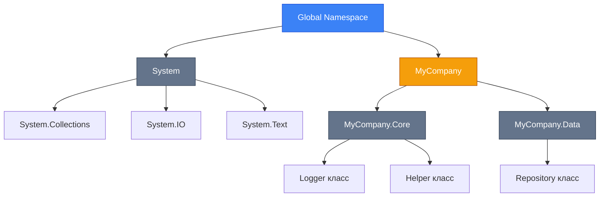

# Namespaces (Простори Імен)

::note
**Передумови**: Рекомендується ознайомитись з [основами C# програм](/csharp/fundamentals/program-structure) та [класами і об'єктами](/csharp/oop/classes-objects) перед вивченням цього розділу.
::

## Навіщо це потрібно?

У мові програмування C#, простори імен (namespaces) відіграють ключову роль у структуруванні коду, особливо в великих проєктах. Вони дозволяють логічно групувати пов'язані типи (класи, інтерфейси, структури, переліки), що робить код більш організованим, читабельним і підтримуваним.

Без просторів імен, всі типи в проєкті існували б в одному "глобальному" просторі, що призводило б до конфліктів імен, особливо при інтеграції з різними бібліотеками. Уявіть собі великий проєкт, де кожен клас має унікальне ім'я, що починається з префікса, наприклад, `MyCompanyMyProjectUserService` — це було б незручно і важко для читання.

Простори імен надають "іменовані область" для типів, що дозволяє використовувати коротші, зрозуміліші імена, які мають контекст. Наприклад, `System.Collections.Generic.List<T>` і `System.Collections.ArrayList` — обидва типи списків, але вони в різних просторах імен, що вказує на їхню різну природу та використання.

Уявіть, що ви працюєте над великим enterprise проєктом з десятками розробників. У вашій команді є два програмісти, які незалежно створили клас `Logger`:

```csharp showLineNumbers
// Розробник А створив свій Logger
public class Logger
{
    public void Log(string message)
    {
        File.AppendText("app.log");
    }
}

// Розробник В теж створив Logger
public class Logger
{
    public void Log(string message)
    {
        Console.WriteLine(message);
    }
}
```

Що станеться при компіляції? **Конфлікт імен!** Компілятор не знатиме, який `Logger` ви маєте на увазі.

Саме для цього існують **Namespaces** (Простори імен) — механізм організації коду, який:

-   🗂️ **Структурує код** у логічні групи
-   🚫 **Запобігає конфліктам** імен класів та методів
-   🔍 **Полегшує пошук** типів у великих проєктах
-   📦 **Організовує бібліотеки** за функціональністю

## Що таке Namespace?

Простір імен (namespace) у C# — це контейнер, який організовує набір іменованих елементів, таких як класи, інтерфейси, структури, переліки та інші простори імен. Він використовується для організації коду в логічні групи, щоб уникнути конфліктів імен і полегшити пошук та використання типів.

З технічної точки зору, простір імен не впливає на виконання коду, тобто він не додає жодних операцій під час виконання. Він є виключно організаційною одиницею на етапі компіляції. Всі типи, які ви оголошуєте, автоматично належать до якогось простору імен — якщо ви не вказуєте його явно, то тип потрапляє в глобальний простір імен (global namespace).

Простори імен можуть бути вкладеними, створюючи ієрархічну структуру, що дозволяє ще краще організувати код. Наприклад, `System.Collections.Generic` — це вкладений простір імен у `System.Collections`, який у свою чергу вкладений у `System`.

[**Namespace** (простір імен)](https://learn.microsoft.com/en-us/dotnet/csharp/fundamentals/types/namespaces) — це логічний контейнер для груп типів (класів, інтерфейсів, структур, enum'ів). Це як папка для організації файлів, але на рівні коду.

::mermaid



::

### Fully Qualified Names

Fully Qualified Name (FQN) — це повне ім'я типу, яке включає всі вкладені простори імен, в яких він визначений. FQN дозволяє однозначно ідентифікувати тип у будь-якій частині проєкту, навіть якщо ви не використовуєте директиву `using`.

Наприклад, повне ім'я класу `List<T>` з .NET BCL — `System.Collections.Generic.List<T>`. Це ім'я складається з трьох частин: `System`, `Collections`, `Generic` — це простори імен, і `List<T>` — це ім'я самого класу.

Використання FQN може бути корисним у ситуаціях, коли ви маєте конфлікт імен і хочете явно вказати, який саме тип ви маєте на увазі. Також FQN використовується компілятором і відображається в більшості метаданих типів, наприклад, у рефлекторах або при отриманні імені типу під час виконання за допомогою `typeof(MyClass).FullName`.

```csharp showLineNumbers
// Fully Qualified Name: System.Text.StringBuilder
System.Text.StringBuilder builder = new System.Text.StringBuilder();

// Fully Qualified Name: System.Collections.Generic.List<T>
System.Collections.Generic.List<int> numbers = new System.Collections.Generic.List<int>();
```

Але писати повні імена щоразу — незручно. Тому використовують [**using директиви**](https://learn.microsoft.com/en-us/dotnet/csharp/language-reference/keywords/using-directive):

```csharp showLineNumbers
using System.Text;
using System.Collections.Generic;

// Тепер можна використовувати короткі імена
StringBuilder builder = new StringBuilder();
List<int> numbers = new List<int>();
```

## Оголошення Просторів Імен

### Block-Scoped Namespaces (Традиційний)

Традиційний синтаксис використовує фігурні дужки для визначення області namespace:

```csharp [Logger.cs] showLineNumbers
using System;

namespace MyCompany.Logging
{
    public class Logger
    {
        public void Log(string message)
        {
            Console.WriteLine($"[{DateTime.Now}] {message}");
        }
    }

    public class FileLogger
    {
        public void LogToFile(string message)
        {
            // Implementation
        }
    }
}
```

**Характеристики:**

-   Всі типи всередині `{ }` належать до namespace
-   Можна оголосити кілька namespace у одному файлі
-   Додає один рівень вкладеності (indent)

### File-Scoped Namespaces (Сучасний, C# 10+)

**File-scoped namespace** — це спрощений синтаксис, де весь файл автоматично належить до одного namespace:

```csharp [Logger.cs] showLineNumbers
using System;

namespace MyCompany.Logging;

public class Logger
{
    public void Log(string message)
    {
        Console.WriteLine($"[{DateTime.Now}] {message}");
    }
}

public class FileLogger
{
    public void LogToFile(string message)
    {
        // Implementation
    }
}
```

**Переваги:**

-   ✅ Менше вкладеності — код легше читати
-   ✅ Економія горизонтального простору
-   ✅ Краща читабельність у великих файлах
-   ✅ Рекомендується Microsoft як best practice

::tip
**Best Practice**: Використовуйте **file-scoped namespaces** для нових проєктів на C# 10+. Це робить код чистішим і зменшує рівень вкладеності.
::

### Порівняння Підходів

::code-group

```csharp [Block-Scoped (Legacy)]
using System;
using System.Collections.Generic;

namespace MyCompany.Services
{
    public class UserService
    {
        private readonly List<string> _users;

        public UserService()
        {
            _users = new List<string>();
        }

        public void AddUser(string user)
        {
            _users.Add(user);
        }
    }
}
```

```csharp [File-Scoped (Modern)]
using System;
using System.Collections.Generic;

namespace MyCompany.Services;

public class UserService
{
    private readonly List<string> _users;

    public UserService()
    {
        _users = new List<string>();
    }

    public void AddUser(string user)
    {
        _users.Add(user);
    }
}
```

::

### Nested Namespaces (Вкладені Простори Імен)

Namespaces можна вкладати один в одний для створення ієрархії:

::code-group

```csharp [Традиційний Синтаксис]
namespace MyCompany
{
    namespace Data
    {
        namespace Repositories
        {
            public class UserRepository
            {
                // Implementation
            }
        }
    }
}
```

```csharp [Скорочений Синтаксис (Рекомендовано)]
namespace MyCompany.Data.Repositories;

public class UserRepository
{
    // Implementation
}
```

::

::warning
**File-Scoped Обмеження**: В одному файлі можна використовувати лише **один** file-scoped namespace. Якщо потрібно кілька namespace у файлі, використовуйте block-scoped синтаксис (хоча це рідкий випадок).
::

## Using Директиви

[**Using директиви**](https://learn.microsoft.com/en-us/dotnet/csharp/language-reference/keywords/using-directive) дозволяють імпортувати namespaces та їх вміст без необхідності писати повні імена.

### Стандартна Using Directive

Імпортує всі типи з namespace:

```csharp showLineNumbers
using System;
using System.Collections.Generic;
using System.Linq;

// Тепер можна використовувати типи без префіксу
List<int> numbers = new List<int> { 1, 2, 3, 4, 5 };
var evenNumbers = numbers.Where(n => n % 2 == 0);
Console.WriteLine(string.Join(", ", evenNumbers));
```

**Порядок Using Директив:**

::tip
**Coding Convention**: Розміщуйте `using` директиви за таким порядком:

1. **System** namespaces (впорядковані за алфавітом)
2. **Third-party libraries** (впорядковані за алфавітом)
3. **Project namespaces** (впорядковані за алфавітом)

Це покращує читабельність та допомагає уникати конфліктів.
::

```csharp showLineNumbers
// 1. System namespaces
using System;
using System.Collections.Generic;
using System.Linq;

// 2. Third-party libraries
using Newtonsoft.Json;
using Serilog;

// 3. Project namespaces
using MyCompany.Core;
using MyCompany.Data;

namespace MyCompany.Services;

public class ProductService
{
    // Implementation
}
```

### Static Using (C# 6+)

[**Static using**](https://learn.microsoft.com/en-us/dotnet/csharp/language-reference/keywords/using-directive#static-modifier) дозволяє імпортувати **статичні члени** класу без необхідності вказувати ім'я класу:

```csharp [MathExample.cs] showLineNumbers
using static System.Math;
using static System.Console;

namespace Calculator;

public class ScientificCalculator
{
    public void CalculateCircleArea(double radius)
    {
        // Раніше: double area = Math.PI * Math.Pow(radius, 2);
        double area = PI * Pow(radius, 2);

        // Раніше: Console.WriteLine($"Area: {area}");
        WriteLine($"Area: {area}");
    }

    public double GetHypotenuse(double a, double b)
    {
        // Раніше: return Math.Sqrt(Math.Pow(a, 2) + Math.Pow(b, 2));
        return Sqrt(Pow(a, 2) + Pow(b, 2));
    }
}
```

**Корисні Static Usings:**

```csharp showLineNumbers
using static System.Math;              // PI, Sqrt, Pow, Sin, Cos
using static System.Console;           // WriteLine, ReadLine, Clear
using static System.Environment;       // NewLine, Exit
using static System.String;            // IsNullOrEmpty, Join, Format
```

::warning
**Обережно**: Надмірне використання `static using` може знизити читабельність коду. Використовуйте лише для часто використовуваних статичних членів (наприклад, `Math`, `Console`).
::

### Global Using (C# 10+)

[**Global using**](https://learn.microsoft.com/en-us/dotnet/csharp/language-reference/keywords/using-directive#global-modifier) дозволяє імпортувати namespace **для всього проєкту**, а не лише для одного файлу:

```csharp [GlobalUsings.cs] showLineNumbers
// Ці using будуть доступні у ВСІХ файлах проєкту
global using System;
global using System.Collections.Generic;
global using System.Linq;
global using System.Threading.Tasks;
```

**Правила:**

-   `global using` директиви мають бути **до будь-яких інших using**
-   Зазвичай розміщуються в окремому файлі `GlobalUsings.cs`
-   Не можуть бути всередині namespace

**Структура Проєкту з Global Usings:**

::code-tree

```csharp [GlobalUsings.cs]
// Глобальні using для всього проєкту
global using System;
global using System.Collections.Generic;
global using System.Linq;
global using System.Threading.Tasks;
```

```csharp [Program.cs]
namespace MyProject;

public class Program
{
    public static void Main(string[] args)
    {
        Console.WriteLine("Hello, World!");
    }
}
```

```csharp [Services/UserService.cs]
namespace MyProject.Services;

public class UserService
{
    private readonly List<string> _users = new();

    public void AddUser(string userName)
    {
        _users.Add(userName);
    }
}
```

```csharp [Services/ProductService.cs]
namespace MyProject.Services;

public class ProductService
{
    private readonly List<string> _products = new();

    public void AddProduct(string productName)
    {
        _products.Add(productName);
    }
}
```

::

::code-group

```csharp [GlobalUsings.cs]
// Глобальні using для всього проєкту
global using System;
global using System.Collections.Generic;
global using System.Linq;
global using System.Threading.Tasks;

// Можна комбінувати з static using
global using static System.Console;
global using static System.Math;

// Власні namespaces теж можна зробити глобальними
global using MyCompany.Core;
global using MyCompany.Data;
```

```csharp [UserService.cs]
// Немає потреби імпортувати System, List, Linq тощо
// Вони вже доступні через GlobalUsings.cs
namespace MyCompany.Services;

public class UserService
{
    private readonly List<string> _users = new();

    public async Task<IEnumerable<string>> GetActiveUsersAsync()
    {
        // Linq доступний без using System.Linq
        return await Task.FromResult(_users.Where(u => u.StartsWith("A")));
    }
}
```

::

### Implicit Usings (.NET 6+)

Починаючи з **.NET 6**, проєкти автоматично включають [**implicit usings**](https://learn.microsoft.com/en-us/dotnet/core/project-sdk/overview#implicit-using-directives) — набір найпоширеніших namespaces:

```xml [YourProject.csproj] {4}
<Project Sdk="Microsoft.NET.Sdk">
  <PropertyGroup>
    <TargetFramework>net8.0</TargetFramework>
    <ImplicitUsings>enable</ImplicitUsings>
    <Nullable>enable</Nullable>
  </PropertyGroup>
</Project>
```

**Автоматично включені namespaces** (залежить від типу проєкту):

| Namespace                                  | Console/Library | ASP.NET Core | Worker Service |
| :----------------------------------------- | :-------------: | :----------: | :------------: |
| `System`                                   |       ✅        |      ✅      |       ✅       |
| `System.Collections.Generic`               |       ✅        |      ✅      |       ✅       |
| `System.IO`                                |       ✅        |      ✅      |       ✅       |
| `System.Linq`                              |       ✅        |      ✅      |       ✅       |
| `System.Net.Http`                          |       ✅        |      ✅      |       ✅       |
| `System.Threading`                         |       ✅        |      ✅      |       ✅       |
| `System.Threading.Tasks`                   |       ✅        |      ✅      |       ✅       |
| `Microsoft.AspNetCore.Builder`             |       ❌        |      ✅      |       ❌       |
| `Microsoft.AspNetCore.Hosting`             |       ❌        |      ✅      |       ❌       |
| `Microsoft.Extensions.Hosting`             |       ❌        |      ❌      |       ✅       |
| `Microsoft.Extensions.DependencyInjection` |       ❌        |      ✅      |       ✅       |

::tip
**Налаштування Implicit Usings**: Якщо хочете додати власні global usings через `.csproj`:

```xml
<ItemGroup>
  <Using Include="MyCompany.Core" />
  <Using Include="System.Text.Json" />
  <Using Include="Serilog" />
</ItemGroup>
```

::

### Порівняння Типів Using Директив

| Тип Using           | Область Дії        | Синтаксис                           | Коли Використовувати                        |
| :------------------ | :----------------- | :---------------------------------- | :------------------------------------------ |
| **Using Directive** | Один файл          | `using System.Collections.Generic;` | Для імпорту namespace у конкретний файл     |
| **Static Using**    | Один файл          | `using static System.Math;`         | Для частого виклику статичних методів       |
| **Global Using**    | Весь проєкт        | `global using System.Linq;`         | Для namespaces, які використовуються скрізь |
| **Implicit Usings** | Весь проєкт (авто) | Автоматично через `.csproj`         | Для стандартних System namespaces           |

## Alias Директиви

[**Alias** (аліас, псевдонім)](https://learn.microsoft.com/en-us/dotnet/csharp/language-reference/keywords/using-directive#using-alias) дозволяє створити коротше ім'я для namespace або типу.

### Alias для Namespace

Корисно для довгих або конфліктних namespaces:

```csharp showLineNumbers
using Project = MyCompany.ProjectManagement;
using Reporting = MyCompany.Reports.Generation;

namespace MyCompany.Services;

public class TaskService
{
    public void CreateTask()
    {
        // Замість: MyCompany.ProjectManagement.Task task = new();
        Project.Task task = new Project.Task();

        // Замість: MyCompany.Reports.Generation.Report report = new();
        Reporting.Report report = new Reporting.Report();
    }
}
```

### Alias для Типів

Можна створити аліас безпосередньо для конкретного типу:

```csharp showLineNumbers
using StringBuilder = System.Text.StringBuilder;
using StringList = System.Collections.Generic.List<string>;

namespace MyCompany.Utilities;

public class TextProcessor
{
    public void ProcessText()
    {
        // Використання аліасів
        StringBuilder builder = new StringBuilder();
        StringList words = new StringList { "Hello", "World" };

        foreach (var word in words)
        {
            builder.Append(word).Append(" ");
        }
    }
}
```

### Alias для Generic Типів (C# 12+)

Починаючи з **C# 12**, можна створювати аліаси для складних generic типів:

```csharp showLineNumbers
using IntList = System.Collections.Generic.List<int>;
using StringDict = System.Collections.Generic.Dictionary<string, string>;
using UserMap = System.Collections.Generic.Dictionary<int, System.Collections.Generic.List<string>>;

namespace MyCompany.Data;

public class DataService
{
    private IntList _numbers = new();
    private StringDict _config = new();
    private UserMap _userTags = new(); // Dictionary<int, List<string>>

    public void AddUserTag(int userId, string tag)
    {
        if (!_userTags.ContainsKey(userId))
        {
            _userTags[userId] = new List<string>();
        }
        _userTags[userId].Add(tag);
    }
}
```

### Alias для Tuple Типів (C# 12+)

```csharp showLineNumbers
global using Coordinates = (double Latitude, double Longitude);
global using BandPass = (int Min, int Max);

namespace MyCompany.Models;

public class LocationService
{
    public Coordinates GetLocation()
    {
        return (50.4501, 30.5234); // Київ
    }

    public BandPass GetFrequencyRange()
    {
        return (20, 20000); // Hz
    }
}
```

### Qualified Alias Member Operator (::)

[Оператор **`::`**](https://learn.microsoft.com/en-us/dotnet/csharp/language-reference/operators/namespace-alias-qualifier) дозволяє **явно** вказати, що ви звертаєтесь до аліаса, а не до типу:

```csharp showLineNumbers
using Col = System.Collections;

namespace MyCompany
{
    // Уявімо, що у нас є локальний тип Collections
    public class Collections
    {
        public void DoSomething() { }
    }

    public class Example
    {
        public void Test()
        {
            // Без :: компілятор може заплутатись
            // Collections obj1 = new(); // Який Collections?

            // Явне вказання через ::
            Col::ArrayList list = new Col::ArrayList(); // Чітко аліас
            Collections local = new Collections();       // Локальний тип
        }
    }
}
```

### Global Namespace (global::)

[**`global::`**](https://learn.microsoft.com/en-us/dotnet/csharp/language-reference/operators/namespace-alias-qualifier#the-global-namespace-alias) дозволяє звернутися до **глобального namespace**, обминаючи локальні типи:

```csharp [ConflictExample.cs] showLineNumbers
namespace MyCompany
{
    // Локальний клас Console
    public class Console
    {
        public static void WriteLine(string message)
        {
            // Наша імплементація
        }
    }

    public class Program
    {
        public static void Main()
        {
            // Виклик НАШОГО Console
            Console.WriteLine("Local");

            // Виклик System.Console через global::
            global::System.Console.WriteLine("System");
        }
    }
}
```

## Best Practices (Кращі Практики)

### 1. Naming Conventions

::tip
**Namespace Naming Guidelines**:

-   Використовуйте **PascalCase**
-   Формат: `<Company>.<Product>.<Feature>[.<SubNamespace>]`
-   Не використовуйте підкреслення або спеціальні символи
-   Уникайте дублювання імен класів у namespace

**Приклади:**

-   ✅ `MyCompany.Ecommerce.Orders`
-   ✅ `MyCompany.Ecommerce.Payments.Cards`
-   ❌ `mycompany.ecommerce.orders` (не PascalCase)
-   ❌ `MyCompany.Order.Order` (дублювання імен)

::

### 2. Організація Файлової Структури

Структура папок має **відображати** структуру namespaces:

## ::code-tree

data:

-   name: MyCompany.Ecommerce
    children:
    -   name: Orders
        children:
        -   name: OrderService.cs
            icon: i-vscode-icons-file-type-csharp2
        -   name: OrderRepository.cs
            icon: i-vscode-icons-file-type-csharp2
    -   name: Payments
        children:
        -   name: Cards
            children:
            -   name: CardProcessor.cs
                icon: i-vscode-icons-file-type-csharp2
        -   name: PaymentService.cs
            icon: i-vscode-icons-file-type-csharp2

---

::

```csharp [OrderService.cs]
// Namespace відповідає шляху: Orders/OrderService.cs
namespace MyCompany.Ecommerce.Orders;

public class OrderService
{
    // Implementation
}
```

```csharp [CardProcessor.cs]
// Namespace відповідає шляху: Payments/Cards/CardProcessor.cs
namespace MyCompany.Ecommerce.Payments.Cards;

public class CardProcessor
{
    // Implementation
}
```

### 3. Використання Global Usings

::tip
**Рекомендації для Global Using**:

✅ **Використовуйте для:**

-   Стандартних System namespaces (`System`, `System.Linq`)
-   Namespaces, які використовуються у 70%+ файлів
-   Infrastructure namespaces (`Microsoft.Extensions.Logging`)

❌ **Не використовуйте для:**

-   Рідко використовуваних namespaces
-   Domain-specific namespaces
-   Test frameworks (краще явно у тестах)

::

### 4. Один Type = Один Файл

```csharp [UserService.cs]
// ✅ ПРАВИЛЬНО: Один клас у файлі
namespace MyCompany.Services;

public class UserService
{
    // Implementation
}
```

```csharp [Services.cs]
// ❌ НЕПРАВИЛЬНО: Кілька класів у одному файлі
namespace MyCompany.Services;

public class UserService { }
public class ProductService { }
public class OrderService { }
```

**Виняток**: Невеликі допоміжні класи (records, helpers) можуть бути у тому ж файлі.

### 5. Уникання Надмірної Вкладеності

```csharp
// ❌ ПОГАНО: Занадто глибока вкладеність
namespace MyCompany.Ecommerce.Orders.Processing.Validation.Rules.Complex;

// ✅ КРАЩЕ: Оптимальна глибина (2-4 рівні)
namespace MyCompany.Ecommerce.Orders.Validation;
```

## Troubleshooting (Вирішення Проблем)

### Проблема 1: Конфлікт Імен

**Симптоми:**

```csharp
// Compiler Error CS0104: Ambiguous reference
Console.WriteLine("Hello");
```

Це трапляється, коли два різні namespace містять тип з однаковим ім'ям.

**Рішення:**

::steps

#### Використати Fully Qualified Name

```csharp showLineNumbers
// Явно вказати, який саме Console
System.Console.WriteLine("Hello from System");
MyCompany.Console.WriteLine("Hello from MyCompany");
```

#### Використати Alias

```csharp showLineNumbers
using SystemConsole = System.Console;
using MyConsole = MyCompany.Console;

SystemConsole.WriteLine("Hello from System");
MyConsole.WriteLine("Hello from MyCompany");
```

#### Видалити Конфліктуючий Using

```csharp showLineNumbers
// using MyCompany; // Закоментувати або видалити

System.Console.WriteLine("Hello");
```

::

### Проблема 2: CS1671 — Модифікатори у Namespace

**Помилка:**

```csharp
// CS1671: A namespace declaration cannot have modifiers or attributes
public namespace MyCompany.Services; // ❌ ПОМИЛКА
```

**Рішення:**

```csharp
// ✅ ПРАВИЛЬНО: Namespace не може мати модифікаторів доступу
namespace MyCompany.Services;
```

### Проблема 3: CS0576 / CS1537 — Конфлікт Alias

**Помилка:**

```csharp
using Project = MyCompany.ProjectManagement;

namespace MyCompany
{
    // CS0576: Namespace contains a definition conflicting with alias 'Project'
    public class Project { } // ❌ Конфлікт з аліасом
}
```

**Рішення:**

```csharp
// Перейменувати аліас або клас
using ProjectNS = MyCompany.ProjectManagement;

namespace MyCompany
{
    public class Project { } // ✅ Тепер немає конфлікту
}
```

### Проблема 4: Global Using після Non-Global

**Помилка:**

```csharp
using System.Linq; // Non-global

global using System; // ❌ CS8915: Global using must come before non-global
```

**Рішення:**

```csharp
// ✅ ПРАВИЛЬНО: Global завжди першими
global using System;

using System.Linq;
```

### Проблема 5: File-Scoped Namespace після Іншого Namespace

**Помилка:**

```csharp
namespace MyCompany.A
{
    // ...
}

namespace MyCompany.B; // ❌ CS8956: File-scoped namespace must be first

public class MyClass { }
```

**Рішення:**

Використовуйте або тільки file-scoped (один namespace), або тільки block-scoped (кілька namespaces):

```csharp
// ✅ Варіант 1: Один file-scoped namespace
namespace MyCompany.B;

public class MyClass { }
```

```csharp
// ✅ Варіант 2: Кілька block-scoped namespaces
namespace MyCompany.A
{
    public class ClassA { }
}

namespace MyCompany.B
{
    public class ClassB { }
}
```

## Практичні Завдання

### Завдання 1: Організація Проєкту (Легкий)

**Мета**: Створити структуру namespaces для простого консольного додатку.

**Опис**: Ви створюєте систему управління бібліотекою книг. Вам потрібно організувати код у логічні простори імен.

**Вимоги**:

1. Створіть namespace `Library.Models` для моделей даних (`Book`, `Author`)
2. Створіть namespace `Library.Services` для бізнес-логіки (`BookService`)
3. Використайте file-scoped namespaces
4. Додайте appropriateusing директиви

**Початковий Код:**

::code-group

```csharp [Book.cs]
public class Book
{
    public string Title { get; set; }
    public string ISBN { get; set; }
    public List<string> Authors { get; set; }
}
```

```csharp [BookService.cs]
public class BookService
{
    private List<Book> _books = new();

    public void AddBook(Book book)
    {
        _books.Add(book);
    }

    public List<Book> SearchByTitle(string title)
    {
        return _books.Where(b => b.Title.Contains(title)).ToList();
    }
}
```

::

::collapsible{title="Рішення Завдання 1"}

::code-group

```csharp [Models/Book.cs]
using System.Collections.Generic;

namespace Library.Models;

public class Book
{
    public string Title { get; set; } = string.Empty;
    public string ISBN { get; set; } = string.Empty;
    public List<string> Authors { get; set; } = new();
}
```

```csharp [Services/BookService.cs]
using System.Collections.Generic;
using System.Linq;
using Library.Models;

namespace Library.Services;

public class BookService
{
    private readonly List<Book> _books = new();

    public void AddBook(Book book)
    {
        _books.Add(book);
    }

    public List<Book> SearchByTitle(string title)
    {
        return _books
            .Where(b => b.Title.Contains(title, StringComparison.OrdinalIgnoreCase))
            .ToList();
    }
}
```

```csharp [Program.cs]
using Library.Models;
using Library.Services;

namespace Library;

public class Program
{
    public static void Main()
    {
        var service = new BookService();

        service.AddBook(new Book
        {
            Title = "Clean Code",
            ISBN = "978-0132350884",
            Authors = new List<string> { "Robert C. Martin" }
        });

        var results = service.SearchByTitle("Clean");
        Console.WriteLine($"Found {results.Count} books");
    }
}
```

::

**Пояснення:**

-   Використано file-scoped namespaces для чистоти коду
-   Структура папок відповідає namespaces
-   Додано необхідні using директиви
-   `BookService` імпортує `Library.Models` для доступу до `Book`

::

### Завдання 2: Global Using та Рефакторинг (Середній)

**Мета**: Оптимізувати проєкт використовуючи global using директиви.

**Опис**: У вас є проєкт із десятками файлів, де кожен файл імпортує однакові namespaces. Ваше завдання — створити `GlobalUsings.cs` та використати static using для спрощення коду.

**Початкова Структура:**

::code-group

```csharp [Services/UserService.cs]
using System;
using System.Collections.Generic;
using System.Linq;
using System.Threading.Tasks;

namespace MyApp.Services;

public class UserService
{
    public async Task<List<string>> GetActiveUsersAsync()
    {
        await Task.Delay(100);
        return new List<string> { "Alice", "Bob" };
    }
}
```

```csharp [Services/ProductService.cs]
using System;
using System.Collections.Generic;
using System.Linq;
using System.Threading.Tasks;

namespace MyApp.Services;

public class ProductService
{
    public async Task<List<string>> GetProductsAsync()
    {
        await Task.Delay(100);
        return new List<string> { "Laptop", "Mouse" };
    }
}
```

```csharp [Utils/MathHelper.cs]
using System;

namespace MyApp.Utils;

public static class MathHelper
{
    public static double CalculateCircleArea(double radius)
    {
        return Math.PI * Math.Pow(radius, 2);
    }
}
```

::

**Завдання**:

1. Створіть `GlobalUsings.cs` з global using директивами для повторюваних namespaces
2. Використайте `static using` для `System.Math`
3. Видаліть дублюючі using із файлів

::collapsible{title="Рішення Завдання 2"}

::code-group

```csharp [GlobalUsings.cs]
// Глобальні using для всього проєкту
global using System;
global using System.Collections.Generic;
global using System.Linq;
global using System.Threading.Tasks;

// Static using для Math
global using static System.Math;

// Static using для Console (якщо потрібно)
global using static System.Console;
```

```csharp [Services/UserService.cs]
// Всі using тепер глобальні - можна видалити
namespace MyApp.Services;

public class UserService
{
    public async Task<List<string>> GetActiveUsersAsync()
    {
        await Task.Delay(100);
        return new List<string> { "Alice", "Bob" };
    }
}
```

```csharp [Services/ProductService.cs]
namespace MyApp.Services;

public class ProductService
{
    public async Task<List<string>> GetProductsAsync()
    {
        await Task.Delay(100);
        return new List<string> { "Laptop", "Mouse" };
    }
}
```

```csharp [Utils/MathHelper.cs]
namespace MyApp.Utils;

public static class MathHelper
{
    public static double CalculateCircleArea(double radius)
    {
        // Використання PI та Pow без Math. префікса
        return PI * Pow(radius, 2);
    }

    public static double CalculateDistance(double x1, double y1, double x2, double y2)
    {
        // Sqrt також доступний без префікса
        return Sqrt(Pow(x2 - x1, 2) + Pow(y2 - y1, 2));
    }
}
```

::

**Переваги:**

-   🔄 Код став чистішим — немає повторюваних using
-   📉 Зменшено boilerplate код
-   ✨ Математичні вирази легше читати без `Math.` префікса

**Примітка:** Переконайтесь, що `GlobalUsings.cs` включено в компіляцію проєкту.

::

### Завдання 3: Вирішення Конфліктів Імен (Складний)

**Мета**: Вирішити складні конфлікти namespace та типів використовуючи аліаси та qualified names.

**Опис**: Ви інтегруєте дві сторонні бібліотеки, які містять класи з однаковими іменами. Вам потрібно вирішити конфлікти та забезпечити коректну роботу обох бібліотек.

**Сценарій:**

Уявімо, що ви маєте:

-   **Бібліотека A**: `CompanyA.Logging.Logger`
-   **Бібліотека B**: `CompanyB.Diagnostics.Logger`
-   **Ваш проєкт**: також має власний `MyApp.Logging.Logger`

**Початковий Код (з конфліктами):**

```csharp [LoggingService.cs] showLineNumbers
using CompanyA.Logging;
using CompanyB.Diagnostics;
using MyApp.Logging;

namespace MyApp.Services;

public class LoggingService
{
    public void LogMessages()
    {
        // ❌ CS0104: 'Logger' is an ambiguous reference
        Logger fileLogger = new Logger();
        Logger consoleLogger = new Logger();
        Logger customLogger = new Logger();
    }
}
```

**Завдання**:

1. Вирішіть конфлікт імен використовуючи аліаси
2. Створіть метод, який використовує всі три типи Logger
3. Додайте коментарі, які пояснюють, який Logger використовується

::collapsible{title="Рішення Завдання 3"}

```csharp [LoggingService.cs] showLineNumbers
// Створюємо аліаси для конфліктуючих типів
using FileLogger = CompanyA.Logging.Logger;
using DiagLogger = CompanyB.Diagnostics.Logger;
using AppLogger = MyApp.Logging.Logger;

namespace MyApp.Services;

public class LoggingService
{
    private readonly FileLogger _fileLogger;
    private readonly DiagLogger _diagLogger;
    private readonly AppLogger _appLogger;

    public LoggingService()
    {
        // Використання аліасів для розрізнення типів
        _fileLogger = new FileLogger();   // CompanyA.Logging.Logger
        _diagLogger = new DiagLogger();   // CompanyB.Diagnostics.Logger
        _appLogger = new AppLogger();     // MyApp.Logging.Logger
    }

    public void LogToAll(string message)
    {
        // Логування у всі три системи
        _fileLogger.WriteToFile(message);      // Лог у файл (CompanyA)
        _diagLogger.WriteToDiagnostics(message); // Лог у diagnostics (CompanyB)
        _appLogger.WriteToCustomLog(message);    // Лог у власну систему
    }

    public void DemonstrateQualifiedAccess()
    {
        // Альтернатива: Fully Qualified Names без аліасів
        var logger1 = new CompanyA.Logging.Logger();
        var logger2 = new CompanyB.Diagnostics.Logger();
        var logger3 = new MyApp.Logging.Logger();

        logger1.WriteToFile("From CompanyA");
        logger2.WriteToDiagnostics("From CompanyB");
        logger3.WriteToCustomLog("From MyApp");
    }
}
```

**Альтернативне Рішення з Global Namespace:**

```csharp [LoggingServiceAdvanced.cs] showLineNumbers
using CompanyALog = CompanyA.Logging;
using CompanyBLog = CompanyB.Diagnostics;

namespace MyApp.Services;

public class LoggingServiceAdvanced
{
    public void LogMessages()
    {
        // Використання аліаса namespace
        var fileLogger = new CompanyALog.Logger();
        var diagLogger = new CompanyBLog.Logger();

        // Використання global:: для власного Logger
        var appLogger = new global::MyApp.Logging.Logger();

        fileLogger.WriteToFile("Message 1");
        diagLogger.WriteToDiagnostics("Message 2");
        appLogger.WriteToCustomLog("Message 3");
    }
}
```

**Ключові Техніки:**

-   ✅ **Type Aliases**: Найчистіше рішення для частого використання
-   ✅ **Namespace Aliases**: Корисно, коли потрібно використовувати кілька типів із namespace
-   ✅ **Fully Qualified Names**: Краще для одноразового використання
-   ✅ **global::** оператор: Гарантує доступ до глобального namespace

::

## Резюме

**Namespaces** — це потужний інструмент організації коду в C#, який:

-   🗂️ **Структурує** код у логічні групи та запобігає конфліктам імен
-   📦 **Організовує** великі проєкти через ієрархічну структуру
-   🚀 **Спрощує** доступ до типів через using директиви
-   ✨ **Покращує** читабельність коду (file-scoped, global using, static using)

**Ключові Концепції:**

1. **File-Scoped Namespaces** — сучасний рекомендований підхід (C# 10+)
2. **Global Using** — дозволяє імпортувати namespace для всього проєкту
3. **Static Using** — спрощує виклик статичних членів
4. **Aliases** — вирішують конфлікти імен та спрощують складні типи
5. **Qualified Operator (::)** — забезпечує точний доступ до типів

**Best Practices:**

-   Використовуйте file-scoped namespaces для нових проєктів
-   Розміщуйте global using у окремому `GlobalUsings.cs`
-   Дотримуйтесь naming conventions: `Company.Product.Feature`
-   Структура папок має відповідати namespaces
-   Один тип = один файл
