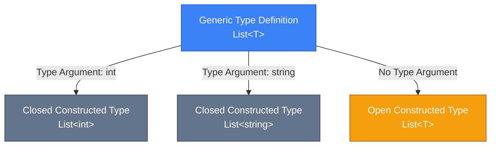
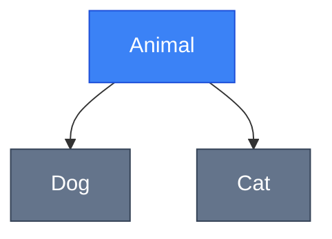

# [Generics (Узагальнення)](https://learn.microsoft.com/en-us/dotnet/csharp/fundamentals/types/generics)

::note
**Передумови**: Рекомендується ознайомитись з [класами та об'єктами](/csharp/oop/classes-objects), [інтерфейсами](/csharp/oop/oop-pillars#abstraction) та [делегатами](/csharp/advanced-core/delegates-events-lambdas) перед вивченням цього розділу.
::

## Навіщо це потрібно?

Уявіть, що вам потрібно створити стек (stack) для зберігання цілих чисел:

```csharp showLineNumbers
public class IntStack
{
    private int[] _items = new int[100];
    private int _count = 0;

    public void Push(int item)
    {
        _items[_count++] = item;
    }

    public int Pop()
    {
        return _items[--_count];
    }
}
```

Чудово! Але що, якщо вам потрібен стек для рядків? Доведеться створити ще один клас:

```csharp showLineNumbers
public class StringStack
{
    private string[] _items = new string[100];
    private int _count = 0;

    public void Push(string item)
    {
        _items[_count++] = item;
    }

    public string Pop()
    {
        return _items[--_count];
    }
}
```

А якщо потрібен стек для `Customer`, `Order`, `Product`? **Дублювання коду!**

До появи generics у .NET 2.0, розробники використовували `object`:

```csharp showLineNumbers
public class ObjectStack
{
    private object[] _items = new object[100];
    private int _count = 0;

    public void Push(object item)
    {
        _items[_count++] = item;
    }

    public object Pop()
    {
        return _items[--_count];
    }
}

// Використання
ObjectStack stack = new ObjectStack();
stack.Push(42);
int value = (int)stack.Pop(); // ❌ Необхідний cast
stack.Push("Hello");
int broken = (int)stack.Pop(); // ❌ Runtime помилка!
```

**Проблеми підходу з `object`:**

-   🚫 **Немає type safety** — можна додати будь-який тип
-   🐌 **Performance overhead** — boxing/unboxing для value types
-   💥 **Runtime errors** — помилки виявляються лише під час виконання

**Generics вирішують ці проблеми:**

```csharp showLineNumbers
public class Stack<T>
{
    private T[] _items = new T[100];
    private int _count = 0;

    public void Push(T item)
    {
        _items[_count++] = item;
    }

    public T Pop()
    {
        return _items[--_count];
    }
}

// Використання
Stack<int> intStack = new Stack<int>();
intStack.Push(42);
int value = intStack.Pop(); // ✅ Без cast

Stack<string> stringStack = new Stack<string>();
stringStack.Push("Hello");
// stringStack.Push(42); // ❌ Compile-time помилка!
```

**Переваги Generics:**

-   ✅ **Type Safety** — помилки виявляються на етапі компіляції
-   ✅ **Code Reuse** — один клас для всіх типів
-   ✅ **Performance** — немає boxing/unboxing
-   ✅ **IntelliSense** — кращий автокомпліт у IDE

## Фундаментальні Концепції

### Type Parameters vs Type Arguments

[**Type Parameter** (параметр типу)](https://learn.microsoft.com/en-us/dotnet/csharp/programming-guide/generics/generic-type-parameters) — це placeholder у визначенні generic типу:

```csharp showLineNumbers
public class Box<T>  // T — це Type Parameter
{
    public T Value { get; set; }
}
```

**Type Argument** (аргумент типу) — це конкретний тип, яким замінюється параметр:

```csharp showLineNumbers
Box<int> intBox = new Box<int>();     // int — це Type Argument
Box<string> strBox = new Box<string>(); // string — це Type Argument
```

### Open vs Closed Constructed Types

::mermaid



::

-   **Open Constructed Type**: Generic тип без конкретних type arguments (`List<T>`)
-   **Closed Constructed Type**: Generic тип з конкретними type arguments (`List<int>`)

### Naming Conventions

::tip
**Best Practice**: Використовуйте ці conventions для параметрів типів:

-   **Single parameter**: `T` (наприклад, `List<T>`, `Queue<T>`)
-   **Multiple parameters**: Описові імена з префіксом `T`
    -   `TKey`, `TValue` (Dictionary<TKey, TValue>)
    -   `TInput`, `TOutput` (Converter<TInput, TOutput>)
    -   `TResult` (Func<T, TResult>)

Це робить код самодокументованим!
::

## Generic Classes

### Основний Синтаксис

```csharp [Repository.cs] showLineNumbers
public class Repository<T>
{
    private readonly List<T> _items = new List<T>();

    public void Add(T item)
    {
        _items.Add(item);
    }

    public T GetById(int id)
    {
        return _items[id];
    }

    public IEnumerable<T> GetAll()
    {
        return _items;
    }

    public void Remove(T item)
    {
        _items.Remove(item);
    }
}
```

**Використання:**

```csharp showLineNumbers
// Repository для різних типів
Repository<Customer> customers = new Repository<Customer>();
customers.Add(new Customer { Id = 1, Name = "Alice" });

Repository<Product> products = new Repository<Product>();
products.Add(new Product { Id = 1, Name = "Laptop" });
```

### Multiple Type Parameters

```csharp [KeyValueStore.cs] showLineNumbers
public class KeyValueStore<TKey, TValue>
{
    private readonly Dictionary<TKey, TValue> _storage = new();

    public void Set(TKey key, TValue value)
    {
        _storage[key] = value;
    }

    public TValue Get(TKey key)
    {
        return _storage[key];
    }

    public bool TryGet(TKey key, out TValue value)
    {
        return _storage.TryGetValue(key, out value);
    }
}
```

**Використання:**

```csharp showLineNumbers
var cache = new KeyValueStore<string, Customer>();
cache.Set("customer_1", new Customer { Name = "Bob" });

Customer customer = cache.Get("customer_1");
```

### Generic Properties та Fields

```csharp showLineNumbers
public class Result<T>
{
    // Generic property
    public T Data { get; set; }

    public bool IsSuccess { get; set; }
    public string ErrorMessage { get; set; }

    // Generic field
    private T _cachedValue;

    public T GetOrCache()
    {
        if (_cachedValue == null)
        {
            _cachedValue = Data;
        }
        return _cachedValue;
    }
}
```

### Static Members у Generic Classes

::warning
**Важливо**: Кожен **closed constructed type** має свої власні статичні члени!
::

```csharp showLineNumbers
public class Counter<T>
{
    private static int _count = 0;

    public static void Increment()
    {
        _count++;
    }

    public static int GetCount()
    {
        return _count;
    }
}

// Використання
Counter<int>.Increment();
Counter<int>.Increment();
Console.WriteLine(Counter<int>.GetCount());    // 2

Counter<string>.Increment();
Console.WriteLine(Counter<string>.GetCount()); // 1 (окремий лічильник!)
```

## Generic Methods

### Синтаксис Generic Methods

Generic методи можуть бути у **будь-якому** класі (generic або non-generic):

```csharp showLineNumbers
public class Utility
{
    // Generic метод у non-generic класі
    public static void Swap<T>(ref T a, ref T b)
    {
        T temp = a;
        a = b;
        b = temp;
    }

    public static T[] CreateArray<T>(int size, T defaultValue)
    {
        T[] array = new T[size];
        for (int i = 0; i < size; i++)
        {
            array[i] = defaultValue;
        }
        return array;
    }
}
```

**Використання:**

```csharp showLineNumbers
int x = 5, y = 10;
Utility.Swap<int>(ref x, ref y); // Явне вказання типу
Console.WriteLine($"x={x}, y={y}"); // x=10, y=5

string a = "Hello", b = "World";
Utility.Swap(ref a, ref b); // ✅ Type inference!
Console.WriteLine($"a={a}, b={b}"); // a=World, b=Hello
```

### Type Inference

Компілятор C# часто може **автоматично визначити** type arguments:

```csharp showLineNumbers
public static T Max<T>(T a, T b) where T : IComparable<T>
{
    return a.CompareTo(b) > 0 ? a : b;
}

// Явне вказання типу
int result1 = Max<int>(5, 10);

// Type inference — компілятор визначає тип з аргументів
int result2 = Max(5, 10);           // ✅ T виводиться як int
string result3 = Max("abc", "xyz"); // ✅ T виводиться як string
```

### Extension Methods з Generics

```csharp showLineNumbers
public static class EnumerableExtensions
{
    public static IEnumerable<T> WhereNot<T>(
        this IEnumerable<T> source,
        Func<T, bool> predicate)
    {
        return source.Where(x => !predicate(x));
    }

    public static T Second<T>(this IEnumerable<T> source)
    {
        return source.Skip(1).First();
    }
}

// Використання
var numbers = new[] { 1, 2, 3, 4, 5 };
var evenNumbers = numbers.WhereNot(n => n % 2 != 0); // Непарні виключені
int secondNumber = numbers.Second(); // 2
```

## Constraints (Обмеження)

[**Constraints**](https://learn.microsoft.com/en-us/dotnet/csharp/programming-guide/generics/constraints-on-type-parameters) дозволяють обмежити типи, які можна використовувати як type arguments.

### Primary Constraints

#### `where T : class` — Reference Type

```csharp showLineNumbers
public class ReferenceRepository<T> where T : class
{
    private T _cachedItem;

    public void Cache(T item)
    {
        _cachedItem = item; // ✅ Можна зберігати null
    }

    public bool IsCached()
    {
        return _cachedItem != null; // ✅ Перевірка на null
    }
}

// Використання
var repo = new ReferenceRepository<string>();  // ✅ OK
var repo2 = new ReferenceRepository<Customer>(); // ✅ OK
// var repo3 = new ReferenceRepository<int>(); // ❌ int — value type
```

#### `where T : class?` — Nullable Reference Type

```csharp showLineNumbers
public class NullableRepository<T> where T : class?
{
    public T? FindOrDefault(int id)
    {
        // Може повернути null
        return default(T);
    }
}
```

#### `where T : struct` — Value Type

```csharp showLineNumbers
public struct Point<T> where T : struct
{
    public T X { get; set; }
    public T Y { get; set; }

    public Point(T x, T y)
    {
        X = x;
        Y = y;
    }
}

// Використання
var intPoint = new Point<int>(10, 20);       // ✅ OK
var doublePoint = new Point<double>(1.5, 2.5); // ✅ OK
// var stringPoint = new Point<string>("", ""); // ❌ string — reference type
```

#### `where T : notnull` — Non-Nullable Type

Заборон використання nullable types:

```csharp showLineNumbers
public class NonNullProcessor<T> where T : notnull
{
    public void Process(T item)
    {
        // item гарантовано не null
        Console.WriteLine(item.ToString());
    }
}

// Використання
var processor1 = new NonNullProcessor<int>();    // ✅ OK
var processor2 = new NonNullProcessor<string>(); // ✅ OK (якщо NRT enabled)
// var processor3 = new NonNullProcessor<string?>(); // ❌ nullable
```

#### `where T : unmanaged` — Unmanaged Type

Тип, який не містить reference types (primitives, structs без reference fields):

```csharp showLineNumbers
public unsafe class UnsafeBuffer<T> where T : unmanaged
{
    private T* _buffer;
    private int _size;

    public UnsafeBuffer(int size)
    {
        _size = size;
        _buffer = (T*)Marshal.AllocHGlobal(size * sizeof(T));
    }

    public T this[int index]
    {
        get => _buffer[index];
        set => _buffer[index] = value;
    }
}

// Використання
var buffer1 = new UnsafeBuffer<int>(10);    // ✅ OK
var buffer2 = new UnsafeBuffer<double>(10); // ✅ OK
// var buffer3 = new UnsafeBuffer<string>(10); // ❌ string не unmanaged
```

#### `where T : new()` — Parameterless Constructor

```csharp showLineNumbers
public class Factory<T> where T : new()
{
    public T Create()
    {
        return new T(); // ✅ Можемо створювати екземпляри
    }

    public List<T> CreateMany(int count)
    {
        var list = new List<T>();
        for (int i = 0; i < count; i++)
        {
            list.Add(new T());
        }
        return list;
    }
}

public class Customer
{
    public Customer() { } // ✅ Parameterless constructor
}

// Використання
var factory = new Factory<Customer>();
Customer customer = factory.Create(); // ✅ OK
```

### Secondary Constraints

#### Base Class Constraint

```csharp showLineNumbers
public abstract class Entity
{
    public int Id { get; set; }
    public DateTime CreatedAt { get; set; }
}

public class EntityRepository<T> where T : Entity
{
    public void Save(T entity)
    {
        entity.CreatedAt = DateTime.Now; // ✅ Доступ до властивостей Entity
        // Логіка збереження
    }

    public T GetById(int id)
    {
        // Логіка отримання
        return default(T);
    }
}

public class Customer : Entity
{
    public string Name { get; set; }
}

// Використання
var repo = new EntityRepository<Customer>(); // ✅ Customer : Entity
```

#### Interface Constraint

```csharp showLineNumbers
public class Sorter<T> where T : IComparable<T>
{
    public void BubbleSort(List<T> items)
    {
        for (int i = 0; i < items.Count - 1; i++)
        {
            for (int j = 0; j < items.Count - i - 1; j++)
            {
                if (items[j].CompareTo(items[j + 1]) > 0) // ✅ CompareTo доступний
                {
                    T temp = items[j];
                    items[j] = items[j + 1];
                    items[j + 1] = temp;
                }
            }
        }
    }
}
```

**Multiple Interface Constraints:**

```csharp showLineNumbers
public class AdvancedProcessor<T>
    where T : IComparable<T>, IEquatable<T>, IDisposable
{
    public void Process(T item)
    {
        // Доступні методи з усіх трьох інтерфейсів
        item.CompareTo(default(T));
        item.Equals(default(T));
        item.Dispose();
    }
}
```

#### Type Parameter Constraint

Один type parameter може бути constraint для іншого:

```csharp showLineNumbers
public class Mapper<TSource, TDestination>
    where TDestination : TSource
{
    public TDestination Convert(TSource source)
    {
        // TDestination гарантовано успадковується від TSource
        return (TDestination)source;
    }
}

public class Animal { }
public class Dog : Animal { }

// Використання
var mapper = new Mapper<Animal, Dog>();
Dog dog = mapper.Convert(new Dog()); // ✅ OK
```

### Anti-Constraints (C# 13)

#### `where T : allows ref struct`

Нова можливість C# 13 — дозволяє використовувати [`ref struct`](https://learn.microsoft.com/en-us/dotnet/csharp/language-reference/keywords/where-generic-type-constraint#allows-ref-struct) типи як generic arguments:

```csharp showLineNumbers
public class DataProcessor<T> where T : allows ref struct
{
    public void Process(scoped T data)
    {
        // T може бути ref struct (наприклад, Span<T>)
        // Параметр scoped гарантує ref safety
    }
}

// Використання з ref struct
public ref struct MyRefType
{
    public int Value;
}

var processor = new DataProcessor<MyRefType>();
var data = new MyRefType { Value = 42 };
processor.Process(data); // ✅ OK з C# 13
```

::tip
**C# 13 Feature**: До C# 13 неможливо було використовувати `ref struct` типи (як `Span<T>`, `ReadOnlySpan<T>`) як generic type arguments. Тепер з `allows ref struct` це можливо!
::

### Multiple Constraints

```csharp showLineNumbers
public class AdvancedRepository<T>
    where T : Entity,        // Base class
              IValidatable,  // Interface 1
              INotifyPropertyChanged, // Interface 2
              new()         // Constructor (завжди останній!)
{
    public void Add(T item)
    {
        // Доступ до всіх властивостей та методів
        item.Id = GenerateId();
        if (!item.Validate())
        {
            throw new InvalidOperationException("Invalid entity");
        }
        // Збереження...
    }
}
```

::warning
**Порядок Constraints**:

1. Primary constraint (`class`, `struct`, base class)
2. Interface constraints
3. `new()` завжди останній!
   ::

### Порівняльна Таблиця Constraints

| Constraint          | Опис                        | Приклад                       |
| :------------------ | :-------------------------- | :---------------------------- |
| `class`             | Reference type              | `where T : class`             |
| `class?`            | Nullable reference type     | `where T : class?`            |
| `struct`            | Value type                  | `where T : struct`            |
| `notnull`           | Non-nullable type           | `where T : notnull`           |
| `unmanaged`         | Unmanaged type              | `where T : unmanaged`         |
| `new()`             | Parameterless constructor   | `where T : new()`             |
| Base class          | Успадковується від класу    | `where T : Entity`            |
| Interface           | Реалізує інтерфейс          | `where T : IComparable<T>`    |
| Type parameter      | Type constraint             | `where TDest : TSource`       |
| `allows ref struct` | Дозволяє ref struct (C# 13) | `where T : allows ref struct` |

## Covariance та Contravariance

[**Variance** (варіантність)](https://learn.microsoft.com/en-us/dotnet/csharp/programming-guide/concepts/covariance-contravariance/) описує, як можна замінювати generic типи в hierarchy успадкування.

### Основні Концепції

Припустимо, у нас є така hierarchy:

```csharp showLineNumbers
public class Animal
{
    public string Name { get; set; }
}

public class Dog : Animal
{
    public void Bark() => Console.WriteLine("Woof!");
}

public class Cat : Animal
{
    public void Meow() => Console.WriteLine("Meow!");
}
```

::mermaid



::

### Covariance (`out` keyword)

[**Covariance**](https://learn.microsoft.com/en-us/dotnet/csharp/programming-guide/concepts/covariance-contravariance/covariance-and-contravariance-in-generics) дозволяє використовувати **більш конкретний** (derived) тип замість **загального** (base).

```csharp showLineNumbers
// IEnumerable<T> є covariant (має out modifier)
IEnumerable<Dog> dogs = new List<Dog>
{
    new Dog { Name = "Rex" },
    new Dog { Name = "Buddy" }
};

// ✅ Covariance: Dog → Animal
IEnumerable<Animal> animals = dogs; // Працює!

foreach (Animal animal in animals)
{
    Console.WriteLine(animal.Name); // Rex, Buddy
}
```

**Чому це працює?**

-   `Dog` є `Animal`
-   Ми **тільки читаємо** з `IEnumerable<T>` (get, iterate)
-   Безпечно повертати `Dog` коли очікується `Animal`

**Визначення Covariant Interface:**

```csharp showLineNumbers
public interface IReadOnlyRepository<out T>
{
    T GetById(int id);              // ✅ T у return position
    IEnumerable<T> GetAll();        // ✅ T у return position
    // void Add(T item);            // ❌ T у input position — не можна!
}

public class DogRepository : IReadOnlyRepository<Dog>
{
    public Dog GetById(int id) => new Dog { Name = "Rex" };
    public IEnumerable<Dog> GetAll() => new List<Dog>();
}

// Використання covariance
IReadOnlyRepository<Dog> dogRepo = new DogRepository();
IReadOnlyRepository<Animal> animalRepo = dogRepo; // ✅ Covariance

Animal animal = animalRepo.GetById(1); // Повертає Dog
```

### Contravariance (`in` keyword)

[**Contravariance**](https://learn.microsoft.com/en-us/dotnet/csharp/programming-guide/concepts/covariance-contravariance/covariance-and-contravariance-in-generics) дозволяє використовувати **більш загальний** (base) тип замість **конкретного** (derived).

```csharp showLineNumbers
// IComparer<T> є contravariant (має in modifier)
public class AnimalComparer : IComparer<Animal>
{
    public int Compare(Animal x, Animal y)
    {
        return string.Compare(x.Name, y.Name);
    }
}

var animalComparer = new AnimalComparer();

// ✅ Contravariance: Animal → Dog
IComparer<Dog> dogComparer = animalComparer; // Працює!

var dogs = new List<Dog>
{
    new Dog { Name = "Buddy" },
    new Dog { Name = "Rex" }
};

dogs.Sort(dogComparer); // Використовує AnimalComparer для Dog
```

**Чому це працює?**

-   Метод приймає `Animal`, тому може працювати з `Dog`
-   Ми **тільки пишемо** в `IComparer<T>` (input parameters)
-   Безпечно передавати `Dog` коли очікується `Animal`

**Визначення Contravariant Interface:**

```csharp showLineNumbers
public interface IProcessor<in T>
{
    void Process(T item);           // ✅ T у input position
    void ProcessMany(IEnumerable<T> items); // ✅ T у input position
    // T Get();                     // ❌ T у return position — не можна!
}

public class AnimalProcessor : IProcessor<Animal>
{
    public void Process(Animal animal)
    {
        Console.WriteLine($"Processing: {animal.Name}");
    }

    public void ProcessMany(IEnumerable<Animal> items)
    {
        foreach (var animal in items)
        {
            Process(animal);
        }
    }
}

// Використання contravariance
IProcessor<Animal> animalProcessor = new AnimalProcessor();
IProcessor<Dog> dogProcessor = animalProcessor; // ✅ Contravariance

dogProcessor.Process(new Dog { Name = "Rex" });
```

### Invariance (За Замовчуванням)

Якщо немає `in` або `out`, generic тип є **invariant** — не можна замінювати типи:

```csharp showLineNumbers
public interface IRepository<T> // Invariant (немає in/out)
{
    void Add(T item);      // Input
    T GetById(int id);     // Output
}

IRepository<Dog> dogRepo = new DogRepository();
// IRepository<Animal> animalRepo = dogRepo; // ❌ Не працює — invariant
```

### Variance у Delegates

#### Func<T, TResult> — Covariant у TResult

```csharp showLineNumbers
Func<Dog> getDog = () => new Dog { Name = "Rex" };

// ✅ Covariance: Dog → Animal у return type
Func<Animal> getAnimal = getDog;

Animal animal = getAnimal(); // Повертає Dog
```

#### Action<T> — Contravariant у T

```csharp showLineNumbers
Action<Animal> processAnimal = (animal) =>
{
    Console.WriteLine($"Processing: {animal.Name}");
};

// ✅ Contravariance: Animal → Dog у parameter
Action<Dog> processDog = processAnimal;

processDog(new Dog { Name = "Buddy" });
```

#### Func<T, TResult> — Contravariant у T, Covariant у TResult

```csharp showLineNumbers
Func<Animal, Dog> converter = (animal) => new Dog { Name = animal.Name };

// ✅ Contravariance у input (Animal → Dog)
// ✅ Covariance у output (Dog → Animal)
Func<Dog, Animal> varianceConverter = converter;

Animal result = varianceConverter(new Dog { Name = "Rex" });
```

### Порівняння Variance

| Variance           | Keyword | Дозволяє          | Позиція        | Приклад              |
| :----------------- | :------ | :---------------- | :------------- | :------------------- |
| **Covariance**     | `out`   | Derived → Base    | Return types   | `IEnumerable<out T>` |
| **Contravariance** | `in`    | Base → Derived    | Parameters     | `IComparer<in T>`    |
| **Invariance**     | —       | Тільки точний тип | Input + Output | `IList<T>`           |

::tip
**Правило пам'яті**:

-   **out** = **out**put positions → **co**variant → more derived **out**
-   **in** = **in**put positions → **contra**variant → more general **in**
    ::

## [Generic Interfaces](https://learn.microsoft.com/en-us/dotnet/csharp/programming-guide/generics/generic-interfaces)

### Implementing Generic Interfaces

```csharp showLineNumbers
public interface IRepository<T>
{
    void Add(T item);
    T GetById(int id);
    IEnumerable<T> GetAll();
    void Remove(T item);
}

public class CustomerRepository : IRepository<Customer>
{
    private readonly List<Customer> _customers = new();

    public void Add(Customer item)
    {
        _customers.Add(item);
    }

    public Customer GetById(int id)
    {
        return _customers.FirstOrDefault(c => c.Id == id);
    }

    public IEnumerable<Customer> GetAll()
    {
        return _customers;
    }

    public void Remove(Customer item)
    {
        _customers.Remove(item);
    }
}
```

### Standard Generic Interfaces

#### IEnumerable<T> та ICollection<T>

```csharp showLineNumbers
public class CustomCollection<T> : IEnumerable<T>
{
    private readonly List<T> _items = new();

    public void Add(T item) => _items.Add(item);

    public IEnumerator<T> GetEnumerator()
    {
        return _items.GetEnumerator();
    }

    IEnumerator IEnumerable.GetEnumerator()
    {
        return GetEnumerator();
    }
}

// Використання
var collection = new CustomCollection<int>();
collection.Add(1);
collection.Add(2);
collection.Add(3);

foreach (int item in collection) // ✅ Працює через IEnumerable<T>
{
    Console.WriteLine(item);
}
```

#### IComparable<T> та IComparer<T>

```csharp showLineNumbers
public class Product : IComparable<Product>
{
    public int Id { get; set; }
    public string Name { get; set; }
    public decimal Price { get; set; }

    public int CompareTo(Product other)
    {
        if (other == null) return 1;
        return Price.CompareTo(other.Price); // Сортування за ціною
    }
}

// Custom comparer
public class ProductNameComparer : IComparer<Product>
{
    public int Compare(Product x, Product y)
    {
        if (x == null && y == null) return 0;
        if (x == null) return -1;
        if (y == null) return 1;
        return string.Compare(x.Name, y.Name);
    }
}

// Використання
var products = new List<Product>
{
    new Product { Name = "Laptop", Price = 1000 },
    new Product { Name = "Mouse", Price = 25 },
    new Product { Name = "Keyboard", Price = 75 }
};

products.Sort(); // Сортування за Price (IComparable)
products.Sort(new ProductNameComparer()); // Сортування за Name
```

#### IEquatable<T>

```csharp showLineNumbers
public class Customer : IEquatable<Customer>
{
    public int Id { get; set; }
    public string Email { get; set; }

    public bool Equals(Customer other)
    {
        if (other == null) return false;
        return Id == other.Id && Email == other.Email;
    }

    public override bool Equals(object obj)
    {
        return Equals(obj as Customer);
    }

    public override int GetHashCode()
    {
        return HashCode.Combine(Id, Email);
    }
}

// Використання
var customer1 = new Customer { Id = 1, Email = "test@example.com" };
var customer2 = new Customer { Id = 1, Email = "test@example.com" };

bool areEqual = customer1.Equals(customer2); // true
```

### Multiple Interface Implementations

```csharp showLineNumbers
public class SmartCollection<T> :
    IEnumerable<T>,
    ICollection<T>,
    IList<T>
{
    private readonly List<T> _items = new();

    // IEnumerable<T>
    public IEnumerator<T> GetEnumerator() => _items.GetEnumerator();
    IEnumerator IEnumerable.GetEnumerator() => GetEnumerator();

    // ICollection<T>
    public int Count => _items.Count;
    public bool IsReadOnly => false;
    public void Add(T item) => _items.Add(item);
    public void Clear() => _items.Clear();
    public bool Contains(T item) => _items.Contains(item);
    public void CopyTo(T[] array, int arrayIndex) => _items.CopyTo(array, arrayIndex);
    public bool Remove(T item) => _items.Remove(item);

    // IList<T>
    public T this[int index]
    {
        get => _items[index];
        set => _items[index] = value;
    }

    public int IndexOf(T item) => _items.IndexOf(item);
    public void Insert(int index, T item) => _items.Insert(index, item);
    public void RemoveAt(int index) => _items.RemoveAt(index);
}
```

## [Generic Delegates](https://learn.microsoft.com/en-us/dotnet/csharp/programming-guide/generics/generic-delegates)

### Built-in Generic Delegates

#### Func<T, TResult>

Представляє метод, який приймає параметри та повертає значення:

```csharp showLineNumbers
// Func<TResult> — без параметрів
Func<int> getNumber = () => 42;
int number = getNumber(); // 42

// Func<T, TResult> — 1 параметр
Func<int, int> square = x => x * x;
int result = square(5); // 25

// Func<T1, T2, TResult> — 2 параметри
Func<int, int, int> add = (x, y) => x + y;
int sum = add(3, 4); // 7

// Func підтримує до 16 параметрів!
Func<int, int, int, int, int> addFour = (a, b, c, d) => a + b + c + d;
```

**Практичний приклад:**

```csharp showLineNumbers
public class Calculator
{
    public int Calculate(int a, int b, Func<int, int, int> operation)
    {
        return operation(a, b);
    }
}

var calc = new Calculator();
int sum = calc.Calculate(10, 5, (x, y) => x + y);     // 15
int product = calc.Calculate(10, 5, (x, y) => x * y); // 50
int diff = calc.Calculate(10, 5, (x, y) => x - y);    // 5
```

#### Action<T>

Представляє метод, який приймає параметри але **не повертає** значення:

```csharp showLineNumbers
// Action — без параметрів
Action sayHello = () => Console.WriteLine("Hello!");
sayHello();

// Action<T> — 1 параметр
Action<string> greet = name => Console.WriteLine($"Hello, {name}!");
greet("Alice");

// Action<T1, T2> — 2 параметри
Action<string, int> printInfo = (name, age) =>
{
    Console.WriteLine($"{name} is {age} years old");
};
printInfo("Bob", 30);
```

**Практичний приклад:**

```csharp showLineNumbers
public class Logger
{
    public void LogAll(IEnumerable<string> messages, Action<string> logAction)
    {
        foreach (var message in messages)
        {
            logAction(message);
        }
    }
}

var logger = new Logger();
var messages = new[] { "Error 1", "Error 2", "Error 3" };

logger.LogAll(messages, msg => Console.WriteLine(msg));
logger.LogAll(messages, msg => File.AppendAllText("log.txt", msg + "\n"));
```

#### Predicate<T>

Представляє метод, який приймає 1 параметр та повертає `bool`:

```csharp showLineNumbers
// Predicate<T> еквівалентний Func<T, bool>
Predicate<int> isEven = x => x % 2 == 0;
bool result1 = isEven(4);  // true
bool result2 = isEven(5);  // false

// Використання з List<T>.FindAll
var numbers = new List<int> { 1, 2, 3, 4, 5, 6, 7, 8, 9, 10 };
List<int> evenNumbers = numbers.FindAll(isEven); // [2, 4, 6, 8, 10]
```

### Custom Generic Delegates

```csharp showLineNumbers
// Custom delegate з двома type parameters
public delegate TResult Converter<TInput, TResult>(TInput input);

// Використання
Converter<string, int> stringToInt = s => int.Parse(s);
int number = stringToInt("42"); // 42

Converter<int, string> intToString = i => i.ToString();
string text = intToString(100); // "100"

// З LINQ
var strings = new[] { "1", "2", "3", "4", "5" };
var integers = strings.Select(s => stringToInt(s)).ToList();
```

### Variance у Generic Delegates

```csharp showLineNumbers
public class Animal
{
    public string Name { get; set; }
}

public class Dog : Animal
{
    public void Bark() => Console.WriteLine("Woof!");
}

// Covariance у Func<TResult>
Func<Dog> getDog = () => new Dog { Name = "Rex" };
Func<Animal> getAnimal = getDog; // ✅ Covariance

// Contravariance у Action<T>
Action<Animal> processAnimal = a => Console.WriteLine(a.Name);
Action<Dog> processDog = processAnimal; // ✅ Contravariance

// Комбінація у Func<T, TResult>
Func<Animal, Dog> convertAnimalToDog = a => new Dog { Name = a.Name };
Func<Dog, Animal> convertDogToAnimal = convertAnimalToDog; // ✅ Обидва!
```

## Best Practices

### 1. Коли Використовувати Generics

::tip
**Використовуйте Generics коли:**

-   ✅ Потрібна type safety при роботі з різними типами
-   ✅ Логіка однакова для різних типів
-   ✅ Хочете уникнути boxing/unboxing
-   ✅ Створюєте колекції, алгоритми, утиліти

**Не використовуйте Generics коли:**

-   ❌ Логіка специфічна для кожного типу
-   ❌ Потрібна reflection для роботи з типами
-   ❌ Працюєте з legacy кодом, який очікує `object`
    ::

### 2. Naming Conventions

```csharp showLineNumbers
// ✅ ДОБРЕ: Описові імена
public class Dictionary<TKey, TValue> { }
public interface IConverter<TInput, TOutput> { }
public delegate TResult Func<T, TResult>(T arg);

// ✅ ДОБРЕ: Single parameter — просто T
public class List<T> { }
public interface IComparable<T> { }

// ❌ ПОГАНО: Незрозумілі імена
public class MyClass<A, B, C> { }
public interface IConverter<X, Y> { }
```

### 3. Constraints Minimalism

```csharp showLineNumbers
// ❌ ПОГАНО: Надмірні constraints
public class Processor<T>
    where T : class, IDisposable, IComparable<T>, IEquatable<T>, new()
{
    // Занадто багато вимог!
}

// ✅ КРАЩЕ: Тільки необхідні constraints
public class Processor<T>
    where T : IDisposable
{
    // Тільки те, що реально потрібно
}
```

### 4. Generic vs Object

```csharp showLineNumbers
// ❌ СТАРИЙ ПІДХІД: Object
public class OldStack
{
    private object[] items;
    public void Push(object item) { }
    public object Pop() { return items[0]; } // Потрібен cast
}

// ✅ СУЧАСНИЙ: Generics
public class Stack<T>
{
    private T[] items;
    public void Push(T item) { }
    public T Pop() { return items[0]; } // Без cast!
}
```

### 5. Performance Considerations

::tip
**Performance Benefits:**

-   **No Boxing/Unboxing**: Value types не упаковуються в object
-   **Type Safety at Compile Time**: Менше runtime перевірок
-   **JIT Optimization**: Для value types JIT створює спеціалізований код

```csharp showLineNumbers
// Boxing з object — повільно
ArrayList list = new ArrayList();
list.Add(42);           // Boxing: int → object
int value = (int)list[0]; // Unboxing: object → int

// Generics — швидко
List<int> genericList = new List<int>();
genericList.Add(42);    // Без boxing
int value2 = genericList[0]; // Без unboxing
```

::

### 6. Covariance/Contravariance Best Practices

```csharp showLineNumbers
// ✅ ДОБРЕ: out для read-only operations
public interface IReadOnlyRepository<out T>
{
    T GetById(int id);
    IEnumerable<T> GetAll();
}

// ✅ ДОБРЕ: in для write-only operations
public interface IWriter<in T>
{
    void Write(T item);
}

// ✅ ДОБРЕ: Invariant для read-write
public interface IRepository<T>
{
    void Add(T item);
    T GetById(int id);
}
```

## Troubleshooting

### Проблема 1: CS0693 — Type Parameter Same Name

**Помилка:**

```csharp
// CS0693: Type parameter has the same name as the type parameter from outer type
public class Outer<T>
{
    public void Method<T>() // ❌ T приховує T з класу
    {
        // ...
    }
}
```

**Рішення:**

```csharp showLineNumbers
// ✅ Використати різні імена
public class Outer<T>
{
    public void Method<U>() // ✅ U не конфліктує з T
    {
        // ...
    }
}
```

### Проблема 2: CS0311 — Invalid Type Argument

**Помилка:**

```csharp
public class Repository<T> where T : IEntity
{
}

public class Customer { } // Не реалізує IEntity

var repo = new Repository<Customer>(); // ❌ CS0311
```

**Рішення:**

```csharp showLineNumbers
// ✅ Customer має реалізувати IEntity
public class Customer : IEntity
{
    public int Id { get; set; }
}

var repo = new Repository<Customer>(); // ✅ OK
```

### Проблема 3: CS0452 — Must Be Reference Type

**Помилка:**

```csharp
public class Handler<T> where T : class
{
}

var handler = new Handler<int>(); // ❌ CS0452: int — value type
```

**Рішення:**

```csharp showLineNumbers
// Використати reference type
var handler1 = new Handler<string>(); // ✅ OK

// Або видалити constraint
public class Handler<T> // Без constraint
{
}
var handler2 = new Handler<int>(); // ✅ OK
```

### Проблема 4: CS0695 — Cannot Implement Both Interfaces

**Помилка:**

```csharp
public interface IProcessor<T> { }

// CS0695: Cannot implement both...
public class MyClass<T1, T2> : IProcessor<T1>, IProcessor<T2>
{
    // Якщо T1 == T2, конфлікт!
}
```

**Рішення:**

```csharp showLineNumbers
// ✅ Окремі інтерфейси для різних типів
public interface IProcessor1<T> { }
public interface IProcessor2<T> { }

public class MyClass<T1, T2> : IProcessor1<T1>, IProcessor2<T2>
{
    // ✅ Немає конфлікту
}
```

### Проблема 5: Variance Compilation Errors

**Помилка:**

```csharp
public interface IBad<out T>
{
    void Process(T item); // ❌ T у input position з 'out'
}
```

**Рішення:**

```csharp showLineNumbers
// ✅ Видалити 'out' для invariant
public interface IProcessor<T>
{
    void Process(T item);
}

// ✅ Або зробити тільки output operations
public interface IReadOnly<out T>
{
    T Get();
    IEnumerable<T> GetAll();
}
```

## Практичні Завдання

### Завдання 1: Generic Repository (Легкий)

**Мета**: Створити generic repository з CRUD операціями.

**Опис**: Реалізуйте `Repository<T>` клас з базовими операціями створення, читання, оновлення та видалення.

**Вимоги**:

1. Клас має constraint `where T : IEntity` (де `IEntity` має властивість `Id`)
2. Методи: `Add`, `GetById`, `GetAll`, `Update`, `Delete`
3. Внутрішнє зберігання через `List<T>`

**Початковий Код:**

```csharp showLineNumbers
public interface IEntity
{
    int Id { get; set; }
}

// TODO: Реалізуйте Repository<T>
```

::collapsible{title="Рішення Завдання 1"}

```csharp showLineNumbers
public interface IEntity
{
    int Id { get; set; }
}

public class Repository<T> where T : IEntity
{
    private readonly List<T> _items = new List<T>();
    private int _nextId = 1;

    public void Add(T item)
    {
        item.Id = _nextId++;
        _items.Add(item);
    }

    public T GetById(int id)
    {
        return _items.FirstOrDefault(x => x.Id == id);
    }

    public IEnumerable<T> GetAll()
    {
        return _items.ToList();
    }

    public void Update(T item)
    {
        var existing = GetById(item.Id);
        if (existing != null)
        {
            int index = _items.IndexOf(existing);
            _items[index] = item;
        }
    }

    public void Delete(int id)
    {
        var item = GetById(id);
        if (item != null)
        {
            _items.Remove(item);
        }
    }
}

// Приклад використання
public class Customer : IEntity
{
    public int Id { get; set; }
    public string Name { get; set; }
    public string Email { get; set; }
}

var repo = new Repository<Customer>();

repo.Add(new Customer { Name = "Alice", Email = "alice@example.com" });
repo.Add(new Customer { Name = "Bob", Email = "bob@example.com" });

var customers = repo.GetAll();
foreach (var customer in customers)
{
    Console.WriteLine($"{customer.Id}: {customer.Name}");
}
```

**Пояснення:**

-   Використано constraint `where T : IEntity` для доступу до `Id`
-   Auto-increment для `Id` при додаванні
-   CRUD операції реалізовані через `List<T>`

::

### Завдання 2: Generic Factory (Середній)

**Мета**: Створити generic factory pattern з constraints та dependency injection.

**Опис**: Реалізуйте `Factory<T>` який може створювати екземпляри різних типів з можливістю ін'єкції залежностей.

**Вимоги**:

1. Підтримка двох режимів: з parameterless constructor та з dependency injection
2. Використання constraints для забезпечення можливості створення об'єктів
3. Кешування створених екземплярів (singleton режим)

::collapsible{title="Рішення Завдання 2"}

```csharp showLineNumbers
public class Factory<T> where T : new()
{
    private T _cachedInstance;
    private bool _isSingleton;

    public Factory(bool singleton = false)
    {
        _isSingleton = singleton;
    }

    public T Create()
    {
        if (_isSingleton)
        {
            if (_cachedInstance == null)
            {
                _cachedInstance = new T();
            }
            return _cachedInstance;
        }

        return new T();
    }
}

// Factory з dependency injection
public class FactoryWithDI<T>
{
    private readonly Func<T> _creator;
    private T _cachedInstance;
    private bool _isSingleton;

    public FactoryWithDI(Func<T> creator, bool singleton = false)
    {
        _creator = creator;
        _isSingleton = singleton;
    }

    public T Create()
    {
        if (_isSingleton)
        {
            if (_cachedInstance == null)
            {
                _cachedInstance = _creator();
            }
            return _cachedInstance;
        }

        return _creator();
    }
}

// Приклади використання

// 1. Simple factory з parameterless constructor
public class Logger
{
    public Logger() { }
    public void Log(string message) => Console.WriteLine(message);
}

var loggerFactory = new Factory<Logger>(singleton: true);
var logger1 = loggerFactory.Create();
var logger2 = loggerFactory.Create();
Console.WriteLine(ReferenceEquals(logger1, logger2)); // true

// 2. Factory з DI
public class DatabaseConnection
{
    private readonly string _connectionString;

    public DatabaseConnection(string connectionString)
    {
        _connectionString = connectionString;
    }
}

var dbFactory = new FactoryWithDI<DatabaseConnection>(
    () => new DatabaseConnection("Server=localhost;Database=MyDb"),
    singleton: true
);

var db1 = dbFactory.Create();
var db2 = dbFactory.Create();
Console.WriteLine(ReferenceEquals(db1, db2)); // true
```

**Пояснення:**

-   `Factory<T>` вимагає `new()` constraint
-   `FactoryWithDI<T>` використовує `Func<T>` для гнучкості
-   Singleton режим кешує єдиний екземпляр

::

### Завдання 3: Variance-Aware Collection Wrapper (Складний)

**Мета**: Створити generic collection wrapper з підтримкою covariance та contravariance операцій.

**Опис**: Реалізуйте wrapper над колекцією, який демонструє практичне використання variance.

**Вимоги**:

1. Covariant interface для read-only операцій
2. Contravariant interface для write-only операцій
3. Invariant implementation для повного функціоналу
4. Демонстрація type hierarchy з Animal/Dog/Cat

::collapsible{title="Рішення Завдання 3"}

```csharp showLineNumbers
// Hierarchy
public class Animal
{
    public string Name { get; set; }
    public virtual void MakeSound() => Console.WriteLine("Some sound");
}

public class Dog : Animal
{
    public override void MakeSound() => Console.WriteLine("Woof!");
}

public class Cat : Animal
{
    public override void MakeSound() => Console.WriteLine("Meow!");
}

// Covariant interface — тільки читання
public interface IReadOnlyAnimalCollection<out T> where T : Animal
{
    T Get(int index);
    IEnumerable<T> GetAll();
    int Count { get; }
}

// Contravariant interface — тільки запис
public interface IWriteOnlyAnimalCollection<in T> where T : Animal
{
    void Add(T animal);
    void AddRange(IEnumerable<T> animals);
}

// Invariant implementation — повний функціонал
public class AnimalCollection<T> :
    IReadOnlyAnimalCollection<T>,
    IWriteOnlyAnimalCollection<T>
    where T : Animal
{
    private readonly List<T> _animals = new List<T>();

    // Read operations (covariant)
    public T Get(int index) => _animals[index];
    public IEnumerable<T> GetAll() => _animals.ToList();
    public int Count => _animals.Count;

    // Write operations (contravariant)
    public void Add(T animal) => _animals.Add(animal);
    public void AddRange(IEnumerable<T> animals) => _animals.AddRange(animals);

    // Additional operations
    public void Remove(T animal) => _animals.Remove(animal);
    public void Clear() => _animals.Clear();
}

// Демонстрація використання
class Program
{
    static void Main()
    {
        // Створюємо колекцію собак
        var dogCollection = new AnimalCollection<Dog>();
        dogCollection.Add(new Dog { Name = "Rex" });
        dogCollection.Add(new Dog { Name = "Buddy" });

        // ✅ Covariance: Dog → Animal для read-only
        IReadOnlyAnimalCollection<Animal> readOnlyAnimals = dogCollection;

        Console.WriteLine($"Total animals: {readOnlyAnimals.Count}");
        foreach (Animal animal in readOnlyAnimals.GetAll())
        {
            Console.Write($"{animal.Name}: ");
            animal.MakeSound();
        }

        // ✅ Contravariance: Animal → Dog для write-only
        IWriteOnlyAnimalCollection<Animal> writeOnlyAnimals =
            new AnimalCollection<Animal>();

        IWriteOnlyAnimalCollection<Dog> writeOnlyDogs = writeOnlyAnimals;
        writeOnlyDogs.Add(new Dog { Name = "Max" });

        // Практичний приклад: метод, який приймає read-only animal collection
        PrintAllAnimals(dogCollection); // ✅ Працює через covariance

        // Практичний приклад: метод, який приймає write-only dog collection
        var animalWriter = new AnimalCollection<Animal>();
        AddDogs(animalWriter); // ✅ Працює через contravariance
    }

    // Метод приймає read-only колекцію тварин
    static void PrintAllAnimals(IReadOnlyAnimalCollection<Animal> animals)
    {
        Console.WriteLine("\n=== All Animals ===");
        foreach (var animal in animals.GetAll())
        {
            Console.WriteLine($"- {animal.Name}");
        }
    }

    // Метод, який додає собак у write-only колекцію
    static void AddDogs(IWriteOnlyAnimalCollection<Dog> collection)
    {
        collection.Add(new Dog { Name = "Charlie" });
        collection.Add(new Dog { Name = "Luna" });
    }
}
```

**Пояснення:**

**Covariance (`out T`):**

-   `IReadOnlyAnimalCollection<Dog>` може бути присвоєна `IReadOnlyAnimalCollection<Animal>`
-   Безпечно, бо ми тільки **читаємо** (повертаємо Dog як Animal)

**Contravariance (`in T`):**

-   `IWriteOnlyAnimalCollection<Animal>` може бути присвоєна `IWriteOnlyAnimalCollection<Dog>`
-   Безпечно, бо ми тільки **пишемо** (передаємо Dog у метод, що приймає Animal)

**Практичне Застосування:**

-   Read-only інтерфейс дозволяє передавати більш конкретні колекції у методи, що очікують загальніші типи
-   Write-only інтерфейс дозволяє передавати більш загальні колекції у методи, що працюють з конкретними типами

::

## Резюме

**Generics** — це потужний механізм C#, який дозволяє писати type-safe та ефективний код:

-   🎯 **Type Safety**: Помилки виявляються на етапі компіляції
-   ♻️ **Code Reuse**: Один клас/метод для багатьох типів
-   ⚡ **Performance**: Без boxing/unboxing для value types
-   📚 **Standard Library**: `List<T>`, `Dictionary<K,V>`, LINQ базуються на generics

**Ключові Концепції:**

1. **Generic Classes & Methods** — параметризовані типи та методи
2. **Constraints** — обмеження на type parameters (`class`, `struct`, `new()`, `where T : Base`)
3. **C# 13 Feature** — `allows ref struct` для підтримки ref struct типів
4. **Covariance (`out`)** — виведення більш конкретних типів
5. **Contravariance (`in`)** — введення більш загальних типів
6. **Generic Interfaces** — `IEnumerable<T>`, `IComparable<T>`, `IEquatable<T>`
7. **Generic Delegates** — `Func<T>`, `Action<T>`, `Predicate<T>`

**Best Practices:**

-   Використовуйте описові імена для type parameters
-   Додавайте constraints тільки коли необхідно
-   Враховуйте variance при дизайні інтерфейсів
-   Надавайте перевагу generics над `object` для type safety
-   Використовуйте built-in generic delegates замість custom
