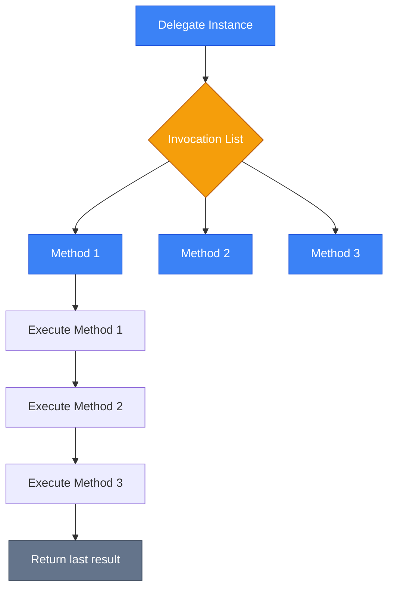
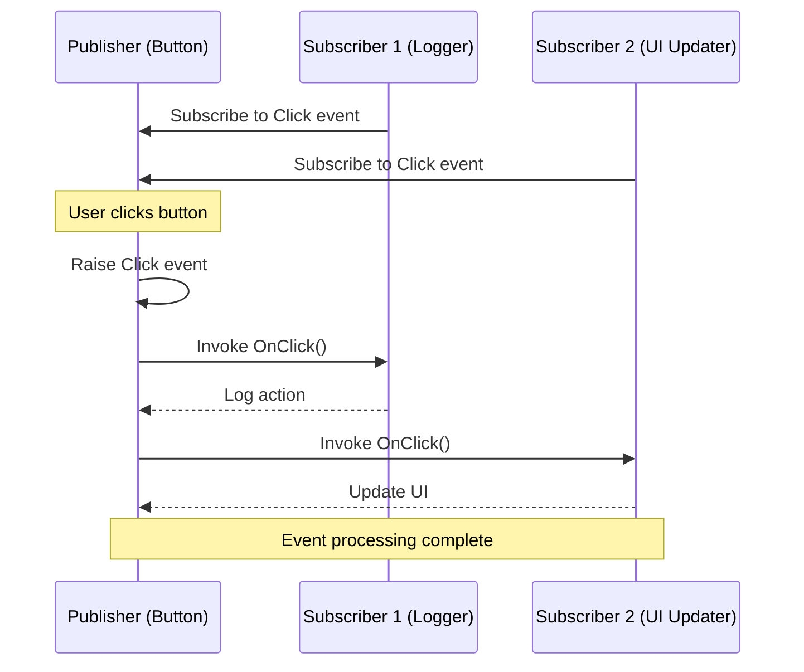

# Делегати, Події та Лямбда-вирази

## Вступ та Контекст

Уявіть, що ви створюєте систему обробки файлів. Коли програма знаходить файл, вона має повідомити різні частини вашого додатку: один компонент оновлює UI, інший логує результат, третій відправляє статистику. Як зробити це елегантно, не створюючи жорстких зв'язків між класами?

::note
**Проблема**: У традиційному програмуванні, щоб викликати метод, ви маєте знати точний тип об'єкта. Це створює тісний зв'язок (tight coupling) між компонентами.
::

**Делегати (Delegates)** вирішують цю проблему. Вони є типобезпечними покажчиками на методи, які дозволяють передавати методи як параметри, зберігати їх у колекціях та викликати динамічно.

### Еволюція

У мові C існували вказівники на функції — потужний, але небезпечний механізм. C# взяв цю ідею та зробив її типобезпечною:
::mermaid


::

### Передумови

Перед вивченням цієї теми вам потрібно розуміти:

-   Методи та їх сигнатури
-   Класи та об'єкти
-   Основи ООП (інкапсуляція, поліморфізм)

## Делегати (Delegates)

### Визначення

**Делегат (Delegate)** — це тип, що представляє посилання на методи з певною сигнатурою. По суті, це клас, похідний від `System.MulticastDelegate`, який описує контракт методу.

::tip
**Аналогія з реального світу**: Делегат — це як бланк доручення у банку. На бланку вказано, що саме має бути зроблено (сигнатура), але хто саме це виконає (конкретний метод), можна вирішити пізніше.
::

### Під капотом

На низькому рівні делегат — це об'єкт, що містить посилання на метод та об'єкт, до якого цей метод належить.

-   `_target`: посилання на об'єкт (для instance методів) або `null` (для static методів).
-   `_methodPtr`: вказівник на функцію в пам'яті.

Коли ви створюєте `MulticastDelegate`, він додатково містить список інших делегатів, які потрібно викликати послідовно.

### Синтаксис

Оголошення делегата схоже на оголошення методу, але з ключовим словом `delegate`:

```csharp [DelegateDeclaration.cs] showLineNumbers
// Оголошення типу делегата
public delegate void ProcessHandler(string message);
public delegate int CalculateHandler(int a, int b);
public delegate bool PredicateHandler<T>(T item);
```

Делегат визначає:

-   Тип повернення
-   Назву делегата
-   Список параметрів

### Створення та Використання

::code-group

```csharp [Classic Syntax] showLineNumbers
delegate void NotifyDelegate(string message);

class Program
{
    static void EmailNotification(string msg)
    {
        Console.WriteLine($"📧 Email: {msg}");
    }

    static void SmsNotification(string msg)
    {
        Console.WriteLine($"📱 SMS: {msg}");
    }

    static void Main()
    {
        // Створення екземпляра делегата
        NotifyDelegate notify = new NotifyDelegate(EmailNotification);

        // Виклик делегата
        notify("Ваше замовлення відправлено"); // 📧 Email: Ваше замовлення відправлено
    }
}
```

```csharp [Short Syntax (C# 2.0+)] showLineNumbers
delegate void NotifyDelegate(string message);

class Program
{
    static void EmailNotification(string msg)
        => Console.WriteLine($"📧 Email: {msg}");

    static void Main()
    {
        // Скорочений синтаксис
        NotifyDelegate notify = EmailNotification;

        notify("Ваше замовлення відправлено");
    }
}
```

::

::note
**Важливо**: Навіть якщо два делегати мають ідентичну сигнатуру, вони є різними типами, якщо оголошені окремо. Це забезпечує типобезпеку.
::

### Multicast Delegates (Багатоадресні Делегати)

Делегати в C# підтримують **Multicast** — можливість викликати декілька методів послідовно:

```csharp [MulticastExample.cs] showLineNumbers {14,17,20}
delegate void LogDelegate(string message);

class Logger
{
    static void ConsoleLog(string msg)
        => Console.WriteLine($"[CONSOLE] {msg}");

    static void FileLog(string msg)
        => Console.WriteLine($"[FILE] {msg}");

    static void Main()
    {
        LogDelegate log = ConsoleLog;
        log += FileLog; // Додавання методу

        log("Помилка підключення");
        // Виведе:
        // [CONSOLE] Помилка підключення
        // [FILE] Помилка підключення

        log -= ConsoleLog; // Видалення методу
        log("Повторна спроба");
        // Виведе тільки:
        // [FILE] Повторна спроба
    }
}
```

::warning
**Небезпека NullReferenceException**: Якщо ви видалите всі методи з делегата, він стане `null`. Виклик `null` делегата спричинить виняток. Використовуйте оператор `?.`:

```csharp
log?.Invoke("Безпечний виклик");
```

::

### Як Працюють Multicast Delegates

::mermaid



::

::caution
**Повернення значення**: Якщо делегат повертає значення, multicast делегат поверне тільки результат **останнього** методу в списку. Результати попередніх методів будуть втрачені.
::

### Коваріантність та Контраваріантність

Це механізм, який дозволяє використовувати методи, чия сигнатура не зовсім збігається з делегатом, але є сумісною з точки зору наслідування типів.

#### 1. Коваріантність (Covariance) — `out`

Дозволяє методу повертати **більш конкретний** тип (спадкоємець), ніж оголошено в делегаті.

> "Якщо делегат обіцяє повернути `Person`, то метод, що повертає `Employee`, теж підходить, бо `Employee` — це теж `Person`."

#### 2. Контраваріантність (Contravariance) — `in`

Дозволяє методу приймати **більш загальний** тип параметра (батько), ніж оголошено в делегаті.

> "Якщо делегат передає `Employee`, то метод, який вміє обробляти будь-якого `Person`, теж впорається, бо `Employee` є `Person`."

#### Приклад та Liskov Substitution Principle

Це пряме застосування принципу підстановки Лісков (LSP).

```csharp [VarianceDeepDive.cs] showLineNumbers
class Person { }
class Employee : Person { }
class Manager : Employee { }

delegate Person Factory();           // Covariant return
delegate void Handler(Employee e);   // Contravariant param

class Program
{
    // Повертає Manager (спадкоємець Person) -> OK
    static Manager CreateManager() => new Manager();

    // Приймає Person (батько Employee) -> OK
    static void LogPerson(Person p) { }

    static void Main()
    {
        // COVARIANCE: Factory очікує Person, ми даємо Manager.
        // Це безпечно, бо хто очікує Person, зможе працювати з Manager.
        Factory factory = CreateManager;

        // CONTRAVARIANCE: Handler збирається передати Employee.
        // Ми даємо метод, що приймає Person.
        // Це безпечно, бо метод LogPerson точно зможе обробити Employee.
        Handler handler = LogPerson;
    }
}
```

#### Generic Variance

Узагальнені делегати `Func` та `Action` вже мають правильні модифікатори варіативності:

-   `Func<out TResult>`: коваріантний за результатом.
-   `Action<in T>`: контраваріантний за аргументом.

::warning
**Обмеження Value Types**: Варіативність працює **тільки для Reference Types**. Ви не можете привести `Func<string>` до `Func<object>`, це працює. Але `Func<int>` до `Func<object>` — **ні**, тому що `int` — це value type, і потребує boxing, що змінює представлення в пам'яті.
::

## Вбудовані Делегати

Замість створення власних типів делегатів для кожного випадку, C# надає універсальні вбудовані делегати: `Action`, `Func` та `Predicate`.

### Action<T>

`Action` — делегат, який **не повертає** значення (`void`). Може мати від 0 до 16 параметрів.

```csharp [ActionExample.cs] showLineNumbers
// Без параметрів
Action greet = () => Console.WriteLine("Привіт!");

// Один параметр
Action<string> printMessage = msg => Console.WriteLine(msg);

// Декілька параметрів
Action<string, int> printWithCode = (msg, code) =>
    Console.WriteLine($"[{code}] {msg}");

greet();                              // Привіт!
printMessage("Помилка системи");     // Помилка системи
printWithCode("Не знайдено", 404);   // [404] Не знайдено
```

### Func<T, TResult>

`Func` — делегат, який **повертає** значення. Останній параметр типу — це тип повернення.

```csharp [FuncExample.cs] showLineNumbers
// Без параметрів, повертає int
Func<int> getRandomNumber = () => Random.Shared.Next(1, 101);

// Один параметр, повертає результат
Func<int, int> square = x => x * x;

// Два параметри, повертає суму
Func<int, int, int> add = (a, b) => a + b;

// Перетворення типів
Func<string, int> parseToInt = s => int.Parse(s);

Console.WriteLine(getRandomNumber()); // Випадкове число
Console.WriteLine(square(5));         // 25
Console.WriteLine(add(10, 20));       // 30
Console.WriteLine(parseToInt("42"));  // 42
```

### Predicate<T>

`Predicate<T>` — спеціалізований делегат для перевірки умови. Приймає один параметр типу `T` та повертає `bool`.

```csharp [PredicateExample.cs] showLineNumbers
Predicate<int> isEven = x => x % 2 == 0;
Predicate<string> isNullOrEmpty = string.IsNullOrEmpty;

Console.WriteLine(isEven(4));              // True
Console.WriteLine(isEven(7));              // False
Console.WriteLine(isNullOrEmpty(""));      // True
Console.WriteLine(isNullOrEmpty("text")); // False

// Використання з List.FindAll
List<int> numbers = [1, 2, 3, 4, 5, 6];
List<int> evenNumbers = numbers.FindAll(isEven);
Console.WriteLine(string.Join(", ", evenNumbers)); // 2, 4, 6
```

### Порівняльна Таблиця

| Делегат            | Сигнатура               | Повертає значення? | Типове використання          |
| :----------------- | :---------------------- | :----------------- | :--------------------------- |
| `Action`           | `void Method()`         | ❌ Ні              | Виконання дій без результату |
| `Action<T>`        | `void Method(T arg)`    | ❌ Ні              | Обробка даних без повернення |
| `Func<TResult>`    | `TResult Method()`      | ✅ Так             | Генерація значень            |
| `Func<T, TResult>` | `TResult Method(T arg)` | ✅ Так             | Трансформація даних          |
| `Predicate<T>`     | `bool Method(T arg)`    | ✅ Так (bool)      | Перевірка умов, фільтрація   |

::tip
**Best Practice**: Використовуйте `Action` та `Func` замість створення власних типів делегатів, якщо це можливо. Це робить код більш читабельним та стандартизованим.
::

## Анонімні Методи

**Анонімні методи (Anonymous Methods)** — це способ створення делегата без оголошення окремого іменованого методу. Введені в C# 2.0.

### Синтаксис

```csharp [AnonymousMethodSyntax.cs] showLineNumbers
Func<int, int, int> sum = delegate(int a, int b)
{
    return a + b;
};

Console.WriteLine(sum(5, 3)); // 8
```

::code-group

```csharp [Named Method] showLineNumbers
class Calculator
{
    static int Add(int a, int b)
    {
        return a + b;
    }

    static void Main()
    {
        Func<int, int, int> operation = Add;
        Console.WriteLine(operation(10, 5)); // 15
    }
}
```

```csharp [Anonymous Method] showLineNumbers
class Calculator
{
    static void Main()
    {
        Func<int, int, int> operation = delegate(int a, int b)
        {
            return a + b;
        };

        Console.WriteLine(operation(10, 5)); // 15
    }
}
```

::

### Навіщо це було потрібно?

Анонімні методи дозволяють:

-   Оголошувати логіку "на місці" без створення окремих методів
-   Зменшити кількість коду для простих операцій
-   Отримати доступ до локальних змінних (closure)

::note
**Історична перспектива**: Анонімні методи були революційними в C# 2.0, але з появою **лямбда-виразів** у C# 3.0, вони стали рідше використовуватися через більш компактний синтаксис лямбд.
::

## Лямбда-вирази (Lambda Expressions)

**Лямбда-вирази (Lambda Expressions)** — це сучасний та лаконічний спосіб створення анонімних функцій. Вони є еволюцією анонімних методів.

### Синтаксис

Базова форма лямбда-виразу:

```
(parameters) => expression-or-statement-block
```

::code-group

```csharp [Expression Lambda] showLineNumbers
// Один вираз справа від =>
Func<int, int> square = x => x * x;

// Еквівалентно:
Func<int, int> squareLong = x => { return x * x; };
```

```csharp [Statement Lambda] showLineNumbers
// Блок операторів
Func<int, int, int> divide = (a, b) =>
{
    if (b == 0)
        throw new DivideByZeroException();
    return a / b;
};
```

::

### Варіації Синтаксису

```csharp [LambdaSyntaxVariations.cs] showLineNumbers
// Без параметрів
Action sayHello = () => Console.WriteLine("Hello!");

// Один параметр (дужки необов'язкові)
Func<int, int> double = x => x * 2;

// Два і більше параметрів (дужки обов'язкові)
Func<int, int, int> multiply = (a, b) => a * b;

// Явна типізація параметрів
Func<int, int> explicitType = (int x) => x + 1;

// Ігнорування параметрів (C# 9.0+)
Func<int, int, int> ignoreSecond = (x, _) => x * 2;
```

### Type Inference (Виведення Типів)

Компілятор може автоматично визначити тип делегата:

```csharp [TypeInference.cs] showLineNumbers
// Компілятор виведе тип Func<string, int>
var parse = (string s) => int.Parse(s);

// Використання
int number = parse("42");
Console.WriteLine(number); // 42
```

::warning
Тип параметра `s` має бути явно вказаний, інакше компілятор не зможе вивести тип `parse`.
::

### Closures (Замикання)

**Замикання (Closure)** — це механізм, що дозволяє лямбда-виразу "захоплювати" змінні з зовнішнього контексту та подовжувати їх час життя, навіть якщо зовнішній метод вже завершив виконання.

```csharp [ClosureExample.cs] showLineNumbers {3,7-8}
int multiplier = 5;

Func<int, int> multiplyByFive = x => x * multiplier;

Console.WriteLine(multiplyByFive(10)); // 50

multiplier = 10; // Змінюємо зовнішню змінну
Console.WriteLine(multiplyByFive(10)); // 100 — захоплена змінна!
```

#### Як це працює під капотом?

Компілятор створює прихований клас (display class) для зберігання захоплених змінних.

1.  **Локальні змінні**: Переносяться в поля generated класу.
2.  **`this`**: Якщо лямбда використовує члени класу, вона захоплює `this`, що може подовжити життя всього об'єкта.

```csharp [CompilerGenerated.cs] showLineNumbers
// Ваш код:
class Calculator
{
    int _base = 10;

    public Func<int, int> GetMultiplier(int factor)
    {
        return x => x * factor + _base;
    }
}

// Що генерує компілятор (спрощено):
class Calculator
{
    int _base = 10;

    // Display Class для методу GetMultiplier
    sealed class <>c__DisplayClass0_0
    {
        public int factor;       // Захоплений локальний параметр
        public Calculator <>4__this; // Захоплене посилання на батьківський об'єкт

        public int <GetMultiplier>b__0(int x)
        {
            // Доступ до _base через захоплений this
            return x * factor + <>4__this._base;
        }
    }

    public Func<int, int> GetMultiplier(int factor)
    {
        var closure = new <>c__DisplayClass0_0();
        closure.factor = factor;
        closure.<>4__this = this; // УВАГА: Calculator не буде зібраний GC, поки живе делегат!

        return new Func<int, int>(closure.<GetMultiplier>b__0);
    }
}
```

::warning
**Performance Impact**: Кожне замикання створює новий об'єкт у кучі (heap allocation). У високопродуктивних циклах (hot paths) це створює тиск на GC.
::

#### Пастка змінної циклу (The Loop Variable Trap)

До C# 5.0 змінна циклу `foreach` оголошувалася **зовні** циклу. Це призводило до того, що всі лямбди захоплювали **одну й ту ж змінну**.

```csharp
var actions = new List<Action>();
for (int i = 0; i < 3; i++) // 'i' одна на весь цикл
{
    actions.Add(() => Console.WriteLine(i));
}

foreach (var a in actions) a();
// Виведе: 3, 3, 3 (значення i після завершення циклу)
```

**Чому так?**
Компілятор створює **один** екземпляр display class _перед_ циклом, і в циклі просто оновлює його поле. Всі делегати посилаються на цей єдиний об'єкт.

**Рішення**: Створити локальну копію всередині блоку циклу.

```csharp
for (int i = 0; i < 3; i++)
{
    int copy = i; // Нова змінна на кожній ітерації -> новий display class
    actions.Add(() => Console.WriteLine(copy));
}
```

::note
Починаючи з C# 5.0, `foreach` автоматично створює нову змінну на кожній ітерації, тому там ця проблема зникла. Але для `for` вона все ще актуальна!
::

#### Обмеження (Limitations)

Лямбда-вирази **не можуть** захоплювати параметри `ref`, `out` або `in`.
**Причина**: Ці параметри живуть на стеку (або є посиланнями на стек). Display class створюється в кучі (heap). Посилання з кучі на стек заборонені в .NET заради безпеки пам'яті (щоб уникнути доступу до звільненого фрейму стеку).

```csharp
void TryCapture(ref int x)
{
    // Помилка компіляції CS1628: Cannot use ref, out, or in parameter inside an anonymous method
    Action act = () => Console.WriteLine(x);
}
```

### Attributes on Lambdas (C# 10+)

Починаючи з C# 10, можна додавати атрибути до лямбда-виразів:

```csharp [LambdaAttributes.cs] showLineNumbers
var parse = [return: NotNull] (string s) => int.Parse(s);

Func<string, int> parseWithAttribute =
    [Obsolete("Use TryParse instead")]
    (string s) => int.Parse(s);
```

### Expression Trees (Дерева Виразів)

Лямбда-вирази можуть бути перетворені на **дерева виразів** (`Expression<TDelegate>`), що дозволяє аналізувати їх як дані:

```csharp [ExpressionTree.cs] showLineNumbers
Expression<Func<int, int>> expression = x => x * x;

Console.WriteLine(expression); // x => (x * x)
```

::note
**Де це використовується?**: LINQ to Entities, Entity Framework, Dapper та інші ORM використовують дерева виразів для перетворення C# виразів у SQL запити.
::

## Події (Events)

**Події (Events)** — це механізм, що дозволяє об'єктам повідомляти інші об'єкти про зміни стану або важливі події. Вони базуються на **Publisher-Subscriber pattern** (паттерн "Видавець-Підписник").

### Publisher-Subscriber Pattern

::mermaid



::

### Оголошення та Використання Подій

```csharp [EventBasicExample.cs] showLineNumbers {5,11,17,22}
// 1. Оголосити делегат для події
public delegate void NotifyEventHandler(string message);

// Клас-видавець
public class FileProcessor
{
    // 2. Оголосити подію за допомогою ключового слова event
    public event NotifyEventHandler? FileProcessed;

    public void ProcessFile(string filename)
    {
        Console.WriteLine($"Обробка файлу: {filename}");

        // Симуляція обробки...

        // 3. Викликати подію (raising event)
        FileProcessed?.Invoke($"Файл {filename} оброблено");
    }
}

// Клас-підписник
public class Logger
{
    public void OnFileProcessed(string message)
    {
        Console.WriteLine($"[LOG] {message}");
    }
}

// Використання
class Program
{
    static void Main()
    {
        var processor = new FileProcessor();
        var logger = new Logger();

        // 4. Підписатися на подію
        processor.FileProcessed += logger.OnFileProcessed;

        processor.ProcessFile("data.txt");
        // Виведе:
        // Обробка файлу: data.txt
        // [LOG] Файл data.txt оброблено
    }
}
```

### Стандартний Event Pattern

.NET має стандартний паттерн для подій: використання `EventHandler` делегата та `EventArgs`:

```csharp [StandardEventPattern.cs] showLineNumbers
// Власний клас аргументів події
public class FileProcessedEventArgs : EventArgs
{
    public string FileName { get; }
    public long FileSize { get; }

    public FileProcessedEventArgs(string fileName, long fileSize)
    {
        FileName = fileName;
        FileSize = fileSize;
    }
}

// Клас-видавець
public class FileProcessor
{
    // Використання EventHandler<T>
    public event EventHandler<FileProcessedEventArgs>? FileProcessed;

    public void ProcessFile(string filename)
    {
        Console.WriteLine($"Обробка файлу: {filename}");

        long fileSize = 1024; // Симуляція

        // Виклик події з аргументами
        OnFileProcessed(new FileProcessedEventArgs(filename, fileSize));
    }

    // Protected virtual метод для виклику події (best practice)
    protected virtual void OnFileProcessed(FileProcessedEventArgs e)
    {
        FileProcessed?.Invoke(this, e);
    }
}

// Підписник
class Program
{
    static void Main()
    {
        var processor = new FileProcessor();

        // Підписка з використанням лямбда-виразу
        processor.FileProcessed += (sender, e) =>
        {
            Console.WriteLine($"Оброблено: {e.FileName} ({e.FileSize} bytes)");
        };

        processor.ProcessFile("document.pdf");
        // Виведе:
        // Обробка файлу: document.pdf
        // Оброблено: document.pdf (1024 bytes)
    }
}
```

::tip
**Best Practice**: Завжди створюйте `protected virtual` метод `OnEventName` для виклику події. Це дозволяє похідним класам перевизначати поведінку події.
::

::tip
**Best Practice**: Завжди створюйте `protected virtual` метод `OnEventName` для виклику події. Це дозволяє похідним класам перевизначати поведінку події.
::

### Field-like vs Explicit Events

У C# є два способи оголошення подій:

1.  **Field-like events** (скорочений синтаксис):

    ```csharp
    public event EventHandler Click;
    ```

    Компілятор автоматично створює приватне поле-делегат і методи `add`/`remove`.

2.  **Explicit events** (розгорнутий синтаксис):
    Ви самі керуєте зберіганням делегата (наприклад, використовуючи `EventHandlerList` для економії пам'яті, якщо подій дуже багато, а підписників мало).

### Потокобезпечність (Thread Safety)

Field-like події є потокобезпечними за замовчуванням. Компілятор генерує методи `add` та `remove` з використанням `Interlocked.CompareExchange`.

Ось як виглядає код, який генерує компілятор для `add`:

```csharp
public void add_Click(EventHandler value)
{
    EventHandler loop, current = this.Click;
    do
    {
        loop = current;
        // Об'єднуємо поточний список з новим делегатом
        EventHandler combined = (EventHandler)Delegate.Combine(loop, value);
        // Атомарно замінюємо старе значення новим, якщо ніхто не встиг змінити його
        current = Interlocked.CompareExchange(ref this.Click, combined, loop);
    }
    while (current != loop); // Якщо під час операції поле змінилося — повторюємо
}
```

Це гарантує, що якщо два потоки одночасно підписуються, жодна підписка не загубиться.

::warning
**Важливо**: Потокобезпечність стосується тільки **підписки/відписки**. Сам **виклик** події не є автоматично безпечним.
Якщо потік А перевірив `Click != null`, а потік Б в цей момент відписав останнього підписника (зробивши `Click` null), то потік А впаде з `NullReferenceException`.
**Рішення**: `Click?.Invoke(...)` або копіювання в локальну змінну `var handler = Click; handler(...)`.
::

### Витоки пам'яті (Memory Leaks) та Weak Events

Типова проблема подій — **Lapsed Listener Problem**.
Якщо довгоживучий об'єкт (Publisher) має посилання на короткоживучий об'єкт (Subscriber) через подію, то Subscriber **не буде зібраний GC**, поки живе Publisher.

**Рішення**:

1.  Явна відписка (`-=`) у `Dispose()`.
2.  Використання **Weak Events** (слабких посилань). Це дозволяє GC збирати підписника, навіть якщо він підписаний на подію. У сучасному .NET це часто реалізується через `WeakReference` або спеціальні бібліотеки (наприклад, `WeakEventManager` у WPF).

### Custom Event Accessors

Іноді потрібен більший контроль над підпискою/відпискою:

```csharp [CustomEventAccessors.cs] showLineNumbers
public class Button
{
    private EventHandler? _click;

    public event EventHandler Click
    {
        add
        {
            Console.WriteLine("Підписка на Click");
            _click += value;
        }
        remove
        {
            Console.WriteLine("Відписка від Click");
            _click -= value;
        }
    }

    public void SimulateClick()
    {
        _click?.Invoke(this, EventArgs.Empty);
    }
}
```

## Практичні Приклади

### Приклад 1: Система Логування з Пріоритетами

::code-tree

```csharp [Program.cs] showLineNumbers
using System;

var logger = new Logger();

// Підписка на різні рівні логування
logger.InfoLogged += msg => Console.WriteLine($"ℹ️  {msg}");
logger.WarningLogged += msg => Console.WriteLine($"⚠️  {msg}");
logger.ErrorLogged += msg => Console.WriteLine($"❌ {msg}");

logger.LogInfo("Додаток запущено");
logger.LogWarning("Низький рівень пам'яті");
logger.LogError("Не вдалося підключитися до БД");
```

```csharp [Logger.cs] showLineNumbers
public class Logger
{
    public event Action<string>? InfoLogged;
    public event Action<string>? WarningLogged;
    public event Action<string>? ErrorLogged;

    public void LogInfo(string message)
    {
        InfoLogged?.Invoke(message);
    }

    public void LogWarning(string message)
    {
        WarningLogged?.Invoke(message);
    }

    public void LogError(string message)
    {
        ErrorLogged?.Invoke(message);
    }
}
```

::

### Приклад 2: Calculator з різними операціями

```csharp [DelegateCalculator.cs] showLineNumbers
public class Calculator
{
    public int Execute(int a, int b, Func<int, int, int> operation)
    {
        return operation(a, b);
    }
}

class Program
{
    static void Main()
    {
        var calc = new Calculator();

        // Різні операції як делегати
        Func<int, int, int> add = (x, y) => x + y;
        Func<int, int, int> subtract = (x, y) => x - y;
        Func<int, int, int> multiply = (x, y) => x * y;

        Console.WriteLine(calc.Execute(10, 5, add));      // 15
        Console.WriteLine(calc.Execute(10, 5, subtract)); // 5
        Console.WriteLine(calc.Execute(10, 5, multiply)); // 50

        // Власна операція
        Console.WriteLine(calc.Execute(10, 5, (x, y) => x % y)); // 0
    }
}
```

### Приклад 3: Observer Pattern з Events

```csharp [ObserverPattern.cs] showLineNumbers
// Subject (Observable)
public class Stock
{
    private decimal _price;

    public string Symbol { get; }
    public decimal Price
    {
        get => _price;
        set
        {
            if (_price != value)
            {
                _price = value;
                OnPriceChanged(new PriceChangedEventArgs(_price));
            }
        }
    }

    public event EventHandler<PriceChangedEventArgs>? PriceChanged;

    public Stock(string symbol, decimal initialPrice)
    {
        Symbol = symbol;
        _price = initialPrice;
    }

    protected virtual void OnPriceChanged(PriceChangedEventArgs e)
    {
        PriceChanged?.Invoke(this, e);
    }
}

public class PriceChangedEventArgs : EventArgs
{
    public decimal NewPrice { get; }

    public PriceChangedEventArgs(decimal newPrice)
    {
        NewPrice = newPrice;
    }
}

// Observer
public class StockMonitor
{
    public void Subscribe(Stock stock)
    {
        stock.PriceChanged += OnPriceChanged;
    }

    private void OnPriceChanged(object? sender, PriceChangedEventArgs e)
    {
        if (sender is Stock stock)
        {
            Console.WriteLine($"{stock.Symbol}: {e.NewPrice:C}");
        }
    }
}

// Використання
class Program
{
    static void Main()
    {
        var appleStock = new Stock("AAPL", 150.00m);
        var monitor = new StockMonitor();

        monitor.Subscribe(appleStock);

        appleStock.Price = 155.50m; // AAPL: $155.50
        appleStock.Price = 160.00m; // AAPL: $160.00
    }
}
```

## Troubleshooting (Типові Проблеми)

### 1. NullReferenceException при виклику делегата

::warning
**Проблема**:

```csharp
Action myAction = null;
myAction(); // ❌ NullReferenceException
```

**Рішення**:

```csharp
// Використання null-conditional operator
myAction?.Invoke();

// Або перевірка перед викликом
if (myAction != null)
{
    myAction();
}
```

::

### 2. Memory Leak через події

::caution
**Проблема**: Підписка на події створює сильне посилання, що запобігає збору пам'яті:

```csharp
public class LongLivedPublisher
{
    public event EventHandler? SomeEvent;
}

public class ShortLivedSubscriber
{
    public ShortLivedSubscriber(LongLivedPublisher publisher)
    {
        publisher.SomeEvent += OnSomeEvent;
        // ❌ Підписник ніколи не звільниться!
    }

    private void OnSomeEvent(object? sender, EventArgs e) { }
}
```

**Рішення**: Завжди відписуйтесь або використовуйте weak events:

```csharp
public class ShortLivedSubscriber : IDisposable
{
    private readonly LongLivedPublisher _publisher;

    public ShortLivedSubscriber(LongLivedPublisher publisher)
    {
        _publisher = publisher;
        _publisher.SomeEvent += OnSomeEvent;
    }

    public void Dispose()
    {
        _publisher.SomeEvent -= OnSomeEvent;
    }

    private void OnSomeEvent(object? sender, EventArgs e) { }
}
```

::

### 3. Захоплення змінної циклу (Loop Variable Capture)

::warning
**Проблема**:

```csharp
var actions = new List<Action>();

for (int i = 0; i < 5; i++)
{
    actions.Add(() => Console.WriteLine(i));
}

actions[0](); // 5, а не 0!
actions[4](); // 5
```

**Рішення**:

```csharp
for (int i = 0; i < 5; i++)
{
    int localI = i; // Локальна копія
    actions.Add(() => Console.WriteLine(localI));
}

actions[0](); // 0
actions[4](); // 4
```

::

### 4. Multicast Delegate з Return Value

::note
**Проблема**: При multicast делегаті тільки **останнє** значення повертається:

```csharp
Func<int> getNumber = () => 1;
getNumber += () => 2;
getNumber += () => 3;

int result = getNumber(); // result = 3 (тільки останній!)
```

**Якщо потрібні всі результати**:

```csharp
Func<int> getNumber = () => 1;
getNumber += () => 2;
getNumber += () => 3;

var results = new List<int>();
foreach (Func<int> func in getNumber.GetInvocationList())
{
    results.Add(func());
}

Console.WriteLine(string.Join(", ", results)); // 1, 2, 3
```

::

## Практика (Practice Tasks)

### Рівень 1: Початківець

::collapsible{title="Завдання 1.1: Базовий делегат"}

**Завдання**: Створіть делегат `MathOperation`, який приймає два `int` та повертає `int`. Напишіть методи для додавання, віднімання та множення. Викличте їх через делегат.

**Рішення**:

```csharp
delegate int MathOperation(int a, int b);

class Program
{
    static int Add(int a, int b) => a + b;
    static int Subtract(int a, int b) => a - b;
    static int Multiply(int a, int b) => a * b;

    static void Main()
    {
        MathOperation op;

        op = Add;
        Console.WriteLine($"10 + 5 = {op(10, 5)}"); // 15

        op = Subtract;
        Console.WriteLine($"10 - 5 = {op(10, 5)}"); // 5

        op = Multiply;
        Console.WriteLine($"10 * 5 = {op(10, 5)}"); // 50
    }
}
```

::

::collapsible{title="Завдання 1.2: Action та Func"}

**Завдання**: Використайте `Action<string>` для виведення повідомлення та `Func<int, int, int>` для знаходження максимуму двох чисел.

**Рішення**:

```csharp
class Program
{
    static void Main()
    {
        // Action для виведення
        Action<string> print = msg => Console.WriteLine($">> {msg}");
        print("Привіт, світ!");

        // Func для знаходження максимуму
        Func<int, int, int> max = (a, b) => a > b ? a : b;
        Console.WriteLine($"Максимум з 10 та 20: {max(10, 20)}"); // 20
    }
}
```

::

### Рівень 2: Середній

::collapsible{title="Завдання 2.1: Temperature Monitor"}

**Завдання**: Створіть клас `TemperatureMonitor` з подією `TemperatureChanged`. Коли температура перевищує 30°C, викликайте подію. Створіть підписника, який виводить попередження.

**Рішення**:

```csharp
public class TemperatureChangedEventArgs : EventArgs
{
    public double Temperature { get; }

    public TemperatureChangedEventArgs(double temperature)
    {
        Temperature = temperature;
    }
}

public class TemperatureMonitor
{
    private double _temperature;

    public event EventHandler<TemperatureChangedEventArgs>? TemperatureChanged;

    public double Temperature
    {
        get => _temperature;
        set
        {
            _temperature = value;
            if (_temperature > 30)
            {
                OnTemperatureChanged(new TemperatureChangedEventArgs(_temperature));
            }
        }
    }

    protected virtual void OnTemperatureChanged(TemperatureChangedEventArgs e)
    {
        TemperatureChanged?.Invoke(this, e);
    }
}

class Program
{
    static void Main()
    {
        var monitor = new TemperatureMonitor();

        monitor.TemperatureChanged += (sender, e) =>
        {
            Console.WriteLine($"⚠️ Попередження! Температура: {e.Temperature}°C");
        };

        monitor.Temperature = 25; // Нічого
        monitor.Temperature = 35; // ⚠️ Попередження! Температура: 35°C
    }
}
```

::

::collapsible{title="Завдання 2.2: Multicast Logger"}

**Завдання**: Створіть систему логування, яка використовує multicast делегат для виведення в консоль та "файл" (просто інший Console.WriteLine з префіксом [FILE]).

**Рішення**:

```csharp
delegate void LogHandler(string message);

class Program
{
    static void ConsoleLog(string msg)
        => Console.WriteLine($"[CONSOLE] {msg}");

    static void FileLog(string msg)
        => Console.WriteLine($"[FILE] {msg}");

    static void Main()
    {
        LogHandler logger = ConsoleLog;
        logger += FileLog;

        logger("Система завантажена");
        // Виведе:
        // [CONSOLE] Система завантажена
        // [FILE] Система завантажена

        logger -= ConsoleLog;
        logger("Тільки у файл");
        // Виведе:
        // [FILE] Тільки у файл
    }
}
```

::

### Рівень 3: Просунутий

::collapsible{title="Завдання 3.1: Custom Event Accessors"}

**Завдання**: Створіть клас `Button` з подією `Click`, яка має custom accessors. Лічильник підписок має обмежувати кількість підписників до 3. При спробі підписатися вчетверте — викидати виняток.

**Рішення**:

```csharp
public class Button
{
    private EventHandler? _click;
    private int _subscriberCount = 0;
    private const int MaxSubscribers = 3;

    public event EventHandler Click
    {
        add
        {
            if (_subscriberCount >= MaxSubscribers)
            {
                throw new InvalidOperationException(
                    $"Максимум {MaxSubscribers} підписників дозволено");
            }
            _click += value;
            _subscriberCount++;
            Console.WriteLine($"Підписників: {_subscriberCount}");
        }
        remove
        {
            _click -= value;
            _subscriberCount--;
            Console.WriteLine($"Підписників: {_subscriberCount}");
        }
    }

    public void SimulateClick()
    {
        _click?.Invoke(this, EventArgs.Empty);
    }
}

class Program
{
    static void Main()
    {
        var button = new Button();

        EventHandler handler1 = (s, e) => Console.WriteLine("Handler 1");
        EventHandler handler2 = (s, e) => Console.WriteLine("Handler 2");
        EventHandler handler3 = (s, e) => Console.WriteLine("Handler 3");
        EventHandler handler4 = (s, e) => Console.WriteLine("Handler 4");

        button.Click += handler1; // Підписників: 1
        button.Click += handler2; // Підписників: 2
        button.Click += handler3; // Підписників: 3

        try
        {
            button.Click += handler4; // ❌ Exception
        }
        catch (InvalidOperationException ex)
        {
            Console.WriteLine($"Помилка: {ex.Message}");
        }

        button.SimulateClick();
        // Handler 1
        // Handler 2
        // Handler 3
    }
}
```

::

::collapsible{title="Завдання 3.2: LINQ-подібний Filter з Predicate"}

**Завдання**: Створіть метод розширення `Filter<T>` для `IEnumerable<T>`, який приймає `Predicate<T>` та повертає відфільтровані елементи.

**Рішення**:

```csharp
public static class EnumerableExtensions
{
    public static IEnumerable<T> Filter<T>(this IEnumerable<T> source, Predicate<T> predicate)
    {
        foreach (var item in source)
        {
            if (predicate(item))
            {
                yield return item;
            }
        }
    }
}

class Program
{
    static void Main()
    {
        var numbers = new[] { 1, 2, 3, 4, 5, 6, 7, 8, 9, 10 };

        // Фільтр парних чисел
        var evenNumbers = numbers.Filter(x => x % 2 == 0);
        Console.WriteLine("Парні: " + string.Join(", ", evenNumbers));
        // Парні: 2, 4, 6, 8, 10

        // Фільтр чисел > 5
        var greaterThanFive = numbers.Filter(x => x > 5);
        Console.WriteLine("Більше 5: " + string.Join(", ", greaterThanFive));
        // Більше 5: 6, 7, 8, 9, 10
    }
}
```

::

## Резюме

::card-group
::card{title="Делегати" icon="i-heroicons-code-bracket"}
Типобезпечні покажчики на методи. Використовуйте для callback-функцій, event handlers та стратегій.
::

::card{title="Action & Func" icon="i-heroicons-bolt"}
Вбудовані універсальні делегати. `Action` для void методів, `Func` для методів з результатом.
::

::card{title="Лямбда-вирази" icon="i-heroicons-sparkles"}
Лаконічний синтаксис для анонімних функцій. Підтримують closures та type inference.
::

::card{title="Події" icon="i-heroicons-bell-alert"}
Publisher-Subscriber pattern для loose coupling. Використовуйте `EventHandler<T>` та `EventArgs`.
::
::

### Ключові Takeaways

-   **Делегати** дозволяють передавати методи як параметри та створювати гнучкі API
-   **Multicast delegates** викликають декілька методів послідовно
-   **Action/Func/Predicate** замінюють більшість кастомних делегатів
-   **Лямбда-вирази** — це сучасний спосіб створення анонімних функцій
-   **Closures** захоплюють змінні з зовнішньої області видимості (будьте обережні!)
-   **Події** забезпечують loose coupling через Publisher-Subscriber pattern
-   Завжди **відписуйтесь** від подій, щоб уникнути memory leaks

::tip
**Наступні кроки**: Ознайомтеся з [Інтерфейсами](./3.interfaces-deep-dive.md) та [LINQ](../../5.standard-library/3.linq.md), де делегати та лямбда-вирази широко використовуються.
::

## Додаткові Ресурси

-   [Офіційна документація Microsoft: Delegates](https://learn.microsoft.com/en-us/dotnet/csharp/programming-guide/delegates/)
-   [Офіційна документація Microsoft: Events](https://learn.microsoft.com/en-us/dotnet/csharp/events-overview)
-   [Офіційна документація Microsoft: Lambda Expressions](https://learn.microsoft.com/en-us/dotnet/csharp/language-reference/operators/lambda-expressions)
-   [Standard .NET Event Patterns](https://learn.microsoft.com/en-us/dotnet/csharp/event-pattern)
