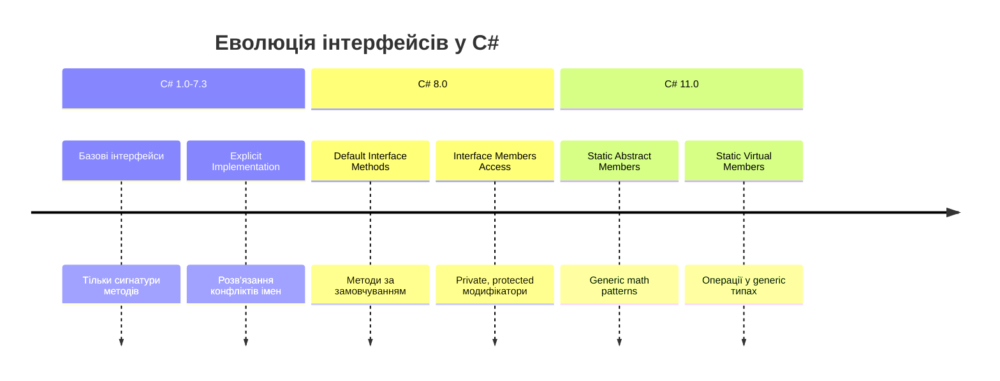
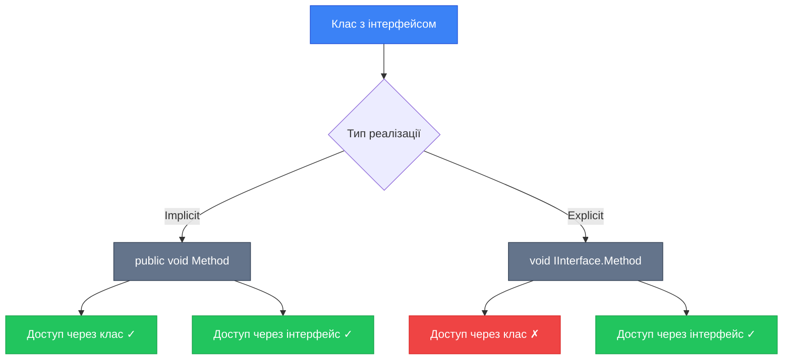
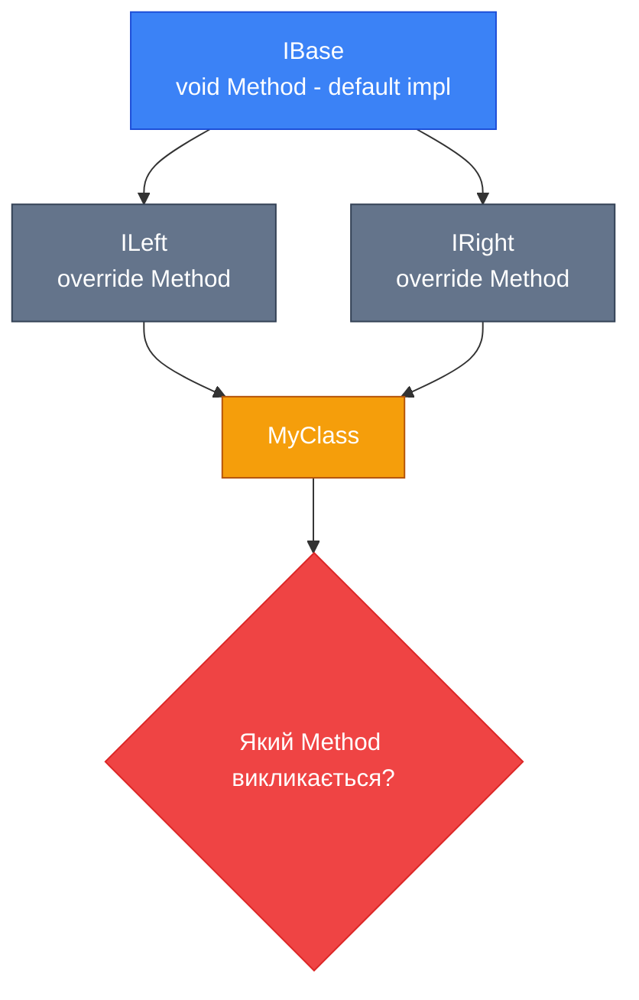
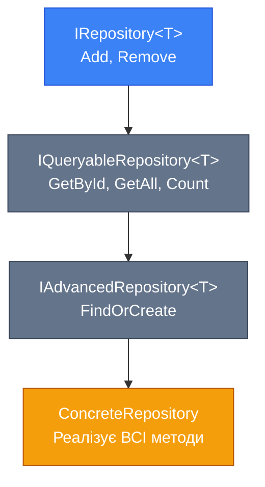

# [Interfaces Deep Dive (Інтерфейси: Поглиблений Розгляд)](https://learn.microsoft.com/en-us/dotnet/csharp/fundamentals/types/interfaces)

::note
**Передумови**: Рекомендується ознайомитись з [класами та об'єктами](/csharp/oop/classes-objects), [базовими інтерфейсами](/csharp/oop/oop-pillars#abstraction) та [generics](/csharp/advanced-core/generics) перед вивченням цього розділу.
::

## Навіщо це потрібно?

Уявіть, що ви розробляєте бібліотеку для роботи з логуванням. У вас є інтерфейс `ILogger`:

```csharp showLineNumbers
public interface ILogger
{
    void Log(string message);
}
```

Ваша бібліотека використовується в сотнях проєктів. Але тепер вам потрібно додати метод `LogError`. **Проблема**: якщо ви просто додасте його до інтерфейсу, всі існуючі реалізації зламаються! 💥

```csharp showLineNumbers
public interface ILogger
{
    void Log(string message);
    void LogError(string error); // ❌ Breaking change!
}
```

Або інша ситуація: ваш клас повинен реалізувати два інтерфейси з однаковими іменами методів:

```csharp showLineNumbers
interface IPrinter
{
    void Print();
}

interface IDocumentExporter
{
    void Print();
}

class Document : IPrinter, IDocumentExporter
{
    public void Print() // ❓ Який Print реалізується?
    {
        Console.WriteLine("Printing...");
    }
}
```

**Сучасний C# (8+) надає рішення:**

-   ✅ **Explicit Interface Implementation** — чітке розмежування реалізацій
-   ✅ **Default Interface Methods** — додавання методів без breaking changes
-   ✅ **Interface Inheritance** — побудова складних ієрархій
-   ✅ **Static Abstract Members** — generic математика та операції

## Еволюція Інтерфейсів у C#

::mermaid



::

### Що нового?

| Версія C# | Можливість                     | Опис                                        |
| :-------- | :----------------------------- | :------------------------------------------ |
| C# 1.0    | Basic Interfaces               | Сигнатури методів та властивостей           |
| C# 1.0    | Explicit Implementation        | Явна реалізація членів інтерфейсу           |
| C# 8.0    | Default Interface Methods      | Методи з реалізацією за замовчуванням       |
| C# 8.0    | Access Modifiers in Interfaces | `private`, `protected`, `internal`          |
| C# 11.0   | Static Abstract Members        | Статичні абстрактні методи та властивості   |
| C# 11.0   | Static Virtual Members         | Операції та оператори у generic інтерфейсах |

## Explicit Interface Implementation

[**Explicit Interface Implementation**](https://learn.microsoft.com/en-us/dotnet/csharp/programming-guide/interfaces/explicit-interface-implementation) (явна реалізація інтерфейсу) — це техніка, коли члени інтерфейсу реалізуються з **повною кваліфікацією** (`InterfaceName.MemberName`).

### Коли це потрібно?

**Сценарій 1: Конфлікт імен**

Два інтерфейси мають методи з однаковими іменами:

```csharp showLineNumbers
interface IEnglishDimensions
{
    double Length { get; set; }
    double Width { get; set; }
}

interface IMetricDimensions
{
    double Length { get; set; }
    double Width { get; set; }
}

public class Box : IEnglishDimensions, IMetricDimensions
{
    // Explicit implementation для англійських одиниць
    double IEnglishDimensions.Length { get; set; }
    double IEnglishDimensions.Width { get; set; }

    // Explicit implementation для метричних одиниць
    double IMetricDimensions.Length { get; set; }
    double IMetricDimensions.Width { get; set; }

    // Використання
    public void DisplayDimensions()
    {
        IEnglishDimensions englishBox = this;
        IMetricDimensions metricBox = this;

        englishBox.Length = 12; // дюйми
        metricBox.Length = 30;  // сантиметри

        Console.WriteLine($"English: {englishBox.Length} inches");
        Console.WriteLine($"Metric: {metricBox.Length} cm");
    }
}
```

**Сценарій 2: Приховування деталей реалізації**

```csharp showLineNumbers
public interface IRepository<T>
{
    void Add(T item);
    void Remove(T item);
}

public class CustomerRepository : IRepository<Customer>
{
    private List<Customer> _customers = new();

    // Explicit implementation — метод доступний тільки через інтерфейс
    void IRepository<Customer>.Add(Customer item)
    {
        _customers.Add(item);
        Console.WriteLine($"Added {item.Name} to repository");
    }

    void IRepository<Customer>.Remove(Customer item)
    {
        _customers.Remove(item);
        Console.WriteLine($"Removed {item.Name} from repository");
    }

    // Public метод для бізнес-логіки
    public void AddCustomerWithValidation(Customer customer)
    {
        if (string.IsNullOrWhiteSpace(customer.Name))
        {
            throw new ArgumentException("Customer name is required");
        }

        ((IRepository<Customer>)this).Add(customer);
    }
}

// Використання
var repo = new CustomerRepository();
// repo.Add(customer); // ❌ Compile error! Метод недоступний

IRepository<Customer> interfaceRepo = repo;
interfaceRepo.Add(new Customer { Name = "Alice" }); // ✅ OK
```

### Синтаксис: Implicit vs Explicit

::code-group

```csharp [Implicit Implementation] showLineNumbers
public interface IDrawable
{
    void Draw();
}

public class Circle : IDrawable
{
    // Неявна реалізація — метод доступний публічно
    public void Draw()
    {
        Console.WriteLine("Drawing a circle");
    }
}

// Використання
Circle circle = new Circle();
circle.Draw(); // ✅ Можна викликати напряму

IDrawable drawable = circle;
drawable.Draw(); // ✅ Також працює
```

```csharp [Explicit Implementation] showLineNumbers
public interface IDrawable
{
    void Draw();
}

public class Circle : IDrawable
{
    // Явна реалізація — метод доступний тільки через інтерфейс
    void IDrawable.Draw()
    {
        Console.WriteLine("Drawing a circle");
    }
}

// Використання
Circle circle = new Circle();
// circle.Draw(); // ❌ Compile error!

IDrawable drawable = circle;
drawable.Draw(); // ✅ OK
```

::

::mermaid



::

### Множинна Реалізація Інтерфейсів

```csharp showLineNumbers
interface IControl
{
    void Paint();
}

interface ISurface
{
    void Paint();
}

class SampleClass : IControl, ISurface
{
    // Explicit implementation для IControl
    void IControl.Paint()
    {
        Console.WriteLine("IControl.Paint");
    }

    // Explicit implementation для ISurface
    void ISurface.Paint()
    {
        Console.WriteLine("ISurface.Paint");
    }
}

// Використання
SampleClass obj = new SampleClass();

IControl control = obj;
control.Paint(); // Output: IControl.Paint

ISurface surface = obj;
surface.Paint(); // Output: ISurface.Paint
```

### Troubleshooting

::warning
**Compiler Error CS0538**: Явна реалізація можлива тільки для членів інтерфейсів, а не класів.

```csharp showLineNumbers
public class MyClass
{
    public void G() { }
}

class C : MyIFace
{
    void MyClass.G() // ❌ CS0538, MyClass — це клас, не інтерфейс!
    {
    }
}
```

**Виправлення**: Використовуйте тільки інтерфейси для явної реалізації.
::

::tip
**Best Practice**: Використовуйте **explicit implementation** коли:

-   Потрібно розв'язати конфлікт імен між інтерфейсами
-   Хочете приховати деталі реалізації від публічного API
-   Реалізуєте utility інтерфейси (наприклад, `IDisposable`), які не є частиною основного API класу

Використовуйте **implicit implementation** для основного API вашого класу.
::

## Default Interface Methods (C# 8)

[**Default Interface Methods**](https://learn.microsoft.com/en-us/dotnet/csharp/whats-new/tutorials/default-interface-methods-versions) (методи інтерфейсу за замовчуванням) — революційна можливість C# 8, яка дозволяє додавати методи з реалізацією безпосередньо в інтерфейс.

### Проблема: Еволюція API

**До C# 8**: Додавання нового методу в інтерфейс = breaking change

```csharp showLineNumbers
// Версія 1.0 бібліотеки
public interface ILogger
{
    void Log(string message);
}

// 1000 класів реалізують цей інтерфейс...

// Версія 2.0 — потрібен новий метод
public interface ILogger
{
    void Log(string message);
    void LogError(string error); // ❌ Breaking change!
    // Всі 1000 класів тепер не компілюються!
}
```

**Рішення з C# 8**: Default implementation

```csharp showLineNumbers
public interface ILogger
{
    void Log(string message);

    // Default implementation — не ламає існуючий код!
    void LogError(string error)
    {
        Log($"ERROR: {error}");
    }
}

// Існуючі реалізації продовжують працювати
public class ConsoleLogger : ILogger
{
    public void Log(string message)
    {
        Console.WriteLine(message);
    }

    // LogError автоматично доступний через default implementation!
}

// Використання
ILogger logger = new ConsoleLogger();
logger.Log("Info message");
logger.LogError("Something went wrong"); // Output: ERROR: Something went wrong
```

### Синтаксис та Можливості

```csharp showLineNumbers
public interface ICustomer
{
    // Звичайні члени (без реалізації)
    string Name { get; set; }
    int Id { get; }

    // Default method з реалізацією
    string GetDisplayName()
    {
        return $"{Name} (ID: {Id})";
    }

    // Default method з логікою
    bool IsValid()
    {
        return !string.IsNullOrWhiteSpace(Name) && Id > 0;
    }

    // Default property (C# 8+)
    string Status => "Active"; // Read-only property з значенням
}
```

### Override Default Methods

Класи можуть **перевизначити** default implementation:

```csharp showLineNumbers
public interface ILogger
{
    void Log(string message);

    void LogError(string error)
    {
        Log($"ERROR: {error}");
    }
}

public class FileLogger : ILogger
{
    public void Log(string message)
    {
        File.AppendAllText("log.txt", message + "\n");
    }

    // Override default implementation з кращою логікою
    public void LogError(string error)
    {
        string errorMessage = $"[{DateTime.Now}] CRITICAL ERROR: {error}";
        File.AppendAllText("errors.txt", errorMessage + "\n");
        Log(errorMessage); // Також логуємо в основний файл
    }
}
```

### Diamond Problem

**Diamond Problem** виникає, коли клас реалізує два інтерфейси, які успадковують спільний базовий інтерфейс з default methods.

::mermaid



::

**Приклад проблеми:**

```csharp showLineNumbers
public interface IBase
{
    void Print() => Console.WriteLine("IBase.Print");
}

public interface ILeft : IBase
{
    void IBase.Print() => Console.WriteLine("ILeft.Print"); // Override
}

public interface IRight : IBase
{
    void IBase.Print() => Console.WriteLine("IRight.Print"); // Override
}

// ❌ Compile Error CS8705:Interface member does not have a most specific implementation
public class MyClass : ILeft, IRight
{
}
```

**Розв'язання**: Клас **повинен** явно вказати реалізацію:

```csharp showLineNumbers
public class MyClass : ILeft, IRight
{
    public void Print()
    {
        Console.WriteLine("MyClass.Print — manually resolved");
    }
}

// Або використовуючи explicit implementation
public class MyClass2 : ILeft, IRight
{
    void IBase.Print()
    {
        // Обрати одну з реалізацій
        ((ILeft)this).Print(); // Або ((IRight)this).Print()
    }
}
```

### Access Modifiers у Default Methods

Default methods можуть мати різні рівні доступу:

```csharp showLineNumbers
public interface IAdvanced
{
    // Public method (за замовчуванням)
    void PublicMethod() => Helper();

    // Protected method — доступний тільки в класах, що реалізують інтерфейс
    protected void Helper()
    {
        Console.WriteLine("Helper method");
    }

    // Private method — тільки всередині інтерфейсу
    private static void Validate()
    {
        Console.WriteLine("Validation logic");
    }
}
```

### Порівняння з Abstract Class

| Критерій               | Abstract Class       | Interface з Default Methods     |
| :--------------------- | :------------------- | :------------------------------ |
| Множинне успадкування  | ❌ Не підтримується  | ✅ Клас може реалізувати багато |
| Поля (fields)          | ✅ Можуть мати       | ❌ Тільки статичні              |
| Constructors           | ✅ Можуть мати       | ❌ Не можуть                    |
| Default implementation | ✅ Virtual methods   | ✅ Default methods              |
| Access modifiers       | ✅ Всі рівні доступу | ✅ public, private, protected   |
| State (стан)           | ✅ Instance fields   | ❌ Немає стану                  |

::tip
**Коли використовувати Default Interface Methods:**

-   ✅ Еволюція публічних API без breaking changes
-   ✅ Надання utility methods для інтерфейсів
-   ✅ Коли потрібна множинна реалізація

**Коли використовувати Abstract Class:**

-   ✅ Потрібен спільний стан (fields)
-   ✅ Потрібні constructors
-   ✅ Складна базова логіка

::

## Interface Inheritance

[**Interface Inheritance**](https://learn.microsoft.com/en-us/dotnet/csharp/fundamentals/types/interfaces#interface-inheritance) (успадкування інтерфейсів) дозволяє створювати ієрархії інтерфейсів, де один інтерфейс розширює можливості іншого.

### Базове Успадкування

```csharp showLineNumbers
// Базовий інтерфейс
public interface IReadable
{
    string Read();
}

// Розширений інтерфейс — успадковує IReadable
public interface IWritable : IReadable
{
    void Write(string content);
}

// Клас, що реалізує IWritable, ПОВИНЕН реалізувати обидва інтерфейси
public class File : IWritable
{
    private string _content = "";

    // Від IReadable
    public string Read()
    {
        return _content;
    }

    // Від IWritable
    public void Write(string content)
    {
        _content = content;
    }
}
```

### Множинне Успадкування Інтерфейсів

На відміну від класів, **інтерфейси підтримують множинне успадкування**:

```csharp showLineNumbers
public interface ILoggable
{
    void Log(string message);
}

public interface ISerializable
{
    string Serialize();
    void Deserialize(string data);
}

public interface IValidatable
{
    bool Validate();
}

// Інтерфейс успадковує від трьох інших
public interface IEntity : ILoggable, ISerializable, IValidatable
{
    int Id { get; set; }
    string Name { get; set; }
}

// Реалізація ВСІХ методів з ВСІХ інтерфейсів
public class Customer : IEntity
{
    public int Id { get; set; }
    public string Name { get; set; }

    public void Log(string message)
    {
        Console.WriteLine($"[Customer {Id}] {message}");
    }

    public string Serialize()
    {
        return $"{Id}|{Name}";
    }

    public void Deserialize(string data)
    {
        var parts = data.Split('|');
        Id = int.Parse(parts[0]);
        Name = parts[1];
    }

    public bool Validate()
    {
        return Id > 0 && !string.IsNullOrWhiteSpace(Name);
    }
}
```

### Interface Hierarchy з Default Methods

```csharp showLineNumbers
public interface IRepository<T>
{
    void Add(T item);
    void Remove(T item);
}

public interface IQueryableRepository<T> : IRepository<T>
{
    T GetById(int id);
    IEnumerable<T> GetAll();

    // Default method, що використовує GetAll
    int Count() => GetAll().Count();
}

public interface IAdvancedRepository<T> : IQueryableRepository<T>
{
    // Default method, що використовує методи з базових інтерфейсів
    T FindOrCreate(int id)
    {
        var existing = GetById(id);
        if (existing != null)
        {
            return existing;
        }

        var newItem = Activator.CreateInstance<T>();
        Add(newItem);
        return newItem;
    }
}
```

::mermaid



::

### Member Hiding та Reimplementation

**Приховування членів** (member hiding) відбувається, коли похідний інтерфейс оголошує член з тим самим ім'ям:

```csharp showLineNumbers
public interface IBase
{
    void Display();
}

public interface IDerived : IBase
{
    // "Ховає" метод з IBase
    new void Display();
}

public class MyClass : IDerived
{
    // Реалізація для IDerived.Display
    public void Display()
    {
        Console.WriteLine("IDerived.Display");
    }

    // Якщо потрібна явна реалізація для IBase
    void IBase.Display()
    {
        Console.WriteLine("IBase.Display");
    }
}

// Використання
MyClass obj = new MyClass();
obj.Display(); // IDerived.Display

IBase baseRef = obj;
baseRef.Display(); // IBase.Display (якщо є explicit implementation)

IDerived derivedRef = obj;
derivedRef.Display(); // IDerived.Display
```

### Composing Interfaces

**Interface Composition** — побудова складних інтерфейсів з простих:

```csharp showLineNumbers
// Атомарні інтерфейси
public interface IIdentifiable
{
    int Id { get; set; }
}

public interface ITimestamped
{
    DateTime CreatedAt { get; set; }
    DateTime? UpdatedAt { get; set; }
}

public interface IVersioned
{
    int Version { get; set; }
}

public interface IAuditable
{
    string CreatedBy { get; set; }
    string ModifiedBy { get; set; }
}

// Композитний інтерфейс
public interface IEntity : IIdentifiable, ITimestamped, IVersioned, IAuditable
{
    string Name { get; set; }
}

// Реалізація має ВСІ властивості
public class Product : IEntity
{
    public int Id { get; set; }
    public string Name { get; set; }
    public DateTime CreatedAt { get; set; }
    public DateTime? UpdatedAt { get; set; }
    public int Version { get; set; }
    public string CreatedBy { get; set; }
    public string ModifiedBy { get; set; }
}
```

::tip
**Interface Segregation Principle (ISP)**

Розбивайте великі інтерфейси на менші, специфічні. Це дозволяє класам реалізувати тільки ті можливості, які їм потрібні:

```csharp
// ❌ Погано — монолітний інтерфейс
interface IRepository
{
    void Add(T item);
    void Remove(T item);
    T GetById(int id);
    IEnumerable<T> Search(string query);
    void BatchUpdate(List<T> items);
    void Export(string filename);
}

// ✅ Добре — сегментовані інтерфейси
interface IWriteRepository { void Add(T item); void Remove(T item); }
interface IReadRepository { T GetById(int id); }
interface ISearchRepository { IEnumerable<T> Search(string query); }
interface IBatchRepository { void BatchUpdate(List<T> items); }
interface IExportRepository { void Export(string filename); }
```

::

## Static Abstract Members in Interfaces (C# 11)

[**Static Abstract Members**](https://learn.microsoft.com/en-us/dotnet/csharp/whats-new/tutorials/static-virtual-interface-members) (статичні абстрактні члени) — революційна можливість C# 11, яка дозволяє визначати статичні методи, властивості та **оператори** в інтерфейсах.

### Навіщо це потрібно?

**Проблема**: До C# 11 неможливо було створити generic метод, який працює з операторами:

```csharp showLineNumbers
// ❌ Не працює до C# 11
public static T Add<T>(T a, T b)
{
    return a + b; // Error: Operator '+' cannot be applied to operands of type 'T'
}
```

**Рішення з C# 11**: Інтерфейси з static abstract operators

```csharp showLineNumbers
// Інтерфейс з оператором додавання
public interface IAddable<T> where T : IAddable<T>
{
    static abstract T operator +(T left, T right);
}

// Загальний метод, що працює з будь-яким типом, який підтримує додавання
public static T Add<T>(T a, T b) where T : IAddable<T>
{
    return a + b; // ✅ Компілюється!
}
```

### Generic Math з .NET 7+

.NET 7 додав [систему інтерфейсів для Generic Math](https://learn.microsoft.com/en-us/dotnet/standard/generics/math):

```csharp showLineNumbers
using System.Numerics;

// Метод, що працює з БУДЬ-ЯКИМ числовим типом
public static T Sum<T>(T[] numbers) where T : INumber<T>
{
    T sum = T.Zero; // Static property з інтерфейсу
    foreach (T number in numbers)
    {
        sum += number; // Operator + з інтерфейсу
    }
    return sum;
}

// Використання з різними типами
int[] integers = { 1, 2, 3, 4, 5 };
Console.WriteLine(Sum(integers)); // 15

double[] doubles = { 1.5, 2.5, 3.5 };
Console.WriteLine(Sum(doubles)); // 7.5

decimal[] decimals = { 1.1m, 2.2m, 3.3m };
Console.WriteLine(Sum(decimals)); // 6.6
```

### Створення Власного Числового Типу

```csharp showLineNumbers
using System.Numerics;

// Власний тип Vector2D, який підтримує Generic Math
public record struct Vector2D(double X, double Y)
    : IAdditionOperators<Vector2D, Vector2D, Vector2D>,
      ISubtractionOperators<Vector2D, Vector2D, Vector2D>,
      IMultiplyOperators<Vector2D, double, Vector2D>,
      IAdditiveIdentity<Vector2D, Vector2D>
{
    // Static abstract member: Operator +
    public static Vector2D operator +(Vector2D left, Vector2D right)
    {
        return new Vector2D(left.X + right.X, left.Y + right.Y);
    }

    // Static abstract member: Operator -
    public static Vector2D operator -(Vector2D left, Vector2D right)
    {
        return new Vector2D(left.X - right.X, left.Y - right.Y);
    }

    // Static abstract member: Operator * (скалярне множення)
    public static Vector2D operator *(Vector2D left, double right)
    {
        return new Vector2D(left.X * right, left.Y * right);
    }

    // Static abstract property: AdditiveIdentity (нульовий вектор)
    public static Vector2D AdditiveIdentity => new Vector2D(0, 0);
}

// Тепер можна використовувати Vector2D у generic методах!
public static T MidPoint<T>(T a, T b)
    where T : IAdditionOperators<T, T, T>,
              IMultiplyOperators<T, double, T>
{
    return (a + b) * 0.5;
}

// Використання
Vector2D v1 = new Vector2D(10, 20);
Vector2D v2 = new Vector2D(30, 40);
Vector2D middle = MidPoint(v1, v2); // (20, 30)
Console.WriteLine(middle); // Vector2D { X = 20, Y = 30 }
```

### Інтерфейс INumber<T>

`INumber<T>` — це базовий інтерфейс для всіх числових типів у .NET 7+:

```csharp showLineNumbers
public interface INumber<TSelf>
    : IAdditionOperators<TSelf, TSelf, TSelf>,
      ISubtractionOperators<TSelf, TSelf, TSelf>,
      IMultiplyOperators<TSelf, TSelf, TSelf>,
      IDivisionOperators<TSelf, TSelf, TSelf>,
      IModulusOperators<TSelf, TSelf, TSelf>,
      IComparisonOperators<TSelf, TSelf, bool>,
      IAdditiveIdentity<TSelf, TSelf>,
      IMultiplicativeIdentity<TSelf, TSelf>
    where TSelf : INumber<TSelf>
{
    static abstract TSelf One { get; }
    static abstract TSelf Zero { get; }
    static abstract TSelf Parse(string s, IFormatProvider? provider);
    static abstract bool TryParse(string? s, IFormatProvider? provider, out TSelf result);
    // ... та багато інших
}
```

**Приклад використання:**

```csharp showLineNumbers
// Обчислення середнього для будь-якого числового типу
public static T Average<T>(params T[] values) where T : INumber<T>
{
    if (values.Length == 0)
    {
        return T.Zero;
    }

    T sum = T.Zero;
    foreach (T value in values)
    {
        sum += value;
    }

    // Ділення на кількість елементів
    int count = values.Length;
    return sum / T.CreateChecked(count);
}

// Використання
Console.WriteLine(Average(1, 2, 3, 4, 5));           // 3 (int)
Console.WriteLine(Average(1.5, 2.5, 3.5));           // 2.5 (double)
Console.WriteLine(Average(1.1m, 2.2m, 3.3m, 4.4m));  // 2.75 (decimal)
```

### Static Abstract Properties

```csharp showLineNumbers
public interface IParseable<TSelf> where TSelf : IParseable<TSelf>
{
    // Static abstract method
    static abstract TSelf Parse(string input);

    // Static abstract property
    static abstract string DefaultFormat { get; }
}

public record Currency(decimal Amount, string Code) : IParseable<Currency>
{
    public static Currency Parse(string input)
    {
        var parts = input.Split(' ');
        return new Currency(decimal.Parse(parts[0]), parts[1]);
    }

    public static string DefaultFormat => "0.00";
}

// Використання в generic коді
public static T ParseValue<T>(string input) where T : IParseable<T>
{
    Console.WriteLine($"Default format: {T.DefaultFormat}");
    return T.Parse(input);
}

Currency money = ParseValue<Currency>("100.50 USD"); // Currency { Amount = 100.50, Code = USD }
```

### Type Classes Pattern

Static abstract members дозволяють реалізувати **Type Classes pattern** з функціональних мов (Haskell, F#):

```csharp showLineNumbers
// Type class для типів, які можна сортувати
public interface IComparable<TSelf> where TSelf : IComparable<TSelf>
{
    static abstract int Compare(TSelf left, TSelf right);
}

// Generic алгоритм сортування
public static void QuickSort<T>(T[] array) where T : IComparable<T>
{
    QuickSortInternal(array, 0, array.Length - 1);
}

private static void QuickSortInternal<T>(T[] array, int low, int high) where T : IComparable<T>
{
    if (low < high)
    {
        int pi = Partition(array, low, high);
        QuickSortInternal(array, low, pi - 1);
        QuickSortInternal(array, pi + 1, high);
    }
}

private static int Partition<T>(T[] array, int low, int high) where T : IComparable<T>
{
    T pivot = array[high];
    int i = low - 1;

    for (int j = low; j < high; j++)
    {
        if (T.Compare(array[j], pivot) < 0)
        {
            i++;
            (array[i], array[j]) = (array[j], array[i]);
        }
    }

    (array[i + 1], array[high]) = (array[high], array[i + 1]);
    return i + 1;
}
```

### Обмеження Static Abstract Members

::warning
**Важливі обмеження:**

1. **Тільки в interfaces**: Static abstract члени не можуть бути в класах
2. **Constraint required**: Потрібен constraint `where T : IInterface`
3. **Немає default implementation**: На відміну від instance default methods
4. **C# 11+**: Підтримується тільки в C# 11 та новіших версіях

```csharp showLineNumbers
// ❌ Не працює — Static abstract у класі
public abstract class MyClass
{
    public static abstract void Method(); // Error!
}

// ✅ Працює — Static abstract у інтерфейсі
public interface IMyInterface
{
    static abstract void Method();
}
```

::

## Порівняльна Таблиця Концепцій

| Концепція                       | C# Версія | Основне Призначення               | Приклад Використання                   |
| :------------------------------ | :-------- | :-------------------------------- | :------------------------------------- |
| Explicit Implementation         | C# 1.0    | Розв'язання конфліктів імен       | Множинна реалізація інтерфейсів        |
| Interface Inheritance           | C# 1.0    | Побудова ієрархій                 | `IWritable : IReadable`                |
| Default Interface Methods       | C# 8.0    | Еволюція API без breaking changes | Додавання методів у існуючі інтерфейси |
| Protected/Private в інтерфейсах | C# 8.0    | Інкапсуляція логіки               | Helper methods всередині інтерфейсу    |
| Static Abstract Members         | C# 11.0   | Generic Math, операції            | `INumber<T>`, оператори                |
| Static Virtual Members          | C# 11.0   | Override статичних методів        | Factory patterns у generic інтерфейсах |

## Best Practices та Design Guidelines

::tip
**Коли використовувати Explicit Implementation:**

✅ **Використовуйте:**

-   Конфлікт імен між інтерфейсами
-   Приховування utility методів (наприклад, `IDisposable.Dispose`)
-   Різні реалізації для різних інтерфейсів

❌ **Не використовуйте:**

-   Для основного API класу
-   Коли немає конфліктів

::

::tip
**Коли використовувати Default Interface Methods:**

✅ **Використовуйте:**

-   Еволюція публічних API (бібліотеки, NuGet пакети)
-   Utility methods, які можна виразити через існуючі члени
-   Optional behavior для інтерфейсів

❌ **Не використовуйте:**

-   Коли потрібен стан (fields)
-   Складна бізнес-логіка (краще abstract class)

::

::tip
**Коли використовувати Static Abstract Members:**

✅ **Використовуйте:**

-   Generic Math алгоритми
-   Operators у generic коді
-   Factory patterns
-   Type classes з функціонального програмування

❌ **Не використовуйте:**

-   У старих версіях C# (< 11)
-   Коли можна обійтись instance методами

::

### Anti-Patterns

::warning
**Поширені помилки:**

❌ **Fat Interfaces** — інтерфейси з великою кількістю методів

```csharp
// Погано
interface IAnimal
{
    void Eat();
    void Sleep();
    void Fly();    // Не всі тварини літають!
    void Swim();   // Не всі тварини плавають!
    void Walk();
}

// Добре — Interface Segregation
interface IAnimal
{
    void Eat();
    void Sleep();
}

interface IFlyable
{
    void Fly();
}

interface ISwimmable
{
    void Swim();
}
```

❌ **Implementation Leakage** — витік деталей реалізації

```csharp
// Погано
interface IRepository
{
    DbContext GetDbContext(); // Витік деталей!
}

// Добре
interface IRepository
{
    void Save(Entity entity);
    Entity Get(int id);
}
```

::

## Практика та Завдання

### Завдання 1: Explicit Interface Implementation (Beginner)

**Мета**: Навчитись розв'язувати конфлікти імен за допомогою явної реалізації.

**Умова**:

Створіть клас `SmartDevice`, який реалізує два інтерфейси:

```csharp
interface INetworkDevice
{
    string GetStatus();
    void Connect();
}

interface IPowerDevice
{
    string GetStatus();
    void TurnOn();
}
```

Клас повинен:

-   Реалізувати `INetworkDevice.GetStatus()` — повертає статус мережі ("Connected" або "Disconnected")
-   Реалізувати `IPowerDevice.GetStatus()` — повертає статус живлення ("On" або "Off")
-   Методи `Connect()` та `TurnOn()` змінюють відповідні стани

::collapsible{title="Розв'язок"}

```csharp showLineNumbers
public class SmartDevice : INetworkDevice, IPowerDevice
{
    private bool _isConnected = false;
    private bool _isPoweredOn = false;

    // Explicit implementation для INetworkDevice
    string INetworkDevice.GetStatus()
    {
        return _isConnected ? "Connected" : "Disconnected";
    }

    void INetworkDevice.Connect()
    {
        _isConnected = true;
        Console.WriteLine("Device connected to network");
    }

    // Explicit implementation для IPowerDevice
    string IPowerDevice.GetStatus()
    {
        return _isPoweredOn ? "On" : "Off";
    }

    void IPowerDevice.TurnOn()
    {
        _isPoweredOn = true;
        Console.WriteLine("Device powered on");
    }
}

// Використання
SmartDevice device = new SmartDevice();

INetworkDevice networkDevice = device;
networkDevice.Connect();
Console.WriteLine($"Network: {networkDevice.GetStatus()}"); // Network: Connected

IPowerDevice powerDevice = device;
powerDevice.TurnOn();
Console.WriteLine($"Power: {powerDevice.GetStatus()}"); // Power: On
```

::

---

### Завдання 2: Default Interface Methods і Diamond Problem (Intermediate)

**Мета**: Зрозуміти default interface methods та навчитись розв'язувати Diamond Problem.

**Умова**:

Створіть ієрархію інтерфейсів для системи логування:

```csharp
interface ILogger
{
    void Log(string message);
}

interface ITimestampedLogger : ILogger
{
    // Default method — додає timestamp
    void ILogger.Log(string message)
    {
        Console.WriteLine($"[{DateTime.Now:HH:mm:ss}] {message}");
    }
}

interface IColorLogger : ILogger
{
    // Default method — додає колір (символічно через префікс)
    void ILogger.Log(string message)
    {
        Console.WriteLine($"[COLOR] {message}");
    }
}
```

Створіть клас `AdvancedLogger`, який реалізує обидва інтерфейси та вирішує Diamond Problem, комбінуючи обидві функції (timestamp + color).

::collapsible{title="Розв'язок"}

```csharp showLineNumbers
interface ILogger
{
    void Log(string message);
}

interface ITimestampedLogger : ILogger
{
    void ILogger.Log(string message)
    {
        LogWithTimestamp(message);
    }

    protected void LogWithTimestamp(string message)
    {
        Console.WriteLine($"[{DateTime.Now:HH:mm:ss}] {message}");
    }
}

interface IColorLogger : ILogger
{
    void ILogger.Log(string message)
    {
        LogWithColor(message);
    }

    protected void LogWithColor(string message)
    {
        Console.WriteLine($"[COLOR] {message}");
    }
}

// Клас вирішує Diamond Problem
public class AdvancedLogger : ITimestampedLogger, IColorLogger
{
    // Manually resolve — комбінуємо timestamp та color
    public void Log(string message)
    {
        Console.WriteLine($"[{DateTime.Now:HH:mm:ss}] [COLOR] {message}");
    }
}

// Використання
AdvancedLogger logger = new AdvancedLogger();
logger.Log("Application started"); // [13:45:30] [COLOR] Application started

ILogger genericLogger = logger;
genericLogger.Log("Generic log"); // [13:45:31] [COLOR] Generic log
```

::

---

### Завдання 3: Generic Math з Static Abstract Members (Advanced)

**Мета**: Створити generic алгоритм з використанням Static Abstract Members.

**Умова**:

Реалізуйте generic метод обчислення **середньоквадратичного відхилення** (standard deviation) для будь-якого числового типу.

Формула: $\sigma = \sqrt{\frac{1}{N}\sum_{i=1}^{N}(x_i - \bar{x})^2}$

Використовуйте інтерфейс `INumber<T>` та створіть метод:

```csharp
public static T StandardDeviation<T>(T[] values) where T : INumber<T>
{
    // Ваша реалізація
}
```

::collapsible{title="Розв'язок"}

```csharp showLineNumbers
using System;
using System.Numerics;

public static class Statistics
{
    // Generic метод для обчислення середнього
    public static T Mean<T>(T[] values) where T : INumber<T>
    {
        if (values.Length == 0)
        {
            return T.Zero;
        }

        T sum = T.Zero;
        foreach (T value in values)
        {
            sum += value;
        }

        return sum / T.CreateChecked(values.Length);
    }

    // Generic метод для обчислення стандартного відхилення
    public static T StandardDeviation<T>(T[] values) where T : INumber<T>, IRootFunctions<T>
    {
        if (values.Length == 0)
        {
            return T.Zero;
        }

        // Крок 1: Обчислюємо середнє
        T mean = Mean(values);

        // Крок 2: Обчислюємо суму квадратів відхилень
        T sumOfSquaredDifferences = T.Zero;
        foreach (T value in values)
        {
            T difference = value - mean;
            sumOfSquaredDifferences += difference * difference;
        }

        // Крок 3: Ділимо на кількість елементів
        T variance = sumOfSquaredDifferences / T.CreateChecked(values.Length);

        // Крок 4: Повертаємо квадратний корінь (стандартне відхилення)
        return T.Sqrt(variance);
    }
}

// Використання
double[] temperatures = { 20.5, 21.0, 19.5, 22.0, 20.0 };
double stdDev = Statistics.StandardDeviation(temperatures);
Console.WriteLine($"Standard Deviation: {stdDev:F2}"); // Standard Deviation: 0.85

decimal[] prices = { 100.5m, 102.3m, 99.8m, 101.2m, 100.0m };
decimal priceStdDev = Statistics.StandardDeviation(prices);
Console.WriteLine($"Price StdDev: {priceStdDev:F2}"); // Price StdDev: 0.87
```

**Пояснення:**

-   `INumber<T>` надає базові операції (+, -, \*, /)
-   `IRootFunctions<T>` надає `Sqrt` метод
-   `T.CreateChecked(int)` створює значення типу T з integer
-   Метод працює з `double`, `decimal`, `float` та іншими числовими типами!

::

---

## Резюме

У цьому розділі ми детально розглянули просунуті концепції інтерфейсів у C#:

-   **Explicit Interface Implementation** — розв'язання конфліктів імен та приховування деталей реалізації
-   **Default Interface Methods (C# 8)** — еволюція API без breaking changes та розв'язання Diamond Problem
-   **Interface Inheritance** — побудова складних ієрархій через множинне успадкування
-   **Static Abstract Members (C# 11)** — революційна можливість для Generic Math та type classes pattern

**Ключові поняття:**

-   Явна vs неявна реалізація інтерфейсів
-   Default implementations та їх обмеження
-   Diamond Problem та способи його розв'язання
-   Generic Math з `INumber<T>` та подібними інтерфейсами
-   Type Classes pattern у C#

**Наступні кроки:**

-   [Exception Handling](/csharp/advanced-core/exception-handling) — обробка помилок
-   [Pattern Matching](/csharp/advanced-core/pattern-matching) — сучасні підходи до pattern matching
-   [SOLID Principles](/csharp/architecture/solid-principles) — принципи дизайну програмного забезпечення
