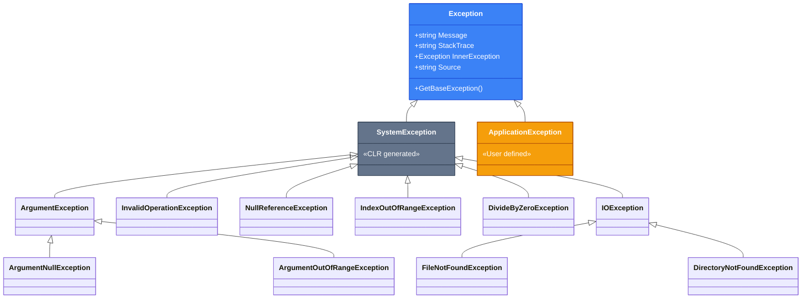
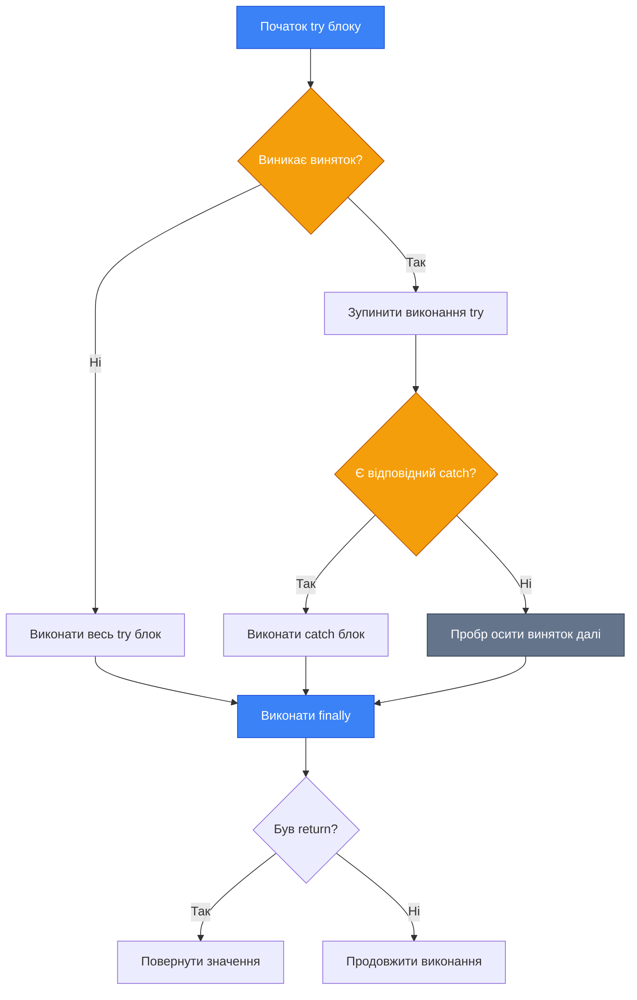
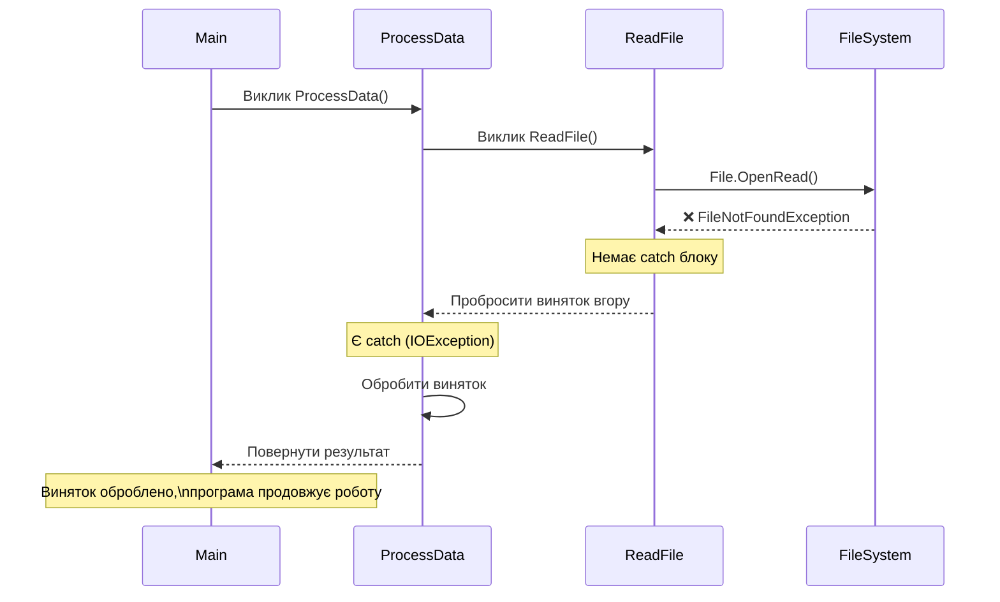

```mermaid
graph LR
    A[Error Codes ❌ Громіздко] -->|Проблема: легко забути перевірити| B[Assertions ❌ Тільки для debug]
    B -->|Потрібен runtime механізм| C[Винятки ✅ Структуровані]
    C -->|Розвиток| D[Exception Filters ✅ when clause]
    D -->|Альтернатива| E[Result Pattern ✅ Без overhead]

    style A fill:#64748b,stroke:#334155,color:#ffffff
    style B fill:#64748b,stroke:#334155,color:#ffffff
    style C fill:#3b82f6,stroke:#1d4ed8,color:#ffffff
    style D fill:#f59e0b,stroke:#b45309,color:#ffffff
    style E fill:#3b82f6,stroke:#1d4ed8,color:#ffffff
```

# Обробка Винятків

## Вступ та Контекст

Уявіть, що ви створюєте систему обробки банківських транзакцій. Користувач вводить суму переказу, натискає "Підтвердити", і раптом... база даних недоступна. Або файл конфігурації пошкоджений. Або сума перевищує доступний баланс. Як ваша програма має відреагувати на ці ситуації?

::note
**Проблема**: У ранніх мовах програмування (C, Pascal) помилки обробляли через коди повернення. Кожен виклик функції потрібно було перевіряти вручну. Це призводило до громіздкого, важкочитабельного коду, де логіка бізнесу змішувалася з перевіркою помилок.
::

**Винятки (Exceptions)** вирішують цю проблему елегантно. Вони дозволяють **відокремити** нормальну логіку програми від коду обробки помилок, автоматично передають інформацію про помилку вгору по стеку викликів і гарантують, що критичні ресурси будуть звільнені навіть у випадку збою.

### Еволюція Обробки Помилок

::mermaid



::

### Передумови

Перед вивченням цієї теми вам потрібно розуміти:

-   Методи та їх виклики
-   Поняття стеку викликів (call stack)
-   Базові концепції ООП (класи, наслідування)
-   [Інтерфейси](./3.interfaces-deep-dive.md) (опціонально для розуміння `IDisposable`)

## Фундаментальні Концепції

### Що таке Виняток?

[**Виняток** (Exception)](https://learn.microsoft.com/en-us/dotnet/csharp/fundamentals/exceptions/) — це об'єкт, що представляє помилку або виняткову ситуацію, яка виникає під час виконання програми. Коли виникає виняток, нормальний потік виконання програми **перериваєтьс я**, і управління передається до найближчого обробника винятків (exception handler).

**Теорія: Винятки vs Помилки Логіки**

Важливо розуміти різницю між **винятками** та **помилками логіки**:

-   **Винятки** (Exceptions) — це **несподівані ситуації**, які програма може спробувати обробити: відсутній файл, проблеми з мережею, невалідний ввід користувача.
-   **Помилки логіки** (Bugs) — це **дефекти в коді**: звернення до `null` посилання через неправильну логіку, вихід за межі масиву через некоректний індекс. Це має бути виправлено на етапі розробки, а не оброблено в runtime.

### Ієрархія Винятків

Усі винятки в .NET успадковуються від базового класу [`System.Exception`](https://learn.microsoft.com/en-us/dotnet/api/system.exception):

::mermaid



::

**Ключові типи винятків:**

| Тип                           | Коли виникає                                      | Приклад                              |
| :---------------------------- | :------------------------------------------------ | :----------------------------------- |
| `ArgumentNullException`       | Параметр методу є `null`, а метод очікує значення | Передача `null` у `string.Format`    |
| `ArgumentOutOfRangeException` | Аргумент поза допустимим діапазоном               | Від'ємний індекс масиву              |
| `InvalidOperationException`   | Операція недійсна в поточному стані об'єкта       | Читання з закритого `Stream`         |
| `NullReferenceException`      | Спроба доступу до члена `null` посилання          | `string s = null; s.Length;`         |
| `IndexOutOfRangeException`    | Індекс масиву за межами                           | `arr[100]` для масиву з 10 елементів |
| `DivideByZeroException`       | Ділення на нуль (тільки для цілих чисел)          | `int x = 5 / 0;`                     |
| `FileNotFoundException`       | Файл не знайдено                                  | `File.ReadAllText("missing.txt")`    |
| `IOException`                 | Помилка введення-виведення                        | Немає прав доступу до файлу          |

### Анатомія Винятку

Кожен об'єкт винятку містить критично важливу діагностичну інформацію:

```csharp [ExceptionAnatomy.cs] showLineNumbers
try
{
    int[] numbers = [1, 2, 3];
    Console.WriteLine(numbers[10]); // Вихід за межі масиву
}
catch (IndexOutOfRangeException ex)
{
    Console.WriteLine($"Message: {ex.Message}");
    Console.WriteLine($"StackTrace:\n{ex.StackTrace}");
    Console.WriteLine($"Source: {ex.Source}");
    Console.WriteLine($"TargetSite: {ex.TargetSite}");
}

/* Вивід:
Message: Index was outside the bounds of the array.
StackTrace:
   at Program.<Main>$(String[] args) in Program.cs:line 4
Source: YourProgramName
TargetSite: Void <Main>$(System.String[])
*/
```

**Ключові властивості:**

-   **`Message`**: Зрозуміле людині повідомлення про помилку.
-   **`StackTrace`**: Послідовність викликів методів, що призвела до помилки (критично для налагодження).
-   **`InnerException`**: Вкладений виняток, якщо поточний виняток був викликаний іншим.
-   **`Source`**: Ім'я додатку або об'єкта, що викликав виняток.
-   **`TargetSite`**: Метод, що викинув виняток.

## Try-Catch-Finally

Основна конструкція для обробки винятків складається з трьох блоків: `try`, `catch` та `finally`.

### Базовий Синтаксис

```csharp [TryCatchBasic.cs] showLineNumbers
try
{
    // Код, який може викинути виняток
    int result = 10 / 0;
}
catch (DivideByZeroException ex)
{
    // Обробка конкретного типу винятку
    Console.WriteLine($"Помилка: {ex.Message}");
}
finally
{
    // Код, який виконається завжди (навіть якщо виняток не було)
    Console.WriteLine("Очищення ресурсів...");
}
```

**Як це працює:**

1. **`try` блок**: Код всередині `try` виконується як зазвичай.
2. **Якщо виняток виникає**: CLR шукає відповідний `catch` блок.
3. **`catch` блок**: Виконується, якщо тип винятку співпадає.
4. **`finally` блок**: Виконується **завжди** — незалежно від того, виник виняток чи ні, навіть якщо в `catch` є `return`.

::mermaid



::

### Множинні Catch Блоки

Ви можете обробляти різні типи винятків по-різному:

```csharp [MultipleCatch.cs] showLineNumbers {8,13,18}
try
{
    string filePath = "data.json";
    string content = File.ReadAllText(filePath);
    int number = int.Parse(content);
    int result = 100 / number;
}
catch (FileNotFoundException ex)
{
    // Специфічна обробка для відсутнього файлу
    Console.WriteLine($"Файл не знайдено: {ex.FileName}");
}
catch (FormatException ex)
{
    // Обробка невалідного формату числа
    Console.WriteLine($"Невалідний формат даних: {ex.Message}");
}
catch (DivideByZeroException ex)
{
    // Обробка ділення на нуль
    Console.WriteLine("Ділення на нуль!");
}
catch (Exception ex)
{
    // Загальна обробка будь-якого іншого винятку
    Console.WriteLine($"Невідома помилка: {ex.Message}");
}
```

::warning
**Порядок має значення!** Блоки `catch` перевіряються **зверху вниз**. Розміщуйте більш **конкретні** винятки перед більш **загальними**. Якщо ви розмістите `catch (Exception ex)` першим, він перехопить **всі** винятки, і наступні блоки ніколи не виконаються.
::

### Гарантії Finally Блоку

**Теорія: Коли Finally НЕ виконується**

Блок `finally` виконується майже завжди, але є **рідкісні винятки**:

1.  **`Environment.FailFast()`**: Негайне завершення процесу без очищення.
2.  **Stack Overflow**: Переповнення стеку (рекурсія без виходу).
3.  **Критичні помилки CLR**: Внутрішні збої віртуальної машини.
4.  **Збій живлення**: Відключення сервера.

В усіх нормальних сценаріях `finally` **гарантовано** виконається.

```csharp [FinallyGuarantee.cs] showLineNumbers
static string ReadFile(string path)
{
    FileStream? stream = null;
    try
    {
        stream = File.OpenRead(path);
        using var reader = new StreamReader(stream);
        return reader.ReadToEnd(); // return не перешкоджає finally!
    }
    catch (IOException ex)
    {
        Console.WriteLine($"Помилка читання: {ex.Message}");
        return string.Empty; // return з catch теж не перешкоджає
    }
    finally
    {
        // Виконається ЗАВЖДИ перед поверненням з методу
        stream?.Dispose();
        Console.WriteLine("Файл закрито");
    }
}
```

::tip
**Best Practice**: Використовуйте `finally` для звільнення ресурсів (закриття файлів, з'єднань з БД, мережевих сокетів). Ще краще — використовуйте [`using` statement](https://learn.microsoft.com/en-us/dotnet/csharp/language-reference/statements/using), який автоматично генерує `try-finally` блок.
::

### Розмотування Стеку (Stack Unwinding)

Коли виникає виняток, CLR починає **розмотування стеку викликів** (stack unwinding) — пошук відповідного обробника:

::mermaid



::

**Демонстрація Stack Unwinding:**

```csharp [StackUnwindingDemo.cs] showLineNumbers
using System;
using System.IO;

class Program
{
    static void Main()
    {
        Console.WriteLine("Main: Початок");

        try
        {
            ProcessData("data.txt");
            Console.WriteLine("Main: Операція успішна");
        }
        catch (IOException ex)
        {
            Console.WriteLine($"Main: Перехопив IOException: {ex.Message}");
            Console.WriteLine($"\nStack Trace:\n{ex.StackTrace}");
        }

        Console.WriteLine("Main: Завершення");
    }

    static void ProcessData(string filename)
    {
        Console.WriteLine("  ProcessData: Обробка даних з файлу...");

        // Тут немає try-catch для FileNotFoundException
        // Виняток пробросится до Main()
        string content = ReadFile(filename);

        Console.WriteLine($"  ProcessData: Прочитано {content.Length} символів");
    }

    static string ReadFile(string path)
    {
        Console.WriteLine("    ReadFile: Відкриття файлу...");

        // Якщо файл не існує — викинеться FileNotFoundException
        // Стек розмотується: ReadFile -> ProcessData -> Main
        string content = File.ReadAllText(path);

        Console.WriteLine("    ReadFile: Файл прочитано");
        return content;
    }
}

/* Вивід (якщо файлу немає):
Main: Початок
  ProcessData: Обробка даних з файлу...
    ReadFile: Відкриття файлу...
Main: Перехопив IOException: Could not find file '/path/to/data.txt'.

Stack Trace:
   at System.IO.FileStream.ValidateFileHandle(SafeFileHandle fileHandle)
   at System.IO.FileStream..ctor(String path, FileMode mode, FileAccess access)
   at System.IO.File.ReadAllText(String path)
   at Program.ReadFile(String path) in Program.cs:line 38
   at Program.ProcessData(String filename) in Program.cs:line 25
   at Program.Main() in Program.cs:line 12
Main: Завершення
*/
```

**Покрокове пояснення:**

1. **`Main()` викликає `ProcessData()`** — додає frame у стек.
2. **`ProcessData()` викликає `ReadFile()`** — ще один frame.
3. **`ReadFile()` викликає `File.ReadAllText()`** — виникає `FileNotFoundException`.
4. **Пошук обробника:**
    - CLR шукає `catch` у `ReadFile()` — немає.
    - Повертається до `ProcessData()` — немає `catch`.
    - Повертається до `Main()` — знайдено `catch (IOException)`!
5. **Виняток перехоплено** — `FileNotFoundException` є підкласом `IOException`, тому блок спрацьовує.
6. Програма продовжує нормальне виконання після `catch`.

::note
**Важливе спостереження**: У `StackTrace` видно весь шлях виклику — від `File.ReadAllText()` → `ReadFile()` → `ProcessData()` → `Main()`. Це дозволяє точно відстежити, де саме виникла помилка та як ми до неї дійшли.
::

**Що відбувається:**

1. CLR шукає `catch` блок у поточному методі.
2. Якщо не знайдено — повертається до методу, що викликав (`caller`).
3. Процес повторюється до тих пір, поки не буде знайдено `catch` або досягнуто `Main()`.
4. Якщо жоден обробник не знайдено — програма **аварійно завершується** з unhandled exception.

## Exception Filters (Фільтри Винятків)

C# 6.0 ввів **фільтри винятків** з ключовим словом [`when`](https://learn.microsoft.com/en-us/dotnet/csharp/language-reference/keywords/when) — потужний механізм для умовної обробки винятків.

### Синтаксис

```csharp [ExceptionFilter.cs] showLineNumbers
try
{
    await httpClient.GetStringAsync("https://api.example.com/data");
}
catch (HttpRequestException ex) when (ex.StatusCode == HttpStatusCode.NotFound)
{
    Console.WriteLine("Ресурс не знайдено (404)");
}
catch (HttpRequestException ex) when (ex.StatusCode == HttpStatusCode.Unauthorized)
{
    Console.WriteLine("Не авторизовано (401). Оновіть токен");
}
catch (HttpRequestException ex)
{
    Console.WriteLine($"Інша HTTP помилка: {ex.StatusCode}");
}
```

### Переваги над If-Else

::code-group

```csharp [❌ If-Else в Catch] showLineNumbers
try
{
    // ...
}
catch (HttpRequestException ex)
{
    if (ex.StatusCode == HttpStatusCode.NotFound)
    {
        Console.WriteLine("404");
    }
    else if (ex.StatusCode == HttpStatusCode.Unauthorized)
    {
        Console.WriteLine("401");
    }
    else
    {
        Console.WriteLine("Інша помилка");
    }
}
```

```csharp [✅ Exception Filters] showLineNumbers
try
{
    // ...
}
catch (HttpRequestException ex) when (ex.StatusCode == HttpStatusCode.NotFound)
{
    Console.WriteLine("404");
}
catch (HttpRequestException ex) when (ex.StatusCode == HttpStatusCode.Unauthorized)
{
    Console.WriteLine("401");
}
catch (HttpRequestException ex)
{
    Console.WriteLine("Інша помилка");
}
```

::

**Чому фільтри кращі:**

| Критерій          | If-Else в Catch                    | Exception Filters (`when`)                |
| :---------------- | :--------------------------------- | :---------------------------------------- |
| **Читабельність** | Вкладена логіка, важко читати      | Плоска структура, легко сканувати         |
| **Debugging**     | Стек вже розмотано                 | Стек **не** розмотується до перевірки     |
| **Точки зупинки** | Break on first chance не допомагає | Debugger зупиняється на правильному catch |
| **Performance**   | Виняток завжди спіймано            | Виняток пробрасується, якщо умова false   |

**Теорія: Стек не розмотується при перевірці фільтра**

Це критична відмінність! Коли CLR зустрічає `catch` з `when`:

1. Виняток **НЕ** перехоплюється негайно.
2. Обчислюється умова `when`.
3. Якщо `false` — CLR продовжує пошук далі по стеку, **не очищуючи поточний frame**.
4. Якщо `true` — тільки тоді виняток перехоплюється.

Це означає, що **стек залишається неушкодженим** для налагодження, навіть якщо фільтр не спрацював.

### Складні Фільтри з Логуванням

Фільтри можуть викликати методи (але будьте обережні з побічними ефектами!):

```csharp [FilterWithLogging.cs] showLineNumbers
static bool LogException(Exception ex)
{
    Console.WriteLine($"[LOG] {DateTime.Now}: {ex.GetType().Name} - {ex.Message}");
    return false; // Завжди повертаємо false, щоб НЕ перехоплювати
}

try
{
    // Потенційно небезпечний код
    RiskyOperation();
}
catch (Exception ex) when (LogException(ex))
{
    // Цей блок НІКОЛИ не виконається, бо LogException повертає false
    // Але виняток буде залоговано!
}
catch (SpecificException ex)
{
    // Реальна обробка
}
```

::caution
**Побічні ефекти у фільтрах**: Умова `when` має бути **чистою функцією** (pure function) — не змінювати стан програми. Виключення: логування для діагностики. Але навіть тут будьте обережні — якщо логування викине виняток, він замінить оригінальний!
::

## Throwing Exceptions (Викидання Винятків)

### Оператор `throw`

Щоб **викинути** виняток, використовуйте ключове слово [`throw`](https://learn.microsoft.com/en-us/dotnet/csharp/language-reference/statements/exception-handling-statements#the-throw-statement):

```csharp [ThrowBasic.cs] showLineNumbers
public void SetAge(int age)
{
    if (age < 0 || age > 150)
    {
        throw new ArgumentOutOfRangeException(
            nameof(age),
            age,
            "Вік має бути в діапазоні 0-150"
        );
    }

    Age = age;
}
```

::tip
**Best Practice**: Використовуйте `nameof()` для передачі імені параметра. Це захистить від помилок при рефакторингу.
::

### Throw Expressions (C# 7.0+)

Починаючи з C# 7.0, `throw` може використовуватися як **вираз** у таких контекстах:

```csharp [ThrowExpressions.cs] showLineNumbers
// Null-coalescing з throw
public string Name { get; }

public User(string name)
{
    Name = name ?? throw new ArgumentNullException(nameof(name));
}

// Тернарний оператор
public int Divide(int a, int b)
{
    return b != 0
        ? a / b
        : throw new DivideByZeroException();
}

// Expression-bodied member
public string GetFileName() =>
    _fileName ?? throw new InvalidOperationException("Файл не встановлено");

// Lambda
Func<string, int> parser = s =>
    int.TryParse(s, out int result)
        ? result
        : throw new FormatException($"'{s}' не є числом");
```

### Re-throwing: `throw` vs `throw ex`

Це **критична різниця**, яка впливає на налагодження:

::code-group

```csharp [❌ ПОГАНО: throw ex] showLineNumbers
try
{
    DoSomething();
}
catch (Exception ex)
{
    Console.WriteLine($"Помилка: {ex.Message}");
    throw ex; // ❌ ВТРАТА StackTrace!
}
```

```csharp [✅ ДОБРЕ: throw] showLineNumbers
try
{
    DoSomething();
}
catch (Exception ex)
{
    Console.WriteLine($"Помилка: {ex.Message}");
    throw; // ✅ Зберігає оригінальний StackTrace
}
```

::

**Що відбувається:**

-   **`throw ex`**: Створюється **новий** StackTrace з поточної точки. Ви **втрачаєте** інформацію про оригінальне місце помилки.
-   **`throw`** (без аргументу): Пробрасує оригінальний виняток з **незмінним** StackTrace.

::warning
**Ніколи не використовуйте `throw ex`** без вагомої причини. Це ускладнює налагодження і приховує справжню причину помилки.
::

### Wrapping Exceptions (Обгортання Винятків)

Іноді потрібно "обгорнути" виняток нижчого рівня у більш зрозумілий контекстний:

```csharp [ExceptionWrapping.cs] showLineNumbers
public User LoadUser(int userId)
{
    try
    {
        string json = File.ReadAllText($"users/{userId}.json");
        return JsonSerializer.Deserialize<User>(json)!;
    }
    catch (FileNotFoundException ex)
    {
        // Обгортаємо технічний виняток у доменний
        throw new UserNotFoundException(
            userId,
            $"Користувача {userId} не знайдено",
            ex // ВАЖЛИВО: передаємо як InnerException!
        );
    }
    catch (JsonException ex)
    {
        throw new DataCorruptedException(
            $"Дані користувача {userId} пошкоджені",
            ex
        );
    }
}
```

**Переваги:**

-   Приховує технічні деталі від викликаючого коду.
-   Надає доменно-специфічну інформацію.
-   Зберігає оригінальний виняток в `InnerException` для налагодження.

## Custom Exceptions (Власні Винятки)

### Коли Створювати Власний Виняток?

Створюйте власний виняток, якщо:

1. **Потрібна доменна семантика**: `InsufficientFundsException` зрозуміліший за `InvalidOperationException`.
2. **Потрібні додаткові властивості**: зберігання `AccountId`, `RequestedAmount`, `AvailableBalance`.
3. **Різна обробка**: викликаючий код має обробляти це інакше, ніж інші винятки.

::warning
**Не створюйте винятки без потреби!** Якщо `ArgumentNullException` чи `InvalidOperationException` достатньо описують ситуацію — використовуйте їх.
::

### Стандартний Шаблон

```csharp [CustomException.cs] showLineNumbers
// 1. Успадкуйте від Exception або більш конкретної підкласи
// 2. Назва має закінчуватися на "Exception"
// 3. Реалізуйте три конструктори (стандартна практика)
public class InsufficientFundsException : Exception
{
    public string AccountId { get; }
    public decimal RequestedAmount { get; }
    public decimal AvailableBalance { get; }

    // Конструктор без параметрів
    public InsufficientFundsException()
    {
    }

    // Конструктор з повідомленням
    public InsufficientFundsException(string message)
        : base(message)
    {
    }

    // Конструктор з повідомленням та inner exception
    public InsufficientFundsException(string message, Exception innerException)
        : base(message, innerException)
    {
    }

    // Додатковий конструктор з доменними даними
    public InsufficientFundsException(
        string accountId,
        decimal requestedAmount,
        decimal availableBalance)
        : base($"Недостатньо коштів на рахунку {accountId}. " +
               $"Запитано: {requestedAmount:C}, доступно: {availableBalance:C}")
    {
        AccountId = accountId;
        RequestedAmount = requestedAmount;
        AvailableBalance = availableBalance;
    }
}
```

### Використання

```csharp [UsingCustomException.cs] showLineNumbers
public class BankAccount
{
    public string Id { get; init; }
    public decimal Balance { get; private set; }

    public void Withdraw(decimal amount)
    {
        if (amount > Balance)
        {
            throw new InsufficientFundsException(
                Id,
                amount,
                Balance
            );
        }

        Balance -= amount;
    }
}

// Обробка
try
{
    account.Withdraw(1000m);
}
catch (InsufficientFundsException ex)
{
    Console.WriteLine(ex.Message);
    Console.WriteLine($"Рахунок: {ex.AccountId}");
    Console.WriteLine($"Бракує: {ex.RequestedAmount - ex.AvailableBalance:C}");

    // Можна відобразити користувачу конкретну інформацію
    ShowInsufficientFundsDialog(ex);
}
```

### Серіалізація (Застаріла, але корисно знати)

До .NET Core 3.0 винятки потрібно було робити серіалізованими для передачі між AppDomains:

```csharp
[Serializable]
public class CustomException : Exception
{
    public string CustomProperty { get; set; }

    // Конструктор серіалізації
    protected CustomException(SerializationInfo info, StreamingContext context)
        : base(info, context)
    {
        CustomProperty = info.GetString(nameof(CustomProperty))!;
    }

    public override void GetObjectData(SerializationInfo info, StreamingContext context)
    {
        base.GetObjectData(info, context);
        info.AddValue(nameof(CustomProperty), CustomProperty);
    }
}
```

::note
У сучасному .NET (Core/5+) AppDomains практично не використовуються, тому серіалізація винятків рідко потрібна. Але якщо ви підтримуєте legacy код або працюєте з .NET Framework — майте це на увазі.
::

## Best Practices (Кращі Практики)

### 1. Fail Fast (Збій Швидко)

**Принцип**: Якщо виявлено некоректний стан, який може призвести до пошкодження даних — негайно викиньте виняток. Не намагайтеся "якось" продовжити роботу.

::code-group

```csharp [❌ ПОГАНО: Приховування Помилки] showLineNumbers
public void ProcessPayment(Payment payment)
{
    if (payment == null)
    {
        // Мовчки ігноруємо — НЕ РОБІТЬ ТАК!
        return;
    }

    // Продовжуємо з невалідними даними...
}
```

```csharp [✅ ДОБРЕ: Fail Fast] showLineNumbers
public void ProcessPayment(Payment payment)
{
    ArgumentNullException.ThrowIfNull(payment); // C# 11+

    if (payment.Amount <= 0)
    {
        throw new ArgumentOutOfRangeException(
            nameof(payment),
            "Сума платежу має бути додатною"
        );
    }

    // Тепер можемо бути впевнені, що дані валідні
    _paymentGateway.Charge(payment);
}
```

::

**Переваги:**

-   Помилки виявляються **рано** — ближче до причини.
-   Легше налагоджувати — StackTrace вказує на реальну проблему.
-   Запобігає **каскадним збоям** через невалідні дані.

::tip
**Використовуйте Guard Clauses**: У C# 11+ є [`ArgumentNullException.ThrowIfNull()`](https://learn.microsoft.com/en-us/dotnet/api/system.argumentnullexception.throwifnull), [`ArgumentException.ThrowIfNullOrEmpty()`](https://learn.microsoft.com/en-us/dotnet/api/system.argumentexception.throwifnullorempty) та подібні методи для лаконічної валідації.
::

### 2. Don't Swallow Exceptions (Не "Ковтайте" Винятки)

Один з найгірших анти-патернів:

```csharp
❌ try
{
    RiskyOperation();
}
catch (Exception)
{
    // Порожній catch — "проковтнули" виняток
}
```

**Чому це катастрофічно:**

-   Програма продовжує працювати в **некоректному стані**.
-   **Неможливо** налагодити — немає жодної інформації.
-   Помилка проявиться пізніше в **непередбачуваному місці**.

**Що робити замість цього:**

```csharp
✅ try
{
    RiskyOperation();
}
catch (Exception ex)
{
    // ЗАВЖДИ хоч що-небудь робіть з винятком:
    _logger.LogError(ex, "Помилка при виконанні операції");

    // Можливі варіанти:
    // 1. Пробросити далі
    throw;

    // 2. Обгорнути в інший виняток
    throw new OperationFailedException("Операція не вдалася", ex);

    // 3. Повернути Result<T> з помилкою (паттерн Result)
    return Result.Failure<Data>(ex.Message);
}
```

### 3. Ловіть Конкретні Винятки

::code-group

```csharp [❌ Занадто Широко] showLineNumbers
try
{
    var data = LoadFromDatabase();
    ProcessData(data);
    SaveToFile(data);
}
catch (Exception ex) // Ловимо ВСЕ — погана ідея
{
    Console.WriteLine("Щось пішло не так");
}
```

```csharp [✅ Специфічна Обробка] showLineNumbers
try
{
    var data = LoadFromDatabase();
    ProcessData(data);
    SaveToFile(data);
}
catch (SqlException ex) when (ex.Number == 1205) // Deadlock
{
    // Повторити операцію
    _logger.LogWarning("Deadlock, повторна спроба...");
    Retry();
}
catch (IOException ex)
{
    _logger.LogError(ex, "Помилка запису файлу");
    throw new DataSaveException("Не вдалося зберегти дані", ex);
}
catch (InvalidOperationException ex)
{
    _logger.LogError(ex, "Невалідний стан даних");
    throw;
}
// НЕ ловимо Exception — хай необроблені винятки падають
```

::

**Чому це важливо:**

-   `ThreadAbortException`, `StackOverflowException`, `OutOfMemoryException` — **НЕ** треба обробляти. Це критичні збої CLR.
-   Ловлячи `Exception`, ви можете приховати помилки в бібліотеках, яких не очікували.

### 4. Використовуйте `using` або `try-finally` для Ресурсів

Ресурси (файли, з'єднання з БД, сокети) **завжди** треба звільняти:

::code-group

```csharp [❌ Небезпечно] showLineNumbers
FileStream stream = File.OpenRead("data.txt");
ProcessFile(stream);
stream.Dispose(); // НЕ виконається, якщо ProcessFile викине виняток!
```

```csharp [✅ try-finally] showLineNumbers
FileStream? stream = null;
try
{
    stream = File.OpenRead("data.txt");
    ProcessFile(stream);
}
finally
{
    stream?.Dispose();
}
```

```csharp [✅ using (Найкраще)] showLineNumbers
using FileStream stream = File.OpenRead("data.txt");
ProcessFile(stream);
// Dispose() викличеться автоматично навіть при винятку
```

::

### 5. Винятки — Не для Контролю Потоку

**Анти-патерн: Exception-Driven Development**

```csharp
❌ // НІКОЛИ не робіть так!
try
{
    int index = list.IndexOf(item);
    return list[index];
}
catch (ArgumentOutOfRangeException)
{
    return null; // Використовуємо виняток як if
}
```

**Чому це погано:**

-   **Продуктивність**: Створення винятку — дорога операція (захоплення StackTrace).
-   **Читабельність**: Код важко зрозуміти.
-   **Семантика**: Винятки для **виняткових** ситуацій, не для звичайної логіки.

**Правильно:**

```csharp
✅ int index = list.IndexOf(item);
if (index >= 0)
{
    return list[index];
}
return null;
```

### 6. Розуміння Вартості Винятків

**Теорія: Performance Impact**

Викидання та обробка винятку включає:

1. **Створення об'єкта** в купі (heap allocation).
2. **Захоплення StackTrace** — CLR проходить весь стек викликів і зберігає інформацію про кожен frame (дорого!).
3. **Розмотування стеку** — пошук обробника та виклик `finally` блоків.

Приблизна вартість: **~100-1000x повільніше** за звичайний `if-else`.

**Коли це прийнятно:**

-   Справді **виняткові** ситуації (відсутній файл, проблеми мережі).
-   Рідко виникають (< 1% випадків).

**Коли НЕ використовувати:**

-   Валідація введення користувача → `TryParse`, `TryGetValue`.
-   Бізнес-логіка (недостатньо коштів) → [Result Pattern](https://learn.microsoft.com/en-us/archive/msdn-magazine/2013/march/features-functional-programming-railway-oriented-programming) або повернення `bool`.

### Порівняльна Таблиця: Best Practices vs Anti-Patterns

| Best Practice                                 | Anti-Pattern                              | Наслідки Anti-Pattern                          |
| :-------------------------------------------- | :---------------------------------------- | :--------------------------------------------- |
| Викидайте конкретні винятки                   | `throw new Exception("error")`            | Важко обробляти, плутає викликаючий код        |
| Ловіть конкретні винятки                      | `catch (Exception)`                       | Ховає критичні помилки, ускладнює налагодження |
| `throw;` для re-throw                         | `throw ex;`                               | Втрата оригінального StackTrace                |
| `using` / `try-finally` для ресурсів          | Виклик `Dispose()` без захисту            | Витік ресурсів при винятку                     |
| Fail Fast при невалідних даних                | Мовчазне ігнорування або default значення | Каскадні збої, важко налагоджувати             |
| Логування ВСіХ винятків                       | Порожній `catch { }`                      | "Чорна діра" — помилка зникає безслідно        |
| Винятки для виняткових ситуацій               | Винятки для звичайного потоку             | Погана продуктивність, плутана логіка          |
| `ArgumentNullException.ThrowIfNull()`         | Перевірка вручну + `throw`                | Більше коду, можливі помилки                   |
| Обгортання у доменні винятки з InnerException | Втрата оригінального винятку              | Неможливо дізнатися справжню причину           |

::tip
**Альтернатива Винятками: Result Pattern**

Для бізнес-логіки розгляньте [Result Pattern](../../4.architecture-best-practices/4.validation-flow-control.md) — повернення об'єкта `Result<T>`, який містить або успішне значення, або інформацію про помилку. Це:

-   Швидше (немає overhead винятків)
-   Явніше (сигнатура методу показує, що може бути помилка)
-   Функціональний підхід (Railway Oriented Programming)

Бібліотеки: `FluentResults`, `ErrorOr`, `LanguageExt`.
::

## Troubleshooting (Усунення Проблем)

### Типові Помилки та Рішення

#### 1. NullReferenceException — Найчастіша Помилка

```csharp
❌ string name = user.Profile.Name; // user або Profile може бути null
```

**Рішення:**

```csharp
✅ // Null-conditional operator
string? name = user?.Profile?.Name;

✅ // Pattern matching (C# 9+)
if (user is { Profile.Name: var name })
{
    Console.WriteLine(name);
}

✅ // Nullable Reference Types (включити в .csproj)
<Nullable>enable</Nullable>
```

#### 2. Забули `await` — Винятки "Зникають"

```csharp
❌ async Task ProcessAsync()
{
    DoWorkAsync(); // Забули await — виняток НЕ буде оброблено!
}
```

**Рішення:**

```csharp
✅ async Task ProcessAsync()
{
    await DoWorkAsync(); // Тепер виняток пробросится
}

✅ // Або якщо не потрібен результат, але треба обробити помилку
_ = DoWorkAsync().ContinueWith(task =>
{
    if (task.IsFaulted)
    {
        _logger.LogError(task.Exception, "Помилка фонової задачі");
    }
}, TaskScheduler.Default);
```

#### 3. Deadlock у `async void`

```csharp
❌ async void Button_Click(object sender, EventArgs e)
{
    await LoadDataAsync();
    // Якщо тут виняток — програма впаде!
}
```

**Рішення:**

```csharp
✅ async void Button_Click(object sender, EventArgs e)
{
    try
    {
        await LoadDataAsync();
    }
    catch (Exception ex)
    {
        _logger.LogError(ex, "Помилка завантаження");
        MessageBox.Show($"Помилка: {ex.Message}");
    }
}
```

::caution
**async void** — небезпечно! Використовуйте **тільки** для event handlers. В усіх інших випадках повертайте `Task` або `Task<T>`.
::

### Налагодження з Debugger

#### Налаштування Exception Settings у Visual Studio / Rider

1. **Break on Thrown Exceptions**: `Debug → Windows → Exception Settings`
2. Увімкніть для типів, які вас цікавлять (наприклад, `System.NullReferenceException`)
3. Debugger зупиниться **в момент викидання**, а не в `catch`

#### Conditional Breakpoints на Винятках

```csharp
try
{
    ProcessItems(items);
}
catch (Exception ex) when (ex.Message.Contains("critical"))
{
    // Поставте breakpoint тут з умовою:
    // ex.Message.Contains("specific error")
    throw;
}
```

## Практика та Резюме

### Завдання для Закріплення

#### 🟢 Легкий Рівень: Базова Обробка Винятків

Напишіть метод `SafeDivide(int a, int b)`, який:

-   Виконує ділення `a / b`
-   Обробляє `DivideByZeroException`
-   Повертає `0` у випадку помилки
-   Логує помилку в консоль

::collapsible{title="💡 Підказка"}
Використовуйте `try-catch` з конкретним типом винятку. Не забудьте вивести повідомлення перед поверненням `0`.
::

::collapsible{title="✅ Рішення"}

```csharp [SafeDivide.cs] showLineNumbers
public static int SafeDivide(int a, int b)
{
    try
    {
        return a / b;
    }
    catch (DivideByZeroException ex)
    {
        Console.WriteLine($"Помилка: {ex.Message}. Повертаємо 0");
        return 0;
    }
}

// Використання
Console.WriteLine(SafeDivide(10, 2));  // 5
Console.WriteLine(SafeDivide(10, 0));  // Помилка: ... Повертаємо 0
```

::

---

#### 🟡 Середній Рівень: Власний Виняток з Валідацією

Створіть клас `EmailValidator` з методом `Validate(string email)`, який:

-   Перевіряє, чи містить email символ `@`
-   Викидає власний виняток `InvalidEmailException` з інформацією про email
-   `InvalidEmailException` має властивість `InvalidEmail` та відповідне повідомлення

Напишіть тестовий код, який обробляє цей виняток.

::collapsible{title="💡 Підказка"}

1. Створіть клас `InvalidEmailException : Exception`
2. Додайте властивість `public string InvalidEmail { get; }`
3. Реалізуйте три стандартних конструктори + один з параметром `invalidEmail`
4. У `Validate` використовуйте `string.Contains("@")`

::

::collapsible{title="✅ Рішення"}

```csharp [EmailValidator.cs] showLineNumbers
public class InvalidEmailException : Exception
{
    public string InvalidEmail { get; }

    public InvalidEmailException() { }

    public InvalidEmailException(string message) : base(message) { }

    public InvalidEmailException(string message, Exception innerException)
        : base(message, innerException) { }

    public InvalidEmailException(string invalidEmail, string message)
        : base(message)
    {
        InvalidEmail = invalidEmail;
    }
}

public class EmailValidator
{
    public static void Validate(string email)
    {
        if (string.IsNullOrWhiteSpace(email) || !email.Contains("@"))
        {
            throw new InvalidEmailException(
                email,
                $"Email '{email}' не є валідним: відсутній символ '@'"
            );
        }
    }
}

// Використання
try
{
    EmailValidator.Validate("testexample.com");
}
catch (InvalidEmailException ex)
{
    Console.WriteLine(ex.Message);
    Console.WriteLine($"Проблемний email: {ex.InvalidEmail}");
}
```

::

---

#### 🔴 Складний Рівень: Retry Logic з Exception Filters

Реалізуйте метод `ExecuteWithRetry<T>(Func<T> operation, int maxAttempts)`, який:

-   Виконує `operation` до `maxAttempts` разів
-   Повторює лише при `HttpRequestException` з кодом 429 (Too Many Requests) або 503 (Service Unavailable)
-   Використовує exception filters для перевірки статус-кодів
-   Чекає експоненційно зростаючий час між спробами (100ms, 200ms, 400ms...)
-   Логує кожну спробу
-   Пробрасує виняток після вичерпання спроб

::collapsible{title="💡 Підказка"}

1. Використовуйте цикл `for` для спроб
2. Exception filter: `catch (HttpRequestException ex) when (ex.StatusCode == ...)`
3. `Thread.Sleep(100 * (int)Math.Pow(2, attempt))` для експоненційного очікування
4. Не забудьте пробросити `throw;` після останньої спроби

::

::collapsible{title="✅ Рішення"}

```csharp [RetryLogic.cs] showLineNumbers
using System.Net;

public class RetryHelper
{
    public static T ExecuteWithRetry<T>(Func<T> operation, int maxAttempts)
    {
        for (int attempt = 1; attempt <= maxAttempts; attempt++)
        {
            try
            {
                return operation();
            }
            catch (HttpRequestException ex)
                when (ex.StatusCode == HttpStatusCode.TooManyRequests ||
                      ex.StatusCode == HttpStatusCode.ServiceUnavailable)
            {
                if (attempt == maxAttempts)
                {
                    Console.WriteLine($"❌ Вичерпано всі {maxAttempts} спроби");
                    throw; // Пробрасуємо після останньої спроби
                }

                int delayMs = 100 * (int)Math.Pow(2, attempt - 1);
                Console.WriteLine(
                    $"⚠️ Спроба {attempt}/{maxAttempts} не вдалася " +
                    $"({ex.StatusCode}). Очікування {delayMs}ms..."
                );

                Thread.Sleep(delayMs);
            }
            // Інші винятки пробрасуються негайно
        }

        throw new InvalidOperationException("Неочікуваний стан");
    }
}

// Використання (приклад з mock)
try
{
    int attempt = 0;
    var result = RetryHelper.ExecuteWithRetry(() =>
    {
        attempt++;
        if (attempt < 3)
        {
            throw new HttpRequestException(
                "Service Unavailable",
                null,
                HttpStatusCode.ServiceUnavailable
            );
        }
        return "Success!";
    }, maxAttempts: 5);

    Console.WriteLine($"✅ Результат: {result}");
}
catch (HttpRequestException ex)
{
    Console.WriteLine($"Операція не вдалася: {ex.Message}");
}
```

::

### Резюме

У цьому розділі ви вивчили:

1. **Фундаментальні концепції**:

    - Винятки як механізм обробки помилок
    - Ієрархія винятків та клас `System.Exception`
    - Розмотування стеку (stack unwinding)

2. **Try-Catch-Finally**:

    - Структура блоків обробки винятків
    - Гарантії виконання `finally`
    - Порядок множинних `catch` блоків

3. **Exception Filters**:

    - Ключове слово `when` для умовної обробки
    - Переваги над `if-else` у налагодженні
    - Збереження стеку при перевірці фільтра

4. **Throwing Exceptions**:

    - Оператор `throw` та throw expressions
    - Критична різниця між `throw` та `throw ex`
    - Обгортання винятків (exception wrapping)

5. **Custom Exceptions**:

    - Коли створювати власні винятки
    - Стандартний шаблон з трьома конструкторами
    - Додавання доменних властивостей

6. **Best Practices**:
    - ✅ Fail Fast — збій при першій помилці
    - ✅ Ловіть конкретні винятки, не `Exception`
    - ✅ Використовуйте `using` для ресурсів
    - ❌ Не "ковтайте" винятки
    - ❌ Не використовуйте винятки для контролю потоку
    - ❌ Ніколи не пишіть `throw ex`

::tip
**Наступні Кроки**:

-   Вивчіть [Pattern Matching](./5.pattern-matching.md) для витончених перевірок
-   Дослідіть [Result Pattern](../../4.architecture-best-practices/4.validation-flow-control.md) як альтернативу винятків
-   Практикуйте [асинхронну обробку помилок](../../6.internals-concurrency/5.async-await.md) з `Task` та `async/await`

::

### Корисні Посилання

-   [Exception Handling (C# Programming Guide)](https://learn.microsoft.com/en-us/dotnet/csharp/fundamentals/exceptions/)
-   [Best Practices for Exceptions](https://learn.microsoft.com/en-us/dotnet/standard/exceptions/best-practices-for-exceptions)
-   [Exception Class](https://learn.microsoft.com/en-us/dotnet/api/system.exception)
-   [When Keyword (Exception Filters)](https://learn.microsoft.com/en-us/dotnet/csharp/language-reference/keywords/when)
-   [Throw Statement](https://learn.microsoft.com/en-us/dotnet/csharp/language-reference/statements/exception-handling-statements)
