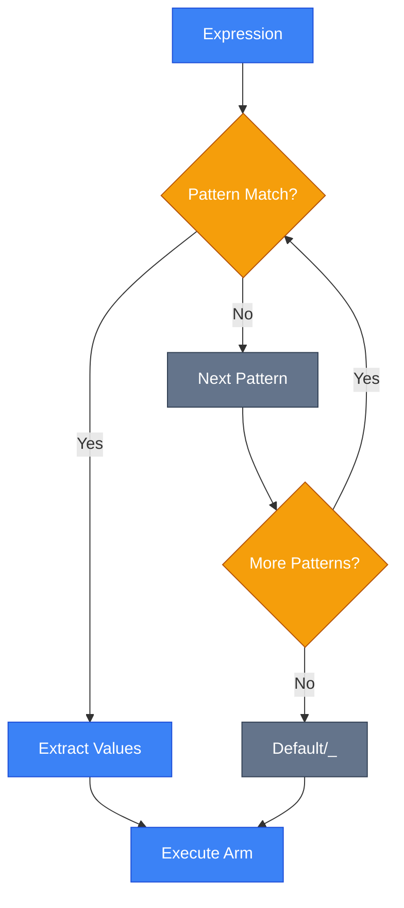
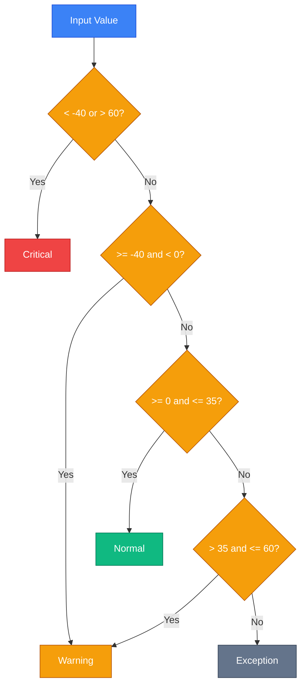

# Pattern Matching

## Вступ та Контекст

Уявіть, що ви будуєте систему обробки платежів. Кожен платіж може бути різного типу: кредитна картка, PayPal, криптовалюта. Кожен тип має різні властивості, і вам потрібно приймати рішення на основі цих властивостей.

**Класичний підхід** призводить до "спагетті-коду":

```csharp [PaymentProcessor.cs] {1,3,7,11} showLineNumbers
if (payment is CreditCardPayment)
{
    var ccPayment = (CreditCardPayment)payment;
    if (ccPayment.Amount > 1000 && ccPayment.Country == "UA")
    {
        // Спеціальна логіка для великих платежів в Україні
        ApplyFraudCheck(ccPayment);
    }
}
else if (payment is PayPalPayment)
{
    var ppPayment = (PayPalPayment)payment;
    if (ppPayment.IsVerified && ppPayment.Amount < 5000)
    {
        // Інша логіка
        ProcessQuickly(ppPayment);
    }
}
// ... ще 10 типів платежів
```

**Pattern Matching** перетворює цей код на виразну, типобезпечну конструкцію:

```csharp [PaymentProcessor.cs] {1-2,4} showLineNumbers
var action = payment switch
{
    CreditCardPayment { Amount: > 1000, Country: "UA" } => ApplyFraudCheck,
    PayPalPayment { IsVerified: true, Amount: < 5000 } => ProcessQuickly,
    CryptoPayment { Currency: "BTC", Amount: > 0.1m } => ProcessWithDelay,
    _ => ProcessStandard
};
action(payment);
```

::tip
**Filosof ФП (Функціональне Програмування)**: Pattern Matching — це одна з найпотужніших фіч, запозичених з функціональних мов (F#, Haskell). Вона робить код **декларативним** замість імперативного: ви описуєте "що" шукаєте, а не "як" це знайти.
::

### Історична Еволюція

Pattern Matching у C# еволюціонував поступово:

| Версія C#  | Нововведення                                                          | Приклад                                |
| :--------- | :-------------------------------------------------------------------- | :------------------------------------- |
| **C# 7.0** | Type patterns, `is` expression з змінною                              | `if (obj is string s)`                 |
| **C# 8.0** | Switch expressions, property patterns, positional patterns            | `x switch { Point(0, 0) => "Origin" }` |
| **C# 9.0** | Relational patterns (`>`, `<`), logical patterns (`and`, `or`, `not`) | `x is >= 0 and < 100`                  |
| **C# 10**  | Extended property patterns                                            | `obj is { Prop.SubProp: value }`       |
| **C# 11**  | **List patterns** 🔥                                                  | `array is [1, 2, ..]`                  |

::note
У цьому розділі ми розглянемо всі сучасні можливості Pattern Matching до C# 11 включно. Переконайтеся, що використовуєте .NET 7+ для підтримки всіх features.
::

### Prerequisites

Перед вивченням Pattern Matching вам потрібно знати:

-   **Типи даних**: Reference types, Value types, Records ([Розділ 2.5](/csharp/oop/advanced-types))
-   **Інтерфейси**: Базове розуміння ([Розділ 2.4](/csharp/oop/oop-pillars))
-   **Tuples**: Кортежі та deconstruction ([Розділ 2.5](/csharp/oop/advanced-types))
-   **Switch statement**: Класичний синтаксис ([Розділ 1.6](/csharp/fundamentals/control-flow))

---

## Фундаментальні Концепції

### Що таке Pattern?

**Pattern (Патерн)** — це _шаблон_, який описує структуру даних. Компілятор перевіряє, чи **відповідає** (matches) вираз цьому шаблону, і якщо так — може **вилучити** (extract) значення з виразу.

> **Аналогія з реального світу**: Уявіть, що ви сортуєте листи на пошті. Ви маєте набір "шаблонів":
>
> -   "Якщо конверт великий і має червону марку → відправити у відділення A"
> -   "Якщо конверт маленький і адреса починається з 'Київ' → відділення B"
>
> Pattern Matching працює так само: ви описуєте "шаблони" даних, і компілятор автоматично визначає, який шаблон підходить.

### Де можна використовувати Patterns?

Pattern Matching можна застосувати у:

1. **`is` expression** — перевірка з можливістю вилучення змінної
2. **`switch` expression** — вибір значення на основі patterns (C# 8+)
3. **`switch` statement** — класичний switch з patterns у `case`

::code-group

```csharp [is Expression] showLineNumbers
if (obj is string { Length: > 0 } s)
{
    Console.WriteLine($"Непорожній рядок: {s}");
}
```

```csharp [switch Expression] showLineNumbers
var result = obj switch
{
    string { Length: > 0 } s => $"Рядок: {s}",
    int i when i > 0 => $"Позитивне число: {i}",
    _ => "Щось інше"
};
```

```csharp [switch Statement] showLineNumbers
switch (obj)
{
    case string { Length: > 0 } s:
        Console.WriteLine($"Рядок: {s}");
        break;
    case int i when i > 0:
        Console.WriteLine($"Число: {i}");
        break;
    default:
        Console.WriteLine("Інше");
        break;
}
```

::

::warning
**Switch Expression vs Switch Statement**: Switch expression — це **вираз**, він повертає значення. Switch statement — це **інструкція**, виконує дії. У 99% випадків switch expression є кращим вибором для pattern matching завдяки стислості та типобезпеці.
::

### Exhaustiveness Checking

Одна з найпотужніших фіч — **перевірка вичерпності** (exhaustiveness checking). Компілятор **попереджає**, якщо ви не покрили всі можливі варіанти:

```csharp [Warning.cs] showLineNumbers
enum Status { Pending, Approved, Rejected }

string GetMessage(Status status) => status switch
{
    Status.Pending => "Очікує",
    Status.Approved => "Затверджено"
    // ⚠️ warning CS8509: The switch expression does not handle all possible values
    // (it is not exhaustive). For example, the pattern 'Status.Rejected' is not covered.
};
```

**Виправлення** — додати discard pattern `_`:

```csharp [Fixed.cs] {5} showLineNumbers
string GetMessage(Status status) => status switch
{
    Status.Pending => "Очікує",
    Status.Approved => "Затверджено",
    _ => "Невідомий статус"
};
```

::mermaid



::

---

## Type Pattern (Патерн Типу)

**Type Pattern** перевіряє, чи є вираз певного типу, і **вилучає** його у типобезпечну змінну.

### Синтаксис

```csharp
// is expression
if (obj is TypeName variable)
{
    // використовуємо variable
}

// switch expression
var result = obj switch
{
    TypeName variable => /* використовуємо variable */,
    _ => /* default */
};
```

### Базове Використання з `is`

```csharp [TypePattern.cs] showLineNumbers
object data = "Hello, Pattern Matching!";

if (data is string text)
{
    Console.WriteLine($"Це рядок довжиною {text.Length}");
    // ✅ змінна 'text' доступна тут
}
// ❌ змінна 'text' недоступна тут
```

**Що відбувається під капотом?**  
Компілятор генерує:

1. Перевірку типу з `is` operator
2. Safe cast до `string`
3. Присвоєння результату змінній `text`

Це **замінює** старий підхід:

```csharp [OldWay.cs] showLineNumbers
if (data is string)
{
    string text = (string)data; // unsafe cast
    Console.WriteLine($"Довжина: {text.Length}");
}
```

### Type Patterns у Switch Expression

```csharp [ShapeCalculator.cs] showLineNumbers
public abstract record Shape;
public record Circle(double Radius) : Shape;
public record Rectangle(double Width, double Height) : Shape;
public record Triangle(double Base, double Height) : Shape;

public static double CalculateArea(Shape shape) => shape switch
{
    Circle c => Math.PI * c.Radius * c.Radius,
    Rectangle r => r.Width * r.Height,
    Triangle t => 0.5 * t.Base * t.Height,
    _ => throw new ArgumentException("Невідома фігура")
};

// Використання
var circle = new Circle(5);
Console.WriteLine($"Площа кола: {CalculateArea(circle):F2}");
// Виведе: Площа кола: 78.54
```

::tip
**Best Practice**: Type patterns чудово поєднуються з **record types**, оскільки records автоматично генерують deconstruction, який використовується у Positional Patterns (div. далі).
::

### Відмінність від `as` Casting

::code-group

```csharp [Type Pattern ✅] showLineNumbers
if (obj is string s)
    Console.WriteLine(s.Length);
else
    Console.WriteLine("Не рядок");
```

```csharp [as Casting ❌] showLineNumbers
var s = obj as string;
if (s != null)
    Console.WriteLine(s.Length);
else
    Console.WriteLine("Не рядок");
```

::

**Чому Type Pattern кращий?**

-   ✅ Коротший синтаксис
-   ✅ Змінна `s` доступна лише у `if` блоці (scope safety)
-   ✅ Працює з value types (`obj is int i`)
-   ✅ Можна комбінувати з іншими patterns

---

## Property Pattern (Патерн Властивостей)

**Property Pattern** дозволяє перевірити **властивості** об'єкта без явного приведення типу.

### Синтаксис

```csharp
expression is Type { Property1: pattern1, Property2: pattern2 } variable
```

### Базовий Приклад

```csharp [User.cs] showLineNumbers
public record User(string Name, int Age, string Country);

User user = new("Олександр", 25, "Україна");

if (user is { Age: >= 18, Country: "Україна" })
{
    Console.WriteLine("Повнолітній громадянин України");
}
```

### Nested Property Patterns

Можна перевіряти **вкладені властивості**:

```csharp [Order.cs] showLineNumbers
public record Address(string City, string Country);
public record Customer(string Name, Address Address);
public record Order(Customer Customer, decimal Total);

Order order = new(
    new Customer("Марія", new Address("Київ", "Україна")),
    1500m
);

var message = order switch
{
    { Customer.Address.Country: "Україна", Total: > 1000 }
        => "Безкоштовна доставка по Україні!",
    { Customer.Address.Country: "Україна" }
        => "Доставка: 50 грн",
    _ => "Міжнародна доставка: 200 грн"
};

Console.WriteLine(message);
// Виведе: Безкоштовна доставка по Україні!
```

::note
**C# 10+**: Розширений синтаксис дозволяє писати `Customer.Address.Country` замість `Customer: { Address: { Country: ... } }`. Це значно покращує читабельність!
::

### Комбінування Type + Property Patterns

```csharp [Payment.cs] showLineNumbers
public abstract record Payment(decimal Amount);
public record CardPayment(decimal Amount, string CardNumber) : Payment(Amount);
public record CashPayment(decimal Amount, string Currency) : Payment(Amount);

public static string ProcessPayment(Payment payment) => payment switch
{
    CardPayment { Amount: > 1000, CardNumber: var card }
        => $"Картка {card}: потрібна додаткова перевірка",

    CardPayment { Amount: <= 1000 }
        => "Оброблено карткою",

    CashPayment { Currency: "UAH", Amount: < 10000 }
        => "Готівка прийнята",

    CashPayment { Currency: not "UAH" }
        => "Валюту потрібно обміняти",

    _ => "Невідомий тип платежу"
};
```

### Real-World Приклад: Валідація

```csharp [Validator.cs] showLineNumbers
public record Product(string Name, decimal Price, int Stock);

public static string ValidateProduct(Product product) => product switch
{
    { Name.Length: 0 }
        => "Назва не може бути порожньою",

    { Price: <= 0 }
        => "Ціна має бути більше 0",

    { Stock: < 0 }
        => "Кількість не може бути від'ємною",

    { Name.Length: > 100 }
        => "Назва занадто довга (макс. 100 символів)",

    _ => "OK"
};

var product = new Product("", 100m, 10);
Console.WriteLine(ValidateProduct(product));
// Виведе: Назва не може бути порожньою
```

---

## Tuple Pattern (Кортежний Патерн)

**Tuple Pattern** дозволяє перевіряти **кортежі** (tuples) і приймати рішення на основі множини значень одночасно.

### Базовий Синтаксис

```csharp [RockPaperScissors.cs] showLineNumbers
public enum Choice { Rock, Paper, Scissors }

public static string DetermineWinner(Choice player1, Choice player2)
    => (player1, player2) switch
{
    (Choice.Rock, Choice.Scissors) => "Гравець 1 виграв!",
    (Choice.Scissors, Choice.Paper) => "Гравець 1 виграв!",
    (Choice.Paper, Choice.Rock) => "Гравець 1 виграв!",

    (Choice.Scissors, Choice.Rock) => "Гравець 2 виграв!",
    (Choice.Paper, Choice.Scissors) => "Гравець 2 виграв!",
    (Choice.Rock, Choice.Paper) => "Гравець 2 виграв!",

    _ => "Нічия!"
};

Console.WriteLine(DetermineWinner(Choice.Rock, Choice.Scissors));
// Виведе: Гравець 1 виграв!
```

### Combining with Property Patterns

```csharp [DiscountCalculator.cs] showLineNumbers
public record Customer(string Name, bool IsPremium);
public record Product(decimal Price, string Category);

public static decimal CalculateDiscount(Customer customer, Product product)
    => (customer, product) switch
{
    ({ IsPremium: true }, { Category: "Electronics", Price: > 1000 })
        => product.Price * 0.20m, // 20% для преміум на дорогу електроніку

    ({ IsPremium: true }, _)
        => product.Price * 0.10m, // 10% для преміум на все інше

    (_, { Category: "Books" })
        => product.Price * 0.05m, // 5% на книги для всіх

    _ => 0m // без знижки
};

var customer = new Customer("Іван", true);
var product = new Product(1500m, "Electronics");
var discount = CalculateDiscount(customer, product);

Console.WriteLine($"Знижка: {discount:C}");
// Виведе: Знижка: 300,00 ₴
```

### Practical Example: State Machine

```csharp [DoorStateMachine.cs] showLineNumbers
public enum DoorState { Closed, Open, Locked }
public enum Action { Push, Pull, Lock, Unlock }

public static DoorState TransitionState(DoorState current, Action action, bool hasKey)
    => (current, action, hasKey) switch
{
    (DoorState.Closed, Action.Push, _) => DoorState.Open,
    (DoorState.Open, Action.Pull, _) => DoorState.Closed,
    (DoorState.Closed, Action.Lock, true) => DoorState.Locked,
    (DoorState.Locked, Action.Unlock, true) => DoorState.Closed,

    // Недозволені переходи
    (DoorState.Locked, _, false) => throw new InvalidOperationException("Потрібен ключ!"),
    (var state, _, _) => state // залишаємось у поточному стані
};

// Використання
var state = DoorState.Closed;
state = TransitionState(state, Action.Lock, true);
Console.WriteLine(state); // Виведе: Locked
```

::tip
**Use Case**: Tuple patterns ідеально підходять для **state machines**, **game logic**, та будь-яких сценаріїв, де рішення залежить від комбінації множини умов.
::

---

## Positional Pattern (Позиційний Патерн)

**Positional Pattern** використовує **deconstruction** для перевірки значень у певному порядку.

### Вимоги

Тип повинен мати метод `Deconstruct` або бути `record` (records автоматично генерують deconstruction).

### З Records

```csharp [Point.cs] showLineNumbers
public record Point(int X, int Y);

public static string ClassifyPoint(Point point) => point switch
{
    (0, 0) => "Початок координат",
    (0, _) => "На осі Y",
    (_, 0) => "На осі X",
    (var x, var y) when x == y => "На діагоналі (y = x)",
    (var x, var y) when x == -y => "На діагоналі (y = -x)",
    (> 0, > 0) => "Перший квадрант",
    (< 0, > 0) => "Другий квадрант",
    (< 0, < 0) => "Третій квадрант",
    _ => "Четвертий квадрант"
};

var point = new Point(5, 5);
Console.WriteLine(ClassifyPoint(point));
// Виведе: На діагоналі (y = x)
```

::note
**Зверніть увагу**: `(0, _)` означає "X дорівнює 0, Y — будь-яке значення". Символ `_` — це **discard pattern**, який ігнорує значення.
::

### Custom Deconstruct для Classes

```csharp [Person.cs] showLineNumbers
public class Person
{
    public string FirstName { get; set; }
    public string LastName { get; set; }
    public int Age { get; set; }

    // Метод Deconstruct дозволяє використовувати positional patterns
    public void Deconstruct(out string firstName, out string lastName, out int age)
    {
        firstName = FirstName;
        lastName = LastName;
        age = Age;
    }
}

public static string GreetPerson(Person person) => person switch
{
    ("Тарас", "Шевченко", _) => "Великий Кобзар!",
    (var first, var last, >= 18) => $"Вітаємо, {first} {last}!",
    (var first, _, < 18) => $"Привіт, {first}!",
    _ => "Привіт!"
};

var person = new Person { FirstName = "Олена", LastName = "Коваленко", Age = 25 };
Console.WriteLine(GreetPerson(person));
// Виведе: Вітаємо, Олена Коваленко!
```

### Nested Positional Patterns

```csharp [Geometry.cs] showLineNumbers
public record Point(int X, int Y);
public record Line(Point Start, Point End);

public static string AnalyzeLine(Line line) => line switch
{
    ((0, 0), (0, 0)) => "Це точка, а не лінія",
    ((var x1, var y1), (var x2, var y2)) when x1 == x2 => "Вертикальна лінія",
    ((var x1, var y1), (var x2, var y2)) when y1 == y2 => "Горизонтальна лінія",
    ((0, 0), _) => "Лінія починається з початку координат",
    (_, (0, 0)) => "Лінія закінчується у початку координат",
    _ => "Звичайна лінія"
};

var line = new Line(new Point(0, 0), new Point(5, 0));
Console.WriteLine(AnalyzeLine(line));
// Виведе: Горизонтальна лінія
```

---

## Relational & Logical Patterns

**Relational Patterns** (C# 9+) дозволяють використовувати **оператори порівняння**: `<`, `>`, `<=`, `>=`.  
**Logical Patterns** комбінують patterns за допомогою `and`, `or`, `not`.

### Relational Patterns

```csharp [GradeSystem.cs] showLineNumbers
public static string GetGrade(int score) => score switch
{
    >= 90 => "Відмінно",
    >= 75 and < 90 => "Добре",
    >= 60 and < 75 => "Задовільно",
    >= 0 and < 60 => "Незадовільно",
    _ => "Невалідний бал"
};

Console.WriteLine(GetGrade(85));
// Виведе: Добре
```

### Logical Patterns: `and`, `or`, `not`

```csharp [Validation.cs] showLineNumbers
public static bool IsValidPassword(string password) => password switch
{
    null or { Length: < 8 } => false,
    { Length: >= 8 and <= 20 } => true,
    _ => false
};

// Альтернативний синтаксис з `is`
public static bool IsWorkingHour(int hour)
    => hour is >= 9 and < 18;

// Використання `not`
public static bool IsWeekend(DayOfWeek day)
    => day is DayOfWeek.Saturday or DayOfWeek.Sunday;

public static bool IsWorkday(DayOfWeek day)
    => day is not (DayOfWeek.Saturday or DayOfWeek.Sunday);
```

### Parenthesized Patterns

Для складної логіки використовуйте **дужки**:

```csharp [ComplexLogic.cs] showLineNumbers
public record Employee(string Name, int Age, string Department, decimal Salary);

public static bool IsEligibleForBonus(Employee emp) => emp switch
{
    { Age: >= 30, Department: "IT" or "Sales", Salary: < 50000 } => true,
    { Department: "Management", Salary: >= 50000 and < 100000 } => true,
    _ => false
};

// З дужками для ясності
public static string ClassifyEmployee(Employee emp) => emp switch
{
    { Age: < 25 } and { Salary: < 30000 }
        => "Junior",

    ({ Age: >= 25 and < 40 } and { Salary: >= 30000 and < 60000 })
        or { Department: "IT", Age: < 30 }
        => "Middle",

    { Age: >= 40 } or { Salary: >= 60000 }
        => "Senior",

    _ => "Uncategorized"
};
```

### Real Example: Range Validation

```csharp [TemperatureMonitor.cs] showLineNumbers
public enum AlertLevel { Normal, Warning, Critical }

public static AlertLevel CheckTemperature(double celsius) => celsius switch
{
    < -40 or > 60 => AlertLevel.Critical,
    >= -40 and < 0 => AlertLevel.Warning,
    >= 0 and <= 35 => AlertLevel.Normal,
    > 35 and <= 60 => AlertLevel.Warning,
    _ => throw new ArgumentOutOfRangeException(nameof(celsius))
};

Console.WriteLine(CheckTemperature(38));
// Виведе: Warning
```

::mermaid



::

---

## List Patterns (C# 11+)

**List Patterns** дозволяють перевіряти **послідовності** (arrays, lists, spans) та їх елементи.

::warning
**Вимога**: List Patterns доступні з **C# 11** (.NET 7+). Переконайтеся, що ваш проєкт налаштований на відповідну версію:

```xml
<LangVersion>11</LangVersion>
```

::

### Базовий Синтаксис

```csharp [ListPatterns.cs] showLineNumbers
int[] numbers = { 1, 2, 3 };

// Точна відповідність
Console.WriteLine(numbers is [1, 2, 3]); // True
Console.WriteLine(numbers is [1, 2, 4]); // False

// Перевірка довжини
Console.WriteLine(numbers is [_, _, _]); // True (3 елементи)
Console.WriteLine(numbers is [_, _]); // False (не 2 елементи)
```

### Slice Pattern (`..`)

**Slice pattern** (`..`) відповідає "будь-якій кількості елементів":

```csharp [Slice.cs] showLineNumbers
int[] array = { 1, 2, 3, 4, 5 };

// Перший елемент — 1, решта — будь-що
Console.WriteLine(array is [1, ..]); // True

// Останній елемент — 5
Console.WriteLine(array is [.., 5]); // True

// Перший — 1, останній — 5, середина — будь-що
Console.WriteLine(array is [1, .., 5]); // True

// Хоча б 3 елементи
Console.WriteLine(array is [_, _, _, ..]); // True
```

### Capturing with `var`

```csharp [Capture.cs] showLineNumbers
string[] words = { "Hello", "Pattern", "Matching" };

if (words is [var first, .., var last])
{
    Console.WriteLine($"Перше слово: {first}, Останнє: {last}");
    // Виведе: Перше слово: Hello, Останнє: Matching
}

// Захоплення середини
if (words is [_, .. var middle, _])
{
    Console.WriteLine($"Середина: {string.Join(", ", middle)}");
    // Виведе: Середина: Pattern
}
```

### Combining with Other Patterns

```csharp [Advanced.cs] showLineNumbers
int[] data = { 1, 5, 10, 15, 20 };

// Перший елемент 0 або 1, другий > 0, решта будь-що
Console.WriteLine(data is [0 or 1, > 0, ..]); // True

// Довжина 2 або 4, перший < 0, останній <= 0
int[] test1 = { -1, 0 };
int[] test2 = { -1, 0, 0, 1 };

static string Validate(int[] arr) => arr is [< 0, .. { Length: 2 or 4 }, > 0]
    ? "valid"
    : "not valid";

Console.WriteLine(Validate(test1)); // not valid
Console.WriteLine(Validate(test2)); // not valid
```

### Real Example: Command Parser

```csharp [CommandParser.cs] showLineNumbers
public record Command(string Action, string[] Args);

public static string ParseCommand(string[] input) => input switch
{
    [] => "Порожня команда",

    ["help"] => "Довідка: доступні команди...",

    ["create", var name] => $"Створення: {name}",

    ["delete", var name, "force"] => $"Видалення {name} з примусовим режимом",
    ["delete", var name] => $"Видалення: {name}",

    ["list", .. var options] => $"Список з опціями: {string.Join(", ", options)}",

    ["config", "set", var key, var value] => $"Налаштування {key} = {value}",

    [var cmd, ..] => $"Невідома команда: {cmd}",

    _ => "Невалідний ввід"
};

// Використання
string[] cmd1 = { "create", "project.txt" };
Console.WriteLine(ParseCommand(cmd1));
// Виведе: Створення: project.txt

string[] cmd2 = { "delete", "old.txt", "force" };
Console.WriteLine(ParseCommand(cmd2));
// Виведе: Видалення old.txt з примусовим режимом

string[] cmd3 = { "list", "--verbose", "--sort=name" };
Console.WriteLine(ParseCommand(cmd3));
// Виведе: Список з опціями: --verbose, --sort=name
```

::tip
**Performance**: List patterns особливо ефективні з `Span<T>` та `ReadOnlySpan<T>`, оскільки не створюють нових масивів для slice operations.
::

---

## Best Practices та Anti-patterns

### ✅ Best Practices

#### 1. Exhaustive Matching

**Завжди обробляйте всі випадки** або додайте `_`:

```csharp [Good.cs] showLineNumbers
string GetStatus(int code) => code switch
{
    200 => "OK",
    404 => "Not Found",
    500 => "Server Error",
    _ => "Unknown" // ✅ обробляємо всі інші
};
```

#### 2. Order Patterns from Specific to General

```csharp [Good.cs] showLineNumbers
string Classify(object obj) => obj switch
{
    string { Length: > 100 } => "Довгий рядок", // ✅ специфічний
    string => "Рядок",                          // ✅ загальний
    int => "Число",
    _ => "Щось інше"
};
```

```csharp [Bad.cs] showLineNumbers
string Classify(object obj) => obj switch
{
    string => "Рядок",                          // ❌ загальний спочатку
    string { Length: > 100 } => "Довгий рядок", // ⚠️ unreachable!
    _ => "Щось інше"
};
```

#### 3. Use Property Patterns замість Guards (коли можливо)

```csharp [Good.cs] showLineNumbers
var result = user switch
{
    { Age: >= 18, Country: "UA" } => "OK", // ✅ читабельно
    _ => "NO"
};
```

```csharp [Less Good.cs] showLineNumbers
var result = user switch
{
    var u when u.Age >= 18 && u.Country == "UA" => "OK", // ❌ менш читабельно
    _ => "NO"
};
```

### ❌ Anti-patterns

#### 1. Надмірно Складні Nested Patterns

```csharp [Bad.cs] showLineNumbers
// ❌ Занадто складно для читання
var result = data switch
{
    {
        User: {
            Profile: {
                Settings: {
                    Theme: "Dark",
                    Language: "UK" or "EN"
                }
            },
            Age: >= 18 and < 65
        },
        IsActive: true
    } => "Process",
    _ => "Skip"
};
```

**Краще** — розбити на helper methods:

```csharp [Good.cs] showLineNumbers
bool IsValidUser(Data data) => data.User is
    { Age: >= 18 and < 65, Profile.Settings: { Theme: "Dark", Language: "UK" or "EN" } };

var result = data switch
{
    { IsActive: true } when IsValidUser(data) => "Process", // ✅ читабельно
    _ => "Skip"
};
```

#### 2. Duplicate Logic

```csharp [Bad.cs] showLineNumbers
// ❌ Дублювання логіки
var result = value switch
{
    > 0 and < 10 => "Small",
    >= 10 and < 100 => "Medium",
    >= 100 => "Large",
    < 0 => "Negative",
    _ => "Zero"
};
```

```csharp [Good.cs] showLineNumbers
// ✅ Логічна послідовність
var result = value switch
{
    < 0 => "Negative",
    0 => "Zero",
    < 10 => "Small",
    < 100 => "Medium",
    _ => "Large"
};
```

---

## Troubleshooting

### Помилка CS8509: Non-Exhaustive Switch

**Проблема**: Switch expression не покриває всі можливі значення.

```csharp
enum Color { Red, Green, Blue }

string GetName(Color c) => c switch
{
    Color.Red => "Червоний",
    Color.Green => "Зелений"
    // ⚠️ CS8509: The switch expression does not handle all possible values
};
```

**Рішення**: Додати відсутній випадок або `_`:

```csharp
string GetName(Color c) => c switch
{
    Color.Red => "Червоний",
    Color.Green => "Зелений",
    Color.Blue => "Синій",
    _ => throw new ArgumentOutOfRangeException(nameof(c))
};
```

::collapsible{title="Чому варто використовувати throw замість default значення?"}

Використання `throw` у `_` branch для enum'ів — **best practice**, оскільки:

1. **Fail Fast**: Якщо з'явиться новий enum value, код негайно впаде з виразною помилкою
2. **Типобезпека**: Компілятор попередить, якщо ви не обробили якийсь case
3. **Explicit Intent**: Чітко показує, що інші значення неприпустимі

```csharp
// ✅ Good
_ => throw new ArgumentOutOfRangeException(nameof(c), "Unexpected color")

// ❌ Bad (приховує проблему)
_ => "Unknown"
```

::

### Unreachable Pattern Warning

**Проблема**: Pattern ніколи не буде досягнутий через попередні patterns.

```csharp
var result = obj switch
{
    string => "String",
    string { Length: > 10 } => "Long string", // ⚠️ unreachable
    _ => "Other"
};
```

**Рішення**: Розташуйте patterns від більш специфічних до загальних:

```csharp
var result = obj switch
{
    string { Length: > 10 } => "Long string", // ✅ специфічний
    string => "String",                        // ✅ загальний
    _ => "Other"
};
```

### Pattern Subsumption

**Проблема**: Один pattern "поглинає" інший.

```csharp
var result = number switch
{
    > 0 => "Positive",
    > 10 => "Greater than 10", // ⚠️ unreachable (> 10 вже покрито > 0)
    _ => "Not positive"
};
```

**Рішення**:

```csharp
var result = number switch
{
    > 10 => "Greater than 10",  // ✅ спочатку більш специфічний
    > 0 => "Positive",
    _ => "Not positive"
};
```

---

## Практика

### Рівень 1: Beginner

**Завдання**: Створити функцію класифікації транспорту за допомогою Type та Property patterns.

```csharp [Task.cs] showLineNumbers
public abstract record Vehicle(string Brand);
public record Car(string Brand, int Doors) : Vehicle(Brand);
public record Motorcycle(string Brand, int EngineCC) : Vehicle(Brand);
public record Bicycle(string Brand, bool IsElectric) : Vehicle(Brand);

// TODO: Реалізувати функцію ClassifyVehicle
// Повертає:
// - "Легковий автомобіль" для Car
// - "Потужний мотоцикл" для Motorcycle з EngineCC > 600
// - "Звичайний мотоцикл" для інших Motorcycle
// - "Електровелосипед" для Bicycle { IsElectric: true }
// - "Велосипед" для інших Bicycle
// - "Невідомий транспорт" для інших

public static string ClassifyVehicle(Vehicle vehicle)
{
    // Ваш код тут
    throw new NotImplementedException();
}
```

::collapsible{title="Розв'язок"}

```csharp [Solution.cs] showLineNumbers
public static string ClassifyVehicle(Vehicle vehicle) => vehicle switch
{
    Car => "Легковий автомобіль",
    Motorcycle { EngineCC: > 600 } => "Потужний мотоцикл",
    Motorcycle => "Звичайний мотоцикл",
    Bicycle { IsElectric: true } => "Електровелосипед",
    Bicycle => "Велосипед",
    _ => "Невідомий транспорт"
};

// Тести
var car = new Car("Toyota", 4);
var bike = new Motorcycle("Harley", 750);
var ebike = new Bicycle("Trek", true);

Console.WriteLine(ClassifyVehicle(car));   // Легковий автомобіль
Console.WriteLine(ClassifyVehicle(bike));  // Потужний мотоцикл
Console.WriteLine(ClassifyVehicle(ebike)); // Електровелосипед
```

::

---

### Рівень 2: Intermediate

**Завдання**: Реалізувати калькулятор знижок з використанням Tuple та Relational patterns.

```csharp [Task.cs] showLineNumbers
public record Customer(string Name, int LoyaltyYears, decimal TotalSpent);
public record Purchase(decimal Amount, string Category);

// TODO: Реалізувати CalculateDiscount
// Правила знижок:
// 1. LoyaltyYears >= 5 AND TotalSpent > 10000 AND Amount > 500: 25%
// 2. LoyaltyYears >= 3 AND Category == "Electronics": 15%
// 3. Amount >= 1000: 10%
// 4. Category == "Books": 5%
// 5. Інакше: 0%

public static decimal CalculateDiscount(Customer customer, Purchase purchase)
{
    // Ваш код тут
    throw new NotImplementedException();
}
```

::collapsible{title="Розв'язок"}

```csharp [Solution.cs] showLineNumbers
public static decimal CalculateDiscount(Customer customer, Purchase purchase)
    => (customer, purchase) switch
{
    ({ LoyaltyYears: >= 5, TotalSpent: > 10000 }, { Amount: > 500 })
        => purchase.Amount * 0.25m,

    ({ LoyaltyYears: >= 3 }, { Category: "Electronics" })
        => purchase.Amount * 0.15m,

    (_, { Amount: >= 1000 })
        => purchase.Amount * 0.10m,

    (_, { Category: "Books" })
        => purchase.Amount * 0.05m,

    _ => 0m
};

// Тести
var loyalCustomer = new Customer("Марія", 6, 15000);
var newCustomer = new Customer("Іван", 1, 500);

var expensivePurchase = new Purchase(600, "Electronics");
var bookPurchase = new Purchase(200, "Books");

Console.WriteLine(CalculateDiscount(loyalCustomer, expensivePurchase));
// Виведе: 150 (25%)

Console.WriteLine(CalculateDiscount(newCustomer, bookPurchase));
// Виведе: 10 (5%)
```

::

---

### Рівень 3: Advanced

**Завдання**: Реалізувати парсер SQL-подібних команд з List Patterns.

```csharp [Task.cs] showLineNumbers
public abstract record SqlCommand;
public record SelectCommand(string Table, string[] Columns, string? Where) : SqlCommand;
public record InsertCommand(string Table, Dictionary<string, string> Values) : SqlCommand;
public record UpdateCommand(string Table, Dictionary<string, string> Values, string Where) : SqlCommand;
public record DeleteCommand(string Table, string Where) : SqlCommand;

// TODO: Реалізувати ParseSqlCommand
// Приклади:
// ["SELECT", "*", "FROM", "users"] => SelectCommand("users", ["*"], null)
// ["SELECT", "name", "age", "FROM", "users", "WHERE", "id=1"]
//     => SelectCommand("users", ["name", "age"], "id=1")
// ["INSERT", "INTO", "users", "name=John", "age=30"]
//     => InsertCommand("users", {"name": "John", "age": "30"})
// ["DELETE", "FROM", "users", "WHERE", "id=1"]
//     => DeleteCommand("users", "id=1")

public static SqlCommand ParseSqlCommand(string[] tokens)
{
    // Ваш код тут
    throw new NotImplementedException();
}
```

::collapsible{title="Розв'язок"}

```csharp [Solution.cs] showLineNumbers
public static SqlCommand ParseSqlCommand(string[] tokens) => tokens switch
{
    // SELECT * FROM table
    ["SELECT", "*", "FROM", var table]
        => new SelectCommand(table, ["*"], null),

    // SELECT col1 col2 FROM table WHERE condition
    ["SELECT", .. var cols, "FROM", var table, "WHERE", var where]
        => new SelectCommand(table, cols.ToArray(), where),

    // SELECT col1 col2 FROM table
    ["SELECT", .. var cols, "FROM", var table]
        => new SelectCommand(table, cols.ToArray(), null),

    // INSERT INTO table col1=val1 col2=val2 ...
    ["INSERT", "INTO", var table, .. var pairs]
        => new InsertCommand(table, ParsePairs(pairs)),

    // UPDATE table col1=val1 WHERE condition
    ["UPDATE", var table, .. var pairsAndWhere] when pairsAndWhere.Contains("WHERE")
        => ParseUpdate(table, pairsAndWhere),

    // DELETE FROM table WHERE condition
    ["DELETE", "FROM", var table, "WHERE", var where]
        => new DeleteCommand(table, where),

    _ => throw new ArgumentException("Невалідна SQL команда")
};

static Dictionary<string, string> ParsePairs(string[] pairs)
    => pairs.Select(p => p.Split('='))
            .ToDictionary(parts => parts[0], parts => parts[1]);

static UpdateCommand ParseUpdate(string table, string[] tokens)
{
    var whereIndex = Array.IndexOf(tokens, "WHERE");
    var pairs = tokens[..whereIndex];
    var where = tokens[whereIndex + 1];
    return new UpdateCommand(table, ParsePairs(pairs), where);
}

// Тести
var cmd1 = ParseSqlCommand(["SELECT", "*", "FROM", "users"]);
Console.WriteLine(cmd1);
// SelectCommand { Table = users, Columns = [*], Where =  }

var cmd2 = ParseSqlCommand(["SELECT", "name", "age", "FROM", "users", "WHERE", "id>10"]);
Console.WriteLine(cmd2);
// SelectCommand { Table = users, Columns = [name, age], Where = id>10 }

var cmd3 = ParseSqlCommand(["INSERT", "INTO", "products", "name=Phone", "price=500"]);
Console.WriteLine(cmd3);
// InsertCommand { Table = products, Values = {name: Phone, price: 500} }
```

::

---

## Резюме

### Ключові Концепції

-   **Pattern Matching** дозволяє перевіряти структуру даних та вилучати значення у типобезпечний спосіб
-   **Type Pattern**: перевірка типу з вилученням змінної (`obj is string s`)
-   **Property Pattern**: перевірка властивостей без casting (`{ Age: >= 18 }`)
-   **Tuple Pattern**: робота з кортежами (`(x, y) switch { ... }`)
-   **Positional Pattern**: використання deconstruction (`(0, 0) => "Origin"`)
-   **Relational/Logical Patterns**: оператори порівняння та логіка (`>= 0 and < 100`, `not null`)
-   **List Patterns** (C# 11+): перевірка послідовностей (`[1, .., 5]`)
-   **Switch Expression** — виразний та стислий спосіб pattern matching з exhaustiveness checking

### Коли використовувати кожен Pattern

| Pattern Type   | Use Case                       | Приклад                    |
| :------------- | :----------------------------- | :------------------------- |
| **Type**       | Робота з поліморфними типами   | Обробка різних типів Shape |
| **Property**   | Валідація об'єктів, фільтрація | Перевірка User.Age >= 18   |
| **Tuple**      | State machines, множинні умови | Гра "Камінь-ножиці-папір"  |
| **Positional** | Geометрія, структуровані дані  | Класифікація Point(x, y)   |
| **Relational** | Діапазони, рейтинги            | Система оцінювання         |
| **List**       | Парсинг команд, алгоритми      | Command-line parser        |

### Додаткові Ресурси

-   [Офіційна документація Microsoft Learn: Patterns](https://learn.microsoft.com/en-us/dotnet/csharp/language-reference/operators/patterns)
-   [Pattern Matching Tutorial](https://learn.microsoft.com/en-us/dotnet/csharp/fundamentals/tutorials/pattern-matching)
-   [C# Language Proposals: Pattern Matching](https://github.com/dotnet/csharplang/tree/main/proposals)

### Навігація

-   ← Попередній розділ: [Exception Handling](/csharp/advanced-core/exception-handling)
-   → Наступний розділ: [Additional Features](/csharp/advanced-core/additional-features)

::tip
**Практика**: Спробуйте переписати ваші існуючі `if-else` chains за допомогою pattern matching. Ви побачите, наскільки виразнішим та безпечнішим стане код!
::
