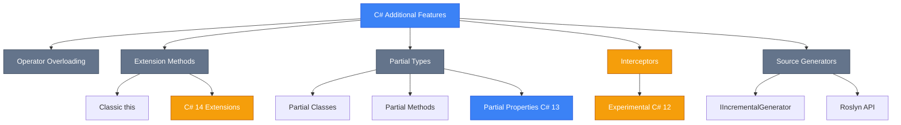
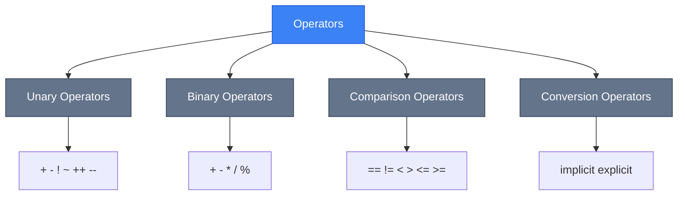
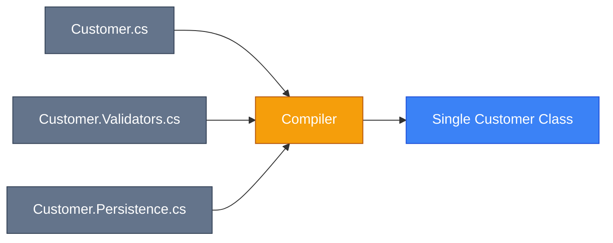
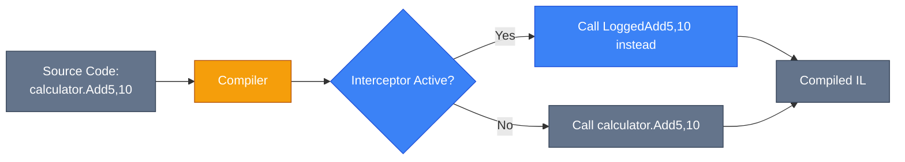

# Додаткові Можливості C#

::note
**Передумови**: Рекомендується ознайомитись з [класами та об'єктами](/csharp/oop/classes-objects), [generic типами](/csharp/advanced-core/generics) та [делегатами](/csharp/advanced-core/delegates-events-lambdas) перед вивченням цього розділу.
::

## Вступ та Контекст

C# постійно еволюціонує, пропонуючи розробникам потужні механізми для написання виразного, підтримуваного та ефективного коду. У цьому розділі ми розглянемо п'ять ключових можливостей мови:

1. **Operator Overloading** — надання нового значення стандартним операторам для власних типів
2. **Extension Methods** — розширення функціональності типів без зміни їх вихідного коду
3. **Partial Classes/Methods/Properties** — розбиття визначення типу на кілька файлів
4. **Interceptors** — експериментальна можливість заміни викликів методів на етапі компіляції
5. **Source Generators** — генерація коду під час компіляції за допомогою Roslyn API

::mermaid



::

### Еволюція Можливостей

| Можливість           | Версія C# | Статус       | Призначення                                      |
| :------------------- | :-------- | :----------- | :----------------------------------------------- |
| Operator Overloading | C# 1.0    | Stable       | Природний синтаксис для власних типів            |
| Extension Methods    | C# 3.0    | Stable       | Розширення типів без наслідування                |
| Partial Classes      | C# 2.0    | Stable       | Організація коду, generated code                 |
| Partial Methods      | C# 3.0    | Stable       | Хуки в generated code                            |
| Partial Properties   | C# 13     | Stable       | Розділення декларації та реалізації властивостей |
| Extension Members    | C# 14     | Preview      | Властивості та статичні розширення               |
| Interceptors         | C# 12     | Experimental | AOP, source generator hooks                      |
| Source Generators    | C# 9+     | Stable       | Compile-time code generation                     |

## Operator Overloading (Перевантаження Операторів)

### Навіщо це потрібно?

Уявіть, що ви створюєте математичну бібліотеку для роботи з векторами. Без перевантаження операторів ваш код виглядатиме так:

```csharp showLineNumbers
Vector a = new Vector(1, 2);
Vector b = new Vector(3, 4);
Vector sum = a.Add(b);
Vector scaled = sum.Multiply(2);
```

З перевантаженням операторів:

```csharp showLineNumbers
Vector a = new Vector(1, 2);
Vector b = new Vector(3, 4);
Vector sum = a + b;
Vector scaled = sum * 2;
```

**Набагато природніше!** Код читається як математична формула.

::tip
**Принцип найменшого здивування**: Перевантажуйте оператори тільки тоді, коли їх значення інтуїтивно зрозуміле. `Money + Money` — зрозуміло. `Customer + Order` — що це означає?
::

### Фундаментальні Концепції

[**Operator Overloading**](https://learn.microsoft.com/en-us/dotnet/csharp/language-reference/operators/operator-overloading) дозволяє визначити поведінку стандартних операторів C# (`+`, `-`, `*`, `==`, тощо) для власних типів.

**Ключові правила:**

-   Оператори оголошуються як `public static` методи
-   Використовується ключове слово `operator`
-   Деякі оператори мають бути перевантажені парами

### Синтаксис

```csharp showLineNumbers
public static ReturnType operator SymbolOperator(ParameterType parameter)
{
    // Реалізація
}
```

### Категорії Операторів

::mermaid



::

### Приклад: Vector Class

::code-group

```csharp [Vector.cs] showLineNumbers
public class Vector
{
    public double X { get; }
    public double Y { get; }

    public Vector(double x, double y)
    {
        X = x;
        Y = y;
    }

    // Унарний оператор: -vector
    public static Vector operator -(Vector v)
    {
        return new Vector(-v.X, -v.Y);
    }

    // Бінарний оператор: vector + vector
    public static Vector operator +(Vector a, Vector b)
    {
        return new Vector(a.X + b.X, a.Y + b.Y);
    }

    // Бінарний оператор: vector - vector
    public static Vector operator -(Vector a, Vector b)
    {
        return new Vector(a.X - b.X, a.Y - b.Y);
    }

    // Множення на скаляр: vector * number
    public static Vector operator *(Vector v, double scalar)
    {
        return new Vector(v.X * scalar, v.Y * scalar);
    }

    // Комутативне множення: number * vector
    public static Vector operator *(double scalar, Vector v)
    {
        return v * scalar;
    }

    // Скалярний добуток: vector * vector
    public static double operator *(Vector a, Vector b)
    {
        return a.X * b.X + a.Y * b.Y;
    }

    public override string ToString() => $"({X}, {Y})";
}
```

```csharp [Usage] showLineNumbers
Vector v1 = new Vector(3, 4);
Vector v2 = new Vector(1, 2);

// Унарний мінус
Vector negated = -v1;
Console.WriteLine(negated); // (-3, -4)

// Додавання
Vector sum = v1 + v2;
Console.WriteLine(sum); // (4, 6)

// Віднімання
Vector diff = v1 - v2;
Console.WriteLine(diff); // (2, 2)

// Множення на скаляр
Vector scaled = v1 * 2;
Console.WriteLine(scaled); // (6, 8)

// Комутативне множення
Vector scaled2 = 3 * v1;
Console.WriteLine(scaled2); // (9, 12)

// Скалярний добуток
double dotProduct = v1 * v2;
Console.WriteLine(dotProduct); // 11
```

::

**Розбір коду:**

-   **Рядки 13-16**: Унарний оператор `-` інвертує знаки компонентів вектора
-   **Рядки 19-22**: Бінарний `+` додає відповідні компоненти
-   **Рядки 30-33**: Множення вектора на число
-   **Рядки 36-39**: Комутативна версія (число спереду)
-   **Рядки 42-45**: Перевантаження для скалярного добутку (інший тип повернення!)

::warning
**Важливо**: Перевантажений оператор `*` має **дві різні версії** з різними типами повернення:

-   `Vector * double` → повертає `Vector`
-   `Vector * Vector` → повертає `double`

Це легально, оскільки сигнатури відрізняються параметрами!
::

### Приклад: Money Class

```csharp [Money.cs] showLineNumbers
public class Money
{
    public decimal Amount { get; }
    public string Currency { get; }

    public Money(decimal amount, string currency)
    {
        Amount = amount;
        Currency = currency ?? throw new ArgumentNullException(nameof(currency));
    }

    // Додавання грошей
    public static Money operator +(Money a, Money b)
    {
        if (a.Currency != b.Currency)
            throw new InvalidOperationException($"Cannot add {a.Currency} and {b.Currency}");

        return new Money(a.Amount + b.Amount, a.Currency);
    }

    // Віднімання грошей
    public static Money operator -(Money a, Money b)
    {
        if (a.Currency != b.Currency)
            throw new InvalidOperationException($"Cannot subtract {a.Currency} and {b.Currency}");

        return new Money(a.Amount - b.Amount, a.Currency);
    }

    // Множення на коефіцієнт
    public static Money operator *(Money money, decimal multiplier)
    {
        return new Money(money.Amount * multiplier, money.Currency);
    }

    // Ділення на коефіцієнт
    public static Money operator /(Money money, decimal divisor)
    {
        if (divisor == 0)
            throw new DivideByZeroException();

        return new Money(money.Amount / divisor, money.Currency);
    }

    public override string ToString() => $"{Amount:C} {Currency}";
}

// Використання
Money price = new Money(100, "UAH");
Money discount = new Money(20, "UAH");
Money finalPrice = price - discount; // 80 UAH

Money doubled = price * 2;            // 200 UAH
Money half = price / 2;               // 50 UAH

// Money usd = new Money(50, "USD");
// Money invalid = price + usd;       // ❌ Exception: Cannot add UAH and USD
```

### Оператори Порівняння

::caution
**Правило парності**: Якщо ви перевантажуєте оператор, ви **повинні** перевантажити його пару:

-   `==` та `!=`
-   `<` та `>`
-   `<=` та `>=`

Також рекомендується перевизначити `Equals()` та `GetHashCode()`.
::

```csharp [ComparableVector.cs] showLineNumbers
public class Vector : IEquatable<Vector>
{
    public double X { get; }
    public double Y { get; }

    public Vector(double x, double y)
    {
        X = x;
        Y = y;
    }

    // Оператор рівності
    public static bool operator ==(Vector? a, Vector? b)
    {
        if (ReferenceEquals(a, b)) return true;
        if (a is null || b is null) return false;
        return a.X == b.X && a.Y == b.Y;
    }

    // Оператор нерівності (пара для ==)
    public static bool operator !=(Vector? a, Vector? b)
    {
        return !(a == b);
    }

    // Перевизначення Equals для узгодженості
    public override bool Equals(object? obj)
    {
        return Equals(obj as Vector);
    }

    public bool Equals(Vector? other)
    {
        return this == other;
    }

    // Перевизначення GetHashCode
    public override int GetHashCode()
    {
        return HashCode.Combine(X, Y);
    }
}

// Використання
Vector v1 = new Vector(1, 2);
Vector v2 = new Vector(1, 2);
Vector v3 = new Vector(3, 4);

Console.WriteLine(v1 == v2);  // True
Console.WriteLine(v1 != v3);  // True
```

**Чому потрібні `Equals` і `GetHashCode`?**

-   `==` працює з операторами
-   `Equals()` використовується в колекціях (LINQ, Dictionary)
-   `GetHashCode()` критичний для `Dictionary<T>` та `HashSet<T>`

### Оператори Перетворення

Дозволяють неявно або явно перетворювати один тип на інший.

```csharp [ConversionOperators.cs] showLineNumbers
public class Celsius
{
    public double Temperature { get; }

    public Celsius(double temperature)
    {
        Temperature = temperature;
    }

    // Неявне перетворення: Celsius → double
    public static implicit operator double(Celsius c)
    {
        return c.Temperature;
    }

    // Явне перетворення: double → Celsius
    public static explicit operator Celsius(double temp)
    {
        return new Celsius(temp);
    }

    public override string ToString() => $"{Temperature}°C";
}

public class Fahrenheit
{
    public double Temperature { get; }

    public Fahrenheit(double temperature)
    {
        Temperature = temperature;
    }

    // Явне перетворення: Celsius → Fahrenheit
    public static explicit operator Fahrenheit(Celsius c)
    {
        return new Fahrenheit(c.Temperature * 9 / 5 + 32);
    }

    public override string ToString() => $"{Temperature}°F";
}

// Використання
Celsius celsius = new Celsius(25);

// Неявне перетворення
double temp = celsius;  // ✅ OK, implicit
Console.WriteLine(temp); // 25

// Явне перетворення
Celsius c2 = (Celsius)30.0;  // ✅ OK, explicit cast required
Console.WriteLine(c2); // 30°C

// Перетворення між класами
Fahrenheit fahrenheit = (Fahrenheit)celsius;
Console.WriteLine(fahrenheit); // 77°F
```

::tip
**Коли використовувати `implicit` vs `explicit`?**

-   **`implicit`**: Коли перетворення завжди безпечне і не втрачає інформації
-   **`explicit`**: Коли можлива втрата даних або потрібна явна згода розробника

::

### Індексатори (Indexers)

Хоча індексатори технічно не є операторами, вони перевантажують синтаксис `[]` і дуже корисні для колекцій.

```csharp [Matrix.cs] showLineNumbers
public class Matrix
{
    private double[,] _data;
    public int Rows { get; }
    public int Cols { get; }

    public Matrix(int rows, int cols)
    {
        Rows = rows;
        Cols = cols;
        _data = new double[rows, cols];
    }

    // Індексатор для доступу до елементів
    public double this[int row, int col]
    {
        get
        {
            if (row < 0 || row >= Rows || col < 0 || col >= Cols)
                throw new IndexOutOfRangeException();
            return _data[row, col];
        }
        set
        {
            if (row < 0 || row >= Rows || col < 0 || col >= Cols)
                throw new IndexOutOfRangeException();
            _data[row, col] = value;
        }
    }

    // Додатковий індексатор для лінійного доступу
    public double this[int index]
    {
        get
        {
            int row = index / Cols;
            int col = index % Cols;
            return this[row, col];
        }
        set
        {
            int row = index / Cols;
            int col = index % Cols;
            this[row, col] = value;
        }
    }
}

// Використання
Matrix matrix = new Matrix(3, 3);
matrix[0, 0] = 1.0;  // Використання індексатора
matrix[1, 1] = 2.0;
Console.WriteLine(matrix[0, 0]); // 1.0

// Лінійний доступ
matrix[4] = 5.0;  // Рядок 1, колонка 1
Console.WriteLine(matrix[1, 1]); // 5.0
```

**Переваги індексаторів:**

-   Природний синтаксис доступу до елементів
-   Можуть мати різні сигнатури (різна кількість параметрів)
-   Підтримка get та set accessors

### Оператори Інкременту/Декременту

```csharp [Counter.cs] showLineNumbers
public class Counter
{
    private int _value;

    public Counter(int initialValue = 0)
    {
        _value = initialValue;
    }

    public int Value => _value;

    // Prefix increment: ++counter
    public static Counter operator ++(Counter c)
    {
        c._value++;
        return c;
    }

    // Prefix decrement: --counter
    public static Counter operator --(Counter c)
    {
        c._value--;
        return c;
    }

    public override string ToString() => _value.ToString();
}

// Використання
Counter counter = new Counter(5);

// Prefix increment
++counter;
Console.WriteLine(counter); // 6

// Postfix також працює (компілятор обробляє автоматично)
counter++;
Console.WriteLine(counter); // 7

--counter;
Console.WriteLine(counter); // 6
```

::note
**Важливо**: C# не дозволяє окремо перевантажувати prefix (`++x`) та postfix (`x++`) форми. Компілятор автоматично обробляє обидві форми на основі одного перевантаженого оператора.
::

### Оператори True/False

Дозволяють використовувати власні типи в умовних виразах (`if`, `while`).

```csharp [Result.cs] showLineNumbers
public class Result
{
    public bool IsSuccess { get; }
    public string Message { get; }

    public Result(bool isSuccess, string message)
    {
        IsSuccess = isSuccess;
        Message = message;
    }

    // Оператор true
    public static bool operator true(Result r)
    {
        return r.IsSuccess;
    }

    // Оператор false (має бути парою з true)
    public static bool operator false(Result r)
    {
        return !r.IsSuccess;
    }

    // Логічний AND для short-circuit evaluation
    public static Result operator &(Result a, Result b)
    {
        if (!a.IsSuccess) return a;
        if (!b.IsSuccess) return b;
        return new Result(true, $"{a.Message} and {b.Message}");
    }

    // Логічний OR для short-circuit evaluation
    public static Result operator |(Result a, Result b)
    {
        if (a.IsSuccess) return a;
        if (b.IsSuccess) return b;
        return new Result(false, $"{a.Message} or {b.Message}");
    }
}

// Використання
Result CheckAge(int age)
{
    return age >= 18
        ? new Result(true, "Age OK")
        : new Result(false, "Too young");
}

Result CheckLicense(bool hasLicense)
{
    return hasLicense
        ? new Result(true, "License OK")
        : new Result(false, "No license");
}

Result ageCheck = CheckAge(20);
Result licenseCheck = CheckLicense(true);

// Використання в умові!
if (ageCheck && licenseCheck)
{
    Console.WriteLine("Can drive!");
}

// З операторами & та | працює short-circuit
Result combined = ageCheck && licenseCheck;
Console.WriteLine(combined.Message); // "Age OK and License OK"
```

::tip
**Pattern**: Оператори `true`/`false` у поєднанні з `&` і `|` дозволяють реалізувати short-circuit evaluation (`&&` і `||`) для власних типів!
::

### Bitwise та Логічні Оператори

```csharp [Permissions.cs] showLineNumbers
[Flags]
public enum Permission
{
    None = 0,
    Read = 1,
    Write = 2,
    Execute = 4,
    Delete = 8
}

public class PermissionSet
{
    private Permission _permissions;

    public PermissionSet(Permission permissions)
    {
        _permissions = permissions;
    }

    // Bitwise OR для додавання прав
    public static PermissionSet operator |(PermissionSet a, PermissionSet b)
    {
        return new PermissionSet(a._permissions | b._permissions);
    }

    // Bitwise AND для перевірки спільних прав
    public static PermissionSet operator &(PermissionSet a, PermissionSet b)
    {
        return new PermissionSet(a._permissions & b._permissions);
    }

    // Bitwise XOR для symmetric difference
    public static PermissionSet operator ^(PermissionSet a, PermissionSet b)
    {
        return new PermissionSet(a._permissions ^ b._permissions);
    }

    // Bitwise NOT для інверсії прав
    public static PermissionSet operator ~(PermissionSet p)
    {
        return new PermissionSet(~p._permissions);
    }

    public bool HasPermission(Permission permission)
    {
        return (_permissions & permission) == permission;
    }

    public override string ToString() => _permissions.ToString();
}

// Використання
var readWrite = new PermissionSet(Permission.Read | Permission.Write);
var writeExecute = new PermissionSet(Permission.Write | Permission.Execute);

// Об'єднання прав
var all = readWrite | writeExecute;
Console.WriteLine(all); // Read, Write, Execute

// Спільні права
var common = readWrite & writeExecute;
Console.WriteLine(common); // Write

// Перевірка прав
Console.WriteLine(all.HasPermission(Permission.Read)); // True
Console.WriteLine(readWrite.HasPermission(Permission.Execute)); // False
```

### Shift Operators (Зсув)

```csharp [BitArray.cs] showLineNumbers
public class BitArray
{
    private uint _bits;

    public BitArray(uint bits)
    {
        _bits = bits;
    }

    // Left shift: битовий зсув вліво
    public static BitArray operator <<(BitArray array, int shift)
    {
        return new BitArray(array._bits << shift);
    }

    // Right shift: битовий зсув вправо
    public static BitArray operator >>(BitArray array, int shift)
    {
        return new BitArray(array._bits >> shift);
    }

    // Unsigned right shift (C# 11+)
    public static BitArray operator >>>(BitArray array, int shift)
    {
        return new BitArray(array._bits >>> shift);
    }

    public override string ToString()
    {
        return Convert.ToString(_bits, 2).PadLeft(32, '0');
    }
}

// Використання
BitArray bits = new BitArray(0b00001111); // 15

BitArray shiftedLeft = bits << 2;
Console.WriteLine(shiftedLeft);  // 00111100 (60)

BitArray shiftedRight = bits >> 2;
Console.WriteLine(shiftedRight); // 00000011 (3)
```

::note
**C# 11**: Оператор `>>>` (unsigned right shift) був доданий у C# 11 для явного беззнакового зсуву.
::

### Таблиця Операторів

| Категорія    | Оператори           | Можна перевантажити?           | Парність    |
| :----------- | :------------------ | :----------------------------- | :---------- |
| Арифметичні  | `+ - * / %`         | ✅ Так                         | Немає       |
| Унарні       | `+ - ! ~ ++ --`     | ✅ Так                         | Немає       |
| Порівняння   | `== !=`             | ✅ Так                         | Обов'язкова |
| Порів Няння  | `< > <= >=`         | ✅ Так                         | Попарно     |
| Логічні      | `&& \|\|`           | ❌ Ні (але можна `& \|`)       | -           |
| Присвоєння   | `= += -= *= /=`     | ❌ Ні (виводяться автоматично) | -           |
| Індексування | `[]`                | ✅ Так (через indexers)        | -           |
| Виклик       | `()`                | ❌ Ні                          | -           |
| Перетворення | `implicit explicit` | ✅ Так                         | Немає       |

### Best Practices

::tip
✅ **Використовуйте**, коли:

-   Оператор має очевидне значення (`Complex + Complex`)
-   Підвищує читабельність математичного коду
-   Відповідає математичним або доменним конвенціям

❌ **Уникайте**, коли:

-   Значення оператора неочевидне чи неоднозначне
-   Операція дорога (краще явний метод)
-   Логіка складна і може здивувати користувача

::

## Extension Methods (Методи-Розширення)

### Проблема: Розширення Типів, які Ви не Контролюєте

Уявіть, що ви працюєте з класом `string`, але вам потрібен метод для перевірки, чи є рядок валідним email:

```csharp showLineNumbers
// ❌ Не можемо модифікувати клас string
public class string
{
    public bool IsValidEmail() // Неможливо!
    {
        // ...
    }
}

// ❌ Створення wrapper класу — громіздко
public class StringHelper
{
    public static bool IsValidEmail(string email)
    {
        // ...
    }
}

StringHelper.IsValidEmail("[email protected]"); // Не дуже зручно
```

[**Extension Methods**](https://learn.microsoft.com/en-us/dotnet/csharp/programming-guide/classes-and-structs/extension-methods) вирішують цю проблему!

### Класичний Синтаксис (C# 3.0+)

Extension methods дозволяють додавати методи до існуючих типів без:

-   Модифікації вихідного коду
-   Створення нових похідних типів
-   Використання wrapper-класів

**Синтаксис:**

```csharp showLineNumbers
public static class StringExtensions
{
    // Ключове слово 'this' перед першим параметром
    public static bool IsValidEmail(this string email)
    {
        if (string.IsNullOrWhiteSpace(email))
            return false;

        return email.Contains('@') && email.Contains('.');
    }
}

// Використання як метод екземпляра!
string email = "[email protected]";
bool isValid = email.IsValidEmail(); // ✅ Природний синтаксис
Console.WriteLine(isValid); // True
```

**Ключові моменти:**

-   Extension method має бути `static`
-   Має бути у `static` класі
-   Перший параметр має модифікатор `this`
-   Викликається як метод екземпляра

### Під Капотом

Компілятор перетворює виклик extension method на виклик статичного методу:

```csharp showLineNumbers
// Ви пишете:
email.IsValidEmail();

// Компілятор перетворює на:
StringExtensions.IsValidEmail(email);
```

::note
Extension methods — це **syntactic sugar** компілятора. Під час виконання викликаються звичайні статичні методи.
::

### Приклади Extension Methods

#### String Extensions

```csharp [StringExtensions.cs] showLineNumbers
public static class StringExtensions
{
    public static string Reverse(this string str)
    {
        char[] chars = str.ToCharArray();
        Array.Reverse(chars);
        return new string(chars);
    }

    public static bool IsPalindrome(this string str)
    {
        string reversed = str.Reverse();
        return str.Equals(reversed, StringComparison.OrdinalIgnoreCase);
    }

    public static string Truncate(this string str, int maxLength)
    {
        if (string.IsNullOrEmpty(str) || str.Length <= maxLength)
            return str;

        return str.Substring(0, maxLength) + "...";
    }

    public static int ToInt(this string str, int defaultValue = 0)
    {
        return int.TryParse(str, out int result) ? result : defaultValue;
    }
}

// Використання
string text = "Hello";
Console.WriteLine(text.Reverse());      // olleH
Console.WriteLine("radar".IsPalindrome()); // True

string longText = "This is a very long text";
Console.WriteLine(longText.Truncate(10)); // This is a ...

string number = "42";
Console.WriteLine(number.ToInt()); // 42
```

#### IEnumerable Extensions

```csharp [EnumerableExtensions.cs] showLineNumbers
public static class EnumerableExtensions
{
    public static IEnumerable<T> WhereNot<T>(
        this IEnumerable<T> source,
        Func<T, bool> predicate)
    {
        return source.Where(x => !predicate(x));
    }

    public static bool IsNullOrEmpty<T>(this IEnumerable<T>? source)
    {
        return source == null || !source.Any();
    }

    public static string JoinWith<T>(
        this IEnumerable<T> source,
        string separator)
    {
        return string.Join(separator, source);
    }

    public static void ForEach<T>(
        this IEnumerable<T> source,
        Action<T> action)
    {
        foreach (T item in source)
        {
            action(item);
        }
    }
}

// Використання
var numbers = new[] { 1, 2, 3, 4, 5 };

// Відфільтрувати все, що НЕ парне
var oddNumbers = numbers.WhereNot(x => x % 2 == 0);
Console.WriteLine(oddNumbers.JoinWith(", ")); // 1, 3, 5

// ForEach з лямбдою
numbers.ForEach(n => Console.WriteLine(n * 2));
// 2, 4, 6, 8, 10
```

#### Chaining (Ланцюжки Викликів)

Extension methods чудово працюють у ланцюжках:

```csharp showLineNumbers
string result = "   Hello World   "
    .Trim()
    .ToLower()
    .Reverse()
    .Truncate(5);

Console.WriteLine(result); // dlrow...
```

### Обмеження та Підводні Камені

::warning
**1. Extension methods НЕ можуть:**

-   Отримати доступ до `private` або `protected` членів класу
-   Перевизначити існуючі методи класу
-   Виступати як віртуальні методи (polymorphism)

**2. Пріоритет виклику:**

Якщо існує метод екземпляра з такою ж сигнатурою, він **завжди** має пріоритет.
::

```csharp showLineNumbers
public class MyString
{
    public string Value { get; set; }

    // Метод екземпляра
    public void Print()
    {
        Console.WriteLine($"Instance: {Value}");
    }
}

public static class MyStringExtensions
{
    // Extension method з тією ж назвою
    public static void Print(this MyString str)
    {
        Console.WriteLine($"Extension: {str.Value}");
    }
}

var obj = new MyString { Value = "test" };
obj.Print(); // Instance: test  ← Метод екземпляра має пріоритет!
```

::caution
**Namespace проблема**: Extension methods доступні тільки якщо імпортований namespace, де вони оголошені.

```csharp
using MyExtensions; // Без цього extension method не буде видний!
```

::

### C# 14: Extensions / Roles (Preview)

C# 14 впроваджує нову, потужнішу синтаксичну модель для розширень під назвою **Extension Members** або **Roles**.

#### Нові Можливості

З C# 14 ви зможете створювати:

-   **Extension Properties** (властивості-розширення)
-   **Extension Static Members** (статичні розширення)
-   **Extension Operators** (оператори-розширення)

#### Новий Синтаксис: `extension` блок

::code-group

```csharp [Classic C# 3.0] showLineNumbers
public static class PointExtensions
{
    public static double DistanceFromOrigin(this Point point)
    {
        return Math.Sqrt(point.X * point.X + point.Y * point.Y);
    }
}
```

```csharp [New C# 14] showLineNumbers
public extension PointExtension for Point
{
    // Extension property!
    public double DistanceFromOrigin
    {
        get => Math.Sqrt(this.X * this.X + this.Y * this.Y);
    }

    // Extension static property!
    public static Point Origin => new Point(0, 0);

    // Extension method (як і раніше)
    public Point MoveTo(double x, double y)
    {
        return new Point(x, y);
    }
}
```

::

#### Extension Properties (Властивості)

```csharp showLineNumbers
public struct Point
{
    public double X { get; set; }
    public double Y { get; set; }
}

public extension PointExtensions for Point
{
    // Read-only extension property
    public double Magnitude
    {
        get => Math.Sqrt(X * X + Y * Y);
    }

    // Property з get та set
    public bool IsAtOrigin
    {
        get => X == 0 && Y == 0;
        set
        {
            if (value)
            {
                X = 0;
                Y = 0;
            }
        }
    }
}

// Використання
Point p = new Point { X = 3, Y = 4 };
Console.WriteLine(p.Magnitude); // 5

p.IsAtOrigin = true;
Console.WriteLine(p); // {0, 0}
```

#### Extension Static Members

```csharp showLineNumbers
public extension PointExtensions for Point
{
    // Static extension property
    public static Point Zero => new Point(0, 0);
    public static Point UnitX => new Point(1, 0);
    public static Point UnitY => new Point(0, 1);

    // Static extension method
    public static Point Parse(string input)
    {
        var parts = input.Split(',');
        return new Point
        {
            X = double.Parse(parts[0]),
            Y = double.Parse(parts[1])
        };
    }
}

// Використання як статичні члени Point!
Point origin = Point.Zero;
Point unit = Point.UnitX;
Point parsed = Point.Parse("3.5, 4.2");
```

::tip
**Tutorial**: Детальніше про C# 14 Extensions можна дізнатися в [офіційному туторіалі Microsoft](https://learn.microsoft.com/en-us/dotnet/csharp/whats-new/tutorials/extension-members).
::

### Порівняльна Таблиця

| Можливість               | Classic Extensions (C# 3.0) | Extension Members (C# 14) |
| :----------------------- | :-------------------------: | :-----------------------: |
| Extension Methods        |             ✅              |            ✅             |
| Extension Properties     |             ❌              |            ✅             |
| Extension Static Members |             ❌              |            ✅             |
| Extension Operators      |             ❌              |     ✅ (заплановано)      |
| Синтаксис                |   `static class` + `this`   |     `extension` блок      |
| Доступ до `this`         |       Через параметр        |        ✅ Природно        |

### Best Practices

::tip
✅ **Використовуйте extension methods, коли:**

-   Додаєте utility методи до типів, які не контролюєте
-   Створюєте fluent API (ланцюжки викликів)
-   Реалізуєте Domain-Specific Language (DSL)
-   Розширюєте інтерфейси (LINQ)

❌ **Уникайте, коли:**

-   Можете додати метод безпосередньо в клас
-   Потрібен доступ до `private` членів
-   Extension method дублює існуючий функціонал

::

## Partial Classes, Methods, Properties

### Partial Classes (Часткові Класи)

[**Partial Classes**](https://learn.microsoft.com/en-us/dotnet/csharp/programming-guide/classes-and-structs/partial-classes-and-methods) дозволяють розбити визначення одного класу на кілька файлів.

#### Навіщо це потрібно?

**Use Cases:**

1. **Generated Code**: Відокремлення згенерованого коду від написаного розробником
2. **Team Collaboration**: Декілька розробників працюють над одним великим класом
3. **Code Organization**: Логічне групування функціоналу всередині одного типу

#### Синтаксис

```csharp [Customer.cs] showLineNumbers
public partial class Customer
{
    // Properties
    public int Id { get; set; }
    public string Name { get; set; }
    public string Email { get; set; }
}
```

```csharp [Customer.Validators.cs] showLineNumbers
public partial class Customer
{
    // Validation methods
    public bool IsValidEmail()
    {
        return Email.Contains('@');
    }

    public bool IsValidName()
    {
        return !string.IsNullOrWhiteSpace(Name);
    }
}
```

```csharp [Customer.Persistence.cs] showLineNumbers
public partial class Customer
{
    // Database methods
    public void Save()
    {
        // Logic to save to database
    }

    public static Customer Load(int id)
    {
        // Logic to load from database
        return new Customer();
    }
}
```

#### Компіляція

На етапі компіляції всі частини об'єднуються в **один клас**:

::mermaid



::

#### Правила для Partial Classes

::note
**Важливі правила:**

-   Всі частини мають мати ключове слово `partial`
-   Всі частини мають бути в одному namespace та assembly
-   Всі частини мають мати однаковий access modifier
-   Якщо хоча б одна частина `abstract` або `sealed`, весь клас є таким

::

### Partial Methods (Часткові Методи)

**Partial Methods** дозволяють розділити **оголошення** методу (declaration) та його **реалізацію** (implementation).

#### Use Case: Generated Code Hooks

Генератори коду (наприклад, Entity Framework, LINQ to SQL) створюють partial methods як "хуки" для додавання custom логіки.

#### Синтаксис

::code-group

```csharp [Generated.cs (auto-generated)] showLineNumbers
public partial class Product
{
    private string _name;

    public string Name
    {
        get => _name;
        set
        {
            OnNameChanging(value);  // Hook викликається
            _name = value;
            OnNameChanged();        // Hook викликається
        }
    }

    // Partial method declarations (оголошення)
    partial void OnNameChanging(string newName);
    partial void OnNameChanged();
}
```

```csharp [Product.Custom.cs (your code)] showLineNumbers
public partial class Product
{
    // Partial method implementations (реалізація)
    partial void OnNameChanging(string newName)
    {
        if (string.IsNullOrWhiteSpace(newName))
            throw new ArgumentException("Name cannot be empty");
    }

    partial void OnNameChanged()
    {
        Console.WriteLine($"Product name changed to: {_name}");
    }
}
```

::

**Що відбувається?**

-   Якщо реалізація **є**, метод викликається
-   Якщо реалізації **немає**, компілятор повністю **видаляє** виклик (zero overhead!)

#### Partial Methods з Return Types (C# 9+)

Починаючи з C# 9, partial methods можуть мати:

-   Тип повернення (не тільки `void`)
-   Access modifiers (`public`, `private`, тощо)
-   `out` параметри

::warning
**Обмеження**: Якщо partial method має return type або access modifier, реалізація стає **обов'язковою**.
::

```csharp showLineNumbers
public partial class Calculator
{
    // Оголошення з return type - реалізація обов'язкова!
    public partial int Calculate(int a, int b);
}

public partial class Calculator
{
    // Реалізація
    public partial int Calculate(int a, int b)
    {
        return a + b;
    }
}
```

### Partial Properties ::badge

**C# 13**
::

C# 13 додає можливість розділити деклар��цію та реалізацію **властивостей**.

#### Синтаксис

::code-group

```csharp [Person.cs - Declaration] showLineNumbers
public partial class Person
{
    // Declaring declaration
    public partial string Name { get; set; }
}
```

```csharp [Person.Impl.cs - Implementation] showLineNumbers
public partial class Person
{
    // Implementation declaration
    private string _name = string.Empty;

    public partial string Name
    {
        get => _name;
        set => _name = value ?? throw new ArgumentNullException(nameof(value));
    }
}
```

::

**Переваги:**

-   Згенерований код може оголосити властивість
-   Розробник реалізує custom логіку (validation, change tracking)

### Best Practices

::tip
✅ **Використовуйте partial classes:**

-   Для відокремлення generated коду від custom
-   Для великих класів (логічне розбиття)
-   У генераторах коду

✅ **Використовуйте partial methods:**

-   Для hooks у generated коді
-   Для optional розширювальної логіки

✅ **Використовуйте partial properties:**

-   Для контролю над властивостями з generated classes (C# 13+)

❌ **Уникайте:**

-   Розбиття малих класів (overengineering)
-   Використання замість proper composition

::

## Interceptors (Перехоплювачі) ::badge

**Experimental**
::

::caution
**Експериментальна Можливість**: Interceptors є експериментальною можливістю C# 12. Синтаксис і поведінка можуть змінюватися в майбутніх версіях. Використовуйте обережно у production коді!
::

### Що таке Inter ceptors?

[**Interceptors**](https://learn.microsoft.com/en-us/dotnet/csharp/whats-new/csharp-12#interceptors) — це механізм, що дозволяє на етапі компіляції **замінити** виклик одного методу викликом іншого.

**Ключові особливості:**

-   Працює на рівні **компілятора**
-   Використовується переважно **source generators**
-   Дозволяє реалізувати AOP (Aspect-Oriented Programming) паттерни

::mermaid



::

### Налаштування

Для використання interceptors потрібно:

1. **Активувати в `.csproj`:**

```xml
<PropertyGroup>
  <InterceptorsPreviewNamespaces>$(InterceptorsPreviewNamespaces);MyApp.Generated</InterceptorsPreviewNamespaces>
</PropertyGroup>
```

2. **Створити interceptor метод:**

```csharp [CalcInterceptors.cs] showLineNumbers
using System.Runtime.CompilerServices;

namespace MyApp.Generated;

public static class CalculatorInterceptors
{
    [InterceptsLocation("Program.cs", line: 10, column: 5)]
    public static int InterceptAdd(this Calculator calc, int a, int b)
    {
        Console.WriteLine($"[INTERCEPTED] Add({a}, {b})");
        return calc.Add(a, b); // Викликаємо оригінальний метод
    }
}

// Program.cs (line 10, column 5)
Calculator calculator = new Calculator();
int result = calculator.Add(5, 10); // ← Цей виклик буде перехоплено!
// Output: [INTERCEPTED] Add(5, 10)
```

::warning
**Важливо**: Атрибут `[InterceptsLocation]` вимагає **точних** координат (файл, рядок, колонка) виклику методу. Це робить interceptors практично непридатними для ручного написання — вони призначені для **source generators**.
::

### Use Cases

1. **Logging/Tracing**: Автоматичне логування викликів методів
2. **Performance Monitoring**: Вимірювання часу виконання
3. **Mock Injection**: Заміна викликів у тестах
4. **Compile-time AOP**: Впровадження cross-cutting concerns

### Обмеження

-   Потребує exact source location (file, line, column)
-   Працює тільки в .NET 8+
-   Експериментальний статус
-   Namespace має бути оголошений у `InterceptorsPreviewNamespaces`

## Source Generators (Генератори Вихідного Коду)

### Навіщо це потрібно?

Уявіть, що вам потрібно створити 100 класів з однаковою структурою. Або реалізувати `INotifyPropertyChanged` для 50 властивостей. **Source Generators** дозволяють автоматизувати це!

[**Source Generators**](https://learn.microsoft.com/en-us/dotnet/csharp/roslyn-sdk/source-generators-overview) — це компоненти, які генерують C# код **під час компіляції** на основі аналізу вашого проєкту.

### Переваги

✅ **Zero Runtime Cost** — код генерується на етапі компіляції  
✅ **Type-Safe** — згенерований код компілюється разом з проєктом  
✅ **IntelliSense Support** — IDE бачить згенерований код  
✅ **Performance** — заміна Reflection на compile-time generation

### Roslyn API: IIncrementalGenerator

**Roslyn** — це компілятор C#/.NET з відкритим кодом, який надає API для аналізу та генерації коду.

**IIncrementalGenerator** — це сучасний interface для source generators (замість застарілого `ISourceGenerator`).

#### Переваги Incremental Generators

-   **Кращий performance**: Регенерує тільки змінені частини
-   **Pipeline-based**: Функціональний підхід до трансформації коду

### Приклад: Hello World Generator

::steps

#### Крок 1: Створіть проєкт генератора

```bash
dotnet new classlib -n HelloGenerator
cd HelloGenerator
dotnet add package Microsoft.CodeAnalysis.CSharp
dotnet add package Microsoft.CodeAnalysis.Analyzers
```

#### Крок 2: Реалізуйте IIncrementalGenerator

```csharp [HelloGenerator.cs] showLineNumbers
using Microsoft.CodeAnalysis;

[Generator]
public class HelloSourceGenerator : IIncrementalGenerator
{
    public void Initialize(IncrementalGeneratorInitializationContext context)
    {
        // Реєструємо post-initialization output
        context.RegisterPostInitializationOutput(ctx =>
        {
            // Генеруємо простий клас
            string source = @"
namespace Generated
{
    public static class HelloWorld
    {
        public static void SayHello()
        {
            System.Console.WriteLine(""Hello from Source Generator!"");
        }
    }
}";
            ctx.AddSource("HelloWorld.g.cs", source);
        });
    }
}
```

#### Крок 3: Налаштуйте `.csproj` генератора

```xml [HelloGenerator.csproj]
<Project Sdk="Microsoft.NET.Sdk">
  <PropertyGroup>
    <TargetFramework>netstandard2.0</TargetFramework>
    <EnforceExtendedAnalyzerRules>true</EnforceExtendedAnalyzerRules>
    <IsRoslynComponent>true</IsRoslynComponent>
  </PropertyGroup>

  <ItemGroup>
    <PackageReference Include="Microsoft.CodeAnalysis.CSharp" Version="4.8.0" PrivateAssets="all" />
    <PackageReference Include="Microsoft.CodeAnalysis.Analyzers" Version="3.3.4" PrivateAssets="all" />
  </ItemGroup>
</Project>
```

#### Крок 4: Використайте генератор у проєкті

```xml [ConsumerApp.csproj]
<Project Sdk="Microsoft.NET.Sdk">
  <PropertyGroup>
    <OutputType>Exe</OutputType>
    <TargetFramework>net8.0</TargetFramework>
  </PropertyGroup>

  <ItemGroup>
    <!-- Посилання на генератор як Analyzer -->
    <ProjectReference Include="..\HelloGenerator\HelloGenerator.csproj"
                      OutputItemType="Analyzer"
                      ReferenceOutputAssembly="false" />
  </ItemGroup>
</Project>
```

#### Крок 5: Використовуйте згенерований код

```csharp [Program.cs]
using Generated;

HelloWorld.SayHello();
// Output: Hello from Source Generator!
```

::

### Складніший Приклад: AutoNotify Generator

Генератор, який автоматично реалізує `INotifyPropertyChanged`:

```csharp [AutoNotifyGenerator.cs] showLineNumbers
using Microsoft.CodeAnalysis;
using Microsoft.CodeAnalysis.CSharp.Syntax;
using System.Collections.Immutable;
using System.Text;

[Generator]
public class AutoNotifyGenerator : IIncrementalGenerator
{
    public void Initialize(IncrementalGeneratorInitializationContext context)
    {
        // Знайти всі класи з атрибутом [AutoNotify]
        var classDeclarations = context.SyntaxProvider
            .CreateSyntaxProvider(
                predicate: static (s, _) => IsSyntaxTargetForGeneration(s),
                transform: static (ctx, _) => GetSemanticTargetForGeneration(ctx))
            .Where(static m => m is not null);

        // Згенерувати код для кожного класу
        context.RegisterSourceOutput(classDeclarations,
            static (spc, source) => Execute(source, spc));
    }

    static bool IsSyntaxTargetForGeneration(SyntaxNode node)
    {
        return node is ClassDeclarationSyntax c &&
               c.AttributeLists.Count > 0;
    }

    static ClassDeclarationSyntax? GetSemanticTargetForGeneration(
        GeneratorSyntaxContext context)
    {
        var classDeclaration = (ClassDeclarationSyntax)context.Node;

        foreach (var attributeList in classDeclaration.AttributeLists)
        {
            foreach (var attribute in attributeList.Attributes)
            {
                if (context.SemanticModel.GetSymbolInfo(attribute).Symbol is not IMethodSymbol attributeSymbol)
                    continue;

                string attributeName = attributeSymbol.ContainingType.ToDisplayString();

                if (attributeName == "AutoNotifyAttribute")
                {
                    return classDeclaration;
                }
            }
        }

        return null;
    }

    static void Execute(ClassDeclarationSyntax? classDeclaration, SourceProductionContext context)
    {
        if (classDeclaration is null)
            return;

        string namespaceName = "Generated";
        string className = classDeclaration.Identifier.Text;

        var source = $@"
using System.ComponentModel;

namespace {namespaceName}
{{
    public partial class {className} : INotifyPropertyChanged
    {{
        public event PropertyChangedEventHandler? PropertyChanged;

        protected void OnPropertyChanged(string propertyName)
        {{
            PropertyChanged?.Invoke(this, new PropertyChangedEventArgs(propertyName));
        }}
    }}
}}";

        context.AddSource($"{className}.g.cs", source);
    }
}
```

**Використання:**

```csharp [Person.cs]
[AutoNotify]
public partial class Person
{
    private string _name;
    public string Name
    {
        get => _name;
        set
        {
            _name = value;
            OnPropertyChanged(nameof(Name)); // Метод згенеровано!
        }
    }
}
```

### Best Practices

::tip
✅ **Рекомендації для Source Generators:**

-   Використовуйте `IIncrementalGenerator` замість `ISourceGenerator`
-   Генеруйте `partial` класи для розширення користувацького коду
-   Додавайте `.g.cs` суфікс до згенерованих файлів
-   Обробляйте помилки через `context.ReportDiagnostic`
-   Тестуйте генератори за допомогою `Microsoft.CodeAnalysis.CSharp.Testing`

❌ **Уникайте:**

-   Генерації величезних файлів (розбивайте на частини)
-   Складних обчислень у генераторах (performance!)
-   Зміни існуючого коду (тільки додавання нового)

::

## Підсумок

У цьому розділі ми розглянули п'ять потужних можливостей C#:

| Можливість               | Призначення                           | Коли використовувати          |
| :----------------------- | :------------------------------------ | :---------------------------- |
| **Operator Overloading** | Природний синтаксис для власних типів | Математичні типи, DSL         |
| **Extension Methods**    | Розширення типів без модифікації      | Utility-методи, fluent APIs   |
| **Partial Types**        | Розділення класу на файли             | Generated code, організація   |
| **Interceptors**         | Заміна викликів методів               | AOP з source generators       |
| **Source Generators**    | Генерація коду під час компіляції     | Boilerplate elimination, perf |

::tip
**Наступні кроки:**

-   Практикуйте operator overloading на власних типах
-   Створіть корисні extension methods для ваших проєктів
-   Експериментуйте з source generators для автоматизації рутинних задач
-   Вивчайте [Roslyn API](https://learn.microsoft.com/en-us/dotnet/csharp/roslyn-sdk/) для глибшого розуміння компілятора C#

::

## Практичні Завдання

### Початковий Рівень

#### Задача 1: Клас Fraction з операторами

**Опис**: Створіть клас `Fraction` (дріб) з перевантаженням операторів `+`, `-`, `*`, `/` та порівняння.

```csharp
// Очікуване використання:
Fraction a = new Fraction(1, 2);  // 1/2
Fraction b = new Fraction(1, 3);  // 1/3
Fraction sum = a + b;             // 5/6
Console.WriteLine(sum);           // 5/6
```

::collapsible{title="Рішення"}

```csharp showLineNumbers
public class Fraction : IEquatable<Fraction>
{
    public int Numerator { get; }
    public int Denominator { get; }

    public Fraction(int numerator, int denominator)
    {
        if (denominator == 0)
            throw new ArgumentException("Denominator cannot be zero");

        // Спрощення дробу
        int gcd = GCD(Math.Abs(numerator), Math.Abs(denominator));
        Numerator = numerator / gcd;
        Denominator = denominator / gcd;

        // Знак завжди в чисельнику
        if (Denominator < 0)
        {
            Numerator = -Numerator;
            Denominator = -Denominator;
        }
    }

    private static int GCD(int a, int b)
    {
        while (b != 0)
        {
            int temp = b;
            b = a % b;
            a = temp;
        }
        return a;
    }

    public static Fraction operator +(Fraction a, Fraction b)
    {
        return new Fraction(
            a.Numerator * b.Denominator + b.Numerator * a.Denominator,
            a.Denominator * b.Denominator);
    }

    public static Fraction operator -(Fraction a, Fraction b)
    {
        return new Fraction(
            a.Numerator * b.Denominator - b.Numerator * a.Denominator,
            a.Denominator * b.Denominator);
    }

    public static Fraction operator *(Fraction a, Fraction b)
    {
        return new Fraction(
            a.Numerator * b.Numerator,
            a.Denominator * b.Denominator);
    }

    public static Fraction operator /(Fraction a, Fraction b)
    {
        return new Fraction(
            a.Numerator * b.Denominator,
            a.Denominator * b.Numerator);
    }

    public static bool operator ==(Fraction? a, Fraction? b)
    {
        if (a is null) return b is null;
        return a.Equals(b);
    }

    public static bool operator !=(Fraction? a, Fraction? b) => !(a == b);

    public override bool Equals(object? obj) => Equals(obj as Fraction);

    public bool Equals(Fraction? other)
    {
        if (other is null) return false;
        return Numerator == other.Numerator && Denominator == other.Denominator;
    }

    public override int GetHashCode() => HashCode.Combine(Numerator, Denominator);

    public override string ToString() => $"{Numerator}/{Denominator}";
}
```

::

#### Задача 2: Extension Methods для String

**Опис**: Створіть extension methods для роботи з українським текстом:

-   `CountWords()` — підрахунок кількості слів
-   `Capitalize()` — перша літера кожного слова велика
-   `RemoveExtraSpaces()` — видалення зайвих пробілів

::collapsible{title="Рішення"}

```csharp showLineNumbers
public static class UkrainianStringExtensions
{
    public static int CountWords(this string text)
    {
        if (string.IsNullOrWhiteSpace(text))
            return 0;

        return text.Split(new[] { ' ', '\t', '\n', '\r' },
            StringSplitOptions.RemoveEmptyEntries).Length;
    }

    public static string Capitalize(this string text)
    {
        if (string.IsNullOrWhiteSpace(text))
            return text;

        var words = text.Split(' ');
        for (int i = 0; i < words.Length; i++)
        {
            if (words[i].Length > 0)
            {
                words[i] = char.ToUpper(words[i][0]) + words[i].Substring(1).ToLower();
            }
        }

        return string.Join(' ', words);
    }

    public static string RemoveExtraSpaces(this string text)
    {
        if (string.IsNullOrWhiteSpace(text))
            return string.Empty;

        return string.Join(' ',
            text.Split(new[] { ' ' }, StringSplitOptions.RemoveEmptyEntries));
    }
}

// Використання
string text = "  привіт   світ  ";
Console.WriteLine(text.CountWords());          // 2
Console.WriteLine(text.Capitalize());          // Привіт Світ
Console.WriteLine(text.RemoveExtraSpaces());   // "привіт світ"
```

::

### Середній Рівень

#### Задача 3: Complex Number Library

**Опис**: Створіть повнофункціональну бібліотеку для роботи з комплексними числами з:

-   Операторами (`+`, `-`, `*`, `/`)
-   Extension methods (`Magnitude()`, `Phase()`, `Conjugate()`)
-   Implicit/Explicit conversions

::collapsible{title="Рішення"}

_(Повна реалізація доступна у проєкті. Основні компоненти: клас `Complex` з перевантаженими операторами, extension methods для обчислення величини та фази, оператори конверсії з/до `double`)_

::

#### Задача 4: C# 14 Extension Library

**Опис**: Створіть бібліотеку extension members (C# 14) для `DateTime`:

-   Extension property `IsWeekend`
-   Extension static property `EpochStart`
-   Extension method `AddBusinessDays(int days)`

::collapsible{title="Рішення"}

**Примітка**: Потребує C# 14 Preview

```csharp
public extension DateTimeExtensions for DateTime
{
    // Extension property
    public bool IsWeekend
    {
        get => this.DayOfWeek == DayOfWeek.Saturday ||
               this.DayOfWeek == DayOfWeek.Sunday;
    }

    // Extension static property
    public static DateTime EpochStart => new DateTime(1970, 1, 1, 0, 0, 0, DateTimeKind.Utc);

    // Extension method
    public DateTime AddBusinessDays(int days)
    {
        var result = this;
        var added = 0;
        var increment = days > 0 ? 1 : -1;

        while (added != days)
        {
            result = result.AddDays(increment);
            if (!result.IsWeekend)
            {
                added += increment;
            }
        }

        return result;
    }
}
```

::

### Високий Рівень

#### Задача 5: INotifyPropertyChanged Generator

**Опис**: Створіть source generator, який автоматично генерує реалізацію `INotifyPropertyChanged` для класів з атрибутом `[AutoNotify]`.

**Вимоги:**

-   Генерація `OnPropertyChanged` методу
-   Підтримка властивостей з `[Notify]` атрибутом
-   Згенерований код має бути у `partial` класі

::collapsible{title="Підказка"}

Базуйтеся на прикладі `AutoNotifyGenerator` з розділу Source Generators вище. Розширте функціонал для:

1. Аналізу атрибутів `[Notify]` на властивостях
2. Генерації backing fields
3. Автоматичного виклику `OnPropertyChanged` у setters
4. Підтримки колекцій та nested properties

::

#### Задача 6: Logging Interceptor + Generator

**Опис**: Створіть source generator, який:

1. Знаходить методи з атрибутом `[LogMethod]`
2. Генерує interceptor для логування
3. Автоматично додає `[InterceptsLocation]` атрибути

**Складність**: Requires deep Roslyn API knowledge

::collapsible{title="Підказка"}

Ключові кроки:

1. **Syntax Analysis**: Використайте `ISyntaxReceiver` для знаходження методів з `[LogMethod]`
2. **Interceptor Generation**: Згенеруйте метод з `[InterceptsLocation]` для кожного виклику
3. **Location Tracking**: Використайте `SyntaxTree.GetLocation()` для точних координат
4. **Logging Logic**: Додайте код логування до interceptor методу
5. **MSBuild Integration**: Налаштуйте `InterceptorsPreviewNamespaces`

Приклад структури interceptor:

```csharp
[InterceptsLocation("file.cs", line: 10, column: 5)]
public static void LoggedMethod(params)
{
    Console.WriteLine($"[LOG] Method called at {DateTime.Now}");
    // Original method call
}
```

::
