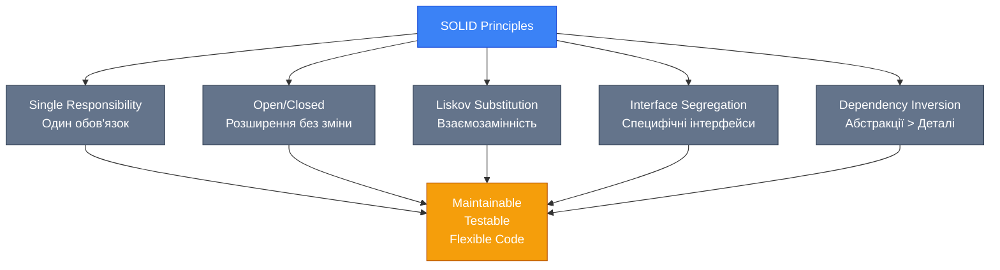

# [Software Design Principles (Принципи Проектування ПЗ)](https://learn.microsoft.com/en-us/dotnet/architecture/modern-web-apps-azure/architectural-principles)

::note
**Передумови**: Рекомендується ознайомитись з [класами та об'єктами](/csharp/oop/classes-objects), [наслідуванням та поліморфізмом](/csharp/oop/oop-pillars), [інтерфейсами](/csharp/advanced-core/interfaces-deep-dive) та [generics](/csharp/advanced-core/generics) перед вивченням цього розділу.
::

## Навіщо це потрібно?

Уявіть, що ви приєдналися до проєкту, де код виглядає так:

```csharp [UserManager.cs] showLineNumbers
public class UserManager
{
    public void ProcessUser(string userData)
    {
        // Парсинг даних
        var parts = userData.Split(',');
        string name = parts[0];
        string email = parts[1];

        // Валідація email
        if (!email.Contains("@"))
        {
            throw new Exception("Invalid email");
        }

        // Збереження в базу даних
        using var connection = new SqlConnection("Server=...");
        connection.Open();
        var command = new SqlCommand($"INSERT INTO Users VALUES ('{name}', '{email}')", connection);
        command.ExecuteNonQuery();

        // Відправка email
        var smtp = new SmtpClient("smtp.gmail.com");
        smtp.Send(email, "Welcome!", "Thanks for registering!");

        // Логування
        File.AppendAllText("log.txt", $"{DateTime.Now}: User {name} created\n");
    }
}
```

**Що не так з цим кодом?**

-   🚫 **Один клас робить занадто багато** — парсинг, валідацію, БД, email, логування
-   🚫 **Неможливо тестувати** — все зв'язано з зовнішніми сервісами
-   🚫 **Важко змінювати** — зміна логіки email вимагає редагування всього класу
-   🚫 **SQL Injection вразливість** — небезпечна конкатенація рядків
-   🚫 **Жорстка залежність** — використання конкретних реалізацій (`SqlConnection`, `SmtpClient`)

**Вартість змін зростає експоненційно:**

::mermaid


::

**Software Design Principles рятують від цього!**

Ці принципи — це набір перевірених часом правил, які допомагають писати код, що:

-   ✅ **Легко змінювати** — зміни локалізовані
-   ✅ **Легко тестувати** — залежності можна замінити
-   ✅ **Легко розуміти** — кожен компонент має чітку мету
-   ✅ **Легко розширювати** — нова функціональність додається без зміни існуючого коду

## Еволюція: Як ми дійшли до цих принципів?

**1990-ті: Спагетті-код**

-   Процедурне програмування
-   Глобальні змінні
-   `GOTO` statements
-   Проблема: Код стає нечитабельним після 1000+ рядків

**2000-ті: ООП та Pattern-mania**

-   Gang of Four Design Patterns (1994)
-   Robert Martin (Uncle Bob) формалізує SOLID (2000)
-   Проблема: Над-інженерія, "pattern for everything"

**2010-ті: Pragmatic simplicity**

-   YAGNI, KISS стають mainstream
-   Agile та TDD популяризують простоту
-   Баланс між гнучкістю та простотою

**2020-ті: Modern C# і принципи**

-   Nullable Reference Types підтримують DIP
-   Records та pattern matching спрощують SOLID
-   Source Generators автоматизують boilerplate

::tip
**Ключова ідея**: Принципи не є догмами! Це інструменти, які треба застосовувати з розумом. Іноді порушення принципу — правильне рішення для конкретної ситуації.
::

## SOLID Principles: П'ять Стовпів Якісного ООП

SOLID — це акронім з п'яти принципів об'єктно-орієнтованого проектування:

| Принцип                   | Абревіатура | Суть                                                         |
| :------------------------ | :---------- | :----------------------------------------------------------- |
| **S**ingle Responsibility | SRP         | Один клас = одна причина для зміни                           |
| **O**pen/Closed           | OCP         | Відкритий для розширення, закритий для модифікації           |
| **L**iskov Substitution   | LSP         | Підтипи мають бути взаємозамінними                           |
| **I**nterface Segregation | ISP         | Багато специфічних інтерфейсів краще, ніж один універсальний |
| **D**ependency Inversion  | DIP         | Залежність від абстракцій, а не від конкретних реалізацій    |

::mermaid



::

### 1. Single Responsibility Principle (SRP)

> **Принцип Єдиної Відповідальності**: Клас повинен мати лише одну причину для зміни.

**Академічне визначення**: [SRP](https://learn.microsoft.com/en-us/dotnet/architecture/modern-web-apps-azure/architectural-principles#single-responsibility) стверджує, що програмна сутність (клас, модуль, функція) повинна мати єдину, чітко визначену відповідальність. Це означає, що клас має виконувати одну задачу і робити її добре.

**Зв'язок з Cohesion (Зчепленість)**:

SRP тісно пов'язаний з концепцією **high cohesion** (висока зчепленість) — міра того, наскільки пов'язані обов'язки класу між собою. Клас з високою cohesion має методи та дані, які працюють разом для виконання однієї чіткої мети.

::warning
**Важливо**: "Одна відповідальність" ≠ "один метод"! Клас може мати багато методів, якщо вони всі слут одній меті.
::

#### Проблема: God Object (Клас-Бог)

```csharp [UserService.cs - VIOLATION] showLineNumbers
public class UserService
{
    // ❌ Відповідальність 1: Робота з даними
    public void SaveUser(User user)
    {
        using var connection = new SqlConnection("...");
        connection.Open();
        var command = new SqlCommand($"INSERT INTO Users VALUES ('{user.Name}')", connection);
        command.ExecuteNonQuery();
    }

    // ❌ Відповідальність 2: Валідація
    public bool ValidateEmail(string email)
    {
        return email.Contains("@") && email.Contains(".");
    }

    // ❌ Відповідальність 3: Відправка пошти
    public void SendWelcomeEmail(User user)
    {
        var smtp = new SmtpClient("smtp.gmail.com");
        smtp.Send(user.Email, "Welcome!", "Thanks for registering!");
    }

    // ❌ Відповідальність 4: Логування
    public void LogActivity(string message)
    {
        File.AppendAllText("log.txt", $"{DateTime.Now}: {message}\n");
    }

    // ❌ Відповідальність 5: Форматування звітів
    public string GenerateUserReport(User user)
    {
        return $"<html><body><h1>{user.Name}</h1></body></html>";
    }
}
```

**Чому це погано?**

1. **Важко тестувати** — кожен тест потребує БД, SMTP, файлової системи
2. **Важко змінювати** — зміна формату email зачіпає клас, що працює з БД
3. **Низька переви використання** — не можна використати логування окремо
4. **Порушення багатьох принципів** — також порушує OCP, DIP

#### Рішення: Розділення відповідальностей

::code-group

```csharp [UserRepository.cs] showLineNumbers
// Відповідальність: Робота з даними користувачів
public class UserRepository
{
    private readonly string _connectionString;

    public UserRepository(string connectionString)
    {
        _connectionString = connectionString;
    }

    public void Save(User user)
    {
        using var connection = new SqlConnection(_connectionString);
        connection.Open();
        // Параметризований запит замість конкатенації
        var command = new SqlCommand(
            "INSERT INTO Users (Name, Email) VALUES (@name, @email)",
            connection);
        command.Parameters.AddWithValue("@name", user.Name);
        command.Parameters.AddWithValue("@email", user.Email);
        command.ExecuteNonQuery();
    }
}
```

```csharp [EmailValidator.cs] showLineNumbers
// Відповідальність: Валідація email
public class EmailValidator
{
    private static readonly Regex EmailRegex =
        new Regex(@"^[^@\s]+@[^@\s]+\.[^@\s]+$", RegexOptions.Compiled);

    public bool IsValid(string email)
    {
        if (string.IsNullOrWhiteSpace(email))
            return false;

        return EmailRegex.IsMatch(email);
    }
}
```

```csharp [EmailService.cs] showLineNumbers
// Відповідальність: Відправка email
public class EmailService
{
    private readonly SmtpClient _smtpClient;

    public EmailService(SmtpClient smtpClient)
    {
        _smtpClient = smtpClient;
    }

    public void SendWelcomeEmail(string to, string userName)
    {
        var message = new MailMessage
        {
            To = { to },
            Subject = "Welcome!",
            Body = $"Thanks for registering, {userName}!"
        };

        _smtpClient.Send(message);
    }
}
```

::

**Тепер кожен клас має одну відповідальність і один "reason to change"!**
