# Software Design Principles: Вступ та SOLID (SRP, OCP)

## Вступ та Контекст

### Проблема "Спагетті-Коду"

Уявіть проєкт, який почався як елегантне рішення певної задачі. Проходить час, додаються нові вимоги, фіксяться баги, приходять нові розробники. Код розростається, класи стають "всезнаючими монстрами", методи перетворюються на сотні рядків заплутаної логіки, а зміна в одному місці ламає функціональність у зовсім іншому. Це і є **технічний борг (Technical Debt)** — наслідок ігнорування принципів проектування.

::note
**Технічний борг** — це концепція, яка описує довгострокові витрати на підтримку коду, який був написаний швидко або без дотримання best practices. Подібно до фінансового боргу, технічний борг накопичує "відсотки" у вигляді збільшеного часу на розробку нових функцій та виправлення помилок.
::

### Історична Еволюція

Розвиток підходів до проектування програмного забезпечення пройшов довгий шлях:

::steps

#### Процедурне Програмування (1950-1970-ті)

Код організовувався як набір процедур та функцій. Дані та логіка існували окремо, що призводило до складності у підтриманні великих систем.

#### Об'єктно-Орієнтоване Програмування (1980-1990-ті)

ООП об'єднало дані та поведінку в об'єкти. Це був революційний крок, але виникла нова проблема: **як правильно проектувати класи та їх взаємодії?**

#### Формування Принципів (2000-ні)

Індустрія усвідомила необхідність формалізованих підходів. Robert C. Martin (також відомий як "Uncle Bob") сформулював **SOLID принципи**, які стали фундаментом сучасної розробки.

#### Сучасність (2010-і та далі)

Принципи проектування інтегровані в практики Clean Architecture, Domain-Driven Design (DDD), та agile-методології.

::

### Мета: Чому Потрібні Принципи Проектування?

Принципи проектування — це не абстрактні академічні концепції. Вони вирішують конкретні проблеми:

| Проблема                            | Рішення через принципи                       |
| :---------------------------------- | :------------------------------------------- |
| **Складність підтримки**            | Код стає модульним та зрозумілим             |
| **Висока зв'язаність (Coupling)**   | Класи стають незалежними один від одного     |
| **Низька згуртованість (Cohesion)** | Кожен клас має чітку, єдину відповідальність |
| **Ламка архітектура**               | Зміни в одному місці не впливають на інші    |
| **Складність тестування**           | Компоненти легко ізолюються для unit-тестів  |
| **Дублювання коду**                 | Повторне використання через абстракції       |

::tip
**Архітектурна якість (Architectural Quality)** вимірюється трьома ключовими характеристиками:

-   **Maintainability (Супроводжуваність)**: Наскільки легко вносити зміни та виправляти помилки
-   **Scalability (Масштабованість)**: Чи може система рости без повного переписування
-   **Testability (Тестованість)**: Наскільки легко писати автоматизовані тести

::

### Prerequisites

Перед вивченням цього матеріалу ви повинні бути знайомі з:

-   [Класами та об'єктами](/csharp/oop/classes-objects) в C#
-   [Інтерфейсами](/csharp/oop/interfaces-abstract-classes) та абстрактними класами
-   [Наслідуванням та поліморфізмом](/csharp/oop/oop-pillars)
-   Базовими [принципами ООП](/csharp/oop/oop-pillars)

---

## Фундаментальні Концепції

### Що таке Software Design Principles?

**Software Design Principles (Принципи Проектування Програмного Забезпечення)** — це набір фундаментальних правил та рекомендацій, які допомагають розробникам створювати код, що є:

-   **Зрозумілим**: Інші розробники (і ви через півроку) можуть швидко розібратися в коді
-   **Модульним**: Компоненти можна легко замінювати або переробляти
-   **Розширюваним**: Нові функції додаються без зламу існуючого функціоналу
-   **Стійким до змін**: Зміни вимог не вимагають переписування всієї системи

### Зв'язок між Принципами та Шаблонами Проектування

Важливо розуміти різницю:

::mermaid

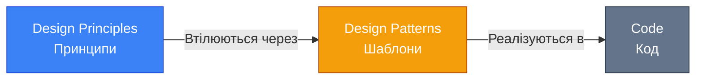

::

**Принципи** — це **ЩО** потрібно досягти (наприклад, "клас повинен мати одну відповідальність").  
**Шаблони** — це **ЯК** це досягти (наприклад, "використай Strategy pattern для інкапсуляції алгоритмів").

### Архітектурна Якість

Три стовпи якісної архітектури:

::card-group
:::card{title="Maintainability" icon="i-heroicons-wrench-screwdriver"}
**Супроводжуваність** — можливість вносити зміни швидко та безпечно. Вимірюється:

-   Часом на додавання нової функції
-   Кількістю місць, які потрібно змінити для одного bug-fix
-   Складністю розуміння коду новим розробником

:::

:::card{title="Scalability" icon="i-heroicons-arrow-trending-up"}
**Масштабованість** — можливість системи обробляти зростаюче навантаження або складність. Включає:

-   Додавання нових модулів без переробки існуючих
-   Горизонтальне та вертикальне масштабування
-   Розподілення відповідальностей між компонентами

:::

:::card{title="Testability" icon="i-heroicons-beaker"}
**Тестованість** — можливість ізольовано тестувати компоненти. Досягається через:

-   Низьку зв'язаність (Loose Coupling)
-   Dependency Injection
-   Чіткі інтерфейси та контракти

:::

::

### Мета SOLID Принципів

**SOLID** — це акронім п'яти базових принципів об'єктно-орієнтованого проектування:

| Літера | Принцип                             | Суть                                                  |
| :----- | :---------------------------------- | :---------------------------------------------------- |
| **S**  | **S**ingle Responsibility Principle | Клас має одну причину для зміни                       |
| **O**  | **O**pen/Closed Principle           | Відкритий для розширення, закритий для модифікації    |
| **L**  | **L**iskov Substitution Principle   | Підкласи замінюють базові класи без зламу логіки      |
| **I**  | **I**nterface Segregation Principle | Клієнти не залежать від невикористовуваних методів    |
| **D**  | **D**ependency Inversion Principle  | Залежність від абстракцій, а не конкретних реалізацій |

::tip
SOLID принципи працюють разом як система. Дотримання одного принципу часто полегшує дотримання інших. Наприклад, SRP спрощує застосування OCP, а DIP робить можливим ISP.
::

---

## Single Responsibility Principle (SRP)

### Визначення та Формулювання

> **Single Responsibility Principle**: Клас повинен мати одну, і тільки одну, причину для зміни.
>
> — Robert C. Martin

**Альтернативне формулювання**: Клас повинен відповідати лише за одну частину функціональності системи, і ця відповідальність має бути повністю інкапсульована класом.

### "Одна Причина для Зміни"

Що таке "причина для зміни"? Це **зміна вимог до системи**, яка примушує нас модифікувати клас.

::mermaid

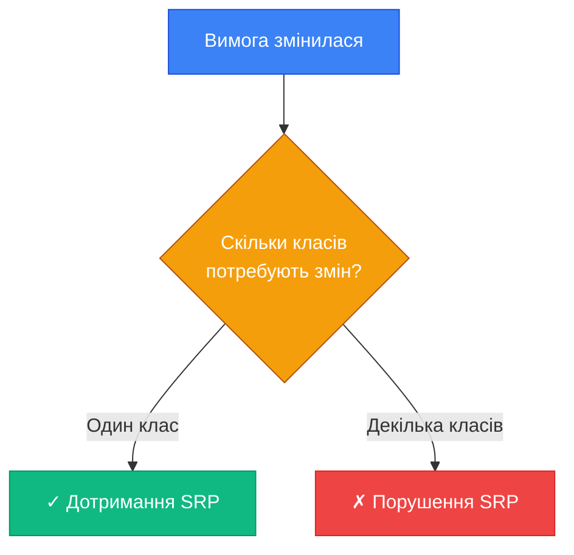

::

**Приклад**: Якщо зміна формату логування вимагає модифікації класу `UserService`, це означає, що `UserService` має **дві відповідальності**: логіку користувача + логування.

### Порушення SRP: Anti-Pattern

Розглянемо класичний приклад класу, який порушує SRP:

```csharp [UserService.cs] {3,8,11,15,19,23} showLineNumbers
public class UserService
{
    // Відповідальність 1: Робота з базою даних
    public void SaveUser(User user)
    {
        using var connection = new SqlConnection("connection_string");
        connection.Open();
        // SQL логіка збереження
    }

    // Відповідальність 2: Валідація
    public bool ValidateUser(User user)
    {
        if (string.IsNullOrEmpty(user.Email)) return false;
        if (!user.Email.Contains("@")) return false;
        return true;
    }

    // Відповідальність 3: Відправка email
    public void SendWelcomeEmail(User user)
    {
        var smtpClient = new SmtpClient("smtp.example.com");
        // Логіка відправки email
    }

    // Відповідальність 4: Логування
    public void LogUserAction(string action)
    {
        File.AppendAllText("log.txt", $"{DateTime.Now}: {action}\n");
    }
}
```

::warning
**Проблеми цього класу**:

1. Зміна формату логування → клас потребує змін
2. Зміна SMTP сервера → клас потребує змін
3. Зміна правил валідації → клас потребує змін
4. Зміна структури БД → клас потребує змін

Це **чотири причини для зміни** замість однієї!
::

### Рефакторинг до SRP

Розділимо відповідальності на окремі класи:

::code-group

```csharp [UserRepository.cs] showLineNumbers
/// <summary>
/// Відповідальність: Робота з базою даних користувачів
/// </summary>
public class UserRepository
{
    private readonly string _connectionString;

    public UserRepository(string connectionString)
    {
        _connectionString = connectionString;
    }

    public void Save(User user)
    {
        using var connection = new SqlConnection(_connectionString);
        connection.Open();

        using var command = new SqlCommand(
            "INSERT INTO Users (Id, Email, Name) VALUES (@Id, @Email, @Name)",
            connection
        );

        command.Parameters.AddWithValue("@Id", user.Id);
        command.Parameters.AddWithValue("@Email", user.Email);
        command.Parameters.AddWithValue("@Name", user.Name);

        command.ExecuteNonQuery();
    }

    public User? GetById(Guid id)
    {
        // Логіка отримання користувача
        return null; // Для прикладу
    }
}
```

```csharp [UserValidator.cs] showLineNumbers
/// <summary>
/// Відповідальність: Валідація даних користувача
/// </summary>
public class UserValidator
{
    public ValidationResult Validate(User user)
    {
        var errors = new List<string>();

        if (string.IsNullOrWhiteSpace(user.Email))
            errors.Add("Email не може бути порожнім");

        if (!user.Email.Contains("@"))
            errors.Add("Email повинен містити символ '@'");

        if (string.IsNullOrWhiteSpace(user.Name))
            errors.Add("Ім'я не може бути порожнім");

        return new ValidationResult
        {
            IsValid = errors.Count == 0,
            Errors = errors
        };
    }
}

public record ValidationResult
{
    public bool IsValid { get; init; }
    public IReadOnlyList<string> Errors { get; init; } = Array.Empty<string>();
}
```

```csharp [EmailService.cs] showLineNumbers
/// <summary>
/// Відповідальність: Відправка email повідомлень
/// </summary>
public class EmailService
{
    private readonly SmtpClient _smtpClient;

    public EmailService(string smtpServer)
    {
        _smtpClient = new SmtpClient(smtpServer);
    }

    public void SendWelcomeEmail(User user)
    {
        var message = new MailMessage
        {
            To = { user.Email },
            Subject = "Ласкаво просимо!",
            Body = $"Привіт, {user.Name}! Дякуємо за реєстрацію."
        };

        _smtpClient.Send(message);
    }
}
```

```csharp [Logger.cs] showLineNumbers
/// <summary>
/// Відповідальність: Логування подій системи
/// </summary>
public class Logger
{
    private readonly string _logFilePath;

    public Logger(string logFilePath)
    {
        _logFilePath = logFilePath;
    }

    public void Log(string message)
    {
        var logEntry = $"[{DateTime.Now:yyyy-MM-dd HH:mm:ss}] {message}";
        File.AppendAllText(_logFilePath, logEntry + Environment.NewLine);
    }

    public void LogInfo(string message) => Log($"INFO: {message}");
    public void LogWarning(string message) => Log($"WARNING: {message}");
    public void LogError(string message) => Log($"ERROR: {message}");
}
```

```csharp [UserService.cs] showLineNumbers
/// <summary>
/// Відповідальність: Оркестрація бізнес-логіки користувача
/// Координує роботу інших сервісів
/// </summary>
public class UserService
{
    private readonly UserRepository _repository;
    private readonly UserValidator _validator;
    private readonly EmailService _emailService;
    private readonly Logger _logger;

    public UserService(
        UserRepository repository,
        UserValidator validator,
        EmailService emailService,
        Logger logger)
    {
        _repository = repository;
        _validator = validator;
        _emailService = emailService;
        _logger = logger;
    }

    public Result RegisterUser(User user)
    {
        // 1. Валідація
        var validationResult = _validator.Validate(user);
        if (!validationResult.IsValid)
        {
            _logger.LogWarning($"Помилка валідації користувача: {user.Email}");
            return Result.Failure(validationResult.Errors);
        }

        // 2. Збереження
        try
        {
            _repository.Save(user);
            _logger.LogInfo($"Користувач збережений: {user.Email}");
        }
        catch (Exception ex)
        {
            _logger.LogError($"Помилка збереження: {ex.Message}");
            return Result.Failure("Не вдалося зберегти користувача");
        }

        // 3. Відправка email
        try
        {
            _emailService.SendWelcomeEmail(user);
            _logger.LogInfo($"Вітальний email відправлений: {user.Email}");
        }
        catch (Exception ex)
        {
            _logger.LogWarning($"Не вдалося відправити email: {ex.Message}");
            // Не фейлимо всю операцію через проблеми з email
        }

        return Result.Success();
    }
}

public record Result
{
    public bool IsSuccess { get; init; }
    public IReadOnlyList<string> Errors { get; init; } = Array.Empty<string>();

    public static Result Success() => new() { IsSuccess = true };
    public static Result Failure(params string[] errors) =>
        new() { IsSuccess = false, Errors = errors };
    public static Result Failure(IEnumerable<string> errors) =>
        new() { IsSuccess = false, Errors = errors.ToList() };
}
```

::

### Візуалізація Рефакторингу

::mermaid

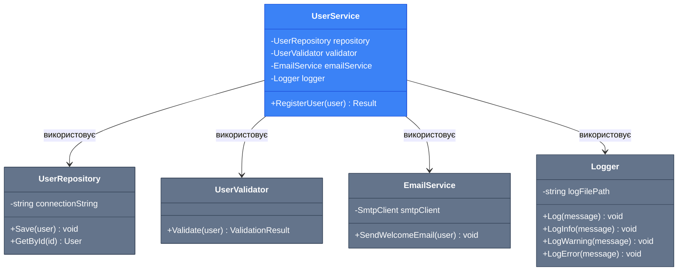

::

### Переваги Дотримання SRP

| Критерій                  | До SRP                                             | Після SRP                                               |
| :------------------------ | :------------------------------------------------- | :------------------------------------------------------ |
| **Розуміння коду**        | Складно: клас робить "все"                         | Легко: кожен клас має чітку мету                        |
| **Тестування**            | Важко: потрібно мокати всі залежності одразу       | Просто: тестуємо кожну відповідальність окремо          |
| **Зміни**                 | Ризиковано: зміна в одному місці може зламати інше | Безпечно: зміни локалізовані                            |
| **Повторне використання** | Неможливо: логіка переплетена                      | Можливо: класи можна використовувати в інших контекстах |

### Best Practices

::tip
**Як визначити, що клас має одну відповідальність?**

1. **Тест опису**: Чи можете ви описати, що робить клас, одним реченням без "і"/"або"?

    - ✓ "UserRepository зберігає та отримує користувачів з бази даних"
    - ✗ "UserService зберігає користувачів і валідує їх і відправляє email і логує події"

2. **Тест змін**: Чи можете ви назвати лише одну причину, чому цей клас може змінитися?

    - ✓ "Logger змінюється, якщо змінюється формат або місце зберігання логів"
    - ✗ "UserService змінюється, якщо змінюється БД, або валідація, або email"

3. **Тест відповідальності**: Чи можна виділити відповідальності класу в окремі абстракції?

::

### Troubleshooting: Типові Помилки

::collapsible{title="Помилка 1: Занадто дрібне розділення (Over-Engineering)"}
**Проблема**: Створення окремого класу для кожного методу.

```csharp
// Занадто дрібно!
public class UserEmailValidator { }
public class UserNameValidator { }
public class UserAgeValidator { }
```

**Рішення**: Групуйте пов'язану логіку. Валідація користувача — це одна відповідальність.

```csharp
// Правильно
public class UserValidator
{
    public ValidationResult ValidateEmail(string email) { }
    public ValidationResult ValidateName(string name) { }
    public ValidationResult ValidateAge(int age) { }
}
```

::

::collapsible{title="Помилка 2: Плутанина між 'відповідальністю' та 'методом'"}
**Проблема**: Думка, що "клас може мати лише один метод".

SRP не про кількість методів, а про **єдину причину для зміни**. Клас може мати багато методів, якщо вони всі служать одній відповідальності.

```csharp
// Правильно: всі методи служать одній меті — роботі з БД
public class UserRepository
{
    public void Add(User user) { }
    public void Update(User user) { }
    public void Delete(Guid id) { }
    public User? GetById(Guid id) { }
    public IEnumerable<User> GetAll() { }
}
```

::

::collapsible{title="Помилка 3: 'God Objects' (Всезнаючі об'єкти)"}
**Проблема**: Класи на кшталт `Manager`, `Helper`, `Utility`, які роблять "все".

```csharp
// Анти-патерн
public class UserManager
{
    public void ValidateUser() { }
    public void SaveUser() { }
    public void SendEmail() { }
    public void GenerateReport() { }
    public void ExportToJson() { }
}
```

**Рішення**: Розділіть на класи з чіткими назвами та відповідальностями.
::

---

## Open/Closed Principle (OCP)

### Визначення та Формулювання

> **Open/Closed Principle**: Програмні сутності (класи, модулі, функції) повинні бути відкриті для розширення, але закриті для модифікації.
>
> — Bertrand Meyer

**Сучасна інтерпретація** (Robert C. Martin): Ви повинні мати можливість додавати нову функціональність без зміни існуючого коду.

::mermaid

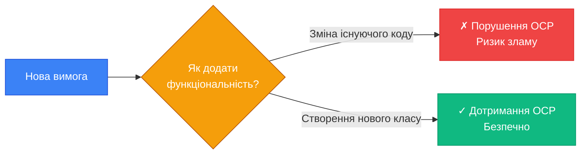

::

### "Відкритий для Розширення, Закритий для Модифікації"

Дв компоненти цього принципу:

1. **Відкритий для розширення**: Можливість додавати нову поведінку при зміні вимог
2. **Закритий для модифікації**: Існуючий код залишається недоторканим

### Стратегія Реалізації через Абстракції

Ключ до дотримання OCP — **програмування через інтерфейси та абстракції**:

-   Залежність від інтерфейсів замість конкретних класів
-   Використання спадкування для розширення функціональності
-   Застосування Design Patterns (Strategy, Template Method, Decorator)

### Приклад: Порушення OCP

Розглянемо систему обробки платежів:

```csharp [PaymentProcessor.cs] {7-8,12-13,17-18} showLineNumbers
public class PaymentProcessor
{
    public void ProcessPayment(Order order, string paymentMethod)
    {
        if (paymentMethod == "CreditCard")
        {
            Console.WriteLine("Обробка платежу кредитною карткою");
            // Логіка для кредитної картки
        }
        else if (paymentMethod == "PayPal")
        {
            Console.WriteLine("Обробка платежу через PayPal");
            // Логіка для PayPal
        }
        else if (paymentMethod == "Bitcoin")
        {
            Console.WriteLine("Обробка платежу Bitcoin");
            // Логіка для Bitcoin
        }
        else
        {
            throw new NotSupportedException($"Метод оплати '{paymentMethod}' не підтримується");
        }
    }
}
```

::warning
**Проблеми**:

1. **Додавання нового методу оплати** (наприклад, Apple Pay) вимагає **модифікації** класу `PaymentProcessor`
2. **Ризик помилок**: Кожна зміна може зламати існуючі методи
3. **Порушення OCP**: Клас не закритий для модифікації
4. **Складність тестування**: Потрібно перетестовувати весь клас при кожній зміні

::

### Рефакторинг до OCP: Використання Абстракцій

Створимо абстракцію через інтерфейс:

::code-group

```csharp [IPaymentMethod.cs] showLineNumbers
/// <summary>
/// Абстракція для методів оплати
/// </summary>
public interface IPaymentMethod
{
    string Name { get; }
    void ProcessPayment(Order order);
    bool ValidatePayment(Order order);
}
```

```csharp [CreditCardPayment.cs] showLineNumbers
/// <summary>
/// Конкретна реалізація: оплата кредитною карткою
/// </summary>
public class CreditCardPayment : IPaymentMethod
{
    public string Name => "Кредитна картка";

    public void ProcessPayment(Order order)
    {
        Console.WriteLine($"Обробка платежу на суму {order.TotalAmount:C} кредитною карткою");

        // Специфічна логіка для кредитних карток
        ConnectToPaymentGateway();
        AuthorizeCard(order.Amount);
        CapturePayment(order.Amount);
    }

    public bool ValidatePayment(Order order)
    {
        // Валідація номера картки, CVV, тощо
        return true; // Спрощено для прикладу
    }

    private void ConnectToPaymentGateway() { /* ... */ }
    private void AuthorizeCard(decimal amount) { /* ... */ }
    private void CapturePayment(decimal amount) { /* ... */ }
}
```

```csharp [PayPalPayment.cs] showLineNumbers
/// <summary>
/// Конкретна реалізація: оплата через PayPal
/// </summary>
public class PayPalPayment : IPaymentMethod
{
    public string Name => "PayPal";

    public void ProcessPayment(Order order)
    {
        Console.WriteLine($"Обробка платежу на суму {order.TotalAmount:C} через PayPal");

        // Специфічна логіка для PayPal
        RedirectToPayPal(order);
        HandlePayPalCallback();
    }

    public bool ValidatePayment(Order order)
    {
        // Валідація PayPal аккаунта
        return true; // Спрощено для прикладу
    }

    private void RedirectToPayPal(Order order) { /* ... */ }
    private void HandlePayPalCallback() { /* ... */ }
}
```

```csharp [BitcoinPayment.cs] showLineNumbers
/// <summary>
/// Конкретна реалізація: оплата Bitcoin
/// </summary>
public class BitcoinPayment : IPaymentMethod
{
    public string Name => "Bitcoin";

    public void ProcessPayment(Order order)
    {
        Console.WriteLine($"Обробка платежу на суму {order.TotalAmount:C} через Bitcoin");

        // Специфічна логіка для Bitcoin
        GenerateWalletAddress();
        WaitForConfirmations();
    }

    public bool ValidatePayment(Order order)
    {
        // Валідація Bitcoin транзакції
        return true; // Спрощено для прикладу
    }

    private void GenerateWalletAddress() { /* ... */ }
    private void WaitForConfirmations() { /* ... */ }
}
```

```csharp [PaymentProcessor.cs] showLineNumbers
/// <summary>
/// Процесор платежів, закритий для модифікації
/// Нові методи додаються через створення нових класів
/// </summary>
public class PaymentProcessor
{
    private readonly IPaymentMethod _paymentMethod;

    public PaymentProcessor(IPaymentMethod paymentMethod)
    {
        _paymentMethod = paymentMethod;
    }

    public void ProcessOrder(Order order)
    {
        if (!_paymentMethod.ValidatePayment(order))
        {
            throw new InvalidOperationException(
                $"Платіж через {_paymentMethod.Name} не пройшов валідацію"
            );
        }

        _paymentMethod.ProcessPayment(order);
        Console.WriteLine($"Замовлення #{order.Id} успішно оброблено через {_paymentMethod.Name}");
    }
}
```

```csharp [Usage.cs] showLineNumbers
// Використання
var order = new Order
{
    Id = Guid.NewGuid(),
    TotalAmount = 100.50m
};

// Оплата кредитною карткою
var creditCardProcessor = new PaymentProcessor(new CreditCardPayment());
creditCardProcessor.ProcessOrder(order);

// Оплата через PayPal
var paypalProcessor = new PaymentProcessor(new PayPalPayment());
paypalProcessor.ProcessOrder(order);

// Додаємо Apple Pay БЕЗ зміни PaymentProcessor!
var applePayProcessor = new PaymentProcessor(new ApplePayPayment());
applePayProcessor.ProcessOrder(order);
```

::

### Додавання Нового Методу: Apple Pay

Тепер додамо Apple Pay **НЕ змінюючи** `PaymentProcessor`:

```csharp [ApplePayPayment.cs] showLineNumbers
/// <summary>
/// Нова реалізація додається БЕЗ модифікації існуючого коду
/// </summary>
public class ApplePayPayment : IPaymentMethod
{
    public string Name => "Apple Pay";

    public void ProcessPayment(Order order)
    {
        Console.WriteLine($"Обробка платежу на суму {order.TotalAmount:C} через Apple Pay");

        // Специфічна логіка для Apple Pay
        AuthenticateWithTouchID();
        ProcessThroughAppleServers(order);
    }

    public bool ValidatePayment(Order order)
    {
        // Валідація Apple Pay токена
        return true;
    }

    private void AuthenticateWithTouchID() { /* ... */ }
    private void ProcessThroughAppleServers(Order order) { /* ... */ }
}
```

::tip
**Ключовий момент**: Ми додали новий метод оплати **створивши новий клас**, а не змінюючи `PaymentProcessor`. Це і є суть OCP — **розширення через додавання, а не модифікацію**.
::

### OCP та Strategy Pattern

Наш приклад з платежами — це реалізація **Strategy Pattern** (Шаблон Стратегія):

::mermaid

```mermaid
sequenceDiagram
    participant Client
    participant Processor as PaymentProcessor
    participant Strategy as IPaymentMethod
    participant Concrete as CreditCardPayment

    Client->>Processor: new PaymentProcessor(new CreditCardPayment())
    Client->>Processor: ProcessOrder(order)
    Processor->>Strategy: ValidatePayment(order)
    Strategy->>Concrete: ValidatePayment(order)
    Concrete-->>Strategy: true
    Strategy-->>Processor: true
    Processor->>Strategy: ProcessPayment(order)
    Strategy->>Concrete: ProcessPayment(order)
    Concrete-->>Strategy: void
    Strategy-->>Processor: void
    Processor-->>Client: Замовлення оброблено

    style Client fill:#3b82f6,stroke:#1d4ed8,color:#ffffff
    style Processor fill:#f59e0b,stroke:#b45309,color:#ffffff
    style Strategy fill:#64748b,stroke:#334155,color:#ffffff
    style Concrete fill:#10b981,stroke:#059669,color:#ffffff
```

::

### Візуалізація Архітектури

::mermaid

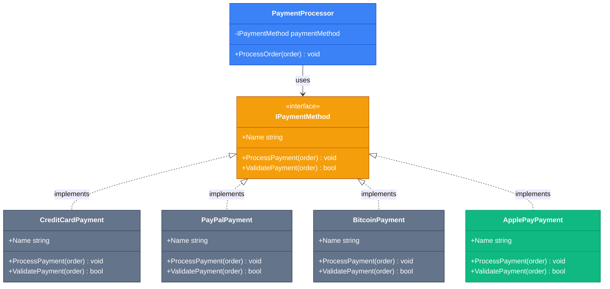

::

### Переваги Дотримання OCP

| Аспект                         | Без OCP                 | З OCP                            |
| :----------------------------- | :---------------------- | :------------------------------- |
| **Додавання функціональності** | Зміна існуючого коду    | Створення нового класу           |
| **Ризик регресії**             | Високий                 | Низький                          |
| **Тестування**                 | Перетестовування всього | Тестування лише нового класу     |
| **Командна робота**            | Конфлікти merge         | Паралельна робота без конфліктів |

### Best Practices

::tip
**Коли застосовувати OCP**:

1. **Ідентифікуйте точки варіативності**: Де в вашій системі очікуються зміни/розширення?
2. **Створіть абстракції**: Інтерфейси або абстрактні класи для цих точок
3. **Програмуйте через інтерфейси**: Залежіть від абстракцій, а не конкретних класів
4. **Не передбачайте все**: Застосовуйте OCP лише там, де зміни вірогідні (принцип YAGNI)

::

### Troubleshooting

::collapsible{title="Проблема 1: Занадто багато абстракцій (Abstraction Overload)"}
**Симптом**: Інтерфейс для кожного класу, навіть коли розширення не очікується.

**Рішення**: Не створюйте абстракції "на всякий випадок". Очікуйте конкретних вимог до розширення.

```csharp
// Не потрібно, якщо ProductRepository ніколи не буде мати альтернативних реалізацій
public interface IProductRepository { }
public class ProductRepository : IProductRepository { }
```

::

::collapsible{title="Проблема 2: 'Leaky Abstractions' (Протікаючі абстракції)"}
**Симптом**: Інтерфейс містить деталі реалізації або специфічні для однієї реалізації методи.

```csharp
// Погано: метод специфічний для SQL
public interface IRepository
{
    void ExecuteSqlCommand(string sql); // ✗ Протікаюча абстракція
}
```

**Рішення**: Інтерфейс має бути незалежним від implementation details.

```csharp
// Добре: загальний метод
public interface IRepository
{
    void Save(Entity entity); // ✓ Чиста абстракція
}
```

::

## Liskov Substitution Principle (LSP)

### Визначення та Формулювання

> **Liskov Substitution Principle**: Об'єкти підкласу повинні бути взаємозамінними з об'єктами базового класу без порушення коректності програми.
>
> — Barbara Liskov

**Формальне визначення**: Якщо `S` є підтипом `T`, то об'єкти типу `T` можуть бути замінені об'єктами типу `S` без зміни бажаних властивостей програми (коректність, завдання, що виконується тощо).

::mermaid

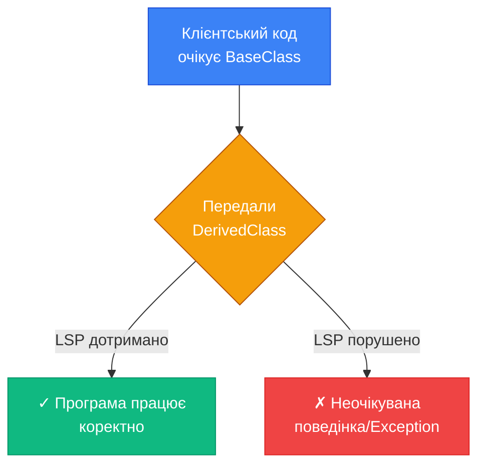

::

### Зв'язок з Контрактами: Design by Contract

LSP тісно пов'язаний з концепцією **Design by Contract (Проектування за Контрактом)**, яка включає три види умов:

| Тип умови                      | Опис                                                                | LSP вимога                                          |
| :----------------------------- | :------------------------------------------------------------------ | :-------------------------------------------------- |
| **Preconditions (Передумови)** | Умови, що мають бути істинними **перед** виконанням методу          | Підклас **не може посилювати** передумови           |
| **Postconditions (Постумови)** | Умови, що мають бути істинними **після** виконання методу           | Підклас **не може послаблювати** постумови          |
| **Invariants (Інваріанти)**    | Умови, що мають залишатися істинними **протягом** існування об'єкта | Підклас **має зберігати** інваріанти базового класу |

::note
**Preconditions**: Підклас може приймати **ширший** діапазон значень, ніж базовий клас (ослаблення), але **не може вимагати більш строгі умови** (посилення).

**Postconditions**: Підклас має гарантувати **принаймні те саме**, що і базовий клас, або навіть більше (посилення), але **не може гарантувати менше** (ослаблення).
::

### Класичний Приклад Порушення: Rectangle-Square

Розглянемо класичну проблему Rectangle-Square, яка ілюструє порушення LSP:

::code-group

```csharp [Rectangle.cs] showLineNumbers
/// <summary>
/// Базовий клас: прямокутник
/// Інваріант: Width та Height можуть бути незалежними
/// </summary>
public class Rectangle
{
    public virtual int Width { get; set; }
    public virtual int Height { get; set; }

    public int CalculateArea()
    {
        return Width * Height;
    }
}
```

```csharp [Square.cs] {7-8,13-14} showLineNumbers
/// <summary>
/// Квадрат — це прямокутник, де Width == Height. Звучить логічно, чи не так?
/// Але це ПОРУШУЄ LSP!
/// </summary>
public class Square : Rectangle
{
    // Порушення: змінюємо інваріант базового класу
    // У базовому класі Width і Height незалежні, тут — ні
    public override int Width
    {
        get => base.Width;
        set
        {
            base.Width = value;
            base.Height = value; // Побічний ефект!
        }
    }

    public override int Height
    {
        get => base.Height;
        set
        {
            base.Width = value;  // Побічний ефект!
            base.Height = value;
        }
    }
}
```

```csharp [ClientCode.cs] {8-11} showLineNumbers
/// <summary>
/// Клієнтський код, який працює з Rectangle
/// </summary>
public class GeometryService
{
    public void TestRectangle(Rectangle rect)
    {
        rect.Width = 5;
        rect.Height = 10;

        // Очікуємо: 5 * 10 = 50
        Console.WriteLine($"Площа: {rect.CalculateArea()}");
    }
}

// Використання
var geometry = new GeometryService();

var rectangle = new Rectangle();
geometry.TestRectangle(rectangle); // Виведе: Площа: 50 ✓

var square = new Square();
geometry.TestRectangle(square);    // Виведе: Площа: 100 ✗
// Замість очікуваних 50, отримуємо 100!
// LSP ПОРУШЕНО: Square не може замінити Rectangle
```

::

::warning
**Проблема**: Коли ми передаємо `Square` в метод, що очікує `Rectangle`, поведінка змінюється неочікуваним чином. Метод `TestRectangle` припускає, що встановлення `Width` та `Height` незалежні операції (інваріант `Rectangle`), але `Square` порушує цей інваріант.

**Це класичне порушення LSP**: підклас змінює інваріанти базового класу.
::

### Рішення: Правильна Ієрархія

Правильніше створити спільну абстракцію:

::code-group

```csharp [IShape.cs] showLineNumbers
/// <summary>
/// Абстракція для геометричних фігур
/// </summary>
public interface IShape
{
    int CalculateArea();
    string GetDescription();
}
```

```csharp [Rectangle.cs] showLineNumbers
/// <summary>
/// Прямокутник із незалежними сторонами
/// </summary>
public class Rectangle : IShape
{
    public int Width { get; set; }
    public int Height { get; set; }

    public int CalculateArea() => Width * Height;

    public string GetDescription() => $"Прямокутник {Width}x{Height}";
}
```

```csharp [Square.cs] showLineNumbers
/// <summary>
/// Квадрат із однією стороною
/// НЕ успадковується від Rectangle!
/// </summary>
public class Square : IShape
{
    public int Side { get; set; }

    public int CalculateArea() => Side * Side;

    public string GetDescription() => $"Квадрат {Side}x{Side}";
}
```

```csharp [ClientCode.cs] showLineNumbers
/// <summary>
/// Клієнтський код тепер працює через абстракцію
/// </summary>
public class GeometryService
{
    public void ProcessShape(IShape shape)
    {
        Console.WriteLine(shape.GetDescription());
        Console.WriteLine($"Площа: {shape.CalculateArea()}");
    }
}

// Використання
var geometry = new GeometryService();

var rect = new Rectangle { Width = 5, Height = 10 };
geometry.ProcessShape(rect); // Прямокутник 5x10, Площа: 50

var square = new Square { Side = 10 };
geometry.ProcessShape(square); // Квадрат 10x10, Площа: 100

// LSP ДОТРИМАНО: обидва типи коректно реалізують IShape
```

::

### Порушення LSP: NotImplementedException Anti-Pattern

Інший поширений приклад порушення LSP:

```csharp [BadDesign.cs] {10} showLineNumbers
public abstract class Bird
{
    public abstract void Fly();
}

public class Sparrow : Bird
{
    public override void Fly()
    {
        Console.WriteLine("Горобець летить");
    }
}

public class Penguin : Bird
{
    public override void Fly()
    {
        // Пінгвіни не літають!
        throw new NotImplementedException("Пінгвіни не вміють літати");
    }
}

// Клієнтський код
public void MakeBirdFly(Bird bird)
{
    bird.Fly(); // Якщо передати Penguin — Exception!
}
```

::caution
**Кидання `NotImplementedException`** в перевизначеному методі — це явна ознака порушення LSP. Якщо підклас не може виконати контракт базового класу, він не повинен від нього успадковуватися.
::

**Правильне рішення**:

```csharp [GoodDesign.cs] showLineNumbers
public abstract class Bird
{
    public abstract void Move();
}

public interface IFlyable
{
    void Fly();
}

public class Sparrow : Bird, IFlyable
{
    public override void Move()
    {
        Fly();
    }

    public void Fly()
    {
        Console.WriteLine("Горобець летить");
    }
}

public class Penguin : Bird
{
    public override void Move()
    {
        Swim();
    }

    private void Swim()
    {
        Console.WriteLine("Пінгвін пливе");
    }
}

// Клієнтський код
public void MoveBird(Bird bird)
{
    bird.Move(); // Працює для всіх Bird
}

public void MakeFly(IFlyable flyable)
{
    flyable.Fly(); // Працює лише для птахів, що літають
}
```

### Візуалізація Правильної Ієрархії

::mermaid

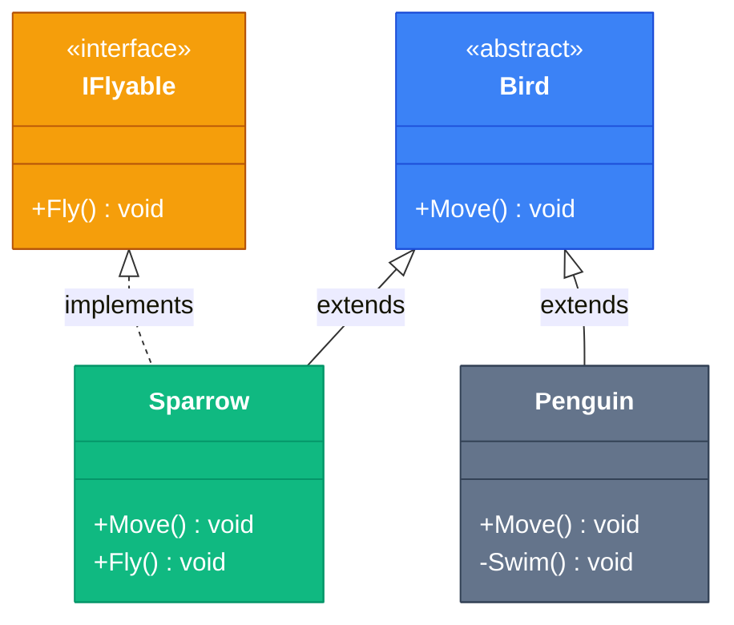

::

### Best Practices для LSP

::tip
**Як забезпечити дотримання LSP**:

1. **Не посилюйте передумови**: Підклас має приймати принаймні те саме, що і базовий клас
2. **Не послаблюйте постумови**: Підклас має гарантувати принаймні те саме, що і базовий клас
3. **Зберігайте інваріанти**: Підклас не може змінювати інваріанти базового класу
4. **Уникайте NotImplementedException**: Якщо метод не має сенсу в підкласі, перегляньте ієрархію
5. **Тестування заміною**: Перевіряйте, чи клієнтський код працює коректно при заміні базового класу на підклас

::

### Troubleshooting

::collapsible{title="Проблема: Як відрізнити IS-A від BEHAVES-LIKE-A?"}
**Помилка**: Думка, що "Square IS-A Rectangle" (математично) означає успадкування в коді.

**Рішення**: У програмуванні важлива **поведінкова сумісність**, а не математична класифікація. "Square BEHAVES-LIKE-A Rectangle" лише якщо він може замінити Rectangle у всіх контекстах без порушення логіки.

**Питання для перевірки**:

-   Чи зможе клієнтський код працювати з підкласом так само, як з базовим класом?
-   Чи зберігаються всі інваріанти базового класу?

::

::collapsible{title="Проблема: Успадкування для повторного використання коду"}
**Симптом**: Успадкування від класу лише для отримання його методів, хоча насправді не `IS-A` відношення.

**Рішення**: Використовуйте композицію (Composition over Inheritance). Якщо вам потрібна функціональність без `IS-A` відношення, створіть поле з потрібним класом замість успадкування.

```csharp
// Погано: успадкування для повторного використання
public class Stack<T> : List<T>
{
    public void Push(T item) => Add(item);
    public T Pop() { /* ... */ }
}
// Проблема: Stack тепер має методи Insert, Remove, які не мають сенсу для стека

// Добре: композиція
public class Stack<T>
{
    private readonly List<T> _items = new();

    public void Push(T item) => _items.Add(item);
    public T Pop() { /* ... */ }
    // Лише методи, що мають сенс для стека
}
```

::

---

## Interface Segregation Principle (ISP)

### Визначення та Формулювання

> **Interface Segregation Principle**: Клієнти не повинні залежати від інтерфейсів, які вони не використовують.
>
> — Robert C. Martin

**Інша формулювка**: Краще мати багато спеціалізованих інтерфейсів, ніж один універсальний (Fat Interface).

::mermaid

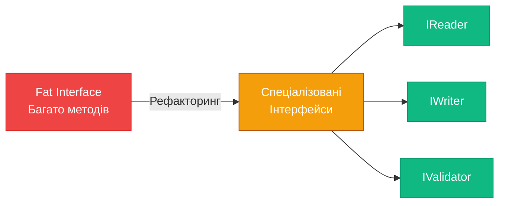

::

### Fat Interfaces vs. Role Interfaces

| Fat Interface                           | Role Interface                            |
| :-------------------------------------- | :---------------------------------------- |
| Один інтерфейс з багатьма методами      | Кілька маленьких, фокусованих інтерфейсів |
| Клієнти імплементують непотрібні методи | Клієнти імплементують лише потрібне       |
| Висока зв'язаність                      | Низька зв'язаність                        |
| Складно тестувати                       | Легко мокати окремі ролі                  |

### Приклад Порушення ISP

```csharp [FatInterface.cs] {4-10} showLineNumbers
/// <summary>
/// Fat Interface: занадто багато відповідальностей
/// </summary>
public interface IWorker
{
    void Work();
    void Eat();
    void Sleep();
    void TakeSalary();
    void FileTimeSheet();
}

/// <summary>
/// Робот має імплементувати методи, які не мають сенсу
/// </summary>
public class Robot : IWorker
{
    public void Work()
    {
        Console.WriteLine("Робот працює");
    }

    public void Eat()
    {
        // Роботи не їдять!
        throw new NotSupportedException();
    }

    public void Sleep()
    {
        // Роботи не сплять!
        throw new NotSupportedException();
    }

    public void TakeSalary()
    {
        // Роботи не отримують зарплату!
        throw new NotSupportedException();
    }

    public void FileTimeSheet()
    {
        Console.WriteLine("Робот реєструє робочий час");
    }
}

public class Human : IWorker
{
    // Людина має імплементувати ВСІ методи
    public void Work() { /* ... */ }
    public void Eat() { /* ... */ }
    public void Sleep() { /* ... */ }
    public void TakeSalary() { /* ... */ }
    public void FileTimeSheet() { /* ... */ }
}
```

::warning
**Проблеми**:

1. `Robot` змушений імплементувати методи `Eat()`, `Sleep()`, `TakeSalary()`, які не мають сенсу
2. Кидання `NotSupportedException` — порушення LSP
3. Зміна інтерфейсу впливає на всі класи, навіть якщо їм не потрібен новий метод
4. Важко тестувати: щоб замокати `IWorker`, потрібно реалізувати всі методи

::

### Рефакторинг до ISP: Розділення Інтерфейсів

::code-group

```csharp [IWorkable.cs] showLineNumbers
/// <summary>
/// Role Interface: здатність працювати
/// </summary>
public interface IWorkable
{
    void Work();
}
```

```csharp [IFeedable.cs] showLineNumbers
/// <summary>
/// Role Interface: потреба в їжі
/// </summary>
public interface IFeedable
{
    void Eat();
}
```

```csharp [ISleepable.cs] showLineNumbers
/// <summary>
/// Role Interface: потреба в сні
/// </summary>
public interface ISleepable
{
    void Sleep();
}
```

```csharp [IPayable.cs] showLineNumbers
/// <summary>
/// Role Interface: отримання оплати
/// </summary>
public interface IPayable
{
    void TakeSalary();
}
```

```csharp [ITimeTrackable.cs] showLineNumbers
/// <summary>
/// Role Interface: облік робочого часу
/// </summary>
public interface ITimeTrackable
{
    void FileTimeSheet();
}
```

```csharp [Implementations.cs] showLineNumbers
/// <summary>
/// Робот імплементує лише те, що йому потрібно
/// </summary>
public class Robot : IWorkable, ITimeTrackable
{
    public void Work()
    {
        Console.WriteLine("Робот працює 24/7");
    }

    public void FileTimeSheet()
    {
        Console.WriteLine("Робот реєструє робочий час");
    }
}

/// <summary>
/// Людина імплементує всі потрібні інтерфейси
/// </summary>
public class Human : IWorkable, IFeedable, ISleepable, IPayable, ITimeTrackable
{
    public void Work()
    {
        Console.WriteLine("Людина працює");
    }

    public void Eat()
    {
        Console.WriteLine("Людина обідає");
    }

    public void Sleep()
    {
        Console.WriteLine("Людина спить");
    }

    public void TakeSalary()
    {
        Console.WriteLine("Людина отримує зарплату");
    }

    public void FileTimeSheet()
    {
        Console.WriteLine("Людина заповнює timesheet");
    }
}

/// <summary>
/// Менеджер працює з різними аспектами через окремі інтерфейси
/// </summary>
public class WorkManager
{
    public void ManageWork(IWorkable worker)
    {
        worker.Work();
    }

    public void ProvideLunch(IFeedable worker)
    {
        worker.Eat();
    }

    public void ProcessPayroll(IPayable employee)
    {
        employee.TakeSalary();
    }

    public void CollectTimesheets(ITimeTrackable worker)
    {
        worker.FileTimeSheet();
    }
}
```

::

### Візуалізація ISP

::mermaid

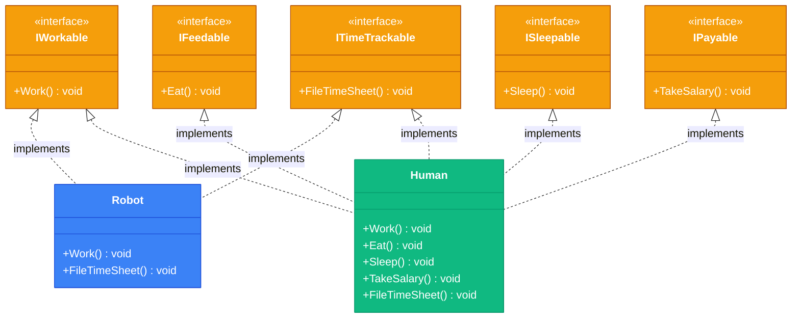

::

### Переваги ISP

| Аспект            | Fat Interface                    | Segregated Interfaces            |
| :---------------- | :------------------------------- | :------------------------------- |
| **Гнучкість**     | Класи змушені імплементувати все | Класи вибирають потрібне         |
| **Тестування**    | Важко мокати великий інтерфейс   | Легко мокати маленькі інтерфейси |
| **Зміни**         | Зміна впливає на всіх            | Зміни локалізовані               |
| **Читабельність** | Незрозуміло, що саме потрібно    | Чітко видно залежності           |

### ISP та Dependency Injection

ISP особливо важливий при використанні DI:

```csharp [WithDI.cs] showLineNumbers
public class OrderProcessor
{
    // Залежить лише від того, що йому потрібно
    private readonly IEmailSender _emailSender;
    private readonly IOrderRepository _orderRepository;
    private readonly IPaymentGateway _paymentGateway;

    public OrderProcessor(
        IEmailSender emailSender,
        IOrderRepository orderRepository,
        IPaymentGateway paymentGateway)
    {
        _emailSender = emailSender;
        _orderRepository = orderRepository;
        _paymentGateway = paymentGateway;
    }

    public void ProcessOrder(Order order)
    {
        _paymentGateway.Charge(order.Amount);
        _orderRepository.Save(order);
        _emailSender.SendConfirmation(order.CustomerEmail);
    }
}
```

::tip
**Переваги маленьких інтерфейсів з DI**:

-   Легко створити mock-об'єкти для тестування
-   Чітко видно залежності класу
-   Можна легко замінити одну реалізацію на іншу
-   Дотримання SRP: кожен інтерфейс має одну відповідальність

::

### Best Practices

::tip
**Коли розділяти інтерфейс**:

1. **Різні клієнти**: Якщо різні класи використовують різні підмножини методів
2. **NotImplementedException**: Якщо деякі реалізації кидають виключення для непотрібних методів
3. **Опціональні методи**: Якщо методи опціональні для деяких реалізацій
4. **Тестування**: Якщо важко створити mock через розмір інтерфейсу

**Як розділяти**:

-   Групуйте методи за ролями/відповідальностями
-   Використовуйте описові назви інтерфейсів (ISendable, IStorable, IValidatable)
-   Один інтерфейс може успадковувати кілька інших для composition

::

### Troubleshooting

::collapsible{title="Проблема: Занадто багато маленьких інтерфейсів"}
**Симптом**: Кожен метод в своєму інтерфейсі, безладдя з інтерфейсами.

**Рішення**: Шукайте баланс. Групуйте методи, що логічно належать разом. ISP не означає "один метод = один інтерфейс".

```csharp
// Занадто дрібно
public interface INameGetter { string GetName(); }
public interface INameSetter { void SetName(string name); }

// Правильно: пов'язані операції разом
public interface INamed
{
    string Name { get; set; }
}
```

::

::collapsible{title="Проблема: Комбінація інтерфейсів"}
**Питання**: Що робити, якщо клієнту потрібно кілька інтерфейсів одночасно?

**Рішення**: Використовуйте множинну реалізацію або створіть composite interface:

```csharp
// Варіант 1: Множинна реалізація
public void ProcessWorker(IWorkable workable, IPayable payable)
{
    workable.Work();
    payable.TakeSalary();
}

// Варіант 2: Composite interface (тільки якщо часто використовується разом)
public interface IEmployee : IWorkable, IPayable, ITimeTrackable
{
    // Не додаємо нові методи, просто композиція
}
```

::

---

## Dependency Inversion Principle (DIP)

### Визначення та Формулювання

> **Dependency Inversion Principle**:
>
> -   Високорівневі модулі не повинні залежати від низькорівневих модулів. Обидва мають залежати від абстракцій.
> -   Абстракції не повинні залежати від деталей. Деталі мають залежати від абстракцій.
>
> — Robert C. Martin

::mermaid

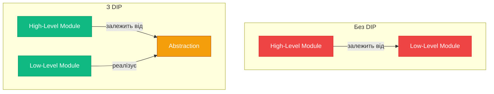

::

### High-Level vs. Low-Level Modules

| High-Level Modules            | Low-Level Modules                 |
| :---------------------------- | :-------------------------------- |
| Бізнес-логіка                 | Інфраструктурні деталі            |
| Оркестрація                   | Конкретні реалізації              |
| Політики та правила           | Технічні механізми                |
| **Приклад**: OrderService     | **Приклад**: SqlOrderRepository   |
| **Приклад**: PaymentProcessor | **Приклад**: StripePaymentGateway |

::note
**Традиційна модель**: High-level → залежить від → Low-level  
**DIP інверсія**: High-level → визначає абстракцію ← імплементує ← Low-level

Тому принцип називається "Dependency **Inversion**" — залежність **інвертується**: low-level модуль залежить від абстракції, визначеної high-level модулем.
::

### Приклад Порушення DIP

```csharp [WithoutDIP.cs] {6,10} showLineNumbers
/// <summary>
/// High-level модуль залежить від конкретної реалізації
/// </summary>
public class OrderService
{
    private readonly SqlDatabase _database; // Пряма залежність!

    public OrderService()
    {
        _database = new SqlDatabase(); // Створення залежності всередині!
    }

    public void ProcessOrder(Order order)
    {
        // Бізнес-логіка
        order.Status = OrderStatus.Confirmed;

        // Збереження через конкретну реалізацію
        _database.ExecuteQuery($"INSERT INTO Orders VALUES ('{order.Id}', ...)");
    }
}

public class SqlDatabase
{
    public void ExecuteQuery(string sql)
    {
        // SQL логіка
    }
}
```

::warning
**Проблеми**:

1. **Тісна зв'язаність**: `OrderService` знає про `SqlDatabase`
2. **Неможливо тестувати**: Не можна замінити БД на mock
3. **Неможливо змінити БД**: Щоб перейти на MongoDB, потрібно змінювати `OrderService`
4. **Порушення OCP**: Додавання нового типу БД вимагає модифікації `OrderService`

::

### Рефакторинг до DIP

::code-group

```csharp [IOrderRepository.cs] showLineNumbers
/// <summary>
/// Абстракція, визначена HIGH-LEVEL модулем
/// </summary>
public interface IOrderRepository
{
    void Save(Order order);
    Order? GetById(Guid id);
    IEnumerable<Order> GetAll();
}
```

```csharp [OrderService.cs] {6,8} showLineNumbers
/// <summary>
/// High-level модуль залежить від абстракції
/// </summary>
public class OrderService
{
    private readonly IOrderRepository _repository;

    // Залежність ін'єктується ззовні (Dependency Injection)
    public OrderService(IOrderRepository repository)
    {
        _repository = repository;
    }

    public void ProcessOrder(Order order)
    {
        // Бізнес-логіка
        order.Status = OrderStatus.Confirmed;

        // Збереження через абстракцію
        _repository.Save(order);
    }
}
```

```csharp [SqlOrderRepository.cs] showLineNumbers
/// <summary>
/// Low-level модуль реалізує абстракцію
/// </summary>
public class SqlOrderRepository : IOrderRepository
{
    private readonly string _connectionString;

    public SqlOrderRepository(string connectionString)
    {
        _connectionString = connectionString;
    }

    public void Save(Order order)
    {
        using var connection = new SqlConnection(_connectionString);
        connection.Open();

        var command = new SqlCommand(
            "INSERT INTO Orders (Id, Status, Amount) VALUES (@Id, @Status, @Amount)",
            connection
        );

        command.Parameters.AddWithValue("@Id", order.Id);
        command.Parameters.AddWithValue("@Status", order.Status);
        command.Parameters.AddWithValue("@Amount", order.Amount);

        command.ExecuteNonQuery();
    }

    public Order? GetById(Guid id)
    {
        // Реалізація SQL запиту
        return null; // Спрощено
    }

    public IEnumerable<Order> GetAll()
    {
        // Реалізація SQL запиту
        return new List<Order>(); // Спрощено
    }
}
```

```csharp [MongoOrderRepository.cs] showLineNumbers
/// <summary>
/// Альтернативна реалізація — легко додати!
/// OrderService НЕ потребує змін
/// </summary>
public class MongoOrderRepository : IOrderRepository
{
    private readonly IMongoCollection<Order> _collection;

    public MongoOrderRepository(IMongoDatabase database)
    {
        _collection = database.GetCollection<Order>("orders");
    }

    public void Save(Order order)
    {
        _collection.InsertOne(order);
    }

    public Order? GetById(Guid id)
    {
        return _collection.Find(o => o.Id == id).FirstOrDefault();
    }

    public IEnumerable<Order> GetAll()
    {
        return _collection.Find(_ => true).ToList();
    }
}
```

```csharp [InMemoryOrderRepository.cs] showLineNumbers
/// <summary>
/// Реалізація для тестування
/// </summary>
public class InMemoryOrderRepository : IOrderRepository
{
    private readonly List<Order> _orders = new();

    public void Save(Order order)
    {
        _orders.Add(order);
    }

    public Order? GetById(Guid id)
    {
        return _orders.FirstOrDefault(o => o.Id == id);
    }

    public IEnumerable<Order> GetAll()
    {
        return _orders;
    }
}
```

```csharp [Usage.cs] showLineNumbers
// Production: SQL
var sqlRepository = new SqlOrderRepository("connection_string");
var orderService = new OrderService(sqlRepository);
orderService.ProcessOrder(new Order { /* ... */ });

// Production: MongoDB
var mongoRepository = new MongoOrderRepository(mongoDatabase);
var orderService2 = new OrderService(mongoRepository);
orderService2.ProcessOrder(new Order { /* ... */ });

// Testing
var testRepository = new InMemoryOrderRepository();
var orderService3 = new OrderService(testRepository);
// Легко тестувати без реальної БД!
```

::

### Dependency Injection Patterns

DIP реалізується через **Dependency Injection (DI)**. Існує три основних патерни ін'єкції:

::tabs
:::tab{label="Constructor Injection"}

**Найпоширеніший та рекомендований спосіб.**

```csharp showLineNumbers
public class OrderService
{
    private readonly IOrderRepository _repository;
    private readonly IEmailService _emailService;
    private readonly ILogger _logger;

    // Залежності передаються через конструктор
    public OrderService(
        IOrderRepository repository,
        IEmailService emailService,
        ILogger logger)
    {
        _repository = repository ?? throw new ArgumentNullException(nameof(repository));
        _emailService = emailService ?? throw new ArgumentNullException(nameof(emailService));
        _logger = logger ?? throw new ArgumentNullException(nameof(logger));
    }

    public void ProcessOrder(Order order)
    {
        _repository.Save(order);
        _emailService.Send(order);
        _logger.Log($"Order {order.Id} processed");
    }
}
```

**Переваги**:

-   ✓ Залежності явно видні в сигнатурі
-   ✓ Об'єкт завжди у валідному стані після створення
-   ✓ Залежності можна зробити `readonly`
-   ✓ Легко тестувати

**Недоліки**:

-   ✗ Може призвести до "constructor bloat" при багатьох залежностях (ознака порушення SRP)

:::

:::tab{label="Property Injection"}

**Використовується для опціональних залежностей.**

```csharp showLineNumbers
public class OrderService
{
    private readonly IOrderRepository _repository;

    // Обов'язкова залежність через конструктор
    public OrderService(IOrderRepository repository)
    {
        _repository = repository;
    }

    // Опціональна залежність через property
    public ILogger? Logger { get; set; }

    public void ProcessOrder(Order order)
    {
        _repository.Save(order);

        // Використання опціональної залежності
        Logger?.Log($"Order {order.Id} processed");
    }
}

// Usage
var service = new OrderService(repository);
service.Logger = new ConsoleLogger(); // Опціонально
```

**Переваги**:

-   ✓ Для опціональних залежностей
-   ✓ Менший конструктор

**Недоліки**:

-   ✗ Залежності не явні
-   ✗ Ризик `NullReferenceException`
-   ✗ Об'єкт може бути в неповному стані

:::

:::tab{label="Method Injection"}

**Залежність передається безпосередньо в метод.**

```csharp showLineNumbers
public class OrderService
{
    private readonly IOrderRepository _repository;

    public OrderService(IOrderRepository repository)
    {
        _repository = repository;
    }

    // Залежність передається в метод
    public void ProcessOrder(Order order, IEmailService emailService)
    {
        _repository.Save(order);
        emailService.SendConfirmation(order);
    }
}

// Usage
var service = new OrderService(repository);
service.ProcessOrder(order, new SmtpEmailService()); // Для цього замовлення email через SMTP
service.ProcessOrder(anotherOrder, new SendGridEmailService()); // Для іншого через SendGrid
```

**Переваги**:

-   ✓ Залежність може змінюватись для кожного виклику
-   ✓ Явна залежність для конкретної операції

**Недоліки**:

-   ✗ Може ускладнити API
-   ✗ Рідко використовується

:::
::

### IoC Containers

**Inversion of Control (IoC) Container** — це framework, що автоматизує створення об'єктів та ін'єкцію залежностей.

```csharp [WithIoC.cs] showLineNumbers
// Реєстрація залежностей (Composition Root)
var services = new ServiceCollection();

// Реєстрація інтерфейсів та реалізацій
services.AddScoped<IOrderRepository, SqlOrderRepository>();
services.AddScoped<IEmailService, SmtpEmailService>();
services.AddScoped<ILogger, FileLogger>();
services.AddScoped<OrderService>();

// Побудова контейнера
var serviceProvider = services.BuildServiceProvider();

// Контейнер автоматично створює OrderService з усіма залежностями
var orderService = serviceProvider.GetRequiredService<OrderService>();
orderService.ProcessOrder(order);
```

**Lifetimes** (життєві цикли):

| Lifetime      | Опис                                             | Використання                     |
| :------------ | :----------------------------------------------- | :------------------------------- |
| **Transient** | Новий екземпляр при кожному запиті               | Stateless сервіси, легкі об'єкти |
| **Scoped**    | Один екземпляр на scope (HTTP request в ASP.NET) | Repository, DbContext            |
| **Singleton** | Один екземпляр на весь час роботи додатку        | Configuration, Logger, Cache     |

```csharp showLineNumbers
services.AddTransient<IEmailService, SmtpEmailService>();  // Новий щоразу
services.AddScoped<IOrderRepository, SqlOrderRepository>(); // Один на request
services.AddSingleton<ILogger, FileLogger>();               // Один на application
```

### Візуалізація DIPДіаграма залежностей:

::mermaid

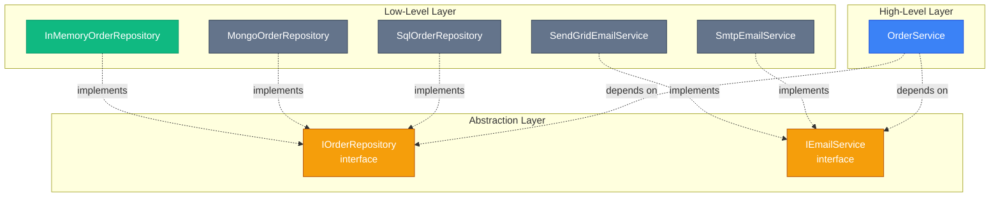

::

### Best Practices

::tip
**Дотримання DIP**:

1. **Composition Root**: Створюйте об'єкти та налаштовуйте залежності в одному місці (зазвичай на вході в додаток)
2. **Програмуйте через інтерфейси**: Типи параметрів, полів, та властивостей — абстракції
3. **Уникайте `new`**: У бізнес-логіці не створюйте залежності через `new`, ін'єктуйте їх
4. **Тестуйте ізольовано**: Використовуйте mocks/stubs для залежностей у тестах
5. **IoC Container**: Використовуйте DI container для автоматизації

::

### Troubleshooting

::collapsible{title="Проблема: Service Locator Anti-Pattern"}
**Симптом**: Використання static класу або singleton для "доставання" залежностей.

```csharp
// АНТИ-ПАТЕРН: Service Locator
public class OrderService
{
    public void ProcessOrder(Order order)
    {
        var repository = ServiceLocator.Get<IOrderRepository>(); // Погано!
        repository.Save(order);
    }
}
```

**Проблема**:

-   Приховані залежності (не видно в сигнатурі)
-   Важко тестувати
-   Runtime помилки замість compile-time

**Рішення**: Використовуйте Constructor Injection.

```csharp
// ПРАВИЛЬНО
public class OrderService
{
    private readonly IOrderRepository _repository;

    public OrderService(IOrderRepository repository) // Явна залежність
    {
        _repository = repository;
    }

    public void ProcessOrder(Order order)
    {
        _repository.Save(order);
    }
}
```

::

::collapsible{title="Проблема: Leaky Abstractions в абстракціях"}
**Симптом**: Абстракція містить деталі конкретної реалізації.

```csharp
// Погано: SQL деталі в інтерфейсі
public interface IOrderRepository
{
    void ExecuteSqlQuery(string sql); // SQL-специфічний метод
    DataTable GetOrdersAsDataTable(); // ADO.NET специфічний тип
}
```

**Рішення**: Абстракція має бути implementation-agnostic.

```csharp
// Добре: незалежна абстракція
public interface IOrderRepository
{
    void Save(Order order);
    Order? GetById(Guid id);
    IEnumerable<Order> GetAll();
}
```

::

---

## DRY (Don't Repeat Yourself)

### Визначення та Формулювання

> **DRY Principle**: Кожен елемент знання має мати єдине, недвозначне, авторитетне представлення всередині системи.
>
> — Andy Hunt and Dave Thomas, "The Pragmatic Programmer"

**Проста формулювка**: Не дублюйте код та знання. Якщо ви копіюєте код — ви робите щось неправильно.

::note
DRY — це не тільки про дублювання **коду**, але й про дублювання **знань**. Два фрагменти коду можуть виглядати по-різному, але якщо вони представляють одне і те ж знання, це порушення DRY.
::

### Дублювання Коду vs. Дублювання Знань

Важливо розрізняти:

| Тип                  | Опис                                                | Приклад                                      |
| :------------------- | :-------------------------------------------------- | :------------------------------------------- |
| **Дублювання коду**  | Ідентичний або схожий код в різних місцях           | Copy-paste одного і того ж методу            |
| **Дублювання знань** | Різний код, що представляє одне знання              | Логіка валідації email в UI та на backend    |
| **Випадковий збіг**  | Код виглядає схоже, але представляє різні концепції | Два методи `Calculate()` в різних контекстах |

::warning
**Не кожен схожий код — порушення DRY!** Якщо два фрагменти коду випадково схожі, але представляють різні бізнес-концепції, їх **не варто** об'єднувати. Це призведе до штучної зв'язаності.
::

### Приклад Порушення DRY

```csharp [ViolatesDRY.cs] {5-9,14-18,23-27} showLineNumbers
public class UserService
{
    public void CreateUser(string email, string password)
    {
        // Валідація email (копія #1)
        if (string.IsNullOrEmpty(email))
            throw new ArgumentException("Email не може бути порожнім");
        if (!email.Contains("@"))
            throw new ArgumentException("Email має містити @");

        // Створення користувача
    }

    public void UpdateUserEmail(Guid userId, string newEmail)
    {
        // Валідація email (копія #2)
        if (string.IsNullOrEmpty(newEmail))
            throw new ArgumentException("Email не може бути порожнім");
        if (!newEmail.Contains("@"))
            throw new ArgumentException("Email має містити @");

        // Оновлення email
    }

    public void SendInvitation(string email)
    {
        // Валідація email (копія #3)
        if (string.IsNullOrEmpty(email))
            throw new ArgumentException("Email не може бути порожнім");
        if (!email.Contains("@"))
            throw new ArgumentException("Email має містити @");

        // Відправка запрошення
    }
}
```

::caution
**Проблеми дублювання**:

1. Зміна правил валідації вимагає оновлення в **трьох місцях**
2. Ризик неузгодженості: можна забути оновити одне з місць
3. Збільшення розміру коду без користі
4. Складність підтримки

::

### Рефакторинг: Усунення Дублювання

::code-group

```csharp [EmailValidator.cs] showLineNumbers
/// <summary>
/// Єдине джерело знань про валідацію email
/// </summary>
public static class EmailValidator
{
    public static void Validate(string email)
    {
        if (string.IsNullOrEmpty(email))
            throw new ArgumentException("Email не може бути порожнім", nameof(email));

        if (!email.Contains("@"))
            throw new ArgumentException("Email має містити @", nameof(email));

        // Додаткова валідація через regex
        var emailRegex = new Regex(@"^[^@\s]+@[^@\s]+\.[^@\s]+$");
        if (!emailRegex.IsMatch(email))
            throw new ArgumentException("Некоректний формат email", nameof(email));
    }

    public static bool IsValid(string email)
    {
        try
        {
            Validate(email);
            return true;
        }
        catch
        {
            return false;
        }
    }
}
```

```csharp [UserService.cs] {5,12,19} showLineNumbers
/// <summary>
/// Використання єдиного джерела валідації
/// </summary>
public class UserService
{
    public void CreateUser(string email, string password)
    {
        EmailValidator.Validate(email); // Використовуємо загальний метод
        // Створення користувача
    }

    public void UpdateUserEmail(Guid userId, string newEmail)
    {
        EmailValidator.Validate(newEmail); // Використовуємо загальний метод
        // Оновлення email
    }

    public void SendInvitation(string email)
    {
        EmailValidator.Validate(email); // Використовуємо загальний метод
        // Відправка запрошення
    }
}
```

::

::tip
**Переваги після рефакторингу**:

-   ✓ Одне місце для зміни логіки валідації
-   ✓ Гарантована консистентність валідації
-   ✓ Можливість легко розширити валідацію (regex додано лише в одному місці)
-   ✓ Повторне використання в інших сервісах

::

### DRY в Конфігураціях

Дублювання в конфігураційних файлах теж порушує DRY:

::code-group

```json [appsettings.json - Погано] {4,9,14} showLineNumbers
{
    "EmailSettings": {
        "SmtpServer": "smtp.gmail.com",
        "SmtpPort": 587,
        "EnableSsl": true
    },
    "NotificationSettings": {
        "SmtpServer": "smtp.gmail.com",
        "SmtpPort": 587,
        "EnableSsl": true
    },
    "ReportSettings": {
        "SmtpServer": "smtp.gmail.com",
        "SmtpPort": 587,
        "EnableSsl": true
    }
}
```

```json [appsettings.json - Добре] showLineNumbers
{
    "SmtpSettings": {
        "Server": "smtp.gmail.com",
        "Port": 587,
        "EnableSsl": true
    },
    "EmailSettings": {
        "SmtpSettingsReference": "SmtpSettings"
    },
    "NotificationSettings": {
        "SmtpSettingsReference": "SmtpSettings"
    },
    "ReportSettings": {
        "SmtpSettingsReference": "SmtpSettings"
    }
}
```

::

### Anti-Pattern: Copy-Paste Programming

::mermaid

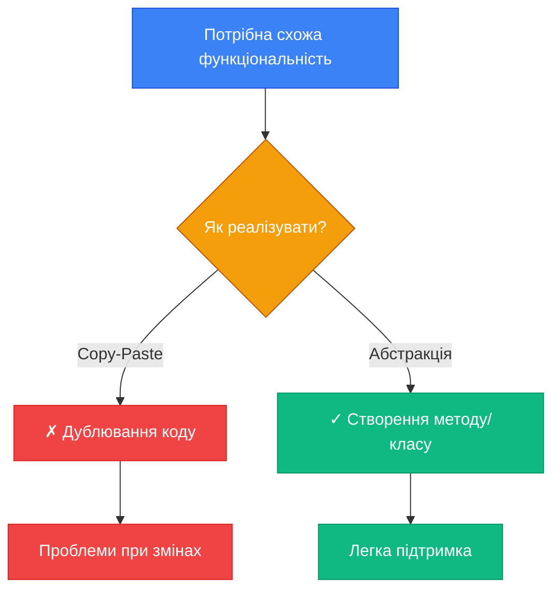

::

### Best Practices

::tip
**Коли застосовувати DRY**:

1. **Правило трьох (Rule of Three)**: Перший раз — напишіть код. Другий раз — допустимо скопіювати. Третій раз — рефакторте!
2. **Логіка, яка змінюється разом**: Якщо дві частини коду завжди змінюються разом, вони мають бути об'єднані
3. **Бізнес-правила**: Валідація, розрахунки, алгоритми — завжди в одному місці
4. **Константи та "магічні числа"**: Винесіть в константи/конфігурацію

**Коли НЕ застосовувати DRY**:

-   Випадковий збіг коду
-   Різні бізнес-концепції, що випадково мають схожу реалізацію
-   Передчасна оптимізація (не варто створювати абстракції "на всякий випадок")

::

---

## KISS (Keep It Simple, Stupid)

### Визначення та Формулювання

> **KISS Principle**: Більшість систем працюють найкраще, якщо вони залишаються простими, а не ускладненими.

**Альтернативна формулювка**: Простота має бути ключовою метою в дизайні, а непотрібної складності слід уникати.

::note
KISS не означає "примітивно" або "без функціональності". Це означає:

-   **Simple (Просто)**: Легко зрозуміти та пояснити
-   **Not Easy (Не обов'язково легко)**: Потрібна думка та зусилля, щоб зробити щось простим

"Простота — це остаточна витонченість" — Leonardo da Vinci
::

### Простота vs. Легкість

| Simple (Просте)                    | Easy (Легке)                          |
| :--------------------------------- | :------------------------------------ |
| Одна відповідальність              | Швидко написати                       |
| Зрозуміла структура                | Не вимагає думки                      |
| Мінімум залежностей                | Copy-paste рішення                    |
| **Приклад**: Окремі маленькі класи | **Приклад**: Один великий клас з усім |

::warning
**Легке не завжди просте!** Найлегше — це скопіювати код. Але це створює складність в майбутньому. Простота вимагає зусиль для правильного проектування.
::

### Приклад Порушення KISS: Over-Engineering

```csharp [OverEngineered.cs] showLineNumbers
/// <summary>
/// Надмірно складна система для простого завдання
/// </summary>
public interface ICalculationStrategy
{
    decimal Execute(decimal a, decimal b);
}

public class AdditionStrategy : ICalculationStrategy
{
    public decimal Execute(decimal a, decimal b) => a + b;
}

public class CalculationContext
{
    private readonly ICalculationStrategy _strategy;

    public CalculationContext(ICalculationStrategy strategy)
    {
        _strategy = strategy;
    }

    public decimal Calculate(decimal a, decimal b)
    {
        return _strategy.Execute(a, b);
    }
}

public class CalculationFactory
{
    public ICalculationStrategy CreateStrategy(string operation)
    {
        return operation switch
        {
            "add" => new AdditionStrategy(),
            _ => throw new NotSupportedException()
        };
    }
}

// Використання для простого додавання!
var factory = new CalculationFactory();
var strategy = factory.CreateStrategy("add");
var context = new CalculationContext(strategy);
var result = context.Calculate(5, 3); // Просто додати 5 + 3!
```

::caution
**Проблема**: Для простого додавання двох чисел створено:

-   3 класи
-   1 інтерфейс
-   1 фабрика
-   Strategy pattern (який не потрібен для такої простої задачі)

Це класичний **over-engineering** — надмірне ускладнення простого завдання.
::

### Просте Рішення

```csharp [Simple.cs] showLineNumbers
/// <summary>
/// Просте рішення для простого завдання
/// </summary>
public static class Calculator
{
    public static decimal Add(decimal a, decimal b) => a + b;
    public static decimal Subtract(decimal a, decimal b) => a - b;
    public static decimal Multiply(decimal a, decimal b) => a * b;
    public static decimal Divide(decimal a, decimal b) =>
        b != 0 ? a / b : throw new DivideByZeroException();
}

// Використання
var result = Calculator.Add(5, 3); // Просто та зрозуміло
```

::tip
**Правило**: Використовуйте найпростіше рішення, яке вирішує поточну задачу. Додавайте складність **лише коли вона стає необхідною**.
::

### Principle of Least Surprise (POLA)

Частина KISS — це **Principle of Least Surprise**: код має поводитися так, як очікує розробник.

::code-group

```csharp [Surprising.cs] {5-7} showLineNumbers
// Несподівана поведінка
public class User
{
    public string Name { get; set; }

    // Несподівано! Getter робить I/O операцію
    public string Email => LoadEmailFromDatabase();

    private string LoadEmailFromDatabase()
    {
        // Запит до БД кожен раз!
        return "user@example.com";
    }
}

// Використання
var user = new User();
var email1 = user.Email; // Запит до БД
var email2 = user.Email; // Ще один запит до БД
// Несподівано: просте читання property робить два запити!
```

```csharp [NotSurprising.cs] showLineNumbers
// Очікувана поведінка
public class User
{
    public string Name { get; set; }
    public string Email { get; set; } // Звичайна property

    // Метод явно вказує, що робить I/O
    public static User LoadFromDatabase(Guid id)
    {
        // Запит до БД
        return new User
        {
            Name = "John",
            Email = "user@example.com"
        };
    }
}

// Використання
var user = User.LoadFromDatabase(userId); // Очевидно, що робимо запит
var  email1 = user.Email; // Просто читання поля
var email2 = user.Email; // Просто читання поля
// Очікувано: property не робить складних операцій
```

::

### Best Practices

::tip
**Як дотримуватись KISS**:

1. **Пишіть код для людей, не для машин**: Називайте змінні зрозуміло, уникайте хитрих трюків
2. **Уникайте передчасної оптимізації**: "Premature optimization is the root of all evil" — Donald Knuth
3. **Вирішуйте поточну проблему**: Не додавайте функціональність "на всякий випадок" (YAGNI)
4. **Читабельність > Короткість**: Код читають набагато частіше, ніж пишуть
5. **Один рівень абстракції**: Метод має працювати на одному рівні абстракції

::

::collapsible{title="Приклад: Один рівень абстракції"}

```csharp
// Погано: змішані рівні абстракції
public void ProcessOrder(Order order)
{
    // Високий рівень
    ValidateOrder(order);

    // Низький рівень (деталі SQL)
    using var connection = new SqlConnection(_connectionString);
    connection.Open();
    var command = new SqlCommand("INSERT INTO Orders...", connection);
    // ...

    // Високий рівень
    SendConfirmation(order);
}

// Добре: один рівень абстракції
public void ProcessOrder(Order order)
{
    ValidateOrder(order);
    SaveOrder(order);
    SendConfirmation(order);
}

private void SaveOrder(Order order)
{
    // Деталі SQL інкапсульовані
    _repository.Save(order);
}
```

::

---

## YAGNI (You Aren't Gonna Need It)

### Визначення та Формулювання

> **YAGNI Principle**: Завжди імплементуйте речі, коли вони **дійсно потрібні**, а не коли ви просто передбачаєте, що вони можуть знадобитися.
>
> — Extreme Programming

**Проста формулювка**: Не пишіть код для функціональності, яка може знадобитися в майбутньому. Пишіть лише те, що потрібно зараз.

::note
YAGNI тісно пов'язаний з **Agile** та **Iterative Development**: розробляйте інкрементально, додаючи функціональність тоді, коли вона **дійсно** потрібна, а не коли "може колись знадобитися".
::

### Speculative Generality Anti-Pattern

**Speculative Generality (Спекулятивна Загальність)** — створення абстракцій та гнучкості для можливих майбутніх потреб.

```csharp [SpeculativeGenerality.cs] showLineNumbers
/// <summary>
/// Зараз підтримується тільки SQL, але "може в майбутньому" потрібна буде MongoDB
/// Створюємо абстракцію "на всякий випадок"
/// </summary>
public interface IRepository<T>
{
    void Save(T entity);
    T GetById(object id);
    IEnumerable<T> GetAll();
    void Delete(object id);
    void Update(T entity);
}

public interface IUnitOfWork
{
    void BeginTransaction();
    void Commit();
    void Rollback();
}

public class GenericRepository<T> : IRepository<T>
{
    // Складна generic реалізація
    // ...100+ рядків коду
}

// Використовується тільки для User!
public class UserService
{
    private readonly IRepository<User> _repository;

    public UserService(IRepository<User> repository)
    {
        _repository = repository;
    }

    // Використовується лише Save та GetById
}
```

::warning
**Проблеми Speculative Generality**:

1. **Витрачений час**: Написали 100+ рядків generic коду, який може ніколи не знадобитися
2. **Складність**: Код складніший, ніж потрібно зараз
3. **YAGNI порушено**: Створили абстракції для майбутніх сценаріїв, які **можуть не настати**
4. **Ризик помилки**: Чим більше коду, тим більше місць для багів

::

### Правильний Підхід: Iterative Development

```csharp [YAGNI_Approach.cs] showLineNumbers
/// <summary>
/// Версія 1: Просто збереження користувачів (що потрібно ЗАРАЗ)
/// </summary>
public class UserRepository
{
    private readonly string _connectionString;

    public UserRepository(string connectionString)
    {
        _connectionString = connectionString;
    }

    public void SaveUser(User user)
    {
        using var connection = new SqlConnection(_connectionString);
        connection.Open();
        // SQL логіка
    }

    public User? GetUserById(Guid id)
    {
        // SQL логіка
        return null;
    }
}

// Якщо ПІЗНІШЕ дійсно знадобиться MongoDB:
// 1. Створимо інтерфейс IUserRepository
// 2. UserRepository : IUserRepository
// 3. MongoUserRepository : IUserRepository
// Але ЛИШЕ коли це дійсно потрібно, а не "на всякий випадок"
```

::tip
**YAGNI не заборонює рефакторинг!** Коли з'являється реальна потреба в абстракції (наприклад, потрібна друга БД), ви **тоді** рефакторите код. Сучасні IDE роблять рефакторинг легким та безпечним.
::

### YAGNI та Agile

::mermaid


::

### Коли YAGNI НЕ Застосовується

::caution
**Винятки з YAGNI**:

1. **Безпека**: Шифрування, автентифікація, авторизація — краще передбачити одразу
2. **Масштабованість на рівні архітектури**: Якщо ви знаєте, що навантаження зросте (наприклад, startup з очікуваним ростом)
3. **Складно змінити пізніше**: Базова структура БД, API контракти для зовнішніх клієнтів
4. **Regulatory requirements**: Вимоги законодавства (GDPR, PCI DSS тощо)

Але навіть тут — додавайте лише **необхідний** мінімум, не більше.
::

### Best Practices

::tip
**Баланс між YAGNI та планув анням**:

| YAGNI (Робити)                             | NOT YAGNI (Не робити)                           |
| :----------------------------------------- | :---------------------------------------------- |
| Імплементувати поточні вимоги              | Додавати "корисні" features "на всякий випадок" |
| Писати тести для поточної функціональності | Писати тести для неіснуючих кейсів              |
| Проектувати для поточних потреб            | Створювати generic frameworks                   |
| Рефакторити при появі нових вимог          | Робити "гнучкість" заздалегідь                  |

**Питання перед додаванням коду**:

-   Чи потрібно це **зараз**?
-   Чи є конкретна вимога?
-   Чи використається це в поточному спринті/релізі?

Якщо "ні" — не пишіть. YAGNI!
::

---

## Law of Demeter (Principle of Least Knowledge)

### Визначення та Формулювання

> **Law of Demeter**: Об'єкт має спілкуватися лише зі своїми "безпосередніми друзями" і не повинен знати про внутрішню структуру об'єктів, які йому повертаються.

**Альтернативна назва**: **Principle of Least Knowledge (Принцип Найменшого Знання)**

### Правила Law of Demeter

Метод об'єкта `O` може викликати методи лише таких об'єктів:

::steps

#### Сам об'єкт (`this`)

Методи самого об'єкта завжди доступні.

```csharp
public void DoSomething()
{
    this.HelperMethod(); // ✓ Дозволено
}
```

#### Параметри методу

Об'єкти, передані як параметри в метод.

```csharp
public void ProcessOrder(Order order)
{
    order.Confirm(); // ✓ Дозволено
}
```

#### Об'єкти, створені всередині методу

Локальні змінні, створені в методі.

```csharp
public void CreateUser()
{
    var user = new User();
    user.SetName("John"); // ✓ Дозволено
}
```

#### Поля/властивості об'єкта

Безпосередні залежності об'єкта.

```csharp
private readonly ILogger _logger;

public void Log(string message)
{
    _logger.Log(message); // ✓ Дозволено
}
```

::

### "Dot Counting" Anti-Pattern

**Симптом порушення LoD**: багато крапок в ланцюжку викликів.

```csharp [ViolatesLoD.cs] {6,13} showLineNumbers
/// <summary>
/// Порушення Law of Demeter: "знає занадто багато"
/// </summary>
public class OrderProcessor
{
    public void ProcessOrder(Customer customer)
    {
        // "Dot counting" - багато крапок!
        var street = customer.GetAddress().GetStreet().GetName();

        // Ще гірше: ми знаємо внутрішню структуру Address і Street
        // Якщо структура зміниться, OrderProcessor зламається
        var discount = customer.GetMembershipLevel().GetBenefits().GetDiscount();
    }
}
```

::warning
**Проблеми "dot counting"**:

1. **Тісна зв'язаність**: `OrderProcessor` залежить від внутрішньої структури `Customer`, `Address`, `Street`
2. **Ламка архітектура**: Зміна в `Address` або `Street` може зламати `OrderProcessor`
3. **Порушення інкапсуляції**: `OrderProcessor` знає занадто багато про внутрішні деталі
4. **Важко тестувати**: Потрібно мокати всі проміжні об'єкти

::

### Рефакторинг до Law of Demeter

::code-group

```csharp [Customer.cs] showLineNumbers
/// <summary>
/// Customer приховує внутрішню структуру та надає методи для доступу
/// </summary>
public class Customer
{
    private readonly Address _address;
    private readonly MembershipLevel _membershipLevel;

    public Customer(Address address, MembershipLevel membershipLevel)
    {
        _address = address;
        _membershipLevel = membershipLevel;
    }

    // Tell, Don't Ask: замість геттерів надаємо поведінку
    public string GetStreetName()
    {
        return _address.GetStreetName(); // Делегування
    }

    public decimal GetMembershipDiscount()
    {
        return _membershipLevel.GetDiscount(); // Делегування
    }
}
```

```csharp [Address.cs] showLineNumbers
public class Address
{
    private readonly Street _street;

    public Address(Street street)
    {
        _street = street;
    }

    public string GetStreetName()
    {
        return _street.Name; // Інкапсуляція деталей
    }
}
```

```csharp [OrderProcessor.cs] {6-7} showLineNumbers
/// <summary>
/// OrderProcessor тепер говорить лише з Customer
/// </summary>
public class OrderProcessor
{
    public void ProcessOrder(Customer customer)
    {
        // Говоримо з "другом" (customer), а не з "друзями друзів"
        var street = customer.GetStreetName();
        var discount = customer.GetMembershipDiscount();

        // OrderProcessor не знає про Address, Street, MembershipLevel, Benefits
    }
}
```

::

### Tell-Don't-Ask Principle

**Tell-Don't-Ask** — це пов'язаний принцип, який каже: замість того, щоб **запитувати** об'єкт про його стан і приймати рішення, **скажіть** об'єкту, що робити.

::code-group

```csharp [Ask.cs] {6-12} showLineNumbers
// "Ask" - Запитуємо та приймаємо рішення ззовні
public class OrderService
{
    public void ProcessOrder(Order order)
    {
        // Запитуємо стан
        if (order.Status == OrderStatus.Pending)
        {
            if (order.TotalAmount > 0)
            {
                // Приймаємо рішення ззовні
                order.Status = OrderStatus.Confirmed;
                SaveOrder(order);
            }
        }
    }
}
```

```csharp [Tell.cs] {6} showLineNumbers
// "Tell" - Говоримо об'єкту, що робити
public class OrderService
{
    public void ProcessOrder(Order order)
    {
        // Говоримо, що робити, не запитуючи деталі
        order.Confirm();
        SaveOrder(order);
    }
}

// Логіка інкапсульована всередині Order
public class Order
{
    public OrderStatus Status { get; private set; }
    public decimal TotalAmount { get; private set; }

    public void Confirm()
    {
        if (Status != OrderStatus.Pending)
            throw new InvalidOperationException("Лише pending orders можна підтверджувати");

        if (TotalAmount <= 0)
            throw new InvalidOperationException("Сума замовлення має бути більше 0");

        Status = OrderStatus.Confirmed;
    }
}
```

::

### Візуалізація Law of Demeter

::mermaid

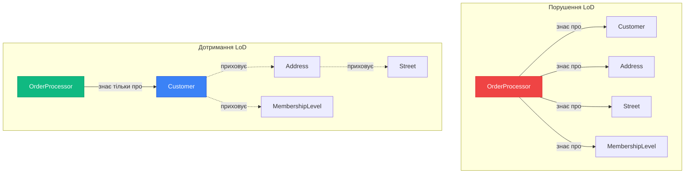

::

### Best Practices

::tip
**Дотримання Law of Demeter**:

1. **Уникайте ланцюжків**: Якщо бачите `a.b().c().d()` — це ознака проблеми
2. **Делегування**: Додайте методи-делегати в проміжні класи
3. **Tell-Don't-Ask**: Говоріть об'єктам, що робити, замість запитів про стан
4. **Fluent API — виняток**: Ланцюжки в Fluent API (builder pattern) — це OK, бо це один об'єкт
    ```csharp
    // OK: це один об'єкт (builder)
    var query = queryBuilder
        .Where(x => x.Age > 18)
        .OrderBy(x => x.Name)
        .Take(10);
    ```

::

::collapsible{title="Виняток: Структури даних"}
**Питання**: Чи можна використовувати `order.Customer.Address.City`?

**Відповідь**: Якщо це **структура даних** (DTO, анемічна модель), а не об'єкт з поведінкою, то LoD менш важливий. Структури даних створені для доступу до даних.

```csharp
// DTO - структура даних, не об'єкт
public class OrderDTO
{
    public CustomerDTO Customer { get; set; }
}

public class CustomerDTO
{
    public AddressDTO Address { get; set; }
}

// OK для DTO
var city = orderDTO.Customer.Address.City;
```

Але для об'єктів з поведінкою (domain models) — дотримуйтесь LoD!
::

---

## Практика та Резюме

### Практичні Завдання

Перевірте своє розуміння принципів проектування на трьох рівнях складності.

#### Завдання Рівня 1 (Beginner): Виявлення Порушень

**Мета**: Навчитись розпізнавати порушення принципів у коді.

::collapsible{title="Завдання 1.1: Ідентифікація порушень SOLID"}

Проаналізуйте наступний код та визначте, які SOLID принципи порушено:

```csharp
public class UserManager
{
    public void CreateUser(string name, string email)
    {
        // Валідація
        if (string.IsNullOrEmpty(email) || !email.Contains("@"))
            throw new ArgumentException("Invalid email");

        // Збереження в БД
        using var connection = new SqlConnection("connection_string");
        connection.Open();
        var command = new SqlCommand($"INSERT INTO Users VALUES ('{name}', '{email}')", connection);
        command.ExecuteNonQuery();

        // Відправка email
        var smtpClient = new SmtpClient("smtp.gmail.com");
        smtpClient.Send("admin@example.com", email, "Welcome", "Welcome message");

        // Логування
        File.AppendAllText("log.txt", $"{DateTime.Now}: User {name} created\n");
    }
}
```

**Питання**:

1. Які SOLID принципи порушено?
2. Скільки "причин для зміни" має цей клас?
3. Як би ви його рефакторили?

:::details{summary="Розв'язання"}
**Порушені принципи**:

1. **SRP**: Клас має 4 відповідальності (валідація, БД, email, логування)
2. **OCP**: Додавання нового способу збереження вимагає модифікації класу
3. **DIP**: Пряма залежність від SqlConnection, SmtpClient, File

**Причини для зміни**: 4

-   Зміна валідації
-   Зміна БД
-   Зміна email провайдера
-   Зміна логування

**Рефакторинг**: Розділити на `UserValidator`, `UserRepository`, `EmailService`, `Logger`, `UserService` (оркестратор)
:::
::

::collapsible{title="Завдання 1.2: DRY vs WET"}

Знайдіть дублювання в наступному коді:

```csharp
public class ReportService
{
    public string GeneratePdfReport(Order order)
    {
        var content = $"Order #{order.Id}\n";
        content += $"Date: {order.Date:yyyy-MM-dd}\n";
        content += $"Customer: {order.CustomerName}\n";
        content += $"Total: ${order.Total:F2}\n";

        return ConvertToPdf(content);
    }

    public string GenerateEmailReport(Order order)
    {
        var content = $"Order #{order.Id}\n";
        content += $"Date: {order.Date:yyyy-MM-dd}\n";
        content += $"Customer: {order.CustomerName}\n";
        content += $"Total: ${order.Total:F2}\n";

        return FormatForEmail(content);
    }
}
```

:::details{summary="Розв'язання"}
**Дублювання**: Формування змісту звіту повторюється в обох методах.

**Рішення**:

```csharp
public class ReportService
{
    private string GenerateOrderContent(Order order)
    {
        var content = $"Order #{order.Id}\n";
        content += $"Date: {order.Date:yyyy-MM-dd}\n";
        content += $"Customer: {order.CustomerName}\n";
        content += $"Total: ${order.Total:F2}\n";
        return content;
    }

    public string GeneratePdfReport(Order order)
    {
        return ConvertToPdf(GenerateOrderContent(order));
    }

    public string GenerateEmailReport(Order order)
    {
        return FormatForEmail(GenerateOrderContent(order));
    }
}
```

:::
::

#### Завдання Рівня 2 (Intermediate): Рефакторинг

**Мета**: Практикувати рефакторинг коду для дотримання принципів.

::collapsible{title="Завдання 2.1: Рефакторинг до SOLID"}

Рефакторте наступний код для дотримання SOLID, DRY, та KISS:

```csharp
public class PaymentProcessor
{
    public void ProcessPayment(string paymentType, decimal amount, string cardNumber)
    {
        if (paymentType == "CreditCard")
        {
            if (cardNumber.Length != 16)
                throw new ArgumentException("Invalid card number");

            // Обробка кредитної картки
            Console.WriteLine($"Processing credit card payment: ${amount}");
            LogTransactionToFile("CreditCard", amount, "Success");
        }
        else if (paymentType == "PayPal")
        {
            // Перевірка PayPal account
            if (string.IsNullOrEmpty(cardNumber))
                throw new ArgumentException("PayPal account required");

            // Обробка PayPal
            Console.WriteLine($"Processing PayPal payment: ${amount}");
            LogTransactionToFile("PayPal", amount, "Success");
        }
        else if (paymentType == "Bitcoin")
        {
            // Bitcoin wallet validation
            if (cardNumber.Length < 26)
                throw new ArgumentException("Invalid Bitcoin wallet");

            // Обробка Bitcoin
            Console.WriteLine($"Processing Bitcoin payment: ${amount}");
            LogTransactionToFile("Bitcoin", amount, "Success");
        }

        SendConfirmationEmail(amount);
    }

    private void LogTransactionToFile(string type, decimal amount, string status)
    {
        File.AppendAllText("transactions.log",
            $"{DateTime.Now}: {type} - ${amount} - {status}\n");
    }

    private void SendConfirmationEmail(decimal amount)
    {
        Console.WriteLine($"Email sent: Payment of ${amount} confirmed");
    }
}
```

:::details{summary="Розв'язання"}

```csharp
// Інтерфейси (ISP, DIP)
public interface IPaymentMethod
{
    void Process(decimal amount);
    void Validate(string accountInfo);
}

public interface ILogger
{
    void Log(string message);
}

public interface INotificationService
{
    void SendConfirmation(decimal amount);
}

// Реалізації (OCP - додавання нових методів не змінює існуючий код)
public class CreditCardPayment : IPaymentMethod
{
    public void Validate(string cardNumber)
    {
        if (cardNumber?.Length != 16)
            throw new ArgumentException("Invalid card number");
    }

    public void Process(decimal amount)
    {
        Console.WriteLine($"Processing credit card payment: ${amount}");
    }
}

public class PayPalPayment : IPaymentMethod
{
    public void Validate(string account)
    {
        if (string.IsNullOrEmpty(account))
            throw new ArgumentException("PayPal account required");
    }

    public void Process(decimal amount)
    {
        Console.WriteLine($"Processing PayPal payment: ${amount}");
    }
}

// Logger (SRP, DIP)
public class FileLogger : ILogger
{
    public void Log(string message)
    {
        File.AppendAllText("transactions.log", $"{DateTime.Now}: {message}\n");
    }
}

// Notification (SRP)
public class EmailNotificationService : INotificationService
{
    public void SendConfirmation(decimal amount)
    {
        Console.WriteLine($"Email sent: Payment of ${amount} confirmed");
    }
}

// Main processor (SRP - coordination only)
public class PaymentProcessor
{
    private readonly IPaymentMethod _paymentMethod;
    private readonly ILogger _logger;
    private readonly INotificationService _notificationService;

    public PaymentProcessor(
        IPaymentMethod paymentMethod,
        ILogger logger,
        INotificationService notificationService)
    {
        _paymentMethod = paymentMethod;
        _logger = logger;
        _notificationService = notificationService;
    }

    public void ProcessPayment(decimal amount, string accountInfo)
    {
        _paymentMethod.Validate(accountInfo);
        _paymentMethod.Process(amount);
        _logger.Log($"{_paymentMethod.GetType().Name} - ${amount} - Success");
        _notificationService.SendConfirmation(amount);
    }
}
```

:::
::

#### Завдання Рівня 3 (Advanced): Проектування з Нуля

**Мета**: Застосувати всі принципи при проектуванні нової системи.

::collapsible{title="Завдання 3: Система управління замовленнями"}

**Вимоги**:
Спроектуйте систему управління замовленнями з наступними можливостями:

1. Створення замовлення з валідацією
2. Збереження в БД (поки SQL, але може бути MongoDB в майбутньому)
3. Обчислення знижок на основі типу клієнта (Regular, VIP, Premium)
4. Відправка підтвердження email
5. Логування всіх операцій

**Обмеження**:

-   Дотримуйтесь SOLID принципів
-   Застосуйте DRY
-   Уникайте over-engineering (KISS, YAGNI)
-   Дотримуйтесь Law of Demeter

:::details{summary="Приклад рішення"}

```csharp
// Domain Model
public class Order
{
    public Guid Id { get; private set; }
    public DateTime CreatedAt { get; private set; }
    public Customer Customer { get; private set; }
    public List<OrderItem> Items { get; private set; }
    public decimal TotalAmount => Items.Sum(i => i.Price * i.Quantity);

    private Order() { } // EF Core

    public static Order Create(Customer customer, List<OrderItem> items)
    {
        // Domain validation
        if (customer == null)
            throw new ArgumentNullException(nameof(customer));
        if (items == null || items.Count == 0)
            throw new ArgumentException("Order must have at least one item");

        return new Order
        {
            Id = Guid.NewGuid(),
            CreatedAt = DateTime.UtcNow,
            Customer = customer,
            Items = items
        };
    }

    // Law of Demeter: Order знає, як отримати знижку через Customer
    public decimal GetDiscountAmount()
    {
        return Customer.CalculateDiscount(TotalAmount);
    }

    public decimal GetFinalAmount()
    {
        return TotalAmount - GetDiscountAmount();
    }
}

// Strategy Pattern для знижок (OCP)
public interface IDiscountStrategy
{
    decimal CalculateDiscount(decimal amount);
}

public class RegularCustomerDiscount : IDiscountStrategy
{
    public decimal CalculateDiscount(decimal amount) => amount * 0.05m; // 5%
}

public class VIPCustomerDiscount : IDiscountStrategy
{
    public decimal CalculateDiscount(decimal amount) => amount * 0.15m; // 15%
}

public class Customer
{
    public Guid Id { get; set; }
    public string Name { get; set; }
    public string Email { get; set; }

    private readonly IDiscountStrategy _discountStrategy;

    public Customer(IDiscountStrategy discountStrategy)
    {
        _discountStrategy = discountStrategy;
    }

    // Tell-Don't-Ask
    public decimal CalculateDiscount(decimal amount)
    {
        return _discountStrategy.CalculateDiscount(amount);
    }
}

// Repository (DIP, SRP)
public interface IOrderRepository
{
    void Save(Order order);
    Order? GetById(Guid id);
}

public class SqlOrderRepository : IOrderRepository
{
    private readonly string _connectionString;

    public SqlOrderRepository(string connectionString)
    {
        _connectionString = connectionString;
    }

    public void Save(Order order)
    {
        // SQL implementation
    }

    public Order? GetById(Guid id)
    {
        // SQL implementation
        return null;
    }
}

// Services (SRP, ISP)
public interface IEmailService
{
    void SendOrderConfirmation(Order order);
}

public interface ILogger
{
    void LogInfo(string message);
    void LogError(string message);
}

// Application Service (SRP - orchestration)
public class OrderService
{
    private readonly IOrderRepository _repository;
    private readonly IEmailService _emailService;
    private readonly ILogger _logger;

    public OrderService(
        IOrderRepository repository,
        IEmailService emailService,
        ILogger logger)
    {
        _repository = repository;
        _emailService = emailService;
        _logger = logger;
    }

    public Order CreateOrder(Customer customer, List<OrderItem> items)
    {
        // KISS: проста послідовність дій
        var order = Order.Create(customer, items);

        _repository.Save(order);
        _logger.LogInfo($"Order {order.Id} created for {customer.Name}");

        _emailService.SendOrderConfirmation(order);
        _logger.LogInfo($"Confirmation email sent for order {order.Id}");

        return order;
    }
}
```

**Застосовані принципи**:

-   **SRP**: Кожен клас має одну відповідальність
-   **OCP**: Нові типи знижок через strategy, нові БД через repository
-   **LSP**: Всі IDiscountStrategy взаємозамінні
-   **ISP**: Маленькі інтерфейси (IEmailService, ILogger, IOrderRepository)
-   **DIP**: OrderService залежить від абстракцій
-   **DRY**: Логіка знижок не дублюється
-   **KISS**: Проста, зрозуміла структура
-   **YAGNI**: Немає передчасних абстракцій
-   **LoD**: Order делегує знижку Customer, не знає про IDiscountStrategy

:::
::

---

### Резюме: Всі Принципи Разом

::card-group
:::card{title="SOLID" icon="i-heroicons-cube"}
**P**: Single Responsibility  
**O**: Open/Closed  
**L**: Liskov Substitution  
**I**: Interface Segregation  
**D**: Dependency Inversion

Основа об'єктно-орієнтованого проектування
:::

:::card{title="Інші Принципи" icon="i-heroicons-light-bulb"}
**DRY**: Don't Repeat Yourself  
**KISS**: Keep It Simple, Stupid  
**YAGNI**: You Aren't Gonna Need It  
**LoD**: Law of Demeter

Направляють до простоти та maintainability
:::
::

### Взаємозв'язок SOLID Принципів

::mermaid

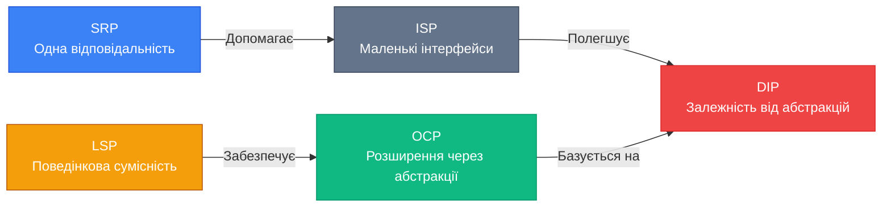

::

### Взаємозв'язок Принципів

| Принцип   | Сприяє                         | Конфліктує                      |
| :-------- | :----------------------------- | :------------------------------ |
| **SRP**   | ISP, DIP, DRY                  | -                               |
| **OCP**   | DIP, Strategy Pattern          | YAGNI (якщо передчасно)         |
| **LSP**   | OCP (корректність підстановки) | -                               |
| **ISP**   | SRP, DIP                       | -                               |
| **DIP**   | OCP, Testability               | -                               |
| **DRY**   | Maintainability                | KISS (якщо абстракція складна)  |
| **KISS**  | Readability                    | DRY (іноді дублювання простіше) |
| **YAGNI** | KISS, Agile                    | OCP (якщо потрібна гнучкість)   |
| **LoD**   | Low Coupling                   | -                               |

::note
**Важливо**: Принципи — це не догми, а guidelines. Іноді принципи конфліктують, і потрібно знайти баланс. Досвід допоможе розуміти, коли та які принципи застосовувати.
::

### Ключові Висновки

1. **SOLID** — фундамент якісної архітектури в ООП
2. **DRY** — уникайте дублювання знань, не коду
3. **KISS** — простота — ключ до maintainability
4. **YAGNI** — не передбачайте майбутнє, розробляйте ітеративно
5. **Law of Demeter** — мінімізуйте зв'язаність через приховування структури

### Подальше Вивчення

Тепер, коли ви розумієте принципи проектування, наступні кроки:

::card-group
:::card{title="Design Patterns" icon="i-heroicons-puzzle-piece" to="/csharp/design-patterns"}
Вивчіть класичні шаблони проектування (Gang of Four), які реалізують ці принципи
:::

:::card{title="Clean Architecture" icon="i-heroicons-building-office" to="/csharp/clean-architecture"}
Дізнайтесь, як організувати всю архітектуру додатку на основі принципів
:::

:::card{title="Domain-Driven Design" icon="i-heroicons-cpu-chip" to="/csharp/ddd"}
Поглибте знання проектування складних бізнес-систем
:::
::

::tip
**Практика, практика, практика!** Найкращий спосіб освоїти принципи — застосовувати їх у реальних проєктах. Починайте з code review свого коду, шукайте порушення принципів та рефакторте.
::

---
