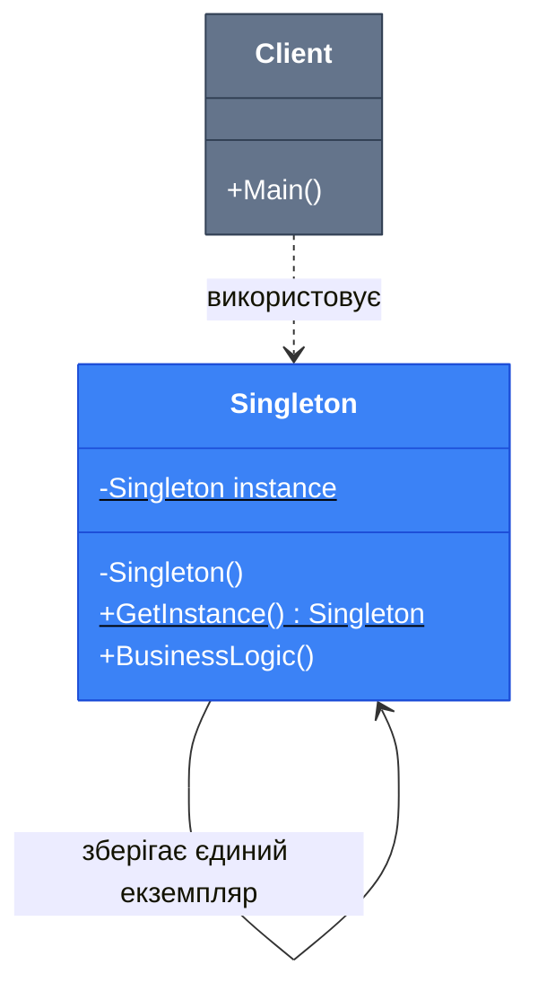

# Singleton (Одинак)

## Вступ та Контекст

Уявіть, що ви розробляєте систему логування для масштабного додатку. Кожен компонент системи має записувати логи у файл, але якщо кожен компонент створюватиме власний екземпляр Logger, це призведе до:

-   **Конфлікту доступу** до файлу (кілька процесів намагаються писати одночасно)
-   **Надмірного споживання пам'яті** (сотні однакових об'єктів Logger)
-   **Втрати цілісності** даних (перезапис, пошкодження файлів)

**Singleton (Одинак)** — це породжуючий патерн проектування, який **гарантує існування лише одного екземпляру класу** і надає **глобальну точку доступу** до нього.

::tip
Singleton вирішує дві фундаментальні проблеми одночасно:

1. **Контроль створення**: Забезпечує, щоб клас мав лише один екземпляр
2. **Глобальний доступ**: Надає простий спосіб отримати цей екземпляр з будь-якої точки програми
   ::

### Коли використовувати

| Сценарій                       | Обґрунтування                                   |
| :----------------------------- | :---------------------------------------------- |
| **Logger / Система логування** | Один централізований сервіс для запису логів    |
| **Configuration Manager**      | Один об'єкт конфігурації для всієї програми     |
| **Database Connection Pool**   | Управління обмеженою кількістю з'єднань         |
| **Cache Manager**              | Єдине сховище кешованих даних                   |
| **Device Drivers**             | Один драйвер для доступу до апаратного пристрою |

::warning
**Обережно з Singleton!**  
Багато розробників вважають Singleton **антипатерном**, оскільки він:

-   Порушує принцип єдиної відповідальності (SRP) — клас контролює своє створення
-   Ускладнює юніт-тестування (складно підміняти mock-об'єкти)
-   Створює приховані залежності (код неявно залежить від глобального стану)
-   Може порушувати SOLID принципи

Використовуйте Singleton **виключно тоді**, коли справді потрібен **єдиний екземпляр** і є **обґрунтована причина** для глобального доступу.
::

---

## Фундаментальні Концепції

### Академічне визначення

> **Singleton (Одинак)** — це породжуючий патерн проектування, який гарантує, що клас має лише один екземпляр, і надає глобальну точку доступу до цього екземпляру. Патерн делегує відповідальність за контроль створення самому класу, а не зовнішньому коду.

### Ключова ідея

Проблема створення єдиного екземпляру виникає з того, що звичайний конструктор **завжди повертає новий об'єкт**. Singleton вирішує це через:

1. **Приватний конструктор** — заборона зовнішнього створення об'єктів
2. **Статичне поле** — зберігання єдиного екземпляру
3. **Статичний метод** — контрольована точка доступу

::note
**Історична довідка**  
Singleton — один з 23 патернів, описаних у легендарній книзі "Design Patterns: Elements of Reusable Object-Oriented Software" (Gang of Four, 1994). Хоча патерн критикують за порушення SOLID принципів, він залишається корисним для специфічних випадків, де дійсно потрібен єдиний глобальний екземпляр.
::

### Аналогія з реального світу

**Уряд країни** — класичний приклад Singleton:

-   У країні може бути **тільки один офіційний уряд** (навіть якщо змінюється склад)
-   **Будь-який громадянин** може звернутися до уряду через публічні канали
-   Неможливо "створити" другий офіційний уряд — є лише один легітимний

Так само Singleton в програмуванні забезпечує **одну авторитетну інстанцію** для певного функціоналу.

---

## Архітектура та Механіка

### UML діаграма класів

::mermaid



::

**Пояснення:**

-   `- instance: Singleton` — статичне приватне поле, яке зберігає єдиний екземпляр
-   `- Singleton()` — приватний конструктор (позначено `-`), заборонений для зовнішніх викликів
-   `+ GetInstance(): Singleton` — публічний статичний метод (позначено `+` та `$`), єдина точка доступу
-   Клієнт не може створити новий об'єкт через `new`, лише через `GetInstance()`

### Діаграма послідовності

::mermaid

```mermaid
sequenceDiagram
    participant Client1 as Клієнт 1
    participant Client2 as Клієнт 2
    participant Singleton as Singleton

    Client1->>+Singleton: GetInstance()
    Note over Singleton: Перевірка: instance == null?
    Singleton->>Singleton: Створення екземпляру
    Singleton-->>-Client1: Повернути instance

    Client2->>+Singleton: GetInstance()
    Note over Singleton: instance != null
    Singleton-->>-Client2: Повернути той самий instance

    Note over Client1,Client2: Обидва клієнти працюють з одним об'єктом

    style Singleton fill:#3b82f6,stroke:#1d4ed8,color:#ffffff
    style Client1 fill:#64748b,stroke:#334155,color:#ffffff
    style Client2 fill:#64748b,stroke:#334155,color:#ffffff
```

::

### Учасники та їх ролі

| Учасник       | Роль        | Відповідальність                                                            |
| :------------ | :---------- | :-------------------------------------------------------------------------- |
| **Singleton** | Клас-одинак | Забезпечує єдиний екземпляр, контролює доступ через статичний метод         |
| **Client**    | Клієнт      | Отримує екземпляр через `GetInstance()`, не може створити новий через `new` |

---

## Практична Реалізація

### Варіації реалізації Singleton в C#

Існує **кілька підходів** до реалізації Singleton, кожен з яких має свої переваги та недоліки залежно від вимог до продуктивності та багатопоточності.

#### 1. Наївна реалізація (Non-Thread-Safe)

::warning
**Небезпечно в багатопоточному середовищі!**  
Цей підхід НЕ є потокобезпечним і може створити кілька екземплярів при одночасних викликах з різних потоків.
::

```csharp [Logger.cs] showLineNumbers
namespace DesignPatterns.Creational.Singleton;

/// <summary>
/// Наївна реалізація Singleton (НЕ потокобезпечна)
/// </summary>
public class Logger
{
    // Статичне поле для зберігання єдиного екземпляру
    private static Logger? _instance;

    // Приватний конструктор заборонює створення через new
    private Logger()
    {
        Console.WriteLine("Logger ініціалізовано");
    }

    // Публічна точка доступу до екземпляру
    public static Logger GetInstance()
    {
        // ПРОБЛЕМА: Якщо два потоки одночасно увійдуть сюди,
        // обидва можуть створити новий екземпляр
        if (_instance == null)
        {
            _instance = new Logger();
        }

        return _instance;
    }

    public void Log(string message)
    {
        Console.WriteLine($"[{DateTime.Now:HH:mm:ss}] {message}");
    }
}
```

**Використання:**

```csharp [Program.cs] showLineNumbers
// Отримуємо екземпляр Logger (створюється при першому виклику)
var logger1 = Logger.GetInstance();
logger1.Log("Перше повідомлення");

// Отримуємо той самий екземпляр
var logger2 = Logger.GetInstance();
logger2.Log("Друге повідомлення");

// Перевірка, що це той самий об'єкт
Console.WriteLine($"logger1 == logger2: {ReferenceEquals(logger1, logger2)}"); // True
```

**Проблеми:**

-   ❌ **Не потокобезпечний** — кілька потоків можуть створити різні екземпляри
-   ❌ **Race condition** — при одночасному доступі з різних потоків

---

#### 2. Thread-Safe: Double-Checked Locking

Цей підхід використовує **блокування (lock)** для забезпечення потокобезпечності, але робить це оптимізовано через **подвійну перевірку**.

```csharp [ConfigurationManager.cs] showLineNumbers
namespace DesignPatterns.Creational.Singleton;

/// <summary>
/// Thread-safe реалізація Singleton з Double-Checked Locking
/// </summary>
public sealed class ConfigurationManager
{
    private static ConfigurationManager? _instance;

    // Об'єкт для синхронізації потоків
    private static readonly object _lock = new();

    public Dictionary<string, string> Settings { get; }

    private ConfigurationManager()
    {
        Console.WriteLine("Configuration Manager ініціалізовано");
        Settings = new Dictionary<string, string>
        {
            ["AppName"] = "My Application",
            ["Version"] = "1.0.0"
        };
    }

    public static ConfigurationManager GetInstance()
    {
        // Перша перевірка (без блокування) — для продуктивності
        if (_instance == null)
        {
            // Блокування — лише якщо екземпляр ще не створений
            lock (_lock)
            {
                // Друга перевірка (всередині блокування) — для безпеки
                // Потрібна, бо інший потік міг створити екземпляр,
                // поки ми чекали на lock
                if (_instance == null)
                {
                    _instance = new ConfigurationManager();
                }
            }
        }

        return _instance;
    }

    public string GetSetting(string key)
    {
        return Settings.TryGetValue(key, out var value) ? value : "Not found";
    }
}
```

**Пояснення коду:**

1. **Рядок 19-20**: Перша перевірка `if (_instance == null)` виконується **без блокування** для підвищення продуктивності. Якщо екземпляр вже створений, блокування не відбувається.

2. **Рядок 22**: `lock (_lock)` — критична секція, де тільки один потік може перебувати одночасно.

3. **Рядок 26-27**: Друга перевірка **всередині lock** необхідна, тому що доки перший потік чекав на lock, інший потік міг вже створити екземпляр.

4. **`sealed`**: Клас позначений як `sealed`, щоб заборонити успадкування (це важливо для Singleton, бо наслідування може порушити гарантію єдиності екземпляру).

::tip
**Double-Checked Locking Pattern**  
Цей патерн оптимізує продуктивність: **блокування виконується лише один раз** при першому створенні екземпляру. Всі наступні виклики уникають lock завдяки швидкій перевірці `if (_instance == null)`.
::

**Використання:**

```csharp [Program.cs] showLineNumbers
// Багатопоточне середовище
var tasks = new List<Task>();

for (int i = 0; i < 5; i++)
{
    int threadId = i;
    tasks.Add(Task.Run(() =>
    {
        var config = ConfigurationManager.GetInstance();
        Console.WriteLine($"Thread {threadId}: {config.GetSetting("AppName")}");
    }));
}

await Task.WhenAll(tasks);
// Виведе "Configuration Manager ініціалізовано" лише ОДИН раз
```

---

#### 3. Thread-Safe: Lazy<T> (Рекомендований підхід)

Найсучасніший і **найбезпечніший** підхід — використання вбудованого класу `Lazy<T>`, який **автоматично** забезпечує потокобезпечність та ледаче ініціалізацію.

```csharp [DatabaseConnection.cs] showLineNumbers
namespace DesignPatterns.Creational.Singleton;

/// <summary>
/// Thread-safe Singleton через Lazy<T> — РЕКОМЕНДОВАНИЙ підхід
/// </summary>
public sealed class DatabaseConnection
{
    // Lazy<T> гарантує потокобезпечність та ледаче ініціалізацію
    private static readonly Lazy<DatabaseConnection> _lazyInstance =
        new(() => new DatabaseConnection());

    public static DatabaseConnection Instance => _lazyInstance.Value;

    public string ConnectionString { get; }

    private DatabaseConnection()
    {
        Console.WriteLine("Database Connection ініціалізовано");
        ConnectionString = "Server=localhost;Database=MyApp;";
    }

    public void ExecuteQuery(string query)
    {
        Console.WriteLine($"Виконується запит: {query}");
    }
}
```

**Переваги Lazy<T>:**

| Характеристика              | Опис                                                      |
| :-------------------------- | :-------------------------------------------------------- |
| ✅ **Потокобезпечність**    | `Lazy<T>` автоматично використовує блокування             |
| ✅ **Ледаче ініціалізацію** | Об'єкт створюється лише при першому звертанні до `.Value` |
| ✅ **Мінімалізм коду**      | Не потрібно писати власну логіку блокування               |
| ✅ **Продуктивність**       | Оптимізований механізм блокування всередині .NET          |

**Використання:**

```csharp [Program.cs] showLineNumbers
// Простий доступ через властивість Instance
var db1 = DatabaseConnection.Instance;
db1.ExecuteQuery("SELECT * FROM Users");

var db2 = DatabaseConnection.Instance;
Console.WriteLine($"db1 == db2: {ReferenceEquals(db1, db2)}"); // True
```

::tip
**Best Practice**  
Використовуйте `Lazy<T>` для реалізації Singleton в C#. Це найпростіший, найбезпечніший та найефективніший підхід. Забудьте про ручне блокування!
::

---

#### 4. Eager Initialization (Жадібна ініціалізація)

Екземпляр створюється **одразу** при завантаженні класу, ще до першого звертання. .NET гарантує потокобезпечність статичних конструкторів.

```csharp [CacheManager.cs] showLineNumbers
namespace DesignPatterns.Creational.Singleton;

/// <summary>
/// Singleton з жадібною ініціалізацією (Eager Initialization)
/// </summary>
public sealed class CacheManager
{
    // Екземпляр створюється ОДРАЗУ при завантаженні класу
    private static readonly CacheManager _instance = new();

    public static CacheManager Instance => _instance;

    private readonly Dictionary<string, object> _cache;

    private CacheManager()
    {
        Console.WriteLine("Cache Manager ініціалізовано");
        _cache = new Dictionary<string, object>();
    }

    public void Set(string key, object value)
    {
        _cache[key] = value;
    }

    public object? Get(string key)
    {
        return _cache.TryGetValue(key, out var value) ? value : null;
    }
}
```

**Коли використовувати:**

| ✅ Підходить                             | ❌ Не підходить                           |
| :--------------------------------------- | :---------------------------------------- |
| Екземпляр **завжди** потрібен в програмі | Створення об'єкту **дороге** за ресурсами |
| Ініціалізація **швидка**                 | Екземпляр може **не знадобитися** взагалі |
| Просто та зрозуміло                      | Потрібна ледача ініціалізація             |

---

### Порівняльна таблиця підходів

| Підхід                   | Потокобезпечність | Ледача ініціалізація | Складність | Рекомендація            |
| :----------------------- | :---------------- | :------------------- | :--------- | :---------------------- |
| **Наївний**              | ❌ Ні             | ✅ Так               | Проста     | ❌ Уникати              |
| **Double-Checked Lock**  | ✅ Так            | ✅ Так               | Середня    | ⚠️ Якщо немає Lazy<T>   |
| **Lazy<T>**              | ✅ Так            | ✅ Так               | Проста     | ✅ **Рекомендовано**    |
| **Eager Initialization** | ✅ Так            | ❌ Ні                | Проста     | ⚠️ Якщо завжди потрібен |

---

## Реальні приклади з .NET

### Приклад 1: HttpClient Singleton (Best Practice)

`HttpClient` — класичний приклад, де Singleton критично важливий. Створення багатьох екземплярів `HttpClient` призводить до **вичерпання портів** (socket exhaustion).

```csharp [HttpClientSingleton.cs] showLineNumbers
namespace DesignPatterns.Creational.Singleton;

/// <summary>
/// Singleton для HttpClient — запобігає socket exhaustion
/// </summary>
public sealed class HttpClientSingleton
{
    private static readonly Lazy<HttpClient> _lazyClient = new(() =>
    {
        var client = new HttpClient
        {
            Timeout = TimeSpan.FromSeconds(30),
            BaseAddress = new Uri("https://api.example.com/")
        };

        client.DefaultRequestHeaders.Add("User-Agent", "MyApp/1.0");

        return client;
    });

    public static HttpClient Client => _lazyClient.Value;

    private HttpClientSingleton() { }
}
```

**Використання:**

```csharp [Program.cs] showLineNumbers
// Всі запити використовують один HttpClient
var response1 = await HttpClientSingleton.Client.GetAsync("users");
var response2 = await HttpClientSingleton.Client.GetAsync("posts");

// Не створюються нові TCP з'єднання для кожного запиту
```

::note
**Сучасна альтернатива**  
У .NET Core/5+ рекомендується використовувати `IHttpClientFactory` замість Singleton для HttpClient, оскільки фабрика надає додаткові можливості (named clients, typed clients, middleware).
::

### Приклад 2: Logging з Serilog

```csharp [LoggerSingleton.cs] showLineNumbers
using Serilog;

namespace DesignPatterns.Creational.Singleton;

public sealed class LoggerSingleton
{
    private static readonly Lazy<ILogger> _lazyLogger = new(() =>
    {
        return new LoggerConfiguration()
            .MinimumLevel.Debug()
            .WriteTo.Console()
            .WriteTo.File("logs/app.log", rollingInterval: RollingInterval.Day)
            .CreateLogger();
    });

    public static ILogger Logger => _lazyLogger.Value;

    private LoggerSingleton() { }
}
```

**Використання:**

```csharp [Services/UserService.cs] showLineNumbers
public class UserService
{
    public void CreateUser(string username)
    {
        LoggerSingleton.Logger.Information("Створення користувача: {Username}", username);

        // Логіка створення користувача

        LoggerSingleton.Logger.Debug("Користувач {Username} створений успішно", username);
    }
}
```

---

## Patterns & Anti-patterns

### ✅ Best Practices

::steps

### Крок 1: Використовуйте Lazy<T>

Завжди віддавайте перевагу `Lazy<T>` для реалізації Singleton в C#.

```csharp
private static readonly Lazy<MyClass> _instance = new(() => new MyClass());
public static MyClass Instance => _instance.Value;
```

### Крок 2: Позначайте клас як sealed

Заборона успадкування критична для Singleton.

```csharp
public sealed class MySingleton { }
```

### Крок 3: Робіть конструктор приватним

Це єдиний спосіб заборонити зовнішнє створення екземплярів.

```csharp
private MySingleton() { }
```

### Крок 4: Дозволяйте Dependency Injection (опціонально)

Для кращої тестованості, розгляньте можливість створення інтерфейсу.

```csharp
public interface IConfigurationManager { }
public sealed class ConfigurationManager : IConfigurationManager { }

// В Dependency Injection контейнері
services.AddSingleton<IConfigurationManager, ConfigurationManager>();
```

::

### ❌ Антипатерни та підводні камені

::warning

#### 1. Глобальний стан (Global State)

**Проблема:**  
Singleton створює **глобальний змінюваний стан**, що ускладнює розуміння потоку даних.

```csharp
// АНТИПАТЕРН: Singleton зі змінюваним станом
public class GlobalState
{
    public static GlobalState Instance { get; } = new();

    public int Counter { get; set; } // Небезпечно!

    private GlobalState() { }
}

// Будь-яка частина коду може змінити Counter
GlobalState.Instance.Counter = 42;
```

**Рішення:**  
Робіть стан **незмінним (immutable)** або використовуйте **потокобезпечні колекції**.

```csharp
public class ImmutableConfig
{
    public static ImmutableConfig Instance { get; } = new();

    public IReadOnlyDictionary<string, string> Settings { get; }

    private ImmutableConfig()
    {
        Settings = new Dictionary<string, string>
        {
            ["ApiKey"] = "secret"
        }.AsReadOnly();
    }
}
```

---

#### 2. Ускладнення тестування

**Проблема:**  
Singleton створює **приховані залежності**, які неможливо замінити mock-об'єктами в тестах.

```csharp
// АНТИПАТЕРН: Клас жорстко залежить від Singleton
public class UserService
{
    public void CreateUser(string name)
    {
        // Неможливо замінити DatabaseConnection на mock в тестах
        DatabaseConnection.Instance.ExecuteQuery($"INSERT INTO Users VALUES ('{name}')");
    }
}
```

**Рішення:**  
Використовуйте **Dependency Injection** замість прямого доступу.

```csharp
// ПРАВИЛЬНО: Залежність передається через конструктор
public class UserService
{
    private readonly IDatabaseConnection _db;

    public UserService(IDatabaseConnection db)
    {
        _db = db; // Можна передати mock в тестах
    }

    public void CreateUser(string name)
    {
        _db.ExecuteQuery($"INSERT INTO Users VALUES ('{name}')");
    }
}

// В тесті
var mockDb = new Mock<IDatabaseConnection>();
var service = new UserService(mockDb.Object);
```

---

#### 3. Порушення Single Responsibility Principle (SRP)

**Проблема:**  
Singleton виконує **дві відповідальності**:

1. Бізнес-логіка класу
2. Контроль над створенням екземпляру

**Рішення:**  
Розгляньте використання **DI контейнера** (як `Microsoft.Extensions.DependencyInjection`), який візьме на себе контроль життєвого циклу.

```csharp
// Замість Singleton патерну
services.AddSingleton<IConfigurationManager, ConfigurationManager>();

// Клас більше не контролює своє створення
public class ConfigurationManager : IConfigurationManager
{
    public ConfigurationManager() { } // Публічний конструктор
}
```

::

---

## Troubleshooting

### Проблема 1: Кілька екземплярів в багатопоточному середовищі

**Симптоми:**

```csharp
var instance1 = MySingleton.GetInstance();
var instance2 = MySingleton.GetInstance();
Console.WriteLine(ReferenceEquals(instance1, instance2)); // False (!)
```

**Причина:**  
Використовується наївна реалізація без блокування.

**Рішення:**  
Використовуйте `Lazy<T>` або Double-Checked Locking.

```csharp
private static readonly Lazy<MySingleton> _instance = new(() => new MySingleton());
public static MySingleton Instance => _instance.Value;
```

---

### Проблема 2: TypeInitializationException

**Симптоми:**

```
System.TypeInitializationException: The type initializer for 'MySingleton' threw an exception.
```

**Причина:**  
Виняток у **статичному конструкторі** або при ініціалізації статичного поля.

**Рішення:**  
Додайте обробку помилок в конструкторі Singleton.

```csharp
private DatabaseConnection()
{
    try
    {
        ConnectionString = ConfigurationManager.GetConnectionString();
    }
    catch (Exception ex)
    {
        Console.WriteLine($"Помилка ініціалізації: {ex.Message}");
        throw; // Перекидаємо виняток після логування
    }
}
```

---

### Проблема 3: Проблеми з Reflection

**Симптоми:**  
Singleton може бути обійдений через Reflection.

```csharp
// Зламування Singleton через Reflection
var constructor = typeof(MySingleton).GetConstructor(
    BindingFlags.Instance | BindingFlags.NonPublic,
    null, Type.EmptyTypes, null);

var instance = (MySingleton)constructor.Invoke(null); // Новий екземпляр!
```

**Рішення:**  
Додайте захист в приватному конструкторі.

```csharp
public sealed class ProtectedSingleton
{
    private static readonly Lazy<ProtectedSingleton> _instance = new(() => new ProtectedSingleton());
    public static ProtectedSingleton Instance => _instance.Value;

    private ProtectedSingleton()
    {
        // Захист від Reflection
        if (_instance != null && _instance.IsValueCreated)
        {
            throw new InvalidOperationException("Використовуйте Instance властивість для доступу до Singleton.");
        }
    }
}
```

---

## Практичні Завдання

### Рівень 1: Базовий

::collapsible{title="Завдання: Створити Thread-Safe Logger Singleton"}

**Опис:**  
Реалізуйте Singleton для класу `Logger`, який:

-   Використовує `Lazy<T>` для потокобезпечності
-   Має метод `Log(string message, LogLevel level)`
-   Записує логи у консоль з міткою часу
-   Має enum `LogLevel` з рівнями: `Info`, `Warning`, `Error`

**Очікуваний результат:**

```csharp
var logger = Logger.Instance;
logger.Log("Програма запущена", LogLevel.Info);
logger.Log("Попередження!", LogLevel.Warning);

// Виведе:
// [22:15:30] INFO: Програма запущена
// [22:15:31] WARNING: Попередження!
```

---

**Рішення:**

```csharp [Logger.cs] showLineNumbers
namespace DesignPatterns.Practice;

public enum LogLevel
{
    Info,
    Warning,
    Error
}

public sealed class Logger
{
    private static readonly Lazy<Logger> _instance = new(() => new Logger());

    public static Logger Instance => _instance.Value;

    private Logger()
    {
        Console.WriteLine("Logger ініціалізовано");
    }

    public void Log(string message, LogLevel level)
    {
        var timestamp = DateTime.Now.ToString("HH:mm:ss");
        var levelText = level.ToString().ToUpper();
        Console.WriteLine($"[{timestamp}] {levelText}: {message}");
    }
}
```

```csharp [Program.cs] showLineNumbers
using DesignPatterns.Practice;

var logger = Logger.Instance;
logger.Log("Програма запущена", LogLevel.Info);
logger.Log("Можлива проблема", LogLevel.Warning);
logger.Log("Критична помилка", LogLevel.Error);

// Перевірка, що це Singleton
var logger2 = Logger.Instance;
Console.WriteLine($"Один екземпляр? {ReferenceEquals(logger, logger2)}"); // True
```

::

---

### Рівень 2: Середній

::collapsible{title="Завдання: Configuration Manager з файлом"}

**Опис:**  
Створіть Singleton `ConfigurationManager`, який:

-   Зчитує конфігурацію з JSON файлу `appsettings.json`
-   Використовує `Lazy<T>` для thread-safety
-   Має метод `GetValue(string key)` для отримання налаштувань
-   Кешує прочитані значення в `Dictionary<string, string>`
-   Викидає `FileNotFoundException`, якщо файл не знайдений

**Файл appsettings.json:**

```json
{
    "AppName": "My Application",
    "Version": "1.0.0",
    "ApiUrl": "https://api.example.com"
}
```

**Очікуваний результат:**

```csharp
var config = ConfigurationManager.Instance;
Console.WriteLine(config.GetValue("AppName")); // My Application
Console.WriteLine(config.GetValue("Version")); // 1.0.0
```

---

**Рішення:**

```csharp [ConfigurationManager.cs] showLineNumbers
using System.Text.Json;

namespace DesignPatterns.Practice;

public sealed class ConfigurationManager
{
    private static readonly Lazy<ConfigurationManager> _instance =
        new(() => new ConfigurationManager());

    public static ConfigurationManager Instance => _instance.Value;

    private readonly Dictionary<string, string> _settings;

    private ConfigurationManager()
    {
        const string filePath = "appsettings.json";

        if (!File.Exists(filePath))
        {
            throw new FileNotFoundException($"Файл конфігурації не знайдено: {filePath}");
        }

        var json = File.ReadAllText(filePath);
        _settings = JsonSerializer.Deserialize<Dictionary<string, string>>(json)
                    ?? new Dictionary<string, string>();

        Console.WriteLine($"Завантажено {_settings.Count} налаштувань з {filePath}");
    }

    public string GetValue(string key)
    {
        if (_settings.TryGetValue(key, out var value))
        {
            return value;
        }

        throw new KeyNotFoundException($"Налаштування '{key}' не знайдено");
    }

    public IReadOnlyDictionary<string, string> GetAllSettings()
    {
        return _settings;
    }
}
```

```csharp [Program.cs] showLineNumbers
using DesignPatterns.Practice;

try
{
    var config = ConfigurationManager.Instance;

    Console.WriteLine($"AppName: {config.GetValue("AppName")}");
    Console.WriteLine($"Version: {config.GetValue("Version")}");
    Console.WriteLine($"ApiUrl: {config.GetValue("ApiUrl")}");

    // Спроба отримати неіснуючий ключ
    try
    {
        config.GetValue("NonExistent");
    }
    catch (KeyNotFoundException ex)
    {
        Console.WriteLine($"Помилка: {ex.Message}");
    }
}
catch (FileNotFoundException ex)
{
    Console.WriteLine($"Помилка: {ex.Message}");
}
```

::

---

### Рівень 3: Експертний

::collapsible{title="Завдання: Database Connection Pool з обмеженням"}

**Опис:**  
Реалізуйте Singleton `ConnectionPool`, який:

-   Управляє обмеженою кількістю з'єднань до бази даних (наприклад, 5)
-   Має метод `GetConnection()` для отримання вільного з'єднання
-   Має метод `ReleaseConnection(DbConnection connection)` для повернення з'єднання в пул
-   Блокує виклик `GetConnection()`, якщо всі з'єднання зайняті, доки не звільниться хоча б одне
-   Потокобезпечний
-   Використовує `SemaphoreSlim` для контролю доступу

**Очікуваний результат:**

```csharp
var pool = ConnectionPool.Instance;

// В багатопоточному середовищі
var tasks = Enumerable.Range(0, 10).Select(i => Task.Run(async () =>
{
    var connection = await pool.GetConnection();
    Console.WriteLine($"Thread {i}: отримано з'єднання {connection.Id}");

    await Task.Delay(1000); // Симуляція роботи

    pool.ReleaseConnection(connection);
    Console.WriteLine($"Thread {i}: повернуто з'єднання {connection.Id}");
}));

await Task.WhenAll(tasks);
```

---

**Рішення:**

```csharp [DbConnection.cs] showLineNumbers
namespace DesignPatterns.Practice;

/// <summary>
/// Імітація з'єднання з базою даних
/// </summary>
public class DbConnection
{
    public int Id { get; }
    public bool IsInUse { get; set; }

    public DbConnection(int id)
    {
        Id = id;
        IsInUse = false;
    }

    public void Open()
    {
        Console.WriteLine($"З'єднання {Id} відкрито");
    }

    public void Close()
    {
        Console.WriteLine($"З'єднання {Id} закрито");
    }
}
```

```csharp [ConnectionPool.cs] showLineNumbers
namespace DesignPatterns.Practice;

public sealed class ConnectionPool
{
    private static readonly Lazy<ConnectionPool> _instance =
        new(() => new ConnectionPool());

    public static ConnectionPool Instance => _instance.Value;

    private readonly List<DbConnection> _connections;
    private readonly SemaphoreSlim _semaphore;
    private readonly object _lock = new();
    private const int MaxConnections = 5;

    private ConnectionPool()
    {
        _connections = new List<DbConnection>();
        _semaphore = new SemaphoreSlim(MaxConnections, MaxConnections);

        // Створюємо пул з'єднань
        for (int i = 0; i < MaxConnections; i++)
        {
            var connection = new DbConnection(i + 1);
            connection.Open();
            _connections.Add(connection);
        }

        Console.WriteLine($"Connection Pool ініціалізовано з {MaxConnections} з'єднаннями");
    }

    public async Task<DbConnection> GetConnection()
    {
        // Чекаємо, доки з'явиться вільне з'єднання
        await _semaphore.WaitAsync();

        lock (_lock)
        {
            // Знаходимо перше вільне з'єднання
            var connection = _connections.First(c => !c.IsInUse);
            connection.IsInUse = true;
            return connection;
        }
    }

    public void ReleaseConnection(DbConnection connection)
    {
        lock (_lock)
        {
            if (!_connections.Contains(connection))
            {
                throw new InvalidOperationException("З'єднання не належить цьому пулу");
            }

            connection.IsInUse = false;
        }

        // Звільнюємо семафор, дозволяючи іншому потоку отримати з'єднання
        _semaphore.Release();
    }

    public int GetAvailableConnectionsCount()
    {
        lock (_lock)
        {
            return _connections.Count(c => !c.IsInUse);
        }
    }
}
```

```csharp [Program.cs] showLineNumbers
using DesignPatterns.Practice;

var pool = ConnectionPool.Instance;

// Симуляція багатопоточного доступу
var tasks = Enumerable.Range(0, 10).Select(i => Task.Run(async () =>
{
    Console.WriteLine($"Thread {i}: запит на з'єднання (доступно: {pool.GetAvailableConnectionsCount()})");

    var connection = await pool.GetConnection();
    Console.WriteLine($"Thread {i}: отримано з'єднання {connection.Id}");

    // Симуляція роботи з БД
    await Task.Delay(Random.Shared.Next(500, 2000));

    pool.ReleaseConnection(connection);
    Console.WriteLine($"Thread {i}: повернуто з'єднання {connection.Id}");
}));

await Task.WhenAll(tasks);

Console.WriteLine($"\nВсі задачі завершені. Доступних з'єднань: {pool.GetAvailableConnectionsCount()}");
```

**Пояснення рішення:**

1. **SemaphoreSlim**: Обмежує кількість одночасних доступів до ресурсу (5 з'єднань).
2. **WaitAsync()**: Блокує потік, якщо всі з'єднання зайняті.
3. **Release()**: Звільнює семафор, дозволяючи наступному потоку отримати з'єднання.
4. **lock**: Забезпечує потокобезпечність при зміні стану з'єднань.

::

---

## Підсумок

### Ключові висновки

::card-group
::card{title="Що таке Singleton?" icon="i-heroicons-light-bulb"}
Породжуючий патерн, який гарантує **єдиний екземпляр класу** і надає **глобальну точку доступу**.
::

::card{title="Коли використовувати?" icon="i-heroicons-check-circle"}
Logger, Configuration Manager, Database Connection Pool, Cache — коли справді потрібен **один екземпляр**.
::

::card{title="Як реалізувати в C#?" icon="i-heroicons-code-bracket"}
**Lazy<T>** — найкращий підхід для thread-safe lazy initialization.
::

::card{title="Головна небезпека" icon="i-heroicons-exclamation-triangle"}
Глобальний стан, складність тестування, порушення SRP. **Використовуйте обережно!**
::
::

### Альтернативи Singleton

| Альтернатива                       | Коли використовувати                                        |
| :--------------------------------- | :---------------------------------------------------------- |
| **Dependency Injection Container** | Коли потрібен контроль життєвого циклу зовні класу          |
| **Static Class**                   | Коли не потрібен стан, лише статичні методи                 |
| **Factory Pattern**                | Коли потрібна гнучкість створення різних реалізацій         |
| **Monostate Pattern**              | Коли потрібна поведінка Singleton без обмеження екземплярів |

### Посилання на наступні патерни

-   [**Builder**](./2.builder.md) — для створення складних об'єктів крок за кроком
-   [**Factory Method**](./3.factory-method.md) — для делегування створення об'єктів підкласам
-   [**Abstract Factory**](./4.abstract-factory.md) — для створення сімейств пов'язаних об'єктів

---

### Додаткові ресурси

-   [Microsoft Learn: Singleton Pattern](https://learn.microsoft.com/en-us/dotnet/api/system.lazy-1)
-   [Refactoring.Guru: Singleton](https://refactoring.guru/design-patterns/singleton)
-   [C# Thread-Safety Best Practices](https://learn.microsoft.com/en-us/dotnet/standard/threading/managed-threading-best-practices)
