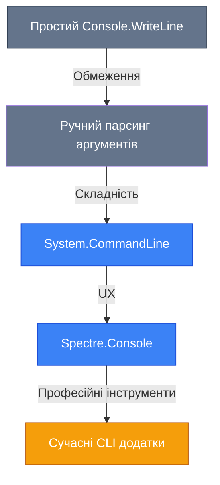
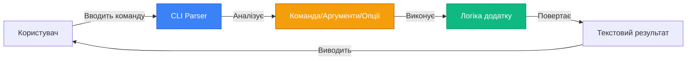

# Building Professional CLIs

## Вступ та Контекст

Уявіть, що ви розробляєте систему для автоматизації рутинних задач у вашій команді. Вам потрібен інструмент, який:

-   Приймає параметри командного рядка (наприклад, `myapp process --input data.csv --output results.json`)
-   Відображає прогрес обробки з кольоровим інтерфейсом
-   Взаємодіє з користувачем через інтерактивні меню
-   Виводить зрозумілі помилки та підказки
-   Працює однаково добре в будь-якому терміналі

Такий інструмент може бути використаний для:

-   Автоматизації розгортання
-   Обробки даних
-   Інтерактивного налаштування систем
-   Системного адміністрування
-   CI/CD процесів

::note
**Проблема**: Типові консольні застосунки в C# використовують лише `Console.WriteLine()` та `Console.ReadLine()`, що призводить до:

-   Незручного парсингу аргументів
-   Незрозумілих помилок
-   Відсутності автодоповнення
-   Поганого користувацького досвіду
    ::

**Вирішення**: Сучасні бібліотеки як **System.CommandLine** та **Spectre.Console** надають потужні інструменти для створення професійних CLI інтерфейсів з:

-   Автоматичним парсингом аргументів
-   Валідацією вхідних даних
-   Автодоповненням команд
-   Кольоровим виводом
-   Інтерактивними елементами (меню, прогрес-бари, таблиці)
-   Уніфікованим UX

### Еволюція CLI інструментів

::mermaid



::

### Передумови

Перед вивченням цієї теми вам потрібно розуміти:

-   [Основи C#](/csharp/fundamentals/variables-data-types)
-   [Роботу з консоллю](/csharp/fundamentals/interactive-console)
-   [Основи ООП](/csharp/oop/classes-objects)

## Фундаментальні Концепції

### Що таке CLI (Command Line Interface)

**CLI (Command Line Interface)** — це текстовий інтерфейс для взаємодії з комп'ютерною системою, де користувач вводить команди у вигляді тексту, а отримує результат у вигляді текстового виводу.

::mermaid



::

### Компоненти CLI

| Компонент    | Опис                                                   | Приклад                                    |
| :----------- | :----------------------------------------------------- | :----------------------------------------- |
| **Команда**  | Основна дія, яку виконує додаток                       | `git commit`, `dotnet build`               |
| **Аргумент** | Обов'язковий параметр, що вказується без префіксу      | `git add file.txt` (`file.txt` - аргумент) |
| **Опція**    | Необов'язковий параметр, що починається з `--` або `-` | `--verbose`, `-v`                          |
| **Флаг**     | Опція, що не приймає значення                          | `--help`, `--version`                      |

### System.CommandLine vs Spectre.Console

| Функція                       | System.CommandLine | Spectre.Console |
| :---------------------------- | :----------------- | :-------------- |
| Парсинг аргументів            | ✅                 | ❌              |
| Валідація вхідних даних       | ✅                 | ❌              |
| Кольоровий вивід              | ❌                 | ✅              |
| Інтерактивні елементи         | ❌                 | ✅              |
| Таблиці, дерева, прогрес-бари | ❌                 | ✅              |
| Автодоповнення                | ✅                 | ❌              |

**Висновок**: System.CommandLine відповідає за вхідні дані, Spectre.Console — за вихідні.

## System.CommandLine: Parsing Arguments, Options, Commands

### Встановлення

```bash
dotnet add package System.CommandLine
```

### Основи: Проста команда

```csharp [Program.cs] showLineNumbers
using System.CommandLine;

// Визначаємо кореневу команду
var rootCommand = new RootCommand("Мій перший CLI додаток");

// Додаємо команду до обробки
rootCommand.SetHandler(() =>
{
    Console.WriteLine("Привіт з CLI додатку!");
});

// Виконуємо команду
await rootCommand.InvokeAsync(args);
```

**Використання:**

```bash
dotnet run
# Виведе: Привіт з CLI додатку!
```

### Аргументи

```csharp [Program.cs] showLineNumbers
using System.CommandLine;

var rootCommand = new RootCommand("Простий калькулятор");

// Визначаємо аргументи
var firstNumberArg = new Argument<int>("first", "Перше число");
var secondNumberArg = new Argument<int>("second", "Друге число");

rootCommand.AddArgument(firstNumberArg);
rootCommand.AddArgument(secondNumberArg);

rootCommand.SetHandler((first, second) =>
{
    Console.WriteLine($"{first} + {second} = {first + second}");
}, firstNumberArg, secondNumberArg);

await rootCommand.InvokeAsync(args);
```

**Використання:**

```bash
dotnet run 5 3
# Виведе: 5 + 3 = 8
```

### Опції

```csharp [Program.cs] showLineNumbers
using System.CommandLine;

var rootCommand = new RootCommand("Конфігураційний інструмент");

// Визначаємо опції
var verboseOption = new Option<bool>("--verbose", "Детальний вивід");
var outputOption = new Option<string>("--output", () => "output.txt", "Файл виводу");

rootCommand.AddOption(verboseOption);
rootCommand.AddOption(outputOption);

rootCommand.SetHandler((verbose, output) =>
{
    if (verbose)
        Console.WriteLine($"Вивід буде записано до: {output}");

    Console.WriteLine($"Обробка завершена, результат у {output}");
}, verboseOption, outputOption);

await rootCommand.InvokeAsync(args);
```

**Використання:**

```bash
dotnet run --verbose --output results.txt
# Виведе:
# Вивід буде записано до: results.txt
# Обробка завершена, результат у results.txt
```

### Команди та підкоманди

```csharp [Program.cs] showLineNumbers
using System.CommandLine;

var rootCommand = new RootCommand("Управління проектами");

// Підкоманда для створення проекту
var createCommand = new Command("create", "Створити новий проект")
{
    new Option<string>("--name", "Назва проекту"),
    new Option<string>("--type", () => "console", "Тип проекту")
};

createCommand.SetHandler((name, type) =>
{
    Console.WriteLine($"Створюємо {type} проект з назвою '{name}'");
},
new Option<string>("--name", "Назва проекту"),
new Option<string>("--type", () => "console", "Тип проекту"));

// Підкоманда для видалення проекту
var deleteCommand = new Command("delete", "Видалити проект")
{
    new Argument<string>("name", "Назва проекту для видалення")
};

deleteCommand.SetHandler((name) =>
{
    Console.WriteLine($"Видаляємо проект: {name}");
},
new Argument<string>("name", "Назва проекту для видалення"));

rootCommand.AddCommand(createCommand);
rootCommand.AddCommand(deleteCommand);

await rootCommand.InvokeAsync(args);
```

**Використання:**

```bash
dotnet run create --name MyProject --type webapi
# Виведе: Створюємо webapi проект з назвою 'MyProject'

dotnet run delete MyProject
# Виведе: Видаляємо проект: MyProject
```

### Валідація

```csharp [Program.cs] showLineNumbers
using System.CommandLine;

var rootCommand = new RootCommand("Валідація даних");

var emailOption = new Option<string>("--email", "Email адреса");
emailOption.AddValidator(result =>
{
    var value = result.GetValueForOption(emailOption);
    if (string.IsNullOrEmpty(value))
        return;

    if (!value.Contains('@'))
        result.ErrorMessage = "Невалідний email адрес";
});

var ageOption = new Option<int>("--age", "Вік");
ageOption.AddValidator(result =>
{
    var value = result.GetValueForOption(ageOption);
    if (value < 0 || value > 150)
        result.ErrorMessage = "Вік має бути від 0 до 150";
});

rootCommand.AddOption(emailOption);
rootCommand.AddOption(ageOption);

rootCommand.SetHandler((email, age) =>
{
    Console.WriteLine($"Email: {email}, Вік: {age}");
}, emailOption, ageOption);

await rootCommand.InvokeAsync(args);
```

**Використання:**

```bash
dotnet run --email invalid-email --age 200
# Виведе помилку: Невалідний email адрес, Вік має бути від 0 до 150
```

## Spectre.Console: Styling & Markup (colors, emoji)

### Встановлення

```bash
dotnet add package Spectre.Console
```

### Основи: Кольори та стилі

```csharp [Program.cs] showLineNumbers
using Spectre.Console;

// Простий кольоровий вивід
AnsiConsole.MarkupLine("[red]Червоний[/] текст");
AnsiConsole.MarkupLine("[green]Зелений[/] текст");
AnsiConsole.MarkupLine("[blue]Синій[/] текст");

// Комбінація кольорів та стилів
AnsiConsole.MarkupLine("[bold red]Жирний червоний[/]");
AnsiConsole.MarkupLine("[underline blue]Підкреслений синій[/]");
AnsiConsole.MarkupLine("[strikethrough yellow]Закреслений жовтий[/]");

// Використання кольорів для повідомлень
AnsiConsole.MarkupLine("[bold green]✓[/] Успішно виконано");
AnsiConsole.MarkupLine("[bold red]✗[/] Помилка");
AnsiConsole.MarkupLine("[bold yellow]⚠[/] Попередження");

// Емодзі
AnsiConsole.MarkupLine("[bold blue]Привіт![/] 🌟");
AnsiConsole.MarkupLine("Завантаження [yellow]...[/] 🚀");
```

### Палітри кольорів

```csharp [Program.cs] showLineNumbers
using Spectre.Console;

// Використання CSS-назв кольорів
AnsiConsole.MarkupLine("[color(255,165,0)]Помаранчевий[/] за допомогою RGB");
AnsiConsole.MarkupLine("[color(0,255,0)]Зелений[/] за допомогою RGB");

// Виведення кольорової палітри
var colors = new[]
{
    "red", "green", "blue", "yellow", "magenta", "cyan",
    "orange", "purple", "pink", "brown"
};

foreach (var color in colors)
{
    AnsiConsole.MarkupLine($"[{color}]{color}[/]");
}
```

### Стилі та теми

```csharp [Program.cs] showLineNumbers
using Spectre.Console;

// Встановлення теми для всього виводу
AnsiConsole.Write(
    new Panel("Це панель зі стилем")
        .Header("Заголовок")
        .Border(BoxBorder.Double)
        .BorderColor(Color.Blue));

// Виведення таблиці з кольорами
var table = new Table();
table.Border(TableBorder.Double);
table.AddColumn(new TableColumn("Колір").Centered());
table.AddColumn(new TableColumn("Опис").Centered());

table.AddRow("[red]Червоний[/]", "Помилки");
table.AddRow("[green]Зелений[/]", "Успіх");
table.AddRow("[yellow]Жовтий[/]", "Попередження");

AnsiConsole.Write(table);
```

## Spectre.Console: Widgets (Tables, Trees, Panels, Rules)

### Таблиці

```csharp [Program.cs] showLineNumbers
using Spectre.Console;

// Проста таблиця
var table = new Table();
table.Title = new TableTitle("Список користувачів");
table.Caption = new TableCaption("Всього: 3 користувачі");

// Додаємо колонки
table.AddColumn("ID");
table.AddColumn("Ім'я");
table.AddColumn("Email");
table.AddColumn("Роль");

// Додаємо рядки
table.AddRow("1", "[bold]Адмін[/]", "admin@example.com", "[green]Admin[/]");
table.AddRow("2", "Користувач", "user@example.com", "[yellow]User[/]");
table.AddRow("3", "Модератор", "moderator@example.com", "[blue]Moderator[/]");

// Стилі
table.BorderStyle(Style.Parse("blue"));
table.BorderColor(Color.Blue);

AnsiConsole.Write(table);
```

### Дерева

```csharp [Program.cs] showLineNumbers
using Spectre.Console;

// Створюємо дерево
var tree = new Tree("Файли проекту");

// Додаємо вузли
var src = tree.AddNode("[bold blue]src/[/]");
src.AddNode("[green]Program.cs[/]");
src.AddNode("[green]Services/[/]");
src.AddNode("[green]Models/[/]");

var tests = tree.AddNode("[bold red]tests/[/]");
tests.AddNode("[yellow]UnitTest1.cs[/]");
tests.AddNode("[yellow]IntegrationTest.cs[/]");

var config = tree.AddNode("[bold yellow]config/[/]");
config.AddNode("[green]appsettings.json[/]");

AnsiConsole.Write(tree);
```

### Панелі

```csharp [Program.cs] showLineNumbers
using Spectre.Console;

// Проста панель
var panel = new Panel("Це звичайна панель");
panel.Header = new PanelHeader("Заголовок");
panel.Border = BoxBorder.Double;
panel.BorderColor(Color.Blue);

AnsiConsole.Write(panel);

// Панель з кольоровим вмістом
var statusPanel = new Panel(
    "[bold green]✓[/] Завантаження завершено\n" +
    "[bold yellow]⚠[/] Потребує налаштування");
statusPanel.Header = new PanelHeader("Статус");
statusPanel.Border = BoxBorder.Rounded;
statusPanel.Expand = true;

AnsiConsole.Write(statusPanel);
```

### Роздільники

```csharp [Program.cs] showLineNumbers
using Spectre.Console;

// Простий роздільник
AnsiConsole.Write(new Rule("Роздільник"));

// Роздільник з символом
AnsiConsole.Write(new Rule("Важлива інформація").RuleStyle(Style.Parse("red")));

// Роздільник з текстом по центру
AnsiConsole.Write(new Rule("[bold blue]Розділ 1[/]").RuleStyle(Style.Parse("blue")));

// Виведення з відступами
AnsiConsole.WriteLine();
AnsiConsole.Write(new Rule("Кінець розділу").RuleStyle(Style.Parse("dim")));
AnsiConsole.WriteLine();
```

## Spectre.Console: Prompts (Selection, Multi-selection, Text input with validation)

### Текстовий ввід

```csharp [Program.cs] showLineNumbers
using Spectre.Console;

// Простий ввід
var name = AnsiConsole.Ask<string>("Введіть ваше [green]ім'я[/]:");
AnsiConsole.MarkupLine($"Привіт, [bold]{name}[/]! 🌟");

// Ввід з валідацією
var email = AnsiConsole.Prompt(
    new TextPrompt<string>("Введіть ваш [blue]email[/]:")
        .Validate(email =>
        {
            if (email.Contains('@'))
                return ValidationResult.Success();
            else
                return ValidationResult.Error("Email має містити символ @");
        }));

AnsiConsole.MarkupLine($"Email: [bold]{email}[/]");

// Ввід паролю (не відображається)
var password = AnsiConsole.Prompt(
    new TextPrompt<string>("Введіть [red]пароль[/]:")
        .PromptStyle("red")
        .Secret());

AnsiConsole.MarkupLine("Пароль прийнято! ✅");
```

### Вибір одного елемента

```csharp [Program.cs] showLineNumbers
using Spectre.Console;

// Вибір з кількох опцій
var language = AnsiConsole.Prompt(
    new SelectionPrompt<string>()
        .Title("Виберіть мову програмування:")
        .PageSize(5)
        .MoreChoicesText("[grey](Використовуйте ↑↓ для навігації)[/]")
        .AddChoices("C#", "Python", "JavaScript", "Java", "Go", "Rust"));

AnsiConsole.MarkupLine($"Ви обрали: [bold blue]{language}[/]");

// Вибір з кастомним форматуванням
var projectType = AnsiConsole.Prompt(
    new SelectionPrompt<string>()
        .Title("Виберіть тип проекту:")
        .Converter(choice => $"[bold]{choice.Name}[/] - {choice.Description}")
        .AddChoices(
            new ProjectType("console", "Консольний додаток"),
            new ProjectType("webapi", "Web API"),
            new ProjectType("mvc", "MVC додаток"),
            new ProjectType("library", "Бібліотека класів")));

AnsiConsole.MarkupLine($"Створюємо: [bold]{projectType.Name}[/] ({projectType.Description})");

public class ProjectType
{
    public string Name { get; }
    public string Description { get; }

    public ProjectType(string name, string description)
    {
        Name = name;
        Description = description;
    }
}
```

### Вибір кількох елементів

```csharp [Program.cs] showLineNumbers
using Spectre.Console;

// Вибір кількох опцій
var features = AnsiConsole.Prompt(
    new MultiSelectionPrompt<string>()
        .Title("Виберіть функції для додатку:")
        .PageSize(10)
        .InstructionsText(
            "[grey](Використовуйте [blue]Space[/] для вибору, [green]Enter[/] для підтвердження)[/]")
        .AddChoiceGroup("Базові функції", new[] { "Автентифікація", "Авторизація" })
        .AddChoiceGroup("Розширені функції", new[] { "API", "Кешування", "Логування" })
        .AddChoiceGroup("Інтерфейс", new[] { "CLI", "Web UI", "Mobile UI" }));

AnsiConsole.MarkupLine("Обрані функції:");
foreach (var feature in features)
{
    AnsiConsole.MarkupLine($"  [green]•[/] {feature}");
}
```

## Spectre.Console: Live Displays (Progress Bars, Status spinners, Live charts)

### Прогрес-бари

```csharp [Program.cs] showLineNumbers
using Spectre.Console;

// Простий прогрес-бар
var progress = new Progress(Console.Out);
progress.Start(ctx =>
{
    var task = ctx.AddTask("Завантаження даних", maxValue: 100);

    while (!task.IsFinished)
    {
        task.Increment(1);
        Thread.Sleep(50);
    }
});

// Складний прогрес-бар з кількома завданнями
var multiProgress = new Progress(Console.Out);
multiProgress.Start(ctx =>
{
    var task1 = ctx.AddTask("[green]Завантаження[/]", maxValue: 1000);
    var task2 = ctx.AddTask("[blue]Обробка[/]", maxValue: 2000);
    var task3 = ctx.AddTask("[yellow]Збереження[/]", maxValue: 500);

    while (!task1.IsFinished || !task2.IsFinished || !task3.IsFinished)
    {
        task1.Increment(1.5);
        task2.Increment(2.3);
        task3.Increment(0.8);
        Thread.Sleep(10);
    }
});

// Прогрес-бар з кастомним форматуванням
var customProgress = new Progress(Console.Out,
    new ProgressTaskSettings
    {
        AutoRefresh = true,
        HideCompleted = false
    });

customProgress.Start(ctx =>
{
    var task = ctx.AddTask("Компіляція", maxValue: 100);
    task.Description = "[bold]Компіляція[/] [green]Program.cs[/]";

    while (!task.IsFinished)
    {
        task.Increment(1);
        Thread.Sleep(20);
    }
});
```

### Статус-індикатори

```csharp [Program.cs] showLineNumbers
using Spectre.Console;

// Простий статус-індикатор
AnsiConsole.Status()
    .Start("Виконання операції...", ctx =>
    {
        ctx.Status = "[green]Підключення до бази даних...[/]";
        Thread.Sleep(1000);

        ctx.Status = "[blue]Завантаження даних...[/]";
        Thread.Sleep(1000);

        ctx.Status = "[yellow]Обробка даних...[/]";
        Thread.Sleep(1000);

        ctx.Status = "[green]Завершено![/]";
    });

// Статус-індикатор з кастомним спіннером
AnsiConsole.Status()
    .Spinner(Spinner.Known.Star)
    .SpinnerStyle(Style.Parse("green"))
    .Start("Аналіз файлів...", ctx =>
    {
        for (int i = 0; i < 5; i++)
        {
            ctx.Status = $"Аналіз файлу {i + 1}/5...";
            Thread.Sleep(500);
        }
    });
```

### Живі таблиці

```csharp [Program.cs] showLineNumbers
using Spectre.Console;

// Створюємо таблицю з даними
var table = new Table();
table.AddColumn("Назва");
table.AddColumn("Статус");
table.AddColumn("Прогрес");

// Симулюємо оновлення даних
var tasks = new[]
{
    new LiveTask("Завантаження", 0),
    new LiveTask("Обробка", 0),
    new LiveTask("Збереження", 0)
};

var live = new LiveDisplay(table);
live.Start(ctx =>
{
    while (tasks.Any(t => t.Progress < 100))
    {
        table = new Table();
        table.AddColumn("Назва");
        table.AddColumn("Статус");
        table.AddColumn("Прогрес");

        foreach (var task in tasks)
        {
            if (task.Progress < 100)
                task.Progress += 2;

            var status = task.Progress switch
            {
                < 33 => "[yellow]Виконується[/]",
                < 6 => "[blue]Обробка[/]",
                < 100 => "[green]Майже готово[/]",
                _ => "[bold green]✓ Готово[/]"
            };

            table.AddRow(task.Name, status, $"[cyan]{task.Progress}%[/]");
        }

        ctx.Update(live);
        Thread.Sleep(100);
    }
});

public class LiveTask
{
    public string Name { get; }
    public int Progress { get; set; }

    public LiveTask(string name, int progress)
    {
        Name = name;
        Progress = progress;
    }
}
```

## AnsiConsole Features

### Робота з колонками

```csharp [Program.cs] showLineNumbers
using Spectre.Console;

// Виведення в колонки
var columns = new Columns(
    new Panel("Колонка 1"),
    new Panel("Колонка 2"),
    new Panel("Колонка 3"));

columns.Expand = true;
AnsiConsole.Write(columns);

// Виведення списку в колонках
var features = new[]
{
    "Парсинг аргументів",
    "Кольоровий вивід",
    "Інтерактивні елементи",
    "Прогрес-бари",
    "Таблиці",
    "Дерева"
};

var featureColumns = new Columns(features.Select(f => new Panel(f)).ToArray());
featureColumns.Padding = new Padding(2, 1);
AnsiConsole.Write(featureColumns);
```

### Grid (таблиця без рамок)

```csharp [Program.cs] showLineNumbers
using Spectre.Console;

// Створюємо сітку
var grid = new Grid();
grid.AddColumn(new GridColumn().Width(20));
grid.AddColumn(new GridColumn().Width(30));
grid.AddColumn(new GridColumn());

// Додаємо рядки
grid.AddRow("[bold]Назва[/]", "[bold]Опис[/]", "[bold]Статус[/]");
grid.AddRow("CLI Parser", "Парсинг командного рядка", "[green]✓[/]");
grid.AddRow("Color Output", "Кольоровий вивід", "[green]✓[/]");
grid.AddRow("Progress Bars", "Індикатори прогресу", "[green]✓[/]");

AnsiConsole.Write(grid);
```

### Кастомізація виводу

```csharp [Program.cs] showLineNumbers
using Spectre.Console;

// Кастомізація ширини консолі
AnsiConsole.Profile.Width = 80;

// Кастомізація кольорів
AnsiConsole.Profile.Capabilities.ColorSystem = ColorSystemSupport.TrueColor;

// Виведення з відступами
AnsiConsole.Write(new Padder(
    new Panel("Вміст з відступами"),
    new Padding(2, 2, 2, 2)));

// Умовне виведення (тільки якщо консоль підтримує кольори)
if (AnsiConsole.Profile.SupportsColor())
{
    AnsiConsole.MarkupLine("[bold green]Кольори підтримуються![/]");
}
else
{
    AnsiConsole.WriteLine("Кольори не підтримуються");
}
```

## Комбінування System.CommandLine та Spectre.Console

### Приклад: Інтерактивний файловий менеджер

```csharp [FileManager.cs] showLineNumbers
using System.CommandLine;
using Spectre.Console;

public class FileManager
{
    public static async Task<int> Run(string[] args)
    {
        var rootCommand = new RootCommand("CLI файловий менеджер");

        var listCommand = new Command("list", "Переглянути файли в директорії")
        {
            new Option<string>("--path", () => ".", "Шлях до директорії")
        };

        listCommand.SetHandler((path) => ListFiles(path),
            new Option<string>("--path", () => ".", "Шлях до директорії"));

        var copyCommand = new Command("copy", "Копіювати файл")
        {
            new Argument<string>("source", "Джерело"),
            new Argument<string>("destination", "Призначення")
        };

        copyCommand.SetHandler((source, destination) => CopyFile(source, destination),
            new Argument<string>("source", "Джерело"),
            new Argument<string>("destination", "Призначення"));

        rootCommand.AddCommand(listCommand);
        rootCommand.AddCommand(copyCommand);

        return await rootCommand.InvokeAsync(args);
    }

    private static void ListFiles(string path)
    {
        if (!Directory.Exists(path))
        {
            AnsiConsole.MarkupLine("[red]Директорія не існує:[/] {path}");
            return;
        }

        var table = new Table();
        table.Title = new TableTitle($"Файли в: {path}");
        table.AddColumn("Назва");
        table.AddColumn("Тип");
        table.AddColumn("Розмір");
        table.AddColumn("Дата зміни");

        var files = Directory.GetFiles(path)
            .Select(f => new FileInfo(f))
            .Concat(Directory.GetDirectories(path).Select(d => new DirectoryInfo(d)));

        foreach (var file in files)
        {
            var type = file is DirectoryInfo ? "[blue]DIR[/]" : "[yellow]FILE[/]";
            var size = file is FileInfo fileInfo ? FormatFileSize(fileInfo.Length) : "-";
            var modified = file.LastWriteTime.ToString("yyyy-MM-dd HH:mm");

            table.AddRow(file.Name, type, size, modified);
        }

        AnsiConsole.Write(table);
    }

    private static void CopyFile(string source, string destination)
    {
        if (!File.Exists(source))
        {
            AnsiConsole.MarkupLine($"[red]Файл не знайдено:[/] {source}");
            return;
        }

        var progress = new Progress(Console.Out);
        progress.Start(ctx =>
        {
            var task = ctx.AddTask("Копіювання файлу", maxValue: 100);

            // Симуляція копіювання
            for (int i = 0; i <= 100; i++)
            {
                task.Increment(1);
                Thread.Sleep(10);
            }
        });

        File.Copy(source, destination, true);
        AnsiConsole.MarkupLine($"[green]Файл скопійовано:[/] {source} → {destination}");
    }

    private static string FormatFileSize(long bytes)
    {
        string[] sizes = { "B", "KB", "MB", "GB" };
        double len = bytes;
        int order = 0;
        while (len >= 1024 && order < sizes.Length - 1)
        {
            order++;
            len = len / 1024;
        }

        return $"{len:0.##} {sizes[order]}";
    }
}
```

### Приклад: Генератор звітів

```csharp [ReportGenerator.cs] showLineNumbers
using System.CommandLine;
using Spectre.Console;

public class ReportGenerator
{
    public static async Task<int> Run(string[] args)
    {
        var rootCommand = new RootCommand("Генератор звітів");

        var generateCommand = new Command("generate", "Згенерувати звіт")
        {
            new Option<string>("--format", () => "table", "Формат виводу (table, json, csv)"),
            new Option<string>("--output", () => "report.txt", "Файл виводу"),
            new Option<bool>("--interactive", "Інтерактивний режим")
        };

        generateCommand.SetHandler(async (format, output, interactive) =>
            await GenerateReport(format, output, interactive),
            new Option<string>("--format", () => "table", "Формат виводу (table, json, csv)"),
            new Option<string>("--output", () => "report.txt", "Файл виводу"),
            new Option<bool>("--interactive", "Інтерактивний режим"));

        rootCommand.AddCommand(generateCommand);

        return await rootCommand.InvokeAsync(args);
    }

    private static async Task GenerateReport(string format, string output, bool interactive)
    {
        // Збираємо параметри інтерактивно, якщо потрібно
        if (interactive)
        {
            format = AnsiConsole.Prompt(
                new SelectionPrompt<string>()
                    .Title("Виберіть формат звіту:")
                    .AddChoices("table", "json", "csv"));

            output = AnsiConsole.Ask<string>("Введіть шлях до файлу виводу:");
        }

        // Симулюємо генерацію звіту
        var progress = new Progress(Console.Out);
        progress.Start(ctx =>
        {
            var task = ctx.AddTask("Генерація звіту", maxValue: 100);

            for (int i = 0; i <= 10; i++)
            {
                task.Increment(1);
                Thread.Sleep(20);
            }
        });

        // Створюємо звіт
        var reportData = GenerateSampleData();

        switch (format.ToLower())
        {
            case "table":
                DisplayAsTable(reportData);
                break;
            case "json":
                var json = System.Text.Json.JsonSerializer.Serialize(reportData, new System.Text.Json.JsonSerializerOptions { WriteIndented = true });
                await File.WriteAllTextAsync(output, json);
                AnsiConsole.MarkupLine($"[green]Звіт збережено у форматі JSON:[/] {output}");
                break;
            case "csv":
                await WriteToCsv(reportData, output);
                AnsiConsole.MarkupLine($"[green]Звіт збережено у форматі CSV:[/] {output}");
                break;
            default:
                AnsiConsole.MarkupLine($"[red]Невідомий формат:[/] {format}");
                break;
        }
    }

    private static List<ReportItem> GenerateSampleData()
    {
        return new List<ReportItem>
        {
            new ReportItem { Name = "Проект A", Status = "Готовий", Progress = 100, Score = 95.5 },
            new ReportItem { Name = "Проект B", Status = "В роботі", Progress = 75, Score = 82.3 },
            new ReportItem { Name = "Проект C", Status = "Планується", Progress = 10, Score = 0 },
            new ReportItem { Name = "Проект D", Status = "Затримується", Progress = 40, Score = 65.0 }
        };
    }

    private static void DisplayAsTable(List<ReportItem> data)
    {
        var table = new Table();
        table.Title = new TableTitle("Звіт по проектам");
        table.AddColumn("Назва");
        table.AddColumn("Статус");
        table.AddColumn("Прогрес");
        table.AddColumn("Оцінка");

        foreach (var item in data)
        {
            var statusColor = item.Status switch
            {
                "Готовий" => "green",
                "В роботі" => "yellow",
                "Планується" => "blue",
                "Затримується" => "red",
                _ => "white"
            };

            var progressText = $"[cyan]{item.Progress}%[/]";
            var scoreText = item.Score > 0 ? $"[bold]{item.Score:F1}[/]" : "-";

            table.AddRow(
                item.Name,
                $"[{statusColor}]{item.Status}[/]",
                progressText,
                scoreText);
        }

        AnsiConsole.Write(table);
    }

    private static async Task WriteToCsv(List<ReportItem> data, string filePath)
    {
        var csv = "Назва,Статус,Прогрес,Оцінка\n";
        foreach (var item in data)
        {
            csv += $"{item.Name},{item.Status},{item.Progress},{item.Score}\n";
        }

        await File.WriteAllTextAsync(filePath, csv);
    }
}

public class ReportItem
{
    public string Name { get; set; }
    public string Status { get; set; }
    public int Progress { get; set; }
    public double Score { get; set; }
}
```

### Приклад: CLI клієнт API

```csharp [ApiClient.cs] showLineNumbers
using System.CommandLine;
using Spectre.Console;
using System.Text.Json;

public class ApiClient
{
    public static async Task<int> Run(string[] args)
    {
        var rootCommand = new RootCommand("CLI клієнт для API");

        var getUsersCommand = new Command("get-users", "Отримати список користувачів")
        {
            new Option<int>("--page", () => 1, "Номер сторінки"),
            new Option<int>("--limit", () => 10, "Кількість записів")
        };

        getUsersCommand.SetHandler(async (page, limit) =>
            await GetUsers(page, limit),
            new Option<int>("--page", () => 1, "Номер сторінки"),
            new Option<int>("--limit", () => 10, "Кількість записів"));

        var getUserCommand = new Command("get-user", "Отримати користувача за ID")
        {
            new Argument<int>("id", "ID користувача")
        };

        getUserCommand.SetHandler(async (id) => await GetUser(id),
            new Argument<int>("id", "ID користувача"));

        rootCommand.AddCommand(getUsersCommand);
        rootCommand.AddCommand(getUserCommand);

        return await rootCommand.InvokeAsync(args);
    }

    private static async Task GetUsers(int page, int limit)
    {
        var status = AnsiConsole.Status()
            .Spinner(Spinner.Known.Star)
            .Start("Завантаження користувачів...", async ctx =>
            {
                // Симуляція HTTP запиту
                await Task.Delay(1000);

                // Генеруємо фейкові дані
                var users = GenerateFakeUsers(page, limit);

                ctx.Status = "Обробка даних...";
                await Task.Delay(500);

                DisplayUsersTable(users);
            });
    }

    private static async Task GetUser(int id)
    {
        var status = AnsiConsole.Status()
            .Spinner(Spinner.Known.Clock)
            .Start($"Завантаження користувача з ID {id}...", async ctx =>
            {
                await Task.Delay(800);

                var user = GenerateFakeUser(id);

                if (user == null)
                {
                    AnsiConsole.MarkupLine($"[red]Користувача з ID {id} не знайдено[/]");
                    return;
                }

                DisplayUserDetails(user);
            });
    }

    private static List<User> GenerateFakeUsers(int page, int limit)
    {
        var users = new List<User>();
        var startId = (page - 1) * limit + 1;

        for (int i = 0; i < limit; i++)
        {
            var id = startId + i;
            users.Add(new User
            {
                Id = id,
                Name = $"Користувач {id}",
                Email = $"user{id}@example.com",
                Role = id % 3 == 0 ? "Admin" : id % 3 == 1 ? "Moderator" : "User",
                IsActive = id % 2 == 0
            });
        }

        return users;
    }

    private static User GenerateFakeUser(int id)
    {
        if (id > 100) return null; // Симуляція 404

        return new User
        {
            Id = id,
            Name = $"Користувач {id}",
            Email = $"user{id}@example.com",
            Role = id % 3 == 0 ? "Admin" : id % 3 == 1 ? "Moderator" : "User",
            IsActive = id % 2 == 0,
            CreatedAt = DateTime.Now.AddDays(-id)
        };
    }

    private static void DisplayUsersTable(List<User> users)
    {
        var table = new Table();
        table.Title = new TableTitle("Список користувачів");
        table.AddColumn("ID");
        table.AddColumn("Ім'я");
        table.AddColumn("Email");
        table.AddColumn("Роль");
        table.AddColumn("Статус");

        foreach (var user in users)
        {
            var roleColor = user.Role == "Admin" ? "red" : user.Role == "Moderator" ? "yellow" : "blue";
            var status = user.IsActive ? "[green]Активний[/]" : "[red]Неактивний[/]";

            table.AddRow(
                user.Id.ToString(),
                user.Name,
                user.Email,
                $"[{roleColor}]{user.Role}[/]",
                status
            );
        }

        AnsiConsole.Write(table);
    }

    private static void DisplayUserDetails(User user)
    {
        var grid = new Grid();
        grid.AddColumn(new GridColumn().Width(15));
        grid.AddColumn(new GridColumn());

        grid.AddRow("[bold]ID:[/]", user.Id.ToString());
        grid.AddRow("[bold]Ім'я:[/]", user.Name);
        grid.AddRow("[bold]Email:[/]", user.Email);
        grid.AddRow("[bold]Роль:[/]", user.Role);
        grid.AddRow("[bold]Статус:[/]", user.IsActive ? "[green]Активний[/]" : "[red]Неактивний[/]");
        grid.AddRow("[bold]Створено:[/]", user.CreatedAt?.ToString("yyyy-MM-dd HH:mm") ?? "N/A");

        var panel = new Panel(grid);
        panel.Header = new PanelHeader($"Користувач #{user.Id}");
        panel.Border = BoxBorder.Double;

        AnsiConsole.Write(panel);
    }
}

public class User
{
    public int Id { get; set; }
    public string Name { get; set; }
    public string Email { get; set; }
    public string Role { get; set; }
    public bool IsActive { get; set; }
    public DateTime? CreatedAt { get; set; }
}
```

## Best Practices

### Організація коду

```csharp [Program.cs] showLineNumbers
using System.CommandLine;
using Spectre.Console;

// Основний клас для запуску CLI
public class Program
{
    public static async Task<int> Main(string[] args)
    {
        var app = new CliApplication();
        return await app.RunAsync(args);
    }
}

// Клас для управління CLI додатком
public class CliApplication
{
    private readonly RootCommand _rootCommand;

    public CliApplication()
    {
        _rootCommand = CreateRootCommand();
    }

    public async Task<int> RunAsync(string[] args)
    {
        return await _rootCommand.InvokeAsync(args);
    }

    private RootCommand CreateRootCommand()
    {
        var rootCommand = new RootCommand("Мій професійний CLI додаток");

        // Додаємо команди
        rootCommand.AddCommand(CreateUserCommand());
        rootCommand.AddCommand(CreateReportCommand());
        rootCommand.AddCommand(CreateConfigCommand());

        return rootCommand;
    }

    private Command CreateUserCommand()
    {
        var command = new Command("user", "Операції з користувачами");

        command.AddCommand(new UserListCommand().GetCommand());
        command.AddCommand(new UserCreateCommand().GetCommand());
        command.AddCommand(new UserDeleteCommand().GetCommand());

        return command;
    }

    private Command CreateReportCommand()
    {
        var command = new Command("report", "Генерація звітів");

        command.AddCommand(new ReportGenerateCommand().GetCommand());
        command.AddCommand(new ReportListCommand().GetCommand());

        return command;
    }

    private Command CreateConfigCommand()
    {
        var command = new Command("config", "Конфігурація додатку");

        command.AddCommand(new ConfigGetCommand().GetCommand());
        command.AddCommand(new ConfigSetCommand().GetCommand());

        return command;
    }
}

// Базовий клас для команд
public abstract class BaseCommand
{
    protected Command GetCommandInternal(string name, string description)
    {
        var command = new Command(name, description);
        ConfigureCommand(command);
        return command;
    }

    protected abstract void ConfigureCommand(Command command);
}

// Приклад реалізації команди
public class UserListCommand : BaseCommand
{
    protected override void ConfigureCommand(Command command)
    {
        command.SetHandler(() => Execute());
    }

    private void Execute()
    {
        // Реалізація логіки
        AnsiConsole.MarkupLine("[green]Список користувачів:[/]");
    }

    public Command GetCommand() => GetCommandInternal("list", "Список користувачів");
}
```

### Обробка помилок

```csharp [ErrorHandling.cs] showLineNumbers
using Spectre.Console;

public static class ErrorHandler
{
    public static async Task<int> ExecuteSafelyAsync(Func<Task<int>> operation)
    {
        try
        {
            return await operation();
        }
        catch (Exception ex) when (ex is not OperationCanceledException)
        {
            var errorPanel = new Panel(
                $"[bold red]{ex.GetType().Name}[/]\n" +
                $"[red]{ex.Message}[/]\n\n" +
                "[grey]Докладніше:[/] [blue]https://docs.example.com/errors[/]")
                .Header("ПОМИЛКА")
                .Border(BoxBorder.Double)
                .BorderColor(Color.Red);

            AnsiConsole.Write(errorPanel);

            // Логування в файл для діагностики
            await LogErrorAsync(ex);

            return 1; // Повертаємо код помилки
        }
    }

    private static async Task LogErrorAsync(Exception ex)
    {
        var logEntry = $"{DateTime.Now:yyyy-MM-dd HH:mm:ss} - {ex}\n";
        await File.AppendAllTextAsync("error.log", logEntry);
    }
}

// Використання
public class Program
{
    public static async Task<int> Main(string[] args)
    {
        return await ErrorHandler.ExecuteSafelyAsync(async () =>
        {
            var app = new CliApplication();
            return await app.RunAsync(args);
        });
    }
}
```

### Тестування CLI додатків

```csharp [CliTests.cs] showLineNumbers
using System.CommandLine;
using System.CommandLine.Invocation;
using System.IO;
using Spectre.Console.Testing;
using Xunit;

public class CliTests
{
    [Fact]
    public async Task Should_Display_Help_When_Called_With_Help_Option()
    {
        // Arrange
        var console = new TestConsole();
        var app = new CliApplication();

        // Act
        var result = await app.RunAsync(new[] { "--help" }, console);

        // Assert
        Assert.Equal(0, result);
        Assert.Contains("Мій професійний CLI додаток", console.Out.ToString());
    }

    [Fact]
    public async Task Should_Execute_Command_With_Arguments()
    {
        // Arrange
        var console = new TestConsole();
        var app = new CliApplication();

        // Act
        var result = await app.RunAsync(new[] { "user", "list" }, console);

        // Assert
        Assert.Equal(0, result);
        Assert.Contains("Список користувачів", console.Out.ToString());
    }

    [Fact]
    public async Task Should_Handle_Invalid_Arguments()
    {
        // Arrange
        var console = new TestConsole();
        var app = new CliApplication();

        // Act
        var result = await app.RunAsync(new[] { "invalid-command" }, console);

        // Assert
        Assert.Equal(1, result);
        Assert.Contains("Unrecognized command or argument", console.Error.ToString());
    }
}
```

## Troubleshooting

### Типові проблеми та рішення

#### 1. Проблема: Вивід не відображається у CI/CD середовищі

```csharp [Fix.cs] showLineNumbers
// Перевіряємо, чи підтримується кольоровий вивід
if (AnsiConsole.Profile.SupportsColor())
{
    // Використовуємо кольори
    AnsiConsole.MarkupLine("[green]Успішно[/]");
}
else
{
    // Використовуємо простий текст
    AnsiConsole.WriteLine("Успішно");
}
```

#### 2. Проблема: Команди не реєструються

```csharp [Fix.cs] showLineNumbers
// Переконайтесь, що команди додаються до кореневої команди
var rootCommand = new RootCommand();
var subCommand = new Command("sub", "Підкоманда");
rootCommand.AddCommand(subCommand); // Важливо: додаємо команду!
```

#### 3. Проблема: Валідація не працює

```csharp [Fix.cs] showLineNumbers
// Переконайтесь, що валідація додається до опції, а не до обробника
var option = new Option<string>("--email", "Email");
option.AddValidator(result =>  // Додаємо валідацію до опції
{
    var value = result.GetValueForOption(option);
    if (!string.IsNullOrEmpty(value) && !value.Contains('@'))
        result.ErrorMessage = "Невалідний email";
});
```

## Практика та Резюме

### Завдання для Закріплення

#### 🟢 Легкий Рівень: Простий CLI інструмент

Створіть CLI додаток, який:

1. Приймає аргумент `--name` для імені
2. Виводить привітання з використанням Spectre.Console
3. Підсвічує ім'я жовтим кольором

::collapsible{title="💡 Підказка"}
Використовуйте `Option<string>` для аргументу та `AnsiConsole.MarkupLine()` для кольорового виводу.
::

::collapsible{title="✅ Рішення"}

```csharp [GreetingApp.cs] showLineNumbers
using System.CommandLine;
using Spectre.Console;

var nameOption = new Option<string>("--name", "Ваше ім'я");
nameOption.AddValidator(result =>
{
    var value = result.GetValueForOption(nameOption);
    if (string.IsNullOrWhiteSpace(value))
        result.ErrorMessage = "Ім'я не може бути порожнім";
});

var rootCommand = new RootCommand("Привітальний CLI додаток");
rootCommand.AddOption(nameOption);

rootCommand.SetHandler((name) =>
{
    AnsiConsole.MarkupLine($"Привіт, [yellow bold]{name}[/]! 🌟");
}, nameOption);

await rootCommand.InvokeAsync(args);
```

::

---

#### 🟡 Середній Рівень: Інтерактивний калькулятор

Створіть CLI додаток з наступними функціями:

1. Команда `calculate` для виконання обчислень
2. Інтерактивний вибір операції (додавання, віднімання, множення, ділення)
3. Введення двох чисел
4. Виведення результату з прогрес-баром

::collapsible{title="💡 Підказка"}
Використовуйте `SelectionPrompt` для вибору операції, `TextPrompt` для введення чисел, `Progress` для анімації обчислення.
::

::collapsible{title="✅ Рішення"}

```csharp [CalculatorApp.cs] showLineNumbers
using System.CommandLine;
using Spectre.Console;

var calculateCommand = new Command("calculate", "Виконати обчислення");

calculateCommand.SetHandler(() =>
{
    var operation = AnsiConsole.Prompt(
        new SelectionPrompt<string>()
            .Title("Виберіть операцію:")
            .AddChoices("Додавання", "Віднімання", "Множення", "Ділення"));

    var first = AnsiConsole.Ask<double>("Введіть перше число:");
    var second = AnsiConsole.Ask<double>("Введіть друге число:");

    var result = 0.0;
    var operationSymbol = "";

    // Виконуємо обчислення з анімацією
    var progress = new Progress(Console.Out);
    progress.Start(ctx =>
    {
        var task = ctx.AddTask("Обчислення", maxValue: 100);

        for (int i = 0; i <= 100; i++)
        {
            task.Increment(1);
            Thread.Sleep(10);
        }
    });

    switch (operation)
    {
        case "Додавання":
            result = first + second;
            operationSymbol = "+";
            break;
        case "Віднімання":
            result = first - second;
            operationSymbol = "-";
            break;
        case "Множення":
            result = first * second;
            operationSymbol = "*";
            break;
        case "Ділення":
            if (second == 0)
            {
                AnsiConsole.MarkupLine("[red]Помилка: Ділення на нуль![/]");
                return;
            }
            result = first / second;
            operationSymbol = "/";
            break;
    }

    var resultTable = new Table();
    resultTable.AddColumn("Вираз");
    resultTable.AddColumn("Результат");
    resultTable.AddRow($"[bold]{first} {operationSymbol} {second}[/]", $"[green]{result}[/]");

    AnsiConsole.Write(resultTable);
});

var rootCommand = new RootCommand("Калькулятор CLI");
rootCommand.AddCommand(calculateCommand);

await rootCommand.InvokeAsync(args);
```

::

---

#### 🔴 Складний Рівень: Менеджер завдань

Створіть CLI додаток для управління завданнями:

1. Команди: `add`, `list`, `complete`, `delete`
2. Зберігання даних у JSON файлі
3. Інтерактивний вибір завдань для виконання
4. Виведення прогресу з використанням таблиць
5. Підтвердження операцій видалення

::collapsible{title="💡 Підказка"}
Створіть клас `TaskManager` для управління даними, використовуйте `MultiSelectionPrompt` для вибору завдань, `Table` для виведення списку.
::

::collapsible{title="✅ Рішення"}

```csharp [TaskManagerApp.cs] showLineNumbers
using System.CommandLine;
using Spectre.Console;
using System.Text.Json;

public class TaskItem
{
    public int Id { get; set; }
    public string Title { get; set; }
    public bool IsCompleted { get; set; }
    public DateTime CreatedAt { get; set; }
}

public class TaskManager
{
    private readonly string _dataFile;
    private List<TaskItem> _tasks;

    public TaskManager(string dataFile = "tasks.json")
    {
        _dataFile = dataFile;
        LoadTasks();
    }

    private void LoadTasks()
    {
        if (File.Exists(_dataFile))
        {
            var json = File.ReadAllText(_dataFile);
            _tasks = JsonSerializer.Deserialize<List<TaskItem>>(json) ?? new List<TaskItem>();
        }
        else
        {
            _tasks = new List<TaskItem>();
        }
    }

    private void SaveTasks()
    {
        var json = JsonSerializer.Serialize(_tasks, new JsonSerializerOptions { WriteIndented = true });
        File.WriteAllText(_dataFile, json);
    }

    public void AddTask(string title)
    {
        var newTask = new TaskItem
        {
            Id = _tasks.Count > 0 ? _tasks.Max(t => t.Id) + 1 : 1,
            Title = title,
            IsCompleted = false,
            CreatedAt = DateTime.Now
        };

        _tasks.Add(newTask);
        SaveTasks();
        AnsiConsole.MarkupLine($"[green]Завдання додано:[/] {title}");
    }

    public void ListTasks()
    {
        if (!_tasks.Any())
        {
            AnsiConsole.MarkupLine("[yellow]Немає завдань[/]");
            return;
        }

        var table = new Table();
        table.Title = new TableTitle("Список завдань");
        table.AddColumn("ID");
        table.AddColumn("Назва");
        table.AddColumn("Статус");
        table.AddColumn("Створено");

        foreach (var task in _tasks.OrderBy(t => t.Id))
        {
            var status = task.IsCompleted ? "[green]✓[/]" : "[red]○[/]";
            var title = task.IsCompleted ? $"[strikethrough]{task.Title}[/]" : task.Title;

            table.AddRow(
                task.Id.ToString(),
                title,
                status,
                task.CreatedAt.ToString("yyyy-MM-dd")
            );
        }

        AnsiConsole.Write(table);
    }

    public void CompleteTasks(List<int> ids)
    {
        foreach (var id in ids)
        {
            var task = _tasks.FirstOrDefault(t => t.Id == id);
            if (task != null)
            {
                task.IsCompleted = true;
            }
        }

        SaveTasks();
        AnsiConsole.MarkupLine($"[green]Позначено як виконані:[/] {string.Join(", ", ids)}");
    }

    public void DeleteTasks(List<int> ids)
    {
        _tasks.RemoveAll(t => ids.Contains(t.Id));
        SaveTasks();
        AnsiConsole.MarkupLine($"[red]Видалено завдань:[/] {ids.Count}");
    }
}

var rootCommand = new RootCommand("Менеджер завдань CLI");

var addCommand = new Command("add", "Додати нове завдання")
{
    new Argument<string>("title", "Назва завдання")
};

addCommand.SetHandler((title) =>
{
    var manager = new TaskManager();
    manager.AddTask(title);
},
new Argument<string>("title", "Назва завдання"));

var listCommand = new Command("list", "Переглянути список завдань");
listCommand.SetHandler(() =>
{
    var manager = new TaskManager();
    manager.ListTasks();
});

var completeCommand = new Command("complete", "Позначити завдання як виконані");
completeCommand.SetHandler(() =>
{
    var manager = new TaskManager();
    var activeTasks = manager._tasks.Where(t => !t.IsCompleted).ToList();

    if (!activeTasks.Any())
    {
        AnsiConsole.MarkupLine("[yellow]Немає активних завдань[/]");
        return;
    }

    var selectedIds = AnsiConsole.Prompt(
        new MultiSelectionPrompt<int>()
            .Title("Виберіть завдання для виконання:")
            .PageSize(10)
            .AddChoices(activeTasks.Select(t => t.Id).ToArray()));

    if (selectedIds.Any())
    {
        manager.CompleteTasks(selectedIds.ToList());
    }
});

var deleteCommand = new Command("delete", "Видалити завдання");
deleteCommand.SetHandler(() =>
{
    var manager = new TaskManager();

    if (!manager._tasks.Any())
    {
        AnsiConsole.MarkupLine("[yellow]Немає завдань для видалення[/]");
        return;
    }

    var selectedIds = AnsiConsole.Prompt(
        new MultiSelectionPrompt<int>()
            .Title("Виберіть завдання для видалення:")
            .PageSize(10)
            .AddChoices(manager._tasks.Select(t => t.Id).ToArray()));

    if (selectedIds.Any())
    {
        var confirmed = AnsiConsole.Confirm($"Видалити {selectedIds.Count()} завдань?");

        if (confirmed)
        {
            manager.DeleteTasks(selectedIds.ToList());
        }
    }
});

rootCommand.AddCommand(addCommand);
rootCommand.AddCommand(listCommand);
rootCommand.AddCommand(completeCommand);
rootCommand.AddCommand(deleteCommand);

await rootCommand.InvokeAsync(args);
```

::

### Резюме

У цьому розділі ви вивчили:

1. **System.CommandLine**:

    - Парсинг аргументів, опцій та команд
    - Валідацію вхідних даних
    - Створення ієрархії команд
    - Автодоповнення та довідку

2. **Spectre.Console**:

    - Кольоровий вивід та markup
    - Віджети: таблиці, дерева, панелі, роздільники
    - Інтерактивні елементи: вибір, текстовий ввід, валідація
    - Живі дисплеї: прогрес-бари, статус-індикатори

3. **Комбінування інструментів**:
    - Створення професійних CLI інтерфейсів
    - Організація коду та best practices
    - Обробка помилок та тестування

::tip
**Наступні Кроки**:

-   Дослідіть можливості [FluentValidation](https://docs.fluentvalidation.net/) для складної валідації
-   Ознайомтесь з [CommandLineParser](https://github.com/commandlineparser/commandline) як альтернативою
-   Вивчіть [Terminal.Gui](https://github.com/gui-cs/Terminal.Gui) для створення повноцінних TUI додатків
    ::

### Корисні Посилання

-   [System.CommandLine Documentation](https://github.com/dotnet/command-line-api)
-   [Spectre.Console Documentation](https://spectreconsole.net/)
-   [Command Line Interface Guidelines](https://clig.dev/)
