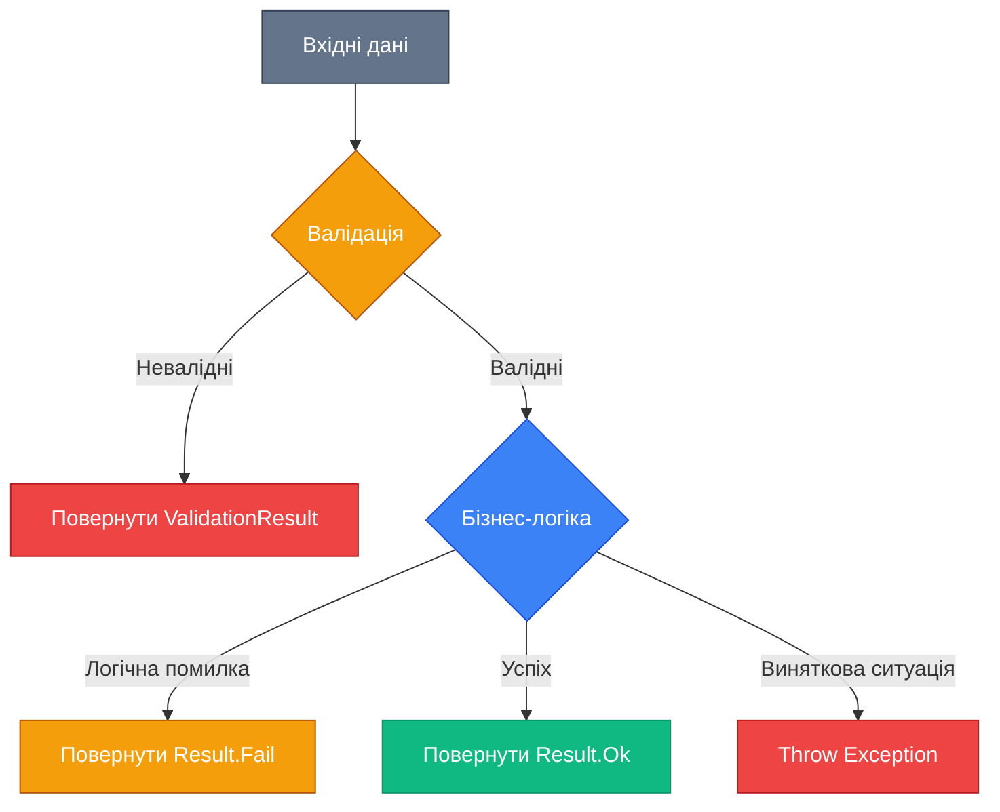
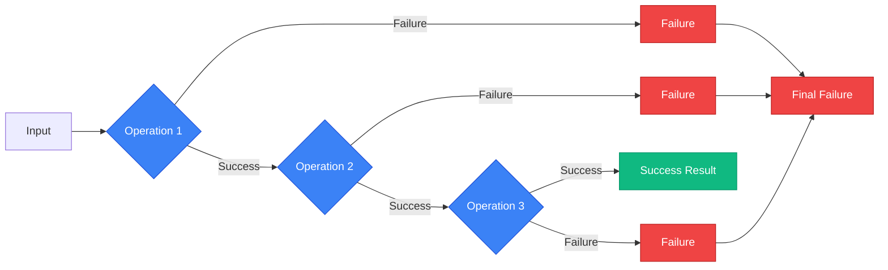

# Validation & Flow Control

## Вступ та Контекст

Уявіть, що ви будуєте систему онлайн-банкінгу. Користувач намагається перевести гроші:

```csharp
// ❌ Naive підхід - що може піти не так?
public void TransferMoney(string fromAccount, string toAccount, decimal amount)
{
    var from = _accounts[fromAccount];
    var to = _accounts[toAccount];

    from.Balance -= amount;
    to.Balance += amount;

    _repository.Save(from);
    _repository.Save(to);
}
```

**Проблеми цього коду:**

-   Що, якщо `fromAccount` не існує? → `KeyNotFoundException`
-   Що, якщо `amount` від'ємний? → Помилкова логіка
-   Що, якщо баланс недостатній? → Від'ємний баланс
-   Що, якщо `toAccount` порожній? → Некоректна операція
-   Що, якщо база даних недоступна? → Inconsistent state

Кожна з цих ситуацій призведе до винятку (Exception), краху програми або некоректного стану даних. **Але більшість з них не є "винятковими"** — це передбачувані бізнес-правила та валідації, які мають бути частиною нормального потоку програми.

::caution
**Проблема "Exception Driven Development"**: Використання винятків для контролю бізнес-логіки призводить до:

-   **Погіршення продуктивності**: Створення exception — дорога операція (~10,000 разів повільніше за звичайний `if`)
-   **Незрозумілості коду**: Неясно, які помилки можливі та як їх обробляти
-   **Складності тестування**: Винятки важко тестувати та симулювати
-   **Неявної логіки**: Бізнес-правила розкидані по `try-catch` блоках

::

**Правильний підхід** полягає в розділенні:

1.  **Валідація (Validation)**: Перевірка вхідних даних _перед_ виконанням операції
2.  **Контроль потоку (Flow Control)**: Обробка логічних помилок через результати (`Result<T>`), а не винятки
3.  **Винятки (Exceptions)**: _Тільки_ для справді виняткових ситуацій (мережа недоступна, диск переповнений)

::mermaid



::

### Еволюція підходів до валідації та обробки помилок

Розуміння того, як ми дійшли до сучасних підходів, допоможе оцінити їхню цінність:

::steps

#### Етап 1: Імперативні перевірки (1990-і)

Програмісти писали вручну всі перевірки через `if`:

```csharp
if (string.IsNullOrEmpty(email))
    throw new Exception("Email is required");
if (!email.Contains("@"))
    throw new Exception("Invalid email");
```

**Проблеми**: Дублювання коду, складність підтримки, неструктуровані помилки.

#### Етап 2: Data Annotations (2008, .NET 3.5 SP1)

Введення атрибутів для декларативної валідації:

```csharp
public class User
{
    [Required]
    [EmailAddress]
    public string Email { get; set; }
}
```

**Переваги**: Декларативність, менше коду. **Недоліки**: Обмежена гнучкість, складні правила важко виразити.

#### Етап 3: FluentValidation (2010-і)

Винесення валідації в окремі класи з fluent API:

```csharp
public class UserValidator : AbstractValidator<User>
{
    public UserValidator()
    {
        RuleFor(x => x.Email).NotEmpty().EmailAddress();
    }
}
```

**Переваги**: Розділення відповідальностей, потужна композиція правил, тестовність.

#### Етап 4: Result Pattern (2010-і, Function Programming influence)

Відмова від винятків для бізнес-логіки на користь явних результатів:

```csharp
public Result<User> CreateUser(string email)
{
    if (string.IsNullOrEmpty(email))
        return Result.Fail<User>("Email is required");

    // ...
    return Result.Ok(user);
}
```

**Переваги**: Явна обробка помилок, Railway Oriented Programming, краща продуктивність.

::

### Цілі цього розділу

Після вивчення цього матеріалу ви зможете:

-   ✅ Реалізувати Defensive Programming з Guard Clauses
-   ✅ Використовувати Data Annotations та `IValidatableObject`
-   ✅ Створювати складні валідації через FluentValidation
-   ✅ Розуміти вартість винятків та коли їх уникати
-   ✅ Застосовувати Result Pattern для обробки логічних помилок
-   ✅ Будувати Railway Oriented Programming pipelines
-   ✅ Використовувати бібліотеки FluentResults та ErrorOr

### Передумови

Перед вивченням цього матеріалу переконайтеся, що розумієте:

-   [Основи C# (змінні, типи, методи)](/csharp/fundamentals/variables-data-types)
-   [Класи та об'єкти](/csharp/oop/classes-objects)
-   [Винятки та їх обробка](/csharp/fundamentals/control-flow#exceptions)
-   [Generics](/csharp/advanced-core/generics)

---

## Частина 1: Теорія Валідації

### 1.1. Що таке валідація та чому вона критична?

**Валідація (Validation)** — це процес перевірки, чи відповідають дані встановленим правилам та обмеженням _перед_ їх використанням у бізнес-логіці.

> Валідація — це перша лінія оборони проти некоректних даних. Без неї система перетворюється на "GIGO" (Garbage In, Garbage Out).

#### Фундаментальні принципи валідації

::field-group

:::field{name="Fail Fast Principle"}
Перевіряйте дані якомога раніше. Не дозволяйте некоректним даним пройти далі в систему.

```csharp
public void ProcessPayment(Payment payment)
{
    // ✅ Валідація спочатку
    ArgumentNullException.ThrowIfNull(payment);
    if (payment.Amount <= 0)
        throw new ArgumentException("Amount must be positive", nameof(payment.Amount));

    // Тепер безпечно працювати з payment
    _gateway.Charge(payment);
}
```

:::

:::field{name="Separation of Concerns"}
Валідація має бути відокремлена від бізнес-логіки. Не змішуйте перевірки з операціями.

```csharp
// ❌ Змішано
public void CreateUser(string email)
{
    if (string.IsNullOrEmpty(email)) throw ...;
    if (!email.Contains("@")) throw ...;

    // бізнес-логіка
    _repository.Add(new User(email));
}

// ✅ Розділено
public Result CreateUser(string email)
{
    var validationResult = _validator.Validate(email);
    if (!validationResult.IsValid)
        return Result.Fail(validationResult.Errors);

    _repository.Add(new User(email));
    return Result.Ok();
}
```

:::

:::field{name="Clear Error Messages"}
Повідомлення про помилки мають бути зрозумілими користувачеві та надавати контекст для виправлення.

```csharp
// ❌ Незрозуміло
"Invalid input"

// ✅ Зрозуміло
"Email must be in format 'user@example.com'. Provided value: 'user@'"
```

:::

:::field{name="Comprehensive Validation"}
Валідуйте всі правила за один прохід, щоб користувач бачив усі помилки відразу, а не по одній.

```csharp
var errors = new List<string>();

if (string.IsNullOrEmpty(user.Email))
    errors.Add("Email is required");

if (user.Age < 18)
    errors.Add("User must be at least 18 years old");

if (errors.Any())
    return Result.Fail(errors);
```

:::

::

### 1.2. Категорії валідації

Валідацію можна класифікувати за різними критеріями. Розуміння цих категорій допоможе вибрати правильний підхід.

#### За місцем виконання

| Категорія          | Опис                                            | Приклад                           | Коли використовувати                    |
| :----------------- | :---------------------------------------------- | :-------------------------------- | :-------------------------------------- |
| **Client-side**    | Виконується в браузері або клієнтському додатку | JavaScript перевірки форм         | Покращення UX, швидкий фідбек           |
| **Server-side**    | Виконується на сервері перед обробкою даних     | ASP.NET Model Validation          | Обов'язкова, фінальна лінія оборони     |
| **Database-level** | Обмеження на рівні БД (CHECK, UNIQUE, FK)       | SQL: `CHECK (age >= 18)`          | Цілісність даних, multiple entry points |
| **Domain-level**   | Бізнес-правила всередині domain моделі          | `User.ChangeEmail()` з валідацією | DDD, складні інваріанти                 |

::warning
**Критично**: _Ніколи_ не покладайтеся лише на client-side валідацію! Вона легко обходиться та призначена виключно для UX. Сервер завжди повинен перевіряти дані повторно.
::

#### За типом перевірки

::card-group

:::card
**Синтаксична валідація (Syntactic)**
Перевірка формату даних без урахування бізнес-контексту.

```csharp
// Чи є рядок валідним email?
new EmailAddressAttribute().IsValid("user@example.com") // true

// Чи є рядок валідним JSON?
JsonDocument.Parse(jsonString) // не кидає exception
```

**Приклади**: Email format, Phone format, Date format, JSON/XML structure.
:::

:::card
**Семантична валідація (Semantic)**
Перевірка, чи має значення сенс у бізнес-контексті.

```csharp
// Email валідний синтаксично, але чи існує домен?
await DnsLookup("@example.com")

// Дата валідна, але чи не в минулому для події?
if (eventDate < DateTime.Now)
    return Error("Event date cannot be in the past");
```

**Приклади**: Email domain exists, Date range logic, Business rules.
:::

:::card
**Структурна валідація (Structural)**
Перевірка залежностей між полями та цілісності об'єкта.

```csharp
// Дата початку має бути раніше дати кінця
if (startDate >= endDate)
    return Error("Start date must be before end date");

// Якщо знижка активна, вона має бути > 0
if (discount.IsActive && discount.Percentage <= 0)
    return Error("Active discount must have a percentage > 0");
```

**Приклади**: Cross-field validation, Conditional rules, Aggregate consistency.
:::

:::card
**Контекстуальна валідація (Contextual)**
Перевірка відповідно до поточного стану системи або користувача.

```csharp
// Користувач може редагувати лише свої власні пости
if (post.AuthorId != currentUser.Id && !currentUser.IsAdmin)
    return Error("Unauthorized");

// Замовлення можна скасувати лише в статусі "Pending"
if (order.Status != OrderStatus.Pending)
    return Error("Only pending orders can be cancelled");
```

**Приклади**: Authorization checks, State-based rules, Tenant isolation.
:::

::

#### За складністю

1.  **Проста (Simple)**: Перевірка одного поля без залежностей
    -   `NotNull`, `NotEmpty`, `MaxLength(50)`
2.  **Складна (Complex)**: Перевірка з кількома умовами або залежностями
    -   `Must(BeUnique)`, `Must(BeBetween(startDate, endDate))`
3.  **Композитна (Composite)**: Комбінація кількох валідаторів
    -   `RuleFor(x => x.Email).NotEmpty().EmailAddress().Must(BeUniqueEmail)`
4.  **Асинхронна (Async)**: Потребує звернення до зовнішніх ресурсів
    -   `MustAsync(BeUniqueEmail)` → перевіряє БД
    -   `MustAsync(ExistInExternalApi)` → HTTP запит

### 1.3. Валідація vs. Інші концепції

Важливо не плутати валідацію з суміжними концепціями:

| Концепція          | Призначення                              | Приклад                                      |
| :----------------- | :--------------------------------------- | :------------------------------------------- |
| **Validation**     | Перевірка, чи відповідають дані правилам | `Email` має бути валідним форматом           |
| **Authorization**  | Перевірка прав доступу користувача       | Користувач має роль Admin для видалення      |
| **Sanitization**   | Очищення даних від небажаних символів    | Видалити HTML теги з введення                |
| **Normalization**  | Приведення даних до стандартного формату | `"JOHN DOE"` → `"John Doe"`                  |
| **Business Rules** | Бізнес-логіка, яка визначає поведінку    | Знижка 20% при покупці >5 товарів            |
| **Invariants**     | Умови, що завжди мають бути істинними    | Баланс рахунку ніколи не може бути від'ємним |

::note
**Приклад розділення**: При реєстрації користувача:

1.  **Sanitization**: Видаляємо зайві пробіли з email: `" user@example.com "` → `"user@example.com"`
2.  **Normalization**: Приводимо до нижнього регістру: `"User@Example.COM"` → `"user@example.com"`
3.  **Validation**: Перевіряємо формат та унікальність
4.  **Business Rule**: Додаємо welcome bonus, якщо реєстрація через реферальне посилання
5.  **Invariant**: Email завжди має бути заповнений (перевірка в конструкторі моделі)

::

---

## Частина 2: Defensive Programming

**Defensive Programming** — це підхід до написання коду, який _передбачає_ помилки та намагається їх попередити або мінімізувати їх вплив через явні перевірки та захисні механізми.

> Пишіть код так, ніби він буде використаний найгіршим розробником у світі. Цим розробником можете виявитися ви самі через шість місяців.

### 2.1. Guard Clauses (Охоронні умови)

**Guard Clause** — це перевірка на початку методу, яка _негайно_ повертає результат або кидає виняток, якщо умови виконання не дотримані.

#### Класичний приклад: Manual Guards

```csharp
public void ProcessOrder(Order order, User user)
{
    // ❌ Без guard clauses - nested hell
    if (order != null)
    {
        if (user != null)
        {
            if (order.Items.Count > 0)
            {
                if (user.IsActive)
                {
                    // Фактична логіка десь тут...
                }
                else
                    throw new InvalidOperationException("User is not active");
            }
            else
                throw new ArgumentException("Order has no items");
        }
        else
            throw new ArgumentNullException(nameof(user));
    }
    else
        throw new ArgumentNullException(nameof(order));
}
```

```csharp
// ✅ З guard clauses - linear and clear
public void ProcessOrder(Order order, User user)
{
    // Guards спочатку - виходимо рано при проблемах
    ArgumentNullException.ThrowIfNull(order);
    ArgumentNullException.ThrowIfNull(user);

    if (order.Items.Count == 0)
        throw new ArgumentException("Order must contain at least one item", nameof(order));

    if (!user.IsActive)
        throw new InvalidOperationException("Cannot process order for inactive user");

    // Happy path - без вкладеності
    var total = order.CalculateTotal();
    _paymentService.Charge(user, total);
    _emailService.SendConfirmation(user.Email, order);
}
```

**Переваги Guard Clauses:**

-   📉 **Зменшення когнітивного навантаження**: Лінійний код легше читати
-   🎯 **Явні передумови**: Одразу видно, що потрібно для виконання методу
-   🐛 **Швидке виявлення помилок**: Fail-fast principle
-   🧪 **Легше тестувати**: Кожна умова — окремий тестовий кейс

#### .NET Built-in Guards

Починаючи з .NET 6, є вбудовані helper методи для guard clauses:

```csharp
public class ArgumentNullExceptionExamples
{
    // ✅ Modern way (.NET 6+)
    public void ModernGuards(string name, int age, List<string> items)
    {
        ArgumentNullException.ThrowIfNull(name);
        ArgumentNullException.ThrowIfNull(items);
        ArgumentOutOfRangeException.ThrowIfNegativeOrZero(age);
        ArgumentOutOfRangeException.ThrowIfZero(items.Count);
    }

    // ❌ Old way (before .NET 6)
    public void OldGuards(string name, int age, List<string> items)
    {
        if (name == null)
            throw new ArgumentNullException(nameof(name));
        if (items == null)
            throw new ArgumentNullException(nameof(items));
        if (age <= 0)
            throw new ArgumentOutOfRangeException(nameof(age), "Age must be positive");
        if (items.Count == 0)
            throw new ArgumentOutOfRangeException(nameof(items), "Items cannot be empty");
    }
}
```

::tip
**Best Practice**: Використовуйте вбудовані guard methods, де це можливо — вони генерують стандартизовані повідомлення про помилки та покращують читабельність.
::

#### Вичерпний список Built-in Guards (.NET 8)

::collapsible{title="Повний список ArgumentException guards" default-open="false"}

```csharp showLineNumbers
// Null checks
ArgumentNullException.ThrowIfNull(obj);
ArgumentNullException.ThrowIfNull(obj, nameof(obj));

// Numeric range checks
ArgumentOutOfRangeException.ThrowIfZero(number);
ArgumentOutOfRangeException.ThrowIfNegative(number);
ArgumentOutOfRangeException.ThrowIfNegativeOrZero(number);
ArgumentOutOfRangeException.ThrowIfGreaterThan(actual, threshold);
ArgumentOutOfRangeException.ThrowIfGreaterThanOrEqual(actual, threshold);
ArgumentOutOfRangeException.ThrowIfLessThan(actual, threshold);
ArgumentOutOfRangeException.ThrowIfLessThanOrEqual(actual, threshold);
ArgumentOutOfRangeException.ThrowIfEqual(actual, unexpected);
ArgumentOutOfRangeException.ThrowIfNotEqual(actual, expected);

// String checks
ArgumentException.ThrowIfNullOrEmpty(str);
ArgumentException.ThrowIfNullOrWhiteSpace(str); // .NET 8+
```

**Примітка**: Це методи з неймспейсу `System`, доступні глобально.

::

#### Custom Guard Clauses

Для специфічних перевірок можна створити власні guard методи:

```csharp showLineNumbers
public static class Guard
{
    public static void AgainstNullOrEmpty(string value, string paramName)
    {
        ArgumentException.ThrowIfNullOrWhiteSpace(value, paramName);
    }

    public static void AgainstNegative(decimal value, string paramName)
    {
        if (value < 0)
            throw new ArgumentOutOfRangeException(paramName, $"{paramName} cannot be negative");
    }

    public static void AgainstInvalidEmail(string email, string paramName)
    {
        if (!new EmailAddressAttribute().IsValid(email))
            throw new ArgumentException($"Invalid email format: {email}", paramName);
    }

    public static void AgainstPastDate(DateTime date, string paramName)
    {
        if (date < DateTime.Now)
            throw new ArgumentException($"{paramName} cannot be in the past", paramName);
    }

    public static void AgainstOutOfRange<T>(T value, T min, T max, string paramName)
        where T : IComparable<T>
    {
        if (value.CompareTo(min) < 0 || value.CompareTo(max) > 0)
            throw new ArgumentOutOfRangeException(paramName,
                $"{paramName} must be between {min} and {max}");
    }
}

// Використання
public void ScheduleEvent(string title, DateTime eventDate, decimal ticketPrice)
{
    Guard.AgainstNullOrEmpty(title, nameof(title));
    Guard.AgainstPastDate(eventDate, nameof(eventDate));
    Guard.AgainstNegative(ticketPrice, nameof(ticketPrice));

    // Business logic
}
```

**Пояснення коду вище:**

-   **Рядок 1-3**: `AgainstNullOrEmpty` використовує вбудований `ThrowIfNullOrWhiteSpace` для перевірки порожніх рядків
-   **Рядок 5-9**: `AgainstNegative` перевіряє, чи не від'ємне значення
-   **Рядок 11-15**: `AgainstInvalidEmail` використовує `EmailAddressAttribute` для валідації формату email
-   **Рядок 17-21**: `AgainstPastDate` перевіряє, чи дата не в минулому
-   **Рядок 23-29**: `AgainstOutOfRange` — generic метод для перевірки діапазону значень будь-якого типу, що реалізує `IComparable<T>`

::note
**Коли використовувати Custom Guards**: Створюйте власні guard методи, коли:

-   Перевірка повторюється в багатьох місцях коду
-   Потрібна складна логіка перевірки
-   Хочете стандартизувати повідомлення про помилки в проєкті

::

### 2.2. Null Safety Strategies

Обробка `null` — одна з найпоширеніших причин помилок у C#. Існує кілька стратегій захисту:

#### Nullable Reference Types (C# 8.0+)

```csharp
#nullable enable

public class UserService
{
    // Compiler попереджає, якщо можливий null
    public void SendEmail(User user)  // user is non-nullable
    {
        Console.WriteLine(user.Email);  // Safe
    }

    public void SendEmailNullable(User? user)  // user is nullable
    {
        // ❌ Compiler warning: Possible null reference
        // Console.WriteLine(user.Email);

        // ✅ Explicit null check
        if (user is not null)
        {
            Console.WriteLine(user.Email);
        }
    }
}
```

::tip
**Включення Nullable Reference Types**: Додайте в `.csproj`:

```xml
<PropertyGroup>
    <Nullable>enable</Nullable>
</PropertyGroup>
```

Це дозволить компілятору допомагати виявляти потенційні `NullReferenceException` на етапі розробки.
::

#### Null Coalescing та Null-Conditional операторів

```csharp showLineNumbers
public class NullSafetyExamples
{
    public string GetUserName(User? user)
    {
        // Null coalescing operator (??)
        return user?.Name ?? "Anonymous";  // Якщо null, повертає "Anonymous"
    }

    public int GetOrderCount(User? user)
    {
        // Null-conditional operator (?.) + null coalescing
        return user?.Orders?.Count ?? 0;  // Безпечний ланцюг
    }

    public void ProcessUser(User? user)
    {
        // Null coalescing assignment (??=) - .NET 8+
        user ??= new User { Name = "Default" };  // Присвоює, якщо null

        // Тепер user гарантовано не null
        Console.WriteLine(user.Name);
    }
}
```

**Пояснення:**

-   **Рядок 6**: `user?.Name` повертає `null`, якщо `user` є `null`, інакше повертає `Name`
-   **Рядок 12**: Ланцюг `?.` дозволяє безпечно працювати з вкладеними nullable об'єктами
-   **Рядок 17**: `??=` присвоює значення _тільки_ якщо змінна дорівнює `null`

---

## Частина 3: Classic Validation

### 3.1. Data Annotations

**Data Annotations** — це декларативний спосіб валідації через атрибути, які застосовуються до властивостей моделі.

#### Основні вбудовані атрибути

```csharp showLineNumbers
using System.ComponentModel.DataAnnotations;

public class RegisterUserDto
{
    [Required(ErrorMessage = "Email is required")]
    [EmailAddress(ErrorMessage = "Invalid email format")]
    [MaxLength(100, ErrorMessage = "Email cannot exceed 100 characters")]
    public string Email { get; set; }

    [Required]
    [StringLength(50, MinimumLength = 3, ErrorMessage = "Name must be between 3 and 50 characters")]
    public string Name { get; set; }

    [Range(18, 120, ErrorMessage = "Age must be between 18 and 120")]
    public int Age { get; set; }

    [Phone]
    public string? PhoneNumber { get; set; }

    [Url]
    public string? Website { get; set; }

    [RegularExpression(@"^[A-Z]{2}\d{4}$", ErrorMessage = "Invalid format. Expected: XX1234")]
    public string EmployeeCode { get; set; }

    [CreditCard]
    public string? CardNumber { get; set; }

    [Compare(nameof(Password), ErrorMessage = "Passwords do not match")]
    public string ConfirmPassword { get; set; }

    [Required]
    [MinLength(8, ErrorMessage = "Password must be at least 8 characters")]
    public string Password { get; set; }
}
```

**Пояснення атрибутів:**

-   **Рядок 5-7**: `Email` має три валідації: обов'язкове поле, правильний формат email, максимальна довжина
-   **Рядок 11**: `StringLength` перевіряє і мінімальну, і максимальну довжину
-   **Рядок 14**: `Range` для числових діапазонів
-   **Рядок 23**: `RegularExpression` для custom форматів (тут: 2 великі літери + 4 цифри)
-   **Рядок 29**: `Compare` для порівняння двох полів (пароль та підтвердження)

#### Виконання валідації

```csharp showLineNumbers
public class ValidationService
{
    public (bool IsValid, List<string> Errors) ValidateObject(object obj)
    {
        var context = new ValidationContext(obj);
        var results = new List<ValidationResult>();

        bool isValid = Validator.TryValidateObject(obj, context, results, validateAllProperties: true);

        var errors = results.Select(r => r.ErrorMessage ?? "Unknown error").ToList();

        return (isValid, errors);
    }
}

// Використання
var dto = new RegisterUserDto
{
    Email = "invalid-email",  // ❌ Invalid format
    Name = "Jo",              // ❌ Too short
    Age = 15                  // ❌ Below minimum
};

var (isValid, errors) = new ValidationService().ValidateObject(dto);

if (!isValid)
{
    foreach (var error in errors)
        Console.WriteLine($"- {error}");

    // Output:
    // - Invalid email format
    // - Name must be between 3 and 50 characters
    // - Age must be between 18 and 120
}
```

**Пояснення:**

-   **Рядок 5**: `ValidationContext` зберігає інформацію про об'єкт, що валідується
-   **Рядок 8**: `Validator.TryValidateObject` виконує всі валідації атрибутів. `validateAllProperties: true` важливий для перевірки _всіх_ властивостей, не лише тих, що анотовані `Required`
-   **Рядок 10**: Витягуємо текстові повідомлення про помилки

### 3.2. IValidatableObject Interface

Коли Data Annotations недостатньо для складної логіки, можна реалізувати інтерфейс `IValidatableObject` для custom валідацій.

```csharp showLineNumbers
public class EventBookingDto : IValidatableObject
{
    [Required]
    public DateTime StartDate { get; set; }

    [Required]
    public DateTime EndDate { get; set; }

    [Range(1, 1000)]
    public int Attendees { get; set; }

    [Required]
    public string EventType { get; set; }  // "Conference", "Workshop", etc.

    // Custom validation logic
    public IEnumerable<ValidationResult> Validate(ValidationContext validationContext)
    {
        // Cross-field validation: EndDate must be after StartDate
        if (EndDate <= StartDate)
        {
            yield return new ValidationResult(
                "End date must be after start date",
                new[] { nameof(EndDate) }  // Specify which property has error
            );
        }

        // Conditional validation: Conferences require at least 10 attendees
        if (EventType == "Conference" && Attendees < 10)
        {
            yield return new ValidationResult(
                "Conferences must have at least 10 attendees",
                new[] { nameof(Attendees) }
            );
        }

        // Time-based validation: Cannot book events less than 24 hours in advance
        if (StartDate < DateTime.Now.AddHours(24))
        {
            yield return new ValidationResult(
                "Events must be booked at least 24 hours in advance",
                new[] { nameof(StartDate) }
            );
        }
    }
}
```

**Переваги IValidatableObject:**

-   ✅ **Cross-field validation**: Можна порівнювати кілька полів між собою
-   ✅ **Conditional logic**: Різні правила залежно від значень інших полів
-   ✅ **Complex business rules**: Будь-яка логіка на C#

**Недоліки:**

-   ❌ Змішує валідацію з моделлю даних (порушення SRP)
-   ❌ Важко тестувати окремо
-   ❌ Не можна легко переносити валідації між моделями

::note
**Коли використовувати IValidatableObject**: Для простих cross-field перевірок у DTO, коли FluentValidation — overkill. Для складних сценаріїв — краще FluentValidation.
::

### 3.3. FluentValidation — професійний підхід

**FluentValidation** — це бібліотека, яка дозволяє створювати _strongly-typed_ валідаційні правила через fluent API, повністю відокремлюючи валідацію від моделей.

#### Установка

```bash
dotnet add package FluentValidation
dotnet add package FluentValidation.DependencyInjectionExtensions
```

#### Базовий приклад

```csharp showLineNumbers
using FluentValidation;

public class CreateUserDto
{
    public string Email { get; set; }
    public string Name { get; set; }
    public int Age { get; set; }
    public string Password { get; set; }
}

public class CreateUserValidator : AbstractValidator<CreateUserDto>
{
    public CreateUserValidator()
    {
        RuleFor(x => x.Email)
            .NotEmpty().WithMessage("Email is required")
            .EmailAddress().WithMessage("Invalid email format")
            .MaximumLength(100).WithMessage("Email is too long");

        RuleFor(x => x.Name)
            .NotEmpty()
            .Length(3, 50).WithMessage("Name must be between 3 and 50 characters")
            .Matches(@"^[a-zA-Z\s]+$").WithMessage("Name can only contain letters and spaces");

        RuleFor(x => x.Age)
            .InclusiveBetween(18, 120).WithMessage("Age must be between 18 and 120");

        RuleFor(x => x.Password)
            .NotEmpty()
            .MinimumLength(8).WithMessage("Password must be at least 8 characters")
            .Matches(@"[A-Z]").WithMessage("Password must contain at least one uppercase letter")
            .Matches(@"[a-z]").WithMessage("Password must contain at least one lowercase letter")
            .Matches(@"[0-9]").WithMessage("Password must contain at least one digit")
            .Matches(@"[@$!%*?&#]").WithMessage("Password must contain at least one special character");
    }
}
```

**Пояснення:**

-   **Рядок 11**: Валідатор наслідується від `AbstractValidator<T>` і типізований моделлю
-   **Рядок 15-18**: Ланцюжок правил для `Email` з custom повідомленнями через `.WithMessage()`
-   **Рядок 23**: `Matches` приймає regex для складних форматних перевірок
-   **Рядок 31-34**: Множинні `Matches` для різних вимог до пароля — кожен матиме власне повідомлення про помилку

#### Виконання валідації

```csharp showLineNumbers
var dto = new CreateUserDto
{
    Email = "invalid",
    Name = "Jo",
    Age = 15,
    Password = "weak"
};

var validator = new CreateUserValidator();
var result = validator.Validate(dto);

if (!result.IsValid)
{
    foreach (var error in result.Errors)
    {
        Console.WriteLine($"[{error.PropertyName}] {error.ErrorMessage}");
    }

    // Output:
    // [Email] Invalid email format
    // [Name] Name must be between 3 and 50 characters
    // [Age] Age must be between 18 and 120
    // [Password] Password must be at least 8 characters
    // [Password] Password must contain at least one uppercase letter
    // [Password] Password must contain at least one lowercase letter
    // [Password] Password must contain at least one digit
    // [Password] Password must contain at least one special character
}
```

**Зверніть увагу:**

-   **Рядок 10**: Валідація виконується через метод `Validate()`, повертає `ValidationResult`
-   **Рядок 16**: Кожна помилка містить `PropertyName` та `ErrorMessage`, що дозволяє легко мапити помилки до полів у UI

#### Складні сценарії FluentValidation

::tabs

:::tab{label="Custom Validators"}

Створення власного валідатора для складної логіки:

```csharp showLineNumbers
public class CreateUserValidator : AbstractValidator<CreateUserDto>
{
    private readonly IUserRepository _userRepository;

    public CreateUserValidator(IUserRepository userRepository)
    {
        _userRepository = userRepository;

        RuleFor(x => x.Email)
            .NotEmpty()
            .EmailAddress()
            .MustAsync(BeUniqueEmail).WithMessage("Email is already registered");
    }

    // Async custom validator
    private async Task<bool> BeUniqueEmail(string email, CancellationToken cancellationToken)
    {
        return !await _userRepository.ExistsAsync(email, cancellationToken);
    }
}
```

**Пояснення:**

-   **Рядок 12**: `MustAsync` дозволяє асинхронні перевірки, які потребують I/O (БД, API)
-   **Рядок 16-19**: Кастомний метод валідації повертає `true`, якщо валідація _пройшла_ (email унікальний)

:::

:::tab{label="Conditional Validation"}

Застосування правил лише за певних умов:

```csharp showLineNumbers
public class OrderValidator : AbstractValidator<Order>
{
    public OrderValidator()
    {
        // Валідувати ShippingAddress тільки якщо RequiresShipping = true
        When(x => x.RequiresShipping, () =>
        {
            RuleFor(x => x.ShippingAddress).NotEmpty();
            RuleFor(x => x.ShippingAddress.City).NotEmpty();
            RuleFor(x => x.ShippingAddress.PostalCode).Matches(@"^\d{5}$");
        });

        // Валідувати DiscountCode тільки якщо він заповнений
        Unless(x => string.IsNullOrEmpty(x.DiscountCode), () =>
        {
            RuleFor(x => x.DiscountCode)
                .Length(6, 12)
                .Matches(@"^[A-Z0-9]+$");
        });
    }
}
```

**Пояснення:**

-   **Рядок 6-11**: `When` виконує вкладені правила лише якщо умова істинна
-   **Рядок 14-19**: `Unless` — протилежність `When`, виконується коли умова хибна

:::

:::tab{label="RuleSet"}

Групування правил для різних сценаріїв:

```csharp showLineNumbers
public class UserValidator : AbstractValidator<User>
{
    public UserValidator()
    {
        // Default rules - завжди виконуються
        RuleFor(x => x.Id).NotEmpty();

        // RuleSet для створення користувача
        RuleSet("Create", () =>
        {
            RuleFor(x => x.Email).NotEmpty().EmailAddress();
            RuleFor(x => x.Password).NotEmpty().MinimumLength(8);
        });

        // RuleSet для оновлення
        RuleSet("Update", () =>
        {
            // При оновленні пароль опціональний
            RuleFor(x => x.Password)
                .MinimumLength(8)
                .When(x => !string.IsNullOrEmpty(x.Password));
        });
    }
}

// Використання
var validator = new UserValidator();

// Валідація для створення
var createResult = validator.Validate(user, options =>
{
    options.IncludeRuleSets("Create");
});

// Валідація для оновлення
var updateResult = validator.Validate(user, options =>
{
    options.IncludeRuleSets("Update");
});
```

**Коли використовувати RuleSets**: Коли одна модель використовується в різних сценаріях з різними вимогами валідації.

:::

:::tab{label="Child Validators"}

Валідація вкладених об'єктів:

```csharp showLineNumbers
public class Address
{
    public string Street { get; set; }
    public string City { get; set; }
    public string PostalCode { get; set; }
}

public class AddressValidator : AbstractValidator<Address>
{
    public AddressValidator()
    {
        RuleFor(x => x.Street).NotEmpty();
        RuleFor(x => x.City).NotEmpty();
        RuleFor(x => x.PostalCode).Matches(@"^\d{5}$");
    }
}

public class User
{
    public string Name { get; set; }
    public Address HomeAddress { get; set; }
    public List<Address> PreviousAddresses { get; set; }
}

public class UserValidator : AbstractValidator<User>
{
    public UserValidator()
    {
        RuleFor(x => x.Name).NotEmpty();

        // Валідація одного вкладеного об'єкта
        RuleFor(x => x.HomeAddress)
            .SetValidator(new AddressValidator());

        // Валідація колекції
        RuleForEach(x => x.PreviousAddresses)
            .SetValidator(new AddressValidator());
    }
}
```

**Пояснення:**

-   **Рядок 32-33**: `SetValidator` застосовує існуючий валідатор до вкладеного об'єкта
-   **Рядок 36-37**: `RuleForEach` застосовує валідатор до кожного елемента колекції

:::

::

#### Інтеграція з ASP.NET Core

```csharp showLineNumbers
// Program.cs або Startup.cs
using FluentValidation;
using FluentValidation.AspNetCore;

var builder = WebApplication.CreateBuilder(args);

// Додавання FluentValidation до DI
builder.Services.AddControllers()
    .AddFluentValidation(config =>
    {
        // Автоматична реєстрація всіх валідаторів з assembly
        config.RegisterValidatorsFromAssemblyContaining<Program>();

        // Автоматична валідація при Model Binding
        config.AutomaticValidationEnabled = true;
    });

// Controller usage
[ApiController]
[Route("api/users")]
public class UsersController : ControllerBase
{
    [HttpPost]
    public IActionResult CreateUser([FromBody] CreateUserDto dto)
    {
        // Якщо валідація провалена, ASP.NET автоматично повертає 400 Bad Request
        if (!ModelState.IsValid)
            return BadRequest(ModelState);

        // Business logic
        return Ok();
    }
}
```

**Пояснення:**

-   **Рядок 12**: `RegisterValidatorsFromAssemblyContaining<T>()` автоматично знаходить та реєструє всі класи, що наслідуються від `AbstractValidator<T>`
-   **Рядок 27**: ASP.NET Core автоматично виконує валідацію під час model binding і наповнює `ModelState`

::tip
**Порівняння підходів валідації**:

| Підхід                 | Переваги                                | Недоліки                   | Коли використовувати               |
| :--------------------- | :-------------------------------------- | :------------------------- | :--------------------------------- |
| **Data Annotations**   | Простота, вбудовано в .NET              | Обмежена гнучкість         | Прості DTO з базовими правилами    |
| **IValidatableObject** | Cross-field validation, легкий старт    | Змішує валідацію з моделлю | Прості cross-field перевірки в DTO |
| **FluentValidation**   | Максимальна гнучкість, SRP, тестовність | Додаткова бібліотека       | Складна валідація, великі проєкти  |
| **Guard Clauses**      | Fail-fast, захист методів               | Не для UI-driven валідації | Defensive programming в методах    |

::

---

## Частина 4: Обробка логічних помилок без винятків

### 4.1. Проблема Exception-Driven Development

Багато розробників використовують винятки для контролю _звичайного_ потоку програми, що призводить до "Exception-Driven Development" (EDD). Це anti-pattern.

#### Приклад EDD

```csharp showLineNumbers
// ❌ Exception-Driven Development
public User GetUserByEmail(string email)
{
    var user = _repository.FindByEmail(email);

    if (user == null)
        throw new UserNotFoundException($"User with email {email} not found");

    if (!user.IsActive)
        throw new UserInactiveException("User account is deactivated");

    if (user.IsLocked)
        throw new UserLockedException("User account is locked");

    return user;
}

// Calling code
try
{
    var user = GetUserByEmail("test@example.com");
    ProcessUser(user);
}
catch (UserNotFoundException ex)
{
    return NotFound(ex.Message);
}
catch (UserInactiveException ex)
{
    return BadRequest(ex.Message);
}
catch (UserLockedException ex)
{
    return Forbidden(ex.Message);
}
```

**Проблеми цього підходу:**

1.  **Перформанс**: Створення exception включає генерацію stack trace, що дорого
2.  **Семантика**: Винятки призначені для _виняткових_ ситуацій, а не для бізнес-логіки
3.  **Контроль потоку**: Незрозуміло, які винятки може кинути метод (немає compile-time перевірки)
4.  **Читабельність**: Бізнес-логіка розкидана по `catch` блоках

#### Вартість винятків: бенчмарк

```csharp showLineNumbers
using BenchmarkDotNet.Attributes;
using BenchmarkDotNet.Running;

public class ExceptionVsResultBenchmark
{
    [Benchmark]
    public int ExceptionFlow()
    {
        try
        {
            return DivideWithException(10, 0);
        }
        catch
        {
            return -1;
        }
    }

    [Benchmark]
    public int ResultFlow()
    {
        var result = DivideWithResult(10, 0);
        return result.IsSuccess ? result.Value : -1;
    }

    private int DivideWithException(int a, int b)
    {
        if (b == 0) throw new DivideByZeroException();
        return a / b;
    }

    private Result<int> DivideWithResult(int a, int b)
    {
        if (b == 0) return Result.Fail<int>("Cannot divide by zero");
        return Result.Ok(a / b);
    }
}

// Запуск: dotnet run -c Release
BenchmarkRunner.Run<ExceptionVsResultBenchmark>();
```

**Типові результати бенчмарку:**

| Method        | Mean     | Error  | Ratio |
| :------------ | :------- | :----- | :---- |
| ResultFlow    | 5.2 ns   | 0.1 ns | 1.00x |
| ExceptionFlow | 8,450 ns | 120 ns | 1625x |

::caution
**Висновок**: Exception-driven flow **~1600 разів повільніший** за Result-based flow! Це критично в high-performance сценаріях (loops, API endpoints з тисячами RPS).
::

### 4.2. Коли використовувати Exceptions?

**Exceptions** призначені для _виняткових_, непередбачуваних ситуацій, які порушують нормальний потік програми.

::field-group

:::field{name="✅ Використовуйте Exceptions для"}

-   **Системних помилок**: OutOfMemoryException, StackOverflowException
-   **Інфраструктурних проблем**: Мережа недоступна, диск переповнений, БД не відповідає
-   **Програмних помилок**: NullReferenceException (bug в коді), ArgumentException (неправильний виклик API)
-   **Непередбачуваних ситуацій**: Конфігурація відсутня, файл не знайдений там, де повинен бути

```csharp
// ✅ Good use of exceptions
public void SaveToFile(string path, string content)
{
    // System/Infra exception - cannot be predicted at compile time
    File.WriteAllText(path, content);  // Може кинути IOException
}

public void ConfigureService()
{
    var config = Configuration.GetSection("Database");

    // Programming error - developer mistake
    if (config == null)
        throw new InvalidOperationException("Database configuration is missing");
}
```

:::

:::field{name="❌ НЕ використовуйте Exceptions для"}

-   **Бізнес-логіки**: Користувач не знайдений, недостатньо коштів, email вже зареєстрований
-   **Валідації**: Некоректний формат, порожнє поле, значення поза діапазоном
-   **Контролю потоку**: "Використовую exception замість `if`"
-   **Expected failures**: Будь-які ситуації, що є частиною нормального флоу

```csharp
// ❌ Bad use of exceptions
public User GetUser(int id)
{
    var user = _repository.Find(id);

    // This is business logic, not an exceptional situation!
    if (user == null)
        throw new UserNotFoundException();  // ❌

    return user;
}

// ✅ Correct approach
public Result<User> GetUser(int id)
{
    var user = _repository.Find(id);

    // Business logic failure - return Result
    if (user == null)
        return Result.Fail<User>("User not found");  // ✅

    return Result.Ok(user);
}
```

:::

::

### 4.3. Result Pattern — Foundation

**Result Pattern** — це підхід, коли метод явно повертає об'єкт, що представляє або успіх з результатом, або помилку, замість кидання винятку.

#### Базова імплементація Result

```csharp showLineNumbers
public class Result
{
    public bool IsSuccess { get; }
    public bool IsFailure => !IsSuccess;
    public string Error { get; }

    protected Result(bool isSuccess, string error)
    {
        if (isSuccess && !string.IsNullOrEmpty(error))
            throw new InvalidOperationException("Success result cannot have an error");

        if (!isSuccess && string.IsNullOrEmpty(error))
            throw new InvalidOperationException("Failure result must have an error");

        IsSuccess = isSuccess;
        Error = error ?? string.Empty;
    }

    // Factory methods
    public static Result Ok() => new Result(true, null);
    public static Result Fail(string error) => new Result(false, error);
}

// Generic version for results with value
public class Result<T> : Result
{
    public T Value { get; }

    protected Result(T value, bool isSuccess, string error)
        : base(isSuccess, error)
    {
        Value = value;
    }

    // Factory methods
    public static Result<T> Ok(T value) => new Result<T>(value, true, null);
    public static Result<T> Fail(string error) => new Result<T>(default, false, error);
}
```

**Пояснення:**

-   **Рядок 9-13**: Інваріанти: Success не може мати помилку, Failure _повинна_ мати помилку
-   **Рядок 20-21**: Factory methods для створення результатів (замість `new`)
-   **Рядок 25**: Generic версія дозволяє повертати результат з значенням `T`

#### Використання Result

```csharp showLineNumbers
public class UserService
{
    public Result<User> GetUserByEmail(string email)
    {
        // Validation
        if (string.IsNullOrWhiteSpace(email))
            return Result<User>.Fail("Email is required");

        var user = _repository.FindByEmail(email);

        // Business logic check
        if (user == null)
            return Result<User>.Fail("User not found");

        if (!user.IsActive)
            return Result<User>.Fail("User account is deactivated");

        if (user.IsLocked)
            return Result<User>.Fail("User account is locked");

        return Result<User>.Ok(user);
    }
}

// Calling code - явна обробка результату
var result = _userService.GetUserByEmail("test@example.com");

if (result.IsFailure)
{
    _logger.LogWarning("Failed to get user: {Error}", result.Error);
    return BadRequest(result.Error);
}

var user = result.Value;
ProcessUser(user);
```

**Переваги Result Pattern:**

-   ✅ **Явність**: Метод _явно_ повідомляє, що може провалитися (сигнатура типу)
-   ✅ **Перформанс**: Немає overhead на створення stack trace
-   ✅ **Композиція**: Легко комбінувати результати (Railway Oriented Programming)
-   ✅ **Тестовність**: Легко тестувати успішні та неуспішні сценарії

### 4.4. Railway Oriented Programming (ROP)

**Railway Oriented Programming** — це метафора для роботи з Result Pattern, де код виконується як потяг по рейках:

-   **Success track** (зелена колія): Все йде добре, операції виконуються послідовно
-   **Failure track** (червона колія): Помилка — потяг переходить на failure track і пропускає всі наступні операції

::mermaid



::

#### Базові ROP Extension Methods

Розширимо наш `Result` методами для композиції:

```csharp showLineNumbers
public class Result<T>
{
    // ... попередній код ...

    // Map: Transform value if success
    public Result<TNew> Map<TNew>(Func<T, TNew> mapper)
    {
        if (IsFailure)
            return Result<TNew>.Fail(Error);

        return Result<TNew>.Ok(mapper(Value));
    }

    // Bind (FlatMap): Chain operations that return Result
    public Result<TNew> Bind<TNew>(Func<T, Result<TNew>> binder)
    {
        if (IsFailure)
            return Result<TNew>.Fail(Error);

        return binder(Value);
    }

    // OnSuccess: Execute action if success
    public Result<T> OnSuccess(Action<T> action)
    {
        if (IsSuccess)
            action(Value);

        return this;
    }

    // OnFailure: Execute action if failure
    public Result<T> OnFailure(Action<string> action)
    {
        if (IsFailure)
            action(Error);

        return this;
    }

    // Match: Handle both cases
    public TResult Match<TResult>(
        Func<T, TResult> onSuccess,
        Func<string, TResult> onFailure)
    {
        return IsSuccess ? onSuccess(Value) : onFailure(Error);
    }
}
```

**Пояснення методів:**

-   **Рядок 6-12**: `Map` перетворює значення всередині Result, зберігаючи контекст успіху/помилки
-   **Рядок 15-21**: `Bind` (також називається `FlatMap`) використовується для ланцюжка операцій, що повертають Result
-   **Рядок 24-30**: `OnSuccess` виконує side-effect (наприклад, логування) при успіху
-   **Рядок 33-39**: `OnFailure` виконує side-effect при помилці
-   **Рядок 42-47**: `Match` — pattern matching для обробки обох сценаріїв

#### ROP в дії: приклад трансферу грошей

```csharp showLineNumbers
public class BankingService
{
    public Result TransferMoney(string fromAccountId, string toAccountId, decimal amount)
    {
        return GetAccount(fromAccountId)
            .Bind(fromAccount => GetAccount(toAccountId)
                .Map(toAccount => (From: fromAccount, To: toAccount)))
            .Bind(accounts => ValidateTransfer(accounts.From, amount))
            .Bind(fromAccount => DebitAccount(fromAccount, amount))
            .Bind(fromAccount => CreditAccount(toAccountId, amount)
                .Map(_ => fromAccount))
            .OnSuccess(fromAccount =>
                _logger.LogInformation("Transfer completed from {From}", fromAccount.Id))
            .OnFailure(error =>
                _logger.LogWarning("Transfer failed: {Error}", error));
    }

    private Result<Account> GetAccount(string accountId)
    {
        var account = _repository.Find(accountId);
        return account != null
            ? Result<Account>.Ok(account)
            : Result<Account>.Fail($"Account {accountId} not found");
    }

    private Result<Account> ValidateTransfer(Account account, decimal amount)
    {
        if (amount <= 0)
            return Result<Account>.Fail("Amount must be positive");

        if (account.Balance < amount)
            return Result<Account>.Fail("Insufficient funds");

        return Result<Account>.Ok(account);
    }

    private Result<Account> DebitAccount(Account account, decimal amount)
    {
        account.Balance -= amount;
        _repository.Update(account);
        return Result<Account>.Ok(account);
    }

    private Result CreditAccount(string accountId, decimal amount)
    {
        return GetAccount(accountId)
            .Bind(account =>
            {
                account.Balance += amount;
                _repository.Update(account);
                return Result.Ok();
            });
    }
}
```

**Як це працює:**

1.  **Рядок 5**: Отримуємо перший рахунок (`GetAccount` повертає `Result<Account>`)
2.  **Рядок 6**: Якщо успіх — отримуємо другий рахунок та комбінуємо їх у tuple
3.  **Рядок 8**: Валідуємо трансфер (достатньо грошей?)
4.  **Рядок 9**: Знімаємо гроші з першого рахунку
5.  **Рядок 10**: Додаємо гроші на другий рахунок
6.  **Рядок 12-15**: Логуємо результат

**Магія**: Якщо _будь-який_ крок повертає Failure, всі наступні операції пропускаються, і ми одразу повертаємо помилку.

---

## Частина 5: Production-Ready бібліотеки

Замість написання власної імплементації Result, можна використати перевірені бібліотеки.

### 5.1. FluentResults

[FluentResults](https://github.com/altmann/FluentResults) — популярна бібліотека для роботи з Result Pattern у .NET.

#### Установка

```bash
dotnet add package FluentResults
```

#### Основи FluentResults

```csharp showLineNumbers
using FluentResults;

public class UserService
{
    public Result<User> CreateUser(string email, string password)
    {
        // Simple failure
        if (string.IsNullOrEmpty(email))
            return Result.Fail("Email is required");

        // Failure with typed error
        if (!IsValidEmail(email))
            return Result.Fail(new InvalidEmailError(email));

        // Multiple errors
        var errors = new List<IError>();

        if (password.Length < 8)
            errors.Add(new Error("Password too short"));

        if (!HasSpecialChar(password))
            errors.Add(new Error("Password must contain special character"));

        if (errors.Any())
            return Result.Fail(errors);

        var user = new User { Email = email };
        _repository.Add(user);

        // Success with value
        return Result.Ok(user);
    }
}

// Custom Error Type
public class InvalidEmailError : Error
{
    public InvalidEmailError(string email)
        : base($"Email '{email}' is invalid")
    {
        Metadata.Add("EmailValue", email);
    }
}
```

**Переваги FluentResults:**

-   ✅ Підтримка множинних помилок
-   ✅ Типізовані помилки з metadata
-   ✅ Success messages (не тільки errors)
-   ✅ Ієрархія помилок (CausedBy)

#### FluentResults: Робота з помилками

```csharp showLineNumbers
var result = userService.CreateUser("invalid-email", "weak");

// Перевірка статусу
if (result.IsFailed)
{
    // Доступ до всіх помилок
    foreach (var error in result.Errors)
    {
        Console.WriteLine(error.Message);

        // Metadata
        if (error.Metadata.TryGetValue("EmailValue", out var email))
            Console.WriteLine($"Invalid email was: {email}");
    }

    // Перевірка на specific error type
    if (result.HasError<InvalidEmailError>())
    {
        var emailError = result.Errors.OfType<InvalidEmailError>().First();
        Console.WriteLine($"Email error: {emailError.Message}");
    }
}

// Pattern matching
var response = result.Match(
    onSuccess: user => $"User created: {user.Email}",
    onFailure: errors => $"Failed: {string.Join(", ", errors.Select(e => e.Message))}"
);
```

#### FluentResults: Ланцюжок операцій

```csharp showLineNumbers
public Result ProcessOrder(int orderId)
{
    return GetOrder(orderId)
        .Bind(order => ValidateOrder(order))
        .Bind(order => ChargePayment(order))
        .Bind(order => SendConfirmation(order))
        .Log("Order processing"); // Built-in logging
}

private Result<Order> GetOrder(int id)
{
    var order = _repository.Find(id);
    return order != null
        ? Result.Ok(order)
        : Result.Fail($"Order {id} not found");
}

private Result<Order> ValidateOrder(Order order)
{
    if (order.Items.Count == 0)
        return Result.Fail("Order has no items");

    if (order.Total <= 0)
        return Result.Fail("Invalid order total");

    return Result.Ok(order);
}

private Result<Order> ChargePayment(Order order)
{
    try
    {
        _paymentGateway.Charge(order.Total);
        return Result.Ok(order);
    }
    catch (PaymentException ex)
    {
        // Wrapping exception as error
        return Result.Fail(new ExceptionalError(ex));
    }
}

private Result<Order> SendConfirmation(Order order)
{
    _emailService.SendOrderConfirmation(order);
    return Result.Ok(order);
}
```

::tip
**FluentResults.Extensions.AspNetCore**: Є extension package для інтеграції з ASP.NET Core, який автоматично конвертує `Result` в `IActionResult`:

```bash
dotnet add package FluentResults.Extensions.AspNetCore
```

```csharp
[HttpPost]
public ActionResult<User> CreateUser(CreateUserDto dto)
{
    var result = _userService.CreateUser(dto.Email, dto.Password);
    return result.ToActionResult(); // Auto-converts to Ok() or BadRequest()
}
```

::

### 5.2. ErrorOr

[ErrorOr](https://github.com/amantinband/error-or) — альтернативна бібліотека, інспірована функціональним програмуванням.

#### Установка

```bash
dotnet add package ErrorOr
```

#### Основи ErrorOr

```csharp showLineNumbers
using ErrorOr;

public class ProductService
{
    public ErrorOr<Product> GetProduct(int id)
    {
        var product = _repository.Find(id);

        if (product is null)
            return Error.NotFound(
                code: "Product.NotFound",
                description: $"Product with id {id} was not found");

        if (product.IsDiscontinued)
            return Error.Validation(
                code: "Product.Discontinued",
                description: "Product is no longer available");

        return product; // Implicit conversion to ErrorOr<Product>
    }
}
```

**Особливості ErrorOr:**

-   ✅ **Built-in error types**: NotFound, Validation, Conflict, Unauthorized, Forbidden, Failure, Unexpected
-   ✅ **Discriminated Union**: `ErrorOr<T>` — це union типу "або значення, або помилка"
-   ✅ **Implicit conversions**: `return product;` автоматично конвертується в `ErrorOr<Product>`

#### ErrorOr: Вбудовані типи помилок

```csharp showLineNumbers
public ErrorOr<User> AuthenticateUser(string email, string password)
{
    var user = _repository.FindByEmail(email);

    // NotFound - ресурс не знайдено
    if (user is null)
        return Error.NotFound(
            code: "User.NotFound",
            description: "User not found");

    // Unauthorized - невірні credentials
    if (!_passwordHasher.Verify(password, user.PasswordHash))
        return Error.Unauthorized(
            code: "User.InvalidCredentials",
            description: "Invalid email or password");

    // Forbidden - доступ заборонений
    if (user.IsBanned)
        return Error.Forbidden(
            code: "User.Banned",
            description: "Your account has been banned");

    // Conflict - конфлікт стану
    if (user.IsAlreadyLoggedIn)
        return Error.Conflict(
            code: "User.AlreadyLoggedIn",
            description: "User is already logged in from another device");

    return user;
}
```

**Mapping error types до HTTP status codes:**

| ErrorType    | HTTP Status        | Використання                      |
| :----------- | :----------------- | :-------------------------------- |
| NotFound     | 404 Not Found      | Ресурс не існує                   |
| Validation   | 400 Bad Request    | Некоректні дані                   |
| Conflict     | 409 Conflict       | Конфлікт стану (дублікат, locked) |
| Unauthorized | 401 Unauthorized   | Невірні credentials               |
| Forbidden    | 403 Forbidden      | Немає прав доступу                |
| Failure      | 400 Bad Request    | Бізнес-логічна помилка            |
| Unexpected   | 500 Internal Error | Непередбачена помилка             |

#### ErrorOr: Pattern Matching

```csharp showLineNumbers
public IActionResult GetProduct(int id)
{
    ErrorOr<Product> result = _productService.GetProduct(id);

    // Match with value and errors
    return result.Match(
        value => Ok(value),
        errors => Problem(errors));

    // MatchFirst with value and first error only
    return result.MatchFirst(
        value => Ok(value),
        firstError => firstError.Type switch
        {
            ErrorType.NotFound => NotFound(firstError.Description),
            ErrorType.Validation => BadRequest(firstError.Description),
            _ => Problem(firstError.Description)
        });
}

// Helper для конвертації помилок в ProblemDetails
private IActionResult Problem(List<Error> errors)
{
    var statusCode = errors[0].Type switch
    {
        ErrorType.NotFound => StatusCodes.Status404NotFound,
        ErrorType.Validation => StatusCodes.Status400BadRequest,
        ErrorType.Conflict => StatusCodes.Status409Conflict,
        ErrorType.Unauthorized => StatusCodes.Status401Unauthorized,
        ErrorType.Forbidden => StatusCodes.Status403Forbidden,
        _ => StatusCodes.Status500InternalServerError
    };

    return Problem(
        statusCode: statusCode,
        title: "One or more errors occurred",
        detail: string.Join("; ", errors.Select(e => e.Description)));
}
```

#### ErrorOr: Fluent Chaining

```csharp showLineNumbers
public ErrorOr<OrderConfirmation> PlaceOrder(PlaceOrderRequest request)
{
    return ValidateRequest(request)
        .Then(req => CreateOrder(req))
        .Then(order => ReserveInventory(order))
        .Then(order => ProcessPayment(order))
        .Then(order => SendNotification(order))
        .Then(order => new OrderConfirmation(order.Id, order.Total));
}

private ErrorOr<PlaceOrderRequest> ValidateRequest(PlaceOrderRequest request)
{
    if (request.Items.Count == 0)
        return Error.Validation(
            code: "Order.NoItems",
            description: "Order must contain at least one item");

    return request;
}

private ErrorOr<Order> CreateOrder(PlaceOrderRequest request)
{
    var order = new Order
    {
        Items = request.Items,
        CustomerId = request.CustomerId
    };

    _repository.Add(order);
    return order;
}

private ErrorOr<Order> ReserveInventory(Order order)
{
    foreach (var item in order.Items)
    {
        var available = _inventory.GetAvailableQuantity(item.ProductId);
        if (available < item.Quantity)
            return Error.Conflict(
                code: "Inventory.Insufficient",
                description: $"Insufficient inventory for product {item.ProductId}");

        _inventory.Reserve(item.ProductId, item.Quantity);
    }

    return order;
}

private ErrorOr<Order> ProcessPayment(Order order)
{
    var paymentResult = _paymentGateway.Charge(order.CustomerId, order.Total);

    if (!paymentResult.IsSuccess)
        return Error.Failure(
            code: "Payment.Failed",
            description: paymentResult.ErrorMessage);

    order.PaymentId = paymentResult.TransactionId;
    return order;
}

private ErrorOr<Order> SendNotification(Order order)
{
    _emailService.SendOrderConfirmation(order);
    return order;
}
```

**Пояснення:**

-   **Рядок 3-7**: `.Then()` — це ErrorOr еквівалент `Bind`. Кожен крок виконується тільки якщо попередній успішний
-   **Якщо будь-який крок повертає Error**, весь ланцюжок зупиняється і повертає цю помилку
-   **Рядок 8**: Фінальне перетворення результату в `OrderConfirmation`

### 5.3. Порівняння FluentResults vs ErrorOr

| Критерій                 | FluentResults                          | ErrorOr                              |
| :----------------------- | :------------------------------------- | :----------------------------------- |
| **Філософія**            | Pragmatic, feature-rich                | Functional, minimalist               |
| **Помилки**              | Multiple errors per result             | Може бути список, але зазвичай одна  |
| **Типізовані помилки**   | Custom classes inheriting from `Error` | Enum-based `ErrorType` + metadata    |
| **Success metadata**     | Підтримує `Success` messages           | Тільки value або errors              |
| **Composability**        | `Bind`, `Map`, `Tap`, `Check`          | `Then`, `Else`, `Match`, `Switch`    |
| **Implicit conversions** | Ні                                     | Так (`return value;` → `ErrorOr<T>`) |
| **Integration**          | Extensions для ASP.NET, Logging        | Minimal, DIY                         |
| **Коли використовувати** | Складні scenarios, багато metadata     | Чистий Result Pattern, простота      |

::note
**Рекомендація**: Для більшості проєктів **ErrorOr** простіший і більш type-safe через implicit conversions. Для enterprise проєктів з складною логікою помилок та metadata — **FluentResults**.
::

---

## Частина 6: Практичні сценарії

### 6.1. E-Commerce: Checkout Flow з повною валідацією

```csharp showLineNumbers
using ErrorOr;

public class CheckoutService
{
    private readonly ICartRepository _cartRepository;
    private readonly IInventoryService _inventoryService;
    private readonly IPaymentService _paymentService;
    private readonly IValidator<CheckoutRequest> _validator;

    public async Task<ErrorOr<OrderConfirmation>> CheckoutAsync(
        int userId,
        CheckoutRequest request,
        CancellationToken ct)
    {
        // 1. Валідація вхідних даних (FluentValidation)
        var validationResult = await _validator.ValidateAsync(request, ct);
        if (!validationResult.IsValid)
        {
            var errors = validationResult.Errors
                .Select(e => Error.Validation(
                    code: $"Checkout.{e.PropertyName}",
                    description: e.ErrorMessage))
                .ToList();
            return errors;
        }

        // 2. Railway Oriented Programming flow
        return await GetCart(userId)
            .Bind(cart => ValidateCart(cart))
            .Bind(cart => ReserveInventory(cart))
            .Bind(cart => ApplyDiscountCode(cart, request.DiscountCode))
            .Bind(cart => ProcessPayment(cart, request.PaymentDetails))
            .Bind(payment => CreateOrder(userId, payment))
            .Bind(order => SendConfirmation(order));
    }

    private ErrorOr<Cart> GetCart(int userId)
    {
        var cart = _cartRepository.GetByUserId(userId);

        if (cart is null)
            return Error.NotFound(
                code: "Cart.NotFound",
                description: "Shopping cart not found");

        return cart;
    }

    private ErrorOr<Cart> ValidateCart(Cart cart)
    {
        if (cart.Items.Count == 0)
            return Error.Validation(
                code: "Cart.Empty",
                description: "Cannot checkout with empty cart");

        // Перевірка, чи всі товари досі доступні
        foreach (var item in cart.Items)
        {
            if (item.Product.IsDiscontinued)
                return Error.Validation(
                    code: "Cart.DiscontinuedProduct",
                    description: $"Product '{item.Product.Name}' is no longer available");
        }

        return cart;
    }

    private async Task<ErrorOr<Cart>> ReserveInventory(Cart cart)
    {
        foreach (var item in cart.Items)
        {
            var reservationResult = await _inventoryService
                .ReserveAsync(item.ProductId, item.Quantity);

            if (reservationResult.IsFailed)
                return Error.Conflict(
                    code: "Inventory.InsufficientStock",
                    description: $"Not enough stock for '{item.Product.Name}'");
        }

        return cart;
    }

    private ErrorOr<Cart> ApplyDiscountCode(Cart cart, string? discountCode)
    {
        if (string.IsNullOrEmpty(discountCode))
            return cart; // No discount - OK

        var discount = _discountRepository.FindByCode(discountCode);

        if (discount is null)
            return Error.NotFound(
                code: "Discount.InvalidCode",
                description: "Invalid discount code");

        if (discount.IsExpired)
            return Error.Validation(
                code: "Discount.Expired",
                description: "Discount code has expired");

        cart.ApplyDiscount(discount);
        return cart;
    }

    private async Task<ErrorOr<PaymentResult>> ProcessPayment(
        Cart cart,
        PaymentDetails paymentDetails)
    {
        try
        {
            var paymentResult = await _paymentService
                .ChargeAsync(cart.Total, paymentDetails);

            if (!paymentResult.IsSuccess)
                return Error.Failure(
                    code: "Payment.Failed",
                    description: paymentResult.ErrorMessage);

            return paymentResult;
        }
        catch (PaymentGatewayException ex)
        {
            // Exception для справді виняткових ситуацій (мережа)
            _logger.LogError(ex, "Payment gateway error");
            return Error.Unexpected(
                code: "Payment.GatewayError",
                description: "Payment service is temporarily unavailable");
        }
    }

    private ErrorOr<Order> CreateOrder(int userId, PaymentResult payment)
    {
        var order = new Order
        {
            UserId = userId,
            PaymentId = payment.TransactionId,
            Total = payment.Amount,
            Status = OrderStatus.Confirmed
        };

        _orderRepository.Add(order);
        return order;
    }

    private async Task<ErrorOr<OrderConfirmation>> SendConfirmation(Order order)
    {
        await _emailService.SendOrderConfirmationAsync(order);

        return new OrderConfirmation
        {
            OrderId = order.Id,
            Total = order.Total,
            EstimatedDelivery = DateTime.Now.AddDays(3)
        };
    }
}

// FluentValidation для CheckoutRequest
public class CheckoutRequestValidator : AbstractValidator<CheckoutRequest>
{
    public CheckoutRequestValidator()
    {
        RuleFor(x => x.PaymentDetails.CardNumber)
            .NotEmpty()
            .CreditCard()
            .WithMessage("Invalid credit card number");

        RuleFor(x => x.PaymentDetails.ExpiryDate)
            .GreaterThan(DateTime.Now)
            .WithMessage("Card has expired");

        RuleFor(x => x.ShippingAddress.PostalCode)
            .NotEmpty()
            .Matches(@"^\d{5}(-\d{4})?$")
            .WithMessage("Invalid postal code format");

        When(x => !string.IsNullOrEmpty(x.DiscountCode), () =>
        {
            RuleFor(x => x.DiscountCode)
                .Length(6, 12)
                .WithMessage("Discount code must be 6-12 characters");
        });
    }
}
```

**Ключові моменти цього прикладу:**

1.  **Рядок 16-25**: FluentValidation для синтаксичної валідації вхідних даних
2.  **Рядок 27-34**: Railway Oriented Programming — ланцюжок операцій, де кожна повертає `ErrorOr<T>`
3.  **Рядок 69-81**: Асинхронна операція (резервування inventory) інтегрована в ROP flow
4.  **Рядок 113-128**: Exception handling _тільки_ для infraструктурних помилок (мережа)
5.  **Різні типи помилок**: `NotFound`, `Validation`, `Conflict`, `Failure`, `Unexpected` — кожен має свій сенс

### 6.2. ASP.NET Core Controller з ErrorOr

```csharp showLineNumbers
[ApiController]
[Route("api/checkout")]
public class CheckoutController : ControllerBase
{
    private readonly CheckoutService _checkoutService;

    [HttpPost]
    public async Task<IActionResult> Checkout(
        [FromBody] CheckoutRequest request,
        CancellationToken ct)
    {
        var userId = GetCurrentUserId();

        var result = await _checkoutService.CheckoutAsync(userId, request, ct);

        // Pattern matching на ErrorType
        return result.MatchFirst(
            value => Ok(new CheckoutResponse
            {
                OrderId = value.OrderId,
                Total = value.Total,
                EstimatedDelivery = value.EstimatedDelivery
            }),
            error => error.Type switch
            {
                ErrorType.NotFound => NotFound(new ProblemDetails
                {
                    Status = 404,
                    Title = "Resource Not Found",
                    Detail = error.Description
                }),
                ErrorType.Validation => BadRequest(new ValidationProblemDetails
                {
                    Status = 400,
                    Title = "Validation Error",
                    Detail = error.Description
                }),
                ErrorType.Conflict => Conflict(new ProblemDetails
                {
                    Status = 409,
                    Title = "Conflict",
                    Detail = error.Description
                }),
                ErrorType.Failure => BadRequest(new ProblemDetails
                {
                    Status = 400,
                    Title = "Operation Failed",
                    Detail = error.Description
                }),
                ErrorType.Unexpected => StatusCode(500, new ProblemDetails
                {
                    Status = 500,
                    Title = "Internal Server Error",
                    Detail = "An unexpected error occurred"
                }),
                _ => StatusCode(500, new ProblemDetails
                {
                    Status = 500,
                    Title = "Unknown Error",
                    Detail = error.Description
                })
            });
    }

    private int GetCurrentUserId()
    {
        var userIdClaim = User.FindFirst(ClaimTypes.NameIdentifier);
        return int.Parse(userIdClaim?.Value ?? "0");
    }
}
```

**Best Practices для Controllers:**

-   ✅ **Використовуйте `MatchFirst`** для конвертації `ErrorOr<T>` в `IActionResult`
-   ✅ **Мапте ErrorType на HTTP codes** правильно
-   ✅ **Повертайте ProblemDetails** для стандартизації відповідей
-   ✅ **Не витікайте internal details** в production (рядок 53 — загальне повідомлення)

---

## Резюме

::card-group

:::card{title="Валідація"}

**Ключові концепції:**

-   Defensive Programming з Guard Clauses
-   Data Annotations для простих сценаріїв
-   `IValidatableObject` для cross-field валідації
-   FluentValidation для професійних проєктів

**Принципи:**

-   Fail Fast: Валідуйте рано
-   Separation of Concerns: Валідація окремо від логіки
-   Comprehensive: Показуйте всі помилки відразу

:::

:::card{title="Result Pattern"}

**Переваги:**

-   Явна обробка помилок (compile-time safety)
-   Висока продуктивність (~1600x швидше за exceptions)
-   Railway Oriented Programming для композиції
-   Чистий, тестовний код

**Коли використовувати:**

-   Бізнес-логіка (user not found, insufficient funds)
-   Валідація даних
-   Expected failures

**Коли НЕ використовувати:**

-   Системні помилки (OOM, StackOverflow)
-   Інфраструктурні проблеми (мережа, БД)

:::

:::card{title="Бібліотеки"}

**FluentResults:**

-   Feature-rich, багато metadata
-   Множинні помилки та success messages
-   Ієрархія помилок (CausedBy)

**ErrorOr:**

-   Minimalist, functional approach
-   Вбудовані ErrorTypes
-   Implicit conversions

**Вибір:**

-   Простота → ErrorOr
-   Складність → FluentResults

:::

:::card{title="Best Practices"}

1.  **Валідація**: Використовуйте FluentValidation для складних правил
2.  **Guard Clauses**: Завжди на початку методів
3.  **Exceptions**: Лише для виняткових ситуацій
4.  **Result Pattern**: Для бізнес-логіки та валідації
5.  **ROP**: Компонуйте операції через `Bind`/`Then`
6.  **HTTP Mapping**: ErrorType → правильний status code
7.  **Testing**: Result Pattern спрощує тестування

:::

::

---

## Практичні завдання

::steps

### Завдання 1: Guard Clauses Refactoring

Відрефакторіть метод, замінивши вкладені `if` на guard clauses:

```csharp
public void ProcessPayment(Payment payment, User user)
{
    if (payment != null)
    {
        if (user != null)
        {
            if (payment.Amount > 0)
            {
                if (user.Balance >= payment.Amount)
                {
                    user.Balance -= payment.Amount;
                    _repository.SavePayment(payment);
                }
                else
                {
                    throw new InsufficientFundsException();
                }
            }
            else
            {
                throw new ArgumentException("Amount must be positive");
            }
        }
        else
        {
            throw new ArgumentNullException(nameof(user));
        }
    }
    else
    {
        throw new ArgumentNullException(nameof(payment));
    }
}
```

### Завдання 2: FluentValidation

Створіть валідатор для `RegisterUserDto`:

```csharp
public class RegisterUserDto
{
    public string Email { get; set; }
    public string Password { get; set; }
    public string ConfirmPassword { get; set; }
    public int Age { get; set; }
    public string PhoneNumber { get; set; }
}
```

**Вимоги:**

-   Email: обов'язковий, валідний формат, унікальний (асинхронна перевірка)
-   Password: мінімум 8 символів, містить uppercase, lowercase, цифру, спецсимвол
-   ConfirmPassword: має співпадати з Password
-   Age: 18-120
-   PhoneNumber: опціональний, але якщо заповнений — формат `+380XXXXXXXXX`

### Завдання 3: Result Pattern Conversion

Перепишіть метод з використанням Result Pattern (ErrorOr):

```csharp
public Order PlaceOrder(int userId, List<OrderItem> items)
{
    var user = _userRepository.Find(userId);
    if (user == null)
        throw new UserNotFoundException();

    if (items.Count == 0)
        throw new ArgumentException("Order must contain items");

    var total = items.Sum(i => i.Price * i.Quantity);

    if (user.Balance < total)
        throw new InsufficientFundsException();

    foreach (var item in items)
    {
        var product = _productRepository.Find(item.ProductId);
        if (product == null)
            throw new ProductNotFoundException(item.ProductId);

        if (product.Stock < item.Quantity)
            throw new InsufficientStockException(item.ProductId);

        product.Stock -= item.Quantity;
    }

    user.Balance -= total;
    var order = new Order { UserId = userId, Items = items, Total = total };
    _orderRepository.Add(order);

    return order;
}
```

### Завдання 4: Railway Oriented Programming

Реалізуйте процес реєстрації користувача з валідацією, створенням акаунту, відправкою email та логуванням через ROP:

```csharp
public Task<ErrorOr<UserRegistrationResult>> RegisterUserAsync(
    RegisterUserDto dto,
    CancellationToken ct);
```

**Етапи:**

1.  Валідувати DTO (FluentValidation)
2.  Перевірити, чи email не зайнятий (async)
3.  Хешувати пароль
4.  Створити користувача в БД
5.  Згенерувати verification token
6.  Відправити email з підтвердженням
7.  Залогувати успішну реєстрацію

Використайте `ErrorOr` та методи `Then`/`Bind` для ланцюжка.

::

---

## Перевірка знань

Закріпіть отримані знання, пройшовши короткий тест:

::note
**Примітка**: Створіть тест на [Tally.so](https://tally.so/create) з питаннями про валідацію, Result Pattern та Railway Oriented Programming, та надайте Embed ID нижче.
::

<!-- Тут буде Tally embed після створення тесту -->

---

## Додаткові ресурси

-   [FluentValidation Documentation](https://docs.fluentvalidation.net/)
-   [FluentResults GitHub](https://github.com/altmann/FluentResults)
-   [ErrorOr GitHub](https://github.com/amantinband/error-or)
-   [Railway Oriented Programming (F# for fun and profit)](https://fsharpforfunandprofit.com/rop/)
-   [Exception Handling Best Practices (Microsoft)](https://learn.microsoft.com/en-us/dotnet/standard/exceptions/best-practices-for-exceptions)
-   [Result Pattern in C# (Vladimir Khorikov)](https://enterprisecraftsmanship.com/posts/functional-c-handling-failures-input-errors/)

::tip
**Наступна тема**: [Dependency Injection та IoC](/csharp/architecture-best-practices/dependency-injection)

У наступному розділі ми розглянемо, як побудувати loosely-coupled архітектуру через Dependency Injection, Service Lifetime та інверсію контролю.
::
