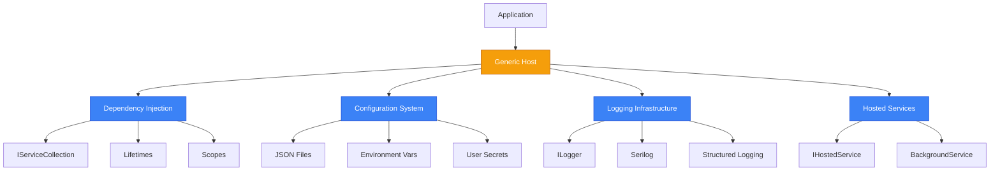
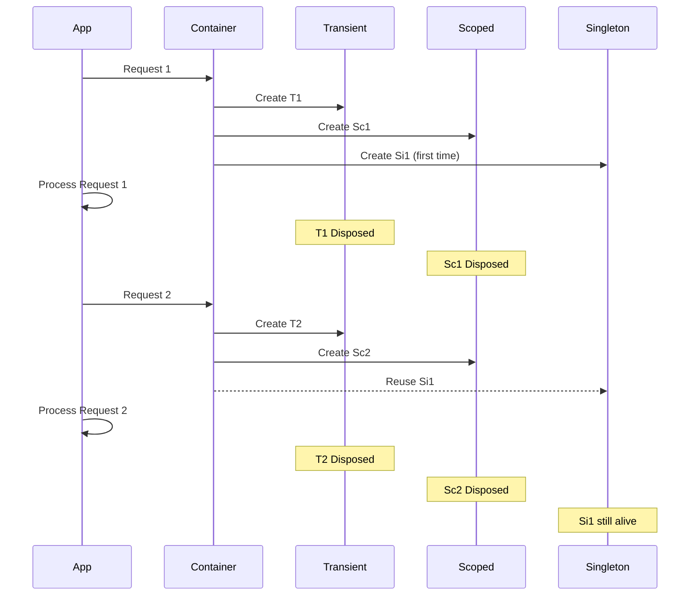
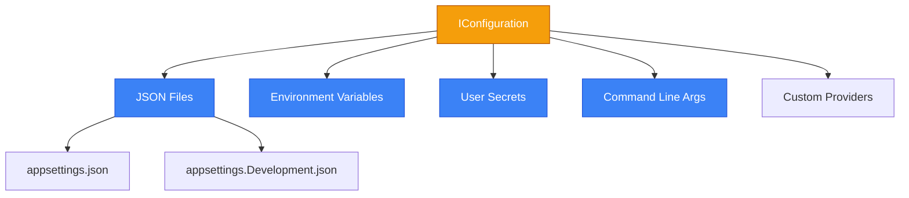
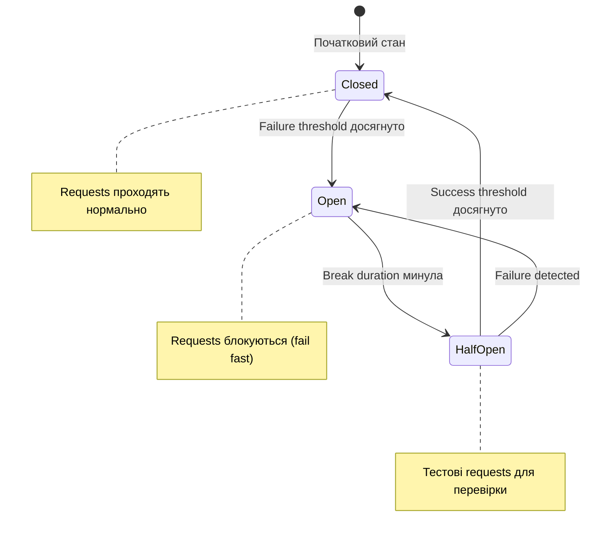

# The Modern .NET Host (Microsoft.Extensions)

## Вступ та Контекст

Уявіть, що ви будуєте мікросервіс для e-commerce платформи. Цей сервіс має:

-   **Отримувати замовлення** з черги повідомлень
-   **Перевіряти наявність товарів** через зовнішнє API
-   **Обробляти платежі** з retry логікою при збоях
-   **Логувати всі операції** для аналітики та відладки
-   **Конфігуруватися** залежно від середовища (dev, staging, production)
-   **Працювати 24/7** з graceful shutdown при оновленнях

**Як організувати такий додаток правильно?**

До .NET Core 2.1 розробники писали багато boilerplate коду для:

-   Ручного створення залежностей (`new EmailService(new SmtpClient())`)
-   Парсингу конфігурацій з різних джерел
-   Налаштування логування через конфігураційні файли
-   Обробки винятків та retry логіки
-   Управління життєвим циклом фонових задач

::caution
**Проблеми старого підходу:**

```csharp
// ❌ Так писали до .NET Core
public class OrderService
{
    private readonly EmailService _emailService;
    private readonly PaymentGateway _paymentGateway;
    
    public OrderService()
    {
        // Tight coupling - важко тестувати
        var smtpClient = new SmtpClient("smtp.gmail.com");
        _emailService = new EmailService(smtpClient);
        
        // Hard-coded залежності
        var httpClient = new HttpClient();
        _paymentGateway = new PaymentGateway(httpClient);
    }
}
```

**Наслідки:**

-   ❌ **Tight coupling**: Неможливо замінити залежності (наприклад, для тестів)
-   ❌ **Складність тестування**: Кожен тест створює реальні HTTP/SMTP підключення
-   ❌ **Відсутність lifecycle management**: Хто відповідає за Dispose?
-   ❌ **Дублювання коду**: Кожен сервіс має власну логіку ініціалізації
    ::

**Рішення: Modern .NET Host** — це комплексна інфраструктура на базі `Microsoft.Extensions.*` пакетів, яка надає:

1.  **Dependency Injection**: Автоматичне управління залежностями та їх lifecycle
2.  **Configuration System**: Універсальне читання налаштувань з різних джерел
3.  **Logging Infrastructure**: Структуроване логування з різними providers
4.  **Resilience Patterns**: Retry, Circuit Breaker, Timeout через Polly
5.  **Background Services**: Managed lifecycle для фонових задач

::mermaid



::

### Що таке .NET Host?

**Host** у .NET — це, по суті, NuGet пакет або бібліотека, яку можна встановити у будь-який проєкт, включаючи звичайні консольні програми. Це не якась магічна абстракція, а конкретна інфраструктурна бібліотека з неймспейсу `Microsoft.Extensions.Hosting`.

```bash
dotnet add package Microsoft.Extensions.Hosting
```

**Головне завдання Хоста** — побудова _інфраструктури_ навколо вашої програми, перетворення простих консольних застосунків на **довготривалі сервіси (long-running services)**.

Приклади довготривалих сервісів:
-   🌐 **Веб-застосунки** (ASP.NET Core)
-   ⚙️ **Фонові Worker Services** (обробка черг, планувальники)
-   🔄 **Мікросервіси** з постійним lifecycle
-   📡 **gRPC сервери**, **SignalR Hubs**

> Консольна програма виконується і завершується. Хост-застосунок _працює постійно_, днями, місяцями або роками, і не має завершуватися без команди.

#### Відмінності між звичайними та хост-застосунками

| Характеристика              | Звичайне Консольне Застосування                       | Застосування на Базі Хоста (Host Application)           |
| :-------------------------- | :---------------------------------------------------- | :------------------------------------------------------- |
| **Тривалість Роботи**       | Швидко завершується (секунди, хвилини)                | Довготривалі служби (дні, місяці, роки); не вимикаються |
| **Призначення**             | Одноразові завдання, утиліти, скрипти                 | Веб-застосунки, постійні фонові служби                   |
| **Архітектура**             | Проста, мало інфраструктури                           | Складна: DI, Logging, Configuration з коробки            |
| **Lifecycle Management**    | `Main()` виконується і завершується                   | Керований старт, graceful shutdown, restart policies     |
| **Dependency Injection**    | Зазвичай відсутнє або ручне                           | Вбудований DI контейнер                                  |
| **Configuration**           | Ручний парсинг аргументів або файлів                  | Універсальна система з множинних джерел                  |
| **Logging**                 | `Console.WriteLine` або сторонні бібліотеки           | Structured logging з `ILogger`                           |
| **Приклади**                | CLI утиліти, міграції БД, скрипти                     | ASP.NET Core, gRPC, Worker Services                      |

**Ключова відмінність**: Застосунки на базі Хоста _вимагають автоматичного перезапуску_ у разі збою, оскільки вони мають працювати постійно (наприклад, веб-додаток не може бути просто вимкнений).

#### Інфраструктура, яку надає Host

Для великих довготривалих застосунків необхідна комплексна інфраструктура. Хост надає готову реалізацію складних функцій:

::field-group

:::field{name="Dependency Injection Container"}
Автоматичне управління залежностями з підтримкою різних lifetimes (Transient, Scoped, Singleton).

```csharp
builder.Services.AddSingleton<ICacheService, RedisCacheService>();
builder.Services.AddScoped<IOrderService, OrderService>();
```
:::

:::field{name="Configuration System"}
Універсальне читання налаштувань з JSON, Environment Variables, User Secrets, Command Line.

```csharp
var connectionString = builder.Configuration["ConnectionStrings:DefaultConnection"];
```
:::

:::field{name="Logging Infrastructure"}
Structured logging з підтримкою множинних providers (Console, File, Seq, Application Insights).

```csharp
builder.Services.AddLogging(config =>
{
    config.AddConsole();
    config.AddDebug();
});
```
:::

:::field{name="Lifecycle Management"}
Контроль над стартом, зупинкою та graceful shutdown застосунку через `IHostApplicationLifetime`.

```csharp
lifetime.ApplicationStarted.Register(() => Console.WriteLine("App started"));
lifetime.ApplicationStopping.Register(() => Console.WriteLine("App stopping..."));
```
:::

:::field{name="Background Services"}
Managed виконання фонових задач через `IHostedService` та `BackgroundService`.

```csharp
builder.Services.AddHostedService<EmailQueueProcessor>();
```
:::

:::field{name="Health Checks"}
Моніторинг стану застосунку та його залежностей (БД, API, черги).

```csharp
builder.Services.AddHealthChecks()
    .AddDbContextCheck<AppDbContext>()
    .AddUrlCheck("https://api.example.com");
```
:::

::

#### Управління життєвим циклом застосунку

Управління життєвим циклом включає:

1.  **Підготовчі роботи перед запуском**: Сидінг бази даних, завантаження кешів, валідація конфігурацій
2.  **Graceful shutdown**: Завершення поточних операцій перед вимкненням (доопрацювання повідомлень з черги, завершення HTTP requests)

Для управління життєвим циклом використовується інтерфейс **`IHostApplicationLifetime`**, який доступний через DI:

```csharp showLineNumbers
public class LifecycleService
{
    private readonly IHostApplicationLifetime _lifetime;
    private readonly ILogger<LifecycleService> _logger;
    
    public LifecycleService(IHostApplicationLifetime lifetime, ILogger<LifecycleService> logger)
    {
        _lifetime = lifetime;
        _logger = logger;
        
        // Підписка на події життєвого циклу через CancellationToken
        _lifetime.ApplicationStarted.Register(OnStarted);
        _lifetime.ApplicationStopping.Register(OnStopping);
        _lifetime.ApplicationStopped.Register(OnStopped);
    }
    
    private void OnStarted()
    {
        _logger.LogInformation("Application has started successfully");
        // Тут можна виконати post-startup завдання: warming up caches, health check
    }
    
    private void OnStopping()
    {
        _logger.LogWarning("Application is stopping... Finishing current work");
        // Graceful shutdown: завершити активні операції, flush логів
    }
    
    private void OnStopped()
    {
        _logger.LogInformation("Application has stopped");
        // Cleanup: закрити з'єднання, зберегти стан
    }
    
    public void RequestShutdown()
    {
        _logger.LogWarning("Shutdown requested programmatically");
        _lifetime.StopApplication(); // Програмна зупинка всього застосунку
    }
}
```

**`IHostApplicationLifetime` надає:**

-   **`ApplicationStarted`**: Спрацьовує, коли програма успішно запустилася та готова приймати запити
-   **`ApplicationStopping`**: Спрацьовує, коли програма отримує сигнал на зупинку (Ctrl+C, SIGTERM)
-   **`ApplicationStopped`**: Спрацьовує, коли програма повністю зупинилася
-   **`StopApplication()`**: Метод для програмної зупинки застосунку

#### IHostedServices та фонове виконання завдань

**IHostedService** — це інтерфейс для реалізації фонових задач, які запускаються разом з хостом та працюють паралельно з основною логікою.

```csharp
public interface IHostedService
{
    Task StartAsync(CancellationToken cancellationToken);
    Task StopAsync(CancellationToken cancellationToken);
}
```

**Важливо**: Не можна виконувати _тривалу блокуючу операцію_ безпосередньо у `StartAsync`! Якщо це зробити, застосунок не зможе повністю запуститися, оскільки заблокується в очікуванні завершення `StartAsync`.

```csharp showLineNumbers
// ❌ НЕПРАВИЛЬНО - блокує запуск Host
public class BadHostedService : IHostedService
{
    public async Task StartAsync(CancellationToken cancellationToken)
    {
        // Блокуємо Host!
        while (!cancellationToken.IsCancellationRequested)
        {
            await ProcessQueueAsync();
            await Task.Delay(1000);
        }
    }
    
    public Task StopAsync(CancellationToken cancellationToken) => Task.CompletedTask;
}
```

**Рішення: BackgroundService (рекомендована практика)**

`BackgroundService` — абстрактний клас, що сам реалізує `IHostedService` і вимагає реалізації лише одного методу — `ExecuteAsync`. Він автоматично запускає логіку `ExecuteAsync` як окрему фонову задачу, що дозволяє Хосту продовжити запуск.

```csharp showLineNumbers
// ✅ ПРАВИЛЬНО - не блокує запуск Host
public class GoodHostedService : BackgroundService
{
    private readonly ILogger<GoodHostedService> _logger;
    
    public GoodHostedService(ILogger<GoodHostedService> logger)
    {
        _logger = logger;
    }
    
    protected override async Task ExecuteAsync(CancellationToken stoppingToken)
    {
        _logger.LogInformation("Background service started");
        
        // ExecuteAsync виконується у фоновому Task - не блокує Host
        while (!stoppingToken.IsCancellationRequested)
        {
            await ProcessQueueAsync();
            await Task.Delay(1000, stoppingToken);
        }
        
        _logger.LogInformation("Background service stopped");
    }
}

// Реєстрація
builder.Services.AddHostedService<GoodHostedService>();
```

**Як це працює:**

1.  Host викликає `StartAsync()` на `BackgroundService`
2.  `StartAsync()` створює фоновий `Task` для `ExecuteAsync()` і одразу повертається
3.  Host продовжує запуск, не чекаючи завершення `ExecuteAsync()`
4.  `ExecuteAsync()` працює паралельно з основною логікою (наприклад, веб-сервером)
5.  При зупинці Host викликає `StopAsync()`, який сигналізує `CancellationToken`

::tip
**Best Practice**: Завжди використовуйте `BackgroundService` замість прямої імплементації `IHostedService` для фонових задач. `IHostedService` резервуйте для випадків, коли потрібен контроль над самим процесом старту/зупинки.
::

### Еволюція .NET Host

::steps

#### Етап 1: .NET Framework (до 2016)

Кожен тип додатку мав власну інфраструктуру:

-   **ASP.NET**: `Global.asax`, `Web.config`
-   **Console**: Ручна ініціалізація всього
-   **Windows Services**: `ServiceBase`, складний setup

**Проблема**: Немає єдиного підходу, багато дублювання.

#### Етап 2: ASP.NET Core 1.x - 2.0 (2016-2017)

Введення `WebHost` для веб-додатків:

```csharp
WebHost.CreateDefaultBuilder(args)
    .UseStartup<Startup>()
    .Build()
    .Run();
```

**Переваги**: DI, Configuration, Logging з коробки. **Недолік**: Тільки для веб-додатків.

#### Етап 3: .NET Core 2.1+ Generic Host (2018)

`IHost` — універсальна інфраструктура для _будь-яких_ додатків:

```csharp
Host.CreateDefaultBuilder(args)
    .ConfigureServices((context, services) =>
    {
        services.AddHostedService<Worker>();
    })
    .Build()
    .Run();
```

**Революція**: Консольні додатки, Windows Services, Worker Services — всі використовують єдину інфраструктуру.

#### Етап 4: .NET 6+ Minimal APIs (2021)

Спрощений синтаксис з top-level statements:

```csharp
var builder = WebApplication.CreateBuilder(args);

// Configure services
builder.Services.AddSingleton<IEmailService, EmailService>();

var app = builder.Build();

app.Run();
```

**Переваги**: Менше boilerplate, але та сама потужність.

::

### Цілі цього розділу

Після вивчення матеріалу ви зможете:

-   ✅ **Проектувати DI архітектуру**: Правильно використовувати Transient, Scoped, Singleton lifetimes
-   ✅ **Уникати DI anti-patterns**: Captive Dependency, Service Locator, Circular Dependencies
-   ✅ **Керувати конфігураціями**: Options Pattern, Hot Reload, Environment-specific settings
-   ✅ **Логувати професійно**: Structured Logging, Serilog, High-performance LoggerMessage
-   ✅ **Додавати Resilience**: Polly patterns (Retry, Circuit Breaker, Timeout)
-   ✅ **Створювати фонові сервіси**: IHostedService з graceful shutdown

### Передумови

Переконайтеся, що розумієте:

-   [Основи C# (інтерфейси, generic types)](/csharp/fundamentals/variables-data-types)
-   [Асинхронне програмування](/csharp/advanced-core/async-await)
-   [LINQ та колекції](/csharp/fundamentals/collections)

---

## Частина 1: Dependency Injection

### 1.1. Що таке Dependency Injection та навіщо він потрібен?

**Dependency Injection (DI)** — це патерн проектування, який реалізує **Inversion of Control (IoC)**: замість того, щоб клас сам створював свої залежності, вони _надаються ззовні_.

> Якщо ваш код створює залежності через `new`, він їх _контролює_. Якщо залежності приходять ззовні — контроль _інвертовано_.

#### Проблема без DI

```csharp showLineNumbers
// ❌ Tight coupling - залежності створюються всередині класу
public class OrderService
{
    private readonly EmailService _emailService;
    private readonly PaymentProcessor _paymentProcessor;
    private readonly ILogger _logger;
    
    public OrderService()
    {
        // Hard-coded dependencies
        _emailService = new EmailService(new SmtpClient("smtp.gmail.com", 587));
        _paymentProcessor = new PaymentProcessor(new HttpClient());
        _logger = LogManager.GetLogger("OrderService");
    }
    
    public void ProcessOrder(Order order)
    {
        _paymentProcessor.Charge(order.Total);
        _emailService.SendConfirmation(order.CustomerEmail);
        _logger.LogInformation("Order processed: {OrderId}", order.Id);
    }
}
```

**Проблеми цього коду:**

1.  **Tight Coupling**: `OrderService` жорстко зв'язаний з `EmailService`, `PaymentProcessor`
2.  **Неможливо тестувати**: Як замокати `SmtpClient` або `HttpClient`?
3.  **Порушення SRP**: Клас відповідає і за бізнес-логіку, і за створення залежностей
4.  **Відсутність lifecycle management**: Хто викликає `Dispose()` на `HttpClient`?
5.  **Конфігурація hard-coded**: Зміна SMTP сервера потребує перекомпіляції

#### Вирішення через DI

```csharp showLineNumbers
// ✅ Loose coupling - залежності отримуємо через конструктор
public class OrderService
{
    private readonly IEmailService _emailService;
    private readonly IPaymentProcessor _paymentProcessor;
    private readonly ILogger<OrderService> _logger;
    
    // Constructor Injection - єдиний спосіб отримати залежності
    public OrderService(
        IEmailService emailService,
        IPaymentProcessor paymentProcessor,
        ILogger<OrderService> logger)
    {
        _emailService = emailService;
        _paymentProcessor = paymentProcessor;
        _logger = logger;
    }
    
    public void ProcessOrder(Order order)
    {
        _paymentProcessor.Charge(order.Total);
        _emailService.SendConfirmation(order.CustomerEmail);
        _logger.LogInformation("Order processed: {OrderId}", order.Id);
    }
}

// Реєстрація в DI Container
var builder = WebApplication.CreateBuilder(args);

builder.Services.AddSingleton<IEmailService, EmailService>();
builder.Services.AddScoped<IPaymentProcessor, PaymentProcessor>();
builder.Services.AddScoped<OrderService>();

var app = builder.Build();
```

**Переваги DI підходу:**

-   ✅ **Loose Coupling**: `OrderService` залежить від _абстракцій_ (інтерфейсів)
-   ✅ **Testability**: Легко замокати `IEmailService` у тестах
-   ✅ **Flexibility**: Можна замінити імплементацію без зміни `OrderService`
-   ✅ **Lifecycle Management**: DI Container автоматично керує створенням та Dispose
-   ✅ **Configuration**: Налаштування виносяться в конфігурацію

### 1.2. DI Container та IServiceCollection

**DI Container** (також **IoC Container**) — це об'єкт, що відповідає за:

1.  **Реєстрацію** сервісів та їх імплементацій
2.  **Створення** інстансів з урахуванням залежностей
3.  **Управління lifecycle** (створення, переіспользування, disposal)

У .NET це `IServiceCollection` для реєстрації та `IServiceProvider` для resolve.

#### Базова архітектура DI

::mermaid


::

#### Реєстрація сервісів

```csharp showLineNumbers
var builder = WebApplication.CreateBuilder(args);

// IServiceCollection - колекція ServiceDescriptor'ів
var services = builder.Services;

// Різні способи реєстрації:

// 1. Interface → Implementation
services.AddSingleton<IEmailService, EmailService>();

// 2. Concrete type (Interface = Implementation)
services.AddScoped<OrderService>();

// 3. Factory method
services.AddTransient<IPaymentProcessor>(sp =>
{
    var config = sp.GetRequiredService<IConfiguration>();
    var apiKey = config["PaymentGateway:ApiKey"];
    return new StripePaymentProcessor(apiKey);
});

// 4. Existing instance (only for singletons)
var cache = new MemoryCache(new MemoryCacheOptions());
services.AddSingleton<IMemoryCache>(cache);

// 5. Generic types
services.AddScoped(typeof(IRepository<>), typeof(Repository<>));
```

**Пояснення:**

-   **Рядок 9**: Найпоширеніший спосіб — мапимо інтерфейс на конкретний клас
-   **Рядок 12**: Якщо немає інтерфейсу, реєструємо конкретний тип напряму
-   **Рядок 15-19**: Factory method дозволяє складну логіку створення з доступом до інших сервісів
-   **Рядок 22-23**: Реєстрація готового інстансу (рідко використовується)
-   **Рядок 26**: Open generic types для generic репозиторіїв

#### Resolve сервісів

```csharp showLineNumbers
var app = builder.Build();

// IServiceProvider - resolver для отримання сервісів
var serviceProvider = app.Services;

// 1. GetRequiredService - кидає exception якщо не знайдено
var emailService = serviceProvider.GetRequiredService<IEmailService>();

// 2. GetService - повертає null якщо не знайдено
var optionalService = serviceProvider.GetService<IOptionalService>();

// 3. GetServices - повертає всі реєстрації (для multiple implementations)
var handlers = serviceProvider.GetServices<INotificationHandler>();

// 4. Constructor Injection (preferred way)
public class MyController : ControllerBase
{
    private readonly IEmailService _emailService;
    
    public MyController(IEmailService emailService)
    {
        _emailService = emailService;
    }
}
```

**Best Practices:**

-   ✅ **Constructor Injection завжди preferred**: Сервіси отримуйте через конструктор
-   ✅ **GetRequiredService для обов'язкових**: Fail-fast якщо залежність відсутня
-   ✅ **Уникайте прямих викликів GetService**: Це Service Locator anti-pattern (про це нижче)

### 1.3. Service Lifetimes

**Service Lifetime** визначає, _коли_ створюється інстанс сервісу та _скільки часу_ він живе.

#### Три основні lifetimes

| Lifetime      | Опис                                                       | Коли створюється                  | Коли Dispose                       |
| :------------ | :--------------------------------------------------------- | :-------------------------------- | :--------------------------------- |
| **Transient** | Новий інстанс при кожному запиті                           | Кожен раз при resolve             | Одразу після використання          |
| **Scoped**    | Один інстанс на scope (зазвичай HTTP request)              | Початок scope                     | Кінець scope                       |
| **Singleton** | Один інстанс на весь час життя додатку                     | Перший resolve (або при startup)  | Shutdown додатку                   |

#### Transient Lifetime

```csharp showLineNumbers
services.AddTransient<IGuidService, GuidService>();

public class GuidService : IGuidService
{
    private readonly Guid _instanceId = Guid.NewGuid();
    
    public Guid GetInstanceId() => _instanceId;
}

// Usage
public class MyController : ControllerBase
{
    private readonly IGuidService _guidService1;
    private readonly IGuidService _guidService2;
    
    public MyController(IGuidService guidService1, IGuidService guidService2)
    {
        _guidService1 = guidService1;
        _guidService2 = guidService2;
    }
    
    [HttpGet("transient")]
    public IActionResult Test()
    {
        // ❗ _guidService1 та _guidService2 — це РІЗНІ інстанси
        return Ok(new
        {
            service1 = _guidService1.GetInstanceId(),
            service2 = _guidService2.GetInstanceId()
        });
        // Output: {"service1": "abc-123", "service2": "def-456"}
    }
}
```

**Коли використовувати Transient:**

-   ✅ Stateless сервіси без внутрішнього стану
-   ✅ Легкі об'єкти, які швидко створюються
-   ✅ Сервіси, що не тримають ресурси (connections, files)

**Приклади**: Validators, Mappers, Utilities, DTOs processors.

#### Scoped Lifetime

```csharp showLineNumbers
services.AddScoped<IGuidService, GuidService>();

// В ASP.NET Core - один scope = один HTTP request
public class MyController : ControllerBase
{
    private readonly IGuidService _guidService1;
    private readonly IGuidService _guidService2;
    
    public MyController(IGuidService guidService1, IGuidService guidService2)
    {
        _guidService1 = guidService1;
        _guidService2 = guidService2;
    }
    
    [HttpGet("scoped")]
    public IActionResult Test()
    {
        // ✅ _guidService1 та _guidService2 — це ОДИН інстанс (в межах request)
        return Ok(new
        {
            service1 = _guidService1.GetInstanceId(),
            service2 = _guidService2.GetInstanceId()
        });
        // Output: {"service1": "abc-123", "service2": "abc-123"}
    }
}
```

**Scope в різних типах додатків:**

| Тип додатку       | Scope                           |
| :---------------- | :------------------------------ |
| **ASP.NET Core**  | HTTP Request                    |
| **Worker Service**| Manual scope через CreateScope()|
| **Console App**   | Manual scope                    |
| **Blazor Server** | SignalR Connection (Circuit)    |

**Коли використовувати Scoped:**

-   ✅ **DbContext** (EF Core): Один контекст на request
-   ✅ Сервіси з request-specific state (current user, request ID)
-   ✅ Unit of Work pattern

**Приклади**: `DbContext`, `HttpContext`, Repository per request.

#### Singleton Lifetime

```csharp showLineNumbers
services.AddSingleton<IGuidService, GuidService>();

// Єдиний інстанс для всього додатку
public class RequestController : ControllerBase
{
    private readonly IGuidService _guidService;
    
    public RequestController(IGuidService guidService)
    {
        _guidService = guidService;
    }
    
    [HttpGet("test")]
    public IActionResult Test()
    {
        return Ok(new { instanceId = _guidService.GetInstanceId() });
        // Завжди повертає той самий GUID незалежно від кількості запитів!
    }
}
```

**Коли використовувати Singleton:**

-   ✅ **Thread-safe** сервіси без mutable state
-   ✅ Configuration objects, Caches
-   ✅ Expensive-to-create об'єкти (connection pools)
-   ✅ Background services, Hosted services

**Приклади**: `IMemoryCache`, `ILogger`, `IHttpClientFactory`, Background workers.

::warning
**КРИТИЧНО**: Singleton сервіси повинні бути **thread-safe**! Вони використовуються паралельно з різних потоків.
::

#### Порівняння Lifetimes: Діаграма

::mermaid



::

### 1.4. Scopes в DI

**Scope** — це логічна межа, в якій scoped сервіси мають один і той же інстанс.

#### Автоматичні Scopes (ASP.NET Core)

```csharp showLineNumbers
// ASP.NET Core автоматично створює scope для кожного HTTP request
var builder = WebApplication.CreateBuilder(args);

builder.Services.AddScoped<IOrderService, OrderService>();
builder.Services.AddScoped<AppDbContext>(); // EF Core DbContext

var app = builder.Build();

app.MapGet("/order/{id}", async (int id, IOrderService orderService) =>
{
    // orderService та AppDbContext всередині неї — одні і ті ж для цього request
    var order = await orderService.GetOrderAsync(id);
    return Results.Ok(order);
}); // Scope завершується тут, всі Scoped сервіси Dispose

app.Run();
```

#### Manual Scopes (Console/Worker)

```csharp showLineNumbers
var builder = Host.CreateApplicationBuilder(args);

builder.Services.AddScoped<IDataProcessor, DataProcessor>();
builder.Services.AddScoped<AppDbContext>();

var host = builder.Build();

// Manual scope creation
using (var scope = host.Services.CreateScope())
{
    var serviceProvider = scope.ServiceProvider;
    
    var processor = serviceProvider.GetRequiredService<IDataProcessor>();
    await processor.ProcessAsync();
    
    // Scope завершується тут — всі Scoped сервіси Dispose
}

// Новий scope
using (var scope = host.Services.CreateScope())
{
    var processor = scope.ServiceProvider.GetRequiredService<IDataProcessor>();
    await processor.ProcessAsync();
    // Новий інстанс IDataProcessor та AppDbContext!
}
```

**Навіщо потрібні Manual Scopes:**

-   Background tasks, що обробляють дані батчами
-   Long-running processes з періодичним оновленням DbContext
-   Console додатки, що імітують "request-like" логіку

::tip
**EF Core Best Practice**: Завжди використовуйте Scoped lifetime для `DbContext`. Один контекст на операцію/request.
::

### 1.5. DI Anti-patterns та Best Practices

#### Anti-pattern 1: Captive Dependency

**Captive Dependency** — коли сервіс з коротшим lifetime захоплюється сервісом з довшим lifetime.

```csharp showLineNumbers
// ❌ ANTI-PATTERN: Singleton captures Scoped
services.AddSingleton<CacheService>(); // Довгий lifetime
services.AddScoped<AppDbContext>();    // Короткий lifetime

public class CacheService
{
    private readonly AppDbContext _dbContext;
    
    // ❌ DbContext (Scoped) injection into Singleton
    public CacheService(AppDbContext dbContext)
    {
        _dbContext = dbContext;
    }
    
    public async Task<User> GetUserAsync(int id)
    {
        // ❌ Використовуємо той самий DbContext для всіх requests!
        return await _dbContext.Users.FindAsync(id);
    }
}
```

**Проблеми:**

-   🐛 **Stale data**: DbContext не оновлюється між requests
-   🐛 **Threading issues**: DbContext не thread-safe, але Singleton використовується паралельно
-   🐛 **Memory leaks**: DbContext не Dispose між requests

**Рішення 1: Змінити Lifetime**

```csharp showLineNumbers
// ✅ Обидва Scoped
services.AddScoped<CacheService>();
services.AddScoped<AppDbContext>();
```

**Рішення 2: IServiceScopeFactory**

```csharp showLineNumbers
services.AddSingleton<CacheService>();
services.AddScoped<AppDbContext>();

public class CacheService
{
    private readonly IServiceScopeFactory _scopeFactory;
    
    // ✅ Inject IServiceScopeFactory замість DbContext
    public CacheService(IServiceScopeFactory scopeFactory)
    {
        _scopeFactory = scopeFactory;
    }
    
    public async Task<User> GetUserAsync(int id)
    {
        // ✅ Створюємо новий scope кожного разу
        using var scope = _scopeFactory.CreateScope();
        var dbContext = scope.ServiceProvider.GetRequiredService<AppDbContext>();
        
        return await dbContext.Users.FindAsync(id);
    }
}
```

**Validation**:

```csharp
// Включення перевірки в Development
builder.Host.UseDefaultServiceProvider(options =>
{
    options.ValidateScopes = true; // Кидає exception при Captive Dependency
    options.ValidateOnBuild = true;
});
```

#### Anti-pattern 2: Service Locator

**Service Locator** — коли сервіси витягуються з `IServiceProvider` напряму замість Constructor Injection.

```csharp showLineNumbers
// ❌ ANTI-PATTERN: Service Locator
public class OrderService
{
    private readonly IServiceProvider _serviceProvider;
    
    public OrderService(IServiceProvider serviceProvider)
    {
        _serviceProvider = serviceProvider;
    }
    
    public async Task ProcessOrderAsync(Order order)
    {
        // ❌ Витягуємо залежності вручну
        var emailService = _serviceProvider.GetRequiredService<IEmailService>();
        var paymentProcessor = _serviceProvider.GetRequiredService<IPaymentProcessor>();
        
        await paymentProcessor.ChargeAsync(order.Total);
        await emailService.SendConfirmationAsync(order.CustomerEmail);
    }
}
```

**Проблеми:**

-   ❌ **Hidden dependencies**: Неясно які залежності потрібні (не видно в конструкторі)
-   ❌ **Runtime failures**: Помилки виявляються під час виконання, а не компіляції
-   ❌ **Важко тестувати**: Складно замокати `IServiceProvider`
-   ❌ **Порушує SRP**: Клас відповідає за resolve залежностей

**Рішення: Constructor Injection**

```csharp showLineNumbers
// ✅ Explicit dependencies
public class OrderService
{
    private readonly IEmailService _emailService;
    private readonly IPaymentProcessor _paymentProcessor;
    
    public OrderService(
        IEmailService emailService,
        IPaymentProcessor paymentProcessor)
    {
        _emailService = emailService;
        _paymentProcessor = paymentProcessor;
    }
    
    public async Task ProcessOrderAsync(Order order)
    {
        await _paymentProcessor.ChargeAsync(order.Total);
        await _emailService.SendConfirmationAsync(order.CustomerEmail);
    }
}
```

::note
**Виняток**: `IServiceProvider` допустимий у _фабриках_ або _generic factory patterns_, де потрібно динамічно створювати різні типи:

```csharp
public class NotificationHandlerFactory
{
    private readonly IServiceProvider _serviceProvider;
    
    public NotificationHandlerFactory(IServiceProvider serviceProvider)
    {
        _serviceProvider = serviceProvider;
    }
    
    public INotificationHandler Create(NotificationType type)
    {
        return type switch
        {
            NotificationType.Email => _serviceProvider.GetRequiredService<EmailHandler>(),
            NotificationType.Sms => _serviceProvider.GetRequiredService<SmsHandler>(),
            _ => throw new ArgumentException("Unknown type")
        };
    }
}
```

::

#### Anti-pattern 3: Circular Dependencies

**Circular Dependencies** — коли два або більше сервісів залежать один від одного.

```csharp showLineNumbers
// ❌ ANTI-PATTERN: Circular dependency
public class OrderService
{
    private readonly IInventoryService _inventoryService;
    
    public OrderService(IInventoryService inventoryService)
    {
        _inventoryService = inventoryService;
    }
}

public class InventoryService : IInventoryService
{
    private readonly OrderService _orderService;
    
    // ❌ InventoryService залежить від OrderService, який залежить від IInventoryService
    public InventoryService(OrderService orderService)
    {
        _orderService = orderService;
    }
}

// Runtime error:
// System.InvalidOperationException: A circular dependency was detected
```

**Рішення 1: Рефакторинг архітектури**

Виділіть спільну логіку в окремий сервіс:

```csharp showLineNumbers
// ✅ Введіть проміжний сервіс
public interface IOrderValidator
{
    bool ValidateStock(int productId, int quantity);
}

public class OrderService
{
    private readonly IOrderValidator _validator;
    
    public OrderService(IOrderValidator validator)
    {
        _validator = validator;
    }
}

public class InventoryService : IInventoryService
{
    private readonly IOrderValidator _validator;
    
    public InventoryService(IOrderValidator validator)
    {
        _validator = validator;
    }
}
```

**Рішення 2: Lazy Injection**

```csharp showLineNumbers
// ✅ Використання Lazy<T> для отримання залежності лише коли потрібно
public class OrderService
{
    private readonly Lazy<IInventoryService> _inventoryService;
    
    public OrderService(Lazy<IInventoryService> inventoryService)
    {
        _inventoryService = inventoryService;
    }
    
    public void ProcessOrder()
    {
        // Сервіс створюється тут, а не в конструкторі
        var inventory = _inventoryService.Value;
    }
}
```

#### Best Practices для DI

::field-group

:::field{name="✅ Constructor Injection Only"}
Завжди використовуйте Constructor Injection. Уникайте Property/Method Injection.

```csharp
// ✅ Good
public class MyService
{
    private readonly IDependency _dependency;
    
    public MyService(IDependency dependency)
    {
        _dependency = dependency;
    }
}

// ❌ Bad - Property Injection
public class MyService
{
    public IDependency Dependency { get; set; }
}
```

:::

:::field{name="✅ Залежте від Abstractions"}
Dependency Inversion Principle: залежте від інтерфейсів, а не конкретних класів.

```csharp
// ✅ Good - залежить від інтерфейсу
public class OrderService
{
    private readonly IEmailService _emailService;
    
    public OrderService(IEmailService emailService) { }
}

// ❌ Bad - залежить від конкретного класу
public class OrderService
{
    private readonly SmtpEmailService _emailService;
    
    public OrderService(SmtpEmailService emailService) { }
}
```

:::

:::field{name="✅ Перевіряйте Captive Dependencies"}
Включайте `ValidateScopes` в Development:

```csharp
builder.Host.UseDefaultServiceProvider(options =>
{
    options.ValidateScopes = Environment.IsDevelopment();
    options.ValidateOnBuild = true;
});
```

:::

:::field{name="✅ Мінімізуйте Dependencies"}
Якщо конструктор має >5 залежностей — це code smell. Розділіть клас або використайте Facade.

```csharp
// ❌ Too many dependencies
public class OrderService(
    IEmailService emailService,
    IPaymentService paymentService,
    IInventoryService inventoryService,
    IShippingService shippingService,
    INotificationService notificationService,
    ILoggingService loggingService,
    ICacheService cacheService)
{
}

// ✅ Розділіть на менші сервіси або використайте Facade
public class OrderFacade(
    IOrderProcessingService orderProcessing,
    IOrderNotificationService orderNotification)
{
}
```

:::

:::field{name="✅ Dispose керується Container'ом"}
Не викликайте `Dispose()` вручну на сервісах з DI. Container це робить автоматично.

```csharp
// ❌ Bad
public class MyService
{
    public void DoWork(IServiceProvider sp)
    {
        var dbContext = sp.GetRequiredService<AppDbContext>();
        dbContext.Dispose(); // ❌ НЕ робіть це!
    }
}

// ✅ Good - Container dispose автоматично
using (var scope = sp.CreateScope())
{
    var dbContext = scope.ServiceProvider.GetRequiredService<AppDbContext>();
    // dbContext.Dispose() викличеться автоматично
}
```

:::

::

---

## Частина 2: Configuration System

### 2.1. IConfiguration та Configuration Providers

**Configuration System** у .NET надає єдиний API для читання налаштувань з різних джерел.

#### Архітектура Configuration

::mermaid



::

#### Default Configuration Sources

```csharp showLineNumbers
var builder = WebApplication.CreateBuilder(args);

// builder.Configuration автоматично завантажує (в порядку пріоритету):
// 1. appsettings.json
// 2. appsettings.{Environment}.json
// 3. User Secrets (лише в Development)
// 4. Environment Variables
// 5. Command Line Arguments

var config = builder.Configuration;

// Простий доступ до значень
var connectionString = config["ConnectionStrings:DefaultConnection"];
var logLevel = config["Logging:LogLevel:Default"];

// Hierarchical access
var smtpHost = config["EmailSettings:Smtp:Host"];
```

#### appsettings.json

```json showLineNumbers
{
  "ConnectionStrings": {
    "DefaultConnection": "Server=localhost;Database=MyApp;Trusted_Connection=True;"
  },
  "Logging": {
    "LogLevel": {
      "Default": "Information",
      "Microsoft.AspNetCore": "Warning"
    }
  },
  "EmailSettings": {
    "Smtp": {
      "Host": "smtp.gmail.com",
      "Port": 587,
      "EnableSsl": true
    },
    "From": "noreply@myapp.com"
  },
  "FeatureFlags": {
    "EnableNewCheckout": false,
    "MaxOrderItems": 100
  }
}
```

#### Environment-specific Configurations

```csharp
// appsettings.Development.json
{
  "ConnectionStrings": {
    "DefaultConnection": "Server=localhost;Database=MyApp_Dev;"
  },
  "Logging": {
    "LogLevel": {
      "Default": "Debug" // Більш детальне логування в Dev
    }
  },
  "EmailSettings": {
    "Smtp": {
      "Host": "localhost", // Використовуємо локальний SMTP для тестів
      "Port": 25
    }
  }
}

// appsettings.Production.json
{
  "ConnectionStrings": {
    "DefaultConnection": "${DATABASE_CONNECTION_STRING}" // Підставляється з Environment Variable
  },
  "Logging": {
    "LogLevel": {
      "Default": "Warning" // Мінімум логів в prod
    }
  }
}
```

### 2.2. User Secrets (Development Only)

**User Secrets** — це механізм зберігання чутливих даних _поза_ репозиторієм для Development.

#### Ініціалізація User Secrets

```bash
# CLI команда для ініціалізації
dotnet user-secrets init

# Додавання секрету
dotnet user-secrets set "EmailSettings:Smtp:Password" "my-secret-password"
dotnet user-secrets set "PaymentGateway:ApiKey" "sk_test_123456"

# Перегляд всіх секретів
dotnet user-secrets list
```

Секрети зберігаються в:

-   **Windows**: `%APPDATA%\Microsoft\UserSecrets\<user_secrets_id>\secrets.json`
-   **macOS/Linux**: `~/.microsoft/usersecrets/<user_secrets_id>/secrets.json`

```json
// secrets.json
{
  "EmailSettings:Smtp:Password": "my-secret-password",
  "PaymentGateway:ApiKey": "sk_test_123456"
}
```

#### Використання User Secrets

```csharp showLineNumbers
var builder = WebApplication.CreateBuilder(args);

// User Secrets автоматично завантажуються в Development
var config = builder.Configuration;

var smtpPassword = config["EmailSettings:Smtp:Password"]; // Читається з User Secrets
var apiKey = config["PaymentGateway:ApiKey"];

// Для production використовуйте Environment Variables або Azure Key Vault
```

::warning
**ВАЖЛИВО**: User Secrets — це НЕ encryption! Вони зберігаються у plain text, але _поза_ проєктом. Для production використовуйте Azure Key Vault, AWS Secrets Manager або подібні.
::

### 2.3. Environment Variables

Environment Variables мають вищий пріоритет за JSON файли та переозначають їх.

#### Формат Environment Variables

```bash
# Hierarchical keys замінюють : на __ (подвійне підкреслення)
export ConnectionStrings__DefaultConnection="Server=prod-db;Database=MyApp;"
export EmailSettings__Smtp__Password="prod-password"
export Logging__LogLevel__Default="Warning"

# Простіший синтаксис (для non-hierarchical)
export ASPNETCORE_ENVIRONMENT="Production"
export ASPNETCORE_URLS="http://+:5000"
```

#### Використання в коді

```csharp showLineNumbers
var builder = WebApplication.CreateBuilder(args);

// Читання Environment Variables
var environment = builder.Environment.EnvironmentName; // "Development", "Staging", "Production"

// З IConfiguration (автоматично завантажено)
var connectionString = builder.Configuration["ConnectionStrings:DefaultConnection"];
// Якщо є Environment Variable, вона переозначить appsettings.json
```

#### Docker / Kubernetes приклад

```yaml
# docker-compose.yml
version: '3.8'
services:
  api:
    image: myapp:latest
    environment:
      - ASPNETCORE_ENVIRONMENT=Production
      - ConnectionStrings__DefaultConnection=Server=postgres;Database=myapp;
      - EmailSettings__Smtp__Host=smtp.sendgrid.net
      - EmailSettings__Smtp__Password=${SMTP_PASSWORD} # З .env файлу
```

### 2.4. Options Pattern

**Options Pattern** — це спосіб _strongly-typed_ доступу до конфігурацій через POCO класи.

#### Проблема без Options Pattern

```csharp showLineNumbers
// ❌ Stringly-typed - легко зробити помилку
public class EmailService
{
    private readonly IConfiguration _configuration;
    
    public EmailService(IConfiguration configuration)
    {
        _configuration = configuration;
    }
    
    public async Task SendEmailAsync(string to, string subject, string body)
    {
        var host = _configuration["EmailSetings:Smtp:Host"]; // ❌ Typo: "Setings"
        var port = int.Parse(_configuration["EmailSettings:Smtp:Port"]);
        var enableSsl = bool.Parse(_configuration["EmailSettings:Smtp:EnableSsl"]);
        
        // ... SMTP logic
    }
}
```

**Проблеми:**

-   ❌ Typos не виявляються на compile-time
-   ❌ Багато boilerplate для парсингу
-   ❌ Немає IntelliSense

#### Рішення: Options Pattern

**Крок 1: Створіть POCO клас**

```csharp showLineNumbers
public class EmailSettings
{
    public const string SectionName = "EmailSettings";
    
    public SmtpSettings Smtp { get; set; } = null!;
    public string From { get; set; } = string.Empty;
}

public class SmtpSettings
{
    public string Host { get; set; } = string.Empty;
    public int Port { get; set; }
    public bool EnableSsl { get; set; }
    public string? Username { get; set; }
    public string? Password { get; set; }
}
```

**Крок 2: Зареєструйте в DI**

```csharp showLineNumbers
var builder = WebApplication.CreateBuilder(args);

// Bind configuration section to POCO
builder.Services.Configure<EmailSettings>(
    builder.Configuration.GetSection(EmailSettings.SectionName));

var app = builder.Build();
```

**Крок 3: Inject через IOptions<T>**

```csharp showLineNumbers
public class EmailService
{
    private readonly EmailSettings _settings;
    
    // ✅ Strongly-typed, compile-time safe
    public EmailService(IOptions<EmailSettings> options)
    {
        _settings = options.Value;
    }
    
    public async Task SendEmailAsync(string to, string subject, string body)
    {
        var host = _settings.Smtp.Host; // IntelliSense працює!
        var port = _settings.Smtp.Port;
        
        using var client = new SmtpClient(host, port)
        {
            EnableSsl = _settings.Smtp.EnableSsl,
            Credentials = new NetworkCredential(_settings.Smtp.Username, _settings.Smtp.Password)
        };
        
        // ... send email
    }
}
```

#### IOptions vs IOptionsSnapshot vs IOptionsMonitor

| Інтерфейс           | Lifetime  | Hot Reload | Named Options | Коли використовувати                         |
| :------------------ | :-------- | :--------- | :------------ | :------------------------------------------- |
| **IOptions<T>**     | Singleton | ❌ Ні      | ✅ Так        | Статичні налаштування, що не змінюються      |
| **IOptionsSnapshot<T>** | Scoped    | ✅ Так     | ✅ Так        | Налаштування, що можуть змінюватися per-request |
| **IOptionsMonitor<T>**  | Singleton | ✅ Так     | ✅ Так        | Реакція на зміни в real-time                 |

#### IOptionsSnapshot Приклад

```csharp showLineNumbers
services.Configure<FeatureFlags>(
    builder.Configuration.GetSection("FeatureFlags"));

// IOptionsSnapshot перечитує конфігурацію кожен request
public class CheckoutController : ControllerBase
{
    private readonly FeatureFlags _featureFlags;
    
    public CheckoutController(IOptionsSnapshot<FeatureFlags> options)
    {
        _featureFlags = options.Value; // Свіже значення для цього request
    }
    
    [HttpPost]
    public IActionResult ProcessCheckout()
    {
        if (_featureFlags.EnableNewCheckout)
        {
            return ProcessNewCheckout();
        }
        
        return ProcessLegacyCheckout();
    }
}
```

#### IOptionsMonitor Приклад (Hot Reload)

```csharp showLineNumbers
services.Configure<CacheSettings>(
    builder.Configuration.GetSection("CacheSettings"));

public class CacheService
{
    private readonly IOptionsMonitor<CacheSettings> _optionsMonitor;
    
    public CacheService(IOptionsMonitor<CacheSettings> optionsMonitor)
    {
        _optionsMonitor = optionsMonitor;
        
        // Реагуємо на зміни конфігурації
        _optionsMonitor.OnChange(settings =>
        {
            Console.WriteLine($"Cache TTL changed to: {settings.DefaultTtlMinutes}");
            ReconfigureCache(settings);
        });
    }
    
    public string GetValue(string key)
    {
        // Завжди актуальні налаштування
        var settings = _optionsMonitor.CurrentValue;
        return _cache.Get(key, settings.DefaultTtlMinutes);
    }
}
```

#### Validation в Options Pattern

```csharp showLineNumbers
public class EmailSettings
{
    public SmtpSettings Smtp { get; set; } = null!;
    public string From { get; set; } = string.Empty;
}

// Validation через Data Annotations
using System.ComponentModel.DataAnnotations;

public class SmtpSettings
{
    [Required]
    [RegularExpression(@"^[\w\.-]+$")]
    public string Host { get; set; } = string.Empty;
    
    [Range(1, 65535)]
    public int Port { get; set; }
    
    public bool EnableSsl { get; set; }
}

// Реєстрація з validation
builder.Services.AddOptions<EmailSettings>()
    .Bind(builder.Configuration.GetSection(EmailSettings.SectionName))
    .ValidateDataAnnotations() // Автоматична валідація через Data Annotations
    .ValidateOnStart(); // Валідація при старті додатку
```

**Складніша валідація:**

```csharp showLineNumbers
builder.Services.AddOptions<EmailSettings>()
    .Bind(builder.Configuration.GetSection(EmailSettings.SectionName))
    .Validate(settings =>
    {
        // Custom validation logic
        if (settings.Smtp.EnableSsl && settings.Smtp.Port == 25)
        {
            return false; // Port 25 не підтримує SSL
        }
        
        if (string.IsNullOrEmpty(settings.Smtp.Password) && settings.Smtp.EnableSsl)
        {
            return false; // SSL потребує password
        }
        
        return true;
    }, "Invalid SMTP configuration")
    .ValidateOnStart();
```

---

## Частина 3: Logging

### 3.1. ILogger та Microsoft.Extensions.Logging

**ILogger** — це абстракція для логування, що дозволяє писати логи незалежно від конкретної імплементації.

#### Базовий Logging

```csharp showLineNumbers
public class OrderService
{
    private readonly ILogger<OrderService> _logger;
    
    public OrderService(ILogger<OrderService> logger)
    {
        _logger = logger;
    }
    
    public async Task<Order> CreateOrderAsync(CreateOrderRequest request)
    {
        _logger.LogInformation("Creating order for user {UserId}", request.UserId);
        
        try
        {
            var order = new Order { UserId = request.UserId, Total = request.Total };
            await _repository.AddAsync(order);
            
            _logger.LogInformation("Order {OrderId} created successfully", order.Id);
            return order;
        }
        catch (Exception ex)
        {
            _logger.LogError(ex, "Failed to create order for user {UserId}", request.UserId);
            throw;
        }
    }
}
```

#### Log Levels

| Level         | Значення | Коли використовувати                                |
| :------------ | :------- | :-------------------------------------------------- |
| **Trace**     | 0        | Найдетальніша інформація для debugging             |
| **Debug**     | 1        | Development debugging, не для production            |
| **Information** | 2        | Загальний flow додатку                             |
| **Warning**   | 3        | Незвичайні події, які не є помилками               |
| **Error**     | 4        | Помилки, що не зупиняють роботу додатку             |
| **Critical**  | 5        | Критичні збої, що потребують негайної уваги        |

```csharp showLineNumbers
_logger.LogTrace("Entering method ProcessOrder");
_logger.LogDebug("Cache miss for key {CacheKey}", key);
_logger.LogInformation("User {UserId} logged in", userId);
_logger.LogWarning("Retry attempt {Attempt} for order {OrderId}", attempt, orderId);
_logger.LogError(exception, "Payment failed for order {OrderId}", orderId);
_logger.LogCritical(exception, "Database connection lost!");
```

#### Structured Logging

**Structured Logging** — це логування з додатковими властивостями, а не просто текстом.

```csharp showLineNumbers
// ❌ String interpolation - втрачається структура
_logger.LogInformation($"User {userId} placed order {orderId} for ${total}");

// ✅ Structured logging - зберігає properties
_logger.LogInformation(
    "User {UserId} placed order {OrderId} for {Total:C}",
    userId,
    orderId,
    total);
```

**У Serilog це виглядає як JSON:**

```json
{
  "@t": "2024-12-12T10:30:00.123Z",
  "@mt": "User {UserId} placed order {OrderId} for {Total}",
  "@l": "Information",
  "UserId": 12345,
  "OrderId": "ORD-98765",
  "Total": 149.99
}
```

**Переваги:**

-   ✅ Легко фільтрувати логи: `UserId == 12345`
-   ✅ Агрегація: "Скільки замовлень зробив користувач X?"
-   ✅ Корекляція: Знайти всі логи для конкретного OrderId

### 3.2. Serilog Integration

**Serilog** — найпопулярніша бібліотека structured logging для .NET.

#### Установка

```bash
dotnet add package Serilog.AspNetCore
dotnet add package Serilog.Sinks.Console
dotnet add package Serilog.Sinks.File
dotnet add package Serilog.Sinks.Seq  # Optional: для централізованого логування
```

#### Базова конфігурація

```csharp showLineNumbers
using Serilog;

var builder = WebApplication.CreateBuilder(args);

// Замінюємо стандартний logger на Serilog
builder.Host.UseSerilog((context, services, configuration) => configuration
    .ReadFrom.Configuration(context.Configuration)
    .ReadFrom.Services(services)
    .Enrich.FromLogContext()
    .WriteTo.Console()
    .WriteTo.File(
        path: "logs/log-.txt",
        rollingInterval: RollingInterval.Day,
        retainedFileCountLimit: 30));

var app = builder.Build();

// Логування HTTP requests
app.UseSerilogRequestLogging();

app.Run();
```

#### appsettings.json конфігурація

```json
{
  "Serilog": {
    "Using": ["Serilog.Sinks.Console", "Serilog.Sinks.File"],
    "MinimumLevel": {
      "Default": "Information",
      "Override": {
        "Microsoft": "Warning",
        "Microsoft.Hosting.Lifetime": "Information",
        "Microsoft.EntityFrameworkCore": "Warning"
      }
    },
    "WriteTo": [
      { "Name": "Console" },
      {
        "Name": "File",
        "Args": {
          "path": "logs/log-.txt",
          "rollingInterval": "Day",
          "retainedFileCountLimit": 30,
          "outputTemplate": "{Timestamp:yyyy-MM-dd HH:mm:ss.fff zzz} [{Level:u3}] {Message:lj}{NewLine}{Exception}"
        }
      }
    ],
    "Enrich": ["FromLogContext", "WithMachineName", "WithThreadId"]
  }
}
```

#### Serilog Enrichers

**Enrichers** додають додаткові властивості до кожного log event.

```csharp showLineNumbers
builder.Host.UseSerilog((context, services, configuration) => configuration
    .ReadFrom.Configuration(context.Configuration)
    .Enrich.WithProperty("Application", "MyECommerceApp")
    .Enrich.WithProperty("Environment", context.HostingEnvironment.EnvironmentName)
    .Enrich.FromLogContext()
    .Enrich.WithMachineName()
    .Enrich.WithThreadId()
    .Enrich.WithCorrelationId() // Потребує додатковий пакет
    .WriteTo.Console()
    .WriteTo.Seq("http://localhost:5341")); // Централізоване логування
```

#### LogContext для додавання контексту

```csharp showLineNumbers
public class OrderController : ControllerBase
{
    private readonly IOrderService _orderService;
    
    [HttpPost]
    public async Task<IActionResult> CreateOrder(CreateOrderRequest request)
    {
        // Додаємо UserId до всіх логів у цьому scope
        using (LogContext.PushProperty("UserId", request.UserId))
        using (LogContext.PushProperty("CorrelationId", HttpContext.TraceIdentifier))
        {
            _logger.LogInformation("Processing order creation");
            
            var order = await _orderService.CreateOrderAsync(request);
            // Всі логи всередині OrderService матимуть UserId та CorrelationId!
            
            return Ok(order);
        }
    }
}
```

### 3.3. High-Performance Logging з LoggerMessage

**LoggerMessage** — це source generator для створення high-performance logging methods.

#### Проблема з звичайним логуванням

```csharp showLineNumbers
// ❌ Повільно: створюється FormattedLogValues, boxing для параметрів
_logger.LogInformation("Processing order {OrderId} for user {UserId}", orderId, userId);
```

Кожен виклик `LogInformation`:

1.  Створює масив `object[]` для параметрів
2.  Boxing для value types (int, Guid)
3.  Створює `FormattedLogValues` для форматування
4.  Allocations у heap

#### Рішення: LoggerMessage Source Generator (.NET 6+)

```csharp showLineNumbers
public partial class OrderService
{
    private readonly ILogger<OrderService> _logger;
    
    public OrderService(ILogger<OrderService> logger)
    {
        _logger = logger;
    }
    
    // ✅ Compile-time generated, zero allocations
    [LoggerMessage(
        EventId = 1000,
        Level = LogLevel.Information,
        Message = "Processing order {OrderId} for user {UserId}")]
    private partial void LogProcessingOrder(Guid orderId, int userId);
    
    [LoggerMessage(
        EventId = 1001,
        Level = LogLevel.Error,
        Message = "Failed to process order {OrderId}")]
    private partial void LogOrderFailed(Guid orderId, Exception exception);
    
    [LoggerMessage(
        EventId = 1002,
        Level = LogLevel.Warning,
        Message = "Retry attempt {Attempt} for order {OrderId}")]
    private partial void LogRetryAttempt(int attempt, Guid orderId);
    
    public async Task ProcessOrderAsync(Guid orderId, int userId)
    {
        LogProcessingOrder(orderId, userId);
        
        try
        {
            // Business logic
        }
        catch (Exception ex)
        {
            LogOrderFailed(orderId, ex);
            throw;
        }
    }
}
```

**Згенерований код (приблизно):**

```csharp
private void LogProcessingOrder(Guid orderId, int userId)
{
    if (_logger.IsEnabled(LogLevel.Information))
    {
        _logger.Log(
            LogLevel.Information,
            new EventId(1000),
            new LogValues(orderId, userId),
            null,
            (state, ex) => $"Processing order {state.OrderId} for user {state.UserId}");
    }
}
```

**Переваги:**

-   ✅ **~5-10x швидше** за звичайні `LogInformation`
-   ✅ **Zero allocations** для value types
-   ✅ **Compile-time перевірка** параметрів
-   ✅ **EventId** для фільтрації логів

::tip
**Коли використовувати LoggerMessage:**

-   High-traffic endpoints (>1000 RPS)
-   Логування в hot paths (loops)
-   Мікросервіси з великим навантаженням
    ::

---

## Частина 4: Resilience з Polly

### 4.1. Навіщо потрібна Resilience?

У розподілених системах _все може і буде падати_:

-   API недоступний
-   База даних перевантажена
-   Мережа нестабільна
-   Third-party сервіси повертають 503

**Resilience Patterns** допомагають системі витримувати та відновлюватися після збоїв.

#### Установка Polly

```bash
dotnet add package Polly
dotnet add package Microsoft.Extensions.Http.Polly
```

### 4.2. Retry Pattern

**Retry** — повторити операцію при тимчасовому збої.

#### Базовий Retry

```csharp showLineNumbers
using Polly;
using Polly.Retry;

// Створення Retry pipeline
var retryPipeline = new ResiliencePipelineBuilder()
    .AddRetry(new RetryStrategyOptions
    {
        ShouldHandle = new PredicateBuilder()
            .Handle<HttpRequestException>()
            .Handle<TimeoutException>(),
        MaxRetryAttempts = 3,
        Delay = TimeSpan.FromSeconds(1),
        BackoffType = DelayBackoffType.Exponential, // 1s, 2s, 4s
        OnRetry = args =>
        {
            Console.WriteLine($"Retry {args.AttemptNumber} after {args.RetryDelay}");
            return ValueTask.CompletedTask;
        }
    })
    .Build();

// Використання
var result = await retryPipeline.ExecuteAsync(async ct =>
{
    return await httpClient.GetStringAsync("https://api.example.com/data", ct);
}, cancellationToken);
```

#### Retry з HttpClientFactory

```csharp showLineNumbers
builder.Services.AddHttpClient("external-api", client =>
{
    client.BaseAddress = new Uri("https://api.example.com");
    client.Timeout = TimeSpan.FromSeconds(10);
})
.AddResilienceHandler("retry-policy", builder =>
{
    builder.AddRetry(new RetryStrategyOptions
    {
        MaxRetryAttempts = 3,
        Delay = TimeSpan.FromSeconds(1),
        BackoffType = DelayBackoffType.Exponential,
        ShouldHandle = new PredicateBuilder<HttpResponseMessage>()
            .Handle<HttpRequestException>()
            .HandleResult(response =>
                response.StatusCode == System.Net.HttpStatusCode.TooManyRequests ||
                (int)response.StatusCode >= 500)
    });
});

// Використання
public class ExternalApiService
{
    private readonly HttpClient _httpClient;
    
    public ExternalApiService(IHttpClientFactory httpClientFactory)
    {
        _httpClient = httpClientFactory.CreateClient("external-api");
    }
    
    public async Task<string> GetDataAsync()
    {
        // Retry автоматично застосовується!
        return await _httpClient.GetStringAsync("/data");
    }
}
```

### 4.3. Circuit Breaker Pattern

**Circuit Breaker** — тимчасово блокує виклики до сервісу, що падає, щоб не перевантажувати його.

::mermaid



::

#### Circuit Breaker конфігурація

```csharp showLineNumbers
builder.Services.AddHttpClient("payment-gateway")
    .AddResilienceHandler("circuit-breaker", builder =>
    {
        builder.AddCircuitBreaker(new CircuitBreakerStrategyOptions
        {
            FailureRatio = 0.5,          // 50% помилок
            SamplingDuration = TimeSpan.FromSeconds(10), // За 10 секунд
            MinimumThroughput = 5,       // Мінімум 5 запитів
            BreakDuration = TimeSpan.FromSeconds(30),    // Відкрити на 30 сек
            
            ShouldHandle = new PredicateBuilder<HttpResponseMessage>()
                .Handle<HttpRequestException>()
                .HandleResult(r => (int)r.StatusCode >= 500),
            
            OnOpened = args =>
            {
                Console.WriteLine($"Circuit breaker opened at {DateTime.Now}");
                return ValueTask.CompletedTask;
            },
            OnClosed = args =>
            {
                Console.WriteLine($"Circuit breaker closed at {DateTime.Now}");
                return ValueTask.CompletedTask;
            },
            OnHalfOpened = args =>
            {
                Console.WriteLine("Circuit breaker half-opened, testing...");
                return ValueTask.CompletedTask;
            }
        });
    });
```

**Як це працює:**

1.  **Closed**: Всі запити проходять. Рахуються failures.
2.  **Open**: Якщо failure ratio > 50% за 10 сек → Circuit відкривається. Всі запити одразу failяться з `BrokenCircuitException`.
3.  **HalfOpen**: Після 30 сек Circuit пропускає тестовий запит. Якщо успішний → Closed, якщо ні → Open знову.

### 4.4. Timeout Pattern

**Timeout** — обмежує час виконання операції.

```csharp showLineNumbers
builder.Services.AddHttpClient("slow-service")
    .AddResilienceHandler("timeout", builder =>
    {
        builder.AddTimeout(new TimeoutStrategyOptions
        {
            Timeout = TimeSpan.FromSeconds(5),
            OnTimeout = args =>
            {
                Console.WriteLine($"Timeout after {args.Timeout} for attempt {args.AttemptNumber}");
                return ValueTask.CompletedTask;
            }
        });
    });
```

### 4.5. Комбінування Policies

**Best Practice**: Комбінуйте Retry, Circuit Breaker та Timeout.

```csharp showLineNumbers
builder.Services.AddHttpClient("resilient-client")
    .AddResilienceHandler("resilience-pipeline", builder =>
    {
        // 1. Outer timeout - загальний ліміт для всіх спроб
        builder.AddTimeout(TimeSpan.FromSeconds(30));
        
        // 2. Retry з exponential backoff
        builder.AddRetry(new RetryStrategyOptions
        {
            MaxRetryAttempts = 3,
            Delay = TimeSpan.FromSeconds(1),
            BackoffType = DelayBackoffType.Exponential,
            ShouldHandle = new PredicateBuilder<HttpResponseMessage>()
                .Handle<HttpRequestException>()
                .Handle<TimeoutRejectedException>() // Retry при timeout
                .HandleResult(r => (int)r.StatusCode >= 500)
        });
        
        // 3. Circuit Breaker для fail-fast
        builder.AddCircuitBreaker(new CircuitBreakerStrategyOptions
        {
            FailureRatio = 0.5,
            SamplingDuration = TimeSpan.FromSeconds(10),
            MinimumThroughput = 3,
            BreakDuration = TimeSpan.FromSeconds(30)
        });
        
        // 4. Inner timeout - per attempt
        builder.AddTimeout(TimeSpan.FromSeconds(5));
    });
```

**Порядок виконання:**

```
Request → Outer Timeout (30s) → Retry → Circuit Breaker → Inner Timeout (5s) → HTTP Call
```

---

## Частина 5: Background Services

### 5.1. IHostedService та BackgroundService

**IHostedService** — це інтерфейс для long-running задач, що запускаються разом з додатком.

#### IHostedService Interface

```csharp
public interface IHostedService
{
    Task StartAsync(CancellationToken cancellationToken);
    Task StopAsync(CancellationToken cancellationToken);
}
```

#### BackgroundService Base Class

```csharp showLineNumbers
public abstract class BackgroundService : IHostedService
{
    protected abstract Task ExecuteAsync(CancellationToken stoppingToken);
    
    public virtual Task StartAsync(CancellationToken cancellationToken)
    {
        // Запускає ExecuteAsync у фоновому Task
    }
    
    public virtual Task StopAsync(CancellationToken cancellationToken)
    {
        // Чекає завершення ExecuteAsync з graceful shutdown
    }
}
```

### 5.2. Простий Background Service

```csharp showLineNumbers
public class EmailQueueProcessor : BackgroundService
{
    private readonly ILogger<EmailQueueProcessor> _logger;
    private readonly IServiceScopeFactory _scopeFactory;
    
    public EmailQueueProcessor(
        ILogger<EmailQueueProcessor> logger,
        IServiceScopeFactory scopeFactory)
    {
        _logger = logger;
        _scopeFactory = scopeFactory;
    }
    
    protected override async Task ExecuteAsync(CancellationToken stoppingToken)
    {
        _logger.LogInformation("Email Queue Processor started");
        
        while (!stoppingToken.IsCancellationRequested)
        {
            try
            {
                // Створюємо scope для Scoped dependencies
                using var scope = _scopeFactory.CreateScope();
                var emailService = scope.ServiceProvider.GetRequiredService<IEmailService>();
                
                await emailService.ProcessQueueAsync(stoppingToken);
                
                // Чекаємо перед наступною ітерацією
                await Task.Delay(TimeSpan.FromSeconds(30), stoppingToken);
            }
            catch (OperationCanceledException)
            {
                // Graceful shutdown
                _logger.LogInformation("Email Queue Processor stopping");
            }
            catch (Exception ex)
            {
                _logger.LogError(ex, "Error processing email queue");
                // Продовжуємо роботу навіть при помилці
                await Task.Delay(TimeSpan.FromMinutes(1), stoppingToken);
            }
        }
        
        _logger.LogInformation("Email Queue Processor stopped");
    }
}

// Реєстрація
builder.Services.AddHostedService<EmailQueueProcessor>();
```

### 5.3. Background Service з PeriodicTimer

```csharp showLineNumbers
public class DataSyncService : BackgroundService
{
    private readonly ILogger<DataSyncService> _logger;
    private readonly IServiceScopeFactory _scopeFactory;
    private readonly TimeSpan _period = TimeSpan.FromMinutes(5);
    
    public DataSyncService(
        ILogger<DataSyncService> logger,
        IServiceScopeFactory scopeFactory)
    {
        _logger = logger;
        _scopeFactory = scopeFactory;
    }
    
    protected override async Task ExecuteAsync(CancellationToken stoppingToken)
    {
        using var timer = new PeriodicTimer(_period);
        
        while (!stoppingToken.IsCancellationRequested &&
               await timer.WaitForNextTickAsync(stoppingToken))
        {
            try
            {
                _logger.LogInformation("Starting data sync at {Time}", DateTime.UtcNow);
                
                using var scope = _scopeFactory.CreateScope();
                var syncService = scope.ServiceProvider.GetRequiredService<ISyncService>();
                
                await syncService.SyncDataAsync(stoppingToken);
                
                _logger.LogInformation("Data sync completed successfully");
            }
            catch (Exception ex)
            {
                _logger.LogError(ex, "Data sync failed");
            }
        }
    }
}
```

### 5.4. Graceful Shutdown

```csharp showLineNumbers
public class OrderProcessorService : BackgroundService
{
    private readonly ILogger<OrderProcessorService> _logger;
    
    protected override async Task ExecuteAsync(CancellationToken stoppingToken)
    {
        _logger.LogInformation("Order Processor started");
        
        // Реєструємо callback для graceful shutdown
        stoppingToken.Register(() =>
            _logger.LogInformation("Graceful shutdown initiated"));
        
        while (!stoppingToken.IsCancellationRequested)
        {
            try
            {
                await ProcessNextOrderAsync(stoppingToken);
            }
            catch (OperationCanceledException)
            {
                // Нормальне завершення
                break;
            }
        }
        
        _logger.LogInformation("Order Processor stopped gracefully");
    }
    
    public override async Task StopAsync(CancellationToken cancellationToken)
    {
        _logger.LogInformation("Stop requested, finishing current work...");
        
        // Базовий StopAsync чекає завершення ExecuteAsync
        await base.StopAsync(cancellationToken);
        
        _logger.LogInformation("All work completed, service stopped");
    }
}
```

**Конфігурація Shutdown Timeout:**

```csharp
builder.Host.ConfigureServices(services =>
{
    services.Configure<HostOptions>(options =>
    {
        options.ShutdownTimeout = TimeSpan.FromSeconds(30); // Максимальний час на graceful shutdown
    });
});
```

---

## Частина 6: Практичні сценарії

### 6.1. E-Commerce Order Processing Service

Комплексний приклад Worker Service з DI, Configuration, Logging, Resilience та Background processing.

```csharp showLineNumbers
// Program.cs
using Serilog;

var builder = Host.CreateApplicationBuilder(args);

// Serilog
builder.Host.UseSerilog((context, services, configuration) => configuration
    .ReadFrom.Configuration(context.Configuration)
    .Enrich.FromLogContext()
    .WriteTo.Console()
    .WriteTo.File("logs/order-processor-.txt", rollingInterval: RollingInterval.Day));

// Configuration Options
builder.Services.Configure<OrderProcessorSettings>(
    builder.Configuration.GetSection("OrderProcessor"));
builder.Services.Configure<PaymentGatewaySettings>(
    builder.Configuration.GetSection("PaymentGateway"));

// DI Services
builder.Services.AddDbContext<AppDbContext>(options =>
    options.UseSqlServer(builder.Configuration.GetConnectionString("DefaultConnection")));

builder.Services.AddScoped<IOrderRepository, OrderRepository>();
builder.Services.AddScoped<IInventoryService, InventoryService>();
builder.Services.AddScoped<IPaymentService, PaymentService>();
builder.Services.AddScoped<INotificationService, NotificationService>();

// HTTP Clients з Resilience
builder.Services.AddHttpClient<IPaymentService, PaymentService>()
    .AddResilienceHandler("payment-resilience", resilienceBuilder =>
    {
        resilienceBuilder
            .AddTimeout(TimeSpan.FromSeconds(30))
            .AddRetry(new RetryStrategyOptions
            {
                MaxRetryAttempts = 3,
                Delay = TimeSpan.FromSeconds(1),
                BackoffType = DelayBackoffType.Exponential
            })
            .AddCircuitBreaker(new CircuitBreakerStrategyOptions
            {
                FailureRatio = 0.5,
                SamplingDuration = TimeSpan.FromSeconds(10),
                MinimumThroughput = 3,
                BreakDuration = TimeSpan.FromSeconds(30)
            });
    });

// Background Service
builder.Services.AddHostedService<OrderProcessorWorker>();

var host = builder.Build();
await host.RunAsync();

// OrderProcessorWorker.cs
public class OrderProcessorWorker : BackgroundService
{
    private readonly ILogger<OrderProcessorWorker> _logger;
    private readonly IServiceScopeFactory _scopeFactory;
    private readonly IOptions<OrderProcessorSettings> _settings;
    
    public OrderProcessorWorker(
        ILogger<OrderProcessorWorker> logger,
        IServiceScopeFactory scopeFactory,
        IOptions<OrderProcessorSettings> settings)
    {
        _logger = logger;
        _scopeFactory = scopeFactory;
        _settings = settings;
    }
    
    [LoggerMessage(
        EventId = 1000,
        Level = LogLevel.Information,
        Message = "Processing order batch of {Count} orders")]
    private partial void LogProcessingBatch(int count);
    
    [LoggerMessage(
        EventId = 1001,
        Level = LogLevel.Information,
        Message = "Order {OrderId} processed successfully in {ElapsedMs}ms")]
    private partial void LogOrderProcessed(Guid orderId, long elapsedMs);
    
    protected override async Task ExecuteAsync(CancellationToken stoppingToken)
    {
        _logger.LogInformation("Order Processor started");
        
        using var timer = new PeriodicTimer(TimeSpan.FromSeconds(_settings.Value.PoolingIntervalSeconds));
        
        while (!stoppingToken.IsCancellationRequested &&
               await timer.WaitForNextTickAsync(stoppingToken))
        {
            try
            {
                await ProcessPendingOrdersAsync(stoppingToken);
            }
            catch (Exception ex)
            {
                _logger.LogError(ex, "Failed to process orders batch");
            }
        }
        
        _logger.LogInformation("Order Processor stopped");
    }
    
    private async Task ProcessPendingOrdersAsync(CancellationToken cancellationToken)
    {
        using var scope = _scopeFactory.CreateScope();
        var orderRepository = scope.ServiceProvider.GetRequiredService<IOrderRepository>();
        var inventoryService = scope.ServiceProvider.GetRequiredService<IInventoryService>();
        var paymentService = scope.ServiceProvider.GetRequiredService<IPaymentService>();
        var notificationService = scope.ServiceProvider.GetRequiredService<INotificationService>();
        
        var pendingOrders = await orderRepository.GetPendingOrdersAsync(
            _settings.Value.BatchSize,
            cancellationToken);
        
        if (pendingOrders.Count == 0)
            return;
        
        LogProcessingBatch(pendingOrders.Count);
        
        foreach (var order in pendingOrders)
        {
            var stopwatch = Stopwatch.StartNew();
            
            using (LogContext.PushProperty("OrderId", order.Id))
            using (LogContext.PushProperty("UserId", order.UserId))
            {
                try
                {
                    // 1. Reserve Inventory
                    await inventoryService.ReserveAsync(order, cancellationToken);
                    
                    // 2. Process Payment (with resilience)
                    await paymentService.ChargeAsync(order, cancellationToken);
                    
                    // 3. Update Order Status
                    order.Status = OrderStatus.Completed;
                    await orderRepository.UpdateAsync(order, cancellationToken);
                    
                    // 4. Send Notification
                    await notificationService.SendOrderConfirmationAsync(order, cancellationToken);
                    
                    stopwatch.Stop();
                    LogOrderProcessed(order.Id, stopwatch.ElapsedMilliseconds);
                }
                catch (Exception ex)
                {
                    _logger.LogError(ex, "Failed to process order {OrderId}", order.Id);
                    
                    order.Status = OrderStatus.Failed;
                    order.FailureReason = ex.Message;
                    await orderRepository.UpdateAsync(order, cancellationToken);
                }
            }
        }
    }
}
```

---

## Резюме

::card-group

:::card{title="Dependency Injection"}

**Ключові концепції:**

-   IServiceCollection для реєстрації
-   Три lifetimes: Transient, Scoped, Singleton
-   Constructor Injection preferred
-   Уникайте Captive Dependency, Service Locator, Circular Dependencies

**Коли використовувати:**

-   Transient: Stateless, lightweight сервіси
-   Scoped: DbContext, per-request state
-   Singleton: Caches, Loggers, Expensive objects
    :::

:::card{title="Configuration"}

**Providers:**

-   appsettings.json (base + environment-specific)
-   Environment Variables
-   User Secrets (dev only)
-   Command Line Arguments

**Options Pattern:**

-   `IOptions<T>`: Static configuration
-   `IOptionsSnapshot<T>`: Per-request reload
-   `IOptionsMonitor<T>`: Hot reload with OnChange
    :::

:::card{title="Logging"}

**ILogger:** Standard abstraction

**Serilog:** Structured logging

-   Enrichers для додаткового контексту
-   LogContext для scoped properties
-   Multiple sinks (Console, File, Seq)

**LoggerMessage:** High-performance, zero-allocation logging для hot paths
:::

:::card{title="Resilience (Polly)"}

**Patterns:**

-   **Retry**: Exponential backoff при transient failures
-   **Circuit Breaker**: Fail-fast при багатьох помилках
-   **Timeout**: Обмеження часу виконання

**Best Practice:** Комбінуйте patterns:
`Outer Timeout → Retry → Circuit Breaker → Inner Timeout`
:::

:::card{title="Background Services"}

**IHostedService:** Lifecycle management

**BackgroundService:** Base class для long-running tasks

**Best Practices:**

-   IServiceScopeFactory для Scoped dependencies
-   PeriodicTimer для періодичних задач
-   Graceful Shutdown з CancellationToken
-   HostOptions.ShutdownTimeout

:::

::

---

## Практичні завдання

::steps

### Завдання 1: DI Container Setup

Створіть консольний додаток з:

-   Generic Host
-   3 сервіси (Transient, Scoped, Singleton)
-   Демонстрація різниці між lifetimes
-   Валідація Captive Dependency

### Завдання 2: Configuration з Options Pattern

Реалізуйте:

-   `appsettings.json` з hierarchical config
-   Environment-specific overrides
-   Options Pattern з валідацією
-   User Secrets для API keys

### Завдання 3: Structured Logging

Налаштуйте Serilog з:

-   Console та File sinks
-   Enrichers (Machine, Thread, Custom)
-   LogContext для correlation ID
-   LoggerMessage для high-performance логування

### Завдання 4: Resilient HTTP Client

Створіть HTTP client з:

-   Retry (3 спроби, exponential backoff)
-   Circuit Breaker (50% failure ratio, 30s break)
-   Timeout (5s per attempt, 30s total)
-   Логування всіх resilience events

### Завдання 5: Background Worker Service

Реалізуйте Worker Service, що:

-   Обробляє черга задач кожні 30 секунд
-   Використовує Scoped DbContext
-   Логує всі операції через Serilog
-   Graceful shutdown з завершенням поточної роботи

::

---

## Додаткові ресурси

-   [Microsoft.Extensions.DependencyInjection Documentation](https://learn.microsoft.com/en-us/dotnet/core/extensions/dependency-injection)
-   [Options Pattern in ASP.NET Core](https://learn.microsoft.com/en-us/aspnet/core/fundamentals/configuration/options)
-   [Serilog Documentation](https://github.com/serilog/serilog/wiki)
-   [Polly Documentation](https://www.pollydocs.org/)
-   [.NET Background Services](https://learn.microsoft.com/en-us/dotnet/core/extensions/hosted-services)
-   [High-Performance Logging in .NET](https://learn.microsoft.com/en-us/dotnet/core/extensions/high-performance-logging)

::tip
**Наступна тема**: [Clean Architecture](/csharp/architecture-best-practices/clean-architecture)

У наступному розділі ми розглянемо, як побудувати maintainable архітектуру через Clean Architecture principles, Domain-Driven Design та CQRS pattern.
::
