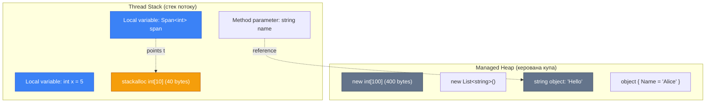

# High Performance Types (Високопродуктивні Типи)

## Вступ та Контекст

Уявіть, що ви розробляєте HTTP-сервер, який обробляє тисячі запитів за секунду. Кожен запит містить заголовки, які потрібно розпарсити — десятки рядків у форматі `"Header-Name: Value"`. Якщо для кожного парсингу ви створюєте нові рядки (`string.Substring()`, `string.Split()`), ваш сервер миттєво задихнеться через **надмірний тиск на Garbage Collector (GC)**. Кожна маленька алокація — це майбутня робота для GC, яка призупиняє виконання вашого коду на десятки мілісекунд.

Саме для таких високопродуктивних сценаріїв, де кожна мілісекунда і кожен байт пам'яті має значення, .NET надає набір інструментів для **zero-allocation programming** (програмування без алокацій):

-   **`Span<T>`** і **`ReadOnlySpan<T>`** — ультрашвидкі "вікна" в пам'ять без копіювання даних.
-   **`Memory<T>`** і **`ReadOnlyMemory<T>`** — heap-friendly версії Span для асинхронного коду.
-   **`stackalloc`** — розміщення даних прямо в стеку (stack) замість керованої купи (heap).
-   **Indices & Ranges** — елегантний синтаксис `[^1]`, `[2..5]` для роботи зі зрізами даних.

### Історична еволюція

::steps

### Доба .NET Framework (до 2016)

Для роботи з буферами використовувалися масиви (`byte[]`, `char[]`) або небезпечні вказівники (`unsafe byte*`). Кожна операція створення підрядка (`substring`) алокувала новий об'єкт у купі. Для високої продуктивності доводилося вдаватися до `unsafe` коду, що робило програми небезпечними та складними.

### .NET Core 2.1 (2018) — Революція Span

З'являється [`Span<T>`](https://learn.microsoft.com/en-us/dotnet/api/system.span-1) — `ref struct`, що дозволяє працювати з будь-яким непере

рвним блоком пам'яті (масив, stackalloc, unmanaged memory) через єдиний API, **без копіювання даних**. Це був величезний прорив у продуктивності.

### .NET Core 3.0+ (2019)

[`Memory<T>`](https://learn.microsoft.com/en-us/dotnet/api/system.memory-1) як альтернатива Span для роботи в асинхронних методах. Indices (`^`) та Ranges (`..`) для зручного slicing.

### .NET 5+ (те перішній час)

Span став стандартом у всій стандартній бібліотеці. Методи типу `Stream.ReadAsync(Memory<byte>)`, `int.TryFormat(Span<char>)` є нормою.

::

### Навіщо це все?

**Головна мета**: зменшити тиск на GC і збільшити throughput (пропускну здатність) застосунків. В реальних сценаріях (веб-сервери, ігрові рушії, обробка медіа) це дає прискорення в **2-10 разів** та зменшення використання пам'яті на **50-90%**.

---

## Stack vs Heap: Фундаментальні Відмінності

Перед тим, як розібратися зі `Span<T>` та `stackalloc`, необхідно чітко розуміти різницю між **стеком (stack)** та **керованою купою (heap)**.

### Схема пам'яті

::mermaid



::

### Порівняння

| Характеристика         | Stack (Стек)                               | Heap (Купа)                                          |
| :--------------------- | :----------------------------------------- | :--------------------------------------------------- |
| **Швидкість алокації** | Надзвичайно швидка (зсув вказівника SP)    | Повільніша (пошук вільного блоку, GC overhead)       |
| **Lifetime**           | Детермінований (до виходу з методу/scope)  | Недетермінований (до збирання сміття)                |
| **Розмір**             | Обмежений (~1MB на потік на Windows/Linux) | Обмежений тільки RAM (~2GB на 32-bit, ~TB на 64-bit) |
| **Фрагментація**       | Неможлива (LIFO порядок)                   | Можлива (потребує компактифікації)                   |
| **Управління**         | Автоматичне (компілятор)                   | Garbage Collector                                    |
| **Thread-Safety**      | Кожен потік має власний стек               | Спільна для всіх потоків (потрібна синхронізація)    |

::tip[Ключове правило]
**Stack** використовується для:

-   Локальних змінних методів
-   Параметрів методів
-   Return addresses (для повернення з функцій)

**Heap** використовується для:

-   Об'єктів created через `new` (класи, масиви)
-   Все, що потребує lifetime довший за метод
-   Великі структури даних
    ::

### Чому Stack швидший?

Алокація на стеку — це буквально **одна інструкція процесора**:

```asm
SUB rsp, 40  ; "Виділи" 40 байт на стеку (просто зменш stack pointer)
```

Алокація в купі вимагає:

1. Пошуку вільного блоку достатнього розміру
2. Оновлення метаданих GC (generation, sync block)
3. Можливої компактифікації пам'яті
4. Thread-safe операцій (locks або Interlocked)

**Звільнення** зі стеку теж тривіальне:

```asm
ADD rsp, 40  ; "Звільни" 40 байт (відновлюючи stack pointer)
```

Heap потребує GC для збирання сміття, що призупиняє виконання програми.

::warning[Обмеження стеку]
Типовий розмір стеку — **1 MB** на потік. `StackOverflowException` є **невиловлюваним** (non-catchable) і вбиває весь процес. Тому:

-   Ніколи не використовуйте stackalloc для великих розмірів (> ~1 KB рекомендація)
-   Остерігайтеся глибокої рекурсії
-   Великі масиви (`new int[1000000]`) завжди в heap
    ::

---

## Span&lt;T&gt; та ReadOnlySpan&lt;T&gt;

`Span<T>` — це **`ref struct`**, що представляє непере рвний регіон пам'яті. Це "вікно" або "зріз" (slice) даних, який може вказувати на:

-   Масив у heap
-   Пам'ять у stack (`stackalloc`)
-   Unmanaged memory
-   Частину існуючого `Span`

### Що таке ref struct?

`ref struct` — це спеціальний вид структури з критичними обмеженнями:

```csharp [RefStructDemo.cs] showLineNumbers
// Span<T> оголошений приблизно так:
public ref struct Span<T>
{
    private ref T _pointer;  // "Managed pointer" до першого елемента
    private int _length;     // Кількість елементів

    // ... методи ...
}
```

**Обмеження `ref struct`:**

1. ❌ Не може бути полем класу чи звичайного struct
2. ❌ Не може використовуватись у async методах
3. ❌ Не може boxing до `object` чи `interface`
4. ❌ Не може бути елементом масиву
5. ✅ Може бути тільки локальною змінною або параметром методу

**Навіщо такі обмеження?** Щоб **гарантувати**, що `Span` існує тільки на стеку і не переживе lifetime пам'яті, на яку вказує. Це забезпечує безпеку без runtime перевірок.

### Створення Span

::code-group

```csharp [Від масиву] showLineNumbers
int[] array = [1, 2, 3, 4, 5, 6, 7, 8, 9, 10];

// Весь масив
Span<int> span1 = array;

// Зріз через AsSpan
Span<int> span2 = array.AsSpan();

// Зріз з індексів [2..5] → елементи 3, 4, 5
Span<int> span3 = array.AsSpan(2, 3);

Console.WriteLine(span3[0]); // 3
span3[0] = 99; // Модифікує оригінальний масив!
Console.WriteLine(array[2]); // 99
```

```csharp [Від stackalloc] showLineNumbers
// Виділення 512 байт на стеку (128 int)
Span<int> span = stackalloc int[128];

// Заповнення
for (int i = 0; i < span.Length; i++)
{
    span[i] = i * 2;
}

// Весь цикл виконується БЕЗ АЛОКАЦІЙ в heap!
// Після виходу з методу пам'ять автоматично звільняється
```

```csharp [Від string] showLineNumbers
string text = "Hello, World!";

// ReadOnlySpan бо string immutable
ReadOnlySpan<char> span = text.AsSpan();

// Зріз без створення нового string!
ReadOnlySpan<char> hello = text.AsSpan(0, 5); // "Hello"
ReadOnlySpan<char> world = text.AsSpan(7, 5); // "World"

// В традиційному підході:
// string hello = text.Substring(0, 5); // АЛОКАЦІЯ!
// string world = text.Substring(7, 5); // АЛОКАЦІЯ!
```

::

### Операції зі Span

```csharp [SpanOperations.cs] showLineNumbers
Span<int> source = stackalloc int[] { 1, 2, 3, 4, 5 };

// Slicing (створення "підвікна" БЕЗ копіювання)
Span<int> slice = source[1..4]; // {2, 3, 4}
slice[0] = 99; // source тепер {1, 99, 3, 4, 5}

// Fill - заповнення значенням
Span<int> buffer = stackalloc int[100];
buffer.Fill(42); // Всі 100 елементів = 42

// Clear - обнулення
buffer.Clear(); // Всі елементи = 0

// CopyTo - копіювання в інший Span
Span<int> destination = stackalloc int[3];
source[..3].CopyTo(destination); // {1, 99, 3}

// TryCopyTo - безпечне копіювання
if (source.TryCopyTo(destination))
{
    Console.WriteLine("Скопійовано!");
}
else
{
    Console.WriteLine("Destination занадто малий!");
}

// IndexOf, Contains
int index = source.IndexOf(99); // 1
bool has = source.Contains(4);  // true
```

### ReadOnlySpan для immutability

`ReadOnlySpan<T>` гарантує, що дані не можуть бути змінені:

```csharp [ReadOnlySpanDemo.cs] showLineNumbers
string data = "Sample Data";
ReadOnlySpan<char> readOnly = data.AsSpan();

// readOnly[0] = 'X'; // ❌ Compiler error!

// Приймаємо тільки readonly
void ProcessData(ReadOnlySpan<char> input)
{
    // Можемо читати
    char first = input[0];

    // Не можемо писати
    // input[0] = 'A'; // Error!
}

// Можна передати як Span, так і ReadOnlySpan
Span<char> mutable = stackalloc char[10];
ProcessData(mutable); // ✅ Implicit conversion
```

::tip[Design Guideline]
**Параметри методів:**

-   Якщо метод **тільки читає** → `ReadOnlySpan<T>`
-   Якщо метод **модифікує** → `Span<T>`
-   Якщо метод **приймає ownership** → `T[]` або `Memory<T>`

Це дозволяє викликати метод з будь-яким джерелом даних (array, stackalloc, string).
::

### Performance: String Parsing

Порівняємо традиційний підхід зі Span-підходом:

::code-group

```csharp [Без Span (повільно)] showLineNumbers
string ParseToken_Old(string input)
{
    int index = input.IndexOf(' ');
    if (index == -1) return input;

    // АЛОКАЦІЯ нового string!
    return input.Substring(0, index);
}

// Використання:
string data = "Username Password";
string user = ParseToken_Old(data); // Алокація!
```

```csharp [Зі Span (швидко)] showLineNumbers
ReadOnlySpan<char> ParseToken_Fast(ReadOnlySpan<char> input)
{
    int index = input.IndexOf(' ');
    if (index == -1) return input;

    // Просто slice - БЕЗ алокацій!
    return input[..index];
}

// Використання:
string data = "Username Password";
ReadOnlySpan<char> user = ParseToken_Fast(data); // 0 алокацій!

// Якщо потрібен string:
string userName = user.ToString(); // Тільки одна алокація в кінці
```

::

**Benchmark результат** (1 млн викликів):

-   Без Span: **~150ms**, 1 млн алокацій
-   Зі Span: **~15ms**, 0 алокацій (якщо не викликати ToString())

**Прискорення: ~10x** ⚡

---

## Memory&lt;T&gt; та ReadOnlyMemory&lt;T&gt;

`Span<T>` чудовий, але має фатальне обмеження: **не можна використовувати в async методах**.

```csharp
// ❌ Compiler error CS4012!
async Task ProcessAsync(Span<byte> buffer)
{
    await SomeMethodAsync();
}
```

**Чому?** Async методи компілюються в state machine, який зберігає локальні змінні як **поля структури**. `Span<T>` — це `ref struct`, який не може бути полем.

### Рішення: Memory&lt;T&gt;

[`Memory<T>`](https://learn.microsoft.com/en-us/dotnet/api/system.memory-1) — це звичайний struct (не ref), що "обгортає" буфер пам'яті та надає метод `.Span` для отримання `Span<T>`.

```csharp [MemoryVsSpan.cs] showLineNumbers
// ✅ Працює!
async Task ProcessAsync(Memory<byte> buffer)
{
    // Отримуємо Span локально
    Span<byte> span = buffer.Span;

    // Маніпуляції з даними (синхронно)
    span.Fill(0);

    // Async операція
    await Task.Delay(100);

    // Знову отримуємо Span після await
    Span<byte> span2 = buffer.Span;
    span2[0] = 42;
}

// Виклик:
byte[] data = new byte[1024];
Memory<byte> memory = data;
await ProcessAsync(memory);
```

### Коли використовувати що?

| Сценарій                          | Використовуйте                          |
| :-------------------------------- | :-------------------------------------- |
| Синхроний метод, локальна обробка | `Span<T>`                               |
| Async метод                       | `Memory<T>`                             |
| Параметр методу (read-only)       | `ReadOnlySpan<T>` / `ReadOnlyMemory<T>` |
| Поле класу (буфер)                | `Memory<T>` або `T[]`                   |
| Короткоживучий buffer (<1KB)      | `Span<T>` + `stackalloc`                |
| Великий buffer або pooling        | `Memory<T>` + `ArrayPool<T>`            |

::code-group

```csharp [Span для sync] showLineNumbers
void ProcessData(ReadOnlySpan<char> data)
{
    // Швидка обробка без async
    foreach (char c in data)
    {
        Console.Write(c);
    }
}
```

```csharp [Memory для async] showLineNumbers
async Task ProcessDataAsync(ReadOnlyMemory<char> data)
{
    // Можемо await
    await Task.Delay(10);

    // Отримуємо Span після await
    ReadOnlySpan<char> span = data.Span;
    foreach (char c in span)
    {
        Console.Write(c);
    }
}
```

::

---

## Stackalloc: Алокація на стеку

`stackalloc` дозволяє виділити пам'ять **прямо на стеку** замість heap. Це надзвичайно швидко, але вимагає обережності.

### Безпечне використання через Span

```csharp [SafeStackalloc.cs] showLineNumbers
void ProcessSmallBuffer()
{
    // Виділення 256 байт на стеку
    Span<byte> buffer = stackalloc byte[256];

    // Bounds checking автоматично!
    buffer[0] = 1;
    buffer[255] = 255;
    // buffer[256] = 0; // ✅ IndexOutOfRangeException (безпечно!)

    // Використання buffer...
    DoWork(buffer);

    // При виході з методу пам'ять автоматично "звільняється"
    // (насправді просто відновлюється stack pointer)
}

void DoWork(Span<byte> data)
{
    // Приймає будь-яке джерело: stackalloc, array, pool
    data.Fill(42);
}
```

### Небезпечне використання (без Span)

```csharp [UnsafeStackalloc.cs] showLineNumbers
unsafe void DangerousStackalloc()
{
    // Старий підхід - потребує unsafe!
    int* buffer = stackalloc int[10];

    buffer[0] = 1;
    buffer[9] = 9;
    buffer[100] = 0; // ❌ ЖАХ! Undefined behavior, можливо crash!

    // Немає bounds checking
    // Немає GC tracking
    // Легко зламати пам'ять
}
```

::warning[Розмір має значення]
**Золоте правило**: stackalloc тільки для **малої** пам'яті (до 1 KB).

```csharp
// ✅ Добре
Span<int> small = stackalloc int[256]; // 1024 bytes

// ⚠️ Ризиковано
Span<int> risky = stackalloc int[10000]; // 40 KB - може викликати StackOverflowException!

// ✅ Для великих розмірів використовуйте ArrayPool
using System.Buffers;

int[] large = ArrayPool<int>.Shared.Rent(10000);
try
{
    Span<int> span = large.AsSpan(0, 10000);
    // Робота з span...
}
finally
{
    ArrayPool<int>.Shared.Return(large);
}
```

::

### Pattern: Conditional Stackalloc

Дуже поширений патерн — використовувати stackalloc для малих розмірів і ArrayPool для великих:

```csharp [ConditionalStackalloc.cs] showLineNumbers
void ProcessBuffer(int size)
{
    const int StackallocThreshold = 256;

    // Малий розмір → stack
    if (size <= StackallocThreshold)
    {
        Span<byte> buffer = stackalloc byte[StackallocThreshold];
        Span<byte> actualBuffer = buffer[..size];
        DoWork(actualBuffer);
    }
    // Великий розмір → pool
    else
    {
        byte[] rented = ArrayPool<byte>.Shared.Rent(size);
        try
        {
            Span<byte> buffer = rented.AsSpan(0, size);
            DoWork(buffer);
        }
        finally
        {
            ArrayPool<byte>.Shared.Return(rented);
        }
    }
}

void DoWork(Span<byte> buffer)
{
    // Єдиний метод для обох випадків!
    buffer.Fill(0xFF);
}
```

---

## Indices та Ranges

Починаючи з C# 8.0, індекси та діапазони роблять код роботи з колекціями значно чистішим.

### Index (індекс з кінця)

```csharp [IndexExample.cs] showLineNumbers
int[] numbers = [0, 1, 2, 3, 4, 5, 6, 7, 8, 9];

// Традиційний спосіб доступу з кінця
int last = numbers[numbers.Length - 1];     // 9
int secondLast = numbers[numbers.Length - 2]; // 8

// Новий спосіб з Index
int last = numbers[^1];  // 9
int secondLast = numbers[^2]; // 8
int first = numbers[^10]; // 0

// Index як тип
Index lastIndex = ^1;
int value = numbers[lastIndex]; // 9
```

**Семантика:**

-   `numbers[^1]` ≈ `numbers[numbers.Length - 1]`
-   `numbers[^n]` ≈ `numbers[numbers.Length - n]`

### Range (діапазон)

```csharp [RangeExample.cs] showLineNumbers
int[] numbers = [0, 1, 2, 3, 4, 5, 6, 7, 8, 9];

// Діапазони
int[] range1 = numbers[2..5];    // [2, 3, 4]
int[] range2 = numbers[..3];     // [0, 1, 2] (від початку до 3)
int[] range3 = numbers[7..];     // [7, 8, 9] (від 7 до кінця)
int[] range4 = numbers[^3..];    // [7, 8, 9] (останні 3)
int[] range5 = numbers[..^2];    // [0, 1, 2, 3, 4, 5, 6, 7] (без останніх 2)
int[] all = numbers[..];         // Вся копія масиву

// Range як тип
Range middle = 2..5;
int[] slice = numbers[middle]; // [2, 3, 4]
```

::warning[Копіювання vs Slicing]
**Важливо:** Поведінка різна для масивів та Span!

```csharp
int[] array = [1, 2, 3, 4, 5];

// Array slicing створює КОПІЮ
int[] slice1 = array[1..4]; // {2, 3, 4} - нова пам'ять!
slice1[0] = 99;
Console.WriteLine(array[1]); // 2 - оригінал не змінився

// Span slicing створює VIEW (без копіювання)
Span<int> span = array;
Span<int> slice2 = span[1..4]; // {2, 3, 4} - view на оригінал
slice2[0] = 99;
Console.WriteLine(array[1]); // 99 - оригінал змінився!
```

::

### З різними типами

```csharp [RangeSupport.cs] showLineNumbers
// ✅ Arrays
int[] arr = [1, 2, 3, 4, 5];
int[] slice = arr[1..3];

// ✅ Span/Memory
Span<int> span = arr;
Span<int> spanSlice = span[1..3];

// ✅ String
string text = "Hello, World!";
string hello = text[..5]; // "Hello"

// ❌ List НЕ ПІДТРИМУЄ ranges напряму (потребує GetRange)
List<int> list = [1, 2, 3, 4, 5];
// var slice = list[1..3]; // Compiler error!
List<int> listSlice = list.GetRange(1, 2); // [2, 3]
```

---

## Architecture & Under the Hood

### Span\<T\> Layout

```csharp
// Спрощена структура Span<T>:
public readonly ref struct Span<T>
{
    private readonly ref T _pointer; // 8 bytes (managed pointer на 64-bit)
    private readonly int _length;    // 4 bytes

    // Padding для вирівнювання
    // Загальний розмір: 16 bytes на 64-bit системах
}
```

`_pointer` — це **managed pointer** (tracked by GC), не `int*`. Це дозволяє вказувати на managed memory безпечно.

### Ref Struct Обмеження

**Чому `ref struct` не можна в async:**

```csharp
async Task BadAsync()
{
    Span<int> span = stackalloc int[10];

    await Task.Delay(100); // ❌ Compiler error CS4033

    // Після await метод може продовжитись на ІНШОМУ потоці!
    // Stack memory з першого потоку більше недійсна.
    // span._pointer вказував би на невалідну пам'ять → corruption!
}
```

Компілятор **забороняє** це на етапі компіляції для безпеки.

### JIT Optimizations

JIT компілятор виконує агресивні оптимізації для `Span<T>`:

**1. Bounds Check Elimination**

```csharp
Span<int> span = stackalloc int[100];
for (int i = 0; i < span.Length; i++)
{
    span[i] = i;  // JIT ПРИБИРАЄ bounds check тут!
}
```

JIT бачить, що `i` завжди в межах `[0, span.Length)` і видаляє перевірку меж, залишаючи тільки чисту операцію запису.

**2. Method Inlining**

Більшість методів `Span<T>` (`Length`, indexer, `Slice`) є дуже малими і inline-яться JIT. Це робить код на Span **настільки ж швидким**, як робота з raw pointer, але безпечним.

---

## Common Patterns

### Pattern 1: Zero-allocation String Split

```csharp [SpanSplit.cs] showLineNumbers
void ParseCsv(ReadOnlySpan<char> line)
{
    while (line.Length > 0)
    {
        int comma = line.IndexOf(',');

        ReadOnlySpan<char> token = comma >= 0
            ? line[..comma]
            : line;

        ProcessToken(token); // БЕЗ створення нових string!

        if (comma < 0) break;
        line = line[(comma + 1)..]; // Залишок
    }
}

void ProcessToken(ReadOnlySpan<char> token)
{
    Console.WriteLine(token.ToString()); // ToString тільки коли РЕАЛЬНО потрібен string
}

// Використання:
string csvLine = "Name,Age,City";
ParseCsv(csvLine);
```

### Pattern 2: TryFormat замість StringBuilder

```csharp [TryFormatPattern.cs] showLineNumbers
// Старий спосіб (з алокаціями)
string FormatOld(int id, string name, double salary)
{
    return $"ID:{id}, Name:{name}, Salary:{salary:C}";
    // Або через StringBuilder - також алокація
}

// Новий спосіб (zero-allocation)
bool TryFormatNew(int id, ReadOnlySpan<char> name, double salary, Span<char> destination, out int written)
{
    Span<char> buffer = destination;
    int pos = 0;

    // "ID:"
    "ID:".AsSpan().CopyTo(buffer[pos..]);
    pos += 3;

    // {id}
    if (!id.TryFormat(buffer[pos..], out int idLen))
        goto fail;
    pos += idLen;

    // ", Name:"
    ", Name:".AsSpan().CopyTo(buffer[pos..]);
    pos += 8;

    // {name}
    name.CopyTo(buffer[pos..]);
    pos += name.Length;

    // ", Salary:"
    ", Salary:".AsSpan().CopyTo(buffer[pos..]);
    pos += 10;

    // {salary:C}
    if (!salary.TryFormat(buffer[pos..], out int salLen, "C"))
        goto fail;
    pos += salLen;

    written = pos;
    return true;

fail:
    written = 0;
    return false;
}

// Використання:
Span<char> buffer = stackalloc char[256];
if (TryFormatNew(42, "Alice", 75000.50, buffer, out int len))
{
    string result = buffer[..len].ToString(); // Одна алокація в кінці
    Console.WriteLine(result);
}
```

---

## Best Practices

::tip[Рекомендації]

**1. Span для параметрів методу**

```csharp
// ✅ Приймає будь-яке джерело
void Process(ReadOnlySpan<byte> data) { }

// Виклик з масиву
Process(new byte[] { 1, 2, 3 });

// Виклик з stackalloc
Process(stackalloc byte[] { 1, 2, 3 });

// Виклик з slice
byte[] arr = new byte[100];
Process(arr.AsSpan(10, 20));
```

**2. Stackalloc тільки для малих buffer (<= 1 KB)**

```csharp
const int MaxStackSize = 1024;

if (size <= MaxStackSize)
{
    Span<byte> buffer = stackalloc byte[size];
}
else
{
    byte[] rented = ArrayPool<byte>.Shared.Rent(size);
    // Use and return...
}
```

**3. ReadOnlySpan для read-only scenarios**

```csharp
// Гарантує, що дані не змінюються
void ParseToken(ReadOnlySpan<char> input) { }
```

**4. Memory для async, Span для sync**

```csharp
// Sync
void ProcessSync(Span<byte> buffer) { }

// Async
async Task ProcessAsync(Memory<byte> buffer)
{
    await Task.Delay(1);
    Span<byte> span = buffer.Span;
    // Work with span...
}
```

**5. Уникайте Span в полях класів**

```csharp
// ❌ Не можна
class BadClass
{
    private Span<int> _buffer; // Compiler error!
}

// ✅ Використовуйте Memory
class GoodClass
{
    private Memory<int> _buffer; // OK
}
```

::

---

## Troubleshooting

### CS4012: Cannot use Span in async

```csharp
// ❌ Помилка
async Task ProcessAsync(Span<byte> buffer)
{
    await Task.Delay(1);
}

// ✅ Рішення: використовуйте Memory
async Task ProcessAsync(Memory<byte> buffer)
{
    Span<byte> span = buffer.Span; // Локально
    await Task.Delay(1);
}
```

### Stack Overflow від великого stackalloc

```csharp
// ❌ Небезпечно!
Span<int> huge = stackalloc int[1000000]; // 4 MB!

// ✅ Використовуйте ArrayPool
int[] arr = ArrayPool<int>.Shared.Rent(1000000);
// Use and return
```

### Slice поза межами

```csharp
Span<int> span = stackalloc int[10];

// ❌ IndexOutOfRangeException
Span<int> bad = span[5..20];

// ✅ Перевіряйте довжину
if (endIndex <= span.Length)
{
    Span<int> good = span[5..endIndex];
}
```

---

## Practice Tasks

### Junior: Zero-Allocation Trim

Реалізуйте метод `Trim` для `ReadOnlySpan<char>`, який прибирає пробіли на початку та в кінці БЕЗ створення нового string.

```csharp
ReadOnlySpan<char> TrimSpan(ReadOnlySpan<char> input)
{
    // Your code here
}

// Тести:
// "  Hello  ".AsSpan().Trim() -> "Hello"
// "No spaces".AsSpan().Trim() -> "No spaces"
```

### Middle: CSV Parser з Span

Створіть CSV parser, що приймає `ReadOnlySpan<char>` і повертає `List<ReadOnlyMemory<char>>` токенів, НЕ створюючи проміжних string.

### Senior: Zero-Allocation JSON Tokenizer

Реалізуйте примітивний JSON tokenizer з `Span<byte>`, що визначає токени (object, array, string, number, boolean, null) БЕЗ алокацій.

---

## Резюме

::note
**Ключові висновки:**

-   **`Span<T>`** — ref struct для zero-copy доступу до пам'яті (stack/heap/unmanagedалюйте Memory
-   **`stackalloc`** — швидка алокація на стеку (до ~1 KB)
-   **Indices `^`** і **Ranges `..`** — елегантний синтаксис slicing
-   **Performance**: 2-10x швидше у high-throughput сценаріях
-   **Trade-off**: Складніший код, більш stringent lifetime rules
    ::

**Наступна тема**: [LINQ (Language Integrated Query)](../5.standard-library/3.linq.md)
