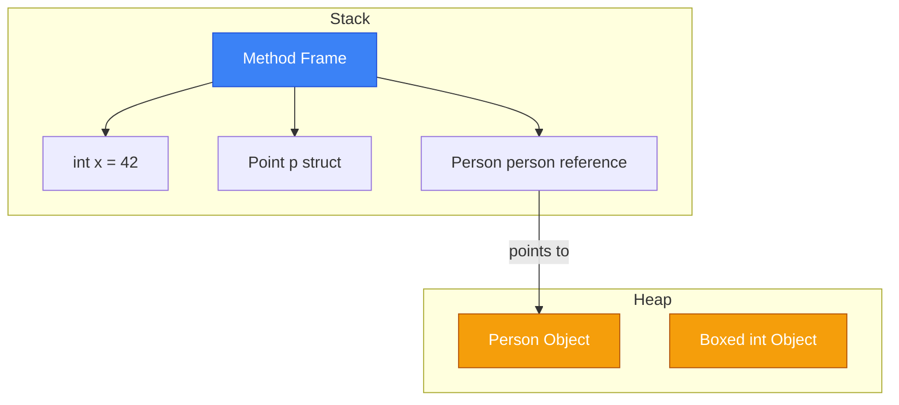
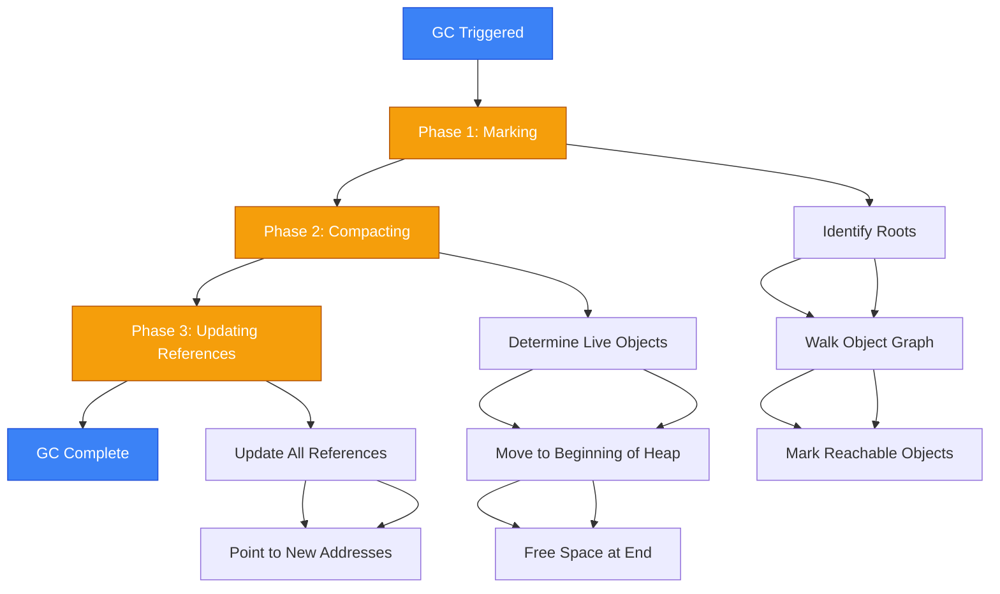
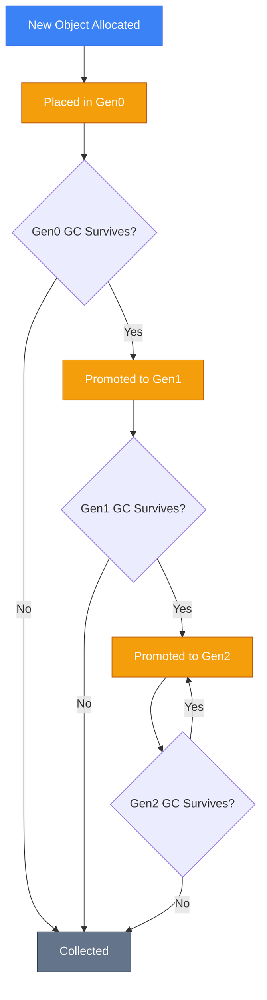
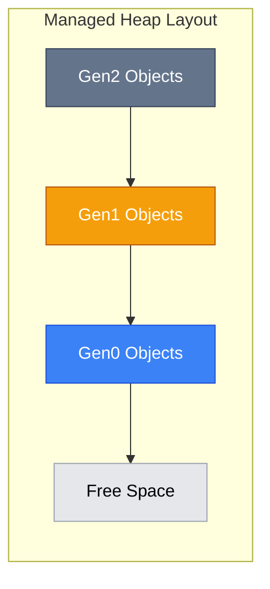
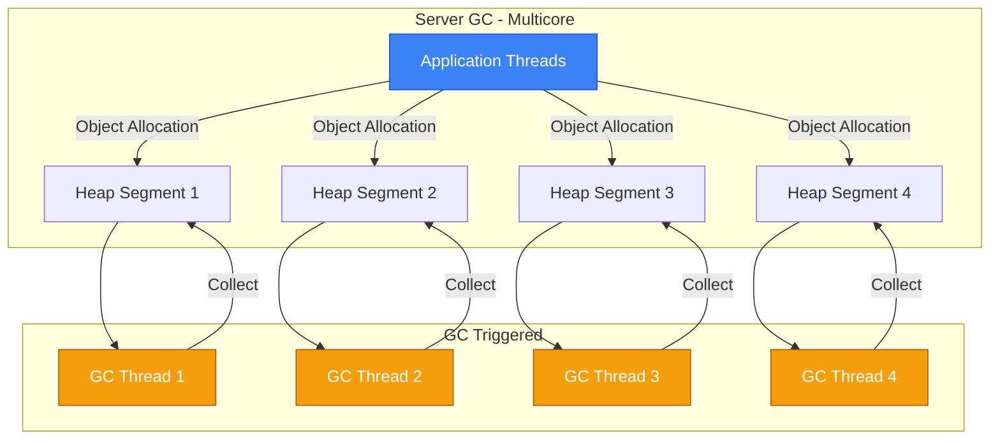
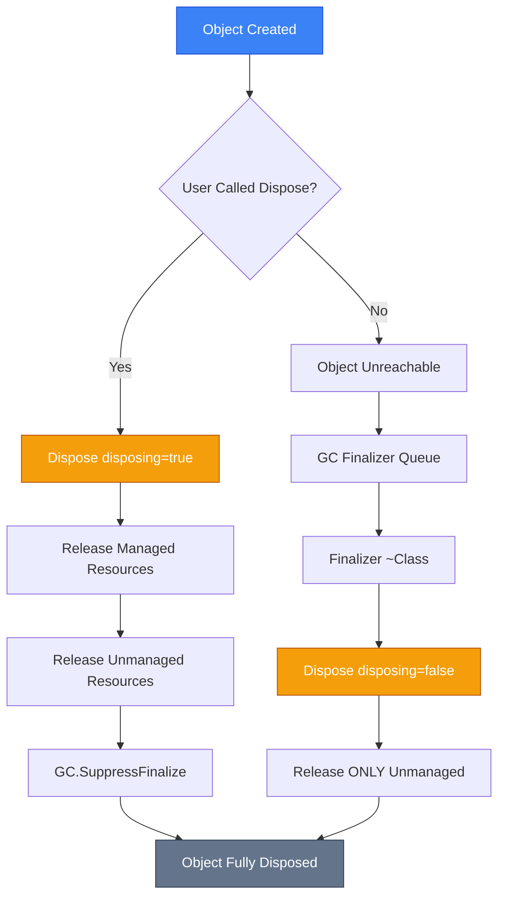

# Memory Management (Управління Пам'яттю)

## Вступ та Контекст

### Проблема: Чому автоматичне управління пам'яттю?

Уявіть, що ви пишете програму на C або C++. Ви виділяєте пам'ять за допомогою `malloc()` або `new`, працюєте з нею, а потім... забуваєте її звільнити. Результат? **Memory leak (витік пам'яті)**. Ваша програма поступово споживає все більше пам'яті, поки операційна система не вирішить припинити цей хаос.

З іншого боку, якщо ви звільните пам'ять надто рано або двічі, ви отримаєте **dangling pointer (висячий вказівник)** та **undefined behavior** - ваша програма може впасти в будь-який момент, часто у найнесподіваніший.

```cpp
// C++ - ручне управління пам'яттю
int* CreateArray() {
    int* arr = new int[1000];
    // ... робота з масивом ...
    delete[] arr;  // Потрібно пам'ятати звільнити!
    return arr;    // ❌ ПОМИЛКА: повертаємо dangling pointer
}

void ProcessData() {
    int* data = new int[500];
    // ... складна логіка ...
    if (error) {
        return;  // ❌ Memory leak - забули delete[]
    }
    delete[] data;
}
```

::warning
**Статистика помилок**: За дослідженнями Microsoft, близько 70% вразливостей безпеки в програмному забезпеченні пов'язані з помилками управління пам'яттю (use-after-free, buffer overflows, memory corruption).
::

### Еволюція: Від Manual до Automatic

**1990-ті роки**: Мови програмування вимагали ручного управління пам'яттю. Розробники витрачали значну частину часу на відлагодження memory leaks та crashes.

**1995 рік - Java**: Представила Garbage Collection як стандарт для enterprise-додатків. Продуктивність розробки зросла, але з'явився overhead на runtime.

**2002 рік - .NET Framework 1.0**: Microsoft інтегрувала покоління GC (Generational Garbage Collector) з оптимізаціями для різних сценаріїв.

**2010+ роки**: Continuous improvements - Server GC, Background GC, LOH compaction, і з .NET 5+ навіть Pinned Object Heap (POH).

::tip
**Філософія .NET**: "Безпека та продуктивність разом". Автоматичне управління пам'яттю забезпечує memory safety без критичної втрати швидкості завдяки розумним алгоритмам та оптимізаціям JIT.
::

### Що ви дізнаєтесь

Після цього розділу ви зможете:

-   🧠 **Розуміти архітектуру**: Як CLR організовує managed heap, що таке покоління, чому існує LOH/SOH/POH
-   🔍 **Аналізувати "під капотом"**: Як працює marking-sweeping-compaction, що відбувається під час GC
-   🛡️ **Управляти неkerованими ресурсами**: Правильно реалізовувати `IDisposable`, розуміти різницю між Dispose та Finalizer
-   ⚡ **Оптимізувати продуктивність**: Знати, коли використовувати `WeakReference`, як уникати LOH фрагментації, як налаштувати GC mode
-   🔬 **Розбиратись у memory layout**: Розуміти структуру об'єктів у пам'яті, padding, alignment, overhead

### Prerequisites (Передумови)

Перед вивченням цієї теми переконайтесь, що ви розумієте:

-   ✅ [Value Types vs Reference Types](/csharp/fundamentals/variables-data-types#value-reference-types)
-   ✅ [Stack vs Heap](/csharp/fundamentals/variables-data-types#memory-allocation)
-   ✅ [Classes and Objects](/csharp/oop/classes-objects)
-   ✅ Базові концепції ООП (наслідування, інтерфейси)

---

## Фундаментальні Концепції

### Managed Heap (Керована Купа)

Коли ваш .NET додаток стартує, CLR (Common Language Runtime) резервує непрерывну область віртуальної пам'яті, яка називається **managed heap**. Це не фізична пам'ять, а віртуальний адресний простір, який операційна система виділяє процесу.

::mermaid


::

#### Як працює алокація

Managed heap підтримує **allocation pointer** (вказівник на наступну вільну позицію). Коли ви створюєте новий об'єкт:

```csharp
var person = new Person("John", 30);
```

CLR виконує наступні кроки:

::steps

### Крок 1: Обчислення розміру

Визначається скільки байтів потрібно для об'єкта:

-   Object header (8-16 байт залежно від платформи)
-   Method table pointer (4-8 байт)
-   Розмір всіх полів екземпляра
-   Padding для alignment

### Крок 2: Перевірка доступного простору

CLR перевіряє, чи є достатньо місця від поточного allocation pointer до кінця Gen0.

### Крок 3: Розміщення об'єкта

Якщо місце є:

-   Об'єкт копіюється за адресою allocation pointer
-   Allocation pointer зміщується на розмір об'єкта
-   Повертається референс на новий об'єкт

### Крок 4: Тригер GC (якщо потрібно)

Якщо місця недостатньо, спрацьовує Garbage Collection для звільнення пам'яті.
::

```csharp
// Псевдокод роботи CLR при алокації
object AllocateObject(Type type)
{
    int size = CalculateSize(type);  // Розмір з header + fields + padding

    if (allocationPointer + size > gen0End)
    {
        // Недостатньо місця - запускаємо GC
        GC.Collect(0);  // Збираємо Gen0

        if (allocationPointer + size > gen0End)
        {
            // Все ще недостатньо - розширюємо heap
            ExpandHeap();
        }
    }

    // Розміщуємо об'єкт
    void* address = allocationPointer;
    InitializeObject(address, type);
    allocationPointer += size;

    return (object)address;
}
```

::note
**Швидкість алокації**: У managed heap алокація об'єкта - це просто додавання значення до вказівника, що майже так само швидко, як алокація на стеку! Це контрастує з `malloc()` у C, який повинен шукати вільний блок у складних структурах даних.
::

### Stack vs Heap: Детальне Порівняння

| Характеристика        | Stack (Стек)                                    | Heap (Купа)                                            |
| :-------------------- | :---------------------------------------------- | :----------------------------------------------------- |
| **Що зберігається**   | Value types, локальні змінні, параметри методів | Reference types (об'єкти класів, масиви, strings)      |
| **Розмір**            | Обмежений (1-4 MB за замовчуванням)             | Обмежений тільки доступною RAM та віртуальною пам'яттю |
| **Швидкість доступу** | Дуже швидко (CPU cache-friendly)                | Повільніше (потрібна індирекція через референс)        |
| **Час життя**         | До завершення методу (scope-based)              | До збору GC (недосяжні об'єкти)                        |
| **Алокація**          | Переміщення stack pointer                       | Переміщення allocation pointer + можливий GC           |
| **Деалокація**        | Автоматично при виході з scope                  | Автоматично GC (недетерміновано)                       |
| **Фрагментація**      | Неможлива (LIFO структура)                      | Можлива (розв'язується compaction)                     |
| **Thread safety**     | Кожен thread має свій stack                     | Shared між threads (потрібна синхронізація)            |

```csharp {1,4,9,12} showLineNumbers
void StackVsHeapDemo()
{
    // Stack: value type
    int x = 42;  // 4 байти на стеку

    // Stack: struct (якщо не boxed)
    Point p = new Point(10, 20);  // 8 байт на стеку

    // Heap: reference type
    Person person = new Person();  // Референс (4/8 байт) на стеку
                                    // Об'єкт на heap

    // Heap: boxing
    object boxedX = x;  // Створює об'єкт на heap з значенням 42

} // <-- При виході: stack очищується автоматично
  //     Heap об'єкти стають eligible for GC
```

::mermaid



::

### Value Types vs Reference Types у Контексті Пам'яті

#### Value Types (Типи Значень)

Зберігаються **inline** - безпосередньо там, де оголошені:

```csharp
struct Point
{
    public int X;  // 4 байти
    public int Y;  // 4 байти
    // Загалом: 8 байт
}

class Container
{
    public int id;        // 4 байти inline в об'єкті
    public Point point;   // 8 байт inline в об'єкті
    // Загалом в об'єкті: Object Header + MethodTable + 4 + 8 = ~28-40 байт
}

void Method()
{
    Point p;  // 8 байт на стеку
    Container c = new Container();  // Референс на стеку, об'єкт на heap
}
```

#### Reference Types (Типи Посилань)

Зберігаються тільки на heap. Змінна містить **референс** (адресу):

```csharp
class Person
{
    public string Name;  // Референс на string (який теж на heap)
    public int Age;      // 4 байти inline
}

Person p1 = new Person();  // Heap: Person об'єкт
Person p2 = p1;            // Stack: обидві змінні вказують на ОДИН об'єкт

p2.Age = 30;
Console.WriteLine(p1.Age);  // 30 - змінили через p2, але p1 бачить зміни!
```

::warning
**Типова помилка**: Програмісти, які прийшли з C/C++, часто плутають референси в C# з вказівниками. Референси в C# безпечніші - ви не можете виконувати pointer arithmetic, і вони завжди вказують на валідний об'єкт або `null`.
::

### Boxing та Unboxing: Вплив на GC

**Boxing** - це процес перетворення value type у reference type (алокація на heap).

```csharp
int value = 42;           // Stack: 4 байти
object boxed = value;     // Heap: створюється об'єкт Int32 з value 42
                          // Stack: референс на цей об'єкт

// Unboxing - зворотній процес
int unboxed = (int)boxed; // Копіювання значення з heap на stack
```

::mermaid

```mermaid
sequenceDiagram
    participant Stack
    participant Heap as Managed Heap
    participant GC as Garbage Collector

    Note over Stack: int value = 42
    Stack->>Stack: Allocate 4 bytes

    Note over Stack,Heap: object boxed = value
    Stack->>Heap: Request boxing
    Heap->>Heap: Allocate Int32 object
    Heap->>Heap: Copy value 42
    Heap-->>Stack: Return reference

    Note over GC: Boxed object тепер під управлінням GC

    Note over Stack: int unboxed = (int)boxed
    Stack->>Heap: Read value from boxed object
    Heap-->>Stack: Copy value 42

    Note over GC: Якщо немає інших refs до boxed<br/>об'єкт eligible for collection

    style Stack fill:#3b82f6,stroke:#1d4ed8,color:#ffffff
    style Heap fill:#f59e0b,stroke:#b45309,color:#ffffff
    style GC fill:#64748b,stroke:#334155,color:#ffffff
```

::

**Performance implications**:

```csharp
// ❌ Погано: Boxing у циклі
List<object> items = new List<object>();
for (int i = 0; i < 10000; i++)
{
    items.Add(i);  // 10000 boxing операцій = 10000 heap алокацій!
}

// ✅ Добре: Використання generic колекції
List<int> items = new List<int>();
for (int i = 0; i < 10000; i++)
{
    items.Add(i);  // Без boxing, зберігається inline
}
```

::tip
**Коли відбувається boxing:**

-   Присвоєння value type до `object` або `interface`
-   Виклик `ToString()`, `GetHashCode()`, `Equals()` на value type
-   Використання value type у non-generic колекціях (`ArrayList`, `Hashtable`)
-   LINQ запити над collections value types (якщо не оптимізовані)
    ::

---

## Garbage Collection: Серце Автоматичного Управління

### Що таке Garbage Collector?

**Garbage Collector (GC)** - це компонент CLR, який автоматично керує пам'яттю у managed heap. Його основні завдання:

1. **Визначити недосяжні об'єкти** (garbage)
2. **Звільнити пам'ять**, яку вони займають
3. **Компактувати heap** для ефективного використання пам'яті

::note
**Термінологія**: Об'єкт вважається "garbage" (сміттям), якщо до нього немає жодних "живих" посилань від roots (локальні змінні, статичні поля, CPU registers, finalization queue).
::

### Фази Garbage Collection

GC працює у три основні фази:

::mermaid



::

#### Phase 1: Marking (Маркування)

GC проходить граф об'єктів, починаючи з **roots** та позначає всі досяжні об'єкти:

```csharp
class Node
{
    public Node Next;
    public string Data;
}

void Example()
{
    Node head = new Node { Data = "A" };  // Root
    head.Next = new Node { Data = "B" };
    head.Next.Next = new Node { Data = "C" };
    Node orphan = new Node { Data = "X" };  // Недосяжний після наступного рядка
    orphan = null;

    // GC marking:
    // 1. Знайти roots: head (локальна змінна)
    // 2. Маркувати Node "A" як reachable
    // 3. Слідувати за Next, маркувати "B"
    // 4. Слідувати за Next, маркувати "C"
    // 5. Node "X" не маркований -> garbage
}
```

**Roots включають:**

-   Локальні змінні у активних методах (на stack)
-   Статичні поля
-   CPU registers
-   GC handles
-   Finalization queue

#### Phase 2: Compacting (Компактування)

Після marking GC **переміщує** всі живі об'єкти до початку heap, усуваючи фрагментацію:

```
Before Compaction:
[Obj A][    ][Obj B][        ][Obj C][    ]
 ^live  ^dead ^live   ^dead   ^live  ^dead

After Compaction:
[Obj A][Obj B][Obj C][                    ]
                      ^ Free space for new objects
```

::warning
**Performance Impact**: Compaction вимагає копіювання об'єктів у пам'яті та оновлення всіх посилань. Це може бути expensive операція для великих heaps, тому GC використовує покоління для оптимізації.
::

#### Phase 3: Updating References (Оновлення Посилань)

Після переміщення об'єктів GC оновлює всі посилання на нові адреси:

```csharp
// До compaction
Node n1 = /* 0x1000 */;
Node n2 = /* 0x2000 */;
n1.Next = n2;  // Next вказує на 0x2000

// Після compaction
// n2 переміщений на 0x1100
// GC автоматично оновлює:
n1.Next = /* тепер 0x1100 */;
```

### Покоління (Generations): Оптимізація через Спостереження

#### Generational Hypothesis (Гіпотеза Поколінь)

.NET GC базується на емпіричному спостереженні:

> **Більшість об'єктів живуть дуже коротко, а ті що виживають - живуть довго.**

Це означає:

-   🆕 Нещодавно створені об'єкти швидше за все стануть garbage
-   ⏳ Об'єкти, які пережили декілька GC циклів, ймовірно будуть жити довго

На основі цього спостереження .NET використовує **три покоління**:

| Покоління | Призначення           | Типові Об'єкти                                  | Частота Збору  |
| :-------- | :-------------------- | :---------------------------------------------- | :------------- |
| **Gen0**  | Молоді об'єкти        | Тимчасові змінні, буфери, короткоживучі об'єкти | Дуже часто     |
| **Gen1**  | Буфер між Gen0 і Gen2 | Об'єкти середньої тривалості життя              | Рідше ніж Gen0 |
| **Gen2**  | Старі об'єкти         | Статичні дані, довгоживучі об'єкти, кеші        | Рідко          |

::mermaid



::

#### Generation 0 (Gen0): Ясла для Об'єктів

**Характеристики:**

-   📏 **Розмір**: Зазвичай 256 KB - 4 MB (залежить від платформи та налаштувань)
-   ⚡ **Швидкість**: Найшвидший збір (мілісекунди)
-   📊 **Частота**: Найчастіше (може бути десятки разів на секунду у high-load додатках)

```csharp
void Gen0Example()
{
    for (int i = 0; i < 1000; i++)
    {
        // Кожна ітерація створює об'єкти у Gen0
        var temp = new StringBuilder();
        temp.Append("Temporary data ");
        temp.Append(i);
        string result = temp.ToString();

        // temp та проміжні string об'єкти стають garbage
        // після завершення ітерації
    }
    // Під час циклу може статися декілька Gen0 collections
}
```

**Коли спрацьовує Gen0 GC:**

1. Gen0 budget вичерпано (досягнуто ліміт розміру)
2. Явний виклик `GC.Collect(0)`
3. Системі бракує пам'яті (low memory notification)

::code-group

```csharp [Demo: Gen0 Pressure]
class Gen0PressureDemo
{
    static void Main()
    {
        // Відслідковуємо GC події
        int gen0Before = GC.CollectionCount(0);

        // Створюємо багато короткоживучих об'єктів
        for (int i = 0; i < 100_000; i++)
        {
            var obj = new byte[1024];  // 1 KB об'єкт
            // obj стає garbage одразу після ітерації
        }

        int gen0After = GC.CollectionCount(0);

        Console.WriteLine($"Gen0 collections: {gen0After - gen0Before}");
        // Вивід: Gen0 collections: 25 (приблизно, залежить від heap size)
    }
}
```

```csharp [Check Generation]
class CheckGeneration
{
    static void Main()
    {
        var obj = new object();

        // Щойно створений - в Gen0
        Console.WriteLine($"Generation: {GC.GetGeneration(obj)}");  // 0

        // Викликаємо GC - об'єкт виживає
        GC.Collect();
        Console.WriteLine($"Generation: {GC.GetGeneration(obj)}");  // 1

        // Ще раз - промоція до Gen2
        GC.Collect();
        Console.WriteLine($"Generation: {GC.GetGeneration(obj)}");  // 2

        // Далі об'єкт залишається в Gen2
        GC.Collect();
        Console.WriteLine($"Generation: {GC.GetGeneration(obj)}");  // 2
    }
}
```

::

#### Generation 1 (Gen1): Проміжна Зона

**Призначення**: Gen1 діє як **буфер** між часто зібраним Gen0 та рідко зібраним Gen2.

**Характеристики:**

-   📏 **Розмір**: Більший ніж Gen0, але менший ніж Gen2 (зазвичай кілька MB)
-   ⚡ **Швидкість**: Швидше ніж Gen2, повільніше ніж Gen0
-   📊 **Частота**: Середня - збирається коли Gen0 збір не звільнив достатньо пам'яті

```csharp
class Gen1Scenario
{
    private List<string> _cache = new List<string>();

    void ProcessRequests()
    {
        for (int i = 0; i < 100; i++)
        {
            string data = FetchData(i);  // Gen0

            // Деякі дані кешуються - виживуть Gen0 GC
            if (i % 10 == 0)
            {
                _cache.Add(data);  // Переміститься до Gen1, потім Gen2
            }

            ProcessData(data);  // Більшість data стане garbage в Gen0
        }
    }
}
```

**Коли спрацьовує Gen1 GC:**

-   Коли Gen0 GC не звільнило достатньо пам'яті
-   Виклик `GC.Collect(1)` - збере Gen0 та Gen1
-   Gen1 budget вичерпано

::note
**Оптимізація**: GC рідше збирає Gen1, тому що:

1. Більшість garbage вже зібрано в Gen0
2. Об'єкти в Gen1 мають вищу ймовірність використання
3. Вартість збору Gen1 вища через більший розмір
   ::

#### Generation 2 (Gen2): Довгожителі

**Характеристики:**

-   📏 **Розмір**: Може бути гігабайти
-   ⚡ **Швидкість**: Найповільніший збір (може бути десятки-сотні мілісекунд)
-   📊 **Частота**: Рідко - тільки при дефіциті пам'яті

**Типові об'єкти в Gen2:**

-   Статичні колекції та кеші
-   Singleton instances
-   Глобальні налаштування
-   Довгоживучі сервіси

```csharp
// Статичний кеш - швидко потрапить у Gen2
public static class ApplicationCache
{
    // Ці об'єкти будуть жити весь час роботи додатку
    private static Dictionary<string, UserProfile> _userCache
        = new Dictionary<string, UserProfile>();

    private static ConnectionPool _connections = new ConnectionPool();

    // Gen2 об'єкти!
}

// Singleton - також Gen2
public class ConfigurationManager
{
    private static readonly Lazy<ConfigurationManager> _instance =
        new Lazy<ConfigurationManager>(() => new ConfigurationManager());

    public static ConfigurationManager Instance => _instance.Value;  // Gen2
}
```

**Full GC (Gen2 Collection):**

Коли CLR збирає Gen2, відбувається **Full GC** - збір всіх поколінь (Gen0, Gen1, Gen2):

```csharp
void FullGCDemo()
{
    Console.WriteLine("Before GC:");
    Console.WriteLine($"Gen0: {GC.CollectionCount(0)}");
    Console.WriteLine($"Gen1: {GC.CollectionCount(1)}");
    Console.WriteLine($"Gen2: {GC.CollectionCount(2)}");

    // Full GC - збере всі покоління
    GC.Collect(2, GCCollectionMode.Forced, blocking: true, compacting: true);

    Console.WriteLine("\nAfter Full GC:");
    Console.WriteLine($"Gen0: {GC.CollectionCount(0)}");  // +1
    Console.WriteLine($"Gen1: {GC.CollectionCount(1)}");  // +1
    Console.WriteLine($"Gen2: {GC.CollectionCount(2)}");  // +1
}
```

::warning
**Performance Warning**: Full GC - це дорога операція! Він:

-   Зупиняє всі application threads (Stop-The-World pause)
-   Сканує весь managed heap
-   Може компактувати великі об'єми пам'яті
-   Може тривати 100ms+ для великих heaps (4+ GB)

Уникайте частих Full GC! Моніторьте через Performance Counters або `GC.CollectionCount(2)`.
::

#### Promotion (Просування між Поколіннями)

Об'єкти **не переміщуються** між поколіннями фізично при кожному GC. Натомість GC відслідковує boundaries (межі) між поколіннями:

::mermaid



::

**Механізм promotion:**

```
Initial State:
[Gen2][Gen1][Gen0: Obj A | Obj B | Obj C][Free]
              ^live   ^dead  ^live

After Gen0 GC:
[Gen2][Gen1: Obj A | Obj C][Gen0][Free]
     Gen1 boundary moved ↑

After Another Gen0+Gen1 GC (Obj A та C survive):
[Gen2: Obj A | Obj C][Gen1][Gen0][Free]
     Gen2 boundary moved ↑
```

**Важливо:** Promotion не вимагає копіювання - просто оновлюються generation boundaries. Це робить процес дуже ефективним.

::tip
**Профілювання**: Використовуйте dotMemory, PerfView або Visual Studio Profiler для аналізу, які об'єкти досягають Gen2. Якщо багато короткоживучих об'єктів потрапляють у Gen2, це може вказувати на проблему (наприклад, тримання посилань на тимчасові об'єкти).
::

---

### Large Object Heap (LOH) vs Small Object Heap (SOH)

#### Чому LOH Існує?

Компактування великих об'єктів (>85,000 байт) **дороге** з точки зору CPU:

-   Копіювання мегабайтів даних
-   Оновлення всіх посилань

Тому .NET розділяє heap на дві частини:

| Характеристика      | SOH (Small Object Heap)         | LOH (Large Object Heap)                 |
| :------------------ | :------------------------------ | :-------------------------------------- |
| **Розмір об'єктів** | < 85,000 байт                   | ≥ 85,000 байт                           |
| **Компактування**   | Завжди (за замовчуванням)       | Ніколи (за замовчуванням до .NET 4.5.1) |
| **Покоління**       | Gen0, Gen1, Gen2                | Тільки Gen2                             |
| **Алокація**        | Sequential (послідовно)         | Free list (пошук вільного блоку)        |
| **Фрагментація**    | Мінімальна (завдяки compaction) | Можлива (без compaction)                |

#### Поріг 85,000 Байт

```csharp
// SOH - малий об'єкт
byte[] small = new byte[84_999];  // Розташується в SOH
Console.WriteLine(GC.GetGeneration(small));  // 0 (Gen0)

// LOH - великий об'єкт
byte[] large = new byte[85_000];  // Розташується в LOH
Console.WriteLine(GC.GetGeneration(large));  // 2 (LOH завжди Gen2)
```

::note
**Чому саме 85,000?** Це емпірично визначене значення Microsoft. Компактування об'єктів більше цього розміру стає неефективним через витрати на копіювання пам'яті. Число 85,000 = 85 KB приблизно відповідає розміру, де overhead копіювання перевищує вигоду від уникнення фрагментації.
::

#### Проблема: Фрагментація LOH

LOH використовує **free list allocation** - пошук вільного блоку достатнього розміру:

```
LOH Before Allocation:
[Large Obj A: 100KB][Free: 50KB][Obj B: 200KB][Free: 150KB][Obj C: 80KB]

Allocate 120KB object:
Need 120KB, but largest free block is 150KB
[Obj A][Free][Obj B][New Obj: 120KB][Free: 30KB][Obj C]

Проблема: free block 50KB може ніколи не бути використаний,
якщо всі нові об'єкти >50KB
```

**Наслідки фрагментації:**

-   Неефективне використання пам'яті
-   `OutOfMemoryException` навіть при достатній загальній вільній пам'яті
-   Погіршення performance через пошук вільних блоків

::code-group

```csharp [LOH Fragmentation Demo]
class LOHFragmentationDemo
{
    static void Main()
    {
        List<byte[]> allocated = new List<byte[]>();

        // Алокуємо багато великих об'єктів
        for (int i = 0; i < 100; i++)
        {
            allocated.Add(new byte[100_000]);  // 100 KB
        }

        // Звільняємо кожен другий
        for (int i = 0; i < allocated.Count; i += 2)
        {
            allocated[i] = null;
        }

        // Тепер LOH фрагментований:
        // [Obj][Free 100KB][Obj][Free 100KB][Obj]...

        GC.Collect(2, GCCollectionMode.Forced);

        // Спробуємо алокувати об'єкт більше ніж 100KB
        try
        {
            var huge = new byte[150_000];  // Може зайняти час через пошук
        }
        catch (OutOfMemoryException)
        {
            Console.WriteLine("LOH fragmented - cannot allocate!");
        }
    }
}
```

```csharp [Enable LOH Compaction]
class LOHCompactionDemo
{
    static void Main()
    {
        // За замовчуванням LOH не компактується
        Console.WriteLine($"LOH Compaction: {GCSettings.LargeObjectHeapCompactionMode}");
        // Default

        // Увімкнути компактування для наступного GC
        GCSettings.LargeObjectHeapCompactionMode =
            GCLargeObjectHeapCompactionMode.CompactOnce;

        // Виконати Full GC з компактуванням LOH
        GC.Collect(2, GCCollectionMode.Forced, blocking: true, compacting: true);

        // Після цього режим повертається до Default
        Console.WriteLine($"After GC: {GCSettings.LargeObjectHeapCompactionMode}");
        // Default
    }
}
```

::

::warning
**Коли НЕ компактувати LOH:**

-   Якщо є pinned об'єкти в LOH (компактування неможливе)
-   У real-time додатках, де паузи GC критичні
-   Якщо LOH рідко фрагментується (проаналізуйте metrics)

**Коли компактувати:**

-   Після масового звільнення великих об'єктів
-   При виявленні фрагментації (OutOfMemoryException при достатній пам'яті)
-   У batch processes чи під час maintenance windows
    ::

#### Pinned Object Heap (POH) - .NET 5+

З **.NET 5** додано нове покоління - **Pinned Object Heap**:

**Призначення:** Зберігання pinned об'єктів окремо від SOH/LOH для уникнення фрагментації.

**Що таке Pinned Objects?**

```csharp
unsafe void PinningExample()
{
    byte[] buffer = new byte[1000];

    // Pinning - фіксуємо об'єкт у пам'яті (не може бути переміщений GC)
    fixed (byte* ptr = buffer)
    {
        // Викликаємо native функцію, яка очікує вказівник
        NativeApi.ProcessData(ptr, buffer.Length);

        // Під час цього buffer НЕ МОЖЕ бути переміщений compaction!
    }
    // Після виходу з fixed, об'єкт unpinned
}

// Альтернатива: GCHandle
void PinWithGCHandle()
{
    byte[] buffer = new byte[1000];

    GCHandle handle = GCHandle.Alloc(buffer, GCHandleType.Pinned);
    try
    {
        IntPtr ptr = handle.AddrOfPinnedObject();
        NativeApi.ProcessData(ptr, buffer.Length);
    }
    finally
    {
        handle.Free();  // Unpinning
    }
}
```

**Проблема з pinned об'єктами в SOH:**

```
Heap перед GC compaction:
[Obj A][Pinned B][Obj C][Free]

Compaction неможливий для B, тому:
[Obj A][Pinned B][  ][Obj C][Free]
              ↑ gap - фрагментація!
```

**POH вирішення:**

```
SOH:  [Obj A][Obj C][Free]  ← Може бути компактований
POH:  [Pinned B][Pinned D]  ← Окремий heap для pinned об'єктів
```

::tip
**Best Practice**: Використовуйте `GC.AllocateArray<T>` для створення pinned масивів напряму в POH:

```csharp
// .NET 5+
byte[] pinnedBuffer = GC.AllocateArray<byte>(1000, pinned: true);

// Цей масив відразу у POH, не потребує GCHandle!
```

::

**Порівняння Heaps:**

| Heap              | Розмір Об'єктів | Compaction | Покоління | Use Case                   |
| :---------------- | :-------------- | :--------- | :-------- | :------------------------- |
| **SOH**           | < 85 KB         | Так        | Gen0/1/2  | Звичайні об'єкти           |
| **LOH**           | ≥ 85 KB         | За запитом | Gen2      | Великі буфери, масиви      |
| **POH** (.NET 5+) | Будь-який       | Ні         | Gen2      | Pinned об'єкти для interop |

---

### Типи Garbage Collection

.NET надає різні режими роботи GC для різних сценаріїв використання.

#### Workstation GC (Десктопний Режим)

**Призначення**: Оптимізований для клієнтських додатків (desktop, mobile).

**Характеристики:**

-   🖥️ Виконується на **тому ж треді**, що і application code
-   ⏱️ Мінімізація **пауз** (низька latency)
-   💡 Менше споживання пам'яті
-   🔄 Підтримує **concurrent/background GC** (за замовчуванням)

**Конфігурація:**

::code-group

```xml [.csproj]
<PropertyGroup>
    <ServerGarbageCollection>false</ServerGarbageCollection>
</PropertyGroup>
```

```json [runtimeconfig.json]
{
    "runtimeOptions": {
        "configProperties": {
            "System.GC.Server": false
        }
    }
}
```

::

**Use Case:**

```csharp
// WPF/WinForms Desktop Application
public partial class MainWindow : Window
{
    // Workstation GC - низькі паузи для responsive UI
    private async void LoadData_Click(object sender, RoutedEventArgs e)
    {
        // GC може відбутись під час роботи,
        // але паузи короткі -> UI responsive
        var data = await DataService.FetchLargeDataset();
        DataGrid.ItemsSource = data;
    }
}
```

---

#### Server GC (Серверний Режим)

**Призначення**: Оптимізований для високопродуктивних серверних додатків.

**Характеристики:**

-   🚀 **Багатопоточний GC** - по одному треду на кожне logical core
-   ⚡ Вищий **throughput** (більше операцій за одиницю часу)
-   💾 Використовує **більше пам'яті** (кожен тред має свій heap segment)
-   ⏳ Потенційно **довші паузи**, але рідше

**Як працює:**

::mermaid



::

**Конфігурація:**

```xml
<PropertyGroup>
    <ServerGarbageCollection>true</ServerGarbageCollection>

    <!-- Опціонально: кількість GC heaps (за замовчуванням = logical cores) -->
    <GCHeapCount>8</GCHeapCount>
</PropertyGroup>
```

**Use Case:**

```csharp
// ASP.NET Core Web API
public class OrdersController : ControllerBase
{
    // Server GC - throughput важливіший за latency
    [HttpPost]
    public async Task<IActionResult> ProcessBulkOrders([FromBody] List<Order> orders)
    {
        // Обробка тисяч orders паралельно
        var tasks = orders.Select(ProcessOrder);
        await Task.WhenAll(tasks);

        // Server GC ефективно працює з багатопотоковим навантаженням
        return Ok();
    }
}
```

**Порівняльна Таблиця:**

| Характеристика         | Workstation GC                    | Server GC                         |
| :--------------------- | :-------------------------------- | :-------------------------------- |
| **Threads**            | Один GC thread                    | По thread на кожне core           |
| **Heap Segments**      | Один сегмент                      | Кілька сегментів (per core)       |
| **Latency (Паузи)**    | Короткі                           | Потенційно довші                  |
| **Throughput**         | Нижчий                            | Вищий (до 2-3x)                   |
| **Memory Consumption** | Менше                             | Більше (~20-30% більше)           |
| **Best For**           | UI додатки, клієнтські застосунки | Web серверы, background processes |
| **Overhead**           | Мінімальний                       | Вищий через multiple heaps        |

::tip
**Як вибрати?**

-   **Workstation GC**: WPF, WinForms, Xamarin, Blazor WASM, short-lived processes
-   **Server GC**: ASP.NET Core, Worker Services, batch processors, long-running services

**Правило**: Якщо у вас >4 cores і застосунок обробляє багато requests - використовуйте Server GC.
::

---

#### Background GC (Concurrent GC)

**Background GC** (раніше відомий як Concurrent GC) дозволяє application threads продовжувати роботу під час Gen2 collection.

**Як працює:**

::mermaid

```mermaid
sequenceDiagram
    participant App as Application Threads
    participant BG as Background GC Thread
    participant Heap as Managed Heap

    Note over App: Working normally
    App->>Heap: Allocate objects

    Note over BG: Gen2 GC Triggered
    BG->>BG: Suspend app threads briefly
    BG->>Heap: Mark roots
    BG->>BG: Resume app threads

    par Background Collection
        App->>Heap: Continue allocating
    and
        BG->>Heap: Mark objects (concurrent)
    end

    BG->>BG: Suspend app threads
    BG->>Heap: Final marking & compaction
    BG->>BG: Resume app threads

    Note over App: Minimal pause experienced

    style App fill:#3b82f6,stroke:#1d4ed8,color:#ffffff
    style BG fill:#f59e0b,stroke:#b45309,color:#ffffff
```

::

**Фази Background GC:**

1. **Initial Suspend** (~1-5ms): Зупинити app threads, зібрати roots
2. **Concurrent Marking** (основна частина): App threads працюють, GC маркує об'єкти паралельно
3. **Final Suspend** (~10-50ms): Фінальне маркування нових об'єктів та compaction

**Конфігурація:**

```xml
<PropertyGroup>
    <!-- За замовчуванням увімкнено, але можна вимкнути -->
    <ConcurrentGarbageCollection>true</ConcurrentGarbageCollection>
</PropertyGroup>
```

**Вимкнути Background GC:**

```csharp
// У коді (до запуску GC):
System.Runtime.GCSettings.LatencyMode = GCLatencyMode.Batch;
// Batch mode - без background, компактує агресивніше
```

**Переваги:**

-   ✅ Менші паузи для application
-   ✅ Краща responsiveness
-   ✅ Підходить для UI та interactive додатків

**Недоліки:**

-   ❌ Додатковий CPU overhead
-   ❌ Більше споживання пам'яті під час GC
-   ❌ Не гарантує мінімальних пауз для Gen0/Gen1

::note
**Background GC та Generations**: Background GC застосовується тільки до Gen2. Gen0 та Gen1 все ще збираються в "stop-the-world" режимі, але вони дуже швидкі (<1ms зазвичай).
::

---

### GC Triggers (Тригери Збирання)

#### 1. Allocation Budget Вичерпано

Найчастіша причина - вичерпано budget (ліміт розміру) для покоління:

```csharp
void AllocateTillGC()
{
    int collectionsBefore = GC.CollectionCount(0);

    // Продовжуємо алокувати, поки не спрацює Gen0 GC
    while (GC.CollectionCount(0) == collectionsBefore)
    {
        var obj = new byte[1024];  // 1 KB
        // Gen0 budget зменшується...
    }

    Console.WriteLine("Gen0 GC triggered!");
}
```

**Як CLR визначає budget:**

-   Gen0: Залежить від heap size та історії GC
-   Динамічно адаптується (якщо багато garbage - збільшує budget)
-   Зазвичай 256 KB - 4 MB для Gen0

---

#### 2. Явний Виклик GC.Collect()

```csharp
// ❌ ПОГАНА практика у більшості випадків
GC.Collect();

// Збір конкретного покоління
GC.Collect(0);  // Тільки Gen0
GC.Collect(1);  // Gen0 + Gen1
GC.Collect(2);  // Full GC (Gen0 + Gen1 + Gen2)

// З додатковими параметрами
GC.Collect(2,
    GCCollectionMode.Optimized,  // Оптимальний час для збору
    blocking: true,               // Чекати завершення
    compacting: true);            // З компактуванням
```

::warning
**Коли НЕ викликати GC.Collect():**

-   ❌ У production коді "на всякий випадок"
-   ❌ Після кожної операції з пам'яттю
-   ❌ Для "звільнення пам'яті" без реальної потреби
-   ❌ У performance-critical секціях

**Коли можна:**

-   ✅ Після завантаження великої кількості даних, які більше не потрібні
-   ✅ У tests для детермінованої поведінки
-   ✅ У batch процесах між етапами обробки
-   ✅ Після ініціалізації додатку (разом з Gen2 compacting)
    ::

---

#### 3. Low Memory Notification (Нестача Пам'яті)

ОС повідомляє CLR про низький рівень доступної пам'яті:

```csharp
// Симуляція: реєстрація на memory pressure
AppDomain.CurrentDomain.MonitoringIsEnabled = true;

void MonitorMemory()
{
    long before = GC.GetTotalMemory(forceFullCollection: false);

    // При низькому рівні пам'яті ОС повідомить CLR
    // CLR може викликати aggressive Gen2 GC

    long after = GC.GetTotalMemory(forceFullCollection: false);

    Console.WriteLine($"Memory: {before / 1024 / 1024} MB -> {after / 1024 / 1024} MB");
}
```

CLR отримує notifications через:

-   Windows: `CreateMemoryResourceNotification` / `QueryMemoryResourceNotification`
-   Linux: memory cgroups, `/proc/meminfo`

---

#### 4. No GC Region (Спеціальний Режим)

Можна запросити CLR **не викликати GC** протягом критичної секції:

```csharp
bool TryNoGCRegion()
{
    long totalMemory = 10 * 1024 * 1024;  // 10 MB budget

    try
    {
        // Запитуємо CLR: "Не викликай GC, поки є 10 MB"
        if (GC.TryStartNoGCRegion(totalMemory))
        {
            // Критична секція - GC не спрацює (якщо вистачить budget)
            PerformLatencySensitiveOperation();

            return true;
        }

        return false;
    }
    finally
    {
        if (GC.TryStartNoGCRegion(0))  // Перевірка, чи в no-gc режимі
            GC.EndNoGCRegion();
    }
}

void PerformLatencySensitiveOperation()
{
    // Наприклад: real-time audio processing, high-frequency trading
    for (int i = 0; i < 1000; i++)
    {
        ProcessFrame();  // Немає GC паузи!
    }
}
```

::caution
**Обмеження No-GC Region:**

-   Якщо budget вичерпано, CLR кине `InvalidOperationException`
-   Працює тільки для короткочасних операцій
-   Не підходить для довгих processes
-   Потребує accurate estimation бюджету пам'яті
    ::

---

### GC API та Моніторинг

#### Основні Методи GC Класу

::field-group
::field{name="GC.Collect()" type="void"}
Примусовий збір сміття. Параметри: `generation` (0-2), `mode`, `blocking`, `compacting`.
::

::field{name="GC.GetGeneration(object)" type="int"}
Повертає покоління об'єкта (0, 1, або 2).
::

::field{name="GC.GetTotalMemory(bool)" type="long"}
Повертає приблизну кількість байт у managed heap. Якщо `forceFullCollection=true`, виконується Full GC перед підрахунком.
::

::field{name="GC.CollectionCount(int)" type="int"}
Повертає кількість збірок для вказаного покоління з моменту запуску процесу.
::

::field{name="GC.WaitForPendingFinalizers()" type="void"}
Очікує завершення всіх finalizers у черзі. Використовується після `GC.Collect()` для гарантії, що finalizers виконались.
::

::field{name="GC.SuppressFinalize(object)" type="void"}
Вказує GC, що об'єкт не потребує фіналізації. Використовується у Dispose pattern.
::

::field{name="GC.ReRegisterForFinalize(object)" type="void"}
Повторно реєструє об'єкт для фіналізації (рідко використовується).
::

::field{name="GC.KeepAlive(object)" type="void"}
Гарантує, що об'єкт залишається досяжним до цього моменту в коді. Запобігає передчасному збору.
::

::field{name="GC.AddMemoryPressure(long)" type="void"}
Повідомляє GC про додаткове використання некерованої пам'яті. Збільшує ймовірність збору.
::

::field{name="GC.RemoveMemoryPressure(long)" type="void"}
Повідомляє GC про звільнення некерованої пам'яті.
::
::

**Приклад моніторингу:**

```csharp
class GCMonitor
{
    static void Main()
    {
        Console.WriteLine("=== GC Statistics ===\n");

        // Загальна пам'ять
        long totalMemory = GC.GetTotalMemory(forceFullCollection: false);
        Console.WriteLine($"Total Memory: {totalMemory / 1024 / 1024} MB");

        // Кількість збірок по поколіннях
        Console.WriteLine($"Gen0 Collections: {GC.CollectionCount(0)}");
        Console.WriteLine($"Gen1 Collections: {GC.CollectionCount(1)}");
        Console.WriteLine($"Gen2 Collections: {GC.CollectionCount(2)}");

        // Створюємо об'єкт і відслідковуємо його покоління
        var obj = new object();
        Console.WriteLine($"\nObject generation: {GC.GetGeneration(obj)}");

        GC.Collect();
        Console.WriteLine($"After GC(0): {GC.GetGeneration(obj)}");

        GC.Collect();
        Console.WriteLine($"After GC(1): {GC.GetGeneration(obj)}");

        // GC Settings
        Console.WriteLine($"\n=== GC Configuration ===");
        Console.WriteLine($"GC Mode: {(GCSettings.IsServerGC ? "Server" : "Workstation")}");
        Console.WriteLine($"Latency Mode: {GCSettings.LatencyMode}");
        Console.WriteLine($"LOH Compaction: {GCSettings.LargeObjectHeapCompactionMode}");

        // GC Max Generation
        Console.WriteLine($"Max Generation: {GC.MaxGeneration}");  // Зазвичай 2
    }
}
```

**Output:**

```
=== GC Statistics ===

Total Memory: 2 MB
Gen0 Collections: 0
Gen1 Collections: 0
Gen2 Collections: 0

Object generation: 0
After GC(0): 1
After GC(1): 2

=== GC Configuration ===
GC Mode: Workstation
Latency Mode: Interactive
LOH Compaction: Default
Max Generation: 2
```

---

## Некеровані Ресурси та Управління Ними

### Що таке Unman aged Resources?

**Unmanaged resources** (некеровані ресурси) - це ресурси операційної системи, які **не управляються Garbage Collector**:

::field-group
::field{name="File Handles" type="System.IO.FileStream"}
Дескриптори файлів, відкритих для читання/запису.
::

::field{name="Network Connections" type="System.Net.Sockets.Socket"}
TCP/UDP сокети, HTTP connections.
::

::field{name="Database Connections" type="System.Data.SqlClient.SqlConnection"}
З'єднання з базами дами.
::

::field{name="Native Memory" type="IntPtr, void\*"}
Пам'ять, виділена через `Marshal.AllocHGlobal()`, `malloc()` в C/C++.
::

::field{name="Window Handles (GDI Objects)" type="IntPtr"}
Вікна, brushes, pens, fonts в Windows API.
::

::field{name="COM Objects" type="System.Runtime.InteropServices.ComTypes"}
Component Object Model об'єкти для interop.
::

::field{name="Mutexes, Semaphores" type="System.Threading"}
Системні примітиви синхронізації.
::
::

### Чому GC Не Може Їх Очистити?

GC відповідає **тільки за managed heap**. Він не знає про:

-   Скільки пам'яті займає відкритий файл в kernel space
-   Чи потрібно викликати `close()` для сокета
-   Як звільнити native memory pointer

```csharp
class ProblematicCode
{
    void OpenFile()
    {
        FileStream fs = new FileStream("data.txt", FileMode.Open);
        byte[] buffer = new byte[1024];
        fs.Read(buffer, 0, buffer.Length);

        // ❌ ПОМИЛКА: Не закрили файл!
        // fs.Dispose() не викликано

    } // fs вийшов з scope, але FILE HANDLE ще відкритий!
      // GC зібере FileStream об'єкт, але handle залишиться!
}
```

**Наслідки:** File handle leak → через якийсь час ОС заборонить відкривати нові файли.

::warning
**Windows**: За замовчуванням процес може мати максимум ~10,000 handles. Якщо не закривати - досягнете ліміту та отримаєте `IOException: Too many open files`.

**Linux**: Ліміт можна перевірити: `ulimit -n`. Зазвичай 1024-65535.
::

---

## IDisposable Pattern: Правильне Управління Ресурсами

### Інтерфейс IDisposable

**IDisposable** - стандартний механізм .NET для явного звільнення ресурсів:

```csharp
public interface IDisposable
{
    void Dispose();
}
```

**Контракт:**

-   Метод `Dispose()` має звільнити **всі** некеровані ресурси
-   Після виклику `Dispose()` об'єкт стає **unusable** (не можна використовувати)
-   Можна викликати `Dispose()` **кілька разів** безпечно (idempotent)
-   `Dispose()` **не викликається автоматично** - відповідальність користувача класу

### Базова Реалізація

Найпростіший випадок - клас з одним unmanaged resource:

```csharp {8,11-14,17-19} showLineNumbers
class FileLogger : IDisposable
{
    private FileStream _fileStream;

    public FileLogger(string path)
    {
        _fileStream = new FileStream(path, FileMode.Append);
    }

    public void Dispose()
    {
        // Звільнити unmanaged resource
        _fileStream?.Dispose();
        _fileStream = null;
    }

    public void Log(string message)
    {
        if (_fileStream == null)
            throw new ObjectDisposedException(nameof(FileLogger));

        byte[] data = Encoding.UTF8.GetBytes(message + Environment.NewLine);
        _fileStream.Write(data, 0, data.Length);
    }
}

// Використання
using (var logger = new FileLogger("app.log"))
{
    logger.Log("Application started");
    logger.Log("Processing data");
} // Dispose() викликається автоматично
```

::note
**Null-Conditional Operator**: `_fileStream?.Dispose()` безпечно викликає Dispose навіть якщо `_fileStream` вже `null`. Це забезпечує idempotency.
::

---

### Повний Dispose Pattern (Full Pattern)

Для **складніших** сценаріїв (наслідування, комбінація managed + unmanaged resources) використовується **повний dispose pattern**:

```csharp {showLineNumbers}
class ResourceManager : IDisposable
{
    // Unmanaged resource
    private IntPtr _nativePtr;

    // Managed resource (також IDisposable)
    private FileStream _fileStream;

    // Flag для відстеження disposed стану
    private bool _disposed = false;

    public ResourceManager(string filePath)
    {
        // Алокуємо unmanaged memory
        _nativePtr = Marshal.AllocHGlobal(1024);

        // Відкриваємо файл
        _fileStream = new FileStream(filePath, FileMode.Create);
    }

    // Public Dispose method
    public void Dispose()
    {
        // Викликаємо protected Dispose з disposing=true
        Dispose(disposing: true);

        // Вказуємо GC: не викликати finalizer
        GC.SuppressFinalize(this);
    }

    // Protected virtual Dispose method
    protected virtual void Dispose(bool disposing)
    {
        // Перевірка: чи вже disposed?
        if (_disposed)
            return;

        if (disposing)
        {
            // Звільняємо MANAGED resources
            _fileStream?.Dispose();
        }

        // Звільняємо UNMANAGED resources (завжди!)
        if (_nativePtr != IntPtr.Zero)
        {
            Marshal.FreeHGlobal(_nativePtr);
            _nativePtr = IntPtr.Zero;
        }

        _disposed = true;
    }

    // Destructor (Finalizer)
    ~ResourceManager()
    {
        // Викликається GC, якщо Dispose() не був викликаний
        // disposing=false -> тільки unmanaged cleanup
        Dispose(disposing: false);
    }

    // Helper method для перевірки disposed стану
    private void ThrowIfDisposed()
    {
        if (_disposed)
            throw new ObjectDisposedException(GetType().Name);
    }

    public void WriteData(byte[] data)
    {
        ThrowIfDisposed();
        _fileStream.Write(data, 0, data.Length);
    }
}
```

**Розбір ключових моментів:**

::steps

### `Dispose(bool disposing)` - Серце Pattern

Параметр `disposing`:

-   `true`: викликано з `Dispose()` (managed context) → очищаємо і managed, і unmanaged
-   `false`: викликано з finalizer (недетерміновано) → очищаємо ТІЛЬКИ unmanaged

**Чому?** Під час finalization managed об'єкти можуть вже бути зібрані GC!

### `GC.SuppressFinalize(this)`

Якщо `Dispose()` викликано явно, finalizer не потрібен → економимо ресурси GC.

### `_disposed` Flag

Захист від повторного виклику. Без цього можна двічі звільнити ресурс → crash!

### Finalizer `~ResourceManager()`

Fallback на випадок, якщо користувач забув викликати `Dispose()`. Не ідеально, але краще ніж leak.
::

::mermaid



::

---

### Dispose Pattern з Наслідуванням

Якщо клас успадковує інший disposable клас:

::code-group

```csharp [Base Class]
class BaseResource : IDisposable
{
    private IntPtr _baseHandle;
    protected bool _disposed = false;

    public BaseResource()
    {
        _baseHandle = Marshal.AllocHGlobal(512);
    }

    public void Dispose()
    {
        Dispose(disposing: true);
        GC.SuppressFinalize(this);
    }

    // VIRTUAL - дозволяємо override в derived
    protected virtual void Dispose(bool disposing)
    {
        if (_disposed)
            return;

        if (disposing)
        {
            // Managed resources (якщо є)
        }

        // Unmanaged cleanup
        if (_baseHandle != IntPtr.Zero)
        {
            Marshal.FreeHGlobal(_baseHandle);
            _baseHandle = IntPtr.Zero;
        }

        _disposed = true;
    }

    ~BaseResource()
    {
        Dispose(disposing: false);
    }
}
```

```csharp [Derived Class]
class DerivedResource : BaseResource
{
    private FileStream _derivedFile;

    public DerivedResource(string path)
    {
        _derivedFile = new FileStream(path, FileMode.Create);
    }

    protected override void Dispose(bool disposing)
    {
        if (_disposed)
            return;

        if (disposing)
        {
            // Очищаємо СВОЇ managed resources
            _derivedFile?.Dispose();
        }

        // Unmanaged resources derived класу (якщо є)
        // ...

        // КРИТИЧНО: Викликати base.Dispose()
        base.Dispose(disposing);

        // НЕ встановлюємо _disposed тут - це робить base
    }

    // Finalizer НЕ потрібен - base вже має
}
```

```csharp [Usage]
class Program
{
    static void Main()
    {
        using (var resource = new DerivedResource("data.bin"))
        {
            // Використання resource
        }

        // При виході з using:
        // 1. resource.Dispose() викликається
        // 2. DerivedResource.Dispose(true) виконується
        // 3. base.Dispose(true) викликається
        // 4. Очищені обидва рівні ієрархії
    }
}
```

::

::tip
**Best Practice для Наслідування:**

-   Base class: Dispose method `virtual`
-   Derived class: `override` Dispose, викликати `base.Dispose(disposing)` в кінці
-   Finalizer потрібен тільки в base class
-   `_disposed` flag можна зробити `protected` для доступу в derived
    ::

---

### IAsyncDisposable (.NET Standard 2.1+, C# 8.0+)

Для **асинхронних** ресурсів (наприклад, network streams, async file I/O):

```csharp {showLineNumbers}
class AsyncResourceManager : IAsyncDisposable
{
    private NetworkStream _networkStream;
    private SemaphoreSlim _semaphore = new SemaphoreSlim(1);
    private bool _disposed = false;

    public async ValueTask DisposeAsync()
    {
        if (_disposed)
            return;

        await DisposeAsyncCore().ConfigureAwait(false);

        // Cleanup synchronous resources
        Dispose(disposing: false);

        GC.SuppressFinalize(this);
        _disposed = true;
    }

    protected virtual async ValueTask DisposeAsyncCore()
    {
        // Асинхронне очищення
        if (_networkStream != null)
        {
            await _networkStream.FlushAsync().ConfigureAwait(false);
            await _networkStream.DisposeAsync().ConfigureAwait(false);
        }

        _semaphore?.Dispose();
    }

    protected virtual void Dispose(bool disposing)
    {
        // Синхронні unmanaged resources (якщо є)
    }
}

// Використання з await using
async Task ProcessAsync()
{
    await using var manager = new AsyncResourceManager();

    // Асинхронна робота
    await manager.ProcessDataAsync();

} // DisposeAsync() викликається автоматично
```

**Коли використовувати IAsyncDisposable:**

-   Network streams з асинхронним flush
-   Database connections з async cleanup
-   File streams з async flush (особливо для великих буферів)
-   Resources, де cleanup може блокувати thread

::note
**IAsyncDisposable + IDisposable**: Можна реалізувати обидва інтерфейси. `D ispose()` буде fallback для synchronous context, `DisposeAsync()` - для async.

```csharp
class DualDisposable : IDisposable, IAsyncDisposable
{
    public void Dispose() { /* sync path */ }
    public ValueTask DisposeAsync() { /* async path */ }
}
```

::

---

## using Statement: Гарантований Dispose

### Традиційний using Statement

`using` statement забезпечує **автоматичний виклик Dispose** навіть при exceptions:

```csharp
using (FileStream fs = new FileStream("data.txt", FileMode.Open))
{
    // Робота з файлом
    byte[] buffer = new byte[1024];
    fs.Read(buffer, 0, buffer.Length);

    // Навіть якщо exception -> Dispose() викликається!
}
// fs.Dispose() гарантовано викликано
```

**Компіляція в IL (спрощено):**

```csharp
FileStream fs = new FileStream("data.txt", FileMode.Open);
try
{
    byte[] buffer = new byte[1024];
    fs.Read(buffer, 0, buffer.Length);
}
finally
{
    if (fs != null)
        ((IDisposable)fs).Dispose();
}
```

::mermaid

```mermaid
sequenceDiagram
    participant Code as Application Code
    participant Res as IDisposable Resource
    participant GC as Garbage Collector

    Code->>Res: using (var res = new Resource())
    Note over Code,Res: Try block begins

    Code->>Res: Use resource
    Res-->>Code: Data/Operations

    alt Exception Occurs
        Code->>Code: Exception thrown
        Note over Code,Res: Finally block executes
        Code->>Res: Dispose()
        Res->>Res: Cleanup resources
        Code->>Code: Re-throw exception
    else Normal Execution
        Note over Code,Res: End of using scope
        Note over Code,Res: Finally block executes
        Code->>Res: Dispose()
        Res->>Res: Cleanup resources
    end

    Res->>GC: SuppressFinalize (if pattern used)
    Note over Res,GC: Object becomes garbage

    style Code fill:#3b82f6,stroke:#1d4ed8,color:#ffffff
    style Res fill:#f59e0b,stroke:#b45309,color:#ffffff
```

::

---

### using Declaration (C# 8.0+)

**Scope-based disposal** без фігурних дужок:

```csharp
void ProcessFile()
{
    using FileStream fs = new FileStream("data.txt", FileMode.Open);
    using StreamReader reader = new StreamReader(fs);

    // Використання fs та reader
    string content = reader.ReadToEnd();
    Console.WriteLine(content);

    // Dispose викликається при виході з методу (в ЗВОРОТНОМУ порядку):
    // 1. reader.Dispose()
    // 2. fs.Dispose()
}
```

**Порівняння:**

::code-group

```csharp [Traditional using]
void TraditionalUsing()
{
    using (var resource1 = new Resource())
    {
        using (var resource2 = new Resource())
        {
            using (var resource3 = new Resource())
            {
                // Використання
                DoWork();
            }
        }
    }

    // Вкладені блоки -> "Pyramid of Doom"
}
```

```csharp [using Declaration]
void UsingDeclaration()
{
    using var resource1 = new Resource();
    using var resource2 = new Resource();
    using var resource3 = new Resource();

    // Використання - чистіший код!
    DoWork();

    // При виході з методу dispose в reverse order:
    // resource3, resource2, resource1
}
```

::

::tip
**Коли використовувати using declaration:**

-   Ресурс потрібен до кінця методу
-   Кілька ресурсів одночасно (уникає nesting)
-   Покращує читабельність

**Коли traditional using:**

-   Ресурс потрібен тільки для частини методу
-   Явний контроль над disposal scope
    ::

---

### await using (Async Disposal)

Для `IAsyncDisposable`:

```csharp
async Task ProcessDataAsync()
{
    // Traditional await using
    await using (var stream = new NetworkStream(...))
    {
        await stream.WriteAsync(data);
        await stream.FlushAsync();
    } // await stream.DisposeAsync()

    // await using declaration
    await using var connection = new AsyncDatabaseConnection();
    await connection.ExecuteQueryAsync("SELECT * FROM Users");

} // await connection.DisposeAsync()
```

**Компіляція:**

```csharp
// await using (var res = new AsyncResource())
var res = new AsyncResource();
try
{
    // Use resource
}
finally
{
    if (res != null)
        await res.DisposeAsync().ConfigureAwait(false);
}
```

---

### Multiple Resources в using

**Кілька ресурсів одного типу:**

```csharp
// Традиційний синтаксис (рідко використовується)
using (FileStream input = File.OpenRead("input.txt"),
       output = File.OpenWrite("output.txt"))
{
    input.CopyTo(output);
}

// Краще: using declarations
void CopyFile()
{
    using var input = File.OpenRead("input.txt");
    using var output = File.OpenWrite("output.txt");

    input.CopyTo(output);
}
```

**Різні типи:**

```csharp
async Task ProcessWithMultipleResources()
{
    using var connection = new SqlConnection(connectionString);
    await using var transaction = await connection.BeginTransactionAsync();
    using var semaphore = new SemaphoreSlim(1);

    await semaphore.WaitAsync();
    try
    {
        // Робота з resources
        await ExecuteInTransactionAsync(connection, transaction);
        await transaction.CommitAsync();
    }
    finally
    {
        semaphore.Release();
    }

    // Dispose order (reverse):
    // 1. semaphore.Dispose()
    // 2. await transaction.DisposeAsync()
    // 3. connection.Dispose()
}
```

::warning
**Важливо**: using declaration викликає Dispose у **зворотному порядку** оголошення. Це критично для залежних ресурсів (наприклад, transaction залежить від connection).
::

---

## Finalizers (Деструктори): Safety Net з Обмеженнями

### Синтаксис та Семантика

**Finalizer** (деструктор) - це спеціальний метод, який викликається GC **перед** звільненням пам'яті об'єкта. Детальний розбір механізму:

#### Базовий Приклад

```csharp {showLineNumbers}
class ResourceHolder
{
    private IntPtr _handle;

    public ResourceHolder()
    {
        _handle = AllocateResource();
    }

    // Finalizer (деструктор)
    ~ResourceHolder()
    {
        // Cleanup код
        if (_handle != IntPtr.Zero)
        {
            FreeResource(_handle);
            _handle = IntPtr.Zero;
        }
    }
}
```

**Під капотом компілятор** перетворює `~ClassName()` у метод `Finalize()`:

```csharp
// Що генерує компілятор:
protected override void Finalize()
{
    try
    {
        // Ваш cleanup код тут
        if (_handle != IntPtr.Zero)
        {
            FreeResource(_handle);
            _handle = IntPtr.Zero;
        }
    }
    finally
    {
        base.Finalize();  // Автоматичний виклик finalizer базового класу
    }
}
```

### Механізм Finalization

GC використовує дві спеціальні черги для управління об'єктами з finalizers. Процес складний і цікавий - розберемо детально.

**Проблема:** Об'єкти з finalizers живуть **мінімум 2 GC cycles**, що затримує звільнення пам'яті.

::warning
**Performance Impact**: Якщо ваш додаток створює багато об'єктів з finalizers, це може значно уповільнити GC та збільшити memory pressure, оскільки об'єкти залишаються у пам'яті довше.
::

---

## WeakReference: Кешування без Memory Leaks

### Основи WeakReference\<T\>

**WeakReference** дозволяє посилатися на об'єкт без запобігання його збору GC - ідеально для кешів.

```csharp {showLineNumbers}
class ImageCache
{
    private Dictionary<string, WeakReference<Image>> _cache = new();

    public Image GetImage(string path)
    {
        if (_cache.TryGetValue(path, out var weakRef) &&
            weakRef.TryGetTarget(out var image))
        {
            return image;  // Cache hit
        }

        // Cache miss - завантажити
        var newImage = Image.Load(path);
        _cache[path] = new WeakReference<Image>(newImage);
        return newImage;
    }
}
```

---

## Memory Layout: Детальна Структура

### Object Header у 32/64-bit

Кожен об'єкт має overhead:

```
64-bit процес:
┌──────────────┬──────────────┬─────────────┐
│ Sync Block 8B│MethodTable 8B│ Fields...   │
└──────────────┴──────────────┴─────────────┘
Мінімум: 24 байти для порожнього об'єкта

32-bit процес:
┌──────────────┬──────────────┬─────────────┐
│ Sync Block 4B│MethodTable 4B│ Fields...   │
└──────────────┴──────────────┴─────────────┘
Мінімум: 12 байт
```

### Field Padding Приклад

```csharp
struct BadLayout
{
    byte b1;    // 1 byte
    long l1;    // 8 bytes
    byte b2;    // 1 byte
}
// Actual size: 24 bytes (з padding!)

struct GoodLayout
{
    long l1;    // 8 bytes
    byte b1;    // 1 byte
    byte b2;    // 1 byte
}
// Actual size: 16 bytes
```

::tip
**Оптимізація**: Розташовуйте поля від найбільших до найменших для мінімізації padding та покращення cache locality.
::

---

## Best Practices та Висновки

### Ключові Правила

::tip
**Golden Rules для Memory Management:**

1. **Довіряйте GC** - не викликайте `GC.Collect()` без вагомої причини
2. **Завжди Dispose** - використовуйте `using` для всіх IDisposable ресурсів
3. **Уникайте Finalizers** - використовуйте SafeHandle або IDisposable
4. **Профілюйте** - вимірюйте memory usage, не здогадуйтесь
5. **Оптимізуйте Layout** - порядок полів впливає на розмір та performance
   ::

### Коли НЕ Викликати GC.Collect()

```csharp
// ❌ ПОГАНО - після кожної операції
void ProcessItems()
{
    foreach (var item in items)
    {
        ProcessItem(item);
        GC.Collect();  // Катастрофа для performance!
    }
}

// ✅ ДОБРЕ - довіряйте GC
void ProcessItems()
{
    foreach (var item in items)
    {
        ProcessItem(item);
    }
    // GC сам вирішить, коли збирати
}
```

**Винятки (коли можна викликати):**

-   Unit tests для детермінованої поведінки
-   Після initialization з багатьма temp об'єктами
-   У batch processes між великими етапами
-   При вимірюванні memory usage

---

## Практичні Завдання

::badge[Beginner]

### Завдання 1: Implement Dispose Pattern

Створіть клас `FileLogger`, який:

-   Використовує `FileStream` (managed resource)
-   Реалізує повний Dispose Pattern
-   Має finalizer як safety net
-   Кидає `ObjectDisposedException` після dispose

**Очікуваний результат:**

```csharp
using (var logger = new FileLogger("app.log"))
{
    logger.Write("Test");
} // Dispose викликається автоматично
```

---

::badge[Intermediate]

### Завдання 2: WeakReference Cache

Реалізуйте thread-safe cache для images:

-   Використо вуйте `WeakReference<Bitmap>`
-   Додайте metrics (hits/misses)
-   Cleanup метод для dead entries
-   Протестуйте під memory pressure

---

::badge[Advanced]

### Завдання 3: Memory Layout Analyzer

Створіть utility, який аналізує структури:

-   Обчислює actual size з padding
-   Показує memory layout візуально
-   Пропонує оптимізований порядок полів
-   Використовує `Marshal.SizeOf()` та `Unsafe.SizeOf()`

---

::badge[Expert]

### Завдання 4: GC Profiler

Побудуйте GC monitoring tool:

-   Відслідковує Gen0/1/2 collections
-   Вимірює GC паузи
-   Визначає hot allocation paths
-   Генерує звіт з рекомендаціями

---

## Резюме

### Що Ви Вивчили

✅ **Managed Heap** - швидка алокація через pointer bumping  
✅ **GC Phases** - marking, compaction, reference updating  
✅ **Generations** - Gen0/1/2 оптимізація на основі object lifetime  
✅ **LOH/SOH/POH** - різні heaps для різних сценаріїв (>85KB, pinned objects)  
✅ **GC Modes** - Workstation (low latency) vs Server (high throughput)  
✅ **Background GC** - concurrent збір для зменшення пауз  
✅ **IDisposable Pattern** - правильне управління unmanaged resources  
✅ **using Statement** - автоматичний dispose з гарантією cleanup  
✅ **Finalizers** - safety net з затримкою звільнення пам'яті  
✅ **WeakReference** - кешування без memory leaks  
✅ **Memory Layout** - object header, padding, alignment оптимізація

### Найважливіші Концепції

| Концепція             | Ключ до Розуміння                                               |
| :-------------------- | :-------------------------------------------------------------- |
| **Generational GC**   | Більшість об'єктів живуть коротко → Gen0 збирається часто       |
| **Dispose Pattern**   | `Dispose(bool)` - managed cleanup якщо `true`, unmanaged завжди |
| **LOH Fragmentation** | Об'єкти ≥85KB не компактуються → можливі gaps                   |
| **WeakReference**     | Посилання не запобігає GC → ideal для caches                    |
| **Memory Overhead**   | Мінімум 12-24 байти на об'єкт (header)                          |

**Наступні кроки:**

📖 [Threading and Async Programming](/csharp/system-internals-concurrency/threading-async) - Дізнайтесь про конкурентність  
📖 [.NET Performance Tips](https://learn.microsoft.com/en-us/dotnet/framework/performance/) - Оптимізація додатків  
🔧 [PerfView](https://github.com/microsoft/perfview) - GC profiling tool  
🔧 [dotMemory](https://www.jetbrains.com/dotmemory/) - Memory profiler

::note
**Пам'ятайте**: Memory management у .NET - це баланс між developer productivity (автоматичний GC) та performance (розуміння, як працює GC). Розуміння fundamentals дає вам можливість писати ефективний код без жертвування продуктивністю розробки.
::

```

```
