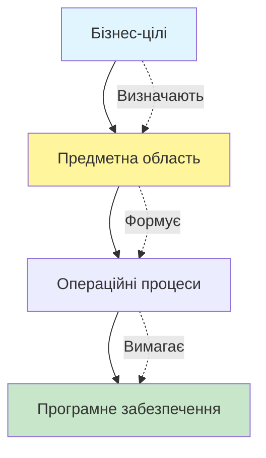
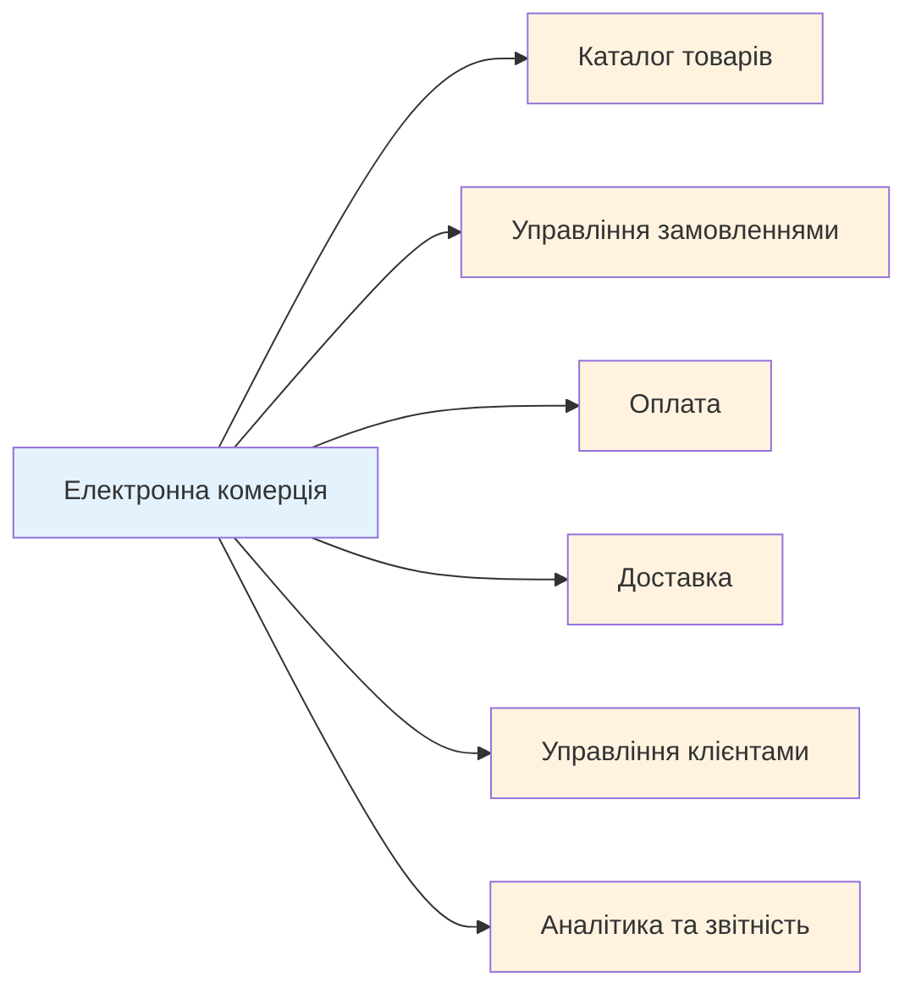
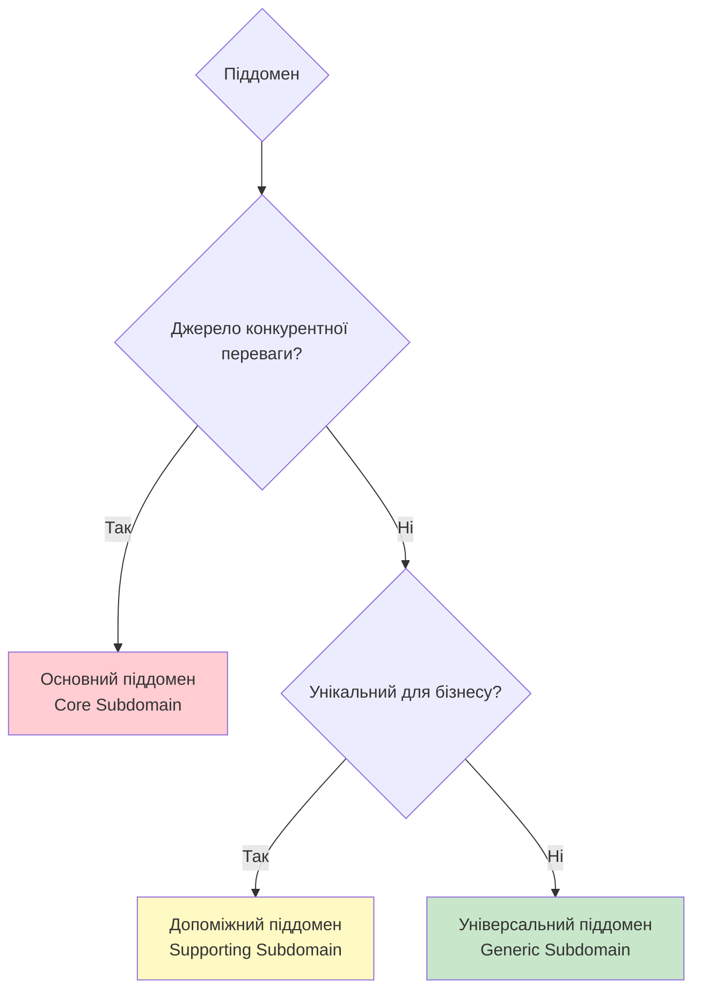

# Аналіз предметної області (Domain Analysis)

::note{icon="fluent:lightbulb-24-filled"}
**Ключова ідея глави**

Успішна розробка програмного забезпечення починається з глибокого розуміння предметної області бізнесу. У цій главі ми дізнаємося, як аналізувати складні бізнес-системи через призму піддоменів та визначати стратегічні пріоритети для їх реалізації.
::

## Вступ: Чому аналіз предметної області є критично важливим?

Уявіть, що ви архітектор, якому доручили спроектувати будівлю. Перше питання, яке ви поставите: "Для чого ця будівля? Лікарня? Школа? Торговий центр?" Кожна з цих будівель матиме різну архітектуру, оскільки вирішує різні задачі.

Так само і з програмним забезпеченням. **Предметно-орієнтоване проектування (Domain-Driven Design, DDD)** — це підхід до розробки складних систем, який ставить бізнес-логіку в центр уваги. Замість того, щоб починати з технічних рішень, DDD пропонує спочатку зрозуміти **предметну область (Domain)** — сферу діяльності, в якій працює бізнес.

::warning{icon="ph:warning-fill"}
**Найпоширеніша помилка**

Багато команд розробників починають з технічних рішень ("Ми будемо використовувати мікросервіси!", "Потрібна реляційна база даних!"), не розібравшись спершу в бізнес-потребах. Це призводить до створення систем, які технічно досконалі, але не вирішують реальних бізнес-проблем.
::

### Що ми вивчимо в цій главі?

У цій главі ми розглянемо:

- **Що таке предметна область** і чому її розуміння є фундаментом успішної розробки
- **Піддомени (Subdomains)** — як розбити складну систему на керовані частини
- **Три типи піддоменів**: основні, універсальні та допоміжні
- **Як визначати межі піддоменів** і коли зупинятися в деталізації
- **Практичні приклади** аналізу реальних систем

::tip{icon="ph:graduation-cap-fill"}
**Педагогічний підхід**

Цей матеріал побудований за принципом "Чому → Що → Як":

- Спочатку ми з'ясуємо, **чому** потрібен аналіз предметної області
- Потім визначимо, **що** таке піддомени та їх типи
- І нарешті, дізнаємося, **як** їх виявляти та класифікувати

Кожна концепція супроводжується практичними прикладами з реального світу, щоб ви могли застосувати знання у своїх проєктах.
::

## Що таке предметна область?

**Предметна область (Domain)** — це сфера знань, діяльності або впливу, в якій працює організація. Це не просто "те, що робить компанія", а цілісна система бізнес-процесів, правил, знань та цілей.

### Приклади предметних областей

Розглянемо кілька прикладів, щоб краще зрозуміти концепцію:

::card-group
::card{icon="mdi:coffee"}
#title
Starbucks
#description
**Предметна область**: Роздрібна торгівля кавовими напоями та супутніми товарами

**Ключові аспекти**:

- Приготування та продаж напоїв
- Управління мережею кав'ярень
- Програма лояльності клієнтів
- Логістика та постачання зерен

::

::card{icon="mdi:car"}
#title
Uber
#description
**Предметна область**: Платформа для замовлення та надання транспортних послуг

**Ключові аспекти**:

- Підбір водіїв та пасажирів
- Ціноутворення поїздок
- Оплата та розрахунки
- Оцінка якості сервісу

::

::card{icon="mdi:package-variant"}
#title
Amazon
#description
**Предметна область**: Електронна комерція та логістика

**Ключові аспекти**:

- Каталог товарів
- Обробка замовлень
- Доставка та відстеження
- Зберігання на складах

::
::

### Зв'язок з бізнес-цілями

Предметна область завжди пов'язана зі **стратегічними цілями** компанії. Кожна компанія має свою унікальну мету:

- **Starbucks** прагне створити "третє місце" між домом та роботою, де люди насолоджуються якісною кавою
- **Uber** хоче зробити пересування в містах простішим та доступнішим
- **Amazon** намагається бути "найбільш клієнтоорієнтованою компанією світу"

::mermaid

::

**Програмне забезпечення** має підтримувати предметну область у досягненні бізнес-цілей. Саме тому розуміння предметної області є першим кроком у розробці ефективних систем.

---

## Піддомени (Subdomains)

Навіть невелика компанія має складну предметну область. Спроба охопити всю предметну область одночасно призведе до когнітивного перевантаження. Тому DDD пропонує розбити предметну область на **піддомени (Subdomains)** — менші, більш зрозумілі частини.

### Що таке піддомен?

::note{icon="lucide:layers"}
**Визначення: Піддомен**

**Піддомен (Subdomain)** — це частина предметної області, яка відповідає за конкретну бізнес-компетенцію або функцію. Кожен піддомен має власну логіку, правила та цілі.
::

Піддомени — це не технічні компоненти системи, а **бізнес-концепції**. Вони існують незалежно від того, як ви вирішите реалізувати програмне забезпечення.

### Приклад: Електронна комерція

Розглянемо інтернет-магазин. Його предметна область може включати такі піддомени:

::mermaid

::

Кожен з цих піддоменів має власну логіку:

- **Каталог товарів**: організація, пошук, фільтрація продуктів
- **Управління замовленнями**: створення, обробка, скасування замовлень
- **Оплата**: прийом платежів, повернення коштів
- **Доставка**: розрахунок вартості, відстеження посилок
- **Управління клієнтами**: реєстрація, профілі, історія покупок

### Роль піддоменів у розробці

Піддомени допомагають у:

1. **Розподілі відповідальності**: Кожна команда може працювати над окремим піддоменом
2. **Пріоритезації**: Не всі піддомени однаково важливі для бізнесу
3. **Масштабуванні**: Різні піддомени можуть розвиватися незалежно
4. **Комунікації**: Легше обговорювати конкретні частини системи

::tip{icon="ph:lightbulb-fill"}
**Ключовий принцип**

Піддомени виявляються через аналіз бізнесу, а не проектуються розробниками. Ваше завдання — **зрозуміти**, які піддомени існують у предметній області, а не вигадати їх.
::

---

## Типи піддоменів: Стратегічна класифікація

Не всі піддомени однаково важливі для бізнесу. DDD пропонує класифікувати піддомени на три типи залежно від їхньої **стратегічної цінності** та **складності**:

1. **Основні піддомени (Core Subdomains)**
2. **Універсальні піддомени (Generic Subdomains)**
3. **Допоміжні піддомени (Supporting Subdomains)**

Ця класифікація допомагає визначити, куди вкладати ресурси та як розподіляти зусилля команди.

::mermaid

::

### Основний піддомен (Core Subdomain)

::note{icon="ph:star-fill"}
**Визначення: Основний піддомен**

**Основний піддомен (Core Subdomain)** — це та частина предметної області, яка робить бізнес унікальним і надає **конкурентну перевагу**. Це серце вашої системи, те, що відрізняє вас від конкурентів.
::

#### Характеристики основного піддомену

| Аспект                   | Опис                                                            |
| ------------------------ | --------------------------------------------------------------- |
| **Бізнес-диференціація** | Високаякість: це те, що робить компанію унікальною              |
| **Складність**           | Висока: містить складну бізнес-логіку та правила                |
| **Мінливість**           | Висока: часто змінюється разом зі стратегією                    |
| **Конкурентна перевага** | Пряма: успіх бізнесу безпосередньо залежить від цього піддомену |
| **Стратегія рішення**    | Розробка власного рішення найкращими фахівцями                  |

#### Приклади основних піддоменів

::card-group
::card{icon="mdi:map-marker-path"}
#title
Uber: Алгоритм підбору

#description
**Чому це Core?**

Алгоритм, який швидко та ефективно з'єднує водіїв та пасажирів, — це те, що відрізняє Uber від звичайного таксі. Якість підбору безпосередньо впливає на задоволення клієнтів та водіїв.

**Складність**: Потрібно враховувати місце знаходження, трафік, прогнозування попиту, рейтинги тощо.
::

::card{icon="mdi:google"}
#title
Google: Алгоритм пошуку
#description
**Чому це Core?**

PageRank та інші алгоритми ранжування результатів пошуку — це основа бізнесу Google. Якість пошуку визначає, чи користувачі обиратимуть Google замість інших пошукових систем.

**Складність**: Мільярди веб-сторінок, машинне навчання, боротьба зі спамом.
::

::card{icon="mdi:shopping"}
#title
Amazon: Система рекомендацій
#description
**Чому це Core?**

Персоналізовані рекомендації товарів збільшують продажі та утримують клієнтів. Це те, що робить покупки на Amazon зручнішими, ніж у конкурентів.

**Складність**: Аналіз поведінки користувачів, машинне навчання, персоналізація.
::
::

#### Стратегія для основних піддоменів

::warning{icon="ph:warning-fill"}
**Критична важливість**

Основний піддомен **НЕ МОЖНА** передавати на аутсорсинг або використовувати готові рішення! Це ваша конкурентна перевага, і вона має бути розроблена власними силами з максимальною увагою до деталей.
::

**Рекомендації**:

- Виділіть найкращих розробників для роботи над основним піддоменом
- Інвестуйте в глибоке вивчення предметної області
- Застосовуйте передові практики проектування (DDD, CQRS, Event Sourcing)
- Регулярно рефакторьте та вдосконалюйте код
- Підтримуйте тісну співпрацю з експертами предметної області

---

### Універсальний піддомен (Generic Subdomain)

::note{icon="ph:package"}
**Визначення: Універсальний піддомен**

**Універсальний піддомен (Generic Subdomain)** — це бізнес-компетенція, яка потрібна для роботи системи, але **не є унікальною** для вашого бізнесу. Такі проблеми вже вирішені іншими компаніями, і існують готові рішення.
::

#### Характеристики універсального піддомену

| Аспект                   | Опис                                                |
| ------------------------ | --------------------------------------------------- |
| **Бізнес-диференціація** | Відсутня: всі компанії вирішують ці задачі однаково |
| **Складність**           | Різна: може бути як простою, так і складною         |
| **Мінливість**           | Низька: рідко змінюється                            |

|
| **Конкурентна перевага** | Немає: це "гігієнічний фактор", а не перевага |
| **Стратегія рішення** | Використовувати готові рішення чи купити |

#### Приклади універсальних піддоменів

::card-group
::card{icon="mdi:shield-lock"}
#title
Аутентифікація та авторизація
#description
Кожна система потребує управління користувачами та правами доступу. Це не робить вашу систему унікальною.

**Готові рішення**: Auth0, Okta, Keycloak, Firebase Auth
::

::card{icon="mdi:lock-outline"}
#title
Шифрування даних
#description
Захист даних є обов'язковим, але не унікальним. Використовуйте перевірені криптографічні бібліотеки.

**Готові рішення**: OpenSSL, AWS KMS, Azure Key Vault
::

::card{icon="mdi:email"}
#title
Розсилка електронних листів
#description
Відправка транзакційних та маркетингових листів — стандартна функція.

**Готові рішення**: SendGrid, Mailgun, Amazon SES
::
::

#### Стратегія для універсальних піддоменів

::tip{icon="ph:rocket-fill"}
**Оптимізація ресурсів**

Не витрачайте час на написання власних рішень для універсальних піддоменів! Використовуйте перевірені готові інструменти, щоб зосередити зусилля на основних піддоменах.
::

**Рекомендації**:

- Використовуйте SaaS-рішення (Software as a Service)
- Купуйте готові комерційні продукти
- Використовуйте open-source бібліотеки та фреймворки
- Розглядайте аутсорсинг для простих універсальних піддоменів
- Мінімізуйте кастомізацію готових рішень

---

### Допоміжний піддомен (Supporting Subdomain)

::note{icon="ph:wrench"}
**Визначення: Допоміжний піддомен**

**Допоміжний піддомен (Supporting Subdomain)** — це бізнес-компетенція, яка підтримує роботу основного піддомену, але **не надає конкурентної переваги** і є **специфічною для вашого бізнесу**.
::

#### Характеристики допоміжного піддомену

| Аспект                   | Опис                                                |
| ------------------------ | --------------------------------------------------- |
| **Бізнес-диференціація** | Низька: допомагає, але не відрізняє від конкурентів |
| **Складність**           | Низька до середньої: зазвичай прості CRUD-операції  |
| **Мінливість**           | Середня: змінюється рідше за основний піддомен      |
| **Конкурентна перевага** | Непряма: необхідний, але не критичний               |
| **Стратегія рішення**    | Простота реалізації, мінімальні витрати             |

#### Приклади допоміжних піддоменів

::card-group
::card{icon="mdi:folder-multiple"}
#title
Каталог контенту
#description
Система управління статтями, документами або медіа-файлами для внутрішнього використання.

**Чому Supporting**: Потрібен для роботи, але не робить бізнес унікальним. Зазвичай це прості CRUD-операції.
::

::card{icon="mdi:chart-bar"}
#title
Внутрішня звітність
#description
Генерація звітів для внутрішніх потреб компанії (не для клієнтів).

**Чому Supporting**: Допомагає в управлінні, але клієнти цього не бачать.
::

::card{icon="mdi:cog"}
#title
Управління конфігурацією
#description
Зберігання та управління налаштуваннями системи.

**Чому Supporting**: Технічно необхідний, але не впливає на досвід користувачів.
::
::

#### ETL-процеси як допоміжні піддомени

Часто допоміжні піддомени включають **ETL-процеси** (Extract, Transform, Load) — операції витягування, трансформації та завантаження даних між системами.

**Приклад**: Інтеграція з бухгалтерською системою для передачі фінансових даних.

#### Стратегія для допоміжних піддоменів

::tip{icon="ph:speedometer-fill"}
**Баланс якості та швидкості**

Допоміжні піддомени мають бути **достатньо добрими**, але не ідеальними. Не витрачайте надмірно ресурсів на їх розробку.
::

**Рекомендації**:

- Використовуйте прості архітектурні рішення
- Розглядайте low-code/no-code платформи
- Можна віддати на аутсорсинг junior-розробникам
- Мінімізуйте складність — простота понад усе
- Якщо можливо, використовуйте готові open-source рішення
