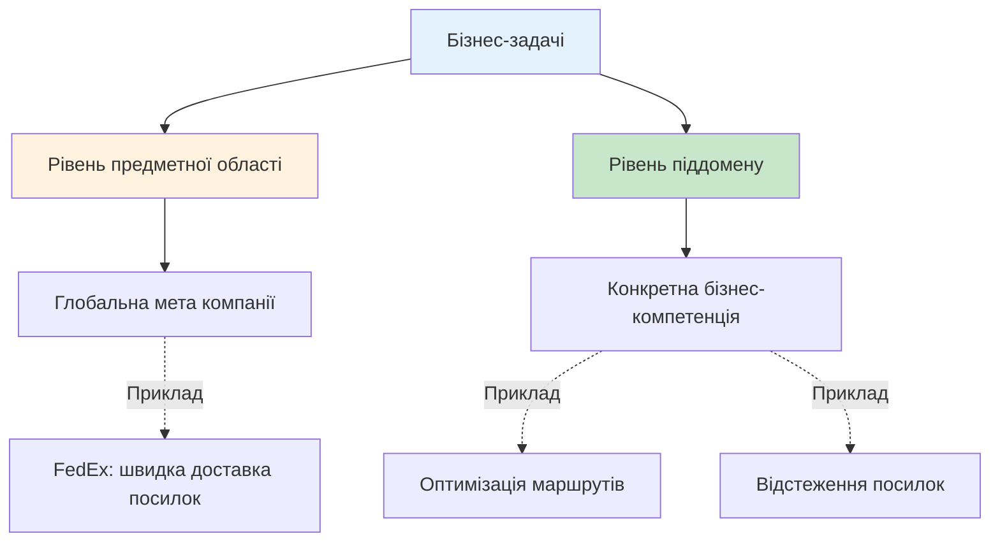
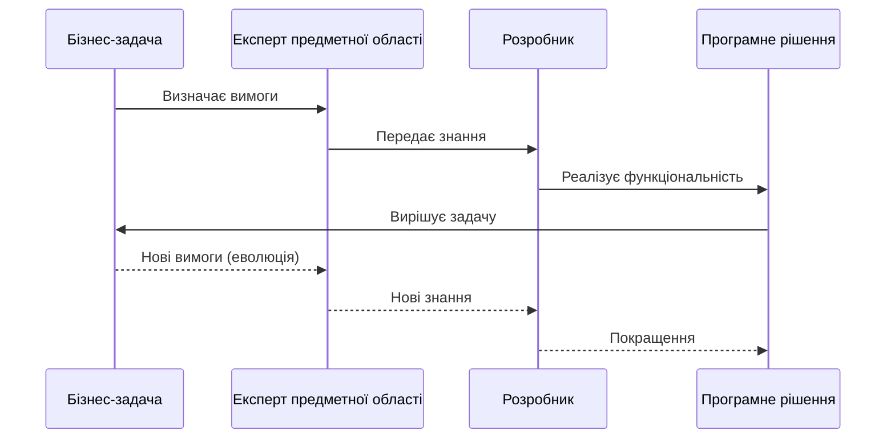
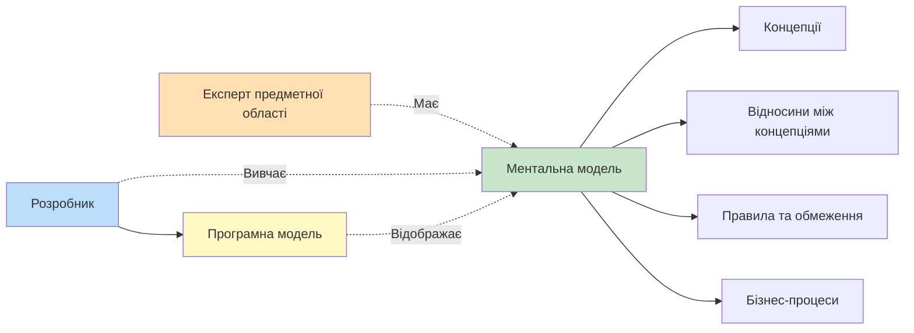
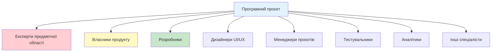
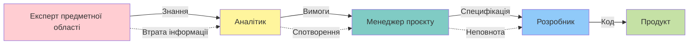

# Експертні знання про предметну область (Domain Expert Knowledge)

::note{icon="fluent:chat-multiple-24-filled"}
**Епіграф**

> "У продакшн потрапляють не знання експертів з предметної області, а припущення розробників..."
>
> — Альберто Брандоліні (Alberto Brandolini)
> ::

## Вступ: Від структури до змісту

У попередній главі ми вивчили, як аналізувати предметну область через призму піддоменів: визначати їхні типи, межі та стратегічну цінність. Ми навчилися **структурувати** складний бізнес на керовані частини.

Але знання про структуру — це лише початок. Тепер нам потрібно зануритися **усередину** кожного піддомену і зрозуміти:

- Які бізнес-функції він виконує?
- Яка логіка стоїть за цими функціями?
- Як експерти предметної області думають про проблему?
- Яку термінологію вони використовують?

::tip{icon="ph:target"}
**Мета глави**

У цій главі ми вивчимо **Єдину мову (Ubiquitous Language)** — інструмент DDD для ефективної комунікації та обміну знаннями між експертами предметної області та розробниками. Це не просто термінологічний словник, а спосіб мислення, який забезпечує глибоке розуміння бізнесу.
::

### Що ми вивчимо?

::steps

### Крок 1: Бізнес-задачі

Зрозуміємо, що таке бізнес-задачі та чому їх розуміння критично важливе.

### Крок 2: Виявлення експертних знань

Дізнаємося, як ефективно отримувати знання від експертів предметної області.

### Крок 3: Проблеми комунікації

Розглянемо типові проблеми спілкування в проєктах та їхні наслідки.

### Крок 4: Єдина мова

Вивчимо концепцію Ubiquitous Language і як її створювати.

### Крок 5: Моделювання

Дізнаємося, що таке бізнес-модель та як її будувати.
::

---

## Бізнес-задачі (Business Problems)

Перше, що потрібно зрозуміти: **програмне забезпечення існує для вирішення бізнес-задач**. Але що ми маємо на увазі під "бізнес-задачею"?

### Бізнес-задача ≠ Математична задача

::warning{icon="ph:warning-fill"}
**Розбиваємо міф**

Бізнес-задача — це **НЕ** математична задача або загадка з єдиним правильним рішенням. У бізнесі немає "остаточного рішення". Бізнес постійно еволюціонує, і рішення мають адаптуватися разом з ним.
::

**Бізнес-задачі** можуть включати:

- Оптимізацію робочих процесів
- Мінімізацію ручної праці
- Управління ресурсами
- Підтримку прийняття рішень
- Управління даними
- Автоматизацію повторюваних операцій
- Покращення досвіду клієнтів

### Два рівні бізнес-задач

::mermaid

::

#### 1. Рівень предметної області (Domain Level)

Це **глобальна мета** компанії — проблема, яку вона вирішує для своїх клієнтів.

**Приклад: FedEx**

- **Проблема клієнта**: Потрібно терміново відправити посилку
- **Рішення FedEx**: Швидка та надійна доставка по всьому світу
- **Цінність**: Клієнт може довіритияти, що посилка прибуде вчасно

#### 2. Рівень піддомену (Subdomain Level)

Піддомени представляють **менші предметні області**, кожна з яких вирішує конкретну бізнес-компетенцію.

**Приклади піддоменів FedEx:**

::card-group
::card{icon="mdi:truck"}
#title
Управління логістикою
#description
**Задача**: Оптимізувати процес транспортування посилок

**Рішення**: Алгоритми планування маршрутів, управління автопарком
::

::card{icon="mdi:package-variant"}
#title
Відстеження посилок
#description
**Задача**: Надати клієнтам можливість відстежувати свої посилки в реальному часі

**Рішення**: Система сканування та геолокації
::

::card{icon="mdi:cash-register"}
#title
Система розрахунків
#description
**Задача**: Оптимізувати процес виконання фінансових операцій

**Рішення**: Автоматизація платежів, рахунків та звітності
::
::

### Від задачі до рішення

Кожен піддомен має свій **цикл "Задача → Рішення"**:

::mermaid

::

::note{icon="ph:lightbulb"}
**Ключовий інсайт**

Розуміння бізнес-задачі — це не просто знання "що потрібно зробити", а розуміння "**чому** це потрібно" та "**як це впливає на бізнес**". Без цього розуміння розробники створюють технічно правильні, але бізнесово неефективні рішення.
::

---

## Виявлення експертних знань

Тепер, коли ми розуміємо природу бізнес-задач, виникає питання: **звідки розробники отримують знання для їх вирішення?**

### Експерти предметної області (Domain Experts)

::note{icon="ph:user-circle-fill"}
**Визначення: Експерт предметної області**

**Експерт предметної області (Domain Expert)** — це людина, чия робота полягає в набутті конкретних знань і вмінні розбиратися в усіх тонкощах обраного напряму. Ці люди **живуть і дихають** своєю предметною областю.
::

**Приклади експертів:**

- У банку: андеррайтери, трейдери, кредитні аналітики
- У медицині: лікарі, медсестри, фармацевти
- В електронній комерції: мерчандайзери, маркетологи, спеціалісти з логістики
- У страхуванні: актуарії, агенти, оцінювачі ризиків

### Розробники ≠ Експерти предметної області

::warning{icon="ph:warning"}
**Важливо розуміти**

Розробники **не повинні** і **не можуть** ставати експертами в предметній області. Це не їхня роль і не їхня мета.

**Але!** Розробники **повинні**:

- ✅ Розуміти, як думають експерти
- ✅ Використовувати термінологію експертів
- ✅ Розуміти ментальну модель експертів
- ✅ Задавати правильні питання

::

### Ментальна модель експерта

Ефективність рішення залежить від того, наскільки добре розробник розуміє **спосіб мислення експерта** та його **ментальну модель**.

::mermaid

::

### Небезпека поверхневого розуміння

Що станеться, якщо розробник не розуміє бізнес-задачу глибоко?

::accordion
::accordion-item{title="Проблема 1: Перекладання вимог у код"}
Без розуміння обгрунтування вимог, розробник просто "переводить" специфікацію в код. Це призводить до:

- Відсутності гнучкості для майбутніх змін
- Неможливості запропонувати кращі рішення
- Створення моделі, яка не відображає реальний бізнес

::

::accordion-item{title="Проблема 2: Пропущені граничні випадки"}
Якщо в вимогах пропущений важливий граничний випадок, розробник без знань предметної області не зможе його виявити. Результат — баги в продакшні.
::

::accordion-item{title="Проблема 3: Неадекватна модель"}
Модель, створена без розуміння предметної області, не зможе адаптуватися до майбутніх вимог. Кожна нова функція вимагатиме глибокого рефакторингу.
::
::

### Мудрість Альберто Брандоліні

Альберто Брандоліні (Alberto Brandolini), творець методу Event Storming, висловив глибоку думку:

::note{icon="ph:quotes"}
**Цитата**

> "Розробка програмного забезпечення — це процес **навчання**, а робочий код є **побічним ефектом**."
>
> — Альберто Брандоліні
> ::

Успіх програмного проєкту залежить від **ефективності обміну знаннями** між експертами предметної області та розробниками. Щоб вирішити задачу, потрібно зрозуміти її суть.

---

## Проблеми комунікації

Ефективний обмін знаннями між експертами та розробниками вимагає продуктивного спілкування. Давайте розгляньмо, що найчастіше перешкоджає цьому.

### Типова структура команди

Майже всі програмні проєкти вимагають співпраці різних ролей:

::mermaid

::

Результат залежить від того, наскільки продуктивно всі ці сторони можуть працювати разом. Критичні питання:

- Чи згодні всі з тим, яку задачу потрібно вирішити?
- Чи немає протиріч у функціональних та нефункціональних вимогах?
- Чи розуміють всі однаково ключові концепції?

### Традиційний потік знань (антипатерн)

Дослідження показують, що найчастішою причиною невдач у програмних проєктах є **неефективна комунікація**. Чому?

{.diagram-img}

::warning{icon="ph:warning-diamond-fill"}
**Проблема: Посередники**

У традиційному підході експерти предметної області та розробники **не мають прямого контакту**. Знання передаються через "перекладачів":

- Бізнес-аналітиків
- Системних аналітиків
- Власників продукту
- Менеджерів проєктів

::

#### Потік знань у традиційній моделі

::mermaid

::

### Множинні перекла дання

Знання у традиційному підході піддаються **кількатакратному перекладу**:

{.diagram-img}

::steps

### Переклад 1: Знання → Аналітична модель

Експерт пояснює свої знання аналітику, який створює документ вимог.

### Переклад 2: Аналітична модель → Дизайн

Архітектор або дизайнер перетворює вимоги в дизайн системи.

### Переклад 3: Дизайн → Код

Розробник реалізує дизайн у вигляді програмного коду.

### Переклад 4: Код → Знання (для підтримки)

Наступні розробники вивчають код, щоб зрозуміти предметну область.
::

### Гра "Зіпсований телефон"

::note{icon="ph:game-controller"}
**Аналогія**

Цей процес нагадує дитячу гру "Зіпсований телефон" (Telephone Game):

1. Перший гравець вигадує повідомлення
2. Нашіптує його другому
3. Другий повторює третьому
4. І так далі...
5. Останній гравець озвучує те, що почув

**Результат**: Фінальне повідомлення суттєво відрізняється від оригінального!
::

### Наслідки поганої комунікації

Що відбувається через множинні перекладання?

::card-group
::card{icon="mdi:alert"}
#title
Спотворення інформації
#description
Знання предметної області втрачаються або спотворюються на шляху до розробників.
::

::card{icon="mdi:bug"}
#title
Неправильні рішення
#description
Розробники реалізують неправильне рішення або вирішують не ту задачу.
::

::card{icon="mdi:close-circle"}
#title
Невдалі проєкти
#description
Результат один: невдалий програмний проєкт, який не вирішує бізнес-задачі.
::
::

### Рішення: Пряма комунікація

DDD пропонує більш ефективний спосіб передачі знань від експертів до розробників: **використання Єдиної мови (Ubiquitous Language)** та **пряме спілкування**.

::tip{icon="ph:arrow-right-bold"}
**Наступний крок**

Тепер, коли ми розуміємо проблему, давайте розглянемо рішення — концепцію Єдиної мови.
::
