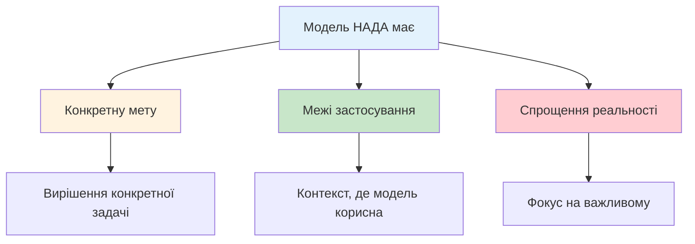
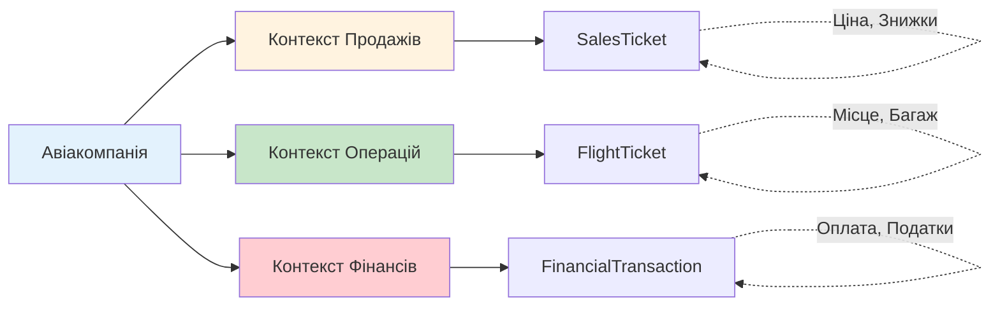
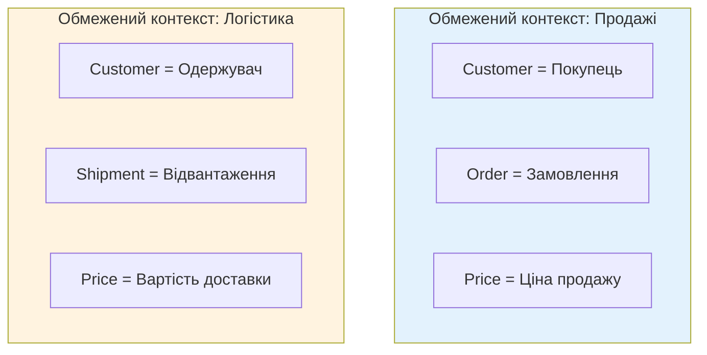

# Як осмислити складність предметної області (Managing Domain Complexity)

::note{icon="fluent:puzzle-piece-24-filled"}
**Ключова ідея глави**

Складні предметні області вимагають розбиття на менші, більш управляемі моделі. **Обмежені контексти (Bounded Contexts)** — це інструмент DDD для визначення меж, у яких діє конкретна Єдина мова і модель.
::

## Вступ: Від мови до меж

У попередній главі ми вивчили **Єдинумову (Ubiquitous Language)** — спільну мову для опису предметної області. Але щоб Єдина мова була справді ефективною, потрібно визначити, **де саме вона діє**.

Уявіть, що ви плануєте подорож:

- Для руху по місту вам потрібна **карта метро**
- Для автомобільної поїздки — **дорожня карта**
- Для морської навігації — **навігаційна карта**
- Для польоту — **аеронавігаційна карта**

::tip{icon="ph:map"}
**Аналогія з картами**

Кожна карта має свій **контекст** застосування. Карта метро марна для морської навігації. Так само **Єдина мова в одному контексті може бути повністю непридатною в іншому**.
::

### Що ми вивчимо?

У цій главі ми дослідимо:

::steps

### Крок 1: Що таке моделі?

Розберемо концепцію моделі та її призначення.

### Крок 2: Обмежені контексти

Вивчимо, що таке Bounded Contexts і чому вони критично важливі.

### Крок 3: Межі контекстів

Дізнаємося, як визначати межі Обмежених контекстів.

### Крок 4: Обмежені контексти vs Піддомени

Розуміємо різницю та зв'язок між цими концепціями.
::

---

## Що таке модель?

Перш ніж говорити про **Обмежені контексти**, потрібно зрозуміти, що таке **модель**.

::note{icon="ph:cube"}
**Визначення: Модель**

**Модель (Model)** — це спрощене уявлення реальності, створене з конкретною метою. Модель фокусується на аспектах, що важливі для вирішення конкретної задачі, і ігнорує все інше.
::

### Моделі в реальному світі

Розглянемо приклади моделей з різних сфер:

::card-group
::card{icon="mdi:earth"}
#title
Карти
#description
**Модель**: Географічна карта

**Мета**: Показати розташування об'єктів

**Що включає**: Вулиці, будівлі, ландшафт

**Що ігнорує**: Висоту будівель, матеріали, людей
::

::card{icon="mdi:airplane"}
#title
Авіаційна модель
#description
**Модель**: Масштабна модель літака

**Мета**: Тестування аеродинаміки

**Що включає**: Форму, пропорції

**Що ігнорує**: Інтер'єр, двигуни, електроніку
::

::card{icon="mdi:molecule"}
#title
Хімічна модель
#description
**Модель**: Молекулярна структура

**Мета**: Показати зв'язки між атомами

**Що включає**: Атоми, зв'язки

**Що ігнорує**: Рух електронів, квантові ефекти
::
::

### Ключові властивості моделі

::mermaid



:::

::warning{icon="ph:warning"}
**Важлива істина**

Модель — це **НЕ** копія реального світу. Якщо намагатися змоделювати все, модель стає такою ж складною, як сам реальний світ, і втрачає свою цінність.
::

### Моделі в програмуванні

У контексті програмного забезпечення **модель предметної області** — це структурований спосіб представлення бізнес-концепцій, правил та процесів.

**Приклад: Модель "Замовлення" в електронній комерції**

```csharp
// Модель Замовлення
public class Order {
    public OrderId Id { get; private set; }
    public CustomerId CustomerId { get; private set; }
    public List<OrderItem> Items { get; private set; }
    public OrderStatus Status { get; private set; }
    public Money TotalAmount { get; private set; }

    public void AddItem(Product product, int quantity) {
        // Бізнес-логіка додавання товару
    }

    public void Confirm() {
        // Бізнес-логіка підтвердження
    }
}
```

Ця модель:

- **Включає**: ID, товари, статус, загальну суму, операції (додати товар, підтвердити)
- **Ігнорує**: Деталі доставки (це інша модель), історію змін статусу, технічні деталі зберігання

---

## Обмежені контексти (Bounded Contexts)

Тепер, коли ми розуміємо, що таке модель, can перейти до **Обмежених контекстів**.

::note{icon="ph:fence"}
**Визначення: Обмежений контекст**

**Обмежений контекст (Bounded Context)** — це межа, у якій діє конкретна модель предметної області та її Єдина мова. Усередині цієї межі всі терміни, концепції та правила мають чітке, узгоджене значення.
::

### Чому потрібні обмежені контексти?

Розглянемо приклад, який ілюструє проблему:

::accordion
::accordion-item{title="Проблема: Один термін, різні значення"}
Уявіть систему для авіакомпанії. Термін **"Ticket" (Квиток)** має різне значення для різних експертів:

**Для відділу продажів**:

- Квиток — це те, що купує клієнт
- Включає: ціну, знижки, умови повернення
- Операції: купити, повернути, обміняти

**Для відділу польотів**:

- Квиток — це право пасажира на політ
- Включає: номер місця, багаж, статус реєстрації
- Операції: зареєструватись, змінити місце

**Для бухгалтерії**:

- Квиток — це фінансова транзакція
- Включає: суму оплати, податки, комісії
- Операції: провести оплату, зробити повернення

**Спроба створити одну модель "Ticket"** призведе до:

- Надмірної складності
- Суперечливих правил
- Плутанини в командах

::

::

### Рішення: Розділити на Обмежені контексти

Замість однієї складної моделі створюємо **три Обмежені контексти**:

::mermaid



:::

Тепер кожен контекст має свою чітку модель квитка:

- `SalesTicket` у контексті продажів
- `FlightTicket` у контексті операцій
- `FinancialTransaction` у контексті фінансів

### Межі узгодженості

Обмежені контексти визначають **межі узгодженості Єдиної мови**.

::note{icon="ph:check-square"}
**Ключовий принцип**

Термінологія, принципи та бізнес-правила Єдиної мови узгоджені **тільки всередині** Обмеженого контексту. За його межами ті самі слова можуть мати інше значення.
::

::mermaid



:::

У контексті Продажів "Customer" — це покупець, у контексті Логістики — одержувач посилки. **Обидва значення правильні** у своїх контекстах!

---

## Уточнення терміна "Єдина мова"

Обмежені контексти дозволяють завершити визначення Єдиної мови.

::warning{icon="ph:info"}
**Важливе уточнення**

Єдина мова **НЕ є** "єдиною" в тому сенсі, що вона використовується всюди в організації. Єдина мова **НЕ є** універсальною.
::

**Єдина моваєдина застосовна лише в межах свого Обмеженого контексту.** Вона орієнтована на опис тільки тієї моделі, що знаходиться в цьому контексті.

::tip{icon="ph:lightbulb-fill"}
**Правильне розуміння**

"Ubiquitous" означає "повсюдний **усередині контексту**", а не "єдиний для всієї компанії".

Для кожного Обмеженого контексту існує **своя** Єдина мова.
::

---

## Визначення меж Обмеженого контексту

Як визначити, де має проходити межа Обмеженого контексту?

### Відправна точка: Непротиворечність Єдиної мови

Найширша можлива межа Обмеженого контексту визначається **непротиворечністю Єдиної мови**.

::steps

### Правило 1: Не ширше за узгодженість

Межа не може бути ширшою, ніж зона узгодженості термінології. Якщо терміни суперечать один одному — потрібні окремі контексти.

### Правило 2: Але можна вужче

Навіть якщо термінологія узгоджена, можна створити менші контексти з організаційних або технічних причин.
::

{.diagram-img}

### Стратегічне рішення про розмір

Визначення розміру Обмеженого контексту — це **стратегічне проектне рішення**.

::card-group
::card{icon="mdi:arrow-expand"}
#title
Великі контексти
#description
**Переваги**:

- Менше інтеграційних точок
- Простіша архітектура

**Недоліки**:

- Складніше підтримувати узгодженість
- Більші команди

::

::card{icon="mdi:arrow-collapse"}
#title
Малі контексти
#description
**Переваги**:

- Легше підтримувати узгодженість
- Менші, автономні команди

**Недоліки**:

- Більше інтеграцій
- Вища складність системи

::

::

::warning{icon="ph:warning"}
**Баланс є ключем**

Моделі не обов'язково мають бути великими чи малими. Вони мають бути **корисними**. Розмір Обмеженого контексту має відповідати потребам бізнесу та організаційним обмеженням.
::

### Причини для поділу на менші контексти

Чому ви можете захотіти розділити великий Обмежений контекст на менші?

::accordion
::accordion-item{title="1. Організаційні причини"}

- Нові команди розробників
- Різна експертиза (frontend, backend, ML)
- Географічний розподіл команд

::

::accordion-item{title="2. Технічні причини"}

- Різні життєві цикли розробки
- Різні вимоги до масштабування
- Різні технологічні стеки

::

::accordion-item{title="3. Бізнес-причини"}

- Різний темп змін
- Різні SLA (Service Level Agreement)
- Різні вимоги до безпеки

::

::

### Що уникати: Надмірне розділення

::warning{icon="ph:warning-diamond"}
**Небезпека над мірного поділу**

НЕ розділяйте пов'язану функціональність на кілька Обмежених контекстів!

**Ознаки надмірного поділу**:

- ❌ Одакові бізнес-вимоги впливають на кілька контекстів одночасно
- ❌ Зміни вимагають синхронного розгортання кількох контекстів
- ❌ Більшість часу йде на інтеграцію, а не на розробку

::

::tip{icon="ph:check-circle"}
**Емпіричне правило**

Використовуйте те саме правило, що й для піддоменів: виз начте набори **пов'язаних сценаріїв використання (coherent use cases)**, які працюють з одними й тими самими даними, і уникайте їх розділення.
::

---

## Порівняння Обмежених контекстів і піддоменів

Тепер розберемо ключову різницю та зв'язок між **Піддоменами** та **Обмеженими контекстами**.

### Піддомени (Subdomains)

::note{icon="ph:binoculars"}
**Піддомени: Аналіз бізнесу**

**Піддомени виявляються**, а не проектуються. Вони існують в реальному бізнесі незалежно від вашого програмного рішення.
::

**Характеристики піддоменів**:

- Визначаються **бізнес-стратегією**
- Це аналітична концепція
- Ідентифікуються через анал із предметної області
- Існують незалежно від реалізації
- Типи: Core, Generic, Supporting

### Обмежені контексти (Bounded Contexts)

::note{icon="ph:pencil"}
**Обмежені контексти: Проектне рішення**

**Обмежені контексти проектуються**. Це рішення про те, як ви структуруєте своє програмне рішення.
::

**Характеристики Обмежених контекстів**:

- Визначаються **рішеннями проектування**
- Це концепція реалізації
- Створюються розробниками та архітекторами
- Можуть змінюватися залежно від потреб
- Межі моделей і Єдиної мови

### Порівняльна таблиця

| Аспект                | Піддомен                 | Обмежений контекст     |
| --------------------- | ------------------------ | ---------------------- |
| **Походження**        | Виявляється (Discovery)  | Проектується (Design)  |
| **Хто визначає**      | Бізнес                   | Розробники/Архітектори |
| **Що це**             | Частина бізнес-стратегії | Межа моделі            |
| **Чому існує**        | Бізнес-компетенція       | Технічне рішення       |
| **Змінність**         | Рідко (разом з бізнесом) | Може змінюватися       |
| **Тип классифікації** | Core/Generic/Supporting  | Немає типізації        |

### Варіанти відображення

Як співвідносяться піддомени та Обмежені контексти?

#### Варіант 1: Один контекст на всю предметну Область (антипатерн для великих систем)

{.diagram-img}

::warning{icon="ph:x-circle"}
**Коли це працює**: Лише для дуже малих систем

**Проблема**: Одна велика модель стає надто складною для підтримки
::

#### Варіант 2: Контексти відповідають непротиворечності моделі

{.diagram-img}

::tip{icon="ph:check"}
**Коли це працює**: Коли експерти мають різні ментальні моделі

**Ідея**: Розділити там, де є конфлікти в термінології
::

#### Варіант 3: Один контекст на кожен піддомен

{.diagram-img}

::tip{icon="ph:star"}
**Коли це працює**: Найпоширеніший варіант для середніх та великих систем

**Ідея**: Кожен піддомен має свій Обмежений контекст
::

#### Варіант 4: Кілька контекстів на один піддомен

::tip{icon="ph:arrows-split"}
**Коли це працює**: Коли потрібні різні моделі для різних задач

**Приклад**: Для піддомену "Продукти" можуть бути контексти:

- Контекст Каталогу (для перегляду)
- Контекст Ціноутворення (для розрахунків)
- Контекст Інвентаризації (для управління запасами)

::

### Ключова фраза для запам'ятовування

::note{icon="ph:quotes"}
**Критично важливо пам'ятати**

> "Піддомени **виявляються**, Обмежені контексти **проектуються**."

Піддомени визначаються бізнес-стратегією. Програмне рішення та його Обмежені контексти можуть бути спроектовані з урахуванням конкретного проєкту та обмежень.
::

---

## Резюме та ключові думки

У цій главі ми вивчили, як керувати складністю предметної області через Обмежені контексти.

::note{icon="ph:check-circle-fill"}
**Ключові висновки**

1. **Модель** — це спрощення реальності для вирішення конкретної задачі
2. **Обмежений контекст** — це межа, у якій діє конкретна модель і Єдина мова
3. Єдина мова є **"єдиною" лише всередині** свого Обмеженого контексту
4. **Розмір контексту** — це стратегічне рішення, яке балансує між узгодженістю та складністю інтеграції
5. **Піддомени виявляються** (бізнес), **Обмежені контексти проектуються** (розробка)
6. Співвідношення між піддоменами та контекстами може бути різним залежно від потреб

::

### Зв'язок з практикою

Розуміння Обмежених контекстів є фундаментальним для:

- **Архітектури мікросервісів**: Кожен мікросервіс зазвичай відповідає Обмеженому контексту
- **Командної структури**: Команди часто організовуються навколо Обмежених контекстів
- **Управління складністю**: Обмежені контексти дозволяють розбити монолік на керовані частини

::tip{icon="ph:arrow-right"}
**Наступні кроки**

Тепер, коли ви розумієте основи DDD — піддомени, Єдину мову та Обмежені контексти — ви готові до вивчення більш поглиблених тем:

- Патерни інтеграції між Обмеженими контекстами
- Тактичне проектування всередині контексту
- Агрегати, Entities, Value Objects
- Domain Events та CQRS

::
