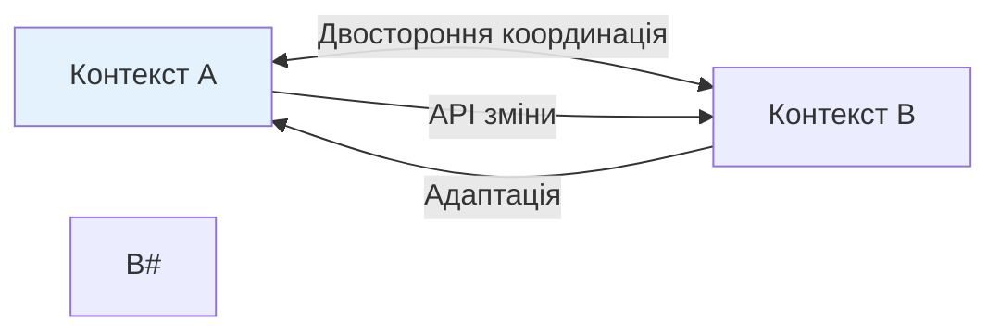
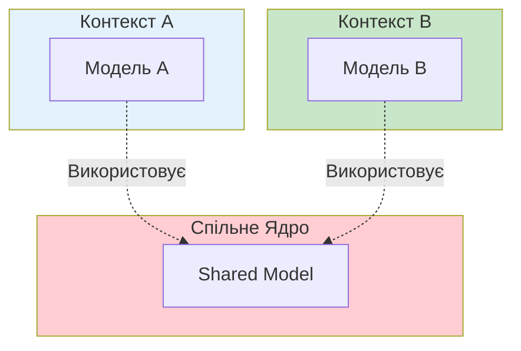
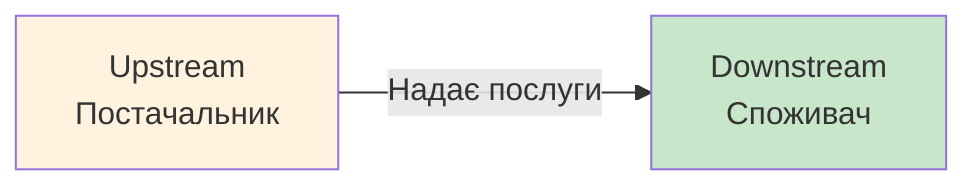
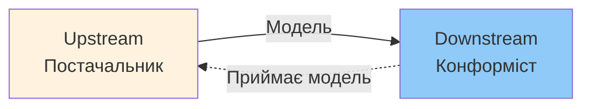
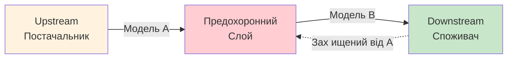
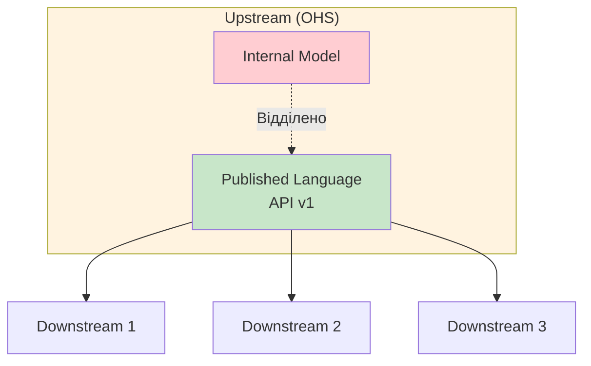
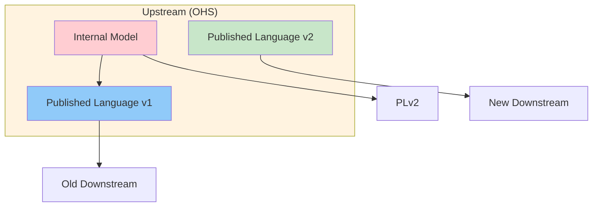
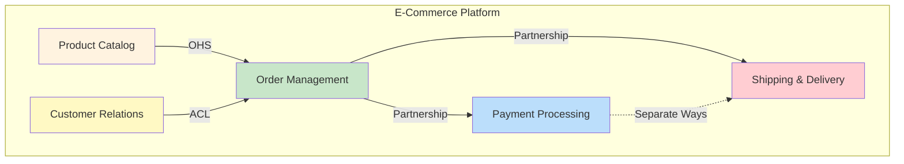

# Інтеграція обмежених контекстів (Bounded Context Integration)

::note{icon="fluent:arrow-swap-24-filled"}
**Ключова ідея глави**

Обмежені контексти не є ізольованими островками. Вони повинні взаємодіяти один з одним для формування цілісної системи. **Паттерни інтеграції** допомагають визначити, як саме ці контексти співпрацюють, з урахуванням організаційної структури та балансу сил між командами.
::

## Вступ

У попередній главі ми дізнались, що **Обмежені контексти (Bounded Contexts)** захищають узгодженість Єдиної мови всередині своїх меж і відкривають можливості до побудови моделей. Ми розуміємо, що:

- Модель не може існувати без меж
- Єдина мова діє лише всередині контексту
- Різні контексти можуть мати різні моделі одних і тих самих бізнес-сутностей

::warning{icon="ph:warning"}
**Важлива істина**

Хоча моделі всередині Обмежених контекстів розвиваються незалежно, **самі контексти НЕ є незалежними**. Система не може складатися з повністю ізольованих компонентів — вони мають взаємодіяти для досягнення бізнес-цілей.
::

### Проблема інтеграції

Коли два Обмежені контексти потребують взаємодії, виникають фундаментальні питання:

::accordion
::accordion-item{title="Питання 1: Різні моделі"}
Обидва контексти мають свої моделі та Єдин мови. Як перетворювати дані між ними?
::

::accordion-item{title="Питання 2: Контракти"}
Яку мову використовувати для визначення інтерфейсу між контекстами?
::

::accordion-item{title="Питання 3: Відповідальність"}
Хто відповідає за перетворення даних — постачальник чи споживач?
::

::accordion-item{title="Питання 4: Баланс сил"}
Яка команда диктує умови інтеграції?
::
::

### Що ми вивчимо?

У цій главі розглянемо **паттерни інтеграції DDD**, які визначаються **характером співпраці між командами**:

::steps

### Крок 1: Співпраця (Cooperation)

Паттерни для команд з щільною взаємодією: **Partnership** та **Shared Kernel**.

### Крок 2: Споживач-Постачальник (Customer-Supplier)

Паттерни з явним балансом сил: **Conformist**, **ACL**, **OHS**.

### Крок 3: Різні шляхи (Separate Ways)

Коли команди вирішують НЕ інтегруватися.

### Крок 4: Карта контекстів

Візуалізація інтеграцій і командних зв'язків.
::

---

## Співпраця (Cooperation Patterns)

Паттерни співпраці стосуються Обмежених контекстів, над якими працюють команди з добре налагодженою взаємодією.

::note{icon="ph:handshake"}
**Визначення: Співпраця**

**Cooperation** — тип відносин між ограниченими контекстами, за якого команди мають взаємозалежні цілі. Успіх однієї команди залежить від успіху іншої, і навпаки.
::

### Характеристики співпраці

| Аспект               | Опис                               |
| -------------------- | ---------------------------------- |
| **Спілкування**      | Щ density, часта синхронізація     |
| **Цілі**             | Взаємозалежні, спільний успіх      |
| **Відповідальність** | Спільна за інтеграцію              |
| **Конфлікти**        | Вирішуються через обговорення      |
| **Гнучкість**        | Висока, обидві сторони адаптуються |

::tip{icon="ph:users"}
**Коли застосовувати**

- Обидва контексти належать одній команді
- Команди працюють в одному офісі
- Цілі бізнес-команд тісно пов'язані
- Є можливість для частих зустрічей

::

---

## Партнерство (Partnership Pattern)

**Partnership** — найпростіший паттерн співпраці. Інтеграція координується ситуативно, "на льоту".

### Як працює партнерство

::mermaid



::

::note{icon="ph:info"}
**Ключові характеристики**

✅ **Двостороння координація**: Жодна команда не нав'язує свою мову  
✅ **Гнучкість**: Зміни обговорюються та узґоджуються  
✅ **Без конфліктів**: Команди співпрацюють без драм  
✅ **Синхронізація**: Часта і безперервна
::

### Приклад: Управління замовленнями та доставкою

Уявімо інтернет-магазин з двома контекстами:

::card-group
::card{icon="mdi:cart"}
#title
Контекст Замовлень
#description
**Відповідальність**: Керує процесом оформлення замовлення

**Модель**: `Order`, `OrderItem`, `Customer`

**Операції**: CreateOrder, ConfirmOrder, CancelOrder
::

::card{icon="mdi:truck-delivery"}
#title
Контекст Доставки
#description
**Відповідальність**: Керує доставкою товарів

**Модель**: `Shipment`, `DeliveryAddress`, `Recipient`

**Операції**: ScheduleShipment, TrackShipment, CompleteDelivery
::
::

**Сценарій інтеграції:**

::steps

### Крок 1: Зміна в контексті Замовлень

Команда Замовлень вирішує додати нове поле `preferredDeliveryTime` до моделі `Order`.

### Крок 2: Уведомлення команди Доставки

Команда Замовлень повідомляє: "Ми додаємо час бажаної доставки. Вам це потрібно?"

### Крок 3: Обговорення

Обидві команди обговорюють:

- Чи може Доставка використати цю інформацію?
- Як буде виглядати API контракт?
- Хто і коли внесе зміни?

### Крок 4: Узгоджена імплеметація

Обидві команди адаптують свої моделі разом, у дусі партнерства.
::

### Технічна реалізація

```typescript
// Контекст Замовлень
interface OrderCreatedEvent {
    orderId: string
    customerId: string
    items: OrderItem[]
    deliveryAddress: Address
    preferredDeliveryTime?: Date // Нове поле
}

// Публікація події
eventBus.publish('order.created', orderCreatedEvent)
```

```typescript
// Контекст Доставки
eventBus.subscribe('order.created', (event: OrderCreatedEvent) => {
  const shipment = новийПоле Shipment({
    orderId: event.orderId,
    address: event.deliveryAddress,
    preferredTime: event.preferredDeliveryTime, // Використання нового поля
  });

  shipment Booking.schedule();
});
```

### Переваги партнерства

::card-group
::card{icon="mdi:check-circle"}
#title
Швидка адаптація
#description
Зміни впроваджуються оперативно без бюрократії
::

::card{icon="mdi:account-group"}
#title
Спільна відповідальність
#description
Обидві команди беруть участь у рішеннях
::

::card{icon="mdi:sync"}
#title
Узгодженість
#description
Обидві сторони розуміють зміни однаково
::
::

### Недоліки та обмеження

::warning{icon="ph:warning-diamond"}
**Коли партнерство НЕ працює**

❌ **Географічна віддаленість**: Різні часові пояси ускладнюють синхронізацію  
❌ **Різні пріоритети**: Команди конкурують за ресурси  
❌ **Великі команди**: Координація стає складною  
❌ **Відсутність довіри**: Команди не готові співпрацювати
::

### Практичні поради

::tip{icon="ph:lightbulb-fill"}
**Як зробити партнерство успішним**

1. **Непрерывна інтеграція (CI)**: Автоматизуйте тести інтеграції
2. **Короткі цикли**: Синхронізуйтесь щодня або щотижня
3. **Спільні зустрічі**: Регулярні стендапи або планування
4. **Документація**: Фіксуйте домовленості про контракти
5. **Повага до змін**: Не нав'язуйте зміни без обговорення

::

---

## Спільне ядро (Shared Kernel Pattern)

**Shared Kernel** — паттерн, за якого кілька Обмежених контекстів розділяють спільну модель або її частину.

::warning{icon="ph:warning"}
**Увага: Винято з правил!**

Цей паттерн **порушує** принцип, що кожен Обмежений контекст має свою модель. Використовуйте його обережно і лише за необхідності!
::

### Концепція Спільного ядра

::mermaid



::

### Приклад: Корпоративна система авторизації

Розглянемо систему з власною моделлю управління правами доступу (Authorization Model).

**Проблема:**  
Кілька конт екстів потребують:

- Перевірки прав користувача
- Управління ролями
- Аудиту доступу

**Рішення:** Спільне ядро `AuthorizationKernel`

```csharp
// Спільне ядро (Shared Kernel)
namespace Company.AuthorizationKernel
{
    public class User
    {
        public UserId Id { get; private set; }
        public List<Role> Roles { get; private set; }
        public List<Permission> DirectPermissions { get; private set; }

        public bool HasPermission(Permission permission)
        {
            // Логіка перевірки: прямі дозволу + успадковані від ролей
            return DirectPermissions.Contains(permission) ||
                   Roles.A ny(r => r.Permissions.Contains(permission));
        }
    }

    public class Role
    {
        public RoleId Id { get; private set; }
        public string Name { get; private set; }
        public List<Permission> Permissions { get; private set; }
    }

    public record Permission(string Resource, string Action);
}
```

**Використання в різних контекстах:**

```csharp
//Контекст Sales
namespace Company.SalesContext
{
    using Company.AuthorizationKernel;

    public class SalesOrderService
    {
        public void CreateOrder(OrderData data, User user)
        {
            // Використання Спільного ядра
            if (!user.HasPermission(new Permission("Orders", "Create")))
                throw new UnauthorizedException();

            //Основни logic...
        }
    }
}

// Контекст Inventory
namespace Company.InventoryContext
{
    using Company.AuthorizationKernel;

    public class WhaleouseService
    {
        public void AdjustStock(StockData data, User user)
        {
            // Використання того самого Спільного ядра
            if (!user.HasPermission(new Permission(" Stock", "Adjust")))
                throw new UnauthorizedException();

            // inventory logic...
        }
    }
}
```

### Обмеження області дії (Shared Scope)

::note{icon="ph:resize"}
**Критично важливо**

Спільне ядро має бути **якомога меншим**. Ідеально — лише інтеграційні контракти та структури даних.
::

**Чому?** Модель з перекриттям зв'язує життєві цикли. Зміна в Спільному ядрі впливає на **всі** контексти.

### Технічна реалізація

#### Варіант 1: Монорепозиторій

```
/company-monorepo
  /packages
    /authorization-kernel    ← Спільне ядро
      - User.cs
      - Role.cs
      - Permission.cs
    /sales-context           ← Контекст A
      - SalesOrder.cs
      - ProductCatalog.cs
    /inventory-context       ← Контекст B
      - Warehouse.cs
      - StockItem.cs
```

Всі контексти посилаються на однакові вихідні файли.

#### Варіант 2: Окрема бібліотека

```bash
# Спільне ядро як NuGet пакет
dotnet pack Authorization Kernel.csproj
dotnet nuget push AuthorizationKernel.1.0.0.nupkg
```

```xml
<!-- У контексті Sales -->
<PackageReference Include="Company.AuthorizationKernel" Version="1.0.0" />

<!-- У контексті Inventory -->
<PackageReference Include="Company.AuthorizationKernel" Version="1.0.0" />
```

### Безперервна інтеграція

::warning{icon="ph:git-branch"}
**Обов'язково!**

Кожна зміна в Спільному ядрі SHALL запускати інтеграційні тести **всіх** контекстів, що його використовують.
::

```yaml
# GitHub Actions приклад
name: Shared Kernel CI

on:
  push:
    paths:
      - 'packages/authorization-kernel/**'

jobs:
  test-all-contexts:
    runs-on: ubuntu-latest
    steps:
      - name: Test Sales Context
        run: dotnet test packages/sales-context/tests

      - name: Test Inventory Context
        run: dotnet test packages/inventory-context/tests

      - name: Test Reporting Context
        run:ії dotnet test packages/reporting-context/tests
```

### Коли використовувати Спільне ядро

::accordion
::accordion-item{title="Сценарій 1: Вартість дублювання > Вартість координації"}
Якщо інтеграція змін у двох окремих моделях складніша, ніж координація змін у спільній кодовій базі.

**Приклад**: Складна бізнес-логіка, яка часто змінюється (Core Subdomain).
::

::accordion Item{title="Сценарій 2: Одна команда, кілька контекстів"}
Коли одна команда володіє кількома контекстами і хоче явно визначити інтеграційні контракти.

**Приклад**: Мікросервісна архітектура з однієї командою.
::

::accordion-item{title="Сценарій 3: Поступова модернізація Legacy"}
Тимчасове рішення під час розбиття монолітної системи на Обмежені контексти.

**Приклад**: Поступовий refactoring великої кодової бази.
::

::accordion-item{title="Сценарій 4: Проблеми з комунікацією"}
Коли команди не можуть реалізувати Partnership через географічні або організаційні обмеження.

**Приклад**: Розподілені команди у різних часових поясах.
::
::

### Коли НЕ використовувати

::warning{icon="ph:x-circle"}
**Антипаттерни**

❌ "Давайте зробимо всю модель спільною!" — Це знищить межі контекстів  
❌ Спільне ядро між багатьма (>3) контекстами — Надмірна зв'язаність  
❌ Спільне ядро для різних команд без координації — Chaos!  
❌ Використання дляBasic моделей (Generic Subdomains) — Краще купити готове рішення
::

---

## Споживач-Постачальник (Customer-Supplier Patterns)

Друга група паттернів стосується відносин, за яких один контекст (Постачальник, Supplier) надає послуги іншому (Споживач, Customer).

::mermaid



::

### Ключова різниця з Cooperation

| Аспект                   | Cooperation     | Customer-Supplier |
| ------------------------ | --------------- | ----------------- |
| **Успіх команд**         | Взаємоза лежний | Незалежний        |
| **Баланс сил**           | Рівний          | Дисбаланс         |
| **Хто створює контракт** | Обидві разом    | Одна із сторін    |
| **Адаптація**            | Спільна         | Одностороння      |

::note{icon="ph:scale"}
**assuring Баланс сил**

У відносинах Consumer-Supplier завжди є **дисбаланс сил**. Інтеграційний контракт диктує або Постачальник (Upstream), або Споживач (Downstream).
::

---

## Конформіст (Conformist Pattern)

**Conformist** — паттерн, за якого Downstream команда **приймає модель** Upstream команди без змін.

### Концепція

::mermaid



::

::note{icon="ph:check-square"}
**Визначення**

**Конформіст** — Downstream команда, яка відмовляється від частини своєї автономності і використовує модель Upstream "як є", без перетворень.
::

### Коли це виправдано?

::card-group
::card{icon="mdi:star"}
#title
Стандартна модель
#description
Upstream надає добре зарекомендовану, промислову модель (наприклад, OAuth2, OpenAPI)
::

::card{icon="mdi:check-decagram"}
#title
Підходяща модель
#description
Модель Upstream цілком задовольняє потреби Downstream
::

::card{icon="mdi:account-network"}
#title
Зовнішній постачальник
#description
Upstream — зовнішній сервіс (Google Maps API, Stripe Payments), який не можна змінити
::
::

### Приклад: Інтеграція з Stripe

Уявімо, що наш контекст Payments інтегрується зі Stripe для обробки платежів.

```typescript
// Stripe API Model (Upstream)
interface StripeCharge {
    id: string
    amount: number // В центах!
    currency: string
    status: 'succeeded' | 'pending' | 'failed'
    customer: string
    created: number // Unix timestamp
}

// Наш контекст Payments (Downstream - Conformist)
class PaymentService {
    async processPayment(amount: number, currency: string, customerId: string) {
        // Використовуємо модель Stripe безпосередньо
        const charge: StripeCharge = await stripe.charges.create({
            amount: amount * 100, // Конвертуємо в центи
            currency: currency,
            customer: customerId,
        })

        // Зберігаємо заряд у форматі Stripe
        await db.charges.insert({
            stripeId: charge.id,
            amount: charge.amount, // В центах, як у Stripe
            currency: charge.currency,
            status: charge.status, // Використовуємо статуси Stripe
            createdAt: new Date(charge.created * 1000),
        })

        return charge
    }
}
```

### Переваги Conformist

::tip{icon="ph:check-circle-fill"}
**Плюси**

✅ **Простота**: Немає потреби в перетвореннях  
✅ **Швидкість розробки**: Менше коду  
✅ **Стабільність**: Використання перевіреної моделі  
✅ **Підтримка**: Upstream забезпечує документацію
::

### Недоліки

::warning{icon="ph:warning-circle"}
**Мінуси**

❌ **Втрата автономності**: Модель диктується ззовні  
❌ **Залежність**: Зміни Upstream впливають на Downstream  
❌ **Незручна модель**: Може не ідеально підходити для бізнес-потреб  
❌ **Обмеження**: Неможливість адаптувати під свою Єдину мову
::

---

## Предохоронний слой (Anti-Corruption Layer Pattern)

**ACL (Anti-Corruption Layer)** — паттерн, який **ізолює** Downstream контекст від моделі Upstream через проміжний шар перетворення.

::note{icon="ph:shield"}
**Визначення**

**Предохоронний слой** — механізм трансляції між моделлю Upstream та моделлю Downstream, який захищає цілісність Єдиної мови Downstream.
::

### Концепція

::mermaid



::

### Коли використовувати ACL?

::accordion
::accordion-item{title="Сценарій 1: Core Subdomain"}
**Проблема**: Downstream містить Core Subdomain, який потребує ідеальної моделі.

**Рішення**: ACL дозволяє зберегти чистоту модели Core, незалежно від Upstream.

**Приклад**: Система ціноутворення як Core — не може залежати від структури даних зовнішнього постачальника.
::

::accordion-item{title="Сценарій 2: Неефективна модель Upstream"}
**Проблема**: Модель Upstream плутана, застаріла або погано спроектована.

**Рішення**: ACL перетворює "безлад" у чітку модель Downstream.

**Приклад**: Інтеграція з Legacy-системою з громіздківеличними структурами даних.
::

::accordion-item{title="Сценарій 3: Часті зміни Upstream"}
**Проблема**: Upstream постійно змінює свій API.

**Рішення**: ACL ізолює ці зміни, модель Downstream залишається стабільною.

**Приклад**: Інтеграція з третьою стороною, що часто оновлює API.
::
::

### Приклад: Legacy CRM Integration

Уявімо, що нашій сучасній системі потрібно інтегруватися з застарілою CRM.

**Legacy CRM Model (Upstream — лиш):**

```xml
<!-- Legacy XML Response -->
<Customer_Record>
  < ID>12345</ID>
  <FN>John</FN>
  <LN>Doe</LN>
  <Email_Address>john.doe@example.com</Email_Address>
  <Phone_Num>+1234567890</Phone_Num>
  <Tags>VIP,Premium,Enterprise</Tags>
  <Created_TS>1609459200</Created_TS>
</Customer_Record>
```

**Наша модель (Downstream — чиста):**

```typescript
// Наша чиста модель предметної області
class Customer {
    constructor(
        public readonly id: CustomerId,
        public readonly name: PersonName,
        public readonly email: Email,
        public readonly phone: PhoneNumber,
        public readonly segments: CustomerSegment[],
        public readonly registeredAt: Date,
    ) {}

    isVIP(): boolean {
        return this.segments.includes(CustomerSegment.VIP)
    }
}

// Value Objects
class PersonName {
    constructor(
        public readonly firstName: string,
        public readonly lastName: string,
    ) {}

    get fullName(): string {
        return `${this.firstName} ${this.lastName}`
    }
}
```

**Предохоронний слой:**

```typescript
// ACL: Adapter для Legacy CRM
class LegacyCRMAdapter {
  constructor(private legacyClient: Leg acyCRMClient) {}

  async getCustomer(id: string): Promise<Customer> {
    // Отримуємо дані з Legacy
    const legacyData = await this.legacyClient.fetchCustomerXML(id);

    // Трансляція в нашу модель
    return this.translate(legacyData);
  }

  private translate(legacy: LegacyCustomerXML): Customer {
    return new Customer(
      new CustomerId(legacy.ID),
      new PersonName(legacy.FN, legacy.LN),
      new Email(legacy.Email_Address),
      new PhoneNumber(legacy.Phone_Num),
      this.parseSegments(legacy.Tags),
      new Date(parseInt(legacy.Created_TS) * 1000),
    );
  }

  private parseSegments(tags: string): CustomerSegment[] {
    return tags.split(',').map(tag => {
      switch (tag.trim()) {
        case 'VIP': return CustomerSegment.VIP;
        case 'Premium': return CustomerSegment.PREMIUM;
        case 'Enterprise': return CustomerSegment.ENTERPRISE;
        default: return CustomerSegment.REGULAR;
      }
    });
  }
}

// Використання в додатку
class CustomerService {
  constructor(private crm: LegacyCRMAdapter) {}

  async getCustomerDetails(id: string): Promise<Customer> {
    // Робота з чистою моделлю, незалежно від Legacy!
    const customer = await this.crm.getCustomer(id);

    if (customer.isVIP()) {
      // Бізнес-логіка використовує чисту модель
      await this.апplyVIPDiscount(customer);
    }

    return customer;
  }
}
```

### Структура ACL

PreдохоронПівний слой зазвичай складається з трьох компонентів:

::steps

### Adapter (Адаптер)

Відповідає за підключення до Upstream API.

```typescript
class UpstreamAPIAdapter {
    async fetchData(): Promise<UpstreamModel> {
        // HTTP, gRPC, чи інший протокол
    }
}
```

### Translator (Перекладач)

Перетворює модель Upstream у модель Downstream.

```typescript
class ModelTranslator {
    translate(upstream: UpstreamModel): DownstreamModel {
        // Логіка перетворення
    }
}
```

### Facade (Фасад)

Надає зручний інтерфейс для Downstream контексту.

```typescript
class UpstreamFacade {
    constructor(
        private adapter: UpstreamAPIAdapter,
        private translator: ModelTranslator,
    ) {}

    async getData(): Promise<DownstreamModel> {
        const upstream = await this.adapter.fetchData()
        return this.translator.translate(upstream)
    }
}
```

::

### Переваги ACL

::card-group
::card{icon="mdi:shield-check"}
#title
Ізоляція
#description
Модель Downstream захищена від змін Upstream
::

::card{icon="mdi:script-text"}
#title
Чиста єдина мова
#description
Downstream використовує власну терміноло гію
::

::card{icon="mdi:swap-horizontal"}
#title
Гнучкість
#description
Легко замінити Upstream на інший сервіс
::
::

### Недоліки

::warning{icon="ph:warning"}
**Обмеження**

❌ **Складність**: Більше коду для підтримки  
❌ **Продуктивність**: Додатковий шар перетворення  
❌ **Вартість**: Потребує більше часу на розробку
::

---

## Сервіс з Відкритим Протоколом (Open-Host Service Pattern)

**OHS (Open-Host Service)** — паттерн, за якого Upstream **захищає Downstream споживачів**, надаючи стабільний, зручний публічний API.

::note{icon="ph:globe"}
**Визначення**

**Open-Host Service** — Upstream, який відділяє свою внутрішню модель від публічного інтерфейсу, забезпечуючи стабільний **Published Language** (опублікований язик).
::

### Концепція

::mermaid



::

### Published Language

**Published Language (Опублікований язик)** — це інтерфейс, орієнтований на інтеграцію, а не на внутрішню Єдину мову.

```typescript
// Внутрішня модель Upstream (НЕ доступна зовні)
class InternalProduct {
    private id: ProductId
    private details: ProductDetails
    private pricing: PricingModel
    private inventory: InventoryTracking

    // Складна internal logic
}

// Published Language (Публічний інтерфейс)
interface ProductAPI {
    id: string
    name: string
    price: {
        amount: number
        currency: string
    }
    availability: 'in_stock' | 'out_of_stock' | 'pre_order'
}

// Upstream API Controller
class ProductController {
    async getProduct(id: string): Promise<ProductAPI> {
        const internal = await repo.find(id)

        // Перекладання Internal Model → Published Language
        return {
            id: internal.id.value,
            name: internal.details.name,
            price: {
                amount: internal.pricing.currentPrice.amount,
                currency: internal.pricing.currentPrice.currency,
            },
            availability: this.mapAvailability(internal.inventory.status),
        }
    }
}
```

### Versioning: Підтримка кількох версій

Одна з переваг OHS — можливість підтримки **кількох версій API одночасно**.

::mermaid



::

```typescript
// API v1 (Legacy)
app.get('/api/v1/products/:id', async (req, res) => {
    const product = await service.getProduct(req.params.id)

    res.json({
        product_id: product.id,
        product_name: product.name,
        price_amount: product.price.amount,
    })
})

// API v2 (Новий)
app.get('/api/v2/products/:id', async (req, res) => {
    const product = await service.getProduct(req.params.id)

    res.json({
        id: product.id,
        name: product.name,
        pricing: product.price,
        availability: product.availability,
        metadata: {
            version: '2.0',
            lastUpdated: new Date().toISOString(),
        },
    })
})
```

### Порівняння: ACL vs OHS

| Аспект               | ACL                   | OHS                             |
| -------------------- | --------------------- | ------------------------------- |
| **Хто перекладає**   | Downstream (Споживач) | Upstream (Постачальник)         |
| **Баланс сил**       | Upstream сильніший    | Downstream сильніший            |
| **Відповідальність** | Споживач захищає себе | Постачальник захищає споживачів |
| **Складність**       | У Downstream          | У Upstream                      |

::note{icon="ph:arrows-left-right"}
**Цікавий факт**

OHS — це "перевернутий" ACL. Обидва паттерни вирішують проблему перекладу моделей, але відповідальність лежить на різних боках.
::

---

## Різні Шляхи (Separate Ways Pattern)

**Separate Ways** — паттерн повного **відмови від інтеграції**. Команди вирішують працювати незалежно і дублюють функціональність.

::note{icon="ph:path"}
**Визначення**

**Separate Ways** — стратегічне рішення про те, що вартість інтеграції перевищує вигоди, і команди вирішують рухатися різними шляхами.
::

### Коли це виправдано?

::accordion
::accordion-item{title="Проблеми комунікації"}
**Ситуація**: Команди не можуть ефективно співпрацювати через:

- Географічну віддаленість
- Організаційну політику
- Культурні або мовні бар'єри

**Рішення**: Дублювати функціональність у кожному контексті.
::

::accordion-item{title="Generic Subdomain"}
**Ситуація**: Піддомен є Generic і доступне просте рішення.

**Приклад**: Логтування, моніторинг, автентифікація.

**Рішення**: Кожен контекст інтегрує готове рішення локально (наприклад, Serilog, Winston).
::

::accordion-item{title="Несумісні моделі"}
**Ситуація**: Моделі настільки різні, що:

- Conformist неможливий
- ACL надто складний та дорогий

**Рішу**: Дублювати функціональність окремо.
::
::

### Приклад: Логування

```typescript
// Контекст Orders
import winston from 'winston';

const logger = winston.create Logger();

class OrderService {
  createOrder(data: OrderData) {
    logger.info('Order created', { orderId: data.id });
    // ...
  }
}

// Контекст Payments
import pino from 'pino';

const logger = pino();

class PaymentService {
  processPayment(data: PaymentData) {
    logger.info({ paymentId: data.id }, 'Payment processed');
    // ...
  }
}
```

Обидва контексти використовують **різні** бібліотеки логування, кожна інтегрована локально.

### Обмеження

::warning{icon="ph:warning-octagon"}
**Не використовуйте для Core Subdomains!**

Дублювання реалізації Core Subdomains **суперечить** бізнес-стратегії компанії. Core має бути оптимізованим та кращіdifferent.
::

---

## Карта контекстів (Context Map)

**Context Map** — візуальне представлення Обмежених контекстів системи та їх інтеграцій.

::mermaid



::

### Цінність Context Map

::card-group
::card{icon="mdi:map"}
#title
Високорівневе бачення
#description
Розуміння компонентів системи та їх моделей
::

::card{icon="mdi:account-group"}
#title
Модці комунікації
#description
Які команди співпрацюють, а які ні
::

::card{icon="mdi:alert-circle"}
#title
Організаційні проблеми
#description
Виявлення "вузьких місць" та конфліктів
::
::

### Приклад реальної Context Map

```
[Product Catalog] --OHS--> [Order Management]
                           |
                           +--Partnership--> [Payment Processing]
                           |
                           +--Partnership--> [Shipping & Delivery]

[Customer CRM] --ACL--> [Order Management]

[Analytics] --Conformist--> [Order Management]
           --Conformist--> [Product Catalog]

[Inventory] --Separate Ways-- [Shipping]
```

### Підтримка Context Map

::tip{icon="ph:git-branch"}
**Best Practices**

1. **Як код**: Використовуйте Context Mapper або PlantUML
2. **Living Document**: Оновлюйте при змінах
3. **Shared Responsibility**: Кожна команда оновлює свої інтеграції
4. **Version Control**: Зберігайте в Git

::

---

## Резюме та ключові думки

У цій главі ми вивчили паттерни інтеграції Обмежених контекстів, класифіковані за типом командної співпраці.

::note{icon="ph:check-circle-fill"}
**Ключові висновки**

### typeПаттерни співпраці (Cooperation)

- **Partnership**: Двостороння координація, щільна співпраця
- **Shared Kernel**: Спільна модель, використовувати обережно

### Споживач-Постачальник (Customer-Supplier)

- **Conformist**: Downstream приймає модель Upstream
- **ACL**: Downstream захищає себе через трансляцію
- **OHS**: Upstream захищає Downstream через Published Language

### Різні офілії (Separate Ways)

- Відмова від інтеграції, дублювання функціональності
- НЕ використовувати для Core Subdomains!

### Context Map

- Візуалізація інтеграцій та командних зв'язків
- Інструмент стратегічного аналізу

::

### Вибір паттерну

::accordion
::accordion-item{title=" як вибрати правильний паттерн?"}

1. **Оцініть баланс сил**: Хто диктує умови?
2. **Чи є автономія**: Наскільки важлива незалежність моделі?
3. **Які ресурси**: Скільки часу/грошей є на інтеграцію?
4. **Командна динаміка**: Як добре команди співпрацюють?
5. **Тип піддомена**: Core, Generic чи Supporting?

::

::

### Зв

'язок з наступними темами

Тепер, коли ми розуміємо, як интегруються Обмежені контексти на стратегічному рівні, наступним кроком є вивчення **тактичного проектування** — як реалізовувати бізнес-логіку всередині контексту.

::tip{icon="ph:arrow-right"}
**Наступні кроки**

У наступних главах розглянемо:

- Паттерни реалізації бізнес-логіки (Transaction Script, Domain Model)
- Architectурні паттерни (Layered, Hexagonal, CQRS)
- Технічну інтеграцію (Messaging, Sagas)

::
