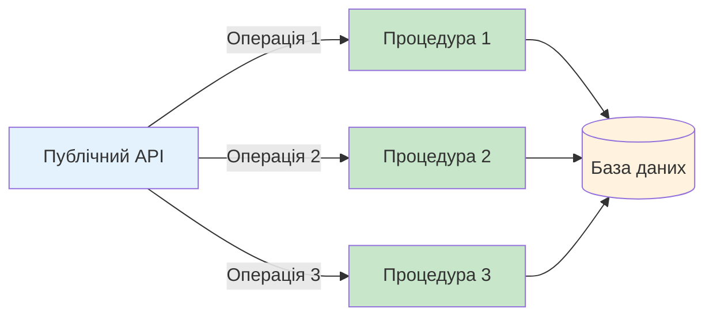
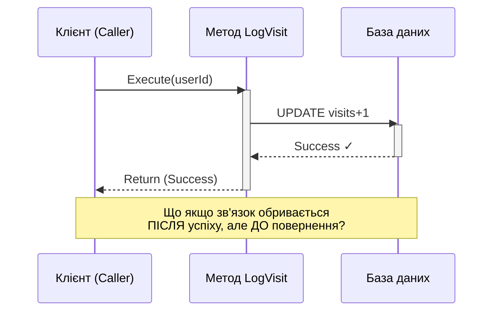
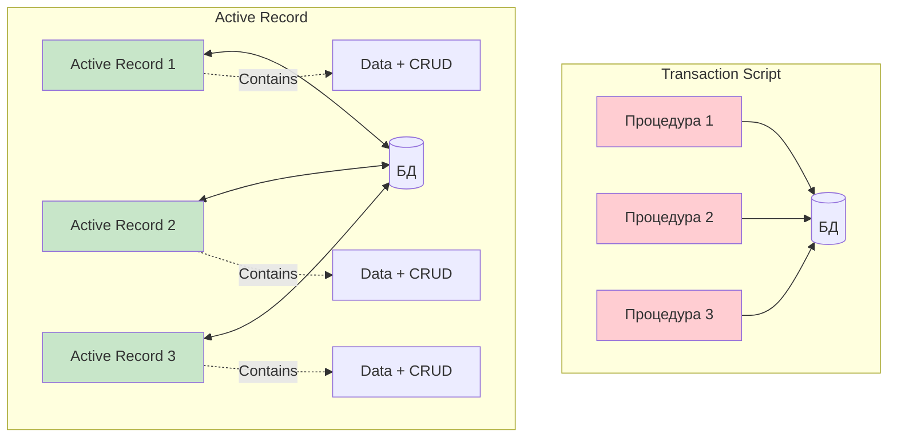
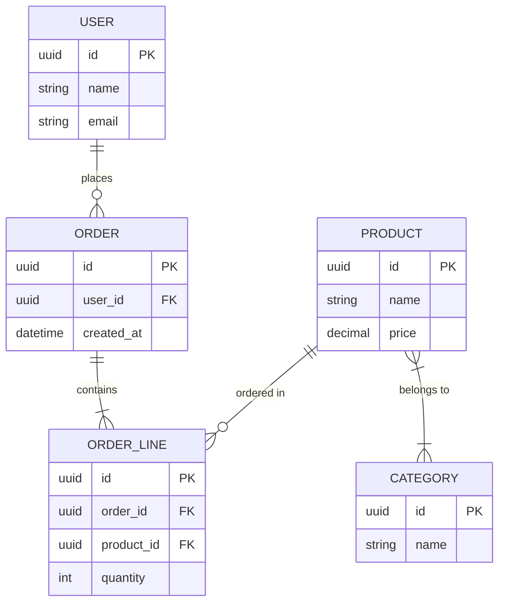

# Реалізація простої бізнес-логіки (Implementing Simple Business Logic)

::note{icon="fluent:code-24-filled"}
**Ключова ідея глави**

Бізнес-логіка — найважливіша частина програмного забезпечення. Саме вона є першочерговою метою створення ПЗ. Незалежно від того, наскільки привабливий інтерфейс чи швидка база даних, якщо програма марна для бізнесу — це лише дорога демонстрація технологій.
::

## Вступ

У [Главі 2](/ddd/domain-expert-knowledge) ми дізналися, що **не всі піддомени однакові**. Різні піддомени мають різні рівні стратегічної важливості та складності. В цій главі розпочнемо вивчення різних способів моделювання та реалізації бізнес-логіки.

::tip{icon="ph:lightbulb"}
**Чому важливо обирати правильний паттерн?**

Застосування складного паттерна для простої логіки призводить до **непотрібної складності (accidental complexity)**. Навпаки, використання простого паттерна для складної логіки призводить до **великого клубка бруду (big ball of mud)** — неможливого для підтримки коду.
::

### Що ми вивчимо?

Почнемо з двох паттернів для **відносно простої** бізнес-логіки:

::card-group
::card{icon="mdi:script-text"}
#title
Transaction Script
#description
Процедурний підхід до організації бізнес-логіки. Кожна операція — окремий сценарій.
::

::card{icon="mdi:database-cog"}
#title
Active Record
#description
Об'єкти даних з вбудованими CRUD-методами для роботи зі сховищем.
::
::

---

## Транзакційний сценарій (Transaction Script)

> Організує бізнес-логіку за процедурами, де кожна процедура обробляє один запит від користувача.
>
> — **Martin Fowler**, Patterns of Enterprise Application Architecture

### Концепція паттерна

::mermaid



::

Публічний інтерфейс системи можна розглядати як **набір бізнес-транзакцій**, доступних для виконання споживачами. Ці транзакції можуть:

- 📖 Читати інформацію з системи
- ✏️ Змінювати стан системи
- 🔄 Виконувати обидві операції

Паттерн **Transaction Script** вибудовує бізнес-логіку на основі процедур, де:

✅ Кожна процедура реалізує **одну операцію**  
✅ Публічні операції використовуються як **межі інкапсуляції**  
✅ Процедури можуть безпосередньо звертатися до БД або через тонкий шар абстракції

### Реалізація

Кожна процедура реалізована у вигляді **простого процедурного сценарію**. Єдина непохитна вимога — **транзакційна поведінка**.

::warning{icon="ph:warning"}
**Золоте правило транзакцій**

Кожна операція має завершуватися **або успіхом, або невдачею**, але ніколи не залишати систему в недопустимому стані.

Навіть якщо виконання завершується збоєм у найневідповідніший момент, система повинна залишатись узгодженою — шляхом відкоту змін або виконання компенсуючих дій.
::

#### Приклад: Конвертація JSON → XML

```csharp
public class ConvertFileJob
{
    private IDatabase _db;

    public void Execute()
    {
        _db.StartTransaction();

        try
        {
            var job = _db.LoadNextJob();
            var json = LoadFile(job.Source);
            var xml = ConvertJsonToXml(json);

            WriteFile(job.Destination, xml.ToString());
            _db.MarkJobAsCompleted(job);

            _db.Commit();
        }
        catch
        {
            _db.Rollback();
            throw;
        }
    }
}
```

::accordion
::accordion-item{title="Аналіз прикладу"}
**Чому (Why)**: Нам потрібно конвертувати файли JSON у XML як частина ETL-процесу. Операція має бути атомарною.

**Що (What)**: Використовуємо Transaction Script для організації простої process-based логіки.

**Як (How)**:

1. Відкриваємо транзакцію
2. Завантажуємо завдання
3. Конвертуємо файл
4. Фіксуємо зміни або відкочуємо при помилці

**Ключовий момент**: Транзакція забезпечує, що або все виконається успішно, або нічого не зміниться.
::
::

---

## Це не так просто, як здається!

::note{icon="ph:student"}
**З досвіду викладання DDD**

Коли я представляю паттерн Transaction Script на заняттях з Domain-Driven Design, студенти часто здивовані: «Навіщо витрачати на це час? Хіба ми не для складніших моделей тут?»

Справа в тому, що Transaction Script — **основа для складніших паттернів**. І незважаючи на уявну простоту, саме в ньому **найлегше помилитися**.
::

Безліч production-проблем, які я допомагав відлагоджувати, зводилися до **неправильної реалізації транзакційної поведінки**.

### Три поширені помилки

::steps

### Крок 1: Відсутність транзакційної поведінки

Найпростіша помилка — випуск кількох оновлень без транзакції, що їх охоплює.

### Крок 2: Розподілені транзакції

Спроба атомарно оновити БД і опублікувати подію в шині повід омлень.

### Крок 3: Неявні розподілені транзакції

Навіть однorядкове оновлення може бути розподіленою транзакцією!
::

---

### Помилка №1: Відсутність транзакції

Розглянемо метод, що оновлює запис у таблиці `Users` та вставляє запис у `VisitsLog`:

```csharp
public class LogVisit
{
    private IDatabase _db;

    public void Execute(Guid userId, DateTime visitedOn)
    {
        // ❌ Небезпечно! Дві операції без транзакції
        _db.Execute("UPDATE Users SET last_visit=@p1 WHERE user_id=@p2",
            visitedOn, userId);

        _db.Execute(@"INSERT INTO VisitsLog(user_id, visit_date)
            VALUES(@p1, @p2)", userId, visitedOn);
    }
}
```

::warning{icon="ph:bug"}
**Проблема: Race Condition**

Якщо після оновлення `Users` (рядок 8), але **до** успішного додавання в `VisitsLog` (рядок 11) станеться будь-яка проблема — система опиниться в неузгодженому стані:

- ✅ Таблиця `Users` оновлена
- ❌ Запис у `VisitsLog` відсутній

**Причини збою**: мережевий збій, timeout БД, deadlock, збій сервера, тощо.
::

#### Рішення: Додавання транзакції

```csharp
public class LogVisit
{
    private IDatabase _db;

    public void Execute(Guid userId, DateTime visitedOn)
    {
        try
        {
            _db.StartTransaction(); // ✅ Початок транзакції

            _db.Execute("UPDATE Users SET last_visit=@p1 WHERE user_id=@p2",
                visitedOn, userId);

            _db.Execute(@"INSERT INTO VisitsLog(user_id, visit_date)
                VALUES(@p1, @p2)", userId, visitedOn);

            _db.Commit(); // ✅ Фіксація змін
        }
        catch
        {
            _db.Rollback(); // ✅ Відкат при помилці
            throw;
        }
    }
}
```

::tip{icon="ph:check-circle"}
**Переваги рішення**

Реляційні БД мають вбудовану підтримку транзакцій, що дозволяє атомарно виконувати кілька операцій. Це **легко виправити**.
::

Але що робити, коли потрібно оновити кілька сховищ даних, які не підтримують розподілені транзакції?

---

### Помилка №2: Розподілені транзакції

У сучасних розподілених системах звичайна практика — **внести зміни в БД, а потім опублікувати події** в шину повідомлень для оповіщення інших компонентів.

Припустімо, замість логування візиту в таблицю, нам потрібно **опублікувати подію**:

```csharp
public class LogVisit
{
    private IDatabase _db;
    private IMessageBus _messageBus;

    public void Execute(Guid userId, DateTime visitedOn)
    {
        // ❌ Проблема: дві різні системи без загальної транзакції
        _db.Execute("UPDATE Users SET last_visit=@p1 WHERE user_id=@p2",
            visitedOn, userId);

        _messageBus.Publish("VISITS_TOPIC",
            new { UserId = userId, VisitDate = visitedOn });
    }
}
```

::warning{icon="ph:warning-octagon"}
**Проблема: Dual Write**

Як і в попередньому прикладі, будь-який збій після виконання рядка 8, але до успішного виконання рядка 11, призведе до пошкодження стану:

- ✅ Таблиця `Users` оновлена
- ❌ Інші компоненти **не оповіщені** (публікація дала збій)

**НЕ існує простого рішення!** Розподілені транзакції, що охоплюють кілька сховищ даних:

- 🐌 Складні
- 📉 Важко масштабуються
- ❌ Не стійкі до помилок

::

::accordion
::accordion-item{title="Рішення для розподілених транзакцій"}
Існують спеціалізовані паттерни для вирішення цієї проблеми:

**Transactional Outbox Pattern** (Глава 9)

- Зберігаємо подію в БД разом із бізнес-даними в одній транзакції
- Окремий процес читає події та публікує їх

**CQRS Pattern** (Глава 8)

- Архітектурний паттерн для заповнення кількох сховищ даних
- Розділення команд і запитів

Детальніше розглянемо ці підходи в наступних главах.
::
::

---

### Помилка №3: Неявні розподілені транзакції

Розглянемо метод, що виглядає **обманливо простим**:

```csharp
public class LogVisit
{
    private IDatabase _db;

    public void Execute(Guid userId)
    {
        // Здається просто? Насправді це розподілена транзакція!
        _db.Execute("UPDATE Users SET visits=visits+1 WHERE user_id=@p1",
            userId);
    }
}
```

::note{icon="ph:question"}
**Питання для роздумів**

Цей метод оновлює лише **одне значення в одній таблиці** в одній базі даних. Чому це все ж таки розподілена транзакція?
::

::mermaid



::

#### Проблема: Втрачений ack (acknowledgment)

Цей приклад є **розподіленою транзакцією**, оскільки передає інформацію в **дві системи**:

1. 💾 База даних
2. 📞 Зовнішній процес (викликач методу)

::warning{icon="ph:network-slash"}
**Сценарії збою**

Метод `Execute` має тип `void` — не повертає даних. Але він **все одно повідомляє результат**: у разі невдачі викликач отримає виключення.

**Що якщо метод завершився успішно, але повернення результату дало збій?**

- **REST-сервіс**: Збій мережі між сервером і клієнтом
- **Локальний процес**: Процес завершився зі збоєм до того, як викликач встиг відстежити успіх

В обох випадках **споживач припускає помилку** і намагається викликати `LogVisit` знову. Повторне виконання призведе до **некоректного збільшення** лічильника: +2 замість +1.
::

#### Рішення №1: Ідемпотентність через передачу значення

Зробимо операцію **ідемпотентною** — приводити до однакового результату навіть при багаторазовому повторенні:

```csharp
public class LogVisit
{
    private IDatabase _db;

    // ✅ Споживач передає очікуване значення
    public void Execute(Guid userId, long visits)
    {
        // MEETING навіть при повторних викликах буде встановлено те саме значення
        _db.Execute("UPDATE Users SET visits = @p1 WHERE user_id=@p2",
            visits, userId);
    }
}
```

::tip{icon="ph:repeat"}
**Чому це працює?**

1. Викликач спочатку **зчитує** поточне значення лічильника
2. Локально **збільшує** його
3. Передає **оновлене значення** як параметр

Навіть якщо операція виконається кілька разів, кінцевий результат не зміниться!
::

#### Рішення №2: Оптимістична блокування

Перед викликом `LogVisit` викликач зчитує поточне значення і передає його для перевірки:

```csharp
public class LogVisit
{
    private IDatabase _db;

    // ✅ Використовуємо expected value для оптимістичної блокування
    public void Execute(Guid userId, long expectedVisits)
    {
        // Оновлення відбудеться ТІЛЬКИ якщо значення не змінилось
        var rowsAffected = _db.Execute(
            @"UPDATE Users
              SET visits = visits + 1
              WHERE user_id=@p1 AND visits = @p2",
            userId, expectedVisits);

        if (rowsAffected == 0)
        {
            throw new ConcurrencyException("Visits count has changed");
        }
    }
}
```

::accordion
::accordion-item{title="Як працює оптимістична блокування?"}
**Механізм**:

1. Викликач зчитує `visits = 5`
2. Передає `expectedVisits = 5`
3. UPDATE виконується **тільки якщо** `visits = 5`
4. Якщо значення змінилось (інший процес оновив) — `rowsAffected = 0`

**Наступні виклики** з тими ж параметрами не змінять дані, оскільки умова `WHERE...visits = @p2` не виконається.

**Переваги**:

- ✅ Захист від конкурентних оновлень
- ✅ Ідемпотентність операції
- ✅ Явне повідомлення про конфлікти

::

::

---

## Коли застосовувати Transaction Script?

::card-group
::card{icon="mdi:thumb-up"}
#title
Підходить для
#description
**Вспомогательні піддомени (Supporting Subdomains)** — логіка за визначенням не відрізняється складністю.

**ETL-процеси** — extract-transform-load операції з простими перетвореннями.

**Адаптери інтеграції** — інтеграція з зовнішніми системами або universal subdomains.

**Anti-Corruption Layer** — як частина захисного шару (детальніше в Главі 9).
::

::card{icon="mdi:thumb-down"}
#title
НЕ підходить для
#description
**Основні піддомени (Core Subdomains)** — не справиться з високою складністю бізнес-логіки.

**Складна бізнес-логіка** — призведе до дублювання та розсинхронізації коду.

**Багато бізнес-правил** — важко підтримувати узгодженість.
::
::

### Переваги паттерна

| Аспект              | Опис                                |
| ------------------- | ----------------------------------- |
| **Простота**        | Мінімальна кількість абстракцій     |
| **Продуктивність**  | Мінімальні накладні витрати         |
| **Зрозумілість**    | Легко розібратися в реалізації      |
| **Прямолінійність** | Прев зв'язок між операцією та кодом |

### Недоліки паттерна

::warning{icon="ph:warning-diamond"}
**Обмеження Transaction Script**

❌ **Дублювання логіки** — чим складніша бізнес-логіка, тим більше повторюється код між процедурами

❌ **Розсинхронізація** — продубльований код легко призводить до різної поведінки

❌ **Big Ball of Mud** — складна логіка в Transaction Script перетворюється на непідтримуваний клубок

❌ **Масштабованість** — важко додавати нову функціональність без порушення існуючої
::

::note{icon="ph:info"}
**Репутація паттерна**

Простота Transaction Script створила йому сумнівну репутацію. Іноді його навіть розглядають як **антипаттерн**.

Але потрібно відзначити: незважаючи на недоліки, цей паттерн отримав у розробці ПЗ **дуже широке поширення**. Всі паттерни реалізації бізнес-логіки, що розглядатимуться далі, так чи інакше **базуються на Transaction Script**.
::

---

## Активна запис (Active Record)

> Об'єкт, що представляє рядок у таблиці або представленні бази даних, інкапсулює доступ до бази даних і бізнес-логіку, що оперує цими даними.
>
> — **Martin Fowler**, Patterns of Enterprise Application Architecture

### Відмінності від Transaction Script

**Active Record**, як і Transaction Script, придатний для простої бізнес-логіки. Але відмінність:

::mermaid



::

**Transaction Script** працює з простими даними та процедурами.  
**Active Record** може працювати зі **складними структурами даних** — деревами об'єктів та ієрархіями.

### Проблема: Дублювання коду

Розглянемо складнішу модель даних:

::mermaid



::

::warning{icon="ph:copy"}
Робота з такими структурами даних через **Transaction Script** призвела б до **великого обсягу повторюваного коду**: зіставлення даних з їх представленням у пам'яті дублювалося б скрізь.
::

### Рішення: Active Record Objects

Паттерн використовує спеціальні об'єкти — **Active Records** — для представлення складних структур даних:

```csharp
// ✅ Active Record інкапсулює і дані, і доступ до БД
public class User
{
    public Guid Id { get; set; }
    public string Name { get; set; }
    public string Email { get; set; }

    // CRUD-методи вбудовані в об'єкт
    public void Save() { /* ORM logic */ }
    public static User Load(Guid id) { /* ORM logic */ }
    public void Delete() { /* ORM logic */ }
}

public class Order
{
    public Guid Id { get; set; }
    public Guid UserId { get; set; }
    public List<OrderLine> Lines { get; set; }

    public void Save() { /* ORM logic */ }
    public static Order Load(Guid id) { /* ORM logic */ }
}
```

::tip{icon="ph:database"}
**Зв'язок з ORM**

Об'єкти Active Record зазвичай пов'язані з **ORM-фреймворками** (Entity Framework, Hibernate, ActiveRecord) або іншими інструментами доступу до даних.

Назва паттерна походить від того факту, що кожна структура даних є «**активною**» — реалізує логіку доступу до даних.
::

### Використання в Transaction Script

Бізнес-логіка все ще організована як **транзакційний сценарій**, але замість прямого доступу до БД маніпулює об'єктами Active Record:

```csharp
public class CreateUser
{
    private IDatabase _db;

    public void Execute(UserDetails userDetails)
    {
        try
        {
            _db.StartTransaction();

            // ✅ Працюємо через Active Record, а не з SQL напряму
            var user = new User();
            user.Name = userDetails.Name;
            user.Email = userDetails.Email;
            user.Save(); // Active Record сам знає як зберегтись

            _db.Commit();
        }
        catch
        {
            _db.Rollback();
            throw;
        }
    }
}
```

::accordion
::accordion-item{title="Мета паттерна Active Record"}
**Інкапсуляція складності**

Головна мета — **інкапсулювати складність зіставлення** об'єкта в пам'яті на схему бази даних.

**Що може містити Active Record?**

Крім операцій зі сховищем, об'єкти можуть містити:

- ✅ Валідацію нових значень перед присвоєнням
- ✅ Простні бізнес-процедури для маніпуляції даними
- ✅ Перевірку бізнес-правил

**Ключова особливість**

Active Record **розділяє структури даних і поведінку**. Зазвичай поля мають публічні getter/setter, що дозволяє зовнішнім процедурам змінювати стан.
::
::

---

## Коли застосовувати Active Record?

По суті, Active Record — це **Transaction Script optimization для роботи з БД**:

::card-group
::card{icon="mdi:check-circle"}
#title
Підходить для
#description
**Вспомогательні піддомени** — як і Transaction Script

**CRUD-операції** — зі складними структурами даних

**Generic Subdomains** — інтеграція зовнішніх рішень

**Model transformation** — перетворення моделей даних

**Складні схеми БД** — множинні зв'язки 1:N, N:M
::

::card{icon="mdi:alert-circle"}
#title
НЕ підходить для
#description
**Основні піддомени** — не впорається зі складною логікою

**Складні бізнес-правила** — призведе до «Anemic Domain Model»

**Багато інваріантів** — важко підтримувати узгодженість
::
::

### Порівняння з Transaction Script

| Аспект              | Transaction Script          | Active Record             |
| ------------------- | --------------------------- | ------------------------- |
| **Бізнес-логіка**   | Проста процедурна           | Проста CRUD-орієнтована   |
| **Структури даних** | Прості записи               | Складні ієрархії об'єктів |
| **Доступ до БД**    | Прямий або тонка абстракція | Через ORM/Active Record   |
| **Підходить для**   | ETL, простi операції        | CRUD зі складними даними  |
| **Дублювання коду** | Висока ймовірність          | Зменшено через ORM        |

---

## «Анемічна модель» чи ні?

::note{icon="ph:scales"}
**Термінологія та стигма**

Active Record часто називають **антипаттерном «анемічна модель предметної області»** (Anemic Domain Model) або неправильно спроектованою доменною моделлю.

Я віддаю перевагу **утримуватись від негативного підтексту** слів «анемічний» та «антипаттерн».
::

::tip{icon="ph:toolbox"}
**Правильна перспектива**

Цей паттерн є **інструментом**. Як і будь-який інший інструмент:

✅ Може вирішувати поставлені перед ним задачі  
❌ Може завдати шкоди, якщо застосувати в неправильному місці

Якщо бізнес-логіка **не відрізняється особливою складністю**, у використанні Active Records немає нічого поганого.

Але використання **більш складного паттерна** для простої логіки також завдасть шкоди — призведе до **непотрібної складності**.
::

В наступній главі розкриємо паттерн **Domain Model** і покажемо, чим він відрізняється від Active Record.

::warning{icon="ph:note-pencil"}
**Важливе уточнення**

У цьому контексті **Active Record** означає **паттерн проектування**, а не фреймворк Active Record.

Назву паттерна придумав **Martin Fowler** у книзі «Patterns of Enterprise Application Architecture». Фреймворк з'явився пізніше як один із способів реалізації цього паттерна.

Тут йдеться про **паттерн проектування** та концепції, що лежать в його основі, а не про конкретну реализацію.
::

---

## Прагматичний підхід

::note{icon="ph:balance"}
**Бізнес vs Ідеальність**

Хоча бізнес-дані важливі, і код повинен забезпечувати їх цілісність, у деяких випадках краще дотримуватись **прагматичного підходу**.
::

### Коли можна послабити гарантії?

Бувають випадки, коли **гарантії узгодженості даних можуть бути послаблені**, особливо при високих вимогах масштабованості:

::accordion
::accordion-item{title="Приклад: IoT-система"}
**Сценарій**: Система щодня приймає **мільярди подій** з IoT-пристроїв.

**Питання**: Чи стане великою проблемою те, що 0.001% подій будуть продубльовані або втрачені?

**Компроміс**:

- 📉 Втрата 0.001% даних
- 📈 Можливість масштабування на мільярди подій
- 💰 Значна економія ресурсів

::

::accordion-item{title="Приклад: Система відвідувань"}
**Сценарій**: Лічильник відвідувань сайту

**Питання**: Чи критична точність до останнього відвідування?

**Можливі варіанти**:

- 🎯 **Eventual consistency** — лічильник може бути неточним певний час
- ⚡ **Періодична синхронізація** — оновлення раз на хвилину замість real-time
- 📊 **Approx imation** — приблизний підрахунок для великих обсягів

::

::

::warning{icon="ph:gavel"}
**Золоте правило прагматизму**

Універсальних законів просто не існує. Все залежить від:

1. **Області бізнесу** — фінанси vs аналітика vs соціальні мережі
2. **Оцінки ризиків** — що станеться при втраті/дублюванні даних?
3. **Бізнес-наслідків** — як це вплине на прибутковість?

Можна «зрізати кути» скрізь, де це можливо, просто потрібно переконатись, що **ризикам і наслідкам для бізнесу дана розумна оценка**.
::

---

## Висновок

У цій главі наші розглянули два паттерни для реалізації бізнес-логіки:

::card-group
::card{icon="mdi:script-text"}
#title
Transaction Script
#description
Організує операції системи у вигляді простих процедурних сценаріїв. Процедури гарантують, що кожна операція є **транзакційною** — або успішною, або невдалою.

**Підходить для**: вспомогательних піддоменів, де бізнес-логіка нагадує прості операції типу ETL.
::

::card{icon="mdi:database-cog"}
#title
Active Record
#description
Коли бізнес-логіка не відрізняється складністю, але працює зі **складними структурами даних**, ці структури реалізуються як Active Records.

Об'єкт Active Record — це структура даних, що надає прості **CRUD-методи** доступу до даних.
::
::

::tip{icon="ph:arrow-right"}
**Що далі?**

Розглянуті паттерни орієнтовані на випадки застосування **порівняно простої бізнес-логіки**.

У наступній главі розглянемо більш складну бізнес-логіку і запропонуємо способи подолання додаткових складнощів шляхом застосування паттерна **«Модель предметної області» (Domain Model)**.
::

---

## Практичні вправи

::accordion
::accordion-item{title="Вправа 1: Вибір паттерна"}
**Питання**: Яким із розглянутих паттернів слід скористатися для реалізації бізнес-логіки **основного піддомену (Core Subdomain)**?

А) Transaction Script  
Б) Active Record  
**В) Для реалізації Core Subdomain не повинен використовуватись жоден із цих паттернів**  
Г) Для реалізації Core Subdomain можуть використовуватись обидва паттерни

::collapsible{title="Відповідь"}
**Правильна відповідь: В**

Core Subdomains містять найскладнішу бізнес-логіку організації. Transaction Script і Active Record не справляться з цією складністю та призведуть до Big Ball of Mud.

Для Core Subdomains потрібен **Domain Model pattern** (Глава 6).
::
::

::accordion-item{title="Вправа 2: Проблеми узгодженості"}
Подивіться на наступний код:

```csharp
public void CreateTicket(TicketData data)
{
    var agent = FindLeastBusyAgent();

    agent.ActiveTickets = agent.ActiveTickets + 1;
    agent.Save();

    var ticket = new Ticket();
    ticket.Id = Guid.NewGuid();
    ticket.Data = data;
    ticket.AssignedAgent = agent;
    ticket.Save();

    _alerts.Send(agent, "You have a new ticket!");
}
```

**Питання**: Якщо припустити відсутність високорівневого механізму транзакцій, які потенційні проблеми з узгодженістю даних можуть виникнути?

А) Лічильник активних запитів агента може бути збільшений більше ніж на 1  
Б) Лічильник може збільшитись, але агенту не буде присвоєно новий запит  
В) Агент може отримати новий запит, але не буде про це оповіщений  
**Г) Можливе виникнення всіх вищеперелічених проблем**

::collapsible{title="Відповідь та аналіз"}
**Правильна відповідь: Г (All of the above)**

**Проблема А**: Якщо `agent.Save()` успішно виконався, але process crashed перед поверненням до caller, клієнт повторить операцію → +2 замість +1

**Проблема Б**: Якщо `agent.Save()` успішно, але `ticket.Save()` falls → агент має збільшений лічильник без відповідного ticket

**Проблема В**: Якщо обидва `Save()` успішні, але `_alerts.Send()` falls → ticket створено, але агент не оповіщений

**Рішенняvoltage**:

- Обгорнути все в транзакцію БД
- Використати Outbox Pattern для alerts
- Додати idempotency keys для захисту від retry

::

::

::accordion-item{title="Вправа 3: Додатковий edge case"}
Знайдіть **ще одну** потенційну проблему в коді з Вправи 2, що може внести розлад у стан системи.

::collapsible{title="Підказка"}
Подумайте про конкурентний доступ (concurrency) при виборі «найменш зайнятого агента».
::

::collapsible{title="Відповідь"}
**Race Condition при FindLeastBusyAgent()**

Якщо **два запити** виконуються одночасно:

1. Обидва викликають `FindLeastBusyAgent()` → отримують **того самого агента**
2. Обидва збільшують `ActiveTickets` на 1
3. Обидва зберігають зміни

**Результат**: Лічильник збільшено на 2, але це правильно (2 tickets призначено).

**АЛЕ!** Якщо використовувалась оптимістична блокування без перевірки версії, один з `Save()` може перезаписати зміни іншого → лічильник збільшиться лише на 1 замість 2.

**Рішення**: Оптимістична або песимістична блокування при оновленні `agent.ActiveTickets`.
::
::
::
