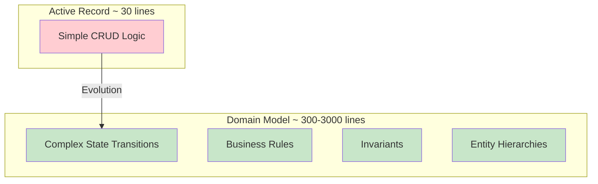
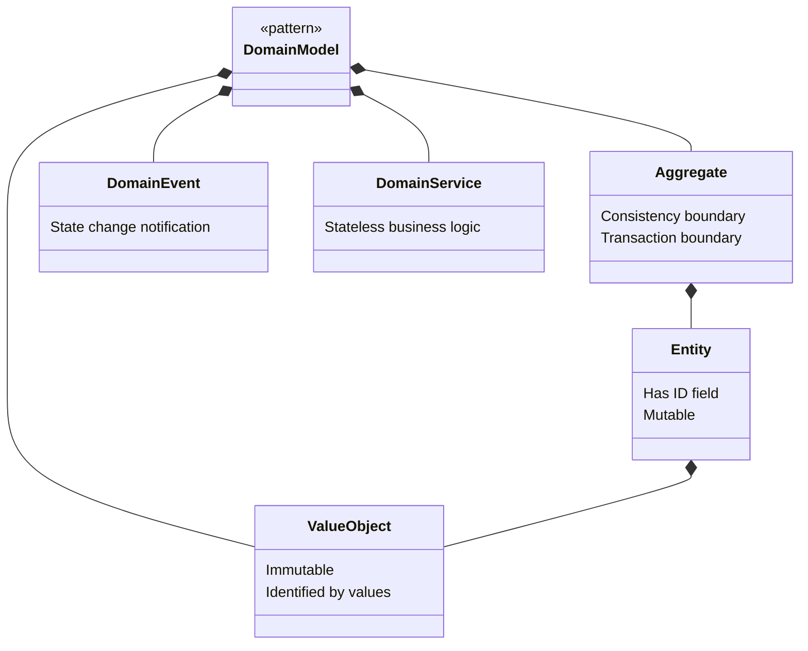
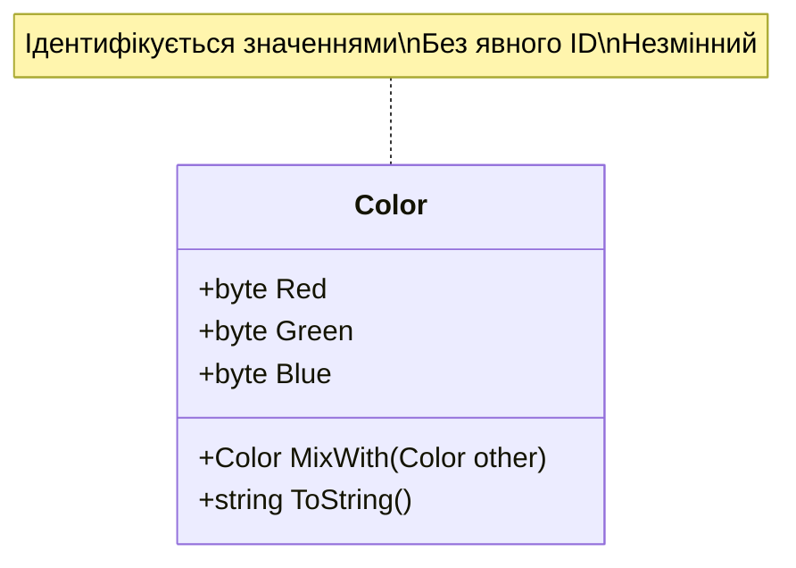
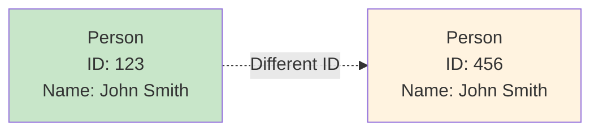
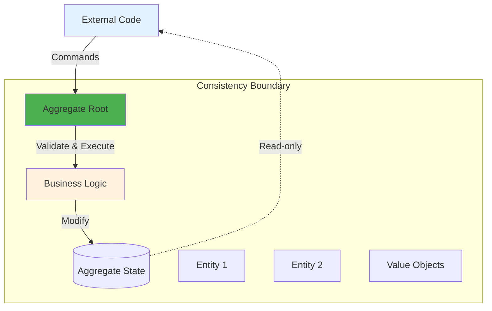
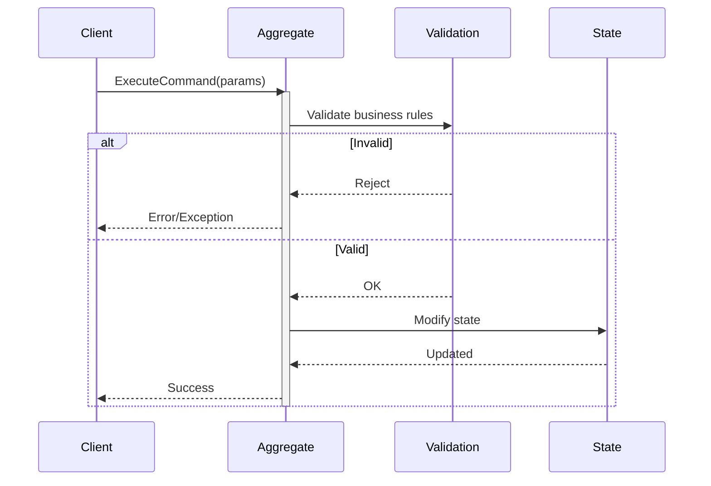
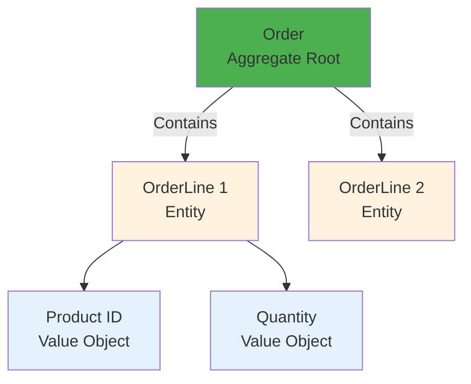
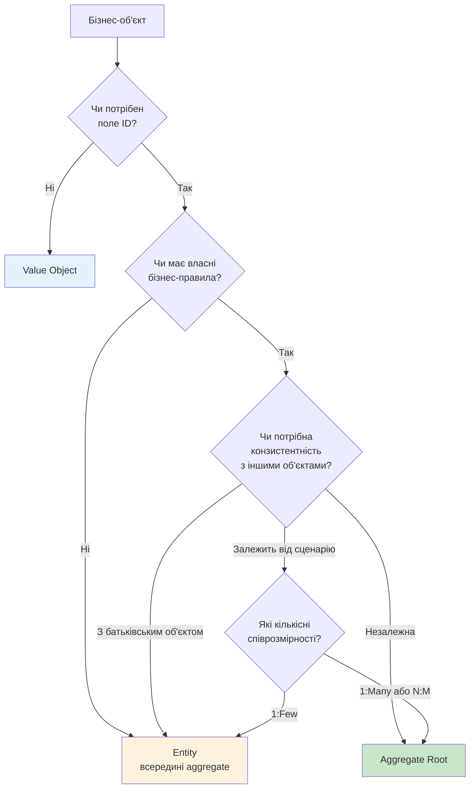

# Обробка складної бізнес-логіки (Tackling Complex Business Logic)

::note{icon="fluent:brain-circuit-24-filled"}
**Ключова ідея глави**

Складна бізнес-логіка не може бути ефективно модельована через прості CRUD-операції. Для цього потрібна **модель предметної області (Domain Model)** — об'єктна модель, що поєднує дані **і** поведінку.
::

## Передісторія (Background)

Паттерн **Domain Model**, як і паттерни Transaction Script та Active Record, був вперше представлений **Martin Fowler** у книзі «Patterns of Enterprise Application Architecture».

::tip{icon="ph:link"}
**Зв'язок з DDD**

Завершуючи обговорення Domain Model, Fowler writes:

> «Зараз **Eric Evans** пише книгу про створення моделей предметної області.»

Книга **«Domain-Driven Design: Tackling Complexity in the Heart of Software»** стала основною працею Evans і представила набір паттернів для тісногов зв'язку коду з базової моделлю предметний області бізнесу.
::

### Тактичні паттерни DDD

Evans представив паттерни, які є продовженням того, на чому зупинився Fowler:

::card-group
::card{icon="mdi:cube"}
#title
Aggregates (Агрегати)
#description
Межі узгодженості для складних об'єктів
::

::card{icon="mdi:tag"}
#title
Value Objects (Об'єкти-значення)
#description
Immutable об'єкти, що ідентифікуються значеннями
::

::card{icon="mdi:database"}
#title
Repositories
#description
Абстракція доступу до сховища
::
::

::warning{icon="ph:info"}
**Термінологія**

Паттерни Evans часто називають **«тактичними засобами DDD»**. Але щоб не створювати хибне уявлення, що DDD неминуче потребує використання цих паттернів, я дотримуюсь **оригінальної термінології Fowler**:

- Паттерн: **Domain Model**
- Будівельні блоки: **Aggregates**, **Value Objects**, **Domain Events**, **Domain Services**

::

---

## Модель предметної області (Domain Model)

::mermaid



::

Паттерн Domain Model призначений для **складної бізнес-логіки**. Замість роботи з простими CRUD-операціями, тут вирішуються питання:

- 🔄 **Складних переходів між станами**
- 📏 **Бізнес-правил і інваріантів**
- 🧩 **Взаємозв'язків між сутностями**

### Практичний приклад: Help Desk System

Припустимо, що ми впроваджуємо **систему технічної підтримки користувачів** (help desk). Розглянемо вимоги до життєвого циклу заявок:

::steps

### Створення заявки

Клієнти відкривають заявки з описом проблем, з якими стикаються.

### Комунікація

Клієнт і співробітник підтримки додають повідомлення — переписка відображається в заявці.

### Пріоритет SLA

У кожної заявки є приоритет: **низька**, **середня**, **висока** або **термінова**.

Співробітник **має запропонувати рішення** в установлений термін (SLA) на основі пріоритету.

### Ескалація

Якщо співробітник не відповість у SLA-термін, клієнт може **передати заявку керівнику**.

**Наслідки ескалації**:

- SLA скорочується на **33%**
- Якщо співробітник не відкрив ескалована заявку за **половину часу** → автоматичне переприз́начення іншому співробітнику

### Автоматичне закриття

Заявки автоматично закриваються, якщо клієнт не відповідає **≥7 днів**.

**Виняток**: Ескальовані заявки **не можуть** бути закриті автоматично або співробітником — лише клієнтом або керівником.

### Повторне відкриття

Клієнт може повторно відкрити закриту заявку **тільки якщо** вона була закрита **не більше 7 днів** тому.
::

::warning{icon="ph:graph"}
**Складність**

Ці вимоги утворюють **заплутану мережу залежностей** між різними правилами й впливають на життєвий цикл заявки.

Це вже **не CRUD-екран** введення даних! Спроба реалізувати цю логіку через Active Records призведе до:

- 🔁 Багаторазового повторення коду
- ❌ Неузгодженого стану через неправильну реалізацію правил

::

---

## Реалізація

**Domain Model** — це об'єктна модель, що включає **і поведінку, і дані**.

::mermaid



::

Будівельними блоками є **тактичні паттерни DDD**:

1. **Value Objects** (Об'єкти-значення)
2. **Entities** (Сутності)
3. **Aggregates** (Агрегати)
4. **Domain Events** (Події предметної області)
5. **Domain Services** (Доменні сервіси)

::tip{icon="ph:target"}
**Спільна тема**

Всі ці паттерни ставлять **бізнес-логіку на перше місце**.
::

### Ключові принципи

::accordion
::accordion-item{title="Принцип 1: Відсутність інфраструктурної складності"}
**Проблема**: Бізнес-логіка предметної області **вже є складною**.

**Рішення**: Об'єкти моделі **не повинні** вносити непотрібну складність:

- ❌ Не реалізують звернення до БД
- ❌ Не залежать від зовн ішніх компонентів
- ✅ Прості об'єкти (POCOs/POJOs/POPOs)
- ✅ Реалізують тільки бізнес-логіку

::

::accordion-item{title="Принцип 2: Єдина мова (Ubiquitous Language)"}
**Акцент на бізнес-логіці** дозволяє об'єктам моделі **слідувати єдиній мові** bounded context.

Код **«говорить»** на єдиній мові і слідує **ментальним моделям експертів** предметної області.

**Приклад**:

```csharp
// ❌ Технічний код (не слідує UL)
ticket.Status = 3;
ticket.Save();

// ✅ Код, що відображає бізнес-мову
ticket.Escalate(reason);
```

::
::

---

## Будівельні блоки

### Об'єкт-значення (Value Object)

> Об'єкт, який можна ідентифікувати за значеннями, що його складають.

::mermaid



::

#### Приклад: Color

```csharp
class Color
{
    private readonly byte _red;
    private readonly byte _green;
    private readonly byte _blue;

    public Color(byte r, byte g, byte b)
    {
        _red = r;
        _green = g;
        _blue = b;
    }
}
```

::tip{icon="ph:equals"}
**Ідентифікація за значеннями**

Колір визначається **композицією** трьох значень: червоного, зеленого та синього.

- Зміна будь-якого поля → **новий колір**
- Два экземпляри одного кольору → **однакові значення**
- ❌ Не потрібне явне поле `ColorId`

::

#### Антипаттерн: Primitive Obsession

Покладатися виключно на елементарні типи для представлення понять предметної області — **одержимість примітивами** (Primitive Obsession).

::collapsible{title="Приклад проблеми"}

```csharp
// ❌ Primitive Obsession
class Person
{
    private int _id;
    private string _firstName;
    private string _lastName;
    private string _landlinePhone; // Має бути валідним стаціонарним
    private string _mobilePhone;   // Має бути валідним мобільним
    private string _email;         // Має бути валідним email
    private int _heightMetric;     // У см? метрах?
    private string _countryCode;   // 2 літери верхнього регістру

    public Person(...) { ... }
}

// Використання
var dave = new Person(
    id: 30217,
    firstName: "Dave",
    lastName: "Ancelovici",
    landlinePhone: "023745001",   //  Немає валідації!
    mobilePhone: "0873712503",
    email: "dave@learning-ddd.com",
    heightMetric: 180,            // Незрозуміла одиниця
    countryCode: "BG"
);
```

**Проблеми**:

1. 🔁 Логіка перевірки дублюється
2. ❌ Важко навязати валідацію перед використанням
3. 📝 Потрібні угоди (conventions) замість типобезпеки

::

#### Рішення: Value Objects

```csharp
// ✅ Використання Value Objects
class Person
{
    private readonly PersonId _id;
    private readonly Name _name;
    private readonly PhoneNumber _landline;
    private readonly PhoneNumber _mobile;
    private readonly EmailAddress _email;
    private readonly Height _height;
    private readonly CountryCode _country;

    public Person(...) { ... }
}

// Використання
var dave = new Person(
    id: new PersonId(30217),
    name: new Name("Dave", "Ancelovici"),
    landline: PhoneNumber.Parse("023745001"),
    mobile: PhoneNumber.Parse("0873712503"),
    email: Email.Parse("dave@learning-ddd.com"),
    height: Height.FromMetric(180),
    country: CountryCode.Parse("BG")
);
```

::accordion
::accordion-item{title="Переваги Value Objects"}
**1. Краща читабельність**

```csharp
private readonly CountryCode _country; // ✅ Зрозуміло: код країни
vs
private readonly string _countryCode;  // ❓ Код? Назва? Скорочення?
```

**2. Вбудована валідація**

Логіка перевірки знаходиться в самих об'єктах-значеннях. Не потрібно перевіряти перед присвоєнням.

**3. Централізована бізнес-логіка**

Вся логіка роботи зі значенням — в одному місці. Легко тестуємо.

**4. Єдина мова**

Код відображає концепції predmetної області.
::
::

#### Практичні приклади Value Objects

::accordion
::accordion-item{title="Height - Конвертація одиниць"}

```csharp
var heightMetric = Height.Metric(180);
var heightImperial = Height.Imperial(5, 11);

var string1 = heightMetric.ToString(); // "180cm"
var string2 = heightImperial.ToString(); // "5 feet 11 inches"
var string3 = heightMetric.ToImperial().ToString(); // "5 feet 11 inches"

var firstIsHigher = heightMetric > heightImperial; // false
```

**Переваги**:

- Незалежність від одиниць виміру
- Легке перетворення metric ↔ imperial
- Перевантаження операторів порівняння

::

::accordion-item{title="PhoneNumber - Аналіз та валідація"}

```csharp
var phone = PhoneNumber.Parse("+359877123503");

var country = phone.Country;     // "BG"
var phoneType = phone.PhoneType; // "MOBILE"
var isValid = PhoneNumber.IsValid("+972120266680"); // false
```

**Переваги**:

- Валідація при створенні
- Extraction metadata (країна, тип)
- Централізована логіка parsing

::

::accordion-item{title="Color - Бізнес-операції"}

```csharp
var red = Color.FromRGB(255, 0, 0);
var green = Color.Green; // Предвизначений колір

var yellow = red.MixWith(green);
var yellowString = yellow.ToString(); // "#FFFF00"
```

**Переваги**:

- Інкапсуляція бізнес-логіки (mix colors)
- Повернення нових екземплярів (immutability)
- Виразні операції предметної області

::

::

### Реалізація Value Objects

#### Immutability (Незмінність)

Зміна будь-якого поля створює **інше значення** → Value Objects є **immutable**.

```csharp
public class Color
{
    public readonly byte Red;
    public readonly byte Green;
    public readonly byte Blue;

    public Color(byte r, byte g, byte b)
    {
        this.Red = r;
        this.Green = g;
        this.Blue = b;
    }

    // ✅ Повертає НОВИЙ екземпляр, не змінює поточний
    public Color MixWith(Color other)
    {
        return new Color(
            r: (byte)Math.Min(this.Red + other.Red, 255),
            g: (byte)Math.Min(this.Green + other.Green, 255),
            b: (byte)Math.Min(this.Blue + other.Blue, 255)
        );
    }
}
```

::tip{icon="ph:shield-check"}
**Переваги Immutability**

- ✅ Безпека від побічних ефектів
- ✅ Потокобезпечність (thread-safe)
- ✅ Передбачувана поведінка

::

#### Реалізація Equality

Р Equality базується на **значеннях**, а не на reference або ID:

```csharp
public class Color
{
    // ... fields ...

    public override bool Equals(object obj)
    {
        var other = obj as Color;
        return other != null &&
               this.Red == other.Red &&
               this.Green == other.Green &&
               this.Blue == other.Blue;
    }

    public static bool operator ==(Color lhs, Color rhs)
    {
        if (Object.ReferenceEquals(lhs, null))
        {
            return Object.ReferenceEquals(rhs, null);
        }
        return lhs.Equals(rhs);
    }

    public static bool operator !=(Color lhs, Color rhs)
    {
        return !(lhs == rhs);
    }

    public override int GetHashCode()
    {
        return ToString().GetHashCode();
    }
}
```

::note{icon="ph:code"}
**Примітка для C# 9.0+**

C# 9.0 `record` type автоматично реалізує equality на основі значень. Не потрібно перевизначати оператори.
::

#### Коли використовувати Value Objects?

::tip{icon="ph:star"}
**Універсальна відповідь: При будь-якій можливості!**

Value Objects:

- ✅ Роблять код виразнішим
- ✅ Інкапсулюють логіку, що дублюється
- ✅ Роблять код безпечнішим (immutability)
- ✅ Потокобезпечні (thread-safe)

::

**Практичне правило з бізнеспогляду**:

Використовуйте Value Objects для елементів предметної області, що **описують властивості** інших об'єктів (особливо сутностей).

**Приклади**:

- Властивості Person: `PersonId`, `Name`, `PhoneNumber`, `Email`
- Стани системи: `OrderStatus`, `TicketPriority`
- Паролі та credentials
- **Гроші** (критично важливо!)

::warning{icon="ph:currency-dollar"}
**Money як Value Object**

Використання примітивів для грошей:

- ❌ Обмежує інкапсуляцію бізнес-логіки
- ❌ Призводить до помилок округлення
- ❌ Проблеми з точністю

Завжди використовуйте `Money` Value Object!
::

---

### Сутності (Entities)

> Протилежність Value Object. Потрібне **явне поле ID** для розрізнення екземплярів.

#### Проблема без ID

```csharp
// ❌ Недостатньо для ідентифікації
class Person
{
    public Name Name { get; set; }

    public Person(Name name)
    {
        this.Name = name;
    }
}
```

::warning{icon="ph:users"}
**Проблема**

Different люди можуть мати **однакові імена**. Це не робить їх однією особою!

Потрібне поле ідентифікації.
::

#### Рішення: Explicit ID

```csharp
// ✅ Entity з полем ідентифікації
class Person
{
    public readonly PersonId Id; // Immutable ID
    public Name Name { get; set; } // Mutable properties

    public Person(PersonId id, Name name)
    {
        this.Id = id;
        this.Name = name;
    }
}
```

::tip{icon="ph:fingerprint"}
**Вимоги до ID**

1. **Унікальність** для кожного екземпляра Entity
2. **Незмінність** протягом життєвого циклу об'єкта (за дуже рідкісними винятками)

**Типи ID**: GUID, int, string, або domain-specific value (наприклад, Social Security Number)
::

::mermaid



::

### Відмінності Entities vs Value Objects

| Аспект            | Value Object              | Entity                |
| ----------------- | ------------------------- | --------------------- |
| **Ідентифікація** | За значеннями             | За полем ID           |
| **Immutability**  | Незмінний                 | Змінний (mutable)     |
| **Equality**      | На основі значень         | На основі ID          |
| **Роль**          | Описує властивості        | Представляє об'єкт    |
| **Приклади**      | Color, PhoneNumber, Money | Person, Order, Ticket |

::note{icon="ph:link-simple"}
**Зв'язок**

Value Objects **описують властивості** Entities.

Раніше бачили Entity `Person` з Value Objects `PersonId` і `Name`.
::

---

## Агрегати (Aggregates)

::note{icon="fluent:shield-checkmark-24-filled"}
**Ключова концепція**

Aggregate — це також Entity (потрібен ID, стан змінюється), але це **набагато ширше** поняття.

**Мета**: Захист узгодженості даних.
::

::mermaid



::

### Дотримання узгодженості (Consistency Enforcement)

Оскільки стан aggregate може змінюватися, відкривається маса можливостей для **пошкодження даних**.

::warning{icon="ph:shield"}
**Консистентність через межі**

Aggregate проводить **чітку межу** між собою та зовнішнім світом:

Aggregate є **консистентністю boundary** (consistency boundary).
::

**Механізм забезпечення консистентності**:

1. ✅ Змінювати стан може **тільки власна бізнес-логіка** aggregate
2. ❌ Зовнішнім процесам дозволено **лише читання** стану
3. ✅ Зміни можливі **тільки через публічні методи** (commands)

### Команди (Commands)

Методи зміни стану aggregate називаются **командами**.

::mermaid



::

```csharp
public class Ticket // Aggregate Root
{
    private TicketId _id;
    private Priority _priority;
    private TicketStatus _status;

    // ✅ Command: Public method
    public void Escalate(EscalationReason reason)
    {
        // Validate business rules
        if (_status == TicketStatus.Closed)
        {
            throw new InvalidOperationException("Cannot escalate closed ticket");
        }

        if (!CanEscalate())
        {
            throw new InvalidOperationException("Escalation not allowed");
        }

        // Modify state
        _status = TicketStatus.Escalated;
        _priority = IncreasePriority(_priority);
        _slaDeadline = RecalculateSLA(_slaDeadline, escalationReduction: 0.33);
    }

    // ❌ Private properties - можуть бути змінені тільки зсередини
    private Priority IncreasePriority(Priority current) { ... }
    private DateTime RecalculateSLA(DateTime original, double reduction) { ... }
}
```

::tip{icon="ph:code"}
**Чому команди?**

Ім'я «команда» відображає спосіб виклику: **«зробити щось»**.

Приклади:

- `ticket.Escalate(reason)`
- `order.Submit()`
- `account.Withdraw(amount)`

::

---

### Transaction Boundary (Границя транзакції)

::warning{icon="ph:database"}
**Золоте правило**

**Один aggregate на транзакцію!**

Модифікація кількох aggregates в одній транзакції — ознака неправильних меж aggregate.
::

Чому це важливо?

1. **Concurrency** — менші межі = менше конфліктів concurrent changes
2. **Performance** — менший lock scope
3. **Scalability** — незалежні aggregates можна масштабувати окремо

#### Посилання між Aggregates

Aggregates можуть посилатися один на одного **тільки через ID**, а не через прямі object references:

```csharp
public class Ticket
{
    private TicketId _id;
    private AgentId _assignedAgent; // ✅ Reference by ID
    //private Agent _assignedAgent; // ❌ Direct object reference

    public void AssignToAgent(AgentId agentId)
    {
        _assignedAgent = agentId;
    }
}
```

::accordion
::accordion-item{title="Чому тільки ID?"}
**Проблема direct references**:

```csharp
// ❌ Погана практика
ticket._assignedAgent.ActiveTickets += 1;
ticket._assignedAgent.Save();
```

Ми модифікуємо **два aggregates** (Ticket та Agent) → порушення правила «один aggregate в транзакції».

**Рішення через ID**:

```csharp
// ✅ Правильний підхід
var agentId = ticket.AssignedAgent; // Просто ID
// Якщо потрібно модифікувати Agent — це окрема транзакція
var agent = _agentRepository.Load(agentId);
agent.IncrementActiveTickets();
_agentRepository.Save(agent);
```

::
::

---

### Ієрархії сутностей (Entity Hierarchies)

Aggregate може містити **кілька entities** всередині себе.

::mermaid



::

```csharp
public class Order // Aggregate Root
{
    private readonly OrderId _id;
    private readonly List<OrderLine> _lines; // Child entities

    public void AddLine(ProductId product, int quantity)
    {
        // Business rule: максимум 10 позицій
        if (_lines.Count >= 10)
        {
            throw new InvalidOperationException("Cannot exceed 10 order lines");
        }

        // Business rule: не більше 100 штук одного товару
        if (quantity > 100)
        {
            throw new InvalidOperationException("Max quantity = 100");
        }

        _lines.Add(new OrderLine(product, quantity));
    }
}

public class OrderLine // Entity (not aggregate!)
{
    private readonly OrderLineId _id;
    private readonly ProductId _product;
    private int _quantity;

    internal OrderLine(ProductId product, int quantity)
    {
        _id = OrderLineId.New();
        _product = product;
        _quantity = quantity;
    }
}
```

::tip{icon="ph:tree-structure"}
**Aggregate Root**

Лише **корінь ієрархії** (Order) доступний ззовні. Child entities (OrderLine) доступні **тільки через root**.

Це гарантує, що **всі бізнес-правила** перевіряються.
::

---

### Concurrency Control (Керування конкурентним доступом)

Коли кілька користувачів одночасно працюють з одним aggregate, потрібен механізм розв'язання конфліктів.

#### Optimistic Locking

```csharp
public class Ticket
{
    private Версії long _version; // Лічильник змін

    public void Escalate(Escalation Reason reason)
    {
        // Business logic...
        _version++; // Збільшуємо версію при кожній зміні
    }
}
```

**Збереження в БД з перевіркою версії**:

```sql
UPDATE Tickets
SET status = @status,
    priority = @priority,
    version = version + 1
WHERE id = @id
  AND version = @expectedVersion; -- ✅ Optimistic lock

-- Якщо version змінилась іншим процесом → 0 rows affected → Concurrency Exception
```

::accordion
::accordion-item{title="Як працює Optimistic Locking"}
**Сценарій конфлікту**:

1. **User A** завантажує Ticket (version = 5)
2. **User B** завантаж є Ticket (version = 5)
3. **User A** escalates ticket → version = 6 ✅
4. **User B** намагається escalate → очікує version = 5, але зараз = 6 ❌

**Результат**: User B отримує `ConcurrencyException` і має reload ticket.

**Переваги**:

- Не блокує читання
- Високачастотна concurrency
- Явні повідомлення про конфлікти

::

::

---

## Aggregate vs Entity: Посібник з прийняття рішень

::note{icon="ph:question"}
**Найчастіше питання студентів**

> «Як визначити, чи це окремий aggregate, чи entity всередині іншого aggregate?»

Це **критичне** рішення, що впливає на:

- Transaction boundaries
- Concurrency ефективність
- Масштабованість системи

::

### Decision Flowchart

::mermaid



::

### Приклад 1: E-commerce Order

::accordion
::accordion-item{title="Order це aggregate, OrderLine — entity"}

```csharp
// ✅ Order = Aggregate Root
public class Order
{
    private OrderId _id;
    private List<OrderLine> _lines; // Entities всередині
    private OrderStatus _status;
    private decimal _totalAmount;

    public void AddLine(ProductId product, int quantity, decimal price)
    {
        // Business rule: не можна додавати до shipped order
        if (_status == OrderStatus.Shipped)
        {
            throw new InvalidOperationException("Cannot modify shipped order");
        }

        // Business rule: максимум 50 позицій
        if (_lines.Count >= 50)
        {
            throw new InvalidOperationException("Max 50 lines");
        }

        _lines.Add(new OrderLine(product, quantity, price));
        RecalculateTotal(); // Автоматично оновлюємо total
    }

    private void RecalculateTotal()
    {
        _totalAmount = _lines.Sum(line => line.SubTotal);
    }
}

// OrderLine = Entity (НЕ aggregate!)
public class OrderLine
{
    private OrderLineId _id;
    private ProductId _product;
    private int _quantity;
    private decimal _unitPrice;

    public decimal SubTotal => _quantity * _unitPrice;

    // internal — може бути створений тільки з Order
    internal OrderLine(ProductId product, int quantity, decimal price)
    {
        _id = OrderLineId.New();
        _product = product;
        _quantity = quantity;
        _unitPrice = price;
    }
}
```

**ЧОМУ OrderLine не окремий aggregate?**

1. ❌ **Немає сенсу без Order** — OrderLine завжди належить Order
2. ❌ **Конзистентність з Order** — total amount має автоматично оновлюватися
3. ❌ **Життєвий цикл** — створюється/видаляється разом з Order
4. ✅ **Transaction boundary** — зміна OrderLine = зміна Order

::

::

---

### Приклад 2: система блогу

::accordion
::accordion-item{title="BlogPost vs Comment — два варіанти"}
**Варіант A: Comment як Entity всередині BlogPost**

```csharp
// Якщо коментарі прості й неодмінгі
public class BlogPost // Aggregate
{
    private PostId _id;
    private List<Comment> _comments; // Entities

    public void AddComment(UserId author, string text)
    {
        // Business rule: не більше 1000 коментарів
        if (_comments.Count >= 1000)
        {
            throw new InvalidOperationException("Post full");
        }

        _comments.Add(new Comment(author, text));
    }
}

public class Comment // Entity
{
    private CommentId _id;
    private UserId _author;
    private string _text;
    private DateTime _createdAt;
}
```

**Варіант B: Comment як окремий Aggregate**

```csharp
// Якщо коментарі складні (модерація, рейтинги, відповіді)
public class BlogPost // Aggregate
{
    private PostId _id;
    private List<CommentId> _commentIds; // Тільки ID!

    public void LinkComment(CommentId commentId)
    {
        _commentIds.Add(commentId);
    }
}

public class Comment // Окремий Aggregate!
{
    private CommentId _id;
    private PostId _postId; // Back reference по ID
    private UserId _author;
    private string _text;
    private ModerationStatus _status;
    private List<CommentId> _replies; // Може мати відповіді
    private int _upvotes;
    private int _downvotes;

    public void Approve() { ... } // Власна бізнес-логіка
    public void addReply(Comment reply) { ... }
}
```

**Коли Comment — окремий aggregate?**

✅ Коли коментарі мають **власну складну логіку**:

- Модерація (approve/reject)
- Рейтинги (upvotes/downvotes)
- Власні відповіді (nested comments)
- Редагування commentарів автором

✅ Коли кількість коментарів **велика** (>100):

- Завантаження всіх коментарів з постом неефективно
- Потрібна pagination

❌ Використовувати Entity всередині BlogPost, коли:

- Прості коментарі без складної логіки
- Невелика кількість (<100)
- Тільки додавання/видалення

::

::

---

### Приклад 3: Університетська система

::accordion
::accordion-item{title="Student, Course, Enrollment — розбір"}

```csharp
// ✅ Student = Aggregate
public class Student
{
    private StudentId _id;
    private Name _name;
    private List<EnrollmentId> _enrollments; // Тільки ID!

    public StudentId Id => _id;
}

// ✅ Course = Aggregate
public class Course
{
    private CourseId _id;
    private CourseName _name;
    private int _capacity;
    private List<EnrollmentId> _enrollments;

    public CourseId Id => _id;
    public bool IsFull => _enrollments.Count >= _capacity;
}

// ✅ Enrollment = також Aggregate!
public class Enrollment
{
    private EnrollmentId _id;
    private StudentId _student; // Reference по ID
    private CourseId _course;   // Reference по ID
    private EnrollmentStatus _status;
    private Grade _grade;

    public void Complete(Grade grade)
    {
        if (_status != EnrollmentStatus.Active)
        {
            throw new InvalidOperationException("Enrollment not active");
        }

        _grade = grade;
        _status = EnrollmentStatus.Completed;
    }

    public void Withdraw()
    {
        if (_status == EnrollmentStatus.Completed)
        {
            throw new InvalidOperationException("Cannot withdraw completed course");
        }

        _status = EnrollmentStatus.Withdrawn;
    }
}
```

**ЧОМУ Enrollment — окремий aggregate?**

**Консистентність границі**:

- Студент може зарахуватися на курс ✅
- Курс може приймати студентів ✅
- Але process реєстрації **має власні правила**:
    - перевірка передумов
    - Deadline реєстрації
    - Payment processing

ці правила не належать ні Student, ні Course!

**N:M relationship**:

- Один Student → багато Enrollments
- Один Course → багато Enrollments

Якщо Enrollment всередині Student → як Course знаходить студентів?  
Якщо Enrollment всередині Course → як Student знаходить курси?

**Рішення**: Enrollment як окремий aggregate з посиланнями по ID.
::
::

---

### Приклад 4: Banking System

::accordion
::accordion-item{title="Account vs Transaction"}

```csharp
// ✅ Account = Aggregate
public class Account
{
    private AccountId _id;
    private decimal _balance;
    private List<Transaction> _transactions; // Entities всередині!

    public void Deposit(decimal amount)
    {
        if (amount <= 0)
        {
            throw new ArgumentException("Amount must be positive");
        }

        _balance += amount;
        _transactions.Add(new Transaction(TransactionType.Deposit, amount));
    }

    public void Withdraw(decimal amount)
    {
        if (amount > _balance)
        {
            throw new InvalidOperationException("Insufficient funds");
        }

        _balance -= amount;
        _transactions.Add(new Transaction(TransactionType.Withdrawal, amount));
    }
}

// Transaction = Entity (НЕ aggregate!)
public class Transaction
{
    private TransactionId _id;
    private TransactionType _type;
    private decimal _amount;
    private DateTime _timestamp;

    internal Transaction(TransactionType type, decimal amount)
    {
        _id = TransactionId.New();
        _type = type;
        _amount = amount;
        _timestamp = DateTime.UtcNow;
    }
}
```

**ЧОМУ Transaction НЕ aggregate?**

1. **Consistency boundary** — balance має змінюватися **разом** з транзакцією
2. **Business rules** — overdraft правила належать Account, не Transaction
3. **Lifecycle** — Transaction створюється тільки через Account operations
4. **Read pattern** — читаємо transactions **в контексті** Account

::

::

---

### Приклад 5: Project Management

::accordion
::accordion-item{title="Project, Task, Sprint — хто aggregate?"}

```csharp
// ✅ Project = Aggregate
public class Project
{
    private ProjectId _id;
    private List<SprintId> _sprints; // Посилання по ID
    private List<TaskId> _backlog;   // Посилання по ID
}

// ✅ Sprint = Aggregate
public class Sprint
{
    private SprintId _id;
    private ProjectId _project;
    private List<TaskId> _tasks; // Посилання по ID
    private DateTime _startDate;
    private DateTime _endDate;
    private SprintStatus _status;

    public void Start()
    {
        if (_tasks.Count == 0)
        {
            throw new InvalidOperationException("Cannot start empty sprint");
        }
        _status = SprintStatus.Active;
    }
}

// ✅ Task = Aggregate!
public class Task
{
    private TaskId _id;
    private SprintId _sprint; // Може бути null (backlog)
    private UserId _assignee;
    private TaskStatus _status;
    private List<SubTask> _subTasks; // Entities всередині
    private List<Comment> _comments; // Entities всередині

    public void Start()
    {
        if (_status != TaskStatus.ToDo)
        {
            throw new InvalidOperationException("Can only start ToDo tasks");
        }
        _status = TaskStatus.InProgress;
    }

    public void AddSubTask(string description)
    {
        _subTasks.Add(new SubTask(description));
    }
}

// SubTask = Entity (всередині Task)
public class SubTask
{
    private SubTaskId _id;
    private string _description;
    private bool _completed;
}
```

**Аналіз**: ЧОМУ Task — aggregate?

✅ **Власний життєвий цикл**:

- Може існувати в backlog (без Sprint)
- Може переміщатися між Sprints
- Має власний status workflow

✅ **Власні бізнес-правила**:

- Time tracking
- Assignee management
- SubTasks management

✅ **Масштабованість**:

- Тисячі tasks в проєкті
- Неефективно завантажувати всі tasks з Project

**SubTask всередині Task**:

- ❌ Немає сенсу без батьківського Task
- ✅ Проста структура
- ✅ Невелика кількість (зазвичай <10)

::

::

---

### Часті помилки при визначенні Aggregates

::warning{icon="ph:warning-octagon"}
**Mistake 1: Створення забагато aggregates**

```csharp
// ❌ Кожна дрібниця — aggregate
public class Order { /* aggregate */ }
public class OrderLine { /* aggregate */ } // ❌ Помилка!
public class Address { /* aggregate */ }   // ❌ Помилка!
```

**Наслідки**:

- Погана продуктивність (N×queries)
- Консистентність проблеми (атомарність порушується)
- Складність координації

::

::warning{icon="ph:warning-diamond"}
**Mistake 2: Створення замало aggregates**

```csharp
// ❌ Один гігантський aggregate
public class Enterprise
{
    List<Department> _departments;
    List<Employee> _employees; // Тисячі!
    List<Project> _projects;   // Сотні!
    List<Task> _tasks;         // Десятки тисяч!
}
```

**Наслідки**:

- Concurrency conflicts (частi lock conflicts)
- Повільну завантаження
- Складну логіку

::

::warning{icon="ph:prohibit"}
**Mistake 3:з Everything is Aggregate Root**

```csharp
// ❌ Навіть Value Objects стають aggregates
public class Color { /* aggregate root? */ } // ❌ Це Value Object!
public class PhoneNumber { /* aggregate root? */ } // ❌ Це Value Object!
```

**Симптоми**:

- Aggregates без бізнес-правил
- Aggregates без state changes
- Тільки getters/setters

::

---

### Матриця прийняття рішень

| Питання                                     | Entity всередині  | Окремий Aggregate      |
| ------------------------------------------- | ----------------- | ---------------------- |
| Чи має власні бізнес-правила?               | Ні або прості     | Так, складні           |
| Чи має власний життєвий цикл?               | Ні                | Так                    |
| Чи може існувати незалежно?                 | Ні                | Так                    |
| Який кількісний зв'язок?                    | 1:Few (<100)      | 1:Many (>100) або N:M  |
| Чи потрібна консистентність з батьківським? | Так (atomic)      | Eventual OK            |
| Чи потрібна concurrency performance?        | Ні (rare updates) | Так (frequent updates) |
| Чи є точкою масштабування?                  | Ні                | Так                    |

### Практичний чеклист

::steps

### Step 1: Визначте, чи потрібен ID

**Ні** → Value Object  
**Так** → Продовжуємо

### Step 2: Чи має власні важливі бізнес-правила?

**Ні** → Ймовірно Entity всередині  
**Так** → Продовжуємо

### Step 3: Чи може існувати без батьківського об'єкта?

**Ні** → Entity всередині  
**Так** → Продовжуємо

### Step 4: Яка кількість екземплярів?

**1:Few (<50-100)** → Можливо Entity всередині  
**1:Many (>100) або N:M** → Окремий Aggregate

### Step 5: Перевірте Transaction Boundary

**Атомарні зміни обов'язкові?** → Один Aggregate  
**Eventual consistency прийнятна?** → Окремі Aggregates
::

---

## Події предметної області (Domain Events)

::note{icon="ph:rocket-launch"}
**Концепція**

Domain Events представляють **зміни стану** в lifecycle aggregate, що мають значення для бізнесу.
::

```csharp
public class Ticket
{
    private List<IDomainEvent> _domainEvents = new();

    public void Escalate(EscalationReason reason)
    {
        // Business logic...
        _status = TicketStatus.Escalated;

        // ✅ Публікуємо подію
        _domainEvents.Add(new TicketEscalated(
            ticketId: _id,
            reason: reason,
            escalatedAt: DateTime.UtcNow
        ));
    }

    public IReadOnlyList<IDomainEvent> DomainEvents => _domainEvents;
}

// Event у минулому часі!
public class TicketEscalated : IDomainEvent
{
    public TicketId TicketId { get; }
    public EscalationReason Reason { get; }
    public DateTime EscalatedAt { get; }
}
```

::tip{icon="ph:calendar-check"}
**Naming Convention**

Події завжди в **минулому часі** (past tense):

- ✅ `TicketEscalated`
- ✅ `OrderSubmitted`
- ✅ `PaymentConfirmed`
- ❌ `EscalateTicket` (це команда!)

::

### Використання Domain Events

1. **Сповіщення інших систем**
2. **Trigger асинхронних процесів**
3. **Audit trail** (Event Sourcing — Глава 7)
4. **Координація між aggregates**

---

## Доменні сервіси (Domain Services)

Іноді бізнес-логіка **не належить** жодному aggregate.

```csharp
// Бізнес-логіка, що працює з КІЛЬКОМА aggregates
public class TransferMoneyService
{
    public void Transfer(Account from, Account to, decimal amount)
    {
        // Логіка не належить ні from, ні to
        if (amount <= 0)
        {
            throw new ArgumentException("Amount must be positive");
        }

        from.Withdraw(amount);
        to.Deposit(amount);

        // Domain Events
        from.AddEvent(new MoneyWithdrawn(from.Id, amount));
        to.AddEvent(new MoneyDeposited(to.Id, amount));
    }
}
```

::tip{icon="ph:circle-wavy-warning"}
**Коли використовувати Domain Service?**

✅ Операції на кількох aggregates  
✅ Stateless бізнес-логіка  
✅ Логіка, що не вписується в жоден aggregate

❌ Не використовуйте для уникнення розміщення logic в aggregates!
::

---

## Висновок

У цій главі розглянули **Domain Model pattern** і його будівельні блоки:

::card-group
::card{icon="mdi:tag-outline"}
#title
Value Objects
#description
Об'єкти, що ідентифікуються значеннями. Immutable, без явного ID.

**Використовувати**: завжди, коли можливо!
::

::card{icon="mdi:identifier"}
#title
Entities
#description
Об'єкти з явним полем ID. Mutable, lifecycle-oriented.

**Реалізуються**: тільки в контексті Aggregates.
::

::card{icon="mdi:shield-check"}
#title
Aggregates
#description
Границі узгодженності та транзакцій. Захищають invariants.

**Одне правило**: Один aggregate на транзакцію!
::

::card{icon="mdi:bell"}
#title
Domain Events
#description
Представляють зміни стану. Минулий час. Інтеграція між системами.
::

::card{icon="mdi:cog"}
#title
Domain Services
#description
Stateless операції на кількох aggregates.
::
::

::tip{icon="ph:arrow-right"}
**Що далі?**

У наступній главі розглянемо, як **моделювати фактор часу** через паттерн **Event Sourcing** — де події стають джерелом истини, а не поточний стан.
::
