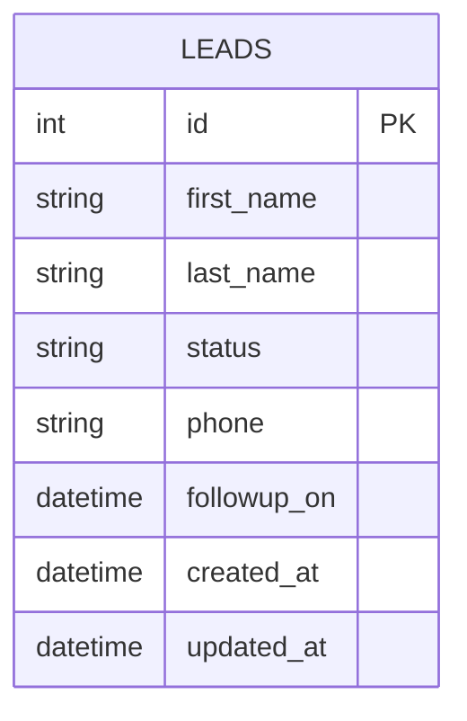
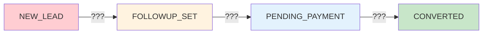
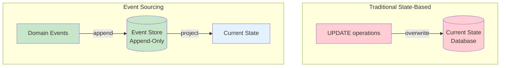
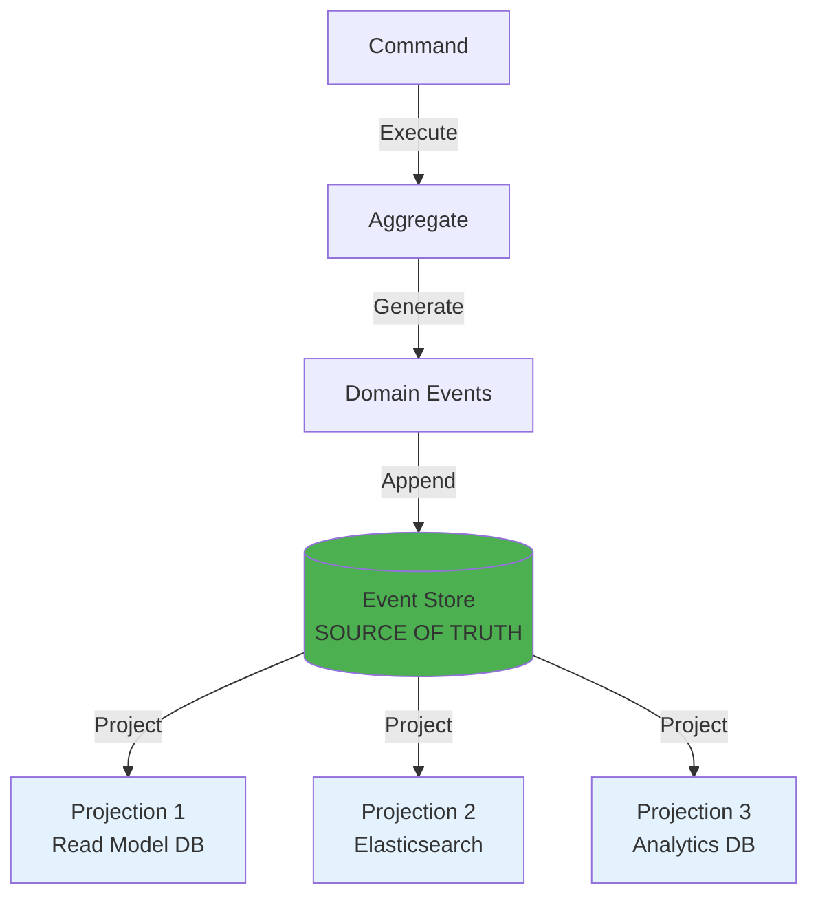
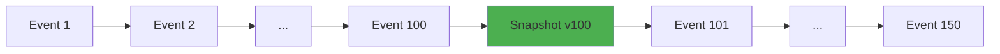
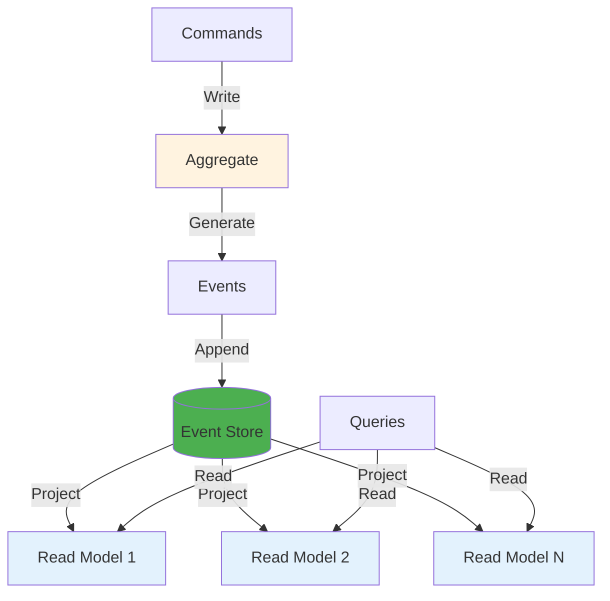

# Моделювання фактора часу (Modeling the Dimension of Time)

::note{icon="fluent:history-24-filled"}
**Ключова ідея глави**

Традиційні підходи зберігають **поточний стан** об'єктів. Але іноді бізнесу потрібна **історія змін** — як об'єкт досяг свого поточного стану? Саме тут допомагає **Event Sourcing**.
::

## Введення: Що відсутнє?

Розглянемо таблицю системи управління потенційними клієнтами (leads):

::mermaid



::

### Приклад даних

| ID  | First Name | Last Name | Status    | Phone    | Followup On | Created At | Updated At |
| --- | ---------- | --------- | --------- | -------- | ----------- | ---------- | ---------- |
| 1   | John       | Doe       | NEW_LEAD  | 555-1234 | NULL        | 2019-11-19 | 2019-11-19 |
| 2   | Jane       | Smith     | CONVERTED | 555-5678 | NULL        | 2019-11-20 | 2019-11-25 |
| 12  | Casey      | Davis     | CONVERTED | 555-8101 | NULL        | 2020-05-20 | 2020-05-27 |

::warning{icon="ph:question"}
**Питання для роздумів**

Таблиця документує **поточний стан** лідів. Але чого в ній **не вистачає**?

Ми можемо бачити:

- ✅ Поточний статус кожного ліда
- ✅ Контактну інформацію
- ✅ Дату створення й оновлення

Але **не можемо** проаналізувати:

- ❌ Скільки дзвінків було зроблено до конверсії?
- ❌ Чи була покупка здійснена одразу, чи була довга воронка продажів?
- ❌ Чи варто продовжувати намагатися з лідом після N спроб?

::

### Проблема: Відсутня історична інформація

Таблиця відображає **snapshot** поточного стану, але в ній **відсутня інформація** про те, як кожен лід досяг свого стану:

::mermaid



::

::note{icon="ph:chart-line"}
**Бізнес-потреби**

З точки зору бізнесу критично важливо:

- 📊 Аналізувати дані
- 🎯 Оптимізувати процес продажів
- 📈 В мчитися на досвіді

Один із способів заповнити відсутню інформацію — використовувати **Event Sourcing**.
::

---

## Події як джерело даних (Event Sourcing)

> Event Sourcing вводить в модель даних **фактор часу**. Замість схеми, що відображає поточний стан агрегатів, система зберігає **події**, що фіксують кожну зміну в життєвому циклі агрегата.

::mermaid



::

### Приклад: Життєвий цикл ліда Casey Davis

Розглянемо **CONVERTED**-клієнта з ID 12. В Event Sourcing його дані виглядають так:

```json
// Event 0: Lead initialized
{
  "lead-id": 12,
  "event-id": 0,
  "event-type": "lead-initialized",
  "first-name": "Casey",
  "last-name": "David", // Помилка в прізвищі!
  "phone-number": "555-2951",
  "timestamp": "2020-05-20T09:52:55.95Z"
}

// Event 1: First contact
{
  "lead-id": 12,
  "event-id": 1,
  "event-type": "contacted",
  "timestamp": "2020-05-20T12:32:08.24Z"
}

// Event 2: Followup scheduled
{
  "lead-id": 12,
  "event-id": 2,
  "event-type": "followup-set",
  "followup-on": "2020-05-27T12:00:00.00Z",
  "timestamp": "2020-05-20T12:32:08.24Z"
}

// Event 3: Contact details corrected
{
  "lead-id": 12,
  "event-id": 3,
  "event-type": "contact-details-updated",
  "first-name": "Casey",
  "last-name": "Davis", // ✅ Виправлено
  "phone-number": "555-8101", // Новий номер
  "timestamp": "2020-05-20T12:32:08.24Z"
}

// Event 4: Second contact
{
  "lead-id": 12,
  "event-id": 4,
  "event-type": "contacted",
  "timestamp": "2020-05-27T12:02:12.51Z"
}

// Event 5: Order submitted
{
  "lead-id": 12,
  "event-id": 5,
  "event-type": "order-submitted",
  "payment-deadline": "2020-05-30T12:02:12.51Z",
  "timestamp": "2020-05-27T12:02:12.51Z"
}

// Event 6: Payment confirmed
{
  "lead-id": 12,
  "event-id": 6,
  "event-type": "payment-confirmed",
  "status": "converted",
  "timestamp": "2020-05-27T12:38:44.12Z"
}
```

::tip{icon="ph:book-open"}
**Історія клієнта**

Події розповідають **повну історію**:

1. ⏰ **09:52** – Лід створено в системі
2. 📞 **12:32** – Дзвінок торгового агента (через ~2.5 години)
3. 📅 **12:32** – Followup заплановано на наступний тиждень
4. ✏️ **12:32** – Виправлено помилку в прізвищі + новий телефон
5. 📞 **27.05 12:02** – Повторний дзвінок (в запланований час)
6. 🛒 **12:02** – Замовлення відправлено
7. ✅ **12:38** – Оплата підтверджена (~30 хв) → CONVERTED!

Це **набагато багатша інформація**, ніж просто "status = CONVERTED"!
::

---

## Проекція стану (State Projection)

Стан клієнта можна **легко спроекту вати** зі подій, послідовно додаючи логіку перетворення до кожної події:

```csharp
public class LeadProjection
{
    public long LeadId { get; private set; }
    public string FirstName { get; private set; }
    public string LastName { get; private set; }
    public string PhoneNumber { get; private set; }
    public LeadStatus Status { get; private set; }
    public int Version { get; private set; } // Лічильник модифікацій

    public void Apply(LeadInitialized @event)
    {
        LeadId = @event.LeadId;
        FirstName = @event.FirstName;
        LastName = @event.LastName;
        PhoneNumber = @event.PhoneNumber;
        Status = LeadStatus.NEW_LEAD;
        Version = 0;
    }

    public void Apply(ContactDetailsChanged @event)
    {
        FirstName = @event.FirstName;
        LastName = @event.LastName;
        PhoneNumber = @event.PhoneNumber;
        Version += 1;
    }

    public void Apply(Contacted @event)
    {
        Version += 1;
    }

    public void Apply(FollowupSet @event)
    {
        Status = LeadStatus.FOLLOWUP_SET;
        Version += 1;
    }

    public void Apply(OrderSubmitted @event)
    {
        Status = LeadStatus.PENDING_PAYMENT;
        Version += 1;
    }

    public void Apply(PaymentConfirmed @event)
    {
        Status = LeadStatus.CONVERTED;
        Version += 1;
    }
}
```

::accordion
::accordion-item{title="Як працює проекція"}
**Процес**:

1. Завантажуємо всі події ліда
2. Передаємо кожну подію у відповідний метод `Apply()`
3. Projection accumulates state
4. Отримуємо **точне відображення** поточного стану

**Результат для Casey Davis**:

```
LeadId: 12
FirstName: "Casey"
LastName: "Davis"
PhoneNumber: "555-8101"
Status: CONVERTED
Version: 6
```

::
::

### Поле Version: Лічильник модифікацій

::tip{icon="ph:number-circle-six"}
**Version як audit trail**

`Version` представляє **загальну кількість модифікацій**, внесених у бізнес-сутність.

**Можливість**: Якщо додати тільки **підmножину подій** → «подорож у часі» (time travel)!

**Приклад**: Щоб отримати стан об'єкта у версії 3, застосовуємо тільки перші 3 події.
::

---

## Кілька проекцій з одних подій

::note{icon="ph:projector-screen"}
**Потужність Event Sourcing**

Події є **єдиним джерелом істини**. З них можна створити **кілька різних проекцій** для різних потреб!
::

### Проекція 1: Пошукова модель (Search Model)

**Бізнес-потреба**: Торгові агенти can не знати про зміни контактної інформації, внесені іншими агентами. Потрібен пошук за **історичними** значеннями.

```csharp
public class LeadSearchModelProjection
{
    public long LeadId { get; private set; }
    public HashSet<string> FirstNames { get; private set; } // ✅ Всі варіанти
    public HashSet<string> LastNames { get; private set; }  // ✅ Всі варіанти
    public HashSet<PhoneNumber> PhoneNumbers { get; private set; }
    public int Version { get; private set; }

    public void Apply(LeadInitialized @event)
    {
        LeadId = @event.LeadId;
        FirstNames = new HashSet<string>();
        LastNames = new HashSet<string>();
        PhoneNumbers = new HashSet<PhoneNumber>();

        // Додаємо початкові значення
        FirstNames.Add(@event.FirstName);
        LastNames.Add(@event.LastName);
        PhoneNumbers.Add(@event.PhoneNumber);
        Version = 0;
    }

    public void Apply(ContactDetailsChanged @event)
    {
        // ✅ Додаємо до множини, не перезаписуємо!
        FirstNames.Add(@event.FirstName);
        LastNames.Add(@event.LastName);
        PhoneNumbers.Add(@event.PhoneNumber);
        Version += 1;
    }

    // Інші події ігноруємо (не впливають на пошук)
    public void Apply(Contacted @event) { Version += 1; }
    public void Apply(FollowupSet @event) { Version += 1; }
    public void Apply(OrderSubmitted @event) { Version += 1; }
    public void Apply(PaymentConfirmed @event) { Version += 1; }
}
```

**Результат для Casey Davis**:

```
LeadId: 12
FirstNames: ["Casey"]
LastNames: ["David", "Davis"] // ✅ Обидва варіанти!
PhoneNumbers: ["555-2951", "555-8101"] // ✅ Обидва номери!
Version: 6
```

::tip{icon="ph:magnifying-glass"}
**Переваги для бізнесу**

Агент може знайти ліда за **старим прізвищем** "David" або **старим телефоном** "555-2951", навіть якщо вони вже змінилися!
::

---

### Проекція 2: Analytical Model

**Бізнес-потреба**: Відділ аналітики хоче кількість followup calls для оптимізації процесу продажів.

```csharp
public class AnalysisModelProjection
{
    public long LeadId { get; private set; }
    public int Followups { get; private set; } // ✅ Лічильник followups
    public LeadStatus Status { get; private set; }
    public int Version { get; private set; }

    public void Apply(LeadInitialized @event)
    {
        LeadId = @event.LeadId;
        Followups = 0;
        Status = LeadStatus.NEW_LEAD;
        Version = 0;
    }

    public void Apply(FollowupSet @event)
    {
        Status = LeadStatus.FOLLOWUP_SET;
        Followups += 1; // ✅ Підрахор followups!
        Version += 1;
    }

    public void Apply(OrderSubmitted @event)
    {
        Status = LeadStatus.PENDING_PAYMENT;
        Version += 1;
    }

    public void Apply(PaymentConfirmed @event)
    {
        Status = LeadStatus.CONVERTED;
        Version += 1;
    }

    // Інші Игрноруємо
    public void Apply(Contacted @event) { Version += 1; }
    public void Apply(ContactDetailsChanged @event) { Version += 1; }
}
```

**Результат для Casey Davis**:

```
LeadId: 12
Followups: 1
Status: CONVERTED
Version: 6
```

::tip{icon="ph:chart-bar"}
**Аналітика**

Аналітики можуть:

- Порівнювати кількість followups для CONVERTED vs CLOSED лідів
- Визначати оптимальну кількість спроб
- Фільтрувати за статусами для ML-моделей

::

---

## Джерело істини (Source of Truth)

::warning{icon="ph:database-arrow"}
**Золоте правило Event Sourcing**

Всі зміни стану об'єкта **мають** бути представлені і збережені як події. Події стають для системи **джерелом істини** (source of truth).
::

::mermaid



::

База даних, де зберігаються події, є **єдиним строго узгодженим сховищем** (single source of truth).

::note{icon="ph:archive"}
**Event Store**

База даних для збереження подій називається **event store** (сховище подій).
::

---

## Event Store: Вимоги

Event Store **не має** дозволяти змінювати або видаляти події (за винятком виключних випадків, як міграція даних).

### Мінімальний інтерфейс

```csharp
interface IEventStore
{
    // ✅ Завантаження всіх подій конкретної сутності
    IEnumerable<Event> Fetch(Guid instanceId);

    // ✅ Додавання нових подій
    void Append(Guid instanceId, Event[] newEvents, int expectedVersion);
}
```

::accordion
::accordion-item{title="Параметр expectedVersion"}
**Мета**: Реалізація **optimistic concurrency control**.

При додаванні нових подій вказується **версія сутності**, на якій базуються рішення.

**Якщо сутність застаріла** (після `expectedVersion` були додані нові події іншим процесом) → Event Store має **порушувати concurrency exception**.

**Приклад**:

```csharp
// Process A
var events = eventStore.Fetch(leadId); // version = 5
var lead = new Lead();
foreach (var e in events) lead.Apply(e);

lead.Escalate(); // Генерує нову подію
eventStore.Append(leadId, lead.NewEvents, expectedVersion: 5);
// ✅ Успіх, якщо version все ще = 5

// Process B (concurrent)
eventStore.Append(leadId, otherEvents, expectedVersion: 5);
// ❌ Exception! Version вже = 6 (Process A випередив)
```

::
::

::note{icon="ph:book"}
**Аналогія: Бухгалтерський облік**

По своїй суті, Event Sourcing не є чимось новим. **Фінансова індустрія** використовує події для представлення змін у бухгалtерському реєстрі.

Реєстр (ledger) — це журнал, призначений **тільки для додавання** записів, в якому документуються транзакції. Поточний стан (наприклад, баланс рахунку) завжди можна вивести шляхом «проекції» записів реєстру.
::

---

## Event-Based Domain Model

Модель предметної області, що використовує Event Sourcing, працює за модифікованим сценарієм:

::steps

### Крок 1: Завантаження подій

Завантажити події предметної області (domain events) aggregate з Event Store.

### Крок 2: Реконструкція стану

Voссоздати стан — спроекту вати події у представлення стану для прийняття бізнес-рішень.

### Крок 3: Виконання команди

Виконати команду бізнес-логіки aggregate → згенерувати **нові** domain events.

### Крок 4: Фіксація подій

Зафіксирувати нові domain events у Event Store.
::

### Приклад: Ticket Aggregate (Event-Sourced)

**Application Layer** слідує сценарію вище:

```csharp
public class TicketAPI
{
    private IEventStore _eventStore;

    public void RequestEscalation(TicketId id, EscalationReason reason)
    {
        // ✅ Крок 1: Завантажуємо події
        var events = _eventStore.Fetch(id);

        // ✅ Крок 2: Реконструюємо стан
        var ticket = new Ticket();
        foreach (var @event in events)
        {
            ticket.Apply(@event);
        }

        // ✅ Крок 3: Виконуємо команду
        ticket.RequestEscalation(reason);

        // ✅ Крок 4: Зберігаємо нові події
        var newEvents = ticket.GetUncommittedEvents();
        _eventStore.Append(id, newEvents, ticket.Version);
    }
}
```

**Ticket Aggregate (Event-Sourced)**:

```csharp
public class Ticket
{
    private TicketId _id;
    private TicketStatus _status;
    private Priority _priority;
    private List<IDomainEvent> _uncommittedEvents = new();
    public int Version { get; private set; }

    // ✅ State reconstruction від подій
    public void Apply(TicketInitialized @event)
    {
        _id = @event.TicketId;
        _status = TicketStatus.Open;
        _priority = @event.Priority;
        Version++;
    }

    public void Apply(TicketEscalated @event)
    {
        _status = TicketStatus.Escalated;
        _priority = IncreasePriority(_priority);
        Version++;
    }

    // ✅ Command: генерує події
    public void RequestEscalation(EscalationReason reason)
    {
        if (_status == TicketStatus.Closed)
        {
            throw new InvalidOperationException("Cannot escalate closed ticket");
        }

        // Генеруємо подію замість прямої зміни стану
        var @event = new TicketEscalated(_id, reason, DateTime.UtcNow);
        _uncommittedEvents.Add(@event);

        // Застосовуємо до поточного стану
        Apply(@event);
    }

    public IReadOnlyList<IDomainEvent> GetUncommittedEvents()
    {
        return _uncommittedEvents;
    }
}
```

::tip{icon="ph:arrows-clockwise"}
**Ключова відмінність**

У традиційній Domain Model команди **безпосередньо змінюють стан**.

В Event-Sourced Domain Model команди **генерують події**, які:

1. Додаються до uncommitted events
2. Застосовуються до стану (через `Apply()`)
3. Зберігаються у Event Store

::

---

## Snapshots: Оптимізація продуктивності

::warning{icon="ph:hourglass"}
**Проблема масштабу**

Якщо aggregate має **тисячі подій** → завантаження і проекція стають повільними.

**Рішення**: Snaposhots (знімки стану).
::

### Механізм Snapshots

::mermaid



::

**Замість** завантаження всіх 150 подій:

1. Завантажуємо **snapshot** версії 100
2. Застосовуємо тільки події 101-150

```csharp
public void LoadAggregate(Guid aggregateId)
{
    // ✅ Спочатку пробуємо завантажити snapshot
    var snapshot = _snapshotStore.GetLatest(aggregateId);

    int fromVersion = 0;
    if (snapshot != null)
    {
        ticket.LoadFromSnapshot(snapshot);
        fromVersion = snapshot.Version;
    }

    // ✅ Завантажуємо тільки події ПІСЛЯ snapshot
    var events = _eventStore.Fetch(aggregateId, fromVersion);
    foreach (var @event in events)
    {
        ticket.Apply(@event);
    }
}
```

::accordion
::accordion-item{title="Стратегії створення Snapshots"}
**Кожні N подій**:

```csharp
if (ticket.Version % 100 == 0)
{
    _snapshotStore.Save(ticket.ToSnapshot());
}
```

**За розкладом**:

- Асинхронний процес створює snapshots у фоні

**On-demand**:

- Якщо завантаження > X секунд → trigger snapshot creation

::

::

---

## Переваги Event Sourcing

::card-group
::card{icon="mdi:history"}
#title
Audit Trail
#description
"Безкоштовний" повний аудит усіх змін. Кожна модифікація задокументована як подія.
::

::card{icon="mdi:clock-time-nine"}
#title
Time Travel
#description
Можливість спроектувати стан об'єкта в **будь-який момент** його життєвого циклу.
::

::card{icon="mdi:projector"}
#title
Кілька проекцій
#description
Одні події → різні read models для різних потреб (пошук, аналітика, звітність).
::

::card{icon="mdi:debug-step-over"}
#title
Debugging
#description
Replay подій для відтворення багів і розуміння поведінки системи.
::

::card{icon="mdi:scale-balance"}
#title
Бізнес-інсайти
#description
Аналіз поведінки користувачів і оптимізація процесів на основі історичних даних.
::
::

---

## Недоліки Event Sourcing

::warning{icon="ph:warning-circle"}
**Складність реалізації**

❌ **Learning curve** — команди потребують навчання  
❌ **Event versioning** — еволюція схеми подій складна  
❌ **Projections** — потрібна інфраструктура для підтримки  
❌ **Eventual consistency** — read models не завжди актуальні  
❌ **Debugging** — складніше, ніж traditional CRUD  
::

::warning{icon="ph:database"}
**Операційні виклики**

❌ **Storage** — події займають більше місця, ніж state-based  
❌ **Event Store** — потребує спеціалізованих рішень (EventStoreDB, Kafka)  
❌ **Snapshots** — додаткова складність і storage  
::

---

## Коли використовувати Event Sourcing?

::card-group
::card{icon="mdi:check-circle"}
#title
Підходить для
#description
**Audit вимагається** — фінансові системи, healthcare

**Темпоральні запити** — "стан на 1 січня 2020"

**Складна бізнес-логіка** — потребує аналізу життєвого циклу

**Event-driven архітектура** — інтеграція через події

**CQRS** — природно поєднується (Глава 8)
::

::card{icon="mdi:cancel"}
#title
НЕ підходить для
#description
**Прості CRUD** — overhead не виправданий

**Команда без досвіду** — висока складність

**Статичні дані** — якщо зміни рідкі

**Швидкі read-heavy запити** — проекції повільніші за прямі queries
::
::

---

## Інтеграція з CQRS

Event Sourcing природно поєднується з **CQRS** (Command Query Responsibility Segregation):

::mermaid



::

::tip{icon="ph:arrow-right"}
**Наступна глава**

**CQRS** (Command Query Responsibility Segregation) буде детально розглянуто в **Главі 8**.

Event Sourcing + CQRS = потужна комбінація для складних систем!
::

---

## Висновок

У цій главі розглянули паттерн **Event Sourcing** для моделювання темпоральної розмірності:

::steps

### Події як джерело істини

Замость поточного стану зберігаємо **всі зміни** як події.

### Projections

З подій створюємо **кілька різних представлень** для різних потреб.

### Event Store

Append-only БД є **єдиним джерелом істини**.

### Event-Based Aggregates

Команди генерують події, які застосовуються до стану.

### Snapshots

Оптимізація через періодичні знімки стану.
::

::tip{icon="ph:books"}
**Прогресія глав 5-7**

- **Глава 5**: Прості паттерни (Transaction Script, Active Record)
- **Глава 6**: Складна логіка (Domain Model, Aggregates)
- **Глава 7**: Темпоральність (Event Sourcing)

Разом ці паттерни покривають **весь спектр** складності бізнес-логіки!
::

---

## Практичні вправи

::accordion
::accordion-item{title="Вправа 1: Проекції"}
Дано події банківського рахунку:

```json
[
    { "type": "account-opened", "balance": 0 },
    { "type": "deposited", "amount": 1000 },
    { "type": "withdrawn", "amount": 200 },
    { "type": "deposited", "amount": 500 },
    { "type": "withdrawn", "amount": 300 }
]
```

**Питання**:

1. Який поточний баланс?
2. Скількиопераццій було виконано?
3. Який був баланс між подією 2 і 3?

::collapsible{title="Відповіді"}

1. **Поточний баланс**: 0 + 1000 - 200 + 500 - 300 = **1000**
2. **Кількість операцій**: 4 (excluding account-opened)
3. **Баланс після події 2**: 0 + 1000 = **1000**

::

::

::accordion-item{title="Вправа 2: Snapshot стратегія"}
У вас є aggregate з 10,000 подій. Завантаження всіх подій займає 5 секунд.

**Питання**:

- Як часто створювати snapshots?
- Який trade-off між частотою snapshots і storage?

::collapsible{title="Міркування"}
**Варіанти**:

A) Кожні 100 подій:

- 100 snapshots по 10KB = 1MB
- Завантаження: snapshot + 100 подій ≈ 0.05s

B) Кожні 1000 подій:

- 10 snapshots по 10KB = 100KB
- Завантаження: snapshot + 1000 подій ≈ 0.5s

C) Кожні 5000 подій:

- 2 snapshots по 10KB = 20KB
- Завантаження: snapshot + 5000 подій ≈ 2.5s

**Рекомендація**: Варіант B — баланс між storage і performance.
::
::
::
