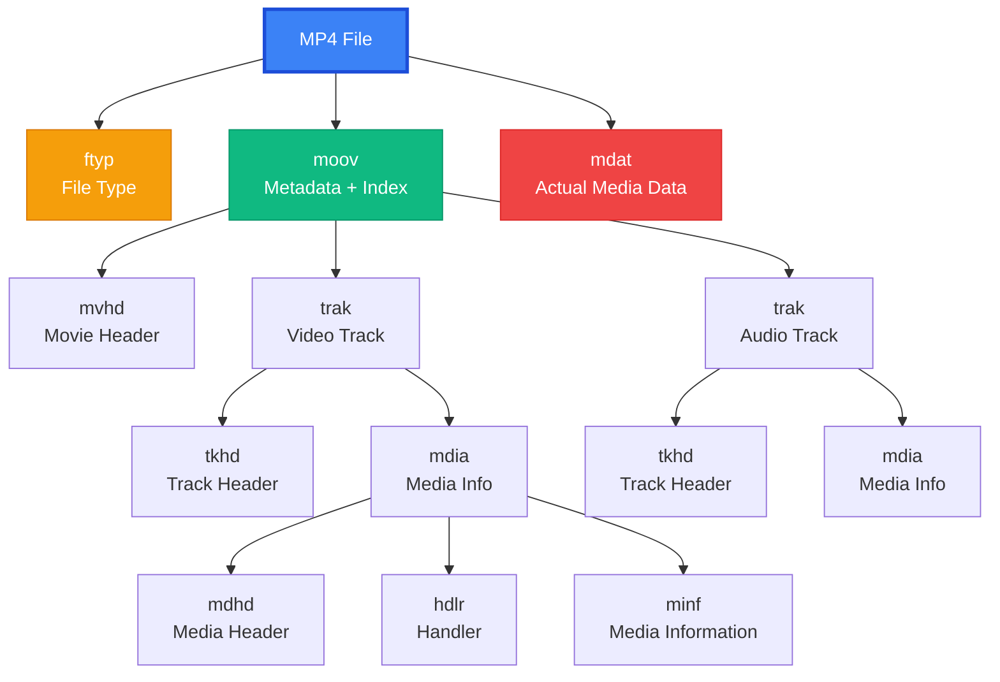
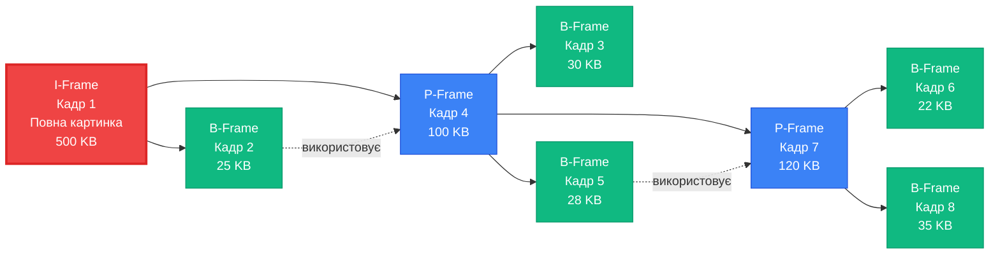
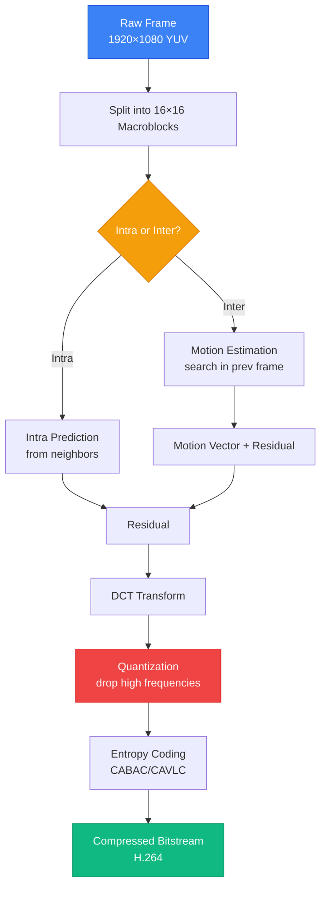

# 02. Анатомія Медіа: Кодеки, Контейнери та Стиснення

## 1. Вступ та Контекст

Відео — це ілюзія. Це просто серія картинок, які змінюються так швидко, що око не помічає підміни. Але якщо ми збережемо ці "картинки" як звичайні BMP чи PNG файли, то 1 година фільму займе терабайти місця.

Чому ж тоді фільм на Netflix займає всього 1-2 ГБ?
Відповідь: **Математичне шахрайство** (або, науковою мовою, компресія з втратами).

### Аналогія: Валіза

Уявіть, що ви пакуєте валізу у відпустку.

1.  **Lossless (Без втрат)**: Ви акуратно складаєте кожну футболку (ZIP-архів). Коли ви її дістанете, вона буде точнісінько такою ж.
2.  **Lossy (З втратами)**: Ви вирішуєте, що _ось ця_ футболка стара і вам не потрібна, а _ось ці_ шкарпетки можна купити на місці. Ви _викидаєте_ частину речей, щоб валіза закрилася.
    - Відеокодеки роблять саме це: вони викидають інформацію, яку ваше око (ймовірно) не помітить.

---

## 2. Фундаментальні Концепції: Контейнер vs Кодек

Це класична плутанина.

- "MP4" — це не відео. Це коробка.
- "H.264" — це відео. Це те, що лежить у коробці.

::card-group
::card{title="Контейнер (.mp4, .mkv, .mov)" icon="archive-box"}
Це просто файл-обгортка. Він містить: - Відео потік (Video Track) - Аудіо потік (Audio Track) - Субтитри - Метадані (назва, дата)
::
::card{title="Кодек (H.264, VP9, AAC)" icon="cpu-chip"}
**Co**der-**Dec**oder. Це алгоритм, який:

1. Стискає raw-відео в набір байтів (Encoding).
2. Розпаковує ці байти назад у картинку на екрані (Decoding).

::
::

### Глибше про Контейнери: Архітектура Медіафайлу

Контейнер — це не просто \"коробка\". Це **структурований формат зберігання**, який організує різнорідні потоки даних у єдиний файл.

#### Аналогія: Поштова Посилка

Уявіть, що ви відправляєте посилку другові:

- **Коробка (контейнер)** — це `.mp4`, `.mkv`, `.mov`. Вона визначає, як все упаковано.
- **Вміст (потоки)**:
    - **Основний подарунок** — відео потік (закодований H.264)
    - **Додатковий подарунок** — аудіо потік (закодований AAC)
    - **Листівка** — субтитри (текст SRT)
    - **Наклейка з адресою** — метадані (назва, автор, дата створення)

**Важливо**: Ви можете покласти той самий подарунок (H.264 відео) в різні коробки (MP4 або MKV) — це працюватиме. Але деякі коробки (WebM) приймають тільки певні подарунки (VP9, AV1).

#### Що саме зберігає контейнер?

::accordion

::accordion-item{label="Відео Потоки (Video Tracks)" icon="i-lucide-film"}

**Що це?** Один або кілька відеопотоків. Наприклад:

- Основне відео (1080p H.264)
- Альтернативне відео (4K HEVC для пристроїв, що підтримують)

**Приклад**: На Netflix один файл може містити кілька версій відео різної якості. Коли ви перемикаєтеся з 720p на 1080p, плеєр просто переключається на інший потік у тому ж контейнері.

**Формат даних**: Сирі закодовані байти (H.264, VP9, AV1, тощо.)

::

::accordion-item{label="Аудіо Потоки (Audio Tracks)" icon="i-lucide-headphones"}

**Що це?** Один або кілька аудіопотоків. Наприклад:

- Англійська (AAC стерео)
- Українська (AAC 5.1 Surround)
- Коментарі режисера (AAC mono)

**Приклад**: Фільм на Blu-ray зазвичай має 3-5 аудіодоріжок (різні мови + звукові ефекти).

**Формат даних**: Сирі закодовані аудіобайти (AAC, Opus, MP3)

::

::accordion-item{label="Субтитри (Subtitles)" icon="i-lucide-captions"}

**Що це?** Текстові потоки з таймкодами.

**Формати**:

- **SRT (SubRip)**: Простий текстовий файл
- **VTT (WebVTT)**: Для веб-плеєрів (HTML5 `<video>`)
- **ASS/SSA**: З підтримкою стилізації (кольори, шрифти, позиціонування)

**Приклад**:

```
1
00:00:10,500 --> 00:00:13,000
Привіт, це перший субтитр.

2
00:00:15,000 --> 00:00:18,000
А це другий.
```

::

::accordion-item{label="Метадані (Metadata)" icon="i-lucide-info"}

**Що це?** Інформація _про_ файл, а не медіа-контент.

**Що зберігається**:

- Назва (`title`)
- Автор (`artist`)
- Дата створення (`creation_time`)
- Опис (`description`)
- Thumbnail (мініатюра для превью)
- Геолокація (якщо знято на телефон)
- Framerate, resolution, тривалість

**Приклад**: Коли ви завантажуєте відео на YouTube, платформа читає метадані, щоб автоматично заповнити поля \"Назва\", \"Тривалість\", \"Роздільна здатність\".

::

::accordion-item{label="Глави (Chapters)" icon="i-lucide-bookmark"}

**Що це?** Таймкоди для навігації (як розділи у книзі).

**Приклад**: На Blu-ray фільмі ви можете \"перемотати на епізод 3\" — це працює завдяки chapter markers у контейнері.

**Структура**:

```
Chapter 1: 00:00:00 - Intro
Chapter 2: 00:05:30 - Main Act
Chapter 3: 00:45:00 - Climax
```

::

::

#### Популярні Контейнери: Порівняння

| Контейнер | Розширення     | Підтримка кодеків                      | Де використовується                    | Особливості                                       |
| :-------- | :------------- | :------------------------------------- | :------------------------------------- | :------------------------------------------------ |
| **MP4**   | `.mp4`, `.m4v` | H.264, H.265, AAC                      | **Всюди**: YouTube, телефони, браузери | Універсальний. Стандарт де-факто.                 |
| **WebM**  | `.webm`        | **Тільки** VP8, VP9, AV1, Opus, Vorbis | Веб (HTML5 `<video>`), YouTube         | Відкритий стандарт Google. Немає патентів.        |
| **MKV**   | `.mkv`         | **Будь-які** (H.264, VP9, AV1, FLAC)   | Піратство, архіви, Blu-ray rips        | Найгнучкіший. Підтримує все: меню, кілька аудіо.  |
| **MOV**   | `.mov`         | H.264, ProRes, AAC                     | Apple екосистема, професійне відео     | Оптимізований для Final Cut Pro та QuickTime.     |
| **AVI**   | `.avi`         | Старі кодеки (DivX, Xvid)              | Старі фільми                           | Застарів. Немає підтримки сучасних кодеків.       |
| **TS**    | `.ts`, `.m2ts` | H.264, H.265, AAC                      | Broadcast TV, стрімінг (HLS)           | Може відновитися після помилок (важливо для Live) |

::tip
**Як вибрати контейнер?**

- **Для веб**: MP4 (Chrome, Safari) або WebM (якщо хочете VP9/AV1)
- **Для архіву**: MKV (найбільше можливостей)
- **Для Apple**: MOV (якщо працюєте з Final Cut Pro)
- **Для стрімінгу**: TS (HLS) або fMP4 (DASH)

**Правило**: Контейнер не впливає на якість. H.264 у MP4 ідентичний H.264 у MKV. Різниця лише в \"обгортці\" та можливостях (кількість потоків, метадані).
::

#### Структура MP4: Атоми та Боксики

MP4 побудований з **атомів (atoms)** — це блоки даних, що вкладаються один в одного, як матрьошки.

::mermaid



::

{.diagram-img}

**Основні атоми**:

::card-group

::card{title="ftyp (File Type)" icon="tag"}
Перший атом. Вказує тип файлу та сумісність.

**Приклад**:

- `isom` — базовий ISO MP4
- `mp42` — MP4 версія 2
- `M4V` — iTunes-сумісний відео

::

::card{title="moov (Movie Metadata)" icon="database"}
**Найважливіший атом.** Містить всю інформацію про структуру:

- Список треків
- Таймкоди
- Індекс кадрів (де знаходяться I-фрейми)

**Без moov ви не можете перемотувати відео!** Плеєр читає moov, щоб зрозуміти, де знаходиться кадр на 1:30.

**Проблема Web**: Якщо moov знаходиться _в кінці_ файлу (після `mdat`), браузер має завантажити _весь файл_, щоб почати відтворення.

**Рішення**: FFmpeg параметр `-movflags faststart` переміщує moov на початок.

::

::card{title="mdat (Media Data)" icon="film"}
Сирі закодовані дані: H.264 відеопакети, AAC аудіопакети.

Це найбільший атом (99% розміру файлу).

Плеєр читає `moov`, знаходить потрібний offset у `mdat`, і декодує тільки ті байти, що потрібні.

::

::

::warning
**Faststart для вебу обов'язковий!**

- Якщо ви публікуєте MP4 на вебі, **завжди** використовуйте:

```bash
ffmpeg -i input.mp4 -c copy -movflags faststart output_web.mp4
```

Без цього браузер буде чекати завантаження всього файлу перед початком відтворення.
::

#### Практичний Приклад: Інспекція MP4

Давайте подивимося, що всередині справжнього MP4 файлу.

::steps

### Крок 1: Встановлення інструментів

```bash
# macOS
brew install ffmpeg mediainfo

# Linux
sudo apt install ffmpeg mediainfo
```

### Крок 2: Аналіз структури контейнера

```bash
# Детальна інформація про потоки
ffprobe -v quiet -print_format json -show_format -show_streams video.mp4

# Читабельний вигляд
mediainfo video.mp4
```

**Приклад виводу**:

```
General
Format                  : MPEG-4
File size               : 15.2 MiB
Duration                : 2 min 10 s
Overall bit rate        : 980 kb/s

Video
Format                  : AVC (H.264)
Codec ID                : avc1
Resolution              : 1920x1080
Frame rate              : 30.000 FPS
Bit rate                : 850 kb/s

Audio
Format                  : AAC LC
Channels                : 2 channels (Stereo)
Sampling rate           : 48.0 kHz
Bit rate                : 128 kb/s
```

### Крок 3: Витягування метаданих

```bash
# Показати всі метадані
ffprobe -v quiet -show_entries format_tags -of json video.mp4
```

**Результат**:

```json
{
    "format": {
        "tags": {
            "major_brand": "isom",
            "minor_version": "512",
            "title": "My Awesome Video",
            "artist": "Creator Name",
            "creation_time": "2024-01-15T10:30:00.000000Z"
        }
    }
}
```

::

::tip
**Debug Tip**: Якщо відео не грає у браузері, перевірте:

1. Чи є `moov` на початку файлу? → `ffprobe -v trace video.mp4 2>&1 | grep moov`
2. Чи підтримується кодек? → Chrome підтримує H.264/AAC, але **не** HEVC без спеціальних налаштувань
3. Чи правильний MIME type? → Сервер має віддавати `Content-Type: video/mp4`

::

---

### Популярні Кодеки

| Кодек            | Розробник | Особливості                                                            | Де використовується                               |
| :--------------- | :-------- | :--------------------------------------------------------------------- | :------------------------------------------------ |
| **H.264 (AVC)**  | MPEG LA   | Стандарт де-факто. Працює скрізь. Ефективний, але старий.              | Всюди (YouTube, Twitch 1080p, файли на телефоні). |
| **H.265 (HEVC)** | MPEG LA   | На 50% ефективніший за H.264, але платний ліцензійно.                  | Apple, Netflix 4K, Blu-ray.                       |
| **VP9**          | Google    | Безкоштовний аналог H.265.                                             | YouTube (за замовчуванням для 1440p+).            |
| **AV1**          | AOMedia   | Майбутнє. Ще краще стиснення, безкоштовний. Дуже важкий для кодування. | Netflix, YouTube (поступово).                     |

---

## 3. RGB vs YUV: Кольорові Простори та Секрет Економії

Перед тим як стискати відео, його спочатку треба правильно "упакувати" у кольоровий простір. І тут є хитрий трюк.

### RGB: Як бачить комп'ютер

{.diagram-img}

Ваш монітор працює з **RGB** (Red, Green, Blue). Кожен піксель зберігає 3 числа:

- **R**ed: 0-255 (скільки червоного)
- **G**reen: 0-255 (скільки зеленого)
- **B**lue: 0-255 (скільки синього)

Для 1920×1080 кадру це **1920 × 1080 × 3 = 6,220,800 байтів** (~6 МБ) на _один кадр_.

### YUV: Як бачить людське око

Але є проблема: **людське око не рівноцінно сприймає колір та яскравість**.

Ми набагато краще бачимо _деталі світла й тіні_, ніж _відтінки кольору_.

**YUV** розділяє ці канали:

::card-group

::card{title="Y (Luma)" icon="sun"}
**Яскравість.** Чорно-біла версія картинки. Тут зберігаються всі деталі: обличчя, текст, лінії.

::

::card{title="U та V (Chroma)" icon="swatch"}
**Колір.** Інформація про відтінок (синій vs жовтий, зелений vs червоний). Набагато менше деталей.

::

::

### Аналогія: Газета

Уявіть старі газетні фото:

- **Основна картинка (Y)** — чорно-біла, дуже чітка, ви бачите всі обличчя та деталі.
- **Колір (U, V)** — якби ви додали колір зверху, він був би розмитим, як акварель. Деталізація не потрібна, бо око її не помітить.

### Chroma Subsampling: Викидаємо зайве

Ось де починається магія. Якщо око не бачить деталей у кольорі, **навіщо зберігати повну роздільну здатність для U та V?**

{.diagram-img}

| Формат | Опис                                           | Байтів на піксель | Використання                   |
| :----- | :--------------------------------------------- | :---------------- | :----------------------------- |
| 4:4:4  | Повна якість. Y, U, V для кожного пікселя.     | 3 байти           | Професійне відео.              |
| 4:2:2  | U/V половина роздільності по горизонталі.      | 2 байти           | Broadcast, виробництво.        |
| 4:2:0  | U/V половина і по горизонталі, і по вертикалі. | **1.5 байти**     | **YouTube, Netflix, Blu-ray.** |

**Розрахунок для 1080p (4:2:0):**

```
Y:  1920 × 1080 = 2,073,600 байтів
U:  960 × 540   =   518,400 байтів  (1/4 від Y)
V:  960 × 540   =   518,400 байтів  (1/4 від Y)
────────────────────────────────────
Всього: 3,110,400 байтів (~3 МБ)
```

**Економія: 50%** порівняно з RGB, _без втрати якості для ока_.

::tip
**Чому 4:2:0 скрізь?** Це оптимальний баланс. Стримери, YouTube, Netflix — всі використовують 4:2:0, бо людське око _фізично_ не здатне побачити різницю в деталізації кольору.
::

---

## 4. Механіка Стиснення: Як обдурити око

Тепер найцікавіша частина: **як кодеки зменшують розмір у сотні разів?**

Секрет простий: вони **знаходять повтори і викидають їх**.

### Два Типи Повторів

Уявіть, що ви фотографуєте свою кімнату кожну секунду протягом 10 секунд.

::card-group

::card{title="Повтори ВСЕРЕДИНІ кадру" icon="image"}
**Просторова надлишковість (Spatial Redundancy)**

У _кожному_ кадрі є багато однакових пікселів поряд: синє небо, біла стіна, чорний стіл.

**Аналогія**: Якщо ви малюєте небо, не треба малювати кожну синю крапку окремо. Можна написати: "_З цього місця до того — все синє_".

::

::card{title="Повтори МІЖ кадрами" icon="film"}
**Часова надлишковість (Temporal Redundancy)**

Між кадрами №1 та №2 змінилося лише 5% картинки (ви поворухнули рукою, решта — ідентична).

**Аналогія**: Якщо ви пишете щоденник, не потрібно щодня писати "_Я живу в Києві, мені 25 років_". Достатньо написати один раз, а далі тільки "_Сьогодні зробив X_".

::

::

### Конкретний Приклад: Відеодзвінок

Уявіть Zoom-дзвінок:

1. **Кадр №1** (0.00 сек): Ви сидите за столом, на фоні книжкова полиця.
    - Кодек зберігає _всю картинку_: ваше обличчя, стіл, книги.

2. **Кадр №2** (0.03 сек): Ви моргнули.
    - **Що змінилося?** Тільки ваші повіки (≈ 200 пікселів).
    - **Що залишилося?** Стіл, книги, стіни, волосся (≈ 2,000,000 пікселів).
    - **Кодек зберігає**: "_Візьми кадр №1, зміни лише ось цю ділянку з повіками_".

3. **Кадри №3-300** (наступні 10 секунд): Ви говорите.
    - Рухаються тільки губи та очі.
    - Все інше (_фон, одяг, меблі_) — **ідентичне протягом 10 секунд**.

**Результат**: Замість зберігати 300 повних картинок, кодек зберігає:

- **1 повна картинка** (кадр №1)
- **299 "заплаток"** (_"Губи трохи вліво"_, _"Око закрите"_, тощо)

{.diagram-img}

### GOP (Group of Pictures): Як це організовано

Кодеки групують кадри у **GOP (Группа Картинок)**. Це як розділи книги.

Кожна група починається з **I-фрейму** (повної картинки), а далі йдуть **P** та **B-фрейми** (різниці).

{.diagram-img}

::accordion

::accordion-item{label="I-Frame — Якірний Кадр (Keyframe)" icon="i-lucide-anchor"}

**Що це?** Повноцінна картинка, як JPEG-фото.

**Розмір**: Найбільший (~500 KB для 1080p).

**Коли використовується?**

- Початок відео
- Після різкої зміни сцени (наприклад, перехід від обличчя до пейзажу)
- Кожні N секунд (щоб можна було перемотати відео)

**Аналогія**: Це як _перший кадр комікса_ — ви бачите всю сцену з нуля.

**Важливо**: Ви **не можете** почати дивитися відео з середини P-фрейму. Браузер/плеєр завжди шукає найближчий I-фрейм назад.

::

::accordion-item{label="P-Frame — Передбачення Від Попереднього (Predicted)" icon="i-lucide-arrow-right"}

**Що це?** Зберігає _тільки зміни_ від попереднього кадру (I або P).

**Розмір**: 20-50% від I-фрейму (~100-250 KB).

**Як працює?**

- Кодек дивиться на попередній кадр
- Знаходить, що змінилося
- Зберігає лише різницю

**Приклад**:

```
I-фрейм (00:00): Обличчя дивиться прямо
P-фрейм (00:03): "Обличчя повернулось на 5° вліво, решта без змін"
P-фрейм (00:06): "Губи відкрилися на 2 мм, решта без змін"
```

**Аналогія**: Це як _другий кадр комікса_: "_Той самий герой, але тепер він усміхається_". Не треба малювати всю фігуру знову, тільки посмішку.

::

::accordion-item{label="B-Frame — Двонаправлене Передбачення (Bi-directional)" icon="i-lucide-git-branch"}

**Що це?** Використовує інформацію _і з попереднього, і з наступного_ кадру.

**Розмір**: Найменший! 5-15% від I-фрейму (~25-75 KB).

**Як це можливо?**
Уявіть, ваша рука рухається з _лівої_ частини екрану до _правої_:

- **Кадр №10 (P)**: Рука зліва
- **Кадр №11 (B)**: Рука посередині
- **Кадр №12 (P)**: Рука справа

Кодек бачить, що в кадрі №11 рука — це "_50% між кадром №10 та №12_", і зберігає саме цю інформацію замість повної картинки.

{.diagram-img}

**Компроміс**: B-фрейми дають найкраще стиснення, але:

- Декодування складніше (треба мати і попередній, і наступний кадр)
- **Додає затримку**: Щоб показати кадр №11, треба спочатку декодувати кадр №12

**Чому Live-стрімери не люблять B-фрейми?**  
Затримка критична. Якщо ви стрімите гру, і кодек чекає "наступного кадру" для оптимізації, це додає 30-100 мс затримки. Для конкурентних ігор це неприйнятно.

::

::

### Візуалізація GOP

Ось як виглядає типова група з 12 кадрів:

::mermaid



::

**Підсумок GOP**:

- **Червоний (I)**: Якірний кадр — повна картинка
- **Синій (P)**: Різниця від попереднього
- **Зелений (B)**: Різниця від попереднього _та_ наступного (найефективніший)

::tip
**Для стрімінгу**: Використовуйте GOP без B-фреймів (тільки I + P), щоб мінімізувати затримку.  
**Для VOD (YouTube, Netflix)**: Використовуйте багато B-фреймів для максимального стиснення. Затримка не критична, бо відео прекодоване заздалегідь.
::

## 5. H.264: Розтин Одного Кодека

Тепер, коли ми розуміємо _що_ робить стиснення (I/P/B-фрейми, YUV), давайте подивимося _як_ це робить найпопулярніший кодек у світі.

### Чому саме H.264?

**H.264 (він же MPEG-4 AVC)** — це стандарт, який з'явився у 2003 році і _досі_ панує скрізь:

- YouTube (до 1080p)
- Twitch
- Zoom, Teams, FaceTime
- Blu-ray диски
- Ваш телефон

**Чому він став стандартом?**

- **Універсальна підтримка**: Працює на будь-якому пристрої від 2010 року
- **Апаратне прискорення**: Кожен GPU вміє декодувати H.264 без навантаження на CPU
- **Баланс**: Добра якість при розумному розмірі файлу

### Макроблоки: Пазли з Пікселів

H.264 не обробляє відео "попіксельно". Замість цього він ділить кадр на **макроблоки** розміром 16×16 пікселів.

::card-group

::card{title="Макроблок (16×16)" icon="squares-plus"}
Кожен блок обробляється окремо. Кодек вирішує для кожного: "_Це нова інформація (I-блок) чи схожа на щось із попереднього кадру (P-блок)?_"

::

::card{title="Аналогія: Мозаїка" icon="puzzle-piece"}
Уявіть, що ви складаєте велику мозаїку. Замість того, щоб шукати місце для кожного маленького шматочка (пікселя), ви працюєте з **готовими секціями 4×4 см** (макроблок). Швидше і простіше.

::

::

**Для 1920×1080:**

- Кількість макроблоків: (1920 / 16) × (1080 / 16) = **120 × 67.5 ≈ 8100 блоків**
- Кожен блок може бути закодований по-різному!

### Motion Estimation: Гра "Знайди Відмінності"

Найважливіша частина H.264 — **оцінка руху** (Motion Estimation).

{.diagram-img}

**Ідея**: Більшість блоків у кадрі №50 **майже ідентичні** блокам у кадрі №49. Можливо, вони просто трохи зсунулися (людина повернула голову).

::accordion

::accordion-item{label="Як це працює?" icon="i-lucide-search"}

1. Кодек бере макроблок з кадру №50
2. Шукає _найподібніший_ блок у кадрі №49 (у радіусі, наприклад, 32 пікселі)
3. Якщо знаходить (наприклад, зміщений на 5 пікселів вправо), записує:
    - **Motion Vector**: "Блок (10,10) переміщений на (+5, 0)"
    - **Residual (залишок)**: Невелика різниця між блоками

Замість 256 пікселів (16×16) зберігаємо: **вектор руху (2 байти) + залишок (20-50 байтів)**.

::

::accordion-item{label="Аналогія: Гра 'Spot the Difference'" icon="i-lucide-image"}

Пам'ятаєте гру "_знайди 10 відмінностей_" між двома картинками?

- **Кадр №49** — це оригінальна картинка
- **Кадр №50** — це майже та сама картинка, але щось змінилося

Замість того, щоб малювати всю другу картинку заново, ви просто пишете: "_Кіт перемістився на 2 см вліво, фон той самий_". Ось це і є motion estimation!

::

::

### Prediction Modes: Передбачення Майбутнього

Для кожного макроблоку кодек вибирає один із режимів:

::card-group

::card{title="Intra-Prediction" icon="grid-3x3"}
Передбачення на основі **сусідніх блоків у тому ж кадрі**. Використовується для I-фреймів та складних блоків (де motion estimation не спрацював).

**Аналогія**: Якщо ліворуч від вас синє небо, ймовірно, що і праворуч теж небо.

::

::card{title="Inter-Prediction" icon="move"}
Передбачення на основі **інших кадрів** (P/B-фрейми). Використовує motion vectors.

**Аналогія**: Прогноз погоди — якщо вчора була хмарність, сьогодні, ймовірно, теж буде.

::

::

### Transform & Quantization: Викидаємо Непомітне

Після prediction кодек отримує **residual** (залишок) — різницю між передбаченням та реальністю.

**DCT (Discrete Cosine Transform)** перетворює ці піксельні дані у **частоти**:

- **Низькі частоти**: Плавні переходи (небо, стіна). **Важливі.**
- **Високі частоти**: Різкі деталі (текстура тканини, волосся). **Менш помітні.**

**Quantization** просто **відкидає** високі частоти (або сильно їх спрощує).

::tip
**Аналогія з JPEG**: Пам'ятаєте, як погано стиснуті JPEG мають "квадратики"? Це саме quantization — високі частоти викинуті, залишилися тільки грубі блоки низьких частот. H.264 робить те саме, але для відео.
::

### Entropy Coding: Фінальне Пакування

Після всіх трансформацій кодек отримує набір чисел (motion vectors, residuals, coefficients). Їх треба запакувати ефективно.

H.264 використовує два методи:

- **CAVLC** (Context-Adaptive Variable-Length Coding): Простіший, швидший. Для Baseline Profile.
- **CABAC** (Context-Adaptive Binary Arithmetic Coding): Складніший, на 10-15% ефективніший. Для Main/High Profile.

**Аналогія**: Як ZIP-архів для тексту. Замість "_AAAAAABBBB_" пишемо "_7A4B_".

### Profiles: Три Рівні Складності

H.264 має кілька "рівнів" (profiles), які визначають, які фішки використовувати.

::accordion

::accordion-item{label="Baseline Profile" icon="i-lucide-smartphone"}

**Для кого**: Старі мобільні телефони, вебкамери, відеодзвінки.

**Обмеження**:

- Без B-фреймів (тільки I та P)
- Без CABAC (тільки CAVLC)
- Мінімальна затримка (important для Live)

**Результат**: Швидко кодується та декодується, але файли трохи більші.

::

::accordion-item{label="Main Profile" icon="i-lucide-tv"}

**Для кого**: Broadcast телебачення, стрімінг сервіси (старі).

**Можливості**:

- B-фрейми (краще стиснення)
- CABAC (ефективніше кодування)

**Результат**: Баланс між якістю та сумісністю.

::

::accordion-item{label="High Profile" icon="i-lucide-film"}

**Для кого**: Blu-ray, Netflix 4K, професійне відео.

**Можливості**:

- Все з Main Profile
- 8×8 DCT (замість 4×4) для кращої якості
- Підтримка 10-bit відео (HDR)

**Результат**: Найкраща якість при тому ж бітрейті. Вимагає потужніше залізо.

::

::

::mermaid



::

---

## 6. Бітрейт: Смуга Пропускання та Якість

Якщо кодек — це спосіб пакування валізи, то **бітрейт** — це швидкість, з якою ви можете ці валізи переносити.

**Бітрейт (Bitrate)** — це кількість бітів (даних), які обробляються за одиницю часу. Зазвичай вимірюється в **Mbps** (мегабітах за секунду) для відео та **kbps** (кілобітах за секунду) для аудіо.

### Аналогія із життя: Автомагістраль

Уявіть, що відеодані — це потік автомобілів, які мають дістатися з точки А (сервер) в точку Б (ваш екран).

1.  **Бітрейт — це кількість смуг на дорозі.**
    - Якщо дорога широка (високий бітрейт), багато машин (багата деталізація, 4K, 60 FPS) можуть проїхати швидко і без перешкод.
    - Якщо дорога вузька (низький бітрейт), виникає затор. Кодеку доводиться "викидати" машини або зменшувати їхній розмір (погіршувати якість), щоб вони все ж таки пролізли крізь одну смугу.

2.  **На що це впливає?**
    - **Якість**: Чим вищий бітрейт, тим менше "квадратиків" (артефактів стиснення) ви бачите.
    - **Розмір файлу**: Розмір = Бітрейт × Час. 1 година відео з бітрейтом 10 Mbps завжди важитиме більше, ніж з 2 Mbps.
    - **Стабільність стрімінгу**: Якщо ваш інтернет має швидкість 5 Mbps, а ви намагаєтесь дивитися стрім 10 Mbps — відео буде постійно зупинятися (буферизація).

::tip
**Золоте правило**: Бітрейт має відповідати роздільній здатності. 4K-відео на бітрейті 1 Mbps виглядатиме гірше, ніж 720p на тому ж самому бітрейті, бо кодеку доведеться занадто сильно "різати" деталі.
::

---

## 7. Аудіо: Не менш важливо

З відео розібралися. А звук?

- **Sample Rate (Частота дискретизації)**: 44.1 kHz (CD якість) або 48 kHz (стандарт для відео). Скільки разів на секунду ми "міряємо" звукову хвилю.
- **Bit Depth (Розрядність)**: 16-bit або 24-bit. Точність кожного вимірювання.

### Аудіо Кодеки

- **AAC (Advanced Audio Coding)**: Стандарт для MP4/HLS. Якісний, сумісний з усім.
- **Opus**: Найкращий сучасний кодек. Використовується в WebRTC (Discord, Zoom) та YouTube. Фантастична якість на низьких бітрейтах.
- **MP3**: Старий дідусь. Працює, але менш ефективний.

---

## 8. Демонстрація: Raw vs Compressed

Тепер ваша черга показати це на практиці.

### Демо Проєкт: "Вага Пікселів"

У цьому демо ви створите нестиснуте відео і порівняєте його з H.264.

::steps

### 1. Підготовка

Переконайтеся, що у вас встановлений `ffmpeg`.

```bash
brew install ffmpeg
```

### 2. Створення "Raw" Відео

Створимо 5 секунд тестового шуму. Формат `rawvideo` зберігає кожен піксель без стиснення.

```bash
ffmpeg -f lavfi -i testsrc=duration=5:size=1920x1080:rate=30 -vcodec rawvideo raw_video.yuv
```

_Результат:_ Цей файл буде _величезним_. (1920 _ 1080 _ 1.5 байт/піксель _ 30 кадрів _ 5 секунд ≈ 466 МБ).

### 3. Стиснення в H.264

Тепер стиснемо це ж відео в H.264.

```bash
ffmpeg -f lavfi -i testsrc=duration=5:size=1920x1080:rate=30 -c:v libx264 compressed_video.mp4
```

_Результат:_ Файл буде розміром кілька кілобайт (або мегабайт, залежно від складності картинки).

### 4. Порівняння

```bash
ls -lh raw_video.yuv compressed_video.mp4
```

Ви побачите різницю в сотні разів. Це і є магія кодеків.

::

### Демо Проєкт 2: "Битва Кодеків"

Тепер давайте порівняємо **4 різні кодеки** на одному відео і подивимося, хто переможе.

::steps

### 1. Отримання тестового відео

Використаємо Big Buck Bunny — відомий open-source ролик для тестування відео.

```bash
# Завантаження 10 секунд у високій якості
wget -O bbb_sample.mp4 "https://download.blender.org/demo/movies/BBB/bbb_sunflower_1080p_30fps_normal.mp4"

# Витягнемо лише 10 секунд для швидкості тестування
ffmpeg -i bbb_sample.mp4 -t 10 -c copy bbb_10s.mp4
```

### 2. Кодування різними кодеками

Тепер закодуємо це відео 4 способами. Всі команди використовують **однаковий target бітрейт 5 Mbps** для чесного порівняння.

::code-group

```bash [H.264]
ffmpeg -i bbb_10s.mp4 -c:v libx264 -b:v 5M -preset medium \
  -c:a aac -b:a 128k output_h264.mp4
```

```bash [H.265 (HEVC)]
ffmpeg -i bbb_10s.mp4 -c:v libx265 -b:v 5M -preset medium \
  -c:a aac -b:a 128k output_h265.mp4
```

```bash [VP9]
ffmpeg -i bbb_10s.mp4 -c:v libvpx-vp9 -b:v 5M -cpu-used 2 \
  -c:a libopus -b:a 128k output_vp9.webm
```

```bash [AV1]
ffmpeg -i bbb_10s.mp4 -c:v libaom-av1 -b:v 5M -cpu-used 4 \
  -c:a libopus -b:a 128k output_av1.mkv
```

::

### 3. Результати порівняння

Ось що ви отримаєте (орієнтовні значення для 10 секунд 1080p@30fps):

| Кодек     | Розмір файлу | Час кодування  | Підтримка браузерів | Якість (суб'єктивно) |
| :-------- | :----------- | :------------- | :------------------ | :------------------- |
| **H.264** | ~6.5 MB      | 4 сек          | ✅ 100% (всюди)     | Відмінна             |
| **H.265** | ~4.8 MB      | 18 сек         | ⚠️ Safari, Edge     | Відмінна             |
| **VP9**   | ~5.2 MB      | 45 сек         | ✅ Chrome, Firefox  | Відмінна             |
| **AV1**   | ~3.9 MB      | 180 сек (3 хв) | ⚠️ Chrome 90+       | Чудова               |

### 4. Висновки

::tip
**Trade-offs кодеків:**

- **H.264**: Золотий стандарт. Швидко, всюди працює, але файли найбільші.
- **H.265**: На 25% менший розмір, але кодується в 4 рази довше. Ліцензійні патенти.
- **VP9**: Google's відповідь H.265. Безкоштовний, але **дуже** повільний.
- **AV1**: Майбутнє. Найкращий compression, але кодування займає вічність (поки що).

**Для стрімінгу**: H.264 (швидкість важлива)  
**Для VOD (YouTube, Netflix)**: AV1 або VP9 (можна прекодувати заздалегідь)  
**Для максимальної сумісності**: H.264 завжди

::

::

---

## 9. Резюме

- **Кодек ≠ Контейнер**.
- Стиснення — це пошук і видалення повторів (в просторі та часі).
- **I-frame** — це якір. Від нього залежить перемотування відео (seek). Ви не можете почати грати з середини P-фрейму.
- Без стиснення стрімінг був би неможливим.
