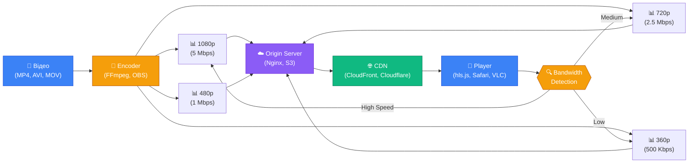
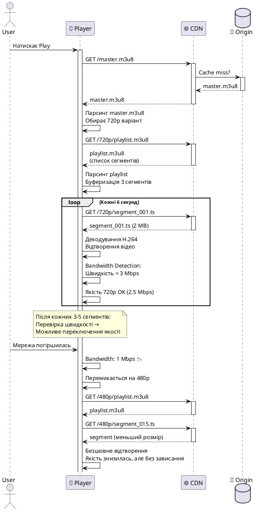
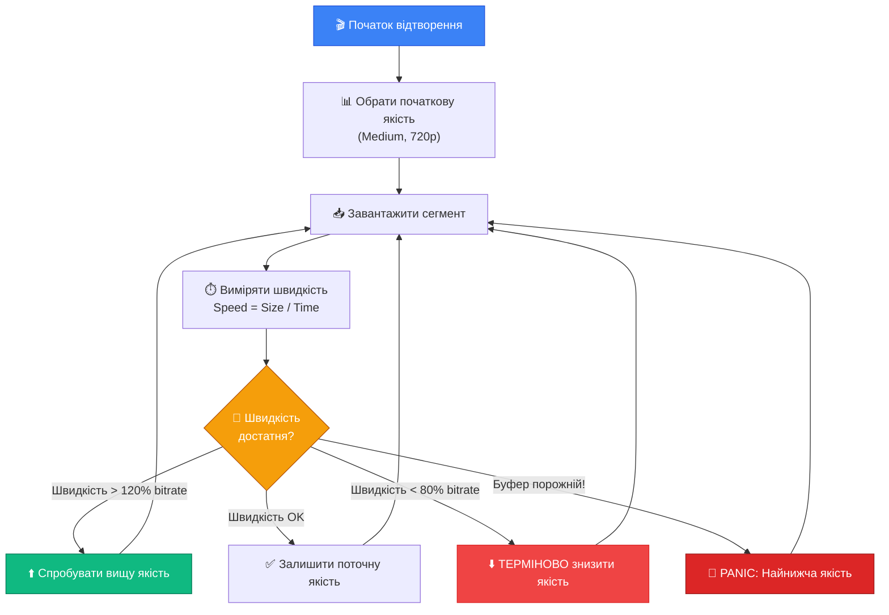

# 04. HLS Protocol: HTTP Live Streaming у Деталях

## 1. Вступ та Контекст

### Проблема: Як YouTube плавно перемикає якість відео?

Уявіть ситуацію: ви дивитесь відео на YouTube у Full HD (1080p). Раптом ваш Wi-Fi погіршується (хтось почав завантажувати великий файл). Відео не зависає! Воно автоматично перемикається на 720p, потім на 480p. Коли інтернет знову стабілізується — якість повертається до 1080p. **Як це працює?**

Це магія HLS (HTTP Live Streaming) — протоколу, який змінив індустрію стрімінгу назавжди.

### Історична еволюція: Від RTMP до HLS

::steps

### 2000-ті роки: Епоха RTMP (Flash)

У часи Flash Player відео стрімилось через RTMP (Real-Time Messaging Protocol). Це був **бінарний** протокол, який працював через порт 1935.

**Проблеми RTMP:**

- Фаєрволи блокували порт 1935 (дозволений тільки HTTP 80/443)
- Не було адаптивної якості (bitrate фіксований)
- Потрібен спеціальний медіа-сервер (Adobe Media Server, Wowza)
- Flash Player помер у 2020 році

### 2009 рік: Apple винаходить HLS

Apple хотіла стрімити відео на iPhone 3GS. Проблема: Flash не працював на iOS. Рішення: створити протокол, який:

- Використовує звичайний HTTP (порт 80/443) — проходить крізь будь-які фаєрволи
- Працює через CDN (Content Delivery Network) — масштабується на мільйони користувачів
- Підтримує ABR (Adaptive Bitrate) — автоматично змінює якість

**Результат:** У червні 2009 року Apple представила HLS разом з iPhone 3GS.

### 2010-ті: HLS стає стандартом

- **2011**: YouTube переходить з Flash на HTML5 + HLS
- **2017**: RFC 8216 (офіційна специфікація HLS)
- **2020**: Flash офіційно помер. HLS переміг

::

### Чому HLS переміг?

::card-group

::card{title="🌐 Працює через HTTP" icon="i-lucide-globe"}
Для сервера стрімінг виглядає як звичайне завантаження JPG-зображень. Не потрібні спеціальні медіа-сервери — підійде звичайний **Nginx** або **Apache**.

::

::card{title="📊 Adaptive Bitrate" icon="i-lucide-trending-up"}
Плеєр автоматично вибирає якість залежно від швидкості інтернету. Користувач із 4G бачить 1080p, користувач із 3G — 360p.

::

::card{title="🚀 CDN-сумісність" icon="i-lucide-rocket"}
Стрімінг кешується на **CloudFront**, **Cloudflare**, **Fastly** так само, як статичні файли (CSS, JS). Це дешево і швидко.

::

::card{title="📱 Нативний для Apple" icon="i-lucide-smartphone"}
iOS/macOS підтримують HLS на рівні ОС. Не потрібні сторонні бібліотеки — працює в Safari з тегом `<video>`.

::

::

### Сценарії використання

::tabs

::tabs-item{label="🔴 Live Streaming" icon="i-lucide-radio"}

**Приклади:** Twitch, YouTube Live, спортивні трансляції

**Особливості:**

- Playlist постійно оновлюється (кожні 2-10 секунд)
- Затримка (latency): 10-30 секунд (звичайний HLS), 2-6 секунд (Low Latency HLS)
- Сегменти видаляються після певного часу (sliding window)

**Use case:**

```plaintext
Стрімер грає в CS:GO → OBS кодує в HLS → CDN роздає 100,000 глядачам
```

::

::tabs-item{label="🎬 VOD (Video on Demand)" icon="i-lucide-film"}

**Приклади:** Netflix, Amazon Prime, YouTube (записані відео)

**Особливості:**

- Playlist статичний (створений один раз)
- Сегменти зберігаються назавжди (доки не видалять відео)
- Можна шукати (seek) по всьому відео

**Use case:**

```plaintext
Користувач вибирає серіал → CDN віддає готовий HLS → перегляд без буферизації
```

::

::tabs-item{label="📺 DVR (Time-shifting)" icon="i-lucide-clock"}

**Приклади:** IPTV-сервіси, спортивні трансляції з перемоткою

**Особливості:**

- Live стрім, але з можливістю перемотати назад
- Playlist містить старі сегменти (наприклад, останні 2 години)
- Використовується `EXT-X-PLAYLIST-TYPE:EVENT`

**Use case:**

```plaintext
Футбольний матч live → глядач запізнився → перемотує на початок → дивиться з затримкою
```

::

::

### Передумови (Prerequisites)

Перед вивченням HLS корисно розуміти:

- **HTTP/HTTPS**: Методи GET, коди відповідей (200, 404), заголовки (Content-Type, Cache-Control)
- **Відео-кодеки**: H.264/AVC, H.265/HEVC (див. [попередню главу](./03.video-codecs.md))
- **Аудіо-кодеки**: AAC, MP3
- **Контейнери**: MP4, MPEG-TS (див. [анатомію відео](./02.audio-video-anatomy.md))

::note
**Примітка**: Якщо ви розумієте, як працює завантаження зображень на веб-сторінці (``), ви легко зрозумієте HLS — це той самий принцип, але для відео.
::

---

## 2. Фундаментальні Концепції

### Що таке HLS? (Formal Definition)

**HLS (HTTP Live Streaming)** — це протокол потокової передачі медіа-контенту через HTTP, розроблений компанією Apple. Він базується на архітектурі **сегментованого стрімінгу** та **адаптивного вибору бітрейту**.

**Ключові поняття:**

- **Playlist (Manifest)**: Текстовий файл у форматі M3U8, який містить метаінформацію про доступні потоки та сегменти
- **Segment**: Короткий фрагмент відео (зазвичай 2-10 секунд), закодований у контейнер MPEG-TS (.ts) або fMP4 (.m4s)
- **Adaptive Bitrate (ABR)**: Механізм динамічного вибору якості потоку залежно від пропускної здатності мережі клієнта

### Архітектура HLS: Огляд

::mermaid



::

**Пояснення потоку:**

1. **Encoder** отримує вихідне відео і кодує його в кілька варіантів якості (1080p, 720p, 480p, 360p)
2. **Origin Server** зберігає всі сегменти та плейлісти
3. **CDN** кешує контент і роздає користувачам по всьому світу
4. **Player** завантажує плейлісти, визначає швидкість інтернету і вибирає оптимальну якість

### Основні компоненти HLS

::field-group

::field{name="Master Playlist (.m3u8)" type="File"}
Головний маніфест, який містить посилання на всі доступні варіанти якості (bitrate варіанти). Це перший файл, який завантажує плеєр.

- **Приклад імені:** `master.m3u8`, `index.m3u8`, `playlist.m3u8`

::

::field{name="Media Playlist (.m3u8)" type="File"}
Список конкретних медіа-сегментів для певної якості. Кожний варіант bitrate має свій Media Playlist.

- **Приклад імені:** `1080p/playlist.m3u8`, `720p/playlist.m3u8`

::

::field{name="Segment (.ts, .m4s)" type="File"}
Фрагмент відео тривалістю 2-10 секунд. Це те, що реально завантажується і програється.

- **Формати:**

- `.ts` — MPEG-2 Transport Stream (класичний)
- `.m4s` — Fragmented MP4 (сучасний, CMAF-сумісний)

::

::field{name="Init Segment (init.mp4)" type="File" required="false"}
Обов'язковий для fMP4. Містить метадані (кодек, роздільну здатність, sample rate), без яких сегменти не можуть бути декодовані.

::

::

### Аналогія 1: Книга з перекладами

Уявіть дуже товсту книгу (фільм на 2 години):

::steps

### Крок 1: Обираєте мову (Master Playlist)

Ви беріть книгу у руки і бачите на обкладинці:

```
"Ця книга доступна мовами:
- Українська (сторінка 1)
- English (сторінка 500)
- Deutsch (сторінка 1000)"
```

Це **Master Playlist** — він каже, які варіанти доступні.

### Крок 2: Знаходите зміст (Media Playlist)

Ви відкриваєте сторінку 1 (українська версія) і бачите **зміст**:

```
Розділ 1: сторінки 10-25
Розділ 2: сторінки 26-40
Розділ 3: сторінки 41-55
```

Це **Media Playlist** — список конкретних фрагментів.

### Крок 3: Читаєте по частинах (Segments)

Ви не читаєте всю книгу за раз. Ви читаєте Розділ 1 (15 сторінок), потім Розділ 2 (14 сторінок), і так далі.

Кожний розділ — це **Segment** (фрагмент відео).

::

::tip
**Ключова ідея**: Ви не завантажуєте весь фільм (2 GB) одразу. Ви завантажуєте маленькі шматки по 2-5 MB (10 секунд відео) і починаєте дивитись, поки завантажуються наступні.
::

### Аналогія 2: Ресторан з меню

::card-group

::card{title="📋 Головне меню" icon="i-lucide-book-open"}
**Master Playlist**

Ви заходите в ресторан і отримуєте головне меню:

```
Меню:
- Англійською (сторінка 2)
- Французькою (сторінка 10)
- Китайською (сторінка 20)
```

::

::card{title="🍕 Розділ \"Піца\"" icon="i-lucide-pizza"}
**Media Playlist**

Ви обираєте англійську версію і відкриваєте розділ "Піца":

```
Піца:
1. Маргарита
2. Пепероні
3. Чотири сири
```

::

::card{title="🍽️ Конкретна страва" icon="i-lucide-utensils"}
**Segment**

Ви обираєте "Маргарита" і отримуєте конкретну порцію їжі. Це і є сегмент — те, що ви реально "споживаєте".

::

::

---

## 3. Архітектура та Механіка

### 3.1. Анатомія Master Playlist

Master Playlist — це текстовий файл UTF-8 з розширенням `.m3u8`. Формат базується на M3U (MP3 URL), але з додатковими тегами для HLS.

#### Приклад мінімального Master Playlist:

```m3u8
#EXTM3U
#EXT-X-VERSION:3

#EXT-X-STREAM-INF:BANDWIDTH=800000,RESOLUTION=640x360
360p/playlist.m3u8

#EXT-X-STREAM-INF:BANDWIDTH=1400000,RESOLUTION=1280x720
720p/playlist.m3u8

#EXT-X-STREAM-INF:BANDWIDTH=5000000,RESOLUTION=1920x1080
1080p/playlist.m3u8
```

#### Розбір кожного рядка:

::field-group

::field{name="#EXTM3U" type="Обов'язковий тег" required="true"}
Перший рядок **будь-якого** HLS playlist. Каже парсеру: "Це M3U8 файл, а не звичайний текст".

::

::field{name="#EXT-X-VERSION" type="Integer"}
Версія протоколу HLS. Можливі значення: 1-7.

**Рекомендовано:** версія 3 (підтримка floating-point тривалості сегментів) або вище.

::

::field{name="#EXT-X-STREAM-INF" type="Обов'язковий для варіантів"}
Описує один варіант потоку. Атрибути:

- **BANDWIDTH** (обов'язково): Пікова швидкість у бітах/сек (800000 = 800 Kbps)
- **RESOLUTION**: Роздільна здатність відео (ширина×висота)
- **CODECS**: Кодеки аудіо і відео (опціонально, але рекомендовано)
- **FRAME-RATE**: Частота кадрів (опціонально)

Наступний рядок після цього тегу — URL Media Playlist.

::

::

#### Приклад розширеного Master Playlist:

::code-collapse{title="Показати повний Master Playlist з усіма атрибутами"}

```m3u8
#EXTM3U
#EXT-X-VERSION:6

# Варіант 1: 1080p 60fps (High Quality)
#EXT-X-STREAM-INF:BANDWIDTH=7800000,AVERAGE-BANDWIDTH=7200000,RESOLUTION=1920x1080,FRAME-RATE=60.000,CODECS="avc1.640028,mp4a.40.2",AUDIO="audio-high"
1080p60/playlist.m3u8

# Варіант 2: 1080p 30fps (Standard)
#EXT-X-STREAM-INF:BANDWIDTH=5000000,AVERAGE-BANDWIDTH=4500000,RESOLUTION=1920x1080,FRAME-RATE=30.000,CODECS="avc1.64001f,mp4a.40.2",AUDIO="audio-high"
1080p30/playlist.m3u8

# Варіант 3: 720p (Medium Quality)
#EXT-X-STREAM-INF:BANDWIDTH=2800000,AVERAGE-BANDWIDTH=2500000,RESOLUTION=1280x720,FRAME-RATE=30.000,CODECS="avc1.64001f,mp4a.40.2",AUDIO="audio-medium"
720p/playlist.m3u8

# Варіант 4: 480p (Low Quality)
#EXT-X-STREAM-INF:BANDWIDTH=1400000,AVERAGE-BANDWIDTH=1200000,RESOLUTION=854x480,FRAME-RATE=30.000,CODECS="avc1.64001e,mp4a.40.2",AUDIO="audio-low"
480p/playlist.m3u8

# Варіант 5: 360p (Mobile)
#EXT-X-STREAM-INF:BANDWIDTH=800000,AVERAGE-BANDWIDTH=700000,RESOLUTION=640x360,FRAME-RATE=30.000,CODECS="avc1.64001e,mp4a.40.2",AUDIO="audio-low"
360p/playlist.m3u8

# Альтернативні аудіо-треки
#EXT-X-MEDIA:TYPE=AUDIO,GROUP-ID="audio-high",NAME="English",LANGUAGE="en",AUTOSELECT=YES,DEFAULT=YES,URI="audio/en/playlist.m3u8"
#EXT-X-MEDIA:TYPE=AUDIO,GROUP-ID="audio-high",NAME="Ukrainian",LANGUAGE="uk",AUTOSELECT=NO,DEFAULT=NO,URI="audio/uk/playlist.m3u8"
```

::

::warning
**Важливо**: `BANDWIDTH` — це **пікова** швидкість (максимум). `AVERAGE-BANDWIDTH` — це середня швидкість. Плеєр використовує ці значення для вибору якості.

**Практичний приклад:**

- У користувача швидкість 6 Mbps
- Плеєр **НЕ** обере варіант 1080p60 (7.8 Mbps), бо недостатньо запасу
- Плеєр обере 1080p30 (5 Mbps) — є запас 1 Mbps для стабільності

::

### 3.2. Анатомія Media Playlist

Media Playlist містить список конкретних сегментів для відтворення.

#### Приклад Media Playlist (VOD):

```m3u8
#EXTM3U
#EXT-X-VERSION:3
#EXT-X-TARGETDURATION:10
#EXT-X-MEDIA-SEQUENCE:0
#EXT-X-PLAYLIST-TYPE:VOD

#EXTINF:9.009,
segment_00001.ts
#EXTINF:9.009,
segment_00002.ts
#EXTINF:9.009,
segment_00003.ts
#EXTINF:9.009,
segment_00004.ts
#EXTINF:9.009,
segment_00005.ts

#EXT-X-ENDLIST
```

#### Розбір тегів:

::field-group

::field{name="#EXT-X-TARGETDURATION" type="Integer" required="true"}
Максимальна тривалість сегмента (у секундах). Жоден сегмент не може бути довшим за це значення.

**Практичне значення**: Плеєр знає, скільки буферу тримати. Якщо `TARGETDURATION=10`, плеєр буферує мінімум 30 секунд (3 сегменти).

::

::field{name="#EXT-X-MEDIA-SEQUENCE" type="Integer"}
Порядковий номер першого сегмента в плейлісті. Використовується для Live стрімів.

**Приклад (Live):**

```m3u8
#EXT-X-MEDIA-SEQUENCE:1523  ← перший сегмент має номер 1523
segment_01523.ts
segment_01524.ts
segment_01525.ts
```

::

::field{name="#EXT-X-PLAYLIST-TYPE" type="Enum"}
Тип плейліста. Можливі значення:

- **VOD** — статичний контент (кінець файлу позначений `#EXT-X-ENDLIST`)
- **EVENT** — live з можливістю перемотування (DVR)

Якщо тег відсутній — це **live** стрім без DVR.

::

::field{name="#EXTINF" type="Float,String"}
Тривалість наступного сегмента (у секундах). Опціонально: опис після коми.

- **Формат:** `#EXTINF:<duration>,[description]`

**Приклад:**

```m3u8
#EXTINF:10.500,This is chapter 1
segment_001.ts
```

::

::field{name="#EXT-X-ENDLIST" type="Flag"}
Позначає кінець VOD-відео. Після цього тега сегментів немає. Плеєр зупиняє оновлення плейліста.

- **Якщо тег відсутній** → це live стрім, плеєр продовжує оновлювати плейліст кожні `TARGETDURATION/2` секунд.

::

::

#### Приклад Media Playlist (Live):

```m3u8
#EXTM3U
#EXT-X-VERSION:3
#EXT-X-TARGETDURATION:6
#EXT-X-MEDIA-SEQUENCE:4521

#EXTINF:6.000,
segment_04521.ts
#EXTINF:6.000,
segment_04522.ts
#EXTINF:6.000,
segment_04523.ts
#EXTINF:6.000,
segment_04524.ts
#EXTINF:6.000,
segment_04525.ts
```

::note
**Примітка**: Live плейліст **НЕ має** тега `#EXT-X-ENDLIST`. Плеєр періодично оновлює цей файл (кожні 3 секунди, якщо `TARGETDURATION=6`), щоб отримати нові сегменти.
::

### 3.3. Формати сегментів: MPEG-TS vs fMP4

::tabs

::tabs-item{label="MPEG-TS (.ts)" icon="i-lucide-file-video"}

**MPEG-2 Transport Stream** — класичний контейнер для HLS.

**Структура:**

```
┌─────────────┬─────────────┬─────────────┬─────────────┐
│ TS Packet   │ TS Packet   │ TS Packet   │ TS Packet   │
│ (188 bytes) │ (188 bytes) │ (188 bytes) │ (188 bytes) │
└─────────────┴─────────────┴─────────────┴─────────────┘
```

Кожен пакет:

- **Header (4 bytes)**: Sync byte (0x47), PID (ідентифікатор потоку), counters
- **Payload (184 bytes)**: Аудіо, відео або метадані

**Переваги:**

- ✅ Дуже простий формат
- ✅ Можна склеїти файли командою `cat seg1.ts seg2.ts > full.ts`
- ✅ Працює навіть якщо частина файлу пошкоджена (error resilience)

**Недоліки:**

- ❌ Багато overhead (заголовки займають ~10-15% розміру)
- ❌ Не можна використовувати для DASH (потрібен окремий набір сегментів)

::

::tabs-item{label="fMP4 (.m4s, .mp4)" icon="i-lucide-box"}

**Fragmented MP4** — сучасний контейнер, заснований на ISO Base Media File Format.

**Структура:**

```
init.mp4 (Header: кодеки, роздільна здатність, sample rate)
   ↓
segment_001.m4s (тільки відео/аудіо дані)
segment_002.m4s
segment_003.m4s
```

**Переваги:**

- ✅ Більш ефективний (менше overhead, економія 10-15% розміру)
- ✅ **CMAF-сумісний**: один і той же сегмент для HLS і DASH (економія місця на сервері в 2 рази!)
- ✅ Підтримка сучасних кодеків (AV1, HEVC) краща

**Недоліки:**

- ❌ Потрібен `init.mp4` (плеєр спершу завантажує header, потім сегменти)
- ❌ Складніша структура (не можна просто склеїти файли)

::

::

::tip
**Рекомендація 2024+**: Використовуйте **fMP4 (CMAF)**. Це дозволяє мати один набір сегментів для HLS (Apple) і DASH (Android). Google рекомендує CMAF для YouTube.

- **Як створити:**

```bash
ffmpeg -i input.mp4 \
  -c:v libx264 -c:a aac \
  -f hls -hls_segment_type fmp4 \
  -hls_playlist_type vod \
  output.m3u8
```

::

### 3.4. Як працює HLS під капотом

::plant-uml



::

**Пояснення кроків:**

::steps

### 1. Завантаження Master Playlist

Плеєр завжди починає з завантаження `master.m3u8`. Якщо файл закешований на CDN — відповідь приходить за 50-100 мс.

### 2. Вибір початкової якості

Плеєр **не знає** швидкості інтернету на старті. Тому обирає **середню** якість (зазвичай 720p або 480p). Агресивні плеєри (YouTube) починають з найвищої якості.

### 3. Завантаження Media Playlist

Обравши якість (наприклад, 720p), плеєр завантажує `/720p/playlist.m3u8` — список конкретних сегментів.

### 4. Початкова буферизація

Плеєр завантажує **3-5 сегментів** (30-50 секунд відео) в буфер перед початком відтворення. Це захист від мікро-зависань.

### 5. Паралельне завантаження та відтворення

Поки програє перший сегмент, плеєр **вже завантажує** 4-й, 5-й сегменти. Це конвеєр (pipelining).

### 6. Вимірювання швидкості (Bandwidth Detection)

При завантаженні кожного сегмента плеєр вимірює:

```
Швидкість = (Розмір сегмента в бітах) / (Час завантаження)
```

**Приклад:**

- Сегмент: 2 MB = 16 Мбіт
- Час завантаження: 4 секунди
- Швидкість: 16 / 4 = **4 Mbps**

### 7. Рішення про переключення

Кожні 3-5 сегментів плеєр аналізує:

```
Якщо (Середня швидкість > Поточний bitrate × 1.2):
    Спробувати вищу якість
Якщо (Середня швидкість < Поточний bitrate × 0.8):
    ТЕРМІНОВО знизити якість
```

### 8. Seamless Switch (безшовне переключення)

Плеєр **НЕ** перезавантажується. Він просто:

1. Завантажує playlist нової якості (`/480p/playlist.m3u8`)
2. Знаходить сегмент з такою самою **часовою міткою** (timestamp)
3. Продовжує відтворення з нового потоку

Користувач бачить зміну якості, але **без паузи**.

::

---

## 3.5. Adaptive Bitrate (ABR): Серце HLS

**ABR** — це алгоритм автоматичного вибору якості. Без нього HLS був би звичайним завантаженням відео.

### Як працює ABR

::mermaid



::

### Приклад реального ABR-алгоритму (спрощений)

```javascript
// Це псевдокод, що показує логіку hls.js
class ABRController {
    constructor() {
        this.bandwidthHistory = [] // Історія вимірювань швидкості
        this.currentLevel = 2 // Поточна якість (0=lowest, 4=highest)
    }

    // Викликається після завантаження кожного сегмента
    onSegmentLoaded(segmentSize, downloadTime) {
        // 1. Виміряти швидкість
        const bandwidth = (segmentSize * 8) / downloadTime // біти/сек
        this.bandwidthHistory.push(bandwidth)

        // Тримаємо тільки останні 5 вимірювань
        if (this.bandwidthHistory.length > 5) {
            this.bandwidthHistory.shift()
        }

        // 2. Розрахувати середню швидкість (Exponential Moving Average)
        const avgBandwidth = this.calculateEMA()

        // 3. Доступні якості (bitrate'и в бітах/сек)
        const levels = [
            { bitrate: 500000, name: '360p' }, // 0
            { bitrate: 1000000, name: '480p' }, // 1
            { bitrate: 2500000, name: '720p' }, // 2
            { bitrate: 5000000, name: '1080p' }, // 3
            { bitrate: 8000000, name: '1080p60' }, // 4
        ]

        // 4. Знайти оптимальну якість з запасом 20%
        const targetBandwidth = avgBandwidth * 0.8 // Запас 20%
        let newLevel = 0

        for (let i = levels.length - 1; i >= 0; i--) {
            if (levels[i].bitrate <= targetBandwidth) {
                newLevel = i
                break
            }
        }

        // 5. Антифлікер: не змінювати якість занадто часто
        if (Math.abs(newLevel - this.currentLevel) === 1) {
            // Якщо різниця тільки 1 рівень — чекаємо ще 2 сегменти
            return
        }

        // 6. Негайне зниження якості при проблемах
        const bufferLength = this.getBufferLength()
        if (bufferLength < 10) {
            // Менше 10 секунд у буфері
            console.warn('⚠️ Low buffer! Switching to lower quality')
            newLevel = Math.max(0, this.currentLevel - 2)
        }

        // 7. Переключення
        if (newLevel !== this.currentLevel) {
            console.log(`📊 Quality switch: ${levels[this.currentLevel].name} → ${levels[newLevel].name}`)
            this.currentLevel = newLevel
            this.switchToLevel(newLevel)
        }
    }

    calculateEMA() {
        // Exponential Moving Average: новіші значення важать більше
        let ema = this.bandwidthHistory[0]
        const alpha = 0.3 // Sensitivity factor

        for (let i = 1; i < this.bandwidthHistory.length; i++) {
            ema = alpha * this.bandwidthHistory[i] + (1 - alpha) * ema
        }

        return ema
    }
}
```

### 6.2. Performance Optimization (продовження)

::card-group

::card{title="🚀 Preloading" icon="i-lucide-zap"}

Браузер може завантажити перші сегменти **ДО** того, як користувач натисне Play.

```html
<link rel="preload" as="fetch" href="https://cdn.example.com/master.m3u8" crossorigin />
<link rel="preload" as="fetch" href="https://cdn.example.com/720p/segment_000.ts" crossorigin />
```

Економія: 500-800ms швидше старт відтворення.

::

::card{title="📦 Segment Size Tuning" icon="i-lucide-package"}

**Правило:** Розмір сегмента = Bitrate × Duration

**Приклад:**

- Bitrate: 2.5 Mbps = 2,500,000 bits/sec
- Duration: 6 секунд
- Розмір: 2,500,000 × 6 ÷ 8 = **1.875 MB**

**Оптимальні значення:**

- Mobile (3G/4G): 1-2 MB (4-6 сек по 2 Mbps)
- Desktop (Wi-Fi): 3-5 MB (6-10 сек по 5 Mbps)

::

::card{title="🌐 CDN Caching Headers" icon="i-lucide-server"}

Правильні Cache-Control headers економлять bandwidth:

```nginx
# Master Playlist: короткий TTL (для Live)
location ~ master\.m3u8$ {
    add_header Cache-Control "public, max-age=5, stale-while-revalidate=10";
}

# Media Playlist: середній TTL
location ~ \.m3u8$ {
    add_header Cache-Control "public, max-age=10, stale-while-revalidate=30";
}

# Segments: довгий TTL (immutable)
location ~ \.(ts|m4s)$ {
    add_header Cache-Control "public, max-age=31536000, immutable";
}
```

::

::card{title="⚡ HTTP/2 Server Push" icon="i-lucide-trending-up"}

Сервер може "проштовхнути" сегменти разом з плейлістом:

```nginx
http2_push /720p/segment_000.ts;
http2_push /720p/segment_001.ts;
```

Економія: 1 RTT (Round Trip Time) на кожен сегмент.

::

::

### 6.3. Low Latency HLS (LL-HLS)

**Traditional HLS latency:** 20-40 секунд

**LL-HLS latency:** 2-6 секунд (як у WebRTC!)

#### Ключові зміни в LL-HLS:

::field-group

::field{name="Partial Segments" type="Feature"}
Сегмент ділиться на **часткові фрагменти** (0.5-1 секунда). Плеєр не чекає повного сегмента (6 сек), а завантажує по 0.5 сек.

```m3u8
#EXT-X-PART:DURATION=0.500,URI="segment_001_part_0.m4s"
#EXT-X-PART:DURATION=0.500,URI="segment_001_part_1.m4s"
#EXT-X-PART:DURATION=0.500,URI="segment_001_part_2.m4s"
```

::

::field{name="Playlist Delta Updates" type="Feature"}
Плеєр отримує **тільки нові рядки** плейліста, а не весь файл. Економія bandwidth.

::

::field{name="Blocking Playlist Reload" type="Feature"}
HTTP запит до плейліста **не повертається** доти, поки не з'явиться новий сегмент. Це уникає зайвих polling-запитів.

**HTTP/2 Server Push** використовується для instant delivery.

::

::

::warning
**Увага**: LL-HLS вимагає:

- HTTP/2 (або HTTP/3)
- Спеціальний origin server (Apple Unified Streaming, Wowza, AWS MediaLive)
- iOS 14+ / macOS 11+ для нативної підтримки
- hls.js v1.1.0+ для інших браузерів

**Use case:** Спортивні ставки в реальному часі, інтерактивні live шоу, аукціони.
::

### 6.4. Demos та Експерименти

#### Demo 1: Ручний HLS Плеєр (Shell Script)

Напишемо плеєр на Bash, який завантажує та програє HLS вручну:

```bash
#!/bin/bash

HLS_URL="https://test-streams.mux.dev/x36xhzz/x36xhzz.m3u8"
OUTPUT_DIR="hls_download"

mkdir -p $OUTPUT_DIR
cd $OUTPUT_DIR

echo "📥 Step 1: Download Master Playlist"
curl -s "$HLS_URL" > master.m3u8
cat master.m3u8

echo -e "\n📊 Step 2: Choose quality (picking first variant)"
VARIANT_URL=$(grep -v '^#' master.m3u8 | head -1)
BASE_HLS_URL="https://test-streams.mux.dev/x36xhzz"
FULL_VARIANT_URL="$BASE_HLS_URL/$VARIANT_URL"

echo "Selected: $FULL_VARIANT_URL"

echo -e "\n📥 Step 3: Download Media Playlist"
curl -s "$FULL_VARIANT_URL" > playlist.m3u8
cat playlist.m3u8

echo -e "\n🎬 Step 4: Download first 5 segments"
BASE_URL=$(dirname "$FULL_VARIANT_URL")
SEGMENTS=$(grep -v '^#' playlist.m3u8 | head -5)

i=1
for segment in $SEGMENTS; do
    echo "Downloading segment $i: $segment"
    curl -s "$BASE_URL/$segment" > "segment_$i.m4s"
    i=$((i+1))
done

echo -e "\n✅ Done! Downloaded 5 segments"
ls -lh *.m4s

echo -e "\n▶️  Step 5: Play (requires ffplay)"
# Concatenate segments and play
cat segment_*.m4s > combined.m4s
ffplay combined.m4s

# Or open in default video player
# open combined.m4s  # macOS
# xdg-open combined.m4s  # Linux
```

**Запуск:**

```bash
chmod +x hls_manual_player.sh
./hls_manual_player.sh
```

**Що ви побачите:**

```
📥 Step 1: Download Master Playlist
#EXTM3U
#EXT-X-VERSION:6
#EXT-X-STREAM-INF:BANDWIDTH=2227464,AVERAGE-BANDWIDTH=2218327,RESOLUTION=960x540...

📊 Step 2: Choose quality (picking first variant)
Selected: https://.../v2/prog_index.m3u8

📥 Step 3: Download Media Playlist
#EXTM3U
#EXT-X-TARGETDURATION:6
#EXTINF:6.00600,...

🎬 Step 4: Download first 5 segments
Downloading segment 1: main1.m4s
Downloading segment 2: main2.m4s
...

✅ Done! Downloaded 5 segments
-rw-r--r--  1 user  staff   1.2M main1.m4s
...
```

#### Demo 2: Симуляція Live Streaming

Створимо fake live stream з існуючого відео:

::code-collapse{title="Показати скрипт симуляції live streaming"}

```bash
#!/bin/bash

INPUT_VIDEO="movie.mp4"
OUTPUT_DIR="live_stream"
SEGMENT_DURATION=4

mkdir -p $OUTPUT_DIR

# Крок 1: Розбити відео на сегменти
echo "🔪 Segmenting video..."
ffmpeg -i "$INPUT_VIDEO" \
  -c copy \
  -f segment \
  -segment_time $SEGMENT_DURATION \
  -reset_timestamps 1 \
  "$OUTPUT_DIR/segment_%05d.ts"

# Крок 2: Симулювати live додавання сегментів до playlist
echo "🔴 Starting live simulation..."

PLAYLIST="$OUTPUT_DIR/live.m3u8"
MEDIA_SEQUENCE=0
MAX_SEGMENTS=5  # Sliding window (тримаємо тільки 5 останніх сегментів)

# Ініціалізація playlist
cat > "$PLAYLIST" <<EOF
#EXTM3U
#EXT-X-VERSION:3
#EXT-X-TARGETDURATION:$SEGMENT_DURATION
#EXT-X-MEDIA-SEQUENCE:$MEDIA_SEQUENCE
EOF

# Додаємо сегменти по одному (кожні 4 секунди)
for segment in $OUTPUT_DIR/segment_*.ts; do
    SEGMENT_NAME=$(basename "$segment")

    echo "➕ Adding segment: $SEGMENT_NAME (sequence: $MEDIA_SEQUENCE)"

    # Додаємо новий сегмент
    echo "#EXTINF:$SEGMENT_DURATION.0," >> "$PLAYLIST"
    echo "$SEGMENT_NAME" >> "$PLAYLIST"

    # Зберігаємо тільки останні N сегментів (sliding window)
    TOTAL_SEGMENTS=$(grep -c "^segment_" "$PLAYLIST")
    if [ $TOTAL_SEGMENTS -gt $MAX_SEGMENTS ]; then
        # Видаляємо перший сегмент з плейліста
        sed -i.bak '/#EXTINF/,+1d' "$PLAYLIST"  # Видаляє перші 2 рядки (#EXTINF + filename)
        MEDIA_SEQUENCE=$((MEDIA_SEQUENCE + 1))

        # Оновлюємо MEDIA-SEQUENCE
        sed -i.bak "s/#EXT-X-MEDIA-SEQUENCE:.*/#EXT-X-MEDIA-SEQUENCE:$MEDIA_SEQUENCE/" "$PLAYLIST"
    fi

    echo "📄 Current playlist:"
    cat "$PLAYLIST"
    echo ""

    # Чекаємо 4 секунди (симуляція real-time)
    sleep 4
done

# Додаємо ENDLIST (трансляція закінчилась)
echo "#EXT-X-ENDLIST" >> "$PLAYLIST"
echo "✅ Live simulation ended"
```

::

**Запуск:**

```bash
./simulate_live.sh
```

**Що відбувається:**

1. Відео розбивається на сегменти по 4 секунди
2. Кожні 4 секунди новий сегмент додається до `live.m3u8`
3. Старі сегменти видаляються (sliding window)
4. `MEDIA-SEQUENCE` збільшується

**Результат:** Ви бачите, як плейліст live stream оновлюється в real-time!

#### Demo 3: Візуалізація якості ABR

Створимо HTML сторінку, яка показує зміни якості в real-time:

::code-collapse{title="Показати HTML + JavaScript код"}

```html
<!DOCTYPE html>
<html>
    <head>
        <title>HLS ABR Visualizer</title>
        <style>
            body {
                font-family: Arial, sans-serif;
                max-width: 1200px;
                margin: 0 auto;
                padding: 20px;
                background: #0f172a;
                color: #e2e8f0;
            }

            video {
                width: 100%;
                max-width: 800px;
                border-radius: 8px;
            }

            .stats {
                display: grid;
                grid-template-columns: repeat(auto-fit, minmax(200px, 1fr));
                gap: 15px;
                margin-top: 20px;
            }

            .stat-card {
                background: #1e293b;
                padding: 15px;
                border-radius: 8px;
                border-left: 4px solid #3b82f6;
            }

            .stat-label {
                font-size: 12px;
                color: #94a3b8;
                text-transform: uppercase;
            }

            .stat-value {
                font-size: 24px;
                font-weight: bold;
                margin-top: 5px;
            }

            #quality-chart {
                margin-top: 30px;
                height: 200px;
                background: #1e293b;
                border-radius: 8px;
                padding: 20px;
                position: relative;
            }

            .quality-bar {
                height: 100%;
                display: flex;
                align-items: flex-end;
                gap: 2px;
            }

            .bar {
                flex: 1;
                background: #3b82f6;
                border-radius: 2px 2px 0 0;
                transition: height 0.3s;
            }
        </style>
    </head>
    <body>
        <h1>🎬 HLS Adaptive Bitrate Visualizer</h1>

        <video id="video" controls></video>

        <div class="stats">
            <div class="stat-card">
                <div class="stat-label">Current Quality</div>
                <div class="stat-value" id="current-quality">-</div>
            </div>

            <div class="stat-card">
                <div class="stat-label">Bandwidth</div>
                <div class="stat-value" id="bandwidth">- Mbps</div>
            </div>

            <div class="stat-card">
                <div class="stat-label">Buffer Length</div>
                <div class="stat-value" id="buffer">- sec</div>
            </div>

            <div class="stat-card">
                <div class="stat-label">Dropped Frames</div>
                <div class="stat-value" id="dropped-frames">0</div>
            </div>
        </div>

        <div id="quality-chart">
            <h3>Quality History (Last 60 seconds)</h3>
            <div class="quality-bar" id="quality-bars"></div>
        </div>

        <script src="https://cdn.jsdelivr.net/npm/hls.js@latest"></script>
        <script>
            const video = document.getElementById('video')
            const HLS_URL = 'https://test-streams.mux.dev/x36xhzz/x36xhzz.m3u8'

            const qualityHistory = []
            const MAX_HISTORY = 60

            if (Hls.isSupported()) {
                const hls = new Hls({
                    debug: false,
                    enableWorker: true,
                })

                hls.loadSource(HLS_URL)
                hls.attachMedia(video)

                // Оновлення статистики кожну секунду
                setInterval(() => {
                    updateStats(hls)
                }, 1000)

                // Відслідковування змін якості
                hls.on(Hls.Events.LEVEL_SWITCHED, (event, data) => {
                    const level = hls.levels[data.level]
                    console.log(`Quality switched to: ${level.height}p`)

                    qualityHistory.push(level.height)
                    if (qualityHistory.length > MAX_HISTORY) {
                        qualityHistory.shift()
                    }

                    updateQualityChart()
                })

                hls.on(Hls.Events.MANIFEST_PARSED, () => {
                    video.play()
                })
            }

            function updateStats(hls) {
                const level = hls.levels[hls.currentLevel]
                if (!level) return

                // Current Quality
                document.getElementById('current-quality').textContent = `${level.height}p`

                // Bandwidth (Mbps)
                const bandwidth = (hls.bandwidthEstimate / 1000000).toFixed(2)
                document.getElementById('bandwidth').textContent = `${bandwidth} Mbps`

                // Buffer Length
                const buffer = video.buffered.length > 0 ? (video.buffered.end(0) - video.currentTime).toFixed(1) : 0
                document.getElementById('buffer').textContent = `${buffer} sec`

                // Dropped Frames
                const dropped = video.getVideoPlaybackQuality?.().droppedVideoFrames || 0
                document.getElementById('dropped-frames').textContent = dropped
            }

            function updateQualityChart() {
                const container = document.getElementById('quality-bars')
                container.innerHTML = ''

                const maxQuality = Math.max(...qualityHistory)

                qualityHistory.forEach((quality) => {
                    const bar = document.createElement('div')
                    bar.className = 'bar'
                    const heightPercent = (quality / maxQuality) * 100
                    bar.style.height = `${heightPercent}%`

                    // Колір залежно від якості
                    if (quality >= 1080) bar.style.background = '#10b981'
                    else if (quality >= 720) bar.style.background = '#3b82f6'
                    else if (quality >= 480) bar.style.background = '#f59e0b'
                    else bar.style.background = '#ef4444'

                    container.appendChild(bar)
                })
            }
        </script>
    </body>
</html>
```

::

**Що показує демо:**

- Поточну якість відео (360p / 720p / 1080p)
- Виміряну швидкість інтернету
- Довжину буфера
- Графік змін якості за останню хвилину

---

## 7. Troubleshooting та Діагностика

### 7.1. Типові Проблеми

::accordion

::accordion-item{label="❌ CORS Error: No 'Access-Control-Allow-Origin' header" icon="i-lucide-alert-circle"}

**Симптом:**

```
Access to fetch at 'https://cdn.example.com/master.m3u8' from origin 'https://mysite.com'
has been blocked by CORS policy: No 'Access-Control-Allow-Origin' header is present
```

**Причина:** Сервер не віддає CORS headers.

**Рішення:**

Додайте в Nginx конфігурацію:

```nginx
location ~ \.(m3u8|ts|m4s)$ {
    add_header Access-Control-Allow-Origin * always;
    add_header Access-Control-Allow-Methods 'GET, OPTIONS' always;
    add_header Access-Control-Allow-Headers 'Range' always;

    if ($request_method = OPTIONS) {
        return 204;
    }
}
```

::

::accordion-item{label="⏸️ Відео постійно буферизується (зависає)" icon="i-lucide-loader"}

**Можливі причини:**

1. **Швидкість інтернету < bitrate відео**
    - Перевірка: Відкрийте DevTools → Network → подивіться швидкість завантаження сегментів
    - Рішення: ABR має автоматично знизити якість. Якщо ні — це баг плеєра

2. **CDN повільний або недоступний**
    - Перевірка: `curl -w "@curl-format.txt" https://cdn.example.com/segment.ts`
    - Рішення: Змініть CDN або додайте fallback origin

3. **Segments занадто великі**
    - Перевірка: Розмір сегмента > 5 MB при тривалості 6 сек = bitrate > 6.7 Mbps (дуже високий)
    - Рішення: Перекодуйте з меншим bitrate або збільшіть кількість варіантів якості

::

::accordion-item{label="🔄 Якість постійно мі гає (flickering)" icon="i-lucide-activity"}

**Симптом:** Відео перемикається між 720p і 1080p кожні 10 секунд.

**Причина:** Нестабільна мережа або надто агресивний ABR алгоритм.

**Рішення:**

```javascript
// Налаштуйте hls.js для більшої стабільності
const hls = new Hls({
    abrEwmaDefaultEstimate: 1000000, // Початковий estimate (1 Mbps)
    abrBandWidthFactor: 0.95, // Більш консервативний вибір (за замовчуванням 0.95)
    abrBandWidthUpFactor: 0.7, // Повільніше підвищення якості
})
```

::

::accordion-item{label="📱 Playlist не оновлюється (Live стрім)" icon="i-lucide-refresh-cw"}

**Симптом:** Live стрім зупиняється після 5-го сегмента.

**Причина:** Плеєр припинив оновлювати playlist (побачив `#EXT-X-ENDLIST`).

**Діагностика:**

```bash
# Перевірте, чи є ENDLIST в playlist
curl https://cdn.example.com/live/playlist.m3u8 | grep ENDLIST
```

**Рішення:**

- Видаліть `#EXT-X-ENDLIST` з Live плейліста
- Переконайтеся, що encoder додає нові сегменти

::

::accordion-item{label="🎵 Аудіо є, відео немає (або навпаки)" icon="i-lucide-volume-2"}

**Причина:** Несумісний кодек.

**Діагностика:**

```bash
# Перевірте кодеки в плейлісті
curl https://cdn.example.com/master.m3u8 | grep CODECS

# Очікуваний результат:
# CODECS="avc1.64001f,mp4a.40.2"
#         ^^^^^^^^^^^ ^^^^^^^^^
#         H.264       AAC
```

**Рішення:**

- Використовуйте H.264 (AVC) для відео (не VP9, не AV1 — Safari не підтримує)
- Використовуйте AAC для аудіо (не Opus — Safari не підтримує в HLS)

::

::accordion-item{label=" Помилка 404 на сегментах" icon="i-lucide-file-question"}

**Симптом:**

```
Failed to load resource: the server responded with a status of 404 (Not Found)
https://cdn.example.com/segment_045.ts
```

**Можливі причини:**

1. **Неправильний базовий URL**
    - Плейліст містить відносні шляхи, але браузер збирає URL неправильно

2. **Сегменти фізично відсутні**
    - Encoder not створив файл або видалив занадто рано

**Діагностика:**

```bash
# Спробуйте завантажити сегмент вручну
curl -I https://cdn.example.com/segment_045.ts

# Якщо 404 → перевірте, чи файл існує на origin
ssh user@origin-server "ls -lh /var/www/hls/segment_045.ts"
```

::

::

### 7.2. Інструменти Діагностики

::card-group

::card{title="🔍 Chrome DevTools Network Tab" icon="i-lucide-network"}

**Як використовувати:**

1. Відкрийте DevTools (F12)
2. Вкладка **Network**
3. Фільтр: Залишіть тільки `.m3u8` та `.ts` файли
4. Натисніть Play на відео

**Що дивитись:**

- **Time**: Час завантаження (має бути < тривалості сегмента)
- **Size**: Розмір файлу (має відповідати `bitrate × duration`)
- **Status**: Код відповіді (200 = OK, 404 = не знайдено, 403 = заборонено)

::

::card{title="📊 VLC Media Info" icon="i-lucide-info"}

VLC показує детальну інформацію про стрім:

1. Відкрийте HLS в VLC: **Media → Open Network Stream**
2. Вставте `https://cdn.example.com/master.m3u8`
3. **Tools → Codec Information** (Ctrl+J)

**Що дивитись:**

- Кодеки (має бути H.264 + AAC)
- Bitrate (реальний vs очікуваний)
- Dropped frames (якщо > 0 — проблема з decode)

::

::card{title="⚙️ FFprobe для аналізу сегментів" icon="i-lucide-terminal"}

```bash
# Перевірити кодеки
ffprobe -v error -show_streams segment_001.ts

# Перевірити тривалість
ffprobe -v error -show_entries format=duration segment_001.ts

# Перевірити bitrate
ffprobe -v error -show_entries format=bit_rate segment_001.ts
```

**Очікуваний output:**

```
duration=6.006000
bit_rate=2534567
```

::

::card{title="🌐 Online HLS Validators" icon="i-lucide-check-circle"}

**Сервіси для перевірки:**

- [HLS Validator by Apple](https://developer.apple.com/documentation/http_live_streaming/about_apple_s_http_live_streaming_tools)
- [Cloudflare Stream Tester](https://www.cloudflare.com/en-gb/learning/video/what-is-http-live-streaming/)

Вставте URL вашого `master.m3u8` і отримайте звіт про помилки.

::

::

---

## 8. HLS vs Інші Протоколи

### 8.1. HLS vs DASH

::tabs

::tabs-item{label="HLS" icon="i-lucide-apple"}

**HTTP Live Streaming** від Apple

**Переваги:**

- ✅ Натівна підтримка iOS/macOS/Safari
- ✅ Простіший формат (M3U8 текстові плейлісти)
- ✅ Менша затримка setup (швидше стартує)
- ✅ Краща екосистема (більше CDN provider'ів підтримують)

**Недоліки:**

- ❌ Формат плейліста не XML (складніше парсити програмно)
- ❌ Менше опцій для DRM (тільки FairPlay для Apple)

::

::tabs-item{label="DASH" icon="i-lucide-play-circle"}

**Dynamic Adaptive Streaming over HTTP** від MPEG Industry

**Переваги:**

- ✅ Відкритий стандарт (ISO/IEC 23009)
- ✅ Кращий DRM (Widevine, PlayReady)
- ✅ XML-based manifest (простіше валідувати)
- ✅ Більше гнучкості (підтримка Timeline, SegmentTemplate)

**Недоліки:**

- ❌ Safari НЕ підтримує нативно (потрібен dash.js)
- ❌ Складніший формат (MPD XML vs M3U8)

::

::

**Порівняльна таблиця:**

| Характеристика                | HLS              | DASH                |
| ----------------------------- | ---------------- | ------------------- |
| **Розробник**                 | Apple            | MPEG                |
| **Формат Manifest**           | M3U8 (текст)     | MPD (XML)           |
| **Нативна підтримка iOS**     | ✅ Так           | ❌ Потрібен dash.js |
| **Нативна підтримка Android** | ⚠️ Частково      | ✅ Так (ExoPlayer)  |
| **Латентність (традиційна)**  | 20-40 сек        | 10-30 сек           |
| **Латентність (Low Latency)** | 2-6 сек (LL-HLS) | 3-5 сек (LL-DASH)   |
| **DRM**                       | FairPlay         | Widevine, PlayReady |
| **CDN підтримка**             | Відмінна         | Дуже добра          |
| **Екосистема**                | Більша           | Менша               |

::tip
**Рекомендація 2024+:**

- Якщо ваша аудиторія primarily iOS/Safari → **HLS**
- Якщо потрібен DRM (Netflix-style protection) → **DASH + Widevine**
- **Оптимальне рішення:** CMAF (Common Media Application Format) — один набір сегментів і для HLS, і для DASH!

```bash
ffmpeg -i input.mp4 \
  -c:v libx264 -c:a aac \
  -f hls -hls_segment_type fmp4 \  ← fMP4 (CMAF-сумісний)
  output_hls.m3u8

# Той самий набір .m4s файлів можна використати для DASH
```

::

### 8.2. HLS vs RTMP

|                         | HLS                                          | RTMP                                     |
| ----------------------- | -------------------------------------------- | ---------------------------------------- |
| **Протокол**            | HTTP/HTTPS                                   | TCP (порт 1935)                          |
| **Firewall friendly**   | ✅ Так (порт 80/443)                         | ❌ Блокується фаєрволами                 |
| **CDN**                 | ✅ Працює                                    | ❌ Потрібен спеціальний сервер           |
| **Латентність**         | 20-40 сек (traditional)<br/>2-6 сек (LL-HLS) | 2-5 сек                                  |
| **Підтримка браузерів** | ✅ Всі (нативно або hls.js)                  | ❌ Помер з Flash                         |
| **Use case**            | VOD, Live, DVR                               | Тільки Live (більше не використовується) |

::caution
**RTMP помер у 2020 році** разом із Flash Player. Використовуйте тільки для:

- Ingest (OBS → сервер кодування)
- Legacy systems (старі камери відеоспостереження)

Для delivery до глядачів **завжди** використовуйте HLS або DASH.
::

---

## 9. Практичні Завдання

::steps

### Завдання 1: Створити HLS стрім з MP4

**Мета:** Перетворити `movie.mp4` на HLS з 3 варіантами якості.

**Кроки:**

1. Встановіть FFmpeg
2. Створіть bash-скрипт, який генерує три варіанти: 360p (800 Kbps), 720p (2.5 Mbps), 1080p (5 Mbps)
3. Створіть Master Playlist вручну
4. Запустіть локальний HTTP сервер (Python або Nginx)
5. Відкрийте в браузері

**Критерії успіху:**

- Плеєр перемикає якість автоматично (можна побачити в DevTools)
- Відео програє без зависань

### Завдання 2: Налаштувати Nginx для HLS

**Мета:** Створити production-ready Nginx конфігурацію.

**Вимоги:**

- CORS headers (щоб працював з будь-якого домену)
- Правильні Cache-Control headers (10 сек для .m3u8, 1 рік для .ts)
- Gzip compression для плейлістів
- Логування (окремий access.log для HLS)

**Перевірка:**

```bash
curl -I https://your-domain.com/master.m3u8 | grep Cache-Control
# Має бути: Cache-Control: public, max-age=10
```

### Завдання 3: Діагностика проблемного стріма

**Даний buggy HLS:**

```
https://test-broken-hls.example.com/master.m3u8
```

**Проблеми:**

- Відео зависає кожні 20 секунд
- Якість не перемикається автоматично
- У Safari працює, у Chrome — ні

**Завдання:**

1. Використайте DevTools Network tab
2. Завантажте master.m3u8 та проаналізуйте
3. Завантажте перший сегмент та перевірте FFprobe
4. Знайдіть та опишіть мінімум 3 проблеми

**Підказка:** Перевірте CORS, bitrate mismatch, codec compatibility.

::

---

## 10. FAQ (Часті Питання)

::accordion

::accordion-item{label="Q: Чи можна використовувати HLS для відео конференцій?" icon="i-lucide-message-circle-question"}

**A:** Ні, HLS має затримку 2-40 секунд (залежно від режиму). Для real-time комунікації потрібен **WebRTC** (латентність < 500 ms).

**Use case HLS:** Вебінари, де зворотній зв'язок не критичний.
**Use case WebRTC:** Zoom, Google Meet, Discord calls.

::

::accordion-item{label="Q: Скільки коштує CDN для HLS?" icon="i-lucide-dollar-sign"}

**A:** Залежить від трафіку:

- **AWS CloudFront:** $0.085/GB (перші 10 TB)
- **Cloudflare:** $0.04/GB (або безкоштовно в межах тарифного плану)
- **Bunny CDN:** $0.01/GB (найдешевший)

**Приклад:** 1000 глядачів, кожен дивиться 1 годину (2 Mbps якість):

```
1000 користувачів × 1 година × 2 Mbps = 2,000,000 Мбіт = 250 GB
Вартість: 250 GB × $0.04 = $10
```

::

::accordion-item{label="Q: Як захистити контент від викрадення?" icon="i-lucide-shield"}

**A:** Використовуйте комбінацію методів:

1. **AES-128 encryption** (базовий захист)
2. **Signed URLs** (токени з expiration time)
3. **DRM** (FairPlay, Widevine) — для premium контенту

::note
**Важливо:** 100% захисту не існує. Користувач завжди може записати екран. DRM тільки ускладнює піратство, але не робить його неможливим.
::

::

::accordion-item{label="Q: Чи можна стрімити 4K через HLS?" icon="i-lucide-monitor"}

**A:** Так! Потрібен:

- Кодек: H.265/HEVC або AV1 (H.264 занадто великий bitrate для 4K)
- Bitrate: 15-25 Mbps для 4K 30fps, 35-50 Mbps для 4K 60fps
- Safari підтримує HEVC нативно, Chrome потрібен апаратний декодер

**Приклад:**

```bash
ffmpeg -i input_4k.mp4 \
  -c:v libx265 -preset medium -crf 23 \
  -c:a aac -b:a 192k \
  -f hls -hls_time 6 \
  output_4k.m3u8
```

::

::accordion-item{label="Q: Як зробити HLS працюващим offline?" icon="i-lucide-wifi-off"}

**A:** Використайте **Service Worker** або **IndexedDB**:

```javascript
// Завантажити всі сегменти наперед
async function downloadForOffline(masterUrl) {
    const response = await fetch(masterUrl)
    const playlist = await response.text()

    // Parse playlist, get segments URLs
    const segments = extractSegmentUrls(playlist)

    // Download and store in IndexedDB
    for (const segmentUrl of segments) {
        const segmentBlob = await fetch(segmentUrl).then((r) => r.blob())
        await saveToIndexedDB(segmentUrl, segmentBlob)
    }
}
```

**iOS/Android apps:** Використайте нативні API (AVAssetDownloadTask для iOS).

::

::accordion-item{label="Q: Чому мій live стрім має затримку 30 секунд?" icon="i-lucide-clock"}

**A:** Стандартна затримка HLS складається з:

```
Encoder (2-4 сек) +
Segmentation (6-10 сек) +
CDN propagation (1-3 сек) +
Player buffer (15-30 сек)
─────────────────────────
= 24-47 секунд
```

**Рішення:**

1. Зменшіть segment duration (4 сек замість 10)
2. Зменшіть player buffer (hls.js config: `maxBufferLength: 15`)
3. Використайте LL-HLS (Low Latency HLS) — затримка 2-6 сек

::

::

---

## 11. Резюме та Ключові Висновки

::card-group

::card{title="🎯 Що таке HLS" icon="i-lucide-lightbulb"}

- Протокол стрімінгу через звичайний HTTP
- Відео нарізається на маленькі сегменти (2-10 сек)
- Текстовий плейліст (.m3u8) каже плеєру, що завантажувати
- ABR автоматично обирає якість

::

::card{title="📐 Архітектура" icon="i-lucide-layout"}

1. **Encoder** створює кілька варіантів якості
2. **Origin** зберігає сегменти
3. **CDN** кешує та роздає
4. **Player** вимірює швидкість та перемикає якість

::

::card{title="⚙️ Як створити HLS" icon="i-lucide-settings"}

```bash
ffmpeg -i input.mp4 \
  -c:v libx264 -c:a aac \
  -f hls -hls_time 6 \
  output.m3u8
```

Для багатоякісного: кодуйте кілька варіантів + створіть master.m3u8

::

::card{title="🔐 Безпека" icon="i-lucide-lock"}

- AES-128 encryption (базовий захист)
- Signed URLs (token authentication)
- DRM (FairPlay / Widevine) для premium контенту

::

::

### Ключові метрики HLS:

::field-group

::field{name="Segment Duration" type="4-10 seconds"}
Баланс між латентністю та HTTP overhead.

::

::field{name="Bitrate Ladder" type="5-7 variants"}
Наприклад: 360p, 480p, 720p, 1080p, 1080p60.

::

::field{name="Target Buffer" type="30-60 seconds"}
Для стабільного відтворення без зависань.

::

::field{name="ABR Safety Margin" type="20%"}
Обирати якість на 20% нижче виміряної швидкості.

::

::

---

## 12. Подальше Навчання

::card-group

::card{title="📚 Офіційна документація" icon="i-lucide-book-open" to="https://developer.apple.com/streaming/" target="\_blank"}

Apple HLS Authoring Specification (RFC 8216)

::

::card{title="🎥 Практичні туторіали" icon="i-lucide-youtube" to="https://www.youtube.com/results?search_query=HLS+streaming+tutorial" target="\_blank"}

YouTube туторіали по FFmpeg та HLS

::

::card{title="🧪 Тестові стріми" icon="i-lucide-flask" to="https://test-streams.mux.dev/" target="\_blank"}

Безкоштовні HLS стріми для тестування

::

::card{title="💬 Спільнота" icon="i-lucide-users" to="https://video.stackexchange.com/" target="\_blank"}

Stack Exchange: Video Production

::

::

---

::tip{icon="i-lucide-trophy"}
**Вітаємо!** Ви завершили глибоке занурення в HLS Protocol. Тепер ви розумієте:

- Як YouTube перемикає якість без зависань
- Чому Netflix використовує DASH, а Twitch — HLS
- Як створити власний стрімінг-сервіс

**Наступний крок:** Вивчіть [DASH Protocol](./05.dash-protocol.md) для порівняння або перейдіть до [CDN Architecture](./07.cdn-architecture.md) для розуміння масштабування.
::
