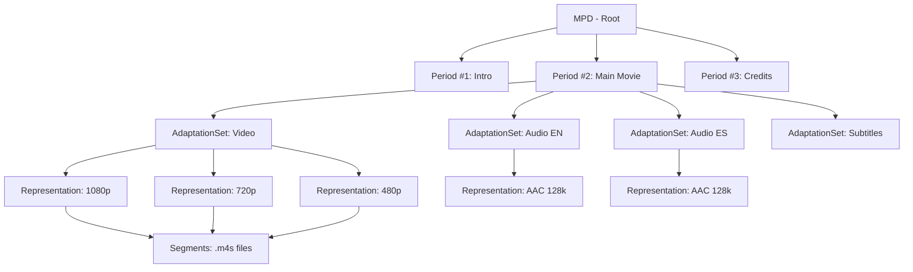

# 05. DASH Protocol: Відкритий Стандарт

## 1. Вступ: Чому виник DASH?

### Проблема, яку вирішує DASH

Уявіть: це 2010 рік. У світі стрімінгу хаос:

- **Apple** просуває HLS (тільки для iOS/Safari)
- **Microsoft** має Smooth Streaming (тільки для Silverlight)
- **Adobe** використовує HDS (HTTP Dynamic Streaming для Flash)

**Результат:** Розробники змушені кодувати відео **три рази** для різних платформ.

**Рішення:** MPEG Industry Forum створив **DASH (Dynamic Adaptive Streaming over HTTP)** — відкритий стандарт ISO/IEC 23009-1.

::tip{icon="i-lucide-lightbulb"}
**DASH = "Linux" світу стрімінгу**

- Відкритий стандарт (не належить одній компанії)
- Підтримка будь-яких кодеків (VP9, AV1, Opus)
- Універсальний DRM (Widevine, PlayReady)
- Використовується YouTube, Netflix, Amazon Prime

::

### Аналогія: Lego Інструкція

Якщо HLS — це "зміст книги" (лінійний список сегментів), то DASH — це **XML-маніфест**, схожий на детальну інструкцію Lego:

- "Ось цей кубик (Representation) — для звуку 5.1"
- "Ось цей кубик — для відео 4K"
- "Ось цей кубик — для субтитрів німецькою"
- "Ти можеш зібрати з них що завгодно"

**Переваги такого підходу:**

- Модульність (окремо аудіо, відео, субтитри)
- Гнучкість (можна додати нові треки без перекодування всього)
- Міжнародність (багатомовний контент)

---

## 2. Архітектура DASH: MPD (Media Presentation Description)

### 2.1. Структура MPD

Маніфест у DASH називається **.mpd** (Media Presentation Description). Це XML файл.

**Чому XML, а не текст як у HLS?**

::card-group

::card{title="✅ Переваги XML" icon="i-lucide-check-circle"}

- Формальна схема (можна валідувати автоматично)
- Ієрархічна структура (Period → AdaptationSet → Representation)
- Стандартні XML-парсери в усіх мовах програмування
- Підтримка namespace (можна додавати кастомні атрибути)

::

::card{title="❌ Недоліки XML" icon="i-lucide-alert-circle"}

- Більший розмір файлу (порівняно з M3U8)
- Складніше читати очима
- Більше overhead для парсингу

::

::

### 2.2. Ієрархія DASH XML

::mermaid



::
**Розшифровка:**

1. **MPD (Root)**: Корінь документа
2. **Period**: Часовий період (реклама, основний контент, титри)
3. **AdaptationSet**: Група потоків одного типу (всі відео, всі аудіо)
4. **Representation**: Конкретний варіант якості (1080p, 720p, AAC 128k)
5. **Segment**: Фізичний файл (.m4s)

### 2.3. Приклад MPD

```xml
<?xml version="1.0" encoding="UTF-8"?>
<MPD xmlns="urn:mpeg:dash:schema:mpd:2011"
     type="static"
     mediaPresentationDuration="PT10M30S"
     minBufferTime="PT2S">

  <Period id="main" duration="PT10M30S">

    <!-- Video Adaptation Set -->
    <AdaptationSet
        id="video"
        mimeType="video/mp4"
        codecs="avc1.4d401f"
        width="1920"
        height="1080"
        frameRate="30">

      <!-- 1080p Representation -->
      <Representation
          id="video_1080p"
          bandwidth="5000000"
          width="1920"
          height="1080">
        <BaseURL>video/1080p/</BaseURL>
        <SegmentTemplate
            media="segment_$Number$.m4s"
            initialization="init.mp4"
            timescale="90000"
            duration="540000"
            startNumber="1"/>
      </Representation>

      <!-- 720p Representation -->
      <Representation
          id="video_720p"
          bandwidth="2500000"
          width="1280"
          height="720">
        <BaseURL>video/720p/</BaseURL>
        <SegmentTemplate
            media="segment_$Number$.m4s"
            initialization="init.mp4"
            timescale="90000"
            duration="540000"
            startNumber="1"/>
      </Representation>

      <!-- 480p Representation -->
      <Representation
          id="video_480p"
          bandwidth="1000000"
          width="854"
          height="480">
        <BaseURL>video/480p/</BaseURL>
        <SegmentTemplate
            media="segment_$Number$.m4s"
            initialization="init.mp4"
            timescale="90000"
            duration="540000"
            startNumber="1"/>
      </Representation>
    </AdaptationSet>

    <!-- Audio Adaptation Set (English) -->
    <AdaptationSet
        id="audio_en"
        mimeType="audio/mp4"
        codecs="mp4a.40.2"
        lang="en"
        audioSamplingRate="48000">

      <Representation
          id="audio_en_128k"
          bandwidth="128000">
        <BaseURL>audio/en/</BaseURL>
        <SegmentTemplate
            media="segment_$Number$.m4s"
            initialization="init.mp4"
            timescale="48000"
            duration="288000"
            startNumber="1"/>
      </Representation>
    </AdaptationSet>

    <!-- Audio Adaptation Set (Spanish) -->
    <AdaptationSet
        id="audio_es"
        mimeType="audio/mp4"
        codecs="mp4a.40.2"
        lang="es"
        audioSamplingRate="48000">

      <Representation
          id="audio_es_128k"
          bandwidth="128000">
        <BaseURL>audio/es/</BaseURL>
        <SegmentTemplate
            media="segment_$Number$.m4s"
            initialization="init.mp4"
            timescale="48000"
            duration="288000"
            startNumber="1"/>
      </Representation>
    </AdaptationSet>

  </Period>
</MPD>
```

**Пояснення ключових атрибутів:**

::field-group

::field{name="type" type="static | dynamic"}

- `static`: VOD (весь контент доступний одразу)
- `dynamic`: Live (сегменти додаються в реальному часі)

::

::field{name="mediaPresentationDuration" type="ISO 8601"}
Загальна тривалість (PT10M30S = 10 хвилин 30 секунд)
::

::field{name="minBufferTime" type="Duration"}
Мінімальний буфер, який плеєр має завантажити перед стартом
::

::field{name="timescale" type="Integer"}
Кількість "тіків" в секунді. 90000 = стандарт для відео (90kHz). Для аудіо зазвичай = sampling rate (48000Hz).
::

::field{name="duration" type="Integer"}
Тривалість сегмента в timescale units. 540000 / 90000 = 6 секунд.
::

::

### 2.4. SegmentTemplate: Як генеруються URL

```xml
<SegmentTemplate
    media="segment_$Number$.m4s"
    initialization="init.mp4"
    timescale="90000"
    duration="540000"
    startNumber="1"/>
```

**Як плеєр будує URL:**

1. Базовий URL: `https://cdn.example.com/video/1080p/`
2. Ініціалізаційний сегмент (один раз): `init.mp4`
3. Медіа-сегменти:
    - `$Number$` замінюється на номер сегмента
    - `segment_1.m4s`, `segment_2.m4s`, `segment_3.m4s`, ...

**Повні URL:**

```
https://cdn.example.com/video/1080p/init.mp4         ← Завантажується 1 раз
https://cdn.example.com/video/1080p/segment_1.m4s
https://cdn.example.com/video/1080p/segment_2.m4s
https://cdn.example.com/video/1080p/segment_3.m4s
...
```

---

## 3. DASH vs HLS: Детальне Порівняння

### 3.1. Порівняльна таблиця

| Характеристика                | HLS (Apple)                                       | DASH (MPEG)                                     |
| :---------------------------- | :------------------------------------------------ | :---------------------------------------------- |
| **Розробник**                 | Apple Inc.                                        | MPEG Industry Forum                             |
| **Стандарт**                  | RFC 8216 (IETF)                                   | ISO/IEC 23009-1                                 |
| **Маніфест**                  | `.m3u8` (текстовий, M3U Extended)                 | `.mpd` (XML)                                    |
| **Кодеки**                    | Обмежені (H.264/H.265/AAC обов'язкові для Safari) | Codec-agnostic (VP9, AV1, Opus, будь-що)        |
| **Сегменти**                  | `.ts` (MPEG-TS) або `.m4s` (fMP4)                 | `.m4s` (fragmented MP4)                         |
| **DRM**                       | FairPlay (тільки Apple екосистема)                | CENC (Common Encryption) → Widevine, PlayReady  |
| **Нативна підтримка iOS**     | ✅ Так (Safari, AVPlayer)                         | ❌ Потрібен dash.js або Shaka Player            |
| **Нативна підтримка Android** | ⚠️ Частково (потрібен ExoPlayer або hls.js)       | ✅ Так (через MSE - Media Source Extensions)    |
| **Латентність (традиційна)**  | 20-40 сек                                         | 10-30 сек (краще через менший segment overhead) |
| **Латентність (Low Latency)** | 2-6 сек (LL-HLS, iOS 14+)                         | 3-5 сек (LL-DASH)                               |
| **CDN friendly**              | ✅ Відмінно                                       | ✅ Відмінно                                     |
| **Multi-audio**               | ⚠️ Складно (потрібен окремий плейліст)            | ✅ Просто (AdaptationSet з `lang` атрибутом)    |
| **Multi-subtitle**            | ⚠️ Окремий WebVTT плейліст                        | ✅ Вбудовано в MPD                              |
| **Екосистема**                | Більша (більше CDN підтримки)                     | Менша, але зростає                              |

### 3.2. Ключові Відмінності

::accordion

::accordion-item{label="🎭 Period: Багатоперіодний контент" icon="i-lucide-layers"}

**DASH має Period — HLS ні**

У DASH можна мати кілька **Period** (періодів) в одному MPD:

```xml
<MPD>
  <Period id="preroll_ad" duration="PT30S">
    <!-- 30-секундна реклама -->
  </Period>

  <Period id="main_content" duration="PT2H">
    <!-- Основний фільм -->
  </Period>

  <Period id="credits" duration="PT5M">
    <!-- Титри -->
  </Period>
</MPD>
```

**Переваги:**

- Різні періоди можуть мати різні кодеки
- Легко вставити рекламу (server-side ad insertion)
- Можна змінювати набір якостей per-period

**HLS еквівалент:** Потрібен окремий `.m3u8` для кожного періоду або використання `#EXT-X-DISCONTINUITY`.

::

::accordion-item{label="🌍 Multi-language Audio: Простіше в DASH" icon="i-lucide-languages"}

**DASH:**

```xml
<AdaptationSet lang="en" mimeType="audio/mp4">
  <Representation bandwidth="128000">...</Representation>
</AdaptationSet>

<AdaptationSet lang="es" mimeType="audio/mp4">
  <Representation bandwidth="128000">...</Representation>
</AdaptationSet>

<AdaptationSet lang="uk" mimeType="audio/mp4">
  <Representation bandwidth="128000">...</Representation>
</AdaptationSet>
```

Плеєр автоматично вибирає мову на основі browser locale.

**HLS:** Потрібен `#EXT-X-MEDIA` у Master Playlist:

```m3u8
#EXT-X-MEDIA:TYPE=AUDIO,GROUP-ID="audio",LANGUAGE="en",NAME="English",URI="audio_en.m3u8"
#EXT-X-MEDIA:TYPE=AUDIO,GROUP-ID="audio",LANGUAGE="es",NAME="Spanish",URI="audio_es.m3u8"
```

**Висновок:** DASH природно підтримує багатомовність.

::

::accordion-item{label="🔐 DRM: DASH виграє" icon="i-lucide-shield-check"}

**DASH + CENC (Common Encryption):**

- Один шифрований файл працює з **кількома DRM** (Widevine, PlayReady, FairPlay\*)
- MPD містить `<ContentProtection>` для кожної системи:

```xml
<ContentProtection schemeIdUri="urn:uuid:edef8ba9-79d6-4ace-a3c8-27dcd51d21ed" value="Widevine">
  <cenc:pssh>BASE64_WIDEVINE_PSSH</cenc:pssh>
</ContentProtection>

<ContentProtection schemeIdUri="urn:uuid:9a04f079-9840-4286-ab92-e65be0885f95" value="PlayReady">
  <cenc:pssh>BASE64_PLAYREADY_PSSH</cenc:pssh>
</ContentProtection>
```

**HLS + FairPlay:**

- Тільки Apple екосистема
- Для Widevine потрібен окремий DASH manifest

**Висновок:** Netflix використовує DASH саме через DRM flexibility.

::

::

---

## 4. Створення DASH Контенту за допомогою FFmpeg

### 4.1. Простий DASH stream (одна якість)

```bash
ffmpeg -i input.mp4 \
  -c:v libx264 -preset medium -crf 23 \
  -c:a aac -b:a 128k \
  -f dash \
  -seg_duration 6 \
  -use_template 1 \
  -use_timeline 0 \
  output.mpd
```

**Пояснення параметрів:**

::field-group

::field{name="-f dash" type="Format"}
Вихідний формат — DASH
::

::field{name="-seg_duration 6" type="Seconds"}
Тривалість кожного сегмента (6 секунд)
::

::field{name="-use_template 1" type="Boolean"}
Використовувати `<SegmentTemplate>` замість `<SegmentList>` (економить місце в MPD)
::

::field{name="-use_timeline 0" type="Boolean"}
Не використовувати `<SegmentTimeline>` (простіший MPD для VOD)
::

::

**Результат:**

```
output.mpd
init-stream0.m4s       ← Ініціалізаційний сегмент (відео)
init-stream1.m4s       ← Ініціалізаційний сегмент (аудіо)
chunk-stream0-00001.m4s
chunk-stream0-00002.m4s
chunk-stream0-00003.m4s
...
chunk-stream1-00001.m4s  ← Аудіо сегменти
chunk-stream1-00002.m4s
...
```

### 4.2. Multi-bitrate DASH (ABR)

Створимо 3 варіанти якості: 480p, 720p, 1080p.

```bash
#!/bin/bash

INPUT="movie.mp4"
OUTPUT_DIR="dash_output"
mkdir -p "$OUTPUT_DIR"

ffmpeg -i "$INPUT" \
  -map 0:v -map 0:v -map 0:v -map 0:a \
  \
  -c:v:0 libx264 -b:v:0 1000k -s:v:0 854x480 -profile:v:0 main \
  -c:v:1 libx264 -b:v:1 2500k -s:v:1 1280x720 -profile:v:1 main \
  -c:v:2 libx264 -b:v:2 5000k -s:v:2 1920x1080 -profile:v:2 high \
  \
  -c:a aac -b:a 128k -ar 48000 \
  \
  -f dash \
  -seg_duration 6 \
  -use_template 1 \
  -use_timeline 0 \
  -init_seg_name 'init-$RepresentationID$.m4s' \
  -media_seg_name 'chunk-$RepresentationID$-$Number%05d$.m4s' \
  -adaptation_sets "id=0,streams=v id=1,streams=a" \
  "$OUTPUT_DIR/manifest.mpd"
```

**Пояснення:**

- `-map 0:v -map 0:v -map 0:v`: Створює 3 відео-потоки
- `-map 0:a`: Один аудіо-потік
- `-c:v:0`, `-c:v:1`, `-c:v:2`: Окремі налаштування для кожного відео
- `-adaptation_sets`: Групування (AdaptationSet 0 = відео, AdaptationSet 1 = аудіо)

**Результат:**

```xml
<MPD>
  <Period>
    <AdaptationSet id="0">
      <Representation id="0" bandwidth="1000000" width="854" height="480">...
      <Representation id="1" bandwidth="2500000" width="1280" height="720">...
      <Representation id="2" bandwidth="5000000" width="1920" height="1080">...
    </AdaptationSet>
    <AdaptationSet id="1">
      <Representation id="3" bandwidth="128000">...
    </AdaptationSet>
  </Period>
</MPD>
```

### 4.3. Multi-language Audio

```bash
ffmpeg -i movie.mp4 -i audio_spanish.mp3 \
  -map 0:v -map 0:a -map 1:a \
  \
  -c:v libx264 -b:v 2500k \
  -c:a aac -b:a 128k \
  \
  -f dash \
  -seg_duration 6 \
  -adaptation_sets "id=0,streams=v id=1,streams=a,lang=en id=2,streams=a,lang=es" \
  output.mpd
```

**Результат:**

```xml
<AdaptationSet id="1" lang="en">
  <Representation id="audio_en">...</Representation>
</AdaptationSet>

<AdaptationSet id="2" lang="es">
  <Representation id="audio_es">...</Representation>
</AdaptationSet>
```

---

## 5. Інтеграція DASH в Браузер

### 5.1. Shaka Player (Google)

**Чому Shaka Player?**

- Розроблений Google (підтримка найкраща)
- Підтримує DRM (Widevine, PlayReady, FairPlay\*)
- Вбудований ABR алгоритм
- Детальна статистика (bandwidth, buffer, dropped frames)

**Встановлення:**

```html
<!DOCTYPE html>
<html>
    <head>
        <script src="https://cdn.jsdelivr.net/npm/shaka-player@4.7/dist/shaka-player.compiled.js"></script>
    </head>
    <body>
        <video id="video" width="640" controls></video>

        <script>
            const video = document.getElementById('video')
            const player = new shaka.Player(video)

            // DASH manifest URL
            const manifestUri = 'https://cdn.example.com/manifest.mpd'

            player
                .load(manifestUri)
                .then(() => {
                    console.log('Video loaded successfully!')
                })
                .catch((error) => {
                    console.error('Error loading video:', error)
                })

            // Відслідковування змін якості
            player.addEventListener('adaptation', () => {
                const tracks = player.getVariantTracks()
                const activeTrack = tracks.find((t) => t.active)
                console.log(`Quality: ${activeTrack.height}p, Bandwidth: ${activeTrack.bandwidth}`)
            })
        </script>
    </body>
</html>
```

### 5.2. dash.js (Альтернатива)

**dash.js** — reference implementation від Dash Industry Forum.

```html
<script src="https://cdn.dashjs.org/latest/dash.all.min.js"></script>
<video id="video" controls></video>

<script>
    const url = 'https://cdn.example.com/manifest.mpd'
    const player = dashjs.MediaPlayer().create()
    player.initialize(document.querySelector('#video'), url, true)

    // Налаштування ABR
    player.updateSettings({
        streaming: {
            abr: {
                fetchThroughputCalculationMode: 'ewma',
                bandwidthSafetyFactor: 0.9,
                useDefaultABRRules: true,
            },
        },
    })
</script>
```

::tip
**Shaka Player vs dash.js:**

- **Shaka Player**: Кращий DRM support, кращий API, активніша підтримка
- **dash.js**: Reference implementation (100% відповідність стандарту), детальніші налаштування ABR

**Рекомендація:** Для production використовуйте **Shaka Player**.
::

---

## 6. Розширені Теми

### 6.1. Common Encryption (CENC) та DRM

**Проблема без CENC:**

У минулому кожна DRM система вимагала окремого шифрування:

- Widevine: `video_widevine.m4s`
- PlayReady: `video_playready.m4s`
- FairPlay: `video_fairplay.m4s`

**Результат:** 3x storage, 3x bandwidth.

**Рішення: CENC (Common Encryption)**

Один шифрований файл, але з метаданими для кількох DRM:

```xml
<ContentProtection schemeIdUri="urn:mpeg:dash:mp4protection:2011" value="cenc" cenc:default_KID="ABCD1234..."/>

<ContentProtection schemeIdUri="urn:uuid:edef8ba9-79d6-4ace-a3c8-27dcd51d21ed">
  <!-- Widevine PSSH -->
  <cenc:pssh>AAAAW3Bzc2gAAAAA7e+LqXnWSs6jyCfc...</cenc:pssh>
</ContentProtection>

<ContentProtection schemeIdUri="urn:uuid:9a04f079-9840-4286-ab92-e65be0885f95">
  <!-- PlayReady PSSH -->
  <cenc:pssh>AAACYHBzc2gAAAAAmgTweZhAQoarkuZb...</cenc:pssh>
</ContentProtection>
```

**Як це працює:**

1. Сегменти шифруються AES-128-CTR з Content Key
2. PSSH (Protection System Specific Header) містить інформацію для кожного DRM
3. Плеєр вибирає підтримувану систему (Chrome → Widevine, Edge → PlayReady)
4. Отримує ліцензію з License Server
5. Розшифровує та програє

**Приклад з Shaka Player:**

```javascript
const player = new shaka.Player(video)

player.configure({
    drm: {
        servers: {
            'com.widevine.alpha': 'https://license.example.com/widevine',
            'com.microsoft.playready': 'https://license.example.com/playready',
        },
    },
})

player.load('https://cdn.example.com/encrypted.mpd')
```

::warning
**FairPlay у DASH:** Apple FairPlay технічно несумісний з DASH MPD (Apple вимагає HLS). Однак деякі плеєри (Shaka Player 4.3+) підтримують FairPlay + DASH через custom extensions.
::

### 6.2. Live DASH: Dynamic MPD

**Відмінності Live від VOD:**

::tabs

::tabs-item{label="VOD (type=static)" icon="i-lucide-film"}

```xml
<MPD type="static" mediaPresentationDuration="PT2H15M">
  <Period>
    <AdaptationSet>
      <Representation bandwidth="5000000">
        <SegmentTemplate media="seg_$Number$.m4s" startNumber="1"/>
      </Representation>
    </AdaptationSet>
  </Period>
</MPD>
```

- Усі сегменти відомі заздалегідь
- `mediaPresentationDuration` фіксований
- Плеєр завантажує MPD один раз

::

::tabs-item{label="Live (type=dynamic)" icon="i-lucide-radio"}

```xml
<MPD type="dynamic"
     availabilityStartTime="2024-02-17T12:00:00Z"
     publishTime="2024-02-17T12:30:00Z"
     minimumUpdatePeriod="PT5S"
     timeShiftBufferDepth="PT2M">

  <Period start="PT0S">
    <AdaptationSet>
      <Representation bandwidth="5000000">
        <SegmentTemplate media="seg_$Number$.m4s"
                         timescale="90000"
                         duration="540000"
                         startNumber="1"/>
      </Representation>
    </AdaptationSet>
  </Period>
</MPD>
```

**Ключові атрибути:**

- `availabilityStartTime`: Коли почалася трансляція
- `publishTime`: Коли був оновлений MPD (timestamps для кешування)
- `minimumUpdatePeriod`: Як часто плеєр має перевіряти оновлення (5 сек)
- `timeShiftBufferDepth`: DVR window (2 хвилини назад користувач може перемотати)

::

::

**Як плеєр працює з Live:**

1. Завантажує MPD
2. Розраховує `availableSegmentNumber` на основі `availabilityStartTime` та поточного часу
3. Завантажує доступні сегменти
4. Кожні `minimumUpdatePeriod` секунд оновлює MPD
5. Якщо є нові сегменти — завантажує їх

### 6.3. Low Latency DASH (LL-DASH)

**Стандартна DASH латентність:** 10-30 секунд

**LL-DASH латентність:** 3-5 секунд

**Ключові зміни:**

::card-group

::card{title="📦 Chunked Transfer Encoding" icon="i-lucide-package"}

Сегменти передаються по частинах (chunks) до того, як вони повністю закодовані.

```http
Transfer-Encoding: chunked

0A\r\n
[chunk 1 data]\r\n
0B\r\n
[chunk 2 data]\r\n
...
```

Плеєр починає decode одразу після отримання першого chunk.

::

::card{title="⚡ Shorter Segments" icon="i-lucide-zap"}

Segment duration: 1-2 секунди (замість 6-10)

::

::card{title="🔄 Server Push" icon="i-lucide-upload"}

HTTP/2 Server Push передає наступний сегмент разом із поточним.

::

::

**Приклад MPD для LL-DASH:**

```xml
<MPD type="dynamic"
     availabilityStartTime="2024-02-17T12:00:00Z"
     suggestedPresentationDelay="PT2S"
     minBufferTime="PT1S">

  <ServiceDescription>
    <Latency target="2000" min="1000" max="4000"/>
  </ServiceDescription>

  <Period>
    <AdaptationSet>
      <Representation>
        <SegmentTemplate media="seg_$Number$.m4s" duration="90000" timescale="90000"/>
        <!-- duration=90000/90000 = 1 секунда -->
      </Representation>
    </AdaptationSet>
  </Period>
</MPD>
```

::note
**LL-DASH підтримка:**

- dash.js 4.0+
- Shaka Player 4.2+
- Потребує HTTP/2 сервер (Nginx 1.13+, Apache 2.4.17+)

::

### 6.4. CMAF (Common Media Application Format)

**Проблема:** Різні формати сегментів для HLS (`.ts` або `.m4s`) та DASH (`.m4s`).

**Рішення:** CMAF — єдиний формат, сумісний з обома.

**Переваги CMAF:**

- Один набір сегментів для HLS та DASH
- 50% економія storage та bandwidth
- Простіший workflow (кодуємо один раз)

**Як створити CMAF за допомогою FFmpeg:**

```bash
ffmpeg -i input.mp4 \
  -c:v libx264 -c:a aac \
  -f hls \
  -hls_segment_type fmp4 \
  -hls_playlist_type vod \
  output.m3u8
```

**Результат:**

```
output.m3u8          ← HLS manifest
output0.m4s
output1.m4s
output2.m4s
...
```

**Створюємо DASH MPD вручну:**

```xml
<MPD>
  <Period>
    <AdaptationSet>
      <Representation>
        <BaseURL>./</BaseURL>
        <SegmentTemplate media="output$Number$.m4s" startNumber="0"/>
      </Representation>
    </AdaptationSet>
  </Period>
</MPD>
```

**Або використовуємо Shaka Packager:**

```bash
packager \
  in=input.mp4,stream=video,output=video.mp4 \
  in=input.mp4,stream=audio,output=audio.mp4 \
  --hls_master_playlist_output master.m3u8 \
  --mpd_output manifest.mpd
```

---

## 7. Performance Optimization

### 7.1. Initialization Segment Optimization

**Проблема:** Init segment завантажується для кожної якості при переключенні.

**Рішення:** Об'єднаний init segment для всіх representations.

```bash
ffmpeg \
  -f dash \
  -single_file 1 \
  -init_seg_name 'init.mp4' \
  output.mpd
```

**Результат:**

- Один `init.mp4` для всіх якостей
- Економія: 1-2 MB при кожному переключенні якості

### 7.2. Byte-Range Requests

**Замість окремих файлів** можна зберігати всі сегменти в одному файлі та використовувати HTTP Range headers:

```xml
<SegmentList>
  <Initialization sourceURL="stream.mp4" range="0-1024"/>
  <SegmentURL mediaRange="1025-500000"/>
  <SegmentURL mediaRange="500001-950000"/>
  <SegmentURL mediaRange="950001-1400000"/>
</SegmentList>
```

**Переваги:**

- Менше HTTP запитів (один файл замість 100+ сегментів)
- Простіший storage (один файл замість тисяч)
- Ідеально для CDN (один кеш-запис)

**Недоліки:**

- Якщо щось псується в файлі — вся якість недоступна
- Складніше оновлювати Live контент

### 7.3. Server-Side Rendering: Reduce MPD Size

**Великий MPD (кілька MB)** може сповільнити start time.

**Рішення:** Генерувати MPD динамічно на сервері:

```javascript
// Node.js приклад
app.get('/manifest.mpd', (req, res) => {
    const userAgent = req.headers['user-agent']
    const isMobile = /Mobile/.test(userAgent)

    // Для мобільних: тільки 480p, 720p
    // Для desktop: 720p, 1080p, 4K
    const qualities = isMobile ? ['480p', '720p'] : ['720p', '1080p', '4k']

    const mpd = generateMPD(qualities)
    res.set('Content-Type', 'application/dash+xml')
    res.send(mpd)
})
```

**Економія:** MPD розміром 500 KB замість 2 MB.

---

## 8. Troubleshooting

### 8.1. Типові Проблеми

::accordion

::accordion-item{label="❌ CORS Error" icon="i-lucide-alert-circle"}

**Те саме, що в HLS.** Додайте CORS headers:

```nginx
location ~ \.(mpd|m4s|mp4)$ {
    add_header Access-Control-Allow-Origin * always;
    add_header Access-Control-Allow-Methods 'GET, HEAD, OPTIONS' always;
    add_header Access-Control-Allow-Headers 'Range' always;

    if ($request_method = OPTIONS) {
        return 204;
    }
}
```

::

::accordion-item{label="🚫 Safari не підтримує DASH" icon="i-lucide-apple"}

**Проблема:** Safari НЕ має нативної підтримки DASH.

**Рішення:**

1. **Fallback на HLS:**

```javascript
const video = document.getElementById('video')

if (video.canPlayType('application/vnd.apple.mpegurl')) {
    // Safari: використовуємо HLS
    video.src = 'https://cdn.example.com/stream.m3u8'
} else if (shaka.Player.isBrowserSupported()) {
    // Chrome/Firefox: використовуємо DASH
    const player = new shaka.Player(video)
    player.load('https://cdn.example.com/manifest.mpd')
}
```

2. **CMAF:** Один набір сегментів, два manifests (HLS + DASH).

::

::accordion-item{label="⏱️ Segments доступні з затримкою (404)" icon="i-lucide-clock"}

**Симптом (Live DASH):**

```
Failed to load segment: 404 Not Found
chunk-stream0-00125.m4s
```

**Причина:** Плеєр розрахував, що сегмент вже має бути доступний, але encoder ще не створив його.

**Діагностика:**

Перевірте `suggestedPresentationDelay` у MPD:

```xml
<MPD suggestedPresentationDelay="PT10S">
```

Це означає: плеєр має відтворювати з затримкою 10 секунд від "live edge".

**Рішення:**

Збільшіть `suggestedPresentationDelay` до 15-20 секунд.

::

::accordion-item{label="🎵 Audio/Video не синхронізовані" icon="i-lucide-music"}

**Причина:** Різні `timescale` для аудіо та відео.

**Діагностика:**

```bash
ffprobe -show_streams chunk-stream0-00001.m4s | grep time_base
# Відео: time_base=1/90000

ffprobe -show_streams chunk-stream1-00001.m4s | grep time_base
# Аудіо: time_base=1/48000
```

**Рішення:**

У MPD переконайтесь, що `timescale` правильний:

```xml
<!-- Відео -->
<SegmentTemplate timescale="90000" duration="540000"/>
<!-- 540000/90000 = 6 секунд -->

<!-- Аудіо -->
<SegmentTemplate timescale="48000" duration="288000"/>
<!-- 288000/48000 = 6 секунд -->
```

Обидва мають бути 6 секунд.

::

::

### 8.2. Інструменти Діагностики

::card-group

::card{title="🧪 DASH Validator" icon="i-lucide-check-square"}

[DASH-IF Conformance Tool](https://conformance.dashif.org/)

Upload ваш `.mpd` та отримайте звіт про помилки.

::

::card{title="📊 Shaka Player Stats" icon="i-lucide-bar-chart"}

```javascript
const player = new shaka.Player(video)

setInterval(() => {
    const stats = player.getStats()
    console.log('Bandwidth:', stats.estimatedBandwidth)
    console.log('Buffer:', video.buffered.end(0) - video.currentTime)
    console.log('Dropped frames:', stats.droppedFrames)
}, 1000)
```

::

::card{title="🔍 Chrome Media Internals" icon="i-lucide-chrome"}

Відкрийте `chrome://media-internals/` та натисніть Play на DASH відео.

Ви побачите:

- Завантажені сегменти
- Buffer graph
- Decoder статус
- Помилки декодування

::

::

---

## 9. DASH Best Practices

::steps

### 1. Використовуйте CMAF для HLS + DASH

Один набір сегментів = 50% економії.

### 2. Налаштуйте правильні Cache Headers

```nginx
location ~ \.mpd$ {
    add_header Cache-Control "public, max-age=10";
}

location ~ \.(m4s|mp4)$ {
    add_header Cache-Control "public, max-age=31536000, immutable";
}
```

### 3. Для Live: `suggestedPresentationDelay` >= 10s

Захищає від 404 на сегментах.

### 4. DRM: Використовуйте CENC

Один шифрований файл для Widevine + PlayReady.

### 5. Multi-language: Окремі AdaptationSet

```xml
<AdaptationSet lang="en">...</AdaptationSet>
<AdaptationSet lang="es">...</AdaptationSet>
```

::

---

## 10. Практичні Завдання

::steps

### Завдання 1: Створити Multi-bitrate DASH

**Мета:** Перетворити `movie.mp4` на DASH з 3 якостями (480p, 720p, 1080p) та 2 мовами (англійська, іспанська).

**Кроки:**

1. Підготуйте `audio_spanish.mp3`
2. Використайте FFmpeg для створення DASH
3. Перевірте MPD у валідаторі
4. Відкрийте в Shaka Player Demo

**Критерії успіху:**

- 3 відео representations
- 2 аудіо adaptationSets з `lang` атрибутами
- ABR працює (перемикається між якостями)

### Завдання 2: CMAF для HLS + DASH

**Мета:** Створити один набір сегментів, який працює і з HLS, і з DASH.

**Кроки:**

1. Закодуйте відео в fMP4 (CMAF)
2. Створіть HLS manifest (`master.m3u8`)
3. Створіть DASH manifest (`manifest.mpd`)
4. Перевірте обидва в різних плеєрах

### Завдання 3: Діагностика Live DASH

**Проблема:** Live stream має затримку 45 секунд замість очікуваних 10.

**Завдання:**

1. Завантажте MPD та знайдіть `suggestedPresentationDelay`
2. Перевірте `timeShiftBufferDepth`
3. Виміряйте encoder latency
4. Знайдіть bottleneck

::

---

## 11. FAQ

::accordion

::accordion-item{label="Q: Чому Netflix використовує DASH, а не HLS?" icon="i-lucide-help-circle"}

**A:** DRM flexibility. DASH + CENC підтримує Widevine (Android/Chrome) та PlayReady (Windows/Xbox) з одного набору файлів. HLS підтримує тільки FairPlay (Apple only).

::

::accordion-item{label="Q: Як зробити DASH у Safari?" icon="i-lucide-apple"}

**A:** Safari НЕ підтримує DASH нативно. Варіанти:

1. Використовуйте Shaka Player (JavaScript polyfill)
2. Fallback на HLS для Safari
3. CMAF: один набір сегментів, два manifests

::

::accordion-item{label="Q: `<SegmentTemplate>` vs `<SegmentList>` vs `<SegmentBase>`?" icon="i-lucide-list"}

**A:**

- **SegmentTemplate**: Шаблон URL (`segment_$Number$.m4s`). Компактний MPD.
- **SegmentList**: Явний список усіх сегментів. Великий MPD, але гнучкіший.
- **SegmentBase**: Один файл з Byte-Range requests. Для VOD з великими файлами.

**Рекомендація:** `SegmentTemplate` для більшості випадків.

::

::accordion-item{label="Q: Як працює DVR (time-shift) у Live DASH?" icon="i-lucide-rewind"}

**A:**

```xml
<MPD type="dynamic" timeShiftBufferDepth="PT10M">
```

`timeShiftBufferDepth=PT10M` = користувач може перемотати на 10 хвилин назад.

Плеєр зберігає старі сегменти в буфері. Після 10 хвилин вони видаляються.

::

::

---

## 12. Резюме

::card-group

::card{title="🎯 Що таке DASH" icon="i-lucide-target"}

- Відкритий стандарт ISO/IEC 23009-1
- Codec-agnostic (VP9, AV1, Opus)
- XML manifest (`.mpd`)
- Підтримка CENC DRM (Widevine, PlayReady)

::

::card{title="📐 Архітектура" icon="i-lucide-layout"}

```
MPD
└─ Period
   └─ AdaptationSet (Video)
      ├─ Representation (1080p)
      ├─ Representation (720p)
      └─ Representation (480p)
   └─ AdaptationSet (Audio EN)
   └─ AdaptationSet (Audio ES)
```

::

::card{title="⚙️ Створення" icon="i-lucide-settings"}

```bash
ffmpeg -i input.mp4 \
  -c:v libx264 -c:a aac \
  -f dash \
  output.mpd
```

::

::card{title="🌐 Браузер" icon="i-lucide-globe"}

Shaka Player або dash.js

Safari: fallback на HLS

::

::

::tip{icon="i-lucide-graduation-cap"}
**Вітаємо!** Ви опанували DASH Protocol.

**Ключові висновки:**

- DASH = гнучкість (codec-agnostic, multi-language, DRM)
- HLS = simple та Apple-friendly
- **Best practice:** CMAF (один набір сегментів для обох)

**Наступний крок:** [CDN Architecture](./07.cdn-architecture.md) або [Video Encoding Optimization](./08.video-encoding.md)
::
