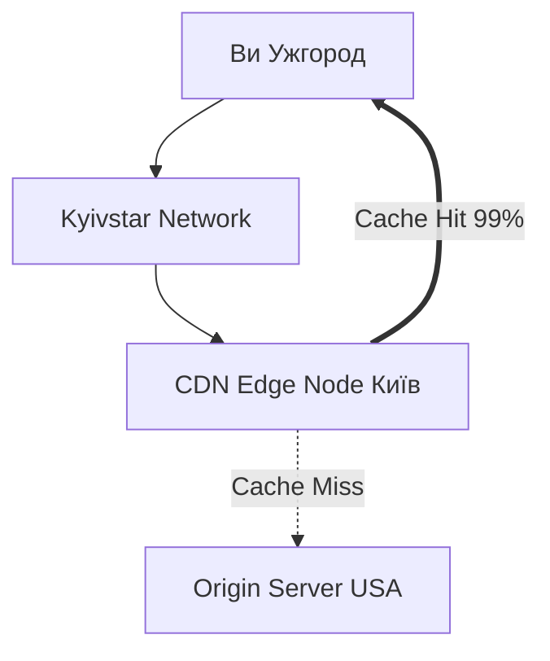

# 06. Масштабування: CDN та Adaptive Bitrate

## 1. Вступ та Контекст

Уявіть, що новий епізод "Гри в кальмара" вийшов о 10:00.
100 мільйонів людей одночасно натискають "Play".
Якщо всі ці запити підуть на один сервер у Каліфорнії, він розплавиться швидше, ніж морозиво в пеклі.

Як Netflix витримує це навантаження?
Секрет у двох технологіях: **CDN** (доставка) та **ABR** (адаптація).

---

## 2. CDN (Content Delivery Network)

**CDN** — це мережа серверів, розкиданих по всьому світу.
Ідея проста: **Кеш має бути ближче до користувача**.

Коли ви у Києві відкриваєте відео:

1. Ви не йдете на головний сервер в США.
2. Ви йдете на маленький сервер (Edge Node), який стоїть у дата-центрі вашого провайдера (наприклад, Lanet або Kyivstar).
3. Якщо у цього сервера є шматочок відео (Cache Hit), він віддає його миттєво.
4. Якщо немає (Cache Miss), він качає його з головного сервера (Origin), зберігає собі, і віддає вам.

### Case Study: Netflix Open Connect

Netflix пішов далі. Вони не просто орендують сервери (як Akamai чи Cloudflare). Вони _дарують_ свої сервери (Open Connect Appliances - OCA) інтернет-провайдерам.
Це червоні ящики з 300 ТБ дисків, які стоять прямо у вашого провайдера.
Коли ви дивитесь Netflix, трафік часто _навіть не покидає мережу вашого провайдера_. Це економить провайдеру гроші на зовнішніх каналах, а вам дає 4K без буферизації.

::mermaid

::

---

## 3. Adaptive Bitrate (ABR): Логіка плеєра

Ми доставили дані швидко. Але що, якщо у користувача повільний 3G?
Відео 4K (25 Mbps) просто не пролізе в канал 5 Mbps.

Тут вступає **ABR (Adaptive Bitrate Streaming)**.
Плеєр — це не просто екран. Це розумний робот, який кожну секунду приймає рішення:

1.  **Вимірює швидкість**: "Ага, останній шматок скачався за 0.5 сек. Значить, у мене є запас".
2.  **Перевіряє буфер**: "У мене в запасі 20 секунд відео".
3.  **Приймає рішення**: "Можна переключитися з 720p на 1080p".

### Алгоритм перемикання

::steps

### 1. Start (Холодний старт)

Плеєр не знає швидкості. Він бере найбезпечніший варіант (наприклад, 480p), щоб відео почалося миттєво.

### 2. Up-switch (Підвищення якості)

Якщо буфер заповнений > 30 секунд і швидкість стабільна -> качаємо наступний сегмент у вищій якості.
Користувач бачить, як картинка стає чіткою.

### 3. Down-switch (Пакір рятівний)

Якщо швидкість різко впала (зайшли в ліфт) і буфер спорожнів до < 5 секунд -> **терміново** качаємо наступний шматок у 240p.
_Головне правило_: Краще милити пікселі, ніж зупинити відео (Rebuffering).

::

---

## 4. Демонстрація: The Network Throttle

Спробуймо обдурити плеєр.

::steps

### 1. Відкрийте YouTube

Відкрийте будь-яке відео в якості `Auto`. Це важливо. Не ставте 1080p примусово.

### 2. Stats for Nerds

Клікніть п.к.м. на відео -> **Stats for nerds**.
Дивіться на поле `Connection Speed` та `Buffer Health`.

### 3. Simulating Bad Network

Відкрийте DevTools -> Network.
У випадаючому списку (де `Fast 3G` або `No throttling`) створіть **Custom Profile**:

- Name: `Painful DSL`
- Download: `400 kb/s` (дуже повільно)

### 4. Спостереження

Активуйте цей профіль.
Почекайте 10-20 секунд (поки вичерпається існуючий буфер).
Ви побачите, як `Resolution` впаде з `1920x1080` до `640x360` або навіть `256x144`.
Але **відео не зупиниться**! Це і є магія ABR.

::

---

## 5. Резюме

- **CDN** наближає контент до користувача, зменшуючи затримку (RTT - Round Trip Time).
- **ABR** дозволяє плеєру адаптуватися до мінливих умов мережі.
- Ідеальний стрімінг — це баланс між якістю картинки та безперервністю відтворення. Плеєр завжди пріоритезує безперервність.
