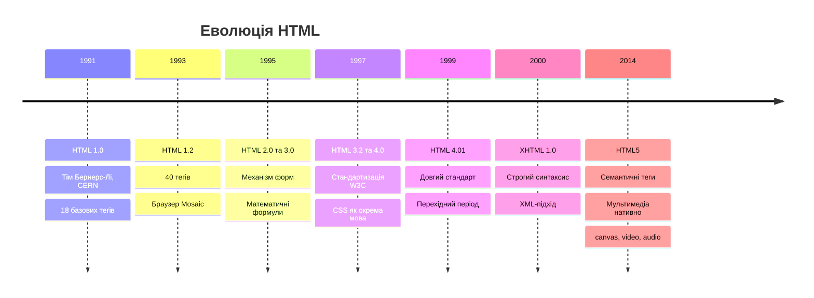
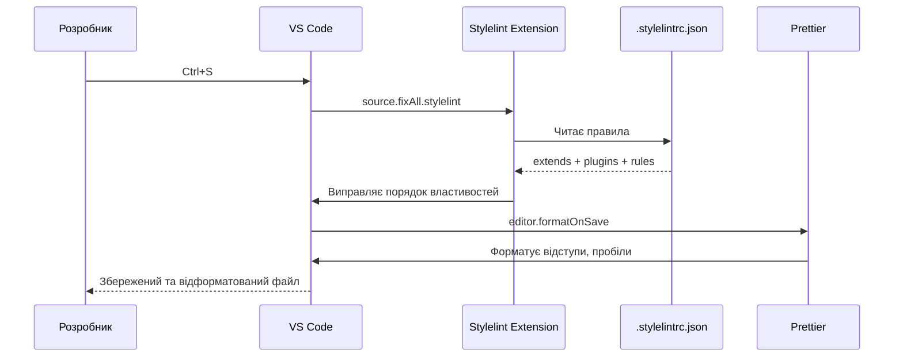

# Вступ до HTML. Структура документа

## Що таке HTML і чому він існує?

Уявіть: 1989 рік. Тім Бернерс-Лі — фізик-ядерник у CERN (Женева) — стикається з проблемою, знайомою кожному, хто коли-небудь намагався передати великий документ колезі. Тисячі наукових звітів, посилання між ними, різні формати — і жодного зручного способу пов'язати всі ці знання воєдино.

Його рішення було революційним у своїй простоті: **гіпертекст** (Hypertext) — текст, який містить _клікабельні посилання_ на інші тексти. А мова для такого тексту отримала назву **HTML** (_HyperText Markup Language_ — мова гіпертекстової розмітки).

::note
**HTML** — це не мова програмування. Це **мова розмітки** (Markup Language), яка описує _структуру_ та _зміст_ веб-документа за допомогою спеціальних тегів. Браузер читає ці теги і перетворює їх на те, що ви бачите на екрані.
::

Перший у світі веб-сайт з'явився **6 серпня 1991 року** і досі доступний за посиланням [info.cern.ch](http://info.cern.ch/). У ньому описується принцип роботи Всесвітньої павутини. Він виглядає максимально просто — але саме з цього починалася епоха інтернету.

{.diagram-img}

<!-- Search Query: Tim Berners-Lee CERN 1989 portrait photo -->

---

## Еволюція HTML: від 40 тегів до HTML5

Щоб зрозуміти сучасний HTML5, варто простежити його еволюцію. Кожна версія вирішувала реальні проблеми свого часу.

::mermaid



::

### HTML 2.0 (1995) — Народження форм

Перший офіційний стандарт W3C (_World Wide Web Consortium_ — Консорціум Всесвітньої павутини). Головне нововведення — **форми**: механізм, що дозволяє користувачу відправляти дані на сервер. Саме тоді стало можливим перше покоління інтерактивних сайтів.

### HTML 4.01 (1999) — Розділення структури та стилю

Революційна ідея: **CSS** (_Cascading Style Sheets_ — каскадні таблиці стилів) має відповідати за зовнішній вигляд, а HTML — лише за структуру. Теги на кшталт `<font>`, `<center>`, `<bgcolor>` почали вважатися застарілими.

### Війна браузерів (1994–2004)

У середині 1990-х з'явилися Netscape Navigator та Internet Explorer — і між ними розгорілася справжня війна. Кожен браузер додавав власні теги, ігноруючи стандарти W3C. Верстальники були змушені писати різний код для різних браузерів.

::warning
**«Коректне відображення у браузері Internet Explorer»** — цей напис на початку 2000-х був звичайним явищем. Кросбраузерність (однакове відображення в усіх браузерах) була справжнім болем розробників.
::

Перемогу здобув **Google Chrome** (2008), який чітко дотримувався стандартів і пропонував зручні інструменти для розробників. Сьогодні Chrome використовують ~65% інтернет-користувачів.

### HTML5 (2014) — Сучасний стандарт

HTML5 — це не просто набір нових тегів. Це **нова філософія** веб-розробки:

::card-group

::card{title="🏗️ Семантика" icon="i-heroicons-document-text"}

Нові структурні теги: `<header>`, `<nav>`, `<main>`, `<article>`, `<section>`, `<footer>`, `<aside>` замість безликих `<div>` з класами.

::

::card{title="🎬 Мультимедіа" icon="i-heroicons-film"}

Нативна підтримка відео та аудіо через `<video>` та `<audio>` без Flash-плагінів.

::

::card{title="🎨 Графіка" icon="i-heroicons-paint-brush"}

Елемент `<canvas>` для малювання 2D-графіки засобами JavaScript прямо у браузері.

::

::card{title="📱 Адаптивність" icon="i-heroicons-device-phone-mobile"}

Покращена підтримка мобільних пристроїв, нові типи полів форм: `date`, `email`, `range`, `color`.

::

::

---

## Редактори коду: VS Code та WebStorm

Перш ніж писати HTML, потрібен правильний інструмент. Подумайте про редактор коду як про робочий стіл столяра — від його якості залежить ефективність роботи.

### Visual Studio Code — основний інструмент курсу

**Visual Studio Code** (VS Code) — безкоштовний редактор з відкритим кодом від **Microsoft**, випущений у 2015 році. Сьогодні це **найпопулярніший редактор у світі** для веб-розробки: за даними Stack Overflow Developer Survey 2023 його використовують понад 73% розробників.

{.diagram-img}

<!-- Search Query: Visual Studio Code interface HTML editing dark theme -->

::steps

### Крок 1: Завантаження VS Code

Перейдіть на офіційний сайт [code.visualstudio.com](https://code.visualstudio.com/) та завантажте версію для вашої операційної системи (Windows, macOS, Linux). Установка займає 2-3 хвилини.

### Крок 2: Встановлення розширень

Після першого запуску відкрийте панель розширень (:kbd{value="Ctrl"} + :kbd{value="Shift"} + :kbd{value="X"}) та встановіть обов'язковий набір плагінів:

- **Live Server** (Ritwick Dey) — запускає локальний сервер з автоматичним оновленням браузера при збереженні файлу
- **Prettier** — автоматичне форматування коду
- **Auto Rename Tag** — перейменовує закриваючий тег при зміні відкриваючого
- **HTML CSS Support** — розширена підтримка HTML/CSS
- **Emmet** — вбудований, але розширений через налаштування

### Крок 3: Відкриття проєкту

Найкращий спосіб роботи — відкрити **папку** (не файл!): меню **File → Open Folder** або :kbd{value="Ctrl"} + :kbd{value="K"}, потім :kbd{value="Ctrl"} + :kbd{value="O"}. VS Code відображатиме всю структуру проєкту в бічній панелі.

### Крок 4: Налаштування автозбереження

Рекомендуємо увімкнути **Auto Save**: меню **File → Auto Save**. Тепер VS Code зберігатиме файли при перемиканні між вкладками — і ви ніколи не втратите зміни.

### Крок 5: Запуск Live Server

Відкрийте HTML-файл, натисніть :kbd{value="Alt"} + :kbd{value="L"}, потім :kbd{value="Alt"} + :kbd{value="O"} (або клацніть **"Go Live"** в рядку стану внизу). Браузер автоматично відкриється і відображатиме зміни в реальному часі при кожному збереженні файлу.

::

#### Ключові можливості VS Code для HTML-розробки

::accordion
::accordion-item{label="Intellisense — розумне автодоповнення" icon="i-lucide-zap"}

Почніть вводити тег і VS Code запропонує варіанти. Наприклад, введіть `<di` — з'явиться підказка `<div>`. Натисніть :kbd{value="Tab"} або :kbd{value="Enter"} для підтвердження. Для атрибутів теж працює: всередині тегу починайте вводити `cl` — отримаєте підказку `class=""`.

```html
<!-- Початок введення: <di -->
<!-- VS Code пропонує: div, dialog, dir -->
<div class="container">
  <!-- Тут: cl → class="" -->
</div>
```

::
::accordion-item{label="Emmet — турбоприскорювач HTML" icon="i-lucide-rocket"}

Emmet вже вбудований у VS Code. Це система скорочень, що перетворює короткий рядок на повноцінний HTML. Деякі приклади:

| Абревіатура | Результат |
|---|---|
| `!` + Tab | Повна структура HTML5 |
| `div.container` | `<div class="container"></div>` |
| `ul>li*5` | `<ul>` з 5 елементами `<li>` |
| `p>lorem` | Абзац з текстом-заповнювачем Lorem ipsum |
| `h1+p+p` | Заголовок і два абзаци |

::
::accordion-item{label="Мульти-курсор — редагування кількох місць одночасно" icon="i-lucide-edit-2"}

Один із найпотужніших інструментів VS Code. Утримуйте :kbd{value="Alt"} та клацайте у різних місцях — з'являться кілька курсорів. Все що ви вводите — вводиться одночасно в усіх місцях.

Або виберіть слово та натисніть :kbd{value="Ctrl"} + :kbd{value="D"} для послідовного виділення однакових слів — ідеально для перейменування класів.

::
::accordion-item{label="Вбудований термінал" icon="i-lucide-terminal"}

Відкрийте термінал просто в редакторі: :kbd{value="Ctrl"} + `` ` `` (backtick). Не потрібно перемикатися між вікнами для запуску команд.

::
::

#### Корисні гарячі клавіші VS Code

| Дія | Windows/Linux | macOS |
|---|---|---|
| Командна палітра | :kbd{value="Ctrl"} + :kbd{value="Shift"} + :kbd{value="P"} | :kbd{value="Cmd"} + :kbd{value="Shift"} + :kbd{value="P"} |
| Відкрити файл | :kbd{value="Ctrl"} + :kbd{value="P"} | :kbd{value="Cmd"} + :kbd{value="P"} |
| Знайти в файлі | :kbd{value="Ctrl"} + :kbd{value="F"} | :kbd{value="Cmd"} + :kbd{value="F"} |
| Знайти в проєкті | :kbd{value="Ctrl"} + :kbd{value="Shift"} + :kbd{value="F"} | :kbd{value="Cmd"} + :kbd{value="Shift"} + :kbd{value="F"} |
| Дублювати рядок | :kbd{value="Shift"} + :kbd{value="Alt"} + :kbd{value="↓"} | :kbd{value="Shift"} + :kbd{value="Option"} + :kbd{value="↓"} |
| Коментар | :kbd{value="Ctrl"} + :kbd{value="/"} | :kbd{value="Cmd"} + :kbd{value="/"} |
| Форматування коду | :kbd{value="Shift"} + :kbd{value="Alt"} + :kbd{value="F"} | :kbd{value="Shift"} + :kbd{value="Option"} + :kbd{value="F"} |
| Переміщення рядка | :kbd{value="Alt"} + :kbd{value="↑↓"} | :kbd{value="Option"} + :kbd{value="↑↓"} |

::tip
**Live Server** — це, мабуть, найважливіше розширення для початківця. Без нього доводиться вручну оновлювати браузер після кожної зміни в коді. З ним — браузер оновлюється автоматично, і ви бачите результат миттєво.
::

---

### WebStorm — потужна IDE для професіоналів

**WebStorm** — інтегроване середовище розробки (IDE) від компанії **JetBrains**, яка також відома продуктами IntelliJ IDEA (Java), PyCharm (Python) та Rider (.NET).

{.diagram-img}

<!-- Search Query: WebStorm IDE interface HTML CSS editing JetBrains -->

На відміну від VS Code (редактор з розширеннями), WebStorm — це **повноцінна IDE** «з коробки». Вона платна (з тріальним 30-денним пробним терміном), але для студентів і педагогів — **безкоштовна** за умовою [JetBrains Education](https://www.jetbrains.com/community/education/).

::tabs
::tabs-item{label="VS Code"}

**Visual Studio Code**

✅ Безкоштовний назавжди  
✅ Легкий та швидкий запуск  
✅ Величезна кількість розширень  
✅ Підходить для всіх мов  
✅ Відмінна підтримка спільноти  
⚠️ Потребує налаштування розширень  
⚠️ Деякі функції — через плагіни  

**Рекомендовано**: для навчання, фронтенд-розробки, повсякденної роботи.

::
::tabs-item{label="WebStorm"}

**WebStorm**

✅ Все налаштовано «з коробки»  
✅ Глибоке розуміння коду (рефакторинг)  
✅ Вбудований дебаггер  
✅ Інтеграція з системами контролю версій  
✅ Розумне автодоповнення без плагінів  
💰 Платний (безкоштовно для студентів)  
⚠️ Важчий, потребує більше RAM  

**Рекомендовано**: для великих проєктів, командної розробки, React/Angular/Vue.

::
::

#### Унікальні переваги WebStorm

**Глибокий аналіз коду**: WebStorm розуміє ваш проєкт загалом. Наприклад, якщо ви перейменуєте CSS-клас, він автоматично знайде всі місця в HTML та JS, де цей клас використовується, і запропонує перейменувати їх всі.

**Рефакторинг**: Перенесення функцій між файлами, перейменування змінних у всьому проєкті, автоматичне виправлення імпортів — все це «з коробки».

**Дебаггер**: Вбудований відладчик для JavaScript дозволяє ставити точки зупинки прямо в IDE, а не перемикатися на DevTools браузера.

::note
На цьому курсі ми будемо використовувати **VS Code** як основний редактор. Це найкращий вибір для навчання: безкоштовний, легкий, і з ним ви навчитесь розуміти, які інструменти вам насправді потрібні. Знання VS Code повністю переноситься на WebStorm, якщо ви перейдете до нього в майбутньому.
::

---

## Професійне налаштування VS Code через settings.json

Графічного інтерфейсу налаштувань VS Code (меню **File → Preferences → Settings**) достатньо для базових речей. Але справжній розробник живе у **`settings.json`** — JSON-файлі, що містить усі налаштування редактора. Він дає дві потужні переваги:

1. **Відтворюваність**: скопіюйте файл на новий комп'ютер — і ваш VS Code одразу налаштований так само
2. **Точність**: жодних непорозумінь між прапорцями — тільки явні значення

### Як відкрити settings.json

Є два рівні налаштувань:

- **Глобальні** (User Settings) — діють у всіх проєктах: :kbd{value="Ctrl"} + :kbd{value="Shift"} + :kbd{value="P"} → `Open User Settings (JSON)`
- **Локальні** (Workspace Settings) — лише для поточного проєкту: файл `.vscode/settings.json` у корені папки проєкту

::tip
Для навчального проєкту рекомендуємо **Workspace Settings** — `.vscode/settings.json`. Так налаштування «живуть» разом із кодом і не впливають на інші проєкти.
::

### Повний settings.json для веб-розробки

Скопіюйте цей файл у `.vscode/settings.json` у корені вашого проєкту:

```jsonc [.vscode/settings.json]
{
    // =================================================================
    // 1. ПОВЕДІНКА РЕДАКТОРА ТА ФОРМАТУВАННЯ
    // Глобальні налаштування відступів, збереження та форматувальника.
    // =================================================================

    // --- Відступи ---
    "editor.tabSize": 4,           // Розмір Tab = 4 пробіли
    "editor.insertSpaces": true,   // Tab вставляє пробіли, а не символ \t
    "editor.detectIndentation": false, // Не визначати відступ автоматично — завжди брати з tabSize

    // --- Форматування при збереженні ---
    "editor.defaultFormatter": "esbenp.prettier-vscode", // Prettier — форматувальник за замовчуванням
    "editor.formatOnSave": true,   // Авто-форматування при Ctrl+S

    // Запуск лінтерів при збереженні (виправляє те, що може виправити linter)
    "editor.codeActionsOnSave": {
        "source.fixAll": "explicit",           // Всі авто-виправлення
        "source.fixAll.eslint": "explicit",    // ESLint (JavaScript)
        "source.fixAll.stylelint": "explicit"  // Stylelint (CSS/SCSS)
    },

    // --- Зовнішній вигляд ---
    "editor.wordWrap": "on",                          // Перенос довгих рядків
    "editor.minimap.enabled": true,                    // Мінімапа коду праворуч
    "editor.renderWhitespace": "boundary",             // Показувати пробіли між словами
    "editor.cursorSmoothCaretAnimation": "on",         // Плавна анімація курсора
    "editor.bracketPairColorization.enabled": true,    // Кольорові парні дужки
    "editor.guides.bracketPairs": "active",            // Підсвічення активної пари дужок
    "editor.mouseWheelZoom": true,                     // Ctrl+Scroll для зміни масштабу
    "workbench.colorTheme": "Default Dark+",           // Темна тема

    // =================================================================
    // 2. PRETTIER — ФОРМАТУВАЛЬНИК КОДУ
    // =================================================================

    "prettier.requireConfig": false,     // Не вимагати .prettierrc в проєкті
    "prettier.useEditorConfig": false,   // Не використовувати .editorconfig

    // --- Відступи (4 пробіли) ---
    "prettier.tabWidth": 4,

    // --- Сучасний JavaScript ---
    "prettier.singleQuote": true,        // Одинарні лапки замість подвійних
    "prettier.semi": false,              // Без крапки з комою в JS
    "prettier.trailingComma": "all",     // Кома після останнього елемента
    "prettier.printWidth": 120,          // Максимальна ширина рядка

    // --- Специфіка фреймворків ---
    "prettier.vueIndentScriptAndStyle": true,         // Відступ у Vue <script> та <style>
    "prettier.htmlWhitespaceSensitivity": "css",      // Пробіли в HTML за правилами CSS

    // =================================================================
    // 3. ЛІНТЕРИ — ESLint ТА STYLELINT
    // =================================================================

    // --- ESLint (JavaScript / TypeScript) ---
    "eslint.enable": true,
    "eslint.validate": ["javascript", "javascriptreact", "typescript", "typescriptreact", "vue"],
    "eslint.format.enable": true,
    "eslint.run": "onSave",

    // --- Stylelint (CSS / SCSS) ---
    "css.validate": false,    // Вимкнути вбудовану валідацію VS Code (Stylelint замінить її)
    "scss.validate": false,
    "less.validate": false,
    "stylelint.enable": true,
    "stylelint.validate": ["css", "scss", "vue"],
    // Stylelint configuration (usually kept in .stylelintrc)
    "stylelint.config": {
        "extends": ["stylelint-config-standard", "stylelint-config-recess-order"],
        "plugins": ["stylelint-order"],
    },

    // =================================================================
    // 4. МОВНІ ПЕРЕВИЗНАЧЕННЯ
    // =================================================================

    "[html]": {
        "editor.defaultFormatter": "esbenp.prettier-vscode"
    },
    "[vue]": {
        "editor.defaultFormatter": "esbenp.prettier-vscode"
    },
    "[javascriptreact]": {
        "editor.defaultFormatter": "esbenp.prettier-vscode"
    },
    "[jsonc]": {
        "editor.defaultFormatter": "esbenp.prettier-vscode"
    },

    // CSS/SCSS — 2 пробіли (загальноприйнята конвенція для стилів)
    "[css]": {
        "editor.defaultFormatter": "esbenp.prettier-vscode",
        "editor.tabSize": 2
    },
    "[scss]": {
        "editor.defaultFormatter": "esbenp.prettier-vscode",
        "editor.tabSize": 2
    }
}
```

### Розбір ключових налаштувань

::accordion
::accordion-item{label="editor.codeActionsOnSave — автовиправлення при збереженні" icon="i-lucide-save"}

Це найважливіша секція для продуктивної роботи. При натисканні :kbd{value="Ctrl"} + :kbd{value="S"} відбувається:

1. **`source.fixAll.eslint`** — ESLint автоматично виправляє прості JS-помилки (зайві крапки з комою, неправильні лапки тощо)
2. **`source.fixAll.stylelint`** — Stylelint виправляє CSS (порядок властивостей, зайві пробіли)
3. **`editor.formatOnSave`** — Prettier переформатовує весь файл відповідно до налаштувань

Значення `"explicit"` означає: дія виконується **лише при явному збереженні** (:kbd{value="Ctrl"} + :kbd{value="S"}), а не при автозбереженні.

::
::accordion-item{label="editor.detectIndentation: false — чому відключаємо?" icon="i-lucide-indent"}

За замовчуванням VS Code аналізує файл і підлаштовує розмір Tab під те, що вже є в файлі. Це зручно для читання чужого коду, але небезпечно: якщо у файлі є суміш 2- і 4-пробільних відступів — VS Code «підхопить» неправильний стиль.

При `"detectIndentation": false` — завжди використовується `tabSize: 4` (або `tabSize: 2` для CSS/SCSS через мовні перевизначення).

::
::accordion-item{label="css.validate: false — навіщо вимикати?" icon="i-lucide-shield-off"}

VS Code має **вбудований** CSS-валідатор. Але коли встановлений Stylelint, вони конфліктують: одне й те саме правило може показувати помилку (або не показувати) по-різному. Тому вбудований валідатор вимикаємо (`false`), а Stylelint стає єдиним джерелом перевірки CSS.

::
::accordion-item{label="prettier.semi: false та singleQuote: true — сучасний JS-стиль" icon="i-lucide-code-2"}

Ці налаштування відповідають популярному стилю в сучасному JavaScript (ESLint Airbnb, Vue, Nuxt):

- **Без крапки з комою**: JavaScript engine сам додає їх через `ASI` (_Automatic Semicolon Insertion_). Відсутність крапок з комою — не помилка, а стиль
- **Одинарні лапки**: `'hello'` замість `"hello"` — менше натискань Shift

::
::

---

## Node.js та npm — інструменти сучасного веб-розробника

Перш ніж встановлювати Stylelint, потрібно розібратися з Node.js та npm — без них сучасна веб-розробка просто неможлива.

### Що таке Node.js?

**Node.js** — це середовище виконання JavaScript **поза браузером**. Якщо раніше JS працював лише у браузері, то Node.js дозволяє запускати його прямо на комп'ютері — у терміналі.

Але навіщо це потрібно при вивченні HTML і CSS?

::note
Node.js сам по собі вам не знадобиться для написання HTML. Але разом з ним іде **npm** — менеджер пакетів, через який встановлюються всі інструменти розробника: Stylelint, Prettier, збирачі проєктів, фреймворки. Без npm — немає зручних інструментів.
::

Аналогія: Node.js — це як **магазин IKEA**. Ви самі по собі не живете в IKEA, але іноді заходите, щоб купити меблі (інструменти). npm — це **каталог** цього магазину та механізм доставки.

### Що таке npm?

**npm** (_Node Package Manager_ — менеджер пакетів Node) — це:
1. **Репозиторій** з понад 2 мільйонами пакетів (бібліотек та інструментів) на [npmjs.com](https://www.npmjs.com/)
2. **Команда в терміналі** для встановлення, оновлення та видалення цих пакетів
3. **Менеджер залежностей** проєкту (відстежує, які пакети потрібні вашому проєкту)

npm встановлюється **автоматично разом з Node.js** — окремо нічого не потрібно.

### Встановлення Node.js на Windows

На Windows є три зручні способи — обирайте той, що вам ближчий.

::tabs
::tabs-item{label="winget (рекомендовано)"}

**winget** — вбудований пакетний менеджер Windows 10/11 (Windows Package Manager). Не потребує сторонніх програм. Доступний на всіх сучасних Windows починаючи з версії 1809.

Відкрийте **PowerShell** або **Командний рядок** та виконайте:

```powershell
winget install OpenJS.NodeJS.LTS
```

Прапорець `.LTS` (_Long-Term Support_) встановлює стабільну версію з довгостроковою підтримкою — саме її рекомендують для навчання та продакшену.

Після встановлення **перезапустіть термінал** і перевірте:

```powershell
node --version
npm --version
```

::
::tabs-item{label="Scoop"}

**Scoop** — мінімалістичний пакетний менеджер для Windows, популярний серед розробників. Встановлює програми без запиту прав адміністратора, у вашу домашню директорію.

**Крок 1**: Встановлення Scoop (якщо ще не встановлено):

```powershell
Set-ExecutionPolicy -ExecutionPolicy RemoteSigned -Scope CurrentUser
Invoke-RestMethod -Uri https://get.scoop.sh | Invoke-Expression
```

**Крок 2**: Встановлення Node.js через Scoop:

```powershell
scoop install nodejs-lts
```

Перевірка:

```powershell
node --version
npm --version
```

::
::tabs-item{label="Chocolatey"}

**Chocolatey** — один з найстаріших і найпопулярніших пакетних менеджерів для Windows, схожий на `apt` у Linux. Потребує прав адміністратора.

**Крок 1**: Встановлення Chocolatey (запустіть PowerShell **від імені адміністратора**):

```powershell
Set-ExecutionPolicy Bypass -Scope Process -Force
[System.Net.ServicePointManager]::SecurityProtocol = [System.Net.ServicePointManager]::SecurityProtocol -bor 3072
iex ((New-Object System.Net.WebClient).DownloadString('https://community.chocolatey.org/install.ps1'))
```

**Крок 2**: Встановлення Node.js:

```powershell
choco install nodejs-lts -y
```

Прапорець `-y` підтверджує всі запити автоматично.

Перевірка:

```powershell
node --version
npm --version
```

::
::

::tip
Якщо жоден з варіантів вище не підходить — завжди можна встановити Node.js **вручну** через офіційний сайт: [nodejs.org](https://nodejs.org/). Завантажте інсталятор LTS версії, запустіть — і все, npm вже є.
::

### Перевірка встановлення

Після встановлення Node.js відкрийте вбудований термінал VS Code (:kbd{value="Ctrl"} + :kbd{value="`"}) і виконайте:

```powershell
node --version
# Приклад виводу: v20.11.0

npm --version
# Приклад виводу: 10.2.4
```

Якщо обидві команди повернули версії — все готово! Можна встановлювати інструменти.

::warning
Якщо після встановлення термінал каже `'node' is not recognized as an internal or external command` — **просто закрийте і відкрийте термінал знову**. Windows оновлює змінну `PATH` лише при новому запуску сесії.
::

---

## Stylelint — стандарт якості для CSS

Кожен розробник пише CSS трохи по-своєму. Хтось ставить `color` першим, хтось — `display`. Хтось використовує `0px`, хтось `0`. У команді таке розмаїття призводить до хаосу в коді.

**Stylelint** (_Style Linter_) — це засіб статичного аналізу CSS/SCSS, що автоматично перевіряє ваш стиль на помилки та порушення конвенцій. Подумайте про нього як про **суворого, але справедливого редактора**: він вказує на проблеми відразу, не чекаючи браузера.

::card-group

::card{title="🔍 Знаходить помилки" icon="i-heroicons-magnifying-glass-circle"}

Пустий блок правил, дублікат властивостей, невідомі властивості — Stylelint помітить те, що ви пропустили.

::

::card{title="📐 Enforces стиль" icon="i-heroicons-ruler"}

Порядок CSS-властивостей, відступи, лапки — єдиний стиль для всієї команди.

::

::card{title="🔧 Автовиправлення" icon="i-heroicons-wrench"}

Більшість помилок стилю виправляються автоматично при збереженні файлу.

::

::

### Встановлення розширення Stylelint у VS Code

Відкрийте панель розширень (:kbd{value="Ctrl"} + :kbd{value="Shift"} + :kbd{value="X"}), знайдіть і встановіть:

- **Stylelint** від `stylelint` (ID: `stylelint.vscode-stylelint`)

Після встановлення VS Code підкреслюватиме CSS-помилки прямо в редакторі — до запуску браузера.

### Встановлення npm-пакетів

Stylelint та його конфіги встановлюються через **npm** (_Node Package Manager_). Відкрийте термінал у VS Code (:kbd{value="Ctrl"} + `` ` ``) і виконайте:

```bash
npm install -g stylelint stylelint-config-standard stylelint-config-recess-order stylelint-order
```

::note
Прапорець `-g` (_global_) встановлює пакети **глобально** на вашому комп'ютері — один раз для всіх проєктів. Після цього команда `stylelint` буде доступна у будь-якій папці без додаткових встановлень.
::

Що встановлюємо і навіщо — розберемо детально.

### Три кити конфігурації: що це за пакети?

::accordion
::accordion-item{label="stylelint — ядро лінтера" icon="i-lucide-package"}

Сам Stylelint — це **рушій перевірки**. Без нього нічого не працює. Він читає ваш CSS, застосовує правила з конфігурації та повідомляє про порушення.

Сам по собі stylelint без конфігів взагалі не перевіряє — потрібні правила. Саме для цього існують `extends`-конфіги.

**Пакет**: `stylelint`  
**NPM**: [npmjs.com/package/stylelint](https://www.npmjs.com/package/stylelint)

::
::accordion-item{label="stylelint-config-standard — базові правила якості" icon="i-lucide-shield-check"}

**Офіційний стандартний конфіг від команди Stylelint**. Містить ~100 правил, що відповідають специфікації CSS та усталеним практикам:

- Заборона дублікатів властивостей (`color: red; color: blue;` — помилка)
- Правильний синтаксис селекторів
- Коректне використання одиниць (`0px` → `0`, бо нуль без одиниці)
- Лапки навколо рядків (у `font-family: 'Arial'`)
- Пробіли у блоках (`{ color: red }` → `{ color: red; }`)

```css
/* ❌ Stylelint-config-standard вкаже на помилку: */
a {
  color: red;
  color: blue; /* Дублікат! */
  margin: 0px; /* Зайві "px" після 0 */
}

/* ✅ Правильно: */
a {
  color: blue;
  margin: 0;
}
```

**Пакет**: `stylelint-config-standard`  
**NPM**: [npmjs.com/package/stylelint-config-standard](https://www.npmjs.com/package/stylelint-config-standard)

::
::accordion-item{label="stylelint-config-recess-order — порядок властивостей" icon="i-lucide-list-ordered"}

Визначає **обов'язковий порядок CSS-властивостей** за методологією Recess (Bootstrap/Twitter). Це, мабуть, найкорисніший конфіг для командної роботи.

Чому порядок важливий? Уявіть, що кожен розробник розставляє `color`, `display`, `margin` в довільному порядку. Код стає важче читати. Stylelint-config-recess-order нав'язує **одну логічну послідовність** для всього проєкту.

**Логіка порядку** (від загального до конкретного):

```css
/* ✅ Порядок за RECESS: */
.element {
    /* 1. Позиціонування */
    position: absolute;
    top: 0;
    left: 0;
    z-index: 10;

    /* 2. Блокова модель */
    display: flex;
    width: 100px;
    height: 100px;
    margin: 0 auto;
    padding: 1rem;

    /* 3. Типографія */
    font-size: 16px;
    line-height: 1.5;
    color: #333;
    text-align: center;

    /* 4. Зовнішній вигляд */
    background-color: #fff;
    border: 1px solid #ddd;
    border-radius: 4px;
    box-shadow: 0 2px 4px rgba(0, 0, 0, 0.1);

    /* 5. Анімація */
    transition: all 0.3s ease;
}
```

```css
/* ❌ Stylelint вкаже на помилку — неправильний порядок: */
.element {
    color: red;       /* Типографія стоїть перед позиціонуванням */
    position: fixed;  /* Позиціонування має бути першим */
    display: block;
}
```

**Пакет**: `stylelint-config-recess-order`  
**NPM**: [npmjs.com/package/stylelint-config-recess-order](https://www.npmjs.com/package/stylelint-config-recess-order)

::
::accordion-item{label="stylelint-order — плагін для правил порядку" icon="i-lucide-arrow-up-down"}

**Низькорівневий плагін**, що реалізує саму механіку перевірки порядку властивостей. `stylelint-config-recess-order` залежить від нього і використовує надані ним правила (`order/properties-order`).

Ви рідко взаємодієте з `stylelint-order` напряму — але він обов'язково має бути встановлений, бо `stylelint-config-recess-order` оголошує його як `peerDependency`.

**Пакет**: `stylelint-order`  
**NPM**: [npmjs.com/package/stylelint-order](https://www.npmjs.com/package/stylelint-order)

::
::

### Файл конфігурації: `.stylelintrc.json`

Stylelint шукає конфігураційний файл у корені проєкту. Створіть файл `.stylelintrc.json`:

```json [.stylelintrc.json]
{
    "extends": [
        "stylelint-config-standard",
        "stylelint-config-recess-order"
    ],
    "plugins": [
        "stylelint-order"
    ],
    "rules": {
        "alpha-value-notation": "number",
        "color-function-notation": "legacy",
        "selector-class-pattern": null
    }
}
```

**Що робить кожна секція:**

::field-group
::field{name="extends" type="array"}
Підключає готові набори правил. Порядок важливий: конфіги, що стоять пізніше, перезаписують більш ранні. `stylelint-config-recess-order` додає правила порядку поверх стандартних правил.
::
::field{name="plugins" type="array"}
Підключає плагіни з додатковою механікою. `stylelint-order` надає правила типу `order/properties-order`, якими користується `stylelint-config-recess-order`.
::
::field{name="rules" type="object"}
Перевизначення або відключення окремих правил. Тут:

- `"alpha-value-notation": "number"` — дозволяє `rgba(0, 0, 0, 0.5)` замість `rgba(0 0 0 / 50%)`
- `"color-function-notation": "legacy"` — дозволяє старий синтаксис `rgb(255, 0, 0)` (сумісність)
- `"selector-class-pattern": null` — відключає перевірку іменування класів (корисно для BEM або фреймворків)
::
::

### Як Stylelint інтегрується з VS Code

Ланцюжок спрацьовує при кожному :kbd{value="Ctrl"} + :kbd{value="S"}:

::mermaid



::

### Перевірка що все працює

Після налаштування створіть `test.css` з такими помилками:

```css [test.css]
/* Цей файл ПОВИНЕН показувати помилки Stylelint */
.card {
    color: red;           /* Помилка: color до position? */
    position: relative;   /* position має бути першим */
    padding: 0px;         /* Помилка: 0px → 0 */
    COLOR: blue;          /* Помилка: дублікат color + неправильний регістр */
}
```

При збереженні (:kbd{value="Ctrl"} + :kbd{value="S"}) Stylelint автоматично:
1. Виправить `0px` → `0`
2. Переставить `position: relative` перед `color`
3. Підкреслить `COLOR: blue` червоним (дублікат — автовиправлення неможливе)

::tip
Щоб побачити всі помилки Stylelint — відкрийте панель **Problems** (Проблеми): :kbd{value="Ctrl"} + :kbd{value="Shift"} + :kbd{value="M"}. Там відображаються всі помилки та попередження по всіх файлах проєкту.
::

### Запуск Stylelint з командного рядка

Окрім VS Code, Stylelint запускається вручну — корисно для CI/CD або перевірки перед коммітом:

```bash
# Перевірити всі CSS-файли
npx stylelint "**/*.css"

# Перевірити SCSS-файли
npx stylelint "**/*.scss"

# Перевірити та автоматично виправити
npx stylelint "**/*.css" --fix

# Перевірити конкретний файл
npx stylelint style.css
```

Додайте в `package.json` для зручності:

```json [package.json]
{
    "scripts": {
        "lint:css": "stylelint \"**/*.css\"",
        "lint:css:fix": "stylelint \"**/*.css\" --fix"
    }
}
```

Тепер `npm run lint:css` перевіряє весь CSS, `npm run lint:css:fix` — виправляє.

---

## Базові визначення HTML

### Тег

**Тег** (_від англ. tag — мітка_) — основна одиниця HTML-розмітки. Теги записуються в кутових дужках і вказують браузеру, як відображати вміст.

Більшість тегів бувають **парними** — мають відкриваючий та закриваючий варіанти:

```html
<p>Це абзац тексту.</p>
```

Анатомія парного тегу:
- `<p>` — **відкриваючий тег** (opening tag)
- `Це абзац тексту.` — **вміст** (content)
- `</p>` — **закриваючий тег** (closing tag), завжди починається з `/`

Деякі теги є **одинарними** (самозакривними) — вони не мають вмісту:

```html
<br>     <!-- Перенос рядка -->
    <!-- Зображення -->
<input>  <!-- Поле вводу -->
<hr>     <!-- Горизонтальна лінія -->
<meta>   <!-- Метадані -->
<link>   <!-- Підключення ресурсів -->
```

::tip
У HTML5 одинарні теги НЕ потребують косої риски: `<br>` є правильним. Ви можете зустріти старіший синтаксис `<br />` — це XHTML-нотація, яка теж допустима, але не обов'язкова.
::

### Елемент

**Елемент** (_element_) — це весь вміст між відкриваючим і закриваючим тегами, включно із самими тегами.

```html
<p>Це елемент абзацу.</p>
<!-- ↑ Весь цей рядок — елемент <p> -->
```

Елементи можуть бути вкладені один в одного (принцип матрьошки):

```html
<article>
  <h2>Заголовок статті</h2>
  <p>Перший абзац з <strong>важливим словом</strong>.</p>
  <p>Другий абзац.</p>
</article>
```

Тут `<article>` є **батьківським елементом** (parent element), а `<h2>` та `<p>` — **дочірніми елементами** (child elements). `<strong>` є дочірнім щодо `<p>`.

::caution
**Правило матрьошки**: тег, відкритий першим, має бути закритий останнім. Порушення — помилка!

```html
<!-- ❌ Неправильно: -->
<b><i>текст</b></i>

<!-- ✅ Правильно: -->
<b><i>текст</i></b>
```

::

### Атрибут

**Атрибут** (_attribute_) — додаткова характеристика тегу, яка уточнює його поведінку або зовнішній вигляд. Атрибути записуються **тільки у відкриваючому тегу** у форматі `назва="значення"`.

```html
<a href="https://google.com" target="_blank" title="Відкрити Google">
  Посилання на Google
</a>
```

Розбір атрибутів:
- `href="https://google.com"` — адреса посилання
- `target="_blank"` — відкрити у новій вкладці
- `title="Відкрити Google"` — підказка при наведенні миші

**Глобальні атрибути** доступні для будь-якого HTML-тегу:

::field-group
::field{name="id" type="string"}
Унікальний ідентифікатор елемента на сторінці. Значення має бути **унікальним** в межах документа. Використовується для CSS (`#my-id`) та JavaScript (`getElementById`).
::
::field{name="class" type="string"}
Клас або кілька класів елемента (через пробіл). На відміну від `id`, однаковий клас може мати будь-яка кількість елементів. Основний інструмент для застосування CSS-стилів.
::
::field{name="style" type="string"}
Вбудовані CSS-стилі прямо в тегу. Наприклад: `style="color: red; font-size: 18px;"`. Використовуйте рідко — для особливих випадків.
::
::field{name="title" type="string"}
Текст підказки, яка з'являється при наведенні курсора миші на елемент.
::
::field{name="lang" type="string"}
Мова вмісту елемента. Наприклад: `lang="uk"` для українського тексту. Важливо для пошукових систем та скринрідерів.
::
::field{name="data-*" type="string"}
Власні атрибути даних. Дозволяють зберігати довільні дані прямо в HTML: `data-user-id="42"`. Доступні через JavaScript.
::
::

---

## Структура HTML-файлу: DOCTYPE та базові теги

### Що таке DOCTYPE і навіщо він потрібен?

`DOCTYPE` — це **перший рядок кожного HTML-документа**. Він повідомляє браузеру, яку версію HTML ви використовуєте, щоб браузер міг правильно побудувати DOM (_Document Object Model_ — об'єктна модель документа) і застосувати відповідні правила рендерингу.

Без DOCTYPE браузер переходить у **«режим сумісності»** (quirks mode) — і намагається відтворити поведінку старих браузерів 1990-х, що може призвести до непередбачуваного відображення.

У HTML5 DOCTYPE максимально простий:

```html
<!DOCTYPE html>
```

::note
Зверніть увагу: `<!DOCTYPE html>` — це **не HTML-тег**. Це спеціальна директива для браузера. Вона не має закриваючого тегу і регістр не важливий (хоча прийнято писати `DOCTYPE` великими літерами).
::

Для цікавості — ось як виглядав DOCTYPE у старих стандартах:

::code-group

```html [HTML 5 (сучасний)]
<!DOCTYPE html>
```

```html [HTML 4.01 Strict]
<!DOCTYPE HTML PUBLIC "-//W3C//DTD HTML 4.01//EN"
      "http://www.w3.org/TR/html4/strict.dtd">
```

```html [XHTML 1.0 Transitional]
<!DOCTYPE html PUBLIC "-//W3C//DTD XHTML 1.0 Transitional//EN"
       "http://www.w3.org/TR/xhtml1/DTD/xhtml1-transitional.dtd">
```

::

Очевидно, чому HTML5 переміг — простота перемагає.

---

### Повна структура HTML-документа

```html showLineNumbers
<!DOCTYPE html>
<html lang="uk">
<head>
    <meta charset="UTF-8">
    <meta name="viewport" content="width=device-width, initial-scale=1.0">
    <meta name="description" content="Опис сторінки для пошукових систем">
    <title>Назва моєї першої сторінки</title>
    <link rel="stylesheet" href="style.css">
</head>
<body>
    <!-- Основний вміст сторінки -->
    <h1>Ласкаво просимо!</h1>
    <p>Це моя перша HTML-сторінка.</p>

    <script src="script.js"></script>
</body>
</html>
```

Розберемо кожен елемент детально.

---

### Тег `<html>` — кореневий елемент

**Тег `<html>`** є **кореневим елементом** (root element) — він містить у собі весь HTML-документ. Буквально все, що є на сторінці, знаходиться всередині цього тегу.

```html
<html lang="uk">
  <!-- Весь вміст документа -->
</html>
```

**Атрибут `lang`** вказує мову документа. Це критично важливо для:
- **Пошукових систем**: Google розуміє, яка мова на сторінці, і показує її відповідній аудиторії
- **Скринрідерів**: програми для слабозорих правильно вимовляють текст
- **CSS**: властивість `hyphens: auto` для переносу слів потребує правильного `lang`
- **SEO**: покращує ранжування в локальних пошуках

Коди мов за стандартом ISO 639-1:
- `uk` — українська
- `en` — англійська
- `de` — німецька
- `fr` — французька
- `uk-UA` — українська (Україна) — регіональне уточнення

---

### Тег `<head>` — «голова» документа

**Тег `<head>`** — це **службовий розділ** документа, вміст якого **не відображається** на сторінці. Тут знаходиться метаінформація: дані про документ, підключення стилів та скриптів, налаштування для пошукових систем і браузерів.

```html
<head>
    <meta charset="UTF-8">
    <meta name="viewport" content="width=device-width, initial-scale=1.0">
    <meta name="description" content="Навчальний курс з HTML для початківців">
    <meta name="author" content="Іван Петренко">
    <title>HTML Курс — Урок 1</title>
    <link rel="stylesheet" href="styles/main.css">
    <link rel="icon" href="favicon.ico" type="image/x-icon">
</head>
```

#### Тег `<meta>` — метادані

**Тег `<meta>`** — одинарний (немає закриваючого тегу). Описує різноманітні властивості документа.

**`<meta charset="UTF-8">`** — найважливіший мета-тег. Вказує **кодування** документа.

Кодування (_charset, character set_) — це таблиця відповідності між числовими кодами та символами. Наприклад, в UTF-8 символ `А` має код 1040, `і` — 1110.

::warning
Якщо кодування не вказати або вказати неправильно — замість тексту ви побачите **кракозябри** (нечитабельні символи). Це найпоширеніша помилка початківців.

```
Çàì³ñòü öüîãî òåêñòó âè ïîáà÷èòå îöå
```

Завжди вказуйте `<meta charset="UTF-8">` **першим рядком** у `<head>`.
::

**Чому UTF-8?** Це найуніверсальніше кодування, що підтримує символи практично всіх мов світу — від латиниці та кирилиці до китайських ієрогліфів та емодзі 🎉.

**`<meta name="viewport">`** — критично важливий для мобільних пристроїв:

```html
<meta name="viewport" content="width=device-width, initial-scale=1.0">
```

Без цього тегу мобільний браузер відображає сторінку, як ніби вона ширша за екран, і масштабує її вниз — текст стає нечитабельно дрібним.

**`<meta name="description">`** — опис сторінки для пошукових систем (до 160 символів). Саме цей текст відображається в результатах пошуку Google під заголовком посилання.

{.diagram-img}

<!-- Search Query: Google search results meta description example snippet -->

#### Тег `<title>` — заголовок документа

**Тег `<title>`** визначає **назву документа**, яка:
- Відображається у **вкладці браузера**
- Стає назвою **закладки** при збереженні
- Використовується як **заголовок** у результатах пошуку Google
- Оголошується **скринрідерами** при відкритті сторінки

```html
<title>Вступ до HTML — Курс веб-розробки 2024</title>
```

::tip
Хороший `<title>`:
- Унікальний для кожної сторінки
- Містить ключові слова
- Довжина: 50–60 символів
- Формат: `[Назва сторінки] — [Назва сайту]`
::

#### Тег `<link>` — підключення ресурсів

**Тег `<link>`** підключає зовнішні ресурси: CSS-стилі, іконку сайту (favicon), шрифти.

```html
<!-- Підключення CSS-файлу -->
<link rel="stylesheet" href="styles/main.css">

<!-- Підключення Google Fonts -->
<link rel="preconnect" href="https://fonts.googleapis.com">
<link href="https://fonts.googleapis.com/css2?family=Inter:wght@400;700&display=swap" rel="stylesheet">

<!-- Favicon (іконка у вкладці) -->
<link rel="icon" href="/favicon.ico" type="image/x-icon">
<link rel="apple-touch-icon" href="/apple-touch-icon.png">
```

---

### Тег `<body>` — тіло документа

**Тег `<body>`** — це **видима частина** сторінки. Весь контент, який бачить користувач — текст, зображення, посилання, форми — знаходиться саме тут.

```html
<body>
    <header>
        <h1>Мій перший сайт</h1>
        <nav>
            <a href="/">Головна</a>
            <a href="/about">Про нас</a>
        </nav>
    </header>

    <main>
        <article>
            <h2>Перша стаття</h2>
            <p>Текст статті...</p>
        </article>
    </main>

    <footer>
        <p>&copy; 2024 Мій сайт</p>
    </footer>
</body>
```

::note
В HTML5 порядок підключення скриптів важливий. Тег `<script>` з основним JS-кодом рекомендується розміщувати **перед `</body>`** — так HTML-структура завантажиться першою, і користувач побачить сторінку швидше (до завершення завантаження JavaScript).
::

---

### Коментарі в HTML

**Коментарі** — текст, який браузер ігнорує. Корисні для пояснення коду та тимчасового приховування блоків.

```html
<!-- Це однорядковий коментар -->

<!--
  Це багаторядковий коментар.
  Можна приховати цілий блок коду.
-->

<!-- Початок шапки сайту -->
<header>
    <h1>Заголовок</h1>
</header>
<!-- Кінець шапки сайту -->
```

Гаряча клавіша у VS Code: :kbd{value="Ctrl"} + :kbd{value="/"} на рядку або для виділеного блоку.

::warning
Коментарі **видимі у вихідному коді** сторінки (:kbd{value="Ctrl"} + :kbd{value="U"} у браузері). Ніколи не залишайте в коментарях паролі, токени доступу або конфіденційну інформацію.
::

---

## Кодування документа: UTF-8 у деталях

Щоб зрозуміти, чому кодування важливе, уявіть таку аналогію: **кодування — це мова, якою написана книга**. Якщо ви спробуєте читати англійський текст через французький словник — отримаєте безглуздий результат. Так само і з файлами.

**Як перевірити та змінити кодування у VS Code:**
1. В правому нижньому куті редактора відображається поточне кодування (наприклад, `UTF-8`)
2. Клацніть на нього для зміни
3. У командній палітрі (:kbd{value="Ctrl"} + :kbd{value="Shift"} + :kbd{value="P"}) введіть `Change File Encoding`

**Як VS Code зберігає файли:**  
VS Code за замовчуванням зберігає файли в UTF-8 **без BOM** (_Byte Order Mark_ — мітка порядку байтів). Це правильно для веб-розробки. Деякі старі версії Notepad Windows додавали BOM, що могло призводити до проблем на сервері.

---

## Валідація HTML-документів

**Валідація** (_validation_) — перевірка HTML-коду на відповідність стандартам W3C. Некоректний HTML може відображатися непередбачувано в різних браузерах.

**Онлайн-валідатор**: [validator.w3.org](https://validator.w3.org/)

Можна валідувати:
- Введений URL сайту
- Завантажений HTML-файл
- Вставлений HTML-код

Приклад помилки валідатора:

```
Error: Element "center" not allowed as child of element "body" in this context.
→ Тег <center> є застарілим у HTML5, використовуйте CSS: text-align: center
```

::tip
Встановіть розширення **W3C Web Validator** для VS Code — воно підсвічуватиме помилки валідації прямо в редакторі, не виходячи на сайт валідатора.
::

---

## Заголовки h1–h6: від теорії до практики

### Навіщо потрібні заголовки?

Уявіть книгу без змісту та розділів — лише суцільний текст. Читати її було б важко. Заголовки в HTML виконують ту ж роль: **структурують документ** і полегшують навігацію.

Заголовки також мають вагу для **SEO**: пошукові системи використовують заголовки для розуміння структури та теми сторінки. Заголовок `<h1>` — найбільш значущий.

### Теги заголовків

В HTML є **6 рівнів заголовків**: від `<h1>` (найбільший, найважливіший) до `<h6>` (найменший).

```html
<h1>Заголовок першого рівня</h1>
<h2>Заголовок другого рівня</h2>
<h3>Заголовок третього рівня</h3>
<h4>Заголовок четвертого рівня</h4>
<h5>Заголовок п'ятого рівня</h5>
<h6>Заголовок шостого рівня</h6>
```

Буква `h` походить від англійського **heading** (заголовок). Цифра вказує на рівень важливості.

Ось як brauzер відображає ці заголовки за замовчуванням:

{.diagram-img}

<!-- Search Query: HTML headings h1 h2 h3 h4 h5 h6 browser rendering default styles -->

### Правила використання заголовків

::card-group

::card{title="✅ Правильно" icon="i-heroicons-check-circle"}

- **Один `<h1>` на сторінці** — назва сторінки або головна тема
- `<h2>` для основних розділів
- `<h3>` для підрозділів всередині `<h2>`
- Заголовки йдуть по порядку (не пропускайте рівні)
- Текст `<h1>` бажано збігається з `<title>`

::

::card{title="❌ Неправильно" icon="i-heroicons-x-circle"}

- Кілька `<h1>` на одній сторінці
- Пропуск рівнів: `<h1>` → `<h3>` (пропущено `<h2>`)
- Стилізація тексту через заголовки (`<h3>` лише тому, що він «підходить за розміром»)
- Порожні заголовки

::

::

### Блокові елементи: що це означає для заголовків?

Заголовки — це **блокові елементи** (block elements). Це означає:
1. Вони займають **всю доступну ширину** контейнера (навіть якщо текст короткий)
2. Наступний елемент автоматично починається з **нового рядка**
3. Мають **відступи** зверху та знизу за замовчуванням

```html
<h2>Короткий заголовок</h2>
<p>Цей абзац автоматично буде на новому рядку</p>
```

---

## Абзаци: тег `<p>`

### Навіщо потрібні абзаци?

Суцільний текст без абзаців — це катастрофа для читача. Абзаци (_paragraph_) ділять текст на смислові блоки, полегшуючи сприйняття.

**Важливо розуміти**: HTML ігнорує пробіли та переноси рядків у коді! Скільки б ви не натискали :kbd{value="Enter"} в редакторі — браузер покаже все як один рядок.

```html
<!-- Цей код -->
<p>Перше речення.
Друге речення.

Третє речення після порожнього рядка.</p>

<!-- Браузер покаже так: -->
<!-- Перше речення. Друге речення. Третє речення після порожнього рядка. -->
```

Єдиний спосіб розділити текст — теги.

### Синтаксис тегу `<p>`

```html
<p>Це перший абзац тексту. Він може бути довгим і займати кілька рядків.</p>

<p>Це другий абзац. Браузер автоматично додасть відступ між абзацами.</p>
```

Браузер додає **відступи зверху та знизу** кожного абзацу (відповідно до стандартних стилів — `margin: 1em 0`). Це візуально відокремлює один блок тексту від іншого.

### `<p>` vs `<br>` — яка різниця?

Новачки часто плутаються між цими двома тегами.

```html
<!-- <br> — лише перенос рядка, без семантики -->
Перший рядок<br>
Другий рядок<br>
Третій рядок

<!-- <p> — семантичний абзац, з відступами -->
<p>Перший абзац</p>
<p>Другий абзац</p>
```

| | `<br>` | `<p>` |
|---|---|---|
| Тип | Одинарний тег | Парний тег |
| Ефект | Перенос рядка | Новий абзац з відступами |
| Семантика | Немає | Є (смисловий блок) |
| Коли використовувати | Адреси, вірші | Звичайний текст |

::tip
**Золоте правило**: використовуйте `<br>` лише там, де перенос рядка є частиною самого вмісту (адреса, поезія, пісенний текст). Для звичайного тексту завжди використовуйте `<p>`.
::

---

## Тег `<div>` — блоковий контейнер

**Тег `<div>`** (_division_ — розділ) — найбільш нейтральний **блоковий** контейнер. На відміну від `<p>`, `<article>`, `<section>` він не несе жодного семантичного значення — це просто «коробка», яка групує елементи для CSS або JavaScript.

```html
<div class="card">
    <div class="card-header">
        <h3>Назва картки</h3>
    </div>
    <div class="card-body">
        <p>Вміст картки</p>
    </div>
    <div class="card-footer">
        <button>Детальніше</button>
    </div>
</div>
```

`<div>` неймовірно корисний для:
- Групування елементів для застосування CSS
- Створення макетів сторінок
- Обгортання елементів для JavaScript-маніпуляцій

::note
В HTML5 з'явилися семантичні аналоги `<div>`: `<header>`, `<nav>`, `<main>`, `<section>`, `<article>`, `<aside>`, `<footer>`. Коли є підходящий семантичний тег — краще використовувати його замість `<div>`. Але `<div>` ніди не вийде з вжитку — занадто він зручний для CSS-майстерні.
::

---

## Тег `<span>` — рядковий контейнер

**Тег `<span>`** — рядковий аналог `<div>`. Він також семантично нейтральний, але є **рядковим** (inline) елементом — не переносить текст на нови рядок.

```html
<p>
    Температура сьогодні 
    <span class="temperature highlight">+23°C</span> 
    — ідеальна для прогулянки.
</p>
```

Де використовується `<span>`:
- Підсвічення частини тексту різним кольором
- Застосування стилів до підрядкового фрагменту
- Маніпуляції з частиною тексту через JavaScript

---

## Emmet: турбо-режим написання HTML

**Emmet** — це плагін (вбудований у VS Code), який розгортає короткі абревіатури в повноцінний HTML. Він **кратно** прискорює написання коду.

### Базова структура одним натисканням

Введіть у порожньому `.html` файлі символ `!` і натисніть :kbd{value="Tab"}:

```html
<!DOCTYPE html>
<html lang="en">
<head>
    <meta charset="UTF-8">
    <meta name="viewport" content="width=device-width, initial-scale=1.0">
    <title>Document</title>
</head>
<body>
    
</body>
</html>
```

Вся базова структура — однією клавішею!

### Синтаксис абревіатур Emmet

::code-group

```text [Дочірній елемент (>)]
div>p
→ <div><p></p></div>

ul>li
→ <ul><li></li></ul>
```

```text [Сусідній елемент (+)]
h1+p
→ <h1></h1><p></p>

div+div+div
→ три <div> поряд
```

```text [Множення (*)]
ul>li*5
→ <ul> з 5 елементами <li>

p*3
→ три абзаци <p>
```

```text [Текст ({content})]
h1{Заголовок}
→ <h1>Заголовок</h1>

p{Lorem ipsum}
→ <p>Lorem ipsum</p>
```

```text [Клас (.class)]
div.container
→ <div class="container"></div>

p.lead.text-center
→ <p class="lead text-center"></p>
```

```text [ID (#id)]
section#hero
→ <section id="hero"></section>
```

::

### Реальні приклади Emmet

```html
<!-- Абревіатура: -->
header>nav>ul>li*4>a{Пункт меню $}

<!-- Результат: -->
<header>
    <nav>
        <ul>
            <li><a href="">Пункт меню 1</a></li>
            <li><a href="">Пункт меню 2</a></li>
            <li><a href="">Пункт меню 3</a></li>
            <li><a href="">Пункт меню 4</a></li>
        </ul>
    </nav>
</header>
```

```html
<!-- Абревіатура: -->
section.hero>div.container>h1{Заголовок сторінки}+p{Підзаголовок}+a.btn{Дізнатись більше}

<!-- Результат: -->
<section class="hero">
    <div class="container">
        <h1>Заголовок сторінки</h1>
        <p>Підзаголовок</p>
        <a href="" class="btn">Дізнатись більше</a>
    </div>
</section>
```

### Lorem ipsum через Emmet

**Lorem ipsum** — класичний текст-заповнювач для макетів. Emmet генерує його автоматично:

```html
<!-- p>lorem → -->
<p>Lorem ipsum dolor sit amet, consectetur adipiscing elit. Sed do eiusmod 
tempor incididunt ut labore et dolore magna aliqua.</p>

<!-- p>lorem5 → 5 слів -->
<p>Lorem ipsum dolor sit amet.</p>

<!-- p*3>lorem20 → 3 абзаци по 20 слів -->
```

---

## Атрибути тегів: поглиблений розгляд

### Обов'язкові та необов'язкові атрибути

Деякі атрибути **обов'язкові** для правильної роботи тегу:

```html
<!-- Без src зображення не відобразиться -->


<!-- Без href посилання нікуди не веде -->
<a href="https://example.com">Текст посилання</a>
```

Інші атрибути **необов'язкові** — лише уточнюють поведінку:

```html
<!-- target="_blank" — необов'язковий, але змінює поведінку -->
<a href="https://example.com" target="_blank">Відкрити у новій вкладці</a>
```

### Булеві атрибути

Деякі атрибути є **булевими** (boolean) — їхня наявність означає `true`, відсутність — `false`:

```html
<!-- Усі три записи рівнозначні: -->
<input type="checkbox" checked>
<input type="checkbox" checked="">
<input type="checkbox" checked="checked">

<!-- Інші приклади булевих атрибутів: -->
<button disabled>Недоступна кнопка</button>
<input type="text" readonly>
<details open>Відкритий спойлер за замовчуванням</details>
<video autoplay muted loop>...</video>
```

### Застарілі атрибути — чого уникати

З переходом на HTML5 та CSS3 багато атрибутів стали **застарілими** (deprecated). Їх підтримка браузерами може припинитися.

::caution
Ніколи не використовуйте ці атрибути у новому коді — замість них є сучасні CSS-альтернативи:

| Застарілий атрибут | Сучасна CSS-альтернатива |
|---|---|
| `<p align="center">` | `text-align: center` |
| `<font color="red">` | `color: red` |
| `<font size="5">` | `font-size: 1.5em` |
| `<body bgcolor="#fff">` | `background-color: #fff` |
| `` | `width: 200px` (в CSS) |
| `<h1 align="right">` | `text-align: right` |

::

---

## Практичне завдання

Застосуйте отримані знання! Створіть HTML-сторінку — власну міні-біографію.

::steps

### Крок 1: Структура файлу

Створіть файл `biography.html`. У VS Code введіть `!` + :kbd{value="Tab"} для базової структури. Змініть `lang` на `"uk"` та `<title>` на своє ім'я.

### Крок 2: Шапка сторінки

```html
<body>
    <h1>Іван Петренко</h1>
    <p>Веб-розробник. Навчаюся HTML з нуля.</p>
```

### Крок 3: Розділи з заголовками h2

Додайте кілька розділів:

```html
    <h2>Про мене</h2>
    <p>Мене звати [Ваше ім'я]. Я живу в [місто] і вивчаю веб-розробку.</p>

    <h2>Мої навички</h2>
    <p>Поки що лише HTML, але це лише початок!</p>

    <h2>Мої цілі</h2>
    <p>Хочу стати фронтенд-розробником і створювати красиві сайти.</p>
</body>
```

### Крок 4: Перегляд у браузері

Збережіть файл (:kbd{value="Ctrl"} + :kbd{value="S"}) та клацніть **"Go Live"** у VS Code (розширення Live Server).

### Крок 5: Валідація

Відкрийте [validator.w3.org](https://validator.w3.org/#validate_by_input), вставте свій код та перевірте на помилки.

::

---

## Підсумок

Ми пройшли шлях від появи HTML у 1991 році до сучасного HTML5. Розібрали структуру кожного елемента документа та навчилися ефективно використовувати VS Code з Emmet.

::card-group

::card{title="📚 DOCTYPE" icon="i-heroicons-document"}

`<!DOCTYPE html>` — обов'язковий перший рядок кожного HTML5-документа. Вмикає стандартний режим рендерингу браузера.

::

::card{title="🧠 HEAD" icon="i-heroicons-cog-6-tooth"}

`<head>` містить метадані: кодування (`<meta charset>`), заголовок (`<title>`), підключення стилів (`<link>`). Не відображається на сторінці.

::

::card{title="👁️ BODY" icon="i-heroicons-eye"}

`<body>` — вся видима частина. Заголовки `<h1>`–`<h6>`, абзаци `<p>`, контейнери `<div>`, `<span>` — тут живе ваш контент.

::

::card{title="⚡ Emmet" icon="i-heroicons-bolt"}

Система абревіатур `!`, `div.class>p*3>lorem`, яка перетворює одну стрічку на десятки рядків HTML. Вбудована у VS Code.

::

::

---

## Перевірка знань

::tally-embed{id="html-intro-quiz" title="Тест: Вступ до HTML та структура документа"}
::

::note
**Примітка**: Якщо тест не відображається, перейдіть за [прямим посиланням](https://tally.so/r/html-intro-quiz).
::

---

## Корисні посилання

- 📖 [MDN Web Docs — HTML](https://developer.mozilla.org/uk/docs/Web/HTML) — офіційна документація українською
- 🏫 [W3Schools HTML Tutorial](https://www.w3schools.com/html/) — інтерактивні уроки
- ✅ [W3C Validator](https://validator.w3.org/) — перевірка коду
- 🔧 [VS Code](https://code.visualstudio.com/) — завантажити редактор
- 🌐 [caniuse.com](https://caniuse.com/) — підтримка браузерами
- 📝 [Emmet Cheat Sheet](https://docs.emmet.io/cheat-sheet/) — всі абревіатури
