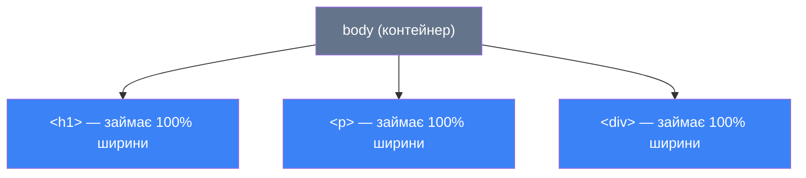
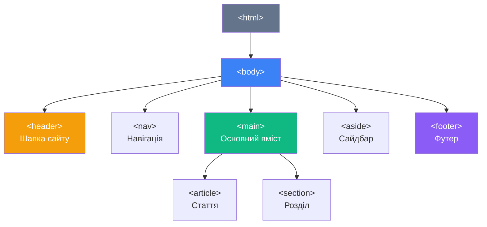

# Форматування тексту в HTML

## Чому форматування — це більше, ніж «зробити жирним»

Уявіть дві сторінки газети. На першій — суцільний текст без виділень, відступів, підзаголовків. На другій — той самий текст, але з чіткою ієрархією: жирні ключові слова, курсивні цитати, підкреслені посилання, виноски малим шрифтом.

Яку читати приємніше? Відповідь очевидна.

HTML надає два механізми форматування:

1. **Фізичне форматування** (_physical formatting_) — змінює зовнішній вигляд тексту: `<b>`, `<i>`, `<u>`, `<s>`, `<small>`
2. **Логічне (семантичне) форматування** (_logical / semantic formatting_) — описує _значення_ тексту: `<strong>`, `<em>`, `<del>`, `<ins>`, `<mark>`, `<abbr>`

::note
В HTML5 ці межі розмились: навіть теги «фізичного» форматування (`<b>`, `<i>`) отримали семантичний зміст. Але різниця у підходах залишається важливою для SEO та доступності.
::

---

## Блокові та рядкові елементи: фундаментальна різниця

Перш ніж вивчати конкретні теги, розберемо їхню класифікацію за типом відображення.

### Блокові елементи (Block Elements)

**Блоковий елемент** завжди починається з нового рядка і займає всю доступну ширину свого контейнера — навіть якщо вміст займає лише пару слів.

```html
<p>Короткий абзац</p>
<p>Наступний абзац автоматично на новому рядку</p>
```

::mermaid



::

**Основні блокові елементи HTML5:**

| Тег | Призначення |
|---|---|
| `<h1>`–`<h6>` | Заголовки шести рівнів |
| `<p>` | Абзац |
| `<div>` | Блоковий контейнер (без семантики) |
| `<header>` | Шапка сторінки або розділу |
| `<nav>` | Блок навігації |
| `<main>` | Основний вміст сторінки |
| `<section>` | Тематичний розділ |
| `<article>` | Самостійна стаття або контент |
| `<aside>` | Бічна колонка, пов'язана інформація |
| `<footer>` | Футер сторінки або розділу |
| `<blockquote>` | Блокова цитата |
| `<pre>` | Преформатований текст |
| `<ul>`, `<ol>`, `<dl>` | Ненумерований, нумерований, визначальний списки |
| `<figure>`, `<figcaption>` | Підпис до зображення/медіа |
| `<details>`, `<summary>` | Інтерактивний спойлер |

### Рядкові елементи (Inline Elements)

**Рядковий елемент** розміщується в потоці тексту і займає рівно стільки місця, скільки займає його вміст. Він не «розривається» на новий рядок.

```html
<p>
  Тут звичайний текст, а ось <strong>жирне слово</strong>, 
  і далі текст продовжується на тому ж рядку.
</p>
```

**Основні рядкові елементи:**

| Тег | Призначення |
|---|---|
| `<a>` | Гіперпосилання |
| `<span>` | Рядковий контейнер (без семантики) |
| `<strong>` | Важливий текст (жирний) |
| `<em>` | Наголошений текст (курсив) |
| `<b>` | Виділений текст (жирний, без посилення) |
| `<i>` | Альтернативний текст (курсив, без акценту) |
| `<u>` | Підкреслений текст |
| `<s>` | Закреслений (неактуальний) текст |
| `<del>` | Видалений текст |
| `<ins>` | Доданий текст |
| `<mark>` | Виділений маркером текст |
| `<small>` | Дрібніший текст (правова інформація) |
| `<sub>` | Нижній індекс |
| `<sup>` | Верхній індекс |
| `<abbr>` | Абревіатура |
| `<code>` | Inline-код |
| `<kbd>` | Введення з клавіатури |
| `<var>` | Змінна |
| `<cite>` | Джерело цитати |
| `<q>` | Коротка цитата |
| `<br>` | Перенос рядка |
| `` | Зображення |

### CSS-відмінності між типами

З погляду CSS, різниця між типами задається властивістю `display`:

```css
/* Блоковий елемент */
div { display: block; }

/* Рядковий елемент */
span { display: inline; }

/* Гібрид: рядковий, але приймає розміри блоку */
img { display: inline-block; }
```

::tip
За допомогою CSS можна змінити тип відображення будь-якого елемента: `display: block` зробить `<span>` блоковим, а `display: inline` зробить `<div>` рядковим. Це потужний інструмент для створення макетів.
::

---

## Теги фізичного форматування

### `<b>` — Виділений текст (Bold)

**Тег `<b>`** відображає текст **жирним шрифтом**. В HTML5 отримав семантичне значення: текст, на який треба звернути увагу, але без особливої важливості та без емоційного акценту.

```html
<p>
  Натисніть кнопку <b>Зберегти</b> для збереження змін.
</p>

<p>
  Інгредієнти: <b>борошно</b>, <b>яйця</b>, <b>молоко</b>, сіль.
</p>
```

**Коли використовувати `<b>`:**
- Назви продуктів у рецепті
- Ключові слова в резюме
- Назви кнопок та елементів інтерфейсу в інструкціях

**`<b>` vs `<strong>`** — головна відмінність:

```html
<!-- <b>: "зверни увагу", але не "це критично важливо" -->
<p>Натисніть кнопку <b>OK</b>.</p>

<!-- <strong>: "це важливо, це має значення" -->
<p><strong>Увага!</strong> Ця дія незворотня.</p>
```

---

### `<strong>` — Важливий текст (Strong Importance)

**Тег `<strong>`** позначає текст як **критично важливий** за змістом. Браузер відображає його жирним, але для скринрідерів (програм читання для незрячих) і пошукових систем — це «важлива інформація».

```html
<p>
  <strong>Заборонено</strong> залишати дітей без нагляду.
</p>

<p>
  Термін здачі проєкту — <strong>15 березня 2024 року</strong>.
</p>

<p>
  Для входу необхідний <strong>дійсний паспорт або ID-картка</strong>.
</p>
```

**Вкладений `<strong>` — посилення акценту:**

```html
<p>
  <strong>Це важливо! <strong>Дуже важливо!</strong></strong>
</p>
<!-- Вкладений strong означає ще вищий ступінь важливості -->
```

::note
Скринрідери (наприклад, NVDA, JAWS) можуть виділяти текст у `<strong>` інтонаційно при зачитуванні — підвищувати голос або робити паузу. Тому семантика `<strong>` vs `<b>` має практичне значення для доступності.
::

---

### `<i>` — Альтернативний текст (Italic)

**Тег `<i>`** відображає текст _курсивом_. В HTML5: текст, що «вибивається» із основного потоку за жанром чи голосом, але без емоційного наголосу.

```html
<!-- Технічні терміни -->
<p>
  Алгоритм <i>quicksort</i> має середню складність O(n log n).
</p>

<!-- Іноземні слова та вирази -->
<p>
  Вираз <i lang="la">carpe diem</i> означає «лови момент».
</p>

<!-- Назви творів, кораблів, судин -->
<p>
  Роман <i>«Майстер і Маргарита»</i> написаний Михайлом Булгаковим.
</p>

<!-- Думки персонажа в художньому тексті -->
<p>
  Вона зупинилась. <i>Що ж тепер робити?</i> — промайнула думка.
</p>
```

---

### `<em>` — Емфатичний наголос (Emphasis)

**Тег `<em>`** (_emphasis_ — наголос) позначає текст із **емоційним наголосом** — так ніби ви виділяєте слово голосом у розмові. Також відображається курсивом, але семантично відрізняється від `<i>`.

```html
<!-- Різниця в наголосі змінює зміст речення -->
<p><em>Я</em> не казав, що він вкрав гроші.</p>
<!-- "Саме я, а не хтось інший, не казав" -->

<p>Я <em>не</em> казав, що він вкрав гроші.</p>
<!-- "Я НЕ казав, а хтось міг подумати, що казав" -->

<p>Я не казав, що він <em>вкрав</em> гроші.</p>
<!-- "Можливо, він взяв, але не вкрав" -->
```

::tip
Один з найкращих тестів для розуміння `<em>`: уявіть, що ви читаєте текст вголос. Де ви підвищуєте голос або робите наголос? — Ось де потрібен `<em>`.
::

---

### `<u>` — Підкреслений текст (Underline)

**Тег `<u>`** підкреслює текст. В HTML5 отримав специфічне семантичне значення: текст із **нетекстовою анотацією** (наприклад, орфографічна помилка, позначка).

```html
<!-- Орфографічна помилка (браузер зазвичай малює червону хвилю) -->
<p>Він написав <u class="spelling-error">карова</u> замість «корова».</p>

<!-- Власні назви в китайській літературі (традиційне використання) -->
<p><u>東京</u> — столиця Японії.</p>
```

::warning
**Будьте обережні з `<u>`!** Підкреслений текст асоціюється у користувачів із **посиланнями**. Підкреслення звичайного тексту без стилізації може дезорієнтувати.

Якщо вам потрібне просто декоративне підкреслення — використовуйте CSS:
```css
.custom-underline {
  text-decoration: underline;
  text-decoration-color: #3b82f6;
  text-decoration-style: wavy;
}
```
::

---

### `<s>` — Закреслений текст (Strikethrough)

**Тег `<s>`** позначає текст, який **більше не є правильним або актуальним**, але не є «видаленим» у сенсі редагування документа (для цього є `<del>`).

```html
<!-- Старі ціни в магазині -->
<p>
  Навушники Sony WH-1000XM5: 
  <s>8 999 грн</s> 
  <strong>6 499 грн</strong> 
  ⬇️ -28%
</p>

<!-- Скасована умова -->
<p>
  Мінімальне замовлення: <s>500 грн</s> безкоштовна доставка від 1 грн!
</p>
```

**Практичний CSS для красивого відображення:**

```css
s {
  color: #94a3b8;           /* сірий колір для "неактуального" */
  text-decoration: line-through;
  text-decoration-color: #ef4444;  /* червона лінія */
}
```

---

### `<del>` та `<ins>` — Відслідковування змін

Ці теги призначені для показу **редакторських правок** у документі — як режим «Відстежування змін» в Microsoft Word.

**`<del>`** (_deleted_ — видалений) позначає текст, що був **видалений** з документа.
**`<ins>`** (_inserted_ — вставлений) позначає текст, що був **доданий** до документа.

```html
<!-- Редакторська правка -->
<p>
  Зустріч відбудеться 
  <del datetime="2024-03-10">в понеділок о 14:00</del> 
  <ins datetime="2024-03-12">у середу о 16:00</ins>.
</p>

<!-- Виправлення помилки -->
<p>
  Автор статті — 
  <del>Іван Петренко</del>
  <ins>Марія Коваленко</ins>.
</p>
```

**Атрибут `datetime`** вказує дату і час внесення зміни (стандарт ISO 8601):

```html
<del datetime="2024-03-15T14:30:00Z">видалений текст</del>
<ins datetime="2024-03-15">доданий текст</ins>
```

**CSS для стилізації:**

```css
del {
  color: #dc2626;           /* червоний */
  background-color: #fee2e2;
  text-decoration: line-through;
}

ins {
  color: #16a34a;           /* зелений */
  background-color: #dcfce7;
  text-decoration: none;
}
```

{.diagram-img}

<!-- Search Query: HTML del ins tags track changes document editing visual example -->

---

### `<mark>` — Виділення маркером

**Тег `<mark>`** позначає текст, **виділений як важливий** у поточному контексті — наче підкреслений жовтим маркером.

```html
<!-- Результати пошуку -->
<p>
  Результати за запитом «<mark>HTML форматування</mark>»:
</p>

<!-- Ключові слова у статті -->
<p>
  Для розуміння каскадності CSS важливо зрозуміти поняття 
  <mark>специфічності</mark> та <mark>спадкування</mark>.
</p>

<!-- Виділення у цитаті -->
<blockquote>
  «Будь-який досить просунутий тег — це 
  <mark>неможливо відрізнити від магії</mark>.»
</blockquote>
```

**CSS за замовчуванням та кастомізація:**

```css
/* Браузерний default: жовтий фон */
mark { background-color: yellow; color: black; }

/* Кастомний стиль */
mark.blue-highlight {
  background-color: #bfdbfe;
  color: #1e3a8a;
  border-radius: 3px;
  padding: 0 2px;
}
```

---

### `<small>` — Дрібніший текст

**Тег `<small>`** зменшує розмір шрифту на один рівень (зазвичай з `1em` до `0.8em`). В HTML5 семантика: **правова інформація, примітки, авторські права, умови**.

```html
<!-- Авторське право у футері -->
<footer>
  <small>&copy; 2024 Мій сайт. Усі права захищені.</small>
</footer>

<!-- Правові застереження під формою -->
<form>
  <button>Зареєструватись</button>
  <small>
    Натискаючи кнопку, ви погоджуєтесь з 
    <a href="/terms">Умовами використання</a>.
  </small>
</form>

<!-- Примітки під заголовком -->
<h1>Акція «Чорна п'ятниця»</h1>
<small>Дійсно до 30 листопада або до вичерпання запасів</small>
```

---

### `<sub>` та `<sup>` — Індекси

**`<sub>`** (_subscript_ — нижній індекс): опускає текст нижче базової лінії.
**`<sup>`** (_superscript_ — верхній індекс): піднімає текст вище базової лінії.

```html
<!-- Хімічні формули (нижній індекс) -->
<p>Вода: H<sub>2</sub>O</p>
<p>Сірчана кислота: H<sub>2</sub>SO<sub>4</sub></p>
<p>Глюкоза: C<sub>6</sub>H<sub>12</sub>O<sub>6</sub></p>

<!-- Математичні степені (верхній індекс) -->
<p>Теорема Піфагора: a<sup>2</sup> + b<sup>2</sup> = c<sup>2</sup></p>
<p>Площа кола: S = πr<sup>2</sup></p>

<!-- Виноски (верхній індекс) -->
<p>
  Станом на 2023 рік населення України становить 37 мільйонів<sup>1</sup>.
</p>
<p><small><sup>1</sup> За даними Державної статистики України.</small></p>

<!-- Порядкові числівники -->
<p>Він зайняв 1<sup>st</sup> місце (1<sup>е</sup> місце).</p>
```

---

### `<abbr>` — Абревіатури та акроніми

**Тег `<abbr>`** (_abbreviation_ — скорочення) позначає абревіатури та акроніми. Атрибут `title` містить повну розшифровку.

```html
<p>
  <abbr title="HyperText Markup Language">HTML</abbr> — мова розмітки.
</p>

<p>
  Для розробки використовуємо 
  <abbr title="Visual Studio Code">VS Code</abbr> 
  та 
  <abbr title="Cascading Style Sheets">CSS</abbr>.
</p>

<p>
  Сайт відповідає вимогам 
  <abbr title="Web Content Accessibility Guidelines">WCAG</abbr> 2.1.
</p>
```

При наведенні на `<abbr>` браузер показує підказку з `title`. Візуально зазвичай відображається з крапковим підкресленням.

**CSS для кращого відображення:**

```css
abbr[title] {
  text-decoration: underline dotted;
  cursor: help;              /* курсор-питання при наведенні */
}
```

---

## Теги для коду та технічного тексту

### `<code>` — Фрагмент коду

**Тег `<code>`** позначає фрагмент програмного коду — рядковий елемент для `inline`-коду:

```html
<p>
  Для зміни кольору використовуйте властивість 
  <code>color: red;</code>.
</p>

<p>
  Функція <code>getElementById()</code> повертає елемент DOM.
</p>
```

Браузер за замовчуванням відображає вміст `<code>` моноширинним шрифтом (Courier, Consolas тощо).

**Для блоку коду** — `<code>` всередині `<pre>`:

```html
<pre><code>
function greet(name) {
    return `Привіт, ${name}!`;
}

console.log(greet('Світ'));
</code></pre>
```

### `<kbd>` — Клавіатурний ввід

**Тег `<kbd>`** (_keyboard_ — клавіатура) позначає клавіші або комбінації клавіш:

```html
<p>Збережіть файл: <kbd>Ctrl</kbd> + <kbd>S</kbd></p>
<p>Відкрийте командний рядок: <kbd>Win</kbd> + <kbd>R</kbd></p>
<p>Для виходу натисніть <kbd>Esc</kbd></p>
```

**CSS для кнопкоподібного вигляду:**

```css
kbd {
  display: inline-block;
  padding: 2px 8px;
  font-family: monospace;
  font-size: 0.85em;
  background-color: #f1f5f9;
  border: 1px solid #cbd5e1;
  border-radius: 4px;
  box-shadow: 0 2px 0 #94a3b8;
}
```

### `<var>` — Змінна

**Тег `<var>`** (_variable_) позначає математичні або програмні змінні:

```html
<p>Площа прямокутника: <var>S</var> = <var>a</var> × <var>b</var></p>
<p>Де <var>x</var> — невідома величина.</p>
```

### `<samp>` — Приклад виводу програми

**Тег `<samp>`** (_sample output_) позначає зразок виводу комп'ютерної програми:

```html
<p>Після запуску ви побачите: <samp>Hello, World!</samp></p>
<p>Програма вивела помилку: <samp>Error: undefined is not a function</samp></p>
```

---

## Цитати: `<blockquote>`, `<q>`, `<cite>`

### `<blockquote>` — Блокова цитата

**Тег `<blockquote>`** (_block quote_) — великі цитати з зовнішніх джерел, що виносяться в окремий блок. Браузер відступає його від основного тексту.

```html
<blockquote cite="https://uk.wikipedia.org/wiki/HTML">
  <p>
    HTML (від англ. HyperText Markup Language — «мова гіпертекстової 
    розмітки») — стандартна мова розмітки для документів, що передаються 
    в мережі Інтернет.
  </p>
  <footer>
    — <cite>Вікіпедія, «HTML»</cite>
  </footer>
</blockquote>
```

**Атрибут `cite`** містить URL джерела (не відображається користувачу, але корисний для машин).

**CSS для стилізації:**

```css
blockquote {
  border-left: 4px solid #3b82f6;
  margin: 1.5em 0;
  padding: 1em 1.5em;
  background-color: #f8fafc;
  font-style: italic;
  color: #475569;
}

blockquote footer {
  margin-top: 0.5em;
  font-style: normal;
  font-size: 0.9em;
  color: #64748b;
}
```

### `<q>` — Коротка цитата

**Тег `<q>`** (_quotation_) — рядкова цитата, вбудована в текст. Браузер автоматично додає лапки (тип лапок залежить від атрибута `lang`):

```html
<p>
  Як сказав Стів Джобс: 
  <q cite="https://example.com/jobs-speech">
    Ваш час обмежений, тому не витрачайте його на чуже життя.
  </q>
</p>

<!-- З lang="uk" браузер додасть «» або „" -->
<p lang="uk">
  Народна мудрість говорить: <q>Сім раз відміряй, один раз відріж.</q>
</p>
```

### `<cite>` — Посилання на джерело

**Тег `<cite>`** позначає **назву твору** (книги, фільму, статті, картини):

```html
<p>
  Перша поема — <cite>«Кобзар»</cite> Тараса Шевченка.
</p>

<p>
  Відповідно до <cite>специфікації HTML5 W3C</cite>, 
  тег &lt;cite&gt; використовується для назв творів.
</p>
```

---

## Тег `<pre>` — Преформатований текст

**Тег `<pre>`** (_preformatted_) зберігає **всі пробіли, табуляції та переноси рядків** такими, якими вони є в HTML-коді. Незамінний для показу коду, ASCII-арту, поезії.

```html
<pre>
  Ти знаєш, що ти — людина?
  Ти знаєш про це чи ні?
  Усмішка твоя — єдина,
  мука твоя — єдина,
  очі твої — одні.
                — Василь Симоненко
</pre>
```

```html
<!-- ASCII-арт -->
<pre>
    /\_____/\
   /  o   o  \
  ( ==  ^  == )
   )         (
  (           )
 ( (  )   (  ) )
(__(__)___(__)__)
</pre>
```

::note
`<pre>` використовує моноширинний шрифт за замовчуванням. Для показу коду завжди вкладайте `<code>` всередину `<pre>`: `<pre><code>...</code></pre>`.
::

---

## Тег `<br>` — Примусовий перенос рядка

**Тег `<br>`** (_line break_) — одинарний тег, що переносить текст на наступний рядок без початку нового абзацу.

```html
<!-- Адреса -->
<address>
  ТОВ «Веб-Студія»<br>
  вул. Хрещатик, 1<br>
  м. Київ, 01001<br>
  Україна
</address>

<!-- Поетичний текст -->
<p>
  Садок вишневий коло хати,<br>
  Хрущі над вишнями гудуть,<br>
  Плугатарі з плугами йдуть,<br>
  Співають ідучи дівчата.
</p>
```

::caution
Ніколи не використовуйте `<br><br>` для створення відступу між абзацами! Для цього є тег `<p>` або CSS `margin`. Два або більше `<br>` підряд — ознака поганого коду.
::

---

## Тег `<hr>` — Горизонтальна лінія

**Тег `<hr>`** (_horizontal rule_) — **блоковий**, одинарний тег. Позначає тематичний розрив між блоками контенту. Відображається як горизонтальна лінія.

```html
<h2>Розділ 1</h2>
<p>Вміст першого розділу.</p>

<hr>

<h2>Розділ 2</h2>
<p>Вміст другого розділу.</p>
```

**CSS для кастомної лінії:**

```css
hr {
  border: none;
  border-top: 2px solid #e2e8f0;
  margin: 2em 0;
}

/* Декоративна лінія з градієнтом */
hr.gradient {
  border: none;
  height: 2px;
  background: linear-gradient(to right, #3b82f6, #8b5cf6, #ec4899);
}
```

---

## Спецсимволи HTML (HTML Entities)

### Чому потрібні спецсимволи?

Деякі символи мають **спеціальне значення** в HTML (`<`, `>`, `&`, `"`) або **відсутні на клавіатурі** (©, ®, →, ×). Для їхнього відображення використовуються **HTML entities** (мнемоніки).

**Синтаксис:**
- Іменні: `&copy;` → ©
- Числові (десяткові): `&#169;` → ©
- Числові (шістнадцяткові): `&#xA9;` → ©

### Обов'язкові спецсимволи

::warning
Ці символи **НЕМОЖНА** вводити безпосередньо в HTML, де вони мають певну роль — тільки через entity:

| Символ | Entity | Опис |
|---|---|---|
| `<` | `&lt;` | Менше (left than) |
| `>` | `&gt;` | Більше (greater than) |
| `&` | `&amp;` | Амперсанд |
| `"` | `&quot;` | Подвійні лапки |
| `'` | `&apos;` | Апостроф |

::

```html
<!-- Показуємо HTML-код як текст -->
<p>Тег &lt;p&gt; — це абзац.</p>
<!-- Браузер покаже: Тег <p> — це абзац. -->

<!-- Назва компанії з амперсандом -->
<p>Компанія «Марк &amp; Спенсер»</p>
```

### Типографські символи

```html
<!-- Авторське право та торгові марки -->
<footer>&copy; 2024 Мій Сайт</footer>           <!-- © -->
<p>Nike&trade; — спортивний бренд</p>            <!-- ™ -->
<p>Apple&reg; — зареєстрована марка</p>          <!-- ® -->

<!-- Тире -->
<p>Київ&ndash;Львів — 540 км</p>                 <!-- – коротке тире -->
<p>Відпустка&mdash;найкращий час</p>             <!-- — довге тире -->

<!-- Пробіли -->
<p>Іванов&nbsp;П.П.</p>                          <!-- нерозривний пробіл -->
<p>м.&nbsp;Київ</p>                              <!-- місто без переносу -->

<!-- Лапки -->
<p>&laquo;Кобзар&raquo;</p>                     <!-- «» французькі лапки -->
<p>&ldquo;Hello&rdquo;</p>                       <!-- "" англійські лапки -->

<!-- Математика -->
<p>5 &times; 3 = 15</p>                          <!-- × -->
<p>10 &divide; 2 = 5</p>                         <!-- ÷ -->
<p>a &ne; b</p>                                  <!-- ≠ -->
<p>&infin;</p>                                   <!-- ∞ -->
<p>&pi; = 3.14159...</p>                         <!-- π -->

<!-- Стрілки -->
<p>&larr; Назад</p>                              <!-- ← -->
<p>Далі &rarr;</p>                               <!-- → -->
<p>&uarr; Вгору &darr; Вниз</p>                 <!-- ↑ ↓ -->
```

### Нерозривний пробіл `&nbsp;`

**Нерозривний пробіл** (_non-breaking space_, `&nbsp;`) — особливий символ: браузер **ніколи не перенесе рядок** в місці цього пробілу.

```html
<!-- Без &nbsp; браузер може розірвати "м." і "Київ" на різні рядки -->
<p>Адреса: м.&nbsp;Київ, вул.&nbsp;Хрещатик,&nbsp;1</p>

<!-- Прізвище та ініціали завжди разом -->
<p>Автор:&nbsp;Т.&nbsp;Г.&nbsp;Шевченко</p>

<!-- Посади та повні назви -->
<p>ТОВ&nbsp;«Веб-Студія»</p>
```

### М'який перенос `&shy;`

**М'який перенос** (_soft hyphen_, `&shy;`) — підказка браузеру, де **можна** перенести довге слово. Дефіс з'явиться лише якщо слово не поміщається:

```html
<!-- Довге слово з м'якими переносами -->
<p>За&shy;ре&shy;єс&shy;тро&shy;ва&shy;ний</p>
<!-- → "Зареєстро-" (перенос) "ваний" — якщо не вміщується -->
<!-- → "Зареєстрований" — якщо вміщується -->
```

---

## CSS — мова стилів: короткий вступ

Ми вже бачили в прикладах шматочки `css`-коду — наприклад `color: red` або `text-decoration: line-through`. Настав час розібратися, що це таке і як підключити CSS до HTML-сторінки. Детально про CSS ми будемо вчитися на наступних заняттях, але базові речі потрібні вже зараз.

### Що таке CSS?

**CSS** (_Cascading Style Sheets_ — каскадні таблиці стилів) — це окрема мова, яка відповідає **виключно за візуальне оформлення** HTML-сторінки. HTML описує _що є_ на сторінці, CSS — _як це виглядає_.

::note
Розподіл обов'язків:
- **HTML** — структура та зміст: заголовки, абзаци, посилання, зображення
- **CSS** — зовнішній вигляд: колір, шрифт, розміри, відступи, анімації

Якщо HTML — це скелет і органи тіла, то CSS — одяг і макіяж.
::

CSS-правило складається з **селектора** (кого стилізуємо) і **блоку оголошень** (як саме):

```css
/* селектор { властивість: значення; } */
p {
    color: #333;         /* колір тексту */
    font-size: 16px;     /* розмір шрифту */
    line-height: 1.6;    /* міжрядковий інтервал */
}
```

### Три способи підключення CSS

::tabs
::tabs-item{label="1. Inline-стилі (атрибут style)"}

Стилі прямо в атрибуті HTML-тегу. Найпростіший спосіб, але найгірший для підтримки — стилі розкидані по всьому HTML.

```html
<p style="color: red; font-size: 20px;">
    Цей текст буде червоним і великим.
</p>

<h2 style="text-align: center; text-decoration: underline;">
    Підкреслений заголовок по центру
</h2>
```

**Коли використовувати:** для швидкого тестування або коли потрібен унікальний стиль для одного конкретного елементу (наприклад, динамічно заданий через JavaScript).

::warning
Ніколи не стилізуйте весь сайт через `style=""` — код стане нечитабельним і важким для редагування. Якщо треба змінити колір усіх абзаців — доведеться редагувати кожен тег окремо.
::

::
::tabs-item{label="2. Тег <style> (внутрішні стилі)"}

CSS у блоці `<style>` всередині `<head>`. Всі стилі — в одному місці, але тільки для цієї одної HTML-сторінки.

```html
<!DOCTYPE html>
<html lang="uk">
<head>
    <meta charset="UTF-8">
    <title>Моя сторінка</title>

    <style>
        /* Тут пишемо CSS */
        body {
            font-family: Arial, sans-serif;
            background-color: #f8f9fa;
        }

        h1 {
            color: #2563eb;
            text-align: center;
        }

        p {
            color: #374151;
            line-height: 1.7;
        }

        strong {
            color: #dc2626;
        }
    </style>
</head>
<body>
    <h1>Привіт, CSS!</h1>
    <p>Цей текст стилізований через тег <strong>style</strong>.</p>
</body>
</html>
```

**Коли використовувати:** для невеликих навчальних прикладів або односторінкових документів.

::
::tabs-item{label="3. Зовнішній файл (рекомендовано)"}

Стилі у окремому `.css`-файлі, підключеному через тег `<link>`. Це **єдиний правильний підхід** для реальних проєктів.

**Структура проєкту:**
```
my-project/
├── index.html
└── style.css
```

**style.css:**
```css
body {
    font-family: Arial, sans-serif;
    margin: 0;
    padding: 20px;
}

h1 {
    color: #2563eb;
}

p {
    line-height: 1.6;
}
```

**index.html:**
```html
<!DOCTYPE html>
<html lang="uk">
<head>
    <meta charset="UTF-8">
    <title>Моя сторінка</title>
    <!-- Підключаємо зовнішній CSS -->
    <link rel="stylesheet" href="style.css">
</head>
<body>
    <h1>Заголовок</h1>
    <p>Стилізований текст.</p>
</body>
</html>
```

**Переваги зовнішнього файлу:**
- Один CSS-файл стилізує **всі** сторінки сайту
- Браузер кешує `.css`-файл — сторінки завантажуються швидше
- Зрозуміла структура: HTML окремо, стилі окремо
- Легко знайти і змінити будь-який стиль

::

### Для навчальних вправ: тег `<style>` або `style=""`

На цьому занятті та при виконанні домашніх завдань ми використовуємо **тег `<style>` в `<head>`** або коротко **`style=""`** прямо в тегах — так простіше бачити зв'язок між HTML та CSS в одному файлі.

```html
<!DOCTYPE html>
<html lang="uk">
<head>
    <meta charset="UTF-8">
    <title>Вправа</title>
    <style>
        /* Ваші стилі — тут */
        strong { color: #dc2626; }
        em     { color: #2563eb; }
        mark   { background-color: #fef08a; border-radius: 3px; }
    </style>
</head>
<body>
    <p>
        <strong>Важливо:</strong> це <em>дуже</em> цікаво,
        а особливо <mark>ця частина</mark>.
    </p>
</body>
</html>
```

---

## CSS-властивості для оформлення тексту

Розглянемо найважливіші CSS-властивості, пов'язані з форматуванням тексту.


### `font-weight` — Товщина шрифту

```css
/* Числові значення (рекомендовано) */
.thin     { font-weight: 100; }  /* Тонкий */
.light    { font-weight: 300; }  /* Світлий */
.regular  { font-weight: 400; }  /* Звичайний */
.medium   { font-weight: 500; }  /* Середній */
.semibold { font-weight: 600; }  /* Напівжирний */
.bold     { font-weight: 700; }  /* Жирний */
.black    { font-weight: 900; }  /* Чорний */

/* Ключові слова */
p  { font-weight: normal; }  /* = 400 */
b  { font-weight: bold; }    /* = 700 */
```

### `font-style` — Стиль шрифту

```css
p       { font-style: normal; }   /* Звичайний */
em      { font-style: italic; }   /* Курсив */
.oblique { font-style: oblique; } /* Нахилений (без курсивного накреслення) */
```

### `text-decoration` — Декорація тексту

```css
/* Скорочена властивість */
a        { text-decoration: underline; }
s        { text-decoration: line-through; }
.overline { text-decoration: overline; }
.none    { text-decoration: none; }

/* Розширений варіант (CSS3) */
.fancy-underline {
  text-decoration-line: underline;
  text-decoration-style: wavy;      /* solid, double, dotted, dashed, wavy */
  text-decoration-color: #ef4444;
  text-decoration-thickness: 2px;
}

/* Можна комбінувати */
.multi-deco { text-decoration: underline overline; }
```

### `text-transform` — Регістр тексту

```css
.uppercase   { text-transform: uppercase; }  /* ВСЕ ВЕЛИКИМИ */
.lowercase   { text-transform: lowercase; }  /* все малими */
.capitalize  { text-transform: capitalize; } /* Перша Літера Кожного Слова */
.none        { text-transform: none; }       /* без змін */
```

```html
<p style="text-transform: uppercase;">заголовок</p>
<!-- Відображається: ЗАГОЛОВОК -->
```

### `letter-spacing` — Міжлітерний інтервал

```css
/* Розширений трекінг — для стильних заголовків */
h1    { letter-spacing: 0.1em; }
h2    { letter-spacing: 2px; }

/* Стиснутий — для компактного тексту */
.tight { letter-spacing: -0.05em; }

/* Класика верстки: капіталіки з розширеним трекінгом */
.caps-label {
  text-transform: uppercase;
  letter-spacing: 0.15em;
  font-size: 0.75rem;
  font-weight: 600;
}
```

### `word-spacing` — Міжслівний інтервал

```css
.loose { word-spacing: 0.5em; }    /* розширені пробіли між словами */
.tight { word-spacing: -2px; }     /* стиснуті пробіли */
```

### `line-height` — Міжрядковий інтервал

```css
/* Безрозмірне значення — РЕКОМЕНДОВАНО */
body { line-height: 1.6; }       /* 1.6 × font-size */

/* Конкретне значення */
p    { line-height: 24px; }

/* Відсоткове */
h1   { line-height: 120%; }

/* Рекомендовані значення: */
/* 1.4–1.6 — для основного тексту */
/* 1.1–1.3 — для заголовків */
/* 1.6–2.0 — для підвищеної читабельності (доступність) */
```

### `text-shadow` — Тінь тексту

```css
/* Синтаксис: горизонт. зміщення, вертикал. зміщення, розмиття, колір */
h1 { text-shadow: 2px 2px 4px rgba(0, 0, 0, 0.3); }

/* Кілька тіней */
.glow {
  text-shadow: 
    0 0 10px #3b82f6,
    0 0 20px #3b82f6,
    0 0 40px #3b82f6;
}

/* 3D-ефект */
.three-d {
  color: #ffffff;
  text-shadow:
    1px 1px 0 #999,
    2px 2px 0 #888,
    3px 3px 0 #777;
}
```

### `white-space` — Обробка пробілів

Ця властивість визначає, як браузер обробляє пробіли та переноси рядків у HTML-коді:

```css
/* Значення та їх поведінка: */

/* normal (за замовчуванням): стискає пробіли, переносить по ширині */
p { white-space: normal; }

/* nowrap: весь текст в один рядок, ігнорує <br> ... ні, враховує */
.badge { white-space: nowrap; }

/* pre: зберігає пробіли та переноси, як в <pre> */
code { white-space: pre; }

/* pre-wrap: зберігає пробіли, але переносить по ширині контейнера */
textarea { white-space: pre-wrap; }

/* pre-line: стискає пробіли, зберігає переноси рядків */
.verse { white-space: pre-line; }
```

### `word-break` та `overflow-wrap` — Перенос довгих слів

```css
/* word-break — де переносити слова */
.break-all  { word-break: break-all; }   /* переносити в будь-якому місці */
.keep-all   { word-break: keep-all; }    /* не переносити (для CJK мов) */

/* overflow-wrap (word-wrap) — переносити, якщо не вміщується */
.container {
  overflow-wrap: break-word;   /* = word-wrap: break-word */
  /* Переносить слово, тільки якщо воно не поміщається */
}

/* Сучасне рішення для URL та довгих слів: */
.email, .url {
  word-break: break-all;
  overflow-wrap: anywhere;
}
```

### `text-align` — Вирівнювання тексту

```css
.left    { text-align: left; }     /* Ліворуч (за замовчуванням для LTR) */
.center  { text-align: center; }   /* По центру */
.right   { text-align: right; }    /* Праворуч */
.justify { text-align: justify; }  /* По ширині (газетний стиль) */
.start   { text-align: start; }    /* За напрямком тексту (LTR = left) */
.end     { text-align: end; }      /* За напрямком тексту (LTR = right) */
```

---

## Семантична структура сторінки: HTML5-теги

HTML5 додав набір **семантичних тегів**, що замінили безліч `<div>` з класами `id="header"`, `id="nav"` тощо. Ці теги передають **змістовний сенс** структури.

::mermaid



::

```html
<!DOCTYPE html>
<html lang="uk">
<head>
    <meta charset="UTF-8">
    <title>Новини — Мій портал</title>
</head>
<body>

    <header>
        <h1>Мій новинний портал</h1>
        <nav>
            <a href="/">Головна</a>
            <a href="/ukraine">Україна</a>
            <a href="/world">Світ</a>
            <a href="/tech">Технології</a>
        </nav>
    </header>

    <main>
        <article>
            <header>
                <h2>Заголовок головної новини</h2>
                <p><time datetime="2024-03-15">15 березня 2024</time></p>
            </header>
            <section>
                <h3>Передісторія</h3>
                <p>Текст передісторії...</p>
            </section>
            <section>
                <h3>Деталі події</h3>
                <p>Детальний опис...</p>
            </section>
            <footer>
                <p>Автор: <cite>Іван Петренко</cite></p>
            </footer>
        </article>

        <aside>
            <h2>Також читайте</h2>
            <ul>
                <li><a href="#">Інша новина 1</a></li>
                <li><a href="#">Інша новина 2</a></li>
            </ul>
        </aside>
    </main>

    <footer>
        <p><small>&copy; 2024 Мій портал. Усі права захищені.</small></p>
    </footer>

</body>
</html>
```

---

## Застарілі теги: чого уникати

З переходом на HTML5 низку тегів визнано застарілими (_deprecated_ або _obsolete_). Валідатор їх відкидає.

::accordion
::accordion-item{label="<font> — Форматування шрифту" icon="i-lucide-x-circle"}

Тег `<font>` дозволяв задати шрифт, розмір і колір. Зараз — `font-family`, `font-size`, `color` в CSS.

```html
<!-- ❌ Застарілий підхід -->
<font face="Arial" size="5" color="red">Текст</font>

<!-- ✅ Сучасний CSS -->
<p style="font-family: Arial; font-size: 1.5em; color: red;">Текст</p>
```

::
::accordion-item{label="<center> — Центрування" icon="i-lucide-x-circle"}

Тег `<center>` центрував вміст. Зараз — `text-align: center` або `margin: auto` в CSS.

```html
<!-- ❌ -->
<center>Текст по центру</center>

<!-- ✅ -->
<p style="text-align: center;">Текст по центру</p>
```

::
::accordion-item{label="<big> — Збільшення тексту" icon="i-lucide-x-circle"}

Тег `<big>` збільшував шрифт. Зараз — `font-size` в CSS. На відміну від нього `<small>` залишається актуальним!

```html
<!-- ❌ -->
<big>Великий текст</big>

<!-- ✅ -->
<span style="font-size: 1.25em;">Великий текст</span>
```

::
::accordion-item{label="<strike> і <tt> — Застарілі аналоги" icon="i-lucide-x-circle"}

`<strike>` — застарілий аналог `<s>` та `<del>`. `<tt>` (teletype) — моноширинний шрифт, замінений `<code>`.

::
::

---

## Практичне завдання

Застосуйте знання з форматування на практиці.

::steps

### Крок 1: Створення файлу

Створіть `article.html` з базовою структурою HTML5 (`!` + Tab у VS Code).

### Крок 2: Структура статті

```html
<body>
    <article>
        <header>
            <h1>Як почати вивчати програмування</h1>
            <p>Автор: <cite>Марія Коваленко</cite> | 
               <time datetime="2024-03-15">15 березня 2024</time></p>
        </header>
```

### Крок 3: Вміст з форматуванням

Наповніть статтю, використовуючи:
- `<h2>`, `<h3>` для підрозділів
- `<p>` для абзаців
- `<strong>` для важливих термінів
- `<em>` для емоційних наголосів
- `<code>` для назв технологій і команд
- `<mark>` для ключових думок
- `<abbr>` для розшифровки абревіатур

### Крок 4: Цитата та спецсимволи

```html
        <blockquote>
            <p>
                «Кожен експерт колись був початківцем. 
                Головне &mdash; почати.»
            </p>
        </blockquote>
```

### Крок 5: Футер статті

```html
        <footer>
            <small>
                &copy; 2024 Навчальна платформа. 
                Усі права захищені&reg;.
            </small>
        </footer>
    </article>
</body>
```

### Крок 6: CSS-стилізація

Додайте в `<head>`:

```html
<style>
    body {
        font-family: 'Georgia', serif;
        line-height: 1.7;
        color: #1e293b;
        max-width: 720px;
        margin: 2rem auto;
        padding: 0 1rem;
    }

    article > header h1 { font-size: 2rem; letter-spacing: -0.02em; }
    blockquote {
        border-left: 4px solid #3b82f6;
        padding: 1em 1.5em;
        margin: 2em 0;
        font-style: italic;
        background: #f0f9ff;
    }
    code { 
        background: #f1f5f9; 
        padding: 2px 6px; 
        border-radius: 4px; 
        font-size: 0.9em;
    }
    mark { background: #fef08a; padding: 1px 3px; border-radius: 2px; }
</style>
```

::

---

## Підсумок: Обирайте теги за змістом

Ключовий принцип HTML5: **теги повинні відображати зміст, а не зовнішній вигляд**.

::card-group

::card{title="🔤 Фізичне vs. Семантичне" icon="i-heroicons-scale"}

Замість `<b>` думайте: «Ця інформація _важлива_? → `<strong>`. Це лише _ключове слово_? → `<b>`». Замість `<i>` думайте: «Це _термін чи цитата_? → `<i>`. Це _емоційний наголос_? → `<em>`».

::

::card{title="♿ Доступність" icon="i-heroicons-eye"}

Семантичні теги (`<strong>`, `<em>`, `<abbr>`, `<mark>`) допомагають скринрідерам коректно озвучувати контент для людей з порушеннями зору.

::

::card{title="📈 SEO" icon="i-heroicons-magnifying-glass"}

Пошукові системи враховують семантику тегів. Правильно позначений `<strong>` сигналізує Google про важливість слова.

::

::card{title="🎨 CSS — для вигляду" icon="i-heroicons-paint-brush"}

Візуальне форматування — через CSS. HTML-теги лише позначають структуру та зміст. Ніколи не використовуйте `<h3>` лише тому, що він «підходить за розміром».

::

::

---

## Перевірка знань

::tally-embed{id="html-formatting-quiz" title="Тест: Форматування тексту в HTML"}
::

::note
**Примітка**: Якщо тест не відображається, перейдіть за [прямим посиланням](https://tally.so/r/html-formatting-quiz).
::

---

## Корисні посилання

- 📖 [MDN: Текст та шрифт](https://developer.mozilla.org/uk/docs/Web/CSS/CSS_fonts) — документація CSS-шрифтів
- 📖 [MDN: Семантичні HTML-елементи](https://developer.mozilla.org/uk/docs/Glossary/Semantics#semantics_in_html) — пояснення семантики
- 🔣 [HTML Entities Reference](https://html.spec.whatwg.org/multipage/named-characters.html) — повна таблиця спецсимволів
- 🌐 [Can I Use](https://caniuse.com/) — підтримка браузерами
- 🔧 [HTML5 Outliner](https://chrome.google.com/webstore/detail/html5-outliner/) — розширення для перевірки структури
- ✅ [W3C Validator](https://validator.w3.org/) — валідація HTML
