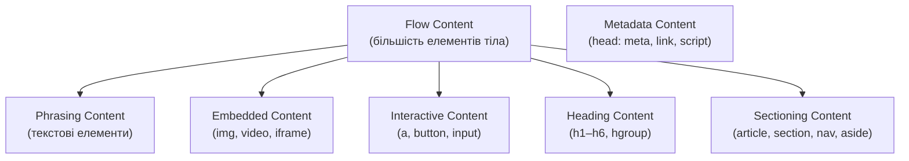

# Семантичні елементи HTML5

## Від «супу тегів» до структурованого документа

2008 рік. Типова HTML-сторінка того часу виглядала приблизно так:

```html
<div id="header">...</div>
<div id="nav">...</div>
<div id="content">
    <div id="main">
        <div class="post">...</div>
        <div class="post">...</div>
    </div>
    <div id="sidebar">...</div>
</div>
<div id="footer">...</div>
```

Пошукові системи, скринрідери та браузери бачили однаковий «суп» з `<div>`. Де тут навігація? Де головний контент? Де підвал? — Ніхто не знав, окрім розробника, який дивиться на `id="nav"`.

У 2014 році вийшов офіційний стандарт HTML5. Один із його ключових внесків — **семантичні елементи**: теги, що несуть змістове навантаження не лише через атрибути, але й самою своєю назвою.

Сьогодні ми розберемо ці елементи детально — так, як вони описані у **HTML Living Standard** (WHATWG), а не у спрощених туторіалах.

---

## Що таке «семантика» в HTML

Семантика (_від грецького σημαντικός — значущий_) — це **відповідність між виглядом і змістом**. У HTML вона означає: вибір елемента, що точно описує природу вмісту.

::card-group

::card{title="Синтаксис" icon="i-heroicons-code-bracket"}

**Що написано**: `<div class="article">`, `<span class="time">`

Браузер бачить прямокутний блок і рядковий елемент. Жодного контексту.

::

::card{title="Семантика" icon="i-heroicons-document-text"}

**Що це означає**: `<article>`, `<time>`

Браузер, пошуковик, скринрідер розуміють: це стаття, це момент часу.

::

::

**Навіщо семантика:**

1. **Пошукова оптимізація**: Google краще розуміє структуру — де заголовок, де основний контент, де навігація
2. **Доступність**: скринрідери JAWS, NVDA, VoiceOver орієнтуються по семантичній структурі. `<nav>` дозволяє перейти одразу до навігації клавіатурою
3. **Maintainability**: код із `<header>` та `<article>` легше читати і підтримувати, ніж `<div class="hdr">` та `<div class="art">`
4. **Читальний режим**: браузери (Safari, Firefox) використовують семантику для «Reader Mode» — вичавлюють основний контент зі сторінки

---

## Категорії вмісту за WHATWG

Перш ніж розглядати окремі елементи, важливо зрозуміти **Content Categories** (категорії вмісту) зі специфікації. Кожен семантичний елемент належить до певних категорій і може містити лише певні категорії:

::mermaid



::

- **Sectioning content** — елементи, що створюють новий розділ документа: `<article>`, `<section>`, `<nav>`, `<aside>`
- **Heading content** — заголовки розділів: `<h1>`–`<h6>`, `<hgroup>`
- **Flow content** — майже всі елементи, що можуть з'являтися в тілі документа
- **Phrasing content** — текстові елементи, можуть іти всередині параграфів

---

## `<header>` — заголовок секції або сторінки

### Специфікація WHATWG

`<header>` (_header_ — заголовок) представляє **вступний вміст або навігаційні засоби для свого батьківського секційного елемента**.

- **Content model**: _flow content_, але без вкладених `<header>`, `<footer>`, `<main>`
- **Permitted parents**: будь-який елемент, що приймає _flow content_
- **Implicit ARIA role**: `banner` (якщо не вкладений в секційний елемент), `generic` (якщо всередині `<article>`, `<aside>`, `<nav>`, `<section>`)

::note
Ключовий нюанс: `<header>` може бути не лише на рівні сторінки, але й **всередині `<article>`, `<section>`** — і тоді він є заголовком саме цього розділу, а не всієї сторінки.
::

```html
<!-- 1. Header сторінки — role="banner" -->
<body>
    <header>
        <a href="/">
            
        </a>
        <nav aria-label="Головне меню">
            <ul>
                <li><a href="/products">Продукти</a></li>
                <li><a href="/blog">Блог</a></li>
                <li><a href="/about">Про нас</a></li>
            </ul>
        </nav>
        <form role="search" action="/search" method="get">
            <label for="site-search">Пошук по сайту</label>
            <input type="search" id="site-search" name="q" placeholder="Пошук..." />
            <button type="submit">🔍</button>
        </form>
    </header>
    <!-- ... -->
</body>

<!-- 2. Header статті — role="generic" -->
<article>
    <header>
        <h2>React Server Components: рік у продакшні</h2>
        <p>
            Автор: <a href="/authors/ivan">Іван Коваленко</a> · <time datetime="2024-10-15">15 жовтня 2024</time> ·
            <span>Час читання: 12 хв</span>
        </p>
        <ul aria-label="Теги статті">
            <li><a href="/tags/react">React</a></li>
            <li><a href="/tags/nextjs">Next.js</a></li>
        </ul>
    </header>
    <p>Minу рік відтоді як...</p>
</article>
```

---

## `<footer>` — підвал секції або сторінки

`<footer>` (_footer_ — підвал) представляє **завершальний вміст: інформацію про автора, копірайт, посилання на пов'язані документи, дрібний друк**.

- **Implicit ARIA role**: `contentinfo` (якщо нащадок `<body>`), `generic` (якщо нащадок секційного елемента)

```html
<!-- Footer сторінки -->
<footer>
    <nav aria-label="Підвальна навігація">
        <ul>
            <li><a href="/privacy">Конфіденційність</a></li>
            <li><a href="/terms">Умови використання</a></li>
            <li><a href="/sitemap">Карта сайту</a></li>
        </ul>
    </nav>

    <address>
        <p>ТОВ «TechUA», вул. Хрещатик 1, Київ, 01001</p>
        <p>Email: <a href="mailto:info@techua.com">info@techua.com</a></p>
    </address>

    <p><small>&copy; 2024 TechUA. Всі права захищені.</small></p>
</footer>

<!-- Footer статті — підпис до конкретної статті -->
<article>
    <h2>Назва статті</h2>
    <p>Текст...</p>
    <footer>
        <p>
            Опубліковано у розділі <a href="/category/frontend">Frontend</a>. Ліцензія:
            <a href="https://creativecommons.org/licenses/by/4.0/" rel="license">CC BY 4.0</a>
        </p>
    </footer>
</article>
```

---

## `<main>` — основний вміст документа

`<main>` (_main_ — основний) представляє **домінантний вміст документа** — унікальний для цієї сторінки, а не спільний для всіх сторінок (шапка, навігація, підвал — не сюди).

- **На сторінці має бути лише один `<main>`** (але їх може бути кілька, якщо решта мають `hidden`)
- **Implicit ARIA role**: `main`
- Не може бути нащадком `<article>`, `<aside>`, `<footer>`, `<header>`, `<nav>`

```html
<body>
    <header><!-- шапка --></header>
    <nav><!-- навігація --></nav>

    <main id="main-content">
        <!-- Посилання "Перейти до вмісту" — стандартна практика доступності -->
        <!-- <a href="#main-content" class="skip-link">Перейти до основного вмісту</a> -->

        <h1>Каталог курсів з веб-розробки</h1>

        <section>
            <h2>Frontend-курси</h2>
            <!-- ... -->
        </section>

        <section>
            <h2>Backend-курси</h2>
            <!-- ... -->
        </section>
    </main>

    <aside><!-- бічна панель --></aside>
    <footer><!-- підвал --></footer>
</body>
```

::tip
Додавайте `id="main-content"` та посилання «Перейти до вмісту» (`<a href="#main-content" class="skip-link">`) на початку сторінки. Це дозволяє користувачам клавіатури та скринрідерів пропустити навігацію при кожному переході.
::

---

## `<nav>` — навігація

`<nav>` (_navigation_ — навігація) представляє **розділ документа з посиланнями навігаційного характеру** — списки посилань, що ведуть на інші сторінки або частини поточної.

- **Implicit ARIA role**: `navigation`
- Не кожна група посилань є `<nav>`. Підвальні посилання «Конфіденційність», «Умови» — можуть іти в `<footer>` без `<nav>`, або з `<nav>` якщо там великий набір посилань.

```html
<!-- Головна навігація — одна на сторінці, label для скринрідера -->
<nav aria-label="Головне меню">
    <ul>
        <li><a href="/" aria-current="page">Головна</a></li>
        <li>
            <a href="/courses">Курси</a>
            <!-- Вкладене підменю теж може бути <nav> або просто <ul> -->
            <ul>
                <li><a href="/courses/html">HTML і CSS</a></li>
                <li><a href="/courses/js">JavaScript</a></li>
                <li><a href="/courses/react">React</a></li>
            </ul>
        </li>
        <li><a href="/blog">Блог</a></li>
        <li><a href="/contacts">Контакти</a></li>
    </ul>
</nav>

<!-- Хлібні крихти — теж навігація -->
<nav aria-label="Навігаційний шлях (breadcrumb)">
    <ol>
        <li><a href="/">Головна</a></li>
        <li><a href="/courses">Курси</a></li>
        <li><a href="/courses/html">HTML і CSS</a></li>
        <li aria-current="page">Семантичні елементи</li>
    </ol>
</nav>

<!-- Пагінація — навігація між сторінками -->
<nav aria-label="Сторінки результатів">
    <a href="/blog?page=1" aria-label="Перша сторінка">«</a>
    <a href="/blog?page=2" aria-label="Сторінка 2">2</a>
    <a href="/blog?page=3" aria-current="page" aria-label="Поточна: сторінка 3">3</a>
    <a href="/blog?page=4" aria-label="Сторінка 4">4</a>
    <a href="/blog?page=10" aria-label="Остання сторінка">»</a>
</nav>
```

::note
Якщо на сторінці кілька `<nav>` — обов'язково додавайте `aria-label` або `aria-labelledby` з унікальним описом. Інакше скринрідер оголосить «навігація» кілька разів без контексту.
::

---

## `<article>` — незалежний контент

`<article>` (_article_ — стаття) представляє **самодостатню одиницю вмісту, яка може бути незалежно поширена або перевикористана**. Наприклад: стаття в газеті, пост у блозі, коментар, картка товару, пост у соцмережі.

- **Implicit ARIA role**: `article`
- `<article>` може містити `<header>`, `<footer>`, а також інші `<article>` (вкладені коментарі)

**Ключовий тест для `<article>`**: якщо відірвати цей шматок зі сторінки і перемістити в RSS-фід, на іншу сторінку або надіслати листом — він залишиться зрозумілим? Якщо так — це `<article>`.

```html
<!-- Стаття в блозі -->
<article>
    <header>
        <h2><a href="/blog/semantic-html">Семантика HTML: повний гід</a></h2>
        <p>
            <a href="/authors/maria">Марія Петренко</a> ·
            <time datetime="2024-11-20">20 листопада 2024</time>
        </p>
    </header>

    <p>Семантичний HTML — це не просто тренд...</p>
    <p>В цій статті ми розглянемо...</p>

    <!-- Секції всередині статті -->
    <section>
        <h3>Чому семантика важлива</h3>
        <p>...</p>
    </section>

    <section>
        <h3>Основні семантичні елементи</h3>
        <p>...</p>
    </section>

    <footer>
        <p>Теги: <a href="/tag/html">HTML</a>, <a href="/tag/accessibility">Доступність</a></p>
    </footer>
</article>

<!-- Картка товару — теж article -->
<article aria-label="Ноутбук Apple MacBook Pro 14">
    <figure>
        
    </figure>
    <h3><a href="/products/macbook-pro-14">MacBook Pro 14" M3 Pro</a></h3>
    <p>Процесор M3 Pro, 18 ГБ RAM, 512 ГБ SSD</p>
    <p><strong>89 999 грн</strong></p>
    <button type="button">Додати до кошика</button>
</article>

<!-- Коментарі — вкладені article всередині статті -->
<article>
    <h2>Стаття</h2>
    <p>Текст статті...</p>

    <section aria-labelledby="comments-heading">
        <h3 id="comments-heading">Коментарі (3)</h3>

        <article>
            <header>
                <p><strong>Олег Мельник</strong> · <time datetime="2024-11-21T09:15">21 листопада, 09:15</time></p>
            </header>
            <p>Чудова стаття! Особливо пункт про aria-label.</p>
        </article>

        <article>
            <header>
                <p><strong>Тетяна Лисенко</strong> · <time datetime="2024-11-21T11:30">21 листопада, 11:30</time></p>
            </header>
            <p>А чи є різниця між section і article в конкретному прикладі?</p>
        </article>
    </section>
</article>
```

---

## `<section>` — тематичний розділ

`<section>` (_section_ — розділ) представляє **загальний тематичний розділ документа**, зазвичай з заголовком. Це не «обгортка для стилів» — `<section>` несе семантику: «це окрема тематична одиниця».

- **Implicit ARIA role**: `region` (якщо є доступна назва), `generic` (якщо немає `aria-label`/`aria-labelledby`)
- Зазвичай `<section>` починається з заголовка `<h2>`–`<h6>`

### `<article>` vs `<section>` — ключова різниця

Це одне з найпоширеніших питань:

::tabs

::tabs-item{label="article"}

**Незалежний**: вміст має сенс поза контекстом сторінки. Можна поширити окремо.

```html
<!-- Пост у блозі — незалежний, можна переопублікувати -->
<article>
    <h2>Як налаштувати ESLint у 2024</h2>
    <p>Покрокова інструкція...</p>
</article>

<!-- Коментар — незалежна думка конкретної людини -->
<article>
    <p><strong>Степан</strong>: Дякую, дуже корисно!</p>
</article>

<!-- Картка товару — незалежна одиниця каталогу -->
<article>
    <h3>Samsung Galaxy S24</h3>
    <p>від 35 000 грн</p>
</article>
```

::

::tabs-item{label="section"}

**Частина цілого**: розділ всередині більшого контексту. Без оточення — незрозумілий.

```html
<!-- Розділ лендингу — без контексту сторінки незрозумілий -->
<section aria-labelledby="features-heading">
    <h2 id="features-heading">Можливості продукту</h2>
    <ul>
        <li>Швидке завантаження</li>
        <li>Offline-режим</li>
    </ul>
</section>

<!-- Глава в документації -->
<section aria-labelledby="auth-heading">
    <h2 id="auth-heading">Автентифікація</h2>
    <p>Для роботи з API необхідно...</p>
</section>
```

::

::tabs-item{label="div (коли не section)"}

Якщо вміст — лише контейнер для стилів або JS, без тематичного значення — `<div>`:

```html
<!-- Обгортка для CSS-grid — без семантики -->
<div class="grid-container">
    <article>...</article>
    <article>...</article>
    <article>...</article>
</div>

<!-- JS-компонент без семантичного значення -->
<div id="modal-overlay" hidden>
    <dialog>...</dialog>
</div>

<!-- Flex-рядок для кнопок -->
<div class="button-row">
    <button>Зберегти</button>
    <button>Скасувати</button>
</div>
```

::

::

---

## `<aside>` — додатковий контент

`<aside>` (_aside_ — убік) представляє **вміст, що лише опосередковано пов'язаний з навколишнім контентом**. Думайте про це як про виносний блок книги, бічну панель або рекламу.

- **Implicit ARIA role**: `complementary`
- Всередині `<article>` — `<aside>` стосується лише цієї статті. На рівні сторінки — стосується всього сайту.

```html
<!-- Aside на рівні сторінки (бічна панель) -->
<body>
    <main>
        <article>
            <h2>Що таке TypeScript</h2>
            <p>TypeScript — це надмножина JavaScript...</p>
        </article>
    </main>

    <aside aria-label="Пов'язані матеріали">
        <section>
            <h3>Схожі статті</h3>
            <ul>
                <li><a href="/js-basics">Основи JavaScript</a></li>
                <li><a href="/ts-tutorial">TypeScript Tutorial</a></li>
            </ul>
        </section>

        <section>
            <h3>Популярні курси</h3>
            <ul>
                <li><a href="/courses/ts">TypeScript Pro</a> — 2 400 грн</li>
            </ul>
        </section>
    </aside>
</body>

<!-- Aside всередині article — пов'язаний з конкретною статтею -->
<article>
    <h2>Як працює the Event Loop у JavaScript</h2>

    <p>JavaScript є однопотоковою мовою...</p>

    <aside>
        <h4>💡 Що таке стек викликів</h4>
        <p>Call Stack — структура даних LIFO, яка відстежує...</p>
    </aside>

    <p>Завдяки event loop, JavaScript може...</p>
</article>
```

---

## `<address>` — контактна інформація

`<address>` (_address_ — адреса) представляє **контактну інформацію для найближчого `<article>` або `<body>`**. Не лише поштову адресу — будь-який спосіб зв'язатися.

- **Implicit ARIA role**: `group`
- Не рекомендується вставляти всередину заголовки, `<article>`, `<section>`, `<header>`, `<footer>`, другий `<address>`

```html
<!-- Address для автора статті -->
<article>
    <h2>Аналіз продуктивності React 18</h2>
    <p>Вміст статті...</p>
    <footer>
        <address>
            Автор: <a href="mailto:iv.koval@example.com">Іван Коваль</a>,
            <a href="https://twitter.com/ivan_koval" rel="author external" target="_blank">@ivan_koval</a>
        </address>
    </footer>
</article>

<!-- Address для всієї організації в footer -->
<footer>
    <address>
        <p><strong>ТОВ «TechUA»</strong></p>
        <p>01001, Україна, Київ, вул. Хрещатик, 1, офіс 305</p>
        <p>Телефон: <a href="tel:+380441234567">+38 (044) 123-45-67</a></p>
        <p>Email: <a href="mailto:info@techua.com">info@techua.com</a></p>
    </address>
</footer>
```

---

## `<time>` — дата і час

`<time>` (_time_ — час) представляє **конкретний момент часу або проміжок часу**. Атрибут `datetime` містить машиночитабельне значення у форматі ISO 8601.

```html
<!-- Дата публікації -->
<time datetime="2024-11-20">20 листопада 2024 року</time>

<!-- Дата + час з часовим поясом -->
<time datetime="2024-11-20T14:30:00+02:00"> 20 листопада 2024, 14:30 за Києвом </time>

<!-- Тривалість (duration) — починається з P -->
<time datetime="PT2H30M">2 години 30 хвилин</time>
<time datetime="P3D">3 дні</time>

<!-- Рік і місяць -->
<time datetime="2024-11">листопад 2024</time>

<!-- Лише рік -->
<time datetime="2024">цього року</time>

<!-- Загальне використання в публікаціях -->
<article>
    <header>
        <h2>Анонс конференції JSFrontend</h2>
        <p>
            Опubліковано:
            <time datetime="2024-10-01T09:00+03:00" pubdate> 1 жовтня 2024 </time>
        </p>
        <p>
            Захід відбудеться:
            <time datetime="2024-12-07">7 грудня 2024</time>, тривалість: <time datetime="PT8H">8 годин</time>.
        </p>
    </header>
</article>
```

::tip
`<time>` без атрибута `datetime` є валідним — браузер вважає, що текст всередині є корректним форматом часу. Але завжди краще вказати `datetime` явно для машинного читання.
::

---

## `<details>` та `<summary>` — розкривний блок

`<details>` (_details_ — деталі) представляє **розкривний блок**, вміст якого відображається лише при взаємодії. `<summary>` (_summary_ — підсумок) — перший дочірній елемент, що стає заголовком-кнопкою.

- **`<details>`** без `<summary>` — браузер сам генерує мітку (зазвичай «Деталі»)
- Атрибут `open` — блок відкритий за замовчуванням

```html
<!-- Базовий приклад -->
<details>
    <summary>Що таке семантичний HTML?</summary>
    <p>
        Семантичний HTML — це підхід до написання коду, при якому кожен тег відображає природу вмісту, а не лише його
        зовнішній вигляд.
    </p>
</details>

<!-- Відкритий за замовчуванням -->
<details open>
    <summary>Системні вимоги (розгорнуто)</summary>
    <ul>
        <li>Node.js 20+</li>
        <li>npm 10+</li>
        <li>Git 2.40+</li>
    </ul>
</details>

<!-- FAQ -->
<section aria-labelledby="faq-title">
    <h2 id="faq-title">Часті запитання</h2>

    <details>
        <summary>Скільки часу займає курс?</summary>
        <p>Курс розрахований на 40 академічних годин — приблизно 5 тижнів по 8 годин на тиждень.</p>
    </details>

    <details>
        <summary>Чи потрібні попередні знання?</summary>
        <p>Базові знання HTML і CSS будуть корисними, але не обов'язковими. Курс починається з основ.</p>
    </details>

    <details>
        <summary>Чи є сертифікат після завершення?</summary>
        <p>Так, після виконання всіх завдань і фінального проєкту ви отримаєте цифровий сертифікат.</p>
    </details>
</section>

<!-- Код -->
<details>
    <summary>Показати приклад коду</summary>
    <pre><code>const greet = name => `Привіт, ${name}!`;
console.log(greet("Україна"));</code></pre>
</details>
```

---

## `<dialog>` — модальне вікно

`<dialog>` (_dialog_ — діалог) представляє **діалогове вікно або інтерактивний підзапит** — модальне або немодальне.

- Атрибут `open` — вікно відкрите
- Метод `.showModal()` — відкриває як **модальне** (блокує решту сторінки, додає backdrop)
- Метод `.show()` — відкриває як **немодальне**
- `<form method="dialog">` — форма всередині `<dialog>`, кнопка submit закриває діалог

```html
<!-- HTML-структура -->
<button type="button" id="open-dialog">Відкрити діалог</button>

<dialog id="confirm-dialog" aria-labelledby="dialog-title">
    <h2 id="dialog-title">Підтвердіть дію</h2>
    <p>Ви впевнені, що хочете видалити акаунт? Цю дію не можна скасувати.</p>

    <form method="dialog">
        <button type="submit" value="confirm">Так, видалити</button>
        <button type="submit" value="cancel" autofocus>Скасувати</button>
    </form>
</dialog>

<script>
    const dialog = document.getElementById('confirm-dialog')
    document.getElementById('open-dialog').addEventListener('click', () => {
        dialog.showModal()
    })
    dialog.addEventListener('close', () => {
        console.log('Результат:', dialog.returnValue) // "confirm" або "cancel"
    })
</script>
```

::note
`<dialog>` з `.showModal()` автоматично керує фокусом (пастка фокусу — Tab не виходить за межі), блокує скролінг та додає `backdrop`. Це нативна браузерна реалізація accessibility pattern «Modal Dialog» з ARIA APG.
::

---

## `<hgroup>` — група заголовків

`<hgroup>` (_heading group_ — група заголовків) представляє **основний заголовок разом з підзаголовком**. Використовується для семантичного групування заголовка і підзаголовка, щоб підзаголовок не брав участі у побудові outline документа.

```html
<hgroup>
    <h1>TechUA Academy</h1>
    <p>Навчання веб-розробці для тих, хто поважає своє майбутнє</p>
</hgroup>

<hgroup>
    <h2>Курс «React Pro»</h2>
    <p>Від основ компонентів до складних патернів управління станом</p>
</hgroup>
```

---

## `<mark>` — виділений текст

`<mark>` (_mark_ — позначення) представляє **текст, виділений для довідки або у зв'язку з інтересами читача** — наприклад, підсвічений текст у результатах пошуку.

```html
<!-- Пошуковий результат — підсвічуємо збіги -->
<p>Знайдено результати для запиту <strong>«семантичний HTML»</strong>:</p>
<p>
    <mark>Семантичний HTML</mark> — це підхід до розробки, при якому теги несуть не лише візуальне значення, але й
    <mark>семантичне</mark>.
</p>

<!-- Важлива частина цитати -->
<blockquote>
    «Структура документа повинна відображати його <mark>змістовну ієрархію</mark>, а не лише візуальне розташування
    елементів.»
</blockquote>
```

---

## `<figure>` та `<figcaption>` — самодостатній вміст

Вже розглянуто у файлі 03, але важливо підкреслити семантичне значення. `<figure>` може містити не лише зображення:

```html
<!-- Зображення з підписом -->
<figure>
    
    <figcaption>Рис. 3. Динаміка зростання аудиторії TechUA Academy у 2024 році.</figcaption>
</figure>

<!-- Програмний код -->
<figure>
    <figcaption>Лістинг 1: Компонент авторизації (React + TypeScript)</figcaption>
    <pre><code>interface AuthProps {
  onSuccess: (user: User) => void;
}

const LoginForm: React.FC&lt;AuthProps&gt; = ({ onSuccess }) => {
  // ...
};</code></pre>
</figure>

<!-- Поезія або вірш -->
<figure>
    <blockquote>
        <p>
            Та не однаково мені,<br />
            Як Україну злії люди<br />
            Присплять, лукаві, і в огні<br />
            Її, окраденую, збудять...
        </p>
    </blockquote>
    <figcaption>— Тарас Шевченко, «І мертвим, і живим...», 1845</figcaption>
</figure>

<!-- Таблиця як figure -->
<figure>
    <figcaption>Таблиця 1. Порівняння фреймворків за швидкістю рендерингу</figcaption>
    <table>
        <thead>
            <tr>
                <th scope="col">Фреймворк</th>
                <th scope="col">First Paint (ms)</th>
            </tr>
        </thead>
        <tbody>
            <tr>
                <th scope="row">Solid.js</th>
                <td>12</td>
            </tr>
            <tr>
                <th scope="row">Svelte</th>
                <td>18</td>
            </tr>
            <tr>
                <th scope="row">Vue 3</th>
                <td>24</td>
            </tr>
            <tr>
                <th scope="row">React 18</th>
                <td>31</td>
            </tr>
        </tbody>
    </table>
</figure>
```

---

## Semantic outline: як браузери будують структуру

Семантичні елементи впливають на **document outline** — ієрархічну структуру документа:

```html
<!-- Заголовки без семантичних елементів — один плоский outline -->
<h1>TechUA Academy</h1>
<h2>Курси</h2>
<h2>Блог</h2>
<h2>Про нас</h2>

<!-- З семантичними елементами — кожна секція має власний outline -->
<body>
    <main>
        <h1>TechUA Academy</h1>
        <!-- Заголовок всього документа -->

        <section>
            <h2>Наші курси</h2>
            <!-- Заголовок розділу -->
            <article>
                <h3>React Pro</h3>
                <!-- Заголовок статті/картки -->
            </article>
        </section>

        <section>
            <h2>Останні публікації</h2>
            <article>
                <h3>Semantic HTML: повний гід</h3>
                <!-- h4 тут — підрозділ всередині article -->
                <section>
                    <h4>Чому семантика важлива</h4>
                </section>
            </article>
        </section>
    </main>

    <aside>
        <h2>Пов'язані ресурси</h2>
        <!-- h2 в aside — окремий контекст -->
    </aside>
</body>
```

---

## Практичні завдання

::accordion

::accordion-item{label="🟢 Рівень 1: Базовий — Структура лендингу" icon="i-lucide-circle"}

Розмітьте HTML-структуру лендингу для стартапу (без CSS! Лише семантика):

1. `<header>` — логотип + `<nav>` з 5 пунктами + кнопка «Спробувати безкоштовно»
2. `<main>` з трьома `<section>`:
    - Hero-секція: `<hgroup>` (h1 + підзаголовок) + опис + CTA
    - Переваги: заголовок h2 + три `<article>` з іконкою, h3, описом
    - Відгуки: заголовок h2 + три `<article>` з blockquote, cite, img + `<figure>`
3. `<aside>` — банер з промокодом
4. `<footer>` — три колонки навігації + `<address>` + копірайт

::

::accordion-item{label="🟡 Рівень 2: Логіка — Сторінка статті блогу" icon="i-lucide-circle"}

Реалізуйте повну сторінку публікації:

1. `<header>` сторінки — логотип + `<nav>` з хлібними крихтами (`aria-label="breadcrumb"`)
2. `<main>`:
    - `<article>` з власними `<header>` та `<footer>`
    - В header: `<hgroup>` (h1 + підзаголовок), `<address>` автора, `<time datetime>`, теги
    - В body: 4 `<section>` кожна з h2, `<aside>` з виносним блоком
    - `<figure>` для головного зображення, `<figure>` для графіка (таблиця)
    - `<details>/<summary>` для розкривного блоку «Джерела»
    - В footer: теги, зв'язані статті, кнопки поширення
3. `<aside>` (поза article) — схожі публікації
4. Секція коментарів: `<section>` з вкладеними `<article>`
5. `<footer>` сторінки

::

::accordion-item{label="🔴 Рівень 3: Архітектура — SPA із семантичною структурою" icon="i-lucide-circle"}

Розмітьте структуру односторінкового додатка (dashboard):

1. Шапка: `<header>` з `<nav aria-label="Головне меню">` + пошук (form role="search") + кнопка профілю
2. Лівий sidebar: `<nav aria-label="Меню розділів">` + `<ul>` з вкладеними підменю, `aria-expanded` для розгортки
3. `<main>` з `<h1>` та кількома `<section>` (dashboard-віджети):
    - Кожен віджет — `<section aria-labelledby>` з h2 + вмістом
    - Один віджет містить `<table>` з `<caption>`, `colspan/rowspan`
    - Один — `<dl>` для статистики (метрики: ключ-значення)
    - `<details>/<summary>` для фільтрів таблиці
4. `<dialog>` для підтвердження дій
5. `<footer>` з `<address>` та лінками підтримки

::

::

---

## Комплексний приклад від А до Я

**Тема**: Онлайн-видання «DevТижневик» — головна сторінка із статтями, навігацією та додатковим контентом.

```html
<!DOCTYPE html>
<html lang="uk">
<head>
  <meta charset="UTF-8">
  <meta name="viewport" content="width=device-width, initial-scale=1.0">
  <meta name="description"
    content="DevТижневик — щотижневий дайджест новин веб-розробки, оглядів технологій і туторіалів.">
  <title>DevТижневик — Головна</title>
  <link rel="canonical" href="https://devweekly.ua/">
</head>
<body>

  <!-- ===== SKIP LINK — Доступність ===== -->
  <a href="#main-content" class="skip-link">Перейти до основного вмісту</a>

  <!-- ===== HEADER ===== -->
  <header>
    <a href="/">
      
    </a>

    <!-- Головна навігація -->
    <nav aria-label="Основне меню">
      <ul>
        <li><a href="/" aria-current="page">Головна</a></li>
        <li><a href="/articles">Статті</a></li>
        <li><a href="/tutorials">Туторіали</a></li>
        <li>
          <a href="/topics">Теми</a>
          <ul>
            <li><a href="/topics/html-css">HTML і CSS</a></li>
            <li><a href="/topics/javascript">JavaScript</a></li>
            <li><a href="/topics/tools">Інструменти</a></li>
          </ul>
        </li>
        <li><a href="/newsletter">Розсилка</a></li>
      </ul>
    </nav>

    <!-- Пошук -->
    <form role="search" action="/search" method="get">
      <label for="site-search">Пошук по виданню</label>
      <input type="search" id="site-search" name="q" placeholder="CSS Grid, React hooks...">
      <button type="submit">Знайти</button>
    </form>
  </header>

  <!-- ===== MAIN ===== -->
  <main id="main-content">

    <!-- Хлібні крихти -->
    <nav aria-label="Розташування на сайті">
      <ol>
        <li><a href="/">Головна</a></li>
        <li aria-current="page">Випуск #148</li>
      </ol>
    </nav>

    <!-- Заголовок сторінки -->
    <hgroup>
      <h1>Випуск #148</h1>
      <p>Найцікавіше у світі веб-розробки за тиждень <time datetime="2024-11-18/2024-11-24">18–24 листопада 2024</time></p>
    </hgroup>

    <!-- ===== ГОЛОВНА СТАТТЯ ===== -->
    <section aria-labelledby="featured-heading">
      <h2 id="featured-heading">Тема тижня</h2>

      <article>
        <header>
          <h3>
            <a href="/articles/css-anchor-positioning">
              CSS Anchor Positioning: кінець JavaScript-позиціонування тултіпів
            </a>
          </h3>
          <p>
            <address>
              <a href="/authors/olena-koval" rel="author">Олена Коваль</a>
            </address>
            ·
            <time datetime="2024-11-20">20 листопада 2024</time>
            · <span>8 хвилин читання</span>
          </p>
        </header>

        <figure>
          <picture>
            <source srcset="/images/css-anchor-mobile.avif" type="image/avif" media="(max-width: 767px)">
            <source srcset="/images/css-anchor-mobile.webp" type="image/webp" media="(max-width: 767px)">
            <source srcset="/images/css-anchor.avif" type="image/avif">
            <source srcset="/images/css-anchor.webp" type="image/webp">
            
          </picture>
          <figcaption>Рис. 1. Механізм прив'язки CSS Anchor Positioning. Стрілки показують напрямок позиціонування від anchor-point.</figcaption>
        </figure>

        <p>
          Специфікація <mark>CSS Anchor Positioning</mark> нарешті отримала широку підтримку браузерів.
          Тепер розробники можуть позиціонувати елементи відносно будь-якого іншого
          елемента-«якоря» без жодного JavaScript.
        </p>

        <section aria-labelledby="anchor-what-heading">
          <h4 id="anchor-what-heading">Що це означає на практиці</h4>
          <p>Тултіпи, дропдауни, попапи, підказки — всі ці компоненти традиційно потребували...</p>
        </section>

        <aside>
          <h4>📊 Підтримка браузерів на листопад 2024</h4>
          <dl>
            <dt>Chrome / Edge</dt>
            <dd>125+ — повна підтримка</dd>
            <dt>Firefox</dt>
            <dd>133+ — повна підтримка</dd>
            <dt>Safari</dt>
            <dd>Технічний preview</dd>
          </dl>
        </aside>

        <details>
          <summary>Дивитися специфікацію та ресурси</summary>
          <ul>
            <li><a href="https://drafts.csswg.org/css-anchor-position-1/" rel="external noopener" target="_blank">CSS Anchor Positioning Level 1 Draft</a></li>
            <li><a href="https://developer.chrome.com/blog/anchor-positioning-api" rel="external noopener" target="_blank">Chrome Developers: Anchor Positioning API</a></li>
            <li><a href="https://caniuse.com/css-anchor-positioning" rel="external noopener" target="_blank">Can I Use: CSS Anchor Positioning</a></li>
          </ul>
        </details>

        <footer>
          <p>Теги:
            <a href="/topics/css" rel="tag">CSS</a>,
            <a href="/topics/layouts" rel="tag">Верстка</a>,
            <a href="/topics/browser-apis" rel="tag">Browser APIs</a>
          </p>
        </footer>
      </article>
    </section>

    <!-- ===== ДАЙДЖЕСТ НОВИН ===== -->
    <section aria-labelledby="digest-heading">
      <h2 id="digest-heading">Новини тижня</h2>

      <article>
        <h3><a href="/news/node-23">Node.js 23 вийшов із підтримкою require(ESM)</a></h3>
        <p>
          <time datetime="2024-11-19">19 листопада</time> —
          Довгоочікувана функція дозволяє імпортувати ES-модулі через CommonJS require...
        </p>
      </article>

      <article>
        <h3><a href="/news/vite-6">Vite 6.0: середовищна модель та Rolldown</a></h3>
        <p>
          <time datetime="2024-11-21">21 листопада</time> —
          Мажорна версія вводить Environment API для кращого контролю серверного та клієнтського бандлу...
        </p>
      </article>

      <article>
        <h3><a href="/news/tailwind-4">Tailwind CSS 4.0 beta: новий CSS-перший підхід</a></h3>
        <p>
          <time datetime="2024-11-22">22 листопада</time> —
          Конфігурація тепер на CSS-змінних замість JavaScript-файлу...
        </p>
      </article>
    </section>

    <!-- ===== ДІАЛОГ підписки ===== -->
    <button type="button" id="subscribe-btn">📧 Підписатися на розсилку</button>

    <dialog id="subscribe-dialog" aria-labelledby="dialog-heading">
      <h2 id="dialog-heading">Підписки на DevТижневик</h2>
      <p>Отримуйте найкраще з веб-розробки щопонеділка — у вашій поштовій скриньці.</p>
      <form method="dialog" action="/subscribe">
        <label for="dialog-email">Email</label>
        <input type="email" id="dialog-email" name="email" required autocomplete="email" placeholder="ваш@email.com">
        <button type="submit" value="subscribe">Підписатися</button>
        <button type="submit" value="cancel" autofocus>Не зараз</button>
      </form>
    </dialog>

  </main>

  <!-- ===== ASIDE ===== -->
  <aside aria-label="Додаткові матеріали">

    <section>
      <h2>Популярні теми</h2>
      <ul>
        <li><a href="/topics/javascript">JavaScript</a></li>
        <li><a href="/topics/typescript">TypeScript</a></li>
        <li><a href="/topics/react">React</a></li>
        <li><a href="/topics/performance">Продуктивність</a></li>
      </ul>
    </section>

    <section>
      <h2>Інструмент тижня</h2>
      <article>
        <h3><a href="https://biome.js.org" rel="external noopener" target="_blank">Biome 1.9</a></h3>
        <p>Швидкий linter + formatter для JS/TS на Rust. Замінює ESLint + Prettier.</p>
        <dl>
          <dt>Ліцензія</dt>
          <dd>MIT</dd>
          <dt>GitHub зірки</dt>
          <dd>17K+</dd>
        </dl>
      </article>
    </section>

  </aside>

  <!-- ===== FOOTER ===== -->
  <footer>
    <nav aria-label="Навігація підвалу">
      <ul>
        <li><a href="/about">Про видання</a></li>
        <li><a href="/advertise">Реклама</a></li>
        <li><a href="/rss.xml" type="application/rss+xml">RSS</a></li>
        <li><a href="/privacy">Конфіденційність</a></li>
        <li><a href="/sitemap.xml">Карта сайту</a></li>
      </ul>
    </nav>

    <address>
      Редакція DevТижневик:
      <a href="mailto:editors@devweekly.ua">editors@devweekly.ua</a>
    </address>

    <p>
      <small>
        &copy; <time datetime="2024">2024</time> DevТижневик.
        Матеріали поширюються за ліцензією
        <a href="https://creativecommons.org/licenses/by/4.0/" rel="license" target="_blank">CC BY 4.0</a>.
      </small>
    </p>
  </footer>

  <script>
    // Підписка через dialog
    const btn = document.getElementById('subscribe-btn');
    const dialog = document.getElementById('subscribe-dialog');
    btn.addEventListener('click', () => dialog.showModal());
    dialog.addEventListener('close', () => {
      if (dialog.returnValue === 'subscribe') {
        console.log('Підписано!');
      }
    });
  </script>

</body>
</html>
```

**Що демонструє цей приклад:**

::card-group

::card{title="🏗️ Повна структура" icon="i-heroicons-building-office-2"}

`<header>`, `<main>`, `<aside>`, `<footer>` на рівні документа. Всередині — `<section>`, `<article>` з власними `<header>/<footer>`. Правильний document outline.

::

::card{title="🧭 Навігація" icon="i-heroicons-map"}

Три різні `<nav>` з унікальними `aria-label`: головне меню, хлібні крихти, підвальна навігація. `aria-current="page"`.

::

::card{title="📝 Статті та вміст" icon="i-heroicons-document-text"}

`<article>` для кожної новини та головної статті. `<figure>/<figcaption>` для зображення та таблиці. `<aside>` всередині article. `<details>/<summary>` для ресурсів.

::

::card{title="⏱️ Час та автори" icon="i-heroicons-clock"}

`<time datetime>` для всіх дат. `<address>` для авторів у правильному контексті. `<hgroup>` для заголовка з підзаголовком. `<mark>` для виділення.

::

::card{title="📬 Діалог" icon="i-heroicons-chat-bubble-left-right"}

`<dialog>` з `.showModal()`, форма з `method="dialog"`, `aria-labelledby`, `autofocus` на кнопці скасування.

::

::card{title="🌐 Доступність" icon="i-heroicons-eye"}

Skip link, `aria-label` для `<nav>`, `aria-current`, `aria-labelledby` для `<section>`. `rel="author"`, `rel="tag"`, `rel="license"`.

::

::

---

## Корисні посилання

- 📖 [HTML Living Standard: Sections](https://html.spec.whatwg.org/multipage/sections.html) — специфікація секційних елементів
- 📖 [HTML Living Standard: Grouping Content](https://html.spec.whatwg.org/multipage/grouping-content.html) — групувальний вміст
- 📖 [ARIA Authoring Practices Guide](https://www.w3.org/WAI/ARIA/apg/) — патерни доступності
- 🔧 [HTML5 Outliner](https://gsnedders.html5.org/outliner/) — перевірка document outline
- 🔧 [HeadingsMap](https://www.learningapps.com/headingsmap) — плагін для браузера: структура заголовків
- 🔧 [WAVE](https://wave.webaim.org/) — перевірка доступності
- ✅ [W3C Validator](https://validator.w3.org/) — валідація HTML
