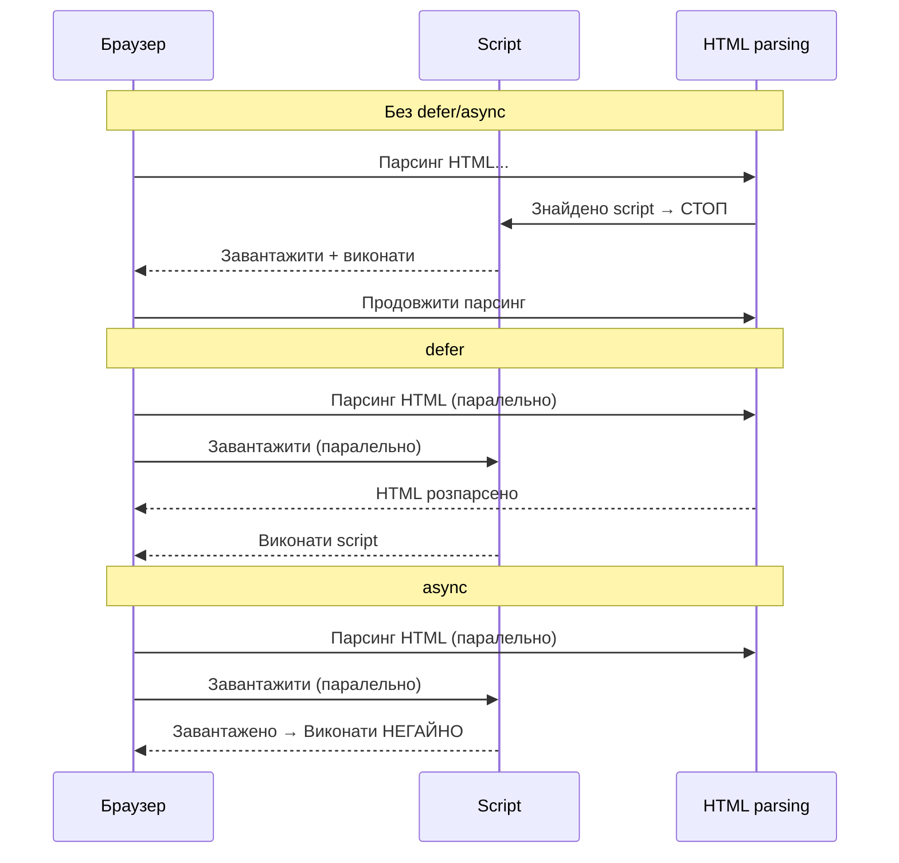

# Мультимедіа та розширені елементи HTML

## Коли текст недостатній

1993 рік. Марк Андрессен додає тег `` у браузер Mosaic — і вперше в інтернеті з'являються зображення у тексті. Колеги кричали на нього: «Це зламає простоту вебу!». Але саме `` перетворив WWW із академічної мережі на масовий феномен.

З тих пір шлях був довгим: Flash, QuickTime, RealPlayer, ActiveX — кожен намагався принести відео і звук у браузер через плагіни. У 2007 році Стів Джобс оголосив, що iPhone не підтримуватиме Flash. Це підштовхнуло до стандартизації — і у HTML5 з'явилися `<video>` та `<audio>`.

Сьогодні ми розберемо всю екосистему мультимедіа в HTML: від нативного відео до `<canvas>`, від `<iframe>` до `<template>`.

---

## `<video>` — відеоплеєр

### Що каже специфікація

`<video>` (_video_) є **embedded content** та **interactive content** (якщо є атрибути керування). Це замінний елемент (_replaced element_): його розміри визначаються зовнішнім ресурсом — відеофайлом.

**Content model:** нуль або більше `<source>`, нуль або більше `<track>`, потім _transparent_ content (якщо немає атрибута `src`).

### Базовий синтаксис

```html
<!-- Мінімальний варіант -->
<video src="/videos/intro.mp4" controls></video>

<!-- Рекомендований варіант: з резервними форматами -->
<video controls width="1280" height="720" poster="/images/video-poster.jpg">
    <!-- Браузер вибирає перший формат, який підтримує -->
    <source src="/videos/intro.av1.mp4" type="video/mp4; codecs=av01" />
    <source src="/videos/intro.vp9.webm" type="video/webm; codecs=vp9" />
    <source src="/videos/intro.h264.mp4" type="video/mp4; codecs=avc1" />

    <!-- Субтитри (рекомендовано для доступності) -->
    <track kind="subtitles" src="/subtitles/intro.uk.vtt" srclang="uk" label="Українська" default />
    <track kind="subtitles" src="/subtitles/intro.en.vtt" srclang="en" label="English" />

    <!-- Резервний текст для браузерів без підтримки <video> -->
    <p>
        Ваш браузер не підтримує HTML-відео.
        <a href="/videos/intro.mp4" download>Завантажте відео</a>.
    </p>
</video>
```

### Атрибути `<video>`

::field-group

::field{name="src" type="string"}
URL відеофайлу. Альтернативно — використовуйте `<source>` для кількох форматів.
::

::field{name="controls" type="boolean"}
Показати нативні елементи керування браузера (play/pause, гучність, повноекранний режим).
::

::field{name="autoplay" type="boolean"}
Автоматичне відтворення. **Більшість браузерів блокують** без `muted`. Обмежте використання.
::

::field{name="muted" type="boolean"}
Вимкнути звук за замовчуванням. Дозволяє `autoplay` у більшості браузерів.
::

::field{name="loop" type="boolean"}
Циклічне відтворення (повторювати нескінченно).
::

::field{name="poster" type="string"}
URL зображення-обкладинки, яке відображається до початку відтворення.
::

::field{name="preload" type="string"}
`none` — не завантажувати; `metadata` — лише метадані (тривалість, розміри); `auto` — браузер вирішує.
::

::field{name="width / height" type="number"}
Розміри відеоелемента в пікселях. Важливо для запобігання CLS.
::

::field{name="playsinline" type="boolean"}
На iOS дозволяє відтворення без повноекранного режиму (для відео у фоні або в картці).
::

::field{name="crossorigin" type="string"}
`anonymous` або `use-credentials` — для CORS при завантаженні з іншого домену.
::

::

### Відмінності кодеків

| Кодек            | Контейнер | Підтримка   | Якість/розмір | Коли                    |
| ---------------- | --------- | ----------- | ------------- | ----------------------- |
| **H.264** (AVC)  | MP4       | ✅ Всі      | Середня       | Максимальна сумісність  |
| **H.265** (HEVC) | MP4       | ⚠️ Обмежена | Відмінна      | Safari, платна ліцензія |
| **VP9**          | WebM      | ✅ Сучасні  | Добра         | YouTube, Chrome         |
| **AV1**          | MP4/WebM  | ✅ Зростає  | Найкраща      | Майбутнє, YouTube 4K    |

::tip
Для найширшої сумісності: три `<source>` — AV1 → VP9 (WebM) → H.264 (MP4). Браузер завантажить лише обраний формат.
::

### Hero-відео у фоні

```html
<!-- Відео як фонова анімація (без звуку, без контролів) -->
<video autoplay muted loop playsinline preload="auto" aria-hidden="true" width="1920" height="1080">
    <source src="/videos/hero-bg.av1.mp4" type="video/mp4; codecs=av01" />
    <source src="/videos/hero-bg.vp9.webm" type="video/webm; codecs=vp9" />
    <source src="/videos/hero-bg.h264.mp4" type="video/mp4" />
</video>
<!-- aria-hidden="true" — декоративне відео, скринрідер ігнорує -->
```

---

## `<track>` — субтитри та текстові доріжки

`<track>` (_track_ — доріжка) підключає **текстові доріжки** до `<video>` або `<audio>`. Файл повинен бути у форматі **WebVTT** (`.vtt`).

### Значення атрибута `kind`

- `subtitles` — переклад діалогів для тих, хто не розуміє мову відео
- `captions` — субтитри для глухих: діалоги + звукові ефекти
- `descriptions` — описи для незрячих (зачитує скринрідер)
- `chapters` — розділи для навігації по відео
- `metadata` — дані для JavaScript (не відображаються)

```vtt
WEBVTT

00:00:00.000 --> 00:00:05.000
Привіт! Сьогодні ми розглянемо семантичний HTML.

00:00:05.500 --> 00:00:12.000
Семантика — це відповідність між виглядом і змістом елемента.

00:00:12.500 --> 00:00:18.000
[Звук клавіатури] Розробник відкриває редактор коду.
```

```html
<video controls width="800" height="450">
    <source src="/lesson.mp4" type="video/mp4" />

    <!-- Субтитри (переклад) -->
    <track kind="subtitles" src="/tracks/uk.vtt" srclang="uk" label="Українська" default />
    <track kind="subtitles" src="/tracks/en.vtt" srclang="en" label="English" />

    <!-- Captions (для глухих) -->
    <track kind="captions" src="/tracks/uk-captions.vtt" srclang="uk" label="Субтитри (UK)" />

    <!-- Розділи відео -->
    <track kind="chapters" src="/tracks/chapters.vtt" srclang="uk" />
</video>
```

::caution
Відео без субтитрів порушує WCAG 2.1, критерій 1.2.2 (рівень A). Для будь-якого інформаційного відео субтитри є **обов'язковою вимогою доступності**.
::

---

## `<audio>` — аудіоплеєр

`<audio>` (_audio_ — звук) — аналог `<video>` для звуку. Підтримує ті самі атрибути (`controls`, `autoplay`, `muted`, `loop`, `preload`) та дочірні `<source>` і `<track>`.

```html
<!-- Подкаст з кількома форматами -->
<figure>
    <figcaption>Подкаст «DevCast» — Випуск #42: Vue vs React у 2024</figcaption>
    <audio controls preload="metadata">
        <source src="/podcast/ep42.opus" type="audio/ogg; codecs=opus" />
        <source src="/podcast/ep42.mp3" type="audio/mpeg" />
        <source src="/podcast/ep42.aac" type="audio/aac" />
        <p>
            Ваш браузер не підтримує HTML-аудіо.
            <a href="/podcast/ep42.mp3" download>Завантажити MP3</a>.
        </p>
    </audio>
</figure>

<!-- Звуковий ефект без контролів (керування через JS) -->
<audio id="success-sound" preload="auto">
    <source src="/sounds/success.ogg" type="audio/ogg" />
    <source src="/sounds/success.mp3" type="audio/mpeg" />
</audio>
```

### Аудіоформати

| Формат         | MIME-тип                 | Підтримка        | Коли                      |
| -------------- | ------------------------ | ---------------- | ------------------------- |
| **MP3**        | `audio/mpeg`             | ✅ Всі           | Найбезпечніший fallback   |
| **AAC**        | `audio/aac`              | ✅ Всі           | Кращий за MP3 за якістю   |
| **Opus**       | `audio/ogg; codecs=opus` | ✅ Сучасні       | Найкраще стиснення        |
| **FLAC**       | `audio/flac`             | ✅ Сучасні       | Без втрат, великий розмір |
| **OGG Vorbis** | `audio/ogg`              | ⚠️ Safari погано | Замінений Opus            |

---

## `<iframe>` — вбудований фрейм

`<iframe>` (_inline frame_ — вбудований фрейм) вставляє **вміст іншого HTML-документа** в поточну сторінку. Це ціла пісочниця — окреме вікно перегляду зі своїм HTML, CSS, JavaScript.

### Атрибути `<iframe>`

::field-group

::field{name="src" type="string"}
URL документа для відображення.
::

::field{name="srcdoc" type="string"}
HTML-код безпосередньо як вміст iframe (вищий пріоритет над `src`).
::

::field{name="width / height" type="number"}
Розміри. Рекомендовано для запобігання CLS.
::

::field{name="title" type="string"}
Описовий заголовок фрейму. **Обов'язковий для доступності** — скринрідер оголосить його.
::

::field{name="allow" type="string"}
Permissions Policy: список дозволів (camera, microphone, payment, fullscreen тощо).
::

::field{name="sandbox" type="string"}
Ізоляція: порожній атрибут = максимальне обмеження. Значення додають дозволи.
::

::field{name="loading" type="string"}
`eager` або `lazy` — відкладене завантаження iframe.
::

::field{name="referrerpolicy" type="string"}
Керування заголовком Referer: `no-referrer`, `strict-origin-when-cross-origin` та ін.
::

::

### Вбудовані відео з YouTube

```html
<!-- YouTube (рекомендований спосіб) -->
<figure>
    <iframe
        width="560"
        height="315"
        src="https://www.youtube-nocookie.com/embed/dQw4w9WgXcQ"
        title="Назва відео — Rick Astley"
        allow="accelerometer; autoplay; clipboard-write; encrypted-media; gyroscope; picture-in-picture; web-share"
        allowfullscreen
        loading="lazy"
        referrerpolicy="strict-origin-when-cross-origin"
        frameborder="0"
    ></iframe>
    <figcaption>Відео: Rick Astley — Never Gonna Give You Up</figcaption>
</figure>

<!-- youtube-nocookie.com не встановлює кукі до кліку — кращий вибір для privacy -->
```

### Атрибут `sandbox`

```html
<!-- Максимальна ізоляція (порожній sandbox) -->
<iframe src="https://untrusted-site.com" sandbox title="Ізольований контент"></iframe>

<!-- Дозволити лише форми та скрипти -->
<iframe src="/widget/calculator.html" sandbox="allow-forms allow-scripts" title="Калькулятор"></iframe>

<!-- Повний список значень sandbox -->
<!--
  allow-downloads       — завантаження файлів
  allow-forms           — відправка форм
  allow-modals          — alert(), confirm(), prompt()
  allow-orientation-lock — блокування орієнтації
  allow-popups          — window.open(), target="_blank"
  allow-same-origin     — зберігати origin (НЕ рекомендовано з allow-scripts!)
  allow-scripts         — виконання JavaScript
  allow-top-navigation  — навігація верхнього рівня
-->
```

::warning
**Ніколи не комбінуйте** `sandbox="allow-scripts allow-same-origin"` — це фактично скасовує sandbox, бо скрипт може видалити атрибут `sandbox` через DOM.
::

### `srcdoc` — HTML напряму у фреймі

```html
<!-- Вміст безпосередньо в атрибуті — ізольований від основної сторінки -->
<iframe
    title="Пісочниця для HTML"
    sandbox="allow-scripts"
    srcdoc="
    <!DOCTYPE html>
    <html>
      <body>
        <h1>Hello from iframe!</h1>
        <script>document.body.style.background = 'lightyellow'</script>
      </body>
    </html>
  "
></iframe>
```

---

## `<canvas>` — 2D та 3D графіка

`<canvas>` (_canvas_ — полотно) надає **растровий засіб для малювання через JavaScript**. За замовчуванням прозорий, 300×150 пікселів.

- Графіка, анімація, ігри (2D через Canvas API, 3D через WebGL/WebGPU)
- Не семантичний — вміст невидимий для скринрідерів

```html
<!-- Обов'язково width і height як атрибути (а не через CSS!) -->
<!-- Розміри через CSS масштабують полотно, а не збільшують роздільну здатність -->
<canvas id="my-canvas" width="800" height="600" aria-label="Анімована діаграма завантаженості сервера" role="img">
    <!-- Запасний вміст для браузерів без підтримки (рідко актуально) -->
    Діаграма завантаженості недоступна. <a href="/stats.csv">Завантажити дані</a>.
</canvas>

<script>
    const canvas = document.getElementById('my-canvas')
    const ctx = canvas.getContext('2d')

    // Простий прямокутник
    ctx.fillStyle = '#3b82f6'
    ctx.fillRect(50, 50, 200, 100)

    // Текст
    ctx.font = '24px Inter, sans-serif'
    ctx.fillStyle = '#ffffff'
    ctx.fillText('TechUA', 100, 110)

    // Дуга/коло
    ctx.beginPath()
    ctx.arc(400, 300, 120, 0, Math.PI * 2)
    ctx.strokeStyle = '#10b981'
    ctx.lineWidth = 4
    ctx.stroke()

    // Градієнт
    const gradient = ctx.createLinearGradient(0, 0, 800, 0)
    gradient.addColorStop(0, '#6366f1')
    gradient.addColorStop(1, '#8b5cf6')
    ctx.fillStyle = gradient
    ctx.fillRect(0, 500, 800, 100)
</script>
```

::note
**Canvas vs SVG**: Canvas — пікселі (растр), SVG — вектор. Canvas швидший для великої кількості динамічних об'єктів (ігри, частинки). SVG масштабується без втрат і доступніший для семантики та ARIA.
::

---

## `<svg>` — векторна графіка

`<svg>` (_Scalable Vector Graphics_ — масштабована векторна графіка) дозволяє вбудовувати **SVG-документ безпосередньо в HTML**. На відміну від ``, inline SVG:

- Доступний для CSS (ми можемо стилізувати через CSS-класи)
- Доступний для JavaScript (живий DOM)
- Підтримує ARIA-атрибути для доступності

```html
<!-- Проста іконка "зірка" — inline SVG -->
<svg
    xmlns="http://www.w3.org/2000/svg"
    width="24"
    height="24"
    viewBox="0 0 24 24"
    aria-label="Позначено як улюблене"
    role="img"
    fill="currentColor"
>
    <title>Зірка (улюблене)</title>
    <path d="M12 2l3.09 6.26L22 9.27l-5 4.87 1.18 6.88L12 17.77l-6.18 3.25L7 14.14 2 9.27l6.91-1.01L12 2z" />
</svg>

<!-- Логотип компанії — inline SVG для доступності -->
<a href="/">
    <svg
        xmlns="http://www.w3.org/2000/svg"
        width="160"
        height="40"
        viewBox="0 0 160 40"
        role="img"
        aria-labelledby="logo-title"
    >
        <title id="logo-title">TechUA — Повернутися на головну</title>
        <text x="10" y="28" font-family="Inter, sans-serif" font-size="24" font-weight="700">TechUA</text>
    </svg>
</a>

<!-- Складніша SVG-діаграма -->
<figure>
    <svg
        xmlns="http://www.w3.org/2000/svg"
        width="400"
        height="200"
        viewBox="0 0 400 200"
        aria-labelledby="chart-title chart-desc"
        role="img"
    >
        <title id="chart-title">Статистика відвідувань за кварталами 2024</title>
        <desc id="chart-desc">Стовпчаста діаграма: Q1 — 12K, Q2 — 18K, Q3 — 24K, Q4 — 31K відвідувань.</desc>

        <!-- Стовпці -->
        <rect x="20" y="120" width="60" height="60" fill="#6366f1" />
        <rect x="110" y="90" width="60" height="90" fill="#6366f1" />
        <rect x="200" y="60" width="60" height="120" fill="#6366f1" />
        <rect x="290" y="30" width="60" height="150" fill="#6366f1" />

        <!-- Підписи -->
        <text x="50" y="195" text-anchor="middle" font-size="12">Q1</text>
        <text x="140" y="195" text-anchor="middle" font-size="12">Q2</text>
        <text x="230" y="195" text-anchor="middle" font-size="12">Q3</text>
        <text x="320" y="195" text-anchor="middle" font-size="12">Q4</text>
    </svg>
    <figcaption>Рис. 1. Зростання аудиторії TechUA у 2024 році по кварталах.</figcaption>
</figure>
```

---

## `<embed>` та `<object>` — застарілі плагіни

`<embed>` та `<object>` використовувались для вбудовування Flash, PDF, плагінів. У сучасному HTML їхнє використання мінімальне.

```html
<!-- <embed> — void element, завжди одинарний тег -->
<!-- Сьогодні: PDF у деяких браузерах (але краще <iframe>) -->
<embed
    src="/documents/brochure.pdf"
    type="application/pdf"
    width="800"
    height="600"
    title="Брошура компанії TechUA (PDF)"
/>

<!-- <object> — контейнер з дочірнім резервним вмістом -->
<object data="/documents/report.pdf" type="application/pdf" width="800" height="600" title="Звіт 2024 (PDF)">
    <!-- Запасний вміст якщо браузер не може відобразити -->
    <p>PDF-переглядач недоступний. <a href="/documents/report.pdf" download>Завантажити PDF</a>.</p>
</object>
```

::warning
Для вбудовування PDF у сучасних проєктах надавайте перевагу `<iframe>` або бібліотекам на кшталт PDF.js. `<embed>` та `<object>` зберегли обмежену підтримку, але `<object>` для Flash повністю застарів.
::

---

## `<template>` та `<slot>` — Web Components

### `<template>` — HTML-шаблон

`<template>` (_template_ — шаблон) містить **фрагмент HTML, який не рендериться при завантаженні сторінки**, але доступний через JavaScript для клонування та вставки.

- Вміст `<template>` знаходиться у **DocumentFragment** — ізольований від основного документа
- Не виконуються скрипти, не завантажуються ресурси, не застосовуються стилі

```html
<!-- Шаблон картки товару -->
<template id="product-card-template">
    <article class="product-card">
        <figure>
            
        </figure>
        <h3 data-name></h3>
        <p data-description></p>
        <p><strong data-price></strong></p>
        <button type="button">Додати до кошика</button>
    </article>
</template>

<!-- Контейнер для відображення карток -->
<section id="products-grid" aria-label="Каталог товарів">
    <!-- Картки будуть вставлені тут через JS -->
</section>

<script>
    const template = document.getElementById('product-card-template')
    const container = document.getElementById('products-grid')

    const products = [
        {
            name: 'MacBook Pro 14"',
            price: '89 999 грн',
            image: '/images/mbp.jpg',
            description: 'M3 Pro, 18 ГБ RAM, 512 ГБ SSD',
            alt: 'MacBook Pro 14 срібний',
        },
        {
            name: 'iPad Pro 11"',
            price: '42 999 грн',
            image: '/images/ipad.jpg',
            description: 'M4, 256 ГБ, Wi-Fi + Cellular',
            alt: 'iPad Pro 11 сірий космос',
        },
    ]

    products.forEach((product) => {
        // Клонуємо template (true = глибоке клонування)
        const clone = template.content.cloneNode(true)

        clone.querySelector('img').src = product.image
        clone.querySelector('img').alt = product.alt
        clone.querySelector('[data-name]').textContent = product.name
        clone.querySelector('[data-description]').textContent = product.description
        clone.querySelector('[data-price]').textContent = product.price

        container.appendChild(clone)
    })
</script>
```

### `<slot>` — слот для Web Components

`<slot>` використовується всередині Shadow DOM для **розміщення контенту з основного документа** у шаблоні компонента:

```html
<!-- Визначення customs element -->
<template id="info-card">
    <style>
        :host {
            display: block;
            border: 1px solid #e5e7eb;
            border-radius: 8px;
            padding: 16px;
        }
        ::slotted(h3) {
            color: #3b82f6;
        }
    </style>
    <slot name="header"><h3>Заголовок за замовчуванням</h3></slot>
    <slot><!-- Основний вміст --></slot>
    <slot name="footer"></slot>
</template>

<!-- Використання компонента (після реєстрації через JS) -->
<info-card>
    <h3 slot="header">Новини тижня</h3>
    <p>React 19 вийшов з офіційною підтримкою Server Components...</p>
    <a href="/read-more" slot="footer">Читати далі</a>
</info-card>
```

---

## `<script>` — скрипти

`<script>` вставляє або підключає JavaScript. Атрибути впливають на **момент виконання**:

```html
<!-- 1. Синхронний (блокує рендеринг) — застаріла практика -->
<script src="/bundle.js"></script>

<!-- 2. defer: завантажує паралельно, виконує ПІСЛЯ парсингу HTML -->
<!-- Зберігає порядок виконання скриптів -->
<script src="/app.js" defer></script>

<!-- 3. async: завантажує паралельно, виконує ОДРАЗУ після завантаження -->
<!-- НЕ гарантує порядок виконання! -->
<script src="/analytics.js" async></script>

<!-- 4. type="module" — ES-модуль (defer за замовчуванням) -->
<script type="module" src="/main.mjs"></script>

<!-- 5. Інлайн-скрипт -->
<script>
    console.log('Inline script!')
</script>

<!-- 6. JSON-дані (type="application/json") — не виконується -->
<script type="application/json" id="initial-data">
    { "user": "Ivan", "theme": "dark", "lang": "uk" }
</script>
```

### Порівняння: async vs defer

::mermaid



::

::tip
**Правило вибору**: для більшості скриптів — `defer`. Для незалежних скриптів (аналітика, реклама) — `async`. Для старих бібліотек без залежностей від DOM — `async`. `defer` зберігає порядок, `async` — ні.
::

---

## `<noscript>` — резервний вміст без JS

`<noscript>` відображає вміст, коли JavaScript **вимкнений або не підтримується**:

```html
<head>
    <!-- У <head>: може містити <link>, <style>, <meta> -->
    <noscript>
        <meta http-equiv="refresh" content="0; url=/no-js-version.html" />
    </noscript>
</head>

<body>
    <!-- У <body>: будь-який HTML -->
    <noscript>
        <div style="padding: 1rem; background: #fef3c7; border: 1px solid #f59e0b;">
            ⚠️ JavaScript вимкнено. Деякі функції сайту можуть бути недоступні.
            <a href="/help/enable-js">Як увімкнути JavaScript</a>.
        </div>
    </noscript>
    <!-- ... -->
</body>
```

---

## `<link>` — зв'язні ресурси

`<link>` у `<head>` визначає відносини між документом та зовнішніми ресурсами:

```html
<head>
    <!-- CSS -->
    <link rel="stylesheet" href="/styles/main.css" />

    <!-- Preload — завантажити ресурс з найвищим пріоритетом -->
    <!-- Критичні шрифти, hero-зображення, critical JS -->
    <link rel="preload" href="/fonts/Inter-var.woff2" as="font" type="font/woff2" crossorigin />
    <link rel="preload" href="/images/hero.avif" as="image" fetchpriority="high" />

    <!-- Prefetch — заздалегідь завантажити наступну сторінку (низький пріоритет) -->
    <link rel="prefetch" href="/dashboard.html" as="document" />

    <!-- DNS prefetch — заздалегідь резолвити DNS -->
    <link rel="dns-prefetch" href="//fonts.googleapis.com" />
    <link rel="dns-prefetch" href="//analytics.example.com" />

    <!-- Preconnect — встановити з'єднання заздалегідь (DNS + TLS + TCP) -->
    <link rel="preconnect" href="https://fonts.googleapis.com" />
    <link rel="preconnect" href="https://fonts.gstatic.com" crossorigin />

    <!-- Canonical — вказати основну URL сторінки (SEO) -->
    <link rel="canonical" href="https://techua.com/articles/semantic-html" />

    <!-- Alternate — версії сторінки іншими мовами (hreflang) -->
    <link rel="alternate" hreflang="uk" href="https://techua.com/uk/articles/semantic-html" />
    <link rel="alternate" hreflang="en" href="https://techua.com/en/articles/semantic-html" />
    <link rel="alternate" hreflang="x-default" href="https://techua.com/articles/semantic-html" />

    <!-- RSS/Atom feed -->
    <link rel="alternate" type="application/rss+xml" title="TechUA RSS" href="/rss.xml" />

    <!-- Favicon -->
    <link rel="icon" href="/favicon.ico" sizes="32x32" />
    <link rel="icon" href="/favicon.svg" type="image/svg+xml" />
    <link rel="apple-touch-icon" href="/apple-touch-icon.png" sizes="180x180" />

    <!-- Web App Manifest (PWA) -->
    <link rel="manifest" href="/manifest.webmanifest" />

    <!-- Номерні сторінки (для SEO пагінації) -->
    <link rel="prev" href="/blog?page=2" />
    <link rel="next" href="/blog?page=4" />
</head>
```

---

## `<meta>` — метадані документа

```html
<head>
    <!-- Кодування — ЗАВЖДИ першим тегом у <head> -->
    <meta charset="UTF-8" />

    <!-- Viewport — обов'язково для мобільних -->
    <meta name="viewport" content="width=device-width, initial-scale=1.0" />

    <!-- Стандартні SEO -->
    <meta name="description" content="Стислий опис сторінки, 120–160 символів." />
    <meta name="keywords" content="html, css, веб-розробка" />
    <!-- Ігнорується Google -->
    <meta name="author" content="Іван Коваленко" />
    <meta name="robots" content="index, follow" />
    <!-- Дозволити індексацію -->
    <meta name="robots" content="noindex, nofollow" />
    <!-- Заборонити -->

    <!-- Theme color — колір рядка браузера (mobile) -->
    <meta name="theme-color" content="#3b82f6" />
    <meta name="theme-color" content="#1e1b4b" media="(prefers-color-scheme: dark)" />

    <!-- Color scheme — підтримка dark mode -->
    <meta name="color-scheme" content="light dark" />

    <!-- Referrer policy -->
    <meta name="referrer" content="strict-origin-when-cross-origin" />

    <!-- HTTP equiv (симулює HTTP-заголовки) -->
    <meta http-equiv="X-UA-Compatible" content="IE=edge" />
    <!-- Застаріло -->
    <meta http-equiv="Content-Security-Policy" content="default-src 'self'" />
    <meta http-equiv="refresh" content="30" />
    <!-- Оновити через 30 секунд -->
</head>
```

---

## Практичні завдання

::accordion

::accordion-item{label="🟢 Рівень 1: Базовий — Сторінка з медіа" icon="i-lucide-circle"}

Створіть HTML-сторінку освітньої платформи — сторінку уроку:

1. `<video controls>` з трьома `<source>` (AV1 → VP9 → H.264) + `<track>` субтитри (UK/EN) + `poster`
2. `<audio controls>` з MP3 та Opus — аудіоверсія уроку в `<figure>` + `<figcaption>`
3. `<iframe>` з YouTube без cookies (youtube-nocookie.com) + `title`, `loading="lazy"`
4. Inline SVG-іконки (play, bookmark, share) з належними `aria-label` або `role="img"` + `<title>`

::

::accordion-item{label="🟡 Рівень 2: Логіка — Canvas та template" icon="i-lucide-circle"}

Реалізуйте динамічний каталог:

1. `<template id="card">` — HTML-шаблон картки з `<figure>`, ``, `<h3>`, `<p>`, `<button>`
2. JavaScript: отримайте масив із 6 об'єктів, клонуйте template для кожного, заповніть дані, вставте у `<section aria-label="Каталог">`
3. `<canvas id="stats" width="600" height="200">` — намалюйте просту bar-chart: 6 стовпців для кожного товару (кількість переглядів), кольори, підписи (використайте Canvas 2D API)
4. `<noscript>` з HTML-таблицею, як резервний варіант для canvas/template

::

::accordion-item{label="🔴 Рівень 3: Архітектура — Медіафіча лендингу" icon="i-lucide-circle"}

Реалізуйте лендинг з повним мультимедійним секцією:

1. **Hero**: `<video autoplay muted loop playsinline>` як фон + `aria-hidden="true"`, поверх — текст у `<div>`, `<picture>` для постера (mobile/desktop)
2. **Плеєр курсу**: `<video>` з власними кнопками (play/pause, fullscreen через JS + `<button>`), програгрес-бар через `<progress>`, поточний час через `<output>`, субтитри через `<track>`
3. **Технологічний стек**: inline SVG для логотипів (React, Vue, TypeScript) — 4 іконки з `<title>`, `<desc>`, `aria-labelledby`
4. **Stats-секція**: `<canvas>` для лінійного графіку (останні 7 днів реєстрацій)
5. **Embed з Maps**: `<iframe>` з Google Maps + `sandbox`, `allow`, правильний `title`
6. `<head>`: `preload` для hero-відео, `preconnect` для CDN, `dns-prefetch`, `canonical`, `alternate` для двох мов

::

::

---

## Комплексний приклад від А до Я

**Тема**: Онлайн-школа «CodeCamp UA» — сторінка відеоуроку з усіма мультимедійними елементами.

```html
<!DOCTYPE html>
<html lang="uk">
    <head>
        <meta charset="UTF-8" />
        <meta name="viewport" content="width=device-width, initial-scale=1.0" />
        <meta
            name="description"
            content="Відеоурок «Семантичний HTML» — CodeCamp UA. Тривалість 45 хв, рівень: початковий."
        />
        <meta name="author" content="Марія Коваль" />
        <meta name="theme-color" content="#4f46e5" />
        <title>Семантичний HTML — Урок 6 | CodeCamp UA</title>
        <link rel="canonical" href="https://codecamp.ua/courses/html/lesson-6" />
        <link rel="alternate" hreflang="uk" href="https://codecamp.ua/uk/courses/html/lesson-6" />
        <link rel="alternate" hreflang="en" href="https://codecamp.ua/en/courses/html/lesson-6" />
        <link rel="icon" href="/favicon.svg" type="image/svg+xml" />
        <link rel="preload" href="/videos/lesson-6-poster.avif" as="image" fetchpriority="high" />
        <link rel="preconnect" href="https://cdn.codecamp.ua" />
        <link rel="dns-prefetch" href="//www.youtube-nocookie.com" />
        <link rel="stylesheet" href="/styles/course.css" />
    </head>
    <body>
        <header>
            <a href="/">
                <!-- Inline SVG логотип -->
                <svg
                    xmlns="http://www.w3.org/2000/svg"
                    width="140"
                    height="36"
                    viewBox="0 0 140 36"
                    role="img"
                    aria-labelledby="logo-label"
                >
                    <title id="logo-label">CodeCamp UA — Повернутися на головну</title>
                    <rect width="140" height="36" rx="6" fill="#4f46e5" />
                    <text
                        x="70"
                        y="25"
                        text-anchor="middle"
                        fill="white"
                        font-family="Inter,sans-serif"
                        font-size="14"
                        font-weight="700"
                    >
                        CodeCamp UA
                    </text>
                </svg>
            </a>

            <nav aria-label="Головне меню">
                <ul>
                    <li><a href="/courses">Курси</a></li>
                    <li><a href="/tracks">Треки</a></li>
                    <li><a href="/community">Спільнота</a></li>
                    <li><a href="/pricing">Ціни</a></li>
                </ul>
            </nav>
        </header>

        <main id="main-content">
            <!-- Навігаційний шлях -->
            <nav aria-label="Розташування в курсі">
                <ol>
                    <li><a href="/courses">Курси</a></li>
                    <li><a href="/courses/html-css">HTML і CSS для початківців</a></li>
                    <li aria-current="page">Урок 6: Семантичний HTML</li>
                </ol>
            </nav>

            <article>
                <header>
                    <hgroup>
                        <h1>Урок 6: Семантичний HTML</h1>
                        <p>Навчіться будувати структуровані, доступні та SEO-оптимізовані сторінки</p>
                    </hgroup>

                    <dl>
                        <dt>Інструктор</dt>
                        <dd>
                            <address>
                                <a href="/instructors/maria-koval" rel="author">Марія Коваль</a>
                            </address>
                        </dd>
                        <dt>Тривалість</dt>
                        <dd><time datetime="PT45M">45 хвилин</time></dd>
                        <dt>Рівень</dt>
                        <dd>Початковий</dd>
                        <dt>Опубліковано</dt>
                        <dd><time datetime="2024-11-10">10 листопада 2024</time></dd>
                    </dl>
                </header>

                <!-- ===== ВІДЕОПЛЕЄР ===== -->
                <section aria-labelledby="video-section">
                    <h2 id="video-section">Відео уроку</h2>

                    <figure>
                        <video
                            id="lesson-video"
                            controls
                            preload="metadata"
                            width="1280"
                            height="720"
                            poster="/videos/lesson-6-poster.avif"
                        >
                            <!-- AV1: найкраще стиснення, сучасні браузери -->
                            <source
                                src="https://cdn.codecamp.ua/videos/lesson-6.av1.mp4"
                                type="video/mp4; codecs=av01.0.05M.08"
                            />
                            <!-- VP9: Chrome, Firefox, Edge -->
                            <source
                                src="https://cdn.codecamp.ua/videos/lesson-6.vp9.webm"
                                type="video/webm; codecs=vp9"
                            />
                            <!-- H.264: максимальна сумісність -->
                            <source src="https://cdn.codecamp.ua/videos/lesson-6.h264.mp4" type="video/mp4" />

                            <!-- Субтитри -->
                            <track
                                kind="captions"
                                src="/tracks/lesson-6.uk.vtt"
                                srclang="uk"
                                label="Субтитри (Українська)"
                                default
                            />
                            <track
                                kind="subtitles"
                                src="/tracks/lesson-6.en.vtt"
                                srclang="en"
                                label="English subtitles"
                            />

                            <!-- Розділи -->
                            <track kind="chapters" src="/tracks/lesson-6-chapters.vtt" srclang="uk" />

                            <p>
                                Ваш браузер не підтримує HTML-відео.
                                <a href="https://cdn.codecamp.ua/videos/lesson-6.h264.mp4" download>
                                    Завантажити відео (MP4) </a
                                >.
                            </p>
                        </video>
                        <figcaption>
                            Урок 6 — Семантичний HTML. Тривалість: <time datetime="PT45M">45 хвилин</time>.
                        </figcaption>
                    </figure>

                    <!-- Аудіоверсія -->
                    <details>
                        <summary>🎧 Слухати аудіоверсію уроку</summary>
                        <figure>
                            <figcaption>Урок 6: Семантичний HTML — аудіо (MP3, 28 МБ)</figcaption>
                            <audio controls preload="metadata">
                                <source
                                    src="https://cdn.codecamp.ua/audio/lesson-6.opus"
                                    type="audio/ogg; codecs=opus"
                                />
                                <source src="https://cdn.codecamp.ua/audio/lesson-6.mp3" type="audio/mpeg" />
                                <p>
                                    <a href="https://cdn.codecamp.ua/audio/lesson-6.mp3" download> Завантажити MP3 </a>
                                </p>
                            </audio>
                        </figure>
                    </details>
                </section>

                <!-- ===== РЕСУРСИ ===== -->
                <section aria-labelledby="resources-heading">
                    <h2 id="resources-heading">Матеріали до уроку</h2>

                    <ul>
                        <li>
                            <a href="/files/lesson-6-slides.pdf" download="semantic-html-slides.pdf">
                                Завантажити слайди (PDF, 2.4 МБ)
                            </a>
                        </li>
                        <li>
                            <a
                                href="https://html.spec.whatwg.org/multipage/sections.html"
                                target="_blank"
                                rel="noopener noreferrer external"
                            >
                                HTML Living Standard: Sections ↗
                            </a>
                        </li>
                        <li>
                            <a
                                href="https://developer.mozilla.org/uk/docs/Web/HTML/Element"
                                target="_blank"
                                rel="noopener noreferrer external"
                            >
                                MDN: HTML-елементи (Українська) ↗
                            </a>
                        </li>
                    </ul>
                </section>

                <!-- ===== ДОДАТКОВЕ ВІДЕО ===== -->
                <section aria-labelledby="bonus-heading">
                    <h2 id="bonus-heading">Бонус: виступ на JSFrontend 2024</h2>

                    <figure>
                        <iframe
                            width="560"
                            height="315"
                            src="https://www.youtube-nocookie.com/embed/ABC123xyz"
                            title="Марія Коваль — Семантичний HTML у реальних проєктах (JSFrontend 2024)"
                            allow="accelerometer; autoplay; clipboard-write; encrypted-media; gyroscope; picture-in-picture"
                            allowfullscreen
                            loading="lazy"
                            referrerpolicy="strict-origin-when-cross-origin"
                        ></iframe>
                        <figcaption>
                            Виступ Марії Коваль на конференції JSFrontend 2024.
                            <time datetime="PT25M">25 хвилин</time>.
                        </figcaption>
                    </figure>
                </section>

                <!-- ===== CANVAS ГРАФІК ===== -->
                <section aria-labelledby="progress-heading">
                    <h2 id="progress-heading">Прогрес учнів</h2>

                    <figure>
                        <canvas
                            id="completion-chart"
                            width="600"
                            height="200"
                            role="img"
                            aria-label="Графік завершення уроку: 2340 учнів завершили повністю, 890 наполовину, 430 тільки почали"
                        >
                            <noscript>
                                <table>
                                    <caption>
                                        Статистика завершення Уроку 6
                                    </caption>
                                    <thead>
                                        <tr>
                                            <th scope="col">Статус</th>
                                            <th scope="col">Кількість учнів</th>
                                        </tr>
                                    </thead>
                                    <tbody>
                                        <tr>
                                            <th scope="row">Завершили повністю</th>
                                            <td>2 340</td>
                                        </tr>
                                        <tr>
                                            <th scope="row">Наполовину</th>
                                            <td>890</td>
                                        </tr>
                                        <tr>
                                            <th scope="row">Тільки почали</th>
                                            <td>430</td>
                                        </tr>
                                    </tbody>
                                </table>
                            </noscript>
                        </canvas>
                        <figcaption>Рис. 1. Статистика проходження Уроку 6 станом на листопад 2024.</figcaption>
                    </figure>
                </section>

                <footer>
                    <p>Знайшли помилку? <a href="mailto:content@codecamp.ua">Повідомте нас</a>.</p>
                    <p>
                        <small>
                            Матеріал публікується за ліцензією
                            <a
                                href="https://creativecommons.org/licenses/by-nc/4.0/"
                                rel="license"
                                target="_blank"
                                rel="noopener noreferrer"
                                >CC BY-NC 4.0</a
                            >.
                        </small>
                    </p>
                </footer>
            </article>

            <!-- ===== ASIDE: навігація по курсу ===== -->
            <aside aria-label="Навігація по курсу">
                <section>
                    <h2>Курс: HTML і CSS для початківців</h2>
                    <nav aria-label="Уроки курсу">
                        <ol>
                            <li><a href="/courses/html-css/lesson-1">Урок 1: Що таке HTML</a></li>
                            <li><a href="/courses/html-css/lesson-2">Урок 2: Форматування тексту</a></li>
                            <li><a href="/courses/html-css/lesson-3">Урок 3: Посилання та зображення</a></li>
                            <li><a href="/courses/html-css/lesson-4">Урок 4: Списки та таблиці</a></li>
                            <li><a href="/courses/html-css/lesson-5">Урок 5: Форми</a></li>
                            <li aria-current="page"><strong>Урок 6: Семантичний HTML</strong> (поточний)</li>
                            <li><a href="/courses/html-css/lesson-7">Урок 7: Мультимедіа ↗</a></li>
                        </ol>
                    </nav>
                </section>

                <section>
                    <h2>Ваш прогрес</h2>
                    <dl>
                        <dt>Завершено уроків</dt>
                        <dd>5 з 12</dd>
                        <dt>Прогрес курсу</dt>
                        <dd>
                            <progress value="5" max="12" aria-label="42% курсу завершено">42%</progress>
                            42%
                        </dd>
                    </dl>
                </section>
            </aside>
        </main>

        <footer>
            <nav aria-label="Підвал сайту">
                <ul>
                    <li><a href="/about">Про платформу</a></li>
                    <li><a href="/privacy">Конфіденційність</a></li>
                    <li><a href="/sitemap.xml">Карта сайту</a></li>
                    <li>
                        <a href="/rss.xml" type="application/rss+xml">RSS</a>
                    </li>
                </ul>
            </nav>
            <address>CodeCamp UA: <a href="mailto:hello@codecamp.ua">hello@codecamp.ua</a></address>
            <p>
                <small>&copy; <time datetime="2024">2024</time> CodeCamp UA</small>
            </p>
        </footer>

        <!-- Template для коментарів -->
        <template id="comment-template">
            <article class="comment">
                <header>
                    
                    <p><strong data-name></strong> · <time data-time></time></p>
                </header>
                <p data-text></p>
            </article>
        </template>

        <script defer src="/scripts/course-player.js"></script>
        <script defer src="/scripts/canvas-chart.js"></script>
        <script>
            // Canvas — статистика завершення
            window.addEventListener('DOMContentLoaded', () => {
                const canvas = document.getElementById('completion-chart')
                if (!canvas) return
                const ctx = canvas.getContext('2d')
                const data = [
                    { label: 'Завершили', value: 2340, color: '#10b981' },
                    { label: 'Наполовину', value: 890, color: '#f59e0b' },
                    { label: 'Почали', value: 430, color: '#6366f1' },
                ]
                const max = Math.max(...data.map((d) => d.value))
                data.forEach((item, i) => {
                    const barH = (item.value / max) * 150
                    const x = 60 + i * 180
                    ctx.fillStyle = item.color
                    ctx.fillRect(x, 180 - barH, 80, barH)
                    ctx.fillStyle = '#1f2937'
                    ctx.font = '13px Inter, sans-serif'
                    ctx.textAlign = 'center'
                    ctx.fillText(item.label, x + 40, 198)
                    ctx.fillText(item.value.toLocaleString('uk-UA'), x + 40, 175 - barH)
                })
            })
        </script>
    </body>
</html>
```

---

## Корисні посилання

- 📖 [HTML Living Standard: `<video>` та `<audio>`](https://html.spec.whatwg.org/multipage/media.html)
- 📖 [HTML Living Standard: `<iframe>`](https://html.spec.whatwg.org/multipage/iframe-embed-object.html)
- 📖 [HTML Living Standard: `<canvas>`](https://html.spec.whatwg.org/multipage/canvas.html)
- 📖 [HTML Living Standard: Scripting](https://html.spec.whatwg.org/multipage/scripting.html)
- 📖 [WebVTT специфікація](https://www.w3.org/TR/webvtt1/) — формат субтитрів
- 🔧 [CanIUse: AV1](https://caniuse.com/av1) — підтримка кодека
- 🔧 [WebVTT Validator](https://quuz.org/webvtt/) — перевірка файлів субтитрів
- 🔧 [Permissions Policy](https://www.permissionspolicy.com/) — генератор `allow` для `<iframe>`
- 🔧 [Canvas API MDN](https://developer.mozilla.org/en-US/docs/Web/API/Canvas_API/Tutorial)
