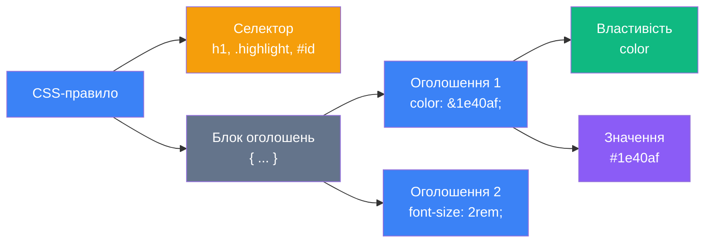
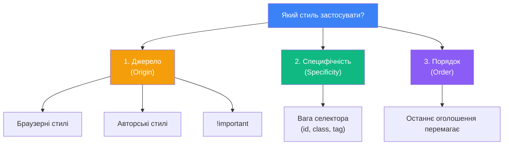

# Вступ до CSS. Селектори та специфічність

## Навіщо потрібен CSS?

Відкрийте будь-який сучасний сайт — **YouTube**, **Apple**, **Spotify** — і поспробуйте уявити його без кольорів, шрифтів, відступів та анімацій. Що залишиться? Голий текст із посиланнями — щось схоже на веб-сторінки 1993 року. Саме **CSS** (_Cascading Style Sheets_ — каскадні таблиці стилів) перетворює скелет HTML на повноцінний візуальний досвід.

У [попередньому занятті](/12.html-css/02.html-text-formatting) ми вже бачили шматочки CSS-коду: `color: red`, `text-decoration: line-through`, `background-color: #fef08a`. Тепер прийшов час зрозуміти цю мову системно — від першого правила до складних механізмів каскаду.

::card-group

::card{title="🎨 Зовнішній вигляд" icon="i-heroicons-paint-brush"}

CSS керує кольорами, шрифтами, фонами, тінями — усім, **як** виглядає сторінка.

::

::card{title="📐 Компонування" icon="i-heroicons-squares-2x2"}

CSS визначає розташування елементів на екрані: сітки, колонки, центрування, відступи.

::

::card{title="📱 Адаптивність" icon="i-heroicons-device-phone-mobile"}

CSS дозволяє одному сайту виглядати ідеально на телефоні, планшеті та десктопі.

::

::card{title="✨ Інтерактивність" icon="i-heroicons-cursor-arrow-ripple"}

CSS додає анімації, переходи, ефекти при наведенні — без жодного рядка JavaScript.

::

::

---

## Анатомія CSS-правила

Перш ніж вивчати селектори, розберемо структуру самого CSS. Кожне **правило** (_rule_) складається з двох частин:

::html-preview

```html
<h1>Привіт, CSS!</h1>
<p>Це абзац тексту, стилізований за допомогою CSS.</p>
<p class="highlight">А цей абзац — виділений.</p>
```

```css
/* CSS-правило */
h1 {
    color: #1e40af;
    font-size: 2rem;
    text-align: center;
}

p {
    color: #334155;
    line-height: 1.6;
}

.highlight {
    background-color: #fef9c3;
    padding: 0.5em;
    border-left: 4px solid #f59e0b;
}
```

::

Розберемо кожну частину CSS-правила:

::mermaid



::

::field-group
::field{name="Селектор (Selector)" type="string"}
Вказує, **до яких** HTML-елементів застосовується правило. Це може бути тег (`h1`), клас (`.highlight`), ідентифікатор (`#header`) або складніша конструкція.
::
::field{name="Блок оголошень (Declaration Block)" type="object"}
Фігурні дужки `{ }` містять одне або кілька **оголошень** — пар «властивість: значення».
::
::field{name="Властивість (Property)" type="string"}
Назва стильового параметра: `color`, `font-size`, `margin`, `display` тощо. CSS має понад 500 властивостей.
::
::field{name="Значення (Value)" type="string"}
Конкретне значення властивості: `red`, `16px`, `center`, `#3b82f6`.
::
::field{name="Крапка з комою (;)" type="string"}
Роздільник між оголошеннями. Обов'язковий після кожного оголошення (крім останнього, але рекомендується завжди ставити).
::
::

---

## CSS-коментарі

CSS підтримує лише один вид коментарів — блокові:

```css
/* Це коментар. Браузер його ігнорує. */

h1 {
    color: blue; /* Колір заголовка */
    /* font-size: 3rem; — тимчасово вимкнено */
}

/*
    Багаторядковий коментар.
    Зручно для пояснення складних правил.
*/
```

::warning
CSS **не підтримує** однорядкові коментарі `//`, які є у JavaScript. Використання `//` у CSS — це помилка, яку браузер мовчки проігнорує, зламавши наступне правило.
::

---

## Три способи підключення CSS до HTML

У [попередній статті](/12.html-css/02.html-text-formatting) ми бачили ці три способи коротко. Тепер розберемо їх детально.

::tabs
::tabs-item{label="1. Зовнішній файл (рекомендовано)"}

CSS-код виноситься в окремий файл `.css`, який підключається через тег `<link>` у `<head>`:

```html
<!DOCTYPE html>
<html lang="uk">
    <head>
        <meta charset="UTF-8" />
        <title>Моя сторінка</title>
        <link rel="stylesheet" href="styles.css" />
    </head>
    <body>
        <h1>Привіт!</h1>
    </body>
</html>
```

```css [styles.css]
h1 {
    color: #1e40af;
    text-align: center;
}
```

**Переваги:**
- ✅ Один CSS-файл для всіх сторінок сайту
- ✅ Браузер кешує файл — наступні сторінки завантажуються швидше
- ✅ Чітке розділення структури (HTML) і оформлення (CSS)
- ✅ Легко підтримувати та змінювати стилі

**Це стандарт індустрії.** У реальних проєктах використовується саме цей спосіб.

::
::tabs-item{label="2. Тег style (внутрішній)"}

CSS записується всередині тегу `<style>` в `<head>` HTML-документа:

```html
<!DOCTYPE html>
<html lang="uk">
    <head>
        <meta charset="UTF-8" />
        <title>Моя сторінка</title>
        <style>
            h1 {
                color: #1e40af;
                text-align: center;
            }
        </style>
    </head>
    <body>
        <h1>Привіт!</h1>
    </body>
</html>
```

**Коли використовувати:**
- Для навчальних вправ — зручно бачити HTML і CSS в одному файлі
- Для критичних стилів «above the fold» (оптимізація завантаження)
- Коли потрібні стилі тільки для однієї сторінки

**Обмеження:** стилі діють лише на поточну сторінку. Якщо сайт має 50 сторінок — доведеться копіювати `<style>` в кожну.

::
::tabs-item{label="3. Інлайн (атрибут style)"}

CSS записується безпосередньо в атрибуті `style` конкретного тегу:

```html
<h1 style="color: #1e40af; text-align: center;">Привіт!</h1>
```

**Коли використовувати:**
- Для швидкого тестування одного стилю
- Коли стиль задається динамічно через JavaScript

Ніколи не стилізуйте весь сайт через `style=""` — код стане нечитабельним і важким для редагування.

::
::

::tip
На цьому курсі в прикладах ми часто використовуємо компонент `::html-preview`, де CSS записаний разом із HTML. У реальних проєктах завжди виносьте CSS у зовнішній файл `.css`.
::

---

## Типи селекторів

Селектори — це серце CSS. Вони визначають, **які саме** елементи будуть стилізовані. Почнемо з простих і рухатимемось до складних.

### Універсальний селектор `*`

Селектор `*` вибирає **абсолютно всі** елементи на сторінці:

```css
* {
    margin: 0;
    padding: 0;
    box-sizing: border-box;
}
```

::note
Цей прийом називається **CSS Reset** — скидання стандартних стилів браузера. Більшість проєктів починаються з нього, щоб HTML-елементи виглядали однаково в Chrome, Firefox, Safari.
::

### Селектор тегу (Type Selector)

Вибирає **всі** елементи за іменем тегу:

::html-preview

```html
<h1>Заголовок першого рівня</h1>
<p>Звичайний абзац тексту.</p>
<p>Ще один абзац тексту.</p>
<a href="#">Посилання</a>
```

```css
h1 {
    color: #1e40af;
    border-bottom: 2px solid #3b82f6;
    padding-bottom: 0.5rem;
}

p {
    color: #475569;
    line-height: 1.6;
}

a {
    color: #2563eb;
    text-decoration: none;
}
a:hover {
    text-decoration: underline;
}
```

::

**Особливість:** селектор тегу має **найнижчу** специфічність. Він стилізує всі елементи цього типу — іноді це забагато.

### Селектор класу `.` (Class Selector)

Вибирає елементи за значенням атрибута `class`. Це **найпопулярніший** тип селектора у реальних проєктах:

::html-preview

```html
<p class="info">Інформаційне повідомлення.</p>
<p class="warning">Попередження! Зверніть увагу.</p>
<p class="error">Помилка! Щось пішло не так.</p>
<p>Звичайний абзац без класу.</p>

<!-- Один елемент може мати кілька класів -->
<p class="info bold">Жирне інформаційне повідомлення.</p>
```

```css
.info {
    color: #1e40af;
    background-color: #dbeafe;
    padding: 0.75rem 1rem;
    border-left: 4px solid #3b82f6;
    border-radius: 4px;
    margin: 0.5rem 0;
}

.warning {
    color: #92400e;
    background-color: #fef3c7;
    padding: 0.75rem 1rem;
    border-left: 4px solid #f59e0b;
    border-radius: 4px;
    margin: 0.5rem 0;
}

.error {
    color: #991b1b;
    background-color: #fee2e2;
    padding: 0.75rem 1rem;
    border-left: 4px solid #ef4444;
    border-radius: 4px;
    margin: 0.5rem 0;
}

.bold {
    font-weight: 700;
}
```

::

::tip
**Правило хорошого тону:** Називайте класи за **призначенням**, а не за зовнішнім виглядом. `.error-message` — добре. `.red-text` — погано (бо завтра помилки можуть стати оранжевими).
::

### Селектор ідентифікатора `#` (ID Selector)

Вибирає **єдиний** елемент із зазначеним атрибутом `id`:

```html
<header id="main-header">
    <h1>Мій сайт</h1>
</header>
```

```css
#main-header {
    background-color: #1e293b;
    color: #f8fafc;
    padding: 1rem 2rem;
}
```

::caution
**Уникайте `#id` у CSS!** Селектор `#id` має аномально високу специфічність, яку дуже важко перевизначити. У сучасній верстці для стилізації використовують **виключно класи** (`.class`). Ідентифікатори `id` залишають для JavaScript (`getElementById`) та якірних посилань (`<a href="#section">`).
::

### Селектор атрибутів (Attribute Selector)

Вибирає елементи за наявністю або значенням атрибутів:

::html-preview

```html
<input type="text" placeholder="Ваше ім'я" />
<input type="email" placeholder="email@example.com" />
<input type="password" placeholder="Пароль" />
<input type="submit" value="Відправити" />

<a href="https://google.com" target="_blank">Google (нове вікно)</a>
<a href="/about">Про нас (поточне вікно)</a>
```

```css
/* Наявність атрибута */
input[type] {
    display: block;
    margin: 0.5rem 0;
    padding: 0.5rem;
    border: 1px solid #cbd5e1;
    border-radius: 4px;
    font-family: inherit;
    width: 250px;
}

/* Точне значення */
input[type="email"] {
    border-color: #3b82f6;
}

input[type="submit"] {
    background-color: #2563eb;
    color: white;
    border: none;
    cursor: pointer;
    width: auto;
    padding: 0.5rem 1.5rem;
}

/* Посилання, що відкриваються в новому вікні */
a[target="_blank"]::after {
    content: " ↗";
    font-size: 0.8em;
}

a {
    display: inline-block;
    margin: 0.5rem 0.5rem 0 0;
    color: #2563eb;
}
```

::

**Усі варіанти атрибутних селекторів:**

| Селектор | Що вибирає |
|----------|-----------|
| `[attr]` | Елементи, що **мають** атрибут `attr` |
| `[attr="value"]` | Точне значення |
| `[attr~="value"]` | Значення як окреме слово (розділене пробілами) |
| `[attr^="value"]` | Значення **починається з** `value` |
| `[attr$="value"]` | Значення **закінчується на** `value` |
| `[attr*="value"]` | Значення **містить** `value` |

```css
/* Посилання на PDF-файли */
a[href$=".pdf"] {
    color: #dc2626;
}

/* Посилання на зовнішні ресурси */
a[href^="https://"] {
    color: #059669;
}
```

---

## Групування селекторів

Якщо кілька селекторів мають однакові стилі, їх можна об'єднати через кому:

```css
/* ❌ Дублювання стилів */
h1 {
    font-family: 'Georgia', serif;
    color: #1e293b;
}
h2 {
    font-family: 'Georgia', serif;
    color: #1e293b;
}
h3 {
    font-family: 'Georgia', serif;
    color: #1e293b;
}

/* ✅ Групування */
h1,
h2,
h3 {
    font-family: 'Georgia', serif;
    color: #1e293b;
}
```

::note
Кожен селектор у групі пишеться **з нового рядка** — це конвенція для читабельності. Кома між селекторами означає «або» — стилі застосуються до кожного з перелічених селекторів.
::

---

## Комбінатори (Combinators)

Комбінатори дозволяють вибирати елементи **залежно від їхнього розташування** в DOM-дереві.

### Нащадок `<space>` (Descendant Combinator)

**Пробіл** між селекторами вибирає елемент, що знаходиться **всередині** іншого на будь-якому рівні вкладеності:

::html-preview

```html
<nav class="menu">
    <ul>
        <li><a href="#">Головна</a></li>
        <li><a href="#">Про нас</a></li>
        <li>
            <a href="#">Послуги</a>
            <ul>
                <li><a href="#">Дизайн</a></li>
                <li><a href="#">Розробка</a></li>
            </ul>
        </li>
    </ul>
</nav>
<p><a href="#">Це посилання — поза nav</a></p>
```

```css
/* Всі a ВСЕРЕДИНІ .menu — на будь-якому рівні */
.menu a {
    color: #7c3aed;
    text-decoration: none;
}
.menu a:hover {
    text-decoration: underline;
}
li { margin: 0.3rem 0; }
p { margin-top: 1rem; }
```

::

### Дочірній `>` (Child Combinator)

Символ `>` вибирає лише **безпосередніх нащадків** (дітей першого рівня):

```css
/* Тільки прямі li в ul, а не вкладені */
ul > li {
    list-style: square;
    color: #1e40af;
}
```

### Сусідній `+` (Adjacent Sibling)

Символ `+` вибирає елемент, який стоїть **безпосередньо після** іншого на тому ж рівні:

::html-preview

```html
<h2>Заголовок</h2>
<p>Цей абзац одразу після h2 — отримає стиль.</p>
<p>Цей абзац — ні, бо він другий після h2.</p>
<h2>Ще заголовок</h2>
<p>І цей абзац теж отримає стиль.</p>
```

```css
/* Абзац, що стоїть ОДРАЗУ після h2 */
h2 + p {
    font-size: 1.125rem;
    color: #475569;
    border-left: 3px solid #3b82f6;
    padding-left: 0.75rem;
}

h2 {
    color: #1e293b;
    margin-top: 1rem;
}
p { margin: 0.5rem 0; }
```

::

### Загальний сусід `~` (General Sibling)

Символ `~` вибирає **всіх** братів/сестер, що стоять після зазначеного елемента:

```css
/* ВСІ абзаци після h2 (на тому ж рівні) */
h2 ~ p {
    color: #64748b;
}
```

### Зведена таблиця комбінаторів

| Комбінатор | Приклад | Що вибирає |
|-----------|---------|-----------|
| ` ` (пробіл) | `div p` | Будь-який `<p>` всередині `<div>` (на будь-якій глибині) |
| `>` | `div > p` | Тільки прямий дочірній `<p>` в `<div>` |
| `+` | `h2 + p` | Перший `<p>` безпосередньо після `<h2>` |
| `~` | `h2 ~ p` | Всі `<p>`, що йдуть після `<h2>` (на тому ж рівні) |

---

## Псевдокласи (Pseudo-classes)

Псевдокласи вибирають елементи за їхнім **станом** або **позицією** у DOM — без додавання класів у HTML.

### Стани взаємодії

::html-preview

```html
<a href="#" class="btn">Наведіть та натисніть</a>

<input type="text" placeholder="Натисніть для фокусу" class="input-field" />

<label class="checkbox-label">
    <input type="checkbox" /> Увімкнути сповіщення
</label>
```

```css
.btn {
    display: inline-block;
    padding: 0.75rem 1.5rem;
    background-color: #2563eb;
    color: white;
    text-decoration: none;
    border-radius: 8px;
    transition: all 0.2s ease;
}

/* :hover — при наведенні миші */
.btn:hover {
    background-color: #1d4ed8;
    transform: translateY(-2px);
    box-shadow: 0 4px 12px rgba(37, 99, 235, 0.4);
}

/* :active — при натисканні */
.btn:active {
    transform: translateY(0);
    box-shadow: none;
}

.input-field {
    display: block;
    margin: 1rem 0;
    padding: 0.5rem 0.75rem;
    border: 2px solid #cbd5e1;
    border-radius: 6px;
    font-family: inherit;
    font-size: 1rem;
    outline: none;
    transition: border-color 0.2s;
    width: 280px;
}

/* :focus — коли елемент у фокусі (клік або Tab) */
.input-field:focus {
    border-color: #3b82f6;
    box-shadow: 0 0 0 3px rgba(59, 130, 246, 0.2);
}

.checkbox-label {
    display: flex;
    align-items: center;
    gap: 0.5rem;
    cursor: pointer;
}
```

::

**Головні псевдокласи станів:**

| Псевдоклас | Коли активний |
|-----------|--------------|
| `:hover` | Курсор миші над елементом |
| `:active` | Елемент натиснутий (mouse down) |
| `:focus` | Елемент у фокусі (клік або :kbd{value="Tab"}) |
| `:focus-visible` | Фокус через клавіатуру (не через клік) |
| `:visited` | Відвідане посилання |
| `:checked` | Увімкнений checkbox або radio |
| `:disabled` | Вимкнений елемент форми |

### Структурні псевдокласи

Ці псевдокласи вибирають елементи за їхньою **позицією** серед братів/сестер:

::html-preview

```html
<ul class="demo-list">
    <li>Перший елемент</li>
    <li>Другий елемент</li>
    <li>Третій елемент</li>
    <li>Четвертий елемент</li>
    <li>П'ятий елемент</li>
    <li>Шостий (останній)</li>
</ul>
```

```css
.demo-list {
    list-style: none;
    padding: 0;
    margin: 0;
}
.demo-list li {
    padding: 0.5rem 1rem;
    margin: 2px 0;
    border-radius: 4px;
}

/* Перший дочірній елемент */
.demo-list li:first-child {
    background-color: #dbeafe;
    font-weight: 700;
}

/* Останній дочірній елемент */
.demo-list li:last-child {
    background-color: #dcfce7;
    font-weight: 700;
}

/* Парні елементи (2, 4, 6...) */
.demo-list li:nth-child(even) {
    background-color: #f1f5f9;
}

/* Непарні елементи (1, 3, 5...) */
.demo-list li:nth-child(odd) {
    background-color: #fff;
}
```

::

**Формула `nth-child()`:**

Формула `An+B` дає гнучкий контроль:

| Селектор | Що вибирає |
|----------|-----------|
| `:nth-child(3)` | Тільки третій елемент |
| `:nth-child(odd)` | Непарні: 1, 3, 5, 7... |
| `:nth-child(even)` | Парні: 2, 4, 6, 8... |
| `:nth-child(3n)` | Кожен третій: 3, 6, 9... |
| `:nth-child(3n+1)` | 1, 4, 7, 10... |
| `:nth-child(-n+3)` | Перші три елементи |
| `:nth-last-child(2)` | Другий з кінця |

### Псевдоклас `:not()` — виключення

Вибирає елементи, що **не відповідають** зазначеному селектору:

```css
/* Всі посилання без класу .btn */
a:not(.btn) {
    color: #2563eb;
    text-decoration: underline;
}

/* Всі input, крім submit */
input:not([type="submit"]) {
    border: 1px solid #e2e8f0;
}
```

---

## Псевдоелементи (Pseudo-elements)

Псевдоелементи створюють **віртуальні елементи**, яких немає в HTML, але які можна стилізувати. Записуються з подвійним двокрапком `::`.

::html-preview

```html
<p class="quote">Простота — найвища форма витонченості.</p>

<ul class="custom-list">
    <li>Вивчити CSS селектори</li>
    <li>Зрозуміти специфічність</li>
    <li>Попрактикуватись</li>
</ul>
```

```css
/* ::before — віртуальний елемент ПЕРЕД вмістом */
.quote::before {
    content: "«";
    font-size: 2rem;
    color: #3b82f6;
    font-weight: 700;
    margin-right: 0.25rem;
}

/* ::after — віртуальний елемент ПІСЛЯ вмісту */
.quote::after {
    content: "»";
    font-size: 2rem;
    color: #3b82f6;
    font-weight: 700;
    margin-left: 0.25rem;
}

.quote {
    font-style: italic;
    font-size: 1.2rem;
    color: #334155;
}

/* Кастомні маркери списку */
.custom-list {
    list-style: none;
    padding: 0;
}
.custom-list li {
    padding: 0.4rem 0;
    padding-left: 1.5rem;
    position: relative;
}
.custom-list li::before {
    content: "✅";
    position: absolute;
    left: 0;
}

/* ::first-line — перший рядок тексту */
.quote::first-line {
    font-weight: 700;
}
```

::

**Основні псевдоелементи:**

| Псевдоелемент | Що робить |
|--------------|----------|
| `::before` | Вставляє вміст **перед** елементом |
| `::after` | Вставляє вміст **після** елемента |
| `::first-line` | Стилізує **перший рядок** тексту |
| `::first-letter` | Стилізує **першу літеру** тексту |
| `::placeholder` | Стилізує placeholder у `<input>` |
| `::selection` | Стилізує виділений користувачем текст |

::warning
`::before` та `::after` **обов'язково** потребують властивість `content`. Без неї — псевдоелемент не з'явиться. Навіть якщо вміст порожній, потрібно вказати `content: ""`.
::

---

## Каскад (Cascade)

У назві CSS — **Cascading** Style Sheets — каховане ключове слово. Каскад — це алгоритм, за яким браузер визначає, яке правило «перемагає», коли кілька правил конфліктують.

### Три стовпи каскаду

::mermaid



::

**1. Джерело стилів (Origin):** Стилі браузера (user-agent) < стилі автора < `!important`.

**2. Специфічність (Specificity):** Якщо два правила з одного джерела — перемагає правило з вищою специфічністю (вагою селектора).

**3. Порядок (Order):** Якщо специфічність однакова — перемагає правило, записане **останнім** у коді.

### Порядок оголошення

::html-preview

```html
<p class="text">Якого кольору буде цей абзац?</p>
```

```css
.text {
    color: blue;
}

/* Це правило оголошене ПІЗНІШЕ — воно перемагає */
.text {
    color: green;
}
```

::

Обидва правила мають **однакову специфічність** (один клас). Тому перемагає правило, записане другим — текст буде зеленим.

---

## Специфічність (Specificity)

Специфічність — це числова **вага** селектора. Браузер порівнює ваги, щоб визначити, яке правило застосувати.

### Алгоритм підрахунку

Специфічність записується як чотири числа: **`(інлайн, ID, клас, тег)`**

::steps

### Крок 1: Рахуємо інлайн-стилі

Якщо стиль заданий через атрибут `style=""` — він отримує вагу **(1, 0, 0, 0)**. Це найвища специфічність (крім `!important`).

### Крок 2: Рахуємо ID-селектори

Кожен `#id` у селекторі додає **(0, 1, 0, 0)**.

### Крок 3: Рахуємо класи, псевдокласи, атрибутні селектори

Кожен `.class`, `:hover`, `[type="text"]` додає **(0, 0, 1, 0)**.

### Крок 4: Рахуємо теги та псевдоелементи

Кожен `div`, `p`, `::before` додає **(0, 0, 0, 1)**.

::

### Таблиця прикладів

| Селектор | Специфічність | Пояснення |
|----------|:---:|-----------|
| `p` | 0,0,0,1 | 1 тег |
| `.info` | 0,0,1,0 | 1 клас |
| `p.info` | 0,0,1,1 | 1 клас + 1 тег |
| `#header` | 0,1,0,0 | 1 ID |
| `#header .nav a` | 0,1,1,1 | 1 ID + 1 клас + 1 тег |
| `div#main p.text:hover` | 0,1,2,2 | 1 ID + 2 (клас + псевдоклас) + 2 теги |
| `style="color: red"` | 1,0,0,0 | Інлайн — найвища |

### Специфічність у дії

::html-preview

```html
<div id="container">
    <p class="text special">Якого кольору буде цей текст?</p>
</div>
```

```css
/* Специфічність: 0,0,0,1 */
p {
    color: gray;
}

/* Специфічність: 0,0,1,0 — вище ніж тег */
.text {
    color: blue;
}

/* Специфічність: 0,0,2,0 — вище ніж один клас */
.text.special {
    color: green;
}

/* Специфічність: 0,1,0,1 — ID перемагає всі класи */
#container p {
    color: red;
}
```

::

Текст буде **червоним**, бо `#container p` (0,1,0,1) має найвищу специфічність серед усіх правил.

### `!important` — ядерна зброя CSS

Оголошення з `!important` перевизначає **будь-яку** специфічність:

```css
p {
    color: red !important; /* Перемагає навіть #id */
}

#container p {
    color: blue; /* Програє, незважаючи на ID */
}
```

::caution
**Ніколи не використовуйте `!important`** у повсякденному коді. Це як «пожежний вихід» — інструмент для крайніх випадків (наприклад, перевизначення стилів сторонньої бібліотеки). Кожне `!important` робить код важчим для підтримки, бо єдиний спосіб перевизначити `!important` — це інше `!important` з вищою специфічністю.
::

---

## Спадкування (Inheritance)

Деякі CSS-властивості **автоматично передаються** від батька до дітей у DOM-дереві. Це називається спадкуванням.

::html-preview

```html
<div class="parent">
    <h2>Заголовок</h2>
    <p>Абзац <span>з вкладеним span</span> тексту.</p>
    <ul>
        <li>Пункт 1</li>
        <li>Пункт 2</li>
    </ul>
</div>
```

```css
/* Стилі font та color УСПАДКОВУЮТЬСЯ дочірніми елементами */
.parent {
    font-family: 'Georgia', serif;
    color: #1e293b;
    line-height: 1.7;
    font-size: 1.05rem;
}

/* border, padding, margin — НЕ УСПАДКОВУЮТЬСЯ */
.parent {
    border: 2px solid #94a3b8;
    padding: 1rem;
    border-radius: 8px;
}

h2 { margin-top: 0; }
```

::

**Що успадковується:**
- Текстові: `color`, `font-family`, `font-size`, `font-weight`, `line-height`, `text-align`, `letter-spacing`
- Списки: `list-style-type`, `list-style-position`
- Курсор: `cursor`, `visibility`

**Що НЕ успадковується:**
- Блокова модель: `margin`, `padding`, `border`, `width`, `height`
- Фон: `background-color`, `background-image`
- Позиціонування: `position`, `top`, `left`, `z-index`
- Flexbox/Grid: `display`, `flex`, `grid`

::tip
Якщо потрібно примусово успадкувати значення, використовуйте ключове слово `inherit`:

```css
.child {
    border: inherit; /* Бере значення border від батька */
}
```
::

---

## Практичні завдання

### Рівень 1 — Базовий

::accordion
::accordion-item{label="Завдання 1.1: Стилізація тексту" icon="i-lucide-pencil"}

Створіть HTML-сторінку з трьома абзацами. Використовуючи **селектори класів**, зробіть:
- Перший абзац — синім кольором з збільшеним розміром шрифту
- Другий абзац — сірим кольором курсивом
- Третій абзац — з жовтим фоном та закругленою рамкою

**Підказки:** `color`, `font-size`, `font-style`, `background-color`, `border`, `border-radius`, `padding`

::
::accordion-item{label="Завдання 1.2: Виправлення специфічності" icon="i-lucide-bug"}

Знайдіть та виправте помилку. Чому текст НЕ стає червоним?

```html
<p id="message" class="info">Важливе повідомлення</p>
```

```css
.info {
    color: red;
}

#message {
    color: blue;
}
```

Поясніть, чому текст синій, і запропонуйте спосіб зробити його червоним **без** `!important`.

::
::accordion-item{label="Завдання 1.3: Парні/непарні рядки" icon="i-lucide-table"}

Створіть таблицю з 6 рядками. За допомогою `:nth-child()` зробіть парні рядки з сірим фоном (`#f1f5f9`), а непарні — з білим.

::
::

### Рівень 2 — Логіка та комбінування

::accordion
::accordion-item{label="Завдання 2.1: Навігаційне меню" icon="i-lucide-menu"}

Створіть горизонтальне навігаційне меню (`<nav> → <ul> → <li> → <a>`). Стилізуйте:
- Видаліть маркери списку
- Посилання — без підкреслення, з відступами
- При наведенні (`:hover`) — фоновий колір змінюється, з'являється нижнє підкреслення
- Активне посилання (клас `.active`) — виділене іншим кольором

**Використайте:** комбінатор нащадка, псевдоклас `:hover`, клас `.active`.

::
::accordion-item{label="Завдання 2.2: Картки з ::before та ::after" icon="i-lucide-layers"}

Створіть три «картки» (div-блоки), кожна з тегом-категорією:
- «Новина» (зелений тег)
- «Урок» (синій тег)
- «Важливо» (червоний тег)

Тег-категорію реалізуйте через `::before` з відповідним `content` та фоновим кольором — **без додаткового HTML**.

::
::accordion-item{label="Завдання 2.3: Розрахунок специфічності" icon="i-lucide-calculator"}

Розрахуйте специфічність для кожного селектора та визначте, яке правило переможе:

```css
/* a */ article p { color: gray; }
/* b */ .content p { color: blue; }
/* c */ .content .text { color: green; }
/* d */ article .content p.text { color: red; }
/* e */ #main p { color: purple; }
```

Запишіть специфічність у форматі `(0,0,0,0)` для кожного.

::
::

### Рівень 3 — Створення з нуля

::accordion
::accordion-item{label="Завдання 3.1: Система повідомлень" icon="i-lucide-message-circle"}

Створіть CSS-систему повідомлень з чотирма класами:
- `.alert-info` (синій)
- `.alert-success` (зелений)
- `.alert-warning` (жовтий/оранжевий)
- `.alert-error` (червоний)

Кожен тип повинен мати: іконку через `::before`, фон, рамку зліва, заокруглені кути. Додайте стан `:hover` (легке затемнення фону).

**Бонус:** Додайте модифікатор `.alert-dismissible`, що додає хрестик закриття через `::after`.

::
::accordion-item{label="Завдання 3.2: Міні-лендінг" icon="i-lucide-layout"}

Створіть одну HTML-сторінку з:
- Шапкою з логотипом і навігацією
- Заголовком у блоці-«герої» з великим шрифтом
- Трьома карточками послуг у ряд
- Футером

Стилізуйте **тільки** за допомогою селекторів класів. Використайте `::before`/`::after` для декоративних елементів. Забезпечте чітку ієрархію стилів без `!important`.

::
::

---

## Підсумок

::card-group

::card{title="🎯 Селектори" icon="i-heroicons-cursor-arrow-ripple"}

CSS-селектори вибирають HTML-елементи для стилізації. Основні типи: тег (`p`), клас (`.info`), ID (`#header`), атрибут (`[type="text"]`).

::

::card{title="🔗 Комбінатори" icon="i-heroicons-link"}

Комбінатори визначають зв'язок між селекторами: нащадок (` `), дочірній (`>`), сусідній (`+`), загальний сусід (`~`).

::

::card{title="⚡ Псевдокласи" icon="i-heroicons-bolt"}

`:hover`, `:focus`, `:nth-child()`, `:not()` — вибирають елементи за станом або позицією без HTML-класів.

::

::card{title="⚖️ Специфічність" icon="i-heroicons-scale"}

Вага селектора визначає пріоритет: `inline > #id > .class > tag`. Уникайте `!important` — використовуйте точніші селектори.

::

::

---

## Корисні посилання

- 📖 [MDN — CSS Selectors](https://developer.mozilla.org/en-US/docs/Web/CSS/CSS_selectors) — повний довідник селекторів
- 🎮 [CSS Diner](https://flukeout.github.io/) — інтерактивна гра для вивчення CSS-селекторів
- ⚖️ [Specificity Calculator](https://specificity.keegan.st/) — калькулятор специфічності
- 📐 [W3C CSS Specification](https://www.w3.org/Style/CSS/) — офіційна специфікація
- 🎨 [Can I Use](https://caniuse.com/) — підтримка CSS-властивостей браузерами
