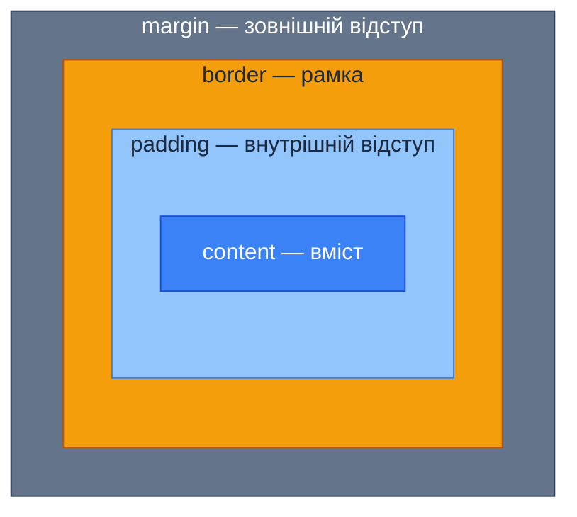
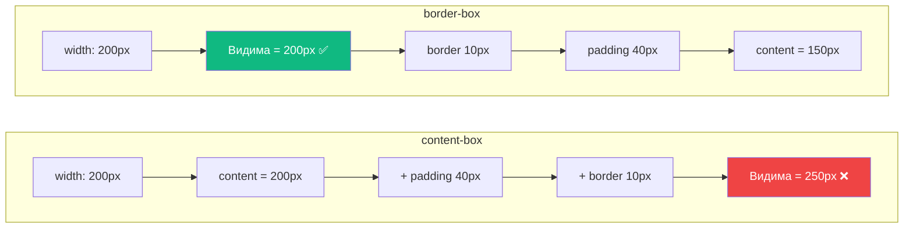
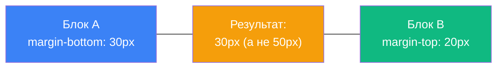

# Блокова модель CSS. Відступи. Box Sizing

## Чому елемент шириною 200px займає 240px?

Уявіть, що ви верстаєте макет: дизайнер каже, що картка має бути **200 пікселів** завширшки. Ви пишете `width: 200px`, додаєте трохи внутрішніх відступів (`padding: 20px`) — і раптом картка стає **240px**. Дві такі картки поруч вже не вміщуються в контейнер. Знайомо?

Ця «загадка» — не баг браузера, а **фундаментальна концепція CSS**, яку називають **блоковою моделлю** (_Box Model_). Кожен HTML-елемент на сторінці — це «коробка» (_box_) з кількома шарами. І поки ви не зрозумієте, як ці шари взаємодіють, верстка буде повна сюрпризів.

У [попередній статті](/12.html-css/09.css-intro-selectors) ми навчились **вибирати** елементи через селектори. Тепер прийшов час зрозуміти, **з чого складається** кожен вибраний елемент і як контролювати його розміри та відступи.

---

## Анатомія блокової моделі

Кожен елемент у CSS — це прямокутна коробка, що складається з чотирьох концентричних шарів (від внутрішнього до зовнішнього):

::mermaid



::

::field-group
::field{name="Content (вміст)" type="area"}
Це простір для тексту, зображень, дочірніх елементів — того, що ви бачите. Саме до цієї області застосовуються `width` і `height` (за замовчуванням).

::
::field{name="Padding (внутрішній відступ)" type="length"}
Простір **між вмістом та рамкою**. Padding «розсуває» елемент зсередини. Фон елемента (`background-color`) поширюється і на padding.

::
::field{name="Border (рамка)" type="length + style + color"}
Видима межа елемента. Має три компоненти: товщину, стиль (`solid`, `dashed`, `dotted`...) та колір.

::
::field{name="Margin (зовнішній відступ)" type="length"}
Простір **між елементом та його сусідами**. Margin завжди прозорий — фон через нього не видно.

::

::

### Живий приклад: чотири шари

::html-preview

```html
<div class="box-demo">
    <div class="box-example">Вміст (content)</div>
</div>
```

```css
.box-demo {
    background-color: #e2e8f0;
    padding: 2rem;
}

.box-example {
    /* Content */
    width: 200px;
    height: 80px;

    /* Padding — внутрішній відступ */
    padding: 20px;

    /* Border — рамка */
    border: 5px solid #f59e0b;

    /* Margin — зовнішній відступ */
    margin: 30px;

    /* Фон поширюється на content + padding */
    background-color: #dbeafe;

    /* Текст */
    font-family: system-ui, sans-serif;
    font-size: 0.9rem;
    color: #1e293b;
    display: flex;
    align-items: center;
    justify-content: center;
}
```

::

Розберемо, який **фактичний розмір** займає цей елемент:

| Шар                         | Ліво | Право | Разом по горизонталі |
| --------------------------- | :--: | :---: | :------------------: |
| Content                     |  —   |   —   |      **200px**       |
| Padding                     | 20px | 20px  |       **40px**       |
| Border                      | 5px  |  5px  |       **10px**       |
| **Видима ширина**           |      |       |      **250px**       |
| Margin                      | 30px | 30px  |       **60px**       |
| **Повна ширина** (з margin) |      |       |      **310px**       |

::caution
За замовчуванням `width: 200px` задає ширину **лише content**. Padding і border додаються **поверх**. Це поведінка `box-sizing: content-box` — значення за замовчуванням у CSS. Саме через це елемент «ширший», ніж ви очікували.

::

---

## Властивості padding, border, margin

### Padding — внутрішній відступ

Padding створює простір між вмістом і рамкою. Він «дихання» для тексту всередині елемента:

::html-preview

```html
<p class="no-padding">Текст без padding — притиснутий до країв.</p>
<p class="with-padding">Текст з padding — має простір для дихання.</p>
<p class="asymmetric-padding">Текст з асиметричним padding.</p>
```

```css
p {
    background-color: #dbeafe;
    border: 2px solid #3b82f6;
    margin: 0.5rem 0;
    font-family: system-ui, sans-serif;
    font-size: 0.95rem;
    color: #1e293b;
}

.no-padding {
    padding: 0;
}

.with-padding {
    padding: 1rem;
}

.asymmetric-padding {
    padding: 0.5rem 2rem 0.5rem 2rem;
}
```

::

**Скорочений запис `padding`:**

| Синтаксис                      | Значення                                             |
| ------------------------------ | ---------------------------------------------------- |
| `padding: 10px;`               | Всі 4 сторони — 10px                                 |
| `padding: 10px 20px;`          | Верх/низ — 10px, ліво/право — 20px                   |
| `padding: 10px 20px 15px;`     | Верх — 10px, ліво/право — 20px, низ — 15px           |
| `padding: 10px 20px 15px 5px;` | Верх → право → низ → ліво (за годинниковою стрілкою) |

::tip
Запам'ятовуйте порядок за годинниковою стрілкою: **T**op → **R**ight → **B**ottom → **L**eft (мнемоніка — **TR**ou**BL**e — «проблема»).

::

Також доступні окремі властивості для кожної сторони:

```css
.element {
    padding-top: 10px;
    padding-right: 20px;
    padding-bottom: 15px;
    padding-left: 5px;
}
```

### Border — рамка

Рамка розташована між padding та margin. Вона має **три компоненти**:

::html-preview

```html
<div class="border-solid">solid — суцільна</div>
<div class="border-dashed">dashed — пунктирна</div>
<div class="border-dotted">dotted — крапкова</div>
<div class="border-double">double — подвійна</div>
<div class="border-mixed">Різні сторони — різні стилі</div>
```

```css
div {
    padding: 0.75rem 1rem;
    margin: 0.5rem 0;
    font-family: system-ui, sans-serif;
    font-size: 0.9rem;
    color: #1e293b;
    background-color: #f8fafc;
}

.border-solid {
    border: 3px solid #3b82f6;
}

.border-dashed {
    border: 3px dashed #f59e0b;
}

.border-dotted {
    border: 3px dotted #10b981;
}

.border-double {
    border: 4px double #8b5cf6;
}

.border-mixed {
    border-top: 4px solid #3b82f6;
    border-right: 2px dashed #f59e0b;
    border-bottom: 4px solid #3b82f6;
    border-left: 2px dashed #f59e0b;
}
```

::

**Скорочений запис:** `border: товщина стиль колір;`

```css
.element {
    border: 2px solid #3b82f6;
}

/* Еквівалент */
.element {
    border-width: 2px;
    border-style: solid;
    border-color: #3b82f6;
}
```

**Окремі сторони:** `border-top`, `border-right`, `border-bottom`, `border-left`.

**`border-radius` — заокруглення кутів:**

::html-preview

```html
<div class="radius-small">4px</div>
<div class="radius-medium">12px</div>
<div class="radius-large">24px</div>
<div class="radius-pill">50px (пілюля)</div>
<div class="radius-circle">50%</div>
```

```css
div {
    display: inline-flex;
    align-items: center;
    justify-content: center;
    width: 100px;
    height: 60px;
    background-color: #3b82f6;
    color: white;
    font-family: system-ui, sans-serif;
    font-size: 0.8rem;
    margin: 0.5rem;
    border: none;
}

.radius-small {
    border-radius: 4px;
}
.radius-medium {
    border-radius: 12px;
}
.radius-large {
    border-radius: 24px;
}
.radius-pill {
    border-radius: 50px;
}
.radius-circle {
    width: 70px;
    height: 70px;
    border-radius: 50%;
}
```

::

::note
`border-radius: 50%` перетворює квадрат на **коло**. Для прямокутника з різними сторонами — вийде еліпс. Цей прийом часто використовується для аватарів.

::

### Margin — зовнішній відступ

Margin створює **прозорий** простір між елементом і його сусідами:

::html-preview

```html
<div class="box box-a">Елемент A<br /><small>margin: 0</small></div>
<div class="box box-b">Елемент B<br /><small>margin: 20px</small></div>
<div class="box box-c">Елемент C<br /><small>margin: 0</small></div>
```

```css
.box {
    padding: 1rem;
    font-family: system-ui, sans-serif;
    font-size: 0.9rem;
    color: white;
    border-radius: 6px;
}

.box-a {
    background-color: #3b82f6;
    margin: 0;
}

.box-b {
    background-color: #f59e0b;
    margin: 20px;
}

.box-c {
    background-color: #10b981;
    margin: 0;
}

small {
    opacity: 0.8;
}
```

::

Синтаксис скорочення **ідентичний** padding — порядок за годинниковою стрілкою (top → right → bottom → left).

**Важлива відмінність від padding:** margin може мати **від'ємні значення**:

```css
.overlap {
    margin-top: -20px; /* Елемент «заїде» на попередній на 20px */
}
```

::warning
Від'ємні margin — потужний, але небезпечний інструмент. Вони можуть спричинити перекриття елементів і неочікувані візуальні ефекти. Використовуйте обачно.

::

---

## `box-sizing` — революція розрахунку розмірів

Згадайте проблему з початку статті: `width: 200px` + `padding: 20px` + `border: 5px` = **250px** видимої ширини. Це поведінка `content-box` — значення за замовчуванням.

CSS пропонує альтернативу: **`border-box`**.

::tabs
::tabs-item{label="content-box (за замовчуванням)"}

`width` задає ширину **лише content**. Padding і border додаються **поверх**:

::html-preview

```html
<div class="container">
    <div class="content-box-demo">
        box-sizing: content-box<br />
        width: 200px<br />
        Видима: 250px
    </div>
</div>
```

```css
.container {
    background-color: #fef3c7;
    padding: 1rem;
    font-family: system-ui, sans-serif;
}

.content-box-demo {
    box-sizing: content-box; /* За замовчуванням */
    width: 200px;
    padding: 20px;
    border: 5px solid #f59e0b;
    background-color: #dbeafe;
    font-size: 0.85rem;
    color: #1e293b;
}
```

::

**Розрахунок:** 200 (content) + 20×2 (padding) + 5×2 (border) = **250px**

::
::tabs-item{label="border-box (рекомендовано)"}

`width` задає ширину **всієї видимої коробки** (content + padding + border). Браузер **автоматично зменшує** content, щоб все вмістилось:

::html-preview

```html
<div class="container">
    <div class="border-box-demo">
        box-sizing: border-box<br />
        width: 200px<br />
        Видима: 200px!
    </div>
</div>
```

```css
.container {
    background-color: #dcfce7;
    padding: 1rem;
    font-family: system-ui, sans-serif;
}

.border-box-demo {
    box-sizing: border-box; /* Рекомендовано! */
    width: 200px;
    padding: 20px;
    border: 5px solid #10b981;
    background-color: #dbeafe;
    font-size: 0.85rem;
    color: #1e293b;
}
```

::

**Розрахунок:** 200px (загальна видима ширина) = 150 (content, автоматично) + 20×2 (padding) + 5×2 (border)

::

::

::mermaid



::

### Глобальний `border-box` — стандарт індустрії

У реальних проєктах **завжди** використовують `border-box` для всіх елементів. Це робиться через універсальний селектор:

```css
/* CSS Reset — стандарт у кожному проєкті */
*,
*::before,
*::after {
    box-sizing: border-box;
}
```

::tip
Цей код зустрічається буквально в **кожному** професійному CSS-файлі. Ми додаємо `::before` та `::after`, щоб псевдоелементи теж підкорялись `border-box`. Запам'ятайте цей патерн — вам слід завжди починати з нього.

::

---

## Центрування блоків з `margin: auto`

Один із найпоширеніших прийомів — горизонтальне центрування блокового елемента:

::html-preview

```html
<div class="page">
    <div class="centered-block">Цей блок відцентровано через margin: auto</div>
</div>
```

```css
.page {
    background-color: #f1f5f9;
    padding: 1rem;
    font-family: system-ui, sans-serif;
}

.centered-block {
    width: 300px;
    padding: 1.5rem;
    background-color: #dbeafe;
    border: 2px solid #3b82f6;
    border-radius: 8px;
    text-align: center;
    font-size: 0.9rem;
    color: #1e293b;

    /* Магія центрування */
    margin: 0 auto;
}
```

::

**Як це працює:** коли елемент має фіксовану `width`, а `margin-left` і `margin-right` встановлені в `auto`, браузер **рівномірно розподіляє** вільний простір між лівим та правим відступами.

::note
`margin: auto` працює для горизонтального центрування **тільки** для блокових елементів з явно заданою шириною. Для вертикального центрування `margin: auto` не працює у звичайному потоці — для цього використовують Flexbox або Grid (розглянемо в наступних статтях).

::

---

## Колапс марджинів (Margin Collapse)

Це один із **найнесподіваніших** механізмів CSS, що спантеличує навіть досвідчених розробників.

### Що таке колапс?

Коли два **вертикальні** margin стикаються, вони **не додаються**, а **зливаються** — залишається більший з двох:

::html-preview

```html
<div class="collapse-demo">
    <div class="block block-a">margin-bottom: 30px</div>
    <div class="block block-b">margin-top: 20px</div>
    <p class="note">↑ Відстань між блоками = 30px (більший), а не 50px (сума)</p>
</div>
```

```css
.collapse-demo {
    font-family: system-ui, sans-serif;
    font-size: 0.85rem;
    color: #1e293b;
}

.block {
    padding: 1rem;
    border-radius: 6px;
    text-align: center;
}

.block-a {
    background-color: #dbeafe;
    border: 2px solid #3b82f6;
    margin-bottom: 30px;
}

.block-b {
    background-color: #dcfce7;
    border: 2px solid #10b981;
    margin-top: 20px;
}

.note {
    color: #64748b;
    font-style: italic;
    margin-top: 0.5rem;
}
```

::

::mermaid



::

### Правила колапсу

::card-group

::card{title="✅ Колапсує" icon="i-heroicons-arrows-pointing-in"}

- Вертикальні margin суміжних блокових елементів
- Margin батька та першого/останнього дочірнього елемента (якщо між ними немає padding, border або вмісту)
- Margin порожнього елемента (верхній і нижній зливаються)

::

::card{title="❌ Не колапсує" icon="i-heroicons-arrows-pointing-out"}

- Горизонтальні margin (left/right) — **ніколи**
- Елементи з `display: flex` або `display: grid`
- Елементи з `overflow` відмінним від `visible`
- Елементи з `float` або `position: absolute`
- Елементи, розділені padding або border батька

::

::

### Колапс батько-дитина

Це ще підступніший випадок — margin дочірнього елемента «витікає» назовні батька:

::html-preview

```html
<div class="parent-demo">
    <div class="parent-collapse">
        <p class="child-collapse">Дочірній елемент з margin-top: 40px</p>
    </div>
    <p class="caption">↑ Margin «витік» за межі батька!</p>
</div>

<div class="parent-demo">
    <div class="parent-fixed">
        <p class="child-collapse">Дочірній елемент з margin-top: 40px</p>
    </div>
    <p class="caption">↑ Виправлено: padding-top на батьку блокує колапс</p>
</div>
```

```css
.parent-demo {
    font-family: system-ui, sans-serif;
    font-size: 0.85rem;
    color: #1e293b;
    margin-bottom: 1rem;
}

.parent-collapse {
    background-color: #fee2e2;
    border: 2px solid #ef4444;
    /* Немає padding-top — margin дочірнього «витікає» */
}

.parent-fixed {
    background-color: #dcfce7;
    border: 2px solid #10b981;
    padding-top: 1px; /* Достатньо 1px, щоб зламати колапс */
}

.child-collapse {
    margin-top: 40px;
    margin-bottom: 0;
    padding: 0.5rem;
    background-color: rgba(0, 0, 0, 0.05);
}

.caption {
    color: #64748b;
    font-style: italic;
    font-size: 0.8rem;
    margin-top: 0.25rem;
}
```

::

::tip
Найпростіші способи **запобігти** колапсу батько-дитина:

- Додайте `padding-top: 1px` (або будь-яке значення) батьку
- Додайте `border-top: 1px solid transparent` батьку
- Додайте `overflow: hidden` батьку
- Використайте `display: flex` або `display: grid` на батьку (вони повністю вимикають margin collapse)

::

---

## `display`: block, inline, inline-block

Кожен HTML-елемент має тип відображення за замовчуванням — **блоковий** або **рядковий**. Цей тип визначає, як елемент поводиться у потоці документа.

### `display: block`

Блокові елементи займають **всю доступну ширину** і починаються з **нового рядка**:

::html-preview

```html
<div class="block-demo">block — займає весь рядок</div>
<div class="block-demo">block — починає новий рядок</div>
<div class="block-demo short">block з width: 200px — все одно новий рядок</div>
```

```css
.block-demo {
    display: block;
    background-color: #dbeafe;
    border: 2px solid #3b82f6;
    padding: 0.75rem 1rem;
    margin: 0.5rem 0;
    font-family: system-ui, sans-serif;
    font-size: 0.9rem;
    color: #1e293b;
    border-radius: 4px;
}

.short {
    width: 200px;
}
```

::

**Блокові за замовчуванням:** `<div>`, `<p>`, `<h1>`–`<h6>`, `<section>`, `<article>`, `<ul>`, `<ol>`, `<li>`, `<header>`, `<footer>`, `<form>`.

**Характеристики:**

- Починається з нового рядка
- Займає всю доступну ширину батька (якщо не задана `width`)
- Реагує на `width`, `height`, `margin`, `padding` — повністю

### `display: inline`

Рядкові елементи займають **лише стільки місця, скільки потрібно для вмісту**, і **не переносяться** на новий рядок:

::html-preview

```html
<p>
    Це абзац з <span class="inline-demo">рядковим елементом</span>, який не порушує
    <span class="inline-demo">потік тексту</span> і продовжується у тому ж рядку.
</p>
```

```css
p {
    font-family: system-ui, sans-serif;
    font-size: 1rem;
    line-height: 1.8;
    color: #1e293b;
}

.inline-demo {
    display: inline;
    background-color: #fef3c7;
    border: 1px solid #f59e0b;
    padding: 2px 6px;
    border-radius: 3px;
    /* width та height — ІГНОРУЮТЬСЯ для inline */
    /* margin-top та margin-bottom — ІГНОРУЮТЬСЯ */
}
```

::

**Рядкові за замовчуванням:** `<span>`, `<a>`, `<strong>`, `<em>`, `<code>`, ``, `<input>`.

::warning
Для `inline`-елементів `width`, `height`, `margin-top` та `margin-bottom` **не працюють**. Діють лише горизонтальні `margin-left`/`margin-right` та `padding` (але вертикальний padding не впливає на висоту рядка).

::

### `display: inline-block`

Гібрид, що поєднує найкраще з обох світів: елемент залишається в **потоці рядка**, але підтримує **блокові властивості**:

::html-preview

```html
<nav>
    <a href="#" class="nav-link">Головна</a>
    <a href="#" class="nav-link active">Про нас</a>
    <a href="#" class="nav-link">Послуги</a>
    <a href="#" class="nav-link">Контакти</a>
</nav>
```

```css
nav {
    background-color: #1e293b;
    padding: 0.5rem 1rem;
    border-radius: 8px;
    font-family: system-ui, sans-serif;
}

.nav-link {
    display: inline-block; /* Рядковий, але з блоковими можливостями */
    padding: 0.5rem 1rem;
    color: #e2e8f0;
    text-decoration: none;
    border-radius: 6px;
    font-size: 0.9rem;
    transition: background-color 0.2s;
}

.nav-link:hover {
    background-color: #334155;
}

.nav-link.active {
    background-color: #3b82f6;
    color: white;
}
```

::

### Порівняльна таблиця

| Характеристика          | `block` |         `inline`          | `inline-block` |
| ----------------------- | :-----: | :-----------------------: | :------------: |
| Новий рядок             |   ✅    |            ❌             |       ❌       |
| Ширина на весь рядок    |   ✅    |            ❌             |       ❌       |
| `width` / `height`      |   ✅    |            ❌             |       ✅       |
| Вертикальний `margin`   |   ✅    |            ❌             |       ✅       |
| Горизонтальний `margin` |   ✅    |            ✅             |       ✅       |
| `padding` (повний)      |   ✅    | ⚠️ (не впливає на layout) |       ✅       |

::note
`display: none` — ще одне важливе значення. Воно повністю **видаляє** елемент з потоку документа — він не займає місця і не відображається. Про різницю з `visibility: hidden` — нижче.

::

---

## `width` та `height` — контроль розмірів

### Базові властивості

```css
.element {
    width: 300px; /* Фіксована ширина */
    height: 200px; /* Фіксована висота */
}
```

### `min-` та `max-` обмеження

Часто задавати жорстку ширину — погана ідея (сторінка має бути адаптивною). Натомість використовують обмеження:

```css
.card {
    width: 100%; /* Займай всю ширину батька */
    max-width: 600px; /* Але не більше 600px */
    min-width: 280px; /* І не менше 280px */
}
```

::html-preview

```html
<div class="responsive-box">
    Цей блок має max-width: 400px і width: 100%. Він адаптується до розміру контейнера, але ніколи не стане ширшим за
    400px.
</div>
```

```css
.responsive-box {
    width: 100%;
    max-width: 400px;
    margin: 0 auto;
    padding: 1.5rem;
    background-color: #dbeafe;
    border: 2px solid #3b82f6;
    border-radius: 8px;
    font-family: system-ui, sans-serif;
    font-size: 0.9rem;
    color: #1e293b;
    box-sizing: border-box;
}
```

::

::tip
Патерн `width: 100%; max-width: Npx; margin: 0 auto;` — це **стандартний** спосіб створити центрований контейнер, що адаптується до малих екранів. Ви побачите його на більшості сайтів.

::

### `height: auto` та проблема фіксованої висоти

::caution
**Уникайте фіксованої `height`** для текстового контенту. Якщо тексту стане більше (наприклад, через переклад), він «вилізе» за межі елемента. Натомість дозвольте висоті визначатися автоматично (`height: auto` — значення за замовчуванням), а для обмежень використовуйте `min-height`.

::

```css
/* ❌ Погано — текст може переповнити */
.card {
    height: 200px;
}

/* ✅ Добре — мінімальна висота, але контент може розширити */
.card {
    min-height: 200px;
}
```

---

## Overflow — контроль переповнення

Що станеться, коли вміст **не вміщується** у задані розміри? Це контролює властивість `overflow`:

::tabs
::tabs-item{label="visible (за замовчуванням)"}

Вміст виходить за межі елемента і **перекриває** сусідів:

::html-preview

```html
<div class="overflow-container">
    <div class="overflow-visible">
        Цей текст занадто довгий для цього маленького контейнера і він виходить за його межі, що може зламати верстку.
    </div>
    <p class="neighbor">Сусідній елемент — може бути перекритий.</p>
</div>
```

```css
.overflow-container {
    font-family: system-ui, sans-serif;
    font-size: 0.85rem;
    color: #1e293b;
}

.overflow-visible {
    width: 200px;
    height: 60px;
    overflow: visible; /* За замовчуванням */
    background-color: #fee2e2;
    border: 2px solid #ef4444;
    padding: 0.5rem;
    border-radius: 4px;
}

.neighbor {
    margin-top: 2rem;
    color: #64748b;
}
```

::

::
::tabs-item{label="hidden"}

Вміст **обрізається** — те, що не вміщується, не видно:

::html-preview

```html
<div class="overflow-hidden">
    Цей текст занадто довгий для цього маленького контейнера, але overflow: hidden обрізає все, що виходить за межі.
</div>
```

```css
.overflow-hidden {
    width: 200px;
    height: 60px;
    overflow: hidden;
    background-color: #dbeafe;
    border: 2px solid #3b82f6;
    padding: 0.5rem;
    border-radius: 4px;
    font-family: system-ui, sans-serif;
    font-size: 0.85rem;
    color: #1e293b;
}
```

::

::
::tabs-item{label="scroll"}

З'являються **смуги прокрутки** (завжди, навіть якщо вміст вміщується):

::html-preview

```html
<div class="overflow-scroll">
    Цей текст занадто довгий для цього маленького контейнера. Але overflow: scroll дозволяє прокручувати вміст.
    Користувач може прокрутити, щоб побачити все.
</div>
```

```css
.overflow-scroll {
    width: 200px;
    height: 60px;
    overflow: scroll;
    background-color: #dcfce7;
    border: 2px solid #10b981;
    padding: 0.5rem;
    border-radius: 4px;
    font-family: system-ui, sans-serif;
    font-size: 0.85rem;
    color: #1e293b;
}
```

::

::
::tabs-item{label="auto (рекомендовано)"}

Смуги прокрутки з'являються **тільки за потреби**:

::html-preview

```html
<div class="overflow-auto short-text">Короткий текст — без скролу.</div>
<div class="overflow-auto long-text">
    Довгий текст, що потребує прокрутки. Overflow: auto автоматично додає скрол, лише коли вміст перевищує розміри
    контейнера. Це найзручніший варіант.
</div>
```

```css
.overflow-auto {
    width: 200px;
    height: 60px;
    overflow: auto;
    background-color: #fef9c3;
    border: 2px solid #f59e0b;
    padding: 0.5rem;
    border-radius: 4px;
    margin-bottom: 0.5rem;
    font-family: system-ui, sans-serif;
    font-size: 0.85rem;
    color: #1e293b;
}
```

::

::

::

Також доступні **осьові** варіанти: `overflow-x` (горизонтальна прокрутка) та `overflow-y` (вертикальна прокрутка):

```css
.horizontal-scroll {
    overflow-x: auto; /* Горизонтальний скрол за потреби */
    overflow-y: hidden; /* Вертикальний — приховати */
}
```

---

## `visibility: hidden` vs `display: none`

Обидві властивості «приховують» елемент, але принципово по-різному:

::html-preview

```html
<div class="vis-demo">
    <div class="box-vis">Видимий</div>
    <div class="box-vis hidden-vis">visibility: hidden</div>
    <div class="box-vis">Видимий</div>
</div>

<hr />

<div class="vis-demo">
    <div class="box-vis">Видимий</div>
    <div class="box-vis hidden-disp">display: none</div>
    <div class="box-vis">Видимий</div>
</div>
```

```css
.vis-demo {
    display: flex;
    gap: 0.5rem;
    margin: 0.5rem 0;
    font-family: system-ui, sans-serif;
    font-size: 0.85rem;
}

.box-vis {
    padding: 1rem 1.5rem;
    background-color: #dbeafe;
    border: 2px solid #3b82f6;
    border-radius: 6px;
    color: #1e293b;
    text-align: center;
}

/* Елемент невидимий, але ЗАЙМАЄ місце */
.hidden-vis {
    visibility: hidden;
}

/* Елемент повністю ВИДАЛЕНО з потоку */
.hidden-disp {
    display: none;
}

hr {
    border: none;
    border-top: 1px dashed #cbd5e1;
    margin: 1rem 0;
}
```

::

| Характеристика              |       `visibility: hidden`        |  `display: none`   |
| --------------------------- | :-------------------------------: | :----------------: |
| Елемент видимий             |                ❌                 |         ❌         |
| Займає місце в потоці       |                ✅                 |         ❌         |
| Доступний для скрін-рідерів |                ❌                 |         ❌         |
| Дочірні елементи            | Можуть бути `visibility: visible` | Повністю приховані |
| Анімація приховування       |      Підтримує `transition`       |    Не підтримує    |

::tip
Коротко: `visibility: hidden` — це «невидимий, але він тут». `display: none` — це «його не існує».

::

---

## `outline` — не плутайте з `border`

Є ще одна «рамка», про яку варто знати — `outline`. Вона виглядає схоже на `border`, але має ключову відмінність:

```css
.element:focus {
    outline: 3px solid #3b82f6;
    outline-offset: 2px;
}
```

::card-group

::card{title="Border" icon="i-heroicons-stop"}

- Є частиною блокової моделі
- **Впливає** на розмір елемента
- Може мати різні стилі на різних сторонах
- Підтримує `border-radius`

::

::card{title="Outline" icon="i-heroicons-minus"}

- **Не є** частиною блокової моделі
- **Не впливає** на розмір та позицію
- Однаковий з усіх сторін
- Не підтримує різні сторони

::

::

::warning
Ніколи не видаляйте `outline` на елементах фокусу (`outline: none`) без заміни! Це критично для **доступності** — користувачі, що навігують клавіатурою (:kbd{value="Tab"}), орієнтуються саме по outline. Якщо стандартний outline не підходить — замініть його кастомним стилем `:focus-visible`.

::

---

## Практичні завдання

### Рівень 1 — Базовий

::accordion
::accordion-item{label="Завдання 1.1: Анатомія блокової моделі" icon="i-lucide-box"}

Створіть HTML-елемент `<div>` із текстом «Box Model». Задайте:

- `width: 300px`
- `padding: 20px`
- `border: 5px solid` будь-якого кольору
- `margin: 30px`

**Завдання:** Обчисліть фактичну видиму ширину елемента для `box-sizing: content-box` та для `box-sizing: border-box`. Перевірте свої розрахунки через DevTools браузера (:kbd{value="F12"} → вкладка Elements → Computed).

::
::accordion-item{label="Завдання 1.2: Виправлення ширини" icon="i-lucide-bug"}

У наведеному коді два блоки мають однакову `width: 200px`, але виглядають по-різному. Знайдіть причину та виправте:

```html
<div class="box-a">Блок A</div>
<div class="box-b">Блок B</div>
```

```css
.box-a {
    width: 200px;
    padding: 0;
    border: none;
    background-color: #dbeafe;
}

.box-b {
    width: 200px;
    padding: 20px;
    border: 3px solid #3b82f6;
    background-color: #dbeafe;
}
```

Зробіть обидва блоки **однакової видимої ширини** — 200px.

::
::accordion-item{label="Завдання 1.3: Центрування блока" icon="i-lucide-align-center"}

Створіть блок-картку шириною `400px` і відцентруйте його горизонтально на сторінці за допомогою `margin`. Додайте padding, рамку та заокруглення.

::

::

### Рівень 2 — Логіка та комбінування

::accordion
::accordion-item{label="Завдання 2.1: Inline vs Block vs Inline-block" icon="i-lucide-layout-grid"}

Створіть три ряди однакових елементів:

1. Перший ряд: 3 елементи з `display: block`
2. Другий ряд: 3 елементи з `display: inline`
3. Третій ряд: 3 елементи з `display: inline-block`

Задайте кожному `width: 150px`, `height: 50px`, `margin: 10px`, `padding: 10px`. Опишіть, які властивості **ігноруються** у кожному типі.

::
::accordion-item{label="Завдання 2.2: Карткова сітка" icon="i-lucide-grid-3x3"}

Створіть ряд із трьох карток, використовуючи `display: inline-block`. Кожна картка повинна мати:

- Фіксовану ширину `30%`
- `box-sizing: border-box`
- Padding, border, border-radius
- Заголовок (`<h3>`) та текст (`<p>`)

Картки мають стояти поруч без переносу на новий рядок.

**Підказка:** Між `inline-block` елементами у HTML з'являються пробіли (~4px). Використайте `margin` з від'ємним значенням або `font-size: 0` на батьку для компенсації.

::
::accordion-item{label="Завдання 2.3: Overflow gallery" icon="i-lucide-image"}

Створіть горизонтальну галерею зображень (або кольорових блоків):

- Контейнер з фіксованою шириною (`500px`)
- Всередині — 8 блоків по `150px` кожен, розташованих горизонтально
- Контейнер має `overflow-x: auto` для горизонтальної прокрутки
- `overflow-y: hidden`

::

::

### Рівень 3 — Створення з нуля

::accordion
::accordion-item{label="Завдання 3.1: Pricing Cards" icon="i-lucide-credit-card"}

Створіть три картки тарифних планів у ряд:

- **Basic** — сіра рамка, білий фон
- **Pro** — синя рамка, легке виділення (наприклад, тінь)
- **Enterprise** — виділена найбільше (збільшений `padding`, `border`, можливо інший фон)

Кожна картка: назва тарифу, ціна, список можливостей, кнопка.

Використайте `box-sizing: border-box`, `display: inline-block`, центрування через `margin: auto`, `border-radius`.

Додайте стан `:hover` — легке піднімання картки через `margin-top` (від'ємний) або `transform`.

::
::accordion-item{label="Завдання 3.2: CSS-тільки tooltip" icon="i-lucide-message-square"}

Реалізуйте tooltip (підказку), що з'являється при наведенні на елемент:

- Основний текст відображається як звичайний рядковий елемент
- При `:hover` під ним чи над ним з'являється підказка
- Підказка — це `::after` або вкладений `<span>` з `display: none` → `display: block`
- Стилізуйте підказку: темний фон, білий текст, `padding`, `border-radius`
- Додайте маленький трикутник-вказівник через `border` на `::before`

**Додатково:** Використайте `visibility`/`opacity` замість `display` для плавної анімації появи.

::

::

---

## Підсумок

::card-group

::card{title="📦 Блокова модель" icon="i-heroicons-cube"}

Кожен елемент — це коробка з 4 шарами: content → padding → border → margin.

::

::card{title="📐 box-sizing" icon="i-heroicons-calculator"}

`border-box` робить `width` інтуїтивним: padding і border входять у задану ширину. **Завжди** використовуйте глобальний `*, *::before, *::after { box-sizing: border-box; }`.

::

::card{title="💥 Margin Collapse" icon="i-heroicons-arrows-pointing-in"}

Вертикальні margin **зливаються** (залишається більший). Padding, border, `overflow`, `display: flex/grid` — блокують колапс.

::

::card{title="🔀 Display" icon="i-heroicons-squares-2x2"}

`block` — новий рядок, вся ширина. `inline` — в потоці тексту, ігнорує width/height. `inline-block` — гібрид з перевагами обох.

::

::

---

## Корисні посилання

- 📖 [MDN — Introduction to the CSS Box Model](https://developer.mozilla.org/en-US/docs/Web/CSS/CSS_box_model/Introduction_to_the_CSS_box_model) — повний довідник блокової моделі
- 📦 [MDN — box-sizing](https://developer.mozilla.org/en-US/docs/Web/CSS/box-sizing) — офіційна документація `box-sizing`
- 💥 [MDN — Mastering Margin Collapsing](https://developer.mozilla.org/en-US/docs/Web/CSS/CSS_box_model/Mastering_margin_collapsing) — детальне пояснення колапсу марджинів
- 🎮 [Box Model Diagram (Interactive)](https://codepen.io/carolineartz/pen/ogVXZj) — інтерактивна візуалізація блокової моделі
- 📐 [CSS Tricks — The box-sizing Reset](https://css-tricks.com/box-sizing/) — статня про глобальний `border-box`
