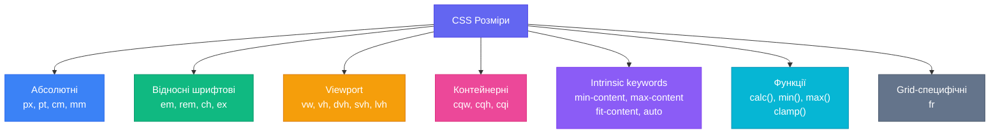
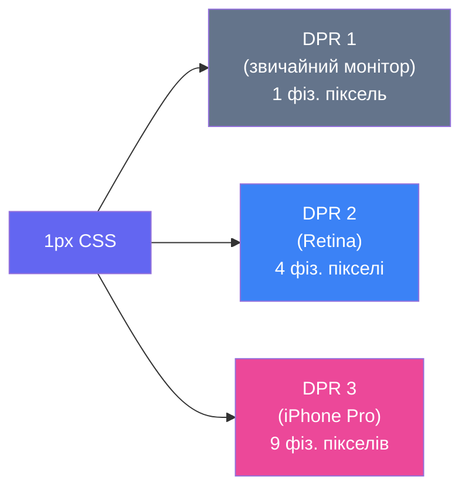
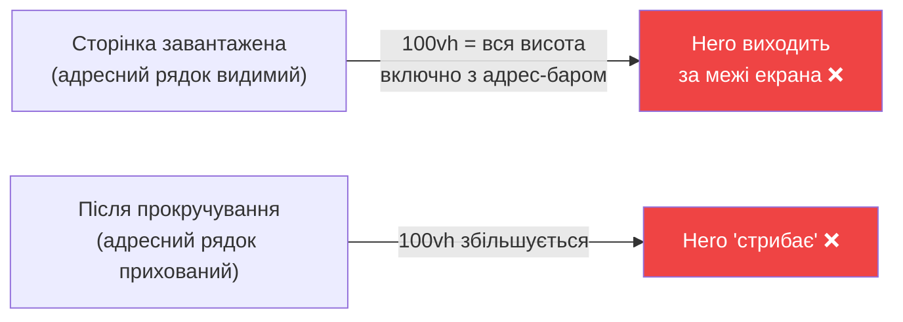

# Розміри у CSS: повний довідник одиниць і ключових слів

## Чому `width: 200px` — це лише початок

Уявіть такий сценарій: дизайнер передає вам макет. Кнопка має бути «великою». Картка — «половина екрана». Заголовок — «читабельним на будь-якому пристрої». І ось ви відкриваєте CSS і бачите дикий зоопарк: `px`, `em`, `rem`, `vw`, `vh`, `dvh`, `cqw`, `fr`, `%`, `ch`, `min-content`... Котре з них «правильне»?

Відповідь незручна: усі вони правильні — просто для різних задач. Вибір одиниці вимірювання — це архітектурне рішення, яке впливає на адаптивність, доступність та передбачуваність вашого коду.

У [попередній статті](/12.html-css/10.css-box-model) ми дізналися, що кожен елемент — це коробка з чотирма шарами. Тепер навчимося точно контролювати розмір цієї коробки — не тільки через `width: 200px`, але й через десятки інших інструментів, які CSS надає для різних контекстів.

::mermaid



::

---

## Абсолютні одиниці (Absolute Units)

Абсолютні одиниці — це фіксовані розміри, які **не залежать від контексту**: ні від батьківського елемента, ні від розміру вікна браузера, ні від налаштувань користувача.

### `px` — піксель, якого не існує

`px` — найпоширеніша одиниця CSS, і водночас найбільш оманлива за назвою. Жоден сучасний пристрій не відображає «один CSS-піксель» як буквально один фізичний піксель екрана.

**Фізичний піксель vs CSS-піксель:**

Сучасні екрани мають **Device Pixel Ratio (DPR)** — коефіцієнт, що показує, скільки фізичних пікселів відповідає одному CSS-пікселю. На MacBook Pro з Retina-дисплеєм DPR = 2: `1px CSS` = `2×2 = 4 фізичні пікселі`. На iPhone 15 Pro — DPR = 3.

::mermaid



::

Саме тому зображення мають бути вдвічі (або втричі) більшими за відображуваний розмір, щоб виглядати чітко на Retina-екранах.

**Коли використовувати `px`:**
- `border: 1px solid` — тонкі декоративні лінії
- `border-radius: 4px` — невеликі заокруглення
- `box-shadow` — тіні
- `outline-offset` — зсув обідка фокусу
- Розміри іконок (`width: 24px`) у контексті, де масштабування небажане

::html-preview
```html
<div class="px-demo">
  <div class="item">border: 1px solid</div>
  <div class="item radius">border-radius: 8px</div>
  <div class="item shadow">box-shadow: 0 2px 8px</div>
  <div class="item icon-size">Іконка 24×24px</div>
</div>
```
```css
.px-demo {
  display: flex;
  flex-wrap: wrap;
  gap: 1rem;
  padding: 1.5rem;
  background: #f8fafc;
  font-family: system-ui, sans-serif;
  font-size: 0.85rem;
}
.item {
  padding: 0.75rem 1.25rem;
  background: white;
  color: #1e293b;
  border: 1px solid #e2e8f0;
}
.radius { border-radius: 8px; }
.shadow { box-shadow: 0 2px 8px rgba(0,0,0,0.12); border: none; }
.icon-size { width: 24px; height: 24px; background: #6366f1;
  display: flex; align-items: center; justify-content: center;
  color: white; font-size: 0; padding: 0; border: none; border-radius: 4px; }
.icon-size::after { content: '★'; font-size: 14px; }
```
::

### Друкарські одиниці: `pt`, `cm`, `mm`, `in`, `pc`

Ці одиниці мають чіткий фізичний зміст, але у веб-розробці майже не використовуються — крім `@media print`:

| Одиниця | Повна назва | Еквівалент |
|---------|-------------|-----------|
| `pt` | Point | 1/72 дюйма ≈ 1.33px |
| `pc` | Pica | 12pt ≈ 16px |
| `in` | Inch (дюйм) | 96px |
| `cm` | Centimeter | ~37.8px |
| `mm` | Millimeter | ~3.78px |

```css
/* Єдиний розумний контекст для друкарських одиниць */
@media print {
  body {
    font-size: 12pt; /* Читабельно на папері */
  }
  h1 {
    font-size: 24pt;
  }
  .page-break {
    page-break-before: always;
  }
}
```

::tip
У веб-контексті `px` завжди кращий за `pt` чи `cm`. Ці одиниці мають сенс лише якщо ви готуєте стилі для **друку**, де фізичний розмір критичний.
::

---

## Відносні шрифтові одиниці (Font-relative Units)

На відміну від абсолютних, ці одиниці обчислюються **відносно розміру шрифту** — або поточного елемента, або кореневого.

### `em` — магія каскаду

`em` вираховується відносно `font-size` **самого елемента** (або батьківського, якщо `font-size` не задано явно). На перший погляд, здається зручним, але має небезпечний побічний ефект — **ефект каскадного множення**.

::html-preview
```html
<div class="em-demo">
  <p class="level-0">Рівень 0 (font-size: 16px = базовий)</p>
  <div class="nested-1">
    <p>Рівень 1 (font-size: 1.2em = 16 × 1.2 = 19.2px)</p>
    <div class="nested-2">
      <p>Рівень 2 (font-size: 1.2em = 19.2 × 1.2 = 23px)</p>
      <div class="nested-3">
        <p>Рівень 3 (font-size: 1.2em = 23 × 1.2 = 27.6px) 😱</p>
      </div>
    </div>
  </div>
  <hr class="divider"/>
  <p class="rem-base">А тепер з rem: завжди відносно кореня</p>
  <div class="rem-nested-1">
    <p>Рівень 1 (font-size: 1.2rem = 16 × 1.2 = 19.2px)</p>
    <div class="rem-nested-2">
      <p>Рівень 2 (font-size: 1.2rem = 16 × 1.2 = 19.2px — стабільно!)</p>
      <div class="rem-nested-3">
        <p>Рівень 3 (font-size: 1.2rem = 19.2px — незмінно ✅)</p>
      </div>
    </div>
  </div>
</div>
```
```css
.em-demo {
  font-family: system-ui, sans-serif;
  font-size: 16px;
  padding: 1rem;
  background: #f8fafc;
  color: #1e293b;
}
.level-0 { margin: 0 0 0.5rem; }
.nested-1 { font-size: 1.2em; padding-left: 1rem; border-left: 3px solid #ef4444; }
.nested-2 { font-size: 1.2em; padding-left: 1rem; border-left: 3px solid #f97316; }
.nested-3 { font-size: 1.2em; padding-left: 1rem; border-left: 3px solid #eab308; }
.nested-1 p, .nested-2 p, .nested-3 p { margin: 0.25rem 0; }
.divider { margin: 1rem 0; border: 1px solid #e2e8f0; }
.rem-base { margin: 0 0 0.5rem; }
.rem-nested-1 { font-size: 1.2rem; padding-left: 1rem; border-left: 3px solid #10b981; }
.rem-nested-2 { font-size: 1.2rem; padding-left: 1rem; border-left: 3px solid #06b6d4; }
.rem-nested-3 { font-size: 1.2rem; padding-left: 1rem; border-left: 3px solid #6366f1; }
.rem-nested-1 p, .rem-nested-2 p, .rem-nested-3 p { margin: 0.25rem 0; }
```
::

Зверніть увагу: `em` множиться при кожному вкладенні. Три рівні з `1.2em` — і текст виріс майже вдвічі. Це **небажана поведінка** у більшості сценаріїв.

**Де `em` таки корисний:** властивості елемента, що мають бути **пропорційні до його власного шрифту**:

```css
.button {
  font-size: 1rem;
  padding: 0.6em 1.2em;  /* padding масштабується разом із font-size кнопки */
  border-radius: 0.3em;
}

.button--large {
  font-size: 1.25rem;
  /* padding і border-radius автоматично стануть більшими через em */
}
```

### `rem` — надійна альтернатива

`rem` (root em) завжди вираховується відносно `font-size` **кореневого елемента** `<html>` (`:root`). За замовчуванням — `16px`, але користувач може змінити це у налаштуваннях браузера.

```css
:root {
  font-size: 16px; /* базовий розмір — 1rem = 16px */
}

/* Або зручний трюк: 1rem = 10px */
:root {
  font-size: 62.5%; /* 62.5% від 16px = 10px */
}
/* Але! Це ламає налаштування доступності користувача — не рекомендується */
```

::warning
Не задавайте `font-size: 62.5%` або `font-size: 10px` на `:root`. Це скасовує **налаштування розміру шрифту** у браузері, яке використовують люди зі слабким зором. Принцип доступності: **базовий `font-size` `:root` має бути відносним або не задаватися взагалі**.
::

**Правило великого пальця:** `rem` для `font-size`, `spacing`, `width`/`height` компонентів; `em` для `padding`/`margin` всередині компонента, що мають бути пропорційні до шрифту.

### `ch` — ширина символу «0»

`1ch` = ширина символу нуля (`0`) у поточному шрифті. Ідеальна одиниця для обмеження ширини текстових блоків:

```css
/* Класичний патерн читабельного тексту */
.article-body {
  max-width: 65ch; /* ~65 символів у рядку — оптимум для читання */
  margin-inline: auto;
}
```

::html-preview
```html
<div class="ch-demo">
  <div class="narrow-col">
    <h3>max-width: 45ch</h3>
    <p>Вузька колонка — гарна для коротких нотаток або коментарів у бічній панелі.</p>
  </div>
  <div class="reading-col">
    <h3>max-width: 65ch</h3>
    <p>Оптимальна ширина для читання довгих текстів. Дослідження показують, що 50–75 символів у рядку — ідеальна довжина для комфортного читання.</p>
  </div>
  <div class="wide-col">
    <h3>max-width: 90ch</h3>
    <p>Широка колонка — підходить для таблиць, коду або двоколонкового верстання всередині.</p>
  </div>
</div>
```
```css
.ch-demo {
  display: flex;
  flex-direction: column;
  gap: 1rem;
  padding: 1.25rem;
  background: #f8fafc;
  font-family: system-ui, sans-serif;
  font-size: 0.9rem;
  color: #1e293b;
}
.narrow-col, .reading-col, .wide-col {
  background: white;
  border-radius: 8px;
  padding: 1rem;
  border-left: 4px solid;
}
.narrow-col  { max-width: 45ch; border-color: #ec4899; }
.reading-col { max-width: 65ch; border-color: #10b981; }
.wide-col    { max-width: 90ch; border-color: #6366f1; }
h3 { margin: 0 0 0.5rem; font-size: 0.85rem; opacity: 0.6; }
p  { margin: 0; line-height: 1.6; }
```
::

### `ex`, `lh`, `rlh`, `cap` — спеціалізовані шрифтові одиниці

| Одиниця | Значення | Типове застосування |
|---------|----------|-------------------|
| `ex` | Висота рядкової літери (≈ висота «x») | Вирівнювання дрібних деталей |
| `cap` | Висота заголовної літери | Орнаменти, декоративні елементи |
| `lh` | Висота рядка (`line-height`) елемента | Відступи кратні висоті рядка |
| `rlh` | Висота рядка кореневого елемента | Вертикальний ритм |

```css
/* Практичний приклад: drop cap (буквиця) */
.dropcap::first-letter {
  font-size: 3cap; /* Висота 3 заголовних літер */
  float: left;
  margin-right: 0.1em;
  line-height: 1;
  font-weight: bold;
  color: #6366f1;
}

/* Відступи між секціями кратні висоті рядка */
.section + .section {
  margin-top: 2lh;
}
```

---

## Viewport-відносні одиниці

Viewport — це видима область браузерного вікна. Viewport-одиниці дозволяють задавати розміри відносно цієї області.

### `vw` та `vh` — базові viewport-одиниці

- `1vw` = 1% ширини viewport
- `1vh` = 1% висоти viewport
- `100vw` = повна ширина, `100vh` = повна висота

::html-preview
```html
<div class="vp-demo">
  <div class="hero-section">
    <h2>Hero-секція</h2>
    <p>height: 40vh — займає 40% висоти viewport</p>
    <div class="vw-bar">Цей елемент: width: 60vw</div>
  </div>
  <div class="fluid-type-demo">
    <p class="fluid-text">font-size: 3vw — масштабується з шириною вікна</p>
  </div>
</div>
```
```css
.vp-demo {
  font-family: system-ui, sans-serif;
  color: #1e293b;
  display: flex;
  flex-direction: column;
  gap: 0.75rem;
  padding: 1rem;
  background: #f1f5f9;
}
.hero-section {
  height: 40vh;
  background: linear-gradient(135deg, #6366f1, #8b5cf6);
  border-radius: 10px;
  display: flex;
  flex-direction: column;
  align-items: center;
  justify-content: center;
  gap: 0.5rem;
  color: white;
  text-align: center;
  padding: 1rem;
}
.hero-section h2 { margin: 0; font-size: 1.5rem; }
.hero-section p { margin: 0; font-size: 0.85rem; opacity: 0.8; }
.vw-bar {
  width: 60vw;
  max-width: 100%;
  background: rgba(255,255,255,0.2);
  border-radius: 6px;
  padding: 0.4rem 0.75rem;
  font-size: 0.8rem;
  text-align: center;
}
.fluid-type-demo {
  background: white;
  border-radius: 8px;
  padding: 1rem;
  border: 1px solid #e2e8f0;
}
.fluid-text {
  margin: 0;
  font-size: clamp(0.875rem, 3vw, 1.5rem);
  color: #6366f1;
  font-weight: 600;
}
```
::

### Проблема `vh` на мобільних: адрес-бар

**Найвідоміший підводний камінь**: на мобільних браузерах `100vh` включає простір, що займає адресний рядок (URL bar), навіть коли він видимий. При скролі адрес-бар ховається, і `100vh` раптово стає більшим. Результат — елементи, що "стрибають" або обрізаються.

::mermaid



::

### `svh`, `lvh`, `dvh` — нові одиниці viewport (2022+)

Специфікація CSS Values Level 4 ввела три нових варіанти, що вирішують проблему адрес-бара:

| Одиниця | Назва | Що враховує |
|---------|-------|-------------|
| `svh` | Small Viewport Height | **Мінімальна** висота viewport (адрес-бар видимий) |
| `lvh` | Large Viewport Height | **Максимальна** висота viewport (адрес-бар прихований) |
| `dvh` | Dynamic Viewport Height | **Динамічна** — оновлюється в реальному часі |
| `svw`, `lvw`, `dvw` | Аналоги по ширині | Те саме для горизонталі |
| `vmin`, `vmax` | Min / Max | Менша / більша зі сторін viewport |

::html-preview
```html
<div class="dvh-demo">
  <div class="comparison">
    <div class="vh-box bad">
      <span class="label">100vh</span>
      <p>Може виходити за межі на мобільних — не рахує адресний рядок коректно</p>
    </div>
    <div class="vh-box good">
      <span class="label">100dvh</span>
      <p>Динамічно адаптується — завжди рівно 100% видимої висоти</p>
    </div>
    <div class="vh-box safe">
      <span class="label">100svh</span>
      <p>Найменший viewport — безпечно, ніколи не обріжеться</p>
    </div>
  </div>
</div>
```
```css
.dvh-demo {
  padding: 1rem;
  background: #f8fafc;
  font-family: system-ui, sans-serif;
}
.comparison {
  display: flex;
  gap: 0.75rem;
  flex-wrap: wrap;
}
.vh-box {
  flex: 1;
  min-width: 140px;
  padding: 1rem;
  border-radius: 10px;
  display: flex;
  flex-direction: column;
  gap: 0.5rem;
  color: white;
}
.vh-box .label {
  font-size: 1.1rem;
  font-weight: 800;
  font-family: monospace;
}
.vh-box p {
  margin: 0;
  font-size: 0.78rem;
  opacity: 0.9;
  line-height: 1.4;
}
.bad  { background: linear-gradient(135deg, #ef4444, #dc2626); }
.good { background: linear-gradient(135deg, #10b981, #059669); }
.safe { background: linear-gradient(135deg, #6366f1, #4f46e5); }
```
::

**Рекомендація для full-page layouts:**

```css
/* Замість 100vh — використовуйте dvh або svh */
.hero {
  min-height: 100dvh; /* динамічно адаптується */
}

/* Або більш консервативно — svh для стабільності */
.fullscreen-modal {
  height: 100svh; /* завжди вміщується, навіть з адрес-баром */
}
```

---

## Контейнерні одиниці (Container Query Units)

Це одне з найреволюційніших нововведень сучасного CSS. Якщо viewport-одиниці реагують на розмір **вікна браузера**, контейнерні одиниці реагують на розмір **найближчого контейнера**.

### Проблема, яку вони вирішують

Уявіть компонент картки, що розміщується в різних контейнерах: одного разу — у широкому `main`, іншого — у вузькому `aside`. З `vw` або `%` вона реагує на viewport, але не знає, **у якому конкретно місці вона знаходиться**. Контейнерні одиниці — знають.

::html-preview
```html
<div class="cq-demo">
  <h3 class="demo-label">Container Query Units в дії</h3>
  <div class="layout-row">
    <div class="container-narrow">
      <p class="container-label">Вузький контейнер (~30%)</p>
      <div class="adaptive-card">
        <div class="card-icon">🎨</div>
        <div class="card-content">
          <strong>CSS Design</strong>
          <p>Текст адаптується до контейнера</p>
        </div>
      </div>
    </div>
    <div class="container-wide">
      <p class="container-label">Широкий контейнер (~70%)</p>
      <div class="adaptive-card">
        <div class="card-icon">🎨</div>
        <div class="card-content">
          <strong>CSS Design</strong>
          <p>Той самий компонент — більший шрифт</p>
        </div>
      </div>
    </div>
  </div>
</div>
```
```css
.cq-demo {
  padding: 1rem;
  background: #f8fafc;
  font-family: system-ui, sans-serif;
  color: #1e293b;
}
.demo-label {
  margin: 0 0 0.75rem;
  font-size: 0.85rem;
  color: #64748b;
  font-weight: 600;
}
.layout-row {
  display: flex;
  gap: 0.75rem;
}
.container-narrow {
  flex: 3;
  container-type: inline-size;
}
.container-wide {
  flex: 7;
  container-type: inline-size;
}
.container-label {
  margin: 0 0 0.5rem;
  font-size: 0.7rem;
  color: #94a3b8;
  text-transform: uppercase;
  letter-spacing: 0.05em;
}
.adaptive-card {
  background: white;
  border: 1px solid #e2e8f0;
  border-radius: 8px;
  padding: 0.75rem;
  display: flex;
  align-items: center;
  gap: 0.5rem;
}
.card-icon {
  font-size: 4cqi;
  line-height: 1;
  flex-shrink: 0;
}
.card-content strong {
  display: block;
  font-size: 3cqi;
  line-height: 1.2;
}
.card-content p {
  margin: 0.2rem 0 0;
  font-size: 2.5cqi;
  color: #64748b;
  line-height: 1.3;
}
```
::

### Синтаксис контейнерних одиниць

Спочатку потрібно **зареєструвати контейнер**, а потім використовувати одиниці всередині нього:

```css
/* Крок 1: оголошуємо елемент контейнером */
.card-wrapper {
  container-type: inline-size; /* або: size | normal */
  container-name: card; /* необов'язково — для іменованих контейнерів */
}

/* Скорочення */
.card-wrapper {
  container: card / inline-size;
}

/* Крок 2: використовуємо cq-одиниці всередині */
.card-title {
  font-size: 5cqi; /* 5% від inline-size контейнера */
}
```

| Одиниця | Розшифровка | Відносно |
|---------|-------------|---------|
| `cqw` | Container Query Width | Ширина контейнера |
| `cqh` | Container Query Height | Висота контейнера |
| `cqi` | Container Query Inline | Inline-вісь контейнера |
| `cqb` | Container Query Block | Block-вісь контейнера |
| `cqmin` | Container Query Min | Менша зі сторін |
| `cqmax` | Container Query Max | Більша зі сторін |

::note
`container-type: inline-size` — найпоширеніший варіант: контейнер реагує лише на ширину. `size` — реагує і на ширину, і на висоту, але вимагає явно заданої висоти контейнера. **Підтримка:** Chrome 105+, Firefox 110+, Safari 16+
::

---

## Intrinsic розміри: коли вміст диктує розмір

CSS дозволяє **передати рішення про розмір самому вмісту** — через спеціальні ключові слова. Це принципово різний підхід: замість того, щоб ми вказували число, браузер сам обчислює розмір, виходячи з вмісту елемента.

### `min-content` — мінімум без втрат

`min-content` — це **найменший розмір, при якому вміст не втрачається**. Для тексту це ширина найдовшого нерозривного слова або рядка. Для зображення — його природна ширина.

### `max-content` — без переносів взагалі

`max-content` — це **розмір, при якому весь вміст розміщується в один рядок** без жодного переносу.

### `fit-content` — компромісне рішення

`fit-content` — веде себе як `max-content` доти, доки не досягне доступного простору. Тоді починає переносити вміст, як `min-content`. Фактично: `min(max-content, max(min-content, available-space))`.

### `fit-content(value)` — функція з обмеженням

`fit-content(300px)` — те саме, що `fit-content`, але з явним обмеженням максимуму: не більше `300px`.

::html-preview
```html
<div class="intrinsic-demo">
  <p class="demo-note">Один і той самий текст — різні ключові слова:</p>
  <div class="showcase">
    <div class="box min-c">
      <span class="kw">min-content</span>
      <p>Дуже довге речення з багатьма словами для демонстрації</p>
    </div>
    <div class="box max-c">
      <span class="kw">max-content</span>
      <p>Дуже довге речення з багатьма словами для демонстрації</p>
    </div>
    <div class="box fit-c">
      <span class="kw">fit-content</span>
      <p>Дуже довге речення з багатьма словами для демонстрації</p>
    </div>
    <div class="box fit-300">
      <span class="kw">fit-content(200px)</span>
      <p>Дуже довге речення з багатьма словами для демонстрації</p>
    </div>
  </div>
  <p class="demo-note">Та ж концепція у grid-колонках:</p>
  <div class="grid-demo">
    <div class="g-header">min-content</div>
    <div class="g-header">max-content</div>
    <div class="g-header">fit-content(150px)</div>
    <div class="g-cell">Коротко</div>
    <div class="g-cell">Трохи довший текст тут</div>
    <div class="g-cell">Дуже довгий текст що може переноситись</div>
  </div>
</div>
```
```css
.intrinsic-demo {
  padding: 1rem;
  background: #f8fafc;
  font-family: system-ui, sans-serif;
  font-size: 0.85rem;
  color: #1e293b;
}
.demo-note { margin: 0 0 0.75rem; color: #64748b; font-style: italic; }
.showcase { display: flex; flex-direction: column; gap: 0.5rem; margin-bottom: 1rem; }
.box {
  background: white;
  border: 1px solid #e2e8f0;
  border-radius: 6px;
  padding: 0.5rem 0.75rem;
  overflow: hidden;
}
.box p { margin: 0; line-height: 1.4; }
.kw { display: block; font-family: monospace; font-size: 0.75rem; font-weight: 700; margin-bottom: 0.25rem; color: #6366f1; }
.min-c { width: min-content; }
.max-c { width: max-content; max-width: 100%; }
.fit-c { width: fit-content; }
.fit-300 { width: fit-content(200px); }
.grid-demo {
  display: grid;
  grid-template-columns: min-content max-content fit-content(150px);
  gap: 2px;
  overflow-x: auto;
}
.g-header {
  background: #6366f1;
  color: white;
  padding: 0.4rem 0.6rem;
  font-size: 0.72rem;
  font-weight: 700;
  font-family: monospace;
}
.g-cell {
  background: white;
  border: 1px solid #e2e8f0;
  padding: 0.4rem 0.6rem;
  font-size: 0.78rem;
}
```
::

Особливо важливі ці ключові слова у **Grid Layout** у рядку `grid-template-columns`:

```css
.layout {
  display: grid;
  /* Перша колонка — під вміст, друга — залишок */
  grid-template-columns: max-content 1fr;
}

.nav {
  display: grid;
  /* Кожна колонка — під свій вміст, але не більше 200px */
  grid-template-columns: repeat(auto-fill, fit-content(200px));
}
```

---

## `width`, `height` та їх `min-`/`max-` варіанти

### Паттерн: fluid container

Один із найважливіших патернів у сучасній верстці — елемент, що **займає все доступне місце**, але **не перевищує певний максимум** і **не стискається нижче певного мінімуму**:

```css
/* Класичний fluid container */
.container {
  width: 100%;          /* займає все доступне */
  max-width: 1200px;    /* але не більше 1200px */
  margin-inline: auto;  /* центруємо */
  padding-inline: 1rem; /* горизонтальні відступи */
}
```

::html-preview
```html
<div class="fluid-demo">
  <div class="fluid-container">
    <div class="content-block">
      <h3>Fluid Container</h3>
      <p><code>width: 100%; max-width: 900px; margin: 0 auto;</code></p>
      <p>Цей блок займає всю доступну ширину, але обмежений 900px. Спробуйте змінити розмір вікна.</p>
    </div>
  </div>
  <div class="text-container">
    <p>А цей текстовий контейнер використовує <code>max-width: 65ch</code> — ніколи не буде більше 65 символів у рядку, але звужується на малих екранах.</p>
  </div>
</div>
```
```css
.fluid-demo {
  background: #f1f5f9;
  padding: 1rem;
  font-family: system-ui, sans-serif;
  font-size: 0.875rem;
  color: #1e293b;
  display: flex;
  flex-direction: column;
  gap: 0.75rem;
}
.fluid-container {
  width: 100%;
  max-width: 900px;
  margin: 0 auto;
  background: white;
  border-radius: 10px;
  border: 2px solid #6366f1;
  padding: 1rem;
}
.content-block h3 { margin: 0 0 0.5rem; font-size: 1rem; color: #6366f1; }
.content-block p { margin: 0.25rem 0; line-height: 1.5; }
.content-block code { background: #f1f5f9; padding: 0.1em 0.3em; border-radius: 4px; font-size: 0.85em; }
.text-container {
  max-width: 65ch;
  margin: 0 auto;
  background: #ede9fe;
  border-radius: 8px;
  padding: 0.75rem 1rem;
  border-left: 4px solid #8b5cf6;
  line-height: 1.6;
}
.text-container code { background: white; padding: 0.1em 0.3em; border-radius: 4px; font-size: 0.85em; font-weight: 600; }
```
::

### Чому `height: 100%` не завжди працює

Це одне з найчастіших питань новачків. Якщо задати `height: 100%`, але батьківський елемент не має явно заданої висоти — нічого не відбудеться. Браузер не може обчислити `100%` від `auto`.

::html-preview
```html
<div class="height-demo">
  <div class="broken-case">
    <p class="case-label">❌ Зламаний: height: 100%</p>
    <div class="parent-no-height">
      <div class="child-100p">Я хочу бути 100% висоти батька, але батько — auto!</div>
    </div>
  </div>
  <div class="fixed-case">
    <p class="case-label">✅ Виправлений: батько має висоту</p>
    <div class="parent-has-height">
      <div class="child-100p-ok">Тепер я справді займаю 100% батька!</div>
    </div>
  </div>
  <div class="dvh-case">
    <p class="case-label">✅ Full-page: min-height: 100dvh на батьку</p>
    <div class="parent-dvh">
      <div class="child-fill">Я заповнюю весь контейнер через flex: 1</div>
    </div>
  </div>
</div>
```
```css
.height-demo {
  display: flex;
  gap: 0.75rem;
  flex-wrap: wrap;
  padding: 1rem;
  background: #f8fafc;
  font-family: system-ui, sans-serif;
  font-size: 0.8rem;
  color: #1e293b;
}
.case-label { margin: 0 0 0.4rem; font-weight: 700; }
.broken-case, .fixed-case, .dvh-case { flex: 1; min-width: 140px; }
.parent-no-height {
  background: #fee2e2;
  border: 2px dashed #ef4444;
  border-radius: 6px;
  padding: 0.5rem;
  /* Немає висоти — auto */
}
.child-100p {
  height: 100%;
  background: #fca5a5;
  padding: 0.5rem;
  border-radius: 4px;
  line-height: 1.3;
}
.parent-has-height {
  background: #dcfce7;
  border: 2px solid #10b981;
  border-radius: 6px;
  height: 100px;
  padding: 0.5rem;
}
.child-100p-ok {
  height: 100%;
  background: #6ee7b7;
  padding: 0.5rem;
  border-radius: 4px;
  display: flex;
  align-items: center;
}
.parent-dvh {
  background: #ede9fe;
  border: 2px solid #8b5cf6;
  border-radius: 6px;
  min-height: 100px;
  display: flex;
  flex-direction: column;
  padding: 0.5rem;
}
.child-fill {
  flex: 1;
  background: #c4b5fd;
  padding: 0.5rem;
  border-radius: 4px;
  display: flex;
  align-items: center;
}
```
::

**Рішення для `height: 100%`:** батько повинен мати явну висоту, або ж використати `display: flex` / `display: grid` з `flex: 1` на дочірньому елементі.

---

## Логічні властивості (Logical Properties)

Традиційні CSS-властивості — `width`, `height`, `margin-left`, `padding-top` — прив'язані до **фізичних осей**: горизонталь та вертикаль. Але у світі існують мови, що пишуться справа наліво (арабська, іврит) або зверху вниз (японська). Для них поняття «ліво» та «право» втрачають сенс.

**Логічні властивості** оперують **відносними осями**: inline (завжди вздовж напрямку тексту) та block (перпендикулярно тексту).

| Фізична | Логічна | Для `writing-mode: horizontal-tb` |
|---------|---------|-----------------------------------|
| `width` | `inline-size` | горизонталь |
| `height` | `block-size` | вертикаль |
| `margin-left` | `margin-inline-start` | ліво (для LTR) або право (для RTL) |
| `margin-right` | `margin-inline-end` | право (для LTR) або ліво (для RTL) |
| `padding-top` | `padding-block-start` | верх |
| `margin-top` + `margin-bottom` | `margin-block` | скорочення: верх+низ |
| `margin-left` + `margin-right` | `margin-inline` | скорочення: ліво+право |

::html-preview
```html
<div class="logical-demo">
  <div class="ltr-box">
    <p class="mode-label">LTR (зліва направо — укр, англ)</p>
    <div class="logical-element">
      Елемент з <code>margin-inline-start: 2rem</code>
    </div>
  </div>
  <div class="rtl-box" dir="rtl">
    <p class="mode-label">RTL (справа наліво — арабська, іврит)</p>
    <div class="logical-element">
      العنصر مع <code>margin-inline-start: 2rem</code>
    </div>
  </div>
  <div class="shorthand-demo">
    <div class="padding-logical">
      <code>padding-inline: 2rem;<br>padding-block: 0.5rem;</code>
    </div>
    <div class="margin-auto">
      <code>margin-inline: auto</code><br>
      (центрування без margin: 0 auto)
    </div>
  </div>
</div>
```
```css
.logical-demo {
  padding: 1rem;
  background: #f8fafc;
  font-family: system-ui, sans-serif;
  font-size: 0.82rem;
  color: #1e293b;
  display: flex;
  flex-direction: column;
  gap: 0.75rem;
}
.ltr-box, .rtl-box {
  background: white;
  border-radius: 8px;
  padding: 0.75rem;
  border: 1px solid #e2e8f0;
}
.mode-label { margin: 0 0 0.5rem; font-weight: 700; font-size: 0.78rem; color: #64748b; }
.logical-element {
  background: #ede9fe;
  border-left: 4px solid #6366f1;
  padding: 0.5rem 0.75rem;
  border-radius: 4px;
  margin-inline-start: 2rem;
  line-height: 1.4;
}
.ltr-box .logical-element { border-color: #6366f1; background: #ede9fe; }
.rtl-box .logical-element { border-color: #ec4899; background: #fce7f3; border-right: 4px solid #ec4899; border-left: none; }
.logical-element code { background: rgba(255,255,255,0.7); padding: 0.1em 0.3em; border-radius: 3px; font-size: 0.9em; }
.shorthand-demo { display: flex; gap: 0.5rem; flex-wrap: wrap; }
.padding-logical, .margin-auto {
  flex: 1; min-width: 140px;
  background: white;
  border: 1px solid #e2e8f0;
  border-radius: 6px;
}
.padding-logical {
  padding-inline: 2rem;
  padding-block: 0.5rem;
  color: #1e293b;
}
.margin-auto {
  width: max-content;
  max-width: 100%;
  margin-inline: auto;
  padding: 0.5rem 1rem;
  text-align: center;
  background: #dcfce7;
  border-color: #10b981;
}
.padding-logical code, .margin-auto code { font-size: 0.78rem; font-family: monospace; }
```
::

::tip
Використовуйте логічні скорочення замість фізичних у компонентах, що потенційно можуть бути використані в міжнародних проєктах:
```css
/* ❌ Фізичне — ламається в RTL */
.card { margin-left: auto; margin-right: auto; }

/* ✅ Логічне — працює скрізь */
.card { margin-inline: auto; }
```
::

---

## CSS-функції для розмірів: `calc()`, `min()`, `max()`, `clamp()`

### `calc()` — арифметика між будь-якими одиницями

`calc()` дозволяє **змішувати різні одиниці** в одному виразі — те, що неможливо зробити статичним числом:

```css
.element {
  /* Займаємо всю ширину, мінус фіксований sidebar */
  width: calc(100% - 280px);

  /* Відступ кратний розміру шрифту, але з фіксованим мінімумом */
  padding: calc(1rem + 5px);

  /* Вертикальний відступ пропорційний viewport */
  margin-top: calc(5vh - 1rem);
}
```

::html-preview
```html
<div class="calc-demo">
  <div class="layout-calc">
    <aside class="sidebar-calc">Sidebar<br><code>280px</code></aside>
    <main class="main-calc">
      Main content<br>
      <code>width: calc(100% - 280px - 1rem)</code>
    </main>
  </div>
  <div class="padding-calc">
    <code>padding: calc(0.5rem + 1vw)</code> — мінімум 0.5rem + трохи від viewport
  </div>
</div>
```
```css
.calc-demo {
  padding: 1rem;
  background: #f8fafc;
  font-family: system-ui, sans-serif;
  font-size: 0.82rem;
  color: #1e293b;
  display: flex;
  flex-direction: column;
  gap: 0.75rem;
}
.layout-calc {
  display: flex;
  gap: 0.5rem;
  height: 80px;
}
.sidebar-calc {
  width: 110px;
  flex-shrink: 0;
  background: #6366f1;
  color: white;
  border-radius: 6px;
  padding: 0.5rem;
  display: flex;
  flex-direction: column;
  align-items: center;
  justify-content: center;
  text-align: center;
}
.sidebar-calc code { font-size: 0.7rem; opacity: 0.8; }
.main-calc {
  width: calc(100% - 110px - 0.5rem);
  background: white;
  border: 1px solid #e2e8f0;
  border-radius: 6px;
  padding: 0.5rem;
  display: flex;
  flex-direction: column;
  justify-content: center;
  overflow: hidden;
}
.main-calc code { font-size: 0.7rem; color: #6366f1; }
.padding-calc {
  background: white;
  border: 1px solid #e2e8f0;
  border-radius: 6px;
  padding: calc(0.5rem + 1vw);
  line-height: 1.4;
}
.padding-calc code { background: #f1f5f9; padding: 0.1em 0.3em; border-radius: 3px; color: #6366f1; }
```
::

### `min()` та `max()` — умовні розміри

`min(a, b)` повертає **менше** з двох значень. `max(a, b)` — **більше**.

```css
/* min(): не більше за 600px, але адаптується на менших екранах */
.card {
  width: min(100%, 600px);
}

/* max(): не менше за 200px, але розширюється */
.sidebar {
  width: max(200px, 20%);
}
```

::html-preview
```html
<div class="minmax-demo">
  <div class="min-example">
    <p class="fn-label">min(100%, 300px)</p>
    <div class="min-box">Не ширший 300px, але звужується на малих екранах</div>
  </div>
  <div class="max-example">
    <p class="fn-label">max(80px, 20%)</p>
    <div class="max-box">Не вужчий 80px, навіть на малих екранах</div>
  </div>
  <div class="compare-row">
    <div class="item-pct">width: 40%<br><small>стискується до нуля!</small></div>
    <div class="item-min">width: min(40%, 200px)<br><small>обмежений зверху</small></div>
    <div class="item-max">width: max(100px, 40%)<br><small>обмежений знизу</small></div>
  </div>
</div>
```
```css
.minmax-demo {
  padding: 1rem;
  background: #f8fafc;
  font-family: system-ui, sans-serif;
  font-size: 0.8rem;
  color: #1e293b;
  display: flex;
  flex-direction: column;
  gap: 0.75rem;
}
.fn-label { margin: 0 0 0.3rem; font-family: monospace; font-weight: 700; color: #6366f1; font-size: 0.82rem; }
.min-box {
  width: min(100%, 300px);
  background: linear-gradient(90deg, #6366f1, #8b5cf6);
  color: white;
  padding: 0.5rem 0.75rem;
  border-radius: 6px;
  line-height: 1.3;
}
.max-box {
  width: max(80px, 20%);
  background: linear-gradient(90deg, #10b981, #059669);
  color: white;
  padding: 0.5rem 0.75rem;
  border-radius: 6px;
  line-height: 1.3;
}
.compare-row { display: flex; gap: 0.4rem; align-items: flex-start; flex-wrap: wrap; }
.item-pct, .item-min, .item-max {
  padding: 0.4rem 0.6rem;
  border-radius: 6px;
  line-height: 1.4;
}
.item-pct  { width: 40%; background: #fee2e2; border: 1px solid #fca5a5; }
.item-min  { width: min(40%, 200px); background: #ede9fe; border: 1px solid #c4b5fd; }
.item-max  { width: max(100px, 40%); background: #dcfce7; border: 1px solid #86efac; }
.item-pct small, .item-min small, .item-max small { display: block; font-size: 0.72rem; opacity: 0.7; }
```
::

### `clamp()` — fluid scaling

`clamp(min, preferred, max)` — найпотужніша з трьох. Вона обмежує значення знизу та зверху, але всередині діапазону використовує будь-який вираз — часто viewport-залежний. Це основа **fluid typography** та **fluid spacing**.

```css
/* fluid font-size: мінімум 1rem, максимум 2rem, а між — масштабується з viewport */
h1 {
  font-size: clamp(1rem, 2.5vw + 0.5rem, 2rem);
}

/* fluid padding */
.section {
  padding: clamp(1.5rem, 5vw, 4rem);
}
```

::html-preview
```html
<div class="clamp-demo">
  <p class="clamp-label">Змініть ширину вікна, щоб побачити fluid scaling:</p>
  <h2 class="fluid-h2">Заголовок з clamp()</h2>
  <p class="fluid-p">Параграф з fluid font-size: <strong>clamp(0.85rem, 1.5vw, 1.1rem)</strong></p>
  <div class="fluid-padding">
    <code>padding: clamp(0.75rem, 3vw, 2.5rem)</code>
    — відступ масштабується від 0.75rem до 2.5rem
  </div>
  <div class="clamp-explainer">
    <div class="clamp-part min">min: 1rem<br><small>(на малих екранах)</small></div>
    <div class="clamp-part pref">preferred: 2.5vw+0.5rem<br><small>(fluid зона)</small></div>
    <div class="clamp-part max">max: 2rem<br><small>(на великих екранах)</small></div>
  </div>
</div>
```
```css
.clamp-demo {
  padding: 1rem;
  background: #f8fafc;
  font-family: system-ui, sans-serif;
  color: #1e293b;
  display: flex;
  flex-direction: column;
  gap: 0.75rem;
}
.clamp-label { margin: 0; font-size: 0.8rem; color: #64748b; font-style: italic; }
.fluid-h2 {
  margin: 0;
  font-size: clamp(1rem, 2.5vw + 0.5rem, 2rem);
  color: #6366f1;
  line-height: 1.2;
}
.fluid-p {
  margin: 0;
  font-size: clamp(0.85rem, 1.5vw, 1.1rem);
  line-height: 1.6;
}
.fluid-p strong { color: #6366f1; font-family: monospace; }
.fluid-padding {
  background: white;
  border: 1px solid #e2e8f0;
  border-radius: 8px;
  padding: clamp(0.75rem, 3vw, 2.5rem);
  font-size: 0.82rem;
  line-height: 1.4;
}
.fluid-padding code { font-family: monospace; color: #6366f1; font-weight: 700; }
.clamp-explainer { display: flex; gap: 2px; border-radius: 8px; overflow: hidden; font-size: 0.75rem; }
.clamp-part { flex: 1; padding: 0.5rem; text-align: center; line-height: 1.3; }
.clamp-part small { display: block; font-size: 0.68rem; opacity: 0.8; }
.min  { background: #fee2e2; color: #991b1b; }
.pref { background: #dcfce7; color: #166534; }
.max  { background: #ede9fe; color: #5b21b6; }
```
::

---

## `aspect-ratio` — фіксоване співвідношення сторін

До появи `aspect-ratio` підтримка фіксованого пропорційного розміру вимагала хаку з padding-top (так звана «padding-bottom trick»). Тепер це одна властивість.

```css
/* 16:9 для відео */
.video-wrapper {
  width: 100%;
  aspect-ratio: 16 / 9;
}

/* Квадратна картка */
.square-card {
  aspect-ratio: 1;
}

/* Золотий перетин */
.golden-ratio {
  aspect-ratio: 1.618 / 1;
}

/* Природне співвідношення зображення */
img {
  aspect-ratio: auto; /* використовує intrinsic ratio зображення */
}
```

::html-preview
```html
<div class="ar-demo">
  <div class="ar-grid">
    <div class="ar-item ar-16-9">
      <span>16:9</span>
      <small>відео, банери</small>
    </div>
    <div class="ar-item ar-4-3">
      <span>4:3</span>
      <small>старі монітори, фото</small>
    </div>
    <div class="ar-item ar-1-1">
      <span>1:1</span>
      <small>аватари, іконки</small>
    </div>
    <div class="ar-item ar-3-4">
      <span>3:4</span>
      <small>Portrait, stories</small>
    </div>
    <div class="ar-item ar-golden">
      <span>1.618:1</span>
      <small>Золотий перетин</small>
    </div>
  </div>
  <div class="responsive-video">
    <div class="video-embed">
      <div class="play-icon">▶</div>
      <p>Responsive video container<br><code>aspect-ratio: 16/9; width: 100%</code></p>
    </div>
  </div>
</div>
```
```css
.ar-demo {
  padding: 1rem;
  background: #f8fafc;
  font-family: system-ui, sans-serif;
  color: #1e293b;
  display: flex;
  flex-direction: column;
  gap: 1rem;
}
.ar-grid {
  display: flex;
  gap: 0.5rem;
  flex-wrap: wrap;
  align-items: flex-start;
}
.ar-item {
  width: 100px;
  background: linear-gradient(135deg, #6366f1, #8b5cf6);
  border-radius: 6px;
  display: flex;
  flex-direction: column;
  align-items: center;
  justify-content: center;
  color: white;
  text-align: center;
  padding: 0.25rem;
  flex-shrink: 0;
}
.ar-item span { font-weight: 800; font-size: 0.9rem; }
.ar-item small { font-size: 0.68rem; opacity: 0.8; margin-top: 0.2rem; }
.ar-16-9 { aspect-ratio: 16/9; }
.ar-4-3  { aspect-ratio: 4/3; }
.ar-1-1  { aspect-ratio: 1; }
.ar-3-4  { aspect-ratio: 3/4; }
.ar-golden { aspect-ratio: 1.618/1; }
.responsive-video {
  width: 100%;
}
.video-embed {
  width: 100%;
  aspect-ratio: 16/9;
  background: #1e293b;
  border-radius: 10px;
  display: flex;
  flex-direction: column;
  align-items: center;
  justify-content: center;
  gap: 0.5rem;
  color: white;
}
.play-icon { font-size: 2.5rem; opacity: 0.7; }
.video-embed p { margin: 0; font-size: 0.78rem; text-align: center; opacity: 0.7; line-height: 1.4; }
.video-embed code { font-family: monospace; font-size: 0.8rem; color: #93c5fd; }
```
::

---

## `fr` — дробова одиниця Grid

`fr` (fractional unit) — особлива одиниця, що існує **лише в CSS Grid**. Вона означає «частку вільного простору» після того, як всі фіксовані розміри розподілені.

```css
.grid {
  display: grid;
  /* Три рівні колонки */
  grid-template-columns: 1fr 1fr 1fr;

  /* Або: перша фіксована, решта — рівні частки */
  grid-template-columns: 200px 1fr 2fr;
  /* 1fr отримає 1/3 вільного простору, 2fr — 2/3 */
}
```

::html-preview
```html
<div class="fr-demo">
  <p class="fr-label">1fr 1fr 1fr — три рівні колонки:</p>
  <div class="grid-equal">
    <div class="fr-cell">1fr</div>
    <div class="fr-cell">1fr</div>
    <div class="fr-cell">1fr</div>
  </div>
  <p class="fr-label">200px 1fr 2fr — фіксована + дробові:</p>
  <div class="grid-mixed">
    <div class="fr-cell fixed">200px</div>
    <div class="fr-cell one">1fr</div>
    <div class="fr-cell two">2fr</div>
  </div>
  <p class="fr-label">repeat(auto-fill, minmax(120px, 1fr)) — автоадаптивна сітка:</p>
  <div class="grid-auto">
    <div class="fr-cell">A</div>
    <div class="fr-cell">B</div>
    <div class="fr-cell">C</div>
    <div class="fr-cell">D</div>
    <div class="fr-cell">E</div>
  </div>
</div>
```
```css
.fr-demo {
  padding: 1rem;
  background: #f8fafc;
  font-family: system-ui, sans-serif;
  font-size: 0.82rem;
  color: #1e293b;
  display: flex;
  flex-direction: column;
  gap: 0.5rem;
}
.fr-label { margin: 0.25rem 0 0.1rem; color: #64748b; font-style: italic; }
.grid-equal {
  display: grid;
  grid-template-columns: 1fr 1fr 1fr;
  gap: 4px;
}
.grid-mixed {
  display: grid;
  grid-template-columns: 120px 1fr 2fr;
  gap: 4px;
}
.grid-auto {
  display: grid;
  grid-template-columns: repeat(auto-fill, minmax(70px, 1fr));
  gap: 4px;
}
.fr-cell {
  background: #6366f1;
  color: white;
  padding: 0.5rem;
  border-radius: 4px;
  text-align: center;
  font-weight: 700;
  font-size: 0.8rem;
}
.fixed { background: #64748b; }
.one   { background: #8b5cf6; }
.two   { background: #6366f1; }
```
::

::note
`fr` вираховується **після** розподілу фіксованих розмірів і `gap`. Тому `grid-template-columns: 200px 1fr` з `gap: 1rem` дасть `1fr = (100% - 200px - 1rem)`. Не можна використовувати `fr` поза Grid — лише в `grid-template-*` та `grid` властивостях.
::

---

## Зведена таблиця: яку одиницю коли використовувати

| Задача | Рекомендована одиниця | Чому |
|--------|-----------------------|------|
| `font-size` компонентів | `rem` | Пропорційно налаштуванням браузера |
| `padding`/`margin` всередині компонента | `em` | Масштабується з `font-size` компонента |
| `spacing` між компонентами | `rem` | Стабільно, незалежно від вкладення |
| Ширина контейнера (fluid) | `%` + `max-width` | Адаптивно + обмежено |
| Full-height сторінка | `100dvh` | Без проблем з mobile адрес-баром |
| Responsive typography | `clamp()` або `vw`+`rem` | Fluid масштабування |
| Ширина тексту для читання | `ch` | Пропорційно символам |
| Відступи, що ростуть з viewport | `clamp()` | Fluid spacing |
| Grid-колонки | `fr` + `minmax()` | Native grid units |
| Компоненти в різних контейнерах | `cqi`, `cqw` | Container-aware |
| Тіні, border, декоративні деталі | `px` | Фіксована чіткість |
| Мінімальний/максимальний розмір | `min()`, `max()` | Умовна логіка |
| Aspect ratio | `aspect-ratio` | Нативна підтримка |
| Логічні відступи (i18n) | `margin-inline`, `padding-block` | RTL-сумісність |

---

## Практика

::steps

### Рівень 1 — Базовий: виправте розміри

Дано зламаний CSS. Знайдіть і виправте помилки:

```html
<div class="parent">
  <div class="child">Я маю займати всю висоту батька</div>
</div>

<p class="text">Цей текст занадто широкий для читання на великих екранах</p>

<div class="hero">Hero секція на весь екран</div>
```

```css
/* ❌ Зламаний CSS — знайдіть і виправте 3 помилки */
.parent {
  border: 2px solid blue;
  /* Немає висоти */
}
.child {
  height: 100%;   /* не працює без висоти у батька */
  background: lightblue;
}

.text {
  width: 100%;    /* занадто широкий для читання */
}

.hero {
  height: 100vh;  /* проблема на мобільних */
}
```

**Очікуване рішення:**
```css
.parent { border: 2px solid blue; height: 200px; }
.child  { height: 100%; background: lightblue; }
.text   { max-width: 65ch; margin-inline: auto; }
.hero   { min-height: 100dvh; }
```

### Рівень 2 — Fluid typography з `clamp()`

Реалізуйте адаптивну типографічну шкалу для статті, де заголовки та текст масштабуються між мінімальним та максимальним розміром залежно від ширини viewport. Вимоги:
- `h1`: від `1.75rem` до `3.5rem`
- `h2`: від `1.25rem` до `2rem`
- `p`: від `0.9rem` до `1.125rem`
- Горизонтальний padding секцій: від `1rem` до `5rem`

::collapsible{title="Підказка: формула для clamp()"}
Використовуйте формулу: `clamp(min, min + (max - min) * vw_factor, max)`.
Harpoon правило: середнє значення має включати `vw` компонент для fluid scaling.
Наприклад: `clamp(1.75rem, 1.75rem + 1.75vw, 3.5rem)`.
::

### Рівень 3 — Компонент картки з Container Queries

Створіть компонент картки, що автоматично змінює layout:
- У **вузькому** контейнері (< 300px): вертикальний layout, дрібний текст
- У **середньому** контейнері (300px–500px): горизонтальний layout, середній текст
- У **широкому** контейнері (> 500px): горизонтальний layout з більшою картинкою, великий текст з описом

Використовуйте `container-type`, `cqi` для шрифту та `@container` для layout.

::

---

## Підсумок

CSS-розміри — це не просто числа: це **система рішень**, де кожна одиниця відповідає на певне запитання. Ось головне, що варто запам'ятати:

::card-group

::card{title="📏 Абсолютні (px)" icon="i-lucide-ruler"}

Для фіксованих деталей: border, shadow, border-radius, іконки. Не для font-size та layout spacing.

::

::card{title="🔤 Шрифтові (rem/em)" icon="i-lucide-type"}

`rem` — для font-size та spacing компонентів. `em` — для padding/margin всередині компонента, що має масштабуватись з текстом. `ch` — для ширини текстового блоку.

::

::card{title="📱 Viewport (dvh/vw)" icon="i-lucide-monitor-smartphone"}

`dvh` замість `vh` для full-height layouts на мобільних. `vw` + `clamp()` для fluid typography.

::

::card{title="📦 Контейнерні (cqi)" icon="i-lucide-box"}

`cqi`/`cqw` для компонентів, що розміщуються в різних контейнерах. Завжди потребують `container-type` на батькові.

::

::card{title="🧠 Intrinsic (min-content)" icon="i-lucide-brain"}

`min-content`, `max-content`, `fit-content` — дозвольте вмісту самому вирішувати. Дуже корисні в Grid.

::

::card{title="⚡ Функції (clamp)" icon="i-lucide-zap"}

`min()`, `max()`, `clamp()` — умовна логіка в CSS без медіа-запитів. `clamp()` = fluid scaling між двома точками.

::

::

