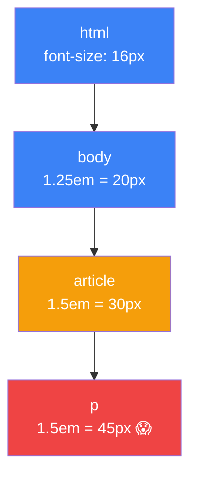

# Типографіка в CSS. Шрифти та текст

## Чому деякі сайти читаються легко, а інші — як крізь матове скло?

Відкрийте два сайти: один — блог із вдало підібраним шрифтом, комфортними міжрядковими інтервалами та правильною ієрархією заголовків. Інший — із дрібним текстом, тісними рядками та кричущим шрифтом. Контент може бути однаково цікавим, але перший ви дочитаєте, а другий закриєте через 10 секунд.

**Типографіка** (_Typography_) — мистецтво оформлення тексту — це 95% веб-дизайну. Більшість інформації в інтернеті — саме текст. І CSS дає повний контроль над тим, як цей текст виглядає: від вибору шрифту до відстані між літерами.

У [попередній статті](/12.html-css/10.css-box-model) ми розібрали блокову модель — **розміри та відступи** елементів. Тепер поринемо в те, що **всередині** цих коробок — у текст та його оформлення.

::card-group

::card{title="🔤 Шрифти" icon="i-heroicons-language"}

Вибір гарнітури (font-family), підключення кастомних шрифтів, Google Fonts, стек шрифтів.

::

::card{title="📏 Розміри" icon="i-heroicons-arrows-up-down"}

px, em, rem, %, vw, vh — коли і яку одиницю використовувати.

::

::card{title="📝 Оформлення тексту" icon="i-heroicons-pencil-square"}

Вирівнювання, міжрядковий інтервал, інтервал між літерами, декорації.

::

::card{title="🎨 Система типографіки" icon="i-heroicons-swatch"}

CSS Custom Properties для побудови узгодженої типографічної системи.

::

::

---

Властивість `font-family` визначає **яким шрифтом** відображати текст. Це перше, що впливає на сприйняття сайту.

### Як ОС рендерить шрифти
Перш ніж розглядати підключення шрифтів, важливо розуміти: один і той самий шрифт може і буде виглядати **по-різному** на Windows та macOS. Це пов'язано з тим, як різні операційні системи виконують **згладжування шрифтів (anti-aliasing)**:

- **macOS (Apple)** історично віддавала перевагу збереженню *оригінального дизайну* шрифту. Тому на маках літери можуть здаватися трохи більш жирними або "пухнастими", зберігаючи свої точні пропорції.
- **Windows (Microsoft)** через технологію ClearType історично віддавала перевагу *чіткості читання* на екранах (прив'язка до піксельної сітки). Тому на Windows той самий шрифт може виглядати різкішим, тоншим і більш геометричним.

Веб-платформа майже не дає контролю над цим процесом (хоча існують нестандартні властивості типу `-webkit-font-smoothing: antialiased`, що роблять текст тоншим на macOS, але їх використання часто критикують за шкоду доступності). Тому ваша задача — не зробити шрифт ідентичним на кожному пристрої, а вибрати такий `font-family`, який буде виглядати **однаково добре** при різних алгоритмах рендерингу.

### Стек шрифтів (Font Stack)

`font-family` приймає **список** шрифтів, розділених комами. Браузер використовує перший доступний:

::html-preview
```html
<p class="font-stack-demo">
    Цей текст використовує стек шрифтів. Якщо 'Inter' недоступний, браузер спробує 'Segoe UI', потім 'Roboto' і так далі.
</p>
```
```css
.font-stack-demo {
    font-family: 'Inter', 'Segoe UI', Roboto, 'Helvetica Neue', Arial, sans-serif;
    font-size: 1.1rem;
    color: #1e293b;
    padding: 1rem;
    background: #f8fafc;
    border-radius: 8px;
    border: 1px solid #e2e8f0;
}
```
::

```css
body {
    font-family: 'Inter', 'Segoe UI', Roboto, 'Helvetica Neue', Arial, sans-serif;
}
```

Браузер обробляє цей список зліва направо:

1. **Inter** — встановлений? Так → використовує. Ні → переходить далі.
2. **Segoe UI** — системний шрифт Windows.
3. **Roboto** — системний шрифт Android.
4. **Helvetica Neue** — системний шрифт macOS.
5. **Arial** — є на більшості систем.
6. **sans-serif** — «родове ім'я» — браузер обере будь-який доступний шрифт без засічок.

::note
Шрифти з пробілами у назві обов'язково беруться у лапки: `'Segoe UI'`, `'Times New Roman'`. Одне слово — можна без лапок: `Arial`, `Georgia`.

::

### Родові сімейства (Generic Families)

Останнім у стеку завжди має стояти **родове сімейство** — це «план Б» на випадок, якщо жоден конкретний шрифт недоступний:

::html-preview

```html
<p class="serif">Serif — шрифт із засічками (Times New Roman, Georgia)</p>
<p class="sans-serif">Sans-serif — без засічок (Arial, Helvetica, Inter)</p>
<p class="monospace">Monospace — моноширинний (Courier, Consolas, Fira Code)</p>
<p class="cursive">Cursive — рукописний (Comic Sans MS, Brush Script)</p>
```

```css
p {
    font-size: 1.1rem;
    margin: 0.75rem 0;
    padding: 0.5rem;
    border-radius: 4px;
    background-color: #f8fafc;
}

.serif {
    font-family: Georgia, 'Times New Roman', serif;
    border-left: 4px solid #3b82f6;
}

.sans-serif {
    font-family: 'Segoe UI', Arial, sans-serif;
    border-left: 4px solid #10b981;
}

.monospace {
    font-family: 'Fira Code', Consolas, 'Courier New', monospace;
    border-left: 4px solid #f59e0b;
}

.cursive {
    font-family: 'Brush Script MT', cursive;
    border-left: 4px solid #8b5cf6;
}
```

::

| Родове сімейство | Характеристика        | Використання                                   |
| ---------------- | --------------------- | ---------------------------------------------- |
| `serif`          | З засічками           | Друкований стиль, довгі тексти (книги, статті) |
| `sans-serif`     | Без засічок           | Веб-інтерфейси, заголовки, сучасний дизайн     |
| `monospace`      | Однакова ширина літер | Код, термінал, табличні дані                   |
| `cursive`        | Рукописний            | Декоративні акценти (обережно!)                |
| `fantasy`        | Декоративний          | Дуже рідко — результат непередбачуваний        |
| `system-ui`      | Системний UI-шрифт    | Інтерфейси, що відповідають стилю ОС           |

::tip
`system-ui` — сучасна альтернатива довгим стекам. Він автоматично обирає шрифт, який операційна система використовує для свого інтерфейсу (San Francisco на macOS, Segoe UI на Windows, Roboto на Android):

```css
body {
    font-family: system-ui, sans-serif;
}
```

::

---

## Підключення зовнішніх шрифтів

Системних шрифтів часто недостатньо для унікального дизайну. CSS дозволяє завантажити **будь-який** шрифт.

### Google Fonts — найпростіший спосіб

[Google Fonts](https://fonts.google.com/) — безкоштовна бібліотека з 1500+ шрифтів. Підключення — одним рядком у `<head>`:

::steps

### Крок 1: Оберіть шрифт на Google Fonts

Перейдіть на [fonts.google.com](https://fonts.google.com/) та оберіть шрифт. Наприклад, **Inter** — один із найпопулярніших для веб-інтерфейсів.

### Крок 2: Скопіюйте тег `<link>`

Google Fonts надасть HTML-код для підключення:

```html
<head>
    <link rel="preconnect" href="https://fonts.googleapis.com" />
    <link rel="preconnect" href="https://fonts.gstatic.com" crossorigin />
    <link href="https://fonts.googleapis.com/css2?family=Inter:wght@400;500;600;700&display=swap" rel="stylesheet" />
</head>
```

### Крок 3: Використайте у CSS

```css
body {
    font-family: 'Inter', sans-serif;
}
```

::

::note
Рядки `preconnect` — це **оптимізація швидкості**: браузер заздалегідь встановлює з'єднання з сервером Google, щоб шрифт завантажився швидше. Параметр `display=swap` забезпечує показ тексту системним шрифтом, поки завантажується зовнішній (це керує завантажувальною стратегією і вирішує проблему FOIT — детальніше читайте нижче в розділі про `@font-face`).
::

### `@font-face` — повний контроль

Якщо шрифт не на Google Fonts, або ви хочете **самостійно хостити** файли (для швидкості та приватності), використовуйте `@font-face`:

```css
@font-face {
    font-family: 'CustomFont';
    src:
        url('/fonts/CustomFont-Regular.woff2') format('woff2'),
        url('/fonts/CustomFont-Regular.woff') format('woff');
    font-weight: 400;
    font-style: normal;
    font-display: swap;
}

@font-face {
    font-family: 'CustomFont';
    src:
        url('/fonts/CustomFont-Bold.woff2') format('woff2'),
        url('/fonts/CustomFont-Bold.woff') format('woff');
    font-weight: 700;
    font-style: normal;
    font-display: swap;
}

body {
    font-family: 'CustomFont', sans-serif;
}
```

::field-group
::field{name="font-family" type="string" required}
Ім'я, під яким шрифт буде доступний у CSS. Може бути будь-яким — ви його вигадуєте самі.

::
::field{name="src" type="url + format"}
Шлях до файлу шрифту та його формат. `woff2` — сучасний стислий формат, `woff` — фолбек для старих браузерів.

::
::field{name="font-weight" type="number"}
Вага, для якої цей файл призначений (400 = normal, 700 = bold). Дозволяє браузеру обрати правильний файл.

::
::field{name="font-display" type="string"}
Стратегія завантаження. Коли браузер зустрічає кастомний шрифт, йому потрібен час на файл `woff2`. Що показувати користувачу цей час? 
Існує дві проблеми недозавантажених шрифтів:
- **FOIT (Flash of Invisible Text):** Текст стає невидимим на кілька секунд, поки шрифт качається. Це дуже погано для UX.
- **FOUT (Flash of Unstyled Text):** Спочатку відображається системний шрифт, а коли кастомний завантажується — текст різко (і неприємно) «змінює свій вигляд» (блимає). 

Значення `swap` (рекомендовано більшістю) каже браузеру: "одразу покажи FOUT, ніколи не роби текст невидимим (уникай FOIT)". Значення `optional` (ідеально для швидкості): "Дай шрифту 100мс; якщо він не завантажився - використовуй системний шрифт, і **не** міняй його, коли файл врешті докачається (уникай FOUT). Шрифт буде застосований лише з наступного завантаження сторінки з кешу".
::
::

::warning
Формат **woff2** — обов'язковий мінімум для сучасного вебу (стиснення ~30% краще за woff). Формати `ttf`, `otf`, `svg` — застарілі для веб-використання. Конвертувати шрифти можна на [google-webfonts-helper](https://gwfh.mranftl.com/).

::

### Порівняння підходів

::card-group

::card{title="Google Fonts" icon="i-simple-icons-googlefonts"}

- ✅ Найпростіше підключення
- ✅ CDN з кешуванням
- ✅ 1500+ безкоштовних шрифтів
- ❌ Залежність від Google CDN
- ❌ Запит до зовнішнього сервера (GDPR у ЄС)

::

::card{title="Самостійний хостинг (@font-face)" icon="i-heroicons-server"}

- ✅ Повний контроль
- ✅ Немає зовнішніх залежностей
- ✅ Відповідність GDPR
- ❌ Потрібно самостійно оптимізувати файли
- ❌ Немає автоматичного кешування CDN

::

::card{title="Системні шрифти (system-ui)" icon="i-heroicons-computer-desktop"}

- ✅ Нуль часу завантаження
- ✅ Рідний вигляд для ОС
- ✅ Мінімальний розмір CSS
- ❌ Різний вигляд на різних ОС
- ❌ Обмежений вибір

::

::

---

## Розмір шрифту — `font-size`

Розмір тексту — одна з найважливіших властивостей. Але CSS пропонує **десяток** одиниць виміру. Як обрати правильну?

### Проблема Pixel Perfect та доступності (Accessibility)
Раніше веб-дизайнери створювали "pixel perfect" сайти, де кожен елемент відповідав макету до пікселя. Такий підхід жахливий для доступності. Згідно з дослідженнями, значний відсоток користувачів (особливо з вадами зору або старшого віку) змінюють **базовий розмір шрифту браузера** у налаштуваннях (за замовчуванням це `16px`, але люди часто ставлять `20px` або більше).

Якщо ви задали вашому тексту жорсткий розмір `font-size: 16px;`, браузер **проігнорує** налаштування користувача. Текст залишиться дрібним, а сайт стане незручним для читання.

Тому сучасний підхід до веб-типографіки вимагає використання **відносних одиниць** (`rem`, `em`), які здатні масштабуватися разом із налаштуваннями ОС та браузера.

### Пікселі (`px`) — абсолютна одиниця

```css
h1 {
    font-size: 32px;
}
p {
    font-size: 16px;
}
```

::html-preview

```html
<p class="text-12">12px — замалий для основного тексту</p>
<p class="text-16">16px — стандартний розмір (default у браузерах)</p>
<p class="text-20">20px — збільшений, комфортний для читання</p>
<p class="text-32">32px — заголовок</p>
```

```css
p {
    margin: 0.5rem 0;
    color: #1e293b;
    font-family: system-ui, sans-serif;
}
.text-12 {
    font-size: 12px;
}
.text-16 {
    font-size: 16px;
}
.text-20 {
    font-size: 20px;
}
.text-32 {
    font-size: 32px;
}
```

::

**Переваги:** простота, передбачуваність — 16px завжди 16px (що добре для мікро-елементів інтерфейсу, наприклад декоративних бейджів або дрібних іконок, які не повинні масштабуватися і ламати сітку).

**Недолік:** жорстко закріплений дизайн, який ігнорує потреби людей з вадами зору, про що ми говорили вище. Ніколи не використовуйте `px` для читабельного тексту абзаців або заголовків!

### `em` — відносно батька

`1em` дорівнює `font-size` **батьківського елемента**:

::html-preview

```html
<div class="parent-em">
    <p>Батько: font-size: 20px</p>
    <p class="child-1em">Дитина: font-size: 1em = 20px</p>
    <p class="child-1-5em">Дитина: font-size: 1.5em = 30px</p>
    <p class="child-0-8em">Дитина: font-size: 0.8em = 16px</p>
</div>
```

```css
.parent-em {
    font-size: 20px;
    font-family: system-ui, sans-serif;
    color: #1e293b;
    background-color: #f8fafc;
    padding: 1rem;
    border-radius: 8px;
    border: 2px solid #e2e8f0;
}

.parent-em p {
    margin: 0.3rem 0;
}

.child-1em {
    font-size: 1em;
} /* 20px × 1 = 20px */
.child-1-5em {
    font-size: 1.5em;
} /* 20px × 1.5 = 30px */
.child-0-8em {
    font-size: 0.8em;
} /* 20px × 0.8 = 16px */
```

::

::caution
`em` **каскадується** — і це головна пастка. Якщо вкладений елемент має `font-size: 1.5em`, а його дитина теж `1.5em`, то результат — `1.5 × 1.5 = 2.25em` від початкового розміру. З кожним рівнем вкладеності ефект множиться:

::

::mermaid



::

### `rem` — відносно кореня (рекомендовано)

`1rem` **завжди** дорівнює `font-size` кореневого елемента `<html>` (за замовчуванням — `16px`):

::html-preview

```html
<div class="rem-demo">
    <h2>Заголовок: 2rem = 32px</h2>
    <p class="large">Збільшений: 1.25rem = 20px</p>
    <p>Стандартний: 1rem = 16px</p>
    <p class="small">Малий: 0.875rem = 14px</p>
    <div class="nested">
        <p>Вкладений блок — rem НЕ каскадується!</p>
        <div class="nested">
            <p>Ще глибше — все одно 1rem = 16px</p>
        </div>
    </div>
</div>
```

```css
.rem-demo {
    font-family: system-ui, sans-serif;
    color: #1e293b;
}

.rem-demo h2 {
    font-size: 2rem; /* 16 × 2 = 32px */
    margin: 0 0 0.5rem;
    color: #1e40af;
}

.rem-demo p {
    font-size: 1rem; /* 16 × 1 = 16px */
    margin: 0.25rem 0;
}

.rem-demo .large {
    font-size: 1.25rem; /* 16 × 1.25 = 20px */
}

.rem-demo .small {
    font-size: 0.875rem; /* 16 × 0.875 = 14px */
    color: #64748b;
}

.nested {
    padding-left: 1rem;
    border-left: 2px solid #e2e8f0;
    margin: 0.5rem 0;
}
```

::

::tip
**Правило сучасного CSS:** використовуйте `rem` для `font-size` — він не каскадується і поважає налаштування користувача. Використовуйте `em` для `padding` та `margin` **всередині** компонента — вони масштабуватимуться разом із розміром тексту.

::

### Порівняння одиниць

| Одиниця | Відносно чого        | Каскадується | Коли використовувати                                     |
| ------- | -------------------- | :----------: | -------------------------------------------------------- |
| `px`    | Абсолютна            |      —       | `border`, `box-shadow`, `outline` — де потрібна точність |
| `em`    | `font-size` батька   |      ✅      | `padding`, `margin` всередині компонента                 |
| `rem`   | `font-size` `<html>` |      ❌      | `font-size`, глобальні інтервали                         |
| `%`     | Батьківський елемент |      ✅      | `width`, `max-width`                                     |
| `vw`    | 1% ширини viewport   |      —       | Fluid typography, повноекранні секції                    |
| `vh`    | 1% висоти viewport   |      —       | Повноекранні секції (`height: 100vh`)                    |
| `ch`    | Ширина символу «0»   |      —       | Обмеження ширини тексту (`max-width: 65ch`)              |

::note
`ch` — елегантна одиниця для типографіки. Рядок у 50–75 символів вважається **оптимальним** для читання. `max-width: 65ch` — це стандарт для текстових блоків.

::

---

## Стилізація шрифту

### `font-weight` — жирність

::html-preview

```html
<p class="w-100">100 — Thin (Тонкий)</p>
<p class="w-300">300 — Light (Легкий)</p>
<p class="w-400">400 — Regular (Звичайний) = normal</p>
<p class="w-500">500 — Medium (Середній)</p>
<p class="w-600">600 — Semi-Bold (Напівжирний)</p>
<p class="w-700">700 — Bold (Жирний) = bold</p>
<p class="w-900">900 — Black (Чорний)</p>
```

```css
p {
    margin: 0.3rem 0;
    font-family: system-ui, sans-serif;
    font-size: 1rem;
    color: #1e293b;
}
.w-100 {
    font-weight: 100;
}
.w-300 {
    font-weight: 300;
}
.w-400 {
    font-weight: 400;
}
.w-500 {
    font-weight: 500;
}
.w-600 {
    font-weight: 600;
}
.w-700 {
    font-weight: 700;
}
.w-900 {
    font-weight: 900;
}
```

::

::warning
Не всі шрифти мають всі 9 рівнів жирності. Якщо запитана вага відсутня, браузер обере **найближчу доступну**. Наприклад, стандартний Arial має лише `400` та `700`. При підключенні Google Fonts обирайте потрібні ваги явно: `?family=Inter:wght@400;600;700`.

::

### `font-style` — курсив

::html-preview
```html
<p class="fs-normal">font-style: normal — Звичайний текст</p>
<p class="fs-italic">font-style: italic — Спеціальний курсивний шрифт</p>
<p class="fs-oblique">font-style: oblique — Штучно нахилений шрифт</p>
```
```css
p {
    margin: 0.5rem 0;
    font-family: Georgia, serif;
    font-size: 1.1rem;
    color: #1e293b;
}
.fs-normal { font-style: normal; }
.fs-italic { font-style: italic; color: #3b82f6; }
.fs-oblique { font-style: oblique; color: #10b981; }
```
::

```css
.normal {
    font-style: normal;
} /* Звичайний */
.italic {
    font-style: italic;
} /* Курсив */
.oblique {
    font-style: oblique;
} /* Нахилений (імітація курсиву) */
```

::note
`italic` і `oblique` виглядають схоже, але `italic` — це **окреслений** курсивний варіант шрифту (спеціально розроблений дизайнером для кращої читабельності та гармонії літер). `oblique` — просто **програмно нахилена** браузером версія звичайного прямого шрифту. Якщо ви використовуєте `italic`, але завантажений шрифт не має italic-файлу (наприклад, ви підключили лише `wght@400`), браузер автоматично застосує oblique як фолбек, щоб якось виділити текст.
::

### `font-variant` — капітель

::html-preview
```html
<p class="fv-normal">Звичайний Текст: The Quick Brown Fox</p>
<p class="fv-small-caps">Small Caps Текст: The Quick Brown Fox</p>
```
```css
p {
    margin: 0.5rem 0;
    font-family: system-ui, sans-serif;
    font-size: 1.1rem;
    color: #1e293b;
}
.fv-normal { font-variant: normal; }
.fv-small-caps { font-variant: small-caps; color: #8b5cf6; font-weight: 600; }
```
::

```css
.small-caps {
    font-variant: small-caps; /* ВЕЛИКІ літери, але розміру малих */
}
```

### Скорочення `font`

Всі властивості шрифту можна задати одним рядком:

```css
/* font: style weight size/line-height family; */
body {
    font:
        normal 400 1rem/1.6 'Inter',
        sans-serif;
}

h1 {
    font:
        italic 700 2.5rem/1.2 Georgia,
        serif;
}
```

::caution
Порядок у скороченні `font` — **фіксований**. `font-size` та `font-family` — **обов'язкові**. Якщо пропустити будь-яку з них, все правило буде проігноровано. Через цю крихкість багато розробників обирають писати кожну властивість **окремо**.

::

---

## Оформлення тексту

### `line-height` — міжрядковий інтервал

Це одна з **найважливіших** властивостей для читабельності, основа так званого **вертикального ритму (Vertical Rhythm)**.

Коли ми читаємо абзац тексту, наше око має легко перескакувати з кінця одного рядка на початок наступного. Якщо інтервал занадто тісний — рядки зливаються у суцільну пляму, і ми губимося. Якщо занадто широкий — око втрачає зв'язок між рядками, сприймаючи їх як окремі речення, що вповільнює читання.

Ідеальний `line-height` залежить від ширини текстового блоку (чим довший рядок, тим більшим має бути інтервал, щоб оку було легше знайти початок наступного рядка) та розміру шрифту.

::html-preview

```html
<div class="lh-demo">
    <div class="lh-1">
        <strong>line-height: 1</strong><br />
        Тісний текст. Рядки зливаються та стає важко читати. Такий інтервал — рідко доречний для основного тексту.
    </div>
    <div class="lh-1-4">
        <strong>line-height: 1.4</strong><br />
        Мінімальний комфортний інтервал. Підходить для заголовків та коротких блоків тексту, де простір обмежений.
    </div>
    <div class="lh-1-6">
        <strong>line-height: 1.6 ✅</strong><br />
        Оптимальний інтервал для основного тексту. Забезпечує комфортне читання довгих абзаців на екрані.
    </div>
    <div class="lh-2">
        <strong>line-height: 2</strong><br />
        Подвійний інтервал. Занадто просторий для веб-тексту, але може бути корисним для документів або лендінгів.
    </div>
</div>
```

```css
.lh-demo {
    font-family: system-ui, sans-serif;
    font-size: 0.9rem;
    color: #1e293b;
    display: grid;
    gap: 0.75rem;
}

.lh-demo > div {
    padding: 0.75rem 1rem;
    border-radius: 6px;
    border: 1px solid #e2e8f0;
    background-color: #f8fafc;
}

.lh-1 {
    line-height: 1;
}
.lh-1-4 {
    line-height: 1.4;
}
.lh-1-6 {
    line-height: 1.6;
    border-color: #10b981;
    background-color: #dcfce7;
}
.lh-2 {
    line-height: 2;
}
```

::

::tip
**Правило для `line-height`:** використовуйте **безрозмірне число** (без одиниць): `line-height: 1.6`. Це значення множиться на поточний `font-size`, що коректно працює з наслідуванням. `line-height: 24px` або `line-height: 1.6em` — прив'язані до конкретного значення і можуть зламатись у вкладених елементах із різним `font-size`.

::

### `letter-spacing` та `word-spacing` (Трекінг та Мікротипографіка)

У професійній типографіці існують два різних поняття для відстані між літерами:
1. **Кернінг (Kerning)** — це відстань між *конкретними парами літер*, щоб вони виглядали гармонійно (наприклад, літери `A` та `V` краще виглядають, коли трохи "наповзають" одна на одну). Сучасні шрифти вже містять вбудовані таблиці кернінгу, і браузер застосовує їх автоматично (через властивість `font-kerning: auto`).
2. **Трекінг (Tracking)** — це рівномірне розсування або стискання відстані між *усіма* літерами у слові чи реченні. Саме цим керує CSS-властивість `letter-spacing`.

::html-preview

```html
<p class="ls-tight">letter-spacing: -0.02em — Щільний текст</p>
<p class="ls-normal">letter-spacing: normal — Стандартний</p>
<p class="ls-wide">letter-spacing: 0.05em — Розріджений</p>
<p class="ls-caps">LETTER-SPACING: 0.1EM — ВЕЛИКІ ЛІТЕРИ</p>
<hr />
<p class="ws-tight">word-spacing: -2px — Слова ближче</p>
<p class="ws-normal">word-spacing: normal — Стандартний</p>
<p class="ws-wide">word-spacing: 0.5em — Слова далі</p>
```

```css
p {
    margin: 0.4rem 0;
    font-family: system-ui, sans-serif;
    font-size: 1rem;
    color: #1e293b;
}

.ls-tight {
    letter-spacing: -0.02em;
}
.ls-normal {
    letter-spacing: normal;
}
.ls-wide {
    letter-spacing: 0.05em;
}
.ls-caps {
    letter-spacing: 0.1em;
    text-transform: uppercase;
    font-weight: 600;
}

hr {
    border: none;
    border-top: 1px solid #e2e8f0;
    margin: 0.75rem 0;
}

.ws-tight {
    word-spacing: -2px;
}
.ws-normal {
    word-spacing: normal;
}
.ws-wide {
    word-spacing: 0.5em;
}
```

::

::note
**Золоте правило мікротипографіки:** 
- **Великі літери** (uppercase) створені так, що їх вертикальні лінії візуально зливаються, якщо стоять надто близько. Тому тексту ВЕЛИКИМИ ЛІТЕРАМИ (наприклад, у заголовках або кнопках) **завжди** потрібен додатковий розрізнений `letter-spacing` (tracking) для кращої читабельності.
- **Малі літери** (lowercase) вже мають необхідний природний "повітряний" простір завдяки своїм виносним елементам (як у `g`, `p`, `b`, `d`). Додавання їм `letter-spacing` найчастіше **псує** читабельність. Для звичайного тексту залишайте `normal` або ледь зменшуйте (`-0.01em` / `-0.02em`) для дуже великих заголовків (оскільки при великих `font-size` оптичний простір між літерами здається занадто великим).
::

### `text-align` — вирівнювання

::html-preview

```html
<p class="ta-left">text-align: left — Ліве вирівнювання (за замовчуванням для LTR мов)</p>
<p class="ta-center">text-align: center — Центральне вирівнювання</p>
<p class="ta-right">text-align: right — Праве вирівнювання</p>
<p class="ta-justify">
    text-align: justify — Вирівнювання по ширині. Текст розтягується, щоб досягти обох країв контейнера. Може утворювати
    «річки» пробілів у тексті, особливо в вузьких колонках.
</p>
```

```css
p {
    margin: 0.5rem 0;
    padding: 0.75rem 1rem;
    border: 1px solid #e2e8f0;
    border-radius: 4px;
    font-family: system-ui, sans-serif;
    font-size: 0.9rem;
    color: #1e293b;
    background-color: #f8fafc;
}

.ta-left {
    text-align: left;
}
.ta-center {
    text-align: center;
}
.ta-right {
    text-align: right;
}
.ta-justify {
    text-align: justify;
}
```

::

### `text-decoration` — підкреслення та декорації

::html-preview

```html
<p class="td-none">text-decoration: none — без декорації</p>
<p class="td-underline">text-decoration: underline — підкреслення</p>
<p class="td-overline">text-decoration: overline — надкреслення</p>
<p class="td-line-through">text-decoration: line-through — закреслення</p>
<p class="td-custom">Кастомне підкреслення: синє, хвилясте, 2px</p>
```

```css
p {
    margin: 0.4rem 0;
    font-family: system-ui, sans-serif;
    font-size: 1rem;
    color: #1e293b;
}

.td-none {
    text-decoration: none;
}
.td-underline {
    text-decoration: underline;
}
.td-overline {
    text-decoration: overline;
}
.td-line-through {
    text-decoration: line-through;
    color: #94a3b8;
}
.td-custom {
    text-decoration: underline wavy #3b82f6 2px;
}
```

::

::tip
Сучасний CSS дозволяє тонко налаштувати підкреслення за допомогою окремих властивостей. Це дає змогу створювати красиві ефекти при наведенні або акценти в тексті.

::html-preview
```html
<p class="td-color">Текст із <a href="#" class="link-color">зеленим підкресленням</a></p>
<p class="td-style">Різні стилі: <span class="s-double">double</span>, <span class="s-dotted">dotted</span>, <span class="s-dashed">dashed</span>, <span class="s-wavy">wavy</span></p>
<p class="td-thickness">Керування товщиною: <a href="#" class="link-thick">дуже товста лінія (4px)</a></p>
<p class="td-offset">Зсув лінії: <a href="#" class="link-offset">підкреслення відсунуте вниз (4px)</a></p>
<p class="td-combined"><strong>Ідеальне посилання:</strong> <a href="#" class="link-perfect">Наведи на мене мишкою</a></p>
```
```css
p {
    margin: 0.75rem 0;
    font-family: system-ui, sans-serif;
    font-size: 1.05rem;
    color: #1e293b;
}

a {
    color: #3b82f6;
    text-decoration: underline;
    transition: all 0.2s ease;
}

/* 1. Колір лінії */
.link-color {
    text-decoration-color: #10b981; /* Смарагдовий */
}

/* 2. Стиль лінії */
.s-double { text-decoration: underline double #ef4444; }
.s-dotted { text-decoration: underline dotted #3b82f6; }
.s-dashed { text-decoration: underline dashed #f59e0b; }
.s-wavy { text-decoration: underline wavy #8b5cf6; }

/* 3. Товщина лінії */
.link-thick {
    text-decoration-thickness: 4px;
    text-decoration-color: #fca5a5;
}

/* 4. Зсув лінії */
.link-offset {
    text-underline-offset: 4px; /* Відсуває лінію від тексту */
    text-decoration-color: #93c5fd;
}

/* 5. Комбінація для красивих посилань */
.link-perfect {
    text-decoration-color: rgba(59, 130, 246, 0.3); /* Напівпрозора лінія */
    text-decoration-thickness: 2px;
    text-underline-offset: 3px;
}
.link-perfect:hover {
    text-decoration-color: rgba(59, 130, 246, 1); /* Суцільна лінія при наведенні */
}
```
::
::

### `text-transform` — трансформація регістру

::html-preview
```html
<p class="tt-uppercase">це був текст малими літерами (uppercase)</p>
<p class="tt-lowercase">ЦЕ БУВ ТЕКСТ ВЕЛИКИМИ ЛІТЕРАМИ (lowercase)</p>
<p class="tt-capitalize">це був текст з малої літери (capitalize)</p>
<p class="tt-none">Текст яК В  OriGInaLi (none)</p>
```
```css
p {
    margin: 0.5rem 0;
    font-family: system-ui, sans-serif;
    font-size: 1.1rem;
    color: #1e293b;
    padding: 0.5rem;
    background: #f8fafc;
    border-radius: 4px;
    border-left: 3px solid #3b82f6;
}
.tt-uppercase { text-transform: uppercase; letter-spacing: 0.05em; }
.tt-lowercase { text-transform: lowercase; }
.tt-capitalize { text-transform: capitalize; }
.tt-none { text-transform: none; }
```
::

```css
.uppercase {
    text-transform: uppercase;
} /* ВЕЛИКІ ЛІТЕРИ */
.lowercase {
    text-transform: lowercase;
} /* малі літери */
.capitalize {
    text-transform: capitalize;
} /* Перша Літера Кожного Слова */
.none {
    text-transform: none;
} /* Як у HTML */
```

::note
`text-transform` змінює лише **візуальне відображення**, а не реальний текст в HTML. Якщо користувач скопіює текст `.uppercase`, він вставиться в оригінальному регістрі. Також для SEO (пошукових систем) та Screen Readers (читалок для сліпих) текст залишається оригінальним. Тому завжди краще використовувати `text-transform`, ніж жорстко писати КАПСОМ у самому HTML.
::

---

## Обрізання тексту — `text-overflow`

Часто текст не вміщується в обмежений простір — наприклад, заголовок картки. CSS дозволяє це елегантно обробити:

### Однорядкове обрізання (ellipsis)

::html-preview

```html
<div class="card-title">Дуже довгий заголовок картки, який точно не вміститься в одному рядку контейнера</div>
<div class="card-title">Короткий заголовок</div>
```

```css
.card-title {
    width: 300px;
    padding: 0.75rem 1rem;
    margin: 0.5rem 0;
    font-family: system-ui, sans-serif;
    font-size: 1rem;
    color: #1e293b;
    background-color: #f8fafc;
    border: 1px solid #e2e8f0;
    border-radius: 6px;

    /* Три обов'язкові властивості для ellipsis */
    white-space: nowrap; /* Заборонити перенос */
    overflow: hidden; /* Приховати те, що не вміщується */
    text-overflow: ellipsis; /* Додати «...» */
}
```

::

Три властивості працюють **разом** — прибрати будь-яку — і трикрапка зникне:

::field-group
::field{name="white-space: nowrap" type="string" required}
Забороняє перенос тексту на новий рядок — весь текст в одному рядку.

::
::field{name="overflow: hidden" type="string" required}
Приховує вміст, що виходить за межі елемента.

::
::field{name="text-overflow: ellipsis" type="string" required}
Замінює обрізаний текст на символ «…» (трикрапка).

::

::

### Багаторядкове обрізання (`-webkit-line-clamp`)

::html-preview

```html
<div class="card-text">
    Це довгий текст, який має бути обрізаний після трьох рядків. Він продовжується далі та далі, щоб продемонструвати,
    як працює багаторядкове обрізання тексту за допомогою CSS. Весь текст, що не вміщується, буде замінений трикрапкою.
</div>
```

```css
.card-text {
    width: 300px;
    padding: 1rem;
    font-family: system-ui, sans-serif;
    font-size: 0.9rem;
    color: #1e293b;
    line-height: 1.6;
    background-color: #f8fafc;
    border: 1px solid #e2e8f0;
    border-radius: 6px;

    /* Багаторядкова трикрапка */
    display: -webkit-box;
    -webkit-line-clamp: 3; /* Кількість рядків */
    -webkit-box-orient: vertical;
    overflow: hidden;
}
```

::

::warning
`-webkit-line-clamp` використовує застарілий `-webkit-` синтаксис, але підтримується **усіма** сучасними браузерами, включно з Firefox та Safari. Стандартизована властивість `line-clamp` (без префікса) поки what на стадії розробки.

::

---

## CSS Custom Properties для типографіки

CSS-змінні (_Custom Properties_) дозволяють створити **узгоджену систему типографіки** для всього проєкту:

```css
:root {
    /* Шкала розмірів */
    --font-size-xs: 0.75rem; /* 12px */
    --font-size-sm: 0.875rem; /* 14px */
    --font-size-base: 1rem; /* 16px */
    --font-size-lg: 1.125rem; /* 18px */
    --font-size-xl: 1.25rem; /* 20px */
    --font-size-2xl: 1.5rem; /* 24px */
    --font-size-3xl: 2rem; /* 32px */
    --font-size-4xl: 2.5rem; /* 40px */

    /* Шрифтові сімейства */
    --font-sans: 'Inter', system-ui, sans-serif;
    --font-serif: Georgia, 'Times New Roman', serif;
    --font-mono: 'Fira Code', Consolas, monospace;

    /* Ваги */
    --font-normal: 400;
    --font-medium: 500;
    --font-semibold: 600;
    --font-bold: 700;

    /* Міжрядкові інтервали */
    --leading-tight: 1.25;
    --leading-normal: 1.6;
    --leading-relaxed: 1.75;
}
```

Використання:

::html-preview
```html
<div class="typo-system-demo">
    <h1>Головний Заголовок Сторінки</h1>
    <h2>Підзаголовок Секції</h2>
    <p>
        Це основний текст. Він використовує <code>var(--font-sans)</code> для гарнітури та має комфортний міжрядковий
        інтервал <code>var(--leading-normal)</code> для забезпечення максимальної читабельності. Ми також змінили колір
        тексту на темно-сірий, щоб зменшити контрастність і зняти напругу з очей.
    </p>
</div>
```
```css
.typo-system-demo {
    /* Симуляція :root */
    --font-size-sm: 0.875rem; 
    --font-size-base: 1rem; 
    --font-size-3xl: 2rem; 
    --font-size-4xl: 2.5rem; 

    --font-sans: 'Inter', system-ui, sans-serif;
    --font-mono: 'Fira Code', Consolas, monospace;

    --font-normal: 400;
    --font-semibold: 600;
    --font-bold: 700;

    --leading-tight: 1.25;
    --leading-normal: 1.6;

    background: white;
    padding: 2rem;
    border-radius: 8px;
    border: 1px solid #e2e8f0;
}

/* Використання змінних */
.typo-system-demo {
    font-family: var(--font-sans);
    font-size: var(--font-size-base);
    line-height: var(--leading-normal);
    color: #1e293b;
    margin: 0;
}
.typo-system-demo h1 {
    font-size: var(--font-size-4xl);
    font-weight: var(--font-bold);
    line-height: var(--leading-tight);
    margin: 0 0 1rem;
    color: #0f172a;
}
.typo-system-demo h2 {
    font-size: var(--font-size-3xl);
    font-weight: var(--font-semibold);
    line-height: var(--leading-tight);
    margin: 1.5rem 0 0.75rem;
    color: #1e40af;
}
.typo-system-demo p { margin: 0; }
.typo-system-demo code {
    font-family: var(--font-mono);
    font-size: var(--font-size-sm);
    background: #f1f5f9;
    padding: 0.2em 0.4em;
    border-radius: 4px;
    color: #db2777;
}
```
::

```css
body {
    font-family: var(--font-sans);
    font-size: var(--font-size-base);
    line-height: var(--leading-normal);
    color: #1e293b;
}

h1 {
    font-size: var(--font-size-4xl);
    font-weight: var(--font-bold);
    line-height: var(--leading-tight);
}

h2 {
    font-size: var(--font-size-3xl);
    font-weight: var(--font-semibold);
    line-height: var(--leading-tight);
}

code {
    font-family: var(--font-mono);
    font-size: var(--font-size-sm);
}
```

::tip
**Навіщо змінні?** Якщо потрібно збільшити базовий розмір тексту на всьому сайті — змінюєте **одне значення** в `:root`, і вся типографіка масштабується автоматично. Без змінних — довелось би шукати та змінювати десятки значень у різних файлах.

::

---

## Fluid Typography — адаптивний розмір тексту

Замість медіа-запитів для зміни розміру тексту на різних екранах, CSS пропонує **плавне масштабування** через функцію `clamp()`:

```css
h1 {
    /* clamp(мінімум, ідеальне значення, максимум) */
    font-size: clamp(1.5rem, 4vw, 3rem);
}
```

::html-preview

```html
<h1 class="fluid-heading">Цей заголовок адаптується плавно</h1>
<p class="fluid-text">А цей текст теж масштабується, але в меншому діапазоні. Спробуйте змінити ширину вікна.</p>
```

```css
.fluid-heading {
    font-family: system-ui, sans-serif;
    font-size: clamp(1.5rem, 4vw, 3rem);
    font-weight: 700;
    color: #1e40af;
    line-height: 1.2;
    margin: 0 0 0.5rem;
}

.fluid-text {
    font-family: system-ui, sans-serif;
    font-size: clamp(0.875rem, 1.5vw, 1.125rem);
    color: #475569;
    line-height: 1.6;
    max-width: 65ch;
}
```

::

::field-group
::field{name="Мінімум" type="length" required}
Мінімальний розмір шрифту — ніколи не стане меншим. Зазвичай у `rem`.

::
::field{name="Ідеальне значення" type="length" required}
Бажаний розмір, що масштабується з viewport. Зазвичай у `vw` або комбінація `rem + vw`.

::
::field{name="Максимум" type="length" required}
Максимальний розмір — ніколи не стане більшим. Зазвичай у `rem`.

::

::

::tip
`clamp()` повністю замінює медіа-запити для типографіки. Замість трьох окремих `@media` для телефона, планшета та десктопа — один рядок CSS. Детальніше про адаптивний дизайн — у [статті про Media Queries](/12.html-css/16.css-responsive-media-queries).

::

---

## Практичні завдання

### Рівень 1 — Базовий

::accordion
::accordion-item{label="Завдання 1.1: Стек шрифтів" icon="i-lucide-type"}

Створіть HTML-сторінку з трьома блоками тексту. Кожен блок повинен використовувати різне родове сімейство шрифтів:

- Перший блок — `serif` (наприклад, Georgia)
- Другий блок — `sans-serif` (наприклад, Arial або system-ui)
- Третій блок — `monospace` (наприклад, Consolas)

Для кожного блоку задайте стек із 3–4 конкретних шрифтів та родового сімейства в кінці.

::
::accordion-item{label="Завдання 1.2: rem vs em" icon="i-lucide-ruler"}

Створіть три вкладені блоки `<div>`:

- Зовнішній: `font-size: 20px`
- Середній: `font-size: 1.5em`
- Внутрішній: `font-size: 1.5em`

Обчисліть, який буде фактичний `font-size` внутрішнього блоку. Потім замініть `em` на `rem` і порівняйте результат.

::
::accordion-item{label="Завдання 1.3: Трикрапка" icon="i-lucide-scissors"}

Створіть картку з фіксованою шириною (`300px`). У ній є заголовок (`<h3>`) та текст (`<p>`):

- Заголовок — обрізається **в один рядок** з трикрапкою
- Текст — обрізається **до 3 рядків** з трикрапкою

::

::

### Рівень 2 — Логіка та комбінування

::accordion
::accordion-item{label="Завдання 2.1: Типографічна шкала" icon="i-lucide-scaling"}

Створіть у `:root` систему CSS-змінних для типографіки:

- 6 розмірів тексту (від `xs` до `3xl`) у `rem`
- 3 ваги шрифту
- 2 значення `line-height`
- 2 шрифтових сімейства (sans-serif та mono)

Створіть HTML-сторінку, що демонструє всі ці значення (таблиця або список прикладів), використовуючи **лише змінні** — жодних «магічних» чисел.

::
::accordion-item{label="Завдання 2.2: Google Fonts Hero" icon="i-lucide-heading"}

Підключіть шрифт **Playfair Display** (serif) і **Inter** (sans-serif) з Google Fonts. Створіть «hero-секцію»:

- Великий заголовок шрифтом Playfair Display, `font-size: clamp(2rem, 5vw, 4rem)`
- Підзаголовок шрифтом Inter, напівпрозорим кольором
- Кнопка з `letter-spacing: 0.05em` та `text-transform: uppercase`

::
::accordion-item{label="Завдання 2.3: Стилізація статті" icon="i-lucide-file-text"}

Стилізуйте текстову статтю з наступними вимогами:

- Основний текст: 1rem, `line-height: 1.6`, `max-width: 65ch`, центрований
- Заголовки h2: напівжирні, з `margin-top: 2em` та `margin-bottom: 0.5em`
- Цитати (`<blockquote>`): курсив, з лівою рамкою, збільшений `padding-left`
- Код (`<code>`): моноширинний шрифт, фон, `padding`, `border-radius`
- Посилання: кастомне підкреслення через `text-decoration` (колір, стиль, offset)

::

::

### Рівень 3 — Створення з нуля

::accordion
::accordion-item{label="Завдання 3.1: Дизайн-система типографіки" icon="i-lucide-palette"}

Побудуйте повноцінну дизайн-систему типографіки:

1. Створіть CSS-файл з усіма змінними (розміри, ваги, сімейства, кольори, інтервали)
2. Реалізуйте класи-утиліти: `.text-xs`, `.text-sm`, `.text-base`, ..., `.text-4xl`
3. Реалізуйте класи `.font-normal`, `.font-medium`, `.font-bold`
4. Реалізуйте `.text-left`, `.text-center`, `.text-right`
5. Створіть HTML-сторінку «Typography Showcase» що демонструє всі стилі

**Бонус:** Додайте `prefers-color-scheme: dark` — у темній темі змініть кольори тексту через CSS-змінні.

::
::accordion-item{label="Завдання 3.2: Блог-сторінка" icon="i-lucide-newspaper"}

Створіть повноцінну сторінку блогу з такими елементами:

- **Шапка** з назвою блогу (кастомний шрифт) та навігацією
- **Стаття** з заголовком, метаданими (дата, автор — `font-size: small`, `color: gray`), абзацами, підзаголовками, цитатами, кодом
- **Бічна панель** з «Про автора» (інший шрифт) та списком посилань
- **Футер** з малим текстом

Використайте `clamp()` для заголовка статті, `max-width: 65ch` для тексту, та мінімум 2 різні шрифти.

::

::

---

## Підсумок

::card-group

::card{title="🔤 font-family" icon="i-heroicons-language"}

Завжди вказуйте стек шрифтів із родовим сімейством у кінці. `system-ui` — найшвидший варіант. Google Fonts та `@font-face` — для кастомних шрифтів.

::

::card{title="📏 rem > em > px" icon="i-heroicons-arrows-up-down"}

`rem` — для font-size (не каскадується). `em` — для padding/margin компонента. `px` — для border, shadow. `clamp()` — для fluid typography.

::

::card{title="📖 Читабельність" icon="i-heroicons-book-open"}

`line-height: 1.5–1.7`, `max-width: 60–75ch`, достатній `font-size` (≥ 16px). Ці три параметри — 90% комфортного читання.

::

::card{title="🎨 Система" icon="i-heroicons-swatch"}

CSS Custom Properties у `:root` — фундамент типографічної системи. Один раз налаштували — використовуєте скрізь через `var()`.

::

::

---

## Корисні посилання

- 📖 [MDN — Fundamental text and font styling](https://developer.mozilla.org/en-US/docs/Learn/CSS/Styling_text/Fundamentals) — основи типографіки у CSS
- 🔤 [Google Fonts](https://fonts.google.com/) — бібліотека безкоштовних веб-шрифтів
- 📐 [Type Scale](https://typescale.com/) — калькулятор типографічної шкали
- 📏 [Utopia — Fluid Type Calculator](https://utopia.fyi/type/calculator/) — генератор `clamp()` значень для fluid typography
- 📖 [Modern CSS Typography](https://moderncss.dev/generating-font-size-css-rules-and-creating-a-fluid-type-scale/) — стаття про сучасні підходи
- 🎯 [Web Font Loading Best Practices](https://web.dev/articles/font-best-practices) — оптимізація завантаження шрифтів
