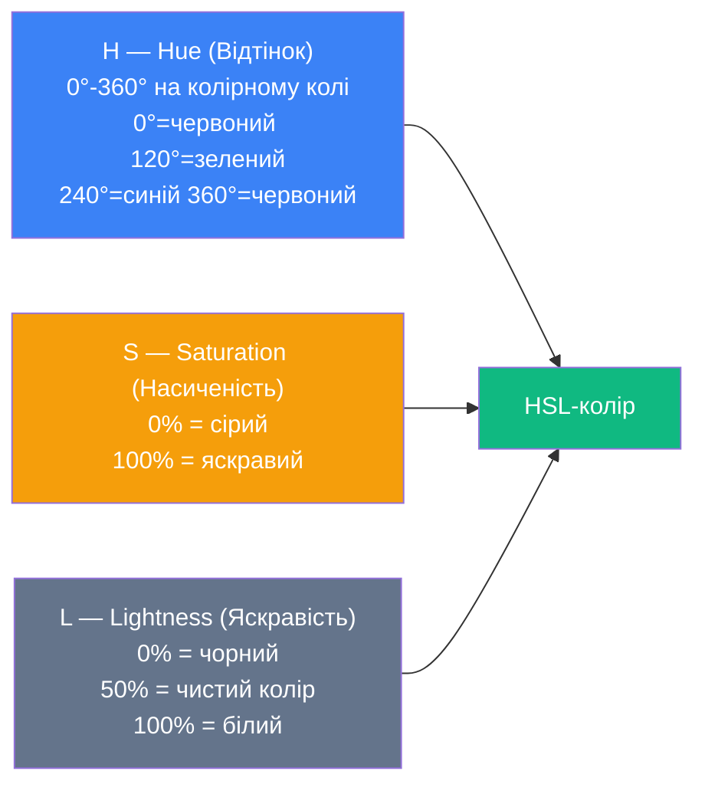

# Кольори та фони в CSS

## Чому кольори в CSS задають п'ятьма різними способами — і який з них правильний?

Відкрийте CSS будь-якого сайту, і ви побачите кольори задані як `#3b82f6`, `rgb(59, 130, 246)`, `hsl(217, 91%, 60%)` — три різні записи **одного й того самого** кольору. Навіщо стільки форматів? Чи є серед них «правильний»? І чому дизайнери все частіше кажуть про загадковий `oklch()`?

Справа в тому, що кожна колірна модель дає різний рівень **контролю** та **інтуїтивності**. Hex — компактний, але нечитабельний. HSL — зрозумілий людині, але має проблеми з однаковістю яскравості. OKLCH — вирішує ці проблеми, але поки новий.

У [попередній статті](/12.html-css/11.css-typography) ми навчились оформлювати текст — шрифти, розміри, інтервали. Тепер додамо **кольори та фони** — те, що робить дизайн по-справжньому живим.

---

## Колірні моделі CSS

### Іменовані кольори (Named Colors)

CSS має **148** вбудованих кольорів із текстовими іменами:

::html-preview

```html
<div class="color-grid">
    <div class="swatch" style="background-color: tomato;">tomato</div>
    <div class="swatch" style="background-color: steelblue;">steelblue</div>
    <div class="swatch" style="background-color: gold;">gold</div>
    <div class="swatch" style="background-color: mediumseagreen;">mediumseagreen</div>
    <div class="swatch" style="background-color: slateblue;">slateblue</div>
    <div class="swatch" style="background-color: coral;">coral</div>
    <div class="swatch" style="background-color: darkcyan;">darkcyan</div>
    <div class="swatch" style="background-color: hotpink;">hotpink</div>
</div>
```

```css
.color-grid {
    display: flex;
    flex-wrap: wrap;
    gap: 0.5rem;
    font-family: system-ui, sans-serif;
}

.swatch {
    padding: 0.75rem 1rem;
    border-radius: 6px;
    font-size: 0.8rem;
    color: white;
    text-shadow: 0 1px 2px rgba(0, 0, 0, 0.3);
}
```

::

Іменовані кольори зручні для прототипування, але **не підходять** для точного дизайну — ви обмежені 148 варіантами без можливості тонкого налаштування.

### HEX — шістнадцяткова нотація

**Найпопулярніший** формат у CSS. Записується як `#RRGGBB`, де кожна пара — значення червоного, зеленого та синього каналу від `00` до `FF`:

```css
.element {
    color: #1e40af; /* Повний запис */
    background: #3b82f6; /* Інший синій */
    border-color: #e2e8f0; /* Світло-сірий */
}

/* Скорочений запис — коли пари повторюються */
.short {
    color: #fff; /* = #ffffff — білий */
    background: #333; /* = #333333 — темно-сірий */
}

/* HEX з прозорістю (8 символів) */
.transparent {
    background: #3b82f680; /* Останні 2 символи = alpha (50%) */
}
```

::note
HEX — це запис кольору в **RGB-моделі**, просто у шістнадцятковій системі. `#3b82f6` = R:59, G:130, B:246. Перевага — компактність. Недолік — неможливо «на око» зрозуміти, який це колір.

::

### RGB та RGBA

Те саме, що HEX, але у десятковому записі — кожен канал від `0` до `255`:

```css
.element {
    color: rgb(30, 64, 175); /* Синій */
    background: rgb(59, 130, 246); /* Яскравий синій */
}

/* З прозорістю — четвертий параметр від 0 до 1 */
.overlay {
    background: rgba(0, 0, 0, 0.5); /* Напівпрозорий чорний */
}

/* Сучасний синтаксис (без ком, / для alpha) */
.modern {
    color: rgb(30 64 175);
    background: rgb(59 130 246 / 0.5);
}
```

### HSL та HSLA — кольори для людей

HSL (_Hue, Saturation, Lightness_) — колірна модель, інтуїтивно зрозуміла людині:

::mermaid



::

::html-preview

```html
<div class="hsl-demo">
    <h4>Відтінок (Hue) — обертання по колірному колу:</h4>
    <div class="hue-row">
        <div class="swatch" style="background: hsl(0, 80%, 55%);">0° Червоний</div>
        <div class="swatch" style="background: hsl(30, 80%, 55%);">30° Оранж</div>
        <div class="swatch" style="background: hsl(60, 80%, 50%);">60° Жовтий</div>
        <div class="swatch" style="background: hsl(120, 80%, 40%);">120° Зелений</div>
        <div class="swatch" style="background: hsl(210, 80%, 55%);">210° Синій</div>
        <div class="swatch" style="background: hsl(270, 80%, 55%);">270° Фіолет</div>
    </div>

    <h4>Насиченість (Saturation) — від сірого до яскравого:</h4>
    <div class="hue-row">
        <div class="swatch" style="background: hsl(210, 0%, 55%);">0%</div>
        <div class="swatch" style="background: hsl(210, 25%, 55%);">25%</div>
        <div class="swatch" style="background: hsl(210, 50%, 55%);">50%</div>
        <div class="swatch" style="background: hsl(210, 75%, 55%);">75%</div>
        <div class="swatch" style="background: hsl(210, 100%, 55%);">100%</div>
    </div>

    <h4>Яскравість (Lightness) — від чорного до білого:</h4>
    <div class="hue-row">
        <div class="swatch" style="background: hsl(210, 80%, 10%);color:#fff;">10%</div>
        <div class="swatch" style="background: hsl(210, 80%, 30%);color:#fff;">30%</div>
        <div class="swatch" style="background: hsl(210, 80%, 50%);">50%</div>
        <div class="swatch" style="background: hsl(210, 80%, 70%);">70%</div>
        <div class="swatch" style="background: hsl(210, 80%, 90%);color:#333;">90%</div>
    </div>
</div>
```

```css
.hsl-demo {
    font-family: system-ui, sans-serif;
    font-size: 0.85rem;
    color: #1e293b;
}

.hsl-demo h4 {
    margin: 0.75rem 0 0.25rem;
    font-size: 0.85rem;
}

.hue-row {
    display: flex;
    gap: 0.25rem;
    flex-wrap: wrap;
}

.swatch {
    padding: 0.5rem 0.6rem;
    border-radius: 6px;
    color: white;
    text-shadow: 0 1px 2px rgba(0, 0, 0, 0.3);
    font-size: 0.75rem;
    text-align: center;
}
```

::

```css
.element {
    color: hsl(217, 91%, 60%); /* Синій */
    background: hsl(217, 91%, 60%); /* Той самий */
    border: 2px solid hsl(217, 91%, 40%); /* Темніший варіант — лише L змінено */
}

/* З прозорістю */
.overlay {
    background: hsla(0, 0%, 0%, 0.5); /* Напівпрозорий чорний */
    /* або сучасний синтаксис */
    background: hsl(0 0% 0% / 0.5);
}
```

::tip
**HSL — найкращий формат для дизайн-системи.** Потрібен темніший варіант того ж кольору? Зменшіть `L` (Lightness). Потрібен пастельний? Зменшіть `S` (Saturation) і збільшіть `L`. Потрібен прозорий? Додайте alpha. З HEX-кодами такі маніпуляції «на льоту» — неможливі.

::

### OKLCH — майбутнє CSS-кольорів

`oklch()` — найновіша колірна модель у CSS. Вона вирішує головну проблему HSL: **перцептивну нерівномірність**. У HSL `hsl(60, 100%, 50%)` (жовтий) виглядає набагато яскравішим за `hsl(240, 100%, 50%)` (синій), хоча обидва мають `L: 50%`.

```css
.element {
    /* oklch(Lightness Chroma Hue) */
    color: oklch(0.55 0.2 250); /* Синій */
    background: oklch(0.95 0.05 250); /* Дуже світлий синій */
}

/* З прозорістю */
.transparent {
    background: oklch(0.55 0.2 250 / 0.5);
}
```

::field-group
::field{name="L — Lightness" type="0..1"}
Яскравість від `0` (чорний) до `1` (білий). На відміну від HSL, яскравість **перцептивно однакова** для різних відтінків.

::
::field{name="C — Chroma" type="0..0.4"}
Насиченість. `0` = сірий, `0.4` = максимально яскравий. Залежить від відтінку та дисплея.

::
::field{name="H — Hue" type="0..360"}
Відтінок — кут на колірному колі, як у HSL.

::

::

::note
OKLCH підтримується усіма сучасними браузерами (Chrome 111+, Firefox 113+, Safari 15.4+). Для проєктів, де потрібна підтримка старих браузерів, використовуйте HSL як фолбек.

::

### Порівняння колірних моделей

| Формат | Приклад               | Інтуїтивність | Маніпуляції |  Підтримка   |
| ------ | --------------------- | :-----------: | :---------: | :----------: |
| Named  | `steelblue`           |    ⭐⭐⭐     |     ❌      |      ✅      |
| HEX    | `#4682b4`             |      ⭐       |     ❌      |      ✅      |
| RGB    | `rgb(70, 130, 180)`   |     ⭐⭐      |     ❌      |      ✅      |
| HSL    | `hsl(207, 44%, 49%)`  |    ⭐⭐⭐     |     ✅      |      ✅      |
| OKLCH  | `oklch(0.57 0.1 240)` |    ⭐⭐⭐     |    ✅✅     | ✅ (сучасні) |

---

## CSS Custom Properties для кольорових тем

Замість хардкоду кольорів по всьому CSS, створіть систему через змінні:

```css
:root {
    /* Основна палітра */
    --color-primary: hsl(217, 91%, 60%);
    --color-primary-light: hsl(217, 91%, 75%);
    --color-primary-dark: hsl(217, 91%, 40%);

    /* Нейтральні */
    --color-gray-50: hsl(210, 40%, 98%);
    --color-gray-100: hsl(210, 40%, 96%);
    --color-gray-200: hsl(214, 32%, 91%);
    --color-gray-500: hsl(215, 16%, 47%);
    --color-gray-700: hsl(215, 25%, 27%);
    --color-gray-900: hsl(222, 47%, 11%);

    /* Семантичні кольори */
    --color-success: hsl(142, 71%, 45%);
    --color-warning: hsl(38, 92%, 50%);
    --color-error: hsl(0, 84%, 60%);

    /* Текст та фон */
    --color-text: var(--color-gray-900);
    --color-text-muted: var(--color-gray-500);
    --color-bg: white;
    --color-bg-secondary: var(--color-gray-50);
    --color-border: var(--color-gray-200);
}
```

Використання:

```css
body {
    color: var(--color-text);
    background-color: var(--color-bg);
}

.btn-primary {
    background-color: var(--color-primary);
    color: white;
}

.btn-primary:hover {
    background-color: var(--color-primary-dark);
}

.alert-error {
    color: var(--color-error);
    border: 1px solid var(--color-error);
}
```

::tip
**Чому HSL ідеальний для CSS-змінних?** Маючи базовий колір `hsl(217, 91%, 60%)`, ви автоматично отримуєте всю палітру — просто змінюючи `L` для відтінків (light/dark) та `S` для пастельних варіантів. HEX не дає такої гнучкості.

::

---

## Темна тема через `prefers-color-scheme`

CSS дозволяє автоматично перемикати кольори відповідно до системних налаштувань користувача:

```css
/* Світла тема — за замовчуванням */
:root {
    --color-text: hsl(222, 47%, 11%);
    --color-bg: hsl(0, 0%, 100%);
    --color-bg-secondary: hsl(210, 40%, 98%);
    --color-border: hsl(214, 32%, 91%);
    --color-primary: hsl(217, 91%, 60%);
}

/* Темна тема — автоматично */
@media (prefers-color-scheme: dark) {
    :root {
        --color-text: hsl(210, 40%, 96%);
        --color-bg: hsl(222, 47%, 11%);
        --color-bg-secondary: hsl(217, 33%, 17%);
        --color-border: hsl(215, 25%, 27%);
        --color-primary: hsl(217, 91%, 70%);
    }
}
```

::html-preview

```html
<div class="theme-demo">
    <div class="card-light">
        <h3>☀️ Світла тема</h3>
        <p>Темний текст на світлому фоні — класичний варіант.</p>
        <button class="btn-light">Кнопка</button>
    </div>
    <div class="card-dark">
        <h3>🌙 Темна тема</h3>
        <p>Світлий текст на темному фоні — менше навантаження на око.</p>
        <button class="btn-dark">Кнопка</button>
    </div>
</div>
```

```css
.theme-demo {
    display: flex;
    gap: 1rem;
    font-family: system-ui, sans-serif;
    font-size: 0.9rem;
}

.card-light {
    flex: 1;
    padding: 1.5rem;
    border-radius: 12px;
    background-color: #ffffff;
    color: #1e293b;
    border: 1px solid #e2e8f0;
}

.card-dark {
    flex: 1;
    padding: 1.5rem;
    border-radius: 12px;
    background-color: #0f172a;
    color: #e2e8f0;
    border: 1px solid #334155;
}

.card-light h3,
.card-dark h3 {
    margin: 0 0 0.5rem;
    font-size: 1.1rem;
}

.card-light p,
.card-dark p {
    margin: 0 0 1rem;
    line-height: 1.5;
}

.btn-light {
    padding: 0.5rem 1.5rem;
    background-color: #3b82f6;
    color: white;
    border: none;
    border-radius: 6px;
    cursor: pointer;
    font-family: inherit;
}

.btn-dark {
    padding: 0.5rem 1.5rem;
    background-color: #60a5fa;
    color: #0f172a;
    border: none;
    border-radius: 6px;
    cursor: pointer;
    font-family: inherit;
}
```

::

::note
`prefers-color-scheme` — це **медіа-запит**, що зчитує налаштування теми у системних параметрах (Windows, macOS, Android, iOS). Перевизначення змінних у `:root` — і весь сайт автоматично перемикає тему без жодного JavaScript. Детальніше про медіа-запити — у [статті про адаптивний дизайн](/12.html-css/16.css-responsive-media-queries).

::

---

## Фонові властивості

### `background-color`

Задає суцільний колір фону:

```css
.element {
    background-color: #f8fafc;
    background-color: hsl(210, 40%, 98%);
    background-color: transparent; /* Прозорий — значення за замовчуванням */
}
```

### `background-image`

Фонове зображення — від файлів до градієнтів:

```css
.hero {
    background-image: url('/images/hero-bg.jpg');
}
```

### `background-size`

Як масштабувати фонове зображення:

::html-preview

```html
<div class="bg-demo-row">
    <div class="bg-box" style="background-size: cover;">
        <span>cover</span>
    </div>
    <div class="bg-box" style="background-size: contain;">
        <span>contain</span>
    </div>
    <div class="bg-box" style="background-size: 100% 100%;">
        <span>100% 100%</span>
    </div>
</div>
```

```css
.bg-demo-row {
    display: flex;
    gap: 0.75rem;
    font-family: system-ui, sans-serif;
}

.bg-box {
    width: 150px;
    height: 100px;
    border: 2px solid #e2e8f0;
    border-radius: 8px;
    background-image: url("data:image/svg+xml,%3Csvg xmlns='http://www.w3.org/2000/svg' width='80' height='60' viewBox='0 0 80 60'%3E%3Crect fill='%233b82f6' width='80' height='60' rx='4'/%3E%3Ctext x='40' y='35' text-anchor='middle' fill='white' font-size='12' font-family='sans-serif'%3EIMG%3C/text%3E%3C/svg%3E");
    background-repeat: no-repeat;
    background-position: center;
    display: flex;
    align-items: flex-end;
    justify-content: center;
    padding-bottom: 0.25rem;
}

.bg-box span {
    font-size: 0.7rem;
    color: #64748b;
    background: rgba(255, 255, 255, 0.8);
    padding: 0.1rem 0.3rem;
    border-radius: 3px;
}
```

::

| Значення      | Поведінка                                                             |
| ------------- | --------------------------------------------------------------------- |
| `cover`       | Масштабує так, щоб **покрити весь** контейнер (може обрізатися)       |
| `contain`     | Масштабує так, щоб **вміститися повністю** (можуть бути порожні зони) |
| `100% 100%`   | Розтягує точно до розмірів контейнера (може спотворити пропорції)     |
| `200px 150px` | Точний розмір у пікселях                                              |
| `auto`        | Оригінальний розмір зображення                                        |

### `background-position`

Де розмістити фон усередині елемента:

```css
.element {
    background-position: center; /* По центру */
    background-position: top right; /* Верхній правий кут */
    background-position: 50% 30%; /* 50% по X, 30% по Y */
    background-position: 20px 10px; /* 20px зліва, 10px зверху */
}
```

### `background-repeat`

```css
.element {
    background-repeat: repeat; /* Повторювати в обидва боки (за замовчуванням) */
    background-repeat: no-repeat; /* Не повторювати */
    background-repeat: repeat-x; /* Повторювати тільки горизонтально */
    background-repeat: repeat-y; /* Повторювати тільки вертикально */
    background-repeat: space; /* Повторювати з рівними проміжками */
    background-repeat: round; /* Повторювати, масштабуючи до цілого числа */
}
```

### `background-attachment`

```css
.parallax {
    background-attachment: fixed; /* Фон фіксований — ефект параллаксу */
    background-attachment: scroll; /* Фон прокручується разом з елементом (default) */
    background-attachment: local; /* Фон прокручується з вмістом елемента */
}
```

### Скорочення `background`

Усе в одному рядку:

```css
.hero {
    /* background: color image position/size repeat attachment */
    background: #0f172a url('/images/hero.jpg') center/cover no-repeat fixed;
}
```

::warning
Скорочення `background` **скидає** всі невказані властивості до значень за замовчуванням. Якщо до скорочення був `background-color: red`, а в скороченні колір не вказано — він стане `transparent`. Будьте обережні при змішуванні скорочення з окремими властивостями.

::

---

## Градієнти

Градієнти — це плавні переходи між кольорами, створені через `background-image`. CSS підтримує три типи.

### `linear-gradient()` — лінійний градієнт

::html-preview

```html
<div class="grad-row">
    <div class="grad" style="background: linear-gradient(to right, #3b82f6, #8b5cf6);">
        <span>to right</span>
    </div>
    <div class="grad" style="background: linear-gradient(135deg, #f59e0b, #ef4444);">
        <span>135deg</span>
    </div>
    <div class="grad" style="background: linear-gradient(to bottom, #10b981, #3b82f6, #8b5cf6);">
        <span>3 кольори</span>
    </div>
</div>
```

```css
.grad-row {
    display: flex;
    gap: 0.75rem;
    font-family: system-ui, sans-serif;
}

.grad {
    flex: 1;
    height: 100px;
    border-radius: 12px;
    display: flex;
    align-items: center;
    justify-content: center;
}

.grad span {
    color: white;
    font-size: 0.85rem;
    font-weight: 600;
    text-shadow: 0 1px 3px rgba(0, 0, 0, 0.3);
}
```

::

```css
/* Напрямок + кольори */
.gradient {
    background: linear-gradient(to right, #3b82f6, #8b5cf6);
}

/* Кут у градусах */
.angled {
    background: linear-gradient(135deg, #f59e0b, #ef4444);
}

/* Кілька кольорів із зупинками */
.multi {
    background: linear-gradient(to right, #3b82f6 0%, #8b5cf6 50%, #ec4899 100%);
}

/* Різкий перехід — «смужки» */
.stripes {
    background: linear-gradient(to right, #3b82f6 0%, #3b82f6 33%, #f59e0b 33%, #f59e0b 66%, #ef4444 66%, #ef4444 100%);
}
```

### `radial-gradient()` — радіальний градієнт

::html-preview

```html
<div class="grad-row">
    <div class="grad" style="background: radial-gradient(circle, #3b82f6, #1e293b);">
        <span>circle</span>
    </div>
    <div class="grad" style="background: radial-gradient(ellipse at top left, #f59e0b, #1e293b);">
        <span>ellipse at top left</span>
    </div>
    <div class="grad" style="background: radial-gradient(circle at 70% 30%, #10b981 0%, transparent 60%), #1e293b;">
        <span>spotlight</span>
    </div>
</div>
```

```css
.grad-row {
    display: flex;
    gap: 0.75rem;
    font-family: system-ui, sans-serif;
}

.grad {
    flex: 1;
    height: 120px;
    border-radius: 12px;
    display: flex;
    align-items: center;
    justify-content: center;
}

.grad span {
    color: white;
    font-size: 0.8rem;
    font-weight: 600;
    text-shadow: 0 1px 3px rgba(0, 0, 0, 0.5);
}
```

::

```css
/* Колове розповсюдження від центру */
.radial {
    background: radial-gradient(circle, #3b82f6, #1e293b);
}

/* Еліпс з іншою точкою початку */
.ellipse {
    background: radial-gradient(ellipse at top left, #f59e0b, transparent);
}
```

### `conic-gradient()` — конічний градієнт

Кольори розповсюджуються **по колу** навколо центру:

::html-preview

```html
<div class="grad-row">
    <div class="grad conic-1">
        <span>Rainbow</span>
    </div>
    <div class="grad conic-2">
        <span>Pie Chart</span>
    </div>
    <div class="grad conic-3">
        <span>Color Wheel</span>
    </div>
</div>
```

```css
.grad-row {
    display: flex;
    gap: 0.75rem;
    font-family: system-ui, sans-serif;
}

.grad {
    width: 120px;
    height: 120px;
    border-radius: 50%;
    display: flex;
    align-items: center;
    justify-content: center;
}

.grad span {
    color: white;
    font-size: 0.75rem;
    font-weight: 600;
    text-shadow: 0 1px 3px rgba(0, 0, 0, 0.5);
    text-align: center;
}

.conic-1 {
    background: conic-gradient(#ef4444, #f59e0b, #10b981, #3b82f6, #8b5cf6, #ef4444);
}

.conic-2 {
    background: conic-gradient(#3b82f6 0% 40%, #f59e0b 40% 70%, #10b981 70% 100%);
}

.conic-3 {
    background: conic-gradient(
        from 90deg,
        hsl(0, 80%, 60%),
        hsl(60, 80%, 60%),
        hsl(120, 80%, 60%),
        hsl(180, 80%, 60%),
        hsl(240, 80%, 60%),
        hsl(300, 80%, 60%),
        hsl(360, 80%, 60%)
    );
}
```

::

::tip
`conic-gradient()` ідеально підходить для створення **кругових діаграм** (pie charts) та **колірних коліс** без JavaScript та SVG.

::

---

## Множинні фони (Multiple Backgrounds)

CSS дозволяє накладати **кілька фонів** один на одного:

```css
.hero {
    background:
        /* Шар 1 (верхній) — градієнт-оверлей */
        linear-gradient(to bottom, rgba(0, 0, 0, 0.4), rgba(0, 0, 0, 0.7)),
        /* Шар 2 (нижній) — зображення */ url('/images/hero.jpg') center/cover no-repeat;
}
```

::html-preview

```html
<div class="multi-bg">
    <h2>Множинні фони</h2>
    <p>Градієнт поверх патерну</p>
</div>
```

```css
.multi-bg {
    padding: 3rem 2rem;
    border-radius: 12px;
    color: white;
    font-family: system-ui, sans-serif;
    text-align: center;
    background:
        linear-gradient(135deg, rgba(59, 130, 246, 0.85), rgba(139, 92, 246, 0.85)),
        repeating-linear-gradient(
            45deg,
            transparent,
            transparent 10px,
            rgba(255, 255, 255, 0.05) 10px,
            rgba(255, 255, 255, 0.05) 20px
        );
}

.multi-bg h2 {
    margin: 0 0 0.5rem;
    font-size: 1.5rem;
}

.multi-bg p {
    margin: 0;
    opacity: 0.9;
}
```

::

::note
Фони перераховуються **через кому**. Перший — верхній шар, останній — нижній. Це дозволяє створювати складні візуальні ефекти: градієнт-оверлей поверх зображення, патерни, множинні градієнти.

::

---

## `opacity` vs `rgba` / `hsla`

Два різні способи зробити елемент прозорим — але з принципово різною поведінкою:

::html-preview

```html
<div class="opacity-demo">
    <div class="box-opacity">
        <strong>opacity: 0.5</strong>
        <p>Весь елемент напівпрозорий — і текст також!</p>
    </div>
    <div class="box-rgba">
        <strong>rgba() на фоні</strong>
        <p>Тільки фон прозорий — текст залишається чітким!</p>
    </div>
</div>
```

```css
.opacity-demo {
    display: flex;
    gap: 1rem;
    font-family: system-ui, sans-serif;
    font-size: 0.85rem;
    padding: 1rem;
    background: repeating-linear-gradient(45deg, #e2e8f0, #e2e8f0 10px, #f1f5f9 10px, #f1f5f9 20px);
    border-radius: 8px;
}

.box-opacity {
    flex: 1;
    padding: 1rem;
    background-color: #1e293b;
    color: white;
    border-radius: 8px;
    opacity: 0.5;
}

.box-rgba {
    flex: 1;
    padding: 1rem;
    background-color: rgba(30, 41, 59, 0.5);
    color: white;
    border-radius: 8px;
}

.box-opacity strong,
.box-rgba strong {
    display: block;
    margin-bottom: 0.25rem;
}

.box-opacity p,
.box-rgba p {
    margin: 0;
    line-height: 1.4;
}
```

::

::caution
`opacity` впливає на **весь елемент** з усіма дочірніми — текст, зображення, рамки стають прозорими. Значення від `0` (повністю прозорий) до `1` (непрозорий). Якщо потрібен прозорий **лише фон** — використовуйте `rgba()` або `hsla()` для `background-color`.

::

---

## Практичні завдання

### Рівень 1 — Базовий

::accordion
::accordion-item{label="Завдання 1.1: Колірна палітра" icon="i-lucide-palette"}

Створіть HTML-сторінку з 6 кольоровими блоками. Задайте кольори трьома різними форматами:

- 2 блоки — HEX
- 2 блоки — RGB/RGBA
- 2 блоки — HSL/HSLA

Один блок у кожній парі повинен мати прозорість 50%.

::
::accordion-item{label="Завдання 1.2: Градієнтні кнопки" icon="i-lucide-mouse-pointer-click"}

Створіть 4 кнопки з різними градієнтами:

1. Лінійний горизонтальний (синій → фіолетовий)
2. Лінійний під кутом 135° (оранжевий → червоний)
3. Радіальний (від центру — білий до синього)
4. З `:hover`-ефектом — при наведенні градієнт «обертається» (змініть напрямок)

::
::accordion-item{label="Завдання 1.3: opacity vs rgba" icon="i-lucide-eye"}

Створіть два блоки з текстом на смугастому фоні:

- Перший з `opacity: 0.5`
- Другий з `background-color: rgba(...)` та `opacity: 1`

Поясніть, чому текст у першому блоці теж прозорий, а в другому — ні.

::

::

### Рівень 2 — Логіка та комбінування

::accordion
::accordion-item{label="Завдання 2.1: HSL-палітра з CSS-змінних" icon="i-lucide-swatch-book"}

Створіть систему кольорів через CSS Custom Properties:

- Визначте базовий відтінок: `--hue: 217`
- Створіть 5 відтінків одного кольору через зміну `L` у `hsl()`: `--color-50`, `--color-200`, `--color-500`, `--color-700`, `--color-900`
- Продемонструйте палітру у 5 кольорових блоках

**Бонус:** Додайте другу палітру, змінивши лише `--hue`.

::
::accordion-item{label="Завдання 2.2: Hero-секція з оверлеєм" icon="i-lucide-image"}

Створіть hero-блок на повну ширину:

- Фонове зображення (або суцільний колір) через `background`
- Поверх — напівпрозорий градієнт-оверлей (`linear-gradient` з `rgba`)
- Білий текст по центру (заголовок + підзаголовок)
- `background-size: cover`, `background-position: center`

::
::accordion-item{label="Завдання 2.3: Конічна діаграма" icon="i-lucide-pie-chart"}

Створіть кругову діаграму за допомогою `conic-gradient()`:

- 3–4 сегменти різних кольорів
- Підписи під діаграмою (легенда з кольоровими квадратиками)
- Круглий елемент (`border-radius: 50%`)

::

::

### Рівень 3 — Створення з нуля

::accordion
::accordion-item{label="Завдання 3.1: Тема світла/темна" icon="i-lucide-sun-moon"}

Реалізуйте повну систему двох тем:

1. Визначте всі кольори через CSS-змінні в `:root` (текст, фон, primary, border, muted)
2. Перевизначте змінні в `@media (prefers-color-scheme: dark)`
3. Створіть сторінку з шапкою, картками та футером, що автоматично перемикається

Тестувйте: у Chrome DevTools → :kbd{value="Ctrl"} + :kbd{value="Shift"} + :kbd{value="P"} → «Emulate CSS prefers-color-scheme: dark».

::
::accordion-item{label="Завдання 3.2: Landing з градієнтами" icon="i-lucide-sparkles"}

Створіть лендінг-сторінку, де:

- **Hero-секція** — множинний фон (градієнт + геометричний патерн через `repeating-linear-gradient`)
- **3 feature-картки** — кожна зі своїм градієнтним заголовком
- **CTA-кнопка** — градієнтний фон з `hover`-анімацією
- **Футер** — темний фон з легким радіальним градієнтом

Використайте лише CSS — без зображень. Всі кольори — через CSS-змінні.

::

::

---

## Підсумок

::card-group

::card{title="🎨 Колірні моделі" icon="i-heroicons-swatch"}

HEX — компактний. RGB — програмістський. **HSL** — інтуїтивний для дизайну (змінюй L для відтінків). OKLCH — перцептивно точний, майбутній стандарт.

::

::card{title="🖼️ Фони" icon="i-heroicons-photo"}

`background` об'єднує color, image, position, size, repeat. Множинні фони через кому. Градієнти (linear, radial, conic) — замість зображень.

::

::card{title="🌗 Теми" icon="i-heroicons-moon"}

CSS-змінні + `prefers-color-scheme` = автоматична темна тема без JavaScript. Визначайте кольори через HSL-змінні для легкої зміни палітри.

::

::card{title="👁️ Прозорість" icon="i-heroicons-eye"}

`opacity` — весь елемент прозорий (з дітьми). `rgba()`/`hsla()` — тільки конкретний колір. Для фонових оверлеїв — **завжди** `rgba`.

::

::

---

## Корисні посилання

- 📖 [MDN — CSS Colors](https://developer.mozilla.org/en-US/docs/Web/CSS/CSS_colors) — повний довідник колірних функцій
- 🎨 [MDN — Gradients](https://developer.mozilla.org/en-US/docs/Web/CSS/gradient) — всі типи градієнтів
- 🌈 [OKLCH Color Picker](https://oklch.com/) — інтерактивний інструмент для OKLCH-кольорів
- 🎨 [CSS Gradient Generator](https://cssgradient.io/) — візуальний генератор градієнтів
- 🖌️ [Realtime Colors](https://www.realtimecolors.com/) — тестування колірних палітр у реальному часі
- 📐 [Coolors](https://coolors.co/) — генератор гармонійних колірних палітр
