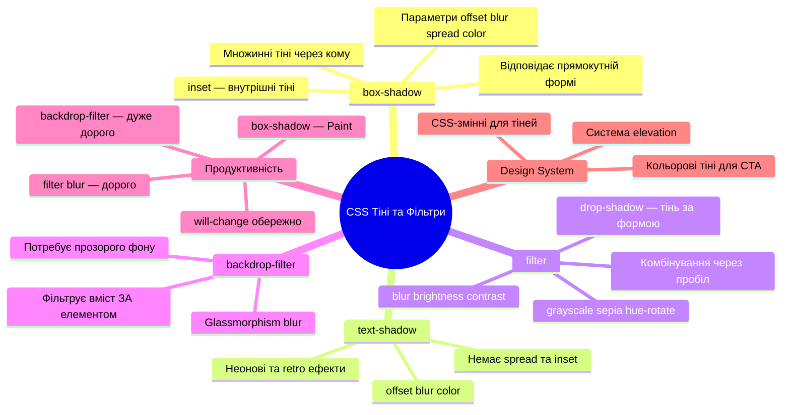

# Тіні та фільтри в CSS

## Чому одна тінь може зробити дизайн преміальним — або зламати його

Відкрийте будь-який сучасний дизайн-сайт — Linear, Vercel, Stripe — і придивіться до карток, кнопок, модальних вікон. Вони «зависають» над сторінкою природно, як матеріальні об'єкти. Секрет — не в складному коді, а в **правильних тінях**.

Погана тінь (різка, темна, з неправильним кутом) робить елемент важким і дешевим. Хороша тінь (м'яка, багатошарова, з правильним розмиттям) створює ілюзію глибини і відчуття преміальності. Різниця — часто в кількох параметрах і розумінні того, **як тіні влаштовані фізично**.

У цій статті ми розберемо повний арсенал CSS-тіней: від базового `box-shadow` до складних ефектів з `filter: drop-shadow()` та сучасного glassmorphism через `backdrop-filter: blur()`.

---

## Анатомія `box-shadow` — шість параметрів

`box-shadow` — це властивість, що додає тінь **ззовні (або зсередини) прямокутної форми елемента**. Повний синтаксис виглядає так:

```css
box-shadow: offset-x offset-y blur-radius spread-radius color;
/* або з inset: */
box-shadow: inset offset-x offset-y blur-radius spread-radius color;
```

Розберемо кожен параметр детально:

::field-group

::field{name="offset-x" type="length" required="true"}
Горизонтальне зміщення тіні. **Позитивне значення** — тінь зміщується вправо (джерело світла зліва). **Негативне** — тінь зміщується вліво. `0` — тінь симетрична по горизонталі.
::

::field{name="offset-y" type="length" required="true"}
Вертикальне зміщення тіні. **Позитивне значення** — тінь зміщується вниз (джерело світла зверху — найбільш природно). **Негативне** — тінь вгору. `0` — симетрична по вертикалі.
::

::field{name="blur-radius" type="length" default="0"}
Радіус розмиття. `0` — чітка тінь без розмиття. Чим більше значення — тим м'якша і більша тінь. **Не може бути від'ємним.** Фізично імітує дифузне джерело світла.
::

::field{name="spread-radius" type="length" default="0"}
Розширення тіні. **Позитивне** — тінь збільшується у всі боки (ширша ніж елемент). **Негативне** — тінь звужується (корисно для softened shadows). `0` — розмір тіні дорівнює розміру елемента.
::

::field{name="color" type="color" default="currentColor"}
Колір тіні. Рекомендується використовувати `rgba()` або `hsl(... / alpha)` з низькою непрозорістю для природнього вигляду. Уникайте непрозорого чорного `#000` — виглядає штучно.
::

::field{name="inset" type="keyword" default="(відсутнє)"}
Якщо вказано — тінь малюється **всередині** елемента, а не ззовні. Корисно для ефектів вдавлених кнопок, полів вводу, wells.
::

::

### Живий інтерактивний приклад

::html-preview

```html
<div class="shadow-anatomy">
  <div class="demo-group">
    <div class="shadow-box s1">offset: 4px 4px<br>без blur</div>
    <code>4px 4px 0 0</code>
  </div>
  <div class="demo-group">
    <div class="shadow-box s2">+blur 8px</div>
    <code>4px 4px 8px 0</code>
  </div>
  <div class="demo-group">
    <div class="shadow-box s3">+spread 4px</div>
    <code>4px 4px 8px 4px</code>
  </div>
  <div class="demo-group">
    <div class="shadow-box s4">spread -4px</div>
    <code>4px 4px 12px -4px</code>
  </div>
  <div class="demo-group">
    <div class="shadow-box s5">inset</div>
    <code>inset 2px 2px 8px</code>
  </div>
</div>
```

```css
.shadow-anatomy {
  display: flex;
  flex-wrap: wrap;
  gap: 2rem;
  padding: 2rem;
  background: #f1f5f9;
  border-radius: 12px;
  font-family: system-ui, sans-serif;
  justify-content: center;
}
.demo-group {
  display: flex;
  flex-direction: column;
  align-items: center;
  gap: 0.75rem;
}
.shadow-box {
  width: 110px;
  height: 80px;
  background: white;
  border-radius: 10px;
  display: flex;
  align-items: center;
  justify-content: center;
  font-size: 0.72rem;
  font-weight: 600;
  color: #334155;
  text-align: center;
  line-height: 1.4;
}
code {
  font-size: 0.65rem;
  color: #6366f1;
  max-width: 120px;
  text-align: center;
  line-height: 1.5;
}
.s1 { box-shadow: 4px 4px 0 0 rgba(0,0,0,0.3); }
.s2 { box-shadow: 4px 4px 8px 0 rgba(0,0,0,0.25); }
.s3 { box-shadow: 4px 4px 8px 4px rgba(0,0,0,0.2); }
.s4 { box-shadow: 4px 4px 12px -4px rgba(0,0,0,0.35); }
.s5 { box-shadow: inset 2px 2px 8px rgba(0,0,0,0.25); }
```

::

---

## Кольори тіней — найпоширеніша помилка

Більшість початківців пишуть `box-shadow: 0 4px 8px black`. Результат виглядає штучно і «дешево». Причина — в реальному світі **тіні не бувають абсолютно чорними**. Вони напівпрозорі та злегка забарвлені оточенням.

::card-group

::card{title="❌ Погано — непрозорий чорний"}

```css
box-shadow: 0 4px 12px #000000;
```

Виглядає як намальована олівцем тінь — різка, неприродня.

::

::card{title="✅ Добре — напівпрозорий чорний"}

```css
box-shadow: 0 4px 12px rgba(0, 0, 0, 0.15);
```

М'яко, природньо. Прозорість 10–20% — типовий діапазон.

::

::card{title="✅ Відмінно — забарвлена тінь"}

```css
.btn-primary {
  background: #6366f1;
  box-shadow: 0 8px 24px rgba(99, 102, 241, 0.35);
}
```

Тінь успадковує відтінок елемента — дуже сучасний прийом.

::

::

::html-preview

```html
<div class="color-compare">
  <div class="cc-group">
    <div class="cc-box cc-bad">Погано</div>
    <span class="cc-label">black (непрозорий)</span>
  </div>
  <div class="cc-group">
    <div class="cc-box cc-ok">Добре</div>
    <span class="cc-label">rgba(0,0,0,0.15)</span>
  </div>
  <div class="cc-group">
    <div class="cc-box cc-great">Відмінно</div>
    <span class="cc-label">тінь = колір кнопки</span>
  </div>
  <div class="cc-group">
    <div class="cc-box cc-green">Зелений</div>
    <span class="cc-label">кольорова тінь 2</span>
  </div>
</div>
```

```css
.color-compare {
  display: flex;
  flex-wrap: wrap;
  gap: 2rem;
  padding: 2rem;
  background: #f8fafc;
  border-radius: 12px;
  justify-content: center;
  font-family: system-ui, sans-serif;
}
.cc-group {
  display: flex;
  flex-direction: column;
  align-items: center;
  gap: 0.75rem;
}
.cc-box {
  width: 120px;
  height: 60px;
  border-radius: 10px;
  display: flex;
  align-items: center;
  justify-content: center;
  font-weight: 700;
  font-size: 0.85rem;
  color: white;
}
.cc-label {
  font-size: 0.68rem;
  color: #64748b;
  text-align: center;
  max-width: 110px;
  line-height: 1.4;
}
.cc-bad   { background: #6366f1; box-shadow: 0 8px 20px black; }
.cc-ok    { background: #6366f1; box-shadow: 0 8px 20px rgba(0,0,0,0.2); }
.cc-great { background: #6366f1; box-shadow: 0 8px 24px rgba(99,102,241,0.45); }
.cc-green { background: #10b981; box-shadow: 0 8px 24px rgba(16,185,129,0.45); }
```

::

---

## Множинні тіні — секрет глибини

`box-shadow` приймає **список тіней через кому**. Реальні об'єкти завжди мають кілька шарів тіні — ближня (чітка) та далека (розмита).

```css
/* Одна тінь — пласко */
.card-flat {
  box-shadow: 0 4px 8px rgba(0, 0, 0, 0.12);
}

/* Дві тіні — вже є глибина */
.card-layered {
  box-shadow:
    0 2px 4px rgba(0, 0, 0, 0.08),
    0 8px 24px rgba(0, 0, 0, 0.12);
}

/* Три тіні — преміальний ефект */
.card-premium {
  box-shadow:
    0 1px 2px rgba(0, 0, 0, 0.06),
    0 4px 8px rgba(0, 0, 0, 0.08),
    0 16px 40px rgba(0, 0, 0, 0.10);
}
```

::tip
**Правило шарування:** менша тінь ближча до елемента (мале зміщення, маленький blur, більша непрозорість), більша — далі (велике зміщення, великий blur, менша непрозорість). Це імітує фізику поширення тіні від точкового джерела світла.
::

::html-preview

```html
<div class="layers-demo">
  <div class="layer-group">
    <div class="lbox l-none">Без тіні</div>
    <span>none</span>
  </div>
  <div class="layer-group">
    <div class="lbox l-one">1 шар</div>
    <span>1 layer</span>
  </div>
  <div class="layer-group">
    <div class="lbox l-two">2 шари</div>
    <span>2 layers</span>
  </div>
  <div class="layer-group">
    <div class="lbox l-three">3 шари</div>
    <span>3 layers</span>
  </div>
  <div class="layer-group">
    <div class="lbox l-colored">Кольорова</div>
    <span>colored</span>
  </div>
</div>
```

```css
.layers-demo {
  display: flex;
  flex-wrap: wrap;
  gap: 2.5rem;
  padding: 3rem 2rem;
  background: #f1f5f9;
  border-radius: 12px;
  justify-content: center;
  font-family: system-ui, sans-serif;
}
.layer-group {
  display: flex;
  flex-direction: column;
  align-items: center;
  gap: 1rem;
  font-size: 0.75rem;
  color: #64748b;
  font-weight: 600;
}
.lbox {
  width: 100px;
  height: 80px;
  background: white;
  border-radius: 12px;
  display: flex;
  align-items: center;
  justify-content: center;
  font-size: 0.78rem;
  font-weight: 700;
  color: #334155;
  text-align: center;
}
.l-none   { box-shadow: none; border: 1px solid #e2e8f0; }
.l-one    { box-shadow: 0 4px 8px rgba(0,0,0,0.12); }
.l-two    {
  box-shadow:
    0 2px 4px rgba(0,0,0,0.08),
    0 8px 24px rgba(0,0,0,0.12);
}
.l-three  {
  box-shadow:
    0 1px 2px rgba(0,0,0,0.06),
    0 4px 8px rgba(0,0,0,0.08),
    0 16px 40px rgba(0,0,0,0.10);
}
.l-colored {
  background: #6366f1;
  color: white;
  box-shadow:
    0 2px 4px rgba(99,102,241,0.2),
    0 8px 20px rgba(99,102,241,0.35),
    0 20px 40px rgba(99,102,241,0.15);
}
```

::

---

## `inset` — тіні всередині

Ключове слово `inset` перетворює зовнішню тінь на внутрішню. Корисно для:

- Ефекту **вдавленої кнопки** при натисканні (`:active` стан)
- Стилізації **полів вводу** (фокус-стан)
- **Neumorphism** — поєднання зовнішніх тіней для 3D-ефекту

```css
.btn:active {
  box-shadow: inset 0 2px 6px rgba(0, 0, 0, 0.25);
  transform: translateY(1px);
}

.input:focus {
  box-shadow:
    0 0 0 3px rgba(99, 102, 241, 0.2),
    inset 0 1px 3px rgba(0, 0, 0, 0.1);
}
```

::html-preview

```html
<div class="inset-demo">
  <div class="inset-group">
    <button class="ibtn ibtn-normal">Normal</button>
    <span class="ilabel">звичайний</span>
  </div>
  <div class="inset-group">
    <button class="ibtn ibtn-active">Active</button>
    <span class="ilabel">вдавлений (inset)</span>
  </div>
  <div class="inset-group">
    <input class="iinput" type="text" placeholder="Focus me...">
    <span class="ilabel">фокус input</span>
  </div>
  <div class="inset-group">
    <div class="ineum">Neumorphic</div>
    <span class="ilabel">neumorphism</span>
  </div>
</div>
```

```css
.inset-demo {
  display: flex;
  flex-wrap: wrap;
  gap: 2rem;
  padding: 2rem;
  background: #e0e5ec;
  border-radius: 16px;
  font-family: system-ui, sans-serif;
  justify-content: center;
}
.inset-group {
  display: flex;
  flex-direction: column;
  align-items: center;
  gap: 0.75rem;
}
.ilabel {
  font-size: 0.7rem;
  color: #64748b;
  font-weight: 600;
  text-align: center;
}
.ibtn {
  padding: 0.65rem 1.5rem;
  border: none;
  border-radius: 8px;
  font-weight: 700;
  font-size: 0.9rem;
  cursor: pointer;
  font-family: inherit;
  background: #6366f1;
  color: white;
}
.ibtn-normal {
  box-shadow:
    0 4px 8px rgba(99,102,241,0.4),
    0 1px 2px rgba(0,0,0,0.1);
}
.ibtn-active {
  box-shadow:
    inset 0 2px 6px rgba(0,0,0,0.3),
    inset 0 1px 2px rgba(0,0,0,0.2);
  transform: translateY(1px);
}
.iinput {
  padding: 0.6rem 0.9rem;
  border: 2px solid #6366f1;
  border-radius: 8px;
  font-family: inherit;
  font-size: 0.85rem;
  outline: none;
  background: white;
  box-shadow:
    0 0 0 3px rgba(99,102,241,0.2),
    inset 0 1px 3px rgba(0,0,0,0.08);
}
.ineum {
  width: 100px;
  height: 60px;
  border-radius: 12px;
  background: #e0e5ec;
  display: flex;
  align-items: center;
  justify-content: center;
  font-weight: 700;
  font-size: 0.8rem;
  color: #475569;
  box-shadow:
    6px 6px 12px rgba(0,0,0,0.15),
    -6px -6px 12px rgba(255,255,255,0.8);
}
```

::

---

## `text-shadow` — тіні для тексту

`text-shadow` працює аналогічно до `box-shadow`, але застосовується до **форми літер**, а не до прямокутника елемента. Синтаксис спрощений — **немає** параметрів `spread` та `inset`:

```css
text-shadow: offset-x offset-y blur-radius color;
```

```css
/* Легка читабельна тінь */
h1 {
  text-shadow: 0 1px 2px rgba(0, 0, 0, 0.2);
}

/* Тінь для тексту на зображенні */
.hero-title {
  color: white;
  text-shadow: 0 2px 8px rgba(0, 0, 0, 0.5);
}

/* Неонове світіння */
.neon {
  color: #00f5ff;
  text-shadow:
    0 0 8px #00f5ff,
    0 0 20px #00f5ff,
    0 0 40px #0080ff;
}

/* Множинні тіні для глибини */
.retro {
  color: white;
  text-shadow:
    2px 2px 0 #f59e0b,
    4px 4px 0 #d97706;
}
```

::html-preview

```html
<div class="text-shadow-demo">
  <p class="ts-light">Легка тінь для читабельності</p>
  <p class="ts-hero">Текст на темному фоні</p>
  <div class="ts-neon-bg">
    <p class="ts-neon">Neon Glow Effect</p>
  </div>
  <p class="ts-retro">Retro 3D Text</p>
  <p class="ts-emboss">Embossed Effect</p>
</div>
```

```css
.text-shadow-demo {
  display: flex;
  flex-direction: column;
  gap: 1.25rem;
  padding: 2rem;
  background: #f8fafc;
  border-radius: 12px;
  font-family: system-ui, sans-serif;
}
.ts-light {
  font-size: 1.4rem;
  font-weight: 700;
  color: #1e293b;
  text-shadow: 0 1px 2px rgba(0,0,0,0.2);
  margin: 0;
}
.ts-hero {
  font-size: 1.4rem;
  font-weight: 800;
  color: white;
  background: linear-gradient(135deg, #6366f1, #8b5cf6);
  padding: 0.75rem 1.25rem;
  border-radius: 8px;
  margin: 0;
  text-shadow: 0 2px 8px rgba(0,0,0,0.4);
}
.ts-neon-bg {
  background: #0f172a;
  padding: 0.75rem 1.25rem;
  border-radius: 8px;
}
.ts-neon {
  font-size: 1.5rem;
  font-weight: 900;
  color: #00f5ff;
  margin: 0;
  letter-spacing: 0.05em;
  text-shadow:
    0 0 8px #00f5ff,
    0 0 20px #00f5ff,
    0 0 40px #0080ff;
}
.ts-retro {
  font-size: 1.6rem;
  font-weight: 900;
  color: #6366f1;
  margin: 0;
  text-shadow:
    2px 2px 0 #c7d2fe,
    4px 4px 0 #a5b4fc,
    6px 6px 0 rgba(99,102,241,0.2);
}
.ts-emboss {
  font-size: 1.4rem;
  font-weight: 800;
  color: #94a3b8;
  background: #e2e8f0;
  padding: 0.5rem 1rem;
  border-radius: 6px;
  margin: 0;
  text-shadow:
    1px 1px 1px rgba(255,255,255,0.8),
    -1px -1px 1px rgba(0,0,0,0.15);
}
```

::

---

## `filter` — CSS фільтри

CSS-властивість `filter` застосовує **графічні ефекти** до елемента та **всього його вмісту** (включно з дочірніми елементами). На відміну від `box-shadow`, яка обходить прямокутник, `filter: drop-shadow()` слідує **реальній формі** елемента.

### Огляд функцій `filter`

| Функція | Опис | Приклад |
|---|---|---|
| `blur(r)` | Розмиття | `blur(4px)` |
| `brightness(n)` | Яскравість | `brightness(1.5)` |
| `contrast(n)` | Контраст | `contrast(1.2)` |
| `grayscale(n)` | Знебарвлення | `grayscale(100%)` |
| `hue-rotate(deg)` | Зміна відтінку | `hue-rotate(90deg)` |
| `invert(n)` | Інвертування | `invert(100%)` |
| `opacity(n)` | Прозорість | `opacity(0.5)` |
| `saturate(n)` | Насиченість | `saturate(2)` |
| `sepia(n)` | Сепія | `sepia(80%)` |
| `drop-shadow(...)` | Тінь за формою | `drop-shadow(2px 4px 8px black)` |

::html-preview

```html
<div class="filter-grid">
  <div class="fitem">
    
    <span>none</span>
  </div>
  <div class="fitem">
    
    <span>blur(3px)</span>
  </div>
  <div class="fitem">
    
    <span>brightness(1.5)</span>
  </div>
  <div class="fitem">
    
    <span>grayscale(100%)</span>
  </div>
  <div class="fitem">
    
    <span>sepia(80%)</span>
  </div>
  <div class="fimg-wrap fitem">
    
    <span>hue-rotate(180deg)</span>
  </div>
  <div class="fitem">
    
    <span>contrast(2)</span>
  </div>
  <div class="fitem">
    
    <span>invert(100%)</span>
  </div>
</div>
```

```css
.filter-grid {
  display: flex;
  flex-wrap: wrap;
  gap: 1.25rem;
  padding: 1.5rem;
  background: #f1f5f9;
  border-radius: 12px;
  justify-content: center;
  font-family: system-ui, sans-serif;
}
.fitem {
  display: flex;
  flex-direction: column;
  align-items: center;
  gap: 0.5rem;
  font-size: 0.68rem;
  color: #64748b;
  font-weight: 600;
}
.fimg {
  width: 80px;
  height: 80px;
  border-radius: 8px;
  display: block;
  object-fit: cover;
}
.fi-none     { filter: none; }
.fi-blur     { filter: blur(3px); }
.fi-bright   { filter: brightness(1.5); }
.fi-gray     { filter: grayscale(100%); }
.fi-sepia    { filter: sepia(80%); }
.fi-hue      { filter: hue-rotate(180deg); }
.fi-contrast { filter: contrast(2); }
.fi-invert   { filter: invert(100%); }
```

::

### Комбінування фільтрів

Кілька функцій записуються через пробіл — вони застосовуються зліва направо:

```css
/* Фото у вінтажному стилі */
.vintage {
  filter: sepia(40%) brightness(0.9) contrast(1.1) saturate(0.8);
}

/* Hover-ефект на картці з зображенням */
.card img {
  filter: grayscale(100%) brightness(0.8);
  transition: filter 0.4s ease;
}
.card:hover img {
  filter: grayscale(0%) brightness(1);
}
```

::html-preview

```html
<div class="combo-demo">
  <div class="combo-item">
    
    <span>Original</span>
  </div>
  <div class="combo-item">
    
    <span>Vintage</span>
  </div>
  <div class="combo-item ci-hover-wrap">
    
    <span>Hover me!</span>
  </div>
  <div class="combo-item">
    
    <span>Dramatic</span>
  </div>
</div>
```

```css
.combo-demo {
  display: flex;
  flex-wrap: wrap;
  gap: 1.5rem;
  padding: 1.5rem;
  background: #0f172a;
  border-radius: 12px;
  justify-content: center;
  font-family: system-ui, sans-serif;
}
.combo-item {
  display: flex;
  flex-direction: column;
  align-items: center;
  gap: 0.5rem;
  font-size: 0.75rem;
  color: #94a3b8;
  font-weight: 600;
}
.cimg {
  width: 120px;
  height: 90px;
  border-radius: 8px;
  display: block;
  object-fit: cover;
}
.ci-orig    { filter: none; }
.ci-vintage { filter: sepia(40%) brightness(0.9) contrast(1.1) saturate(0.8); }
.ci-hover   { filter: grayscale(100%) brightness(0.7); transition: filter 0.4s ease; }
.ci-hover-wrap:hover .ci-hover { filter: grayscale(0%) brightness(1); }
.ci-dramatic { filter: contrast(1.4) saturate(1.6) brightness(0.85); }
```

::

---

## `filter: drop-shadow()` vs `box-shadow`

Це **найважливіша різниця**, яку варто зрозуміти. Обидві властивості створюють тіні, але принципово по-різному:

- **`box-shadow`** — малює тінь від **прямокутного bounding box** елемента. Форма тіні завжди прямокутна (або заокруглена через `border-radius`).
- **`filter: drop-shadow()`** — малює тінь від **реальних пікселів** елемента. Ідеально для PNG зображень з прозорістю та SVG-іконок.

```css
/* Синтаксис drop-shadow — як box-shadow, але без spread */
filter: drop-shadow(offset-x offset-y blur color);
```

::warning
`filter: drop-shadow()` **не має** параметра `spread-radius` та `inset`. Якщо потрібне розширення тіні — лише `box-shadow`.
::

::html-preview

```html
<div class="ds-compare">
  <div class="ds-group">
    <div class="ds-box-shadow">
      <svg viewBox="0 0 60 60" width="80" height="80">
        <polygon points="30,5 55,50 5,50" fill="#6366f1"/>
      </svg>
    </div>
    <span class="ds-label">box-shadow<br>(прямокутна тінь)</span>
  </div>
  <div class="ds-group">
    <div class="ds-drop-shadow">
      <svg viewBox="0 0 60 60" width="80" height="80">
        <polygon points="30,5 55,50 5,50" fill="#6366f1"/>
      </svg>
    </div>
    <span class="ds-label">filter: drop-shadow<br>(тінь за формою)</span>
  </div>
  <div class="ds-group">
    <div class="ds-png-box">
      <svg viewBox="0 0 60 60" width="80" height="80">
        <circle cx="30" cy="20" r="15" fill="#f59e0b"/>
        <rect x="15" y="35" width="30" height="20" rx="4" fill="#f59e0b"/>
      </svg>
    </div>
    <span class="ds-label">box-shadow<br>PNG/SVG</span>
  </div>
  <div class="ds-group">
    <div class="ds-png-drop">
      <svg viewBox="0 0 60 60" width="80" height="80">
        <circle cx="30" cy="20" r="15" fill="#f59e0b"/>
        <rect x="15" y="35" width="30" height="20" rx="4" fill="#f59e0b"/>
      </svg>
    </div>
    <span class="ds-label">drop-shadow<br>PNG/SVG</span>
  </div>
</div>
```

```css
.ds-compare {
  display: flex;
  flex-wrap: wrap;
  gap: 2rem;
  padding: 2rem;
  background: #f8fafc;
  border-radius: 12px;
  justify-content: center;
  font-family: system-ui, sans-serif;
}
.ds-group {
  display: flex;
  flex-direction: column;
  align-items: center;
  gap: 0.75rem;
}
.ds-label {
  font-size: 0.7rem;
  color: #64748b;
  font-weight: 600;
  text-align: center;
  line-height: 1.5;
}
.ds-box-shadow {
  box-shadow: 4px 6px 12px rgba(0,0,0,0.35);
  border-radius: 4px;
  display: inline-flex;
}
.ds-drop-shadow {
  filter: drop-shadow(4px 6px 12px rgba(0,0,0,0.35));
  display: inline-flex;
}
.ds-png-box {
  box-shadow: 4px 6px 12px rgba(0,0,0,0.35);
  border-radius: 4px;
  display: inline-flex;
}
.ds-png-drop {
  filter: drop-shadow(4px 6px 10px rgba(0,0,0,0.4));
  display: inline-flex;
}
```

::

Подивіться на трикутник: `box-shadow` дає прямокутну тінь, а `drop-shadow` точно повторює форму трикутника. Для SVG-іконок, логотипів та PNG — завжди використовуйте `drop-shadow`.

---

## `backdrop-filter` — фільтр під елементом

`backdrop-filter` — це одна з найефектніших властивостей сучасного CSS. На відміну від `filter`, що застосовується до **самого елемента та його вмісту**, `backdrop-filter` застосовується до **того, що знаходиться ЗА елементом**.

Це основа для ефекту **glassmorphism** (матового скла):

```css
.glass-card {
  background: rgba(255, 255, 255, 0.15);
  backdrop-filter: blur(12px) saturate(1.8);
  border: 1px solid rgba(255, 255, 255, 0.2);
  border-radius: 16px;
}
```

::note
`backdrop-filter` вимагає, щоб елемент мав **напівпрозорий або прозорий фон**. Якщо `background: white` — ефект не буде видно, бо фон перекриє зображення під ним.
::

::html-preview

```html
<div class="glass-demo">
  <div class="glass-bg">
    <div class="glass-card">
      <h3>Glassmorphism</h3>
      <p>backdrop-filter: blur(12px)</p>
      <button class="glass-btn">Дізнатись більше</button>
    </div>
    <div class="glass-card glass-dark">
      <h3>Dark Glass</h3>
      <p>Темний варіант скляного ефекту</p>
      <button class="glass-btn">Explore</button>
    </div>
  </div>
</div>
```

```css
.glass-demo {
  border-radius: 12px;
  overflow: hidden;
}
.glass-bg {
  background:
    linear-gradient(135deg, #667eea 0%, #764ba2 50%, #f093fb 100%);
  padding: 2.5rem;
  display: flex;
  gap: 1.5rem;
  flex-wrap: wrap;
  justify-content: center;
  min-height: 200px;
  align-items: center;
}
.glass-card {
  background: rgba(255, 255, 255, 0.18);
  backdrop-filter: blur(12px) saturate(1.8);
  -webkit-backdrop-filter: blur(12px) saturate(1.8);
  border: 1px solid rgba(255, 255, 255, 0.3);
  border-radius: 16px;
  padding: 1.5rem;
  color: white;
  max-width: 200px;
  box-shadow:
    0 8px 32px rgba(0,0,0,0.15),
    inset 0 1px 0 rgba(255,255,255,0.25);
  font-family: system-ui, sans-serif;
}
.glass-dark {
  background: rgba(0, 0, 0, 0.25);
  backdrop-filter: blur(12px) brightness(0.8);
  -webkit-backdrop-filter: blur(12px) brightness(0.8);
  border-color: rgba(255,255,255,0.1);
}
.glass-card h3 {
  margin: 0 0 0.4rem;
  font-size: 1.1rem;
  font-weight: 800;
}
.glass-card p {
  margin: 0 0 1rem;
  font-size: 0.8rem;
  opacity: 0.85;
  line-height: 1.4;
}
.glass-btn {
  padding: 0.45rem 1rem;
  background: rgba(255,255,255,0.25);
  border: 1px solid rgba(255,255,255,0.4);
  border-radius: 20px;
  color: white;
  font-size: 0.8rem;
  font-weight: 600;
  cursor: pointer;
  font-family: inherit;
  transition: background 0.2s;
}
.glass-btn:hover { background: rgba(255,255,255,0.35); }
```

::

### Практичний паттерн: навігаційна панель з blur

Один із найпопулярніших застосувань `backdrop-filter` — «липкий» хедер, який розмиває вміст сторінки під собою:

```css
.navbar {
  position: sticky;
  top: 0;
  z-index: 100;

  background: rgba(255, 255, 255, 0.75);
  backdrop-filter: blur(16px) saturate(1.5);
  -webkit-backdrop-filter: blur(16px) saturate(1.5);

  border-bottom: 1px solid rgba(0, 0, 0, 0.08);
}

/* Темна тема */
@media (prefers-color-scheme: dark) {
  .navbar {
    background: rgba(15, 23, 42, 0.8);
    border-bottom-color: rgba(255, 255, 255, 0.08);
  }
}
```

::tip
**Prefixing:** `backdrop-filter` досі вимагає вендорного префікса для WebKit. Завжди додавайте **обидва** рядки: `-webkit-backdrop-filter` та `backdrop-filter`.
::

---

## Система тіней у design system

Замість хаотичних значень у кожному компоненті — визначте систему CSS-змінних заздалегідь. Це те, що роблять великі design systems (Tailwind, Material, Radix):

```css
:root {
  /* За рівнями підняття (elevation) */
  --shadow-xs:  0 1px 2px rgba(0, 0, 0, 0.05);
  --shadow-sm:  0 1px 3px rgba(0, 0, 0, 0.1),
                0 1px 2px rgba(0, 0, 0, 0.06);
  --shadow-md:  0 4px 6px rgba(0, 0, 0, 0.07),
                0 2px 4px rgba(0, 0, 0, 0.06);
  --shadow-lg:  0 10px 15px rgba(0, 0, 0, 0.1),
                0 4px 6px rgba(0, 0, 0, 0.05);
  --shadow-xl:  0 20px 25px rgba(0, 0, 0, 0.1),
                0 10px 10px rgba(0, 0, 0, 0.04);
  --shadow-2xl: 0 25px 50px rgba(0, 0, 0, 0.25);

  /* Кольорові тіні для CTA-елементів */
  --shadow-primary:  0 8px 24px rgba(99, 102, 241, 0.35);
  --shadow-success:  0 8px 24px rgba(16, 185, 129, 0.35);
  --shadow-danger:   0 8px 24px rgba(239, 68, 68, 0.35);

  /* Фокус-кільця (доступність) */
  --ring-primary: 0 0 0 3px rgba(99, 102, 241, 0.35);
  --ring-danger:  0 0 0 3px rgba(239, 68, 68, 0.35);
}
```

Використання:

```css
.card        { box-shadow: var(--shadow-md); }
.modal       { box-shadow: var(--shadow-2xl); }
.btn-primary { box-shadow: var(--shadow-primary); }
.btn:focus   { box-shadow: var(--ring-primary); }
```

::html-preview

```html
<div class="system-demo">
  <div class="sys-card sys-xs">xs</div>
  <div class="sys-card sys-sm">sm</div>
  <div class="sys-card sys-md">md</div>
  <div class="sys-card sys-lg">lg</div>
  <div class="sys-card sys-xl">xl</div>
  <div class="sys-card sys-primary">primary</div>
</div>
```

```css
.system-demo {
  display: flex;
  flex-wrap: wrap;
  gap: 2.5rem;
  padding: 3rem 2rem;
  background: #f1f5f9;
  border-radius: 12px;
  justify-content: center;
  font-family: system-ui, sans-serif;
}
.sys-card {
  width: 80px;
  height: 70px;
  background: white;
  border-radius: 10px;
  display: flex;
  align-items: center;
  justify-content: center;
  font-weight: 800;
  font-size: 0.78rem;
  color: #475569;
}
.sys-xs      { box-shadow: 0 1px 2px rgba(0,0,0,0.05); }
.sys-sm      { box-shadow: 0 1px 3px rgba(0,0,0,0.1), 0 1px 2px rgba(0,0,0,0.06); }
.sys-md      { box-shadow: 0 4px 6px rgba(0,0,0,0.07), 0 2px 4px rgba(0,0,0,0.06); }
.sys-lg      { box-shadow: 0 10px 15px rgba(0,0,0,0.1), 0 4px 6px rgba(0,0,0,0.05); }
.sys-xl      { box-shadow: 0 20px 25px rgba(0,0,0,0.1), 0 10px 10px rgba(0,0,0,0.04); }
.sys-primary { background: #6366f1; color: white; box-shadow: 0 8px 24px rgba(99,102,241,0.45); }
```

::

---

## Продуктивність та підводні камені

### Що коштує дорого

CSS-фільтри та тіні запускають **compositor** та іноді **paint** кроки в конвеєрі рендеру:

| Властивість | Крок рендеру | Вартість |
|---|---|---|
| `box-shadow` | Paint + Composite | ⚠️ Помірна |
| `filter: blur()` | Paint + Composite | 🔴 Висока |
| `filter: drop-shadow()` | Paint + Composite | ⚠️ Помірна |
| `backdrop-filter` | Composite | 🔴 Дуже висока |
| `text-shadow` | Paint | ⚠️ Помірна |

::caution
`backdrop-filter: blur()` з великим радіусом на великих елементах — **один із найдорожчих ефектів у CSS**. На мобільних пристроях може викликати помітне гальмування. Завжди тестуйте на реальних пристроях і обмежуйте `blur` до 12–16px.
::

### Best practices

```css
/* ✅ Анімуйте opacity + transform, а не box-shadow */
.card {
  box-shadow: var(--shadow-md);
  transition: transform 0.25s ease, box-shadow 0.25s ease;
}
.card:hover {
  transform: translateY(-4px);
  box-shadow: var(--shadow-xl);
}

/* ✅ will-change лише на елементах, що часто анімуються */
.animated-card:hover {
  will-change: transform, box-shadow;
}

/* ✅ prefers-reduced-motion */
@media (prefers-reduced-motion: reduce) {
  .card {
    transition: none;
  }
}

/* ❌ Не ставте backdrop-filter на весь body */
body {
  backdrop-filter: blur(20px); /* Ніколи так! */
}

/* ✅ Обмежте розмір і кількість елементів з blur */
.toast-notification {
  backdrop-filter: blur(8px); /* Невеликий елемент — ок */
}
```

---

## Практика: UI-компоненти з тінями

### Картка продукту

::html-preview

```html
<div class="product-showcase">
  <article class="product-card">
    <div class="pcard-img">🎧</div>
    <div class="pcard-body">
      <span class="pcard-badge">Новинка</span>
      <h3 class="pcard-title">Pro Headphones X1</h3>
      <p class="pcard-desc">Бездротові навушники з активним шумозаглушенням</p>
      <div class="pcard-footer">
        <span class="pcard-price">$299</span>
        <button class="pcard-btn">Купити</button>
      </div>
    </div>
  </article>
  <article class="product-card product-featured">
    <div class="pcard-img">⌚</div>
    <div class="pcard-body">
      <span class="pcard-badge pcard-badge-featured">Хіт продажів</span>
      <h3 class="pcard-title">Smart Watch Pro</h3>
      <p class="pcard-desc">Розумний годинник з моніторингом здоров'я</p>
      <div class="pcard-footer">
        <span class="pcard-price">$449</span>
        <button class="pcard-btn pcard-btn-featured">Купити</button>
      </div>
    </div>
  </article>
</div>
```

```css
.product-showcase {
  display: flex;
  gap: 1.5rem;
  padding: 2rem;
  background: #f1f5f9;
  border-radius: 16px;
  flex-wrap: wrap;
  justify-content: center;
  font-family: system-ui, sans-serif;
}
.product-card {
  background: white;
  border-radius: 16px;
  overflow: hidden;
  width: 200px;
  box-shadow:
    0 1px 3px rgba(0,0,0,0.06),
    0 4px 12px rgba(0,0,0,0.08);
  transition: transform 0.3s cubic-bezier(0.34,1.3,0.64,1), box-shadow 0.3s ease;
  cursor: pointer;
}
.product-card:hover {
  transform: translateY(-6px);
  box-shadow:
    0 4px 8px rgba(0,0,0,0.06),
    0 12px 32px rgba(0,0,0,0.12);
}
.product-featured {
  box-shadow:
    0 2px 4px rgba(99,102,241,0.15),
    0 8px 24px rgba(99,102,241,0.25);
}
.product-featured:hover {
  box-shadow:
    0 4px 8px rgba(99,102,241,0.2),
    0 16px 40px rgba(99,102,241,0.3);
}
.pcard-img {
  background: linear-gradient(135deg, #f1f5f9, #e2e8f0);
  height: 100px;
  display: flex;
  align-items: center;
  justify-content: center;
  font-size: 3rem;
}
.product-featured .pcard-img {
  background: linear-gradient(135deg, #eef2ff, #e0e7ff);
}
.pcard-body { padding: 1rem; }
.pcard-badge {
  font-size: 0.65rem;
  font-weight: 700;
  background: #f1f5f9;
  color: #64748b;
  padding: 0.2rem 0.5rem;
  border-radius: 20px;
  text-transform: uppercase;
  letter-spacing: 0.05em;
}
.pcard-badge-featured {
  background: #eef2ff;
  color: #6366f1;
}
.pcard-title {
  margin: 0.5rem 0 0.3rem;
  font-size: 0.9rem;
  color: #1e293b;
}
.pcard-desc {
  margin: 0 0 0.75rem;
  font-size: 0.75rem;
  color: #64748b;
  line-height: 1.4;
}
.pcard-footer {
  display: flex;
  justify-content: space-between;
  align-items: center;
}
.pcard-price {
  font-size: 1rem;
  font-weight: 800;
  color: #1e293b;
}
.pcard-btn {
  padding: 0.35rem 0.75rem;
  background: #1e293b;
  color: white;
  border: none;
  border-radius: 6px;
  font-size: 0.75rem;
  font-weight: 600;
  cursor: pointer;
  font-family: inherit;
}
.pcard-btn-featured {
  background: #6366f1;
  box-shadow: 0 4px 12px rgba(99,102,241,0.4);
}
```

::

---

## Резюме

::mermaid



::

---

## Завдання для самоперевірки

::accordion

::accordion-item{label="Рівень 1: Базовий — box-shadow і text-shadow"}

**Завдання 1.1.** Створіть набір із 5 карток, що демонструє систему тіней (xs → 2xl). Кожна картка має інший рівень `box-shadow`. При наведенні — картка піднімається на `translateY(-4px)` і переходить до наступного рівня тіні.

**Завдання 1.2.** Зробіть кнопку з трьома станами:
- Звичайний: `box-shadow` з кольоровою тінню
- `:hover`: тінь збільшується та стає яскравішою
- `:active`: `inset` тінь (вдавлений ефект) + `translateY(1px)`

**Завдання 1.3.** Виправте помилку: чому ця кнопка виглядає «важко»?

```css
.btn {
  background: #6366f1;
  box-shadow: 0 8px 20px #000;
}
```

::

::accordion-item{label="Рівень 2: Логіка — filter та drop-shadow"}

**Завдання 2.1.** Реалізуйте галерею фотографій. За замовчуванням всі фото мають `filter: grayscale(100%) brightness(0.8)`. При наведенні — плавний перехід до кольорового зображення. Додайте `filter: drop-shadow()` для красивої тіні.

**Завдання 2.2.** Поясніть різницю між цими двома записами. Коли кожен з них дасть **різний** візуальний результат?

```css
/* Варіант А */
.icon { box-shadow: 4px 4px 8px rgba(0,0,0,0.3); }

/* Варіант Б */
.icon { filter: drop-shadow(4px 4px 8px rgba(0,0,0,0.3)); }
```

**Завдання 2.3.** Зробіть «вінтажний» фотофільтр через комбінацію `filter`. Параметри підберіть самостійно, але результат має виглядати як стара фотографія (тепла колірна гамма, знижений контраст, легка сепія).

::

::accordion-item{label="Рівень 3: Архітектура — Glassmorphism UI"}

**Завдання 3.1 (Міні-проєкт). Dashboard з glassmorphism.**

Реалізуйте дашборд:

- **Фон:** яскравий градієнт або зображення
- **Навігаційна бічна панель:** `backdrop-filter: blur(20px)`, напівпрозорий фон, тонка рамка
- **Картки статистики (3 шт.):** склоподібний ефект, кожна з власною кольоровою тінню
- **Кнопка дії:** кольорова тінь, hover-ефект з підняттям

**Вимоги:**
1. Система CSS-змінних для тіней
2. `prefers-reduced-motion` — прибрати transition для тіней
3. Коректний `-webkit-backdrop-filter` prefix

::

::

---

_Попередня стаття: [Кольори та фони в CSS](/html-css/css-colors-backgrounds)_

_Наступна стаття: [Flexbox — основи](/html-css/css-flexbox-fundamentals)_
