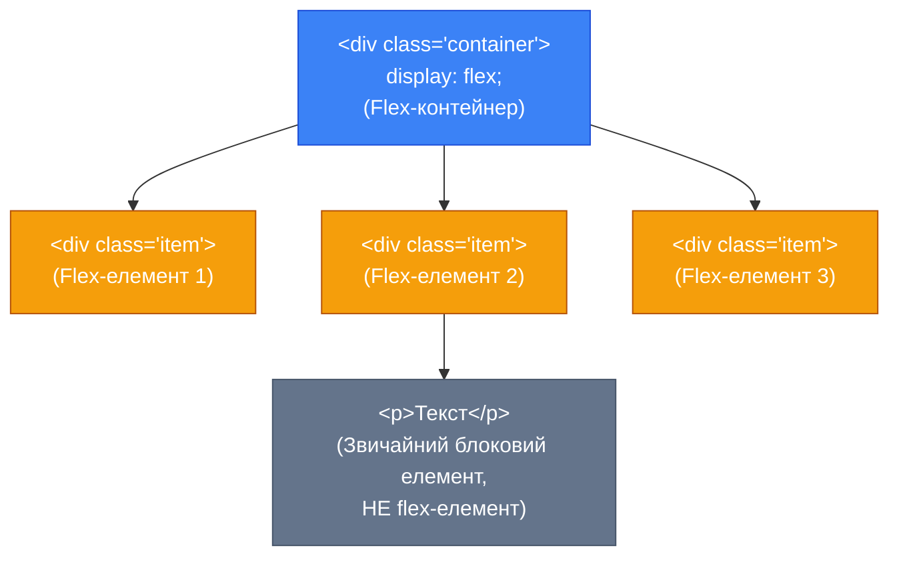
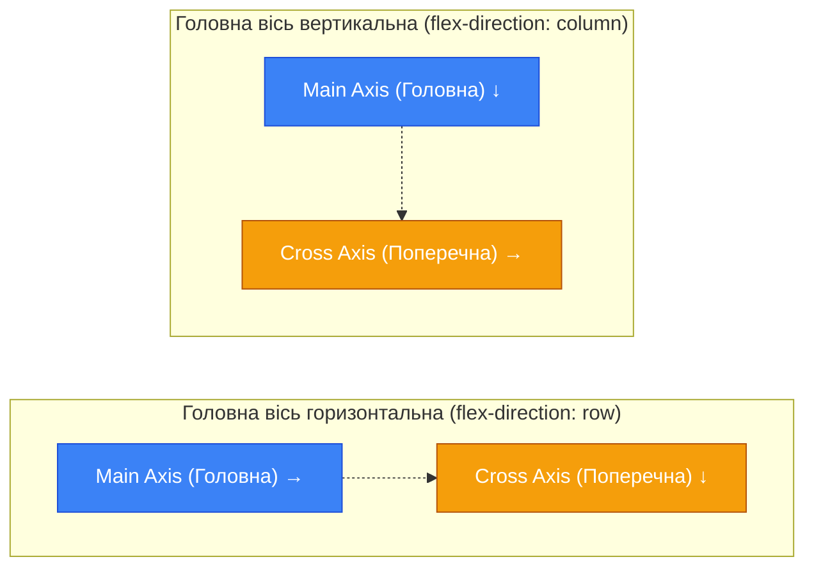

# CSS Flexbox: Фундамент гнучких макетів

## Як ми верстали раніше: Ера хаків та болю

Уявіть собі просте завдання: у вас є контейнер, і ви хочете розмістити всередині нього три блоки в один ряд так, щоб вони займали весь доступний простір, а їх висота була однаковою, незалежно від кількості тексту в кожному. Сьогодні це звучить як елементарна задача для початківця. Але ще десять років тому це був справжній виклик, який вимагав глибоких знань специфічних CSS-трюків.

Історія веб-дизайну — це, багато в чому, історія спроб пристосувати інструменти, створені лише для стилізації тексту, до потреб побудови складних додатків. 

До того як з'явився **Flexbox** (офіційно — CSS Flexible Box Layout Module), розробники проходили через кілька етапів еволюції макетів:

1. **Таблична верстка (`<table>`)**: На початку 2000-х сторінки збирали з HTML-таблиць. Це дозволяло легко робити колонки, але розмітка ставала неймовірно перевантаженою, несемантичною та важкою в підтримці. Таблиці не призначені для макетування сторінок, їхня мета — відображення табличних даних.
2. **Флоати (`float`)**: Властивість `float` була створена для єдиної мети: дозволити тексту обтікати картинку (як у газетних статтях). Але розробники швидко зрозуміли, що якщо дати блокам `float: left`, вони вишикуються в ряд! Це стало стандартом на багато років.
    - *Проблема*: Батьківський контейнер "не бачив" float-елементів і згортався (втрачав висоту). Доводилося використовувати трюк `clearfix`. Центрування по вертикалі залишалося нічним жахом, а забезпечити рівну висоту колонок без фіксованих розмірів було практично неможливо.
3. **Інлайн-блоки (`inline-block`)**: Давав можливість блокам вишиковуватися в ряд, зберігаючи при цьому здатність приймати розміри як блокові елементи.
    - *Проблема*: За замовчуванням між `inline-block` елементами браузер рендерив пробіли (оскільки вони розглядалися як текст). Щоб їх позбутися, використовували хаки на кшталт `font-size: 0;` на батьківському контейнері або зліплювали HTML-теги `</div><div>` без переносів рядків.

Давайте подивимось наживо, як це виглядало раніше.

::tabs
::tabs-item{label="Ера float" icon="i-lucide-history"}
**Контекст**: Ми хочемо зробити дві колонки однакової ширини:

```css
/* Батьківський контейнер */
.container {
    width: 100%;
}
/* Очищення потоку, щоб батько мав висоту */
.container::after {
    content: "";
    display: table;
    clear: both;
}
/* Дочірні елементи */
.column {
    float: left; /* хак для колонок */
    width: 50%;
}
```

*Текст пояснення*: Зверніть увагу на `.container::after`. Це знаменитий `clearfix`. Без нього елемент `.container` мав би нульову висоту, оскільки float-елементи "випадають" з нормального потоку документа, і батько перестає їх містити. Це типовий приклад "корости", коли для простої задачі ми пишемо зовсім нелогічний з точки зору здорового глузду код.
::
::tabs-item{label="Ера inline-block" icon="i-lucide-baseline"}
**Контекст**: Спроба уникнути `float` та його випадання з потоку.

```css
.container {
    font-size: 0; /* Боротьба з пробілами */
}
.column {
    display: inline-block;
    width: 50%;
    font-size: 16px; /* Повертаємо розмір шрифту */
    vertical-align: top;
}
```

*Текст пояснення*: Оскільки `inline-block` поводить себе частково як текст, браузер зважає на переноси рядків у HTML коді між `<div>` і малює між ними порожній простір (приблизно 4 пікселі). Через це дві колонки по 50% не влазили в ряд і друга переносилась на новий. Хак `font-size: 0` на батькові ховав цей пробіл, але зобов'язував нас явно відновлювати розмір тексту для нащадків. Знову ж таки — це не архітектурне рішення, це бинт на рану.
::
::

### Народження Flexbox

Індустрія потребувала інструменту, який би розумів концепцію **розподілу простору** та **вирівнювання** елементів. Таким інструментом став Flexbox.
Flexbox (Flexible Box Layout) — це модель макетування, розроблена спеціально для створення гнучких, адаптивних користувацьких інтерфейсів в **одновимірному** просторі (тобто або в рядок, або в стовпчик).

Його головні суперсили:
1. **Розподіл простору**: Flexbox вміє брати вільний простір контейнера і самостійно розподіляти його між елементами.
2. **Вирівнювання**: Вертикальне та горизонтальне центрування тепер робиться двома рядками коду.
3. **Гнучкість**: Елементи можуть стискатися або розширюватися залежно від доступного місця без фіксованих медіа-запитів.
4. **Порядок**: Ми можемо візуально змінювати порядок елементів, не змінюючи HTML-код (властивість `order`).

---

## Фундаментальні Концепції: Контейнер та Елементи

Архітектура Flexbox базується на двох ролях: **Flex-контейнер (Flex Container)** та **Flex-елементи (Flex Items)**. Усе залежить від відношення "батько-дитина".

### 1. Flex-контейнер (Flex Container)

Контейнер — це елемент, для якого задана властивість `display: flex` (або `display: inline-flex`). 
Як тільки ви застосовуєте це правило, звичайний HTML-елемент набуває "магічних" властивостей. Він створює новий контекст форматування (Flex Formatting Context) для своїх прямих нащадків.

::note
**Важливо:** Flexbox впливає **лише на прямих дочірніх елементів**. Він не впливає на "онуків" (елементи, які вкладені глибше) чи на вкладений текст (текст обертається в анонімні flex-елементи).
::

### 2. Flex-елементи (Flex Items)

Всі **прямі** дочірні елементи flex-контейнера автоматично стають flex-елементами. 
Їхня поведінка кардинально змінюється в порівнянні зі звичайними блоковими (`block`) елементами:
- Відступи (margin) flex-елементів ніколи не згортаються (margin collapsing не працює у flexbox).
- Властивості `float`, `clear` та `vertical-align` на flex-елементах **ігноруються** і не мають жодного ефекту.

::mermaid

::

### Дві Осі Flexbox: Main Axis та Cross Axis

Ще одна фундаментальна частина парадигми Flexbox — це система координат на основі осей, а не звичних нам X та Y. Це найтонший момент, який потрібно глибоко усвідомити. У Flexbox все базується не на горизонталі/вертикалі, а на **Головній осі (Main Axis)** та **Поперечній осі (Cross Axis)**.

::mermaid

::

**Чому це важливо?**
Властивості Flexbox майже ніколи не кажуть "вирівняти по вертикалі". Вони кажуть: "вирівняти по головній осі" (напр., `justify-content`) або "вирівняти по поперечній осі" (напр., `align-items`). 
Якщо головна вісь горизонтальна, то `justify-content` виставляє елементи зліва-направо. Але якщо ви зміните напрямок на вертикальний, `justify-content` почне вирівнювати елементи зверху-вниз!

::field-group
::field{name="Main Axis (Головна вісь)" type="concept"}
Вісь, вздовж якої розташовуються flex-елементи. За замовчуванням вона йде горизонтально зліва направо (у мовах з читанням зліва направо, LTR). Розміри елементів по цьому напрямку визначаються їхнім **Main Size** (зазвичай це `width`).
::
::field{name="Cross Axis (Поперечна вісь)" type="concept"}
Вісь, перпендикулярна до головної осі. За замовчуванням вона йде вертикально зверху вниз. Розміри елементів по цьому напрямку визначаються їхнім **Cross Size** (зазвичай це `height`).
::
::

---

## Архітектура та Механіка

Тепер перейдемо до практичної сторони. Як усе це втілити в коді? Почнемо зі створення самого контейнера та керування напрямком потоку.

### Створення контейнера: `display: flex`

Щоб запустити механіку Flexbox, ми використовуємо властивість `display`.

```css
.flex-container {
    display: flex; /* Або inline-flex */
}
```

**Що відбувається "під капотом", коли ми це пишемо?**
1. Сам блок `.flex-container` продовжує вести себе як звичайний "блоковий" елемент зовнішньо — займає 100% ширини свого батька, скидає інші елементи на новий рядок. (Якщо використати `display: inline-flex`, він вестиме себе як `inline-block`, тобто підлаштує свою ширину під контент).
2. Але **всередині** нього змінюється правила гри. Усі прямі дочірні елементи вишиковуються вздовж Головної осі (за замовчуванням — у рядок зліва направо).
3. Елементи розтягуються, щоб заповнити всю висоту контейнера вздовж Поперечної осі (це поведінка `align-items: stretch`, що діє за замовчуванням).
4. Елементи не переносяться на новий рядок, навіть якщо їм не вистачає місця; вони намагатимуться стиснутися (властивість `flex-shrink` за замовчуванням).

Подивіться на живий приклад. Ми візьмемо 3 звичайні `<div>`, які зазвичай були б складені один під одним, і перетворимо їхнього батька на flex-контейнер.

::html-preview
```html
<div class="before-flex">
    <h3>До `display: flex` (звичайний потік)</h3>
    <div class="parent-normal">
        <div class="child">Блок 1</div>
        <div class="child">Блок 2 (з великим текстом, щоб змінити висоту)</div>
        <div class="child">Блок 3</div>
    </div>
</div>

<div class="after-flex">
    <h3>Після `display: flex`</h3>
    <div class="parent-flex">
        <div class="child">Блок 1</div>
        <div class="child">Блок 2 (з великим текстом, щоб змінити висоту)</div>
        <div class="child">Блок 3</div>
    </div>
</div>
```

```css
body {
    font-family: system-ui, sans-serif;
    color: #1e293b;
}

h3 {
    font-size: 1.1rem;
    margin-bottom: 0.5rem;
    color: #475569;
}

.parent-normal, .parent-flex {
    background-color: #f1f5f9;
    padding: 10px;
    border: 2px dashed #94a3b8;
    border-radius: 8px;
    margin-bottom: 20px;
}

/* Ключовий момент! */
.parent-flex {
    display: flex;
}

.child {
    background-color: #3b82f6;
    color: white;
    padding: 15px;
    margin: 5px; /* У flexbox margin не злипаються! */
    border-radius: 6px;
    font-weight: 500;
}
/* Щоб було видно, як змінюється ширина в звичайному потоці */
.parent-normal .child {
    margin-bottom: 10px;
}
```
::

**Аналіз коду вище:**
- В першому випадку (`parent-normal`), як і очікувалось для блокових елементів, кожен `div` займає 100% ширини і росте вниз.
- У другому випадку (`parent-flex`), просто додавши `display: flex`, ми отримали зовсім іншу картину. Блоки вишикувались у горизонтальну лінію. Ширина кожного блоку тепер визначається його контентом (зверніть увагу, що Блок 2 ширший). А найголовніше — Блок 1 і Блок 3 автоматично розтягнулись по висоті, щоб дорівнювати найвищому елементу (Блоку 2). Це стандартна поведінка, яка робить дизайн карток неймовірно простим!

---

### Напрямок Головної Осі: `flex-direction`

Властивість `flex-direction` застосовується до **flex-контейнера** і встановлює, куди саме буде направлена Головна вісь (Main Axis). Відповідно, це визначає напрямок розміщення елементів.

Думка про цю властивість як про рубильник, який повертає весь простір контейнера.

Доступно 4 значення:
1. `row` (за замовчуванням): Елементи розташовуються лінійно зліва направо (у LTR мовах).
2. `row-reverse`: Елементи розташовуються справа наліво.
3. `column`: Елементи вишиковуються зверху вниз у стовпчик.
4. `column-reverse`: Елементи розташовуються знизу вгору.

Давайте подивимось, як кожне значення впливає на макет.

::html-preview
```html
<div class="controls">
    <button onclick="setDirection('row')" class="active">row</button>
    <button onclick="setDirection('row-reverse')">row-reverse</button>
    <button onclick="setDirection('column')">column</button>
    <button onclick="setDirection('column-reverse')">column-reverse</button>
</div>

<div class="direction-container" id="demo-dir">
    <div class="item">1. Очікування</div>
    <div class="item">2. Обробка</div>
    <div class="item">3. Доставка</div>
</div>

<script>
    function setDirection(dir) {
        document.getElementById('demo-dir').style.flexDirection = dir;
        
        // Оновлюємо стилі кнопок для наочності
        document.querySelectorAll('button').forEach(btn => btn.classList.remove('active'));
        event.target.classList.add('active');
    }
</script>
```

```css
body { font-family: system-ui, sans-serif; }
.controls {
    margin-bottom: 15px;
    display: flex;
    gap: 10px;
    flex-wrap: wrap;
}
button {
    padding: 8px 16px;
    border: 1px solid #cbd5e1;
    border-radius: 6px;
    background: white;
    cursor: pointer;
    font-size: 14px;
    transition: all 0.2s;
}
button:hover { background: #f8fafc; }
button.active {
    background: #3b82f6;
    color: white;
    border-color: #2563eb;
}

.direction-container {
    display: flex;
    /* Початкове значення */
    flex-direction: row; 
    
    background-color: #f1f5f9;
    padding: 20px;
    border-radius: 8px;
    gap: 10px;
    min-height: 200px;
    border: 2px dashed #94a3b8;
    transition: all 0.3s ease;
}

.item {
    background-color: #10b981;
    color: white;
    padding: 15px 20px;
    border-radius: 6px;
    font-weight: 600;
    text-align: center;
    box-shadow: 0 4px 6px -1px rgba(0, 0, 0, 0.1);
}
```
::

**Аналіз роботи `flex-direction`:**

Що важливо відзначити:
- Коли ви використовуєте `row-reverse` чи `column-reverse`, браузер не змінює HTML у дереві DOM. Він лише каже: "почни малювати елементи з протилежного кінця контейнера і рухайся у зворотний бік".
- Зверніть увагу на порядок цифр "1", "2", "3" у демо вище. У випадку `row-reverse` елемент "1" стає найправішим.
- Коли ви перемикаєтесь на `column`, контейнер тепер керується вертикально. Головна вісь пішла зверху вниз! Це означає, що якби ми застосували `justify-content` (вирівнювання по головній осі), воно б зараз центрувало елементи по вертикалі, а не по горизонталі.

::warning
**Обережніше з доступністю (Accessibility):** `*-reverse` властивості змінюють візуальний порядок, але скрін-рідери (програми екранного доступу для людей з порушеннями зору) та навігація клавіатурою (натискання клавіші :kbd[Tab]) продовжують слідувати порядку в HTML документі. 
Якщо ваша логіка вимагає певного порядку, змінюйте структуру HTML, а не використовуйте CSS-трюки для кардинальної реорганізації контенту. `row-reverse` гарно підходить для UI-перемикачів (напр., зміна аватарки з лівого на правий бік в чаті), але не для глобальної структури сторінки.
::

---

### Перенос Елементів: `flex-wrap`

Одне з найважливіших налаштувань за замовчуванням у Flexbox: **всі елементи намагаються втиснутись в один ряд**.
Це означає, що якщо загальна сума їх ширини перевищує ширину контейнера, вони почнуть стискатися (включається `flex-shrink`). Але що робити, якщо ми не хочемо, щоб вони стискались, а натомість переносились на новий ряд, як слова в абзаці тексту?

Для цього є властивість `flex-wrap`, яка застосовується до **flex-контейнера**.

Доступно 3 значення:
1. `nowrap` (за замовчуванням): Всі елементи вміщуються в одну лінію.
2. `wrap`: Елементи переносяться на нові лінії сверху вниз, якщо не вистачає місця.
3. `wrap-reverse`: Елементи переносяться на нові лінії знизу вгору.

Давайте подивимось наживо.

::html-preview
```html
<div class="wrap-controls">
    <button onclick="setWrap('nowrap')" class="active">nowrap (default)</button>
    <button onclick="setWrap('wrap')">wrap</button>
    <button onclick="setWrap('wrap-reverse')">wrap-reverse</button>
</div>

<div class="wrap-container resize-box" id="demo-wrap">
    <div class="wrap-item">Блок 1 (150px)</div>
    <div class="wrap-item">Блок 2 (150px)</div>
    <div class="wrap-item">Блок 3 (150px)</div>
    <div class="wrap-item">Блок 4 (150px)</div>
    <div class="wrap-item">Блок 5 (150px)</div>
</div>
<p class="helper-text">💡 Порада: у цій області можна збільшити ширину вікна, або просто перемикати кнопки.</p>

<script>
    function setWrap(wrapValue) {
        document.getElementById('demo-wrap').style.flexWrap = wrapValue;
        
        document.querySelectorAll('.wrap-controls button').forEach(btn => btn.classList.remove('active'));
        event.target.classList.add('active');
    }
</script>
```

```css
body { font-family: system-ui, sans-serif; }
.wrap-controls {
    margin-bottom: 15px;
    display: flex;
    gap: 10px;
}
button {
    padding: 8px 16px;
    border: 1px solid #cbd5e1;
    border-radius: 6px;
    background: white;
    cursor: pointer;
    font-size: 14px;
}
button:hover { background: #f8fafc; }
button.active {
    background: #8b5cf6;
    color: white;
    border-color: #7c3aed;
}

/* Контейнер обмежуємо по ширині для демо, інакше все влізе в 1 ряд */
.resize-box {
    width: 100%;
    max-width: 450px; /* Спеціально мало місця */
    background-color: #f8fafc;
    padding: 15px;
    border-radius: 8px;
    border: 2px solid #cbd5e1;
    resize: horizontal; /* Дозволяє користувачу розтягувати контейнер */
    overflow: auto;
}

.wrap-container {
    display: flex;
    flex-wrap: nowrap; /* Початкове */
    gap: 10px;
}

.wrap-item {
    background-color: #8b5cf6;
    color: white;
    padding: 15px;
    border-radius: 6px;
    font-weight: 500;
    text-align: center;
    
    /* Ми просимо браузер дати їм по 150px */
    flex-basis: 150px; 
    /* За замовчуванням flex-shrink: 1, тому при nowrap вони стиснуться */
}

.helper-text {
    font-size: 13px;
    color: #64748b;
    margin-top: 10px;
}
```
::

**Що відбувається в анатомії цього коду:**
1. Ми попросили браузер, щоб кожен елемент мав розмір близько `150px` (за допомогою контенту або `flex-basis`).
2. Загальна ширина 5 елементів становить близько `750px` + проміжки.
3. Але наш контейнер має обмеження: `max-width: 450px`.
4. В режимі **`nowrap`** (за замовчуванням): Елементам байдуже на їхні `150px`. Flexbox бачить, що місця обмаль, і стискає всі 5 блоків, щоб вони втіснилися в наявні `450px`. Деякі написи можуть навіть переноситися всередині елементів.
5. При перемиканні на **`wrap`**: Flexbox малює перший елемент (150px), другий (150px), а коли черга доходить до третього, він розуміє, що разом вони займуть `450px + gap`, що більше об'єму контейнера. Тому третій елемент акуратно переноситься на новий ряд, утворюючи багаторядковий макет.

Ця властивість життєво необхідна для створення **адаптивних сіток (responsive grids)** або галерей, де ви хочете, наприклад, мати 4 колонки на комп'ютері, 2 на планшеті та 1 на мобільному пристрої, дозволяючи елементам вільно "спадати" вниз у міру звуження екрану.

---

### Шорткат: `flex-flow`

Оскільки `flex-direction` та `flex-wrap` настільки часто використовуються разом і обидві визначають основу макету (напрямок + багаторядковість), CSS дозволяє об'єднати їх в одну коротку властивість `flex-flow`.

**Синтаксис:**
```css
.container {
    flex-flow: <flex-direction> <flex-wrap>;
}
```

**Приклади використання:**
```css
/* Рядок, стискаємо якщо не влазить */
.container { flex-flow: row nowrap; } 

/* Рядок, переносимо на нові ряди */
.container { flex-flow: row wrap; } 

/* Стовпчик з переносом (рідкість, але можливо, якщо контейнер обмежений по висоті) */
.container { flex-flow: column wrap; } 
```

Застосовувати цей шорткат чи ні — справа особистих вподобань. Багато розробників віддають перевагу роздільним записам для більшої прозорості та зручності пошуку, проте в сучасному коді `flex-flow` зустрічається регулярно.

---

### Ідеальні Проміжки: Властивість `gap`

Раніше, створення рівномірних відступів між десятками елементів у галереї було ще одним головним болем. Ми мали додавати до карток `margin-right: 20px`, потім усвідомлювати, що крайня права картка відштовхує контейнер, доводити виняток для `:last-child`, або додавати на контейнер від'ємний `margin: -20px`. 

У сучасних версіях CSS для Flexbox додали властивість `gap` (яка раніше прийшла з Grid Layout). Властивість `gap` задається на **Flex-контейнері** і забезпечує проміжки **лише між** елементами, не створюючи зайвих відступів по краях, ніби вставляючи повітря між компонентами.

::card-group
::card{title="gap: 20px" icon="i-lucide-maximize"}
Встановлює універсальний простір 20px як між рядками (по вертикалі), так і між колонками (по горизонталі).
::
::card{title="row-gap: 15px" icon="i-lucide-move-vertical"}
Задає простір лише між рядами. Діє переважно тоді, коли ввімкнено `flex-wrap: wrap`.
::
::card{title="column-gap: 30px" icon="i-lucide-move-horizontal"}
Задає просторів лише між стовпчиками елементів у межах одного ряду.
::
::

Синтаксис шорткату, якщо ви хочете задати різні проміжки в одному рядку:
```css
/* gap: <row-gap> <column-gap> */
.container {
    gap: 10px 30px; 
}
```

::html-preview
```html
<div class="gap-playground">
    <div class="card">1</div>
    <div class="card">2</div>
    <div class="card">3</div>
    <div class="card">4</div>
    <div class="card">5</div>
</div>
```

```css
.gap-playground {
    display: flex;
    flex-wrap: wrap; /* Дозволяємо перенос */
    gap: 1rem 3rem; /* 1rem по вертикалі між рядами, 3rem між карточками в ряду! */
    
    background-color: #f1f5f9;
    padding: 1.5rem;
    border-radius: 8px;
    border: 1px solid #cbd5e1;
}

.card {
    background-color: #ec4899;
    color: white;
    font-family: system-ui, sans-serif;
    padding: 1.5rem;
    border-radius: 8px;
    font-weight: bold;
    font-size: 1.2rem;
    text-align: center;
    flex-basis: 120px; /* Змушуємо їх ставати в ряди */
}
```
::

Як бачимо в анатомії нашого коду для демо, контейнер має `gap: 1rem 3rem`. 
Коли 4-й і 5-й елемент не влізли і перенеслися на новий рядок, Flexbox автоматично вставив між верхнім рядом і нижнім `1rem` простору (це наш `row-gap`). А між сусідніми картками знаходиться відстань `3rem` (це наш `column-gap`). Це робить код неймовірно чистим, безпечним та легко масштабованим. Жодного зайвого `margin`.

::tip
**Best Practice**: Забудьте про `margin` для створення простору між компонентами у флекс-сітках. Використовуйте `gap` всюди, де мова йде про відступи між дочірніми елементами. Залишайте `margin` лише для того, щоб відштовхнути весь контейнер від інших блоків на сторінці.
::

---

## Резюме та Практика

Отже, ми ознайомились із фундаментом Flexbox:
1. `display: flex` — це портал у новий вимір одновимірного макетування. Він застосовується до батька (контейнера).
2. Макет будується навколо двох осей: Головної (Main Axis) та Поперечної (Cross Axis).
3. Змінюючи `flex-direction`, ми міняємо напрямок Головної осі (вліво, вправо, вверх, вниз).
4. `flex-wrap` дозволяє елементам спадати на нові лінії замість того, щоб нескінченно стискатися в одному ряду.
5. Для створення ідеальних, надійних відступів між елементами без зайвих умов ми завжди використовуємо властивість `gap`.

Цього фундаменту достатньо для того, щоб задати загальний напрямок вашому інтерфейсу. Але для того, щоб справді контролювати, де саме елементи знаходяться на своїх осях, треба навчитися **вирівнюванню**.

Спробуйте закріпити сьогоднішній матеріал.

### Практичні Навички рівня "Основи"

::accordion
::accordion-item{label="Завдання 1: Найпростіша галерея" icon="i-lucide-image"}
**Сценарій:** Ви розробляєте веб-сайт портфоліо. У вас є компонент `<div class="gallery">`, що містить 10 тегів ``. 
За замовчуванням вони йдуть в один стовпчик (чи хаотично, якщо вони інлайнові). 

**Завдання:** Напишіть мінімум CSS, щоб:
1. Зробити з галереї Flexbox.
2. Змусити картинки переноситись на новий рядок, якщо вони не влазять в екран.
3. Додати ідеально рівні відступи по `15px` між усіма зображеннями.

**Відповідь:**
```css
.gallery {
    display: flex;
    flex-wrap: wrap; /* Або скорочено flex-flow: row wrap; */
    gap: 15px;
}
```
::
::accordion-item{label="Завдання 2: Зміна напрямку для Chat UI" icon="i-lucide-message-circle"}
**Сценарій:** У застосунку чату є повідомлення від вас і від співрозмовника. В HTML коду структура однакова: Аватар зліва, Бульбашка тексту справа.
Але ви хочете, щоб **Ваші** повідомлення мали Аватар справа, а Бульбашку зліва. Без зміни HTML!

**Завдання:** 
Контейнером кожного повідомлення є `<div class="msg">`. Мої повідомлення мають клас `<div class="msg my-msg">`. Яку Flex-властивість застосувати до `.my-msg`, щоб віддзеркалити контент?

**Відповідь:**
```css
.msg {
    display: flex;
    /* Початково direction: row, аватар потім текст */
}
.my-msg {
    flex-direction: row-reverse;
    /* Тепер аватар летить в правий кінець, а текст стоїть зліва від нього! */
}
```
::
::

Наступним кроком ми розглянемо, як керувати розташуванням елементів уздовж наших двох осей. Готові переміщувати пікселі? Переходьте до статті про [Вирівнювання у Flexbox](/12.html-css/14.css-flexbox-alignment).
