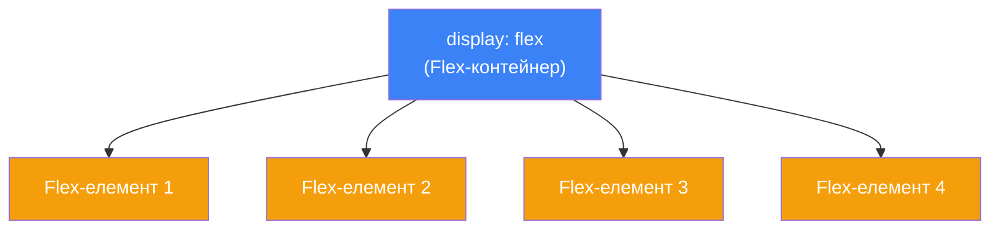
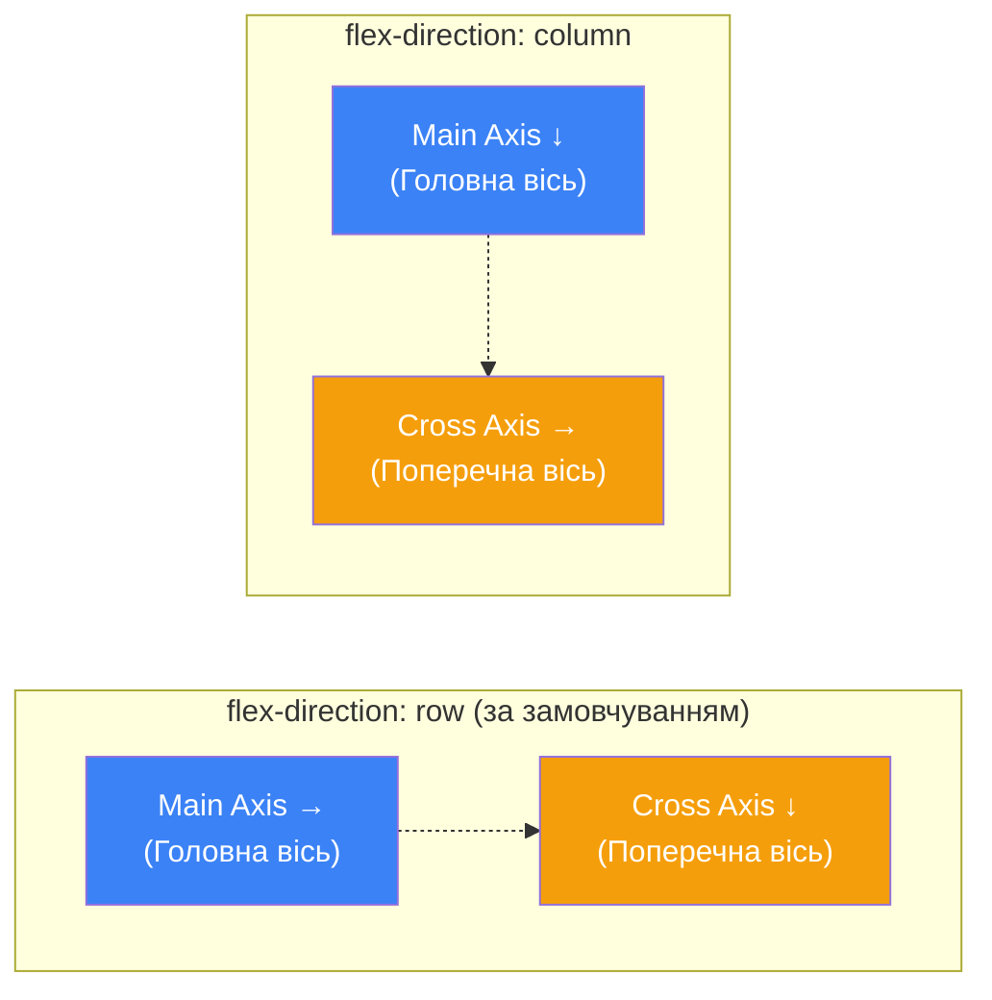

# CSS Flexbox. Гнучкий макет

## Як відцентрувати елемент — задача, що роками вимагала хаків

Горизонтальне та вертикальне центрування елемента — одна з найпоширеніших задач верстки. До Flexbox розробники мусили використовувати `float`, `inline-block`, `table-cell`, від'ємні `margin`, `position: absolute` з `transform` — купу **хаків**, кожен із своїми обмеженнями. У 2024 році ця задача вирішується **двома рядками CSS**:

```css
.container {
    display: flex;
    justify-content: center;
    align-items: center;
}
```

**Flexbox** (_Flexible Box Layout_) — це система компонування, спеціально створена для **одновимірних** макетів: розміщення елементів у рядок або стовпець із гнучким контролем розмірів, порядку та вирівнювання.

У [попередній статті](/12.html-css/12.css-colors-backgrounds) ми навчились працювати з кольорами та фонами. Тепер прийшов час **розміщувати елементи** на сторінці — і Flexbox стане вашим головним інструментом.

---

## Проблеми до Flexbox

Щоб оцінити силу Flexbox, подивимось, як виглядала горизонтальна розкладка **раніше**:

::tabs
::tabs-item{label="float (хак)"}

```css
/* Старий підхід — float */
.card {
    float: left;
    width: 33.33%;
}
.container::after {
    content: '';
    display: table;
    clear: both; /* «Clearfix» — інакше батько схлопнеться */
}
```

**Проблеми:** батько втрачає висоту, потрібен clearfix, складно центрувати, складно зробити рівну висоту колонок.

::
::tabs-item{label="inline-block (хак)"}

```css
/* Старий підхід — inline-block */
.container {
    font-size: 0; /* Видалити пробіли! */
}
.card {
    display: inline-block;
    width: 33.33%;
    font-size: 16px; /* Повернути розмір */
    vertical-align: top;
}
```

**Проблеми:** невидимі пробіли між елементами (~4px), потрібен `font-size: 0` хак, складне вертикальне вирівнювання.

::
::tabs-item{label="Flexbox ✅"}

```css
/* Сучасний підхід */
.container {
    display: flex;
    gap: 1rem;
}
.card {
    flex: 1;
}
```

**Переваги:** чистий, інтуїтивний, потужний. Ніяких хаків.

::
::

---

## Основи Flexbox: контейнер та елементи

Flexbox працює за принципом **контейнер → елементи**:

::mermaid



::

```css
.container {
    display: flex; /* Робить усіх прямих дочірніх — flex-елементами */
}
```

::html-preview

```html
<div class="flex-demo">
    <div class="item">1</div>
    <div class="item">2</div>
    <div class="item">3</div>
    <div class="item">4</div>
</div>
<p class="caption">↑ Без flex: елементи стояли б вертикально (block). З flex — горизонтально.</p>
```

```css
.flex-demo {
    display: flex;
    background-color: #f1f5f9;
    padding: 1rem;
    border-radius: 8px;
    gap: 0.5rem;
}

.item {
    padding: 1rem 1.5rem;
    background-color: #3b82f6;
    color: white;
    border-radius: 6px;
    font-family: system-ui, sans-serif;
    font-weight: 600;
    font-size: 1rem;
}

.caption {
    font-family: system-ui, sans-serif;
    font-size: 0.8rem;
    color: #64748b;
    margin-top: 0.5rem;
}
```

::

::field-group
::field{name="Flex-контейнер" type="element"}
Елемент з `display: flex`. Він керує розміщенням своїх **прямих** дочірніх елементів. Вкладені елементи (внуки, правнуки) — не є flex-елементами.
::
::field{name="Flex-елемент" type="element"}
Кожен **прямий** дочірній елемент flex-контейнера. Автоматично стає гнучким — реагує на властивості `flex-grow`, `flex-shrink`, `flex-basis`.
::
::

---

## Осі Flexbox

Flexbox має дві осі. Вся логіка вирівнювання побудована навколо них:

::mermaid



::

- **Головна вісь** (_Main Axis_) — напрямок розміщення flex-елементів
- **Поперечна вісь** (_Cross Axis_) — перпендикулярна до головної

Напрямок головної осі визначається `flex-direction`.

---

## `flex-direction` — напрямок осі

::html-preview

```html
<div class="dir-demos">
    <div>
        <p class="label">row (за замовчуванням)</p>
        <div class="dir-box" style="flex-direction: row;">
            <div class="item">1</div>
            <div class="item">2</div>
            <div class="item">3</div>
        </div>
    </div>
    <div>
        <p class="label">row-reverse</p>
        <div class="dir-box" style="flex-direction: row-reverse;">
            <div class="item">1</div>
            <div class="item">2</div>
            <div class="item">3</div>
        </div>
    </div>
    <div>
        <p class="label">column</p>
        <div class="dir-box col" style="flex-direction: column;">
            <div class="item">1</div>
            <div class="item">2</div>
            <div class="item">3</div>
        </div>
    </div>
    <div>
        <p class="label">column-reverse</p>
        <div class="dir-box col" style="flex-direction: column-reverse;">
            <div class="item">1</div>
            <div class="item">2</div>
            <div class="item">3</div>
        </div>
    </div>
</div>
```

```css
.dir-demos {
    display: flex;
    gap: 1rem;
    flex-wrap: wrap;
    font-family: system-ui, sans-serif;
}

.dir-demos > div {
    flex: 1;
    min-width: 140px;
}

.label {
    font-size: 0.8rem;
    font-weight: 600;
    color: #475569;
    margin: 0 0 0.25rem;
}

.dir-box {
    display: flex;
    gap: 0.3rem;
    padding: 0.5rem;
    background-color: #f1f5f9;
    border-radius: 6px;
    min-height: 50px;
}

.dir-box.col {
    min-height: 130px;
}

.item {
    padding: 0.4rem 0.75rem;
    background-color: #3b82f6;
    color: white;
    border-radius: 4px;
    font-size: 0.85rem;
    font-weight: 600;
    text-align: center;
}
```

::

| Значення         |  Головна вісь   | Елементи      |
| ---------------- | :-------------: | ------------- |
| `row`            | → горизонтально | Зліва направо |
| `row-reverse`    | ← горизонтально | Справа наліво |
| `column`         |  ↓ вертикально  | Зверху вниз   |
| `column-reverse` |  ↑ вертикально  | Знизу вгору   |

---

## `justify-content` — вирівнювання по головній осі

Визначає, як розподілити вільний простір **уздовж головної осі**:

::html-preview

```html
<div class="jc-demos">
    <p class="label">flex-start</p>
    <div class="jc-box" style="justify-content: flex-start;">
        <div class="item">1</div>
        <div class="item">2</div>
        <div class="item">3</div>
    </div>

    <p class="label">center</p>
    <div class="jc-box" style="justify-content: center;">
        <div class="item">1</div>
        <div class="item">2</div>
        <div class="item">3</div>
    </div>

    <p class="label">flex-end</p>
    <div class="jc-box" style="justify-content: flex-end;">
        <div class="item">1</div>
        <div class="item">2</div>
        <div class="item">3</div>
    </div>

    <p class="label">space-between</p>
    <div class="jc-box" style="justify-content: space-between;">
        <div class="item">1</div>
        <div class="item">2</div>
        <div class="item">3</div>
    </div>

    <p class="label">space-around</p>
    <div class="jc-box" style="justify-content: space-around;">
        <div class="item">1</div>
        <div class="item">2</div>
        <div class="item">3</div>
    </div>

    <p class="label">space-evenly</p>
    <div class="jc-box" style="justify-content: space-evenly;">
        <div class="item">1</div>
        <div class="item">2</div>
        <div class="item">3</div>
    </div>
</div>
```

```css
.jc-demos {
    font-family: system-ui, sans-serif;
}

.label {
    font-size: 0.8rem;
    font-weight: 600;
    color: #475569;
    margin: 0.5rem 0 0.2rem;
}

.jc-box {
    display: flex;
    padding: 0.5rem;
    background-color: #f1f5f9;
    border-radius: 6px;
    gap: 0.3rem;
}

.item {
    padding: 0.5rem 1rem;
    background-color: #3b82f6;
    color: white;
    border-radius: 4px;
    font-size: 0.85rem;
    font-weight: 600;
}
```

::

| Значення        | Поведінка                                                             |
| --------------- | --------------------------------------------------------------------- |
| `flex-start`    | Елементи притиснуті до **початку** осі                                |
| `center`        | Елементи **по центру**                                                |
| `flex-end`      | Елементи притиснуті до **кінця** осі                                  |
| `space-between` | Перший і останній — по краях, решта — **рівномірно** між ними         |
| `space-around`  | Рівні проміжки навколо кожного елемента (крайній проміжок = половина) |
| `space-evenly`  | **Абсолютно** рівні проміжки скрізь                                   |

---

## `align-items` — вирівнювання по поперечній осі

Визначає, як елементи вирівнюються **перпендикулярно** до головної осі:

::html-preview

```html
<div class="ai-demos">
    <div>
        <p class="label">stretch (default)</p>
        <div class="ai-box" style="align-items: stretch;">
            <div class="item sm">A</div>
            <div class="item md">B</div>
            <div class="item lg">C</div>
        </div>
    </div>
    <div>
        <p class="label">flex-start</p>
        <div class="ai-box" style="align-items: flex-start;">
            <div class="item sm">A</div>
            <div class="item md">B</div>
            <div class="item lg">C</div>
        </div>
    </div>
    <div>
        <p class="label">center</p>
        <div class="ai-box" style="align-items: center;">
            <div class="item sm">A</div>
            <div class="item md">B</div>
            <div class="item lg">C</div>
        </div>
    </div>
    <div>
        <p class="label">flex-end</p>
        <div class="ai-box" style="align-items: flex-end;">
            <div class="item sm">A</div>
            <div class="item md">B</div>
            <div class="item lg">C</div>
        </div>
    </div>
    <div>
        <p class="label">baseline</p>
        <div class="ai-box" style="align-items: baseline;">
            <div class="item" style="font-size:0.8rem;padding:0.3rem 0.5rem;">small</div>
            <div class="item" style="font-size:1.5rem;padding:0.5rem 0.75rem;">BIG</div>
            <div class="item" style="font-size:1rem;padding:0.4rem 0.6rem;">med</div>
        </div>
    </div>
</div>
```

```css
.ai-demos {
    display: flex;
    gap: 0.75rem;
    flex-wrap: wrap;
    font-family: system-ui, sans-serif;
}

.ai-demos > div {
    flex: 1;
    min-width: 110px;
}

.label {
    font-size: 0.75rem;
    font-weight: 600;
    color: #475569;
    margin: 0 0 0.2rem;
}

.ai-box {
    display: flex;
    gap: 0.3rem;
    padding: 0.5rem;
    background-color: #f1f5f9;
    border-radius: 6px;
    height: 120px;
}

.item {
    padding: 0.4rem 0.6rem;
    background-color: #3b82f6;
    color: white;
    border-radius: 4px;
    font-size: 0.8rem;
    font-weight: 600;
}

.sm {
    height: 30px;
    display: flex;
    align-items: center;
}
.md {
    height: 50px;
    display: flex;
    align-items: center;
}
.lg {
    height: 70px;
    display: flex;
    align-items: center;
}
```

::

| Значення     | Поведінка                                                       |
| ------------ | --------------------------------------------------------------- |
| `stretch`    | Елементи **розтягуються** на всю висоту контейнера (за замовч.) |
| `flex-start` | Притиснуті до **верху** (початку поперечної осі)                |
| `center`     | **По центру** поперечної осі                                    |
| `flex-end`   | Притиснуті до **низу** (кінця поперечної осі)                   |
| `baseline`   | Вирівнювання тексту по **базовій лінії**                        |

### `align-self` — індивідуальне вирівнювання

Дозволяє **одному елементу** перевизначити `align-items` батька:

::html-preview

```html
<div class="as-box">
    <div class="item">default</div>
    <div class="item self-end">align-self: flex-end</div>
    <div class="item self-center">align-self: center</div>
    <div class="item">default</div>
</div>
```

```css
.as-box {
    display: flex;
    align-items: flex-start;
    gap: 0.5rem;
    padding: 0.75rem;
    background-color: #f1f5f9;
    border-radius: 8px;
    height: 120px;
    font-family: system-ui, sans-serif;
}

.item {
    padding: 0.5rem 0.75rem;
    background-color: #3b82f6;
    color: white;
    border-radius: 4px;
    font-size: 0.75rem;
    font-weight: 600;
}

.self-end {
    align-self: flex-end;
    background-color: #ef4444;
}
.self-center {
    align-self: center;
    background-color: #10b981;
}
```

::

---

## Ідеальне центрування

Найпотужніший прийом Flexbox — **повне центрування** (горизонтальне + вертикальне):

::html-preview

```html
<div class="perfect-center">
    <div class="centered-content">
        <h3>🎯 Ідеально відцентровано</h3>
        <p>justify-content: center + align-items: center</p>
    </div>
</div>
```

```css
.perfect-center {
    display: flex;
    justify-content: center; /* Горизонтально */
    align-items: center; /* Вертикально */
    height: 200px;
    background-color: #f1f5f9;
    border-radius: 12px;
    border: 2px dashed #94a3b8;
}

.centered-content {
    text-align: center;
    font-family: system-ui, sans-serif;
}

.centered-content h3 {
    margin: 0 0 0.25rem;
    font-size: 1.2rem;
    color: #1e293b;
}

.centered-content p {
    margin: 0;
    font-size: 0.85rem;
    color: #64748b;
}
```

::

::tip
`display: flex; justify-content: center; align-items: center;` — ці три рядки центрують будь-що. Запам'ятайте їх раз і назавжди.
::

---

## `flex-wrap` — перенос на новий рядок

За замовчуванням flex-елементи **не переносяться** — вони стискаються, щоб вміститися в один рядок. `flex-wrap` змінює це:

::html-preview

```html
<p class="label">flex-wrap: nowrap (за замовчуванням) — елементи стискаються</p>
<div class="wrap-box" style="flex-wrap: nowrap;">
    <div class="item">1</div>
    <div class="item">2</div>
    <div class="item">3</div>
    <div class="item">4</div>
    <div class="item">5</div>
    <div class="item">6</div>
</div>

<p class="label">flex-wrap: wrap — елементи переносяться</p>
<div class="wrap-box" style="flex-wrap: wrap;">
    <div class="item">1</div>
    <div class="item">2</div>
    <div class="item">3</div>
    <div class="item">4</div>
    <div class="item">5</div>
    <div class="item">6</div>
</div>
```

```css
.label {
    font-family: system-ui, sans-serif;
    font-size: 0.8rem;
    font-weight: 600;
    color: #475569;
    margin: 0.75rem 0 0.25rem;
}

.wrap-box {
    display: flex;
    gap: 0.5rem;
    padding: 0.75rem;
    background-color: #f1f5f9;
    border-radius: 8px;
    max-width: 350px;
}

.item {
    padding: 0.5rem 1.5rem;
    background-color: #3b82f6;
    color: white;
    border-radius: 4px;
    font-family: system-ui, sans-serif;
    font-size: 0.9rem;
    font-weight: 600;
    min-width: 80px;
    text-align: center;
}
```

::

### `align-content` — вирівнювання рядків при wrap

Коли `flex-wrap: wrap` утворює **кілька рядків**, `align-content` контролює їх розподіл по поперечній осі (аналогічно `justify-content`, але для рядків):

```css
.container {
    display: flex;
    flex-wrap: wrap;
    align-content: flex-start; /* Рядки притиснуті до верху */
    align-content: center; /* Рядки по центру */
    align-content: space-between; /* Рядки розподілені рівномірно */
}
```

::note
`align-items` вирівнює **елементи всередині рядка**. `align-content` вирівнює **самі рядки** відносно контейнера. `align-content` діє лише коли є кілька рядків (`flex-wrap: wrap`).
::

---

## `gap` — проміжки між елементами

До `gap` розробники використовували `margin` на flex-елементах — і мусили оброблювати крайні випадки (перший/останній елемент). `gap` вирішує це елегантно:

::html-preview

```html
<p class="label">gap: 1rem</p>
<div class="gap-box" style="gap: 1rem;">
    <div class="item">1</div>
    <div class="item">2</div>
    <div class="item">3</div>
    <div class="item">4</div>
</div>

<p class="label">row-gap: 0.5rem; column-gap: 2rem</p>
<div class="gap-box wrap" style="row-gap: 0.5rem; column-gap: 2rem;">
    <div class="item">1</div>
    <div class="item">2</div>
    <div class="item">3</div>
    <div class="item">4</div>
    <div class="item">5</div>
    <div class="item">6</div>
</div>
```

```css
.label {
    font-family: system-ui, sans-serif;
    font-size: 0.8rem;
    font-weight: 600;
    color: #475569;
    margin: 0.75rem 0 0.2rem;
}

.gap-box {
    display: flex;
    padding: 0.75rem;
    background-color: #f1f5f9;
    border-radius: 8px;
}

.gap-box.wrap {
    flex-wrap: wrap;
    max-width: 350px;
}

.item {
    padding: 0.5rem 1.25rem;
    background-color: #3b82f6;
    color: white;
    border-radius: 4px;
    font-family: system-ui, sans-serif;
    font-size: 0.85rem;
    font-weight: 600;
}
```

::

::tip
**`gap` замість margin** — сучасний стандарт для проміжків у flex та grid. Він створює простір **лише між** елементами, без зайвих відступів на краях. Забудьте про `margin-right` на flex-елементах!
::

---

## Властивості flex-елементів

### `flex-grow` — здатність зростати

Визначає, як елемент **розширюється**, заповнюючи вільний простір:

::html-preview

```html
<p class="label">flex-grow: 0 (за замовчуванням) — елементи не ростуть</p>
<div class="grow-box">
    <div class="item">1</div>
    <div class="item">2</div>
    <div class="item">3</div>
</div>

<p class="label">flex-grow: 1 — всі елементи ростуть рівномірно</p>
<div class="grow-box">
    <div class="item" style="flex-grow:1;">1</div>
    <div class="item" style="flex-grow:1;">2</div>
    <div class="item" style="flex-grow:1;">3</div>
</div>

<p class="label">flex-grow: 1 / 2 / 1 — середній отримує вдвічі більше простору</p>
<div class="grow-box">
    <div class="item" style="flex-grow:1;">1</div>
    <div class="item grow-2" style="flex-grow:2;">2</div>
    <div class="item" style="flex-grow:1;">3</div>
</div>
```

```css
.label {
    font-family: system-ui, sans-serif;
    font-size: 0.8rem;
    font-weight: 600;
    color: #475569;
    margin: 0.75rem 0 0.2rem;
}

.grow-box {
    display: flex;
    gap: 0.5rem;
    padding: 0.75rem;
    background-color: #f1f5f9;
    border-radius: 8px;
}

.item {
    padding: 0.5rem 1rem;
    background-color: #3b82f6;
    color: white;
    border-radius: 4px;
    font-family: system-ui, sans-serif;
    font-size: 0.85rem;
    font-weight: 600;
    text-align: center;
}

.grow-2 {
    background-color: #f59e0b;
}
```

::

### `flex-shrink` — здатність стискатись

Визначає, як елемент **стискається**, коли простору недостатньо:

```css
.item-a {
    flex-shrink: 1;
} /* Стискається нормально (default) */
.item-b {
    flex-shrink: 0;
} /* НЕ стискається — зберігає свій розмір */
.item-c {
    flex-shrink: 2;
} /* Стискається вдвічі більше за інших */
```

### `flex-basis` — початковий розмір

Визначає **початковий розмір** елемента перед розподілом вільного простору:

```css
.item {
    flex-basis: 200px; /* Початковий розмір 200px */
    flex-basis: 30%; /* 30% від контейнера */
    flex-basis: auto; /* Розмір з width або вмісту (default) */
    flex-basis: 0; /* Ігнорувати вміст — весь простір через flex-grow */
}
```

### Скорочення `flex`

Рекомендовано **завжди** використовувати скорочення замість окремих властивостей:

```css
/* flex: grow shrink basis */
.item {
    flex: 0 1 auto;
} /* За замовчуванням */
.item {
    flex: 1;
} /* flex: 1 1 0 — рівномірний розподіл */
.item {
    flex: auto;
} /* flex: 1 1 auto — росте, враховуючи вміст */
.item {
    flex: none;
} /* flex: 0 0 auto — фіксований розмір */
.item {
    flex: 0 0 200px;
} /* Фіксований 200px, не росте, не стискається */
```

::card-group

::card{title="flex: 1" icon="i-heroicons-arrows-pointing-out"}

Найчастіший варіант. Усі елементи рівні: кожен отримує **однакову частку** вільного простору. `flex-basis: 0` — ігнорує різницю у вмісті.

::

::card{title="flex: auto" icon="i-heroicons-arrows-right-left"}

Елементи ростуть **пропорційно до вмісту**: елемент із більшим текстом буде ширшим. `flex-basis: auto` — враховує width або вміст.

::

::card{title="flex: none" icon="i-heroicons-lock-closed"}

Елемент **фіксований** — не росте і не стискається. Зберігає свій природний або явно заданий розмір.

::

::

---

## `order` — зміна візуального порядку

За замовчуванням елементи йдуть у порядку HTML. `order` змінює це **візуально** (без зміни DOM):

::html-preview

```html
<div class="order-box">
    <div class="item" style="order: 3;">HTML: 1 → order: 3</div>
    <div class="item special" style="order: 1;">HTML: 2 → order: 1</div>
    <div class="item" style="order: 2;">HTML: 3 → order: 2</div>
</div>
```

```css
.order-box {
    display: flex;
    gap: 0.5rem;
    padding: 0.75rem;
    background-color: #f1f5f9;
    border-radius: 8px;
    font-family: system-ui, sans-serif;
}

.item {
    flex: 1;
    padding: 0.75rem;
    background-color: #3b82f6;
    color: white;
    border-radius: 6px;
    font-size: 0.8rem;
    font-weight: 600;
    text-align: center;
}

.special {
    background-color: #f59e0b;
}
```

::

::warning
`order` змінює лише **візуальний** порядок. Для скрін-рідерів та навігації через :kbd{value="Tab"} елементи залишаються у порядку HTML. Не зловживайте `order` — якщо порядок важливий для логіки, змініть HTML.
::

---

## Практичні макети

### Навігаційна панель

::html-preview

```html
<nav class="navbar">
    <div class="logo">🚀 MySite</div>
    <ul class="nav-links">
        <li><a href="#">Головна</a></li>
        <li><a href="#">Про нас</a></li>
        <li><a href="#">Послуги</a></li>
        <li><a href="#">Контакти</a></li>
    </ul>
    <button class="nav-btn">Увійти</button>
</nav>
```

```css
.navbar {
    display: flex;
    align-items: center;
    justify-content: space-between;
    padding: 0.75rem 1.5rem;
    background-color: #1e293b;
    border-radius: 10px;
    font-family: system-ui, sans-serif;
}

.logo {
    font-size: 1.2rem;
    font-weight: 700;
    color: white;
}

.nav-links {
    display: flex;
    list-style: none;
    margin: 0;
    padding: 0;
    gap: 0.25rem;
}

.nav-links a {
    color: #94a3b8;
    text-decoration: none;
    padding: 0.5rem 0.75rem;
    border-radius: 6px;
    font-size: 0.9rem;
    transition: all 0.2s;
}

.nav-links a:hover {
    color: white;
    background-color: #334155;
}

.nav-btn {
    padding: 0.5rem 1.25rem;
    background-color: #3b82f6;
    color: white;
    border: none;
    border-radius: 6px;
    font-size: 0.9rem;
    cursor: pointer;
    font-family: inherit;
    transition: background-color 0.2s;
}

.nav-btn:hover {
    background-color: #2563eb;
}
```

::

Ключ: `justify-content: space-between` розподіляє лого, посилання та кнопку по краях.

### Сітка карток

::html-preview

```html
<div class="card-grid">
    <div class="card">
        <div class="card-icon">🎨</div>
        <h3>Дизайн</h3>
        <p>Створення унікальних інтерфейсів</p>
    </div>
    <div class="card">
        <div class="card-icon">⚡</div>
        <h3>Розробка</h3>
        <p>Швидкі та надійні рішення</p>
    </div>
    <div class="card">
        <div class="card-icon">🚀</div>
        <h3>Деплой</h3>
        <p>Автоматизоване розгортання</p>
    </div>
</div>
```

```css
.card-grid {
    display: flex;
    gap: 1rem;
    font-family: system-ui, sans-serif;
}

.card {
    flex: 1;
    padding: 1.5rem;
    background-color: #f8fafc;
    border: 1px solid #e2e8f0;
    border-radius: 12px;
    text-align: center;
    transition:
        transform 0.2s,
        box-shadow 0.2s;
}

.card:hover {
    transform: translateY(-4px);
    box-shadow: 0 8px 25px rgba(0, 0, 0, 0.1);
}

.card-icon {
    font-size: 2rem;
    margin-bottom: 0.5rem;
}

.card h3 {
    margin: 0 0 0.5rem;
    font-size: 1.1rem;
    color: #1e293b;
}

.card p {
    margin: 0;
    font-size: 0.85rem;
    color: #64748b;
    line-height: 1.5;
}
```

::

### Sticky Footer

Футер, що завжди внизу сторінки — навіть коли контенту мало:

```css
body {
    display: flex;
    flex-direction: column;
    min-height: 100vh; /* Мінімальна висота = весь екран */
    margin: 0;
}

main {
    flex: 1; /* Розтягується, заповнюючи весь вільний простір */
}

footer {
    /* Футер автоматично притиснутий до низу */
}
```

::note
`min-height: 100vh` + `flex: 1` на `<main>` — класичний патерн sticky footer. `<main>` займає **весь** вільний простір, виштовхуючи футер донизу, навіть якщо контенту мало.
::

---

## Зведена таблиця властивостей

### Властивості контейнера (`display: flex`)

| Властивість       | Значення                                                                            | Що робить                      |
| ----------------- | ----------------------------------------------------------------------------------- | ------------------------------ |
| `flex-direction`  | `row`, `column`, `row-reverse`, `column-reverse`                                    | Напрямок головної осі          |
| `justify-content` | `flex-start`, `center`, `flex-end`, `space-between`, `space-around`, `space-evenly` | Вирівнювання по головній осі   |
| `align-items`     | `stretch`, `flex-start`, `center`, `flex-end`, `baseline`                           | Вирівнювання по поперечній осі |
| `flex-wrap`       | `nowrap`, `wrap`, `wrap-reverse`                                                    | Перенос елементів              |
| `align-content`   | Як `justify-content`                                                                | Вирівнювання рядків при wrap   |
| `gap`             | `length`                                                                            | Проміжки між елементами        |

### Властивості елементів

| Властивість   | Значення            | Що робить                                 |
| ------------- | ------------------- | ----------------------------------------- |
| `flex`        | `grow shrink basis` | Скорочення для гнучкості                  |
| `flex-grow`   | `number`            | Здатність зростати (0 = не росте)         |
| `flex-shrink` | `number`            | Здатність стискатися (0 = не стискається) |
| `flex-basis`  | `length` \| `auto`  | Початковий розмір                         |
| `align-self`  | Як `align-items`    | Індивідуальне вирівнювання                |
| `order`       | `integer`           | Візуальний порядок                        |

---

## Практичні завдання

### Рівень 1 — Базовий

::accordion
::accordion-item{label="Завдання 1.1: Горизонтальне центрування" icon="i-lucide-align-center"}

Створіть контейнер висотою `300px` зі сірим фоном. Відцентруйте в ньому один елемент (блок із текстом) **горизонтально та вертикально** за допомогою Flexbox.

::
::accordion-item{label="Завдання 1.2: justify-content тренажер" icon="i-lucide-move-horizontal"}

Створіть контейнер із 4 кольоровими блоками. Продемонструйте **всі 6 значень** `justify-content`, створивши окремий контейнер для кожного. Підпишіть значення.

::
::accordion-item{label="Завдання 1.3: flex-direction" icon="i-lucide-arrow-down-right"}

Створіть однаковий набір із 3 елементів і покажіть результат для кожного значення `flex-direction`: `row`, `row-reverse`, `column`, `column-reverse`.

::
::

### Рівень 2 — Логіка та комбінування

::accordion
::accordion-item{label="Завдання 2.1: Навігаційна панель" icon="i-lucide-menu"}

Побудуйте горизонтальну навігацію:

- Логотип зліва
- Посилання по центру
- Кнопка «Увійти» справа
- Використайте `justify-content: space-between` та вкладені flex-контейнери
- Додайте `:hover`-ефекти

::
::accordion-item{label="Завдання 2.2: Holy Grail Layout" icon="i-lucide-layout"}

Побудуйте класичний макет «Holy Grail»:

- Header на всю ширину
- Три колонки: sidebar (200px) | main (flex: 1) | sidebar (200px)
- Footer на всю ширину
- Sticky footer (footer притиснутий до низу навіть при малому контенті)
- Використайте `flex-direction: column` для обгортки та `flex-direction: row` для середнього ряду

::
::accordion-item{label="Завдання 2.3: Рівновисокі картки" icon="i-lucide-equal"}

Створіть 3 картки з різним обсягом тексту. Вимоги:

- Усі картки **однакової висоти** (підказка: `align-items: stretch`)
- Кнопка в кожній картці завжди **внизу** (підказка: кожна картка — теж flex-контейнер з `flex-direction: column`, а кнопка має `margin-top: auto`)
- Адаптивно: `flex-wrap: wrap` при вузькому екрані

::
::

### Рівень 3 — Створення з нуля

::accordion
::accordion-item{label="Завдання 3.1: Dashboard Layout" icon="i-lucide-layout-dashboard"}

Побудуйте макет дашборда:

- Лівий sidebar (фіксований, 250px) з навігаційними посиланнями
- Верхній header із пошуком по центру та аватаром справа
- Основна зона: сітка з 4–6 карток (використайте `flex-wrap: wrap`, кожна картка `flex: 1 1 300px`)
- Весь макет — повноекранний (`height: 100vh`)

::
::accordion-item{label="Завдання 3.2: Adaptive Card Gallery" icon="i-lucide-gallery-horizontal-end"}

Створіть галерею із 8–12 карток:

- Використайте `flex-wrap: wrap` та `gap`
- Кожна картка: `flex: 1 1 250px` (мінімальна ширина 250px, рівномірний розподіл)
- Картки мають мати: зображення (або кольоровий блок), заголовок, опис, тег-категорію
- При наведенні — плавне збільшення (`transform: scale(1.02)`)
- Кнопка «Показати більше» — відцентрована під галереєю

::
::

---

## Підсумок

::card-group

::card{title="📦 Контейнер" icon="i-heroicons-cube"}

`display: flex` робить дочірні елементи гнучкими. `flex-direction` задає напрямок. `gap` — проміжки між ними.

::

::card{title="↔️ justify-content" icon="i-heroicons-arrows-right-left"}

Вирівнювання по **головній** осі: `center`, `space-between`, `space-evenly` — найчастіші.

::

::card{title="↕️ align-items" icon="i-heroicons-arrows-up-down"}

Вирівнювання по **поперечній** осі: `center` — вертикальне центрування, `stretch` — рівна висота.

::

::card{title="🔀 flex: 1" icon="i-heroicons-arrows-pointing-out"}

`flex: 1` — рівні частки простору. `flex: none` — фіксований. `flex: 0 0 200px` — точний розмір.

::

::

---

## Корисні посилання

- 📖 [MDN — Flexbox](https://developer.mozilla.org/en-US/docs/Learn/CSS/CSS_layout/Flexbox) — повний навчальний посібник
- 📐 [CSS Tricks — A Complete Guide to Flexbox](https://css-tricks.com/snippets/css/a-guide-to-flexbox/) — найпопулярніший довідник
- 🐸 [Flexbox Froggy](https://flexboxfroggy.com/) — інтерактивна гра для вивчення Flexbox
- 🛡️ [Flexbox Defense](http://www.flexboxdefense.com/) — ще одна гра — tower defense на Flexbox
- 🎮 [Flexbox Playground](https://flexbox.tech/) — інтерактивний візуалізатор
