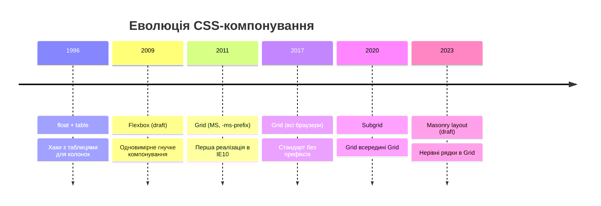
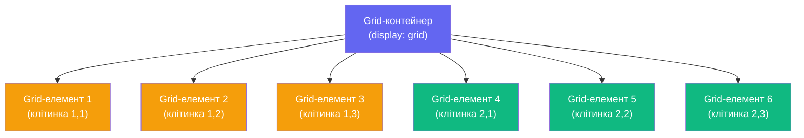
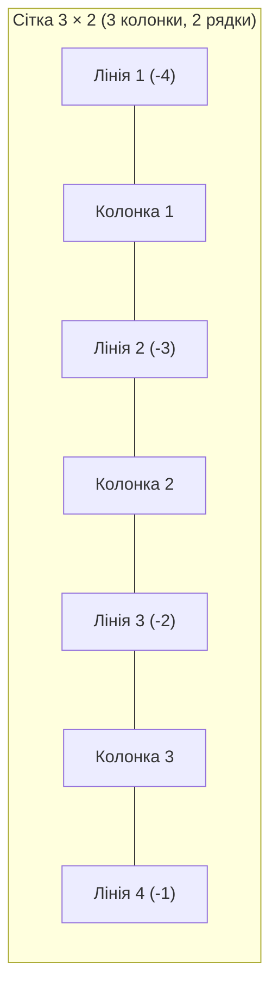

# CSS Grid. Двовимірний макет

## Коли одного виміру стає замало

Уявіть, що ви верстаєте типову сторінку сучасного застосунку: зліва — бічна панель навігації, зверху — шапка, в центрі — основний контент, знизу — підвал. Flexbox впорається з розміщенням елементів **усередині** кожного з цих блоків, але організувати весь цей каркас в **двох вимірах одночасно** — горизонтально та вертикально — він не призначений. Саме тут на сцену виходить **CSS Grid Layout**.

Grid (_сітка_) — це найпотужніша система компонування в CSS. Вона дозволяє розмістити елементи у **двовимірній матриці** рядків і колонок, явно контролюючи, де саме знаходиться кожен елемент. Якщо Flexbox — це компонування в **одному напрямку** (рядок **або** колонка), то Grid — це компонування в обох напрямках **одночасно**.

У [попередній статті](/12.html-css/13.css-layout-flexbox) ми детально розглянули Flexbox. Ця стаття — логічне продовження: ми з'ясуємо, коли Grid краще, ніж Flexbox, і навчимося будувати справжні сторінкові макети.

::note
**Grid та Flexbox — не конкуренти, а союзники.** Flexbox ідеальний для компонентів і одновимірних списків; Grid ідеальний для макетів сторінок і двовимірних сіток. Вони часто використовуються разом: Grid задає загальний каркас, а Flexbox вирівнює вміст усередині кожної з секцій.
::

---

## Передумови та еволюція

До появи Grid Layout веб-розробники будували багатоколонкові макети за допомогою `float`, потім — через Flexbox з `flex-wrap`. Обидва підходи мали критичний недолік: вони були **одновимірними**. Потрібен рядок? Будь ласка. Потрібна колонка? Теж без проблем. Але контролювати **одночасно** і рядки, і колонки — це вже завдання для Grid.

Специфікацію CSS Grid розробляла команда Microsoft ще у 2011 році (під Internet Explorer 10 з префіксом `-ms-grid`). Стандартна версія без префіксів стала доступна в усіх сучасних браузерах у **2017 році** — це була революція у веб-верстці.

::mermaid



::

---

## Базова концепція: контейнер і клітинки

Як і Flexbox, Grid ґрунтується на взаємодії **контейнера** (_grid container_) та **елементів** (_grid items_):

- **Grid-контейнер** — елемент з `display: grid`. Він задає структуру сітки.
- **Grid-елементи** — **прямі** дочірні елементи контейнера. Вони автоматично розміщуються у клітинках сітки.
- **Grid-лінії** (_grid lines_) — горизонтальні та вертикальні лінії, що утворюють сітку. Нумерація починається з 1.
- **Grid-доріжки** (_grid tracks_) — рядки (_rows_) і колонки (_columns_) між сусідніми лініями.
- **Grid-клітинка** (_grid cell_) — найменша одиниця сітки, перетин рядка і колонки.
- **Grid-область** (_grid area_) — прямокутна зона з однієї або кількох клітинок.

::mermaid



::

```css
.container {
    display: grid; /* Активує Grid Layout */
}
```

Цього вже достатньо, щоб зробити контейнер grid-контейнером. Але без визначення колонок і рядків усі елементи просто складатимуться в одну колонку — рівно як при звичайному блоковому потоці. Справжня сила grid починається з `grid-template-columns`.

---

## `grid-template-columns` та `grid-template-rows`

Ці дві властивості — серце всього Grid Layout. Вони визначають розмір і кількість колонок та рядків відповідно.

### Синтаксис

Значення — це список розмірів, розділених пробілами. Кожне значення описує **одну доріжку**:

```css
.container {
    display: grid;
    grid-template-columns: 200px 400px 200px; /* 3 колонки */
    grid-template-rows: 80px 1fr 60px; /* 3 рядки */
}
```

Розберемо, що тут відбувається:

- `grid-template-columns: 200px 400px 200px` — три колонки фіксованої ширини: 200px, 400px та 200px. Разом 800px. Все, що залишається після них, — порожній простір.
- `grid-template-rows: 80px 1fr 60px` — три рядки. Перший і третій мають фіксовану висоту, а другий (_`1fr`_) займає **весь простір, що залишився**.

::html-preview

```html
<div class="grid-basic">
    <div class="item header-cell">Шапка<br /><small>col: 1-4</small></div>
    <div class="item sidebar-cell">Бічна<br />панель</div>
    <div class="item main-cell">Основний контент</div>
    <div class="item footer-cell">Підвал<br /><small>col: 1-4</small></div>
</div>
```

```css
.grid-basic {
    display: grid;
    grid-template-columns: 150px 1fr;
    grid-template-rows: 60px 200px 50px;
    gap: 8px;
    padding: 12px;
    background: #f1f5f9;
    border-radius: 10px;
    font-family: system-ui, sans-serif;
}

.item {
    background: #6366f1;
    color: white;
    border-radius: 6px;
    display: flex;
    flex-direction: column;
    align-items: center;
    justify-content: center;
    font-size: 0.85rem;
    font-weight: 600;
    text-align: center;
    padding: 0.5rem;
}

.item small {
    font-size: 0.7rem;
    opacity: 0.8;
    margin-top: 2px;
}

.header-cell {
    grid-column: 1 / 3;
    background: #4f46e5;
}

.sidebar-cell {
    background: #7c3aed;
}

.main-cell {
    background: #2563eb;
}

.footer-cell {
    grid-column: 1 / 3;
    background: #4f46e5;
}
```

::

У прикладі ми вже використали `grid-column: 1 / 3` — це **розміщення елемента**, яке ми детально розглянемо далі. Поки зверніть увагу на те, як Grid бере під контроль увесь простір.

---

## Одиниця `fr` — частка вільного простору

Одиниця `fr` (_fractional unit_, частка) — це **нова одиниця виміру**, введена спеціально для CSS Grid. Вона означає "частку вільного простору в контейнері" і не є відсотком чи пікселем.

### Як працює `fr`

Алгоритм розрахунку простий:

1. Браузер відраховує фіксовані розміри (px, em, auto та ін.).
2. Залишок вільного простору ділиться між усіма `fr`-доріжками пропорційно до їх коефіцієнтів.

```css
.container {
    display: grid;
    grid-template-columns: 1fr 2fr 1fr;
    /* Вільний простір = 100% - gap */
    /* 1fr = 25% вільного | 2fr = 50% | 1fr = 25% */
}
```

::html-preview

```html
<p class="label">1fr 1fr 1fr — три рівні колонки</p>
<div class="fr-grid" style="grid-template-columns: 1fr 1fr 1fr;">
    <div class="item">1fr</div>
    <div class="item">1fr</div>
    <div class="item">1fr</div>
</div>

<p class="label">1fr 2fr 1fr — середня вдвічі ширша</p>
<div class="fr-grid" style="grid-template-columns: 1fr 2fr 1fr;">
    <div class="item">1fr</div>
    <div class="item wide">2fr</div>
    <div class="item">1fr</div>
</div>

<p class="label">200px 1fr 1fr — перша фіксована, решта ділять залишок</p>
<div class="fr-grid" style="grid-template-columns: 200px 1fr 1fr;">
    <div class="item fixed">200px</div>
    <div class="item">1fr</div>
    <div class="item">1fr</div>
</div>
```

```css
.label {
    font-family: system-ui, sans-serif;
    font-size: 0.8rem;
    font-weight: 600;
    color: #475569;
    margin: 0.75rem 0 0.2rem;
}

.fr-grid {
    display: grid;
    gap: 8px;
    padding: 10px;
    background: #f1f5f9;
    border-radius: 8px;
}

.item {
    background: #6366f1;
    color: white;
    border-radius: 5px;
    padding: 0.75rem 0.5rem;
    font-family: system-ui, sans-serif;
    font-size: 0.85rem;
    font-weight: 700;
    text-align: center;
}

.item.wide {
    background: #4f46e5;
}

.item.fixed {
    background: #7c3aed;
}
```

::

::tip
**`fr` vs `%`:** відсоток береться від ширини **всього** контейнера, через що виникають проблеми з `gap` — сума відсотків перевищить 100%. Одиниця `fr` враховує `gap` автоматично, оскільки бере тільки **вільний** простір після відрахування проміжків. Завжди надавайте перевагу `fr` над `%` у Grid.
::

---

## `repeat()` — стислий запис повторюваних доріжок

Написати `1fr 1fr 1fr 1fr 1fr 1fr 1fr 1fr 1fr 1fr 1fr 1fr` для дванадцятиколонної сітки — незручно та негарно. Функція `repeat()` вирішує цю проблему:

```css
.container {
    /* Замість: 1fr 1fr 1fr 1fr 1fr 1fr 1fr 1fr 1fr 1fr 1fr 1fr */
    grid-template-columns: repeat(12, 1fr); /* Дванадцять рівних колонок */
}
```

### Синтаксис `repeat()`

```
repeat(кількість, розмір-або-шаблон)
```

Перший аргумент — кількість повторень. Другий — шаблон (може містити кілька значень):

```css
.container {
    /* Повторити шаблон "80px 1fr" тричі → тобто 6 колонок */
    grid-template-columns: repeat(3, 80px 1fr);
    /* Результат: 80px 1fr 80px 1fr 80px 1fr */
}
```

`repeat()` також може приймати спеціальні ключові слова `auto-fill` та `auto-fit` замість числа — про них поговоримо в наступному розділі.

---

## `minmax()` — гнучкі межі розміру

Функція `minmax(мінімум, максимум)` дозволяє задати **діапазон** розміру для доріжки: вона буде не меншою за мінімум і не більшою за максимум.

```css
.container {
    /* Колонки: мінімум 200px, максимум — рівна частка вільного простору */
    grid-template-columns: repeat(3, minmax(200px, 1fr));
}
```

Це надзвичайно корисно для **адаптивних сіток**: колонки ніколи не звужуються нижче 200px, але при великому екрані рівномірно заповнюють весь простір.

### `auto` як значення `minmax`

Ключове слово `auto` у `minmax()` означає: мінімум — розмір контенту, максимум — весь доступний простір:

```css
grid-template-columns: minmax(auto, 1fr); /* те саме, що просто 1fr */
grid-template-rows: minmax(100px, auto); /* мінімум 100px, далі росте за контентом */
```

---

## `auto-fill` та `auto-fit` — справді адаптивні сітки

Це найпотужніша комбінація у CSS Grid — `repeat()` з `auto-fill` або `auto-fit` і `minmax()`. Вона дозволяє **автоматично** визначати кількість колонок залежно від доступного простору, **без media queries**.

### `auto-fill` — заповни доріжками, навіть порожніми

```css
.gallery {
    display: grid;
    grid-template-columns: repeat(auto-fill, minmax(200px, 1fr));
    gap: 1rem;
}
```

Браузер запитує: "Скільки колонок шириною щонайменше 200px вміститься в контейнер?" Якщо контейнер 800px — це 4 колонки. Якщо 1200px — 6 колонок. **Колонки з'являються та зникають автоматично.** При `auto-fill`, якщо елементів замало, порожні доріжки все одно **зберігаються** (займають місце).

### `auto-fit` — зтисни порожні доріжки

```css
.gallery {
    display: grid;
    grid-template-columns: repeat(auto-fit, minmax(200px, 1fr));
    gap: 1rem;
}
```

Різниця від `auto-fill`: коли елементів менше, ніж максимально можлива кількість колонок, `auto-fit` **зтискає порожні доріжки до 0** і розтягує наявні елементи на весь простір.

::tabs
::tabs-item{label="auto-fill (порожні зберігаються)"}

```css
.fill-grid {
    display: grid;
    grid-template-columns: repeat(auto-fill, minmax(150px, 1fr));
    gap: 1rem;
}
/* Якщо контейнер 600px і є лише 2 елементи:
   Утворяться 4 колонки (4 × 150px = 600px).
   Перші 2 заповнені, останні 2 — порожні, але займають місце.
   Елементи НЕ розтягуються на весь рядок. */
```

::
::tabs-item{label="auto-fit (елементи заповнюють все)"}

```css
.fit-grid {
    display: grid;
    grid-template-columns: repeat(auto-fit, minmax(150px, 1fr));
    gap: 1rem;
}
/* Якщо контейнер 600px і є лише 2 елементи:
   Порожні колонки зтискаються (collapse).
   2 елементи рівномірно ділять весь простір (по 1fr кожен = 50%).
   Елементи займають весь рядок. */
```

::
::

::html-preview

```html
<p class="label">auto-fill — 3 елементи, порожні доріжки зберігаються</p>
<div class="af-grid fill">
    <div class="item">1</div>
    <div class="item">2</div>
    <div class="item">3</div>
</div>

<p class="label">auto-fit — 3 елементи, займають весь рядок</p>
<div class="af-grid fit">
    <div class="item">1</div>
    <div class="item">2</div>
    <div class="item">3</div>
</div>
```

```css
.label {
    font-family: system-ui, sans-serif;
    font-size: 0.8rem;
    font-weight: 600;
    color: #475569;
    margin: 0.75rem 0 0.25rem;
}

.af-grid {
    display: grid;
    gap: 8px;
    padding: 10px;
    background: #f1f5f9;
    border-radius: 8px;
}

.fill {
    grid-template-columns: repeat(auto-fill, minmax(120px, 1fr));
}

.fit {
    grid-template-columns: repeat(auto-fit, minmax(120px, 1fr));
}

.item {
    background: #6366f1;
    color: white;
    border-radius: 5px;
    padding: 1rem;
    font-family: system-ui, sans-serif;
    font-size: 1.2rem;
    font-weight: 700;
    text-align: center;
}
```

::

::note
Щоб побачити різницю між `auto-fill` та `auto-fit` найяскравіше, змініть ширину браузера або додайте більше елементів. При достатніх елементах поведінка однакова — різниця проявляється тільки коли елементів **менше, ніж знаходиться колонок**.
::

---

## `gap` — проміжки в Grid

Властивість `gap` (_раніше_ `grid-gap`) задає проміжки між рядками та колонками. Вживається одне або два значення:

```css
.container {
    gap: 1rem; /* Однаковий відступ між рядками і колонками */
    gap: 16px 24px; /* row-gap column-gap */
    row-gap: 16px; /* Тільки між рядками */
    column-gap: 24px; /* Тільки між колонками */
}
```

::caution
**`gap` не додає відступи по краях контейнера** — тільки між елементами. Для відступів від країв використовуйте `padding` на контейнері. Ця поведінка часто дивує новачків, які очікують "поля" навколо сітки.
::

---

## Grid-лінії: нумерація та іменування

Розуміння Grid-ліній — ключ до розміщення елементів. Уявіть сітку 3×3: вона має **4 вертикальні лінії** (1, 2, 3, 4) та **4 горизонтальні лінії** (1, 2, 3, 4). Нумерація завжди починається з **1**, не з 0.

```
Вертикальні лінії:  1   2   3   4
                    |   |   |   |
Рядок 1:           [col1][col2][col3]
                    |   |   |   |
Рядок 2:           [col1][col2][col3]
                    |   |   |   |
```

Негативні числа рахуються **з кінця**: `-1` — остання лінія, `-2` — передостання тощо.

::mermaid



::

---

## `grid-column` та `grid-row` — розміщення елементів

Ці властивості дозволяють елементу **зайняти** певну область сітки, вказавши початкову та кінцеву лінії:

```css
.element {
    grid-column: початок / кінець; /* вертикальні лінії */
    grid-row: початок / кінець; /* горизонтальні лінії */
}
```

Вони є скороченнями для `grid-column-start`/`grid-column-end` та `grid-row-start`/`grid-row-end`:

```css
/* Ці записи — еквівалентні */
.element {
    grid-column: 1 / 3;
}
/* Те саме: */
.element {
    grid-column-start: 1;
    grid-column-end: 3;
}
```

### Ключове слово `span` — "займи N доріжок"

Замість вказування кінцевої лінії можна вказати, **скільки доріжок** має зайняти елемент через `span`:

```css
.element {
    grid-column: 1 / span 2; /* Починаючи з лінії 1, займи 2 колонки */
    grid-row: span 3; /* Займи 3 рядки (від поточної позиції) */
}
```

::html-preview

```html
<div class="placement-grid">
    <div class="item header">Шапка (1–3 col, рядок 1)</div>
    <div class="item sidebar">Сайдбар (col 1, рядki 2–3)</div>
    <div class="item main">Головний контент (col 2–3, рядок 2)</div>
    <div class="item widget">Віджет (col 2, рядок 3)</div>
    <div class="item ads">Реклама (col 3, рядок 3)</div>
    <div class="item footer">Підвал (col 1–3, рядок 4)</div>
</div>
```

```css
.placement-grid {
    display: grid;
    grid-template-columns: 150px 1fr 120px;
    grid-template-rows: 55px 160px 120px 50px;
    gap: 8px;
    padding: 12px;
    background: #f1f5f9;
    border-radius: 10px;
    font-family: system-ui, sans-serif;
}

.item {
    background: #6366f1;
    color: white;
    border-radius: 6px;
    display: flex;
    align-items: center;
    justify-content: center;
    font-size: 0.75rem;
    font-weight: 600;
    text-align: center;
    padding: 0.5rem;
}

.header {
    grid-column: 1 / 4;
    background: #4f46e5;
}

.sidebar {
    grid-column: 1;
    grid-row: 2 / 4;
    background: #7c3aed;
}

.main {
    grid-column: 2 / 4;
    grid-row: 2;
    background: #2563eb;
}

.widget {
    grid-column: 2;
    grid-row: 3;
    background: #0891b2;
}

.ads {
    grid-column: 3;
    grid-row: 3;
    background: #059669;
}

.footer {
    grid-column: 1 / 4;
    background: #4f46e5;
}
```

::

Розберемо ключові властивості прикладу:

- **`.header`** — `grid-column: 1 / 4` — займає від лінії 1 до лінії 4, тобто **всі 3 колонки** (еквівалентно `grid-column: 1 / span 3`).
- **`.sidebar`** — `grid-row: 2 / 4` — займає від рядка 2 до рядка 4, тобто **2 рядки** поспіль, створюючи "бічну панель на весь контент".
- **`.main`** — `grid-column: 2 / 4` — займає 2 і 3 колонку, пропустивши першу (там сайдбар).
- **`.footer`** — `grid-column: 1 / 4` — аналогічно шапці, тягнеться через увесь рядок.

Ця явна система розміщення — одна з найпотужніших особливостей Grid. Ви **точно** знаєте, де знаходиться кожен елемент, незалежно від порядку в HTML.

---

## Від'ємні числа ліній

Від'ємна нумерація дуже корисна, коли ви хочете елемент, що **завжди** тягнеться до останньої лінії, навіть якщо ви не знаєте, скільки колонок у сітці:

```css
.full-width {
    grid-column: 1 / -1; /* Від першої до останньої лінії — завжди всі колонки */
}

.last-two {
    grid-column: -3 / -1; /* Останні 2 колонки */
}
```

Це особливо зручно при динамічній сітці (`auto-fill`/`auto-fit`), де кількість колонок змінюється залежно від ширини екрана.

---

## Автоматичне розміщення

Якщо ви **не вказуєте** `grid-column` і `grid-row` для елемента, Grid автоматично розміщує його в наступну вільну клітинку — зліва направо, зверху вниз. Це **автоматичне розміщення** (_auto placement_).

```css
.container {
    display: grid;
    grid-template-columns: repeat(3, 1fr);
    /* Елементи самі розповзуться по 3 колонках */
}
```

::html-preview

```html
<div class="auto-grid">
    <div class="item">1</div>
    <div class="item">2</div>
    <div class="item wide">3 (span 2)</div>
    <div class="item">4</div>
    <div class="item">5</div>
    <div class="item">6</div>
    <div class="item">7</div>
</div>
```

```css
.auto-grid {
    display: grid;
    grid-template-columns: repeat(3, 1fr);
    gap: 8px;
    padding: 12px;
    background: #f1f5f9;
    border-radius: 10px;
    font-family: system-ui, sans-serif;
}

.item {
    background: #6366f1;
    color: white;
    border-radius: 6px;
    padding: 1rem;
    font-size: 1rem;
    font-weight: 700;
    text-align: center;
}

.wide {
    grid-column: span 2;
    background: #4f46e5;
}
```

::

Зверніть увагу: елемент 3 займає 2 колонки (`span 2`). Браузер автоматично переносить елемент 4 на новий рядок, тому що в поточному рядку немає місця для 3 і 4 разом.

::note
За замовчуванням автоматичне розміщення працює **за рядками** (`grid-auto-flow: row`). Можна змінити на `grid-auto-flow: column` — тоді елементи розміщуватимуться спочатку по стовпцю зверху вниз, потім переходять до наступного стовпця. Існує також `grid-auto-flow: dense` — алгоритм намагається "ущільнити" елементи, заповнюючи пробіли дрібнішими елементами.
::

---

## `grid-auto-rows` та `grid-auto-columns` — неявна сітка

Коли елементів більше, ніж задано рядків у `grid-template-rows`, Grid **автоматично** створює нові рядки. Їх розмір за замовчуванням — `auto` (розмір контенту). `grid-auto-rows` дозволяє задати розмір для цих **автоматично створених** рядків:

```css
.container {
    display: grid;
    grid-template-columns: repeat(3, 1fr);
    grid-template-rows: 200px; /* Явно задано лише перший рядок */
    grid-auto-rows: 150px; /* Всі наступні (автоматичні) рядки — 150px */
}
```

**Явна сітка** (_explicit grid_) — та, яку ви задаєте через `grid-template-*`.
**Неявна сітка** (_implicit grid_) — рядки/колонки, які Grid створює автоматично.

::html-preview

```html
<div class="implicit-grid">
    <div class="item">
        1<br /><small>явний рядок<br />200px</small>
    </div>
    <div class="item">2</div>
    <div class="item">3</div>
    <div class="item">
        4<br /><small>неявний рядок<br />100px</small>
    </div>
    <div class="item">5</div>
    <div class="item">6</div>
    <div class="item">
        7<br /><small>ще один<br />неявний</small>
    </div>
</div>
```

```css
.implicit-grid {
    display: grid;
    grid-template-columns: repeat(3, 1fr);
    grid-template-rows: 200px;
    grid-auto-rows: 100px;
    gap: 8px;
    padding: 12px;
    background: #f1f5f9;
    border-radius: 10px;
    font-family: system-ui, sans-serif;
}

.item {
    background: #6366f1;
    color: white;
    border-radius: 6px;
    display: flex;
    flex-direction: column;
    align-items: center;
    justify-content: center;
    font-size: 0.85rem;
    font-weight: 700;
    text-align: center;
}

.item:nth-child(n + 4) {
    background: #7c3aed;
}

.item small {
    font-size: 0.65rem;
    margin-top: 4px;
    opacity: 0.85;
}
```

::

Перший рядок (елементи 1–3) — **явний**, 200px. Наступні рядки (елементи 4–7) — **неявні**, 100px. Це критично важливо для **карткових сіток**: ви задаєте колонки, а кількість рядків не знаєте наперед — `grid-auto-rows` зробить усі автоматичні рядки однаковими.

---

## Практика: Адаптивна картково-сітка

Об'єднаємо все вивчене: `repeat(auto-fit, minmax(...))`, `gap`, `grid-auto-rows` і скорочення `span` — щоб створити справжню адаптивну сітку карток без єдиного media query:

::steps

### Визначити контейнер із авто-колонками

```css
.cards {
    display: grid;
    grid-template-columns: repeat(auto-fit, minmax(280px, 1fr));
    gap: 1.5rem;
    padding: 1.5rem;
}
```

Колонки автоматично з'являтимуться/зникатимуть залежно від ширини контейнера. Мінімальна ширина картки — 280px.

### Задати висоту рядків через `grid-auto-rows`

```css
.cards {
    grid-auto-rows: auto; /* Рядки ростуть за контентом */
}
```

### Виділити featured-картку на весь рядок

```css
.card-featured {
    grid-column: 1 / -1; /* Завжди розтягнеться на всі колонки */
}
```

::

::html-preview

```html
<section class="cards-section">
    <article class="card featured">
        <span class="tag">Рекомендовано</span>
        <h3>Вступ до CSS Grid</h3>
        <p>Найпотужніша система компонування в CSS для створення двовимірних макетів.</p>
        <a href="#" class="btn">Читати далі →</a>
    </article>
    <article class="card">
        <span class="tag">Основи</span>
        <h3>display: grid</h3>
        <p>Перший крок — активація Grid-контейнера.</p>
    </article>
    <article class="card">
        <span class="tag">Одиниці</span>
        <h3>Одиниця fr</h3>
        <p>Частка вільного простору — революційна одиниця Grid.</p>
    </article>
    <article class="card">
        <span class="tag">Функції</span>
        <h3>repeat() та minmax()</h3>
        <p>Стисле оголошення складних сіток з гнучкими розмірами.</p>
    </article>
</section>
```

```css
.cards-section {
    display: grid;
    grid-template-columns: repeat(auto-fit, minmax(220px, 1fr));
    gap: 1rem;
    padding: 1rem;
    background: #f8fafc;
    border-radius: 12px;
    font-family: system-ui, sans-serif;
}

.card {
    background: white;
    border-radius: 10px;
    padding: 1.25rem;
    box-shadow: 0 1px 4px rgba(0, 0, 0, 0.1);
    border: 1px solid #e2e8f0;
}

.card.featured {
    grid-column: 1 / -1;
    background: linear-gradient(135deg, #6366f1, #4f46e5);
    color: white;
    border: none;
    display: flex;
    flex-direction: column;
    gap: 0.5rem;
}

.tag {
    font-size: 0.7rem;
    font-weight: 700;
    text-transform: uppercase;
    letter-spacing: 0.05em;
    color: #6366f1;
    background: #eef2ff;
    padding: 0.2rem 0.5rem;
    border-radius: 4px;
    display: inline-block;
    width: fit-content;
}

.featured .tag {
    color: #4f46e5;
    background: rgba(255, 255, 255, 0.9);
}

.card h3 {
    margin: 0.25rem 0;
    font-size: 1rem;
    color: #1e293b;
}

.featured h3 {
    color: white;
    font-size: 1.2rem;
}

.card p {
    margin: 0;
    font-size: 0.85rem;
    color: #64748b;
    line-height: 1.5;
}

.featured p {
    color: rgba(255, 255, 255, 0.85);
}

.btn {
    display: inline-block;
    margin-top: 0.5rem;
    padding: 0.5rem 1rem;
    background: white;
    color: #4f46e5;
    text-decoration: none;
    border-radius: 6px;
    font-size: 0.85rem;
    font-weight: 600;
    width: fit-content;
}
```

::

---

## Властивість `grid-template` — скорочення

`grid-template` — це скорочення, яке об'єднує `grid-template-rows`, `grid-template-columns` та `grid-template-areas` в один рядок:

```css
.container {
    /* grid-template: рядки / колонки */
    grid-template: 80px 1fr 60px / 200px 1fr 1fr;
}
/* Еквівалентно: */
.container {
    grid-template-rows: 80px 1fr 60px;
    grid-template-columns: 200px 1fr 1fr;
}
```

Хоча запис стислий, він може заплутати. **Рекомендація:** на ранньому етапі вивчення завжди пишіть властивості окремо для ясності.

---

## Резюме частини 1

У цій частині ми заклали фундамент розуміння CSS Grid:

::card-group

::card{title="display: grid" icon="i-heroicons-square-3-stack-3d"}
Активує Grid Layout на контейнері. Усі прямі дочірні елементи стають grid-елементами.
::

::card{title="grid-template-columns / rows" icon="i-heroicons-table-cells"}
Визначають кількість та розміри доріжок. Підтримують px, %, fr, auto, minmax(), repeat().
::

::card{title="Одиниця fr" icon="i-heroicons-chart-bar"}
Частка вільного простору. Враховує gap автоматично. Завжди краще за % в контексті Grid.
::

::card{title="repeat() + auto-fit + minmax()" icon="i-heroicons-arrows-right-left"}
Магічна комбінація для адаптивних сіток без media queries.
::

::card{title="grid-column / grid-row" icon="i-heroicons-cursor-arrow-rays"}
Явне розміщення елементів по лініях сітки. Підтримує span для охоплення кількох доріжок.
::

::card{title="grid-auto-rows" icon="i-heroicons-arrow-down-on-square"}
Розмір рядків неявної сітки — тих, що Grid створює автоматично при переповненні.
::

::

У [наступній частині](/12.html-css/14b.css-layout-grid-advanced) ми розглянемо:

- `grid-template-areas` — іменовані області (named areas)
- `place-items`, `place-content`, `place-self` — вирівнювання в Grid
- Flexbox vs Grid: коли що обирати
- Практика: класичний page layout та masonry-сітка
- Завдання трьох рівнів складності

---

## Завдання для самоперевірки

::accordion

::accordion-item{label="Рівень 1: Базовий — Створення простої сітки"}

**Завдання 1.1.** Створіть сітку з 4 рівних колонок та 3 рядків по 100px. Розмістіть у ній 8 елементів з номерами. Переконайтеся, що між ними є відступ 12px.

**Завдання 1.2.** Виправте помилку: чому `grid-template-columns: 1fr 1fr 1fr; width: 100%;` і далі три елементи по `width: 33%` дає непередбачуваний результат? Приберіть зайву властивість `width` з дочірніх елементів.

**Завдання 1.3.** Поясніть (словами або кодом), у чому різниця між:

```css
grid-template-columns: 1fr 1fr;
/* і */
grid-template-columns: 50% 50%;
```

Підказка: додайте `gap: 20px` і подивіться.

::

::accordion-item{label="Рівень 2: Логіка — Адаптивна галерея фотографій"}

**Завдання 2.1.** Створіть галерею фотографій (9 елементів), яка:

- На широкому екрані показує 4 картки в рядок.
- На середньому (≤ 900px) — 3 картки.
- На вузькому (≤ 600px) — 2 картки.
- Реалізуйте **без** media queries, використовуючи `auto-fit` і `minmax()`.

**Завдання 2.2.** Перша картка галереї має бути "featured" — займати 2 колонки і 2 рядки. Реалізуйте через `grid-column: span 2; grid-row: span 2`. Переконайтеся, що це правильно працює при різних ширинах екрана.

**Завдання 2.3.** Додайте до галереї рядок "заголовок" та рядок "пагінація", кожен з яких займає всю ширину. Використайте `grid-column: 1 / -1`.

::

::accordion-item{label="Рівень 3: Архітектура — Верстка сторінки новинного порталу"}

**Завдання 3.1 (Міні-проєкт).** Реалізуйте повноцінну верстку сторінки новинного порталу з Grid:

- **Шапка** (header): повна ширина, висота 70px.
- **Хлібні крихти** (breadcrumb): повна ширина, висота 35px.
- **Головна новина** (main-article): 60% ширини, висота 300px.
- **Бічна панель** (sidebar): 40% ширини, висота 300px, містить 3 міні-новини.
- **Сітка новин** (news-grid): 12 карток, по 4 в рядок, кожен рядок 200px.
- **Підвал** (footer): повна ширина, висота 80px.

Всі розміри виражайте у `fr` та `rem`, уникайте `px` де можливо. Реалізуйте адаптивність для новинної сітки без media queries.

::

::

---

_Продовження: [CSS Grid. Частина 2 — Named Areas, вирівнювання, Flexbox vs Grid](/12.html-css/14b.css-layout-grid-advanced)_
