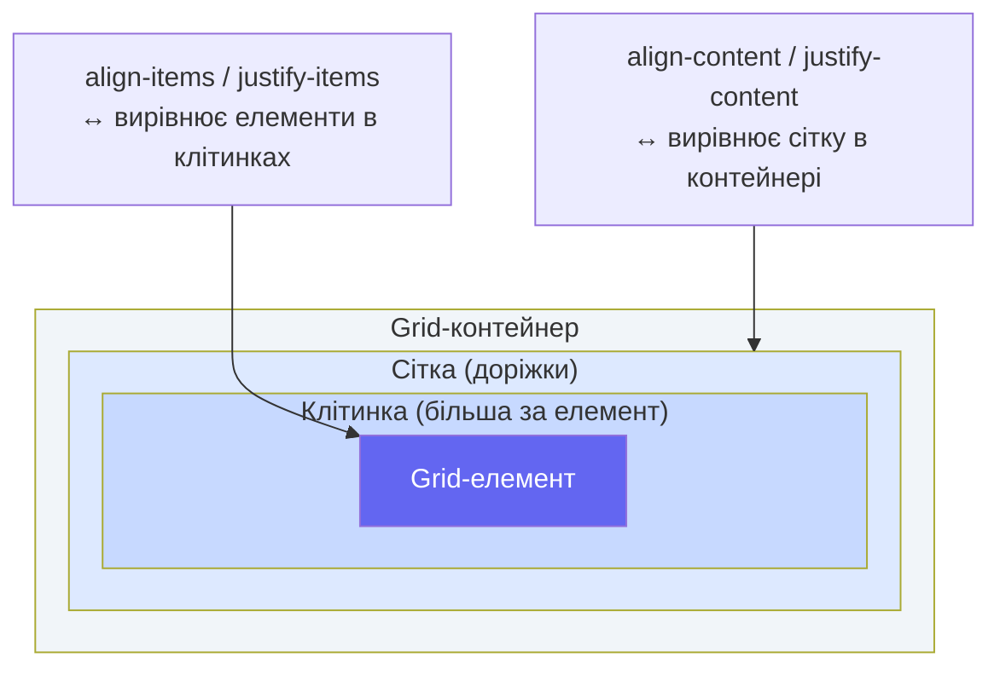

# CSS Grid. Частина 2: Named Areas, вирівнювання та практика

_Це продовження статті [CSS Grid. Частина 1](/12.html-css/14.css-layout-grid), де ми розглянули основи: display grid, одиниця fr, repeat(), minmax(), gap та розміщення елементів._

---

## `grid-template-areas` — говоримо іменами, не числами

Уявіть, що ви описуєте макет сторінки колезі по телефону. Як би ви це зробили? "Шапка зверху на всю ширину, зліва сайдбар, справа — контент, знизу підвал." Ось саме так і працює `grid-template-areas` — ви описуєте макет **словами**.

Замість:

```css
.header {
    grid-column: 1 / 4;
    grid-row: 1;
}
.sidebar {
    grid-column: 1;
    grid-row: 2;
}
```

Пишемо:

```css
.container {
    grid-template-areas:
        'header  header  header'
        'sidebar content content'
        'footer  footer  footer';
}
.header {
    grid-area: header;
}
.sidebar {
    grid-area: sidebar;
}
.footer {
    grid-area: footer;
}
```

Це **самодокументований код** — ви бачите макет прямо у CSS.

### Синтаксис `grid-template-areas`

Кожен рядок у лапках описує **один рядок сітки**. Кожне слово — це клітинка, яка належить до відповідної named area. Однакові слова у сусідніх клітинках **об'єднують** їх в одну область. Крапка (`.`) означає **порожню** клітинку:

```css
.container {
    display: grid;
    grid-template-columns: 150px 1fr 1fr;
    grid-template-rows: 70px 1fr 60px;
    grid-template-areas:
        'header  header  header' /* Рядок 1: шапка на 3 колонки */
        'sidebar main    main' /* Рядок 2: сайдбар + основний контент на 2 колонки */
        'footer  footer  footer'; /* Рядок 3: підвал на 3 колонки */
}
```

### Правила `grid-template-areas`

Є кілька обмежень на синтаксис:

1. Область (_area_) має бути **прямокутною**. Grid не підтримує L-подібних або Г-подібних форм.
2. Кілька рядків рядка сітки, що містять одне й те саме ім'я, мають цю назву в **суміжних колонках** — не через одну.
3. Якщо кількість слів у рядках різна — синтаксис буде некоректним.

::caution
**Поширена помилка:** написати `"header header"` у рядку з 3 колонками. Grid-браузери прийматимуть такий код, але `header` займе лише 2 клітинки, а третя залишиться **без явно визначеної** назви. Завжди перевіряйте відповідність кількості слів кількості колонок.
::

### `grid-area` для елементів

Кожен елемент прив'язується до named area через `grid-area: ім'я`:

```css
.header {
    grid-area: header;
}
.sidebar {
    grid-area: sidebar;
}
.main {
    grid-area: main;
}
.footer {
    grid-area: footer;
}
```

Після цього браузер автоматично розміщує елементи у вказаних областях — незалежно від їх порядку в HTML.

### Повний приклад: класичний page layout

::html-preview

```html
<div class="page-layout">
    <header class="area-header">Header</header>
    <nav class="area-sidebar">Sidebar</nav>
    <main class="area-main">
        <h2>Main Content</h2>
        <p>
            Основний вміст сторінки розміщується тут. Grid автоматично займає простір згідно з описом
            grid-template-areas.
        </p>
    </main>
    <aside class="area-widget">Widget</aside>
    <footer class="area-footer">Footer</footer>
</div>
```

```css
.page-layout {
    display: grid;
    grid-template-columns: 160px 1fr 120px;
    grid-template-rows: 55px 220px 45px;
    grid-template-areas:
        'header  header  header'
        'sidebar main    widget'
        'footer  footer  footer';
    gap: 8px;
    padding: 12px;
    background: #f1f5f9;
    border-radius: 10px;
    font-family: system-ui, sans-serif;
}

.area-header {
    grid-area: header;
    background: #4f46e5;
    color: white;
    border-radius: 6px;
    display: flex;
    align-items: center;
    justify-content: center;
    font-weight: 700;
    font-size: 1rem;
}

.area-sidebar {
    grid-area: sidebar;
    background: #7c3aed;
    color: white;
    border-radius: 6px;
    display: flex;
    align-items: center;
    justify-content: center;
    font-weight: 600;
}

.area-main {
    grid-area: main;
    background: white;
    border-radius: 6px;
    padding: 1rem;
    border: 1px solid #e2e8f0;
}

.area-main h2 {
    margin: 0 0 0.5rem;
    font-size: 1rem;
    color: #1e293b;
}

.area-main p {
    margin: 0;
    font-size: 0.8rem;
    color: #64748b;
    line-height: 1.5;
}

.area-widget {
    grid-area: widget;
    background: #0891b2;
    color: white;
    border-radius: 6px;
    display: flex;
    align-items: center;
    justify-content: center;
    font-weight: 600;
    font-size: 0.9rem;
}

.area-footer {
    grid-area: footer;
    background: #4f46e5;
    color: white;
    border-radius: 6px;
    display: flex;
    align-items: center;
    justify-content: center;
    font-weight: 600;
    font-size: 0.9rem;
}
```

::

Зверніть увагу, наскільки CSS-код тепер **читабельний**: `grid-template-areas` — це ASCII-арт майбутнього макету прямо у коді.

### Адаптивність через `grid-template-areas`

Перевизначення `grid-template-areas` у media query дозволяє **повністю змінити макет** для мобільних пристроїв одним блоком CSS:

```css
/* Десктоп: стандартний макет */
.container {
    grid-template-columns: 200px 1fr;
    grid-template-areas:
        'header  header'
        'sidebar main'
        'footer  footer';
}

/* Мобільний: одна колонка, сайдбар переміщується вниз */
@media (max-width: 768px) {
    .container {
        grid-template-columns: 1fr;
        grid-template-areas:
            'header'
            'main'
            'sidebar' /* Сайдбар тепер між контентом і підвалом */
            'footer';
    }
}
```

Без `grid-template-areas` вам довелося б писати окремі `grid-column` та `grid-row` для кожного елемента в media query. З іменованими областями — лише одна зміна в `grid-template-areas`.

---

## `grid-area` як скорочення позиціонування

`grid-area` може також використовуватися як **ультра-коротке скорочення** для `grid-row-start / grid-column-start / grid-row-end / grid-column-end`:

```css
.element {
    /* grid-area: row-start / col-start / row-end / col-end */
    grid-area: 2 / 1 / 4 / 3;
    /* Еквівалентно: */
    grid-row-start: 2;
    grid-column-start: 1;
    grid-row-end: 4;
    grid-column-end: 3;
}
```

::note
Порядок значень у `grid-area: r-start / c-start / r-end / c-end` — **рядок / колонка** (не колонка / рядок, як можна очікувати). Це часто плутає. Для ясності в командній роботі краще використовувати явні `grid-row` та `grid-column` або named areas.
::

---

## Вирівнювання в Grid: `place-items`, `place-content`, `place-self`

На відміну від Flexbox, де вирівнювання лише по двох осях, Grid дає **повний контроль** над вирівнюванням як клітинок у контейнері, так і вмісту всередині кожної клітинки.

### Концептуальна різниця

Grid має два рівні вирівнювання:

1. **Вирівнювання Grid-елементів у клітинках** — як елемент розміщується всередині своєї клітинки (якщо клітинка більша за елемент).
2. **Вирівнювання доріжок у контейнері** — як вся сітка розміщується всередині контейнера (якщо сітка менша за контейнер).

Для першого рівня — `align-items` і `justify-items`.
Для другого рівня — `align-content` і `justify-content`.

::mermaid



::

### `justify-items` та `align-items`

Ці властивості задаються на **контейнері** і застосовуються до **всіх** grid-елементів:

- `justify-items` — вирівнює елементи **горизонтально** у клітинках (по осі inline/рядка)
- `align-items` — вирівнює елементи **вертикально** у клітинках (по осі block/стовпця)

Можливі значення: `start`, `end`, `center`, `stretch` (за замовчуванням).

```css
.container {
    display: grid;
    grid-template-columns: repeat(3, 200px);
    grid-template-rows: repeat(2, 150px);
    justify-items: center; /* Елементи по центру горизонтально */
    align-items: end; /* Елементи знизу вертикально */
}
```

::html-preview

```html
<p class="label">justify-items: center | align-items: center</p>
<div class="align-grid" style="justify-items: center; align-items: center;">
    <div class="item small">A</div>
    <div class="item medium">B</div>
    <div class="item small">C</div>
    <div class="item medium">D</div>
    <div class="item small">E</div>
    <div class="item medium">F</div>
</div>

<p class="label">justify-items: start | align-items: end</p>
<div class="align-grid" style="justify-items: start; align-items: end;">
    <div class="item small">A</div>
    <div class="item medium">B</div>
    <div class="item small">C</div>
    <div class="item medium">D</div>
    <div class="item small">E</div>
    <div class="item medium">F</div>
</div>
```

```css
.label {
    font-family: system-ui, sans-serif;
    font-size: 0.8rem;
    font-weight: 600;
    color: #475569;
    margin: 0.75rem 0 0.25rem;
}

.align-grid {
    display: grid;
    grid-template-columns: repeat(3, 1fr);
    gap: 4px;
    padding: 10px;
    background: #e2e8f0;
    border-radius: 8px;
    height: 220px;
}

.item {
    background: #6366f1;
    color: white;
    border-radius: 5px;
    font-family: system-ui, sans-serif;
    font-size: 1rem;
    font-weight: 700;
    display: flex;
    align-items: center;
    justify-content: center;
}

.small {
    width: 50px;
    height: 40px;
}

.medium {
    width: 70px;
    height: 60px;
}
```

::

### `justify-content` та `align-content`

Ці властивості вирівнюють **усю сітку** всередині контейнера, якщо сітка менша за контейнер (тобто якщо сума ширин колонок + gap < ширина контейнера):

```css
.container {
    display: grid;
    grid-template-columns: 100px 100px 100px; /* Явний фіксований розмір */
    width: 600px; /* Контейнер ширший за сітку */
    justify-content: center; /* Центрує всі 3 колонки відносно 600px */
    align-content: start; /* Сітка притиснута до верху */
}
```

Значення ті самі, що для `justify-content` у Flexbox: `start`, `end`, `center`, `stretch`, `space-between`, `space-around`, `space-evenly`.

### `justify-self` та `align-self`

Дозволяють **одному елементу** перевизначити вирівнювання з `justify-items`/`align-items`:

```css
.special-item {
    justify-self: end; /* Тільки цей елемент — справа в клітинці */
    align-self: start; /* Тільки цей елемент — зверху в клітинці */
}
```

### Скорочення `place-*`

CSS Grid надає зручні скорочення, що об'єднують вертикальну та горизонтальну властивості:

```css
/* place-items: align-items justify-items */
.container {
    place-items: center;
} /* Те саме, що: align-items: center; justify-items: center; */

/* place-content: align-content justify-content */
.container {
    place-content: center space-between;
}

/* place-self: align-self justify-self */
.item {
    place-self: end center;
}
```

Якщо вказати одне значення, воно застосовується до **обох** осей:

```css
.container {
    place-items: center; /* ≡ align-items: center; justify-items: center; */
}
```

::tip
**`place-items: center`** — найшвидший спосіб відцентрувати вміст у кожній клітинці сітки. Це двоосьовий аналог `display: flex; justify-content: center; align-items: center;` але для Grid.
::

---

## `grid-auto-flow: dense` — оптимізація заповнення

Коли у сітці є елементи різних розмірів (`span 2`, `span 3` тощо), автоматичне розміщення може залишати **порожні клітинки** (holes). Алгоритм `dense` намагається заповнити ці прогалини наступними меншими елементами:

```css
.masonry-grid {
    display: grid;
    grid-template-columns: repeat(auto-fill, minmax(150px, 1fr));
    grid-auto-flow: row dense; /* dense = заповнюй прогалини */
}
```

::warning
**`dense` змінює візуальний порядок елементів**, але не HTML-порядок. Це може погано вплинути на **доступність** (_accessibility_) і поведінку клавіатурної навігації. Використовуйте `dense` лише для чисто візуальних галерей без семантично важливого порядку.
::

::html-preview

```html
<p class="label">Без dense — є порожнечі</p>
<div class="dense-grid no-dense">
    <div class="item span2">Wide (span 2)</div>
    <div class="item">1</div>
    <div class="item">2</div>
    <div class="item span2">Wide 2 (span 2)</div>
    <div class="item">3</div>
    <div class="item">4</div>
    <div class="item">5</div>
</div>

<p class="label">З dense — порожнечі заповнені</p>
<div class="dense-grid with-dense">
    <div class="item span2">Wide (span 2)</div>
    <div class="item">1</div>
    <div class="item">2</div>
    <div class="item span2">Wide 2 (span 2)</div>
    <div class="item">3</div>
    <div class="item">4</div>
    <div class="item">5</div>
</div>
```

```css
.label {
    font-family: system-ui, sans-serif;
    font-size: 0.8rem;
    font-weight: 600;
    color: #475569;
    margin: 0.75rem 0 0.25rem;
}

.dense-grid {
    display: grid;
    grid-template-columns: repeat(4, 1fr);
    gap: 6px;
    padding: 10px;
    background: #f1f5f9;
    border-radius: 8px;
}

.no-dense {
    grid-auto-flow: row;
}

.with-dense {
    grid-auto-flow: row dense;
}

.item {
    background: #6366f1;
    color: white;
    border-radius: 5px;
    padding: 0.75rem;
    font-family: system-ui, sans-serif;
    font-size: 0.85rem;
    font-weight: 600;
    text-align: center;
}

.span2 {
    grid-column: span 2;
    background: #4f46e5;
}
```

::

---

## Flexbox vs Grid: коли що обирати

Одне з найпоширеніших питань на співбесідах і в розробці: "Коли Flexbox, коли Grid?" Відповідь не в тому, що один кращий за інший — вони **вирішують різні задачі**.

::tabs
::tabs-item{label="Flexbox — одновимірний"}

**Flexbox — ідеальний вибір для:**

- Компонентів з вирівнюванням по **одній осі** (рядок або стовпець).
- Навігаційних панелей, тулбарів.
- Вирівнювання іконки і тексту в кнопці.
- Спискових компонентів: списки карток, де контент "плине" природнім чином.
- Центрування (вертикального, горизонтального) невеликих елементів.

```css
/* ✅ Flexbox: кнопка з іконкою та текстом */
.btn {
    display: flex;
    align-items: center;
    gap: 0.5rem;
}

/* ✅ Flexbox: навіг-бар */
.navbar {
    display: flex;
    justify-content: space-between;
    align-items: center;
}
```

::
::tabs-item{label="Grid — двовимірний"}

**Grid — ідеальний вибір для:**

- **Макетів сторінок** (header/sidebar/main/footer).
- Портфоліо-галерей та карткових сіток, де важливе **вирівнювання по рядках і стовпцях**.
- Складних компонентів з **фіксованими пропорціями** між регіонами.
- Форм з вирівняними підписами та полями (grid-template-columns: auto 1fr).
- Будь-якого макету, де ви думаєте у категоріях "рядки і колонки".

```css
/* ✅ Grid: page layout */
.page {
    display: grid;
    grid-template-areas:
        'header'
        'main'
        'footer';
}

/* ✅ Grid: галерея карток */
.gallery {
    display: grid;
    grid-template-columns: repeat(auto-fit, minmax(250px, 1fr));
}
```

::
::

### Порівняльна таблиця

| Критерій                         | Flexbox                    | Grid                          |
| -------------------------------- | -------------------------- | ----------------------------- |
| **Виміри**                       | 1D (рядок **або** колонка) | 2D (рядок **і** колонка)      |
| **Підхід**                       | Контент диктує розмір      | Контейнер диктує структуру    |
| **Named areas**                  | ❌ Немає                   | ✅ `grid-template-areas`      |
| **Явне позиціонування**          | Часткове (`order`)         | Повне (`grid-column/row`)     |
| **Адаптивність без media query** | `flex-wrap`                | `auto-fit/auto-fill + minmax` |
| **Ідеальний для**                | Компонентів, рядків        | Макетів, сіток                |
| **Підтримка браузерів**          | Відмінна                   | Відмінна (>97%)               |

::tip
**Практичне правило:** якщо ви думаєте в напрямку "рядок" — беріть Flexbox. Якщо ви думаєте в напрямках "рядок **і** стовпець" одночасно — беріть Grid. Багато реальних проєктів використовують **обидва**: Grid для загального макету і Flexbox для дрібних компонентів всередині.
::

---

## Практика: Повноцінний page layout

Зберемо разом усе вивчене в обох частинах і побудуємо справжній макет веб-сторінки — зі шапкою, навігаційним меню, основним контентом, сайдбаром, підвалом:

::steps

### Визначити HTML-структуру

```html
<div class="page-wrapper">
    <header class="page-header">Шапка</header>
    <nav class="page-nav">Навігація</nav>
    <main class="page-main">Основний контент</main>
    <aside class="page-aside">Сайдбар</aside>
    <footer class="page-footer">Підвал</footer>
</div>
```

### Описати розкладку через named areas

```css
.page-wrapper {
    display: grid;
    grid-template-columns: 200px 1fr 260px;
    grid-template-rows: auto auto 1fr auto;
    grid-template-areas:
        'header header  header'
        'nav    nav     nav'
        'aside  main    .'
        'footer footer  footer';
    gap: 16px;
    min-height: 100vh;
    padding: 16px;
}
```

Зверніть на крапку (`.`) в рядку aside/main — це **порожня** третя колонка в основній зоні.

### Прив'язати елементи до областей

```css
.page-header {
    grid-area: header;
}
.page-nav {
    grid-area: nav;
}
.page-main {
    grid-area: main;
}
.page-aside {
    grid-area: aside;
}
.page-footer {
    grid-area: footer;
}
```

### Зробити адаптивним для мобільних

```css
@media (max-width: 768px) {
    .page-wrapper {
        grid-template-columns: 1fr;
        grid-template-areas:
            'header'
            'nav'
            'main'
            'aside'
            'footer';
    }
}
```

::

::html-preview

```html
<div class="full-page">
    <header class="full-header">
        <span>🌐 MyWebsite</span>
        <nav class="header-nav">
            <a href="#">Головна</a>
            <a href="#">Послуги</a>
            <a href="#">Про нас</a>
            <a href="#">Контакти</a>
        </nav>
    </header>
    <aside class="full-aside">
        <h4>Категорії</h4>
        <ul>
            <li><a href="#">CSS Grid</a></li>
            <li><a href="#">Flexbox</a></li>
            <li><a href="#">Анімації</a></li>
            <li><a href="#">Типографіка</a></li>
        </ul>
    </aside>
    <main class="full-main">
        <h2>Заголовок статті</h2>
        <p>
            CSS Grid Layout — найпотужніша система компонування в CSS. Вона дозволяє розміщувати елементи у двовимірній
            матриці рядків і колонок з точним контролем позиції кожного елемента.
        </p>
        <p>
            На відміну від Flexbox, Grid думає одночасно в двох вимірах — горизонтальному і вертикальному — що робить
            його ідеальним для побудови складних макетів сторінок.
        </p>
    </main>
    <footer class="full-footer">
        <span>© 2024 MyWebsite. Всі права захищені.</span>
    </footer>
</div>
```

```css
.full-page {
    display: grid;
    grid-template-columns: 160px 1fr;
    grid-template-rows: auto 1fr auto;
    grid-template-areas:
        'header header'
        'aside  main'
        'footer footer';
    gap: 8px;
    padding: 10px;
    background: #f8fafc;
    border-radius: 12px;
    font-family: system-ui, sans-serif;
    min-height: 380px;
}

.full-header {
    grid-area: header;
    background: #4f46e5;
    color: white;
    border-radius: 8px;
    padding: 0 1rem;
    display: flex;
    align-items: center;
    justify-content: space-between;
    height: 52px;
    font-weight: 700;
}

.header-nav {
    display: flex;
    gap: 1rem;
}

.header-nav a {
    color: rgba(255, 255, 255, 0.85);
    text-decoration: none;
    font-size: 0.85rem;
    font-weight: 500;
}

.header-nav a:hover {
    color: white;
}

.full-aside {
    grid-area: aside;
    background: white;
    border-radius: 8px;
    padding: 1rem;
    border: 1px solid #e2e8f0;
}

.full-aside h4 {
    margin: 0 0 0.75rem;
    font-size: 0.85rem;
    color: #475569;
    text-transform: uppercase;
    letter-spacing: 0.05em;
}

.full-aside ul {
    margin: 0;
    padding: 0;
    list-style: none;
}

.full-aside li {
    margin-bottom: 0.4rem;
}

.full-aside a {
    color: #6366f1;
    text-decoration: none;
    font-size: 0.9rem;
}

.full-main {
    grid-area: main;
    background: white;
    border-radius: 8px;
    padding: 1.25rem;
    border: 1px solid #e2e8f0;
}

.full-main h2 {
    margin: 0 0 0.75rem;
    font-size: 1.1rem;
    color: #1e293b;
}

.full-main p {
    margin: 0 0 0.75rem;
    font-size: 0.875rem;
    color: #475569;
    line-height: 1.6;
}

.full-footer {
    grid-area: footer;
    background: #1e293b;
    color: #94a3b8;
    border-radius: 8px;
    padding: 0 1rem;
    display: flex;
    align-items: center;
    height: 42px;
    font-size: 0.8rem;
}
```

::

---

## Subgrid — сітка всередині сітки

CSS Subgrid (_підсітка_) — відносно нова можливість Grid (підтримка з 2023 року у всіх major-браузерах). Вона дозволяє дочірньому Grid-елементу **успадкувати** доріжки батьківської сітки:

```css
.parent {
    display: grid;
    grid-template-columns: repeat(3, 1fr);
    gap: 1rem;
}

.child {
    display: grid;
    grid-column: 1 / -1; /* Займає всі 3 колонки */
    grid-template-columns: subgrid; /* Успадковує 3 колонки батька */
}
```

Без subgrid вкладений Grid-елемент утворює **свою власну сітку**, не пов'язану з батьківською. З subgrid — внуки вирівнюються точно по батьківській сітці. Це вирішує класичну проблему вирівнювання контенту в картках різної висоти.

---

## CSS Grid інспектор у браузері

Chrome DevTools та Firefox DevTools мають вбудований **Grid Inspector** — незамінний інструмент налагодження:

::steps

### Відкрити DevTools

Натисніть `F12` або `Ctrl+Shift+I` / `Cmd+Option+I` (macOS).

### Знайти grid-елемент

У вкладці Elements знайдіть елемент з `display: grid`. Поряд з ним з'явиться значок **grid** (прямокутна сітка).

### Увімкнути візуалізацію

Клікніть на значок або відмітьте checkbox у вкладці Layout → Grid overlays. Браузер намалює лінії сітки прямо на сторінці.

### Аналізувати

Ви побачите нумерацію ліній, розміри доріжок і named areas. Це значно спрощує налагодження складних сіток.

::

---

## Типові патерни Grid

### Паттерн 1: Holy Grail Layout

Класичний "holy grail" (ідеальний макет): шапка + 3 колонки + підвал.

```css
.holy-grail {
    display: grid;
    grid-template: auto 1fr auto / 200px 1fr 200px;
    grid-template-areas:
        'header  header  header'
        'left    main    right'
        'footer  footer  footer';
    min-height: 100vh;
}
```

### Паттерн 2: Responsive Card Grid (без media queries)

```css
.card-grid {
    display: grid;
    grid-template-columns: repeat(auto-fit, minmax(280px, 1fr));
    gap: 1.5rem;
}
```

### Паттерн 3: Masonry-подібна сітка (з dense)

```css
.masonry {
    display: grid;
    grid-template-columns: repeat(auto-fill, minmax(200px, 1fr));
    grid-auto-rows: 50px;
    grid-auto-flow: dense;
    gap: 1rem;
}

.masonry-item-tall {
    grid-row: span 4;
}
.masonry-item-wide {
    grid-column: span 2;
}
```

### Паттерн 4: Форма з вирівняними підписами

```css
.form {
    display: grid;
    grid-template-columns: auto 1fr; /* підпис | поле введення */
    align-items: center;
    gap: 0.75rem 1rem;
}
```

::html-preview

```html
<form class="styled-form">
    <label>Ім'я</label>
    <input type="text" placeholder="Іван Іваненко" />
    <label>Email</label>
    <input type="email" placeholder="ivan@example.com" />
    <label>Телефон</label>
    <input type="tel" placeholder="+380 99 999 9999" />
    <label>Повідомлення</label>
    <textarea placeholder="Ваше повідомлення..." rows="3"></textarea>
    <span></span>
    <button type="submit">Надіслати</button>
</form>
```

```css
.styled-form {
    display: grid;
    grid-template-columns: 110px 1fr;
    align-items: start;
    gap: 0.6rem 0.75rem;
    padding: 1.25rem;
    background: white;
    border-radius: 10px;
    box-shadow: 0 1px 6px rgba(0, 0, 0, 0.1);
    font-family: system-ui, sans-serif;
    max-width: 480px;
}

.styled-form label {
    font-size: 0.875rem;
    font-weight: 600;
    color: #475569;
    padding-top: 0.45rem;
    text-align: right;
}

.styled-form input,
.styled-form textarea {
    width: 100%;
    padding: 0.45rem 0.75rem;
    border: 1px solid #cbd5e1;
    border-radius: 6px;
    font-size: 0.875rem;
    font-family: system-ui, sans-serif;
    color: #1e293b;
    transition: border-color 0.2s;
    box-sizing: border-box;
}

.styled-form input:focus,
.styled-form textarea:focus {
    outline: none;
    border-color: #6366f1;
}

.styled-form button {
    padding: 0.6rem 1.5rem;
    background: #6366f1;
    color: white;
    border: none;
    border-radius: 6px;
    font-size: 0.875rem;
    font-weight: 600;
    cursor: pointer;
    transition: background 0.2s;
}

.styled-form button:hover {
    background: #4f46e5;
}
```

::

---

## Резюме. Повна картина CSS Grid

::card-group

::card{title="grid-template-areas" icon="i-heroicons-map"}
Описує макет словами-іменами. Самодокументований, адаптивний. Кращий вибір для page layout.
::

::card{title="place-items / place-content" icon="i-heroicons-arrows-pointing-in"}
Скорочення вирівнювання по двох осях. `place-items: center` центрує вміст у кожній клітинці.
::

::card{title="grid-auto-flow: dense" icon="i-heroicons-puzzle-piece"}
Ущільнює сітку, заповнюючи прогалини. Корисно для masonry-галерей, але впливає на порядок DOM.
::

::card{title="Subgrid" icon="i-heroicons-squares-plus"}
Дочірній Grid успадковує доріжки батька. Вирішує проблему вирівнювання вмісту в картках.
::

::card{title="Flexbox vs Grid" icon="i-heroicons-scale"}
Flex — 1D, для компонентів. Grid — 2D, для макетів. Часто використовуються разом.
::

::card{title="Grid Inspector" icon="i-heroicons-magnifying-glass"}
Вбудований інструмент Chrome/Firefox DevTools для візуалізації та налагодження Grid-сіток.
::

::

---

## Завдання для самоперевірки

::accordion

::accordion-item{label="Рівень 1: Базовий — Named Areas та вирівнювання"}

**Завдання 1.1.** Реалізуйте простий поштовий клієнт з Grid:

- Ліва панель (150px): список листів
- Права панель (1fr): вміст листа
- Підвал: рядок введення

Використайте `grid-template-areas` з іменами `"list preview"` та `"compose compose"`.

**Завдання 1.2.** Для Grid-контейнера з `grid-template-columns: repeat(3, 150px)` та висотою 300px напишіть CSS, щоб усі елементи розміщувалися у правому нижньому куті своїх клітинок. Підказка: `justify-items` та `align-items`.

**Завдання 1.3.** У наявній grid-сітці з 4 колонок виберіть **третій** елемент та перемістіть його до **другої клітинки першого рядка** через `grid-column` і `grid-row`. Решта елементів мають автоматично перерозміститися.

::

::accordion-item{label="Рівень 2: Логіка — Адаптивний дашборд"}

**Завдання 2.1.** Реалізуйте дашборд аналітики з Grid:

- **Рядок 1**: 3 картки статистики (рівні колонки)
- **Рядок 2**: великий графік (2/3 ширини) + список подій (1/3 ширини)
- **Рядок 3**: 4 міні-картки рівної ширини

Використайте `grid-template-areas` або числове позиціонування (на ваш вибір).

**Завдання 2.2.** Зробіть дашборд з Завдання 2.1 адаптивним:

- **> 1024px**: описана вище структура
- **768–1024px**: 3 колонки → 2, графік на всю ширину
- **< 768px**: одна колонка, всі елементи вертикально

**Завдання 2.3.** Додайте до дашборда "sticky" сайдбар (200px ліворуч), який залишається при прокрутці. Реалізуйте через `grid-template-areas` та `position: sticky`.

::

::accordion-item{label="Рівень 3: Архітектура — Повноцінна сторінка блогу"}

**Завдання 3.1 (Міні-проєкт).** Реалізуйте повноцінну сторінку блогу:

**Структура (HTML):**

```html
<body>
    <header><!-- Логотип + навігація --></header>
    <div class="hero"><!-- Великий банер зі статтею дня --></div>
    <div class="content-area">
        <main><!-- Список статей --></main>
        <aside><!-- Віджети: теги, автори, підписка --></aside>
    </div>
    <footer><!-- Підвал з колонками --></footer>
</body>
```

**Вимоги до Grid:**

1. `body` — Grid для загального каркасу (header, hero, content-area, footer)
2. `.content-area` — Grid з 2 колонками: `2fr 1fr` (main + aside)
3. `main` — Grid для карток статей: `repeat(auto-fill, minmax(280px, 1fr))`
4. `footer` — Grid з 4 рівними колонками для навігаційних блоків
5. Перша картка статей — `featured`, займає 2 колонки та 2 рядки

**Адаптивність:**

- Мобільний (< 768px): весь layout в одну колонку через `grid-template-areas`

**Бонус:** Реалізуйте перемикання теми (light/dark) через CSS Custom Properties та `prefers-color-scheme`.

::

::

---

_Попередня стаття: [CSS Grid. Частина 2 — Сітки, зони, іменування та адаптивність](/html-css/css-layout-grid-advanced)_

_Наступна стаття: [CSS Анімації та Переходи](/html-css/css-animations-transitions)_
