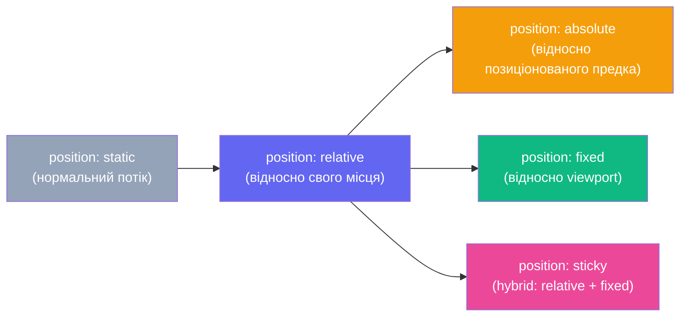
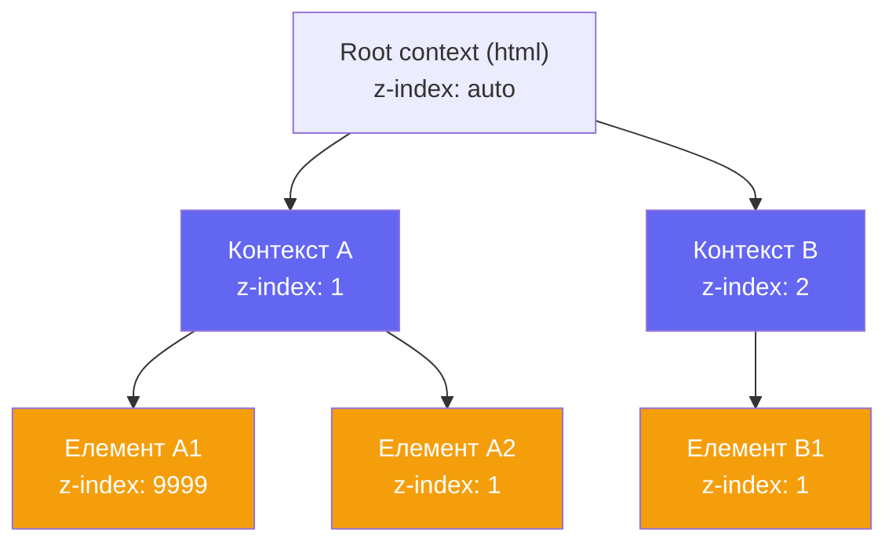
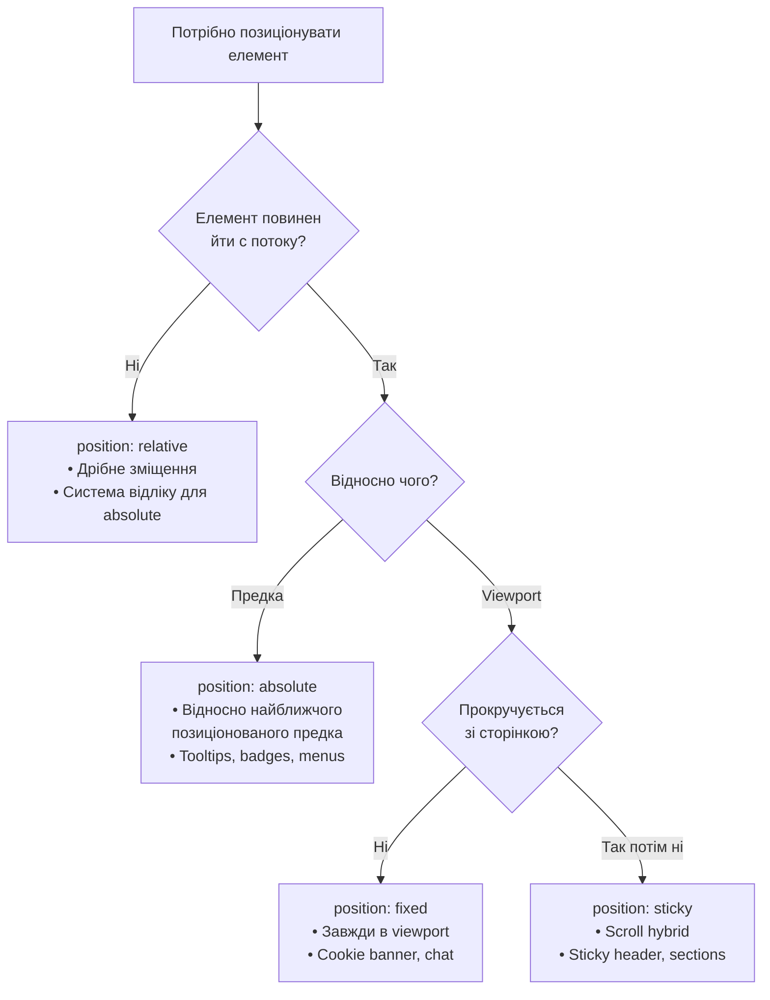

# Позиціонування в CSS. Z-index. Stacking Context

## Чому `z-index: 9999` іноді не допомагає?

Уявіть: ви додаєте модальне вікно поверх всього сайту, ставите `z-index: 9999`, але воно все одно перекривається якимось дрібним елементом із `z-index: 10`. Ви збільшуєте до `z-index: 99999` — і знову нічого. Це не баг браузера. Це **stacking context** (_контекст накладання_) — одна з найменш зрозумілих, але вкрай важливих концепцій CSS.

Щоб зрозуміти stacking context, потрібно спочатку розібратися з позиціонуванням — бо саме `position` є воротами до всього іншого.

У [попередній статті](/12.html-css/14b.css-layout-grid-advanced) ми навчились будувати макети через Grid. Тепер з'ясуємо, як **виривати** елементи з нормального потоку документа і розміщувати їх довільно на сторінці.

---

## Нормальний потік документа

Перш ніж говорити про позиціонування, важливо зрозуміти, від чого ми відходимо.

**Нормальний потік** (_normal flow_) — це стандартна поведінка браузера при відображенні елементів. Блокові елементи (`div`, `p`, `h1`) займають весь рядок і розміщуються одне під одним. Рядкові елементи (`span`, `a`, `strong`) течуть у рядках зліва направо.

Це передбачувана, стабільна система. Позиціонування — це **навмисний вихід** з цієї системи для досягнення особливих ефектів: фіксованих шапок, модальних вікон, спливаючих підказок, дропдаунів тощо.

---

## Властивість `position`

`position` — ключова властивість CSS для управління розміщенням елементів. Вона визначає, **в якій системі координат** позиціонується елемент.

```css
.element {
    position: static; /* за замовчуванням */
    position: relative;
    position: absolute;
    position: fixed;
    position: sticky;
}
```

Разом із `position` використовуються зміщувальні властивості: `top`, `right`, `bottom`, `left`. Вони задають **відстань** від відповідного краю.

::mermaid



::

---

## `position: static` — за замовчуванням

`static` — це початкове значення. Елемент перебуває у **нормальному потоці**, властивості `top`, `right`, `bottom`, `left` та `z-index` на нього **не діють**.

```css
.element {
    position: static; /* Це те саме, що не вказувати position взагалі */
    top: 20px; /* Ігнорується! */
    z-index: 100; /* Ігнорується! */
}
```

::warning
**`z-index` не працює без `position`** (або без `display: flex/grid` на елементі). Це одна з найпоширеніших причин, чому `z-index` "не діє". Якщо ви хочете підняти елемент через `z-index`, він повинен мати `position: relative`, `absolute`, `fixed` або `sticky`.
::

---

## `position: relative` — зміщення без виходу з потоку

`relative` — перший крок до позиціонування. Елемент залишається **у нормальному потоці** (займає своє місце), але ви можете **зміщувати** його відносно цього місця через `top`, `right`, `bottom`, `left`.

Ключова особливість: місце, яке елемент займав у потоці, **зберігається** — сусідні елементи не "заповзуть" на його колишнє місце.

```css
.shifted {
    position: relative;
    top: 20px; /* Зсунути вниз на 20px відносно нормальної позиції */
    left: 30px; /* Зсунути вправо на 30px */
}
```

::html-preview

```html
<div class="rel-demo">
    <div class="box normal">Box 1 (normal)</div>
    <div class="box shifted">Box 2 (position: relative; top: -20px; left: 30px)</div>
    <div class="box normal">Box 3 (normal) — не рухається вгору!</div>
</div>
```

```css
.rel-demo {
    padding: 1rem;
    background: #f1f5f9;
    border-radius: 10px;
    font-family: system-ui, sans-serif;
}

.box {
    padding: 0.75rem 1rem;
    border-radius: 6px;
    margin-bottom: 0.5rem;
    font-size: 0.85rem;
    font-weight: 600;
    color: white;
}

.normal {
    background: #6366f1;
}

.shifted {
    background: #f59e0b;
    position: relative;
    top: -20px;
    left: 30px;
}
```

::

Зверніть: Box 3 залишається на своєму місці, ніби Box 2 нікуди не рухався. **Порожнє місце Box 2 зберігається у потоці.** Це фундаментальна різниця між `relative` і `absolute`.

### Головна роль `relative` — бути **координатним предком** для `absolute`

Саме по собі зміщення `relative`-елементів використовується рідко. Головна роль `position: relative` — **позначити елемент як систему відліку** для дочірнього `position: absolute`. Детальніше — в наступному розділі.

---

## `position: absolute` — абсолютне позиціонування

`absolute` — це **повний вихід з нормального потоку**. Елемент більше не займає місця серед сусідів; він позиціонується відносно **найближчого позиціонованого предка** (_containing block_).

**Позиціонований предок** — це будь-який батьківський елемент, у якого `position` відрізняється від `static` (тобто `relative`, `absolute`, `fixed`, `sticky`).

```css
.parent {
    position: relative; /* 🔑 Задає систему відліку для дочірнього absolute */
}

.child {
    position: absolute;
    top: 10px; /* 10px від верхнього краю .parent */
    right: 10px; /* 10px від правого краю .parent */
}
```

::html-preview

```html
<div class="abs-demo">
    <p class="text">Звичайний текст у потоці...</p>
    <div class="abs-parent">
        <p>Батьківський блок (position: relative)</p>
        <div class="abs-child top-right">top: 8px; right: 8px</div>
        <div class="abs-child bottom-left">bottom: 8px; left: 8px</div>
    </div>
    <p class="text">...і ще текст. Зверніть: absolute-елементи не впливають на висоту батька.</p>
</div>
```

```css
.abs-demo {
    padding: 1rem;
    background: #f8fafc;
    border-radius: 10px;
    font-family: system-ui, sans-serif;
    font-size: 0.85rem;
    color: #475569;
}

.text {
    margin: 0.25rem 0;
}

.abs-parent {
    position: relative;
    height: 130px;
    background: #e0e7ff;
    border-radius: 8px;
    border: 2px dashed #6366f1;
    padding: 0.75rem;
    margin: 0.5rem 0;
    color: #4338ca;
    font-weight: 600;
    font-size: 0.8rem;
}

.abs-child {
    position: absolute;
    background: #6366f1;
    color: white;
    padding: 0.35rem 0.65rem;
    border-radius: 5px;
    font-size: 0.75rem;
    font-weight: 600;
}

.top-right {
    top: 8px;
    right: 8px;
}

.bottom-left {
    bottom: 8px;
    left: 8px;
}
```

::

### Що відбувається, якщо позиціонованого предка немає?

Якщо жоден батьківський елемент не має `position` відмінного від `static`, `absolute`-елемент позиціонується відносно **`<html>`** (кореневого елемента сторінки). Це часто небажана поведінка, тому правило:

> Якщо ставите `position: absolute` дочірньому елементу — завжди ставте `position: relative` батьківському.

::tip
**Патерн badge:** розміщення значка (кількість сповіщень, "новинка", онлайн-статус) у кутку іконки або картки — класичний кейс `absolute` всередині `relative`:

```css
.card {
    position: relative;
}
.badge {
    position: absolute;
    top: -6px;
    right: -6px;
    /* ... */
}
```

::

### Практика: спливаючий tooltip

::html-preview

```html
<div class="tooltip-demo">
    <button class="tooltip-trigger">
        Наведіть курсор
        <span class="tooltip-text">Це спливаюча підказка!</span>
    </button>

    <button class="tooltip-trigger tooltip-bottom">
        Підказка знизу
        <span class="tooltip-text">Я з'являюся знизу</span>
    </button>
</div>
```

```css
.tooltip-demo {
    display: flex;
    gap: 2rem;
    padding: 2rem;
    background: #f8fafc;
    border-radius: 10px;
    justify-content: center;
    font-family: system-ui, sans-serif;
}

.tooltip-trigger {
    position: relative;
    padding: 0.6rem 1.25rem;
    background: #6366f1;
    color: white;
    border: none;
    border-radius: 8px;
    cursor: pointer;
    font-size: 0.9rem;
    font-weight: 600;
    font-family: inherit;
}

.tooltip-text {
    position: absolute;
    bottom: calc(100% + 8px); /* Вище кнопки на 8px */
    left: 50%;
    transform: translateX(-50%); /* Відцентровано по горизонталі */
    background: #1e293b;
    color: white;
    padding: 0.4rem 0.75rem;
    border-radius: 6px;
    font-size: 0.78rem;
    font-weight: 500;
    white-space: nowrap;
    opacity: 0;
    pointer-events: none;
    transition: opacity 0.2s;
}

.tooltip-text::after {
    content: '';
    position: absolute;
    top: 100%;
    left: 50%;
    transform: translateX(-50%);
    border: 6px solid transparent;
    border-top-color: #1e293b;
}

.tooltip-trigger:hover .tooltip-text {
    opacity: 1;
}

.tooltip-bottom .tooltip-text {
    bottom: auto;
    top: calc(100% + 8px);
}

.tooltip-bottom .tooltip-text::after {
    top: auto;
    bottom: 100%;
    border-top-color: transparent;
    border-bottom-color: #1e293b;
}
```

::

Розберемо ключові моменти реалізації tooltip:

- **`.tooltip-trigger { position: relative }`** — батько є системою відліку.
- **`.tooltip-text { position: absolute; bottom: calc(100% + 8px) }`** — `100%` відповідає висоті кнопки, тобто tooltip з'являється **рівно вище** кнопки з відступом 8px.
- **`left: 50%; transform: translateX(-50%)`** — класичний трюк для горизонтального центрування абсолютного елемента невідомої ширини.
- **`opacity: 0` → `opacity: 1` при `:hover`** — плавна поява через `transition`.
- **`::after`** — псевдоелемент для "хвостика" через трюк з прозорими рамками.

---

## `position: fixed` — відносно вікна браузера

`fixed` — схоже на `absolute`, але система відліку — **viewport** (_видима область браузера_), а не позиціонований предок. Елемент **не прокручується** разом зі сторінкою — залишається на місці при скролі.

```css
.sticky-header {
    position: fixed;
    top: 0; /* Притиснутий до верху viewport */
    left: 0;
    width: 100%; /* Займає всю ширину */
    z-index: 1000; /* Поверх інших елементів */
}

.back-to-top {
    position: fixed;
    bottom: 2rem;
    right: 2rem;
}
```

::html-preview

```html
<div class="fixed-demo-wrapper">
    <div class="fake-page">
        <div class="fixed-header">🌐 Фіксована шапка (position: fixed)</div>
        <div class="page-content">
            <p>Прокрутіть вниз — шапка залишається на місці</p>
            <p>Lorem ipsum dolor sit amet, consectetur adipiscing elit.</p>
            <p>Sed do eiusmod tempor incididunt ut labore et dolore magna aliqua.</p>
            <p>Ut enim ad minim veniam, quis nostrud exercitation ullamco.</p>
            <p>Laboris nisi ut aliquip ex ea commodo consequat.</p>
            <p>Duis aute irure dolor in reprehenderit in voluptate.</p>
        </div>
        <button class="fixed-btn">↑ Вгору</button>
    </div>
</div>
```

```css
.fixed-demo-wrapper {
    font-family: system-ui, sans-serif;
    border-radius: 10px;
    overflow: hidden;
    border: 1px solid #e2e8f0;
}

.fake-page {
    position: relative;
    height: 250px;
    overflow-y: auto;
    background: #f8fafc;
}

.fixed-header {
    position: sticky; /* У iframe-демо використовуємо sticky для симуляції */
    top: 0;
    left: 0;
    right: 0;
    background: #4f46e5;
    color: white;
    padding: 0.75rem 1rem;
    font-weight: 700;
    font-size: 0.9rem;
    z-index: 10;
}

.page-content {
    padding: 1rem;
    padding-top: 0.5rem;
}

.page-content p {
    margin: 0.75rem 0;
    font-size: 0.875rem;
    color: #475569;
    line-height: 1.5;
}

.fixed-btn {
    position: sticky;
    bottom: 1rem;
    float: right;
    margin-right: 1rem;
    padding: 0.5rem 0.75rem;
    background: #6366f1;
    color: white;
    border: none;
    border-radius: 8px;
    cursor: pointer;
    font-size: 0.8rem;
    font-weight: 600;
    font-family: inherit;
    clear: both;
}
```

::

### Важливий підводний камінь `fixed`

::caution
**`transform` ламає `position: fixed`!** Якщо будь-який **предок** елемента з `position: fixed` має властивість `transform`, `filter`, `perspective` або `will-change: transform`, то `fixed`-елемент позиціонується **відносно цього предка**, а не відносно viewport. Це поведінка за специфікацією, але часто несподівана. Вирішення: переміщуйте `fixed`-елементи вище в DOM, щоб вони не були нащадками трансформованих елементів.
::

---

## `position: sticky` — "липкий" елемент

`sticky` — це гібрид `relative` і `fixed`. Елемент поводиться як `relative` **доки** не досягне вказаної точки прокрутки, після чого "прилипає" як `fixed` — але тільки **в межах батьківського контейнера**.

```css
.sticky-nav {
    position: sticky;
    top: 0; /* Прилипає до верху вікна при досягненні */
    /* Поки що — звичайний потік */
}
```

::html-preview

```html
<div class="sticky-demo">
    <div class="sticky-section">
        <div class="sticky-title">📌 Розділ A (sticky заголовок)</div>
        <p>
            Прокрутіть вниз, щоб побачити sticky-ефект. Заголовок залишатиметься вгорі, поки ви в межах цього розділу.
        </p>
        <p>Lorem ipsum dolor sit amet, consectetur adipiscing elit. Ut enim ad minim veniam.</p>
        <p>Sed do eiusmod tempor incididunt ut labore et dolore magna aliqua.</p>
    </div>
    <div class="sticky-section">
        <div class="sticky-title">📌 Розділ B (sticky заголовок)</div>
        <p>Коли досягаєте цього розділу, заголовок B "витісняє" заголовок A.</p>
        <p>Quis nostrud exercitation ullamco laboris nisi ut aliquip ex ea commodo consequat.</p>
        <p>Duis aute irure dolor in reprehenderit in voluptate velit esse cillum.</p>
    </div>
    <div class="sticky-section">
        <div class="sticky-title">📌 Розділ C (sticky заголовок)</div>
        <p>Те саме для розділу C. Sticky чудово підходить для таких таблиць з заголовками.</p>
        <p>Excepteur sint occaecat cupidatat non proident, sunt in culpa.</p>
    </div>
</div>
```

```css
.sticky-demo {
    height: 280px;
    overflow-y: auto;
    border-radius: 10px;
    border: 1px solid #e2e8f0;
    font-family: system-ui, sans-serif;
}

.sticky-section {
    padding: 0 1rem 1rem;
}

.sticky-title {
    position: sticky;
    top: 0;
    background: #4f46e5;
    color: white;
    padding: 0.6rem 1rem;
    font-weight: 700;
    font-size: 0.9rem;
    margin: 0 -1rem;
    z-index: 1;
}

.sticky-section p {
    font-size: 0.85rem;
    color: #475569;
    line-height: 1.5;
    margin: 0.6rem 0;
}
```

::

Зверніть: кожен заголовок розділу "прилипає" до верху при прокручуванні, але відразу йде, коли розділ закінчується. Це тому що `sticky` діє **тільки в межах батьківського елемента** (`.sticky-section`).

### Популярні кейси `sticky`

- **Sticky header** — навігаційна шапка, що залишається при прокрутці
- **Sticky sidebar** — бічна панель, що прокручується разом зі сторінкою до певного моменту
- **Sticky table headers** — заголовки таблиць, що залишаються видимими при великих таблицях
- **Sticky section titles** — заголовки розділів у списках (приклад вище)

::note
**`sticky` не спрацює, якщо:**

1. Батьківський елемент має `overflow: hidden` або `overflow: auto` — елемент не зможе "вилізти" за межі контейнера.
2. Не вказано жодну з властивостей `top`, `right`, `bottom`, `left` — браузер не знає, де "прилипати".
3. Батьківський елемент надто маленький — `sticky` діє тільки доки є простір у батьку.

::

---

## Порівняння всіх значень `position`

::tabs
::tabs-item{label="static"}

```css
.element {
    position: static;
}
```

- ✅ У нормальному потоці
- ✅ Займає своє місце серед сусідів
- ❌ `top/right/bottom/left` не діють
- ❌ `z-index` не діє
- **Використання:** за замовчуванням, скасування позиціонування

::
::tabs-item{label="relative"}

```css
.element {
    position: relative;
    top: 20px;
    left: 10px;
}
```

- ✅ У нормальному потоці (займає місце)
- ✅ Зміщується відносно власного місця
- ✅ `z-index` діє
- ✅ Задає систему відліку для `absolute` нащадків
- **Використання:** дрібні зміщення, контейнер для `absolute`

::
::tabs-item{label="absolute"}

```css
.element {
    position: absolute;
    top: 0;
    right: 0;
}
```

- ❌ Виходить з нормального потоку
- ✅ Позиціонується відносно найближчого позиціонованого предка
- ✅ `z-index` діє
- **Використання:** tooltips, badges, dropdown menus, модальні вікна

::
::tabs-item{label="fixed"}

```css
.element {
    position: fixed;
    top: 0;
    width: 100%;
}
```

- ❌ Виходить з нормального потоку
- ✅ Позиціонується відносно viewport
- ✅ Не прокручується зі сторінкою
- ✅ `z-index` діє
- ⚠️ Ламається при `transform` на предку
- **Використання:** sticky header, cookie banner, chat widget

::
::tabs-item{label="sticky"}

```css
.element {
    position: sticky;
    top: 0;
}
```

- ✅ У нормальному потоці (доки не "прилипне")
- ✅ При прокрутці поводиться як `fixed` (в межах батька)
- ✅ `z-index` діє
- ⚠️ Не працює при батьківському `overflow: hidden`
- **Використання:** sticky nav, sticky sidebar, sticky table headers

::
::

| Властивість        | `static` |   `relative`   |    `absolute`    | `fixed`  |        `sticky`        |
| ------------------ | :------: | :------------: | :--------------: | :------: | :--------------------: |
| У потоці           |    ✅    |       ✅       |        ❌        |    ❌    |         ✅/❌          |
| top/left/... діють |    ❌    |       ✅       |        ✅        |    ✅    |           ✅           |
| z-index діє        |    ❌    |       ✅       |        ✅        |    ✅    |           ✅           |
| Система відліку    |    —     | Власна позиція | Позиціон. предок | Viewport | Батьківський контейнер |

---

## `top`, `right`, `bottom`, `left` — зміщення

Ці властивості задають **відстань** від відповідного краю системи відліку:

```css
.element {
    position: absolute;
    top: 20px; /* 20px від верхнього краю батька */
    right: 0; /* Впритул до правого краю */
    bottom: auto; /* auto = не задано */
    left: auto;
}
```

**Важливо:** `top` і `bottom` не сумуються — пріоритет має `top`. Аналогічно `left` має пріоритет перед `right` (для LTR-мов).

### Трюк "розтягнути на весь батько"

```css
.overlay {
    position: absolute;
    top: 0;
    right: 0;
    bottom: 0;
    left: 0;
    /* Або скорочено: */
    inset: 0; /* Нова властивість (підтримка 2021+) */
}
```

`inset: 0` — найелегантніший спосіб розтягнути `absolute`-елемент на весь батьківський блок:

::html-preview

```html
<div class="overlay-demo">
    <div class="overlay-parent">
        
        <div class="overlay-content">
            <h3>Заголовок</h3>
            <p>Overlay через inset: 0</p>
        </div>
    </div>
</div>
```

```css
.overlay-demo {
    padding: 1rem;
    background: #f8fafc;
    border-radius: 10px;
    font-family: system-ui, sans-serif;
}

.overlay-parent {
    position: relative;
    border-radius: 8px;
    overflow: hidden;
    display: inline-block;
}

.overlay-parent img {
    display: block;
    width: 100%;
}

.overlay-content {
    position: absolute;
    inset: 0; /* top: 0; right: 0; bottom: 0; left: 0 */
    background: rgba(79, 70, 229, 0.75);
    color: white;
    display: flex;
    flex-direction: column;
    align-items: center;
    justify-content: center;
    text-align: center;
    opacity: 0;
    transition: opacity 0.3s;
}

.overlay-parent:hover .overlay-content {
    opacity: 1;
}

.overlay-content h3 {
    margin: 0 0 0.35rem;
    font-size: 1.1rem;
}

.overlay-content p {
    margin: 0;
    font-size: 0.85rem;
    opacity: 0.9;
}
```

::

---

## Z-index: управління шарами

`z-index` (_від "z-axis"_, вісь глибини) визначає **порядок накладання** позиціонованих елементів один на одного. Вища вартість — ближче до глядача.

```css
.layer-1 {
    z-index: 1;
} /* Нижче */
.layer-2 {
    z-index: 10;
} /* Вище */
.layer-3 {
    z-index: 100;
} /* Найвище */
```

**Правила `z-index`:**

1. Працює тільки на **позиціонованих елементах** (`position` ≠ `static`) або на flex/grid-елементах.
2. Приймає **цілі числа** (від'ємні теж дозволені).
3. Елементи порівнюються в межах **одного stacking context** — ось тут починається найцікавіше.

::html-preview

```html
<div class="zindex-demo">
    <div class="z-box z1">z-index: 1</div>
    <div class="z-box z2">z-index: 3 (найвище)</div>
    <div class="z-box z3">z-index: 2</div>
</div>
```

```css
.zindex-demo {
    position: relative;
    height: 160px;
    padding: 1rem;
    background: #f8fafc;
    border-radius: 10px;
    font-family: system-ui, sans-serif;
}

.z-box {
    position: absolute;
    width: 160px;
    height: 80px;
    border-radius: 8px;
    display: flex;
    align-items: center;
    justify-content: center;
    font-weight: 700;
    font-size: 0.85rem;
    color: white;
}

.z1 {
    background: #6366f1;
    top: 20px;
    left: 20px;
    z-index: 1;
}

.z2 {
    background: #f59e0b;
    top: 45px;
    left: 70px;
    z-index: 3;
}

.z3 {
    background: #10b981;
    top: 70px;
    left: 130px;
    z-index: 2;
}
```

::

---

## Stacking Context — контекст накладання

**Stacking context** (_контекст накладання_) — це концепція, яка пояснює, чому `z-index: 9999` іноді "не допомагає". Кожен stacking context — це **незалежний стек шарів**, і `z-index` порівнюється тільки між елементами **одного контексту**.

### Метафора: папки на столі

Уявіть стіл із папками. Кожна папка — це stacking context. Усередині папки можуть бути аркуші з різними "пріоритетами". Але жоден аркуш із папки A не може бути між аркушами папки B — спочатку вирішується, яка папка "вище", а потім уже — що всередині папки.

::mermaid



::

У прикладі вище **Елемент A1 (z-index: 9999)** ніколи не перекриє **Елемент B1 (z-index: 1)**, бо весь **Контекст A (z-index: 1)** знаходиться нижче **Контексту B (z-index: 2)**. `z-index: 9999` — це "найвищий у папці A", але папка A ціликом під папкою B.

### Що створює новий stacking context?

::card-group

::card{title="position + z-index" icon="i-heroicons-square-3-stack-3d"}
`position: relative/absolute/fixed/sticky` з явним значенням `z-index` (не `auto`) — найпоширеніший випадок.

```css
.ctx {
    position: relative;
    z-index: 1;
}
```

::

::card{title="opacity < 1" icon="i-heroicons-eye-slash"}
Будь-який елемент з `opacity` менше одиниці автоматично стає новим stacking context.

```css
.ctx {
    opacity: 0.99;
} /* Вже новий контекст! */
```

::

::card{title="transform" icon="i-heroicons-arrow-path"}
Будь-яке `transform` відмінне від `none`. Саме тому `transform` "ламає" `position: fixed`.

```css
.ctx {
    transform: translateZ(0);
}
```

::

::card{title="filter" icon="i-heroicons-funnel"}
Будь-яке `filter`. Часто використовується для GPU-прискорення (`filter: blur(0)`).

```css
.ctx {
    filter: drop-shadow(0 0 0);
}
```

::

::card{title="isolation: isolate" icon="i-heroicons-shield-check"}
Навмисне створення stacking context без візуальних ефектів — найчистіший спосіб.

```css
.ctx {
    isolation: isolate;
}
```

::

::card{title="will-change" icon="i-heroicons-bolt"}
`will-change: transform`, `opacity` та інші — підказка браузеру, яка також створює контекст.

```css
.ctx {
    will-change: transform;
}
```

::

::

### Практичне застосування: `isolation: isolate`

Коли у вас є компонент, який не повинен "заплутуватися" у z-index зовнішніх елементів — використовуйте `isolation: isolate`. Це **явно** створює stacking context без будь-яких візуальних побічних ефектів:

```css
.modal-container {
    isolation: isolate; /* Ізолюємо z-index від зовнішнього світу */
}

.modal-overlay {
    z-index: 1; /* Фон */
}

.modal-dialog {
    z-index: 2; /* Діалог поверх фону */
}
/* Ніяких конфліктів із зовнішніми z-index! */
```

---

## Практика: Modal overlay

Класична задача позиціонування — модальне вікно поверх всього сайту:

::html-preview

```html
<div class="modal-demo">
    <button class="open-btn" onclick="document.getElementById('modal').style.display='flex'">
        Відкрити модальне вікно
    </button>

    <div class="modal-backdrop" id="modal" onclick="this.style.display='none'">
        <div class="modal-dialog" onclick="event.stopPropagation()">
            <button class="modal-close" onclick="document.getElementById('modal').style.display='none'">✕</button>
            <h2>Модальне вікно</h2>
            <p>Це модальне вікно реалізоване через:</p>
            <ul>
                <li><code>position: fixed; inset: 0</code> для затемнення</li>
                <li><code>position: relative</code> для діалогу</li>
                <li><code>z-index</code> для шарування</li>
            </ul>
            <button class="cta-btn" onclick="document.getElementById('modal').style.display='none'">Зрозуміло!</button>
        </div>
    </div>
</div>
```

```css
.modal-demo {
    padding: 1.5rem;
    background: #f1f5f9;
    border-radius: 10px;
    font-family: system-ui, sans-serif;
    min-height: 120px;
    display: flex;
    align-items: center;
    justify-content: center;
}

.open-btn {
    padding: 0.65rem 1.5rem;
    background: #6366f1;
    color: white;
    border: none;
    border-radius: 8px;
    font-size: 0.9rem;
    font-weight: 600;
    cursor: pointer;
    font-family: inherit;
    transition: background 0.15s;
}

.open-btn:hover {
    background: #4f46e5;
}

.modal-backdrop {
    display: none; /* Показується через JS */
    position: fixed;
    inset: 0;
    background: rgba(0, 0, 0, 0.55);
    z-index: 1000;
    align-items: center;
    justify-content: center;
    backdrop-filter: blur(2px);
}

.modal-dialog {
    background: white;
    border-radius: 14px;
    padding: 2rem;
    max-width: 420px;
    width: 90%;
    position: relative;
    box-shadow: 0 20px 60px rgba(0, 0, 0, 0.3);
}

.modal-close {
    position: absolute;
    top: 1rem;
    right: 1rem;
    background: #f1f5f9;
    border: none;
    width: 32px;
    height: 32px;
    border-radius: 50%;
    cursor: pointer;
    font-size: 1rem;
    display: flex;
    align-items: center;
    justify-content: center;
    color: #64748b;
    transition: background 0.15s;
}

.modal-close:hover {
    background: #e2e8f0;
}

.modal-dialog h2 {
    margin: 0 0 0.75rem;
    font-size: 1.25rem;
    color: #1e293b;
}

.modal-dialog p {
    margin: 0 0 0.5rem;
    font-size: 0.9rem;
    color: #475569;
}

.modal-dialog ul {
    margin: 0 0 1rem;
    padding-left: 1.25rem;
    font-size: 0.875rem;
    color: #475569;
    line-height: 1.6;
}

.modal-dialog code {
    background: #f1f5f9;
    padding: 0.1rem 0.35rem;
    border-radius: 4px;
    font-size: 0.8rem;
    color: #4338ca;
}

.cta-btn {
    padding: 0.6rem 1.5rem;
    background: #6366f1;
    color: white;
    border: none;
    border-radius: 8px;
    font-size: 0.9rem;
    font-weight: 600;
    cursor: pointer;
    font-family: inherit;
    width: 100%;
}

.cta-btn:hover {
    background: #4f46e5;
}
```

::

Розберемо архітектуру:

- **`.modal-backdrop`** — займає весь viewport (`position: fixed; inset: 0; z-index: 1000`) і стає напівпрозорим затемненням. Клік на нього закриває модальне.
- **`.modal-dialog`** — `position: relative` тут потрібен для кнопки закриття (`.modal-close`). Сам діалог центрується через flex на батьківському backdrop.
- **`.modal-close`** — `position: absolute; top: 1rem; right: 1rem` — класичне розміщення кнопки закриття у правому верхньому куті.
- **`backdrop-filter: blur(2px)`** — сучасний ефект розмиття фону за допомогою одного рядка CSS.

---

## Практика: Dropdown Menu

Ще один класичний кейс — випадаюче меню (_dropdown_):

::html-preview

```html
<div class="dropdown-container">
    <div class="dropdown">
        <button class="dropdown-toggle">Продукти ▾</button>
        <div class="dropdown-menu">
            <a href="#" class="dropdown-item">
                <span class="item-icon">🚀</span>
                <div>
                    <strong>Стартальний план</strong>
                    <small>Для невеликих проєктів</small>
                </div>
            </a>
            <a href="#" class="dropdown-item">
                <span class="item-icon">⚡</span>
                <div>
                    <strong>Бізнес-план</strong>
                    <small>Для зростаючих команд</small>
                </div>
            </a>
            <a href="#" class="dropdown-item">
                <span class="item-icon">💎</span>
                <div>
                    <strong>Корпоративний</strong>
                    <small>Необмежений функціонал</small>
                </div>
            </a>
        </div>
    </div>
    <span style="color:#64748b; font-size:0.85rem; font-family:system-ui, sans-serif;">← Натисніть кнопку</span>
</div>
```

```css
.dropdown-container {
    padding: 1.5rem;
    background: #f8fafc;
    border-radius: 10px;
    font-family: system-ui, sans-serif;
    display: flex;
    align-items: flex-start;
    gap: 1rem;
}

.dropdown {
    position: relative; /* System of reference for dropdown-menu */
    display: inline-block;
}

.dropdown-toggle {
    padding: 0.6rem 1.2rem;
    background: #6366f1;
    color: white;
    border: none;
    border-radius: 8px;
    font-size: 0.9rem;
    font-weight: 600;
    cursor: pointer;
    font-family: inherit;
    transition: background 0.15s;
}

.dropdown-toggle:hover,
.dropdown:focus-within .dropdown-toggle {
    background: #4f46e5;
}

.dropdown-menu {
    position: absolute;
    top: calc(100% + 6px); /* Відразу під кнопкою */
    left: 0;
    background: white;
    border-radius: 10px;
    box-shadow: 0 8px 30px rgba(0, 0, 0, 0.15);
    min-width: 250px;
    z-index: 100;
    border: 1px solid #e2e8f0;
    padding: 0.4rem;
    opacity: 0;
    transform: translateY(-8px);
    pointer-events: none;
    transition:
        opacity 0.2s,
        transform 0.2s;
}

.dropdown:focus-within .dropdown-menu,
.dropdown:hover .dropdown-menu {
    opacity: 1;
    transform: translateY(0);
    pointer-events: auto;
}

.dropdown-item {
    display: flex;
    align-items: center;
    gap: 0.75rem;
    padding: 0.6rem 0.75rem;
    border-radius: 7px;
    text-decoration: none;
    color: #1e293b;
    transition: background 0.15s;
}

.dropdown-item:hover {
    background: #f1f5f9;
}

.item-icon {
    font-size: 1.25rem;
    flex-shrink: 0;
}

.dropdown-item strong {
    display: block;
    font-size: 0.875rem;
    color: #1e293b;
    margin-bottom: 1px;
}

.dropdown-item small {
    font-size: 0.75rem;
    color: #64748b;
}
```

::

Ключові аспекти реалізації:

- **`.dropdown { position: relative }`** — задає систему відліку.
- **`.dropdown-menu { position: absolute; top: calc(100% + 6px) }`** — меню відразу під кнопкою, з відступом 6px.
- **`opacity: 0 + pointer-events: none` → відображається при `:hover`** — CSS-only підхід без JavaScript.
- **`transform: translateY(-8px)` → `translateY(0)`** — плавна анімація появи знизу вгору.
- **`:focus-within`** — меню залишається відкритим, поки фокус знаходиться всередині блоку (клавіатурна навігація).

---

## Sticky Header: практичний патерн

Фіксований хедер — один із найпоширеніших UI-патернів:

```css
/* === Sticky Header === */
.site-header {
    position: sticky;
    top: 0;
    background: white;
    box-shadow: 0 1px 4px rgba(0, 0, 0, 0.1); /* З'являється при прокрутці */
    z-index: 100;

    /* Внутрішнє компонування — Flexbox */
    display: flex;
    align-items: center;
    justify-content: space-between;
    padding: 0 2rem;
    height: 64px;
}

/* Відступ для основного контенту,
   щоб хедер не перекривав початок сторінки: */
.site-main {
    padding-top: 0; /* Не потрібен для sticky (він у потоці) */
    /* Але для fixed — обов'язковий! */
}
```

::tip
Для **sticky header** перевага — він у нормальному потоці, і ви не мусите додавати `padding-top` до основного контенту. Для **fixed header** — обов'язково додайте `padding-top: [висота хедера]` до `body` або `main`, інакше хедер перекриє початок контенту.
::

---

## Налагодження позиціонування в DevTools

**Chrome DevTools** — незамінний інструмент для розуміння позиціонування:

::steps

### Перевірте, чи позиціонований елемент

У вкладці **Styles** знайдіть рядок `position`. Якщо `static` — `top/left/z-index` ігноруються.

### Знайдіть containing block

Виберіть `position: absolute`-елемент і у вкладці **Computed** перейдіть до `Containing Block`. DevTools покаже, відносно якого предка здійснюється позиціонування.

### Перевірте stacking context

Якщо `z-index` не працює — виберіть елемент і перевірте батьків на `transform`, `opacity < 1`, `filter`. Будь-який із них — це новий stacking context.

### Використовуйте підсвічування

Наведіть курсор на елемент у панелі Elements — браузер підсвітить область елемента та його позиціоновані нащадки.

::

---

## Резюме: ієрархія позиціонування

::mermaid



::

---

## Завдання для самоперевірки

::accordion

::accordion-item{label="Рівень 1: Базовий — Синтаксис та розуміння"}

**Завдання 1.1.** Розмістіть значок "New" у правому верхньому куті картки товару. Значок має бути червоним прямокутником із білим текстом, але без JavaScript — тільки CSS та HTML. Використайте `position: relative` на картці та `position: absolute` на значку.

**Завдання 1.2.** Виправте помилку: чому `z-index: 100` не піднімає елемент над сусідами?

```html
<div class="card">
    <p style="z-index: 100;">Я маю бути вище!</p>
    <div class="overlay">Overlay</div>
</div>
```

Виправте мінімальною кількістю CSS-змін.

**Завдання 1.3.** Поясніть (без коду) різницю між `position: absolute` при наявності та відсутності позиціонованого предка. Де буде розміщений елемент у кожному випадку?

::

::accordion-item{label="Рівень 2: Логіка — Компоненти"}

**Завдання 2.1. Картка з hover-overlay.** Реалізуйте картку зображення, яка при наведенні курсора показує напівпрозорий overlay із заголовком та кнопкою. Вимоги:

- Overlay — `position: absolute; inset: 0` із `opacity: 0` → `opacity: 1` при `:hover`
- Плавна анімація через `transition`
- Кнопка у центрі overlay

**Завдання 2.2. Sticky sidebar.** Реалізуйте двоколонковий макет (Flexbox або Grid), де ліва колонка — основний контент (довга стаття), а права — сайдбар. Сайдбар має "прилипати" до верху при прокрутці (`position: sticky; top: 1rem`). Переконайтесь, що сайдбар перестає прилипати, коли досягає кінця статті.

**Завдання 2.3. Stacking context.** Поясніть поведінку в наступному коді і виправте так, щоб `.popup` відображувався **над** `.sidebar`:

```html
<div class="sidebar" style="position: relative; z-index: 10; transform: translateX(0);">
    <div class="popup" style="position: absolute; z-index: 9999;">Popup</div>
</div>
<div class="content" style="position: relative; z-index: 5;"></div>
```

::

::accordion-item{label="Рівень 3: Архітектура — Повноцінний UI-компонент"}

**Завдання 3.1 (Міні-проєкт). Навігаційне меню з dropdown.**

Реалізуйте повноцінну навігаційну панель:

**HTML-структура:**

```html
<header class="navbar">
    <a href="#" class="logo">🌐 Brand</a>
    <nav class="nav">
        <div class="nav-item has-dropdown">
            <a href="#">Продукти ▾</a>
            <div class="dropdown">...3 пункти...</div>
        </div>
        <div class="nav-item has-dropdown">
            <a href="#">Рішення ▾</a>
            <div class="dropdown">...3 пункти...</div>
        </div>
        <a class="nav-item" href="#">Ціни</a>
        <a class="nav-item" href="#">Блог</a>
    </nav>
    <button class="cta">Спробувати безкоштовно</button>
</header>
```

**CSS-вимоги:**

1. `position: sticky; top: 0` для navbar
2. Дропдаун через `position: absolute; top: 100%` + CSS `:hover`
3. `backdrop-filter: blur(10px)` для ефекту "скла" при прокрутці
4. На мобільних (< 768px): hamburger-меню (тільки CSS — через checkbox-хак або `:focus-within`)
5. Правильний `z-index` для navbar та dropdown, без конфліктів stacking context

::

::

---

_Попередня стаття: [CSS Grid. Частина 2](/12.html-css/14b.css-layout-grid-advanced)_

_Наступна стаття: [Адаптивний дизайн. Media Queries](/12.html-css/16.css-responsive-media-queries)_
