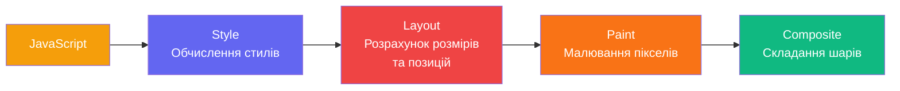
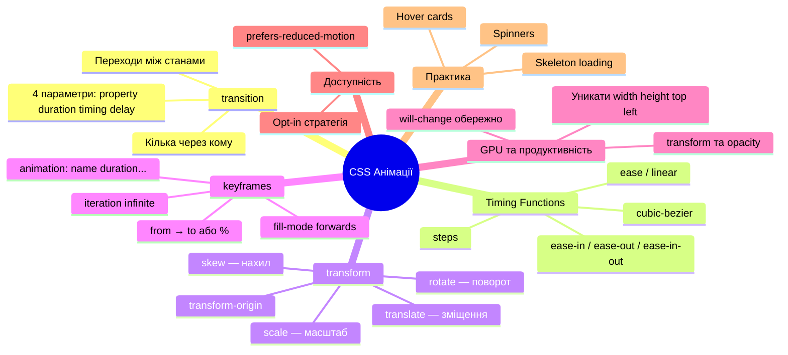

# CSS Анімації та Переходи

## Різниця між хорошим і чудовим UX — 200 мілісекунд

Відкрийте сайт Apple, Stripe чи Linear і поводьте мишею по кнопках, картках, навігації. Нічого не відбувається "різко" — все переходить плавно: кнопки "наливаються" кольором при наведенні, картки злегка підіймаються, елементи з'являються з легким ковзанням. Ці переходи настільки природні, що ви майже їх не помічаєте. Але якщо їх прибрати — інтерфейс одразу стає "пластиковим", механічним.

Це і є **мистецтво CSS-анімацій**: добрі анімації не кричать "подивіться на мене!", вони тихо роблять взаємодію приємнішою. Погані анімації — навпаки, заважають, відволікають, дратують.

У цій статті ми розберемо дві системи анімування в CSS: `transition` для простих станів і `@keyframes` + `animation` для складних сценаріїв. Але перш ніж писати код — зрозуміємо, **чому** анімації взагалі потрібні і **як** браузер їх виконує під капотом.

---

## Навіщо анімації в інтерфейсах?

Перш ніж писати будь-який анімаційний код, варто зрозуміти психологічну та функціональну роль анімацій у UI. Це не декоративна надмірність — це **комунікація**.

### Анімації як мову системи

Людське зорове сприйняття еволюційно заточено на рух. Рух означає щось важливе: небезпека, їжа, інша істота. У цифровому інтерфейсі цей механізм можна використати на користь користувача:

- **Показати взаємозв'язок.** Елемент, що "збирається" в іконку кошика, показує, що товар доданий і пов'язаний із кошиком. Без анімації — це просто зміна числа.
- **Дати зворотний зв'язок.** Кнопка, що "пружинить" при кліку, підтверджує: "так, я вас почула". Без неї — система здається задумливою або зламаною.
- **Орієнтувати в просторі.** Бічна панель, що виїжджає зліва, підказує: коли вона закриється — вона "поїде" назад ліворуч. Якщо б вона просто зникала — користувач губився б.
- **Привернути увагу до важливого.** Помилка, що м'яко "підстрибує", привертає погляд без агресивного блимання.
- **Заповнити час очікування.** Spinner або skeleton-екран під час завантаження знижує суб'єктивне відчуття часу очікування.

### Правила хорошої анімації

Перш ніж робити анімацію — поставте собі три питання:

1. **Чи вона комунікує щось важливе?** Якщо відповідь "ні, просто красиво" — ймовірно, анімацію краще прибрати або спростити.
2. **Чи вона не відволікає від задачі?** Анімація фону, що постійно рухається, може бути чудовою на лендингу і катастрофою у робочому дашборді.
3. **Чи вона доступна?** Частина користувачів має вестибулярні розлади, і надмірний рух викликає у них фізичний дискомфорт. Ми обов'язково розглянемо `prefers-reduced-motion`.

---

## Як браузер рендерить сторінку: конвеєр рендеру

Щоб розуміти, які CSS-властивості безпечно анімувати, а які — ні, потрібно знати, як браузер малює сторінку. Цей процес називається **rendering pipeline** (_конвеєр рендеру_) і складається з кількох кроків:

::mermaid



::

Кожен крок конвеєру дорогий, але вони **не однаково** дорогі:

- **Layout** (_перекомпонування_) — найдорожчий. Якщо змінюється `width`, `height`, `margin`, `padding`, `top`, `left` — браузер мусить перерахувати позиції **всіх залежних елементів** на сторінці. Це може торкнутися сотень вузлів DOM.
- **Paint** (_перемальовування_) — середньої вартості. Якщо змінюється `color`, `background`, `border` — браузер перемальовує пікселі, але не перераховує геометрію.
- **Composite** (_складання_) — найдешевший. Складання вже намальованих шарів є чисто GPU-операцією і відбувається дуже швидко.

**Висновок для анімацій:** анімуйте тільки властивості, які торкаються **тільки** Composite-кроку. Таких лише дві: `transform` та `opacity`. Все інше спричиняє Layout або Paint, і при 60 fps (16.7мс на кадр) це може помітно гальмувати.

::warning
**Анімувати `width`, `height`, `margin`, `top`, `left` — погана ідея.** Навіть якщо на вашому потужному ноутбуці це виглядає плавно, на мобільному пристрої або на слабшому ПК це спричинить "дрижання" (_jank_). Замінюйте такі анімації на `transform: scale()` та `transform: translate()` відповідно.
::

### GPU-прискорені властивості

Браузер автоматично переносить елемент на **окремий GPU-шар** (_compositing layer_), якщо він анімується через `transform` або `opacity`. Це дозволяє GPU маніпулювати шаром незалежно від CPU і забезпечує стабільні 60 fps.

| Властивість                 | Крок конвеєру     | Безпечна для анімації?      |
| --------------------------- | ----------------- | --------------------------- |
| `transform`                 | Composite         | ✅ GPU-прискорена           |
| `opacity`                   | Composite         | ✅ GPU-прискорена           |
| `filter`                    | Paint + Composite | ⚠️ Може бути важкою         |
| `color`, `background-color` | Paint             | ⚠️ Прийнятно                |
| `width`, `height`           | Layout            | ❌ Не рекомендовано         |
| `margin`, `padding`         | Layout            | ❌ Не рекомендовано         |
| `top`, `left`               | Layout            | ❌ Замінюйте на `translate` |

---

## `transition` — плавний перехід між станами

`transition` (_перехід_) — найпростіший і найбільш уживаний інструмент анімації в CSS. Він описує, як елемент має **плавно перейти** від одного CSS-стану до іншого.

Уявіть, що у вас є кнопка. В нормальному стані вона синя. При наведенні (`hover`) — темно-синя. Без `transition` зміна відбувається **миттєво**: синій → темно-синій, похибки немає. З `transition` браузер **інтерполює** значення між двома станами за вказаний час:

```css
.btn {
    background-color: #6366f1;
    transition: background-color 0.3s ease;
}

.btn:hover {
    background-color: #4f46e5;
}
```

Тут ми говоримо браузеру: "коли `background-color` змінюється — роби це за 0.3 секунди з функцією часу `ease`". Браузер сам розраховує всі проміжні значення між `#6366f1` та `#4f46e5`.

### Синтаксис `transition`

Властивість `transition` — це скорочення для чотирьох окремих властивостей:

```css
.element {
    /* transition: властивість тривалість функція-часу затримка */
    transition: background-color 0.3s ease 0s;

    /* Або окремо: */
    transition-property: background-color;
    transition-duration: 0.3s;
    transition-timing-function: ease;
    transition-delay: 0s;
}
```

Кожен параметр грає свою роль:

- **`transition-property`** — яку CSS-властивість анімувати. Можна вказати `all` (всі змінні властивості), але це погана практика: `transition: all 0.3s ease` може ненавмисно анімувати не ті властивості і спричинить Layout-тригери.
- **`transition-duration`** — тривалість у секундах (`s`) або мілісекундах (`ms`). `0.2s` = `200ms`.
- **`transition-timing-function`** — функція часу (крива прискорення). Детально розглянемо нижче.
- **`transition-delay`** — затримка перед початком переходу. Корисно для послідовних анімацій.

::html-preview

```html
<div class="syntax-demo">
    <div class="syntax-box box-single">Single (bg)</div>
    <div class="syntax-box box-multi">Multi (bg + transform)</div>
</div>
```

```css
.syntax-demo {
    display: flex;
    gap: 1.5rem;
    padding: 1.5rem;
    background: #f8fafc;
    border-radius: 12px;
    justify-content: center;
}

.syntax-box {
    width: 120px;
    height: 60px;
    background: #6366f1;
    color: white;
    display: flex;
    align-items: center;
    justify-content: center;
    font-size: 0.8rem;
    font-weight: 600;
    border-radius: 8px;
    cursor: pointer;
    text-align: center;
    padding: 0.5rem;
}

/* Одинарна властивість */
.box-single {
    transition: background-color 0.3s ease;
}
.box-single:hover {
    background-color: #4338ca;
}

/* Декілька властивостей через кому */
.box-multi {
    transition:
        background-color 0.3s ease,
        transform 0.3s cubic-bezier(0.34, 1.56, 0.64, 1);
}
.box-multi:hover {
    background-color: #10b981;
    transform: scale(1.1) rotate(5deg);
}
```

::

### Кілька переходів одночасно

```css
.card {
    /* Різні переходи для різних властивостей — через кому */
    transition:
        transform 0.3s ease,
        box-shadow 0.3s ease,
        opacity 0.2s linear;
}

.card:hover {
    transform: translateY(-4px);
    box-shadow: 0 12px 40px rgba(0, 0, 0, 0.15);
    opacity: 0.95;
}
```

Кожна властивість може мати **власну** тривалість і функцію часу — це дозволяє тонко контролювати відчуття від взаємодії.

::html-preview

```html
<div class="transitions-demo">
    <button class="btn-demo btn-simple">Простий (0.2s ease)</button>
    <button class="btn-demo btn-scale">Scale + shadow</button>
    <button class="btn-demo btn-multi">Кілька властивостей</button>
</div>
```

```css
.transitions-demo {
    display: flex;
    gap: 1rem;
    flex-wrap: wrap;
    padding: 1.5rem;
    background: #f8fafc;
    border-radius: 12px;
    font-family: system-ui, sans-serif;
    justify-content: center;
}

.btn-demo {
    padding: 0.75rem 1.5rem;
    border: none;
    border-radius: 8px;
    font-size: 0.9rem;
    font-weight: 600;
    cursor: pointer;
    font-family: inherit;
    color: white;
}

.btn-simple {
    background: #6366f1;
    transition: background-color 0.2s ease;
}
.btn-simple:hover {
    background: #4338ca;
}

.btn-scale {
    background: #10b981;
    transition:
        transform 0.2s ease,
        box-shadow 0.2s ease;
}
.btn-scale:hover {
    transform: translateY(-3px) scale(1.04);
    box-shadow: 0 8px 25px rgba(16, 185, 129, 0.4);
}

.btn-multi {
    background: #f59e0b;
    transition:
        background-color 0.3s ease,
        transform 0.2s cubic-bezier(0.34, 1.56, 0.64, 1),
        box-shadow 0.3s ease;
}
.btn-multi:hover {
    background: #d97706;
    transform: translateY(-4px);
    box-shadow: 0 10px 30px rgba(245, 158, 11, 0.4);
}
```

::

Наведіть курсор на кожну кнопку і відчуйте різницю у характері переходу — навіть у межах простого `hover` ефекту є багатий простір для нюансів.

---

## Функції часу (Timing Functions) — душа анімації

Якщо тривалість — це "як довго", то функція часу — це "з яким характером". Дві анімації з однаковою тривалістю, але різними функціями часу — абсолютно різні за відчуттям.

### Фізична аналогія

Уявіть м'яч, що котиться по столу. Якщо він починає з місця і поступово прискорюється — це `ease-in`. Якщо він вже швидко котиться і поступово гальмує — `ease-out`. Якщо прискорюється, а потім гальмує — `ease-in-out`. Весь час рівно — `linear`. Природній рух у реальному світі завжди "рівний" — тому `linear` у UI часто виглядає механічно і штучно.

### Стандартні ключові слова

```css
.element {
    /* Повільно → швидко → повільно (за замовчуванням) */
    transition-timing-function: ease;

    /* Рівна швидкість — виглядає механічно */
    transition-timing-function: linear;

    /* Повільно → все швидше (елемент "йде") */
    transition-timing-function: ease-in;

    /* Швидко → все повільніше (елемент "прилітає") */
    transition-timing-function: ease-out;

    /* Повільно → швидко → повільно (більш виражено ніж ease) */
    transition-timing-function: ease-in-out;
}
```

::html-preview

```html
<div class="timing-demo">
    <div class="timing-row">
        <span class="timing-label">ease</span>
        <div class="timing-track">
            <div class="timing-ball ease-ball">●</div>
        </div>
    </div>
    <div class="timing-row">
        <span class="timing-label">linear</span>
        <div class="timing-track">
            <div class="timing-ball linear-ball">●</div>
        </div>
    </div>
    <div class="timing-row">
        <span class="timing-label">ease-in</span>
        <div class="timing-track">
            <div class="timing-ball ease-in-ball">●</div>
        </div>
    </div>
    <div class="timing-row">
        <span class="timing-label">ease-out</span>
        <div class="timing-track">
            <div class="timing-ball ease-out-ball">●</div>
        </div>
    </div>
    <div class="timing-row">
        <span class="timing-label">ease-in-out</span>
        <div class="timing-track">
            <div class="timing-ball ease-in-out-ball">●</div>
        </div>
    </div>
    <div class="timing-row">
        <span class="timing-label">cubic-bezier<br />(spring)</span>
        <div class="timing-track">
            <div class="timing-ball spring-ball">●</div>
        </div>
    </div>
</div>
<p style="text-align:center;font-family:system-ui,sans-serif;font-size:0.8rem;color:#64748b;margin-top:0.5rem">
    Наведіть курсор на блок, щоб запустити анімацію
</p>
```

```css
.timing-demo {
    background: #f8fafc;
    border-radius: 12px;
    padding: 1.25rem;
    font-family: system-ui, sans-serif;
}

.timing-row {
    display: flex;
    align-items: center;
    gap: 0.75rem;
    margin-bottom: 0.5rem;
}

.timing-label {
    font-size: 0.75rem;
    font-weight: 600;
    color: #475569;
    width: 90px;
    flex-shrink: 0;
    text-align: right;
    line-height: 1.3;
}

.timing-track {
    flex: 1;
    height: 32px;
    background: #e2e8f0;
    border-radius: 16px;
    position: relative;
    overflow: hidden;
    cursor: pointer;
}

.timing-ball {
    position: absolute;
    left: 4px;
    top: 50%;
    transform: translateY(-50%);
    font-size: 1.1rem;
    transition-property: left;
    transition-duration: 1.2s;
    line-height: 1;
    color: #6366f1;
}

.ease-ball {
    transition-timing-function: ease;
}
.linear-ball {
    transition-timing-function: linear;
}
.ease-in-ball {
    transition-timing-function: ease-in;
}
.ease-out-ball {
    transition-timing-function: ease-out;
}
.ease-in-out-ball {
    transition-timing-function: ease-in-out;
}
.spring-ball {
    transition-timing-function: cubic-bezier(0.34, 1.56, 0.64, 1);
    color: #f59e0b;
}

.timing-demo:hover .timing-ball {
    left: calc(100% - 28px);
}
```

::

### `cubic-bezier()` — повний контроль

За кожним ключовим словом (`ease`, `ease-out` тощо) стоїть конкретна крива Безьє. `cubic-bezier()` дозволяє задати **власну** криву через чотири числа — координати двох контрольних точок:

```css
/* cubic-bezier(x1, y1, x2, y2) */
transition-timing-function: cubic-bezier(0.25, 0.1, 0.25, 1); /* те саме, що ease */
transition-timing-function: cubic-bezier(0, 0, 1, 1); /* linear */

/* "Пружинний" ефект — y1 або y2 виходять за [0,1] */
transition-timing-function: cubic-bezier(0.34, 1.56, 0.64, 1);

/* Різкий вхід, плавне завершення */
transition-timing-function: cubic-bezier(0.7, 0, 0.3, 1);
```

Значення `y1` та `y2` можуть **виходити за межі [0, 1]** — це дозволяє створювати "пружинні" ефекти, де анімація спочатку "перестрибує" за цільове значення, а потім повертається. Використовуйте [cubic-bezier.com](https://cubic-bezier.com) для інтерактивного підбору кривих.

::html-preview

```html
<div class="bezier-demo">
    <div class="bezier-item">
        <span class="bezier-label">Standard (ease)</span>
        <div class="bezier-box bezier-ease"></div>
    </div>
    <div class="bezier-item">
        <span class="bezier-label">Sharp (0.7, 0, 0.3, 1)</span>
        <div class="bezier-box bezier-sharp"></div>
    </div>
    <div class="bezier-item">
        <span class="bezier-label">Spring (0.34, 1.56, 0.64, 1)</span>
        <div class="bezier-box bezier-spring"></div>
    </div>
</div>
```

```css
.bezier-demo {
    padding: 1.5rem;
    background: #f1f5f9;
    border-radius: 12px;
    display: flex;
    flex-direction: column;
    gap: 1rem;
}

.bezier-item {
    display: flex;
    align-items: center;
    gap: 1rem;
}

.bezier-label {
    width: 150px;
    font-size: 0.75rem;
    font-weight: 600;
    color: #475569;
}

.bezier-box {
    width: 40px;
    height: 40px;
    background: #6366f1;
    border-radius: 8px;
    transition: transform 1s;
}

.bezier-ease {
    transition-timing-function: ease;
}

.bezier-sharp {
    transition-timing-function: cubic-bezier(0.7, 0, 0.3, 1);
}

.bezier-spring {
    transition-timing-function: cubic-bezier(0.34, 1.56, 0.64, 1);
}

.bezier-demo:hover .bezier-box {
    transform: translateX(200px);
}
```

::

### `steps()` — дискретна анімація

```css
/* steps(кількість-кроків, напрямок) */
transition-timing-function: steps(5, end);
```

`steps()` розбиває анімацію на **дискретні стрибки** замість плавного переходу. Корисно для анімації спрайтів (sprite sheets) або для ефекту "машинопису":

```css
.typewriter {
    overflow: hidden;
    white-space: nowrap;
    width: 0;
    animation: typing 3s steps(30, end) forwards;
}

```css
@keyframes typing {
    to {
        width: 100%;
    }
}
```

::html-preview

```html
<div class="steps-demo">
    <div class="typewriter-wrap">
        <h3 class="typewriter">Привіт, я CSS Steps анімація!</h3>
    </div>
    <div class="discrete-wrap">
        <div class="discrete-box">Jump!</div>
    </div>
</div>
```

```css
.steps-demo {
    padding: 1.5rem;
    background: #f8fafc;
    border-radius: 12px;
    display: flex;
    flex-direction: column;
    gap: 2rem;
    align-items: center;
}

.typewriter-wrap {
    border-right: 2px solid #6366f1;
    white-space: nowrap;
    overflow: hidden;
    width: 0;
    animation: 
        typing 3.5s steps(26, end) forwards,
        blink 0.5s step-end infinite alternate;
}

.typewriter {
    margin: 0;
    font-family: 'Courier New', Courier, monospace;
    font-size: 1.1rem;
    color: #1e293b;
}

@keyframes typing {
    from { width: 0; }
    to { width: 100%; }
}

@keyframes blink {
    50% { border-color: transparent; }
}

.discrete-wrap {
    width: 100%;
    height: 40px;
    background: #e2e8f0;
    border-radius: 20px;
    position: relative;
    cursor: pointer;
}

.discrete-box {
    position: absolute;
    left: 0;
    top: 0;
    height: 100%;
    width: 80px;
    background: #6366f1;
    border-radius: 20px;
    color: white;
    display: flex;
    align-items: center;
    justify-content: center;
    font-weight: 600;
    font-size: 0.8rem;
    transition: left 2s steps(5, end);
}

.discrete-wrap:hover .discrete-box {
    left: calc(100% - 80px);
}
```

::

---

## `transform` — трансформації без Layout

`transform` (_трансформація_) — це властивість, яка **геометрично змінює** елемент (положення, розмір, поворот, нахил), але **не впливає** на нормальний потік документа і не викликає Layout-тригеру. Саме тому `transform` — ваш кращий друг при анімаціях.

Трансформації не переміщують елемент в DOM — інші елементи не зрушуються. Вони відбуваються як "накладка" поверх нормального потоку, суто на GPU.

### Основні функції `transform`

**`translate(x, y)`** — зміщення відносно поточної позиції:

```css
transform: translate(20px, -10px); /* вправо 20px, вгору 10px */
transform: translateX(50%); /* вправо на 50% ширини самого елемента */
transform: translateY(-100%); /* вгору на 100% висоти елемента (!) */
```

Зверніть на `translateY(-100%)`: це зміщення **відносно самого елемента**, а не батька. Це дуже зручно для slid-up/slid-down анімацій, де ви не знаєте точну висоту в пікселях.

**`scale(x, y)`** — масштабування відносно `transform-origin` (за замовчуванням — центр елемента):

```css
transform: scale(1.1); /* збільшити рівномірно на 10% */
transform: scale(1.2, 0.8); /* ширше і нижче (ефект розплющення) */
transform: scaleX(0); /* зменшити тільки по горизонталі до 0 */
```

**`rotate(кут)`** — поворот:

```css
transform: rotate(45deg); /* на 45 градусів за годинниковою */
transform: rotate(-90deg); /* проти годинникової */
transform: rotate(0.25turn); /* то ж саме, але через "оберти" */
```

**`skew(x, y)`** — нахил (skew):

```css
transform: skew(10deg, 5deg); /* Нахил по X та Y */
transform: skewX(15deg);
```

### Комбінування трансформацій

Кілька функцій записуються через пробіл. **Порядок має значення** — трансформації застосовуються справа наліво:

```css
/* Спочатку move, потім rotate — результат різний! */
transform: translateX(100px) rotate(45deg);
transform: rotate(45deg) translateX(100px);
```

### `transform-origin` — точка трансформації

За замовчуванням трансформації відбуваються відносно **центру** елемента. `transform-origin` змінює цю точку:

```css
/* Поворот навколо лівого верхнього кута */
.door {
    transform-origin: left center;
    transition: transform 0.5s ease;
}
.door:hover {
    transform: rotateY(70deg);
}

/* Масштабування з нижнього центру (ефект "виростання") */
.popup {
    transform-origin: bottom center;
    transform: scale(0);
    transition: transform 0.3s cubic-bezier(0.34, 1.56, 0.64, 1);
}
.popup.visible {
    transform: scale(1);
}
```

::html-preview

```html
<div class="origin-demo">
    <div class="origin-item">
        <span class="origin-label">center (default)</span>
        <div class="origin-box origin-center">Rotate</div>
    </div>
    <div class="origin-item">
        <span class="origin-label">top left</span>
        <div class="origin-box origin-top-left">Rotate</div>
    </div>
    <div class="origin-item">
        <span class="origin-label">bottom right</span>
        <div class="origin-box origin-bottom-right">Rotate</div>
    </div>
</div>
```

```css
.origin-demo {
    padding: 2rem;
    background: #f1f5f9;
    border-radius: 12px;
    display: flex;
    justify-content: center;
    gap: 2.5rem;
    flex-wrap: wrap;
}

.origin-item {
    display: flex;
    flex-direction: column;
    align-items: center;
    gap: 1rem;
}

.origin-label {
    font-size: 0.75rem;
    font-weight: 600;
    color: #64748b;
}

.origin-box {
    width: 80px;
    height: 80px;
    background: #6366f1;
    color: white;
    display: flex;
    align-items: center;
    justify-content: center;
    font-size: 0.8rem;
    font-weight: 700;
    border-radius: 8px;
    transition: transform 1s ease-in-out;
}

.origin-center { transform-origin: center; }
.origin-top-left { transform-origin: top left; }
.origin-bottom-right { transform-origin: bottom right; }

.origin-demo:hover .origin-box {
    transform: rotate(90deg);
}
```

::

::html-preview

```html
<div class="transform-showcase">
    <div class="t-group">
        <p class="t-label">translate(-8px, -8px)</p>
        <div class="t-box translate-box">Наведіть</div>
    </div>
    <div class="t-group">
        <p class="t-label">scale(1.15)</p>
        <div class="t-box scale-box">Наведіть</div>
    </div>
    <div class="t-group">
        <p class="t-label">rotate(15deg)</p>
        <div class="t-box rotate-box">Наведіть</div>
    </div>
    <div class="t-group">
        <p class="t-label">scale(1.1) + shadow</p>
        <div class="t-box combo-box">Наведіть</div>
    </div>
</div>
```

```css
.transform-showcase {
    display: flex;
    gap: 1rem;
    flex-wrap: wrap;
    padding: 1.5rem;
    background: #f1f5f9;
    border-radius: 12px;
    font-family: system-ui, sans-serif;
    justify-content: center;
}

.t-group {
    display: flex;
    flex-direction: column;
    align-items: center;
    gap: 0.4rem;
}

.t-label {
    margin: 0;
    font-size: 0.72rem;
    color: #64748b;
    font-weight: 600;
    text-align: center;
}

.t-box {
    width: 100px;
    height: 100px;
    background: #6366f1;
    border-radius: 10px;
    display: flex;
    align-items: center;
    justify-content: center;
    color: white;
    font-weight: 700;
    font-size: 0.8rem;
    cursor: pointer;
    transition:
        transform 0.25s ease,
        box-shadow 0.25s ease;
}

.translate-box:hover {
    transform: translate(-8px, -8px);
}
.scale-box:hover {
    transform: scale(1.15);
}
.rotate-box:hover {
    transform: rotate(15deg);
}
.combo-box:hover {
    transform: scale(1.1);
    box-shadow: 0 12px 35px rgba(99, 102, 241, 0.45);
}
```

::

---

## `@keyframes` — складні багатокрокові анімації

`transition` чудово підходить для переходів між двома станами (normal → hover). Але що, якщо потрібно описати складніший сценарій — наприклад, елемент з'являється, затримується, підіймається та зникає? Або нескінченна пульсація? Для цього існують `@keyframes`.

**`@keyframes`** (_ключові кадри_) — це опис того, **що відбувається в конкретний момент** анімації. Ви задаєте "знімки" стану елемента в різних точках часу, а браузер самостійно інтерполює проміжні кадри:

```css
/* Оголошення ключових кадрів */
@keyframes slide-in {
    from {
        /* Початковий стан (0%) */
        transform: translateX(-100%);
        opacity: 0;
    }
    to {
        /* Кінцевий стан (100%) */
        transform: translateX(0);
        opacity: 1;
    }
}

/* Застосування анімації до елемента */
.element {
    animation: slide-in 0.5s ease-out forwards;
}
```

`from` — скорочення для `0%`, `to` — для `100%`. Можна також використовувати відсоткові точки для проміжних станів:

```css
@keyframes bounce {
    0% {
        transform: translateY(0);
    }
    25% {
        transform: translateY(-20px);
    }
    50% {
        transform: translateY(0);
    }
    75% {
        transform: translateY(-10px);
    }
    100% {
        transform: translateY(0);
    }
}
```

### Властивість `animation`

Застосування `@keyframes` до елемента відбувається через властивість `animation`. Вона є скороченням для восьми підвластивостей:

```css
.element {
    /* animation: name duration timing-fn delay iteration direction fill-mode play-state */
    animation: slide-in 0.5s ease-out 0s 1 normal forwards running;
}
```

::html-preview

```html
<div class="anim-syntax-demo">
    <div class="anim-box anim-short">Shorthand</div>
    <div class="anim-box anim-complex">Complex sequence</div>
</div>
```

```css
@keyframes slide-right {
    from { transform: translateX(0); }
    to { transform: translateX(100px); }
}

@keyframes rainbow {
    0% { background: #6366f1; }
    50% { background: #f59e0b; transform: scale(1.1); }
    100% { background: #10b981; }
}

.anim-syntax-demo {
    padding: 2rem;
    background: #f8fafc;
    border-radius: 12px;
    display: flex;
    gap: 2rem;
    justify-content: center;
}

.anim-box {
    width: 100px;
    height: 60px;
    color: white;
    display: flex;
    align-items: center;
    justify-content: center;
    font-size: 0.8rem;
    font-weight: 600;
    border-radius: 8px;
    cursor: pointer;
    text-align: center;
}

.anim-short {
    background: #6366f1;
    animation: slide-right 1s ease-in-out infinite alternate;
}

.anim-complex {
    background: #6366f1;
    animation: rainbow 2s infinite alternate both cubic-bezier(0.4, 0, 0.2, 1);
}

.anim-syntax-demo:hover .anim-box {
    animation-play-state: paused;
}
```

::

Розберемо кожну складову:

**`animation-name`** — назва `@keyframes` правила. Має співпадати з тим, що ви оголосили.

**`animation-duration`** — тривалість одного циклу анімації. На відміну від `transition`, `0s` не заблокує анімацію — вона просто стрибне одразу в кінцевий стан.

**`animation-timing-function`** — функція часу (та сама `ease`, `cubic-bezier()` тощо).

**`animation-delay`** — затримка перед початком. Приймає від'ємні значення: `animation-delay: -0.5s` означає "анімація вже пройшла 0.5 секунди від початку".

**`animation-iteration-count`** — кількість повторень. `1` (один раз), `3` (тричі), `infinite` (нескінченно).

**`animation-direction`** — напрямок анімації:

- `normal` — завжди від `from` до `to`
- `reverse` — завжди від `to` до `from`
- `alternate` — перший цикл `from→to`, другий `to→from`, потім знову і т.д. (ефект пінг-понгу)
- `alternate-reverse` — те саме, але починає з `to→from`

**`animation-fill-mode`** — стан елемента до та після анімації:

- `none` — повертається до початкового стану після закінчення
- `forwards` — залишається у стані останнього ключового кадру (`to`)
- `backwards` — одразу приймає стан першого ключового кадру (`from`), навіть під час `delay`
- `both` — комбінація `forwards` та `backwards`

**`animation-play-state`** — `running` (грає) або `paused` (пауза). Корисно для зупинки анімації через JavaScript або `:hover`:

```css
.spinner {
    animation: rotate 1s linear infinite;
}

/* Зупинити анімацію при наведенні */
.spinner:hover {
    animation-play-state: paused;
}
```

::html-preview

```html
<div class="keyframes-demo">
    <div class="kf-row">
        <span class="kf-label">fade-in (forwards)</span>
        <div class="kf-scene">
            <div class="kf-element fade-in-el">Текст</div>
        </div>
    </div>
    <div class="kf-row">
        <span class="kf-label">slide-up</span>
        <div class="kf-scene">
            <div class="kf-element slide-up-el">Слайд</div>
        </div>
    </div>
    <div class="kf-row">
        <span class="kf-label">pulse (infinite)</span>
        <div class="kf-scene">
            <div class="kf-dot pulse-el"></div>
        </div>
    </div>
    <div class="kf-row">
        <span class="kf-label">bounce (alternate)</span>
        <div class="kf-scene">
            <div class="kf-ball bounce-el">🏀</div>
        </div>
    </div>
</div>
```

```css
@keyframes fade-in {
    from {
        opacity: 0;
    }
    to {
        opacity: 1;
    }
}

@keyframes slide-up {
    from {
        transform: translateY(20px);
        opacity: 0;
    }
    to {
        transform: translateY(0);
        opacity: 1;
    }
}

@keyframes pulse-dot {
    0%,
    100% {
        transform: scale(1);
        opacity: 1;
    }
    50% {
        transform: scale(1.4);
        opacity: 0.6;
    }
}

@keyframes bounce-ball {
    from {
        transform: translateY(0);
    }
    to {
        transform: translateY(-30px);
    }
}

.keyframes-demo {
    background: #f8fafc;
    border-radius: 12px;
    padding: 1.25rem;
    font-family: system-ui, sans-serif;
    display: flex;
    flex-direction: column;
    gap: 0.75rem;
}

.kf-row {
    display: flex;
    align-items: center;
    gap: 1rem;
}

.kf-label {
    font-size: 0.8rem;
    font-weight: 600;
    color: #475569;
    width: 140px;
    flex-shrink: 0;
}

.kf-scene {
    flex: 1;
    background: #e2e8f0;
    border-radius: 8px;
    height: 50px;
    display: flex;
    align-items: center;
    justify-content: center;
    overflow: hidden;
}

.kf-element {
    background: #6366f1;
    color: white;
    padding: 0.4rem 1rem;
    border-radius: 6px;
    font-size: 0.85rem;
    font-weight: 600;
}

.fade-in-el {
    animation: fade-in 1.5s ease infinite alternate;
}

.slide-up-el {
    animation: slide-up 1.2s ease-out infinite;
    animation-delay: 0.5s;
}

.kf-dot {
    width: 18px;
    height: 18px;
    border-radius: 50%;
    background: #6366f1;
    animation: pulse-dot 1.2s ease-in-out infinite;
}

.kf-ball {
    font-size: 1.4rem;
    animation: bounce-ball 0.6s ease-in alternate infinite;
}
```

::

### Animation Fill-mode та Direction в деталях

Ці властивості часто викликають путанину. Давайте подивимось на них у дії в ізольованому середовищі.

::html-preview

```html
<div class="props-demo">
    <div class="prop-group">
        <p class="prop-title">Direction: alternate vs normal</p>
        <div class="prop-scene">
            <div class="p-box d-normal">Normal</div>
            <div class="p-box d-alternate">Alt</div>
        </div>
    </div>
    <div class="prop-group">
        <p class="prop-title">Fill-mode: none vs forwards (single run)</p>
        <div class="prop-scene">
            <div class="p-box f-none">None</div>
            <div class="p-box f-forwards">Forw</div>
        </div>
        <button class="reset-btn" onclick="resetAnimations()">Перезапустити</button>
    </div>
</div>

<script>
function resetAnimations() {
    const elements = document.querySelectorAll('.f-none, .f-forwards');
    elements.forEach(el => {
        el.style.animation = 'none';
        el.offsetHeight; /* trigger reflow */
        el.style.animation = null;
    });
}
</script>
```

```css
@keyframes move-right {
    to { transform: translateX(120px); background: #10b981; }
}

.props-demo {
    padding: 1.5rem;
    background: #f8fafc;
    border-radius: 12px;
    display: flex;
    flex-direction: column;
    gap: 1.5rem;
    font-family: system-ui, sans-serif;
}

.prop-title {
    margin: 0 0 0.5rem 0;
    font-size: 0.75rem;
    font-weight: 700;
    color: #64748b;
    text-transform: uppercase;
}

.prop-scene {
    background: #e2e8f0;
    padding: 1rem;
    border-radius: 8px;
    display: flex;
    flex-direction: column;
    gap: 0.5rem;
}

.p-box {
    width: 60px;
    height: 30px;
    background: #6366f1;
    color: white;
    font-size: 0.7rem;
    font-weight: 600;
    display: flex;
    align-items: center;
    justify-content: center;
    border-radius: 4px;
}

.d-normal { animation: move-right 1.5s linear infinite; }
.d-alternate { animation: move-right 1.5s linear infinite alternate; }

.f-none { animation: move-right 1.5s ease-out 1 normal none running; }
.f-forwards { animation: move-right 1.5s ease-out 1 normal forwards running; }

.reset-btn {
    margin-top: 0.5rem;
    padding: 0.4rem 0.8rem;
    border-radius: 4px;
    border: 1px solid #cbd5e1;
    background: white;
    font-size: 0.75rem;
    cursor: pointer;
    align-self: flex-start;
}
.reset-btn:hover { background: #f1f5f9; }
```

::

---

## Практика: Loading Spinner

Спінер завантаження — один із найуживаніших анімаційних елементів. Розберемо три підходи й поясним чому кожен з них влаштований саме так.

### Класичний CSS spinner

Ідея: кільце з прозорим сектором, що обертається. Реалізується через `border` з одним кольоровим сектором і `animation: rotate infinite linear`.

```css
.spinner {
    width: 40px;
    height: 40px;
    border: 4px solid #e2e8f0; /* Базове кільце */
    border-top-color: #6366f1; /* Кольоровий сектор */
    border-radius: 50%; /* Коло */
    animation: spin 0.8s linear infinite;
}

@keyframes spin {
    to {
        transform: rotate(360deg);
    }
}
```

Чому `linear`? Бо ми хочемо **рівномірне** обертання — тут будь-яке прискорення або уповільнення виглядало б дивно.

### Пульсуючий спінер (dots)

```css
@keyframes dot-pulse {
    0%,
    80%,
    100% {
        transform: scale(0.4);
        opacity: 0.3;
    }
    40% {
        transform: scale(1);
        opacity: 1;
    }
}

.dot-spinner span {
    display: inline-block;
    width: 10px;
    height: 10px;
    border-radius: 50%;
    background: #6366f1;
    animation: dot-pulse 1.4s ease-in-out infinite;
}

.dot-spinner span:nth-child(2) {
    animation-delay: 0.2s;
}
.dot-spinner span:nth-child(3) {
    animation-delay: 0.4s;
}
```

Тут `animation-delay` на кожному `span` створює **хвильовий ефект** — три точки пульсують по черзі, з зміщенням 0.2с.

::html-preview

```html
<div class="spinners-showcase">
    <div class="spinner-item">
        <div class="classic-spinner"></div>
        <span>Classic</span>
    </div>
    <div class="spinner-item">
        <div class="dot-spinner">
            <span></span>
            <span></span>
            <span></span>
        </div>
        <span>Dots</span>
    </div>
    <div class="spinner-item">
        <div class="bar-spinner">
            <span></span>
            <span></span>
            <span></span>
            <span></span>
        </div>
        <span>Bars</span>
    </div>
    <div class="spinner-item">
        <div class="ring-spinner"></div>
        <span>Ring</span>
    </div>
</div>
```

```css
@keyframes spin {
    to {
        transform: rotate(360deg);
    }
}

@keyframes dot-pulse {
    0%,
    80%,
    100% {
        transform: scale(0.4);
        opacity: 0.3;
    }
    40% {
        transform: scale(1);
        opacity: 1;
    }
}

@keyframes bar-grow {
    0%,
    40%,
    100% {
        transform: scaleY(0.4);
    }
    20% {
        transform: scaleY(1);
    }
}

@keyframes ring-spin {
    0% {
        transform: rotate(0deg);
        stroke-dashoffset: 220;
    }
    50% {
        stroke-dashoffset: 55;
    }
    100% {
        transform: rotate(720deg);
        stroke-dashoffset: 220;
    }
}

.spinners-showcase {
    display: flex;
    gap: 2rem;
    padding: 2rem;
    background: #f8fafc;
    border-radius: 12px;
    justify-content: center;
    align-items: center;
    flex-wrap: wrap;
    font-family: system-ui, sans-serif;
}

.spinner-item {
    display: flex;
    flex-direction: column;
    align-items: center;
    gap: 0.75rem;
    font-size: 0.8rem;
    color: #64748b;
    font-weight: 600;
}

.classic-spinner {
    width: 36px;
    height: 36px;
    border: 4px solid #e2e8f0;
    border-top-color: #6366f1;
    border-radius: 50%;
    animation: spin 0.8s linear infinite;
}

.dot-spinner {
    display: flex;
    gap: 0.4rem;
    align-items: center;
    height: 36px;
}

.dot-spinner span {
    width: 10px;
    height: 10px;
    border-radius: 50%;
    background: #6366f1;
    animation: dot-pulse 1.4s ease-in-out infinite;
}

.dot-spinner span:nth-child(2) {
    animation-delay: 0.2s;
}
.dot-spinner span:nth-child(3) {
    animation-delay: 0.4s;
}

.bar-spinner {
    display: flex;
    gap: 0.3rem;
    align-items: flex-end;
    height: 36px;
}

.bar-spinner span {
    display: block;
    width: 6px;
    height: 28px;
    background: #6366f1;
    border-radius: 3px;
    transform-origin: bottom;
    animation: bar-grow 1.2s ease-in-out infinite;
}

.bar-spinner span:nth-child(1) {
    animation-delay: 0s;
}
.bar-spinner span:nth-child(2) {
    animation-delay: 0.1s;
}
.bar-spinner span:nth-child(3) {
    animation-delay: 0.2s;
}
.bar-spinner span:nth-child(4) {
    animation-delay: 0.3s;
}

.ring-spinner {
    width: 36px;
    height: 36px;
    border: 4px solid #e2e8f0;
    border-radius: 50%;
    border-top-color: #6366f1;
    border-right-color: #818cf8;
    animation: spin 1s ease-in-out infinite;
}
```

::

---

## `will-change` — підказка браузеру для оптимізації

`will-change` — це спосіб сказати браузеру: "цей елемент **буде** анімуватися певними властивостями". Браузер може завчасно перенести елемент на окремий GPU-шар, уникнувши "прогрівання" на першому кадрі анімації:

```css
.animated-card {
    will-change: transform, opacity;
}
```

Звучить як "завжди використовувати" — але це **антипатерн**. Кожен `will-change`-елемент займає додаткову GPU-пам'ять. Якщо ви поставите `will-change: transform` на 200 карток — браузер резервує GPU-шари для всіх 200 одночасно, що може уповільнити рендеринг.

::caution
**`will-change` — ліки, що призначаються по потребі, не профілактично.** Додавайте його тільки до елементів, що дійсно анімуються і тільки коли відчуваєте конкретні проблеми з продуктивністю. Видаляйте `will-change` після завершення анімації через JavaScript. Не ставте `will-change: all` — це ренегат.
::

Правильний паттерн — встановлювати `will-change` динамічно:

```css
/* Правильно: will-change тільки при hover */
.card:hover {
    will-change: transform;
}
```

```javascript
// Або через JavaScript — встановити перед анімацією, прибрати після
element.addEventListener('mouseenter', () => {
    element.style.willChange = 'transform'
})
element.addEventListener('animationend', () => {
    element.style.willChange = 'auto' /* Скасувати */
})
```

---

## `prefers-reduced-motion` — доступність анімацій

Частина користувачів страждає від **вестибулярних розладів** (_vestibular disorders_) — стан, при якому рух у полі зору викликає запаморочення, нудоту та дезорієнтацію. Це — не особливий випадок: за різними оцінками від 0.5% до 35% людей мають чутливість до руху різного ступеня.

Сучасні операційні системи дозволяють увімкнути режим "Зменшити рух" (_Reduce Motion_): macOS → Accessibility → Display → Reduce Motion; iOS → Settings → Accessibility → Motion → Reduce Motion.

CSS надає media query `prefers-reduced-motion`, яка дозволяє реагувати на це налаштування:

```css
/* Базові анімації — для всіх */
.btn {
    transition: transform 0.3s ease;
}

.btn:hover {
    transform: translateY(-2px);
}

/* Для користувачів з увімкненим Reduce Motion */
@media (prefers-reduced-motion: reduce) {
    .btn {
        transition: none; /* Вимкнути transition */
    }

    .btn:hover {
        transform: none; /* Або замінити рухову анімацію на статичну зміну */
    }

    /* Зупинити всі нескінченні анімації */
    .spinner {
        animation: none;
    }
}
```

### Правильна стратегія

Не "вимикати всі анімації", а **замінювати** їх на безпечні альтернативи. Раптова зміна кольору безпечна; рух по ekranu — ні.

```css
/* Mobile-first для анімацій: за замовчуванням без руху */
@media (prefers-reduced-motion: no-preference) {
    /* Тільки для тих, хто НЕ обмежив рух — додай анімації */
    .hero {
        animation: fade-slide-up 0.8s ease-out both;
    }

    .card {
        transition:
            transform 0.25s ease,
            box-shadow 0.25s ease;
    }
}
```

Цей підхід — "opt-in" для анімацій — є найбільш інклюзивним: спочатку жодних рухів, анімації додаються для тих, хто їх сприймає нормально.

---

## Практика: Hover Cards та Fade-in при скролі

### Hover card з підйомом

Класичний ефект картки, що підіймається при наведенні — один із найефективніших за "враження від виконання" на кількість рядків коду:

::html-preview

```html
<div class="cards-grid">
    <article class="hover-card">
        <div class="hcard-icon">🚀</div>
        <h3>Запуск</h3>
        <p>Класичний hover-ефект: translateY + box-shadow через transition.</p>
        <a href="#" class="hcard-link">Детальніше →</a>
    </article>
    <article class="hover-card">
        <div class="hcard-icon">⚡</div>
        <h3>Швидкість</h3>
        <p>Тільки transform та box-shadow — GPU-прискорено, без Layout.</p>
        <a href="#" class="hcard-link">Детальніше →</a>
    </article>
    <article class="hover-card">
        <div class="hcard-icon">💎</div>
        <h3>Якість</h3>
        <p>Cubic-bezier з пружинним ефектом надає "живого" відчуття.</p>
        <a href="#" class="hcard-link">Детальніше →</a>
    </article>
</div>
```

```css
@keyframes card-appear {
    from {
        opacity: 0;
        transform: translateY(16px);
    }
    to {
        opacity: 1;
        transform: translateY(0);
    }
}

.cards-grid {
    display: grid;
    grid-template-columns: repeat(3, 1fr);
    gap: 1rem;
    padding: 1.25rem;
    background: #f1f5f9;
    border-radius: 12px;
    font-family: system-ui, sans-serif;
}

.hover-card {
    background: white;
    border-radius: 12px;
    padding: 1.25rem;
    border: 1px solid #e2e8f0;
    cursor: pointer;
    display: flex;
    flex-direction: column;
    gap: 0.35rem;

    /* Анімація появи при завантаженні */
    animation: card-appear 0.5s ease-out both;

    /* Плавний перехід для hover */
    transition:
        transform 0.25s cubic-bezier(0.34, 1.3, 0.64, 1),
        box-shadow 0.25s ease;
}

.hover-card:nth-child(2) {
    animation-delay: 0.1s;
}
.hover-card:nth-child(3) {
    animation-delay: 0.2s;
}

.hover-card:hover {
    transform: translateY(-6px);
    box-shadow: 0 16px 40px rgba(0, 0, 0, 0.12);
}

.hcard-icon {
    font-size: 1.75rem;
    margin-bottom: 0.25rem;
}

.hover-card h3 {
    margin: 0;
    font-size: 1rem;
    color: #1e293b;
}

.hover-card p {
    margin: 0;
    font-size: 0.82rem;
    color: #64748b;
    line-height: 1.5;
    flex: 1;
}

.hcard-link {
    color: #6366f1;
    text-decoration: none;
    font-size: 0.82rem;
    font-weight: 600;
    margin-top: 0.25rem;
    transition: gap 0.2s ease;
    display: inline-block;
}

.hcard-link:hover {
    text-decoration: underline;
}
```

::

---

## Skeleton Loading — анімація очікування

**Skeleton screen** (_екран-скелет_) — це placeholder-анімація, що показує "форму" майбутнього контенту поки він завантажується. Психологічно це значно краще за звичайний спінер: користувач бачить, що саме завантажується і де воно з'явиться.

Реалізується через `@keyframes` із градієнтом, що "рухається":

::html-preview

```html
<div class="skeleton-card">
    <div class="skel-img"></div>
    <div class="skel-content">
        <div class="skel-line skel-title"></div>
        <div class="skel-line skel-text"></div>
        <div class="skel-line skel-text short"></div>
        <div class="skel-meta">
            <div class="skel-avatar"></div>
            <div class="skel-author-info">
                <div class="skel-line skel-name"></div>
                <div class="skel-line skel-date"></div>
            </div>
        </div>
    </div>
</div>
```

```css
@keyframes skeleton-shimmer {
    0% {
        background-position: -200% 0;
    }
    100% {
        background-position: 200% 0;
    }
}

.skeleton-card {
    background: white;
    border-radius: 12px;
    overflow: hidden;
    border: 1px solid #e2e8f0;
    font-family: system-ui, sans-serif;
    max-width: 380px;
    margin: 0 auto;
}

/* Базові стилі для skeleton-блоків */
.skel-img,
.skel-line,
.skel-avatar {
    background: linear-gradient(90deg, #f1f5f9 25%, #e2e8f0 50%, #f1f5f9 75%);
    background-size: 200% 100%;
    animation: skeleton-shimmer 1.5s ease-in-out infinite;
    border-radius: 6px;
}

.skel-img {
    height: 180px;
    border-radius: 0;
}

.skel-content {
    padding: 1.25rem;
    display: flex;
    flex-direction: column;
    gap: 0.625rem;
}

.skel-line {
    height: 14px;
}

.skel-title {
    height: 20px;
    width: 70%;
}

.skel-text {
    width: 100%;
}

.skel-text.short {
    width: 55%;
}

.skel-meta {
    display: flex;
    align-items: center;
    gap: 0.75rem;
    margin-top: 0.5rem;
}

.skel-avatar {
    width: 36px;
    height: 36px;
    border-radius: 50%;
    flex-shrink: 0;
}

.skel-author-info {
    flex: 1;
    display: flex;
    flex-direction: column;
    gap: 0.4rem;
}

.skel-name {
    width: 60%;
    height: 12px;
}
.skel-date {
    width: 40%;
    height: 10px;
}
```

::

Ключовий прийом: `background-size: 200% 100%` і рухомий `background-position`. Градієнт ширший за елемент вдвічі, і анімація зсуває його від `-200%` до `200%` — утворюється ефект "блиску", що пробігає зліва направо.

---

## Просунуті кейси та сучасний CSS

Анімації стають по-справжньому потужними, коли вони поєднуються з логікою інтерфейсу та сучасними CSS-можливостями.

### Інтерактивне модальне вікно (Spring Popup)

Замість різкого зникнення/появи, модальні вікна краще анімувати з легким "пружинним" ефектом (overshoot) через `cubic-bezier`.

::html-preview

```html
<div class="modal-example">
    <button class="btn-primary" onclick="toggleModal(true)">Відкрити модал</button>

    <div id="demoModal" class="modal-overlay">
        <div class="modal-content">
            <div class="modal-header">
                <h3>Вітаємо!</h3>
                <button class="close-btn" onclick="toggleModal(false)">&times;</button>
            </div>
            <p>Цей модал з'являється з ефектом масштабування та прозорості.</p>
            <div class="modal-footer">
                <button class="btn-secondary" onclick="toggleModal(false)">Закрити</button>
            </div>
        </div>
    </div>
</div>

<script>
function toggleModal(show) {
    const modal = document.getElementById('demoModal');
    if (show) {
        modal.classList.add('is-active');
    } else {
        modal.classList.remove('is-active');
    }
}
</script>
```

```css
.modal-example {
    padding: 2rem;
    display: flex;
    justify-content: center;
    background: #f8fafc;
    border-radius: 12px;
}

.modal-overlay {
    position: fixed;
    top: 0;
    left: 0;
    width: 100%;
    height: 100%;
    background: rgba(15, 23, 42, 0.6);
    backdrop-filter: blur(4px);
    display: flex;
    align-items: center;
    justify-content: center;
    opacity: 0;
    pointer-events: none;
    transition: opacity 0.3s ease;
    z-index: 1000;
}

.modal-overlay.is-active {
    opacity: 1;
    pointer-events: auto;
}

.modal-content {
    background: white;
    padding: 1.5rem;
    border-radius: 16px;
    width: 90%;
    max-width: 400px;
    box-shadow: 0 25px 50px -12px rgba(0, 0, 0, 0.25);
    transform: scale(0.85);
    transition: transform 0.4s cubic-bezier(0.34, 1.56, 0.64, 1);
}

.modal-overlay.is-active .modal-content {
    transform: scale(1);
}

.modal-header {
    display: flex;
    justify-content: space-between;
    align-items: center;
    margin-bottom: 1rem;
}

.modal-header h3 { margin: 0; font-size: 1.25rem; color: #1e293b; }

.close-btn {
    background: none;
    border: none;
    font-size: 1.5rem;
    cursor: pointer;
    color: #64748b;
}

.btn-primary {
    background: #6366f1;
    color: white;
    border: none;
    padding: 0.75rem 1.5rem;
    border-radius: 8px;
    font-weight: 600;
    cursor: pointer;
    transition: background 0.2s;
}

.btn-secondary {
    background: #e2e8f0;
    color: #475569;
    border: none;
    padding: 0.5rem 1rem;
    border-radius: 6px;
    cursor: pointer;
}
```

::

### Staggered List (Почергова поява)

Використання `animation-delay` для кожного наступного елемента створює ефект "хвилі", що виглядає значно професійніше за одночасну появу всього списку.

::html-preview

```html
<div class="stagger-demo">
    <button class="reset-btn" onclick="resetStagger()">Запустити знову</button>
    <ul class="stagger-list" id="staggerList">
        <li class="stagger-item"><span>🚀</span> Проект А</li>
        <li class="stagger-item"><span>⚡</span> Проект Б</li>
        <li class="stagger-item"><span>💎</span> Проект В</li>
        <li class="stagger-item"><span>🔥</span> Проект Г</li>
    </ul>
</div>

<script>
function resetStagger() {
    const list = document.getElementById('staggerList');
    const items = list.querySelectorAll('.stagger-item');
    items.forEach(item => {
        item.style.animation = 'none';
        item.offsetHeight;
        item.style.animation = null;
    });
}
</script>
```

```css
@keyframes slide-in-up {
    from {
        opacity: 0;
        transform: translateY(20px);
    }
    to {
        opacity: 1;
        transform: translateY(0);
    }
}

.stagger-demo {
    padding: 2rem;
    background: #f1f5f9;
    border-radius: 12px;
}

.stagger-list {
    list-style: none;
    padding: 0;
    margin: 1rem 0 0 0;
    display: flex;
    flex-direction: column;
    gap: 0.5rem;
}

.stagger-item {
    background: white;
    padding: 0.75rem 1rem;
    border-radius: 8px;
    display: flex;
    align-items: center;
    gap: 0.75rem;
    font-weight: 600;
    color: #1e293b;
    border: 1px solid #e2e8f0;
    
    /* Анімація */
    opacity: 0;
    animation: slide-in-up 0.5s ease-out forwards;
}

/* Налаштування затримок для кожного елемента */
.stagger-item:nth-child(1) { animation-delay: 0.1s; }
.stagger-item:nth-child(2) { animation-delay: 0.2s; }
.stagger-item:nth-child(3) { animation-delay: 0.3s; }
.stagger-item:nth-child(4) { animation-delay: 0.4s; }

.stagger-item span { font-size: 1.2rem; }
```

::

### Акордеон з автоматичною висотою (Grid Trick)

Раніше анімувати `height: auto` було неможливо в CSS. Сьогодні ми використовуємо `grid-template-rows`, щоб обійти це обмеження.

::html-preview

```html
<div class="accordion-demo">
    <div class="accordion-item">
        <button class="accordion-trigger" onclick="this.parentElement.classList.toggle('is-open')">
            Що таке CSS Grid анімація?
            <span class="chevron">▼</span>
        </button>
        <div class="accordion-content">
            <div class="accordion-inner">
                Це сучасний спосіб анімувати елементи з невідомою висотою. Ми змінюємо `grid-template-rows` з `0fr` на `1fr`, що змушує браузер плавно розрахувати простір.
            </div>
        </div>
    </div>
    <div class="accordion-item">
        <button class="accordion-trigger" onclick="this.parentElement.classList.toggle('is-open')">
            Чи це працює у всіх браузерах?
            <span class="chevron">▼</span>
        </button>
        <div class="accordion-content">
            <div class="accordion-inner">
                Так, це працює у всіх сучасних браузерах (Safari 16+, Chrome 107+, Firefox 115+). Це найбільш надійний спосіб зробити чистий CSS акордеон без JavaScript-розрахунків висоти.
            </div>
        </div>
    </div>
</div>
```

```css
.accordion-demo {
    padding: 1.5rem;
    background: #f8fafc;
    border-radius: 12px;
    display: flex;
    flex-direction: column;
    gap: 0.75rem;
}

.accordion-item {
    background: white;
    border: 1px solid #e2e8f0;
    border-radius: 8px;
    overflow: hidden;
}

.accordion-trigger {
    width: 100%;
    padding: 1rem;
    background: none;
    border: none;
    text-align: left;
    font-weight: 700;
    color: #1e293b;
    cursor: pointer;
    display: flex;
    justify-content: space-between;
    align-items: center;
}

.chevron {
    font-size: 0.7rem;
    transition: transform 0.3s ease;
}

.accordion-item.is-open .chevron {
    transform: rotate(180deg);
}

/* Магія анімації висоти */
.accordion-content {
    display: grid;
    grid-template-rows: 0fr;
    transition: grid-template-rows 0.3s ease-out;
}

.accordion-item.is-open .accordion-content {
    grid-template-rows: 1fr;
}

.accordion-inner {
    overflow: hidden;
    padding: 0 1rem;
    font-size: 0.9rem;
    line-height: 1.6;
    color: #64748b;
    opacity: 0;
    transition: opacity 0.2s ease, padding 0.3s ease;
}

.accordion-item.is-open .accordion-inner {
    opacity: 1;
    padding: 0 1rem 1rem 1rem;
}
```

::

### Кнопка із станом завантаження (Interactive Button)

Трансформація кнопки при кліку: вона стає ширшою, а текст замінюється на спінер.

::html-preview

```html
<div class="btn-interaction">
    <button id="submitBtn" class="loading-btn" onclick="startLoading(this)">
        <span class="btn-text">Надіслати дані</span>
        <div class="btn-spinner"></div>
    </button>
</div>

<script>
function startLoading(btn) {
    if (btn.classList.contains('is-loading')) return;
    
    btn.classList.add('is-loading');
    setTimeout(() => {
        btn.classList.remove('is-loading');
        btn.classList.add('is-success');
        btn.querySelector('.btn-text').textContent = 'Успішно!';
        
        setTimeout(() => {
            btn.classList.remove('is-success');
            btn.querySelector('.btn-text').textContent = 'Надіслати дані';
        }, 2000);
    }, 2500);
}
</script>
```

```css
.btn-interaction {
    padding: 2rem;
    display: flex;
    justify-content: center;
    background: #f1f5f9;
    border-radius: 12px;
}

.loading-btn {
    position: relative;
    min-width: 160px;
    height: 48px;
    background: #6366f1;
    color: white;
    border: none;
    border-radius: 24px;
    font-weight: 700;
    cursor: pointer;
    transition: all 0.3s cubic-bezier(0.4, 0, 0.2, 1);
    overflow: hidden;
    display: flex;
    align-items: center;
    justify-content: center;
}

.loading-btn:hover { background: #4f46e5; transform: scale(1.02); }

.loading-btn.is-loading {
    width: 48px;
    min-width: 48px;
    background: #e2e8f0;
    cursor: wait;
}

.loading-btn.is-success {
    background: #10b981;
}

.btn-text {
    transition: opacity 0.2s, transform 0.2s;
}

.is-loading .btn-text {
    opacity: 0;
    transform: translateY(20px);
}

.btn-spinner {
    position: absolute;
    width: 20px;
    height: 20px;
    border: 3px solid #6366f1;
    border-top-color: transparent;
    border-radius: 50%;
    opacity: 0;
    transition: opacity 0.2s;
}

.is-loading .btn-spinner {
    opacity: 1;
    animation: rotate-spin 0.8s linear infinite;
}

@keyframes rotate-spin {
    to { transform: rotate(360deg); }
}
```

::

---

## Резюме

::mermaid



::

---

## Завдання для самоперевірки

::accordion

::accordion-item{label="Рівень 1: Базовий — transition та transform"}

**Завдання 1.1.** Реалізуйте набір кнопок (Primary, Secondary, Danger), кожна з яких має власний `hover`-ефект:

- Primary: зміна кольору фону + невеликий підйом (`translateY(-2px)`)
- Secondary: зміна кольору рамки + фону
- Danger: лише зміна кольору фону, але функція часу — `ease-in` (щоб надати "важкого" відчуття)

Для всіх — плавний перехід через `transition`, тільки GPU-безпечні властивості.

**Завдання 1.2.** Виправте: чому ця анімація спричиняє Layout-тригер і як це виправити зі збереженням ефекту?

```css
.card:hover {
    top: -5px; /* Ефект підйому */
}
```

**Завдання 1.3.** Поясніть словами: у чому різниця між `animation-fill-mode: forwards` та `animation-fill-mode: backwards`? У якому реальному кейсі знадобиться кожен?

::

::accordion-item{label="Рівень 2: Логіка — @keyframes та складні анімації"}

**Завдання 2.1. Notification badge.** Реалізуйте іконку дзвіночка з числом. Коли число збільшується (клас `.has-new` додається через JS), дзвіночок виконує анімацію "дзвону" — hinge-like коливання через `rotate()` та `animation-direction: alternate`. Після 3 повторів — зупиняється.

**Завдання 2.2. Skeleton card.** Реалізуйте skeleton-екран для списку з 3 постів блогу. Кожна картка: аватар (коло) + заголовок (рядок 70%) + 2 рядки тексту + дата. Анімація мерехтіння (`shimmer`) без JavaScript.

**Завдання 2.3. Staggered list.** Реалізуйте список із 6 елементів, де кожен наступний елемент з'являється із затримкою 0.1s після попереднього (slide-up + fade-in). Використовуйте `animation-delay` та `animation-fill-mode: both`.

::

::accordion-item{label="Рівень 3: Архітектура — Система анімацій для компонента"}

**Завдання 3.1 (Міні-проєкт). Toast Notification System.**

Реалізуйте повну систему toast-сповіщень:

**HTML-структура:**

```html
<div class="toast-container">
    <!-- position: fixed; bottom-right -->
    <div class="toast toast-success">✅ Збережено успішно!</div>
    <div class="toast toast-error">❌ Помилка з'єднання</div>
    <div class="toast toast-info">ℹ️ Нові оновлення доступні</div>
</div>
```

**Анімаційні вимоги:**

1. **Появлення** — `slide-in-right`: справа + fade-in за 0.35s `cubic-bezier(0.34, 1.3, 0.64, 1)` (пружинний ефект)
2. **Автовидалення** — кожен toast автоматично fade-out + slide-right через 4s
3. **Progress bar** — тонка смуга внизу кожного toast, що "спустошується" за 4s через `animation: progress 4s linear forwards`
4. **Hover pause** — при наведенні всі анімації ставляться на паузу (`animation-play-state: paused`)
5. **`prefers-reduced-motion`** — при увімкненому зменшенні руху: тільки fade (без slide), тривалість 0.15s

::

::

---

_Попередня стаття: [Позиціонування в CSS. Z-index. Stacking Context](/html-css/css-positioning)_

_Наступна стаття: [Адаптивний дизайн. Media Queries](/html-css/css-responsive-media-queries)_
