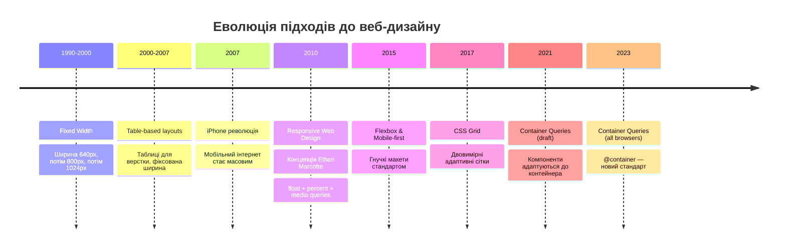

# Адаптивний дизайн. Media Queries

## 60% трафіку — мобільні пристрої. І що?

У 2009 році Ітан Маркотт (_Ethan Marcotte_) опублікував статтю "Responsive Web Design", яка змінила підхід до верстки. До цього існувало два варіанти: або окремий мобільний сайт (`m.example.com`), або декстопний сайт із горизонтальним скролом на телефоні. Обидва — компроміси.

Сьогодні більше **60% веб-трафіку у світі** приходить із мобільних пристроїв. Це означає, що кожна сторінка, яку ви верстаєте, буде переглядатися на смартфонах, планшетах, ноутбуках, моніторах 4K і навіть розумних годинниках. Адаптивний дизайн (_Responsive Web Design_, RWD) — це не опція, це стандарт.

У [попередній статті](/12.html-css/15.css-positioning) ми розглянули позиціонування. Тепер з'ясуємо, як зробити, щоб той самий HTML виглядав чудово на будь-якому екрані.

::mermaid



::

---

## Три кити адаптивного дизайну

Оригінальна формула Маркотта — три компоненти, які разом складають адаптивний дизайн:

::card-group

::card{title="Гнучкі сітки" icon="i-heroicons-table-cells"}
Використовуйте відносні одиниці (`%`, `fr`, `em`, `rem`) замість фіксованих (px). Елементи масштабуються пропорційно.
::

::card{title="Гнучкі медіа" icon="i-heroicons-photo"}
Зображення та відео пристосовуються до контейнера через `max-width: 100%`, `srcset`, `<picture>`.
::

::card{title="Media Queries" icon="i-heroicons-device-phone-mobile"}
CSS-правила, що застосовуються залежно від характеристик пристрою — ширини екрана, орієнтації, роздільної здатності.
::

::

---

## `<meta name="viewport">` — обов'язковий перший крок

Перш ніж писати будь-який адаптивний CSS — **ніколи не забувайте цей мета-тег** у `<head>`:

```html
<meta name="viewport" content="width=device-width, initial-scale=1" />
```

**Без нього** мобільні браузери використовують "емуляцію десктопу": вони відображають сторінку у віртуальному вікні шириною ~980px, а потім масштабують його (зменшують) до реальної ширини екрана. Результат — дрібний нечитабельний текст, тому що всі ваші media queries з `max-width: 768px` не спрацьовують — браузер "думає", що ширина вікна 980px.

**З тегом** браузер встановлює ширину viewport рівній реальній фізичній ширині пристрою, і ваші media queries починають коректно спрацьовувати.

::warning
**Ніколи не пишіть** `user-scalable=no` або `maximum-scale=1` у viewport meta-тегу. Це блокує масштабування сторінки, що є серйозною проблемою **доступності** (_accessibility_): люди зі слабким зором не зможуть збільшити текст. Крім того, це суперечить рекомендаціям WCAG 2.1.
::

Розберемо атрибут `content`:

- **`width=device-width`** — встановити ширину viewport рівній ширині пристрою (в CSS-пікселях, не фізичних).
- **`initial-scale=1`** — початковий масштаб = 1 (без збільшення/зменшення).

---

## Синтаксис `@media` — базова структура

Media query (_медіа-запит_) — це умова, яка визначає, **коли** застосовується блок CSS:

```css
/* Базова структура */
@media тип-медіа and (умова) {
    /* CSS-правила, що діють тільки при виконанні умови */
    .element {
        color: red;
    }
}
```

Компоненти media query:

1. **Тип медіа** (_media type_) — необов'язковий. Якщо опустити — застосовується до всіх.
2. **`and`** — логічний оператор "і".
3. **Умова** (_media feature_) у дужках.

### Вкладені правила та пріоритет

Правила всередині `@media` **мають такий самий специфічний вес**, що й звичайні правила. Пріоритет визначається **порядком у файлі** — те, що написане пізніше, перемагає при однаковому специфічному векторі:

```css
/* Базові стилі */
.btn {
    background: blue;
}

/* Media query — застосовується ПРИ умові */
@media (max-width: 600px) {
    .btn {
        background: red;
    } /* Перекриває blue на малих екранах */
}
```

---

## Типи медіа (Media Types)

```css
@media screen {
    /* Для екранів (монітори, телефони, планшети) */
}
@media print {
    /* Для друку — CSS друку */
}
@media all {
    /* Для всіх пристроїв (за замовчуванням) */
}
```

**`print`** — недооцінений тип. Він дозволяє задати стилі спеціально для друку:

```css
@media print {
    .no-print {
        display: none;
    } /* Сховати навігацію, рекламу */
    body {
        font-size: 12pt;
    } /* Пунктовий розмір для друку */
    a::after {
        content: ' (' attr(href) ')';
    } /* Показати URL */
    @page {
        margin: 2cm;
    } /* Поля сторінки */
}
```

---

## Media Features — умови медіа-запитів

### `min-width` та `max-width` — найуживаніші

```css
/* Застосувати, коли ширина viewport ≥ 768px */
@media (min-width: 768px) { ... }

/* Застосувати, коли ширина viewport ≤ 767px */
@media (max-width: 767px) { ... }

/* Діапазон: від 768px до 1199px */
@media (min-width: 768px) and (max-width: 1199px) { ... }
```

### Новий синтаксис діапазонів (2022+)

Сучасна специфікація Media Queries Level 4 дозволяє більш зрозумілий синтаксис:

```css
/* Замість: @media (max-width: 767px) */
@media (width <= 767px) { ... }

/* Замість: @media (min-width: 768px) and (max-width: 1199px) */
@media (768px <= width <= 1199px) { ... }
```

Підтримка широка (Chrome 113+, Firefox 63+, Safari 16.4+), але для сумісності зі старшими проєктами часто ще використовується класичний синтаксис.

### `orientation` — орієнтація пристрою

```css
@media (orientation: portrait) {
    /* Портретна орієнтація (вище, ніж ширше) */
    .sidebar {
        display: none;
    }
}

@media (orientation: landscape) {
    /* Альбомна орієнтація (ширше, ніж вище) */
    .sidebar {
        display: block;
    }
}
```

### `prefers-color-scheme` — темна/світла тема

```css
@media (prefers-color-scheme: dark) {
    :root {
        --bg: #0f172a;
        --text: #f1f5f9;
        --accent: #818cf8;
    }
}

@media (prefers-color-scheme: light) {
    :root {
        --bg: #ffffff;
        --text: #1e293b;
        --accent: #6366f1;
    }
}
```

### `prefers-reduced-motion` — режим зниженого руху

```css
@media (prefers-reduced-motion: reduce) {
    /* Вимкнути або зменшити анімації для людей із вестибулярними розладами */
    * {
        animation-duration: 0.01ms !important;
        transition-duration: 0.01ms !important;
    }
}
```

::tip
**`prefers-reduced-motion`** — це не лише про естетику. Для деяких людей надмірні анімації викликають запаморочення та нудоту. Завжди перевіряйте, чи ваші анімації коректно поводяться з цим запитом. Детально ця тема розкрита у наступній статті про анімації.
::

### `hover` та `pointer` — можливості пристрою вводу

```css
/* Чи може пристрій виконати :hover? */
@media (hover: hover) {
    /* Тільки для пристроїв із мишею — показати hover-ефекти */
    .btn:hover {
        background: dark;
    }
}

/* Точність вказівника */
@media (pointer: coarse) {
    /* Сенсорний екран — збільшити кнопки для пальця */
    .btn {
        min-height: 44px;
        padding: 0 1.5rem;
    }
}

@media (pointer: fine) {
    /* Миша — стандартний розмір */
    .btn {
        min-height: 32px;
    }
}
```

### `resolution` та `min-resolution` — DPI

```css
/* Для Retina/HiDPI дисплеїв */
@media (min-resolution: 2dppx) {
    .logo {
        background-image: url('logo@2x.png');
    }
}
```

---

## Breakpoints — точки зламу

**Breakpoints** (_точки зламу_) — це значення ширини, при яких змінюється дизайн. Немає "правильних" breakpoints з наукової точки зору — вони мають задаватися **контентом**, а не розмірами конкретних пристроїв (бо пристроїв безліч).

### Стандартні підходи

**Tailwind-like (компонентно-орієнтовані):**

| Назва | Значення | Орієнтир                       |
| ----- | -------- | ------------------------------ |
| `xs`  | 0px      | Мобільні телефони              |
| `sm`  | 640px    | Великі телефони, малі планшети |
| `md`  | 768px    | Планшети (iPad)                |
| `lg`  | 1024px   | Ноутбуки                       |
| `xl`  | 1280px   | Десктопи                       |
| `2xl` | 1536px   | Великі монітори                |

**Bootstrap-like (класичні):**

| Назва | Значення |
| ----- | -------- |
| `xs`  | < 576px  |
| `sm`  | ≥ 576px  |
| `md`  | ≥ 768px  |
| `lg`  | ≥ 992px  |
| `xl`  | ≥ 1200px |
| `xxl` | ≥ 1400px |

::note
**Найкращий підхід** — не прив'язуватися до пристроїв, а додавати breakpoints там, де **контент починає "ламатися"**. Відкрийте браузер, поступово звужуйте вікно і помітьте, в яких точках дизайн перестає виглядати добре — ось ваші breakpoints.
::

### CSS Custom Properties для breakpoints

```css
/* Зберегти breakpoints як коментарі або через @custom-media (CSS Level 5) */
/* Зараз стандартний патерн: */
@media (min-width: 768px) {
    /* md */
}
@media (min-width: 1024px) {
    /* lg */
}
@media (min-width: 1280px) {
    /* xl */
}
```

---

## Mobile-First vs Desktop-First

Це **стратегія написання** CSS. Вибір визначає, які значення ви пишете "за замовчуванням" (без media query), а які — у media query.

::tabs
::tabs-item{label="Mobile-First ✅ (рекомендований)"}

**Базові стилі = мобільні стилі** (без media query). Потім **розширюєте** дизайн для більших екранів через `min-width`:

```css
/* За замовчуванням: мобільний стиль */
.container {
    padding: 1rem;
    flex-direction: column;
}

/* Планшет: md breakpoint */
@media (min-width: 768px) {
    .container {
        padding: 2rem;
        flex-direction: row;
    }
}

/* Десктоп: lg breakpoint */
@media (min-width: 1024px) {
    .container {
        padding: 3rem;
        max-width: 1200px;
        margin: 0 auto;
    }
}
```

**Принцип:** пишіть CSS "від простого до складного". Мобільний дизайн — найпростіший (одна колонка), десктоп — найскладніший.

::
::tabs-item{label="Desktop-First ❌ (Legacy)"}

**Базові стилі = десктопні стилі**. Потім **урізуєте** дизайн для менших екранів через `max-width`:

```css
/* За замовчуванням: складний десктопний стиль */
.container {
    padding: 3rem;
    flex-direction: row;
    max-width: 1200px;
}

/* Планшет */
@media (max-width: 1023px) {
    .container {
        padding: 2rem;
    }
}

/* Мобільний */
@media (max-width: 767px) {
    .container {
        padding: 1rem;
        flex-direction: column;
    }
}
```

**Проблема:** mobile users завантажують весь Desktop CSS і потім перевизначають частину. Більше коду, більший трафік.

::
::

### Чому Mobile-First?

1. **Продуктивність:** мобільні пристрої завантажують менше CSS — тільки базові стилі + потрібні breakpoints.
2. **"Progressive Enhancement":** починаємо з мінімуму та додаємо можливості для потужніших пристроїв.
3. **Фокус:** змушує спочатку продумати найважливіший контент, а вже потім — доповнення для великих екранів.
4. **Google:** пошуковик використовує **Mobile-First Indexing** — індексує сторінки за їх мобільною версією.

---

## Практика: конвертація Desktop-макету в адаптивний

Розглянемо типову трансформацію — картки в два рядки на десктопі → одна колонка на мобільному:

::html-preview

```html
<div class="resp-grid">
    <div class="resp-card">
        <div class="card-icon">🎨</div>
        <h3>Дизайн</h3>
        <p>Адаптивний інтерфейс для всіх пристроїв</p>
    </div>
    <div class="resp-card">
        <div class="card-icon">⚡</div>
        <h3>Швидкість</h3>
        <p>Оптимізований CSS без зайвих перезаписів</p>
    </div>
    <div class="resp-card">
        <div class="card-icon">📱</div>
        <h3>Mobile-First</h3>
        <p>Починаємо з мобільних та додаємо складність</p>
    </div>
    <div class="resp-card">
        <div class="card-icon">🌐</div>
        <h3>Доступність</h3>
        <p>Читабельність і зручність на будь-якому екрані</p>
    </div>
</div>
```

```css
/* Mobile-First: за замовчуванням 1 колонка */
.resp-grid {
    display: grid;
    grid-template-columns: 1fr;
    gap: 1rem;
    padding: 1rem;
    background: #f8fafc;
    border-radius: 12px;
    font-family: system-ui, sans-serif;
}

/* sm: 2 колонки */
@media (min-width: 480px) {
    .resp-grid {
        grid-template-columns: repeat(2, 1fr);
    }
}

/* lg: 4 колонки */
@media (min-width: 900px) {
    .resp-grid {
        grid-template-columns: repeat(4, 1fr);
        gap: 1.5rem;
    }
}

.resp-card {
    background: white;
    border-radius: 10px;
    padding: 1.25rem;
    border: 1px solid #e2e8f0;
    box-shadow: 0 1px 3px rgba(0, 0, 0, 0.06);
}

.card-icon {
    font-size: 1.75rem;
    margin-bottom: 0.5rem;
}

.resp-card h3 {
    margin: 0 0 0.4rem;
    font-size: 1rem;
    color: #1e293b;
}

.resp-card p {
    margin: 0;
    font-size: 0.85rem;
    color: #64748b;
    line-height: 1.5;
}
```

::

Зміните розмір вікна браузера (або перегляньте у DevTools у мобільному режимі) — картки автоматично перебудовуються.

---

## Логічні оператори в media queries

### `and` — одночасне виконання умов

```css
@media screen and (min-width: 768px) and (orientation: landscape) {
    /* Екран, ширина ≥ 768px, альбомна орієнтація */
}
```

### `,` (кома) — логічне АБО

```css
@media (max-width: 767px), print {
    /* Мобільний АБО при друку */
    .sidebar {
        display: none;
    }
}
```

### `not` — заперечення

```css
@media not print {
    /* Все, крім друку */
    .no-print-element {
        display: block;
    }
}
```

### `only` — запобігання старим браузерам

```css
@media only screen and (min-width: 768px) {
    /* `only` ігнорується сучасними браузерами, але не дозволяє
       старим браузерам застосовувати правила без підтримки media features */
}
```

---

## Адаптивні зображення

### Базовий CSS: `max-width: 100%`

```css
img,
video,
iframe {
    max-width: 100%; /* Ніколи не виходить за межі батька */
    height: auto; /* Зберігає пропорції */
}
```

Це **мінімальний обов'язковий CSS** для адаптивних зображень.

### `srcset` — різна роздільна здатність

Атрибут `srcset` дозволяє браузеру вибрати найоптимальніше зображення залежно від ширини viewport та DPI екрана:

```html

```

Розберемо атрибути:

- **`src`** — запасне значення для браузерів без підтримки `srcset`.
- **`srcset`** — список зображень із вказанням їх реальної ширини в пікселях (`w`).
- **`sizes`** — умови та розміри, в яких буде відображатися зображення в CSS (повідомляє браузеру, яке зображення завантажувати ДО рендерингу).

Браузер аналізує `sizes`, визначає потрібний CSS-розмір і вибирає оптимальне зображення з `srcset`.

### `<picture>` — art direction

Елемент `<picture>` дозволяє показувати **різні зображення** (не просто різні розміри одного) залежно від умов:

```html
<picture>
    <!-- Мобільне зображення (вертикальний кроп) -->
    <source media="(max-width: 767px)" srcset="hero-mobile.jpg" />
    <!-- Планшетне -->
    <source media="(max-width: 1023px)" srcset="hero-tablet.jpg" />
    <!-- За замовчуванням — десктоп -->
    
</picture>
```

Типовий кейс: на десктопі — широкий горизонтальний банер, на мобільному — вертикальний кроп із акцентом на головному об'єкті.

### WebP та сучасні формати

```html
<picture>
    <!-- WebP для сучасних браузерів -->
    <source type="image/webp" srcset="image.webp" />
    <!-- AVIF — ще ефективніший (Chrome 85+, Firefox 113+) -->
    <source type="image/avif" srcset="image.avif" />
    <!-- JPEG як fallback -->
    
</picture>
```

Браузер вибере перший підтримуваний формат зверху вниз. Цей підхід дозволяє використовувати найновіші (й найлегші) формати без ризику зламати старі браузери.

---

## CSS-тест: вкладені media queries

Сучасні браузери підтримують **CSS Nesting** (нативний, без препроцесорів) — media queries можна вкладати прямо в правило:

```css
.nav {
    flex-direction: column;
    gap: 0.5rem;

    /* Вкладений media query (CSS Nesting, 2023+) */
    @media (min-width: 768px) {
        flex-direction: row;
        gap: 1.5rem;
    }
}
```

Підтримка: Chrome 112+, Firefox 117+, Safari 17.2+. Якщо потрібна підтримка старших браузерів — використовуйте класичний синтаксис виключно на рівні файлу.

---

## `@media` та CSS Custom Properties: темна тема

CSS Custom Properties + `prefers-color-scheme` = **автоматична темна тема** без JavaScript:

::html-preview

```html
<div class="theme-demo">
    <div class="theme-card">
        <h3>Автоматична тема</h3>
        <p>
            Цей блок автоматично змінює кольори відповідно до системних налаштувань через
            <code>prefers-color-scheme</code> та CSS Custom Properties.
        </p>
        <button class="theme-btn">Дія</button>
    </div>
</div>
```

```css
:root {
    --bg: #ffffff;
    --card-bg: #f8fafc;
    --text: #1e293b;
    --text-muted: #64748b;
    --border: #e2e8f0;
    --accent: #6366f1;
    --accent-text: #ffffff;
}

@media (prefers-color-scheme: dark) {
    :root {
        --bg: #0f172a;
        --card-bg: #1e293b;
        --text: #f1f5f9;
        --text-muted: #94a3b8;
        --border: #334155;
        --accent: #818cf8;
        --accent-text: #ffffff;
    }
}

.theme-demo {
    padding: 1.5rem;
    background: var(--bg);
    border-radius: 12px;
    font-family: system-ui, sans-serif;
}

.theme-card {
    background: var(--card-bg);
    border: 1px solid var(--border);
    border-radius: 10px;
    padding: 1.25rem;
}

.theme-card h3 {
    margin: 0 0 0.5rem;
    color: var(--text);
    font-size: 1rem;
}

.theme-card p {
    margin: 0 0 1rem;
    color: var(--text-muted);
    font-size: 0.875rem;
    line-height: 1.6;
}

.theme-card code {
    background: var(--border);
    padding: 0.1rem 0.3rem;
    border-radius: 3px;
    font-size: 0.8rem;
    color: var(--accent);
}

.theme-btn {
    padding: 0.5rem 1.25rem;
    background: var(--accent);
    color: var(--accent-text);
    border: none;
    border-radius: 7px;
    cursor: pointer;
    font-family: inherit;
    font-size: 0.875rem;
    font-weight: 600;
}
```

::

Якщо на вашому пристрої ввімкнена темна тема — блок вище відображатиметься у темних кольорах автоматично. Якщо ні — у світлих. І все це без рядка JavaScript.

---

## Відносні одиниці для адаптивності

Медіа-запити — лише один інструмент адаптивності. Правильний вибір **одиниць виміру** робить елементи гнучкими **без будь-яких media queries**:

| Одиниця      | Відносно                | Типове застосування        |
| ------------ | ----------------------- | -------------------------- |
| `%`          | Батьківського елемента  | Ширина колонок             |
| `em`         | Розміру шрифту батька   | Відступи, що масштабуються |
| `rem`        | Розміру шрифту `:root`  | Базова типографіка         |
| `vw`         | Ширини viewport         | Fluid-елементи             |
| `vh`         | Висоти viewport         | Full-screen секції         |
| `vmin`       | Меншого з vw/vh         | Квадратні елементи         |
| `vmax`       | Більшого з vw/vh        | Фонові ефекти              |
| `ch`         | Ширини символу "0"      | Ширина текстових колонок   |
| `svh`, `dvh` | "Safe/Dynamic" viewport | iOS safari full-screen     |

### Сучасні viewport-одиниці

Проблема `vh` на мобільних: адресний рядок браузера "з'їдає" частину екрана, і `100vh` виходить за межі видимої зони. Вирішення — нові одиниці 2023 року:

```css
.hero {
    /* Стара проблема */
    height: 100vh; /* Може бути більше за видиму зону на iOS Safari */

    /* Нові одиниці */
    height: 100svh; /* Small Viewport Height — без адресного рядка */
    height: 100dvh; /* Dynamic Viewport Height — оновлюється при скролі */
    height: 100lvh; /* Large Viewport Height — з адресним рядком */
}
```

---

## Тестування адаптивності в Chrome DevTools

DevTools — незамінний інструмент для роботи з адаптивним дизайном. Майте на увазі, що без DevTools ви фактично розробляєте наосліп.

::steps

### Відкрити режим пристроїв

Натисніть `Ctrl+Shift+M` (Windows/Linux) або `Cmd+Shift+M` (macOS), або клікніть іконку телефону у верхній частині DevTools. Браузер перейде у **Device Toolbar** режим.

### Вибрати пристрій або ширину

У спадному меню зверху ви можете вибрати конкретний пристрій (iPhone 14, Pixel 7, iPad Air) або задати довільні розміри. Браузер симулює DPR (Device Pixel Ratio) вибраного пристрою.

### Перевірити media queries через шкалу

Натисніть іконку трьох крапок → **Show media queries**. Над сторінкою з'явиться шкала з кольоровими смугами для ваших breakpoints — клік на смугу встановлює відповідну ширину.

### Симулювати prefers-color-scheme

DevTools → **Rendering** (три крапки → More tools → Rendering) → **Emulate CSS media feature prefers-color-scheme** → dark або light.

### Симулювати prefers-reduced-motion

Там же у Rendering → **Emulate CSS media feature prefers-reduced-motion** → reduce.

::

::tip
**Throttling мережі у DevTools:** при тестуванні адаптивних зображень увімкніть **Network throttling** (наприклад, "Fast 3G"), щоб перевірити, яке зображення браузер обирає для завантаження та наскільки швидко завантажується сторінка на повільному з'єднанні.
::

---

## `@media print` — стилі для друку

Стилі для друку — недооцінена, але практично важлива частина адаптивного дизайну. Багато корпоративних застосунків, документів, рахунків мають добре виглядати при роздруковуванні.

### Базова заготовка print-стилів

```css
@media print {
    /* 1. Сховати непотрібне при друку */
    header,
    footer,
    nav,
    .sidebar,
    .advertisement,
    .cookie-banner,
    .back-to-top,
    video,
    iframe {
        display: none !important;
    }

    /* 2. Скинути фони та тіні (економія чорнила) */
    * {
        background: transparent !important;
        color: black !important;
        box-shadow: none !important;
        text-shadow: none !important;
    }

    /* 3. Встановити шрифт та розміри для друку */
    body {
        font-family: Georgia, serif;
        font-size: 12pt;
        line-height: 1.5;
        color: #000;
    }

    h1 {
        font-size: 22pt;
    }
    h2 {
        font-size: 18pt;
    }
    h3 {
        font-size: 14pt;
    }

    /* 4. Показати URL посилань */
    a[href]::after {
        content: ' (' attr(href) ')';
        font-size: 10pt;
        color: #555;
    }

    /* Не показувати для внутрішніх посилань */
    a[href^='#']::after {
        content: none;
    }

    /* 5. Контроль розривів сторінки */
    h2,
    h3 {
        page-break-after: avoid; /* Не розривати після заголовка */
    }

    img {
        max-width: 100% !important;
        page-break-inside: avoid; /* Не розривати зображення */
    }

    table {
        border-collapse: collapse;
        page-break-inside: avoid;
    }

    /* 6. Налаштування полів сторінки */
    @page {
        margin: 2cm;
        size: A4 portrait; /* або landscape */
    }

    /* Перша сторінка з більшим верхнім відступом */
    @page :first {
        margin-top: 4cm;
    }
}
```

### Практичний приклад: адаптивний інвойс

Документи-рахунки є класичним прикладом, де `@media print` критично важливий:

```css
.invoice {
    max-width: 800px;
    margin: 0 auto;
    padding: 2rem;
}

/* На екрані — красивий дизайн */
.invoice-header {
    background: linear-gradient(135deg, #6366f1, #4f46e5);
    color: white;
    padding: 2rem;
    border-radius: 12px;
    margin-bottom: 2rem;
}

/* При друці — лише рамка замість градієнта */
@media print {
    .invoice-header {
        background: none !important;
        color: black !important;
        border: 2px solid black;
        border-radius: 0;
    }

    .invoice-footer {
        position: fixed;
        bottom: 0;
        /* Підвал на кожній сторінці */
        border-top: 1px solid #ccc;
        padding-top: 0.5rem;
    }
}
```

---

## Резюме частини 1

::card-group

::card{title="viewport meta-тег" icon="i-heroicons-device-phone-mobile"}
Обов'язковий `<meta name="viewport" content="width=device-width, initial-scale=1">`. Без нього media queries не працюють на мобільних.
::

::card{title="@media синтаксис" icon="i-heroicons-code-bracket"}
Тип медіа (screen, print) + media features (width, orientation, prefers-\*). Логічні оператори: `and`, `,`, `not`.
::

::card{title="Mobile-First" icon="i-heroicons-arrow-up-right"}
Базові стилі = мобільні. Розширюємо через `min-width`. Менше CSS на мобільних, простіша логіка.
::

::card{title="Breakpoints" icon="i-heroicons-scissors"}
Не прив'язувати до пристроїв — ставити там, де контент "ламається". Стандартні: 640/768/1024/1280px.
::

::card{title="Adaptive Images" icon="i-heroicons-photo"}
`max-width: 100%` — мінімум. `srcset` + `sizes` — оптимізація. `<picture>` — art direction та WebP/AVIF.
::

::card{title="Custom Properties + media" icon="i-heroicons-swatch"}
CSS змінні + `prefers-color-scheme` = автоматична темна тема без JS.
::

::

У [наступній частині](/12.html-css/16b.css-responsive-advanced) ми розглянемо:

- `clamp()` і fluid typography — шрифт, що масштабується плавно без breakpoints
- Container Queries (`@container`) — компоненти, що реагують на контейнер, а не на viewport
- `@layer` — революційний інструмент управління каскадом CSS
- Responsive patterns: navigation, cards, tables, modals
- Завдання трьох рівнів складності

---

## Завдання для самоперевірки (Частина 1)

::accordion

::accordion-item{label="Рівень 1: Базовий — Синтаксис media queries"}

**Завдання 1.1.** Напишіть media query, яке зробить фон сторінки:

- Синім на мобільних (< 640px)
- Зеленим на планшетах (640px–1023px)
- Білим на десктопах (≥ 1024px)

Реалізуйте через Mobile-First підхід (з `min-width`).

**Завдання 1.2.** Виправте: чому наступний код не працює на мобільних?

```html
<!-- Пропущено viewport meta-тег -->
<style>
    @media (max-width: 600px) {
        body {
            background: lightblue;
        }
    }
</style>
```

**Завдання 1.3.** Напишіть media query, яке ховає `.advertisement` при друці сторінки та при увімкненій темній темі.

::

::accordion-item{label="Рівень 2: Логіка — Адаптивна верстка"}

**Завдання 2.1.** Реалізуйте навігаційне меню, яке:

- На мобільних (< 768px): вертикальний список посилань, приховане за замовчуванням, з'являється при натисканні (checkbox-хак або `:focus-within`)
- На планшетах (768px–1023px): горизонтальне меню, 4 пункти
- На десктопах (≥ 1024px): горизонтальне меню з dropdown при hover

**Завдання 2.2.** Реалізуйте адаптивний `<table>`, який:

- На десктопі: звичайна таблиця
- На мобільному (< 600px): кожен рядок відображається як картка зі підписами ColName: Value через `data-label` атрибут та CSS `content: attr(data-label)`

**Завдання 2.3.** Визначте `srcset` та `sizes` для зображення:

- На мобільних: 100% ширини viewport (є файл `photo-400.jpg`)
- На планшетах: 50% ширини viewport (є файл `photo-800.jpg`)
- На десктопах: 33% ширини viewport (є файл `photo-1200.jpg`)

::

::accordion-item{label="Рівень 3: Архітектура — Повністю адаптивна сторінка"}

**Завдання 3.1 (Міні-проєкт).** Реалізуйте повністю адаптивну промо-сторінку продукту:

**Структура (4 секції):**

1. **Hero** — повноекранна секція з заголовком, підзаголовком та двома кнопками
2. **Features** — сітка переваг (іконка + заголовок + текст), 3 колонки на десктопі → 2 → 1
3. **Pricing** — 3 тарифних плани, горизонтально на десктопі, вертикально на мобільному
4. **Footer** — 4 колонки на десктопі → 2 → 1

**CSS-вимоги:**

- Mobile-First підхід (тільки `min-width`)
- 3 breakpoints: 640px, 768px, 1024px
- `<picture>` із різними зображеннями для мобільного та десктопу
- Автоматична темна тема через `prefers-color-scheme` + CSS Custom Properties
- `prefers-reduced-motion` для анімацій

::

::

---

_Продовження: [Адаптивний дизайн. Частина 2 — clamp(), Container Queries, @layer](/12.html-css/16b.css-responsive-advanced)_
