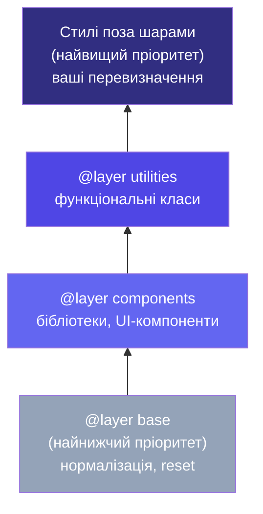
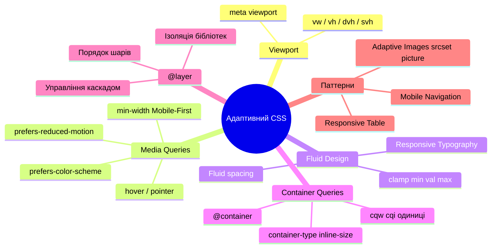

# Адаптивний дизайн. Частина 2: Сучасний CSS

_Це продовження статті [Адаптивний дизайн. Частина 1](/12.html-css/16.css-responsive-media-queries), де ми розглянули viewport, media queries, breakpoints та Mobile-First підхід._

---

## Fluid Typography через `clamp()` — шрифт без breakpoints

Класичний підхід до адаптивної типографіки — змінювати `font-size` у кожному breakpoint:

```css
/* Старий підхід — 3 розміри для 3 breakpoints */
h1 {
    font-size: 1.5rem;
}
@media (min-width: 768px) {
    h1 {
        font-size: 2rem;
    }
}
@media (min-width: 1280px) {
    h1 {
        font-size: 3rem;
    }
}
```

Результат — **стрибкоподібні** зміни: на 767px шрифт 1.5rem, на 768px — одразу 2rem. Немає плавного переходу.

**Fluid typography** (_рідка типографіка_) — шрифт **безперервно масштабується** між мінімальним і максимальним значенням залежно від ширини viewport, без жодного breakpoint.

### Функція `clamp()`

```css
clamp(мінімум, ідеальне-значення, максимум)
```

Функція повертає **ідеальне значення**, обмежене між мінімумом та максимумом:

- Якщо ідеальне < мінімуму — повертає **мінімум**.
- Якщо ідеальне > максимуму — повертає **максимум**.
- В іншому разі — повертає **ідеальне**.

```css
h1 {
    /* Мінімум 1.5rem, плавне масштабування, максимум 3rem */
    font-size: clamp(1.5rem, 5vw, 3rem);
}
```

Рядок `5vw` означає: шрифт = 5% від ширини viewport. На 320px це 16px (1rem), на 1200px — 60px. `clamp()` обмежує це між 1.5rem і 3rem.

::html-preview

```html
<div class="fluid-demo">
    <h2 class="fluid-title">Fluid Typography</h2>
    <p class="fluid-body">
        Цей текст масштабується плавно між мінімальним та максимальним розміром залежно від ширини контейнера — без
        єдиного media query. Спробуйте змінити розмір вікна браузера.
    </p>
    <p class="fluid-caption">Підпис: завжди читабельний</p>
</div>
```

```css
.fluid-demo {
    padding: clamp(1rem, 3vw, 2.5rem);
    background: linear-gradient(135deg, #f1f5f9, #e0e7ff);
    border-radius: 12px;
    font-family: system-ui, sans-serif;
}

.fluid-title {
    font-size: clamp(1.5rem, 4vw, 2.75rem);
    font-weight: 800;
    color: #1e293b;
    margin: 0 0 0.75rem;
    line-height: 1.2;
}

.fluid-body {
    font-size: clamp(0.9rem, 2vw, 1.125rem);
    color: #475569;
    line-height: 1.7;
    margin: 0 0 0.5rem;
    max-width: 65ch; /* ch — ширина символу "0" */
}

.fluid-caption {
    font-size: clamp(0.75rem, 1.5vw, 0.9rem);
    color: #94a3b8;
    margin: 0;
}
```

::

### Формула для точного масштабування

Щоб fluid typography масштабувалась **точно** між двома значеннями на двох ширинах, використовуйте формулу:

```css
/* Від font-min до font-max між viewport-min і viewport-max */
font-size: clamp(font-min, font-min + (font-max - font-min) * ((100vw - vp-min) / (vp-max - vp-min)), font-max);
```

На практиці розробники використовують онлайн-калькулятори (наприклад, [clamp.font-size.app](https://clamp.font-size.app)) або утиліти:

```css
/* Результат розрахунку: від 16px до 24px між 320px та 1280px viewport */
h2 {
    font-size: clamp(1rem, 0.833rem + 0.833vw, 1.5rem);
}
```

### `clamp()` не лише для шрифтів

```css
/* Відступи */
.section {
    padding: clamp(2rem, 5vw, 6rem);
}

/* Ширина */
.container {
    width: clamp(280px, 90%, 1200px);
}

/* Пробіли */
.grid {
    gap: clamp(1rem, 2.5vw, 2rem);
}
```

::tip
Функції `min()` та `max()` — "молодші брати" `clamp()`. `min(a, b)` повертає менше значення, `max(a, b)` — більше. `clamp(min, val, max)` = `max(min, min(val, max))`.
::

---

## Container Queries — революція компонентів

Media queries перевіряють ширину **viewport** — всього браузерного вікна. Але в сучасній компонентній розробці це часто не те, що потрібно. Картка в головному контенті займає 70% ширини, та сама картка в сайдбарі — 30%. Одна і та ж картка, але у різних контекстах.

**Container Queries** (`@container`) вирішують саме цю проблему: компонент адаптується до **розміру свого контейнера**, а не до viewport.

### Синтаксис

```css
/* 1. Позначте батьківський елемент як "container" */
.card-wrapper {
    container-type: inline-size; /* Відстежувати ширину */
    container-name: card; /* Необов'язкова назва */
}

/* 2. Пишіть стилі для компонента, що залежать від контейнера */
@container (min-width: 400px) {
    .card {
        flex-direction: row; /* Горизонтально в широкому контейнері */
    }
}

/* 3. З іменованим контейнером */
@container card (min-width: 600px) {
    .card-title {
        font-size: 1.5rem;
    }
}
```

### `container-type`

| Значення      | Що відстежує                                       |
| ------------- | -------------------------------------------------- |
| `inline-size` | Тільки ширину (найпоширеніше)                      |
| `size`        | Ширину та висоту                                   |
| `normal`      | Не є size container, але може бути style container |

::html-preview

```html
<div class="cq-demo">
    <p class="cq-label">Широкий контейнер (1fr):</p>
    <div class="cq-container wide-container">
        <div class="product-card">
            <div class="card-img">🖥️</div>
            <div class="card-body">
                <span class="card-badge">Новинка</span>
                <h3>MacBook Pro</h3>
                <p>Найшвидший ноутбук для розробників</p>
                <button class="card-btn">Купити</button>
            </div>
        </div>
    </div>

    <p class="cq-label">Вузький контейнер (280px):</p>
    <div class="cq-container narrow-container">
        <div class="product-card">
            <div class="card-img">🖥️</div>
            <div class="card-body">
                <span class="card-badge">Новинка</span>
                <h3>MacBook Pro</h3>
                <p>Найшвидший ноутбук для розробників</p>
                <button class="card-btn">Купити</button>
            </div>
        </div>
    </div>
</div>
```

```css
.cq-demo {
    padding: 1rem;
    background: #f8fafc;
    border-radius: 12px;
    font-family: system-ui, sans-serif;
}

.cq-label {
    font-size: 0.8rem;
    font-weight: 600;
    color: #64748b;
    margin: 0.5rem 0 0.35rem;
}

/* Container declaration */
.cq-container {
    container-type: inline-size;
    margin-bottom: 0.75rem;
}

.wide-container {
    width: 100%;
}

.narrow-container {
    width: 280px;
}

/* Default (narrow): вертикальний макет */
.product-card {
    background: white;
    border: 1px solid #e2e8f0;
    border-radius: 10px;
    overflow: hidden;
    display: flex;
    flex-direction: column;
}

.card-img {
    background: linear-gradient(135deg, #e0e7ff, #c7d2fe);
    display: flex;
    align-items: center;
    justify-content: center;
    font-size: 3rem;
    height: 120px;
}

.card-body {
    padding: 1rem;
}

.card-badge {
    background: #dbeafe;
    color: #1d4ed8;
    font-size: 0.7rem;
    font-weight: 700;
    padding: 0.2rem 0.5rem;
    border-radius: 4px;
    text-transform: uppercase;
    letter-spacing: 0.04em;
}

.card-body h3 {
    margin: 0.45rem 0 0.3rem;
    font-size: 1rem;
    color: #1e293b;
}

.card-body p {
    margin: 0 0 0.75rem;
    font-size: 0.82rem;
    color: #64748b;
    line-height: 1.5;
}

.card-btn {
    padding: 0.5rem 1.25rem;
    background: #6366f1;
    color: white;
    border: none;
    border-radius: 7px;
    font-size: 0.85rem;
    font-weight: 600;
    cursor: pointer;
    font-family: inherit;
    width: 100%;
}

/* Wide container: горизонтальний макет */
@container (min-width: 400px) {
    .product-card {
        flex-direction: row;
    }

    .card-img {
        width: 160px;
        height: auto;
        flex-shrink: 0;
        font-size: 4rem;
    }

    .card-body {
        display: flex;
        flex-direction: column;
        justify-content: center;
    }

    .card-btn {
        width: auto;
    }
}
```

::

Зверніть: **той самий компонент** — `.product-card` — автоматично переключається між вертикальним та горизонтальним макетом залежно від ширини **свого контейнера**, а не viewport. Тепер ви можете помістити цей компонент у будь-яке місце сторінки — він завжди адаптується коректно.

### Container Queries Units

Разом із `@container` з'явилися нові одиниці, відносні до розміру контейнера:

| Одиниця | Відносно                            |
| ------- | ----------------------------------- |
| `cqw`   | 1% ширини контейнера                |
| `cqh`   | 1% висоти контейнера                |
| `cqi`   | 1% inline-розміру (зазвичай ширини) |
| `cqb`   | 1% block-розміру (зазвичай висоти)  |
| `cqmin` | Менше з `cqi` та `cqb`              |
| `cqmax` | Більше з `cqi` та `cqb`             |

```css
.card-title {
    font-size: clamp(1rem, 5cqi, 2rem); /* Масштабується відносно контейнера */
}
```

### Підтримка Container Queries

Container Queries підтримуються всіма major-браузерами з 2023 року (Chrome 105+, Firefox 110+, Safari 16+). На проєктах, де потрібна підтримка старіших браузерів, використовуйте **polyfill** або **media queries як замінник**.

---

## `@layer` — управління каскадом CSS

Це одне з найважливіших нових доповнень до CSS за останні роки. Воно вирішує проблему, яка мучила розробників десятиліттями: **конфлікт специфічності**.

### Проблема без `@layer`

Уявіть: ви підключаєте CSS-бібліотеку компонентів і хочете перевизначити стилі кнопки. Бібліотека написала:

```css
/* Бібліотека */
.button.primary {
    background: blue;
} /* специфічність: 0,2,0 */
```

Ви пишете:

```css
/* Ваш CSS */
.btn {
    background: red;
} /* специфічність: 0,1,0 — менше! Не спрацює */
```

Щоб перемогти, вам доводиться або підвищувати специфічність (`.btn.btn`, `#root .btn`) або використовувати `!important`. Обидва підходи — антипатерни, що гніздяться та ускладнюють підтримку.

### `@layer` — вирішення

**Cascade Layer** (_шар каскаду_) дозволяє явно організувати CSS у пронумеровані "шари". Стилі у **вищому** (пізніше оголошеному) шарі завжди перемагають стилі нижніх — **незалежно від специфічності**.

```css
/* Оголошення порядку шарів (порядок важливий!) */
@layer base, components, utilities;

/* Базові стилі — найнижчий пріоритет */
@layer base {
    button {
        background: gray;
        padding: 0.5rem;
    } /* специфічність 0,0,1 */
}

/* Компоненти */
@layer components {
    .button.primary {
        background: blue;
    } /* specificifity 0,2,0 — але вищий шар! */
}

/* Утиліти — найвищий пріоритет */
@layer utilities {
    .bg-red {
        background: red;
    } /* specificifity 0,1,0 — виграє через шар! */
}

/* CSS поза шарами — завжди перемагає всі шари */
.override {
    background: green;
}
```

::mermaid



::

### Синтаксис `@layer`

**Оголошення порядку шарів** (рекомендується на початку файлу):

```css
@layer reset, base, components, utilities;
```

**Заповнення шарів:**

```css
@layer reset {
    *,
    *::before,
    *::after {
        box-sizing: border-box;
    }
    body {
        margin: 0;
    }
}

@layer base {
    h1,
    h2,
    h3 {
        line-height: 1.2;
    }
    p {
        margin-bottom: 1rem;
    }
}

@layer components {
    .card {
        border-radius: 8px;
        padding: 1.5rem;
    }
    .btn {
        padding: 0.5rem 1rem;
        border-radius: 6px;
    }
}

@layer utilities {
    .hidden {
        display: none;
    }
    .sr-only {
        position: absolute;
        width: 1px;
        overflow: hidden;
    }
}
```

### `@layer` та сторонні бібліотеки

Найпотужніше застосування `@layer` — **ізоляція сторонніх бібліотек**:

```css
/* Обгортаємо Bootstrap/Tailwind/будь-яку бібліотеку в шар */
@layer bootstrap {
    @import url('bootstrap.css');
}

/* Тепер будь-який наш CSS поза шарами перемагає Bootstrap */
.btn {
    background: purple;
} /* Перемагає bootstrap, без !important */
```

Або при імпорті:

```css
/* Сучасний синтаксис (2022+) */
@import url('normalize.css') layer(reset);
@import url('bootstrap.css') layer(bootstrap);
```

### Вкладені шари

```css
@layer components {
    @layer buttons {
        .btn { ... }
    }

    @layer forms {
        .input { ... }
    }
}

/* Зовнішнє посилання на вкладений шар */
@layer components.buttons {
    .btn-primary { background: blue; }
}
```

### Анонімні шари

Шари можна також створювати без іменування — вони отримують пріоритет у порядку появи:

```css
@layer {
    /* Анонімний шар 1 */
    .element {
        color: red;
    }
}

@layer {
    /* Анонімний шар 2 — вищий приоритет */
    .element {
        color: blue;
    } /* Перемагає */
}
```

### Повний приклад: дизайн-система з `@layer`

```css
/* === Система шарів для великого проєкту === */
@layer reset,      /* CSS-скидання */
    tokens,     /* Design tokens (змінні) */
    base,       /* Базова типографіка та HTML-елементи */
    layout,     /* Макетні компоненти */
    components, /* UI-компоненти (кнопки, картки, форми) */
    patterns,   /* Складні паттерни (navigationbar, modal) */
    overrides,  /* Тимчасові виключення та фікси */
    utilities; /* Utility-класи (display, spacing, color) */

@layer reset {
    *,
    *::before,
    *::after {
        box-sizing: border-box;
        margin: 0;
        padding: 0;
    }
}

@layer tokens {
    :root {
        --color-primary: #6366f1;
        --color-primary-dark: #4f46e5;
        --space-sm: 0.5rem;
        --space-md: 1rem;
        --space-lg: 2rem;
        --radius-sm: 4px;
        --radius-md: 8px;
        --radius-lg: 12px;
    }
}

@layer base {
    body {
        font-family: system-ui, sans-serif;
        line-height: 1.6;
        color: #1e293b;
    }
    h1,
    h2,
    h3 {
        line-height: 1.2;
    }
}

@layer components {
    .btn {
        display: inline-flex;
        align-items: center;
        gap: var(--space-sm);
        padding: 0.5rem 1.25rem;
        border-radius: var(--radius-md);
        border: none;
        cursor: pointer;
        font-weight: 600;
        transition: background 0.15s;
    }

    .btn-primary {
        background: var(--color-primary);
        color: white;
    }

    .btn-primary:hover {
        background: var(--color-primary-dark);
    }
}

@layer utilities {
    /* Навіть низькоспецифічний клас-утиліта перемагає компоненти */
    .hidden {
        display: none !important;
    }
    .text-center {
        text-align: center;
    }
    .mt-4 {
        margin-top: var(--space-lg);
    }
}
```

::note
**Пріоритет у `@layer`:** стилі **поза** шарами завжди мають вищий пріоритет, ніж будь-який шар. Це дозволяє зручно "виправляти" конкретні випадки без зміни архітектури шарів.
::

---

## `@scope` — обмеження видимості стилів

`@scope` (_область видимості_) — нова можливість CSS, що дозволяє обмежити дію стилів певним піддеревом DOM:

```css
/* Стилі діють тільки всередині елемента з .card */
@scope (.card) {
    h3 {
        color: #6366f1;
    } /* Тільки h3 всередині .card */
    p {
        color: #64748b;
    }
}

/* Область з "дірою" — не застосовувати всередині .card-footer */
@scope (.card) to (.card-footer) {
    p {
        font-size: 0.9rem;
    }
}
```

Підтримка вже є у Chrome 118+, Safari 17.4+ і Firefox 128+. Це особливо корисно для компонентного підходу коли ви хочете стилі картки — залишилися строго в межах картки.

---

## Адаптивні UI-паттерни

### Паттерн 1: "Pancake Stack" — секції на всю висоту

```css
.page {
    display: grid;
    grid-template-rows: auto 1fr auto; /* шапка | контент | підвал */
    min-height: 100dvh;
}
```

### Паттерн 2: Scrollable sidebar + fixed content

```css
.layout {
    display: grid;
    grid-template-columns: 250px 1fr;
    height: 100dvh;
    overflow: hidden;
}

.sidebar {
    overflow-y: auto; /* Тільки сайдбар прокручується */
    padding: 1rem;
}

.main {
    overflow-y: auto;
    padding: 2rem;
}
```

### Паттерн 3: Responsive Table без JavaScript

Таблиці — класична проблема адаптивності. На мобільному вони виходять за межі екрана. Рішення через CSS:

::html-preview

```html
<div class="table-wrapper">
    <table class="resp-table">
        <thead>
            <tr>
                <th>Ім'я</th>
                <th>Email</th>
                <th>Роль</th>
                <th>Статус</th>
            </tr>
        </thead>
        <tbody>
            <tr>
                <td data-label="Ім'я">Іван Іваненко</td>
                <td data-label="Email">ivan@example.com</td>
                <td data-label="Роль">Розробник</td>
                <td data-label="Статус"><span class="status active">Активний</span></td>
            </tr>
            <tr>
                <td data-label="Ім'я">Марія Коваль</td>
                <td data-label="Email">maria@example.com</td>
                <td data-label="Роль">Дизайнер</td>
                <td data-label="Статус"><span class="status inactive">Відпустка</span></td>
            </tr>
            <tr>
                <td data-label="Ім'я">Андрій Петров</td>
                <td data-label="Email">andrii@example.com</td>
                <td data-label="Роль">Менеджер</td>
                <td data-label="Статус"><span class="status active">Активний</span></td>
            </tr>
        </tbody>
    </table>
</div>
```

```css
.table-wrapper {
    overflow-x: auto; /* Горизонтальний скрол як fallback */
    border-radius: 10px;
    font-family: system-ui, sans-serif;
}

.resp-table {
    width: 100%;
    border-collapse: collapse;
    background: white;
}

.resp-table th {
    background: #f1f5f9;
    color: #475569;
    font-size: 0.75rem;
    font-weight: 700;
    text-transform: uppercase;
    letter-spacing: 0.05em;
    padding: 0.75rem 1rem;
    text-align: left;
    border-bottom: 2px solid #e2e8f0;
}

.resp-table td {
    padding: 0.75rem 1rem;
    border-bottom: 1px solid #f1f5f9;
    font-size: 0.875rem;
    color: #334155;
}

.status {
    padding: 0.2rem 0.6rem;
    border-radius: 20px;
    font-size: 0.75rem;
    font-weight: 600;
}

.status.active {
    background: #dcfce7;
    color: #15803d;
}
.status.inactive {
    background: #fef3c7;
    color: #b45309;
}

/* На вузьких екранах: картковий вигляд */
@media (max-width: 600px) {
    .resp-table thead {
        display: none;
    } /* Сховати заголовки */

    .resp-table tr {
        display: block;
        margin-bottom: 1rem;
        border: 1px solid #e2e8f0;
        border-radius: 8px;
        overflow: hidden;
    }

    .resp-table td {
        display: flex;
        justify-content: space-between;
        align-items: center;
        border-bottom: 1px solid #f1f5f9;
    }

    /* Підпис із data-атрибута */
    .resp-table td::before {
        content: attr(data-label);
        font-weight: 700;
        font-size: 0.75rem;
        color: #94a3b8;
        text-transform: uppercase;
    }
}
```

::

### Паттерн 4: Sidebar Navigation (мобільне меню)

```css
/* Основна структура */
.layout {
    display: grid;
    grid-template-columns: 1fr;
    grid-template-areas: 'header' 'main' 'footer';
}

/* Sidebar за замовчуванням прихований на мобільних */
.sidebar {
    position: fixed;
    top: 0;
    left: -280px; /* За межами екрана */
    width: 280px;
    height: 100%;
    background: white;
    transition: left 0.3s ease;
    z-index: 200;
    overflow-y: auto;
}

/* Клас, доданий JavaScript при відкритті */
.sidebar.open {
    left: 0;
}

/* Затемнення фону */
.sidebar-backdrop {
    display: none;
    position: fixed;
    inset: 0;
    background: rgba(0, 0, 0, 0.5);
    z-index: 199;
}

.sidebar.open ~ .sidebar-backdrop {
    display: block;
}

/* На ширших екранах — сайдбар завжди видний */
@media (min-width: 1024px) {
    .layout {
        grid-template-columns: 260px 1fr;
        grid-template-areas: 'sidebar header' 'sidebar main' 'sidebar footer';
    }

    .sidebar {
        position: static; /* Повернути в потік */
        left: 0;
        height: auto;
    }
}
```

---

## Сучасний CSS Reset

Сучасний проєкт починається з CSS Reset — набору базових стилів, що "скидають" різну поведінку браузерів і встановлюють розумні дефолти:

```css
/* Сучасний мінімальний CSS Reset (2024) */
@layer reset {
    *,
    *::before,
    *::after {
        box-sizing: border-box;
        margin: 0;
        padding: 0;
    }

    html {
        font-size: 100%; /* Поважати налаштування браузера */
        -webkit-text-size-adjust: 100%; /* Запобігти масштабуванню тексту на iOS */
        scroll-behavior: smooth;
    }

    body {
        min-height: 100dvh;
        font-family:
            system-ui,
            -apple-system,
            sans-serif;
        line-height: 1.5;
        -webkit-font-smoothing: antialiased;
    }

    img,
    picture,
    video,
    canvas,
    svg {
        display: block;
        max-width: 100%;
    }

    input,
    button,
    textarea,
    select {
        font: inherit; /* Від'єднати від системного шрифту */
    }

    h1,
    h2,
    h3,
    h4,
    h5,
    h6 {
        overflow-wrap: break-word;
        line-height: 1.2;
    }

    p,
    h1,
    h2,
    h3,
    h4,
    h5,
    h6 {
        overflow-wrap: break-word;
    }

    @media (prefers-reduced-motion: reduce) {
        *,
        *::before,
        *::after {
            animation-duration: 0.01ms !important;
            animation-iteration-count: 1 !important;
            transition-duration: 0.01ms !important;
            scroll-behavior: auto !important;
        }
    }
}
```

Цей Reset поміщено у `@layer reset` — він **завжди** матиме найнижчий пріоритет і ніколи не конфліктуватиме з вашими стилями.

---

## Ресурси та інструменти

::card-group

::card{title="clamp() Calculator" icon="i-heroicons-calculator"}
[clamp.font-size.app](https://clamp.font-size.app) — генерує `clamp()` значення за мінімальними/максимальними параметрами.
::

::card{title="Media Query Debugger" icon="i-heroicons-magnifying-glass"}
Chrome DevTools → Toggle Device Toolbar (Ctrl+Shift+M) — симуляція різних розмірів екрана та пристроїв.
::

::card{title="Can I Use" icon="i-heroicons-globe-alt"}
[caniuse.com](https://caniuse.com) — перевірка підтримки CSS-можливостей по браузерах. Обов'язковий інструмент.
::

::card{title="Responsive Checker" icon="i-heroicons-computer-desktop"}
[responsivedesignchecker.com](https://responsivedesignchecker.com) — перевірка вигляду на популярних пристроях.
::

::

---

## Резюме. Сучасний адаптивний CSS

::mermaid



::

---

## Завдання для самоперевірки

::accordion

::accordion-item{label="Рівень 1: Базовий — clamp() та Container Queries"}

**Завдання 1.1.** Напишіть CSS для заголовку `h1`, який:

- На мобільних (320px viewport) має розмір 1.25rem
- На десктопі (1440px viewport) — 3rem
- Між цими значеннями — плавно масштабується

Використайте `clamp()` та підберіть формулу без breakpoints.

**Завдання 1.2.** Перетворіть наступний media query код на Container Query:

```css
@media (min-width: 600px) {
    .article-card {
        flex-direction: row;
    }
}
```

Визначте правильний `container-type` та перепишіть `@media` → `@container`.

**Завдання 1.3.** Поясніть різницю (словами або прикладом): чому Container Queries кращі за Media Queries для компонентів Widget Cart, якщо цей компонент може з'являтися і в header, і в sidebar, і в головному контенті?

::

::accordion-item{label="Рівень 2: Логіка — @layer та дизайн-система"}

**Завдання 2.1.** Налаштуйте `@layer` архітектуру для проєкту-блогу:

- Шар `reset` — мінімальний reset
- Шар `typography` — базові стилі для тексту, заголовків
- Шар `components` — стилі для `.card`, `.btn`, `.badge`
- Стилі **поза шарами** — override для темної теми сайдбара

Напишіть мінімальний приклад кожного шару та доведіть правильну роботу através конфліктуючих правил.

**Завдання 2.2.** Реалізуйте систему з `@layer`, де Bootstrap підключається у шарі `bootstrap`, а ваші кастомні стилі завжди перемагають — **без `!important`**.

**Завдання 2.3.** Реалізуйте компонент `.product-card` з Container Query, який:

- При ширині контейнера < 300px: зображення зверху, текст знизу
- При 300px–500px: зображення зліва (100px), текст справа
- При > 500px: зображення зліва (200px), текст справа + видима кнопка "Купити"

::

::accordion-item{label="Рівень 3: Архітектура — Система дизайну з усіма інструментами"}

**Завдання 3.1 (Міні-проєкт).** Реалізуйте Design System для корпоративного сайту, що об'єднує всі вивчені інструменти:

**Архітектура файлів:**

```
styles/
  reset.css       → @layer reset
  tokens.css      → CSS Custom Properties (кольори, шрифти, відступи)
  typography.css  → @layer base (fluid typography через clamp)
  layout.css      → @layer layout (grid, container, sticky header)
  components.css  → @layer components (card, btn, form)
  utilities.css   → @layer utilities (display, spacing, color helpers)
  index.css       → @layer reset, base, layout, components, utilities;
                    @import 'reset.css' layer(reset);
                    ...
```

**Компоненти, що використовують Container Queries:**

- `.feature-card` — адаптується до контейнера (grid/sidebar)
- `.pricing-card` — горизонтальний на wide, вертикальний на narrow

**Адаптивні секції через Media Queries:**

- Hero з `clamp()` типографікою
- Feature grid (1→2→3 колонки)
- CTA секція

**Теми:**

- Light/Dark через `prefers-color-scheme` + CSS Custom Properties
- High-contrast через `prefers-contrast: high`

**Шари:**

- Правильна `@layer` архітектура, щоб utility-класи перемагали компоненти

::

::

---

_Попередня стаття: [Адаптивний дизайн. Media Queries](/html-css/css-responsive-media-queries)_

_Наступна стаття: [CSS Custom Properties. Методології. Сучасний CSS](/html-css/css-variables-methodologies)_
