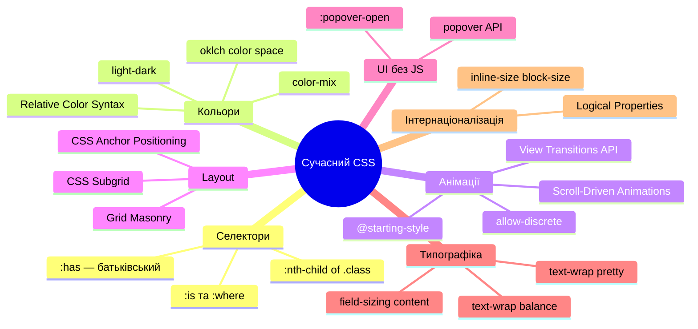

# Сучасний CSS 2023–2025: Нові можливості

## CSS розвивається швидше, ніж будь-коли

Якщо ви вивчали CSS п'ять років тому і думаєте, що знаєте мову — вас очікує приємний сюрприз. Починаючи з 2023 року, CSS отримав більше нових можливостей, ніж за попередні десять років разом узяті. Interop 2022–2024 — спільний проєкт Chrome, Firefox та Safari щодо синхронізованої підтримки стандартів — прискорив впровадження десятків специфікацій.

Ця стаття — не "як писати CSS". Це "що CSS вміє зараз, чого не вмів раніше". Деякі з цих можливостей замінять ваш JavaScript. Деякі — ваш Sass. Деякі — просто відкриють нові дизайнерські рішення, що раніше були неможливі.

Розглянемо можливості, згруповані за тим, яку **проблему** вони вирішують.

---

## Проблема 1: "Батьківський селектор" — 15 років очікування

Протягом усієї історії CSS існував запит, якому відмовляли: вибрати батьківський елемент залежно від його дочірніх. Як стилізувати `<li>`, якщо він містить `<ul>` (тобто є вкладеним пунктом)? Як стилізувати `<label>`, якщо його `<input>` має фокус?

Відповідь завжди була: "через JavaScript". До 2023 року.

### `:has()` — Relational Pseudo-class

`:has()` — найважливіший CSS-селектор за останнє десятиліття. Він дозволяє вибрати елемент залежно від **наявності певних нащадків або сусідів**. Через це його неофіційно називають "батьківський селектор", хоча насправді він ширший.

**Підтримка:** Chrome 105+, Firefox 121+, Safari 15.4+

```css
/* Стилізуй <li>, якщо він містить <ul> — вкладений список */
li:has(> ul) {
    font-weight: bold;
    border-left: 3px solid #6366f1;
}

/* Стилізуй <label>, якщо його input у стані :focus */
label:has(+ input:focus) {
    color: #6366f1;
}

/* Стилізуй <form>, якщо у ньому є хоча б один невалідний input */
form:has(input:invalid) {
    border: 2px solid #ef4444;
}

/* <article> має зображення — дай йому особливий layout */
article:has(img) {
    display: grid;
    grid-template-columns: 200px 1fr;
}

/* Стилізуй картку-контейнер, якщо у ній більше 3 елементів */
.grid:has(> :nth-child(3)) {
    grid-template-columns: repeat(3, 1fr);
}
```

Логіка роботи: `.a:has(.b)` означає "вибрати `.a`, якщо в ньому є `.b`". Усередині `:has()` можна використовувати будь-який валідний CSS-селектор, включаючи `>`, `~`, `+` та складені селектори.

### `:has()` як умовний CSS без JavaScript

До появи `:has()` перемикання класів на батьківських елементах вимагало JavaScript. Тепер це можна робити через CSS, реагуючи на стани дочірніх елементів:

::html-preview

```html
<div class="card-showcase">
    <div class="smart-card">
        <div class="smart-card__media">
            
        </div>
        <div class="smart-card__body">
            <h3>Картка зі зображенням</h3>
            <p>:has(img) — горизонтальний layout</p>
        </div>
    </div>
    <div class="smart-card">
        <div class="smart-card__body">
            <h3>Картка без зображення</h3>
            <p>Без img — вертикальний layout. :has() визначає різницю автоматично.</p>
        </div>
    </div>
    <label class="smart-label">
        Ім'я
        <input type="text" placeholder="Введіть ім'я" />
    </label>
    <label class="smart-label">
        Email
        <input type="email" placeholder="test@example.com" />
    </label>
</div>
```

```css
.card-showcase {
    display: flex;
    flex-direction: column;
    gap: 0.75rem;
    padding: 1.25rem;
    background: #f8fafc;
    border-radius: 12px;
    font-family: system-ui, sans-serif;
}

/* За замовчуванням — вертикальний layout */
.smart-card {
    background: white;
    border-radius: 10px;
    border: 1px solid #e2e8f0;
    overflow: hidden;
}

/* :has(img) — перемикає на горизонтальний layout БЕЗ JS */
.smart-card:has(img) {
    display: grid;
    grid-template-columns: 120px 1fr;
}

.smart-card:has(img) .smart-card__media img {
    width: 100%;
    height: 100%;
    object-fit: cover;
    display: block;
}

.smart-card__body {
    padding: 0.9rem;
}

.smart-card__body h3 {
    margin: 0 0 0.25rem;
    font-size: 0.9rem;
    color: #1e293b;
}

.smart-card__body p {
    margin: 0;
    font-size: 0.78rem;
    color: #64748b;
    line-height: 1.4;
}

/* Label підсвічується при фокусі вкладеного input */
.smart-label {
    display: flex;
    flex-direction: column;
    gap: 0.3rem;
    font-size: 0.82rem;
    font-weight: 600;
    color: #374151;
    transition: color 0.15s;
}

/* :has(:focus) — батьківський label реагує на дочірній input */
.smart-label:has(input:focus) {
    color: #6366f1;
}

.smart-label input {
    padding: 0.5rem 0.75rem;
    border: 1.5px solid #d1d5db;
    border-radius: 7px;
    font-size: 0.875rem;
    font-family: inherit;
    outline: none;
    transition:
        border-color 0.15s,
        box-shadow 0.15s;
}

.smart-label:has(input:focus) input {
    border-color: #6366f1;
    box-shadow: 0 0 0 3px rgba(99, 102, 241, 0.15);
}
```

::

### `:is()` та `:where()` — спрощення складних селекторів

Поки `:has()` — найгучніша новинка, `:is()` та `:where()` також суттєво спрощують CSS:

```css
/* Без :is() — довгий список */
h1 a,
h2 a,
h3 a,
h4 a,
h5 a,
h6 a {
    color: inherit;
}

/* З :is() — коротко і зрозуміло */
:is(h1, h2, h3, h4, h5, h6) a {
    color: inherit;
}

/* :is() наслідує специфічність найбільш специфічного аргументу */
/* :where() — специфічність завжди 0, легко перевизначити */
:where(h1, h2, h3) {
    line-height: 1.2; /* Специфічність: 0,0,0 — легко перевизначити */
}
```

`:where()` ідеальний для CSS Reset та базових стилів — вони не будуть конфліктувати зі стилями компонентів.

---

## Проблема 2: Анімація при появі/зникненні елементів

Протягом десятиліть розробники використовували JavaScript, щоб анімувати появу та зникнення елементів — бо CSS не міг анімувати `display: none ↔ block`. Тепер ситуація змінилась.

### `@starting-style` — анімація при першій появі

`@starting-style` дозволяє визначити **початковий стан** елемента саме для моменту його першої появи в DOM або переходу з `display: none`. Без `@starting-style` transition не спрацьовував — браузер не міг інтерполювати "від нічого".

**Підтримка:** Chrome 117+, Firefox 129+, Safari 17.5+

```css
.dialog {
    opacity: 1;
    transform: scale(1) translateY(0);
    transition:
        opacity 0.3s ease,
        transform 0.3s ease,
        display 0.3s ease allow-discrete; /* Вказуємо дискретне display */
}

/* Кінцевий стан при [hidden] або display:none */
.dialog[hidden] {
    opacity: 0;
    transform: scale(0.95) translateY(10px);
    display: none;
}

/* Початковий стан при ПОЯВІ (before-open state) */
@starting-style {
    .dialog {
        opacity: 0;
        transform: scale(0.95) translateY(10px);
    }
}
```

### `overlay` та `allow-discrete` — анімація `display`

Нова властивість `transition-behavior: allow-discrete` дозволяє анімувати дискретні (непоступові) властивості: `display`, `visibility`, `overlay`. Без неї `display: none` вмикалося миттєво, ламаючи анімацію виходу.

```css
.tooltip {
    opacity: 1;
    display: block;
    /* allow-discrete: transition чекає завершення перед застосуванням display:none */
    transition:
        opacity 0.2s ease,
        display 0.2s allow-discrete;
}

.tooltip.hidden {
    opacity: 0;
    display: none; /* Тепер чекатиме завершення opacity-transition */
}

@starting-style {
    .tooltip {
        opacity: 0; /* Стартує з прозорого при появі */
    }
}
```

::html-preview

```html
<div class="starting-style-demo">
    <button class="demo-btn js-toggle">Показати/сховати блок</button>
    <div class="animated-box" id="animBox">
        <p>✨ Цей блок анімується через CSS @starting-style + allow-discrete</p>
        <p style="font-size:0.8rem;opacity:0.7">Без жодного JavaScript для анімації!</p>
    </div>
</div>
<script>
    document.querySelector('.js-toggle').addEventListener('click', () => {
        const box = document.getElementById('animBox')
        box.classList.toggle('hidden')
    })
</script>
```

```css
.starting-style-demo {
    padding: 1.25rem;
    background: #f8fafc;
    border-radius: 12px;
    font-family: system-ui, sans-serif;
    display: flex;
    flex-direction: column;
    gap: 0.75rem;
}

.demo-btn {
    padding: 0.55rem 1.1rem;
    background: #6366f1;
    color: white;
    border: none;
    border-radius: 7px;
    font-size: 0.875rem;
    font-weight: 600;
    cursor: pointer;
    font-family: inherit;
    align-self: flex-start;
}

.animated-box {
    background: white;
    border: 1px solid #e2e8f0;
    border-radius: 10px;
    padding: 1rem;
    color: #334155;

    /* Transition включає display через allow-discrete */
    transition:
        opacity 0.35s ease,
        transform 0.35s cubic-bezier(0.34, 1.3, 0.64, 1),
        display 0.35s allow-discrete;
    opacity: 1;
    transform: translateY(0) scale(1);
    display: block;
}

/* Стан "схований" */
.animated-box.hidden {
    opacity: 0;
    transform: translateY(-10px) scale(0.97);
    display: none;
}

/* Початковий стан при появі — браузер анімує від цього до базового */
@starting-style {
    .animated-box {
        opacity: 0;
        transform: translateY(-10px) scale(0.97);
    }
}
```

::

---

## Проблема 3: Анімація прив'язана до скролу

Раніше будь-яка анімація "при скролі" (parallax, sticky progress bar, reveal effects) вимагала JavaScript: `IntersectionObserver`, `scroll` event listener, бібліотеки типу GSAP. Тепер — тільки CSS.

### Scroll-Driven Animations

**Scroll-Driven Animations** — одна з найпотужніших CSS-специфікацій 2023 року. Вона дозволяє пов'язати прогрес CSS-анімації зі скролом сторінки або контейнера.

**Підтримка:** Chrome 115+, Firefox 110+ (за прапором до 130), Safari 18+

Є два типи таймлайнів:

**`scroll()`** — прогрес анімації = позиція скролу контейнера:

```css
@keyframes progress-fill {
    from {
        width: 0%;
    }
    to {
        width: 100%;
    }
}

.reading-progress {
    position: fixed;
    top: 0;
    left: 0;
    height: 4px;
    background: #6366f1;
    /* animation-timeline прив'язаний до скролу :root */
    animation: progress-fill linear;
    animation-timeline: scroll(root);
    animation-fill-mode: both;
}
```

**`view()`** — прогрес анімації = видимість елемента у viewport:

```css
@keyframes fade-up {
    from {
        opacity: 0;
        transform: translateY(30px);
    }
    to {
        opacity: 1;
        transform: translateY(0);
    }
}

.section {
    /* Анімується, коли section входить у viewport */
    animation: fade-up linear both;
    animation-timeline: view();
    /* Запуск при входженні в 10-40% viewport */
    animation-range: entry 0% cover 30%;
}
```

Зверніть: без `animation-duration` — тривалість визначається скролом, а не часом. Це принципово нова концепція: анімація не "грає" — вона "скрубується" пальцем.

### `animation-timeline` з іменованими таймлайнами

Для більш складних сценаріїв — прокрутка дочірнього контейнера анімує батьківський елемент:

```css
/* Контейнер реєструє себе як scroll timeline */
.carousel {
    overflow-x: scroll;
    scroll-timeline-name: --carousel-scroll;
    scroll-timeline-axis: x;
}

/* Індикатор реагує на прокрутку карусельного контейнера */
.carousel-indicator {
    animation: indicator-grow linear;
    animation-timeline: --carousel-scroll;
}

@keyframes indicator-grow {
    from {
        width: 0;
    }
    to {
        width: 100%;
    }
}
```

---

## Проблема 4: Tooltip та Popover без JavaScript-позиціонування

Позиціонування tooltip, popover, dropdown відносно trigger-елемента завжди вимагало JavaScript: обчислення координат, обробка виходу за межі viewport, `getBoundingClientRect()`. CSS Anchor Positioning вирішує це нативно.

### CSS Anchor Positioning

**CSS Anchor Positioning** дозволяє позиціонувати один елемент відносно іншого ("якоря") — навіть якщо вони знаходяться в різних місцях DOM.

**Підтримка:** Chrome 125+, Chromium-браузери. Firefox та Safari — в розробці.

```css
/* Крок 1: зареєструвати якір */
.trigger-button {
    anchor-name: --my-anchor;
}

/* Крок 2: позиціонувати tooltip відносно якоря */
.tooltip {
    position: absolute;
    position-anchor: --my-anchor;

    /* Розмістити знизу-по-центру якоря */
    top: anchor(bottom);
    left: anchor(center);
    transform: translateX(-50%);
}
```

Магія: `anchor(bottom)` повертає координату нижньої межі якірного елемента. Доступні `anchor(top)`, `anchor(right)`, `anchor(left)`, `anchor(center)`, `anchor(start)`, `anchor(end)`.

### Автоматична зміна позиції через `@position-try`

Найцікавіша частина — `@position-try`. Якщо tooltip виходить за межі viewport — браузер автоматично пробує альтернативні позиції:

```css
@position-try --flip-up {
    /* Якщо знизу немає місця — показати зверху */
    top: auto;
    bottom: anchor(top);
}

.tooltip {
    position: absolute;
    position-anchor: --my-anchor;
    top: anchor(bottom);
    left: anchor(center);

    /* Автоматично flip, якщо не вміщується знизу */
    position-try-fallbacks: --flip-up;
}
```

Це замінює сотні рядків JavaScript у бібліотеках типу Floating UI та Popper.js.

---

## Проблема 5: Кольори, що "розуміють" контекст

### `color-mix()` — змішування кольорів у CSS

До `color-mix()` не можна було "затемнити колір на 20%" без JavaScript або Sass. Тепер:

**Підтримка:** Chrome 111+, Firefox 113+, Safari 16.2+

```css
:root {
    --brand: #6366f1;

    /* Затемнений варіант: 80% brand + 20% чорний */
    --brand-dark: color-mix(in srgb, var(--brand) 80%, black);

    /* Освітлений: 70% brand + 30% білий */
    --brand-light: color-mix(in srgb, var(--brand) 70%, white);

    /* Напівпрозорий: 50% brand + 50% transparent */
    --brand-20: color-mix(in srgb, var(--brand) 20%, transparent);
}

/* Динамічний hover без Sass */
.btn-primary {
    background: var(--brand);
}
.btn-primary:hover {
    background: color-mix(in srgb, var(--brand) 85%, black);
}
```

Простір кольорів `in srgb` можна замінити на `in oklch`, `in hsl`, `in display-p3` — різні простори дають різний результат змішування, деякі більш "природні" для людського зору.

### `light-dark()` — автоматичний вибір для темної/світлої теми

`light-dark()` — чистий CSS-синтаксис для оголошення двох значень: одне для light, інше для dark тем. Замінює громіздкі `@media` блоки:

**Підтримка:** Chrome 123+, Firefox 120+, Safari 17.5+

```css
/* Увімкнути підтримку color-scheme */
:root {
    color-scheme: light dark;
}

.card {
    /* light-dark(світле_значення, темне_значення) */
    background: light-dark(#ffffff, #1e293b);
    color: light-dark(#0f172a, #f1f5f9);
    border-color: light-dark(#e2e8f0, #334155);
}

.btn-primary {
    background: light-dark(#6366f1, #818cf8);
    color: light-dark(white, #1e293b);
}
```

Без жодного `@media (prefers-color-scheme: dark)` блоку. Один рядок — дві теми.

### Relative Color Syntax — відносне перетворення кольорів

Відносний синтаксис кольорів дозволяє взяти існуючий колір і **модифікувати окремі канали**:

**Підтримка:** Chrome 119+, Safari 16.4+, Firefox 128+

```css
:root {
    --brand: #6366f1;
}

.element {
    /* Взяти --brand, перевести в hsl, змінити тільки lightness */
    background: hsl(from var(--brand) h s 80%);

    /* Взяти --brand в oklch, зробити прозорим на 50% */
    border-color: oklch(from var(--brand) l c h / 50%);

    /* Зменшити насиченість у два рази */
    color: hsl(from var(--brand) h calc(s / 2) l);
}
```

Де `h`, `s`, `l` — це автоматично розкладені канали вихідного кольору. Тепер генерація палітр — чистий CSS.

::html-preview

```html
<div class="color-demo">
    <p class="color-demo__title">color-mix() та light-dark() в дії</p>
    <div class="color-swatches">
        <div class="swatch swatch--brand">Brand<br />#6366f1</div>
        <div class="swatch swatch--dark">+20% black</div>
        <div class="swatch swatch--light">+30% white</div>
        <div class="swatch swatch--alpha">20% alpha</div>
        <div class="swatch swatch--muted">Muted hsl</div>
    </div>
    <div class="light-dark-card">
        <span>light-dark() автоматична тема</span>
        <small>Кольори змінюються залежно від OS</small>
    </div>
</div>
```

```css
:root {
    color-scheme: light dark;
    --brand: #6366f1;
}

.color-demo {
    padding: 1.25rem;
    background: #f8fafc;
    border-radius: 12px;
    font-family: system-ui, sans-serif;
    display: flex;
    flex-direction: column;
    gap: 0.75rem;
}

.color-demo__title {
    margin: 0;
    font-size: 0.85rem;
    font-weight: 700;
    color: #334155;
}

.color-swatches {
    display: flex;
    gap: 0.5rem;
    flex-wrap: wrap;
}

.swatch {
    padding: 0.75rem;
    border-radius: 8px;
    font-size: 0.72rem;
    font-weight: 700;
    color: white;
    text-align: center;
    line-height: 1.3;
    min-width: 80px;
}

.swatch--brand {
    background: var(--brand);
}
.swatch--dark {
    background: color-mix(in srgb, var(--brand) 80%, black);
}
.swatch--light {
    background: color-mix(in srgb, var(--brand) 70%, white);
    color: #4338ca;
}
.swatch--alpha {
    background: color-mix(in srgb, var(--brand) 20%, transparent);
    color: #4338ca;
    border: 1px solid #c7d2fe;
}
.swatch--muted {
    background: hsl(from var(--brand) h s 85%);
    color: #4338ca;
}

.light-dark-card {
    background: light-dark(#ede9fe, #1e1b4b);
    color: light-dark(#4338ca, #a5b4fc);
    border: 1px solid light-dark(#c7d2fe, #312e81);
    border-radius: 8px;
    padding: 0.75rem 1rem;
    display: flex;
    flex-direction: column;
    gap: 0.2rem;
}

.light-dark-card span {
    font-size: 0.875rem;
    font-weight: 600;
}
.light-dark-card small {
    font-size: 0.75rem;
    opacity: 0.7;
}
```

::

---

## Проблема 6: Popover без JavaScript

HTML `popover` атрибут + CSS `:popover-open` — нативний механізм для tooltip, dropdown, modal без жодного JavaScript для базового відкриття/закриття.

**Підтримка:** Chrome 114+, Firefox 125+, Safari 17+

```html
<!-- popovertarget вказує id popover-елемента -->
<button popovertarget="my-menu">Відкрити меню</button>

<!-- popover="auto": закривається при кліку поза ним -->
<div id="my-menu" popover="auto">
    <ul>
        <li><a href="#">Пункт 1</a></li>
        <li><a href="#">Пункт 2</a></li>
    </ul>
</div>
```

```css
/* Стилізація закритого стану */
[popover] {
    border: 1px solid #e2e8f0;
    border-radius: 10px;
    padding: 0.5rem;
    box-shadow: 0 8px 24px rgba(0, 0, 0, 0.12);

    /* Анімація появи через @starting-style */
    transition:
        opacity 0.2s ease,
        transform 0.2s ease,
        display 0.2s allow-discrete,
        overlay 0.2s allow-discrete;
    opacity: 1;
    transform: translateY(0);
}

/* Закритий стан */
[popover]:not(:popover-open) {
    opacity: 0;
    transform: translateY(-8px);
    display: none;
}

/* Початковий стан анімації при появі */
@starting-style {
    [popover]:popover-open {
        opacity: 0;
        transform: translateY(-8px);
    }
}
```

`popover="auto"` — один попап за раз, закривається при кліку поза ним або Escape. `popover="manual"` — повний контроль вручну. Жодного `event.stopPropagation()`, жодних `document.addEventListener('click')`.

---

## Проблема 7: Плавні переходи між сторінками

### View Transitions API

**View Transitions** — CSS-механізм для плавних переходів між **різними станами DOM**. Спочатку розроблявся для SPA, але тепер підтримує і звичайні навігації між HTML-сторінками (Cross-Document View Transitions).

**Підтримка (Same-Document):** Chrome 111+, Safari 18+, Firefox 130+

```javascript
// Same-Document: анімований перехід між станами
document.startViewTransition(() => {
    // Будь-яке DOM-оновлення тут
    mainContent.innerHTML = newPageHTML
})
```

```css
/* За замовчуванням — cross-fade. Можна кастомізувати: */
::view-transition-old(root) {
    animation: slide-out 0.3s ease-in forwards;
}

::view-transition-new(root) {
    animation: slide-in 0.3s ease-out forwards;
}

@keyframes slide-out {
    to {
        transform: translateX(-100%);
    }
}

@keyframes slide-in {
    from {
        transform: translateX(100%);
    }
}
```

Для конкретних елементів — іменовані view-transition:

```css
.product-card {
    /* Цей елемент матиме плавну морфінг-анімацію між сторінками */
    view-transition-name: product-hero;
    contain: layout;
}
```

При переході на сторінку деталей товару — картка "перетікає" в hero-зображення. Як у нативних iOS-застосунках, але засобами CSS та HTML.

### Cross-Document View Transitions (MPA)

**Підтримка:** Chrome 126+

```css
/* У CSS — вмикаємо для всіх переходів між сторінками сайту */
@view-transition {
    navigation: auto;
}
```

Один рядок CSS — і всі переходи між сторінками вашого сайту стають плавними cross-fade. Без жодного JavaScript, без SPA.

---

## Проблема 8: Масонрі-Layout нарешті нативний

Masonry layout (_мозаїчна сітка_, як на Pinterest) — перпендикулярна сітка, де елементи різної висоти "заповнюють" простір. Роками це вимагало JavaScript-бібліотек.

### CSS Grid Masonry

**Підтримка:** Firefox 126+ (через `layout.css.grid-template-masonry-value.enabled`), Safari Technology Preview, Chrome — в Origin Trial

```css
.masonry-grid {
    display: grid;
    grid-template-columns: repeat(3, 1fr);
    /* masonry — нове ключове слово для grid-template-rows */
    grid-template-rows: masonry;
    gap: 1rem;
}
```

Один рядок замість сотень рядків JavaScript. Елементи автоматично розміщуються у "колонки", заповнюючи вільний простір.

---

## Проблема 9: Стилізація що завгодно

### `:nth-child()` з фільтром за класом

Оновлений `:nth-child()` тепер приймає **аргумент-фільтр**:

```css
/* Раніше: nth-child рахував всіх дітей, навіть з іншими класами */
.list > li:nth-child(2n) {
    /* рахує ВСІ li, включаючи .special */
}

/* Тепер: рахуємо тільки .post серед братів */
.list > li:nth-child(2n of .post) {
    background: #f0fdf4;
}
```

Це вирішує давню проблему: якщо між `.post` елементами є інші елементи — старий `:nth-child` рахував їх, що ламало логіку.

### CSS `text-wrap: balance` та `text-wrap: pretty`

Кінець "сироти" на останньому рядку тексту:

**Підтримка:** Chrome 114+ (balance), Chrome 117+ (pretty)

```css
/* Балансує розподіл тексту по рядках — заголовки */
h1,
h2,
h3 {
    text-wrap: balance; /* Max 4 рядки для продуктивності */
}

/* Запобігає одиночним словам наприкінці — для параграфів */
p {
    text-wrap: pretty;
}
```

::html-preview

```html
<div class="textwrap-demo">
    <div class="tw-col">
        <p class="tw-label">Без text-wrap</p>
        <h3 class="tw-heading tw-heading--normal">Заголовок що може мати нерівний розподіл по рядках</h3>
    </div>
    <div class="tw-col">
        <p class="tw-label">text-wrap: balance</p>
        <h3 class="tw-heading tw-heading--balance">Заголовок що може мати нерівний розподіл по рядках</h3>
    </div>
    <div class="tw-col">
        <p class="tw-label">text-wrap: pretty</p>
        <p class="tw-text tw-text--pretty">
            Довгий параграф що демонструє як text-wrap pretty запобігає появі одинокого слова на останньому рядку
            тексту.
        </p>
    </div>
</div>
```

```css
.textwrap-demo {
    display: grid;
    grid-template-columns: repeat(3, 1fr);
    gap: 1rem;
    padding: 1.25rem;
    background: #f8fafc;
    border-radius: 12px;
    font-family: system-ui, sans-serif;
}

.tw-col {
    background: white;
    border-radius: 8px;
    padding: 0.9rem;
    border: 1px solid #e2e8f0;
}

.tw-label {
    margin: 0 0 0.5rem;
    font-size: 0.72rem;
    color: #6366f1;
    font-weight: 700;
    text-transform: uppercase;
    letter-spacing: 0.04em;
}

.tw-heading {
    margin: 0;
    font-size: 1rem;
    color: #1e293b;
    line-height: 1.3;
}

.tw-heading--balance {
    text-wrap: balance;
}

.tw-text {
    margin: 0;
    font-size: 0.875rem;
    color: #374151;
    line-height: 1.5;
}

.tw-text--pretty {
    text-wrap: pretty;
}
```

::

### `field-sizing: content` — поле що росте з текстом

```css
textarea {
    field-sizing: content; /* Розміщується за вмістом */
    max-height: 300px; /* Але не більше */
    overflow-y: auto;
}
```

**Підтримка:** Chrome 123+. Раніше — тільки через JavaScript `auto-resize textarea`.

---

## Проблема 10: Логічні властивості та Subgrid

### CSS Logical Properties — інтернаціоналізація

Замість `margin-left`/`margin-right` — `margin-inline-start`/`margin-inline-end`. Ці властивості **адаптуються** до напрямку тексту (LTR/RTL):

```css
/* Замість: */
.element {
    margin-left: 1rem; /* ❌ Зламається в RTL (арабська, іврит) */
}

/* Використовуйте: */
.element {
    margin-inline-start: 1rem; /* ✅ LTR = зліва, RTL = справа */
}

/* Таблиця відповідностей: */
/* margin-top    → margin-block-start  */
/* margin-bottom → margin-block-end    */
/* margin-left   → margin-inline-start */
/* margin-right  → margin-inline-end   */
/* width         → inline-size         */
/* height        → block-size          */
```

### CSS Subgrid — вирівнювання вкладених сіток

**Subgrid** дозволяє вкладеним елементам Grid **успадковувати** треки батьківської сітки — вирівнювати елементи у картках незалежно від їх вмісту:

**Підтримка:** Chrome 117+, Firefox 71+, Safari 16+

```css
.cards-grid {
    display: grid;
    grid-template-columns: repeat(3, 1fr);
    grid-template-rows: auto;
}

.card {
    display: grid;
    /* Успадкувати рядки від батьківської сітки */
    grid-row: span 3;
    grid-template-rows: subgrid;
}

/* Тепер всі .card__header вирівняні між картками,
   навіть якщо заголовки різної довжини */
.card__header {
}
.card__body {
}
.card__footer {
}
```

::html-preview

```html
<div class="subgrid-demo">
    <div class="sub-card">
        <div class="sub-card__header">Короткий заголовок</div>
        <div class="sub-card__body">Текст однакової висоти у всіх картках завдяки subgrid.</div>
        <div class="sub-card__footer"><button class="sub-btn">Дія</button></div>
    </div>
    <div class="sub-card">
        <div class="sub-card__header">Дуже довгий заголовок що займає кілька рядків і збільшує висоту</div>
        <div class="sub-card__body">Текст тут теж вирівняний.</div>
        <div class="sub-card__footer"><button class="sub-btn">Дія</button></div>
    </div>
    <div class="sub-card">
        <div class="sub-card__header">Середній заголовок</div>
        <div class="sub-card__body">
            Кнопки в нижній частині <strong>завжди на одному рівні</strong> — незалежно від контенту вище.
        </div>
        <div class="sub-card__footer"><button class="sub-btn">Дія</button></div>
    </div>
</div>
```

```css
.subgrid-demo {
    display: grid;
    grid-template-columns: repeat(3, 1fr);
    grid-template-rows: auto;
    gap: 1rem;
    padding: 1.25rem;
    background: #f8fafc;
    border-radius: 12px;
    font-family: system-ui, sans-serif;
    align-items: start;
}

.sub-card {
    background: white;
    border-radius: 10px;
    border: 1px solid #e2e8f0;
    overflow: hidden;

    /* Subgrid: 3 рядки від батька */
    display: grid;
    grid-row: span 3;
    grid-template-rows: subgrid;
}

.sub-card__header {
    padding: 0.9rem;
    border-bottom: 1px solid #f1f5f9;
    font-weight: 700;
    font-size: 0.9rem;
    color: #1e293b;
    line-height: 1.3;
}

.sub-card__body {
    padding: 0.9rem;
    font-size: 0.82rem;
    color: #64748b;
    line-height: 1.5;
}

.sub-card__footer {
    padding: 0.9rem;
    border-top: 1px solid #f1f5f9;
    display: flex;
    align-items: center;
}

.sub-btn {
    padding: 0.4rem 0.9rem;
    background: #6366f1;
    color: white;
    border: none;
    border-radius: 6px;
    font-size: 0.8rem;
    font-weight: 600;
    cursor: pointer;
    font-family: inherit;
}
```

::

---

## Таблиця підтримки: що використовувати зараз

| Функція                  | Chrome | Firefox | Safari  | Безпечно в продакшні? |
| ------------------------ | ------ | ------- | ------- | --------------------- |
| `:has()`                 | 105+   | 121+    | 15.4+   | ✅ Так                |
| `color-mix()`            | 111+   | 113+    | 16.2+   | ✅ Так                |
| `light-dark()`           | 123+   | 120+    | 17.5+   | ✅ Так                |
| `@layer`                 | 99+    | 97+     | 15.4+   | ✅ Так                |
| CSS Nesting              | 112+   | 117+    | 17.2+   | ✅ Так                |
| `text-wrap: balance`     | 114+   | 121+    | 17.4+   | ✅ Так                |
| Container Queries        | 105+   | 110+    | 16+     | ✅ Так                |
| Subgrid                  | 117+   | 71+     | 16+     | ✅ Так                |
| `@starting-style`        | 117+   | 129+    | 17.5+   | ⚠️ Майже              |
| `popover` API            | 114+   | 125+    | 17+     | ⚠️ Майже              |
| Relative Color Syntax    | 119+   | 128+    | 16.4+   | ⚠️ Майже              |
| Scroll-Driven Animations | 115+   | 110+\*  | 18+     | ⚠️ Перевіряйте        |
| CSS Anchor Positioning   | 125+   | —       | —       | ⚠️ Тільки Chrome      |
| View Transitions (SPA)   | 111+   | 130+    | 18+     | ⚠️ Майже              |
| View Transitions (MPA)   | 126+   | —       | 18+     | ⚠️ Progressive        |
| `field-sizing: content`  | 123+   | —       | —       | ⚠️ Тільки Chrome      |
| Grid Masonry             | —      | 126+\*  | Preview | ❌ Ще рано            |

_\* — за прапором або в Origin Trial_

---

## Progressive Enhancement: нові функції без ризику

Нові CSS-функції можна використовувати **безпечно** через `@supports` — старіші браузери просто ігнорують невідомі блоки:

```css
/* Базовий стиль — для всіх */
.card {
    display: flex;
    flex-direction: column;
}

/* Покращення для браузерів з підтримкою :has() */
@supports selector(:has(img)) {
    .card:has(img) {
        flex-direction: row;
    }
}

/* Покращення для Scroll-Driven Animations */
@supports (animation-timeline: scroll()) {
    .reading-progress {
        animation: progress-fill linear;
        animation-timeline: scroll(root);
    }
}

/* Покращення для color-mix() */
@supports (color: color-mix(in srgb, red, blue)) {
    .btn:hover {
        background: color-mix(in srgb, var(--accent) 85%, black);
    }
}
```

Ключовий принцип: нові CSS-функції додають **покращення**, а не критичну функціональність. Базовий досвід має працювати скрізь.

---

## Mindmap: нові можливості CSS 2023–2025

::mermaid



::

---

## Завдання для самоперевірки

::accordion

::accordion-item{label="Рівень 1: Базовий — Нові селектори та кольори"}

**Завдання 1.1.** Реалізуйте форму логіну де:

- Label підсвічується при фокусі вкладеного `input` — через `:has(input:focus)` без JavaScript
- Кнопка підтвердження стає активною (змінює колір) коли обидва поля `input:not(:placeholder-shown)` — через `:has(input:placeholder-shown)` і заперечення

**Завдання 1.2.** Побудуйте палітру кольорів через `color-mix()`:

- Базовий колір: `#6366f1`
- 5 відтінків від `+40% white` до `+40% black` через CSS Custom Properties та `color-mix()`
- Автоматично адаптується до dark mode через `light-dark()`

**Завдання 1.3.** Реалізуйте список блогів де `:nth-child(2n of .post)` підсвічує кожен другий пост іншим кольором — але `.pinned` пости при підрахунку ігноруються.

::

::accordion-item{label="Рівень 2: Логіка — Анімації та Popover"}

**Завдання 2.1. Animated Popover Menu.**
Реалізуйте навігаційне меню:

- HTML `popover` атрибут (без JS для відкриття/закриття)
- Анімація появи через `@starting-style` + `allow-discrete`
- Анімація зникнення (fade-out + slide-up)
- CSS Anchor Positioning (якщо браузер підтримує) або `position: absolute` як fallback

**Завдання 2.2. Scroll Progress Indicator.**

- Смуга прогресу читання зверху сторінки через Scroll-Driven Animations
- `@supports (animation-timeline: scroll())` для Progressive Enhancement
- Fallback: `position: sticky` + JavaScript для старших браузерів

**Завдання 2.3.** Порівняйте код "до" та "після" для трьох сценаріїв:

1. Підсвічення label при фокусі input: jQuery `$('input').on('focus', ...)` → `:has()`
2. Генерація кольорів: Sass `darken($color, 20%)` → `color-mix(in srgb, var(--brand) 80%, black)`
3. View Transitions: React Router анімації → CSS `view-transition-name`

::

::accordion-item{label="Рівень 3: Архітектура — Сучасний CSS стек"}

**Завдання 3.1 (Міні-проєкт). Сторінка продукту з усім сучасним CSS.**

Реалізуйте сторінку картки продукту із застосуванням:

1. **`:has()`** — картка змінює layout якщо є зображення/відео
2. **`color-mix()` + `light-dark()`** — автоматична тема, палітра з одного кольору
3. **`@starting-style`** — анімований попап деталей (без JS відкриття)
4. **Scroll-Driven Animations** — hero секція із parallax-ефектом (через `view()`)
5. **CSS Subgrid** — сітка товарів із вирівняними кнопками
6. **`text-wrap: balance`** — заголовки та `pretty` для описів
7. **`@supports`** — graceful degradation для Anchor Positioning
8. **View Transitions** — плавний перехід при кліці "Детальніше"

Структура:

```
index.html          → список товарів із Subgrid
product.html        → деталі товару
styles/
    tokens.css      → --brand + color-mix палітра
    layout.css      → @layer layout з Subgrid
    animations.css  → @layer animations, @starting-style
    modern.css      → :has(), text-wrap, field-sizing
```

::

::

---

_Попередня стаття: [CSS Custom Properties. Методології. Сучасний CSS](/12.html-css/18.css-variables-methodologies)_
