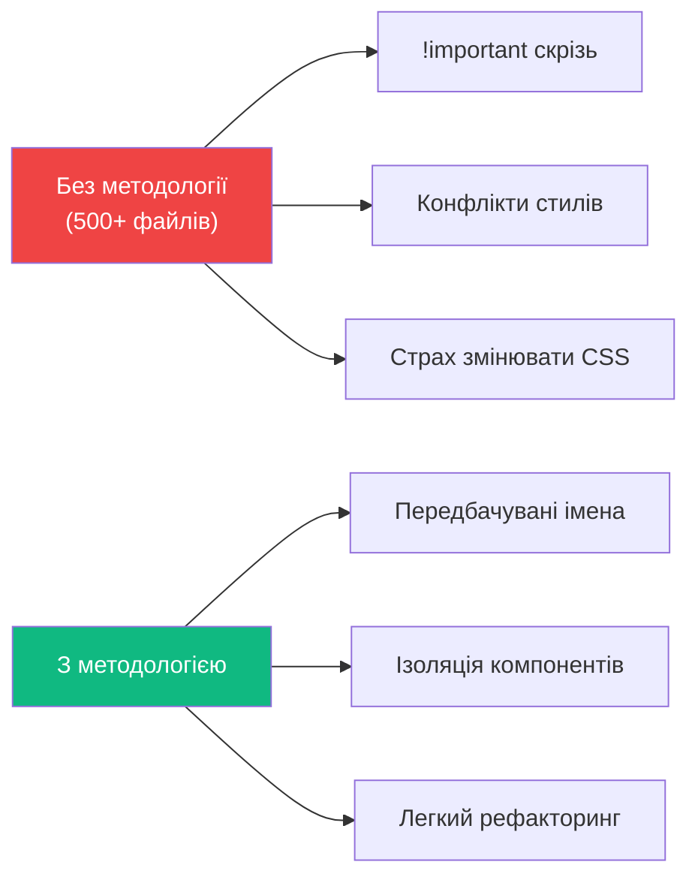
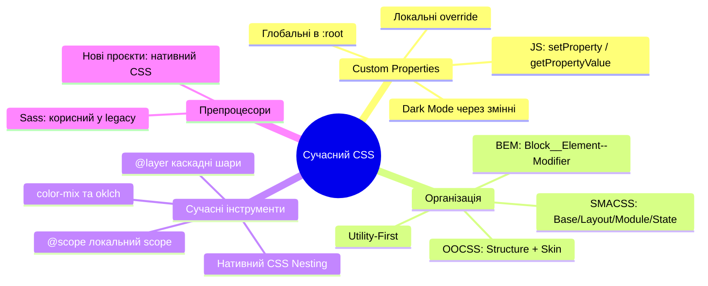

# CSS Custom Properties. Методології. Сучасний CSS

## Як великі команди пишуть CSS без хаосу?

Уявіть: сайт на 50 сторінках, команда з 8 розробників, і дизайнер змінює основний колір бренду. Без системи — це 200 правок у 40 файлах вручну, і гарантовано кілька пропущених місць. Із правильно налаштованими CSS Custom Properties — одна зміна в `:root`, і весь сайт оновлений.

Але змінні — лише частина відповіді. Друга частина — **методологія**: спільні правила іменування та організації CSS, завдяки яким код залишається зрозумілим через рік і після того, як ти звільнився з команди.

У цій статті ми розглянемо CSS Custom Properties зсередини — не просто як "змінні", а як потужну систему з успадкуванням і динамічним оновленням. А потім — провідні методології: BEM, SMACSS, OOCSS і Utility-First.

---

## CSS Custom Properties — змінні нового рівня

**CSS Custom Properties** (_кастомні властивості_, або CSS-змінні) — це значення, оголошені розробником, що зберігаються у CSS-каскаді і можуть використовуватися в будь-якому місці через функцію `var()`.

На відміну від змінних у препроцесорах CSS (Sass, LESS), кастомні властивості:

- Живуть у **браузері** під час виконання, а не компілюються заздалегідь
- Підпорядковуються **каскаду та успадкуванню** — точно так само, як звичайні CSS-властивості
- Можуть змінюватися через **JavaScript**
- Можуть змінюватися залежно від **media queries**, **псевдокласів**, **контексту**

### Оголошення та використання

```css
/* Оголошення: ім'я завжди починається з -- */
:root {
    --color-primary: #6366f1;
    --color-primary-dark: #4f46e5;
    --space-sm: 0.5rem;
    --space-md: 1rem;
    --space-lg: 2rem;
    --radius: 8px;
    --font-body: system-ui, sans-serif;
}

/* Використання: var(--назва-змінної) */
.button {
    background: var(--color-primary);
    padding: var(--space-sm) var(--space-md);
    border-radius: var(--radius);
    font-family: var(--font-body);
}

.button:hover {
    background: var(--color-primary-dark);
}
```

Зверніть: `:root` — псевдоклас, що відповідає кореневому елементу документа (по суті `<html>`). Змінні, оголошені тут, доступні **скрізь** у CSS.

### Fallback-значення

`var()` приймає другий аргумент — запасне значення, якщо змінна не визначена:

```css
.element {
    /* Якщо --color-accent не визначена — використає #6366f1 */
    color: var(--color-accent, #6366f1);

    /* Вкладені fallback */
    padding: var(--space-md, var(--space-sm, 1rem));
}
```

Це особливо корисно у компонентах бібліотеки: компонент може мати власні дефолти, але дозволяти замінювати їх через змінні.

---

## Область видимості та успадкування

CSS Custom Properties підпорядковуються **каскаду CSS** — вони успадковуються від батьківських елементів до дочірніх. Це суттєво відрізняє їх від змінних Sass, які компілюються у статичні значення.

```css
/* Глобальні значення */
:root {
    --color: #1e293b;
    --bg: white;
}

/* Локальне перевизначення для конкретного контексту */
.dark-section {
    --color: #f1f5f9;
    --bg: #0f172a;
}

/* Всі дочірні елементи .dark-section отримають локальні значення */
.dark-section p {
    color: var(--color); /* #f1f5f9, бо успадкували від .dark-section */
    background: var(--bg);
}
```

::html-preview

```html
<div class="scope-demo">
    <div class="scope-card">
        <h3>Стандартна картка</h3>
        <p>Використовує глобальні --card-bg та --card-text</p>
        <button class="scope-btn">Кнопка</button>
    </div>
    <div class="scope-card scope-card--dark">
        <h3>Темна картка</h3>
        <p>Перевизначає --card-bg та --card-text локально</p>
        <button class="scope-btn">Кнопка</button>
    </div>
    <div class="scope-card scope-card--accent">
        <h3>Акцентна картка</h3>
        <p>Своє локальне значення --accent-color</p>
        <button class="scope-btn">Кнопка</button>
    </div>
</div>
```

```css
:root {
    --card-bg: #ffffff;
    --card-text: #1e293b;
    --card-border: #e2e8f0;
    --card-btn-bg: #6366f1;
}

.scope-demo {
    display: grid;
    grid-template-columns: repeat(3, 1fr);
    gap: 1rem;
    padding: 1rem;
    background: #f8fafc;
    border-radius: 12px;
    font-family: system-ui, sans-serif;
}

.scope-card {
    background: var(--card-bg);
    border: 1px solid var(--card-border);
    border-radius: 10px;
    padding: 1rem;
}

.scope-card h3 {
    margin: 0 0 0.4rem;
    font-size: 0.9rem;
    color: var(--card-text);
}

.scope-card p {
    margin: 0 0 0.75rem;
    font-size: 0.78rem;
    color: var(--card-text);
    opacity: 0.75;
    line-height: 1.4;
}

.scope-btn {
    padding: 0.4rem 0.75rem;
    background: var(--card-btn-bg);
    color: white;
    border: none;
    border-radius: 6px;
    font-size: 0.8rem;
    font-weight: 600;
    cursor: pointer;
    font-family: inherit;
}

.scope-card--dark {
    --card-bg: #1e293b;
    --card-text: #f1f5f9;
    --card-border: #334155;
    --card-btn-bg: #818cf8;
}

.scope-card--accent {
    --card-bg: #f0fdf4;
    --card-text: #166534;
    --card-border: #bbf7d0;
    --card-btn-bg: #16a34a;
}
```

::

Кожна картка використовує **одні й ті самі класи** (`.scope-btn`, `.scope-card h3`), але отримує різні значення завдяки локальному перевизначенню змінних на рівні `.scope-card--dark` та `.scope-card--accent`.

---

## Dark Mode через Custom Properties

Найпотужніше застосування кастомних властивостей — тема (light/dark mode). Замість тисяч рядків перевизначень у `@media (prefers-color-scheme: dark)`, достатньо змінити значення змінних в одному місці:

```css
/* Світла тема — за замовчуванням */
:root {
    --bg-base: #ffffff;
    --bg-surface: #f8fafc;
    --bg-elevated: #f1f5f9;

    --text-primary: #0f172a;
    --text-secondary: #475569;
    --text-muted: #94a3b8;

    --border-default: #e2e8f0;
    --border-strong: #cbd5e1;

    --accent: #6366f1;
    --accent-hover: #4f46e5;
    --accent-text: #ffffff;

    --shadow-sm: 0 1px 3px rgba(0, 0, 0, 0.08);
    --shadow-md: 0 4px 12px rgba(0, 0, 0, 0.1);
}

/* Темна тема — тільки перевизначення змінних! */
@media (prefers-color-scheme: dark) {
    :root {
        --bg-base: #0f172a;
        --bg-surface: #1e293b;
        --bg-elevated: #334155;

        --text-primary: #f1f5f9;
        --text-secondary: #cbd5e1;
        --text-muted: #64748b;

        --border-default: #334155;
        --border-strong: #475569;

        --accent: #818cf8;
        --accent-hover: #a5b4fc;
        --accent-text: #1e293b;

        --shadow-sm: 0 1px 3px rgba(0, 0, 0, 0.3);
        --shadow-md: 0 4px 12px rgba(0, 0, 0, 0.4);
    }
}

/* Компоненти — використовують тільки змінні, жодних конкретних кольорів */
.card {
    background: var(--bg-surface);
    border: 1px solid var(--border-default);
    box-shadow: var(--shadow-sm);
    color: var(--text-primary);
}

.btn-primary {
    background: var(--accent);
    color: var(--accent-text);
}
.btn-primary:hover {
    background: var(--accent-hover);
}
```

Результат: вся темна тема в 15 рядках змінних, а не в тисячах рядків перевизначень.

### Ручне перемикання теми через JavaScript

Для кнопки "Перемкнути тему" без залежності від системних налаштувань:

```javascript
// Читання поточної теми
const theme = document.documentElement.dataset.theme // 'light' | 'dark'

// Перемикання
function toggleTheme() {
    const isDark = document.documentElement.dataset.theme === 'dark'
    document.documentElement.dataset.theme = isDark ? 'light' : 'dark'
    localStorage.setItem('theme', isDark ? 'light' : 'dark')
}
```

```css
/* CSS: стилізація через data-атрибут */
:root[data-theme='dark'] {
    --bg-base: #0f172a;
    --text-primary: #f1f5f9;
    /* ... */
}
```

---

## Динамічна зміна через JavaScript

CSS Custom Properties можна читати та змінювати через JavaScript — це дозволяє робити інтерактивні теми, динамічні кольори, просунуте управління станом прямо через CSS:

```javascript
const root = document.documentElement

// Читання змінної
const primaryColor = getComputedStyle(root).getPropertyValue('--color-primary').trim()

// Запис змінної
root.style.setProperty('--color-primary', '#ec4899')

// Скидання до значення зі стилів
root.style.removeProperty('--color-primary')
```

Практичний кейс — кастомізатор теми для користувача:

```javascript
// Color picker змінює CSS-змінну в реальному часі
document.querySelector('#color-picker').addEventListener('input', (e) => {
    document.documentElement.style.setProperty('--accent', e.target.value)
})
```

Без Java Script таке було б неможливо без повного перезавантаження стилів.

---

## Препроцесори CSS: Sass/SCSS — навіщо і чи потрібні зараз?

**Sass** (_Syntactically Awesome Stylesheets_) та його синтаксис **SCSS** з'явились у 2006 році, щоб вирішити обмеження CSS того часу: відсутність змінних, вкладення, функцій та міксинів. Впродовж десятиліття Sass був невід'ємною частиною front-end розробки.

Сьогодні нативний CSS закрив більшість цих потреб:

| Функція Sass           | Нативний CSS аналог              | Підтримка                 |
| ---------------------- | -------------------------------- | ------------------------- |
| Змінні `$color: red`   | Custom Properties `--color: red` | Всі сучасні браузери      |
| Вкладення (`&:hover`)  | CSS Nesting                      | Chrome 112+, Firefox 117+ |
| `@import` файлів       | `@layer` + `@import`             | Стандарт                  |
| Функції кольорів       | `color-mix()`, `oklch()`         | Chrome 111+, Firefox 113+ |
| `@mixin` та `@include` | Немає прямого аналогу            | —                         |

### Коли Sass досі корисний?

- **Великі legacy-проєкти**, де весь код вже на Sass
- **Складні математичні функції** (`lighten()`, `darken()`, `mix()`) — хоча `color-mix()` частково замінює їх
- **Компілятори тем** — де потрібно генерувати велику кількість CSS-правил лише при складанні
- **Teams зі строгою структурою** файлів через `@use` та `@forward` модульну систему Sass

::tip
**Для нових проєктів у 2024** — Sass часто надлишковий. CSS Custom Properties + `@layer` + нативний CSS Nesting покривають 80-90% того, що раніше вимагало Sass. Вивчте нативний CSS у першу чергу.
::

---

## Методології CSS: навіщо вони потрібні?

CSS — найбільш "вільна" мова у фронтенді. Немає компілятора, що перевіряє логіку. Немає namespace. Будь-який клас може вплинути на будь-який елемент. У маленькому проєкті це зручна гнучкість. У великому — джерело хаосу.

**Методологія CSS** — це набір конвенцій: як іменувати класи, як організовувати файли, як забезпечити, щоб стилі одного компонента не ламали інший. Це не технічне обмеження, а **командний договір**.

::mermaid



::

Розглянемо три найвпливовіші методології.

---

## BEM — Block, Element, Modifier

**BEM** (_Block Element Modifier_) — методологія, розроблена командою Яндекс у 2009 році. Вона надає чіткі правила іменування класів, що самодокументуються.

### Концепція

**Block** (_блок_) — самодостатній, незалежний компонент. Блок має сенс сам по собі: `card`, `button`, `header`, `menu`.

**Element** (_елемент_) — частина блока, що не має самостійного значення поза блоком. Елемент позначається через **подвійне підкреслення**: `card__title`, `button__icon`, `menu__item`.

**Modifier** (_модифікатор_) — стан або варіація блока чи елемента. Позначається через **подвійне тире**: `button--primary`, `card--featured`, `menu__item--active`.

```css
/* BEM: назва каже сама за себе */

/* Блок */
.card { ... }

/* Елементи блока */
.card__image { ... }
.card__body { ... }
.card__title { ... }
.card__description { ... }
.card__footer { ... }
.card__button { ... }

/* Модифікатори блока */
.card--featured { ... }
.card--compact { ... }

/* Модифікатори елемента */
.card__button--disabled { ... }
```

```html
<!-- BEM HTML — структура читається без CSS -->
<article class="card card--featured">
    
    <div class="card__body">
        <h2 class="card__title">Заголовок</h2>
        <p class="card__description">Опис...</p>
    </div>
    <footer class="card__footer">
        <button class="card__button card__button--primary">Купити</button>
        <button class="card__button card__button--secondary">Зберегти</button>
    </footer>
</article>
```

### Переваги BEM

1. **Самодокументованість:** з назви класу зрозуміло, де він живе і до чого належить.
2. **Низька специфічність:** лише один клас, без вкладених селекторів — намного простіше перевизначати.
3. **Переносність:** блок можна скопіювати в будь-яке місце сторінки без побічних ефектів.
4. **Scalability:** зрозуміло навіть у великих командах.

### Поширені помилки з BEM

```css
/* ❌ Погано: вкладений селектор порушує незалежність */
.card .card__title { color: red; }

/* ✅ Добро: завжди один клас */
.card__title { color: red; }

/* ❌ Погано: елемент елемента (BEM не дозволяє) */
.card__body__title { ... }

/* ✅ Добро: flatten — елемент завжди блоку, не іншому елементу */
.card__body-title { ... }
/* або */
.card__title { ... }
```

::html-preview

```html
<div class="bem-showcase">
    <article class="post-card">
        <div class="post-card__cover">
            <span class="post-card__tag">CSS</span>
        </div>
        <div class="post-card__body">
            <h2 class="post-card__title">BEM в дії</h2>
            <p class="post-card__excerpt">Методологія, що зробила CSS в Яндекс масштабованим.</p>
        </div>
        <footer class="post-card__footer">
            <div class="post-card__author">
                <div class="post-card__avatar">А</div>
                <div class="post-card__meta">
                    <span class="post-card__name">Автор</span>
                    <span class="post-card__date">11 берез. 2026</span>
                </div>
            </div>
            <a class="post-card__read-more" href="#">Читати →</a>
        </footer>
    </article>
    <article class="post-card post-card--featured">
        <div class="post-card__cover post-card__cover--accent">
            <span class="post-card__tag post-card__tag--inverted">Featured</span>
        </div>
        <div class="post-card__body">
            <h2 class="post-card__title">BEM -- Featured</h2>
            <p class="post-card__excerpt">Модифікатор post-card--featured змінює вигляд блоку.</p>
        </div>
        <footer class="post-card__footer">
            <div class="post-card__author">
                <div class="post-card__avatar">Б</div>
                <div class="post-card__meta">
                    <span class="post-card__name">Блогер</span>
                    <span class="post-card__date">11 берез. 2026</span>
                </div>
            </div>
            <a class="post-card__read-more" href="#">Читати →</a>
        </footer>
    </article>
</div>
```

```css
.bem-showcase {
    display: grid;
    grid-template-columns: 1fr 1fr;
    gap: 1rem;
    padding: 1rem;
    background: #f8fafc;
    border-radius: 12px;
    font-family: system-ui, sans-serif;
}

/* Block */
.post-card {
    background: white;
    border-radius: 10px;
    overflow: hidden;
    border: 1px solid #e2e8f0;
}

/* Block modifier */
.post-card--featured {
    border-color: #6366f1;
    box-shadow: 0 0 0 2px #c7d2fe;
}

/* Elements */
.post-card__cover {
    height: 90px;
    background: linear-gradient(135deg, #e0e7ff, #c7d2fe);
    position: relative;
    display: flex;
    align-items: flex-start;
    padding: 0.5rem;
}

.post-card__cover--accent {
    background: linear-gradient(135deg, #6366f1, #4f46e5);
}

.post-card__tag {
    background: white;
    color: #4338ca;
    font-size: 0.7rem;
    font-weight: 700;
    padding: 0.2rem 0.5rem;
    border-radius: 4px;
}

.post-card__tag--inverted {
    background: rgba(255, 255, 255, 0.2);
    color: white;
}

.post-card__body {
    padding: 0.75rem;
}

.post-card__title {
    margin: 0 0 0.25rem;
    font-size: 0.9rem;
    color: #1e293b;
}

.post-card__excerpt {
    margin: 0;
    font-size: 0.78rem;
    color: #64748b;
    line-height: 1.4;
}

.post-card__footer {
    padding: 0.6rem 0.75rem;
    border-top: 1px solid #f1f5f9;
    display: flex;
    align-items: center;
    justify-content: space-between;
}

.post-card__author {
    display: flex;
    align-items: center;
    gap: 0.5rem;
}

.post-card__avatar {
    width: 28px;
    height: 28px;
    border-radius: 50%;
    background: #6366f1;
    color: white;
    display: flex;
    align-items: center;
    justify-content: center;
    font-size: 0.75rem;
    font-weight: 700;
}

.post-card__meta {
    display: flex;
    flex-direction: column;
}

.post-card__name {
    font-size: 0.75rem;
    font-weight: 600;
    color: #334155;
}

.post-card__date {
    font-size: 0.68rem;
    color: #94a3b8;
}

.post-card__read-more {
    font-size: 0.75rem;
    font-weight: 600;
    color: #6366f1;
    text-decoration: none;
}
```

::

---

## BEM у деталях: синтаксис, правила та реальні компоненти

Базовий синтаксис BEM ми вже розглянули. Тепер заглибимося в деталі, які важливі у реальних проєктах — ті нюанси, що стають на заваді, коли теорія зустрічається з практикою.

### Правила формування імен у BEM

**Правило 1: Тільки класи, ніяких тегів та ідентифікаторів.**

BEM категорично відмовляється від селекторів тегів (`.article h2`) та ідентифікаторів (`#header`). Причина проста: клас — це інтерфейс між HTML та CSS. Тег прив'язує стиль до конкретного HTML-елемента, що знищує переносність. Ідентифікатор підвищує специфічність настільки, що перевизначення стає складним.

```css
/* ❌ BEM забороняє: стиль прив'язаний до тегу */
.nav ul {
    list-style: none;
}
.nav li a {
    color: #333;
}

/* ✅ BEM вимагає: кожен елемент отримує клас */
.nav__list {
    list-style: none;
}
.nav__link {
    color: #333;
}
```

**Правило 2: Елемент належить блоку — завжди і тільки йому.**

Елемент `card__title` — це завжди елемент блоку `card`. Він не може бути "елементом елемента". Якщо вам здається, що потрібна така конструкція — це сигнал виділити внутрішню структуру в окремий блок.

```html
<!-- ❌ Ілюзія: елемент елемента -->
<div class="card">
    <div class="card__body">
        <h2 class="card__body__title">Заголовок</h2>
    </div>
</div>

<!-- ✅ BEM: елемент — завжди блоку, DOM-вкладення не впливає на назву -->
<div class="card">
    <div class="card__body">
        <h2 class="card__title">Заголовок</h2>
    </div>
</div>
```

**Правило 3: Модифікатор не існує сам по собі — тільки разом із блоком/елементом.**

Модифікатор визначає варіацію або стан. Він завжди використовується **разом** з базовим класом, а не замість нього.

```html
<!-- ❌ Тільки модифікатор без базового класу -->
<button class="btn--primary">Кнопка</button>

<!-- ✅ Базовий клас + модифікатор -->
<button class="btn btn--primary">Кнопка</button>
```

Чому? Бо `btn--primary` визначає лише **відмінність** від базового `btn`. Базова структура (padding, border-radius, cursor) описана в `.btn`. Якщо взяти тільки модифікатор — кнопки не буде.

**Правило 4: Kebab-case всередині імені блоку/елемента/модифікатора.**

Якщо ім'я блоку складається з кількох слів — використовуйте `-` (тире), не `_` (підкреслення), не camelCase:

```css
/* ✅ Правильно */
.search-form {
}
.search-form__input {
}
.search-form__button--disabled {
}

/* ❌ Неправильно */
.searchForm {
}
.search_form__input {
}
.SearchForm__Button--Disabled {
}
```

Підкреслення як роздільник зарезервовано для BEM-синтаксису (`__` — елемент, `--` — модифікатор).

---

### BEM та JavaScript: стани та JS-хукі

Один із найважливіших патернів у BEM — розмежування між CSS-класами для **стилізації** та **JS-хукі** для поведінки.

**Проблема:** якщо JavaScript шукає кнопку через `.btn--primary` і ви вирішите перейменувати клас — поведінка зламається. BEM для цього рекомендує окремий префікс `js-`:

```html
<!-- js- класи — тільки для JavaScript, ніяких стилів! -->
<button class="btn btn--primary js-submit-form">Зберегти</button>
```

```javascript
// JavaScript використовує js- клас, незалежний від CSS
document.querySelector('.js-submit-form').addEventListener('click', submit)
```

```css
/* CSS ніколи не використовує js- класи */
.btn--primary {
    background: #6366f1;
    color: white;
}
/* js-submit-form тут не згадується */
```

Тепер ви можете безпечно рефакторити CSS (`btn--primary` → `btn--cta`) без ризику зламати JavaScript.

**Стани через BEM-модифікатори:**

Динамічні стани (відкрито/закрито, активно/неактивно, завантаження) в BEM виражаються через модифікатори, що додаються або видаляються через JavaScript:

```javascript
// Відкрити dropdown
const dropdown = document.querySelector('.dropdown')
dropdown.classList.add('dropdown--open')

// Закрити
dropdown.classList.remove('dropdown--open')

// Перемкнути
dropdown.classList.toggle('dropdown--open')
```

```css
.dropdown {
    display: none;
} /* За замовчуванням */
.dropdown--open {
    display: block;
} /* Стан: відкрито */
.dropdown__item--active {
    font-weight: bold;
} /* Стан: активний пункт */
.btn--loading {
    opacity: 0.7;
    cursor: wait;
} /* Стан: завантаження */
```

::tip
Деякі команди використовують `is-` або `has-` стани (прийнятий у SMACSS), а не BEM-модифікатори. Наприклад: `<div class="dropdown is-open">`. Це допустимо — **головне, що правило в команді одне і дотримується всіма**.
::

---

### Реальний компонент 1: Кнопки у BEM

Кнопка — найбільш перевикористовуваний компонент. Подивимося, як побудувати систему кнопок через BEM, яку можна масштабувати:

::html-preview

```html
<div class="buttons-bem-demo">
    <!-- Базові варіанти -->
    <div class="demo-row">
        <button class="btn">Default</button>
        <button class="btn btn--primary">Primary</button>
        <button class="btn btn--secondary">Secondary</button>
        <button class="btn btn--danger">Danger</button>
        <button class="btn btn--ghost">Ghost</button>
    </div>
    <!-- Розміри -->
    <div class="demo-row">
        <button class="btn btn--primary btn--sm">Small</button>
        <button class="btn btn--primary">Medium</button>
        <button class="btn btn--primary btn--lg">Large</button>
    </div>
    <!-- Стани -->
    <div class="demo-row">
        <button class="btn btn--primary btn--loading">
            <span class="btn__spinner"></span>
            Завантаження...
        </button>
        <button class="btn btn--primary" disabled>Disabled</button>
        <button class="btn btn--primary btn--full">Full Width</button>
    </div>
    <!-- З іконкою -->
    <div class="demo-row">
        <button class="btn btn--primary btn--icon-left">
            <span class="btn__icon">✉</span>
            <span class="btn__label">Відправити</span>
        </button>
        <button class="btn btn--secondary btn--icon-only">
            <span class="btn__icon">🔍</span>
        </button>
    </div>
</div>
```

```css
/* ===== Block: btn ===== */
.btn {
    display: inline-flex;
    align-items: center;
    justify-content: center;
    gap: 0.4rem;
    padding: 0.5rem 1.1rem;
    border: 2px solid transparent;
    border-radius: 7px;
    font-family: system-ui, sans-serif;
    font-size: 0.875rem;
    font-weight: 600;
    cursor: pointer;
    transition:
        background-color 0.15s ease,
        border-color 0.15s ease,
        opacity 0.15s ease;
    background: #f1f5f9;
    color: #334155;
    white-space: nowrap;
}

/* ===== Elements ===== */
.btn__icon {
    font-style: normal;
    font-size: 1em;
    line-height: 1;
}
.btn__label {
}

@keyframes btn-spin {
    to {
        transform: rotate(360deg);
    }
}
.btn__spinner {
    display: inline-block;
    width: 14px;
    height: 14px;
    border: 2px solid rgba(255, 255, 255, 0.4);
    border-top-color: white;
    border-radius: 50%;
    animation: btn-spin 0.7s linear infinite;
}

/* ===== Modifiers: варіанти кольору ===== */
.btn--primary {
    background: #6366f1;
    color: white;
    border-color: #6366f1;
}
.btn--primary:hover:not(:disabled) {
    background: #4f46e5;
    border-color: #4f46e5;
}

.btn--secondary {
    background: transparent;
    color: #6366f1;
    border-color: #6366f1;
}
.btn--secondary:hover:not(:disabled) {
    background: #ede9fe;
}

.btn--danger {
    background: #ef4444;
    color: white;
    border-color: #ef4444;
}
.btn--danger:hover:not(:disabled) {
    background: #dc2626;
    border-color: #dc2626;
}

.btn--ghost {
    background: transparent;
    color: #6366f1;
    border-color: transparent;
}
.btn--ghost:hover:not(:disabled) {
    background: #ede9fe;
}

/* ===== Modifiers: розміри ===== */
.btn--sm {
    padding: 0.3rem 0.75rem;
    font-size: 0.8rem;
    border-radius: 5px;
}
.btn--lg {
    padding: 0.7rem 1.5rem;
    font-size: 1rem;
    border-radius: 9px;
}

/* ===== Modifiers: стани ===== */
.btn--loading {
    opacity: 0.8;
    cursor: wait;
}
.btn:disabled {
    opacity: 0.45;
    cursor: not-allowed;
}
.btn--full {
    width: 100%;
}
.btn--icon-only {
    padding: 0.5rem;
    aspect-ratio: 1;
}

/* Wrapper */
.buttons-bem-demo {
    display: flex;
    flex-direction: column;
    gap: 0.75rem;
    padding: 1.25rem;
    background: #f8fafc;
    border-radius: 12px;
    font-family: system-ui, sans-serif;
}
.demo-row {
    display: flex;
    gap: 0.5rem;
    align-items: center;
    flex-wrap: wrap;
}
```

::

Зверніть на ключові рішення:

- **Block** `.btn` — базова структура без кольору, це не пов'язана з конкретним варіантом.
- **Elements** `.btn__icon`, `.btn__label`, `.btn__spinner` — частини кнопки.
- **Modifiers кольору** `.btn--primary`, `.btn--danger` — незалежні варіанти.
- **Modifiers розміру** `.btn--sm`, `.btn--lg` — ортогональні: можна комбінувати з будь-яким кольором.
- **Стани** `.btn--loading`, `:disabled` — визначають поведінку.

Жоден модифікатор не копіює базові правила `.btn` — він лише **додає або перевизначає** конкретні властивості.

---

### Реальний компонент 2: Навігаційне меню

Навігація — ідеальний приклад для ілюстрації вкладених блоків у BEM:

::html-preview

```html
<nav class="navbar">
    <a class="navbar__brand" href="#">🌐 Brand</a>
    <ul class="navbar__menu">
        <li class="navbar__item">
            <a class="navbar__link navbar__link--active" href="#">Головна</a>
        </li>
        <li class="navbar__item navbar__item--has-dropdown">
            <a class="navbar__link" href="#">Продукти</a>
            <div class="dropdown">
                <a class="dropdown__item" href="#">
                    <span class="dropdown__icon">🚀</span>
                    <span class="dropdown__label">Starter</span>
                </a>
                <a class="dropdown__item" href="#">
                    <span class="dropdown__icon">⚡</span>
                    <span class="dropdown__label">Pro</span>
                </a>
                <div class="dropdown__divider"></div>
                <a class="dropdown__item dropdown__item--featured" href="#">
                    <span class="dropdown__icon">💎</span>
                    <span class="dropdown__label">Enterprise</span>
                </a>
            </div>
        </li>
        <li class="navbar__item">
            <a class="navbar__link" href="#">Ціни</a>
        </li>
    </ul>
    <div class="navbar__actions">
        <a class="btn btn--ghost btn--sm" href="#">Увійти</a>
        <a class="btn btn--primary btn--sm" href="#">Реєстрація</a>
    </div>
</nav>
```

```css
/* Block: navbar */
.navbar {
    display: flex;
    align-items: center;
    gap: 1.5rem;
    padding: 0.75rem 1.25rem;
    background: white;
    border-radius: 10px;
    border: 1px solid #e2e8f0;
    font-family: system-ui, sans-serif;
    position: relative;
}

.navbar__brand {
    font-weight: 800;
    font-size: 1rem;
    color: #1e293b;
    text-decoration: none;
    white-space: nowrap;
}

.navbar__menu {
    display: flex;
    list-style: none;
    margin: 0;
    padding: 0;
    gap: 0.25rem;
    flex: 1;
}

.navbar__item {
    position: relative; /* Для dropdown */
}

.navbar__item--has-dropdown:hover .dropdown {
    opacity: 1;
    visibility: visible;
    transform: translateY(0);
}

.navbar__link {
    display: block;
    padding: 0.4rem 0.75rem;
    border-radius: 6px;
    color: #475569;
    font-size: 0.875rem;
    font-weight: 500;
    text-decoration: none;
    transition:
        background 0.15s,
        color 0.15s;
    white-space: nowrap;
}

.navbar__link:hover {
    background: #f1f5f9;
    color: #1e293b;
}
.navbar__link--active {
    color: #6366f1;
    background: #ede9fe;
}

.navbar__actions {
    display: flex;
    gap: 0.4rem;
    margin-left: auto;
}

/* Block: dropdown (окремий блок, вкладений у navbar) */
.dropdown {
    position: absolute;
    top: calc(100% + 6px);
    left: 0;
    background: white;
    border: 1px solid #e2e8f0;
    border-radius: 10px;
    box-shadow: 0 8px 24px rgba(0, 0, 0, 0.12);
    min-width: 200px;
    padding: 0.35rem;
    z-index: 10;
    opacity: 0;
    visibility: hidden;
    transform: translateY(-8px);
    transition:
        opacity 0.2s,
        transform 0.2s,
        visibility 0.2s;
}

.dropdown__item {
    display: flex;
    align-items: center;
    gap: 0.6rem;
    padding: 0.5rem 0.7rem;
    border-radius: 7px;
    text-decoration: none;
    color: #334155;
    font-size: 0.85rem;
    transition: background 0.15s;
}

.dropdown__item:hover {
    background: #f8fafc;
}
.dropdown__item--featured {
    color: #6366f1;
    font-weight: 600;
}

.dropdown__icon {
    font-size: 1.1rem;
}
.dropdown__label {
}

.dropdown__divider {
    height: 1px;
    background: #f1f5f9;
    margin: 0.3rem 0.7rem;
}

/* Наш маленький .btn повторно використовується в navbar__actions */
.btn {
    display: inline-flex;
    align-items: center;
    padding: 0.35rem 0.85rem;
    border: 2px solid transparent;
    border-radius: 7px;
    font-family: system-ui, sans-serif;
    font-size: 0.8rem;
    font-weight: 600;
    cursor: pointer;
    text-decoration: none;
    transition:
        background 0.15s,
        border-color 0.15s;
}
.btn--primary {
    background: #6366f1;
    color: white;
    border-color: #6366f1;
}
.btn--primary:hover {
    background: #4f46e5;
}
.btn--ghost {
    background: transparent;
    color: #6366f1;
    border-color: transparent;
}
.btn--ghost:hover {
    background: #ede9fe;
}
.btn--sm {
    padding: 0.3rem 0.75rem;
    font-size: 0.78rem;
}
```

::

Зверніть: у навігації два **вкладених блоки** — `navbar` і `dropdown`. Вони незалежні:

- `dropdown` може використовуватися де завгодно, не лише в `navbar`
- `navbar` не знає про внутрішню структуру `dropdown`
- **Блок `btn` повторно використовується** в `navbar__actions` — це сила BEM: переносні блоки

---

### Реальний компонент 3: Форма з валідацією

Форма — класичний кейс з елементами, модифікаторами станів і суміщенням BEM-блоків:

::html-preview

```html
<form class="auth-form">
    <h2 class="auth-form__title">Реєстрація</h2>
    <p class="auth-form__subtitle">Створіть свій акаунт безкоштовно</p>

    <div class="form-field">
        <label class="form-field__label" for="name">Ім'я</label>
        <input class="form-field__input" id="name" type="text" placeholder="Іван Іваненко" />
    </div>

    <div class="form-field form-field--error">
        <label class="form-field__label form-field__label--required" for="email">Email</label>
        <input class="form-field__input" id="email" type="email" value="невалідна пошта" />
        <span class="form-field__message form-field__message--error"> ⚠ Введіть коректну email-адресу </span>
    </div>

    <div class="form-field form-field--success">
        <label class="form-field__label form-field__label--required" for="pwd">Пароль</label>
        <input class="form-field__input" id="pwd" type="password" value="strongPass1!" />
        <span class="form-field__message form-field__message--success"> ✓ Надійний пароль </span>
        <p class="form-field__hint">Мінімум 8 символів, одна велика літера, одна цифра</p>
    </div>

    <div class="form-field form-field--disabled">
        <label class="form-field__label" for="role">Роль</label>
        <input class="form-field__input" id="role" type="text" value="Стандартний користувач" disabled />
        <p class="form-field__hint">Роль призначається адміністратором</p>
    </div>

    <button class="btn btn--primary btn--full" type="submit">Зареєструватись</button>
</form>
```

```css
font-family: system-ui, sans-serif;

/* Block: auth-form */
.auth-form {
    background: white;
    border-radius: 12px;
    padding: 1.5rem;
    border: 1px solid #e2e8f0;
    font-family: system-ui, sans-serif;
    display: flex;
    flex-direction: column;
    gap: 1rem;
}

.auth-form__title {
    margin: 0;
    font-size: 1.2rem;
    color: #1e293b;
}

.auth-form__subtitle {
    margin: -0.5rem 0 0;
    font-size: 0.85rem;
    color: #64748b;
}

/* Block: form-field */
.form-field {
    display: flex;
    flex-direction: column;
    gap: 0.3rem;
}

/* Elements */
.form-field__label {
    font-size: 0.82rem;
    font-weight: 600;
    color: #374151;
}

.form-field__label--required::after {
    content: ' *';
    color: #ef4444;
}

.form-field__input {
    padding: 0.55rem 0.85rem;
    border: 1.5px solid #d1d5db;
    border-radius: 7px;
    font-size: 0.875rem;
    font-family: inherit;
    outline: none;
    transition:
        border-color 0.15s,
        box-shadow 0.15s;
    color: #1e293b;
    background: white;
}

.form-field__input:focus {
    border-color: #6366f1;
    box-shadow: 0 0 0 3px rgba(99, 102, 241, 0.15);
}

.form-field__message {
    font-size: 0.78rem;
    font-weight: 500;
}

.form-field__message--error {
    color: #ef4444;
}
.form-field__message--success {
    color: #10b981;
}

.form-field__hint {
    margin: 0;
    font-size: 0.75rem;
    color: #94a3b8;
    line-height: 1.4;
}

/* Modifiers: стани поля */
.form-field--error .form-field__input {
    border-color: #ef4444;
    background: #fef2f2;
}

.form-field--success .form-field__input {
    border-color: #10b981;
    background: #f0fdf4;
}

.form-field--disabled .form-field__input {
    background: #f8fafc;
    color: #94a3b8;
    cursor: not-allowed;
}

.form-field--disabled .form-field__label {
    color: #94a3b8;
}

/* Кнопка (з попереднього компонента) */
.btn {
    display: inline-flex;
    align-items: center;
    justify-content: center;
    padding: 0.6rem 1.25rem;
    border: 2px solid transparent;
    border-radius: 7px;
    font-family: inherit;
    font-size: 0.875rem;
    font-weight: 600;
    cursor: pointer;
    transition: background 0.15s;
}
.btn--primary {
    background: #6366f1;
    color: white;
    border-color: #6366f1;
}
.btn--primary:hover {
    background: #4f46e5;
}
.btn--full {
    width: 100%;
}
```

::

Форма ілюструє потужність BEM-модифікаторів для станів:

- `.form-field--error` і `.form-field--success` — змінюють колір рамки поля через **один клас** на батьківському елементі
- `.form-field__label--required` — елемент з модифікатором додає зірочку через CSS `::after`
- Блок `btn` **повторно використовується** без жодних змін

---

### BEM та файлова структура

Стандартна BEM-структура проєкту — **один файл на блок**. Це забезпечує легке знаходження коду і незалежне тестування:

```
styles/
├── blocks/
│   ├── btn.css          → стилі блоку .btn та всіх його елементів/модифікаторів
│   ├── card.css
│   ├── navbar.css
│   ├── dropdown.css
│   ├── form-field.css
│   ├── auth-form.css
│   ├── modal.css
│   └── badge.css
├── base/
│   ├── reset.css
│   └── typography.css
└── index.css            → @import всіх блоків
```

```css
/* index.css */
@layer reset, base, blocks;

@layer reset {
    @import 'base/reset.css';
}
@layer base {
    @import 'base/typography.css';
}

@layer blocks {
    @import 'blocks/btn.css';
    @import 'blocks/card.css';
    @import 'blocks/navbar.css';
    @import 'blocks/dropdown.css';
    @import 'blocks/form-field.css';
    @import 'blocks/auth-form.css';
    @import 'blocks/modal.css';
}
```

Переваги такої структури:

- **Легко знайти**: `.dropdown--open` → `blocks/dropdown.css`
- **Легко видалити компонент**: видалив файл і рядок в `index.css`
- **Конфліктів немає**: два розробники рідко торкаються одного файлу

---

### BEM + CSS Custom Properties = потужна система

Поєднання BEM та Custom Properties дозволяє будувати **параметризовані компоненти** — блок з "ручками" для кастомізації:

```css
/* Block: badge */
.badge {
    /* "Ручки" компонента — Custom Properties з дефолтами */
    --badge-color: #475569;
    --badge-bg: #f1f5f9;
    --badge-border: #e2e8f0;

    display: inline-flex;
    align-items: center;
    gap: 0.25rem;
    padding: 0.2rem 0.6rem;
    border: 1px solid var(--badge-border);
    border-radius: 20px;
    background: var(--badge-bg);
    color: var(--badge-color);
    font-size: 0.72rem;
    font-weight: 600;
}

/* Модифікатори лише перевизначають "ручки" */
.badge--primary {
    --badge-color: #4338ca;
    --badge-bg: #e0e7ff;
    --badge-border: #c7d2fe;
}

.badge--success {
    --badge-color: #15803d;
    --badge-bg: #dcfce7;
    --badge-border: #bbf7d0;
}

.badge--danger {
    --badge-color: #b91c1c;
    --badge-bg: #fee2e2;
    --badge-border: #fecaca;
}

/* Повна кастомізація ззовні без модифікатора */
.notification-panel .badge {
    --badge-color: white;
    --badge-bg: #6366f1;
    --badge-border: transparent;
}
```

Це елегантне рішення: модифікатори не дублюють CSS-правила — вони лише оголошують нові значення для Custom Properties.

---

### Антипатерни BEM: що НЕ робити

::accordion

::accordion-item{label="❌ Надмірне вкладення: елемент елемента"}

```html
<!-- ❌ Неправильно: card__body__title — елемент елемента -->
<div class="card">
    <div class="card__body">
        <h2 class="card__body__title">Заголовок</h2>
        <p class="card__body__description">Текст</p>
    </div>
    <footer class="card__footer">
        <div class="card__footer__actions">
            <button class="card__footer__actions__btn">Дія</button>
        </div>
    </footer>
</div>

<!-- ✅ Правильно: елементи завжди блоку, будь-яке DOM-вкладення -->
<div class="card">
    <div class="card__body">
        <h2 class="card__title">Заголовок</h2>
        <p class="card__description">Текст</p>
    </div>
    <footer class="card__footer">
        <div class="card__actions">
            <button class="card__action-btn">Дія</button>
        </div>
    </footer>
</div>
```

::

::accordion-item{label="❌ Залежність від контексту: стилі через батьківський блок"}

```css
/* ❌ Неправильно: .card впливає на .btn — порушує незалежність */
.card .btn {
    width: 100%;
    margin-top: 1rem;
}

/* ✅ Правильно 1: Модифікатор на самій кнопці */
<button class="btn btn--primary btn--full">...</button>

/* ✅ Правильно 2: Спеціальний елемент картки для кнопки */
.card__action {
    width: 100%;
    margin-top: 1rem;
}
/* HTML: <button class="btn btn--primary card__action">...</button> */
```

Другий варіант — "мікс" (mix) у BEM: елемент може одночасно бути незалежним блоком і елементом іншого блоку.

::

::accordion-item{label="❌ Занадто загальні або занадто специфічні імена"}

```css
/* ❌ Занадто загально — що це означає? */
.item {
}
.text {
}
.box {
}
.wrapper {
}

/* ❌ Занадто специфічно — не може бути перенесеним */
.homepage-hero-left-section-blue-title {
}

/* ✅ Збалансовано: описово, але не надмірно */
.article-card {
}
.article-card__title {
}
.price-tag {
}
.user-avatar {
}
.notification-badge {
}
```

::

::accordion-item{label="❌ !important у BEM-правилах"}

```css
/* ❌ !important — ознака "зламаної" архітектури */
.btn--primary {
    background: #6366f1 !important;
}

/* Якщо потрібен !important — це сигнал проблеми специфічності.
   Вирішення: переглянути структуру класів, а не "лікувати симптоми" */
```

BEM побудований так, щоб специфічність завжди була мінімальною (один клас = `0,1,0`). Якщо виникає потреба у `!important` — щось пішло не так у структурі.

::

::

---

### Чеклист перед написанням нового BEM-компонента

Перш ніж створити новий компонент у BEM — дайте відповіді на ці питання:

1. **Чи є цей компонент блоком або елементом?**
    - Блок: має сенс сам по собі, може існувати в різних контекстах
    - Елемент: тільки всередині конкретного блоку, без нього не має сенсу

2. **Чи існує вже схожий блок, який можна розширити модифікатором?**
    - Новий блок `feature-card` чи модифікатор `card--feature`?

3. **Які стани може мати блок?**
    - Перелічіть всі: `.block--loading`, `.block--empty`, `.block--error`, `.block--disabled`

4. **Як цей блок буде кастомізуватися ззовні?**
    - Through CSS Custom Properties? Через модифікатори? Через передачу класів?

5. **Які елементи мають публічний API (можуть використовуватися ззовні)?**
    - А які — суто внутрішні деталі реалізації?

---

## SMACSS — Scalable and Modular Architecture for CSS

**SMACSS** (_Scalable and Modular Architecture for CSS_) — методологія Джонатана Снука, заснована на **категоризації стилів** за типом, а не за компонентом.

SMACSS розділяє CSS на 5 категорій:

::card-group

::card{title="Base" icon="i-heroicons-adjustments-horizontal"}
Стилі для HTML-елементів без класів. Reset, нормалізація, базова типографіка.

```css
body {
    font-family: system-ui;
}
h1,
h2 {
    line-height: 1.2;
}
a {
    color: inherit;
}
```

::

::card{title="Layout" icon="i-heroicons-squares-2x2"}
Великі структурні секції: header, footer, sidebar, main. Зазвичай префікс `l-`.

```css
.l-header {
    position: sticky;
    top: 0;
}
.l-sidebar {
    width: 260px;
}
.l-main {
    flex: 1;
}
```

::

::card{title="Module" icon="i-heroicons-cube"}
Перевикористовувані компоненти: картки, кнопки, форми, навігація. Основна категорія.

```css
.card {
    border-radius: 8px;
}
.btn {
    padding: 0.5rem 1rem;
}
```

::

::card{title="State" icon="i-heroicons-bolt"}
Стани елементів. Зазвичай префікс `is-` або `has-`. Часто додаються через JavaScript.

```css
.is-active {
    display: block;
}
.is-hidden {
    display: none;
}
.has-error {
    border-color: red;
}
```

::

::card{title="Theme" icon="i-heroicons-swatch"}
Кольорові схеми та візуальні варіації. Зазвичай задаються через CSS Custom Properties.

```css
.theme-dark {
    --bg: #1e293b;
}
.theme-brand {
    --accent: #6366f1;
}
```

::

::

SMACSS менш суворий за BEM у синтаксисі, але дає чітку **концептуальну карту** файлів. Типова структура:

```
styles/
    base/          → reset.css, typography.css
    layout/        → header.css, sidebar.css, grid.css
    modules/       → card.css, button.css, form.css
    state/         → states.css
    theme/         → dark.css, brand.css
```

---

## OOCSS — Object-Oriented CSS

**OOCSS** (_Object-Oriented CSS_) — методологія Ніколь Салліван, заснована на двох принципах:

**Принцип 1: Відокремлення структури від зовнішнього вигляду (Structure from Skin).**
Структурні властивості (розміри, відступи, позиціонування) і візуальні (кольори, шрифти, фони) — в окремих класах:

```css
/* Структура */
.btn {
    display: inline-flex;
    padding: 0.5rem 1rem;
    border-radius: 6px;
}

/* Зовнішній вигляд (skin) */
.btn-primary {
    background: #6366f1;
    color: white;
}
.btn-danger {
    background: #ef4444;
    color: white;
}
.btn-outline {
    border: 2px solid currentColor;
    background: transparent;
}
```

**Принцип 2: Відокремлення контейнера від контенту (Container from Content).**
Стилі елемента не залежать від місця його розміщення:

```css
/* ❌ OOCSS табу: .sidebar h2 — прив'язка до контейнера */
.sidebar h2 {
    font-size: 1rem;
}

/* ✅ OOCSS: клас на самому елементі */
.section-title {
    font-size: 1rem;
}
```

OOCSS — основа для таких фреймворків, як Bootstrap, де кнопка — це `class="btn btn-primary btn-lg"` (структура + skin + розмір).

---

## Utility-First CSS — підхід Tailwind

**Utility-First** (_утилітарний підхід_) — повна протилежність BEM. Замість семантичних класів-компонентів — атомарні низькорівневі класи, кожен з яких робить одну річ:

```html
<!-- BEM -->
<button class="btn btn--primary btn--large">Купити</button>

<!-- Utility-First (Tailwind-style) -->
<button
    class="inline-flex items-center px-6 py-3 bg-indigo-500 text-white
               font-semibold rounded-lg hover:bg-indigo-600 transition-colors"
>
    Купити
</button>
```

### Переваги

- **Немає проблем з іменуванням:** не треба придумувати назву `.card--featured-with-image-landscape`
- **Жоден CSS-файл не росте:** ви використовуєте існуючі utility-класи, не додаєте нові
- **Швидкість прототипування:** все стилізується прямо в HTML без перемикання файлів

### Недоліки

- **HTML захаращується** довгими рядками класів
- **Повторення:** одна й та сама комбінація 20+ класів у 50 місцях — складно змінювати
- **Необхідність tax-плагіна** (або PurgeCSS) для продакшну, щоб не включати весь CSS фреймворку

Tailwind вирішує проблему дублювання через директиву `@apply` і компонентний підхід React/Vue.

### Порівняння підходів

::tabs
::tabs-item{label="BEM"}

```html
<div class="card card--featured">
    
    <div class="card__body">
        <h2 class="card__title">Заголовок</h2>
        <p class="card__text">Текст</p>
    </div>
</div>
```

```css
.card {
    border-radius: 8px;
    background: white;
}
.card--featured {
    border: 2px solid #6366f1;
}
.card__image {
    width: 100%;
}
.card__body {
    padding: 1.25rem;
}
.card__title {
    font-size: 1.1rem;
    color: #1e293b;
}
.card__text {
    color: #64748b;
}
```

- ✅ Читабельний HTML
- ✅ Маленький CSS-файл (при правильному використанні)
- ⚠️ Треба придумувати назви

::

::tabs-item{label="Utility-First"}

```html
<div class="rounded-lg bg-white border-2 border-indigo-500">
    
    <div class="p-5">
        <h2 class="text-lg font-bold text-slate-900">Заголовок</h2>
        <p class="text-slate-500">Текст</p>
    </div>
</div>
```

```css
/* Утиліти — генеруються фреймворком */
.rounded-lg {
    border-radius: 8px;
}
.bg-white {
    background: white;
}
/* ... сотні інших utility-класів */
```

- ✅ Нема необхідності вигадувати назви
- ✅ Легке прототипування
- ⚠️ Довгі атрибути class

::

::tabs-item{label="Component (CSS Modules)"}

```jsx
// React + CSS Modules
import styles from './Card.module.css'

function Card({ featured }) {
    return (
        <div className={`${styles.card} ${featured ? styles.featured : ''}`}>
            
            <div className={styles.body}>
                <h2 className={styles.title}>Заголовок</h2>
            </div>
        </div>
    )
}
```

```css
/* Card.module.css — локальний scope */
.card {
    border-radius: 8px;
    background: white;
}
.featured {
    border: 2px solid #6366f1;
}
.image {
    width: 100%;
}
.body {
    padding: 1.25rem;
}
.title {
    font-size: 1.1rem;
}
```

- ✅ Автоматична ізоляція стилів
- ✅ Локальні (короткі) назви класів
- ⚠️ Прив'язаний до JS-фреймворку

::

::

---

## Нативний CSS Nesting

Донедавна вкладення стилів було ексклюзивом Sass. У 2023 році нативний CSS Nesting отримав підтримку в усіх major-браузерах.

Нативне вкладення дозволяє писати стилі для дочірніх елементів та псевдокласів **всередині** батьківського правила:

```css
/* Sass (або старий підхід) */
.card {
    background: white;
}
.card:hover {
    box-shadow: 0 4px 12px rgba(0, 0, 0, 0.1);
}
.card .card__title {
    font-size: 1.1rem;
}
.card .card__title:first-child {
    margin-top: 0;
}

/* Нативний CSS Nesting (Chrome 112+, Firefox 117+, Safari 17.2+) */
.card {
    background: white;

    &:hover {
        box-shadow: 0 4px 12px rgba(0, 0, 0, 0.1);
    }

    .card__title {
        font-size: 1.1rem;

        &:first-child {
            margin-top: 0;
        }
    }
}
```

`&` — посилання на батьківський селектор. Без `&`:

```css
.nav {
    display: flex;

    /* Вкладення БЕЗ & — еквівалентно .nav a */
    a {
        color: inherit;
        text-decoration: none;
    }

    /* Вкладення З & — модифікатор або псевдоклас */
    &.is-open {
        display: block;
    }
    &:focus-within {
        outline: 2px solid var(--accent);
    }
}
```

::note
**Важлива різниця:** у нативному CSS Nesting, на відміну від Sass, некваліфікований тег-селектор у вкладенні (наприклад, `p`, `a`) **вимагає** `&` або розміщення після явного селектора. Просто `p { ... }` у вкладенні — валідно, але деякі старіші версії Chrome/Firefox обробляли це по-різному. Найбезпечніше: використовуйте `& p` або `& a`.
::

### Нативний Nesting + BEM

```css
/* BEM через нативний Nesting — читабельно і без Sass */
.card {
    background: var(--bg-surface);
    border-radius: var(--radius);
    overflow: hidden;

    /* Модифікатори */
    &--featured {
        border: 2px solid var(--accent);
    }

    /* Елементи */
    &__image {
        width: 100%;
        display: block;
    }

    &__body {
        padding: var(--space-md);
    }

    &__title {
        font-size: 1.1rem;
        color: var(--text-primary);
        margin: 0 0 var(--space-sm);
    }

    /* Ефекти */
    &:hover {
        box-shadow: var(--shadow-md);
    }
}
```

---

## CSS Reset vs Normalize vs Modern CSS Reset

Кожен проєкт починається з вирішення: як обнулити стилі браузера?

**Класичний Reset (Eric Meyer, 2011):** скидає **все** — margin, padding, font-size. Занадто агресивний, треба відновлювати кожну базову стилізацію вручну.

**Normalize.css (Necolas, 2012):** не скидає, а **вирівнює** різницю між браузерами, зберігаючи корисні дефолти. Менш агресивний.

**Modern CSS Reset (Andy Bell, 2023):** сучасний підхід — мінімальний набір правил з глибоким розумінням сучасних браузерів:

```css
/* Modern CSS Reset — поясняємо кожне правило */

/* 1. Box-sizing: border-box — padding/border не збільшують елемент */
*,
*::before,
*::after {
    box-sizing: border-box;
}

/* 2. Скасувати дефолтні margin (найбільше джерело "чому є відступ?") */
* {
    margin: 0;
}

/* 3. body: мінімальна висота viewport, гарне рендерення шрифтів */
body {
    min-height: 100dvh;
    -webkit-font-smoothing: antialiased;
}

/* 4. Медіа-елементи — адаптивні за замовчуванням */
img,
picture,
video,
canvas,
svg {
    display: block;
    max-width: 100%;
}

/* 5. Форми успадковують шрифт (не системний serif) */
input,
button,
textarea,
select {
    font: inherit;
}

/* 6. Заголовки та параграфи — не виходять за межі контейнера */
p,
h1,
h2,
h3,
h4,
h5,
h6 {
    overflow-wrap: break-word;
}

/* 7. Canvas — не "тягне" за межі */
canvas {
    display: block;
    max-width: 100%;
}

/* 8. Доступна анімація для людей з reduce motion */
@media (prefers-reduced-motion: reduce) {
    *,
    *::before,
    *::after {
        animation-duration: 0.01ms !important;
        transition-duration: 0.01ms !important;
    }
}
```

---

## Резюме: сучасний CSS стек

::mermaid



::

---

## Завдання для самоперевірки

::accordion

::accordion-item{label="Рівень 1: Базовий — CSS Custom Properties"}

**Завдання 1.1.** Реалізуйте дизайн-систему для кнопок через CSS Custom Properties:

- Глобальні змінні: `--btn-radius`, `--btn-padding-x`, `--btn-padding-y`, `--btn-font-weight`
- Три варіанти кнопок через локальне перевизначення: Primary (`--btn-bg: #6366f1`), Success (`--btn-bg: #10b981`), Danger (`--btn-bg: #ef4444`)
- При `prefers-color-scheme: dark` — автоматично змінити значення глобальних змінних кольорів

**Завдання 1.2.** Реалізуйте кастомізатор теми: сторінка з двома color-picker inputs (основний колір та акцентний), які через JavaScript змінюють CSS Custom Properties у real-time. Всі кольорові стилі сторінки мають оновлюватись автоматично.

**Завдання 1.3.** Поясніть різницю поведінки:

```css
/* Варіант A: Sass */
$color: blue;
.parent {
    $color: red;
}
.child {
    color: $color;
} /* Який колір? */

/* Варіант B: CSS Custom Properties */
:root {
    --color: blue;
}
.parent {
    --color: red;
}
.child {
    color: var(--color);
} /* Який колір? */
```

::

::accordion-item{label="Рівень 2: Логіка — BEM та архітектура"}

**Завдання 2.1.** Розіменуйте наступні класи за BEM і напишіть відповідний HTML:

- `.navigation`, `.navigation__link`, `.navigation__link--active`, `.navigation__dropdown`, `.navigation--mobile`
- `.form-field`, `.form-field__label`, `.form-field__input`, `.form-field__error`, `.form-field--required`, `.form-field--invalid`

**Завдання 2.2.** Конвертуйте наступний "spaghetti CSS" у BEM:

```css
.sidebar h2 {
    font-size: 1rem;
}
.sidebar ul {
    list-style: none;
}
.sidebar ul li a {
    color: #333;
}
.sidebar ul li a:hover {
    color: blue;
}
.sidebar ul li.active a {
    font-weight: bold;
}
```

**Завдання 2.3.** Реалізуйте компонент `.pricing-card` через BEM із трьома модифікаторами:

- `.pricing-card--basic` (сіра рамка)
- `.pricing-card--pro` (фіолетова рамка, badge "Популярне")
- `.pricing-card--enterprise` (темний фон, інвертовані кольори)

::

::accordion-item{label="Рівень 3: Архітектура — Design System"}

**Завдання 3.1 (Міні-проєкт).** Побудуйте мінімальну Design System з нуля:

**Структура файлів:**

```
styles/
    tokens.css       → CSS Custom Properties (кольори, відступи, радіуси, тіні)
    reset.css        → Modern CSS Reset у @layer reset
    typography.css   → Базова типографіка (fluid через clamp)
    components/
        button.css   → .btn, .btn--primary, .btn--secondary, .btn--ghost
        card.css     → .card, .card__*, модифікатори
        badge.css    → .badge, кольорові варіанти
        form.css     → .form-field та його BEM-елементи
    utilities.css    → display, spacing, color helpers
    index.css        → @layer reset, base, components, utilities; + всі @import
```

**Вимоги:**

1. Всі кольори тільки через Custom Properties (без жодного `#xxx` поза `tokens.css`)
2. Автоматична темна тема через `prefers-color-scheme`
3. BEM-іменування для всіх компонентів
4. `@layer` з правильним порядком пріоритетів
5. Нативний CSS Nesting для `&__element` та `&--modifier`
6. Демо-сторінка, що показує всі компоненти в light та dark темі

::

::

---

_Попередня стаття: [Адаптивний дизайн. Частина 2 — clamp(), Container Queries, @layer](/html-css/css-responsive-advanced)_

_Наступна стаття: [Сучасний CSS 2023–2025: Нові можливості](/html-css/css-modern-features)_
