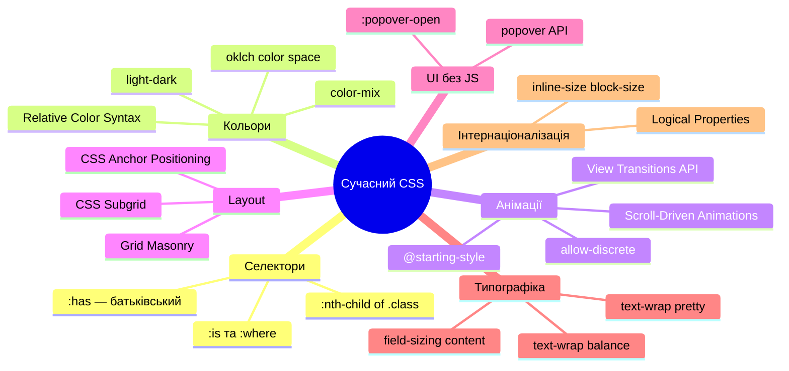

# Сучасний CSS 2023–2025: Нові можливості

## CSS розвивається швидше, ніж будь-коли

Якщо ви вивчали CSS п'ять років тому і думаєте, що знаєте мову — вас очікує приємний сюрприз. Починаючи з 2023 року, CSS отримав більше нових можливостей, ніж за попередні десять років разом узяті. Interop 2022–2024 — спільний проєкт Chrome, Firefox та Safari щодо синхронізованої підтримки стандартів — прискорив впровадження десятків специфікацій.

Ця стаття — не "як писати CSS". Це "що CSS вміє зараз, чого не вмів раніше". Деякі з цих можливостей замінять ваш JavaScript. Деякі — ваш Sass. Деякі — просто відкриють нові дизайнерські рішення, що раніше були неможливі.

Розглянемо можливості, згруповані за тим, яку **проблему** вони вирішують.

---

## Проблема 1: "Батьківський селектор" — 15 років очікування

Протягом усієї історії CSS існував запит, якому відмовляли: вибрати батьківський елемент залежно від його дочірніх. Як стилізувати `<li>`, якщо він містить `<ul>` (тобто є вкладеним пунктом)? Як стилізувати `<label>`, якщо його `<input>` має фокус?

Відповідь завжди була: "через JavaScript". До 2023 року.

### `:has()` — Relational Pseudo-class

`:has()` — найважливіший CSS-селектор за останнє десятиліття. Він дозволяє вибрати елемент залежно від **наявності певних нащадків або сусідів**. Через це його неофіційно називають "батьківський селектор", хоча насправді він ширший.

**Підтримка:** Chrome 105+, Firefox 121+, Safari 15.4+

```css
/* Стилізуй <li>, якщо він містить <ul> — вкладений список */
li:has(> ul) {
    font-weight: bold;
    border-left: 3px solid #6366f1;
}

/* Стилізуй <label>, якщо його input у стані :focus */
label:has(+ input:focus) {
    color: #6366f1;
}

/* Стилізуй <form>, якщо у ньому є хоча б один невалідний input */
form:has(input:invalid) {
    border: 2px solid #ef4444;
}

/* <article> має зображення — дай йому особливий layout */
article:has(img) {
    display: grid;
    grid-template-columns: 200px 1fr;
}

/* Стилізуй картку-контейнер, якщо у ній більше 3 елементів */
.grid:has(> :nth-child(3)) {
    grid-template-columns: repeat(3, 1fr);
}
```

Логіка роботи: `.a:has(.b)` означає "вибрати `.a`, якщо в ньому є `.b`". Усередині `:has()` можна використовувати будь-який валідний CSS-селектор, включаючи `>`, `~`, `+` та складені селектори.

### `:has()` як умовний CSS без JavaScript

До появи `:has()` перемикання класів на батьківських елементах вимагало JavaScript. Тепер це можна робити через CSS, реагуючи на стани дочірніх елементів:

::html-preview

```html
<div class="card-showcase">
    <div class="smart-card">
        <div class="smart-card__media">
            
        </div>
        <div class="smart-card__body">
            <h3>Картка зі зображенням</h3>
            <p>:has(img) — горизонтальний layout</p>
        </div>
    </div>
    <div class="smart-card">
        <div class="smart-card__body">
            <h3>Картка без зображення</h3>
            <p>Без img — вертикальний layout. :has() визначає різницю автоматично.</p>
        </div>
    </div>
    <label class="smart-label">
        Ім'я
        <input type="text" placeholder="Введіть ім'я" />
    </label>
    <label class="smart-label">
        Email
        <input type="email" placeholder="test@example.com" />
    </label>
</div>
```

```css
.card-showcase {
    display: flex;
    flex-direction: column;
    gap: 0.75rem;
    padding: 1.25rem;
    background: #f8fafc;
    border-radius: 12px;
    font-family: system-ui, sans-serif;
}

/* За замовчуванням — вертикальний layout */
.smart-card {
    background: white;
    border-radius: 10px;
    border: 1px solid #e2e8f0;
    overflow: hidden;
}

/* :has(img) — перемикає на горизонтальний layout БЕЗ JS */
.smart-card:has(img) {
    display: grid;
    grid-template-columns: 120px 1fr;
}

.smart-card:has(img) .smart-card__media img {
    width: 100%;
    height: 100%;
    object-fit: cover;
    display: block;
}

.smart-card__body {
    padding: 0.9rem;
}

.smart-card__body h3 {
    margin: 0 0 0.25rem;
    font-size: 0.9rem;
    color: #1e293b;
}

.smart-card__body p {
    margin: 0;
    font-size: 0.78rem;
    color: #64748b;
    line-height: 1.4;
}

/* Label підсвічується при фокусі вкладеного input */
.smart-label {
    display: flex;
    flex-direction: column;
    gap: 0.3rem;
    font-size: 0.82rem;
    font-weight: 600;
    color: #374151;
    transition: color 0.15s;
}

/* :has(:focus) — батьківський label реагує на дочірній input */
.smart-label:has(input:focus) {
    color: #6366f1;
}

.smart-label input {
    padding: 0.5rem 0.75rem;
    border: 1.5px solid #d1d5db;
    border-radius: 7px;
    font-size: 0.875rem;
    font-family: inherit;
    outline: none;
    transition:
        border-color 0.15s,
        box-shadow 0.15s;
}

.smart-label:has(input:focus) input {
    border-color: #6366f1;
    box-shadow: 0 0 0 3px rgba(99, 102, 241, 0.15);
}
```

::

### `:is()` та `:where()` — спрощення складних селекторів

Поки `:has()` — найгучніша новинка, `:is()` та `:where()` також суттєво спрощують CSS:

```css
/* Без :is() — довгий список */
h1 a,
h2 a,
h3 a,
h4 a,
h5 a,
h6 a {
    color: inherit;
}

/* З :is() — коротко і зрозуміло */
:is(h1, h2, h3, h4, h5, h6) a {
    color: inherit;
}

/* :is() наслідує специфічність найбільш специфічного аргументу */
/* :where() — специфічність завжди 0, легко перевизначити */
:where(h1, h2, h3) {
    line-height: 1.2; /* Специфічність: 0,0,0 — легко перевизначити */
}
```

`:where()` ідеальний для CSS Reset та базових стилів — вони не будуть конфліктувати зі стилями компонентів.

::html-preview

```html
<div class="is-where-showcase">
    <p class="iw-title">Демонстрація специфічності селекторів :is() та :where()</p>
    <div class="iw-grid">
        <div class="iw-card test-is">
            <h3 class="custom-highlight">Це заголовок у блоці :is()</h3>
            <p>
                Колір для <code>.test-is :is(h3)</code> задано червоним. Специфічність: class (0,1,0) + element (0,0,1)
                = <strong>(0,1,1)</strong>. Оскільки це більше ніж специфічність класу
                <code>.custom-highlight</code> (0,1,0) — заголовок залишається <strong>червоним</strong>.
            </p>
        </div>
        <div class="iw-card test-where">
            <h3 class="custom-highlight">Це заголовок у блоці :where()</h3>
            <p>
                Колір для <code>.test-where :where(h3)</code> задано зеленим. Але специфічність :where() завжди 0!
                Специфічність селектора: class (0,1,0) + where (0,0,0) = <strong>(0,1,0)</strong>. Оскільки утиліта
                <code>.custom-highlight</code> має таку саму специфічність і йде пізніше — заголовок перефарбувався в
                <strong>індиго</strong>.
            </p>
        </div>
    </div>
</div>
```

```css
.is-where-showcase {
    padding: 1.25rem;
    background: #f8fafc;
    border-radius: 12px;
    font-family: system-ui, sans-serif;
    display: flex;
    flex-direction: column;
    gap: 0.75rem;
}

.iw-title {
    margin: 0;
    font-size: 0.85rem;
    font-weight: 700;
    color: #475569;
}

.iw-grid {
    display: grid;
    grid-template-columns: repeat(2, 1fr);
    gap: 1rem;
}

@media (max-width: 600px) {
    .iw-grid {
        grid-template-columns: 1fr;
    }
}

.iw-card {
    background: white;
    border-radius: 10px;
    border: 1px solid #e2e8f0;
    padding: 1rem;
}

.iw-card h3 {
    margin: 0 0 0.5rem;
    font-size: 1rem;
}

.iw-card p {
    margin: 0;
    font-size: 0.78rem;
    color: #64748b;
    line-height: 1.5;
}

.iw-card code {
    background: #f1f5f9;
    padding: 0.1em 0.3em;
    border-radius: 4px;
    font-size: 0.85em;
    color: #4f46e5;
}

/* Налаштування кольору за допомогою :is() та :where() */

.test-is :is(h3) {
    color: #ef4444; /* червоний */
}

.test-where :where(h3) {
    color: #10b981; /* зелений */
}

/* Загальний стилізований клас-утиліта, що перевизначає колір */
.custom-highlight {
    color: #6366f1; /* індиго */
}
```

::

### Практична робота: Інтерактивна картка з `:has()` та `:where()`

**🎯 Очікуваний результат:** Створення картки підписки на розсилку, яка динамічно підсвічує свої межі червоним при невалідному email та синім — при фокусуванні на полі, використовуючи `:has()`. Заголовки картки будуть оформлені через `:where()`, щоб дозволити легке перевизначення тем оформлення.

#### Крок 1: Створення структури HTML

Створіть файл `index.html` у вашому робочому каталозі та додайте наступну розмітку:

```html
<!DOCTYPE html>
<html lang="uk">
    <head>
        <meta charset="UTF-8" />
        <meta name="viewport" content="width=device-width, initial-scale=1.0" />
        <title>Практична робота: :has() та :where()</title>
        <link rel="stylesheet" href="style.css" />
    </head>
    <body>
        <div class="card">
            <h3 class="card-title">Отримайте свіжі костилі</h3>
            <p class="card-desc">Лише корисні хаки та оновлення безпосередньо у вашу поштову скриньку.</p>
            <form class="card-form">
                <input type="email" placeholder="Введіть ваш email" required />
                <button type="submit">Підписатися</button>
            </form>
        </div>
    </body>
</html>
```

#### Крок 2: Додавання стилів CSS

Створіть у тій же папці файл `style.css` та додайте такі стилі:

```css
/* Базові налаштування */
body {
    background-color: #0f172a;
    font-family: system-ui, sans-serif;
    display: flex;
    justify-content: center;
    align-items: center;
    min-height: 100vh;
    margin: 0;
}

/* Використовуємо :where() для базової стилізації заголовка та тексту, 
   щоб їх можна було легко перевизначити пізніше за потреби */
:where(.card-title) {
    margin: 0 0 0.5rem;
    color: #f8fafc;
    font-size: 1.25rem;
}

:where(.card-desc) {
    margin: 0 0 1.5rem;
    color: #94a3b8;
    font-size: 0.875rem;
    line-height: 1.5;
}

/* Базова картка */
.card {
    background-color: #1e293b;
    border: 2px solid #334155;
    border-radius: 12px;
    padding: 1.5rem;
    width: 320px;
    transition:
        border-color 0.3s,
        box-shadow 0.3s;
}

/* Магія :has() №1: підсвічуємо картку, якщо інпут у фокусі */
.card:has(input:focus) {
    border-color: #3b82f6;
    box-shadow: 0 0 15px rgba(59, 130, 246, 0.2);
}

/* Магія :has() №2: підсвічуємо картку червоним, якщо email невалідний (коли почали вводити) */
.card:has(input:invalid:not(:placeholder-shown)) {
    border-color: #ef4444;
    box-shadow: 0 0 15px rgba(239, 68, 68, 0.2);
}

/* Стилізація форми та полів */
.card-form {
    display: flex;
    flex-direction: column;
    gap: 0.75rem;
}

input {
    background-color: #0f172a;
    border: 1px solid #334155;
    border-radius: 6px;
    color: white;
    padding: 0.6rem;
    outline: none;
    font-size: 0.875rem;
    transition: border-color 0.2s;
}

input:focus {
    border-color: #3b82f6;
}

button {
    background-color: #3b82f6;
    color: white;
    border: none;
    border-radius: 6px;
    padding: 0.6rem;
    font-weight: 600;
    cursor: pointer;
    transition: background-color 0.2s;
}

button:hover {
    background-color: #2563eb;
}
```

#### Крок 3: Перевірка та аналіз результату

1. Відкрийте файл `index.html` у вашому веб-браузері.
2. Натисніть на поле вводу пошти. Зверніть увагу, як рамка **всієї картки** плавно змінить колір на синій завдяки селектору `:has(input:focus)`.
3. Почніть вводити невалідну адресу (наприклад, просто символи `abc` без `@`). Рамка картки автоматично стане червоною (спрацював `:has(input:invalid:not(:placeholder-shown))`).

---

## Проблема 2: Анімація при появі/зникненні елементів

Протягом десятиліть розробники використовували JavaScript, щоб анімувати появу та зникнення елементів — бо CSS не міг анімувати `display: none ↔ block`. Тепер ситуація змінилась.

### `@starting-style` — анімація при першій появі

`@starting-style` дозволяє визначити **початковий стан** елемента саме для моменту його першої появи в DOM або переходу з `display: none`. Без `@starting-style` transition не спрацьовував — браузер не міг інтерполювати "від нічого".

**Підтримка:** Chrome 117+, Firefox 129+, Safari 17.5+

```css
.dialog {
    opacity: 1;
    transform: scale(1) translateY(0);
    transition:
        opacity 0.3s ease,
        transform 0.3s ease,
        display 0.3s ease allow-discrete; /* Вказуємо дискретне display */
}

/* Кінцевий стан при [hidden] або display:none */
.dialog[hidden] {
    opacity: 0;
    transform: scale(0.95) translateY(10px);
    display: none;
}

/* Початковий стан при ПОЯВІ (before-open state) */
@starting-style {
    .dialog {
        opacity: 0;
        transform: scale(0.95) translateY(10px);
    }
}
```

### `overlay` та `allow-discrete` — анімація `display`

Нова властивість `transition-behavior: allow-discrete` дозволяє анімувати дискретні (непоступові) властивості: `display`, `visibility`, `overlay`. Без неї `display: none` вмикалося миттєво, ламаючи анімацію виходу.

```css
.tooltip {
    opacity: 1;
    display: block;
    /* allow-discrete: transition чекає завершення перед застосуванням display:none */
    transition:
        opacity 0.2s ease,
        display 0.2s allow-discrete;
}

.tooltip.hidden {
    opacity: 0;
    display: none; /* Тепер чекатиме завершення opacity-transition */
}

@starting-style {
    .tooltip {
        opacity: 0; /* Стартує з прозорого при появі */
    }
}
```

::html-preview

```html
<div class="starting-style-demo">
    <button class="demo-btn js-toggle">Показати/сховати блок</button>
    <div class="animated-box" id="animBox">
        <p>✨ Цей блок анімується через CSS @starting-style + allow-discrete</p>
        <p style="font-size:0.8rem;opacity:0.7">Без жодного JavaScript для анімації!</p>
    </div>
</div>
<script>
    document.querySelector('.js-toggle').addEventListener('click', () => {
        const box = document.getElementById('animBox')
        box.classList.toggle('hidden')
    })
</script>
```

```css
.starting-style-demo {
    padding: 1.25rem;
    background: #f8fafc;
    border-radius: 12px;
    font-family: system-ui, sans-serif;
    display: flex;
    flex-direction: column;
    gap: 0.75rem;
}

.demo-btn {
    padding: 0.55rem 1.1rem;
    background: #6366f1;
    color: white;
    border: none;
    border-radius: 7px;
    font-size: 0.875rem;
    font-weight: 600;
    cursor: pointer;
    font-family: inherit;
    align-self: flex-start;
}

.animated-box {
    background: white;
    border: 1px solid #e2e8f0;
    border-radius: 10px;
    padding: 1rem;
    color: #334155;

    /* Transition включає display через allow-discrete */
    transition:
        opacity 0.35s ease,
        transform 0.35s cubic-bezier(0.34, 1.3, 0.64, 1),
        display 0.35s allow-discrete;
    opacity: 1;
    transform: translateY(0) scale(1);
    display: block;
}

/* Стан "схований" */
.animated-box.hidden {
    opacity: 0;
    transform: translateY(-10px) scale(0.97);
    display: none;
}

/* Початковий стан при появі — браузер анімує від цього до базового */
@starting-style {
    .animated-box {
        opacity: 0;
        transform: translateY(-10px) scale(0.97);
    }
}
```

::

### Практична робота: Плавне випливаюче діалогове вікно з `@starting-style`

**🎯 Очікуваний результат:** Побудова вишуканого діалогового вікна (Modal), яке при активації плавно з'являється (opacity від 0 до 1, transform від легкого зсуву вгору до оригінальної позиції), а при закритті — плавно розчиняється. Це реалізується за допомогою `@starting-style` та `transition-behavior: allow-discrete` без складних JS бібліотек анімації.

#### Крок 1: Створення структури HTML

Створіть файл `modal.html` у вашому робочому каталозі та додайте наступну розмітку:

```html
<!DOCTYPE html>
<html lang="uk">
    <head>
        <meta charset="UTF-8" />
        <meta name="viewport" content="width=device-width, initial-scale=1.0" />
        <title>Практична робота: Анімація появи дискретних елементів</title>
        <link rel="stylesheet" href="modal.css" />
    </head>
    <body>
        <button class="open-btn" id="openModalBtn">Відкрити модальне вікно</button>

        <div class="modal-overlay" id="modalOverlay">
            <div class="modal-content">
                <h3>Вітаємо на борту! 🚀</h3>
                <p>
                    Ви успішно активували нативну анімацію дискретного стану `display: block` за допомогою сучасного
                    CSS.
                </p>
                <button class="close-btn" id="closeModalBtn">Зрозуміло</button>
            </div>
        </div>

        <script>
            const openBtn = document.getElementById('openModalBtn')
            const closeBtn = document.getElementById('closeModalBtn')
            const overlay = document.getElementById('modalOverlay')

            openBtn.addEventListener('click', () => {
                overlay.classList.add('active')
            })

            closeBtn.addEventListener('click', () => {
                overlay.classList.remove('active')
            })
        </script>
    </body>
</html>
```

#### Крок 2: Додавання стилів CSS

Створіть у тій же папці файл `modal.css` та додайте такі стилі:

```css
/* Базовий темний фон */
body {
    background-color: #0f172a;
    font-family: system-ui, sans-serif;
    display: flex;
    justify-content: center;
    align-items: center;
    min-height: 100vh;
    margin: 0;
}

/* Кнопка відкриття */
.open-btn {
    background: linear-gradient(135deg, #ec4899, #8b5cf6);
    color: white;
    border: none;
    border-radius: 8px;
    padding: 0.8rem 1.5rem;
    font-size: 1rem;
    font-weight: 600;
    cursor: pointer;
}

/* Оверлей (задній напівпрозорий фон) */
.modal-overlay {
    position: fixed;
    top: 0;
    left: 0;
    width: 100%;
    height: 100%;
    background-color: rgba(15, 23, 42, 0.7);
    backdrop-filter: blur(4px);
    display: none; /* За замовчуванням прихований */
    justify-content: center;
    align-items: center;
    z-index: 1000;

    /* Налаштовуємо перехід для дискретної властивості display та opacity */
    transition:
        display 0.4s allow-discrete,
        opacity 0.4s ease;
    opacity: 0;
}

/* Стан, коли модальне вікно активне */
.modal-overlay.active {
    display: flex;
    opacity: 1;
}

/* Вміст вікна */
.modal-content {
    background-color: #1e293b;
    border: 1px solid #334155;
    border-radius: 16px;
    padding: 2rem;
    width: 340px;
    box-shadow: 0 20px 25px -5px rgba(0, 0, 0, 0.3);
    text-align: center;
    color: white;

    /* Одночасно анімуємо контент */
    transition: transform 0.4s cubic-bezier(0.34, 1.56, 0.64, 1);
    transform: translateY(20px) scale(0.95);
}

.modal-overlay.active .modal-content {
    transform: translateY(0) scale(1);
}

/* Магія @starting-style: вказуємо початковий стан під час 
   переходу елемента від display: none до display: flex */
@starting-style {
    .modal-overlay.active {
        opacity: 0;
    }

    .modal-overlay.active .modal-content {
        transform: translateY(20px) scale(0.95);
    }
}

/* Елементи всередині вікна */
.modal-content h3 {
    margin: 0 0 0.75rem;
    font-size: 1.5rem;
}

.modal-content p {
    color: #94a3b8;
    font-size: 0.9rem;
    line-height: 1.5;
    margin: 0 0 1.5rem;
}

.close-btn {
    background-color: #ef4444;
    color: white;
    border: none;
    border-radius: 6px;
    padding: 0.6rem 1.2rem;
    font-weight: 600;
    cursor: pointer;
    transition: background-color 0.2s;
}

.close-btn:hover {
    background-color: #dc2626;
}
```

#### Крок 3: Перевірка та аналіз результату

1. Відкрийте файл `modal.html` у вашому веб-браузері.
2. Натисніть кнопку **"Відкрити модальне вікно"**.
3. Зауважте, що хоча ми перемикаємо оверлей з `display: none` на `display: flex`, його поява відбувається неймовірно плавно та з еластичним ефектом завдяки поєднанню `@starting-style` та `allow-discrete`.

---

## Проблема 3: Анімація прив'язана до скролу

Раніше будь-яка анімація "при скролі" (parallax, sticky progress bar, reveal effects) вимагала JavaScript: `IntersectionObserver`, `scroll` event listener, бібліотеки типу GSAP. Тепер — тільки CSS.

### Scroll-Driven Animations

**Scroll-Driven Animations** — одна з найпотужніших CSS-специфікацій 2023 року. Вона дозволяє пов'язати прогрес CSS-анімації зі скролом сторінки або контейнера.

**Підтримка:** Chrome 115+, Firefox 110+ (за прапором до 130), Safari 18+

Є два типи таймлайнів:

**`scroll()`** — прогрес анімації = позиція скролу контейнера:

```css
@keyframes progress-fill {
    from {
        width: 0%;
    }
    to {
        width: 100%;
    }
}

.reading-progress {
    position: fixed;
    top: 0;
    left: 0;
    height: 4px;
    background: #6366f1;
    /* animation-timeline прив'язаний до скролу :root */
    animation: progress-fill linear;
    animation-timeline: scroll(root);
    animation-fill-mode: both;
}
```

**`view()`** — прогрес анімації = видимість елемента у viewport:

```css
@keyframes fade-up {
    from {
        opacity: 0;
        transform: translateY(30px);
    }
    to {
        opacity: 1;
        transform: translateY(0);
    }
}

.section {
    /* Анімується, коли section входить у viewport */
    animation: fade-up linear both;
    animation-timeline: view();
    /* Запуск при входженні в 10-40% viewport */
    animation-range: entry 0% cover 30%;
}
```

Зверніть: без `animation-duration` — тривалість визначається скролом, а не часом. Це принципово нова концепція: анімація не "грає" — вона "скрубується" пальцем.

### `animation-timeline` з іменованими таймлайнами

Для більш складних сценаріїв — прокрутка дочірнього контейнера анімує батьківський елемент:

```css
/* Контейнер реєструє себе як scroll timeline */
.carousel {
    overflow-x: scroll;
    scroll-timeline-name: --carousel-scroll;
    scroll-timeline-axis: x;
}

/* Індикатор реагує на прокрутку карусельного контейнера */
.carousel-indicator {
    animation: indicator-grow linear;
    animation-timeline: --carousel-scroll;
}

@keyframes indicator-grow {
    from {
        width: 0;
    }
    to {
        width: 100%;
    }
}
```

::html-preview

```html
<div class="sda-showcase">
    <p class="sda-title">Демонстрація Scroll-Driven Animations (тільки через CSS)</p>
    <div class="sda-scroll-box">
        <div class="sda-progress-bar"></div>
        <div class="sda-scroll-content">
            <p class="sda-instruction">⏬ Прокрутіть цей блок вниз, щоб побачити анімацію прогрес-бару та елементів:</p>
            <div class="sda-item">📦 Елемент 1 (з'явиться при прокрутці)</div>
            <div class="sda-item">🚀 Елемент 2 (масштабується зі скролом)</div>
            <div class="sda-item">🔥 Елемент 3 (змінює колір та непрозорість)</div>
            <div class="sda-item">⭐ Елемент 4 (фінальний акорд)</div>
            <p class="sda-end">🎉 Ви доскролили до кінця! Прогрес-бар заповнений на 100%.</p>
        </div>
    </div>
    <div class="sda-support-msg">
        <p class="support-check-yes">✅ Ваш браузер підтримує Scroll-Driven Animations нативно!</p>
        <p class="support-check-no">
            ⚠️ Ваш браузер не підтримує Scroll-Driven Animations. На жаль, ви побачите статичний список без плавної
            прокруткової анімації.
        </p>
    </div>
</div>
```

```css
.sda-showcase {
    padding: 1.25rem;
    background: #f8fafc;
    border-radius: 12px;
    font-family: system-ui, sans-serif;
    display: flex;
    flex-direction: column;
    gap: 0.75rem;
}

.sda-title {
    margin: 0;
    font-size: 0.85rem;
    font-weight: 700;
    color: #475569;
}

/* Scrollable Container */
.sda-scroll-box {
    position: relative;
    height: 220px;
    overflow-y: scroll;
    background: white;
    border: 1px solid #e2e8f0;
    border-radius: 10px;

    /* Створюємо іменований scroll-timeline */
    scroll-timeline-name: --box-scroll;
    scroll-timeline-axis: y;
}

/* Progress Bar */
.sda-progress-bar {
    position: sticky;
    top: 0;
    left: 0;
    right: 0;
    height: 5px;
    background: #6366f1;
    transform-origin: left;
    z-index: 10;

    /* Нативна анімація прив'язана до скролу */
    animation: sda-progress-grow linear both;
    animation-timeline: --box-scroll;
}

@keyframes sda-progress-grow {
    from {
        transform: scaleX(0);
    }
    to {
        transform: scaleX(1);
    }
}

.sda-scroll-content {
    padding: 1rem;
    display: flex;
    flex-direction: column;
    gap: 2rem; /* Створюємо простір для прокрутки */
    padding-bottom: 3rem;
}

.sda-instruction {
    margin: 0;
    font-size: 0.82rem;
    color: #64748b;
    font-style: italic;
    text-align: center;
}

.sda-item {
    background: #f1f5f9;
    border: 1px solid #cbd5e1;
    border-radius: 8px;
    padding: 1.5rem 1rem;
    font-size: 0.85rem;
    font-weight: 600;
    color: #334155;
    text-align: center;

    /* Нативна анімація появи при входженні у viewport */
    view-timeline-name: --item-timeline;
    view-timeline-axis: y;

    animation: sda-item-reveal linear both;
    animation-timeline: --item-timeline;
    animation-range: entry 10% cover 40%;
}

@keyframes sda-item-reveal {
    from {
        opacity: 0.2;
        transform: translateY(20px) scale(0.95);
        background: #f8fafc;
    }
    to {
        opacity: 1;
        transform: translateY(0) scale(1);
        background: #ede9fe;
        border-color: #c7d2fe;
        color: #4338ca;
    }
}

.sda-end {
    margin: 1rem 0 0;
    font-size: 0.82rem;
    font-weight: 700;
    color: #10b981;
    text-align: center;
}

/* Перевірка підтримки браузером */
.sda-support-msg p {
    margin: 0;
    font-size: 0.75rem;
    font-weight: 600;
}

.support-check-yes {
    display: none;
    color: #10b981;
}
.support-check-no {
    display: block;
    color: #f59e0b;
}

@supports (animation-timeline: scroll()) {
    .support-check-yes {
        display: block;
    }
    .support-check-no {
        display: none;
    }
}
```

::

### Практична робота: Індикатор читання та картки, що проявляються при скролі

**🎯 Очікуваний результат:** Створення довгої веб-сторінки з індикатором прогресу читання (progressbar) зверху, який заповнюється по мірі прокрутки сторінки, та сітки карток, які плавно випливають і збільшуються в масштабі, коли з'являються в області видимості. Все це працює без жодного рядка JavaScript.

#### Крок 1: Створення структури HTML

Створіть файл `scroll.html` у вашому робочому каталозі та додайте наступну розмітку:

```html
<!DOCTYPE html>
<html lang="uk">
    <head>
        <meta charset="UTF-8" />
        <meta name="viewport" content="width=device-width, initial-scale=1.0" />
        <title>Практична робота: Scroll-Driven Animations</title>
        <link rel="stylesheet" href="scroll.css" />
    </head>
    <body>
        <!-- Нативний індикатор скролу -->
        <div class="scroll-progress"></div>

        <header class="hero">
            <h1>Космічний Блог 🌌</h1>
            <p>Прокрутіть вниз, щоб побачити магію прокручуваних анімацій CSS</p>
        </header>

        <main class="content-grid">
            <div class="scroll-card">
                <div class="card-icon">🚀</div>
                <h3>Дослідження Марсу</h3>
                <p>
                    Марсохід Perseverance продовжує збирати зразки породи в кратері Єзеро для майбутнього повернення на
                    Землю.
                </p>
            </div>
            <div class="scroll-card">
                <div class="card-icon">🪐</div>
                <h3>Кільця Сатурну</h3>
                <p>
                    Нові дослідження підтверджують, що кільця Сатурна набагато молодші, ніж вважалося раніше — їм не
                    більше 400 млн років.
                </p>
            </div>
            <div class="scroll-card">
                <div class="card-icon">☄️</div>
                <h3>Міжзоряні комети</h3>
                <p>
                    Астрономи відстежують нові об'єкти поза нашою Сонячною системою, які несуть унікальні хімічні
                    підписи.
                </p>
            </div>
            <div class="scroll-card">
                <div class="card-icon">📡</div>
                <h3>Сигнали з глибин</h3>
                <p>
                    Нові радіотелескопи фіксують регулярні швидкі радіосплески з сусідньої галактики, що кидають виклик
                    теоріям.
                </p>
            </div>
        </main>
    </body>
</html>
```

#### Крок 2: Додавання стилів CSS

Створіть у тій же папці файл `scroll.css` та додайте такі стилі:

```css
/* Базові налаштування */
body {
    background-color: #0b0f19;
    color: #f1f5f9;
    font-family: system-ui, sans-serif;
    margin: 0;
    padding-bottom: 50vh; /* Додатковий простір для скролу */
}

/* Індикатор прогресу скролу */
.scroll-progress {
    position: fixed;
    top: 0;
    left: 0;
    width: 100%;
    height: 6px;
    background: linear-gradient(90deg, #3b82f6, #ec4899);
    transform-origin: 0 50%;
    z-index: 100;

    /* Прив'язуємо анімацію масштабування по осі X до скролу всієї сторінки */
    animation: grow-progress linear;
    animation-timeline: scroll();
}

@keyframes grow-progress {
    from {
        transform: scaleX(0);
    }
    to {
        transform: scaleX(1);
    }
}

/* Обкладинка блогу */
.hero {
    height: 80vh;
    display: flex;
    flex-direction: column;
    justify-content: center;
    align-items: center;
    text-align: center;
    background: radial-gradient(circle at center, #1e1b4b 0%, #0b0f19 100%);
    padding: 1rem;
}

.hero h1 {
    font-size: 3rem;
    margin: 0 0 1rem;
}

.hero p {
    color: #94a3b8;
    font-size: 1.2rem;
}

/* Сітка карток */
.content-grid {
    max-width: 800px;
    margin: 0 auto;
    padding: 2rem 1rem;
    display: flex;
    flex-direction: column;
    gap: 3rem;
}

/* Картка з анімацією випливання */
.scroll-card {
    background: #111827;
    border: 1px solid #1f2937;
    border-radius: 16px;
    padding: 2rem;
    display: flex;
    flex-direction: column;
    gap: 0.5rem;
    box-shadow: 0 4px 20px rgba(0, 0, 0, 0.4);

    /* Реєструємо анімацію випливання елемента на екрані */
    animation: reveal-card linear both;
    animation-timeline: view();
    animation-range: entry 10% cover 45%;
}

.card-icon {
    font-size: 2.5rem;
    margin-bottom: 0.5rem;
}

.scroll-card h3 {
    margin: 0;
    font-size: 1.5rem;
    color: #3b82f6;
}

.scroll-card p {
    color: #94a3b8;
    line-height: 1.6;
    margin: 0;
}

/* Анімація появи: картка починає напівпрозорою та зміщеною вниз,
   а в процесі скролу вирівнюється */
@keyframes reveal-card {
    from {
        opacity: 0;
        transform: translateY(60px) scale(0.9);
    }
    to {
        opacity: 1;
        transform: translateY(0) scale(1);
    }
}
```

#### Крок 3: Перевірка та аналіз результату

1. Відкрийте файл `scroll.html` у вашому веб-браузері.
2. Почніть скролити вниз. Зверніть увагу на верхню межу вікна — градієнтна лінія буде заповнюватися синхронно з вашим рухом по сторінці (`animation-timeline: scroll()`).
3. По мірі прокручування ви побачите, як кожна картка плавно піднімається, збільшується до оригінального масштабу та розкривається (`animation-timeline: view()`).

---

## Проблема 4: Tooltip та Popover без JavaScript-позиціонування

Позиціонування tooltip, popover, dropdown відносно trigger-елемента завжди вимагало JavaScript: обчислення координат, обробка виходу за межі viewport, `getBoundingClientRect()`. CSS Anchor Positioning вирішує це нативно.

### CSS Anchor Positioning

**CSS Anchor Positioning** дозволяє позиціонувати один елемент відносно іншого ("якоря") — навіть якщо вони знаходяться в різних місцях DOM.

**Підтримка:** Chrome 125+, Chromium-браузери. Firefox та Safari — в розробці.

```css
/* Крок 1: зареєструвати якір */
.trigger-button {
    anchor-name: --my-anchor;
}

/* Крок 2: позиціонувати tooltip відносно якоря */
.tooltip {
    position: absolute;
    position-anchor: --my-anchor;

    /* Розмістити знизу-по-центру якоря */
    top: anchor(bottom);
    left: anchor(center);
    transform: translateX(-50%);
}
```

Магія: `anchor(bottom)` повертає координату нижньої межі якірного елемента. Доступні `anchor(top)`, `anchor(right)`, `anchor(left)`, `anchor(center)`, `anchor(start)`, `anchor(end)`.

### Автоматична зміна позиції через `@position-try`

Найцікавіша частина — `@position-try`. Якщо tooltip виходить за межі viewport — браузер автоматично пробує альтернативні позиції:

```css
@position-try --flip-up {
    /* Якщо знизу немає місця — показати зверху */
    top: auto;
    bottom: anchor(top);
}

.tooltip {
    position: absolute;
    position-anchor: --my-anchor;
    top: anchor(bottom);
    left: anchor(center);

    /* Автоматично flip, якщо не вміщується знизу */
    position-try-fallbacks: --flip-up;
}
```

Це замінює сотні рядків JavaScript у бібліотеках типу Floating UI та Popper.js.

::html-preview

```html
<div class="ap-showcase">
    <p class="ap-title">Демонстрація CSS Anchor Positioning (без JS позиціонування)</p>
    <div class="ap-container">
        <button class="ap-trigger" id="ap-anchor-btn">Наведіть курсор або натисніть</button>
        <div class="ap-tooltip" id="ap-anchor-tip">✨ Я прикріплений до кнопки нативно через CSS!</div>
    </div>
    <div class="ap-support-info">
        <p class="ap-support-yes">✅ Ваш засіб перегляду підтримує нативне якірне позиціонування!</p>
        <p class="ap-support-no">
            ⚠️ Ваш засіб перегляду не підтримує Anchor Positioning. Показано статичний fallback.
        </p>
    </div>
</div>
```

```css
.ap-showcase {
    padding: 1.25rem;
    background: #f8fafc;
    border-radius: 12px;
    font-family: system-ui, sans-serif;
    display: flex;
    flex-direction: column;
    gap: 0.75rem;
}

.ap-title {
    margin: 0;
    font-size: 0.85rem;
    font-weight: 700;
    color: #475569;
}

.ap-container {
    position: relative;
    height: 120px;
    display: flex;
    justify-content: center;
    align-items: center;
    background: white;
    border: 1px solid #e2e8f0;
    border-radius: 10px;
}

/* Крок 1: реєструємо якір */
#ap-anchor-btn {
    anchor-name: --my-custom-anchor;
    padding: 0.6rem 1.2rem;
    background: #6366f1;
    color: white;
    border: none;
    border-radius: 8px;
    font-size: 0.85rem;
    font-weight: 600;
    cursor: pointer;
}

/* Крок 2: позиціонуємо тултіп відносно якоря */
#ap-anchor-tip {
    background: #1e293b;
    color: white;
    padding: 0.5rem 0.8rem;
    border-radius: 6px;
    font-size: 0.75rem;
    line-height: 1.4;
    white-space: nowrap;
    box-shadow: 0 4px 12px rgba(0, 0, 0, 0.15);
    opacity: 0;
    transform: scale(0.95);
    transition:
        opacity 0.2s ease,
        transform 0.2s ease;
    pointer-events: none;
}

/* Якщо підтримується Anchor Positioning */
@supports (position-anchor: --my-custom-anchor) {
    #ap-anchor-tip {
        position: absolute;
        position-anchor: --my-custom-anchor;

        /* Розміщуємо знизу по центру кнопки */
        top: anchor(bottom);
        left: anchor(center);
        transform: translate(-50%, 8px);
    }

    #ap-anchor-btn:hover + #ap-anchor-tip,
    #ap-anchor-btn:focus + #ap-anchor-tip {
        opacity: 1;
        transform: translate(-50%, 8px) scale(1);
    }
}

/* Fallback для Safari/Firefox */
@supports not (position-anchor: --my-custom-anchor) {
    .ap-container {
        flex-direction: column;
        gap: 0.75rem;
        height: auto;
        padding: 1.5rem 1rem;
    }

    #ap-anchor-tip {
        opacity: 1;
        transform: none;
        background: #ede9fe;
        color: #4338ca;
        border: 1px solid #c7d2fe;
        box-shadow: none;
        white-space: normal;
        text-align: center;
        pointer-events: auto;
    }
}

.ap-support-info p {
    margin: 0;
    font-size: 0.75rem;
    font-weight: 600;
}

.ap-support-yes {
    display: none;
    color: #10b981;
}
.ap-support-no {
    display: block;
    color: #f59e0b;
}

@supports (position-anchor: --my-custom-anchor) {
    .ap-support-yes {
        display: block;
    }
    .ap-support-no {
        display: none;
    }
}
```

::

### Практична робота: Нативний тултіп з автовирівнюванням через Anchor Positioning

**🎯 Очікуваний результат:** Створення кнопки та випливаючої підказки (tooltip), яка нативно прикріплюється до нижнього центру кнопки за допомогою CSS Anchor Positioning, та автоматично перестрибує вгору (`@position-try`), якщо при прокручуванні вікна знизу не залишається вільного місця.

#### Крок 1: Створення структури HTML

Створіть файл `anchor.html` у вашому робочому каталозі та додайте наступну розмітку:

```html
<!DOCTYPE html>
<html lang="uk">
    <head>
        <meta charset="UTF-8" />
        <meta name="viewport" content="width=device-width, initial-scale=1.0" />
        <title>Практична робота: CSS Anchor Positioning</title>
        <link rel="stylesheet" href="anchor.css" />
    </head>
    <body>
        <div class="scroll-container">
            <p class="scroll-instruction">
                Прокрутіть це вікно вниз або вгору, щоб побачити автопереворот тултіпа при виході за межі екрану 👇
            </p>

            <div class="anchor-area">
                <!-- Елемент-якір -->
                <button class="anchor-button" id="myAnchorBtn">Наведіть на мене</button>

                <!-- Позиціонований тултіп -->
                <div class="anchor-tooltip" id="myTooltip">💡 Я прив'язаний до кнопки через CSS!</div>
            </div>
        </div>
    </body>
</html>
```

#### Крок 2: Додавання стилів CSS

Створіть у тій же папці файл `anchor.css` та додайте такі стилі:

```css
/* Базові налаштування */
body {
    background-color: #0f172a;
    color: white;
    font-family: system-ui, sans-serif;
    margin: 0;
    display: flex;
    justify-content: center;
    align-items: center;
    height: 100vh;
}

/* Контейнер зі скролом для тестування */
.scroll-container {
    height: 150vh;
    width: 100%;
    display: flex;
    flex-direction: column;
    justify-content: center;
    align-items: center;
    gap: 20rem;
}

.scroll-instruction {
    color: #94a3b8;
    font-size: 0.9rem;
    max-width: 300px;
    text-align: center;
}

.anchor-area {
    position: relative;
}

/* Крок 1: Реєструємо унікальне ім'я якоря для кнопки */
.anchor-button {
    anchor-name: --action-button;
    background-color: #4f46e5;
    color: white;
    border: none;
    border-radius: 8px;
    padding: 0.75rem 1.5rem;
    font-size: 1rem;
    font-weight: 600;
    cursor: pointer;
    transition: background-color 0.2s;
}

.anchor-button:hover {
    background-color: #4338ca;
}

/* Крок 2: Описуємо правило автоматичного перенесення */
@position-try --flip-up {
    top: auto;
    bottom: anchor(top);
    margin-bottom: 8px;
}

/* Крок 3: Позиціонуємо підказку відносно якоря */
.anchor-tooltip {
    background-color: #1e293b;
    border: 1px solid #334155;
    color: #f1f5f9;
    padding: 0.5rem 0.75rem;
    border-radius: 6px;
    font-size: 0.8rem;
    white-space: nowrap;
    box-shadow: 0 10px 15px -3px rgba(0, 0, 0, 0.3);

    /* Робимо тултіп видимим при наведенні на кнопку */
    opacity: 0;
    pointer-events: none;
    transition: opacity 0.2s ease;
}

/* Відображаємо при наведенні */
.anchor-button:hover + .anchor-tooltip {
    opacity: 1;
}

/* Застосовуємо якірне позиціонування тільки у разі підтримки браузером */
@supports (position-anchor: --action-button) {
    .anchor-tooltip {
        position: absolute;

        /* Прив'язуємось до зареєстрованого імені якоря */
        position-anchor: --action-button;

        /* Стандартне розміщення знизу по центру кнопки */
        top: anchor(bottom);
        left: anchor(center);
        transform: translateX(-50%);
        margin-top: 8px;

        /* Вказуємо браузеру перевертати вгору, якщо знизу немає місця */
        position-try-fallbacks: --flip-up;
    }
}

/* Простий fallback для браузерів без підтримки */
@supports not (position-anchor: --action-button) {
    .anchor-tooltip {
        opacity: 1;
        position: relative;
        margin-top: 10px;
        text-align: center;
        background-color: #312e81;
        border-color: #4338ca;
    }
}
```

#### Крок 3: Перевірка та аналіз результату

1. Відкрийте файл `anchor.html` в браузері (рекомендується остання версія Chrome або Edge).
2. Наведіть курсор на кнопку — тултіп з'явиться знизу.
3. Прокрутіть сторінку так, щоб кнопка опинилася біля самого низу екрана, та наведіть на неї знову. Браузер нативно перемістить підказку вгору над кнопкою (спрацювало правило `--flip-up`).

---

## Проблема 5: Кольори, що "розуміють" контекст

### `color-mix()` — змішування кольорів у CSS

До `color-mix()` не можна було "затемнити колір на 20%" без JavaScript або Sass. Тепер:

**Підтримка:** Chrome 111+, Firefox 113+, Safari 16.2+

```css
:root {
    --brand: #6366f1;

    /* Затемнений варіант: 80% brand + 20% чорний */
    --brand-dark: color-mix(in srgb, var(--brand) 80%, black);

    /* Освітлений: 70% brand + 30% білий */
    --brand-light: color-mix(in srgb, var(--brand) 70%, white);

    /* Напівпрозорий: 50% brand + 50% transparent */
    --brand-20: color-mix(in srgb, var(--brand) 20%, transparent);
}

/* Динамічний hover без Sass */
.btn-primary {
    background: var(--brand);
}
.btn-primary:hover {
    background: color-mix(in srgb, var(--brand) 85%, black);
}
```

Простір кольорів `in srgb` можна замінити на `in oklch`, `in hsl`, `in display-p3` — різні простори дають різний результат змішування, деякі більш "природні" для людського зору.

### `light-dark()` — автоматичний вибір для темної/світлої теми

`light-dark()` — чистий CSS-синтаксис для оголошення двох значень: одне для light, інше для dark тем. Замінює громіздкі `@media` блоки:

**Підтримка:** Chrome 123+, Firefox 120+, Safari 17.5+

```css
/* Увімкнути підтримку color-scheme */
:root {
    color-scheme: light dark;
}

.card {
    /* light-dark(світле_значення, темне_значення) */
    background: light-dark(#ffffff, #1e293b);
    color: light-dark(#0f172a, #f1f5f9);
    border-color: light-dark(#e2e8f0, #334155);
}

.btn-primary {
    background: light-dark(#6366f1, #818cf8);
    color: light-dark(white, #1e293b);
}
```

Без жодного `@media (prefers-color-scheme: dark)` блоку. Один рядок — дві теми.

### Relative Color Syntax — відносне перетворення кольорів

Відносний синтаксис кольорів дозволяє взяти існуючий колір і **модифікувати окремі канали**:

**Підтримка:** Chrome 119+, Safari 16.4+, Firefox 128+

```css
:root {
    --brand: #6366f1;
}

.element {
    /* Взяти --brand, перевести в hsl, змінити тільки lightness */
    background: hsl(from var(--brand) h s 80%);

    /* Взяти --brand в oklch, зробити прозорим на 50% */
    border-color: oklch(from var(--brand) l c h / 50%);

    /* Зменшити насиченість у два рази */
    color: hsl(from var(--brand) h calc(s / 2) l);
}
```

Де `h`, `s`, `l` — це автоматично розкладені канали вихідного кольору. Тепер генерація палітр — чистий CSS.

::html-preview

```html
<div class="color-demo">
    <p class="color-demo__title">color-mix() та light-dark() в дії</p>
    <div class="color-swatches">
        <div class="swatch swatch--brand">Brand<br />#6366f1</div>
        <div class="swatch swatch--dark">+20% black</div>
        <div class="swatch swatch--light">+30% white</div>
        <div class="swatch swatch--alpha">20% alpha</div>
        <div class="swatch swatch--muted">Muted hsl</div>
    </div>
    <div class="light-dark-card">
        <span>light-dark() автоматична тема</span>
        <small>Кольори змінюються залежно від OS</small>
    </div>
</div>
```

```css
:root {
    color-scheme: light dark;
    --brand: #6366f1;
}

.color-demo {
    padding: 1.25rem;
    background: #f8fafc;
    border-radius: 12px;
    font-family: system-ui, sans-serif;
    display: flex;
    flex-direction: column;
    gap: 0.75rem;
}

.color-demo__title {
    margin: 0;
    font-size: 0.85rem;
    font-weight: 700;
    color: #334155;
}

.color-swatches {
    display: flex;
    gap: 0.5rem;
    flex-wrap: wrap;
}

.swatch {
    padding: 0.75rem;
    border-radius: 8px;
    font-size: 0.72rem;
    font-weight: 700;
    color: white;
    text-align: center;
    line-height: 1.3;
    min-width: 80px;
}

.swatch--brand {
    background: var(--brand);
}
.swatch--dark {
    background: color-mix(in srgb, var(--brand) 80%, black);
}
.swatch--light {
    background: color-mix(in srgb, var(--brand) 70%, white);
    color: #4338ca;
}
.swatch--alpha {
    background: color-mix(in srgb, var(--brand) 20%, transparent);
    color: #4338ca;
    border: 1px solid #c7d2fe;
}
.swatch--muted {
    background: hsl(from var(--brand) h s 85%);
    color: #4338ca;
}

.light-dark-card {
    background: light-dark(#ede9fe, #1e1b4b);
    color: light-dark(#4338ca, #a5b4fc);
    border: 1px solid light-dark(#c7d2fe, #312e81);
    border-radius: 8px;
    padding: 0.75rem 1rem;
    display: flex;
    flex-direction: column;
    gap: 0.2rem;
}

.light-dark-card span {
    font-size: 0.875rem;
    font-weight: 600;
}
.light-dark-card small {
    font-size: 0.75rem;
    opacity: 0.7;
}
```

::

### Практична робота: Динамічна колірна палітра з `color-mix()`

**🎯 Очікуваний результат:** Створення кнопок та інформаційних карток (alerts), кольорові стани яких (hover, active, напівпрозорі фони) розраховуються браузером динамічно на основі однієї CSS-змінної брендового кольору за допомогою функції `color-mix()`.

#### Крок 1: Створення структури HTML

Створіть файл `colors.html` у вашому робочому каталозі та додайте наступну розмітку:

```html
<!DOCTYPE html>
<html lang="uk">
    <head>
        <meta charset="UTF-8" />
        <meta name="viewport" content="width=device-width, initial-scale=1.0" />
        <title>Практична робота: CSS color-mix()</title>
        <link rel="stylesheet" href="colors.css" />
    </head>
    <body>
        <div class="palette-card">
            <h3>Генератор UI-компонентів 🎨</h3>
            <p>
                Змініть лише одну змінну <code>--brand-color</code> у CSS, і вся тема з кнопками та повідомленнями
                адаптується автоматично!
            </p>

            <!-- Кнопки із динамічними станами ховеру -->
            <div class="button-group">
                <button class="btn btn-primary">Основна дія</button>
                <button class="btn btn-secondary">Другорядна дія</button>
            </div>

            <!-- Повідомлення із динамічним пастельним фоном та яскравою рамкою -->
            <div class="alert alert-info">
                <strong>Інформація:</strong> Стан повідомлення згенеровано за допомогою змішування кольору бренду з
                білим кольором у пропорції 90% до 10%.
            </div>
        </div>
    </body>
</html>
```

#### Крок 2: Додавання стилів CSS

Створіть у тій же папці файл `colors.css` та додайте такі стилі:

```css
/* Базові налаштування теми */
:root {
    /* Наш єдиний базовий колір бренду.
       Спробуйте замінити його на #10b981 (зелений) або #f59e0b (помаранчевий)! */
    --brand-color: #3b82f6;

    background-color: #0f172a;
    color: white;
    font-family: system-ui, sans-serif;
    display: flex;
    justify-content: center;
    align-items: center;
    min-height: 100vh;
    margin: 0;
}

.palette-card {
    background-color: #1e293b;
    border: 1px solid #334155;
    border-radius: 12px;
    padding: 2rem;
    width: 380px;
    box-shadow: 0 10px 15px -3px rgba(0, 0, 0, 0.3);
}

.palette-card h3 {
    margin: 0 0 0.5rem;
}

.palette-card p {
    color: #94a3b8;
    font-size: 0.85rem;
    line-height: 1.5;
    margin: 0 0 1.5rem;
}

.palette-card p code {
    background: #0f172a;
    padding: 0.1rem 0.3rem;
    border-radius: 4px;
    color: #e2e8f0;
}

/* Група кнопок */
.button-group {
    display: flex;
    gap: 0.75rem;
    margin-bottom: 1.5rem;
}

.btn {
    padding: 0.6rem 1.2rem;
    border: none;
    border-radius: 6px;
    font-weight: 600;
    cursor: pointer;
    font-size: 0.875rem;
    transition:
        background-color 0.2s,
        border-color 0.2s;
}

/* Крок 1: Розраховуємо колір при наведенні (затемнення на 15%)
   та колір при кліку (затемнення на 30%) за допомогою color-mix() */
.btn-primary {
    background-color: var(--brand-color);
    color: white;
}

.btn-primary:hover {
    background-color: color-mix(in srgb, var(--brand-color) 85%, black);
}

.btn-primary:active {
    background-color: color-mix(in srgb, var(--brand-color) 70%, black);
}

/* Крок 2: Другорядна кнопка з напівпрозорими тонами бренду */
.btn-secondary {
    background-color: color-mix(in srgb, var(--brand-color) 15%, transparent);
    color: color-mix(in srgb, var(--brand-color) 80%, white);
    border: 1px solid color-mix(in srgb, var(--brand-color) 30%, transparent);
}

.btn-secondary:hover {
    background-color: color-mix(in srgb, var(--brand-color) 25%, transparent);
}

/* Крок 3: Створюємо вишукане пастельне попередження */
.alert {
    padding: 1rem;
    border-radius: 8px;
    font-size: 0.8rem;
    line-height: 1.4;

    /* Фон — бренд змішаний з великою кількістю білого */
    background-color: color-mix(in srgb, var(--brand-color) 10%, #ffffff);
    /* Текст — бренд змішаний із чорним для кращої читабельності */
    color: color-mix(in srgb, var(--brand-color) 80%, #000000);
    /* Рамка — яскравий брендовий відтінок */
    border: 1px solid color-mix(in srgb, var(--brand-color) 40%, #ffffff);
}
```

#### Крок 3: Перевірка та аналіз результату

1. Відкрийте файл `colors.html` у вашому веб-браузері.
2. Наведіть курсор на кнопки та натисніть на них. Зверніть увагу, як плавно та природно темнішає кнопка (працює змішування з чорним кольором `black`).
3. Спробуйте змінити значення `--brand-color` в CSS на зелений `#10b981` і зберегти файл. Всі другорядні кнопки та рамки з фоном повідомлень оновляться самостійно, зберігаючи чудовий контраст!

---

## Проблема 6: Popover без JavaScript

HTML `popover` атрибут + CSS `:popover-open` — нативний механізм для tooltip, dropdown, modal без жодного JavaScript для базового відкриття/закриття.

**Підтримка:** Chrome 114+, Firefox 125+, Safari 17+

```html
<!-- popovertarget вказує id popover-елемента -->
<button popovertarget="my-menu">Відкрити меню</button>

<!-- popover="auto": закривається при кліку поза ним -->
<div id="my-menu" popover="auto">
    <ul>
        <li><a href="#">Пункт 1</a></li>
        <li><a href="#">Пункт 2</a></li>
    </ul>
</div>
```

```css
/* Стилізація закритого стану */
[popover] {
    border: 1px solid #e2e8f0;
    border-radius: 10px;
    padding: 0.5rem;
    box-shadow: 0 8px 24px rgba(0, 0, 0, 0.12);

    /* Анімація появи через @starting-style */
    transition:
        opacity 0.2s ease,
        transform 0.2s ease,
        display 0.2s allow-discrete,
        overlay 0.2s allow-discrete;
    opacity: 1;
    transform: translateY(0);
}

/* Закритий стан */
[popover]:not(:popover-open) {
    opacity: 0;
    transform: translateY(-8px);
    display: none;
}

/* Початковий стан анімації при появі */
@starting-style {
    [popover]:popover-open {
        opacity: 0;
        transform: translateY(-8px);
    }
}
```

`popover="auto"` — один попап за раз, закривається при кліку поза ним або Escape. `popover="manual"` — повний контроль вручну. Жодного `event.stopPropagation()`, жодних `document.addEventListener('click')`.

::html-preview

```html
<div class="popover-showcase">
    <p class="pop-title">Демонстрація нативного Popover API з CSS анімаціями зникнення/появи</p>
    <div class="pop-container">
        <!-- Кнопка яка відкриває попап -->
        <button class="pop-trigger-btn" popovertarget="my-interactive-popover">Відкрити Попап</button>

        <!-- Нативний popover елемент -->
        <div id="my-interactive-popover" popover="auto">
            <h4 class="pop-heading">Нативний Popover 🚀</h4>
            <p class="pop-text">
                Він відкривається абсолютно без JavaScript завдяки атрибуту <code>popovertarget</code>.
            </p>
            <p class="pop-text">
                Анімація плавного входу та виходу налаштована через <code>@starting-style</code> та
                <code>transition: ... allow-discrete</code>.
            </p>
            <button class="pop-close-btn" popovertarget="my-interactive-popover" popovertargetaction="hide">
                Закрити
            </button>
        </div>
    </div>
</div>
```

```css
.popover-showcase {
    padding: 1.25rem;
    background: #f8fafc;
    border-radius: 12px;
    font-family: system-ui, sans-serif;
    display: flex;
    flex-direction: column;
    gap: 0.75rem;
}

.pop-title {
    margin: 0;
    font-size: 0.85rem;
    font-weight: 700;
    color: #475569;
}

.pop-container {
    height: 140px;
    display: flex;
    justify-content: center;
    align-items: center;
    background: white;
    border: 1px solid #e2e8f0;
    border-radius: 10px;
}

.pop-trigger-btn {
    padding: 0.6rem 1.2rem;
    background: #10b981;
    color: white;
    border: none;
    border-radius: 8px;
    font-size: 0.85rem;
    font-weight: 600;
    cursor: pointer;
    box-shadow: 0 2px 4px rgba(16, 185, 129, 0.2);
    transition: background-color 0.2s;
}

.pop-trigger-btn:hover {
    background: #059669;
}

/* Нативна стилізація поповера */
#my-interactive-popover {
    border: 1px solid #e2e8f0;
    border-radius: 12px;
    padding: 1.25rem;
    max-width: 280px;
    box-shadow:
        0 10px 25px -5px rgba(0, 0, 0, 0.1),
        0 8px 10px -6px rgba(0, 0, 0, 0.1);
    background: white;
    color: #1e293b;
    margin: auto; /* центрування на сторінці */

    /* Анімація появи та зникнення через discrete-переходи */
    transition:
        opacity 0.3s ease,
        transform 0.3s cubic-bezier(0.34, 1.56, 0.64, 1),
        display 0.3s allow-discrete,
        overlay 0.3s allow-discrete;
    opacity: 1;
    transform: translateY(0) scale(1);
}

/* Закритий стан */
#my-interactive-popover:not(:popover-open) {
    opacity: 0;
    transform: translateY(15px) scale(0.95);
    display: none;
}

/* Початковий стан анімації при відкритті */
@starting-style {
    #my-interactive-popover:popover-open {
        opacity: 0;
        transform: translateY(15px) scale(0.95);
    }
}

/* Стилізація контенту поповера */
.pop-heading {
    margin: 0 0 0.5rem;
    font-size: 0.95rem;
    font-weight: 700;
    color: #1e293b;
}

.pop-text {
    margin: 0 0 0.6rem;
    font-size: 0.78rem;
    color: #64748b;
    line-height: 1.4;
}

.pop-text code {
    background: #f1f5f9;
    padding: 0.1em 0.3em;
    border-radius: 4px;
    font-size: 0.85em;
    color: #10b981;
}

.pop-close-btn {
    padding: 0.4rem 0.8rem;
    background: #ef4444;
    color: white;
    border: none;
    border-radius: 6px;
    font-size: 0.75rem;
    font-weight: 600;
    cursor: pointer;
    margin-top: 0.4rem;
    float: right;
}

.pop-close-btn:hover {
    background: #dc2626;
}

/* Стилізуємо нативний задній фон (backdrop) поповера */
#my-interactive-popover::backdrop {
    background: rgba(15, 23, 42, 0.3);
    backdrop-filter: blur(2px);
    transition:
        opacity 0.3s ease,
        display 0.3s allow-discrete;
    opacity: 1;
}

#my-interactive-popover:not(:popover-open)::backdrop {
    opacity: 0;
}

@starting-style {
    #my-interactive-popover:popover-open::backdrop {
        opacity: 0;
    }
}
```

::

### Практична робота: Нативний Dropdown-меню профілю через Popover API

**🎯 Очікуваний результат:** Створення меню профілю користувача, яке відкривається при натисканні на аватар, та автоматично закривається при натисканні поза його межами (light dismiss) або клавіші Escape, без використання JavaScript.

#### Крок 1: Створення структури HTML

Створіть файл `popover.html` у вашому робочому каталозі та додайте наступну розмітку:

```html
<!DOCTYPE html>
<html lang="uk">
    <head>
        <meta charset="UTF-8" />
        <meta name="viewport" content="width=device-width, initial-scale=1.0" />
        <title>Практична робота: Popover API</title>
        <link rel="stylesheet" href="popover.css" />
    </head>
    <body>
        <div class="navbar">
            <div class="logo">MyDashboard 📊</div>

            <div class="profile-container">
                <!-- Крок 1: Вказуємо popovertarget з id нашого меню -->
                <button class="avatar-btn" popovertarget="profileMenu">
                    <span class="avatar-text">JD</span>
                </button>

                <!-- Крок 2: Додаємо атрибут popover="auto" -->
                <div id="profileMenu" popover="auto" class="dropdown-menu">
                    <div class="menu-header">
                        <h4>John Doe</h4>
                        <p>admin@example.com</p>
                    </div>
                    <hr />
                    <ul class="menu-list">
                        <li><a href="#profile">Мій профіль</a></li>
                        <li><a href="#settings">Налаштування</a></li>
                        <li><a href="#logout" class="logout-link">Вийти</a></li>
                    </ul>
                </div>
            </div>
        </div>
    </body>
</html>
```

#### Крок 2: Додавання стилів CSS

Створіть у тій же папці файл `popover.css` та додайте такі стилі:

```css
/* Базові стилі */
body {
    background-color: #0f172a;
    color: white;
    font-family: system-ui, sans-serif;
    margin: 0;
    min-height: 100vh;
}

/* Навігаційна панель */
.navbar {
    background-color: #1e293b;
    border-bottom: 1px solid #334155;
    padding: 0.75rem 1.5rem;
    display: flex;
    justify-content: space-between;
    align-items: center;
}

.logo {
    font-weight: 700;
    font-size: 1.1rem;
}

.profile-container {
    position: relative;
}

/* Кнопка аватару */
.avatar-btn {
    background-color: #4f46e5;
    color: white;
    border: none;
    width: 40px;
    height: 40px;
    border-radius: 50%;
    cursor: pointer;
    display: flex;
    justify-content: center;
    align-items: center;
    font-weight: 700;
    font-size: 0.85rem;
    transition: transform 0.2s;
}

.avatar-btn:hover {
    transform: scale(1.05);
}

/* Крок 3: Стилізація нативного поповера */
.dropdown-menu {
    /* Нативний поповер має стандартні стилі браузера (рамка, фони, тіні), 
       які ми повністю перевизначаємо: */
    border: 1px solid #334155;
    border-radius: 12px;
    padding: 1rem;
    background-color: #1e293b;
    color: white;
    width: 200px;
    box-shadow: 0 10px 25px -5px rgba(0, 0, 0, 0.4);

    /* Зміщуємо меню під аватар на сторінці */
    position: absolute;
    top: 55px;
    right: 15px;
    margin: 0;
}

/* Запобігаємо автоматичним відступам */
.dropdown-menu::backdrop {
    /* backdrop="auto" має нативний прозорий оверлей, 
       ми можемо його стилізувати або вимкнути */
    background: transparent;
}

/* Контент меню */
.menu-header h4 {
    margin: 0;
    font-size: 0.95rem;
}

.menu-header p {
    margin: 0.2rem 0 0;
    font-size: 0.75rem;
    color: #94a3b8;
}

hr {
    border: 0;
    border-top: 1px solid #334155;
    margin: 0.75rem 0;
}

.menu-list {
    list-style: none;
    padding: 0;
    margin: 0;
    display: flex;
    flex-direction: column;
    gap: 0.5rem;
}

.menu-list a {
    color: #e2e8f0;
    text-decoration: none;
    font-size: 0.85rem;
    display: block;
    padding: 0.4rem;
    border-radius: 6px;
    transition: background-color 0.15s;
}

.menu-list a:hover {
    background-color: #334155;
}

.menu-list a.logout-link {
    color: #f87171;
}

.menu-list a.logout-link:hover {
    background-color: rgba(248, 113, 113, 0.15);
}
```

#### Крок 3: Перевірка та аналіз результату

1. Відкрийте файл `popover.html` у вашому веб-браузері.
2. Натисніть на круглий синій аватар. Випадаюче меню відкриється нативно без жодної помилки JavaScript.
3. Клацніть у будь-якому порожньому місці сторінки або натисніть клавішу `Escape`. Меню автоматично закриється (спрацювала вбудована функція `light dismiss`).

---

## Проблема 7: Плавні переходи між сторінками

### View Transitions API

**View Transitions** — CSS-механізм для плавних переходів між **різними станами DOM**. Спочатку розроблявся для SPA, але тепер підтримує і звичайні навігації між HTML-сторінками (Cross-Document View Transitions).

**Підтримка (Same-Document):** Chrome 111+, Safari 18+, Firefox 130+

```javascript
// Same-Document: анімований перехід між станами
document.startViewTransition(() => {
    // Будь-яке DOM-оновлення тут
    mainContent.innerHTML = newPageHTML
})
```

```css
/* За замовчуванням — cross-fade. Можна кастомізувати: */
::view-transition-old(root) {
    animation: slide-out 0.3s ease-in forwards;
}

::view-transition-new(root) {
    animation: slide-in 0.3s ease-out forwards;
}

@keyframes slide-out {
    to {
        transform: translateX(-100%);
    }
}

@keyframes slide-in {
    from {
        transform: translateX(100%);
    }
}
```

Для конкретних елементів — іменовані view-transition:

```css
.product-card {
    /* Цей елемент матиме плавну морфінг-анімацію між сторінками */
    view-transition-name: product-hero;
    contain: layout;
}
```

При переході на сторінку деталей товару — картка "перетікає" в hero-зображення. Як у нативних iOS-застосунках, але засобами CSS та HTML.

::html-preview

```html
<div class="vt-showcase">
    <p class="vt-title">Демонстрація View Transitions API (анімований морфінг станів)</p>
    <div class="vt-container">
        <!-- View 1: List of items -->
        <div class="vt-view vt-view--list" id="vt-list-view">
            <p class="vt-instruction">
                Клацніть на картку, щоб активувати плавну нативну анімацію переходу (морфинг) до детального вигляду:
            </p>
            <div class="vt-list-grid">
                <div class="vt-mini-card" id="vt-card-trigger">
                    <div class="vt-mini-card__thumb"></div>
                    <div class="vt-mini-card__info">
                        <h4>Космічний Телескоп</h4>
                        <p>Дослідження далеких галактик та таємниць Всесвіту.</p>
                    </div>
                </div>
            </div>
        </div>

        <!-- View 2: Detailed view -->
        <div class="vt-view vt-view--detail vt-hidden" id="vt-detail-view">
            <div class="vt-detail-card">
                <div class="vt-detail-card__banner">
                    <button class="vt-back-btn" id="vt-back-trigger">← Назад</button>
                </div>
                <div class="vt-detail-card__content">
                    <h3 class="vt-detail-card__title">Космічний Телескоп</h3>
                    <p class="vt-detail-card__desc">
                        Нове покоління орбітальних телескопів дозволяє зазирнути вглиб часу — до перших миттєвостей
                        після Великого вибуху. Високоточні інфрачервоні сенсори пробивають пилові хмари та реєструють
                        найслабші теплові сигнали від зірок, що тільки-но народилися.
                    </p>
                    <div class="vt-detail-card__stats">
                        <span>🛰️ На орбіті з: 2021</span>
                        <span>🔭 Тип: Інфрачервоний</span>
                    </div>
                </div>
            </div>
        </div>
    </div>
    <div class="vt-support-info">
        <p class="vt-support-yes">✅ Ваш засіб перегляду підтримує View Transitions API нативно!</p>
        <p class="vt-support-no">
            ⚠️ Ваш засіб перегляду не підтримує View Transitions API. Перемикання відбудеться миттєво без морфінгу.
        </p>
    </div>
</div>

<script>
    ;(() => {
        const card = document.getElementById('vt-card-trigger')
        const backBtn = document.getElementById('vt-back-trigger')
        const listView = document.getElementById('vt-list-view')
        const detailView = document.getElementById('vt-detail-view')

        function switchView(showDetail) {
            if (showDetail) {
                listView.classList.add('vt-hidden')
                detailView.classList.remove('vt-hidden')
            } else {
                listView.classList.remove('vt-hidden')
                detailView.classList.add('vt-hidden')
            }
        }

        function handleTransition(showDetail) {
            if (document.startViewTransition) {
                // Запускаємо нативний перехід
                document.startViewTransition(() => {
                    switchView(showDetail)
                })
            } else {
                // Звичайне перемикання для несумісних браузерів
                switchView(showDetail)
            }
        }

        card.addEventListener('click', () => handleTransition(true))
        backBtn.addEventListener('click', () => handleTransition(false))
    })()
</script>
```

```css
.vt-showcase {
    padding: 1.25rem;
    background: #f8fafc;
    border-radius: 12px;
    font-family: system-ui, sans-serif;
    display: flex;
    flex-direction: column;
    gap: 0.75rem;
}

.vt-title {
    margin: 0;
    font-size: 0.85rem;
    font-weight: 700;
    color: #475569;
}

.vt-container {
    background: white;
    border: 1px solid #e2e8f0;
    border-radius: 10px;
    overflow: hidden;
    min-height: 280px;
    position: relative;
}

.vt-view {
    padding: 1rem;
}

.vt-hidden {
    display: none !important;
}

.vt-instruction {
    margin: 0 0 1rem;
    font-size: 0.8rem;
    color: #64748b;
    font-style: italic;
}

/* List view cards */
.vt-mini-card {
    display: flex;
    gap: 1rem;
    background: #f8fafc;
    border: 1px solid #e2e8f0;
    border-radius: 10px;
    padding: 0.75rem;
    cursor: pointer;
    transition:
        transform 0.2s,
        border-color 0.2s;
}

.vt-mini-card:hover {
    transform: translateY(-2px);
    border-color: #cbd5e1;
}

.vt-mini-card__thumb {
    width: 80px;
    height: 80px;
    background: linear-gradient(135deg, #3b82f6, #8b5cf6);
    border-radius: 8px;
    flex-shrink: 0;

    /* Реєструємо ім'я переходу для зображення */
    view-transition-name: vt-image;
}

.vt-mini-card__info {
    display: flex;
    flex-direction: column;
    justify-content: center;
}

.vt-mini-card__info h4 {
    margin: 0 0 0.25rem;
    font-size: 0.95rem;
    color: #1e293b;

    /* Реєструємо ім'я переходу для заголовка */
    view-transition-name: vt-title;
}

.vt-mini-card__info p {
    margin: 0;
    font-size: 0.78rem;
    color: #64748b;
    line-height: 1.4;
}

/* Detail view card */
.vt-detail-card {
    background: white;
    border-radius: 10px;
    overflow: hidden;
}

.vt-detail-card__banner {
    height: 140px;
    background: linear-gradient(135deg, #3b82f6, #8b5cf6);
    position: relative;
    padding: 0.75rem;
    display: flex;
    align-items: flex-start;

    /* Використовуємо ТЕ САМЕ ім'я для банера */
    view-transition-name: vt-image;
}

.vt-back-btn {
    padding: 0.4rem 0.8rem;
    background: rgba(15, 23, 42, 0.6);
    backdrop-filter: blur(4px);
    color: white;
    border: none;
    border-radius: 6px;
    font-size: 0.75rem;
    font-weight: 600;
    cursor: pointer;
    transition: background-color 0.2s;
}

.vt-back-btn:hover {
    background: rgba(15, 23, 42, 0.8);
}

.vt-detail-card__content {
    padding: 1rem 0.5rem;
}

.vt-detail-card__title {
    margin: 0 0 0.5rem;
    font-size: 1.2rem;
    color: #1e293b;

    /* Використовуємо ТЕ САМЕ ім'я для великого заголовка */
    view-transition-name: vt-title;
}

.vt-detail-card__desc {
    margin: 0 0 1rem;
    font-size: 0.8rem;
    color: #475569;
    line-height: 1.5;
}

.vt-detail-card__stats {
    display: flex;
    gap: 1rem;
    font-size: 0.75rem;
    font-weight: 600;
    color: #64748b;
}

/* Кастомізація анімацій переходу */
::view-transition-old(vt-image),
::view-transition-new(vt-image) {
    /* Робимо анімацію морфінгу супер-плавною та природною */
    animation-duration: 0.4s;
    animation-timing-function: cubic-bezier(0.34, 1.56, 0.64, 1);
}

::view-transition-old(vt-title),
::view-transition-new(vt-title) {
    animation-duration: 0.4s;
    animation-timing-function: cubic-bezier(0.34, 1.56, 0.64, 1);
}

.vt-support-info p {
    margin: 0;
    font-size: 0.75rem;
    font-weight: 600;
}

.vt-support-yes {
    display: none;
    color: #10b981;
}
.vt-support-no {
    display: block;
    color: #f59e0b;
}

@supports (view-transition-name: test) {
    .vt-support-yes {
        display: block;
    }
    .vt-support-no {
        display: none;
    }
}
```

::

### Cross-Document View Transitions (MPA)

**Підтримка:** Chrome 126+

```css
/* У CSS — вмикаємо для всіх переходів між сторінками сайту */
@view-transition {
    navigation: auto;
}
```

Один рядок CSS — і всі переходи між сторінками вашого сайту стають плавними cross-fade. Без жодного JavaScript, без SPA.

### Практична робота: Плавне перемикання станів сторінки з View Transitions API

**🎯 Очікуваний результат:** Створення інтерактивної галереї, де при перемиканні фотографій поточне зображення плавно «перетікає» на місце нового, масштабуючись та переміщуючись, без складних розрахунків координат у JS. Браузер сам розрахує траєкторію анімації завдяки властивості `view-transition-name`.

#### Крок 1: Створення структури HTML

Створіть файл `transitions.html` у вашому робочому каталозі та додайте наступну розмітку:

```html
<!DOCTYPE html>
<html lang="uk">
    <head>
        <meta charset="UTF-8" />
        <meta name="viewport" content="width=device-width, initial-scale=1.0" />
        <title>Практична робота: View Transitions API</title>
        <link rel="stylesheet" href="transitions.css" />
    </head>
    <body>
        <div class="gallery-container">
            <h2>Галерея космічних знімків 🔭</h2>

            <!-- Центральне велике фото -->
            <div class="main-photo-wrapper">
                
            </div>

            <!-- Перемикачі під великим фото -->
            <div class="thumbnails">
                <button
                    class="thumb-btn active"
                    data-src="https://images.unsplash.com/photo-1506318137071-a8e063b4bec0?w=600&auto=format&fit=crop"
                >
                    Знімок 1
                </button>
                <button
                    class="thumb-btn"
                    data-src="https://images.unsplash.com/photo-1451187580459-43490279c0fa?w=600&auto=format&fit=crop"
                >
                    Знімок 2
                </button>
                <button
                    class="thumb-btn"
                    data-src="https://images.unsplash.com/photo-1462331940025-496dfbfc7564?w=600&auto=format&fit=crop"
                >
                    Знімок 3
                </button>
            </div>
        </div>

        <script>
            const mainImg = document.getElementById('mainImage')
            const buttons = document.querySelectorAll('.thumb-btn')

            buttons.forEach((btn) => {
                btn.addEventListener('click', (e) => {
                    const newSrc = btn.getAttribute('data-src')

                    // Перевіряємо, чи підтримує поточний браузер View Transitions API
                    if (!document.startViewTransition) {
                        // Звичайне миттєве оновлення, якщо не підтримується
                        mainImg.src = newSrc
                        updateActiveBtn(btn)
                        return
                    }

                    // Запускаємо нативний перехід
                    document.startViewTransition(() => {
                        mainImg.src = newSrc
                        updateActiveBtn(btn)
                    })
                })
            })

            function updateActiveBtn(activeBtn) {
                buttons.forEach((b) => b.classList.remove('active'))
                activeBtn.classList.add('active')
            }
        </script>
    </body>
</html>
```

#### Крок 2: Додавання стилів CSS

Створіть у тій же папці файл `transitions.css` та додайте такі стилі:

```css
/* Базові налаштування */
body {
    background-color: #0b0f19;
    color: white;
    font-family: system-ui, sans-serif;
    display: flex;
    justify-content: center;
    align-items: center;
    min-height: 100vh;
    margin: 0;
}

.gallery-container {
    text-align: center;
    width: 100%;
    max-width: 500px;
    padding: 1.5rem;
}

h2 {
    margin: 0 0 1.5rem;
    font-weight: 500;
}

/* Обертка для зображення */
.main-photo-wrapper {
    background-color: #111827;
    border: 2px solid #1f2937;
    border-radius: 16px;
    overflow: hidden;
    height: 300px;
    margin-bottom: 1.5rem;
}

.main-photo {
    width: 100%;
    height: 100%;
    object-fit: cover;

    /* Крок 1: Надаємо зображенню унікальне ім'я переходу.
       Браузер стежитиме за станом елемента з цим ім'ям */
    view-transition-name: active-space-photo;
}

/* Кнопки перемикання */
.thumbnails {
    display: flex;
    justify-content: center;
    gap: 0.75rem;
}

.thumb-btn {
    background-color: #1e293b;
    border: 1px solid #334155;
    color: #94a3b8;
    padding: 0.5rem 1rem;
    border-radius: 8px;
    cursor: pointer;
    font-weight: 600;
    font-size: 0.85rem;
    transition: all 0.2s ease;
}

.thumb-btn:hover {
    color: white;
    border-color: #3b82f6;
}

.thumb-btn.active {
    background-color: #3b82f6;
    color: white;
    border-color: #3b82f6;
}

/* Крок 2: Налаштовуємо кастомну анімацію для переходу (за бажанням) */
::view-transition-old(active-space-photo),
::view-transition-new(active-space-photo) {
    /* Робимо анімацію тривалістю в 0.5 секунд із плавною кривою */
    animation-duration: 0.5s;
    animation-timing-function: cubic-bezier(0.4, 0, 0.2, 1);
}
```

#### Крок 3: Перевірка та аналіз результату

1. Відкрийте файл `transitions.html` у вашому веб-браузері.
2. Спробуйте по черзі натискати кнопки під великим фото.
3. Зверніть увагу, що коли спрацьовує `document.startViewTransition()`, нове зображення не просто з'являється поверх старого, а відбувається безшовне перетікання (старе фото плавно зникає, а нове випливає) за рахунок нативного крос-фейду.

---

## Проблема 8: Масонрі-Layout нарешті нативний

Masonry layout (_мозаїчна сітка_, як на Pinterest) — перпендикулярна сітка, де елементи різної висоти "заповнюють" простір. Роками це вимагало JavaScript-бібліотек.

### CSS Grid Masonry

**Підтримка:** Firefox 126+ (через `layout.css.grid-template-masonry-value.enabled`), Safari Technology Preview, Chrome — в Origin Trial

```css
.masonry-grid {
    display: grid;
    grid-template-columns: repeat(3, 1fr);
    /* masonry — нове ключове слово для grid-template-rows */
    grid-template-rows: masonry;
    gap: 1rem;
}
```

Один рядок замість сотень рядків JavaScript. Елементи автоматично розміщуються у "колонки", заповнюючи вільний простір.

### Практична робота: Побудва Pinterest-сітки через `grid-template-rows: masonry`

**🎯 Очікуваний результат:** Створення стильної мозаїчної фотогалереї (Masonry Layout), де блоки з різною висотою контенту автоматично «прилипають» один до одного знизу, усуваючи непривабливі великі порожнечі, без підключення важких JS бібліотек на кшталт Masonry.js.

#### Крок 1: Створення структури HTML

Створіть файл `masonry.html` у вашому робочому каталозі та додайте наступну розмітку:

```html
<!DOCTYPE html>
<html lang="uk">
    <head>
        <meta charset="UTF-8" />
        <meta name="viewport" content="width=device-width, initial-scale=1.0" />
        <title>Практична робота: CSS Grid Masonry</title>
        <link rel="stylesheet" href="masonry.css" />
    </head>
    <body>
        <div class="gallery-wrapper">
            <h2>Мозаїчна галерея Pinterest (Masonry) 🖼️</h2>
            <p class="warning-banner">
                ⚠️ Нативна підтримка Masonry є експериментальною. Найкраще переглядати в Firefox зі встановленим
                прапорцем <code>layout.css.grid-template-masonry-value.enabled</code> в <code>about:config</code>.
            </p>

            <div class="masonry-container">
                <div class="masonry-item item-short">
                    <span class="badge">Урбаністика</span>
                    <p>Короткий опис міської архітектури майбутнього.</p>
                </div>
                <div class="masonry-item item-tall">
                    <span class="badge">Природа</span>
                    <p>
                        Тут розміщено набагато більше тексту для тестування того, як високий блок заповнює простір у
                        першій колонці. Високі блоки зазвичай ламають класичний Grid.
                    </p>
                </div>
                <div class="masonry-item item-medium">
                    <span class="badge">Космос</span>
                    <p>Неймовірні подорожі до далеких туманностей та чорних дір.</p>
                </div>
                <div class="masonry-item item-tall">
                    <span class="badge">Технології</span>
                    <p>
                        Штучний інтелект продовжує завойовувати серця веброзробників по всьому світу завдяки швидким та
                        нативним рішенням у браузерах.
                    </p>
                </div>
                <div class="masonry-item item-short">
                    <span class="badge">Дизайн</span>
                    <p>Естетичний мінімалізм у кожній деталі.</p>
                </div>
                <div class="masonry-item item-medium">
                    <span class="badge">Подорожі</span>
                    <p>Гірські пейзажі та дикі стежки далеких та затишних Карпат.</p>
                </div>
            </div>
        </div>
    </body>
</html>
```

#### Крок 2: Додавання стилів CSS

Створіть у тій же папці файл `masonry.css` та додайте такі стилі:

```css
/* Базові налаштування */
body {
    background-color: #0f172a;
    color: white;
    font-family: system-ui, sans-serif;
    margin: 0;
    padding: 2rem 1rem;
}

.gallery-wrapper {
    max-width: 900px;
    margin: 0 auto;
}

h2 {
    margin: 0 0 0.5rem;
}

.warning-banner {
    background-color: rgba(245, 158, 11, 0.15);
    border: 1px solid #f59e0b;
    color: #f59e0b;
    padding: 0.75rem 1rem;
    border-radius: 8px;
    font-size: 0.85rem;
    margin: 0 0 2rem;
    line-height: 1.5;
}

.warning-banner code {
    background-color: rgba(245, 158, 11, 0.25);
    padding: 0.1rem 0.3rem;
    border-radius: 4px;
}

/* Крок 1: Оголошуємо масонрі-сітку */
.masonry-container {
    display: grid;
    grid-template-columns: repeat(auto-fill, minmax(260px, 1fr));

    /* Магічне нативне ключове слово */
    grid-template-rows: masonry;
    gap: 1.25rem;
}

/* Крок 2: Стилізуємо картки */
.masonry-item {
    background-color: #1e293b;
    border: 1px solid #334155;
    border-radius: 12px;
    padding: 1.5rem;
    box-shadow: 0 4px 6px -1px rgba(0, 0, 0, 0.1);
    display: flex;
    flex-direction: column;
    justify-content: flex-start;
}

/* Різна висота контенту для демонстрації */
.item-short {
    min-height: 120px;
}
.item-medium {
    min-height: 180px;
}
.item-tall {
    min-height: 250px;
}

.badge {
    align-self: flex-start;
    background-color: #4f46e5;
    font-size: 0.7rem;
    font-weight: 700;
    padding: 0.25rem 0.6rem;
    border-radius: 20px;
    text-transform: uppercase;
    margin-bottom: 1rem;
}

.masonry-item p {
    color: #94a3b8;
    font-size: 0.9rem;
    line-height: 1.5;
    margin: 0;
}
```

#### Крок 3: Перевірка та аналіз результату

1. Запустіть останню версію **Firefox**, відкрийте вкладку `about:config` та перемкніть параметр `layout.css.grid-template-masonry-value.enabled` на `true`.
2. Відкрийте файл `masonry.html`.
3. Зверніть увагу, що картки з різною висотою ідеально підтягнулися одна під одну. Між ними немає горизонтальних розривів або порожніх рядків, які зазвичай утворюються у звичайному `display: grid`.

---

## Проблема 9: Стилізація що завгодно

### `:nth-child()` з фільтром за класом

Оновлений `:nth-child()` тепер приймає **аргумент-фільтр**:

```css
/* Раніше: nth-child рахував всіх дітей, навіть з іншими класами */
.list > li:nth-child(2n) {
    /* рахує ВСІ li, включаючи .special */
}

/* Тепер: рахуємо тільки .post серед братів */
.list > li:nth-child(2n of .post) {
    background: #f0fdf4;
}
```

Це вирішує давню проблему: якщо між `.post` елементами є інші елементи — старий `:nth-child` рахував їх, що ламало логіку.

### CSS `text-wrap: balance` та `text-wrap: pretty`

Кінець "сироти" на останньому рядку тексту:

**Підтримка:** Chrome 114+ (balance), Chrome 117+ (pretty)

```css
/* Балансує розподіл тексту по рядках — заголовки */
h1,
h2,
h3 {
    text-wrap: balance; /* Max 4 рядки для продуктивності */
}

/* Запобігає одиночним словам наприкінці — для параграфів */
p {
    text-wrap: pretty;
}
```

::html-preview

```html
<div class="textwrap-demo">
    <div class="tw-col">
        <p class="tw-label">Без text-wrap</p>
        <h3 class="tw-heading tw-heading--normal">Заголовок що може мати нерівний розподіл по рядках</h3>
    </div>
    <div class="tw-col">
        <p class="tw-label">text-wrap: balance</p>
        <h3 class="tw-heading tw-heading--balance">Заголовок що може мати нерівний розподіл по рядках</h3>
    </div>
    <div class="tw-col">
        <p class="tw-label">text-wrap: pretty</p>
        <p class="tw-text tw-text--pretty">
            Довгий параграф що демонструє як text-wrap pretty запобігає появі одинокого слова на останньому рядку
            тексту.
        </p>
    </div>
</div>
```

```css
.textwrap-demo {
    display: grid;
    grid-template-columns: repeat(3, 1fr);
    gap: 1rem;
    padding: 1.25rem;
    background: #f8fafc;
    border-radius: 12px;
    font-family: system-ui, sans-serif;
}

.tw-col {
    background: white;
    border-radius: 8px;
    padding: 0.9rem;
    border: 1px solid #e2e8f0;
}

.tw-label {
    margin: 0 0 0.5rem;
    font-size: 0.72rem;
    color: #6366f1;
    font-weight: 700;
    text-transform: uppercase;
    letter-spacing: 0.04em;
}

.tw-heading {
    margin: 0;
    font-size: 1rem;
    color: #1e293b;
    line-height: 1.3;
}

.tw-heading--balance {
    text-wrap: balance;
}

.tw-text {
    margin: 0;
    font-size: 0.875rem;
    color: #374151;
    line-height: 1.5;
}

.tw-text--pretty {
    text-wrap: pretty;
}
```

::

### `field-sizing: content` — поле що росте з текстом

```css
textarea {
    field-sizing: content; /* Розміщується за вмістом */
    max-height: 300px; /* Але не більше */
    overflow-y: auto;
}
```

**Підтримка:** Chrome 123+. Раніше — тільки через JavaScript `auto-resize textarea`.

::html-preview

```html
<div class="field-sizing-showcase">
    <p class="fs-title">Демонстрація field-sizing: content (автоматичне масштабування полів)</p>
    <div class="fs-container">
        <div class="fs-field-group">
            <label class="fs-field-label">Багаторядкове поле (росте по висоті):</label>
            <textarea
                class="fs-textarea"
                placeholder="Введіть кілька рядків тексту, щоб поле виросло автоматично..."
            ></textarea>
        </div>
        <div class="fs-field-group">
            <label class="fs-field-label">Однорядкове поле (росте по ширині):</label>
            <input type="text" class="fs-input" placeholder="Пишіть довгий текст..." />
        </div>
    </div>
    <div class="fs-support-info">
        <p class="fs-support-yes">✅ Ваш браузер підтримує field-sizing нативно!</p>
        <p class="fs-support-no">
            ⚠️ Ваш браузер не підтримує field-sizing. Поля матимуть стандартний фіксований розмір.
        </p>
    </div>
</div>
```

```css
.field-sizing-showcase {
    padding: 1.25rem;
    background: #f8fafc;
    border-radius: 12px;
    font-family: system-ui, sans-serif;
    display: flex;
    flex-direction: column;
    gap: 0.75rem;
}

.fs-title {
    margin: 0;
    font-size: 0.85rem;
    font-weight: 700;
    color: #475569;
}

.fs-container {
    padding: 1.25rem;
    background: white;
    border: 1px solid #e2e8f0;
    border-radius: 10px;
    display: flex;
    flex-direction: column;
    gap: 1.25rem;
}

.fs-field-group {
    display: flex;
    flex-direction: column;
    gap: 0.4rem;
}

.fs-field-label {
    font-size: 0.78rem;
    font-weight: 700;
    color: #64748b;
}

/* Магія field-sizing */
.fs-textarea {
    width: 100%;
    min-height: 44px;
    max-height: 160px;
    padding: 0.6rem;
    border: 1.5px solid #cbd5e1;
    border-radius: 8px;
    font-family: inherit;
    font-size: 0.85rem;
    color: #334155;
    outline: none;
    resize: none; /* вимикаємо ручний ресайз */
    box-sizing: border-box;
    transition:
        border-color 0.15s,
        box-shadow 0.15s;

    /* Властивість field-sizing */
    field-sizing: content;
}

.fs-textarea:focus {
    border-color: #6366f1;
    box-shadow: 0 0 0 3px rgba(99, 102, 241, 0.15);
}

.fs-input {
    min-width: 120px;
    max-width: 100%;
    padding: 0.5rem 0.75rem;
    border: 1.5px solid #cbd5e1;
    border-radius: 8px;
    font-family: inherit;
    font-size: 0.85rem;
    color: #334155;
    outline: none;
    box-sizing: border-box;
    align-self: flex-start;
    transition:
        border-color 0.15s,
        box-shadow 0.15s;

    /* Властивість field-sizing */
    field-sizing: content;
}

.fs-input:focus {
    border-color: #6366f1;
    box-shadow: 0 0 0 3px rgba(99, 102, 241, 0.15);
}

.fs-support-info p {
    margin: 0;
    font-size: 0.75rem;
    font-weight: 600;
}

.fs-support-yes {
    display: none;
    color: #10b981;
}
.fs-support-no {
    display: block;
    color: #f59e0b;
}

@supports (field-sizing: content) {
    .fs-support-yes {
        display: block;
    }
    .fs-support-no {
        display: none;
    }
}
```

::

### Практична робота: Стилізація кнопкових селекторів файлів та заднього фону модальних вікон

**🎯 Очікуваний результат:** Створення стильної форми завантаження резюме користувача, яка містить завантажувач файлів із повністю кастомізованою кнопкою (`::file-selector-button`), та діалогове вікно подяки із розмитим напівпрозорим заднім фоном (`::backdrop`).

#### Крок 1: Створення структури HTML

Створіть файл `inputs.html` у вашому робочому каталозі та додайте наступну розмітку:

```html
<!DOCTYPE html>
<html lang="uk">
    <head>
        <meta charset="UTF-8" />
        <meta name="viewport" content="width=device-width, initial-scale=1.0" />
        <title>Практична робота: Стилізація ::backdrop та ::file-selector-button</title>
        <link rel="stylesheet" href="inputs.css" />
    </head>
    <body>
        <div class="form-container">
            <h3>Подача заявки на вакансію 💼</h3>

            <form
                class="apply-form"
                onsubmit="event.preventDefault(); document.getElementById('thankYouDialog').showModal();"
            >
                <label class="file-label">Завантажте ваше резюме (PDF, DOCX):</label>
                <!-- Нативний інпут вибору файлу -->
                <input type="file" class="file-input" required />

                <button type="submit" class="submit-btn">Надіслати відгук</button>
            </form>
        </div>

        <!-- Нативний діалог подяки -->
        <dialog id="thankYouDialog" class="success-dialog">
            <h3>Дякуємо! 🎉</h3>
            <p>Вашу заявку та резюме успішно надіслано HR-відділу. Ми зв'яжемося з вами найближчим часом.</p>
            <button onclick="document.getElementById('thankYouDialog').close();" class="close-btn">Закрити</button>
        </dialog>
    </body>
</html>
```

#### Крок 2: Додавання стилів CSS

Створіть у тій же папці файл `inputs.css` та додайте такі стилі:

```css
/* Базові налаштування */
body {
    background-color: #0f172a;
    color: white;
    font-family: system-ui, sans-serif;
    display: flex;
    justify-content: center;
    align-items: center;
    min-height: 100vh;
    margin: 0;
}

.form-container {
    background-color: #1e293b;
    border: 1px solid #334155;
    border-radius: 12px;
    padding: 2rem;
    width: 350px;
    box-shadow: 0 10px 15px -3px rgba(0, 0, 0, 0.3);
}

.form-container h3 {
    margin: 0 0 1.5rem;
}

.apply-form {
    display: flex;
    flex-direction: column;
    gap: 1.25rem;
}

.file-label {
    font-size: 0.85rem;
    color: #94a3b8;
}

/* Крок 1: Стилізація кнопки вибору файлу за допомогою ::file-selector-button */
.file-input::file-selector-button {
    background-color: #3b82f6;
    color: white;
    border: none;
    border-radius: 6px;
    padding: 0.5rem 1rem;
    font-weight: 600;
    font-size: 0.8rem;
    cursor: pointer;
    margin-right: 1rem;
    transition: background-color 0.2s;
}

.file-input::file-selector-button:hover {
    background-color: #2563eb;
}

.file-input {
    color: #94a3b8;
    font-size: 0.85rem;
}

.submit-btn {
    background-color: #10b981;
    color: white;
    border: none;
    border-radius: 6px;
    padding: 0.65rem;
    font-weight: 600;
    cursor: pointer;
    font-size: 0.9rem;
    transition: background-color 0.2s;
}

.submit-btn:hover {
    background-color: #059669;
}

/* Крок 2: Стилізація діалогового вікна */
.success-dialog {
    background-color: #1e293b;
    border: 1px solid #334155;
    border-radius: 16px;
    padding: 2rem;
    color: white;
    width: 320px;
    text-align: center;
    box-shadow: 0 25px 50px -12px rgba(0, 0, 0, 0.5);
}

.success-dialog h3 {
    margin: 0 0 0.5rem;
    color: #10b981;
}

.success-dialog p {
    color: #94a3b8;
    font-size: 0.9rem;
    line-height: 1.5;
    margin: 0 0 1.5rem;
}

.close-btn {
    background-color: #334155;
    color: white;
    border: none;
    border-radius: 6px;
    padding: 0.5rem 1rem;
    cursor: pointer;
    transition: background-color 0.2s;
}

.close-btn:hover {
    background-color: #475569;
}

/* Крок 3: Магія ::backdrop для красивого розмиття заднього фону */
.success-dialog::backdrop {
    background-color: rgba(15, 23, 42, 0.6);
    backdrop-filter: blur(8px); /* Розмиває весь вміст під модальним вікном */

    /* Додатковий ефект плавного розкриття */
    animation: fade-backdrop 0.3s ease-out;
}

@keyframes fade-backdrop {
    from {
        opacity: 0;
    }
    to {
        opacity: 1;
    }
}
```

#### Крок 3: Перевірка та аналіз результату

1. Відкрийте файл `inputs.html` у вашому веб-браузері.
2. Зверніть увагу на кнопку вибору файлу. Завдяки `::file-selector-button` вона виглядає сучасно та гармонує із темним дизайном форми, усуваючи стандартні сірі кнопки браузерів.
3. Оберіть файл, натисніть кнопку **"Надіслати відгук"** та проаналізуйте фон. Поза межами вікна подяки весь інтерфейс приємно затемнився та розмився (спрацював фільтр `blur(8px)` у `::backdrop`).

---

## Проблема 10: Логічні властивості та Subgrid

### CSS Logical Properties — інтернаціоналізація

Замість `margin-left`/`margin-right` — `margin-inline-start`/`margin-inline-end`. Ці властивості **адаптуються** до напрямку тексту (LTR/RTL):

```css
/* Замість: */
.element {
    margin-left: 1rem; /* ❌ Зламається в RTL (арабська, іврит) */
}

/* Використовуйте: */
.element {
    margin-inline-start: 1rem; /* ✅ LTR = зліва, RTL = справа */
}

/* Таблиця відповідностей: */
/* margin-top    → margin-block-start  */
/* margin-bottom → margin-block-end    */
/* margin-left   → margin-inline-start */
/* margin-right  → margin-inline-end   */
/* width         → inline-size         */
/* height        → block-size          */
```

### CSS Subgrid — вирівнювання вкладених сіток

**Subgrid** дозволяє вкладеним елементам Grid **успадковувати** треки батьківської сітки — вирівнювати елементи у картках незалежно від їх вмісту:

**Підтримка:** Chrome 117+, Firefox 71+, Safari 16+

```css
.cards-grid {
    display: grid;
    grid-template-columns: repeat(3, 1fr);
    grid-template-rows: auto;
}

.card {
    display: grid;
    /* Успадкувати рядки від батьківської сітки */
    grid-row: span 3;
    grid-template-rows: subgrid;
}

/* Тепер всі .card__header вирівняні між картками,
   навіть якщо заголовки різної довжини */
.card__header {
}
.card__body {
}
.card__footer {
}
```

::html-preview

```html
<div class="subgrid-demo">
    <div class="sub-card">
        <div class="sub-card__header">Короткий заголовок</div>
        <div class="sub-card__body">Текст однакової висоти у всіх картках завдяки subgrid.</div>
        <div class="sub-card__footer"><button class="sub-btn">Дія</button></div>
    </div>
    <div class="sub-card">
        <div class="sub-card__header">Дуже довгий заголовок що займає кілька рядків і збільшує висоту</div>
        <div class="sub-card__body">Текст тут теж вирівняний.</div>
        <div class="sub-card__footer"><button class="sub-btn">Дія</button></div>
    </div>
    <div class="sub-card">
        <div class="sub-card__header">Середній заголовок</div>
        <div class="sub-card__body">
            Кнопки в нижній частині <strong>завжди на одному рівні</strong> — незалежно від контенту вище.
        </div>
        <div class="sub-card__footer"><button class="sub-btn">Дія</button></div>
    </div>
</div>
```

```css
.subgrid-demo {
    display: grid;
    grid-template-columns: repeat(3, 1fr);
    grid-template-rows: auto;
    gap: 1rem;
    padding: 1.25rem;
    background: #f8fafc;
    border-radius: 12px;
    font-family: system-ui, sans-serif;
    align-items: start;
}

.sub-card {
    background: white;
    border-radius: 10px;
    border: 1px solid #e2e8f0;
    overflow: hidden;

    /* Subgrid: 3 рядки від батька */
    display: grid;
    grid-row: span 3;
    grid-template-rows: subgrid;
}

.sub-card__header {
    padding: 0.9rem;
    border-bottom: 1px solid #f1f5f9;
    font-weight: 700;
    font-size: 0.9rem;
    color: #1e293b;
    line-height: 1.3;
}

.sub-card__body {
    padding: 0.9rem;
    font-size: 0.82rem;
    color: #64748b;
    line-height: 1.5;
}

.sub-card__footer {
    padding: 0.9rem;
    border-top: 1px solid #f1f5f9;
    display: flex;
    align-items: center;
}

.sub-btn {
    padding: 0.4rem 0.9rem;
    background: #6366f1;
    color: white;
    border: none;
    border-radius: 6px;
    font-size: 0.8rem;
    font-weight: 600;
    cursor: pointer;
    font-family: inherit;
}
```

::

### Практична робота: Компонент карток відгуків із налаштуванням сітки через Subgrid та RTL-підтримкою

**🎯 Очікуваний результат:** Створення горизонтальної сітки з відгуками користувачів, в яких аватар, заголовок, текст відгуку та нижня кнопка ідеально вирівняні по вертикалі за допомогою `grid-template-rows: subgrid`. Також ми адаптуємо картки до RTL (напрямок тексту справа наліво), використовуючи виключно логічні властивості.

#### Крок 1: Створення структури HTML
Створіть файл `subgrid.html` у вашому робочому каталозі та додайте наступну розмітку:

```html
<!DOCTYPE html>
<html lang="uk">
<head>
    <meta charset="UTF-8">
    <meta name="viewport" content="width=device-width, initial-scale=1.0">
    <title>Практична робота: CSS Subgrid та Logical Properties</title>
    <link rel="stylesheet" href="subgrid.css">
</head>
<body>
    <!-- Додайте атрибут dir="rtl" до body нижче, щоб протестувати логічні властивості! -->
    <div class="feedback-layout">
        <h2>Відгуки клієнтів 💬</h2>
        
        <div class="feedback-grid">
            <!-- Картка 1 -->
            <div class="feedback-card">
                <div class="card-header">
                    <div class="avatar">👨‍💻</div>
                    <h4>Олександр К.</h4>
                </div>
                <div class="card-body">
                    <p>Subgrid повністю вирішив проблему з вирівнюванням кнопок. Тепер верстка виглядає неймовірно професійно!</p>
                </div>
                <div class="card-footer">
                    <button class="more-btn">Переглянути</button>
                </div>
            </div>

            <!-- Картка 2 (з великим текстом) -->
            <div class="feedback-card">
                <div class="card-header">
                    <div class="avatar">👩‍💼</div>
                    <h4>Ірина М.</h4>
                </div>
                <div class="card-body">
                    <p>Чудовий досвід. Завдяки логічним властивостям ми адаптували наш інтерфейс під арабську мову (RTL) за лічені хвилини без дублювання стилів. Рекомендую всім розробникам!</p>
                </div>
                <div class="card-footer">
                    <button class="more-btn">Переглянути</button>
                </div>
            </div>

            <!-- Картка 3 -->
            <div class="feedback-card">
                <div class="card-header">
                    <div class="avatar">🕵️‍♂️</div>
                    <h4>Максим Д.</h4>
                </div>
                <div class="card-body">
                    <p>Просто та зручно. Надійне рішення.</p>
                </div>
                <div class="card-footer">
                    <button class="more-btn">Переглянути</button>
                </div>
            </div>
        </div>
    </div>
</body>
</html>
```

#### Крок 2: Додавання стилів CSS
Створіть у тій же папці файл `subgrid.css` та додайте такі стилі:

```css
/* Базові налаштування */
body {
    background-color: #0f172a;
    color: white;
    font-family: system-ui, sans-serif;
    margin: 0;
    padding: 2rem 1rem;
}

.feedback-layout {
    max-width: 1000px;
    margin: 0 auto;
}

/* Крок 1: Батьківська сітка для карток */
.feedback-grid {
    display: grid;
    grid-template-columns: repeat(auto-fit, minmax(280px, 1fr));
    grid-template-rows: auto;
    gap: 1.5rem;
}

/* Крок 2: Картка, що використовує субгрідинг */
.feedback-card {
    background-color: #1e293b;
    border: 1px solid #334155;
    border-radius: 12px;
    padding: 1.5rem;
    box-shadow: 0 4px 6px -1px rgba(0, 0, 0, 0.1);
    
    /* Оголошуємо субгрідинг на 3 рядки */
    display: grid;
    grid-row: span 3;
    grid-template-rows: subgrid;
    gap: 1rem;
}

/* Крок 3: Використовуємо логічні властивості для RTL адаптивності */
.card-header {
    display: flex;
    align-items: center;
    border-bottom: 1px solid #334155;
    padding-block-end: 0.75rem; /* Замість padding-bottom */
}

.avatar {
    font-size: 1.5rem;
    /* Замість margin-right використовуємо margin-inline-end, 
       щоб відступ автоматично перестрибнув ліворуч у RTL режимі */
    margin-inline-end: 0.75rem;
}

.card-header h4 {
    margin: 0;
    font-size: 1rem;
}

.card-body p {
    color: #94a3b8;
    font-size: 0.9rem;
    line-height: 1.5;
    margin: 0;
}

.card-footer {
    display: flex;
    justify-content: flex-end;
}

.more-btn {
    background-color: #4f46e5;
    color: white;
    border: none;
    border-radius: 6px;
    padding: 0.5rem 1rem;
    font-size: 0.8rem;
    font-weight: 600;
    cursor: pointer;
    transition: background-color 0.2s;
}

.more-btn:hover {
    background-color: #4338ca;
}
```

#### Крок 3: Перевірка та аналіз результату
1. Відкрийте файл `subgrid.html` у вашому веб-браузері.
2. Зверніть увагу, як плавно та ідеально кнопки «Переглянути» вирівняні по горизонталі між усіма трьома картками, незважаючи на кардинально різну кількість тексту у середній картці (спрацював `subgrid`).
3. Додайте атрибут `dir="rtl"` до тегу `<html>` або `<body>` у файлі `subgrid.html`. Збережіть та оновіть сторінку. Текст, аватари та кнопки автоматично віддзеркаляться, а відступи залишаться абсолютно правильними завдяки `margin-inline-end` та `padding-block-end`.

---

## Таблиця підтримки: що використовувати зараз

| Функція                  | Chrome | Firefox | Safari  | Безпечно в продакшні? |
| ------------------------ | ------ | ------- | ------- | --------------------- |
| `:has()`                 | 105+   | 121+    | 15.4+   | ✅ Так                |
| `color-mix()`            | 111+   | 113+    | 16.2+   | ✅ Так                |
| `light-dark()`           | 123+   | 120+    | 17.5+   | ✅ Так                |
| `@layer`                 | 99+    | 97+     | 15.4+   | ✅ Так                |
| CSS Nesting              | 112+   | 117+    | 17.2+   | ✅ Так                |
| `text-wrap: balance`     | 114+   | 121+    | 17.4+   | ✅ Так                |
| Container Queries        | 105+   | 110+    | 16+     | ✅ Так                |
| Subgrid                  | 117+   | 71+     | 16+     | ✅ Так                |
| `@starting-style`        | 117+   | 129+    | 17.5+   | ⚠️ Майже              |
| `popover` API            | 114+   | 125+    | 17+     | ⚠️ Майже              |
| Relative Color Syntax    | 119+   | 128+    | 16.4+   | ⚠️ Майже              |
| Scroll-Driven Animations | 115+   | 110+\*  | 18+     | ⚠️ Перевіряйте        |
| CSS Anchor Positioning   | 125+   | —       | —       | ⚠️ Тільки Chrome      |
| View Transitions (SPA)   | 111+   | 130+    | 18+     | ⚠️ Майже              |
| View Transitions (MPA)   | 126+   | —       | 18+     | ⚠️ Progressive        |
| `field-sizing: content`  | 123+   | —       | —       | ⚠️ Тільки Chrome      |
| Grid Masonry             | —      | 126+\*  | Preview | ❌ Ще рано            |

_\* — за прапором або в Origin Trial_

---

## Progressive Enhancement: нові функції без ризику

Нові CSS-функції можна використовувати **безпечно** через `@supports` — старіші браузери просто ігнорують невідомі блоки:

```css
/* Базовий стиль — для всіх */
.card {
    display: flex;
    flex-direction: column;
}

/* Покращення для браузерів з підтримкою :has() */
@supports selector(:has(img)) {
    .card:has(img) {
        flex-direction: row;
    }
}

/* Покращення для Scroll-Driven Animations */
@supports (animation-timeline: scroll()) {
    .reading-progress {
        animation: progress-fill linear;
        animation-timeline: scroll(root);
    }
}

/* Покращення для color-mix() */
@supports (color: color-mix(in srgb, red, blue)) {
    .btn:hover {
        background: color-mix(in srgb, var(--accent) 85%, black);
    }
}
```

Ключовий принцип: нові CSS-функції додають **покращення**, а не критичну функціональність. Базовий досвід має працювати скрізь.

---

## Mindmap: нові можливості CSS 2023–2025

::mermaid



::

---

## Завдання для самоперевірки

::accordion

::accordion-item{label="Рівень 1: Базовий — Нові селектори та кольори"}

**Завдання 1.1.** Реалізуйте форму логіну де:

- Label підсвічується при фокусі вкладеного `input` — через `:has(input:focus)` без JavaScript
- Кнопка підтвердження стає активною (змінює колір) коли обидва поля `input:not(:placeholder-shown)` — через `:has(input:placeholder-shown)` і заперечення

**Завдання 1.2.** Побудуйте палітру кольорів через `color-mix()`:

- Базовий колір: `#6366f1`
- 5 відтінків від `+40% white` до `+40% black` через CSS Custom Properties та `color-mix()`
- Автоматично адаптується до dark mode через `light-dark()`

**Завдання 1.3.** Реалізуйте список блогів де `:nth-child(2n of .post)` підсвічує кожен другий пост іншим кольором — але `.pinned` пости при підрахунку ігноруються.

::

::accordion-item{label="Рівень 2: Логіка — Анімації та Popover"}

**Завдання 2.1. Animated Popover Menu.**
Реалізуйте навігаційне меню:

- HTML `popover` атрибут (без JS для відкриття/закриття)
- Анімація появи через `@starting-style` + `allow-discrete`
- Анімація зникнення (fade-out + slide-up)
- CSS Anchor Positioning (якщо браузер підтримує) або `position: absolute` як fallback

**Завдання 2.2. Scroll Progress Indicator.**

- Смуга прогресу читання зверху сторінки через Scroll-Driven Animations
- `@supports (animation-timeline: scroll())` для Progressive Enhancement
- Fallback: `position: sticky` + JavaScript для старших браузерів

**Завдання 2.3.** Порівняйте код "до" та "після" для трьох сценаріїв:

1. Підсвічення label при фокусі input: jQuery `$('input').on('focus', ...)` → `:has()`
2. Генерація кольорів: Sass `darken($color, 20%)` → `color-mix(in srgb, var(--brand) 80%, black)`
3. View Transitions: React Router анімації → CSS `view-transition-name`

::

::accordion-item{label="Рівень 3: Архітектура — Сучасний CSS стек"}

**Завдання 3.1 (Міні-проєкт). Сторінка продукту з усім сучасним CSS.**

Реалізуйте сторінку картки продукту із застосуванням:

1. **`:has()`** — картка змінює layout якщо є зображення/відео
2. **`color-mix()` + `light-dark()`** — автоматична тема, палітра з одного кольору
3. **`@starting-style`** — анімований попап деталей (без JS відкриття)
4. **Scroll-Driven Animations** — hero секція із parallax-ефектом (через `view()`)
5. **CSS Subgrid** — сітка товарів із вирівняними кнопками
6. **`text-wrap: balance`** — заголовки та `pretty` для описів
7. **`@supports`** — graceful degradation для Anchor Positioning
8. **View Transitions** — плавний перехід при кліці "Детальніше"

Структура:

```
index.html          → список товарів із Subgrid
product.html        → деталі товару
styles/
    tokens.css      → --brand + color-mix палітра
    layout.css      → @layer layout з Subgrid
    animations.css  → @layer animations, @starting-style
    modern.css      → :has(), text-wrap, field-sizing
```

::

::

---

_Попередня стаття: [CSS Custom Properties. Методології. Сучасний CSS](/html-css/css-variables-methodologies)_
_Наступна стаття: [Що таке Tailwind CSS і навіщо він потрібен](/tailwind/tailwind-intro-philosophy)_
