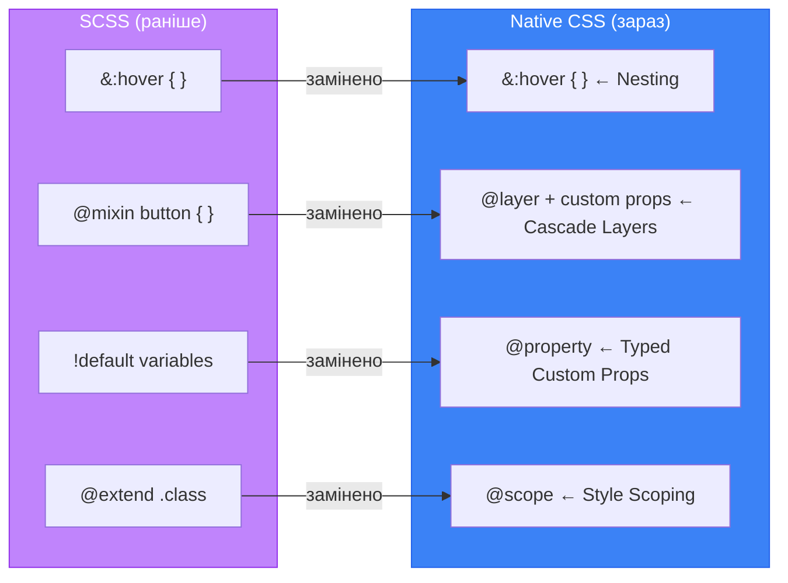

# CSS Nesting, @layer, @scope та @property: нативний препроцесор

## Коли SCSS перестав бути обов'язковим

Протягом понад десяти років Sass/SCSS був негласним стандартом у CSS-розробці. Причина проста: нативний CSS не мав вкладення правил, не мав пріоритетних шарів, не міг анімувати кастомні властивості, не мав засобів ізоляції стилів. Sass заповнював ці прогалини.

З 2023–2024 років ситуація кардинально змінилась. CSS отримав **нативне вкладення** (Nesting), **каскадні шари** (`@layer`), **звуження стилів** (`@scope`) та **типізовані Custom Properties** (`@property`). Для більшості проєктів ці чотири специфікації замінюють те, навіщо раніше потрібен був препроцесор.

Ця стаття — практичне порівняння: що ви робили у SCSS, і як це виглядає тепер у нативному CSS.

::mermaid



::

---

## CSS Nesting — вкладення правил

### Проблема: дублювання селекторів

У класичному CSS стилізація компонента з кількома станами виглядала так:

```css
/* Класичний CSS — багато повторень */
.card { background: white; border-radius: 8px; }
.card:hover { box-shadow: 0 4px 12px rgba(0,0,0,0.1); }
.card.active { border-color: #6366f1; }
.card__title { font-size: 1.25rem; color: #1e293b; }
.card__title:hover { color: #6366f1; }
.card__body { padding: 1rem; color: #64748b; }
.card__footer { border-top: 1px solid #e2e8f0; padding: 0.75rem; }
```

Щоразу потрібно повторювати `.card`, що важко підтримувати при перейменуванні. SCSS вирішував це через вкладення — і тепер це вміє нативний CSS.

### Базовий синтаксис CSS Nesting

**Підтримка:** Chrome 112+, Firefox 117+, Safari 17+

```css
/* Native CSS Nesting */
.card {
  background: white;
  border-radius: 8px;

  /* Вкладений псевдоклас */
  &:hover {
    box-shadow: 0 4px 12px rgba(0, 0, 0, 0.1);
  }

  /* Вкладена модифікація класу */
  &.active {
    border: 2px solid #6366f1;
  }

  /* Вкладений дочірній елемент (BEM) */
  & .card__title {
    font-size: 1.25rem;
    color: #1e293b;

    /* Ще глибше вкладення */
    &:hover {
      color: #6366f1;
    }
  }

  /* Вкладений псевдоелемент */
  &::before {
    content: '';
    display: block;
  }
}
```

Символ `&` — це **посилання на батьківський селектор**. Без нього CSS не знає, до якого елемента застосовувати вкладене правило.

::html-preview
```html
<div class="nesting-demo">
  <div class="n-card">
    <div class="n-card__badge">Нове</div>
    <div class="n-card__title">CSS Nesting</div>
    <div class="n-card__body">Наведіть на картку, щоб побачити hover-стан. Нативне вкладення без SCSS.</div>
    <div class="n-card__footer">
      <button class="n-btn n-btn--primary">Дізнатись більше</button>
      <button class="n-btn n-btn--ghost">Пізніше</button>
    </div>
  </div>
  <div class="n-card n-card--active">
    <div class="n-card__badge n-card__badge--active">Активна</div>
    <div class="n-card__title">Стан .active</div>
    <div class="n-card__body">Ця картка має клас <code>.n-card--active</code> — стилізована через вкладений &.active.</div>
    <div class="n-card__footer">
      <button class="n-btn n-btn--primary">Відкрити</button>
    </div>
  </div>
</div>
```
```css
.nesting-demo {
  display: flex;
  gap: 0.75rem;
  flex-wrap: wrap;
  padding: 1rem;
  background: #f1f5f9;
  font-family: system-ui, sans-serif;
}

.n-card {
  flex: 1;
  min-width: 200px;
  background: white;
  border-radius: 10px;
  border: 1.5px solid #e2e8f0;
  overflow: hidden;
  transition: box-shadow 0.2s, border-color 0.2s;
  cursor: pointer;

  &:hover {
    box-shadow: 0 8px 24px rgba(99, 102, 241, 0.12);
    border-color: #c7d2fe;
  }

  &--active {
    border-color: #6366f1;
    box-shadow: 0 4px 16px rgba(99, 102, 241, 0.15);
  }

  &__badge {
    display: inline-block;
    margin: 0.75rem 0.75rem 0;
    padding: 0.2rem 0.6rem;
    background: #ede9fe;
    color: #6366f1;
    border-radius: 100px;
    font-size: 0.72rem;
    font-weight: 700;

    &--active {
      background: #6366f1;
      color: white;
    }
  }

  &__title {
    padding: 0.4rem 0.75rem 0;
    font-size: 1rem;
    font-weight: 700;
    color: #1e293b;
  }

  &__body {
    padding: 0.4rem 0.75rem;
    font-size: 0.82rem;
    color: #64748b;
    line-height: 1.5;

    & code {
      background: #f1f5f9;
      padding: 0.1em 0.3em;
      border-radius: 3px;
      font-size: 0.9em;
    }
  }

  &__footer {
    padding: 0.6rem 0.75rem;
    border-top: 1px solid #f1f5f9;
    display: flex;
    gap: 0.5rem;
  }
}

.n-btn {
  padding: 0.35rem 0.85rem;
  border-radius: 6px;
  font-size: 0.8rem;
  font-weight: 600;
  cursor: pointer;
  border: 1.5px solid;
  font-family: inherit;
  transition: all 0.15s;

  &--primary {
    background: #6366f1;
    color: white;
    border-color: #6366f1;

    &:hover { background: #4f46e5; border-color: #4f46e5; }
  }

  &--ghost {
    background: transparent;
    color: #64748b;
    border-color: #e2e8f0;

    &:hover { background: #f8fafc; color: #1e293b; }
  }
}
```
::

### Вкладання медіа-запитів

CSS Nesting дозволяє вкладати `@media` безпосередньо всередині правила:

```css
.hero {
  padding: 2rem;
  font-size: 1rem;

  /* Замість окремого @media { .hero { } } */
  @media (min-width: 768px) {
    padding: 4rem;
    font-size: 1.25rem;
  }

  @media (min-width: 1200px) {
    padding: 6rem;
    font-size: 1.5rem;
  }
}
```

::html-preview
```html
<div class="media-nesting-demo">
  <div class="responsive-hero">
    <h2>Адаптивний заголовок</h2>
    <p>Padding та font-size змінюються через <code>@media</code> вкладений у правило компонента. Змініть ширину вікна.</p>
  </div>
  <div class="responsive-grid">
    <div class="rg-item">A</div>
    <div class="rg-item">B</div>
    <div class="rg-item">C</div>
    <div class="rg-item">D</div>
  </div>
</div>
```
```css
.media-nesting-demo {
  font-family: system-ui, sans-serif;
  color: #1e293b;
  display: flex;
  flex-direction: column;
  gap: 0.75rem;
  padding: 0.5rem;
  background: #f8fafc;
}

.responsive-hero {
  background: linear-gradient(135deg, #6366f1, #8b5cf6);
  color: white;
  border-radius: 10px;
  padding: 1rem;
  font-size: 0.85rem;

  @media (min-width: 500px) {
    padding: 2rem;
    font-size: 1rem;
  }

  & h2 { margin: 0 0 0.5rem; font-size: 1.2em; }
  & p  { margin: 0; opacity: 0.85; line-height: 1.5; }
  & code { background: rgba(255,255,255,0.2); padding: 0.1em 0.3em; border-radius: 3px; }
}

.responsive-grid {
  display: grid;
  grid-template-columns: 1fr 1fr;
  gap: 4px;

  @media (min-width: 500px) {
    grid-template-columns: repeat(4, 1fr);
  }
}

.rg-item {
  background: #6366f1;
  color: white;
  border-radius: 6px;
  padding: 1rem;
  text-align: center;
  font-weight: 800;
  font-size: 1.2rem;
}
```
::

### Порівняння SCSS vs нативний CSS

::code-group

```scss [SCSS (раніше)]
// Без компілятора — не працює в браузері
.button {
  padding: 0.6em 1.2em;
  background: $primary;
  border-radius: 6px;
  transition: all 0.15s;

  &:hover {
    background: darken($primary, 10%);
  }

  &:focus-visible {
    outline: 2px solid $primary;
    outline-offset: 2px;
  }

  &--large {
    padding: 0.8em 1.6em;
    font-size: 1.125rem;
  }

  &--ghost {
    background: transparent;
    border: 2px solid $primary;
    color: $primary;

    &:hover {
      background: rgba($primary, 0.1);
    }
  }

  @include respond-to('md') {
    padding: 0.75em 1.5em;
  }
}
```

```css [Native CSS (зараз)]
/* Пряму в браузері — без компілятора */
.button {
  padding: 0.6em 1.2em;
  background: var(--primary, #6366f1);
  border-radius: 6px;
  transition: all 0.15s;

  &:hover {
    background: color-mix(in srgb, var(--primary) 85%, black);
  }

  &:focus-visible {
    outline: 2px solid var(--primary);
    outline-offset: 2px;
  }

  &--large {
    padding: 0.8em 1.6em;
    font-size: 1.125rem;
  }

  &--ghost {
    background: transparent;
    border: 2px solid var(--primary);
    color: var(--primary);

    &:hover {
      background: color-mix(in srgb, var(--primary) 10%, transparent);
    }
  }

  @media (min-width: 768px) {
    padding: 0.75em 1.5em;
  }
}
```

::

::tip
`darken($color, 10%)` із Sass тепер замінює `color-mix(in srgb, var(--color) 85%, black)` — нативна CSS-функція, що стала доступною у 2023 році. Детальніше — у [статті про сучасні можливості CSS](/12.html-css/22.css-modern-features).
::

### Практична робота: Створення кастомного акордеона через CSS Nesting

**🎯 Очікуваний результат:** Побудова сучасного та чистого акордеона для розділу запитань-відповідей (F.A.Q.). Ми об'єднаємо всі стилі компонента (кнопки розкриття, стани ховера, анімацію вмісту, іконки стрілок та стани розкриття) всередині одного єдиного CSS-блоку `.accordion` за допомогою нативного вкладення без використання препроцесорів.

#### Крок 1: Створення структури HTML
Створіть файл `nesting.html` у вашому робочому каталозі та додайте наступну розмітку:

```html
<!DOCTYPE html>
<html lang="uk">
<head>
    <meta charset="UTF-8">
    <meta name="viewport" content="width=device-width, initial-scale=1.0">
    <title>Практична робота: CSS Nesting Accordion</title>
    <link rel="stylesheet" href="nesting.css">
</head>
<body>
    <div class="faq-container">
        <h2>Часті запитання (F.A.Q.) 💡</h2>
        
        <div class="accordion">
            <!-- Елемент акордеона 1 -->
            <div class="accordion-item is-open">
                <button class="accordion-trigger">
                    <span>Що таке нативний CSS Nesting?</span>
                    <span class="chevron"></span>
                </button>
                <div class="accordion-content">
                    <p>Це сучасна специфікація CSS, яка дозволяє вкладати стилі один в одного. Вона повністю повторює синтаксис Sass/SCSS і підтримується всіма сучасними браузерами без потреби у компіляції.</p>
                </div>
            </div>

            <!-- Елемент акордеона 2 -->
            <div class="accordion-item">
                <button class="accordion-trigger">
                    <span>Чи підтримує нативний Nesting символ "&"?</span>
                    <span class="chevron"></span>
                </button>
                <div class="accordion-content">
                    <p>Так! Символ амперсанда (&) є обов'язковим посиланням на батьківський селектор, що дозволяє легко додавати псевдокласи, такі як :hover, модифікатори станів та псевдоелементи.</p>
                </div>
            </div>
        </div>
    </div>

    <script>
        // Простий скрипт для перемикання станів розкриття
        const items = document.querySelectorAll('.accordion-item');
        items.forEach(item => {
            const trigger = item.querySelector('.accordion-trigger');
            trigger.addEventListener('click', () => {
                const isOpen = item.classList.contains('is-open');
                items.forEach(i => i.classList.remove('is-open'));
                if (!isOpen) {
                    item.classList.add('is-open');
                }
            });
        });
    </script>
</body>
</html>
```

#### Крок 2: Додавання стилів CSS
Створіть у тій же папці файл `nesting.css` та додайте такі стилі:

```css
/* Базові стилі */
body {
    background-color: #0b0f19;
    color: white;
    font-family: system-ui, sans-serif;
    display: flex;
    justify-content: center;
    align-items: center;
    min-height: 100vh;
    margin: 0;
}

.faq-container {
    width: 100%;
    max-width: 600px;
    padding: 1.5rem;
}

h2 {
    text-align: center;
    margin-bottom: 2rem;
    color: #3b82f6;
}

/* Крок 3: Написання стилів за допомогою CSS Nesting */
.accordion {
    border: 1px solid #1e293b;
    border-radius: 12px;
    overflow: hidden;
    background-color: #111827;

    /* Вкладений клас елемента акордеона */
    & .accordion-item {
        border-bottom: 1px solid #1e293b;
        transition: background-color 0.2s ease;

        /* Видаляємо рамку з останнього елемента */
        &:last-child {
            border-bottom: none;
        }

        /* Оголошуємо стилі для кнопки-тригера */
        & .accordion-trigger {
            width: 100%;
            background: transparent;
            border: none;
            color: white;
            padding: 1.25rem 1.5rem;
            text-align: left;
            font-size: 1rem;
            font-weight: 600;
            cursor: pointer;
            display: flex;
            justify-content: space-between;
            align-items: center;
            transition: color 0.2s;

            /* Ефект наведення на кнопку розкриття */
            &:hover {
                color: #3b82f6;
                
                /* Одночасно підсвічуємо стрілочку при наведенні */
                & .chevron {
                    border-color: #3b82f6;
                }
            }

            /* Стрілочка вибору */
            & .chevron {
                width: 8px;
                height: 8px;
                border-right: 2px solid #94a3b8;
                border-bottom: 2px solid #94a3b8;
                transform: rotate(45deg);
                transition: transform 0.3s ease, border-color 0.2s;
            }
        }

        /* Стилі для контенту (за замовчуванням прихований) */
        & .accordion-content {
            max-height: 0;
            overflow: hidden;
            transition: max-height 0.3s cubic-bezier(0.4, 0, 0.2, 1);
            padding: 0 1.5rem;

            & p {
                margin: 0;
                padding-bottom: 1.25rem;
                color: #94a3b8;
                font-size: 0.9rem;
                line-height: 1.6;
            }
        }

        /* Модифікатор стану розкриття елемента (.accordion-item.is-open) */
        &.is-open {
            background-color: #1e293b;

            /* Зміна стрілки */
            & .chevron {
                transform: rotate(-135deg);
                border-color: #3b82f6;
            }

            /* Розкриття контенту */
            & .accordion-content {
                max-height: 200px;
            }
        }
    }
}
```

#### Крок 3: Перевірка та аналіз результату
1. Відкрийте файл `nesting.html` у вашому веб-браузері.
2. Спробуйте натискати на елементи акордеона. Вони плавно розкриваються та закриваються.
3. Проаналізуйте файл `nesting.css`. Зверніть увагу, як логічно згруповано та вкладено стилі внутрішніх тегів, модифікатора `.is-open` та псевдокласів `:hover` всередині одного батьківського класу `.accordion` — без жодного дублювання селекторів.

---

## `@layer` — Каскадні шари (Cascade Layers)

### Проблема специфічності

Уявіть: ви підключаєте бібліотеку компонентів. Вона задає `.button { background: blue }` з певною специфічністю. Ваш код задає `.button { background: green }`. Хто переможе? Залежить від порядку підключення та специфічності — і це часто непередбачувано.

Ця проблема існувала роками: CSS-in-JS, BEM, CSS Modules — всі вони по-різному намагались її вирішити. `@layer` дає нативне рішення: явно оголошений **пріоритет шарів**.

**Підтримка:** Chrome 99+, Firefox 97+, Safari 15.4+

### Синтаксис @layer

```css
/* Крок 1: оголосити порядок шарів (від найнижчого до найвищого пріоритету) */
@layer base, components, utilities;

/* Крок 2: наповнити шари */
@layer base {
  /* Базові стилі, CSS Reset */
  * { box-sizing: border-box; }
  body { margin: 0; font-family: system-ui, sans-serif; }
  h1, h2, h3 { line-height: 1.2; }
}

@layer components {
  /* Стилі компонентів */
  .button {
    padding: 0.6em 1.2em;
    background: #6366f1;
    color: white;
    border-radius: 6px;
    border: none;
    cursor: pointer;
  }
}

@layer utilities {
  /* Утиліти мають найвищий пріоритет серед шарів */
  .hidden { display: none !important; }
  .sr-only { position: absolute; width: 1px; height: 1px; overflow: hidden; clip: rect(0,0,0,0); }
}

/* Стилі поза @layer мають НАЙВИЩИЙ пріоритет — вище всіх шарів */
.button {
  background: #ec4899; /* Переможе компонент у @layer */
}
```

::html-preview
```html
<div class="layer-demo">
  <p class="layer-explain">
    Пріоритет: <strong>без шару</strong> &gt; utilities &gt; components &gt; base
  </p>
  <div class="layer-boxes">
    <div class="layer-box lb-base">
      @layer base<br><small>найнижчий пріоритет</small>
    </div>
    <div class="layer-box lb-components">
      @layer components<br><small>середній</small>
    </div>
    <div class="layer-box lb-utilities">
      @layer utilities<br><small>вищий</small>
    </div>
    <div class="layer-box lb-unlayered">
      без @layer<br><small>найвищий!</small>
    </div>
  </div>
  <div class="conflict-demo">
    <p class="conflict-label">Демо: всі правила задають <code>background</code>, перемагає вищий пріоритет</p>
    <div class="conflict-btn">Ця кнопка</div>
  </div>
</div>
```
```css
.layer-demo {
  padding: 1rem;
  background: #f8fafc;
  font-family: system-ui, sans-serif;
  font-size: 0.85rem;
  color: #1e293b;
  display: flex;
  flex-direction: column;
  gap: 0.75rem;
}
.layer-explain { margin: 0; color: #64748b; }
.layer-explain strong { color: #1e293b; }
.layer-boxes { display: flex; gap: 4px; flex-wrap: wrap; }
.layer-box {
  flex: 1;
  min-width: 80px;
  padding: 0.6rem;
  border-radius: 6px;
  font-size: 0.78rem;
  font-weight: 700;
  text-align: center;
  color: white;
  line-height: 1.3;
}
.layer-box small { display: block; font-weight: 400; font-size: 0.7rem; opacity: 0.85; }
.lb-base       { background: #94a3b8; }
.lb-components { background: #6366f1; }
.lb-utilities  { background: #8b5cf6; }
.lb-unlayered  { background: #ec4899; }

@layer ld-base {
  .conflict-btn { background: #94a3b8; }
}
@layer ld-components {
  .conflict-btn { background: #6366f1; }
}
@layer ld-utilities {
  .conflict-btn { background: #8b5cf6; }
}
/* Без шару — найвищий пріоритет */
.conflict-btn { background: #ec4899; }

.conflict-demo {
  background: white;
  border-radius: 8px;
  border: 1px solid #e2e8f0;
  padding: 0.75rem;
}
.conflict-label { margin: 0 0 0.5rem; color: #64748b; font-size: 0.78rem; }
.conflict-label code { background: #f1f5f9; padding: 0.1em 0.3em; border-radius: 3px; }
.conflict-btn {
  display: inline-block;
  padding: 0.5rem 1.25rem;
  color: white;
  border-radius: 6px;
  font-weight: 700;
  font-size: 0.85rem;
}
```
::

### @layer для інтеграції сторонніх бібліотек

Найпрактичніший сценарій — ізолювати стилі бібліотеки у шарі з **найнижчим** пріоритетом:

```css
/* Ваші власні шари — оголошені першими */
@layer reset, third-party, base, components, utilities;

/* Стилі бібліотеки — потрапляють у шар з низьким пріоритетом */
@import url('./normalize.css') layer(reset);
@import url('./bootstrap.css') layer(third-party);

/* Ваші компоненти ЗАВЖДИ перевизначать бібліотеку */
@layer components {
  .button {
    /* Ці стилі матимуть вищий пріоритет за Bootstrap .button,
       навіть без !important та без підвищення специфічності */
    background: var(--brand);
  }
}
```

::note
Стилі, записані **без** `@layer`, мають пріоритет **вище** будь-якого шару незалежно від специфічності. Це дозволяє зберегти «аварійний вихід» для критичних перевизначень.
::

### Практична робота: Створення багаторівневої системи каскадних шарів (@layer) для дизайн-системи

**🎯 Очікуваний результат:** Розробка надійної архітектури CSS-стилів із використанням трьох каскадних шарів: `reset`, `components` та `overrides`. Ми перевіримо, як явно заданий порядок шарів гарантує, що стилі з шару вищого рівня (`overrides`) завжди перемагатимуть стилі з шарів нижчих рівнів (`components` та `reset`), без необхідності штучного збільшення специфічності селекторів або використання `!important`.

#### Крок 1: Створення структури HTML
Створіть файл `layers.html` у вашому робочому каталозі та додайте наступну розмітку:

```html
<!DOCTYPE html>
<html lang="uk">
<head>
    <meta charset="UTF-8">
    <meta name="viewport" content="width=device-width, initial-scale=1.0">
    <title>Практична робота: Каскадні шари (@layer)</title>
    <link rel="stylesheet" href="layers.css">
</head>
<body>
    <div class="app-container">
        <h2>Дизайн-система на каскадних шарах 🎨</h2>
        
        <div class="card-box">
            <h3>Стандартний компонент</h3>
            <p>Ця картка оформлена через стандартні стилі компонента в шарі <code>components</code>.</p>
            <button class="sys-btn">Звичайна кнопка</button>
        </div>

        <!-- Додаємо клас-модифікатор .theme-dark -->
        <div class="card-box theme-dark">
            <h3>Темний оверрайд (Dark Mode)</h3>
            <p>Ця картка перевизначена у шарі <code>overrides</code>. Її стилі мають вищий пріоритет за замовчуванням.</p>
            <button class="sys-btn">Оновлена кнопка</button>
        </div>
    </div>
</body>
</html>
```

#### Крок 2: Додавання стилів CSS
Створіть у тій же папці файл `layers.css` та додайте такі стилі:

```css
/* Крок 1: Оголошуємо чіткий порядок пріоритету шарів від найменшого до найбільшого */
@layer reset, components, overrides;

/* Крок 2: Наповнюємо базовий шар скидання (reset) */
@layer reset {
    body {
        margin: 0;
        background-color: #f8fafc;
        color: #0f172a;
        font-family: system-ui, sans-serif;
        padding: 2rem;
    }

    /* У Reset-шарі задаємо агресивні стилі для заголовків і кнопок */
    h2, h3 {
        margin: 0 0 1rem 0;
        color: black;
    }

    .sys-btn {
        background-color: #94a3b8; /* За замовчуванням сіра кнопка */
        border: none;
        padding: 0.5rem 1rem;
        cursor: pointer;
    }
}

/* Крок 3: Наповнюємо шар компонентів (components) */
@layer components {
    .app-container {
        max-width: 600px;
        margin: 0 auto;
        display: flex;
        flex-direction: column;
        gap: 1.5rem;
    }

    .card-box {
        background-color: white;
        border: 1px solid #e2e8f0;
        border-radius: 12px;
        padding: 1.5rem;
        box-shadow: 0 4px 6px -1px rgba(0, 0, 0, 0.05);
    }

    .card-box p {
        color: #475569;
        font-size: 0.9rem;
        line-height: 1.5;
        margin-bottom: 1.25rem;
    }

    /* Стилізуємо кнопку компонента */
    .sys-btn {
        background-color: #3b82f6; /* Синій колір */
        color: white;
        border-radius: 8px;
        font-weight: 600;
        transition: background-color 0.15s;

        &:hover {
            background-color: #1d4ed8;
        }
    }
}

/* Крок 4: Наповнюємо шар перевизначень (overrides) */
@layer overrides {
    /* Навіть із низькою специфікацією, стилі з цього шару перемагають попередні */
    .theme-dark {
        background-color: #0f172a; /* Темний фон картки */
        color: white;
        border-color: #1e293b;

        & h3 {
            color: #3b82f6;
        }

        & p {
            color: #94a3b8;
        }

        /* Перевизначаємо стиль кнопки у темній темі */
        & .sys-btn {
            background-color: #10b981; /* Зелений колір кнопки */

            &:hover {
                background-color: #059669;
            }
        }
    }
}
```

#### Крок 3: Перевірка та аналіз результату
1. Відкрийте файл `layers.html` у вашому веб-браузері.
2. Зверніть увагу на другу картку з класом `.theme-dark`. Вона повністю змінила тему оформлення (фон став темно-синім, а кнопка зеленою), хоча її селектори всередині шару `@layer overrides` мають таку ж саму специфічність, що й у шарі `components`.
3. Зверніть увагу на кнопку в першій картці. Вона відображається синьою (стиль із компонента переміг базовий сірий колір із ресету), хоча у файлі CSS селектор ресету `.sys-btn` був написаний вище за структурою. Пріоритет шарів повністю нівелював випадковий порядок завантаження коду!

---

## `@scope` — Обмеження стилів

### Проблема: стилі, що «витікають»

CSS-селектори глобальні за замовчуванням. `.title` у кухонному таймері може вплинути на `.title` у модальному вікні, навіть якщо вони далеко у DOM. Це проблема, яку вирішують CSS Modules, Shadow DOM, BEM-конвенції. `@scope` — нативне вирішення.

**Підтримка:** Chrome 118+, Safari 17.4+, Firefox (у розробці)

```css
/* Стилі активні ЛИШЕ всередині .card */
@scope (.card) {
  /* Тут можна писати короткі селектори без боязні конфліктів */
  .title {
    font-size: 1.25rem;
    color: #1e293b;
  }

  .body {
    color: #64748b;
  }

  /* Виключення: стилі НЕ торкнуться .nested-card та його нащадків */
  @scope (.card) to (.nested-card) {
    .title { color: #6366f1; }
  }
}
```

::html-preview
```html
<div class="scope-demo">
  <p class="scope-note">@scope (.product-card) — стилі .title та .price діють лише всередині</p>
  <div class="scope-layout">
    <div class="product-card">
      <div class="title">AirPods Pro</div>
      <div class="price">$249</div>
      <div class="desc">Активне шумозаглушення</div>
    </div>
    <div class="article-card">
      <div class="title">Стаття: CSS у 2024</div>
      <div class="price">Безкоштовно</div>
      <div class="desc">Нові можливості мови</div>
    </div>
  </div>
  <p class="scope-note" style="margin-top: 0.5rem">
    Обидва компоненти мають <code>.title</code> та <code>.price</code> — стилі не конфліктують завдяки @scope
  </p>
</div>
```
```css
.scope-demo {
  padding: 1rem;
  background: #f8fafc;
  font-family: system-ui, sans-serif;
  font-size: 0.85rem;
  color: #1e293b;
}
.scope-note { margin: 0 0 0.5rem; color: #64748b; font-size: 0.78rem; }
.scope-note code { background: #f1f5f9; padding: 0.1em 0.3em; border-radius: 3px; }
.scope-layout { display: flex; gap: 0.75rem; flex-wrap: wrap; }

/* Стилі картки продукту — ізольовані через @scope */
@scope (.product-card) {
  :scope {
    background: white;
    border-radius: 10px;
    border: 1.5px solid #e2e8f0;
    padding: 1rem;
    flex: 1;
    min-width: 140px;
    display: flex;
    flex-direction: column;
    gap: 0.25rem;
  }
  .title {
    font-size: 1rem;
    font-weight: 700;
    color: #1e293b;
  }
  .price {
    font-size: 1.2rem;
    font-weight: 800;
    color: #6366f1;
  }
  .desc {
    font-size: 0.78rem;
    color: #64748b;
  }
}

/* Стилі статті — інші, не конфліктують */
@scope (.article-card) {
  :scope {
    background: #fef3c7;
    border-radius: 10px;
    border: 1.5px solid #fcd34d;
    padding: 1rem;
    flex: 1;
    min-width: 140px;
    display: flex;
    flex-direction: column;
    gap: 0.25rem;
  }
  .title {
    font-size: 0.95rem;
    font-weight: 700;
    color: #92400e;
  }
  .price {
    font-size: 0.85rem;
    font-weight: 700;
    color: #d97706;
    text-transform: uppercase;
    letter-spacing: 0.05em;
  }
  .desc {
    font-size: 0.78rem;
    color: #b45309;
  }
}
```
::

### Практична робота: Ізольована стилізація складного віджета коментарів за допомогою `@scope`

**🎯 Очікуваний результат:** Створення двох незалежних інтерфейсних блоків на одній сторінці: картки відгуку користувача (`.review-card`) та картки повідомлення чату (`.chat-card`). Обидві картки будуть використовувати абсолютно однакові назви підкласів (наприклад, `.avatar`, `.title`, `.text`, `.time`), проте стилі для них будуть повністю ізольовані за допомогою директиви `@scope`. Це запобіжить витоку стилів без використання префіксів БЕМ чи збирання модулів.

#### Крок 1: Створення структури HTML
Створіть файл `scope.html` у вашому робочому каталозі та додайте наступну розмітку:

```html
<!DOCTYPE html>
<html lang="uk">
<head>
    <meta charset="UTF-8">
    <meta name="viewport" content="width=device-width, initial-scale=1.0">
    <title>Практична робота: CSS @scope</title>
    <link rel="stylesheet" href="scope.css">
</head>
<body>
    <div class="playground">
        <h2>Експеримент із директивою @scope 🎯</h2>
        
        <!-- Компонент 1: Картка відгуку -->
        <div class="review-card">
            <div class="header">
                <div class="avatar">⭐</div>
                <div>
                    <div class="title">Анна Петренко</div>
                    <div class="time">Сьогодні о 14:20</div>
                </div>
            </div>
            <div class="text">Цей сервіс працює неймовірно стабільно! Дуже рекомендую сучасну команду розробників.</div>
        </div>

        <!-- Компонент 2: Картка чату -->
        <div class="chat-card">
            <div class="header">
                <div class="avatar">💬</div>
                <div>
                    <div class="title">Техпідтримка</div>
                    <div class="time">15 хв тому</div>
                </div>
            </div>
            <div class="text">Вітаємо! Чим ми можемо допомогти вам у налаштуванні CSS @scope на вашому сервері?</div>
        </div>
    </div>
</body>
</html>
```

#### Крок 2: Додавання стилів CSS
Створіть у тій же папці файл `scope.css` та додайте такі стилі:

```css
/* Базові стилі */
body {
    background-color: #0b0f19;
    color: white;
    font-family: system-ui, sans-serif;
    display: flex;
    justify-content: center;
    align-items: center;
    min-height: 100vh;
    margin: 0;
}

.playground {
    width: 100%;
    max-width: 500px;
    padding: 1.5rem;
    display: flex;
    flex-direction: column;
    gap: 1.5rem;
}

h2 {
    text-align: center;
    color: #3b82f6;
    margin-bottom: 1rem;
}

/* Крок 3: Ізолюємо стилі першої картки за допомогою @scope */
@scope (.review-card) {
    /* Стилізуємо безпосередньо сам кореневий елемент області видимості */
    :scope {
        background-color: #1e293b;
        border: 1.5px solid #e2e8f0;
        border-radius: 12px;
        padding: 1.25rem;
        box-shadow: 0 4px 15px rgba(255, 255, 255, 0.05);
    }

    .header {
        display: flex;
        align-items: center;
        gap: 0.75rem;
        margin-bottom: 0.75rem;
    }

    .avatar {
        background-color: #f59e0b;
        width: 35px;
        height: 35px;
        border-radius: 50%;
        display: flex;
        align-items: center;
        justify-content: center;
        font-size: 1rem;
    }

    .title {
        font-weight: 700;
        font-size: 0.95rem;
        color: white;
    }

    .time {
        font-size: 0.75rem;
        color: #94a3b8;
    }

    .text {
        font-size: 0.85rem;
        color: #cbd5e1;
        line-height: 1.5;
    }
}

/* Крок 4: Ізолюємо стилі другої картки за допомогою @scope */
@scope (.chat-card) {
    /* Кореневий стиль для чат-картки */
    :scope {
        background-color: #0c4a6e; /* Темно-синій затишний колір підтримки */
        border: 1.5px solid #0284c7;
        border-radius: 12px 12px 2px 12px; /* Хвостик повідомлення */
        padding: 1.25rem;
        align-self: flex-end; /* Зсув вбік */
        width: 90%;
    }

    .header {
        display: flex;
        align-items: center;
        gap: 0.75rem;
        margin-bottom: 0.75rem;
    }

    .avatar {
        background-color: #0284c7;
        width: 35px;
        height: 35px;
        border-radius: 8px; /* Квадратна іконка у чаті */
        display: flex;
        align-items: center;
        justify-content: center;
        font-size: 1rem;
    }

    .title {
        font-weight: 700;
        font-size: 0.95rem;
        color: #e0f2fe;
    }

    .time {
        font-size: 0.75rem;
        color: #38bdf8;
    }

    .text {
        font-size: 0.85rem;
        color: #f0f9ff;
        line-height: 1.5;
    }
}
```

#### Крок 3: Перевірка та аналіз результату
1. Відкрийте файл `scope.html` у вашому веб-браузері.
2. Зверніть увагу на два блоки. Обидва елементи мають внутрішні класи `.avatar`, `.title` та `.text`, проте їхні стилі відображаються повністю коректно (у картки відгуків аватар круглий та жовтий, а в чату — квадратний та синій).
3. Дослідіть код у DevTools. Ви побачите, що стилі були застосовані нативно завдяки селекторам типу `(@scope (.review-card)) .title`, що забезпечує ідеальну локальну інкапсуляцію CSS без використання будь-яких зовнішніх збірників коду!

---

## `@property` — Типізовані Custom Properties

### Чому звичайні CSS змінні не можна анімувати

CSS Custom Properties (`--color: #6366f1`) — потужний інструмент, але вони мають обмеження: браузер не знає їх **типу**. Для нього `--color` — просто рядок. Тому `transition: --color 0.3s` не спрацює — браузер не знає, як інтерполювати «від рядка до рядка».

`@property` вирішує це, дозволяючи **зареєструвати** кастомну властивість із типом, початковим значенням та поведінкою наслідування.

**Підтримка:** Chrome 85+, Safari 16.4+, Firefox 128+

```css
@property --hue {
  syntax: '<number>';         /* тип: число */
  inherits: false;            /* не наслідується від батька */
  initial-value: 0;           /* початкове значення */
}

@property --brand-color {
  syntax: '<color>';
  inherits: true;
  initial-value: #6366f1;
}

@property --progress {
  syntax: '<percentage>';
  inherits: false;
  initial-value: 0%;
}
```

### Анімація Custom Properties через @property

::html-preview
```html
<div class="property-demo">
  <p class="pd-label">Анімовані CSS Custom Properties через @property:</p>

  <div class="animated-gradient">
    <span>Gradient анімація через --hue</span>
  </div>

  <div class="progress-ring-wrap">
    <div class="progress-ring">
      <span>75%</span>
    </div>
    <p class="pd-hint">Progress ring через --progress custom property</p>
  </div>

  <div class="color-morph">
    <span>Колір переливається через --brand-color</span>
  </div>
</div>
```
```css
@property --hue {
  syntax: '<number>';
  inherits: false;
  initial-value: 240;
}

@property --progress {
  syntax: '<percentage>';
  inherits: false;
  initial-value: 0%;
}

@property --morph-color {
  syntax: '<color>';
  inherits: false;
  initial-value: #6366f1;
}

.property-demo {
  padding: 1rem;
  background: #f8fafc;
  font-family: system-ui, sans-serif;
  font-size: 0.85rem;
  color: #1e293b;
  display: flex;
  flex-direction: column;
  gap: 0.75rem;
}
.pd-label { margin: 0; color: #64748b; font-style: italic; }
.pd-hint  { margin: 0.25rem 0 0; font-size: 0.75rem; color: #64748b; }

/* Анімований градієнт через --hue */
.animated-gradient {
  --hue: 240;
  background: hsl(var(--hue), 80%, 60%);
  border-radius: 8px;
  padding: 1rem;
  color: white;
  font-weight: 700;
  text-align: center;
  animation: hue-rotate 4s linear infinite;
}

@keyframes hue-rotate {
  to { --hue: 600; }
}

/* Progress ring */
.progress-ring-wrap {
  display: flex;
  align-items: center;
  gap: 1rem;
}

.progress-ring {
  --progress: 0%;
  width: 80px;
  height: 80px;
  border-radius: 50%;
  background: conic-gradient(
    #6366f1 var(--progress),
    #e2e8f0 var(--progress)
  );
  display: flex;
  align-items: center;
  justify-content: center;
  font-weight: 800;
  font-size: 1rem;
  color: #1e293b;
  position: relative;
  animation: fill-progress 2s ease-out forwards;
}

.progress-ring::before {
  content: '';
  position: absolute;
  inset: 8px;
  border-radius: 50%;
  background: #f8fafc;
}

.progress-ring span {
  position: relative;
  z-index: 1;
}

@keyframes fill-progress {
  to { --progress: 75%; }
}

/* Color morph */
.color-morph {
  --morph-color: #6366f1;
  background: var(--morph-color);
  border-radius: 8px;
  padding: 1rem;
  color: white;
  font-weight: 700;
  text-align: center;
  animation: color-shift 3s ease-in-out infinite alternate;
}

@keyframes color-shift {
  to { --morph-color: #ec4899; }
}
```
::

Зверніть: `animation: hue-rotate 4s linear infinite` плавно анімує `--hue` від `240` до `600`, а `hsl(var(--hue), 80%, 60%)` автоматично оновлює градієнт. Без `@property` такого не досягти — браузер не знав би, що `--hue` — це число, між яким можна інтерполювати.

### `@property` для типізованих дефолтів

```css
/* Без @property: якщо --size не задано, результат непередбачуваний */
.box {
  width: var(--size); /* undefined? '0'? */
}

/* З @property: завжди є initial-value */
@property --box-size {
  syntax: '<length>';
  inherits: false;
  initial-value: 100px; /* гарантований fallback */
}

.box {
  width: var(--box-size); /* завжди 100px, якщо не перевизначено */
}

/* Можна перевизначати як звичайно */
.box--large {
  --box-size: 200px;
}
```

### Практична робота: Створення кругового індикатора прогресу з анімованою Custom Property через `@property`

**🎯 Очікуваний результат:** Створення анімованого кругового індикатора (Circular Loader) за допомогою конічного градієнта (`conic-gradient`). Ми використаємо `@property` для реєстрації типізованої числової кастомної властивості `--loader-angle` (тип `<angle>`), щоб браузер міг плавно анімувати кут нахилу градієнта через звичайний `@keyframes` та `transition`, чого неможливо досягти у звичайних нестандартизованих CSS-змінних.

#### Крок 1: Створення структури HTML
Створіть файл `property.html` у вашому робочому каталозі та додайте наступну розмітку:

```html
<!DOCTYPE html>
<html lang="uk">
<head>
    <meta charset="UTF-8">
    <meta name="viewport" content="width=device-width, initial-scale=1.0">
    <title>Практична робота: @property Animation</title>
    <link rel="stylesheet" href="property.css">
</head>
<body>
    <div class="loader-wrap">
        <h2>Анімований лоадер через @property ⚡</h2>
        
        <!-- Круговий завантажувач -->
        <div class="circular-loader">
            <span class="percentage">75%</span>
        </div>
        
        <p class="description">Браузер плавно анімує кутову властивість <code>--loader-angle</code> від <code>0deg</code> до <code>270deg</code>.</p>
    </div>
</body>
</html>
```

#### Крок 2: Додавання стилів CSS
Створіть у тій же папці файл `property.css` та додайте такі стилі:

```css
/* Крок 1: Реєструємо типізовану кастомну властивість для плавних анімацій */
@property --loader-angle {
    syntax: '<angle>';
    inherits: false;
    initial-value: 0deg;
}

/* Базові стилі */
body {
    background-color: #0b0f19;
    color: white;
    font-family: system-ui, sans-serif;
    display: flex;
    justify-content: center;
    align-items: center;
    min-height: 100vh;
    margin: 0;
}

.loader-wrap {
    text-align: center;
    max-width: 400px;
    padding: 2rem;
}

h2 {
    color: #3b82f6;
    margin-bottom: 2.5rem;
}

/* Крок 2: Оформлюємо круговий індикатор */
.circular-loader {
    /* Визначаємо початкове значення для змінної */
    --loader-angle: 0deg;
    
    width: 150px;
    height: 150px;
    border-radius: 50%;
    margin: 0 auto 2rem auto;
    
    /* Створюємо кругову заливку через conic-gradient із використанням нашої змінної */
    background: conic-gradient(
        #3b82f6 var(--loader-angle),
        #1e293b var(--loader-angle)
    );
    
    display: flex;
    align-items: center;
    justify-content: center;
    position: relative;
    box-shadow: 0 10px 25px rgba(59, 130, 246, 0.15);
    
    /* Запускаємо плавну нескінченну анімацію */
    animation: rotate-loader 3s cubic-bezier(0.4, 0, 0.2, 1) infinite;
}

/* Крок 3: Створюємо внутрішній круг для маскування (порожнина лоадера) */
.circular-loader::before {
    content: '';
    position: absolute;
    inset: 12px; /* Ширина лінії завантажувача */
    background-color: #0b0f19;
    border-radius: 50%;
}

/* Текст відсотків по центру */
.percentage {
    position: relative;
    z-index: 1;
    font-size: 1.75rem;
    font-weight: 800;
    color: #3b82f6;
}

/* Крок 4: Створюємо анімацію для нашої зареєстрованої властивості */
@keyframes rotate-loader {
    0% {
        --loader-angle: 0deg;
    }
    50% {
        --loader-angle: 270deg; /* Плавне розгортання дуги */
    }
    100% {
        --loader-angle: 360deg; /* Повне коло */
    }
}

.description {
    font-size: 0.9rem;
    color: #94a3b8;
    line-height: 1.6;
}

.description code {
    background-color: #1e293b;
    padding: 0.2rem 0.4rem;
    border-radius: 4px;
    color: #f43f5e;
}
```

#### Крок 3: Перевірка та аналіз результату
1. Відкрийте файл `property.html` у вашому веб-браузері.
2. Зверніть увагу на плавне розкручування синього індикатора за годинниковою стрілкою.
3. Проаналізуйте файл `property.css`. Без використання директиви `@property` браузер сприймав би значення змінної `--loader-angle` як звичайний текст, і тому кругова заливка змінювалася б миттєво і ривками між початковим та кінцевим значеннями keyframes. Проте завдяки реєстрації типу `<angle>`, браузер нативно розраховує кожен проміжний градус (наприклад, `45deg`, `90deg`, `180deg`), забезпечуючи ідеально плавний рух анімації!

---

## Нативний CSS замість SCSS: практичне порівняння

::html-preview
```html
<div class="comparison-demo">
  <p class="cd-title">Компонент кнопки: SCSS vs Native CSS</p>
  <div class="btn-showcase">
    <button class="nc-btn nc-btn--primary">Primary</button>
    <button class="nc-btn nc-btn--secondary">Secondary</button>
    <button class="nc-btn nc-btn--danger">Danger</button>
    <button class="nc-btn nc-btn--primary" disabled>Disabled</button>
    <button class="nc-btn nc-btn--primary nc-btn--lg">Large</button>
    <button class="nc-btn nc-btn--primary nc-btn--sm">Small</button>
  </div>
  <p class="cd-note">Всі варіанти — через CSS Nesting + Custom Properties. Без SCSS.</p>
</div>
```
```css
@property --btn-bg {
  syntax: '<color>';
  inherits: false;
  initial-value: #6366f1;
}

@property --btn-color {
  syntax: '<color>';
  inherits: false;
  initial-value: white;
}

.comparison-demo {
  padding: 1rem;
  background: #f8fafc;
  font-family: system-ui, sans-serif;
  font-size: 0.85rem;
  color: #1e293b;
}
.cd-title { margin: 0 0 0.75rem; font-weight: 700; color: #64748b; }
.cd-note  { margin: 0.75rem 0 0; font-size: 0.75rem; color: #94a3b8; font-style: italic; }
.btn-showcase { display: flex; flex-wrap: wrap; gap: 0.5rem; }

.nc-btn {
  --btn-bg: #6366f1;
  --btn-color: white;
  --btn-border: transparent;

  display: inline-flex;
  align-items: center;
  gap: 0.4rem;
  padding: 0.5em 1.1em;
  background: var(--btn-bg);
  color: var(--btn-color);
  border: 1.5px solid var(--btn-border);
  border-radius: 7px;
  font-size: 0.875rem;
  font-weight: 600;
  font-family: inherit;
  cursor: pointer;
  transition: all 0.15s;

  &:hover:not(:disabled) {
    background: color-mix(in srgb, var(--btn-bg) 85%, black);
  }

  &:focus-visible {
    outline: 2px solid var(--btn-bg);
    outline-offset: 2px;
  }

  &:disabled {
    opacity: 0.45;
    cursor: not-allowed;
  }

  &--primary {
    --btn-bg: #6366f1;
    --btn-color: white;
  }

  &--secondary {
    --btn-bg: transparent;
    --btn-color: #6366f1;
    --btn-border: #6366f1;

    &:hover:not(:disabled) {
      --btn-bg: #ede9fe;
    }
  }

  &--danger {
    --btn-bg: #ef4444;
    --btn-color: white;
  }

  &--lg {
    padding: 0.7em 1.5em;
    font-size: 1rem;
  }

  &--sm {
    padding: 0.3em 0.75em;
    font-size: 0.75rem;
  }
}
```
::

---

## Практика

::steps

### Рівень 1 — Рефакторинг SCSS у Native CSS

Перепишіть цей SCSS у нативний CSS, зберігши всю функціональність:

```scss
.nav {
  display: flex;
  gap: 0.5rem;
  padding: 0.75rem;
  background: #1e293b;

  &__link {
    color: #94a3b8;
    padding: 0.5rem 1rem;
    border-radius: 6px;
    text-decoration: none;
    transition: all 0.15s;

    &:hover { color: white; background: rgba(255,255,255,0.1); }
    &.active { color: white; background: #6366f1; }
  }

  @include respond-to('sm') {
    flex-direction: column;
  }
}
```

### Рівень 2 — @layer система з пріоритетами

Створіть CSS-систему для бібліотеки компонентів:
1. Оголосіть шари: `reset`, `tokens`, `components`, `overrides`
2. У `reset` — скидання `margin`, `padding`, `box-sizing`
3. У `tokens` — змінні `--color-primary`, `--spacing-base`, `--radius`
4. У `components` — компонент `.card` з базовими стилями
5. У `overrides` — темна тема, що перевизначає кольори картки

Переконайтесь, що `overrides` перемагає `components` без `!important`.

### Рівень 3 — Анімована картка через @property

Створіть картку товару з такими анімованими властивостями:
- `--card-elevation` (тип `<number>`) — анімує `box-shadow` при hover
- `--card-accent` (тип `<color>`) — анімує колір акцентного бордера від `#e2e8f0` до `#6366f1` при hover
- `--badge-progress` (тип `<percentage>`) — запускає conic-gradient «прогрес» при завантаженні сторінки

Використайте `@property` + CSS Nesting для компактного коду.

::

---

## Підсумок

::card-group

::card{title="🔗 CSS Nesting" icon="i-lucide-git-branch"}

`&` посилається на батьківський селектор. Вкладайте псевдокласи, псевдоелементи, модифікатори та `@media` прямо у правило компонента. Chrome 112+, FF 117+, Safari 17+.

::

::card{title="📚 @layer" icon="i-lucide-layers"}

Явний пріоритет каскадного шару: `@layer base, components, utilities`. Стилі вище у списку — нижчий пріоритет. Без шару — найвищий. Ізолюйте бібліотеки через `@import ... layer(third-party)`.

::

::card{title="🔒 @scope" icon="i-lucide-shield"}

`@scope (.card) { .title { } }` — стилі діють лише всередині `.card`. Замінює BEM-префікси та CSS Modules для базових сценаріїв. Chrome 118+, Safari 17.4+.

::

::card{title="⚡ @property" icon="i-lucide-zap"}

Типізовані custom properties: `syntax`, `inherits`, `initial-value`. Дозволяє **анімувати** `var(--color)`, `var(--progress)`, `var(--angle)`. Без `@property` — лише статичні значення.

::

::
