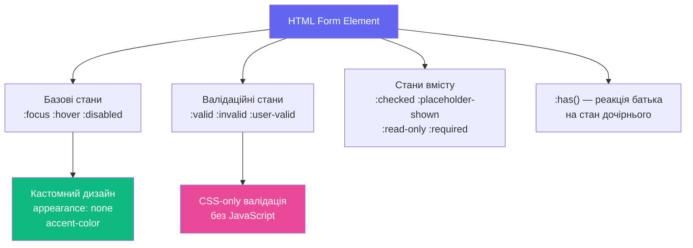

# CSS для форм та інтерактивних станів

## Форми — найстресовіша частина верстки

«Зробіть форму гарною» — це речення, яке розробники та дизайнери трактують діаметрально протилежно. Дизайнер бачить чисті, мінімалістичні поля з плавними переходами. Розробник знає правду: браузери мають глибоко вкорінені стилі форм, які **активно опираються** CSS. Checkbox на macOS виглядає інакше, ніж на Windows. `<select>` майже неможливо стилізувати. `<input type="range">` — окремий кошмар.

До 2021 року єдиним шляхом була повна заміна нативних елементів на `div`-обгортки з JavaScript. Тепер CSS надає справжні нативні інструменти: `accent-color`, `appearance`, `field-sizing`, псевдокласи `:user-valid`/`:user-invalid`, потужний `:has()` для реактивних форм.

Розберемо все по порядку — від базових станів до просунутих патернів.

::mermaid



::

---

## Скидання стилів браузера: `appearance` і `accent-color`

### `appearance: none` — чистий аркуш

Кожен браузер має власний **User Agent Stylesheet** — набір дефолтних стилів для всіх HTML-елементів. Для форм ці стилі особливо агресивні та важко перевизначаються. `appearance: none` каже браузеру: «анулюй всі свої нативні стилі для цього елемента».

```css
/* Скидання для кнопок */
button {
  appearance: none;
  border: none;
  background: none;
  cursor: pointer;
  font: inherit;
}

/* Скидання для inputs */
input, textarea, select {
  appearance: none;
  border: none;
  outline: none; /* потім додамо власний outline! */
  font: inherit;
}
```

::warning
Після `appearance: none` не забудьте додати **власний** `:focus-visible` стиль. Видалення дефолтного outline без заміни — порушення доступності. Людям, що навігують клавіатурою, потрібен видимий індикатор фокусу.
::

### `accent-color` — найпростіший спосіб стилізувати форми

`accent-color` — однорядкова властивість, яка змінює колір нативних форм-елементів: `checkbox`, `radio`, `range`, `progress`. Не ідеально, але буквально одна рядок замінює сотні рядків CSS з `appearance: none`.

::html-preview
```html
<div class="accent-demo">
  <p class="accent-title">accent-color: #6366f1 — одна властивість для всіх</p>
  <div class="accent-grid">
    <label class="accent-item">
      <input type="checkbox" checked> Checkbox checked
    </label>
    <label class="accent-item">
      <input type="checkbox"> Checkbox unchecked
    </label>
    <label class="accent-item">
      <input type="radio" name="r1" checked> Radio checked
    </label>
    <label class="accent-item">
      <input type="radio" name="r1"> Radio unchecked
    </label>
    <label class="accent-item accent-item--full">
      <span>Range slider</span>
      <input type="range" value="65">
    </label>
    <label class="accent-item accent-item--full">
      <span>Progress</span>
      <progress value="65" max="100"></progress>
    </label>
  </div>
  <div class="accent-compare">
    <div class="accent-block a1">
      <p>accent-color: #6366f1</p>
      <input type="checkbox" checked>
      <input type="radio" checked name="r2">
      <input type="range" value="50">
    </div>
    <div class="accent-block a2">
      <p>accent-color: #10b981</p>
      <input type="checkbox" checked>
      <input type="radio" checked name="r3">
      <input type="range" value="50">
    </div>
    <div class="accent-block a3">
      <p>accent-color: #ec4899</p>
      <input type="checkbox" checked>
      <input type="radio" checked name="r4">
      <input type="range" value="50">
    </div>
  </div>
</div>
```
```css
.accent-demo {
  padding: 1rem;
  background: #f8fafc;
  font-family: system-ui, sans-serif;
  font-size: 0.875rem;
  color: #1e293b;
  accent-color: #6366f1;
  display: flex;
  flex-direction: column;
  gap: 0.75rem;
}
.accent-title { margin: 0; font-weight: 700; color: #64748b; }
.accent-grid {
  display: grid;
  grid-template-columns: 1fr 1fr;
  gap: 0.5rem;
}
.accent-item {
  display: flex;
  align-items: center;
  gap: 0.5rem;
  background: white;
  border-radius: 6px;
  padding: 0.5rem 0.75rem;
  border: 1px solid #e2e8f0;
  cursor: pointer;
}
.accent-item input { width: 1rem; height: 1rem; }
.accent-item--full { grid-column: 1 / -1; flex-direction: column; align-items: flex-start; gap: 0.25rem; }
.accent-item--full input, .accent-item--full progress { width: 100%; }

.accent-compare { display: flex; gap: 0.5rem; flex-wrap: wrap; }
.accent-block {
  flex: 1;
  min-width: 100px;
  background: white;
  border-radius: 8px;
  border: 1px solid #e2e8f0;
  padding: 0.6rem;
  display: flex;
  flex-direction: column;
  gap: 0.4rem;
  align-items: flex-start;
}
.accent-block p { margin: 0; font-size: 0.72rem; color: #64748b; font-weight: 700; }
.accent-block input { width: 100%; }
.a1 { accent-color: #6366f1; }
.a2 { accent-color: #10b981; }
.a3 { accent-color: #ec4899; }
```
::

### Практична робота: Стилізація нативних елементів через `accent-color` та `appearance`

**🎯 Очікуваний результат:** Створення красивої панелі налаштувань користувача, яка містить кастомні чекбокси, радіокнопки, повзунок яскравості (range) та шкалу завантаження (progress). Ми використаємо `accent-color` для надзвичайно швидкої та нативної зміни акцентних кольорів без написання сотень рядків складного CSS, а також приберемо стандартні браузерні стилі за допомогою `appearance: none`.

#### Крок 1: Створення структури HTML
Створіть файл `resets.html` у вашому робочому каталозі та додайте наступну розмітку:

```html
<!DOCTYPE html>
<html lang="uk">
<head>
    <meta charset="UTF-8">
    <meta name="viewport" content="width=device-width, initial-scale=1.0">
    <title>Практична робота: appearance та accent-color</title>
    <link rel="stylesheet" href="resets.css">
</head>
<body>
    <div class="settings-panel">
        <h2>Налаштування системи 🛠️</h2>
        
        <!-- Чекбокси з кастомним акцентом -->
        <div class="setting-group">
            <span class="group-title">Сповіщення:</span>
            <label class="setting-item">
                <input type="checkbox" checked class="accent-input">
                <span>Електронна пошта</span>
            </label>
            <label class="setting-item">
                <input type="checkbox" class="accent-input">
                <span>SMS-повідомлення</span>
            </label>
        </div>

        <!-- Радіокнопки з іншим акцентом -->
        <div class="setting-group theme-section">
            <span class="group-title">Колірна тема:</span>
            <label class="setting-item">
                <input type="radio" name="theme" checked class="theme-input">
                <span>Світла тема</span>
            </label>
            <label class="setting-item">
                <input type="radio" name="theme" class="theme-input">
                <span>Темна тема</span>
            </label>
        </div>

        <!-- Повзунок Range -->
        <div class="setting-group">
            <span class="group-title">Рівень гучності:</span>
            <input type="range" min="0" max="100" value="70" class="volume-slider">
        </div>

        <!-- Прогрес-бар -->
        <div class="setting-group">
            <span class="group-title">Синхронізація хмари:</span>
            <progress value="65" max="100" class="cloud-progress"></progress>
        </div>
    </div>
</body>
</html>
```

#### Крок 2: Додавання стилів CSS
Створіть у тій же папці файл `resets.css` та додайте такі стилі:

```css
/* Базові стилі панелі */
body {
    background-color: #0f172a;
    color: white;
    font-family: system-ui, sans-serif;
    display: flex;
    justify-content: center;
    align-items: center;
    min-height: 100vh;
    margin: 0;
}

.settings-panel {
    background-color: #1e293b;
    border: 1px solid #334155;
    border-radius: 16px;
    padding: 2rem;
    width: 100%;
    max-width: 400px;
    box-shadow: 0 10px 25px rgba(0, 0, 0, 0.3);
}

h2 {
    margin-top: 0;
    margin-bottom: 1.5rem;
    font-size: 1.5rem;
    color: #e2e8f0;
    border-bottom: 1px solid #334155;
    padding-bottom: 0.75rem;
}

.setting-group {
    display: flex;
    flex-direction: column;
    gap: 0.75rem;
    margin-bottom: 1.5rem;

    &:last-child {
        margin-bottom: 0;
    }
}

.group-title {
    font-size: 0.85rem;
    font-weight: 700;
    color: #94a3b8;
    text-transform: uppercase;
    letter-spacing: 0.05em;
}

.setting-item {
    display: flex;
    align-items: center;
    gap: 0.75rem;
    cursor: pointer;
    font-size: 0.95rem;
    user-select: none;
}

/* Крок 3: Застосування accent-color для нативних чекбоксів та радіо */
.accent-input {
    accent-color: #3b82f6; /* Нативний привабливий синій колір */
    width: 1.15rem;
    height: 1.15rem;
}

.theme-input {
    accent-color: #10b981; /* Зелений колір для радіокнопок теми */
    width: 1.15rem;
    height: 1.15rem;
}

/* Крок 4: Стилізація Range та Progress */
.volume-slider {
    accent-color: #ec4899; /* Рожевий повзунок яскравості/гучності */
    width: 100%;
    cursor: pointer;
}

.cloud-progress {
    accent-color: #f59e0b; /* Помаранчева шкала виконання прогресу */
    width: 100%;
    height: 10px;
    border-radius: 100px;
    overflow: hidden;
    background-color: #334155;
}
```

#### Крок 3: Перевірка та аналіз результату
1. Відкрийте файл `resets.html` у вашому веб-браузері.
2. Спробуйте поклацати по чекбоксах, радіокнопках та перемістити повзунок гучності.
3. Зверніть увагу, наскільки чисто та контрастно браузери (Chrome/Safari/Firefox) зафарбували активні стани елементів у відповідні відтінки без нашого втручання в `appearance` та без кастомної збірки елементів з `div` і `span`. Це дає ідеальний UX з мінімальними накладними витратами на підтримку коду!

---

## Псевдокласи стану форм

CSS надає багатий набір псевдокласів, що реагують на **стан** форм-елементів без жодного JavaScript.

### Базові стани: `:focus`, `:focus-visible`, `:focus-within`

| Псевдоклас | Коли активний |
|------------|---------------|
| `:focus` | Будь-який фокус (клавіатура і миша) |
| `:focus-visible` | Лише коли фокус «видимий» (зазвичай — тільки клавіатура) |
| `:focus-within` | Якщо **будь-який нащадок** має фокус |

`:focus-visible` — ключовий для доступності: він показує outline при навігації клавіатурою, але не при кліку мишею (що часто дратує).

::html-preview
```html
<div class="focus-demo">
  <p class="fd-label">Спробуйте Tab та клік мишею — побачите різницю:</p>
  <div class="focus-grid">
    <div class="focus-field">
      <label>:focus (завжди)</label>
      <input class="fi-always" type="text" placeholder="Клік або Tab...">
    </div>
    <div class="focus-field">
      <label>:focus-visible (тільки Tab)</label>
      <input class="fi-visible" type="text" placeholder="Клік або Tab...">
    </div>
    <div class="focus-field focus-within-demo">
      <label>Контейнер з :focus-within</label>
      <input type="text" placeholder="Клацніть сюди...">
    </div>
  </div>
</div>
```
```css
.focus-demo {
  padding: 1rem;
  background: #f8fafc;
  font-family: system-ui, sans-serif;
  font-size: 0.85rem;
  color: #1e293b;
}
.fd-label { margin: 0 0 0.75rem; color: #64748b; font-style: italic; }
.focus-grid { display: flex; flex-direction: column; gap: 0.6rem; }
.focus-field {
  display: flex;
  flex-direction: column;
  gap: 0.3rem;
}
.focus-field label { font-size: 0.78rem; font-weight: 600; color: #374151; }
.focus-field input {
  padding: 0.5rem 0.75rem;
  border: 1.5px solid #d1d5db;
  border-radius: 7px;
  font-size: 0.9rem;
  font-family: inherit;
  background: white;
  color: #1e293b;
  outline: none;
  transition: border-color 0.15s, box-shadow 0.15s;
}

/* :focus — спрацьовує ЗАВЖДИ */
.fi-always:focus {
  border-color: #6366f1;
  box-shadow: 0 0 0 3px rgba(99, 102, 241, 0.2);
}

/* :focus-visible — тільки при навігації клавіатурою */
.fi-visible:focus-visible {
  border-color: #10b981;
  box-shadow: 0 0 0 3px rgba(16, 185, 129, 0.2);
}
/* .fi-visible:focus залишається без кастомного стилю — чистий клік */

/* :focus-within на контейнері */
.focus-within-demo {
  background: white;
  border: 1.5px solid #e2e8f0;
  border-radius: 8px;
  padding: 0.6rem 0.75rem;
  transition: border-color 0.15s, background 0.15s;
}
.focus-within-demo:focus-within {
  border-color: #ec4899;
  background: #fdf2f8;
}
.focus-within-demo:focus-within label {
  color: #ec4899;
}
.focus-within-demo label { transition: color 0.15s; }
.focus-within-demo input {
  border: none;
  padding: 0.25rem 0;
  background: transparent;
  width: 100%;
}
```
::

### Стани вмісту: `:checked`, `:placeholder-shown`, `:read-only`

::html-preview
```html
<div class="state-demo">
  <div class="state-row">
    <label class="toggle-label">
      <input type="checkbox" class="toggle-cb">
      <span class="toggle-track"><span class="toggle-thumb"></span></span>
      <span class="toggle-text">Сповіщення</span>
    </label>
  </div>
  <div class="state-row">
    <div class="placeholder-field">
      <input type="text" placeholder="Введіть щось..." class="ph-input">
      <label class="ph-label">Ваше ім'я</label>
    </div>
  </div>
  <div class="state-row">
    <input class="ro-input" type="text" value="Тільки для читання" readonly>
    <input class="rw-input" type="text" value="Можна редагувати">
  </div>
</div>
```
```css
.state-demo {
  padding: 1rem;
  background: #f8fafc;
  font-family: system-ui, sans-serif;
  font-size: 0.875rem;
  color: #1e293b;
  display: flex;
  flex-direction: column;
  gap: 0.75rem;
}
.state-row { display: flex; flex-direction: column; gap: 0.4rem; }

/* Toggle switch через :checked */
.toggle-label { display: flex; align-items: center; gap: 0.75rem; cursor: pointer; }
.toggle-cb { display: none; }
.toggle-track {
  width: 44px; height: 24px;
  background: #d1d5db;
  border-radius: 100px;
  position: relative;
  transition: background 0.25s;
  flex-shrink: 0;
}
.toggle-thumb {
  position: absolute;
  top: 3px; left: 3px;
  width: 18px; height: 18px;
  border-radius: 50%;
  background: white;
  box-shadow: 0 1px 3px rgba(0,0,0,0.2);
  transition: transform 0.25s;
}
.toggle-cb:checked + .toggle-track {
  background: #6366f1;
}
.toggle-cb:checked + .toggle-track .toggle-thumb {
  transform: translateX(20px);
}
.toggle-text { font-size: 0.9rem; color: #374151; }

/* Floating label через :placeholder-shown */
.placeholder-field { position: relative; }
.ph-input {
  width: 100%;
  padding: 1.25rem 0.75rem 0.4rem;
  border: 1.5px solid #d1d5db;
  border-radius: 8px;
  font-size: 0.9rem;
  font-family: inherit;
  outline: none;
  background: white;
  box-sizing: border-box;
  transition: border-color 0.15s;
}
.ph-input::placeholder { color: transparent; }
.ph-label {
  position: absolute;
  left: 0.75rem;
  top: 0.75rem;
  font-size: 0.9rem;
  color: #9ca3af;
  pointer-events: none;
  transition: all 0.15s ease;
  transform-origin: left top;
}
/* Коли поле порожнє — label великий (placeholder видно) */
.ph-input:placeholder-shown + .ph-label {
  top: 0.75rem;
  font-size: 0.9rem;
  color: #9ca3af;
}
/* Коли є текст або фокус — label маленький вгорі */
.ph-input:not(:placeholder-shown) + .ph-label,
.ph-input:focus + .ph-label {
  top: 0.3rem;
  font-size: 0.68rem;
  color: #6366f1;
  font-weight: 600;
}
.ph-input:focus { border-color: #6366f1; }

/* :read-only vs :read-write */
.ro-input, .rw-input {
  padding: 0.5rem 0.75rem;
  border: 1.5px solid;
  border-radius: 6px;
  font-size: 0.875rem;
  font-family: inherit;
  outline: none;
  width: 100%;
  box-sizing: border-box;
}
.ro-input {
  border-color: #e2e8f0;
  background: #f8fafc;
  color: #94a3b8;
  cursor: not-allowed;
}
.ro-input:read-only { background: #f1f5f9; }
.rw-input {
  border-color: #d1d5db;
  background: white;
  color: #1e293b;
}
.rw-input:read-write:focus { border-color: #6366f1; }
```
::

### Валідаційні псевдокласи: `:valid`, `:invalid`, `:user-valid`, `:user-invalid`

Ключова різниця: `:invalid` спрацьовує **одразу** при завантаженні сторінки, навіть до того, як користувач щось ввів. `:user-invalid` — лише після першої взаємодії. Це critical UX-деталь.

::html-preview
```html
<form class="validation-demo" novalidate>
  <div class="vd-row">
    <label>:invalid (моментально після завантаження)</label>
    <input class="vd-invalid-always" type="email" required placeholder="email@example.com">
    <span class="vd-msg vd-msg--err">Невалідний email</span>
    <span class="vd-msg vd-msg--ok">✓ Валідний email</span>
  </div>
  <div class="vd-row">
    <label>:user-invalid (тільки після взаємодії)</label>
    <input class="vd-user-invalid" type="email" required placeholder="email@example.com">
    <span class="vd-msg vd-msg--err">Введіть правильний email</span>
    <span class="vd-msg vd-msg--ok">✓ Чудово!</span>
  </div>
  <div class="vd-row">
    <label>:in-range / :out-of-range (число від 1 до 10)</label>
    <input class="vd-range-input" type="number" min="1" max="10" value="5">
    <span class="vd-msg vd-msg--err">Поза діапазоном 1–10</span>
    <span class="vd-msg vd-msg--ok">✓ В межах діапазону</span>
  </div>
</form>
```
```css
.validation-demo {
  padding: 1rem;
  background: #f8fafc;
  font-family: system-ui, sans-serif;
  font-size: 0.875rem;
  color: #1e293b;
  display: flex;
  flex-direction: column;
  gap: 0.75rem;
}
.vd-row {
  display: flex;
  flex-direction: column;
  gap: 0.25rem;
}
.vd-row label { font-size: 0.78rem; font-weight: 600; color: #374151; }

.vd-invalid-always,
.vd-user-invalid,
.vd-range-input {
  padding: 0.5rem 0.75rem;
  border: 1.5px solid #d1d5db;
  border-radius: 7px;
  font-size: 0.9rem;
  font-family: inherit;
  outline: none;
  background: white;
  transition: border-color 0.15s, background 0.15s;
}

.vd-msg { font-size: 0.75rem; display: none; }
.vd-msg--err { color: #ef4444; }
.vd-msg--ok  { color: #10b981; }

/* :invalid — одразу, незалежно від взаємодії */
.vd-invalid-always:invalid {
  border-color: #ef4444;
  background: #fff5f5;
}
.vd-invalid-always:invalid ~ .vd-msg--err { display: block; }
.vd-invalid-always:valid { border-color: #10b981; background: #f0fdf4; }
.vd-invalid-always:valid ~ .vd-msg--ok   { display: block; }

/* :user-invalid — тільки після взаємодії */
.vd-user-invalid:user-invalid {
  border-color: #ef4444;
  background: #fff5f5;
}
.vd-user-invalid:user-invalid ~ .vd-msg--err { display: block; }
.vd-user-invalid:user-valid { border-color: #10b981; background: #f0fdf4; }
.vd-user-valid:user-valid ~ .vd-msg--ok { display: block; }

/* :in-range / :out-of-range */
.vd-range-input:in-range { border-color: #10b981; background: #f0fdf4; }
.vd-range-input:in-range ~ .vd-msg--ok  { display: block; }
.vd-range-input:out-of-range { border-color: #ef4444; background: #fff5f5; }
.vd-range-input:out-of-range ~ .vd-msg--err { display: block; }
```
::

### Практична робота: Інтерактивне поле введення з підтримкою `:focus-visible` та делікатною валідацією `:user-invalid`

**🎯 Очікуваний результат:** Розробка доступної, зручної для користувача та клавіатурної навігації форми входу з використанням `:focus-visible` та `:user-invalid` / `:user-valid`. Завдяки цим псевдокласам, стилізація помилок (червоний колір, допоміжне повідомлення) з'явиться лише після того, як користувач спробував ввести дані та покинув поле (а не миттєво при завантаженні сторінки), а кільце фокусу виділятиметься лише при навігації за допомогою кнопки `Tab`.

#### Крок 1: Створення структури HTML
Створіть файл `validation.html` у вашому робочому каталозі та додайте наступну розмітку:

```html
<!DOCTYPE html>
<html lang="uk">
<head>
    <meta charset="UTF-8">
    <meta name="viewport" content="width=device-width, initial-scale=1.0">
    <title>Практична робота: Інтерактивні стани фокусу та валідації</title>
    <link rel="stylesheet" href="validation.css">
</head>
<body>
    <form class="login-form" novalidate>
        <h2>Вхід до кабінету 🔒</h2>
        
        <!-- Поле Email -->
        <div class="field-container">
            <label for="email">Ваш Email:</label>
            <input type="email" id="email" required placeholder="name@domain.com" class="form-input">
            <span class="helper-text error-msg">⚠️ Будь ласка, вкажіть правильну адресу пошти.</span>
            <span class="helper-text success-msg">✓ Email виглядає чудово!</span>
        </div>

        <!-- Поле Пароль -->
        <div class="field-container">
            <label for="password">Пароль (мін. 6 символів):</label>
            <input type="password" id="password" required minlength="6" placeholder="Введіть ваш пароль" class="form-input">
            <span class="helper-text error-msg">⚠️ Пароль має бути не менше 6 символів.</span>
            <span class="helper-text success-msg">✓ Пароль валідний.</span>
        </div>

        <button type="submit" class="submit-btn">Увійти</button>
    </form>
</body>
</html>
```

#### Крок 2: Додавання стилів CSS
Створіть у тій же папці файл `validation.css` та додайте такі стилі:

```css
/* Базове оформлення форми */
body {
    background-color: #0b0f19;
    color: white;
    font-family: system-ui, sans-serif;
    display: flex;
    justify-content: center;
    align-items: center;
    min-height: 100vh;
    margin: 0;
}

.login-form {
    background-color: #111827;
    border: 1px solid #1e293b;
    border-radius: 12px;
    padding: 2rem;
    width: 100%;
    max-width: 360px;
    box-shadow: 0 4px 20px rgba(0, 0, 0, 0.4);
}

h2 {
    margin-top: 0;
    margin-bottom: 1.5rem;
    color: #3b82f6;
    font-size: 1.35rem;
    text-align: center;
}

.field-container {
    display: flex;
    flex-direction: column;
    gap: 0.4rem;
    margin-bottom: 1.25rem;
    position: relative;
}

.field-container label {
    font-size: 0.8rem;
    font-weight: 600;
    color: #94a3b8;
}

/* Крок 3: Стилізація полів та кастомного фокусу */
.form-input {
    appearance: none;
    background-color: #1e293b;
    border: 1.5px solid #334155;
    border-radius: 8px;
    padding: 0.6rem 0.85rem;
    color: white;
    font-size: 0.95rem;
    font-family: inherit;
    outline: none; /* Скидаємо дефолтний контур браузера */
    transition: all 0.15s ease-in-out;
}

/* :focus-visible — показуємо підсвічування ТІЛЬКИ при навігації з клавіатури */
.form-input:focus-visible {
    border-color: #3b82f6;
    box-shadow: 0 0 0 3px rgba(59, 130, 246, 0.3);
}

/* Крок 4: Делікатна валідація за допомогою :user-invalid та :user-valid */
.helper-text {
    font-size: 0.75rem;
    display: none; /* За замовчуванням приховано */
    margin-top: 0.15rem;
}

/* Якщо поле не пройти валідацію ПІСЛЯ взаємодії */
.form-input:user-invalid {
    border-color: #ef4444;
    background-color: rgba(239, 68, 68, 0.05);
}

/* Показуємо помилку лише для невалідного стану */
.form-input:user-invalid ~ .error-msg {
    display: block;
    color: #fca5a5;
}

/* Коли дані введені вірно */
.form-input:user-valid {
    border-color: #10b981;
    background-color: rgba(16, 185, 129, 0.05);
}

/* Показуємо успіх лише для валідного стану */
.form-input:user-valid ~ .success-msg {
    display: block;
    color: #86efac;
}

/* Кнопка */
.submit-btn {
    width: 100%;
    padding: 0.7rem;
    background-color: #3b82f6;
    color: white;
    border: none;
    border-radius: 8px;
    font-weight: 600;
    cursor: pointer;
    font-family: inherit;
    transition: background-color 0.15s;
    margin-top: 0.5rem;

    &:hover {
        background-color: #2563eb;
    }
}
```

#### Крок 3: Перевірка та аналіз результату
1. Відкрийте файл `validation.html` у браузері. Зверніть увагу: поля порожні, але жодних червоних рамок чи повідомлень про помилки немає. Це робить перший досвід завантаження форми спокійним.
2. Клацніть мишкою у поле Email та вийдіть без заповнення. На відміну від звичайного `:invalid`, червоний колір з'явиться лише після того, як ви спробували взаємодіяти з полем (`:user-invalid`).
3. Почніть вводити пошту. Як тільки вона стане коректною, рамка перетвориться на ніжну зелену, та з'явиться підтверджувальне повідомлення.
4. Перейдіть до поля за допомогою клавіші `Tab`. Ви помітите чіткий синій ореол фокусу, проте при звичайному кліку мишкою він залишається прихованим. Це створює ідеальний баланс між естетикою та доступністю (Accessibility)!

---

## `:has()` для розумних форм

`:has()` відкриває нову еру реактивних форм без JavaScript. Батьківський елемент може реагувати на **стан** дочірнього.

::html-preview
```html
<form class="has-form">
  <div class="hf-group">
    <label class="hf-label">Email</label>
    <input type="email" required placeholder="your@email.com" class="hf-input">
  </div>
  <div class="hf-group">
    <label class="hf-label">Пароль</label>
    <input type="password" minlength="8" required placeholder="Мінімум 8 символів" class="hf-input">
  </div>
  <div class="hf-group">
    <label class="hf-label">
      <input type="checkbox" required class="hf-cb">
      Я погоджуюся з умовами
    </label>
  </div>
  <button type="submit" class="hf-submit">Зареєструватися</button>
</form>
```
```css
.has-form {
  padding: 1.25rem;
  background: white;
  border-radius: 12px;
  border: 1.5px solid #e2e8f0;
  font-family: system-ui, sans-serif;
  font-size: 0.875rem;
  color: #1e293b;
  display: flex;
  flex-direction: column;
  gap: 0.75rem;
  max-width: 360px;
  margin: 0 auto;

  /* Форма підсвічується червоним якщо є :user-invalid поля */
  &:has(input:user-invalid) {
    border-color: #fca5a5;
    background: #fff8f8;
  }

  /* Форма стає зеленою коли всі поля валідні */
  &:has(input:valid):not(:has(input:invalid)) {
    border-color: #86efac;
    background: #f0fdf4;
  }
}

.hf-group { display: flex; flex-direction: column; gap: 0.3rem; }

.hf-label {
  font-size: 0.8rem;
  font-weight: 600;
  color: #374151;
  display: flex;
  align-items: center;
  gap: 0.5rem;
  transition: color 0.15s;

  /* Label підсвічується коли вкладений input у фокусі */
  &:has(input:focus),
  &:has(+ .hf-input:focus) {
    color: #6366f1;
  }
}

.hf-input {
  padding: 0.5rem 0.75rem;
  border: 1.5px solid #d1d5db;
  border-radius: 7px;
  font-size: 0.875rem;
  font-family: inherit;
  outline: none;
  background: white;
  transition: all 0.15s;

  &:focus { border-color: #6366f1; box-shadow: 0 0 0 3px rgba(99,102,241,0.15); }
  &:user-valid   { border-color: #10b981; background: #f0fdf4; }
  &:user-invalid { border-color: #ef4444; background: #fff5f5; }
}

.hf-cb { accent-color: #6366f1; width: 1rem; height: 1rem; }

.hf-submit {
  padding: 0.6rem;
  background: #6366f1;
  color: white;
  border: none;
  border-radius: 8px;
  font-size: 0.9rem;
  font-weight: 600;
  cursor: pointer;
  font-family: inherit;
  transition: all 0.15s;
  margin-top: 0.25rem;

  &:hover { background: #4f46e5; }
}
```
::

### Практична робота: Створення розумного опитування з умовним вибором та реактивним підсвічуванням картки через `:has()`

**🎯 Очікуваний результат:** Створення інтерактивної форми вибору тарифного плану та способу оплати. За допомогою селектора `:has()` ми реалізуємо дві складні динамічні поведінки без жодного рядка JavaScript:
1. Якщо користувач обирає преміальний план, уся батьківська картка-контейнер отримує яскраве золоте підсвічування та анімований ефект.
2. Секція вибору криптовалютного гаманця з'являється на екрані тільки у випадку, якщо в радіокнопках обрано спосіб оплати "Crypto" (`:has(input[value="crypto"]:checked)`).

#### Крок 1: Створення структури HTML
Створіть файл `smart-form.html` у вашому робочому каталозі та додайте наступну розмітку:

```html
<!DOCTYPE html>
<html lang="uk">
<head>
    <meta charset="UTF-8">
    <meta name="viewport" content="width=device-width, initial-scale=1.0">
    <title>Практична робота: Розумна форма на :has()</title>
    <link rel="stylesheet" href="smart-form.css">
</head>
<body>
    <div class="checkout-card">
        <h2>Оформлення підписки 🚀</h2>
        
        <!-- Картка вибору плану -->
        <fieldset class="plan-fieldset">
            <legend>Оберіть тариф:</legend>
            
            <label class="plan-option">
                <input type="radio" name="plan" value="standard" checked>
                <div class="plan-details">
                    <span class="plan-name">Стандарт</span>
                    <span class="plan-price">$9/міс</span>
                </div>
            </label>

            <label class="plan-option premium">
                <input type="radio" name="plan" value="ultra">
                <div class="plan-details">
                    <span class="plan-name">Ультра Преміум 🔥</span>
                    <span class="plan-price">$29/міс</span>
                </div>
            </label>
        </fieldset>

        <!-- Картка способу оплати -->
        <fieldset class="payment-fieldset">
            <legend>Спосіб оплати:</legend>
            
            <label class="payment-option">
                <input type="radio" name="payment" value="card" checked>
                <span>Банківська картка 💳</span>
            </label>

            <label class="payment-option">
                <input type="radio" name="payment" value="crypto">
                <span>Криптовалюта 🪙</span>
            </label>
        </fieldset>

        <!-- Умовний блок оплати Crypto (прихований за замовчуванням) -->
        <div class="crypto-address-block">
            <label for="wallet">Адреса вашого гаманця USDT (TRC-20):</label>
            <input type="text" id="wallet" placeholder="T9yD14Nj9yD14Nj..." class="wallet-input">
            <p class="crypto-warning">Перекажіть точну суму на вказаний рахунок для активації плану.</p>
        </div>

        <button type="submit" class="checkout-btn">Продовжити оплату</button>
    </div>
</body>
</html>
```

#### Крок 2: Додавання стилів CSS
Створіть у тій же папці файл `smart-form.css` та додайте такі стилі:

```css
/* Загальне оформлення */
body {
    background-color: #0b1329;
    color: white;
    font-family: system-ui, sans-serif;
    display: flex;
    justify-content: center;
    align-items: center;
    min-height: 100vh;
    margin: 0;
}

.checkout-card {
    background-color: #111a36;
    border: 2px solid #1e294b;
    border-radius: 16px;
    padding: 2rem;
    width: 100%;
    max-width: 400px;
    box-shadow: 0 15px 35px rgba(0, 0, 0, 0.4);
    transition: all 0.3s cubic-bezier(0.4, 0, 0.2, 1);
}

h2 {
    margin-top: 0;
    margin-bottom: 1.5rem;
    font-size: 1.4rem;
    text-align: center;
    color: #e2e8f0;
}

fieldset {
    border: 1px solid #1e294b;
    border-radius: 10px;
    padding: 1.25rem;
    margin-bottom: 1.5rem;
}

legend {
    font-size: 0.8rem;
    font-weight: 700;
    color: #64748b;
    text-transform: uppercase;
    padding: 0 0.5rem;
}

.plan-option, .payment-option {
    display: flex;
    align-items: center;
    gap: 0.75rem;
    background-color: #1e294b;
    border: 1.5px solid transparent;
    padding: 0.75rem 1rem;
    border-radius: 8px;
    cursor: pointer;
    margin-bottom: 0.75rem;
    transition: all 0.2s;

    &:last-child {
        margin-bottom: 0;
    }

    &:hover {
        background-color: #27375e;
    }
}

.plan-details {
    display: flex;
    justify-content: space-between;
    width: 100%;
    font-size: 0.95rem;
    font-weight: 600;
}

.plan-price {
    color: #3b82f6;
}

/* Крок 3: Реакція БАТЬКА на стан дитини через :has() */

/* 1. Робимо рамку картки золотою, якщо всередині обрано преміум-радіокнопку */
.checkout-card:has(.premium input:checked) {
    border-color: #fbbf24;
    box-shadow: 0 0 25px rgba(251, 191, 36, 0.2);
}

/* Змінюємо колір заголовка форми на золотий */
.checkout-card:has(.premium input:checked) h2 {
    color: #fbbf24;
}

/* 2. Показуємо умовний крипто-блок тільки коли checked радіокнопка зі значенням 'crypto' */
.crypto-address-block {
    display: none; /* За замовчуванням сховано */
    background-color: rgba(59, 130, 246, 0.05);
    border: 1px dashed #1e294b;
    border-radius: 8px;
    padding: 1rem;
    margin-bottom: 1.5rem;
    animation: fadeIn 0.3s ease-out;
}

/* Використовуємо :has() для показу крипто-секції */
.checkout-card:has(input[value="crypto"]:checked) .crypto-address-block {
    display: block;
}

/* Стилі для вводу адреси */
.crypto-address-block label {
    font-size: 0.8rem;
    color: #94a3b8;
    display: block;
    margin-bottom: 0.4rem;
}

.wallet-input {
    width: 100%;
    background-color: #0b1329;
    border: 1.5px solid #1e294b;
    border-radius: 6px;
    padding: 0.5rem;
    color: white;
    font-family: monospace;
    box-sizing: border-box;
    outline: none;

    &:focus {
        border-color: #3b82f6;
    }
}

.crypto-warning {
    font-size: 0.72rem;
    color: #f59e0b;
    margin: 0.5rem 0 0 0;
}

/* Кнопка */
.checkout-btn {
    width: 100%;
    padding: 0.75rem;
    background-color: #3b82f6;
    color: white;
    border: none;
    border-radius: 8px;
    font-weight: 700;
    cursor: pointer;
    transition: background-color 0.15s;

    &:hover {
        background-color: #2563eb;
    }
}

/* Плавна поява блоку */
@keyframes fadeIn {
    from {
        opacity: 0;
        transform: translateY(-5px);
    }
    to {
        opacity: 1;
        transform: translateY(0);
    }
}
```

#### Крок 3: Перевірка та аналіз результату
1. Відкрийте файл `smart-form.html` у браузері.
2. Спробуйте змінити тарифний план на **Ультра Преміум 🔥**. Зверніть увагу: як тільки ви вибираєте преміум-варіант, вся форма (`.checkout-card`) динамічно змінює свій зовнішній вигляд, підсвічуючи рамку та змінюючи колір тексту. Це реалізовано за допомогою правила `.checkout-card:has(.premium input:checked)`.
3. Оберіть спосіб оплати **Криптовалюта 🪙**. Миттєво на екрані з'явиться поле вводу гаманця. При поверненні на банківську картку блок зникає. Раніше для цього був потрібен скрипт на кшталт `element.addEventListener('change')`, але тепер селектор `:has(input[value="crypto"]:checked)` повністю закриває цю потребу!

---

## Кастомний Checkbox та Radio

`appearance: none` + `::before`/`::after` + `:checked` — класична техніка для повністю кастомних форм-елементів.

::html-preview
```html
<div class="custom-inputs-demo">
  <p class="cid-title">Кастомні Checkbox та Radio без бібліотек</p>
  <div class="cid-grid">
    <fieldset class="cid-group">
      <legend>Checkbox варіанти</legend>
      <label class="custom-cb-label">
        <input type="checkbox" class="custom-cb" checked>
        <span class="custom-cb-box"></span>
        Стандартний стиль
      </label>
      <label class="custom-cb-label style-2">
        <input type="checkbox" class="custom-cb">
        <span class="custom-cb-box"></span>
        Округлий
      </label>
      <label class="custom-cb-label style-3">
        <input type="checkbox" class="custom-cb" checked>
        <span class="custom-cb-box"></span>
        Filled style
      </label>
    </fieldset>
    <fieldset class="cid-group">
      <legend>Radio варіанти</legend>
      <label class="custom-radio-label">
        <input type="radio" name="demo" class="custom-radio" checked>
        <span class="custom-radio-dot"></span>
        Опція A
      </label>
      <label class="custom-radio-label">
        <input type="radio" name="demo" class="custom-radio">
        <span class="custom-radio-dot"></span>
        Опція B
      </label>
      <label class="custom-radio-label">
        <input type="radio" name="demo" class="custom-radio">
        <span class="custom-radio-dot"></span>
        Опція C
      </label>
    </fieldset>
  </div>
  <div class="card-radio-group">
    <p class="crd-label">Card-style radio:</p>
    <div class="card-radios">
      <label class="card-radio">
        <input type="radio" name="plan" checked>
        <div class="cr-content">
          <span class="cr-icon">🌱</span>
          <strong>Free</strong>
          <span>$0/mo</span>
        </div>
      </label>
      <label class="card-radio">
        <input type="radio" name="plan">
        <div class="cr-content">
          <span class="cr-icon">⚡</span>
          <strong>Pro</strong>
          <span>$12/mo</span>
        </div>
      </label>
      <label class="card-radio">
        <input type="radio" name="plan">
        <div class="cr-content">
          <span class="cr-icon">🚀</span>
          <strong>Team</strong>
          <span>$49/mo</span>
        </div>
      </label>
    </div>
  </div>
</div>
```
```css
.custom-inputs-demo {
  padding: 1rem;
  background: #f8fafc;
  font-family: system-ui, sans-serif;
  font-size: 0.875rem;
  color: #1e293b;
  display: flex;
  flex-direction: column;
  gap: 0.75rem;
}
.cid-title { margin: 0; font-weight: 700; color: #64748b; }
.cid-grid { display: flex; gap: 0.75rem; flex-wrap: wrap; }
.cid-group {
  flex: 1; min-width: 150px;
  border: 1px solid #e2e8f0;
  border-radius: 8px;
  background: white;
  padding: 0.75rem;
  display: flex;
  flex-direction: column;
  gap: 0.5rem;
}
.cid-group legend { font-size: 0.75rem; font-weight: 700; color: #64748b; padding: 0 0.25rem; }

/* Кастомний Checkbox */
.custom-cb-label {
  display: flex;
  align-items: center;
  gap: 0.6rem;
  cursor: pointer;
  font-size: 0.85rem;
  user-select: none;
}
.custom-cb { display: none; }
.custom-cb-box {
  width: 18px;
  height: 18px;
  border: 2px solid #d1d5db;
  border-radius: 4px;
  background: white;
  flex-shrink: 0;
  display: flex;
  align-items: center;
  justify-content: center;
  transition: all 0.15s;
  position: relative;
}
.custom-cb-box::after {
  content: '';
  width: 6px;
  height: 10px;
  border: 2px solid white;
  border-top: none;
  border-left: none;
  transform: rotate(45deg) scale(0);
  transition: transform 0.15s;
  position: absolute;
  top: 1px;
}
.custom-cb:checked + .custom-cb-box {
  background: #6366f1;
  border-color: #6366f1;
}
.custom-cb:checked + .custom-cb-box::after {
  transform: rotate(45deg) scale(1);
}

/* Варіант 2: rounded */
.style-2 .custom-cb-box { border-radius: 50%; }
.style-2 .custom-cb:checked + .custom-cb-box { background: #10b981; border-color: #10b981; }

/* Варіант 3: filled */
.style-3 .custom-cb-box { background: #f1f5f9; border-color: #94a3b8; }
.style-3 .custom-cb:checked + .custom-cb-box { background: #ec4899; border-color: #ec4899; }

/* Кастомний Radio */
.custom-radio-label {
  display: flex;
  align-items: center;
  gap: 0.6rem;
  cursor: pointer;
  font-size: 0.85rem;
  user-select: none;
}
.custom-radio { display: none; }
.custom-radio-dot {
  width: 18px;
  height: 18px;
  border: 2px solid #d1d5db;
  border-radius: 50%;
  background: white;
  flex-shrink: 0;
  display: flex;
  align-items: center;
  justify-content: center;
  transition: all 0.15s;
}
.custom-radio-dot::after {
  content: '';
  width: 8px;
  height: 8px;
  border-radius: 50%;
  background: white;
  transform: scale(0);
  transition: transform 0.15s;
}
.custom-radio:checked + .custom-radio-dot {
  border-color: #6366f1;
  background: #6366f1;
}
.custom-radio:checked + .custom-radio-dot::after {
  transform: scale(1);
}

/* Card-style radio */
.card-radio-group { display: flex; flex-direction: column; gap: 0.4rem; }
.crd-label { margin: 0; font-size: 0.78rem; font-weight: 700; color: #64748b; }
.card-radios { display: flex; gap: 0.5rem; flex-wrap: wrap; }
.card-radio {
  flex: 1;
  min-width: 80px;
  cursor: pointer;
}
.card-radio input { display: none; }
.cr-content {
  display: flex;
  flex-direction: column;
  align-items: center;
  gap: 0.2rem;
  padding: 0.75rem 0.5rem;
  border: 2px solid #e2e8f0;
  border-radius: 8px;
  text-align: center;
  transition: all 0.15s;
  background: white;
}
.cr-content .cr-icon { font-size: 1.2rem; }
.cr-content strong { font-size: 0.85rem; color: #1e293b; }
.cr-content span { font-size: 0.75rem; color: #64748b; }
.card-radio input:checked + .cr-content {
  border-color: #6366f1;
  background: #ede9fe;
  box-shadow: 0 0 0 3px rgba(99,102,241,0.15);
}
.card-radio input:checked + .cr-content strong { color: #6366f1; }
```
::

### Практична робота: Створення дизайнерських перемикачів-тоглів та карток тарифів

**🎯 Очікуваний результат:** Створення повністю унікального блоку налаштувань підписки з двома елементами:
1. Дизайнерський iOS-Style Toggle Switch (перемикач сповіщень).
2. Набір карток-радіокнопок для вибору періоду оплати (Щомісячно / Щорічно зі знижкою).
Обидва елементи створюються шляхом повного приховування нативних `input[type="checkbox"]` та `input[type="radio"]` за допомогою `display: none;` (або `opacity: 0; position: absolute;` для збереження доступності) та стилізації сусідніх елементів через селектор `+` (суміжний селектор) та стан `:checked`.

#### Крок 1: Створення структури HTML
Створіть файл `custom-buttons.html` у вашому робочому каталозі та додайте наступну розмітку:

```html
<!DOCTYPE html>
<html lang="uk">
<head>
    <meta charset="UTF-8">
    <meta name="viewport" content="width=device-width, initial-scale=1.0">
    <title>Практична робота: Кастомні кнопки вибору</title>
    <link rel="stylesheet" href="custom-buttons.css">
</head>
<body>
    <div class="billing-panel">
        <h2>Період підписки 🗓️</h2>
        
        <!-- Toggle Switch -->
        <div class="toggle-section">
            <span class="toggle-title">Автоматичне подовження:</span>
            <label class="switch">
                <input type="checkbox" class="switch-checkbox" checked>
                <span class="switch-slider"></span>
            </label>
        </div>

        <!-- Radio Cards -->
        <div class="cards-section">
            <p class="section-subtitle">Оберіть варіант білінгу:</p>
            
            <div class="radio-cards-grid">
                <label class="card-option">
                    <input type="radio" name="billing-cycle" value="monthly" checked class="card-radio-input">
                    <div class="card-inner">
                        <span class="badge">Базовий</span>
                        <strong class="period">Щомісячно</strong>
                        <span class="price">$15/міс</span>
                    </div>
                </label>

                <label class="card-option">
                    <input type="radio" name="billing-cycle" value="yearly" class="card-radio-input">
                    <div class="card-inner">
                        <span class="badge discount">Знижка -20%</span>
                        <strong class="period">Щорічно</strong>
                        <span class="price">$12/міс</span>
                    </div>
                </label>
            </div>
        </div>
    </div>
</body>
</html>
```

#### Крок 2: Додавання стилів CSS
Створіть у тій же папці файл `custom-buttons.css` та додайте такі стилі:

```css
/* Базові стилі */
body {
    background-color: #0b0f19;
    color: white;
    font-family: system-ui, sans-serif;
    display: flex;
    justify-content: center;
    align-items: center;
    min-height: 100vh;
    margin: 0;
}

.billing-panel {
    background-color: #111827;
    border: 1px solid #1e293b;
    border-radius: 16px;
    padding: 2rem;
    width: 100%;
    max-width: 420px;
    box-shadow: 0 10px 30px rgba(0, 0, 0, 0.5);
}

h2 {
    margin-top: 0;
    margin-bottom: 1.5rem;
    font-size: 1.3rem;
    color: #e2e8f0;
}

/* Крок 3: Стилізація iOS-style Toggle Switch */
.toggle-section {
    display: flex;
    justify-content: space-between;
    align-items: center;
    background-color: #1e293b;
    padding: 1rem;
    border-radius: 12px;
    margin-bottom: 1.75rem;
}

.toggle-title {
    font-size: 0.9rem;
    font-weight: 600;
    color: #94a3b8;
}

.switch {
    position: relative;
    display: inline-block;
    width: 50px;
    height: 28px;
}

/* Повністю ховаємо нативний чекбокс */
.switch-checkbox {
    opacity: 0;
    width: 0;
    height: 0;
}

/* Основа повзунка (трек) */
.switch-slider {
    position: absolute;
    cursor: pointer;
    inset: 0;
    background-color: #334155;
    border-radius: 34px;
    transition: background-color 0.25s cubic-bezier(0.4, 0, 0.2, 1);
}

/* Круглий бігунок */
.switch-slider::before {
    content: "";
    position: absolute;
    height: 22px;
    width: 22px;
    left: 3px;
    bottom: 3px;
    background-color: white;
    border-radius: 50%;
    box-shadow: 0 2px 4px rgba(0, 0, 0, 0.2);
    transition: transform 0.25s cubic-bezier(0.4, 0, 0.2, 1);
}

/* Зміна кольору треку при checked */
.switch-checkbox:checked + .switch-slider {
    background-color: #10b981; /* Зелений колір активованого стану */
}

/* Переміщення кружечка вправо */
.switch-checkbox:checked + .switch-slider::before {
    transform: translateX(22px);
}

/* Крок 4: Стилізація Radio Cards */
.section-subtitle {
    font-size: 0.8rem;
    font-weight: 700;
    color: #64748b;
    text-transform: uppercase;
    margin-bottom: 0.75rem;
}

.radio-cards-grid {
    display: grid;
    grid-template-columns: 1fr 1fr;
    gap: 1rem;
}

/* Сховуємо нативне радіо, але зберігаємо можливість фокусування */
.card-radio-input {
    position: absolute;
    opacity: 0;
    width: 0;
    height: 0;
}

.card-option {
    cursor: pointer;
}

.card-inner {
    background-color: #1e293b;
    border: 2px solid #334155;
    border-radius: 12px;
    padding: 1.25rem 1rem;
    display: flex;
    flex-direction: column;
    align-items: center;
    gap: 0.5rem;
    text-align: center;
    transition: all 0.2s ease-in-out;
}

.badge {
    font-size: 0.65rem;
    font-weight: 800;
    text-transform: uppercase;
    background-color: #334155;
    padding: 0.2rem 0.5rem;
    border-radius: 100px;
    color: #94a3b8;
}

.badge.discount {
    background-color: rgba(16, 185, 129, 0.15);
    color: #10b981;
}

.period {
    font-size: 1rem;
    color: white;
}

.price {
    font-size: 1.2rem;
    font-weight: 700;
    color: #3b82f6;
}

/* Реакція на вибір картки (:checked) */
.card-radio-input:checked + .card-inner {
    border-color: #3b82f6;
    background-color: rgba(59, 130, 246, 0.05);
    transform: translateY(-2px);
    box-shadow: 0 4px 15px rgba(59, 130, 246, 0.15);
}

/* Коли вибрано річний план зі знижкою */
.card-radio-input:checked + .card-inner:has(.discount) {
    border-color: #10b981;
    background-color: rgba(16, 185, 129, 0.05);
    box-shadow: 0 4px 15px rgba(16, 185, 129, 0.15);
}

.card-radio-input:checked + .card-inner .period {
    color: #3b82f6;
}

.card-radio-input:checked + .card-inner:has(.discount) .period {
    color: #10b981;
}
```

#### Крок 3: Перевірка та аналіз результату
1. Відкрийте файл `custom-buttons.html` у вашому веб-браузері.
2. Спробуйте увімкнути та вимкнути слайдер автоподовження. Переконайтеся, що анімація зсуву кружечка та перефарбування тла відбувається плавно завдяки властивості `transition` у CSS.
3. Клацніть по картках вибору періоду білінгу. Помітьте плавне підсвічування відповідної рамки, зміну кольорів шрифтів та легкий ефект підняття картки вгору за допомогою `transform: translateY(-2px);`.
4. Оскільки мы повністю сховали нативні елементи, кастомна верстка дає розробникам 100% контроль над кожним пікселем дизайну форм на будь-якому пристрої!

---

## Кастомний Select

`<select>` — один із найскладніших елементів для стилізації. `appearance: none` прибирає нативну стрілку, дозволяючи додати кастомну через `background-image`.

::html-preview
```html
<div class="select-demo">
  <p class="sd-label">Кастомні select-елементи:</p>
  <div class="selects-row">
    <div class="custom-select-wrap">
      <select class="custom-select cs-primary">
        <option>Оберіть країну</option>
        <option>Україна 🇺🇦</option>
        <option>Польща 🇵🇱</option>
        <option>Німеччина 🇩🇪</option>
      </select>
    </div>
    <div class="custom-select-wrap cs-dark-wrap">
      <select class="custom-select cs-dark">
        <option>Тема оформлення</option>
        <option>Темна 🌙</option>
        <option>Світла ☀️</option>
        <option>Авто 💻</option>
      </select>
    </div>
    <div class="custom-select-wrap">
      <select class="custom-select cs-outlined" multiple size="3">
        <option>React</option>
        <option>Vue</option>
        <option selected>Svelte</option>
        <option>Angular</option>
      </select>
    </div>
  </div>
</div>
```
```css
.select-demo {
  padding: 1rem;
  background: #f8fafc;
  font-family: system-ui, sans-serif;
  font-size: 0.875rem;
  color: #1e293b;
}
.sd-label { margin: 0 0 0.75rem; font-weight: 700; color: #64748b; }
.selects-row { display: flex; gap: 0.75rem; flex-wrap: wrap; align-items: flex-start; }

.custom-select-wrap { position: relative; flex: 1; min-width: 140px; }

/* Кастомна стрілка через ::after на обгортці */
.custom-select-wrap:not(:has(select[multiple]))::after {
  content: '';
  position: absolute;
  right: 0.75rem;
  top: 50%;
  transform: translateY(-50%);
  width: 0;
  height: 0;
  border-left: 5px solid transparent;
  border-right: 5px solid transparent;
  border-top: 6px solid currentColor;
  pointer-events: none;
}

.custom-select {
  appearance: none;
  width: 100%;
  padding: 0.55rem 2.5rem 0.55rem 0.75rem;
  border: 1.5px solid #d1d5db;
  border-radius: 7px;
  font-size: 0.875rem;
  font-family: inherit;
  background: white;
  color: #1e293b;
  cursor: pointer;
  outline: none;
  transition: border-color 0.15s, box-shadow 0.15s;

  &:focus { border-color: #6366f1; box-shadow: 0 0 0 3px rgba(99,102,241,0.15); }
}

.cs-dark-wrap::after { color: #e2e8f0; }
.cs-dark {
  background: #1e293b;
  color: #e2e8f0;
  border-color: #334155;

  &:focus { border-color: #6366f1; }
}

.cs-outlined {
  padding: 0.5rem;

  & option { padding: 0.3rem 0.5rem; border-radius: 4px; }
  & option:checked { background: #6366f1; color: white; }
}
```
::

### Практична робота: Створення випадаючого списку (Dropdown Select) з власною іконкою стрілки

**🎯 Очікуваний результат:** Створення повністю брендованого, чистого випадаючого списку `<select>` для вибору мови інтерфейсу або країни. Ми повністю позбудемося негарної системної стрілки операційної системи (яка виглядає по-різному на кожному пристрої) за допомогою `appearance: none`, та намалюємо власну векторну стрілку на чистому CSS через абсолютно позиціонований псевдоелемент на обгортці контейнера.

#### Крок 1: Створення структури HTML
Створіть файл `custom-select.html` у вашому робочому каталозі та додайте наступну розмітку:

```html
<!DOCTYPE html>
<html lang="uk">
<head>
    <meta charset="UTF-8">
    <meta name="viewport" content="width=device-width, initial-scale=1.0">
    <title>Практична робота: Кастомний Select</title>
    <link rel="stylesheet" href="custom-select.css">
</head>
<body>
    <div class="form-card">
        <h2>Оберіть локалізацію 🌐</h2>
        
        <div class="select-field">
            <label for="lang-select" class="select-label">Мова інтерфейсу:</label>
            
            <!-- Спеціальна обгортка-контейнер для кастомної стрілочки -->
            <div class="custom-select-container">
                <select id="lang-select" class="native-select">
                    <option value="uk" selected>Українська (UA) 🇺🇦</option>
                    <option value="en">English (US) 🇺🇸</option>
                    <option value="pl">Polski (PL) 🇵🇱</option>
                    <option value="de">Deutsch (DE) 🇩🇪</option>
                </select>
            </div>
        </div>
        
        <button class="save-btn">Зберегти налаштування</button>
    </div>
</body>
</html>
```

#### Крок 2: Додавання стилів CSS
Створіть у тій же папці файл `custom-select.css` та додайте такі стилі:

```css
/* Загальні стилі */
body {
    background-color: #0b0f19;
    color: white;
    font-family: system-ui, sans-serif;
    display: flex;
    justify-content: center;
    align-items: center;
    min-height: 100vh;
    margin: 0;
}

.form-card {
    background-color: #111827;
    border: 1px solid #1e293b;
    border-radius: 12px;
    padding: 2rem;
    width: 100%;
    max-width: 340px;
    box-shadow: 0 8px 24px rgba(0, 0, 0, 0.4);
}

h2 {
    margin-top: 0;
    margin-bottom: 1.5rem;
    font-size: 1.25rem;
    color: #e2e8f0;
}

.select-field {
    display: flex;
    flex-direction: column;
    gap: 0.5rem;
    margin-bottom: 1.5rem;
}

.select-label {
    font-size: 0.8rem;
    font-weight: 600;
    color: #94a3b8;
}

/* Крок 3: Обгортка та малювання кастомної стрілки */
.custom-select-container {
    position: relative; /* Необхідно для абсолютного позиціонування стрілки */
    width: 100%;
}

/* Малюємо трикутник-стрілочку через псевдоелемент ::after */
.custom-select-container::after {
    content: "";
    position: absolute;
    right: 1rem;
    top: 50%;
    transform: translateY(-50%); /* Центруємо по вертикалі */
    
    /* Створюємо трикутник за допомогою класичної CSS-техніки border */
    border-left: 5px solid transparent;
    border-right: 5px solid transparent;
    border-top: 6px solid #94a3b8; /* Колір стрілочки */
    
    pointer-events: none; /* Пропускаємо кліки мишкою безпосередньо у <select> */
    transition: transform 0.2s ease, border-top-color 0.2s;
}

/* Крок 4: Скидання стилів нативного select та додавання власних */
.native-select {
    appearance: none; /* ПОВНІСТЮ скидає нативну стрілку операційної системи */
    -webkit-appearance: none; /* Скидання для Safari */
    -moz-appearance: none; /* Скидання для Firefox */
    
    width: 100%;
    background-color: #1e293b;
    border: 1.5px solid #334155;
    border-radius: 8px;
    padding: 0.65rem 2.5rem 0.65rem 0.85rem; /* Звичайно збільшений правий паддінг, щоб текст не наповзав на стрілку */
    color: white;
    font-size: 0.95rem;
    font-family: inherit;
    cursor: pointer;
    outline: none;
    transition: all 0.2s;
}

/* Ефекти фокусу */
.native-select:focus {
    border-color: #3b82f6;
    box-shadow: 0 0 0 3px rgba(59, 130, 246, 0.25);
}

/* Повертаємо стрілку вгору при розгортанні списку (підтримка у сучасних браузерах через :focus) */
.custom-select-container:focus-within::after {
    transform: translateY(-50%) rotate(180deg);
    border-top-color: #3b82f6;
}

/* Кнопка */
.save-btn {
    width: 100%;
    padding: 0.7rem;
    background-color: #3b82f6;
    color: white;
    border: none;
    border-radius: 8px;
    font-weight: 600;
    cursor: pointer;
    transition: background-color 0.15s;

    &:hover {
        background-color: #2563eb;
    }
}
```

#### Крок 3: Перевірка та аналіз результату
1. Відкрийте файл `custom-select.html` у браузері.
2. Зверніть увагу на ідеально однакову стрілочку вибору мов. Вона виглядає витончено та підходить під загальний темний стиль інтерфейсу.
3. Клацніть на селект та виберіть мову. Помітьте, як при отриманні фокусу стрілочка акуратно розгортається на 180 градусів за допомогою правила `.custom-select-container:focus-within::after` та набуває синього відтінку.
4. Властивість `pointer-events: none` на псевдоелементі є критично важливою: без неї клік по самій стрілочці блокував би розгортання списку, оскільки вона фізично перекривала б собою зону кліку по `<select>`.

---

## Floating Label патерн (CSS-only)

Floating Label — поле введення, де заповнювач «зависає» над полем при введенні тексту. Класичний патерн Material Design, реалізований **лише на CSS** через `:placeholder-shown` та `:not(:placeholder-shown)`.

::html-preview
```html
<form class="floating-form">
  <h3 class="ff-title">Форма входу</h3>
  <div class="ff-field">
    <input id="ff-email" type="email" class="ff-input" placeholder=" " autocomplete="email">
    <label for="ff-email" class="ff-label">Email адреса</label>
  </div>
  <div class="ff-field">
    <input id="ff-pass" type="password" class="ff-input" placeholder=" " autocomplete="current-password">
    <label for="ff-pass" class="ff-label">Пароль</label>
  </div>
  <div class="ff-field">
    <textarea id="ff-bio" class="ff-input ff-textarea" placeholder=" " rows="3"></textarea>
    <label for="ff-bio" class="ff-label">Про себе</label>
  </div>
  <button class="ff-btn" type="button">Увійти</button>
</form>
```
```css
.floating-form {
  padding: 1.5rem;
  background: white;
  border-radius: 14px;
  border: 1px solid #e2e8f0;
  box-shadow: 0 4px 24px rgba(0,0,0,0.06);
  font-family: system-ui, sans-serif;
  max-width: 360px;
  margin: 0 auto;
  display: flex;
  flex-direction: column;
  gap: 0.75rem;
}
.ff-title { margin: 0 0 0.25rem; font-size: 1.25rem; color: #1e293b; }

.ff-field {
  position: relative;
}

.ff-input {
  appearance: none;
  width: 100%;
  padding: 1.35rem 0.85rem 0.45rem;
  border: 1.5px solid #d1d5db;
  border-radius: 8px;
  font-size: 0.925rem;
  font-family: inherit;
  color: #1e293b;
  background: white;
  outline: none;
  box-sizing: border-box;
  transition: border-color 0.15s, box-shadow 0.15s;
  resize: vertical;
}

.ff-input:focus {
  border-color: #6366f1;
  box-shadow: 0 0 0 3px rgba(99,102,241,0.12);
}

.ff-input:user-invalid {
  border-color: #ef4444;
  box-shadow: 0 0 0 3px rgba(239,68,68,0.12);
}

.ff-label {
  position: absolute;
  left: 0.85rem;
  top: 0.85rem;
  font-size: 0.925rem;
  color: #9ca3af;
  pointer-events: none;
  transition: all 0.2s cubic-bezier(0.4, 0, 0.2, 1);
  background: white;
  padding: 0 0.15rem;
  transform-origin: left top;
}

/* Коли поле НЕ пусте або у фокусі — label летить вгору */
.ff-input:not(:placeholder-shown) + .ff-label,
.ff-input:focus + .ff-label {
  top: 0.3rem;
  font-size: 0.7rem;
  color: #6366f1;
  font-weight: 600;
}

.ff-input:user-invalid + .ff-label {
  color: #ef4444;
}

.ff-textarea { min-height: 80px; }

.ff-btn {
  padding: 0.75rem;
  background: linear-gradient(135deg, #6366f1, #8b5cf6);
  color: white;
  border: none;
  border-radius: 8px;
  font-size: 0.925rem;
  font-weight: 600;
  font-family: inherit;
  cursor: pointer;
  transition: opacity 0.15s, transform 0.15s;
  margin-top: 0.25rem;

  &:hover { opacity: 0.9; transform: translateY(-1px); }
  &:active { transform: translateY(0); }
}
```
::

### Практична робота: Створення преміального поля з плаваючим заголовком (Floating Label)

**🎯 Очікуваний результат:** Створення вишуканого текстового поля, заголовок якого виступає як плейсхолдер усередині поля, а під час отримання фокусу чи введення тексту — плавно зсувається вгору та зменшується у розмірах (Floating Label). Ми побудуємо цей ефект **виключно на CSS** без допомоги бібліотек чи JS-скриптів за допомогою поєднання властивостей `:placeholder-shown`, `:focus` та суміжних сусідніх селекторів (`+`).

#### Крок 1: Створення структури HTML
Створіть файл `floating.html` у вашому робочому каталозі та додайте наступну розмітку:

```html
<!DOCTYPE html>
<html lang="uk">
<head>
    <meta charset="UTF-8">
    <meta name="viewport" content="width=device-width, initial-scale=1.0">
    <title>Практична робота: Floating Label</title>
    <link rel="stylesheet" href="floating.css">
</head>
<body>
    <div class="feedback-card">
        <h2>Залишити відгук 💬</h2>
        
        <!-- Контейнер для поля введення обов'язково має мати відносне позиціонування -->
        <div class="floating-field">
            <!-- Важливо: плейсхолдер має складатися з ОДНОГО ПРОБІЛУ " ", щоб коректно спрацьовувала властивість :placeholder-shown -->
            <input type="text" id="username" class="floating-input" placeholder=" " required autocomplete="off">
            <label for="username" class="floating-label">Ваше повне ім'я</label>
        </div>

        <div class="floating-field">
            <textarea id="message" class="floating-input floating-textarea" placeholder=" " required></textarea>
            <label for="message" class="floating-label">Текст вашого повідомлення</label>
        </div>

        <button class="send-btn">Надіслати відгук</button>
    </div>
</body>
</html>
```

#### Крок 2: Додавання стилів CSS
Створіть у тій же папці файл `floating.css` та додайте такі стилі:

```css
/* Базові стилі */
body {
    background-color: #0f172a;
    color: white;
    font-family: system-ui, sans-serif;
    display: flex;
    justify-content: center;
    align-items: center;
    min-height: 100vh;
    margin: 0;
}

.feedback-card {
    background-color: #1e293b;
    border: 1px solid #334155;
    border-radius: 16px;
    padding: 2.25rem 2rem;
    width: 100%;
    max-width: 360px;
    box-shadow: 0 10px 25px rgba(0, 0, 0, 0.3);
}

h2 {
    margin-top: 0;
    margin-bottom: 2rem;
    font-size: 1.35rem;
    color: #f1f5f9;
    text-align: center;
}

/* Крок 3: Контейнер та базові стилі полів введення */
.floating-field {
    position: relative; /* Критично для абсолютного розміщення плаваючого тексту */
    margin-bottom: 1.5rem;
}

.floating-input {
    appearance: none;
    width: 100%;
    background-color: #0f172a;
    border: 1.5px solid #334155;
    border-radius: 8px;
    
    /* Збільшений верхній паддінг звільняє місце під зменшений плаваючий заголовок */
    padding: 1.4rem 0.85rem 0.5rem 0.85rem; 
    
    color: white;
    font-size: 0.95rem;
    font-family: inherit;
    outline: none;
    box-sizing: border-box;
    transition: border-color 0.2s, box-shadow 0.2s;
}

.floating-textarea {
    min-height: 100px;
    resize: vertical; /* Дозволяємо змінювати розмір по вертикалі */
}

/* Зміна кольору рамки при фокусі */
.floating-input:focus {
    border-color: #3b82f6;
    box-shadow: 0 0 0 3px rgba(59, 130, 246, 0.2);
}

/* Крок 4: Магія Floating Label на чистому CSS */
.floating-label {
    position: absolute;
    left: 0.85rem;
    top: 0.95rem; /* Позиціонуємо label рівно по центру порожнього поля */
    
    font-size: 0.95rem;
    color: #64748b;
    pointer-events: none; /* Дозволяємо клікати крізь заголовок безпосередньо в інпут */
    
    /* Додаємо плавні переходи для всіх властивостей */
    transition: all 0.2s cubic-bezier(0.4, 0, 0.2, 1);
    transform-origin: left top; /* Точка трансформації для ідеально точного масштабування */
}

/* Коли інпут НЕ у фокусі та містить плейсхолдер (порожній), заголовок великий */
.floating-input:placeholder-shown + .floating-label {
    top: 0.95rem;
    font-size: 0.95rem;
    color: #64748b;
}

/* Коли інпут Отримує фокус АБО коли він НЕ порожній (:not(:placeholder-shown)) — заголовок злітає вгору! */
.floating-input:focus + .floating-label,
.floating-input:not(:placeholder-shown) + .floating-label {
    top: 0.35rem;
    transform: scale(0.75); /* Масштабуємо заголовок (зменшуємо до 75% розміру) */
    color: #3b82f6; /* Надаємо яскравого кольору */
    font-weight: 600;
}

/* Якщо поле містить невалідні дані (наприклад, порожнє обов'язкове поле) */
.floating-input:user-invalid {
    border-color: #ef4444;
}

.floating-input:user-invalid + .floating-label {
    color: #fca5a5;
}

/* Кнопка */
.send-btn {
    width: 100%;
    padding: 0.75rem;
    background-color: #3b82f6;
    color: white;
    border: none;
    border-radius: 8px;
    font-weight: 700;
    cursor: pointer;
    transition: background-color 0.15s;

    &:hover {
        background-color: #2563eb;
    }
}
```

#### Крок 3: Перевірка та аналіз результату
1. Відкрийте файл `floating.html` у вашому браузері.
2. Клацніть всередину будь-якого поля. Побачте, як текст заголовка плавно переміщується вгору та зменшується, звільняючи місце під ввід даних.
3. Введіть декілька літер та зніміть фокус (клацніть в інше місце). Зверніть увагу: оскільки поле тепер не є порожнім (плейсхолдер `" "` прихований, тому `:placeholder-shown` є хибним), заголовок надійно залишається у верхній позиції.
4. Спробуйте видалити весь текст. Побачте, як плавний заголовок повертається до свого початкового вигляду великого плейсхолдера. Це і є чистий, декларативний CSS-патерн без використання важких JS-сценаріїв!

---

## Кастомний Range Slider

::html-preview
```html
<div class="range-demo">
  <p class="rd-title">Кастомні range sliders</p>
  <div class="range-group">
    <label class="range-label">Гучність: <span id="vol-val">65</span>%</label>
    <input type="range" class="custom-range cr-purple" min="0" max="100" value="65"
      oninput="document.getElementById('vol-val').textContent=this.value">
  </div>
  <div class="range-group">
    <label class="range-label">Яскравість: <span id="bright-val">40</span>%</label>
    <input type="range" class="custom-range cr-green" min="0" max="100" value="40"
      oninput="document.getElementById('bright-val').textContent=this.value">
  </div>
  <div class="range-group">
    <label class="range-label">Температура: <span id="temp-val">22</span>°C</label>
    <input type="range" class="custom-range cr-warm" min="16" max="30" value="22"
      oninput="document.getElementById('temp-val').textContent=this.value">
  </div>
</div>
```
```css
.range-demo {
  padding: 1rem;
  background: #f8fafc;
  font-family: system-ui, sans-serif;
  font-size: 0.875rem;
  color: #1e293b;
  display: flex;
  flex-direction: column;
  gap: 0.75rem;
}
.rd-title { margin: 0; font-weight: 700; color: #64748b; }
.range-group { display: flex; flex-direction: column; gap: 0.3rem; }
.range-label { font-size: 0.8rem; font-weight: 600; color: #374151; }

.custom-range {
  appearance: none;
  width: 100%;
  height: 6px;
  border-radius: 100px;
  outline: none;
  cursor: pointer;
}

/* Track */
.cr-purple {
  background: linear-gradient(to right, #6366f1 var(--val, 65%), #e2e8f0 var(--val, 65%));
  accent-color: #6366f1;
}
.cr-green {
  background: linear-gradient(to right, #10b981 var(--val, 40%), #e2e8f0 var(--val, 40%));
  accent-color: #10b981;
}
.cr-warm {
  background: linear-gradient(to right, #f59e0b var(--val, 40%), #e2e8f0 var(--val, 40%));
  accent-color: #f59e0b;
}

/* Thumb — WebKit */
.custom-range::-webkit-slider-thumb {
  appearance: none;
  width: 18px;
  height: 18px;
  border-radius: 50%;
  background: white;
  border: 2px solid #6366f1;
  box-shadow: 0 1px 4px rgba(0,0,0,0.15);
  transition: transform 0.15s, box-shadow 0.15s;
  cursor: grab;
}
.cr-green::-webkit-slider-thumb { border-color: #10b981; }
.cr-warm::-webkit-slider-thumb  { border-color: #f59e0b; }

.custom-range::-webkit-slider-thumb:active { cursor: grabbing; transform: scale(1.2); }

/* Thumb — Firefox */
.custom-range::-moz-range-thumb {
  width: 18px;
  height: 18px;
  border-radius: 50%;
  background: white;
  border: 2px solid #6366f1;
  box-shadow: 0 1px 4px rgba(0,0,0,0.15);
  cursor: grab;
}
```
::

### Практична робота: Розробка аудіоплеєра з кастомним повзунком гучності (Range Slider)

**🎯 Очікуваний результат:** Створення повністю брендованого кастомного повзунка (Range Slider) для регулювання гучності або яскравості. Оскільки елемент `<input type="range">` складається з двох окремих частин (треку та рухомого бігунка), а різні браузери (Chromium, Firefox, Safari) використовують несумісні псевдоелементи для їх стилізації, студенти створять кросбраузерний адаптивний слайдер. Ми стилізуємо круглий бігунок (`::-webkit-slider-thumb` для Chrome/Safari та `::-moz-range-thumb` для Firefox), який інтерактивно збільшуватиметься при перетягуванні (`:active`).

#### Крок 1: Створення структури HTML
Створіть файл `slider.html` у вашому робочому каталозі та додайте наступну розмітку:

```html
<!DOCTYPE html>
<html lang="uk">
<head>
    <meta charset="UTF-8">
    <meta name="viewport" content="width=device-width, initial-scale=1.0">
    <title>Практична робота: Кастомний Range Slider</title>
    <link rel="stylesheet" href="slider.css">
</head>
<body>
    <div class="player-card">
        <h2>Аудіоплеєр 🎵</h2>
        
        <!-- Контролер гучності -->
        <div class="slider-container">
            <div class="slider-header">
                <span class="volume-icon">🔊</span>
                <span class="volume-label">Гучність:</span>
                <span id="volume-value" class="volume-value">60%</span>
            </div>
            
            <input type="range" min="0" max="100" value="60" id="volume-range" class="player-slider"
                   oninput="document.getElementById('volume-value').textContent = this.value + '%'">
        </div>
        
        <p class="slider-tip">Спробуйте перетягнути бігунок — він плавно збільшиться при натисканні!</p>
    </div>
</body>
</html>
```

#### Крок 2: Додавання стилів CSS
Створіть у тій же папці файл `slider.css` та додайте такі стилі:

```css
/* Базові стилі картки */
body {
    background-color: #0b0f19;
    color: white;
    font-family: system-ui, sans-serif;
    display: flex;
    justify-content: center;
    align-items: center;
    min-height: 100vh;
    margin: 0;
}

.player-card {
    background-color: #111827;
    border: 1px solid #1e293b;
    border-radius: 16px;
    padding: 2rem;
    width: 100%;
    max-width: 320px;
    box-shadow: 0 10px 25px rgba(0, 0, 0, 0.4);
    text-align: center;
}

h2 {
    margin-top: 0;
    margin-bottom: 2rem;
    font-size: 1.3rem;
    color: #e2e8f0;
}

.slider-container {
    margin-bottom: 1.5rem;
}

.slider-header {
    display: flex;
    align-items: center;
    gap: 0.4rem;
    font-size: 0.85rem;
    font-weight: 600;
    color: #94a3b8;
    margin-bottom: 0.75rem;
}

.volume-value {
    margin-left: auto; /* Притискає відсоток гучності до правого краю */
    color: #3b82f6;
    font-weight: 700;
}

/* Крок 3: Скидання стандартних стилів треку */
.player-slider {
    appearance: none;
    -webkit-appearance: none; /* Скидання для Safari/Chrome */
    width: 100%;
    height: 6px; /* Задаємо власну товщину треку */
    background-color: #334155; /* Колір неактивної частини треку */
    border-radius: 100px;
    outline: none;
    cursor: pointer;
    transition: background-color 0.2s;
}

.player-slider:focus-visible {
    box-shadow: 0 0 0 3px rgba(59, 130, 246, 0.3);
}

/* Крок 4: Кросбраузерна стилізація бігунка (Thumb) */

/* Стилізація бігунка для WebKit-браузерів (Chrome, Safari, Edge, Opera) */
.player-slider::-webkit-slider-thumb {
    appearance: none;
    -webkit-appearance: none;
    
    height: 18px;
    width: 18px;
    border-radius: 50%;
    background-color: #ffffff;
    border: 3.5px solid #3b82f6; /* Синій обідок навколо білого ядра */
    box-shadow: 0 2px 6px rgba(59, 130, 246, 0.4);
    
    cursor: grab;
    
    /* Плавний ефект масштабування при взаємодії */
    transition: transform 0.15s cubic-bezier(0.4, 0, 0.2, 1), background-color 0.15s;
}

/* Стилізація бігунка для Gecko-браузерів (Firefox) */
.player-slider::-moz-range-thumb {
    height: 12px; /* У Firefox розмір рамки border сумується, тому робимо менший діаметр */
    width: 12px;
    border-radius: 50%;
    background-color: #ffffff;
    border: 3.5px solid #3b82f6;
    box-shadow: 0 2px 6px rgba(59, 130, 246, 0.4);
    
    cursor: grab;
    transition: transform 0.15s cubic-bezier(0.4, 0, 0.2, 1), background-color 0.15s;
}

/* Крок 5: Інтерактивний стан активного перетягування */

.player-slider::-webkit-slider-thumb:active {
    cursor: grabbing;
    transform: scale(1.25); /* Збільшуємо бігунок на 25% при затисканні миші */
    background-color: #3b82f6; /* Фарбуємо середину в синій */
}

.player-slider::-moz-range-thumb:active {
    cursor: grabbing;
    transform: scale(1.25);
    background-color: #3b82f6;
}

.slider-tip {
    font-size: 0.75rem;
    color: #64748b;
    line-height: 1.5;
    margin: 0;
}
```

#### Крок 3: Перевірка та аналіз результату
1. Відкрийте файл `slider.html` у браузері.
2. Спробуйте потягнути бігунок. При натисканні на нього лівою кнопкою миші він збільшується та зафарбовується, створюючи приємний відгук на дію користувача (Active State).
3. Зверніть увагу: ми розділили правила для `::-webkit-slider-thumb` та `::-moz-range-thumb`. Це критично важливо! Якщо спробувати об'єднати їх через кому в один селектор (наприклад, `.slider::-webkit-slider-thumb, .slider::-moz-range-thumb`), браузер, який не підтримує один із цих вендорних селекторів, повністю проігнорує та відкине все CSS-правило, залишивши ваш бігунок без стилів взагалі.

---

## Практика

::steps

### Рівень 1 — Базовий: стилізація стану форм

Надано HTML форми реєстрації. Додайте CSS, що:
- Підсвічує поля зеленим при `:user-valid` та червоним при `:user-invalid`
- Показує `✓` та `✗` іконки через `::after` на обгортці поля залежно від стану
- Прибирає нативний `outline` та додає власний `box-shadow` при `:focus-visible`

### Рівень 2 — Логіка/Інтерактивність: реактивна форма через :has()

Реалізуйте форму замовлення із smart-поведінкою лише на CSS:
- Якщо вибрано `<input type="radio" value="delivery">` — показати блок з адресою доставки (`:has(:checked[value="delivery"])`)
- Якщо всі обов'язкові поля валідні — кнопка «Оформити» стає яскравою (`:has(input:required:valid)`)
- Label підсвічується рожевим при `:user-invalid` вкладеного input

### Рівень 3 — Архітектура: Design System форм

Створіть повну систему стилів форм:
1. **Токени**: `--input-border`, `--input-focus-ring`, `--input-error`, `--input-success` через CSS Custom Properties
2. **Компонент `.field`**: floating label + error message + success state через Nesting
3. **Варіанти**: `--outlined` (border), `--filled` (background), `--underlined` (лише нижній border)
4. **Теми**: dark mode через `@media (prefers-color-scheme: dark)` що перевизначає токени
5. Весь CSS — через `@layer components` + `@property` для анімованих токенів

::

---

## Підсумок

::card-group

::card{title="🎨 accent-color" icon="i-lucide-palette"}

Одна властивість для нативного кольору checkbox, radio, range, progress. Мінімум CSS — максимум результату.

::

::card{title="👁️ :focus-visible" icon="i-lucide-eye"}

Показує outline лише при навігації клавіатурою. Використовуйте замість `:focus` для кращого UX та доступності.

::

::card{title="✅ :user-valid / :user-invalid" icon="i-lucide-check-circle"}

Валідація лише після взаємодії — без стресу від червоних полів одразу при завантаженні. Chrome 119+, Safari 16.5+, FF 88+.

::

::card{title="🧠 :has() для форм" icon="i-lucide-brain"}

`:has(input:focus)` на label, `:has(:checked)` для умовного показу блоків, `:has(:user-invalid)` для підсвітки всієї форми — без JavaScript.

::

::card{title="🔘 appearance: none" icon="i-lucide-sliders"}

Скидає нативні стилі. Відправна точка для кастомних checkbox, radio, select. Завжди додавайте `:focus-visible` після скидання!

::

::card{title="🏷️ Floating Label" icon="i-lucide-tag"}

`:placeholder-shown` + `:not(:placeholder-shown)` — чистий CSS-патерн без JavaScript. Placeholder повинен бути пробілом `" "` для коректної роботи.

::

::
