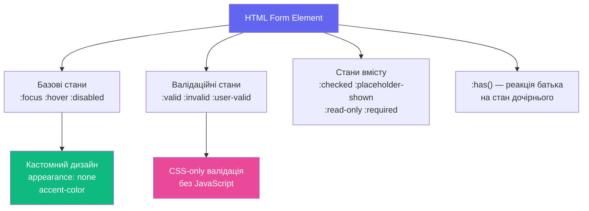

# CSS для форм та інтерактивних станів

## Форми — найстресовіша частина верстки

«Зробіть форму гарною» — це речення, яке розробники та дизайнери трактують діаметрально протилежно. Дизайнер бачить чисті, мінімалістичні поля з плавними переходами. Розробник знає правду: браузери мають глибоко вкорінені стилі форм, які **активно опираються** CSS. Checkbox на macOS виглядає інакше, ніж на Windows. `<select>` майже неможливо стилізувати. `<input type="range">` — окремий кошмар.

До 2021 року єдиним шляхом була повна заміна нативних елементів на `div`-обгортки з JavaScript. Тепер CSS надає справжні нативні інструменти: `accent-color`, `appearance`, `field-sizing`, псевдокласи `:user-valid`/`:user-invalid`, потужний `:has()` для реактивних форм.

Розберемо все по порядку — від базових станів до просунутих патернів.

::mermaid



::

---

## Скидання стилів браузера: `appearance` і `accent-color`

### `appearance: none` — чистий аркуш

Кожен браузер має власний **User Agent Stylesheet** — набір дефолтних стилів для всіх HTML-елементів. Для форм ці стилі особливо агресивні та важко перевизначаються. `appearance: none` каже браузеру: «анулюй всі свої нативні стилі для цього елемента».

```css
/* Скидання для кнопок */
button {
  appearance: none;
  border: none;
  background: none;
  cursor: pointer;
  font: inherit;
}

/* Скидання для inputs */
input, textarea, select {
  appearance: none;
  border: none;
  outline: none; /* потім додамо власний outline! */
  font: inherit;
}
```

::warning
Після `appearance: none` не забудьте додати **власний** `:focus-visible` стиль. Видалення дефолтного outline без заміни — порушення доступності. Людям, що навігують клавіатурою, потрібен видимий індикатор фокусу.
::

### `accent-color` — найпростіший спосіб стилізувати форми

`accent-color` — однорядкова властивість, яка змінює колір нативних форм-елементів: `checkbox`, `radio`, `range`, `progress`. Не ідеально, але буквально одна рядок замінює сотні рядків CSS з `appearance: none`.

::html-preview
```html
<div class="accent-demo">
  <p class="accent-title">accent-color: #6366f1 — одна властивість для всіх</p>
  <div class="accent-grid">
    <label class="accent-item">
      <input type="checkbox" checked> Checkbox checked
    </label>
    <label class="accent-item">
      <input type="checkbox"> Checkbox unchecked
    </label>
    <label class="accent-item">
      <input type="radio" name="r1" checked> Radio checked
    </label>
    <label class="accent-item">
      <input type="radio" name="r1"> Radio unchecked
    </label>
    <label class="accent-item accent-item--full">
      <span>Range slider</span>
      <input type="range" value="65">
    </label>
    <label class="accent-item accent-item--full">
      <span>Progress</span>
      <progress value="65" max="100"></progress>
    </label>
  </div>
  <div class="accent-compare">
    <div class="accent-block a1">
      <p>accent-color: #6366f1</p>
      <input type="checkbox" checked>
      <input type="radio" checked name="r2">
      <input type="range" value="50">
    </div>
    <div class="accent-block a2">
      <p>accent-color: #10b981</p>
      <input type="checkbox" checked>
      <input type="radio" checked name="r3">
      <input type="range" value="50">
    </div>
    <div class="accent-block a3">
      <p>accent-color: #ec4899</p>
      <input type="checkbox" checked>
      <input type="radio" checked name="r4">
      <input type="range" value="50">
    </div>
  </div>
</div>
```
```css
.accent-demo {
  padding: 1rem;
  background: #f8fafc;
  font-family: system-ui, sans-serif;
  font-size: 0.875rem;
  color: #1e293b;
  accent-color: #6366f1;
  display: flex;
  flex-direction: column;
  gap: 0.75rem;
}
.accent-title { margin: 0; font-weight: 700; color: #64748b; }
.accent-grid {
  display: grid;
  grid-template-columns: 1fr 1fr;
  gap: 0.5rem;
}
.accent-item {
  display: flex;
  align-items: center;
  gap: 0.5rem;
  background: white;
  border-radius: 6px;
  padding: 0.5rem 0.75rem;
  border: 1px solid #e2e8f0;
  cursor: pointer;
}
.accent-item input { width: 1rem; height: 1rem; }
.accent-item--full { grid-column: 1 / -1; flex-direction: column; align-items: flex-start; gap: 0.25rem; }
.accent-item--full input, .accent-item--full progress { width: 100%; }

.accent-compare { display: flex; gap: 0.5rem; flex-wrap: wrap; }
.accent-block {
  flex: 1;
  min-width: 100px;
  background: white;
  border-radius: 8px;
  border: 1px solid #e2e8f0;
  padding: 0.6rem;
  display: flex;
  flex-direction: column;
  gap: 0.4rem;
  align-items: flex-start;
}
.accent-block p { margin: 0; font-size: 0.72rem; color: #64748b; font-weight: 700; }
.accent-block input { width: 100%; }
.a1 { accent-color: #6366f1; }
.a2 { accent-color: #10b981; }
.a3 { accent-color: #ec4899; }
```
::

---

## Псевдокласи стану форм

CSS надає багатий набір псевдокласів, що реагують на **стан** форм-елементів без жодного JavaScript.

### Базові стани: `:focus`, `:focus-visible`, `:focus-within`

| Псевдоклас | Коли активний |
|------------|---------------|
| `:focus` | Будь-який фокус (клавіатура і миша) |
| `:focus-visible` | Лише коли фокус «видимий» (зазвичай — тільки клавіатура) |
| `:focus-within` | Якщо **будь-який нащадок** має фокус |

`:focus-visible` — ключовий для доступності: він показує outline при навігації клавіатурою, але не при кліку мишею (що часто дратує).

::html-preview
```html
<div class="focus-demo">
  <p class="fd-label">Спробуйте Tab та клік мишею — побачите різницю:</p>
  <div class="focus-grid">
    <div class="focus-field">
      <label>:focus (завжди)</label>
      <input class="fi-always" type="text" placeholder="Клік або Tab...">
    </div>
    <div class="focus-field">
      <label>:focus-visible (тільки Tab)</label>
      <input class="fi-visible" type="text" placeholder="Клік або Tab...">
    </div>
    <div class="focus-field focus-within-demo">
      <label>Контейнер з :focus-within</label>
      <input type="text" placeholder="Клацніть сюди...">
    </div>
  </div>
</div>
```
```css
.focus-demo {
  padding: 1rem;
  background: #f8fafc;
  font-family: system-ui, sans-serif;
  font-size: 0.85rem;
  color: #1e293b;
}
.fd-label { margin: 0 0 0.75rem; color: #64748b; font-style: italic; }
.focus-grid { display: flex; flex-direction: column; gap: 0.6rem; }
.focus-field {
  display: flex;
  flex-direction: column;
  gap: 0.3rem;
}
.focus-field label { font-size: 0.78rem; font-weight: 600; color: #374151; }
.focus-field input {
  padding: 0.5rem 0.75rem;
  border: 1.5px solid #d1d5db;
  border-radius: 7px;
  font-size: 0.9rem;
  font-family: inherit;
  background: white;
  color: #1e293b;
  outline: none;
  transition: border-color 0.15s, box-shadow 0.15s;
}

/* :focus — спрацьовує ЗАВЖДИ */
.fi-always:focus {
  border-color: #6366f1;
  box-shadow: 0 0 0 3px rgba(99, 102, 241, 0.2);
}

/* :focus-visible — тільки при навігації клавіатурою */
.fi-visible:focus-visible {
  border-color: #10b981;
  box-shadow: 0 0 0 3px rgba(16, 185, 129, 0.2);
}
/* .fi-visible:focus залишається без кастомного стилю — чистий клік */

/* :focus-within на контейнері */
.focus-within-demo {
  background: white;
  border: 1.5px solid #e2e8f0;
  border-radius: 8px;
  padding: 0.6rem 0.75rem;
  transition: border-color 0.15s, background 0.15s;
}
.focus-within-demo:focus-within {
  border-color: #ec4899;
  background: #fdf2f8;
}
.focus-within-demo:focus-within label {
  color: #ec4899;
}
.focus-within-demo label { transition: color 0.15s; }
.focus-within-demo input {
  border: none;
  padding: 0.25rem 0;
  background: transparent;
  width: 100%;
}
```
::

### Стани вмісту: `:checked`, `:placeholder-shown`, `:read-only`

::html-preview
```html
<div class="state-demo">
  <div class="state-row">
    <label class="toggle-label">
      <input type="checkbox" class="toggle-cb">
      <span class="toggle-track"><span class="toggle-thumb"></span></span>
      <span class="toggle-text">Сповіщення</span>
    </label>
  </div>
  <div class="state-row">
    <div class="placeholder-field">
      <input type="text" placeholder="Введіть щось..." class="ph-input">
      <label class="ph-label">Ваше ім'я</label>
    </div>
  </div>
  <div class="state-row">
    <input class="ro-input" type="text" value="Тільки для читання" readonly>
    <input class="rw-input" type="text" value="Можна редагувати">
  </div>
</div>
```
```css
.state-demo {
  padding: 1rem;
  background: #f8fafc;
  font-family: system-ui, sans-serif;
  font-size: 0.875rem;
  color: #1e293b;
  display: flex;
  flex-direction: column;
  gap: 0.75rem;
}
.state-row { display: flex; flex-direction: column; gap: 0.4rem; }

/* Toggle switch через :checked */
.toggle-label { display: flex; align-items: center; gap: 0.75rem; cursor: pointer; }
.toggle-cb { display: none; }
.toggle-track {
  width: 44px; height: 24px;
  background: #d1d5db;
  border-radius: 100px;
  position: relative;
  transition: background 0.25s;
  flex-shrink: 0;
}
.toggle-thumb {
  position: absolute;
  top: 3px; left: 3px;
  width: 18px; height: 18px;
  border-radius: 50%;
  background: white;
  box-shadow: 0 1px 3px rgba(0,0,0,0.2);
  transition: transform 0.25s;
}
.toggle-cb:checked + .toggle-track {
  background: #6366f1;
}
.toggle-cb:checked + .toggle-track .toggle-thumb {
  transform: translateX(20px);
}
.toggle-text { font-size: 0.9rem; color: #374151; }

/* Floating label через :placeholder-shown */
.placeholder-field { position: relative; }
.ph-input {
  width: 100%;
  padding: 1.25rem 0.75rem 0.4rem;
  border: 1.5px solid #d1d5db;
  border-radius: 8px;
  font-size: 0.9rem;
  font-family: inherit;
  outline: none;
  background: white;
  box-sizing: border-box;
  transition: border-color 0.15s;
}
.ph-input::placeholder { color: transparent; }
.ph-label {
  position: absolute;
  left: 0.75rem;
  top: 0.75rem;
  font-size: 0.9rem;
  color: #9ca3af;
  pointer-events: none;
  transition: all 0.15s ease;
  transform-origin: left top;
}
/* Коли поле порожнє — label великий (placeholder видно) */
.ph-input:placeholder-shown + .ph-label {
  top: 0.75rem;
  font-size: 0.9rem;
  color: #9ca3af;
}
/* Коли є текст або фокус — label маленький вгорі */
.ph-input:not(:placeholder-shown) + .ph-label,
.ph-input:focus + .ph-label {
  top: 0.3rem;
  font-size: 0.68rem;
  color: #6366f1;
  font-weight: 600;
}
.ph-input:focus { border-color: #6366f1; }

/* :read-only vs :read-write */
.ro-input, .rw-input {
  padding: 0.5rem 0.75rem;
  border: 1.5px solid;
  border-radius: 6px;
  font-size: 0.875rem;
  font-family: inherit;
  outline: none;
  width: 100%;
  box-sizing: border-box;
}
.ro-input {
  border-color: #e2e8f0;
  background: #f8fafc;
  color: #94a3b8;
  cursor: not-allowed;
}
.ro-input:read-only { background: #f1f5f9; }
.rw-input {
  border-color: #d1d5db;
  background: white;
  color: #1e293b;
}
.rw-input:read-write:focus { border-color: #6366f1; }
```
::

### Валідаційні псевдокласи: `:valid`, `:invalid`, `:user-valid`, `:user-invalid`

Ключова різниця: `:invalid` спрацьовує **одразу** при завантаженні сторінки, навіть до того, як користувач щось ввів. `:user-invalid` — лише після першої взаємодії. Це critical UX-деталь.

::html-preview
```html
<form class="validation-demo" novalidate>
  <div class="vd-row">
    <label>:invalid (моментально після завантаження)</label>
    <input class="vd-invalid-always" type="email" required placeholder="email@example.com">
    <span class="vd-msg vd-msg--err">Невалідний email</span>
    <span class="vd-msg vd-msg--ok">✓ Валідний email</span>
  </div>
  <div class="vd-row">
    <label>:user-invalid (тільки після взаємодії)</label>
    <input class="vd-user-invalid" type="email" required placeholder="email@example.com">
    <span class="vd-msg vd-msg--err">Введіть правильний email</span>
    <span class="vd-msg vd-msg--ok">✓ Чудово!</span>
  </div>
  <div class="vd-row">
    <label>:in-range / :out-of-range (число від 1 до 10)</label>
    <input class="vd-range-input" type="number" min="1" max="10" value="5">
    <span class="vd-msg vd-msg--err">Поза діапазоном 1–10</span>
    <span class="vd-msg vd-msg--ok">✓ В межах діапазону</span>
  </div>
</form>
```
```css
.validation-demo {
  padding: 1rem;
  background: #f8fafc;
  font-family: system-ui, sans-serif;
  font-size: 0.875rem;
  color: #1e293b;
  display: flex;
  flex-direction: column;
  gap: 0.75rem;
}
.vd-row {
  display: flex;
  flex-direction: column;
  gap: 0.25rem;
}
.vd-row label { font-size: 0.78rem; font-weight: 600; color: #374151; }

.vd-invalid-always,
.vd-user-invalid,
.vd-range-input {
  padding: 0.5rem 0.75rem;
  border: 1.5px solid #d1d5db;
  border-radius: 7px;
  font-size: 0.9rem;
  font-family: inherit;
  outline: none;
  background: white;
  transition: border-color 0.15s, background 0.15s;
}

.vd-msg { font-size: 0.75rem; display: none; }
.vd-msg--err { color: #ef4444; }
.vd-msg--ok  { color: #10b981; }

/* :invalid — одразу, незалежно від взаємодії */
.vd-invalid-always:invalid {
  border-color: #ef4444;
  background: #fff5f5;
}
.vd-invalid-always:invalid ~ .vd-msg--err { display: block; }
.vd-invalid-always:valid { border-color: #10b981; background: #f0fdf4; }
.vd-invalid-always:valid ~ .vd-msg--ok   { display: block; }

/* :user-invalid — тільки після взаємодії */
.vd-user-invalid:user-invalid {
  border-color: #ef4444;
  background: #fff5f5;
}
.vd-user-invalid:user-invalid ~ .vd-msg--err { display: block; }
.vd-user-invalid:user-valid { border-color: #10b981; background: #f0fdf4; }
.vd-user-valid:user-valid ~ .vd-msg--ok { display: block; }

/* :in-range / :out-of-range */
.vd-range-input:in-range { border-color: #10b981; background: #f0fdf4; }
.vd-range-input:in-range ~ .vd-msg--ok  { display: block; }
.vd-range-input:out-of-range { border-color: #ef4444; background: #fff5f5; }
.vd-range-input:out-of-range ~ .vd-msg--err { display: block; }
```
::

---

## `:has()` для розумних форм

`:has()` відкриває нову еру реактивних форм без JavaScript. Батьківський елемент може реагувати на **стан** дочірнього.

::html-preview
```html
<form class="has-form">
  <div class="hf-group">
    <label class="hf-label">Email</label>
    <input type="email" required placeholder="your@email.com" class="hf-input">
  </div>
  <div class="hf-group">
    <label class="hf-label">Пароль</label>
    <input type="password" minlength="8" required placeholder="Мінімум 8 символів" class="hf-input">
  </div>
  <div class="hf-group">
    <label class="hf-label">
      <input type="checkbox" required class="hf-cb">
      Я погоджуюся з умовами
    </label>
  </div>
  <button type="submit" class="hf-submit">Зареєструватися</button>
</form>
```
```css
.has-form {
  padding: 1.25rem;
  background: white;
  border-radius: 12px;
  border: 1.5px solid #e2e8f0;
  font-family: system-ui, sans-serif;
  font-size: 0.875rem;
  color: #1e293b;
  display: flex;
  flex-direction: column;
  gap: 0.75rem;
  max-width: 360px;
  margin: 0 auto;

  /* Форма підсвічується червоним якщо є :user-invalid поля */
  &:has(input:user-invalid) {
    border-color: #fca5a5;
    background: #fff8f8;
  }

  /* Форма стає зеленою коли всі поля валідні */
  &:has(input:valid):not(:has(input:invalid)) {
    border-color: #86efac;
    background: #f0fdf4;
  }
}

.hf-group { display: flex; flex-direction: column; gap: 0.3rem; }

.hf-label {
  font-size: 0.8rem;
  font-weight: 600;
  color: #374151;
  display: flex;
  align-items: center;
  gap: 0.5rem;
  transition: color 0.15s;

  /* Label підсвічується коли вкладений input у фокусі */
  &:has(input:focus),
  &:has(+ .hf-input:focus) {
    color: #6366f1;
  }
}

.hf-input {
  padding: 0.5rem 0.75rem;
  border: 1.5px solid #d1d5db;
  border-radius: 7px;
  font-size: 0.875rem;
  font-family: inherit;
  outline: none;
  background: white;
  transition: all 0.15s;

  &:focus { border-color: #6366f1; box-shadow: 0 0 0 3px rgba(99,102,241,0.15); }
  &:user-valid   { border-color: #10b981; background: #f0fdf4; }
  &:user-invalid { border-color: #ef4444; background: #fff5f5; }
}

.hf-cb { accent-color: #6366f1; width: 1rem; height: 1rem; }

.hf-submit {
  padding: 0.6rem;
  background: #6366f1;
  color: white;
  border: none;
  border-radius: 8px;
  font-size: 0.9rem;
  font-weight: 600;
  cursor: pointer;
  font-family: inherit;
  transition: all 0.15s;
  margin-top: 0.25rem;

  &:hover { background: #4f46e5; }
}
```
::

---

## Кастомний Checkbox та Radio

`appearance: none` + `::before`/`::after` + `:checked` — класична техніка для повністю кастомних форм-елементів.

::html-preview
```html
<div class="custom-inputs-demo">
  <p class="cid-title">Кастомні Checkbox та Radio без бібліотек</p>
  <div class="cid-grid">
    <fieldset class="cid-group">
      <legend>Checkbox варіанти</legend>
      <label class="custom-cb-label">
        <input type="checkbox" class="custom-cb" checked>
        <span class="custom-cb-box"></span>
        Стандартний стиль
      </label>
      <label class="custom-cb-label style-2">
        <input type="checkbox" class="custom-cb">
        <span class="custom-cb-box"></span>
        Округлий
      </label>
      <label class="custom-cb-label style-3">
        <input type="checkbox" class="custom-cb" checked>
        <span class="custom-cb-box"></span>
        Filled style
      </label>
    </fieldset>
    <fieldset class="cid-group">
      <legend>Radio варіанти</legend>
      <label class="custom-radio-label">
        <input type="radio" name="demo" class="custom-radio" checked>
        <span class="custom-radio-dot"></span>
        Опція A
      </label>
      <label class="custom-radio-label">
        <input type="radio" name="demo" class="custom-radio">
        <span class="custom-radio-dot"></span>
        Опція B
      </label>
      <label class="custom-radio-label">
        <input type="radio" name="demo" class="custom-radio">
        <span class="custom-radio-dot"></span>
        Опція C
      </label>
    </fieldset>
  </div>
  <div class="card-radio-group">
    <p class="crd-label">Card-style radio:</p>
    <div class="card-radios">
      <label class="card-radio">
        <input type="radio" name="plan" checked>
        <div class="cr-content">
          <span class="cr-icon">🌱</span>
          <strong>Free</strong>
          <span>$0/mo</span>
        </div>
      </label>
      <label class="card-radio">
        <input type="radio" name="plan">
        <div class="cr-content">
          <span class="cr-icon">⚡</span>
          <strong>Pro</strong>
          <span>$12/mo</span>
        </div>
      </label>
      <label class="card-radio">
        <input type="radio" name="plan">
        <div class="cr-content">
          <span class="cr-icon">🚀</span>
          <strong>Team</strong>
          <span>$49/mo</span>
        </div>
      </label>
    </div>
  </div>
</div>
```
```css
.custom-inputs-demo {
  padding: 1rem;
  background: #f8fafc;
  font-family: system-ui, sans-serif;
  font-size: 0.875rem;
  color: #1e293b;
  display: flex;
  flex-direction: column;
  gap: 0.75rem;
}
.cid-title { margin: 0; font-weight: 700; color: #64748b; }
.cid-grid { display: flex; gap: 0.75rem; flex-wrap: wrap; }
.cid-group {
  flex: 1; min-width: 150px;
  border: 1px solid #e2e8f0;
  border-radius: 8px;
  background: white;
  padding: 0.75rem;
  display: flex;
  flex-direction: column;
  gap: 0.5rem;
}
.cid-group legend { font-size: 0.75rem; font-weight: 700; color: #64748b; padding: 0 0.25rem; }

/* Кастомний Checkbox */
.custom-cb-label {
  display: flex;
  align-items: center;
  gap: 0.6rem;
  cursor: pointer;
  font-size: 0.85rem;
  user-select: none;
}
.custom-cb { display: none; }
.custom-cb-box {
  width: 18px;
  height: 18px;
  border: 2px solid #d1d5db;
  border-radius: 4px;
  background: white;
  flex-shrink: 0;
  display: flex;
  align-items: center;
  justify-content: center;
  transition: all 0.15s;
  position: relative;
}
.custom-cb-box::after {
  content: '';
  width: 6px;
  height: 10px;
  border: 2px solid white;
  border-top: none;
  border-left: none;
  transform: rotate(45deg) scale(0);
  transition: transform 0.15s;
  position: absolute;
  top: 1px;
}
.custom-cb:checked + .custom-cb-box {
  background: #6366f1;
  border-color: #6366f1;
}
.custom-cb:checked + .custom-cb-box::after {
  transform: rotate(45deg) scale(1);
}

/* Варіант 2: rounded */
.style-2 .custom-cb-box { border-radius: 50%; }
.style-2 .custom-cb:checked + .custom-cb-box { background: #10b981; border-color: #10b981; }

/* Варіант 3: filled */
.style-3 .custom-cb-box { background: #f1f5f9; border-color: #94a3b8; }
.style-3 .custom-cb:checked + .custom-cb-box { background: #ec4899; border-color: #ec4899; }

/* Кастомний Radio */
.custom-radio-label {
  display: flex;
  align-items: center;
  gap: 0.6rem;
  cursor: pointer;
  font-size: 0.85rem;
  user-select: none;
}
.custom-radio { display: none; }
.custom-radio-dot {
  width: 18px;
  height: 18px;
  border: 2px solid #d1d5db;
  border-radius: 50%;
  background: white;
  flex-shrink: 0;
  display: flex;
  align-items: center;
  justify-content: center;
  transition: all 0.15s;
}
.custom-radio-dot::after {
  content: '';
  width: 8px;
  height: 8px;
  border-radius: 50%;
  background: white;
  transform: scale(0);
  transition: transform 0.15s;
}
.custom-radio:checked + .custom-radio-dot {
  border-color: #6366f1;
  background: #6366f1;
}
.custom-radio:checked + .custom-radio-dot::after {
  transform: scale(1);
}

/* Card-style radio */
.card-radio-group { display: flex; flex-direction: column; gap: 0.4rem; }
.crd-label { margin: 0; font-size: 0.78rem; font-weight: 700; color: #64748b; }
.card-radios { display: flex; gap: 0.5rem; flex-wrap: wrap; }
.card-radio {
  flex: 1;
  min-width: 80px;
  cursor: pointer;
}
.card-radio input { display: none; }
.cr-content {
  display: flex;
  flex-direction: column;
  align-items: center;
  gap: 0.2rem;
  padding: 0.75rem 0.5rem;
  border: 2px solid #e2e8f0;
  border-radius: 8px;
  text-align: center;
  transition: all 0.15s;
  background: white;
}
.cr-content .cr-icon { font-size: 1.2rem; }
.cr-content strong { font-size: 0.85rem; color: #1e293b; }
.cr-content span { font-size: 0.75rem; color: #64748b; }
.card-radio input:checked + .cr-content {
  border-color: #6366f1;
  background: #ede9fe;
  box-shadow: 0 0 0 3px rgba(99,102,241,0.15);
}
.card-radio input:checked + .cr-content strong { color: #6366f1; }
```
::

---

## Кастомний Select

`<select>` — один із найскладніших елементів для стилізації. `appearance: none` прибирає нативну стрілку, дозволяючи додати кастомну через `background-image`.

::html-preview
```html
<div class="select-demo">
  <p class="sd-label">Кастомні select-елементи:</p>
  <div class="selects-row">
    <div class="custom-select-wrap">
      <select class="custom-select cs-primary">
        <option>Оберіть країну</option>
        <option>Україна 🇺🇦</option>
        <option>Польща 🇵🇱</option>
        <option>Німеччина 🇩🇪</option>
      </select>
    </div>
    <div class="custom-select-wrap cs-dark-wrap">
      <select class="custom-select cs-dark">
        <option>Тема оформлення</option>
        <option>Темна 🌙</option>
        <option>Світла ☀️</option>
        <option>Авто 💻</option>
      </select>
    </div>
    <div class="custom-select-wrap">
      <select class="custom-select cs-outlined" multiple size="3">
        <option>React</option>
        <option>Vue</option>
        <option selected>Svelte</option>
        <option>Angular</option>
      </select>
    </div>
  </div>
</div>
```
```css
.select-demo {
  padding: 1rem;
  background: #f8fafc;
  font-family: system-ui, sans-serif;
  font-size: 0.875rem;
  color: #1e293b;
}
.sd-label { margin: 0 0 0.75rem; font-weight: 700; color: #64748b; }
.selects-row { display: flex; gap: 0.75rem; flex-wrap: wrap; align-items: flex-start; }

.custom-select-wrap { position: relative; flex: 1; min-width: 140px; }

/* Кастомна стрілка через ::after на обгортці */
.custom-select-wrap:not(:has(select[multiple]))::after {
  content: '';
  position: absolute;
  right: 0.75rem;
  top: 50%;
  transform: translateY(-50%);
  width: 0;
  height: 0;
  border-left: 5px solid transparent;
  border-right: 5px solid transparent;
  border-top: 6px solid currentColor;
  pointer-events: none;
}

.custom-select {
  appearance: none;
  width: 100%;
  padding: 0.55rem 2.5rem 0.55rem 0.75rem;
  border: 1.5px solid #d1d5db;
  border-radius: 7px;
  font-size: 0.875rem;
  font-family: inherit;
  background: white;
  color: #1e293b;
  cursor: pointer;
  outline: none;
  transition: border-color 0.15s, box-shadow 0.15s;

  &:focus { border-color: #6366f1; box-shadow: 0 0 0 3px rgba(99,102,241,0.15); }
}

.cs-dark-wrap::after { color: #e2e8f0; }
.cs-dark {
  background: #1e293b;
  color: #e2e8f0;
  border-color: #334155;

  &:focus { border-color: #6366f1; }
}

.cs-outlined {
  padding: 0.5rem;

  & option { padding: 0.3rem 0.5rem; border-radius: 4px; }
  & option:checked { background: #6366f1; color: white; }
}
```
::

---

## Floating Label патерн (CSS-only)

Floating Label — поле введення, де заповнювач «зависає» над полем при введенні тексту. Класичний патерн Material Design, реалізований **лише на CSS** через `:placeholder-shown` та `:not(:placeholder-shown)`.

::html-preview
```html
<form class="floating-form">
  <h3 class="ff-title">Форма входу</h3>
  <div class="ff-field">
    <input id="ff-email" type="email" class="ff-input" placeholder=" " autocomplete="email">
    <label for="ff-email" class="ff-label">Email адреса</label>
  </div>
  <div class="ff-field">
    <input id="ff-pass" type="password" class="ff-input" placeholder=" " autocomplete="current-password">
    <label for="ff-pass" class="ff-label">Пароль</label>
  </div>
  <div class="ff-field">
    <textarea id="ff-bio" class="ff-input ff-textarea" placeholder=" " rows="3"></textarea>
    <label for="ff-bio" class="ff-label">Про себе</label>
  </div>
  <button class="ff-btn" type="button">Увійти</button>
</form>
```
```css
.floating-form {
  padding: 1.5rem;
  background: white;
  border-radius: 14px;
  border: 1px solid #e2e8f0;
  box-shadow: 0 4px 24px rgba(0,0,0,0.06);
  font-family: system-ui, sans-serif;
  max-width: 360px;
  margin: 0 auto;
  display: flex;
  flex-direction: column;
  gap: 0.75rem;
}
.ff-title { margin: 0 0 0.25rem; font-size: 1.25rem; color: #1e293b; }

.ff-field {
  position: relative;
}

.ff-input {
  appearance: none;
  width: 100%;
  padding: 1.35rem 0.85rem 0.45rem;
  border: 1.5px solid #d1d5db;
  border-radius: 8px;
  font-size: 0.925rem;
  font-family: inherit;
  color: #1e293b;
  background: white;
  outline: none;
  box-sizing: border-box;
  transition: border-color 0.15s, box-shadow 0.15s;
  resize: vertical;
}

.ff-input:focus {
  border-color: #6366f1;
  box-shadow: 0 0 0 3px rgba(99,102,241,0.12);
}

.ff-input:user-invalid {
  border-color: #ef4444;
  box-shadow: 0 0 0 3px rgba(239,68,68,0.12);
}

.ff-label {
  position: absolute;
  left: 0.85rem;
  top: 0.85rem;
  font-size: 0.925rem;
  color: #9ca3af;
  pointer-events: none;
  transition: all 0.2s cubic-bezier(0.4, 0, 0.2, 1);
  background: white;
  padding: 0 0.15rem;
  transform-origin: left top;
}

/* Коли поле НЕ пусте або у фокусі — label летить вгору */
.ff-input:not(:placeholder-shown) + .ff-label,
.ff-input:focus + .ff-label {
  top: 0.3rem;
  font-size: 0.7rem;
  color: #6366f1;
  font-weight: 600;
}

.ff-input:user-invalid + .ff-label {
  color: #ef4444;
}

.ff-textarea { min-height: 80px; }

.ff-btn {
  padding: 0.75rem;
  background: linear-gradient(135deg, #6366f1, #8b5cf6);
  color: white;
  border: none;
  border-radius: 8px;
  font-size: 0.925rem;
  font-weight: 600;
  font-family: inherit;
  cursor: pointer;
  transition: opacity 0.15s, transform 0.15s;
  margin-top: 0.25rem;

  &:hover { opacity: 0.9; transform: translateY(-1px); }
  &:active { transform: translateY(0); }
}
```
::

---

## Кастомний Range Slider

::html-preview
```html
<div class="range-demo">
  <p class="rd-title">Кастомні range sliders</p>
  <div class="range-group">
    <label class="range-label">Гучність: <span id="vol-val">65</span>%</label>
    <input type="range" class="custom-range cr-purple" min="0" max="100" value="65"
      oninput="document.getElementById('vol-val').textContent=this.value">
  </div>
  <div class="range-group">
    <label class="range-label">Яскравість: <span id="bright-val">40</span>%</label>
    <input type="range" class="custom-range cr-green" min="0" max="100" value="40"
      oninput="document.getElementById('bright-val').textContent=this.value">
  </div>
  <div class="range-group">
    <label class="range-label">Температура: <span id="temp-val">22</span>°C</label>
    <input type="range" class="custom-range cr-warm" min="16" max="30" value="22"
      oninput="document.getElementById('temp-val').textContent=this.value">
  </div>
</div>
```
```css
.range-demo {
  padding: 1rem;
  background: #f8fafc;
  font-family: system-ui, sans-serif;
  font-size: 0.875rem;
  color: #1e293b;
  display: flex;
  flex-direction: column;
  gap: 0.75rem;
}
.rd-title { margin: 0; font-weight: 700; color: #64748b; }
.range-group { display: flex; flex-direction: column; gap: 0.3rem; }
.range-label { font-size: 0.8rem; font-weight: 600; color: #374151; }

.custom-range {
  appearance: none;
  width: 100%;
  height: 6px;
  border-radius: 100px;
  outline: none;
  cursor: pointer;
}

/* Track */
.cr-purple {
  background: linear-gradient(to right, #6366f1 var(--val, 65%), #e2e8f0 var(--val, 65%));
  accent-color: #6366f1;
}
.cr-green {
  background: linear-gradient(to right, #10b981 var(--val, 40%), #e2e8f0 var(--val, 40%));
  accent-color: #10b981;
}
.cr-warm {
  background: linear-gradient(to right, #f59e0b var(--val, 40%), #e2e8f0 var(--val, 40%));
  accent-color: #f59e0b;
}

/* Thumb — WebKit */
.custom-range::-webkit-slider-thumb {
  appearance: none;
  width: 18px;
  height: 18px;
  border-radius: 50%;
  background: white;
  border: 2px solid #6366f1;
  box-shadow: 0 1px 4px rgba(0,0,0,0.15);
  transition: transform 0.15s, box-shadow 0.15s;
  cursor: grab;
}
.cr-green::-webkit-slider-thumb { border-color: #10b981; }
.cr-warm::-webkit-slider-thumb  { border-color: #f59e0b; }

.custom-range::-webkit-slider-thumb:active { cursor: grabbing; transform: scale(1.2); }

/* Thumb — Firefox */
.custom-range::-moz-range-thumb {
  width: 18px;
  height: 18px;
  border-radius: 50%;
  background: white;
  border: 2px solid #6366f1;
  box-shadow: 0 1px 4px rgba(0,0,0,0.15);
  cursor: grab;
}
```
::

---

## Практика

::steps

### Рівень 1 — Базовий: стилізація стану форм

Надано HTML форми реєстрації. Додайте CSS, що:
- Підсвічує поля зеленим при `:user-valid` та червоним при `:user-invalid`
- Показує `✓` та `✗` іконки через `::after` на обгортці поля залежно від стану
- Прибирає нативний `outline` та додає власний `box-shadow` при `:focus-visible`

### Рівень 2 — Логіка/Інтерактивність: реактивна форма через :has()

Реалізуйте форму замовлення із smart-поведінкою лише на CSS:
- Якщо вибрано `<input type="radio" value="delivery">` — показати блок з адресою доставки (`:has(:checked[value="delivery"])`)
- Якщо всі обов'язкові поля валідні — кнопка «Оформити» стає яскравою (`:has(input:required:valid)`)
- Label підсвічується рожевим при `:user-invalid` вкладеного input

### Рівень 3 — Архітектура: Design System форм

Створіть повну систему стилів форм:
1. **Токени**: `--input-border`, `--input-focus-ring`, `--input-error`, `--input-success` через CSS Custom Properties
2. **Компонент `.field`**: floating label + error message + success state через Nesting
3. **Варіанти**: `--outlined` (border), `--filled` (background), `--underlined` (лише нижній border)
4. **Теми**: dark mode через `@media (prefers-color-scheme: dark)` що перевизначає токени
5. Весь CSS — через `@layer components` + `@property` для анімованих токенів

::

---

## Підсумок

::card-group

::card{title="🎨 accent-color" icon="i-lucide-palette"}

Одна властивість для нативного кольору checkbox, radio, range, progress. Мінімум CSS — максимум результату.

::

::card{title="👁️ :focus-visible" icon="i-lucide-eye"}

Показує outline лише при навігації клавіатурою. Використовуйте замість `:focus` для кращого UX та доступності.

::

::card{title="✅ :user-valid / :user-invalid" icon="i-lucide-check-circle"}

Валідація лише після взаємодії — без стресу від червоних полів одразу при завантаженні. Chrome 119+, Safari 16.5+, FF 88+.

::

::card{title="🧠 :has() для форм" icon="i-lucide-brain"}

`:has(input:focus)` на label, `:has(:checked)` для умовного показу блоків, `:has(:user-invalid)` для підсвітки всієї форми — без JavaScript.

::

::card{title="🔘 appearance: none" icon="i-lucide-sliders"}

Скидає нативні стилі. Відправна точка для кастомних checkbox, radio, select. Завжди додавайте `:focus-visible` після скидання!

::

::card{title="🏷️ Floating Label" icon="i-lucide-tag"}

`:placeholder-shown` + `:not(:placeholder-shown)` — чистий CSS-патерн без JavaScript. Placeholder повинен бути пробілом `" "` для коректної роботи.

::

::
